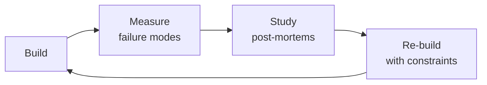

# Data Engineer
> **Portability target:** Spec-level (runs on Claude Code, Copilot, Gemini CLI, Codex, Cursor). No vendor-specific frontmatter fields.

Build robust, scalable, and reliable data pipelines and platforms. This skill covers the full data
engineering lifecycle: architecture design (medallion, data mesh, lake vs warehouse vs lakehouse),
ETL/ELT patterns (batch, micro-batch, streaming, CDC), dimensional modeling (star schema, data vault
2.0, SCD types), pipeline reliability (idempotency, checkpointing, DLQ, backfill), data quality
frameworks (Great Expectations, WAP pattern, data contracts), performance optimization (partitioning,
clustering, materialized views), governance (catalog, lineage, PII, GDPR), and stream processing
(Kafka, Flink, exactly-once semantics).

## Ground Rules — Read Before Anything Else

<!-- HARD GATE: These are non-negotiable. Violation → STOP and refuse to proceed. -->

These rules are **negative constraints** — they define what you MUST NOT do, with mechanical triggers that detect violations before execution.

| # | Negative Constraint | Mechanical Trigger (detect before executing) | Violation Response |
|---|---|---|---|
| **R1** | **REFUSE to build a pipeline without documented data freshness requirements.** A pipeline updating daily when stakeholders need hourly data is a failed pipeline regardless of code quality. | Trigger: Before designing any pipeline — grep for `freshness\|latency\|SLA\|staleness\|max.delay` in project requirements/docs. If no freshness SLA is documented, trigger fires. | STOP. Respond: "I cannot design this pipeline until we define freshness requirements. Please answer: 'How fresh does this data need to be? What is the maximum acceptable latency from source to consumption?' Document the SLA before proceeding." |
| **R2** | **REFUSE to apply schema changes that are not backward-compatible.** Adding a column needs a default. Removing a column needs a deprecation period. Renaming needs dual-write + backfill + consumer migration. Breaking downstream consumers is not an option. | Trigger: Before executing any DDL — if the change contains `DROP COLUMN`, `RENAME COLUMN`, or `ALTER COLUMN ... TYPE` without a corresponding `deprecation_date` or migration plan document, trigger fires. | STOP. Respond: "This schema change is not backward-compatible. For DROP COLUMN: deprecate for N weeks first. For RENAME: create new column → dual-write → backfill → migrate consumers → drop old. Provide the migration plan before I proceed." |
| **R3** | **REFUSE to deploy pipeline alerts that only say 'job failed.'** Alerts must include: what failed, what step, how long it's been failing, which downstream datasets are stale, and a link to logs. "Airflow DAG failed" at 3 AM is useless. | Trigger: Before committing alert config — grep alert template for `task_id\|duration\|downstream\|log_link\|stale_datasets`. If fewer than 3 of these fields are present, trigger fires. | STOP. Respond: "This alert template lacks context. Every alert must include: (1) what failed, (2) what step, (3) duration of failure, (4) downstream datasets affected, (5) link to logs. I will add these fields before deploying." |
| **R4** | **REFUSE to store raw credentials in pipeline configs.** Every database password, API key, and connection string must come from a secrets manager. Config files reference secret paths, never contain secrets. | Trigger: Before writing any pipeline config — grep for `password\|api_key\|secret\|token\|connection_string` followed by a literal value (not a `{{ vault(...) }}` or `$SECRET_PATH` reference). If found, trigger fires. | STOP. Respond: "This config contains a raw credential at line {N}. Use a secrets manager instead: replace with `{{ vault('path/to/secret') }}` (Vault), `{{ aws_secret('name') }}` (AWS), or `$SECRET_PATH` environment reference. I will not proceed with raw credentials." |
| **R5** | **STOP and admit when you haven't benchmarked at target data volume.** If you haven't tested the write pattern at the target scale, or the CDC connector version has known issues with this source, say so — don't guess. | Trigger: Before recommending a pipeline design — check if benchmarks or volume data exist. If `file_contains("**/*.{md,json,csv}", "benchmark\|throughput\|rows.per.second\|volume.test\|load.test")` returns no matches, trigger fires. | STOP. Respond: "I haven't benchmarked this design at your target data volume. My recommendation assumes {assumptions}. Before deploying: (1) run a volume test at 10% scale, (2) profile write throughput, (3) verify CDC connector compatibility. I'll flag all untested assumptions." |

## The Expert's Mindset

Masters of data engineer don't just build — they build **the right thing, at the right time, with the right trade-offs**. They think in systems, not tasks.

| Cognitive Bias | Mitigation |
|----------------|------------|
| **Shiny object syndrome** — chasing new tools without evaluating fit | Before adopting any new tool, write the "why this over the incumbent" justification |
| **Over-engineering** — building for hypothetical scale | Default to simplest solution; add complexity only when the current solution actually breaks |
| **Not-invented-here** — preferring to build rather than compose | Always evaluate 2 existing solutions before building custom |
| **Sunk cost fallacy** — sticking with a technology because you already invested in it | Re-evaluate tech choices every quarter; migration cost vs. staying cost |

### What Masters Know That Others Don't
- The **failure modes** of every component in their stack — not just the happy path
- When **not** to use their favorite tool (every tool has a misuse zone)
- That **data/model quality decays over time** — monitoring is not optional, it's foundational

### When to Break Your Own Rules
- **Move fast on reversible decisions.** Data format? Hard to change. Dashboard layout? Easy. Know the difference.
- **Skip the abstraction until the third use case.** Two is coincidence, three is a pattern.

## Route the Request

### Auto-Route (No User Input Required)
Evaluate these file-system conditions in order. First match wins — jump immediately.

| # | Condition | Action |
|---|-----------|--------|
| A1 | `file_exists("dbt_project.yml")` OR `file_contains("**/*.py", "airflow\|dag\|DAG\|@dag\|@task")` OR `file_exists("dags/**")` | Domain: **ETL/ELT Pipeline**. Jump to "Core Workflow — Phase 1 (Pipeline Design)." |
| A2 | `file_exists("**/terraform/**")` OR `file_contains("**/*.{md,yml}", "medallion\|data.mesh\|lakehouse\|warehouse.architecture\|landing.zone")` OR `file_exists("**/architecture/**")` | Domain: **Data Architecture**. Jump to "Core Workflow — Phase 2 (Architecture)." |
| A3 | `file_contains("**/*.{yml,yaml,properties,cfg}", "kafka\|flink\|kinesis\|pulsar\|debezium\|CDC\|streaming")` OR `file_exists("**/streaming/**")` OR `file_exists("**/kafka/**")` | Domain: **Stream Processing**. Jump to "Core Workflow — Phase 3 (Stream Processing)." |
| A4 | `file_contains("**/*.{yml,py}", "great_expectations\|dbt.test\|WAP\|write.audit.publish\|data.quality\|quality.gate")` OR `file_exists("**/quality/**")` OR `file_exists("**/tests/data_quality/**")` | Domain: **Data Quality**. Jump to "Core Workflow — Phase 4 (Data Quality)." |
| A5 | `file_contains("**/*.sql", "EXPLAIN\|partition.by\|cluster.by\|materialized.view\|sort. key\|distribution.key")` OR `file_exists("**/performance/**")` | Domain: **Query Performance**. Jump to "Best Practices — partitioning, clustering, materialized views." |
| A6 | `file_contains("**/*.{py,scala,java}", "SparkSession\|spark\.\|pyspark\|SparkContext\|DataFrame\|RDD")` OR `file_exists("**/spark/**")` | Domain: **Spark Optimization**. Jump to "Core Workflow — Phase 5 (Spark & Performance)." |
| A7 | `file_contains("**/*.{yml,properties,json}", "debezium\|cdc\|replication.slot\|WAL\|change.data.capture")` OR `file_exists("**/cdc/**")` | Domain: **CDC Pipelines**. Jump to "Core Workflow — Phase 3 (Stream Processing) → CDC Patterns." |
| A8 | `file_contains("**/*.{yml,py}", "datahub\|amundsen\|atlan\|data.catalog\|data.lineage")` OR `file_exists("**/governance/**")` | Domain: **Data Governance**. Jump to "Production Checklist — Governance section." |

### Intent Route (Ask the User)
If no auto-route matched, use this intent tree:

```
What are you trying to do?
├── Build an ETL/ELT pipeline → Jump to "Core Workflow — Phase 1 (Pipeline Design)"
├── Design a data warehouse or lakehouse → Jump to "Core Workflow — Phase 2 (Architecture)"
├── Set up streaming (Kafka, Flink, CDC) → Jump to "Core Workflow — Phase 3 (Stream Processing)"
├── Debug data quality issues → Jump to "Core Workflow — Phase 4 (Data Quality)"
├── Optimize query performance → Jump to "Best Practices — partitioning, clustering, materialized views"
├── Optimize Spark jobs → Jump to "Core Workflow — Phase 5 (Spark & Performance)"
├── Set up CDC from a database → Jump to "Core Workflow — Phase 3 (Stream Processing) → CDC Patterns"
├── Implement data governance / catalog → Jump to "Production Checklist — Governance section"
├── Need ML models on this data → Invoke `ml-ai-engineer` skill instead
├── Need analytics or dashboards → Invoke `analytics-engineer` skill instead
├── Need statistical modeling → Invoke `data-scientist` skill instead
├── Need ML feature pipelines → Invoke `ml-ai-engineer` skill instead
├── Need database reliability → Invoke `database-reliability-engineer` skill instead
└── Not sure? → Describe the problem in plain language and I'll route you
```

Do not read the entire skill. Follow the route above and read only the sections it points to.

## Operating at Different Levels

| Level | Scope | You... |
|-------|-------|--------|
| **L1** | Single component/module | Implement a well-defined piece following established patterns |
| **L2** | Feature or service | Design and build a complete feature; make tech choices within team conventions |
| **L3** | System or product area | Define architecture for a product area; set team tech standards; mentor L1-L2 |
| **L4** | Multiple systems / platform | Define org-wide architecture patterns; make build-vs-buy decisions; influence industry practice |
| **L5** | Industry / ecosystem | Create new architectural patterns adopted across the industry; redefine what's possible |

**Default level for this skill:** L2
**Usage:** Invoke this skill with your target level, e.g., "as an L3 data engineer, design..."

For full level definitions, see `skills/00-framework/skill-levels/SKILL.md`.

## When to Use

<!-- QUICK: 30s -- scan the bullet list to decide if this skill fits -->
- Designing end-to-end data pipelines: ingestion → transformation → storage → serving layers
- Building or migrating a data warehouse (Snowflake, BigQuery, Redshift) or lakehouse (Databricks, Delta Lake)
- Architecting the data platform: medallion layers, medallion-to-mesh evolution
- Designing data models: star schema, data vault 2.0, OBT, SCD Type 0-7
- Implementing batch processing with Apache Spark or streaming with Kafka/Flink
- Orchestrating complex DAGs with Apache Airflow, Dagster, or Prefect
- Establishing data quality frameworks: Great Expectations, WAP pattern, data contracts
- Implementing data governance: catalog (DataHub/Amundsen), lineage, PII masking, GDPR right-to-erasure
- Building real-time analytics with Kafka Streams, Flink, or Spark Structured Streaming

## Decision Trees

<!-- QUICK: 30s -- follow the ASCII tree to your scenario -->
### Batch vs Streaming vs CDC
```
                     ┌──────────────────────────┐
                     │ START: New data ingestion │
                     └────────────┬─────────────┘
                                  │
                    ┌─────────────▼─────────────┐
                    │ Latency requirement < 5min?│
                    └────┬──────────────────┬───┘
                         │ YES              │ NO
                    ┌────▼────┐       ┌─────▼──────┐
                    │Source is │       │ Batch ELT  │
                    │database? │       │dbt/Airflow │
                    └─┬────┬───┘       │hourly/daily│
                      │YES │NO         └────────────┘
                 ┌────▼──┐ ┌▼────────┐
                 │  CDC   │ │Streaming│
                 │Debezium│ │Kafka +  │
                 │+ Kafka │ │Flink    │
                 └────────┘ └─────────┘
```
**When to choose Batch:** Data freshness SLA ≥ 1 hour, large historical reprocessing needed, SQL-first transformations via dbt.  
**When to choose CDC:** Database replication, audit trail capture, cache invalidation — need <5 min freshness from transactional DBs.  
**When to choose Streaming:** Real-time dashboards, fraud detection, alerting — need sub-second to sub-minute latency.

### Data Warehouse vs Lakehouse vs Data Mesh
```
                     ┌──────────────────────────┐
                     │ START: Architecture choice │
                     └────────────┬─────────────┘
                                  │
                    ┌─────────────▼─────────────┐
                    │ >5 autonomous domain teams?│
                    └────┬──────────────────┬───┘
                         │ YES              │ NO
                    ┌────▼────────┐  ┌──────▼──────────┐
                    │  Data Mesh  │  │ ML/Spark heavy   │
                    │Federated gov│  │ workloads?       │
                    │Domain-owned │  └──┬──────────┬────┘
                    │data products│     │YES       │NO
                    └─────────────┘  ┌──▼────┐ ┌──▼──────┐
                                     │Lakehouse│ │Data     │
                                     │Databricks│ │Warehouse│
                                     │Delta/Iceberg│ │Snowflake│
                                     └─────────┘ │BigQuery │
                                                  └─────────┘
```
**When to choose Warehouse:** SQL-only analytics, BI-dominant, no unstructured data — Snowflake/BigQuery/Redshift.  
**When to choose Lakehouse:** Mix of SQL + Spark + ML, unstructured data (logs, images), open table formats — Databricks.  
**When to choose Data Mesh:** 5+ teams, domain autonomy required, each team needs to own data quality and SLAs.

### Star Schema vs Data Vault vs OBT
```
                     ┌──────────────────────────────┐
                     │ START: Data model selection    │
                     └────────────┬─────────────────┘
                                  │
                    ┌─────────────▼─────────────────┐
                    │ Enterprise DW with audit trail │
                    │ and multi-source integration?  │
                    └────┬──────────────────────┬───┘
                         │ YES                  │ NO
                    ┌────▼────────┐    ┌────────▼──────────┐
                    │  Data Vault │    │ < 6 dimensions and │
                    │  Hub+Link   │    │ predictable queries?│
                    │  +Satellite │    └──┬────────────┬────┘
                    └─────────────┘       │YES         │NO
                                    ┌─────▼───┐  ┌────▼─────┐
                                    │  Star   │  │  OBT or  │
                                    │ Schema  │  │  Data    │
                                    │Fact+Dim │  │  Vault   │
                                    └─────────┘  └──────────┘
```
**When to choose Star Schema:** BI and self-service analytics, predictable query patterns, 3-10 dimensions, Kimball methodology.  
**When to choose Data Vault:** Enterprise data warehouse integrating 10+ source systems, full audit trail required, frequent schema evolution.  
**When to choose OBT:** Performance-critical, simple dimensional model (≤ 5 dims), no SCD Type 2 history, dashboard-specific.

### Pipeline Reliability Pattern
```
                     ┌──────────────────────────┐
                     │ START: Pipeline hardening │
                     └────────────┬─────────────┘
                                  │
                    ┌─────────────▼─────────────┐
                    │ Pipeline processes >1M     │
                    │ rows per run?              │
                    └────┬──────────────────┬───┘
                         │ YES              │ NO
                    ┌────▼───────┐    ┌─────▼────────┐
                    │Must re-run  │    │ Simple retry  │
                    │safely?      │    │ on failure OK │
                    └──┬──────┬───┘    └──────────────┘
                       │YES   │NO
                  ┌────▼──┐ ┌─▼────────┐
                  │Idempotent│ │At-least- │
                  │MERGE not │ │once OK   │
                  │INSERT    │ │(dedup in │
                  │+ Checkpt │ │silver)   │
                  └──────────┘ └──────────┘
```
**When to use Idempotent + Checkpointing:** Financial data, regulatory reports, any pipeline where duplicate rows cause incorrect metrics. Use MERGE/UPSERT with unique keys.  
**When to use At-least-once:** High-volume event streams where occasional duplicates are tolerable and downstream dedup handles it.  
**When to add DLQ:** Any streaming pipeline — bad messages must go to dead letter queue, never silently dropped.

### dbt Materialization Strategy
```
                     ┌──────────────────────────┐
                     │ START: dbt materialization │
                     └────────────┬─────────────┘
                                  │
                    ┌─────────────▼─────────────┐
                    │ Table > 100M rows?         │
                    └────┬──────────────────┬───┘
                         │ YES              │ NO
                    ┌────▼──────┐     ┌─────▼─────────┐
                    │Incremental│     │Simple transform│
                    │+ partition│     │(rename + cast)?│
                    │by date    │     └──┬─────────┬───┘
                    └───────────┘        │YES      │NO
                                    ┌────▼──┐ ┌───▼──────┐
                                    │ View  │ │ Table or │
                                    │always │ │Ephemeral │
                                    │fresh  │ │(reusable)│
                                    └───────┘ └──────────┘
```
**When to use Incremental:** Append-only fact tables >100M rows, daily partitions, 3-day lookback for late data.  
**When to use View:** Staging layer, small datasets, always-fresh requirement — but recomputed on every query.  
**When to use Table:** Dashboard source tables, complex joins queried 100×/day — fast reads at storage cost.  
**When to use Ephemeral:** Reusable CTEs needed by multiple downstream models, never queried directly.

## Core Workflow

<!-- QUICK: 30s -- scan phase titles to understand the process -->
<!-- DEEP: 10+min -->
### Phase 1 (~15 min): Data Architecture Design

1. **Source Inventory** — Catalog every data source:
   - Transactional databases (PostgreSQL, MySQL, MongoDB) → CDC via Debezium
   - SaaS APIs (Stripe, Salesforce, Zendesk) → Fivetran or Airbyte
   - Event streams → Kafka or Kinesis
   - File uploads → S3/GCS with S3 event notifications
   - Third-party data → SFTP, S3 cross-account, vendor APIs

2. **Architecture Pattern Decision**:

   ```
   How many domain teams? How many data sources?
   ├─ < 5 sources, 1 team → Centralized data warehouse
   │   └─ ELT: Fivetran/Airbyte → Snowflake/BigQuery → dbt
   ├─ 5-20 sources, 3-5 domain teams → Data lakehouse with medallion architecture
   │   └─ Bronze (raw S3/GCS) → Silver (Delta/Iceberg) → Gold (warehouse)
   └─ 20+ sources, 5+ autonomous teams → Data mesh
       └─ Federated governance, domain-owned data products
   ```


**What good looks like:** Data pipeline processes daily batch within SLA. Data quality checks pass (completeness, freshness, uniqueness, referential integrity). dbt tests cover 90%+ of source tables. Pipeline dashboard shows row counts, latency, and error rates per stage.

3. **Medallion Architecture** — The standard layering pattern:

   | Layer | Storage | Write Pattern | PII | Retention |
   |---|---|---|---|---|
   | **Bronze** | Object store (Parquet/Avro) | Append-only | Raw (yes) | 30-90 days |
   | **Silver** | Delta Lake / Iceberg | Merge/Upsert | Masked/Tokenized | 1-3 years |
   | **Gold** | Warehouse or Delta | Overwrite/Incremental | Fully anonymized | Per business need |

4. **Warehouse / Lakehouse Selection**:

   | Platform | Best For | Key Feature |
   |---|---|---|
   | **Snowflake** | SQL-heavy analytics, BI | Compute/storage separation, zero-copy cloning, data sharing |
   | **BigQuery** | Serverless analytics, petabyte scale | Auto-scaling, pay-per-query, BI Engine |
   | **Databricks** | Lakehouse, Spark + SQL + ML | Delta Lake, Unity Catalog, collaborative notebooks |
   | **Redshift** | AWS-native, predictable workloads | RA3 nodes, AQUA acceleration, Spectrum for S3 queries |

5. **Orchestration Selection**:
   - **Airflow**: Complex DAGs, rich ecosystem, 2,000+ providers. Best for enterprise.
   - **Dagster**: Software-defined assets, asset lineage, type safety. Best for observable pipelines.
   - **Prefect**: Dynamic workflows, Pythonic API, easy local dev. Best for developer experience.
   - **dbt Cloud**: SQL transformations only, zero-infra. Best for analytics engineering teams.

<!-- DEEP: 10+min -->
### Phase 2 (~30 min): Data Modeling

1. **Modeling Approach Decision**:

> See [references/core-workflow.md](references/core-workflow.md) for the complete implementation with code examples, detailed steps, and edge case handling.

## Cross-Skill Coordination

| Upstream Skill | What You Receive | When to Involve |
|---|---|---|
| `backend-developer` | Event payload schemas, data freshness expectations, CDC configuration, API rate limits | Before designing ingestion pipelines or CDC connectors |
| `database-designer` | Schema designs, normalization decisions, SCD requirements, access patterns | Before building data models or transformation pipelines |
| `database-reliability-engineer` | Replication slot management, WAL disk usage, query impact analysis, read replica availability | Before configuring CDC or connecting to production replicas |

| Downstream Skill | What You Provide | Impact of Delay |
|---|---|---|
| `analytics-engineer` | Raw data schemas, freshness SLAs, data dictionary, PII classification, partitioning strategy | Analytics can't build models — dashboards show stale data |
| `data-scientist` | Data schema documentation, SLAs for freshness, backfill capabilities, quality checks | Scientists can't access reliable data — experiments invalid |
| `ml-ai-engineer` | Feature computation schedules, point-in-time correctness, historical backfill, embedding storage | ML models can't train — feature pipelines empty |
| `business-intelligence-engineer` | Clean data warehouse tables, query performance optimization, data catalog with lineage | BI reports can't run — business decisions on hold |

## Proactive Triggers

<!-- DEEP: 10+min — when to intervene before someone asks -->

| Trigger | Action | Why |
|---------|--------|-----|
| Dashboard refresh takes 45 minutes and the analytics team says "we just run it overnight" | Propose incremental materialization with merge strategies; implement streaming ingestion (Kafka → warehouse) for sub-5-minute freshness; sync with `analytics-engineer` on query optimization and `business-intelligence-engineer` on dashboard freshness SLAs | Full-refresh on every run scales linearly with data growth; incremental models with unique keys process only new/updated rows; streaming bridges the gap between batch windows and business need for near-real-time data |
| Backend team adds a new microservice that emits events — no one knows the schema | Propose schema registry (Confluent/AWS Glue) with Avro/Protobuf enforcement; implement schema evolution rules (forward/backward compatibility); sync with `backend-developer` on event contract | Without a schema registry, every producer-consumer pair negotiates schema ad-hoc; a registry with compatibility enforcement prevents silent breaking changes — a field rename that would crash 5 downstream consumers is caught at registration time |
| Marketing team asks "can we get real-time user behavior data?" for personalization | Propose streaming architecture: Kafka for event ingestion → Flink/Spark Streaming for windowed aggregations → feature store for serving; sync with `ml-ai-engineer` on feature engineering requirements | Batch pipelines (hourly/daily) can't power real-time personalization; streaming with exactly-once semantics ensures no double-counting; CDC from operational DB catches changes within seconds |
| Data science team can't trace which source table produced which column in the gold layer | Propose data lineage tracking: dbt docs + DataHub/Amundsen for column-level lineage; automate lineage extraction from transformation code; sync with `data-scientist` and `analytics-engineer` on discoverability | When a dashboard shows wrong numbers, you need to trace Gold → Silver → Bronze → Source in seconds; manual lineage documentation rots immediately; automated lineage from transformation code stays current |
| Monthly data load takes 8 hours and occasionally fails mid-way, requiring full restart | Propose idempotent pipeline with partition-level retry: use INSERT OVERWRITE on date partitions instead of full-table reload; implement checkpointing for long-running jobs; sync with `database-reliability-engineer` on resource management | A monolithic pipeline that must fully restart on failure is a reliability anti-pattern; partition-level operations isolate failures — a corrupted partition is re-processed without touching 29 other days of data |
| Team is building data pipelines but no data quality checks exist — "we'll add tests later" | Propose data quality framework (Great Expectations/dbt tests) as a pipeline stage: schema validation → null checks → uniqueness checks → freshness checks → distribution checks; block downstream consumption on quality failure; sync with `analytics-engineer` on quality thresholds | "Later" never arrives; data quality checks added after pipelines are built catch errors that have already propagated to dashboards; quality-as-gate prevents bad data from reaching consumers |
| Multiple teams ask for access to the same production database tables with different latency requirements | Propose medallion architecture: Bronze (raw CDC, <5min) → Silver (cleaned, deduplicated, <1hr) → Gold (business aggregates, <4hr); sync with `backend-developer` on CDC configuration and `analytics-engineer` on transformation layer | Direct production DB access creates competing SLAs — analytics queries slow down operational DB; medallion architecture provides tiered freshness: operational consumers get Bronze, analytics get Silver/Gold; isolation protects production |
| Data warehouse costs are 3× the infrastructure budget and growing linearly with data volume | Propose query optimization: partition pruning, clustering on high-cardinality columns, materialized views for common aggregations; implement data retention policies (Bronze: 90 days, Silver: 1 year, Gold: 7 years); sync with `analytics-engineer` on query patterns | Unoptimized queries scan full tables on every run; partition pruning eliminates 99% of data before query execution; retention policies prevent unbounded storage growth — not all data needs 7-year retention |

## What Good Looks Like

> Raw data lands in the lake within minutes of generation, idempotent pipelines produce identical results on every re-run, and downstream consumers never wonder whether the data is stale.

> See [references/what-good-looks-like.md](references/what-good-looks-like.md) for the full quality standard.


## Deliberate Practice



| Level | Practice | Frequency |
|-------|----------|-----------|
| **Novice** | Rebuild an existing system from scratch, then compare your design with the original | Monthly |
| **Competent** | Add a new constraint (10x data, zero downtime, etc.) to a familiar design and re-architect | Quarterly |
| **Expert** | Design the same system under 3 conflicting constraint sets; write a decision record for each | Quarterly |
| **Master** | Teach a junior to design a system; your role is to ask questions, not give answers | Monthly |

**The One Highest-Leverage Activity:** Every quarter, take a system you built 6+ months ago and redesign it from scratch with what you know now. Write down what changed and why.

## Gotchas

- **Apache Spark `collect()`** brings the entire distributed dataset to the driver node's memory. A 10GB DataFrame with `collect()` will OOM the driver (which typically has 2-4GB). Use `show()`, `take()`, or aggregate before collecting.
- **DataFrames are immutable** — every `.filter()`, `.select()`, `.withColumn()` creates a new DataFrame. But Spark's lazy evaluation means these operations don't execute until an action (`count()`, `write`, `collect()`). A chain of 50 transformations hasn't cost anything yet; one action triggers all 50.
- **`SELECT *` on columnar formats** (Parquet, ORC) is cheap in row count but expensive in column count — Parquet reads only requested columns. `SELECT *` reads them all, and on wide tables (500+ columns) this can be 100x slower than selecting 5 columns.
- **Airflow DAG `catchup=True`** (default) backfills ALL missed DAG runs from `start_date` to now. Setting `start_date=datetime(2023, 1, 1)` on a daily DAG triggers 365+ backfill runs on first deploy, hammering your data sources.
- **dbt `--full-refresh`** drops and recreates tables. On incremental models, this wipes all historical data. If your incremental model is the source for downstream models, the full refresh cascades. Always `--full-refresh` bottom-up, never top-down.
- **Kafka consumer group rebalancing** during deployment — if your consumer takes 3 minutes to process a batch but the `max.poll.interval.ms` is 300 seconds, and deployment restarts take 2 minutes, the consumer group rebalance stalls all partitions for the full interval. Tune `max.poll.interval.ms` > (max batch time + max deployment time × 2).


## References

Detailed reference material loaded on demand:

- **Core Workflow — Full Implementation**: See [core-workflow.md](references/core-workflow.md)
- **Anti-Patterns**: See [anti-patterns.md](references/anti-patterns.md)
- **Best Practices**: See [best-practices.md](references/best-practices.md)
- **Calibration — How to Know Your Level**: See [calibration.md](references/calibration.md)
- **Production Checklist**: See [checklist.md](references/checklist.md)
- **Error Decoder**: See [error-decoder.md](references/error-decoder.md)
- **Footguns**: See [footguns.md](references/footguns.md)
- **Scale Depth**: See [scale-depth.md](references/scale-depth.md)
- **Sub-Skills**: See [sub-skills.md](references/sub-skills.md)

