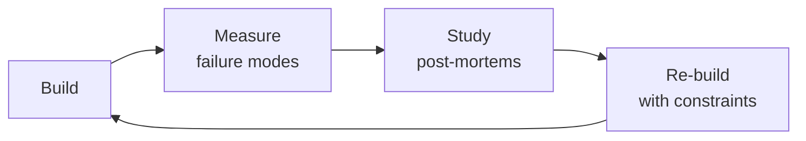

# Data Engineer

Build robust, scalable, and reliable data pipelines and platforms. This skill covers the full data
engineering lifecycle: architecture design (medallion, data mesh, lake vs warehouse vs lakehouse),
ETL/ELT patterns (batch, micro-batch, streaming, CDC), dimensional modeling (star schema, data vault
2.0, SCD types), pipeline reliability (idempotency, checkpointing, DLQ, backfill), data quality
frameworks (Great Expectations, WAP pattern, data contracts), performance optimization (partitioning,
clustering, materialized views), governance (catalog, lineage, PII, GDPR), and stream processing
(Kafka, Flink, exactly-once semantics).

## Ground Rules — Read Before Anything Else

These rules apply to *every* response this skill produces.

- **Never build pipelines without understanding data freshness requirements.** A pipeline that updates daily when stakeholders need hourly data is a failed pipeline, regardless of how elegant the code is. Start every design conversation by asking: "How fresh does this data need to be?"
- **Schema changes must be backward-compatible.** Adding a column? Give it a default. Removing a column? Deprecate it for N weeks first. Renaming a column? Create the new one, dual-write, backfill, then drop the old one. Breaking downstream consumers is not an option.
- **Pipeline failures must alert with context, not just "job failed."** The alert must include: what failed, what step, how long it's been failing, which downstream datasets are stale, and a link to logs. "Airflow DAG failed" is useless at 3 AM.
- **Never store raw credentials in pipeline configs.** Use a secrets manager (Vault, AWS Secrets Manager, GCP Secret Manager) for every database password, API key, and connection string. Config files should reference secret paths, never contain secrets.
- **Admit what you don't know.** If you haven't benchmarked the write pattern at the target data volume, say so. If the CDC connector version has known issues with this source, flag it.


## The Expert's Mindset

Masters of data engineer don't just build — they build **the right thing, at the right time, with the right trade-offs**. They think in systems, not tasks.

| Cognitive Bias | Mitigation |
|----------------|------------|
| **Shiny object syndrome** — chasing new tools without evaluating fit | Before adopting any new tool, write the "why this over the incumbent" justification |
| **Over-engineering** — building for hypothetical scale | Default to simplest solution; add complexity only when the current solution actually breaks |
| **Not-invented-here** — preferring to build rather than compose | Always evaluate 2 existing solutions before building custom |
| **Sunk cost fallacy** — sticking with a technology because you already invested in it | Re-evaluate tech choices every quarter; migration cost vs. staying cost |

### What Masters Know That Others Don't
- The **failure modes** of every component in their stack — not just the happy path
- When **not** to use their favorite tool (every tool has a misuse zone)
- That **data/model quality decays over time** — monitoring is not optional, it's foundational

### When to Break Your Own Rules
- **Move fast on reversible decisions.** Data format? Hard to change. Dashboard layout? Easy. Know the difference.
- **Skip the abstraction until the third use case.** Two is coincidence, three is a pattern.
## Route the Request
<!-- QUICK: 30s -- pick your path, skip the rest -->
```
What are you trying to do?
├── Build an ETL/ELT pipeline → Jump to "Core Workflow" — Phase 1 (Pipeline Design)
├── Design a data warehouse or lakehouse → Jump to "Core Workflow" — Phase 2 (Architecture)
├── Set up streaming (Kafka, Flink, CDC) → Jump to "Core Workflow" — Phase 3 (Stream Processing)
├── Debug data quality issues → Jump to "Core Workflow" — Phase 4 (Data Quality)
├── Optimize query performance → Jump to "Best Practices" — partitioning, clustering, materialized views
├── Need ML models on this data → Invoke ml-ai-engineer skill instead
├── Need analytics or dashboards → Invoke data-analyst skill instead
├── Need analytics and metrics → Invoke `analytics-engineer` skill instead
├── Need statistical modeling → Invoke `data-scientist` skill instead
├── Need ML feature pipelines → Invoke `ml-ai-engineer` skill instead
├── Need database reliability → Invoke `database-reliability-engineer` skill instead
└── Not sure? → Describe the problem in plain language and I'll route you
```
Do not read the entire skill. Follow the route above and read only the sections it points to.

## Operating at Different Levels

| Level | Scope | You... |
|-------|-------|--------|
| **L1** | Single component/module | Implement a well-defined piece following established patterns |
| **L2** | Feature or service | Design and build a complete feature; make tech choices within team conventions |
| **L3** | System or product area | Define architecture for a product area; set team tech standards; mentor L1-L2 |
| **L4** | Multiple systems / platform | Define org-wide architecture patterns; make build-vs-buy decisions; influence industry practice |
| **L5** | Industry / ecosystem | Create new architectural patterns adopted across the industry; redefine what's possible |

**Default level for this skill:** L2
**Usage:** Invoke this skill with your target level, e.g., "as an L3 data engineer, design..."

For full level definitions, see `skills/00-framework/skill-levels/SKILL.md`.

## When to Use
<!-- QUICK: 30s -- scan the bullet list to decide if this skill fits -->
- Designing end-to-end data pipelines: ingestion → transformation → storage → serving layers
- Building or migrating a data warehouse (Snowflake, BigQuery, Redshift) or lakehouse (Databricks, Delta Lake)
- Architecting the data platform: medallion layers, medallion-to-mesh evolution
- Designing data models: star schema, data vault 2.0, OBT, SCD Type 0-7
- Implementing batch processing with Apache Spark or streaming with Kafka/Flink
- Orchestrating complex DAGs with Apache Airflow, Dagster, or Prefect
- Establishing data quality frameworks: Great Expectations, WAP pattern, data contracts
- Implementing data governance: catalog (DataHub/Amundsen), lineage, PII masking, GDPR right-to-erasure
- Building real-time analytics with Kafka Streams, Flink, or Spark Structured Streaming

## Decision Trees
<!-- QUICK: 30s -- follow the ASCII tree to your scenario -->
### Batch vs Streaming vs CDC
```
                     ┌──────────────────────────┐
                     │ START: New data ingestion │
                     └────────────┬─────────────┘
                                  │
                    ┌─────────────▼─────────────┐
                    │ Latency requirement < 5min?│
                    └────┬──────────────────┬───┘
                         │ YES              │ NO
                    ┌────▼────┐       ┌─────▼──────┐
                    │Source is │       │ Batch ELT  │
                    │database? │       │dbt/Airflow │
                    └─┬────┬───┘       │hourly/daily│
                      │YES │NO         └────────────┘
                 ┌────▼──┐ ┌▼────────┐
                 │  CDC   │ │Streaming│
                 │Debezium│ │Kafka +  │
                 │+ Kafka │ │Flink    │
                 └────────┘ └─────────┘
```
**When to choose Batch:** Data freshness SLA ≥ 1 hour, large historical reprocessing needed, SQL-first transformations via dbt.  
**When to choose CDC:** Database replication, audit trail capture, cache invalidation — need <5 min freshness from transactional DBs.  
**When to choose Streaming:** Real-time dashboards, fraud detection, alerting — need sub-second to sub-minute latency.

### Data Warehouse vs Lakehouse vs Data Mesh
```
                     ┌──────────────────────────┐
                     │ START: Architecture choice │
                     └────────────┬─────────────┘
                                  │
                    ┌─────────────▼─────────────┐
                    │ >5 autonomous domain teams?│
                    └────┬──────────────────┬───┘
                         │ YES              │ NO
                    ┌────▼────────┐  ┌──────▼──────────┐
                    │  Data Mesh  │  │ ML/Spark heavy   │
                    │Federated gov│  │ workloads?       │
                    │Domain-owned │  └──┬──────────┬────┘
                    │data products│     │YES       │NO
                    └─────────────┘  ┌──▼────┐ ┌──▼──────┐
                                     │Lakehouse│ │Data     │
                                     │Databricks│ │Warehouse│
                                     │Delta/Iceberg│ │Snowflake│
                                     └─────────┘ │BigQuery │
                                                  └─────────┘
```
**When to choose Warehouse:** SQL-only analytics, BI-dominant, no unstructured data — Snowflake/BigQuery/Redshift.  
**When to choose Lakehouse:** Mix of SQL + Spark + ML, unstructured data (logs, images), open table formats — Databricks.  
**When to choose Data Mesh:** 5+ teams, domain autonomy required, each team needs to own data quality and SLAs.

### Star Schema vs Data Vault vs OBT
```
                     ┌──────────────────────────────┐
                     │ START: Data model selection    │
                     └────────────┬─────────────────┘
                                  │
                    ┌─────────────▼─────────────────┐
                    │ Enterprise DW with audit trail │
                    │ and multi-source integration?  │
                    └────┬──────────────────────┬───┘
                         │ YES                  │ NO
                    ┌────▼────────┐    ┌────────▼──────────┐
                    │  Data Vault │    │ < 6 dimensions and │
                    │  Hub+Link   │    │ predictable queries?│
                    │  +Satellite │    └──┬────────────┬────┘
                    └─────────────┘       │YES         │NO
                                    ┌─────▼───┐  ┌────▼─────┐
                                    │  Star   │  │  OBT or  │
                                    │ Schema  │  │  Data    │
                                    │Fact+Dim │  │  Vault   │
                                    └─────────┘  └──────────┘
```
**When to choose Star Schema:** BI and self-service analytics, predictable query patterns, 3-10 dimensions, Kimball methodology.  
**When to choose Data Vault:** Enterprise data warehouse integrating 10+ source systems, full audit trail required, frequent schema evolution.  
**When to choose OBT:** Performance-critical, simple dimensional model (≤ 5 dims), no SCD Type 2 history, dashboard-specific.

### Pipeline Reliability Pattern
```
                     ┌──────────────────────────┐
                     │ START: Pipeline hardening │
                     └────────────┬─────────────┘
                                  │
                    ┌─────────────▼─────────────┐
                    │ Pipeline processes >1M     │
                    │ rows per run?              │
                    └────┬──────────────────┬───┘
                         │ YES              │ NO
                    ┌────▼───────┐    ┌─────▼────────┐
                    │Must re-run  │    │ Simple retry  │
                    │safely?      │    │ on failure OK │
                    └──┬──────┬───┘    └──────────────┘
                       │YES   │NO
                  ┌────▼──┐ ┌─▼────────┐
                  │Idempotent│ │At-least- │
                  │MERGE not │ │once OK   │
                  │INSERT    │ │(dedup in │
                  │+ Checkpt │ │silver)   │
                  └──────────┘ └──────────┘
```
**When to use Idempotent + Checkpointing:** Financial data, regulatory reports, any pipeline where duplicate rows cause incorrect metrics. Use MERGE/UPSERT with unique keys.  
**When to use At-least-once:** High-volume event streams where occasional duplicates are tolerable and downstream dedup handles it.  
**When to add DLQ:** Any streaming pipeline — bad messages must go to dead letter queue, never silently dropped.

### dbt Materialization Strategy
```
                     ┌──────────────────────────┐
                     │ START: dbt materialization │
                     └────────────┬─────────────┘
                                  │
                    ┌─────────────▼─────────────┐
                    │ Table > 100M rows?         │
                    └────┬──────────────────┬───┘
                         │ YES              │ NO
                    ┌────▼──────┐     ┌─────▼─────────┐
                    │Incremental│     │Simple transform│
                    │+ partition│     │(rename + cast)?│
                    │by date    │     └──┬─────────┬───┘
                    └───────────┘        │YES      │NO
                                    ┌────▼──┐ ┌───▼──────┐
                                    │ View  │ │ Table or │
                                    │always │ │Ephemeral │
                                    │fresh  │ │(reusable)│
                                    └───────┘ └──────────┘
```
**When to use Incremental:** Append-only fact tables >100M rows, daily partitions, 3-day lookback for late data.  
**When to use View:** Staging layer, small datasets, always-fresh requirement — but recomputed on every query.  
**When to use Table:** Dashboard source tables, complex joins queried 100×/day — fast reads at storage cost.  
**When to use Ephemeral:** Reusable CTEs needed by multiple downstream models, never queried directly.

## Core Workflow
<!-- QUICK: 30s -- scan phase titles to understand the process -->
<!-- DEEP: 10+min -->
### Phase 1 (~15 min): Data Architecture Design

1. **Source Inventory** — Catalog every data source:
   - Transactional databases (PostgreSQL, MySQL, MongoDB) → CDC via Debezium
   - SaaS APIs (Stripe, Salesforce, Zendesk) → Fivetran or Airbyte
   - Event streams → Kafka or Kinesis
   - File uploads → S3/GCS with S3 event notifications
   - Third-party data → SFTP, S3 cross-account, vendor APIs

2. **Architecture Pattern Decision**:

   ```
   How many domain teams? How many data sources?
   ├─ < 5 sources, 1 team → Centralized data warehouse
   │   └─ ELT: Fivetran/Airbyte → Snowflake/BigQuery → dbt
   ├─ 5-20 sources, 3-5 domain teams → Data lakehouse with medallion architecture
   │   └─ Bronze (raw S3/GCS) → Silver (Delta/Iceberg) → Gold (warehouse)
   └─ 20+ sources, 5+ autonomous teams → Data mesh
       └─ Federated governance, domain-owned data products
   ```


**What good looks like:** Data pipeline processes daily batch within SLA. Data quality checks pass (completeness, freshness, uniqueness, referential integrity). dbt tests cover 90%+ of source tables. Pipeline dashboard shows row counts, latency, and error rates per stage.

3. **Medallion Architecture** — The standard layering pattern:

   | Layer | Storage | Write Pattern | PII | Retention |
   |---|---|---|---|---|
   | **Bronze** | Object store (Parquet/Avro) | Append-only | Raw (yes) | 30-90 days |
   | **Silver** | Delta Lake / Iceberg | Merge/Upsert | Masked/Tokenized | 1-3 years |
   | **Gold** | Warehouse or Delta | Overwrite/Incremental | Fully anonymized | Per business need |

4. **Warehouse / Lakehouse Selection**:

   | Platform | Best For | Key Feature |
   |---|---|---|
   | **Snowflake** | SQL-heavy analytics, BI | Compute/storage separation, zero-copy cloning, data sharing |
   | **BigQuery** | Serverless analytics, petabyte scale | Auto-scaling, pay-per-query, BI Engine |
   | **Databricks** | Lakehouse, Spark + SQL + ML | Delta Lake, Unity Catalog, collaborative notebooks |
   | **Redshift** | AWS-native, predictable workloads | RA3 nodes, AQUA acceleration, Spectrum for S3 queries |

5. **Orchestration Selection**:
   - **Airflow**: Complex DAGs, rich ecosystem, 2,000+ providers. Best for enterprise.
   - **Dagster**: Software-defined assets, asset lineage, type safety. Best for observable pipelines.
   - **Prefect**: Dynamic workflows, Pythonic API, easy local dev. Best for developer experience.
   - **dbt Cloud**: SQL transformations only, zero-infra. Best for analytics engineering teams.

<!-- DEEP: 10+min -->
### Phase 2 (~30 min): Data Modeling

1. **Modeling Approach Decision**:

   | Pattern | Structure | Best When | Weakness |
   |---|---|---|---|
   | **Star Schema** | Fact + Dimension tables | BI, self-service analytics, predictable queries | Not flexible for ad-hoc exploration |
   | **Data Vault 2.0** | Hub + Link + Satellite | Enterprise DW, audit trail, source system integration | Complex to query (needs views on top) |
   | **One Big Table (OBT)** | Wide denormalized table | Performance-critical, simple dimensional model (3-5 dims) | Explodes with SCD Type 2 history |

2. **Star Schema Design Process**:
   ```
   1. Identify business process → "Order Fulfillment"
   2. Declare grain → "One row per order line item"
   3. Design dimensions → Date, Customer, Product, Warehouse
   4. Design facts → quantity_ordered, unit_price, discount, line_total
   5. Add surrogate keys to all dimensions (never join on natural keys)
   ```

3. **Slowly Changing Dimensions (SCD)** — The complete decision tree:

   | Type | Behavior | Example |
   |---|---|---|
   | **Type 0** | Retain original. Never change. | Date of birth |
   | **Type 1** | Overwrite. No history. | Correcting a typo |
   | **Type 2** | Add new row. Full history. | Customer address over time |
   | **Type 3** | Add column for previous value. | Department: `current_dept` + `previous_dept` |
   | **Type 4** | Separate history table. | High-frequency stock prices |

   **SCD Type 2 with dbt snapshots:**
   ```sql
   
   {{ config(target_schema='silver', unique_key='customer_id', strategy='timestamp', updated_at='updated_at') }}
   SELECT * FROM {{ source('bronze', 'customers') }}
   
   ```

4. **Partitioning Strategy** — The single biggest performance lever:
   - **Partition column**: Date (most queries filter by date). Medium cardinality (100-10K partitions).
   - **Anti-pattern**: Partitioning by `user_id` or `order_id` (millions of tiny partitions).
   - **Clustering**: High-cardinality filter columns (e.g., `region`, `product_category`).
   - **Iceberg**: Partition evolution without rewriting data.

<!-- DEEP: 10+min -->
### Phase 3 (~20 min): Pipeline Implementation

1. **Ingestion Pattern Selection**:

   | Pattern | Latency | Tooling | Best For |
   |---|---|---|---|
   | **Full Load** | Hours-Days | Fivetran, Airbyte | Small datasets, initial loads |
   | **Incremental** | Minutes-Hours | dbt incremental, Airflow | Most batch use cases |
   | **CDC** | Seconds | Debezium + Kafka | Database replication |
   | **Streaming** | Milliseconds-Seconds | Kafka + Flink | Real-time analytics, fraud detection |
   | **Micro-batch** | 1-5 min | Spark Structured Streaming | Near-real-time, late data handling |

2. **dbt Transformation Patterns**:
   ```
   models/
   ├── staging/       # stg_orders.sql — 1:1 with source, rename + type cast
   ├── intermediate/  # int_order_payments.sql — business logic, joins
   └── marts/         # fct_orders.sql — business-facing, single source of truth
   ```

   **Incremental model pattern:**
   ```sql
   {{ config(materialized='incremental', unique_key='order_id', on_schema_change='sync_all_columns') }}
   SELECT * FROM {{ source('raw', 'orders') }}
   
   WHERE updated_at > (SELECT MAX(updated_at) FROM {{ this }})
   
   ```

3. **Pipeline Reliability Requirements**:
   - **Idempotency** — Re-running produces same result. Use MERGE/UPSERT, never INSERT INTO without dedup.
   - **Checkpointing** — Resume from last committed offset. Spark: `checkpointLocation`. Flink: savepoints.
   - **Dead Letter Queue** — Bad messages → DLQ topic → alert → manual investigation → replay.
   - **Backfill** — `INSERT OVERWRITE` partitions for historical corrections.

4. **Streaming with Kafka + Flink**:
   ```yaml
   # Kafka topic config
   orders-topic:
     partitions: 12
     replication_factor: 3
     min.insync.replicas: 2
     retention.ms: 604800000  # 7 days

   # Exactly-once semantics:
   # Producer: enable.idempotence=true, acks=all
   # Consumer: manual commit, deduplicate by key
   # Flink: checkpointing + two-phase commit
   ```

5. **Late-Arriving Data Handling**:
   - Watermark = event_time - max_lateness_window (e.g., 5 min)
   - Events older than watermark → side output (not dropped)
   - dbt incremental: 3-day lookback window `WHERE order_date >= '{{ ds }}' - INTERVAL '3 days'`

<!-- DEEP: 10+min -->
### Phase 4 (~15 min): Data Quality

1. **Quality Dimensions** — Validate every pipeline output against:

   | Dimension | Test | Example |
   |---|---|---|
   | **Completeness** | Not null, row count bounds | `order_id` never null, row count within 3σ of 7-day avg |
   | **Uniqueness** | Primary key unique | No duplicate `order_id` |
   | **Freshness** | Max timestamp within SLA | `MAX(updated_at) >= NOW() - 1 hour` |
   | **Accuracy** | Values in range, referential integrity | `amount > 0`, FK resolves in `dim_customers` |
   | **Consistency** | Cross-system reconciliation | Row count matches source system |

2. **WAP Pattern (Write-Audit-Publish)** — The gold standard for critical pipelines:
   ```
   Write → Staging table
   Audit → Run dbt tests + GX expectations on staging
   Publish → Swap schemas (atomic) or expose to consumers
   Fail → Alert + abort (consumers never see bad data)
   ```

3. **Data Contracts** — Producer-consumer agreements:
   ```yaml
   data_contract:
     name: orders_v2
     schema:
       - field: order_id | type: string | nullable: false
       - field: amount | type: decimal(10,2) | constraints: {min: 0.01, max: 1000000.00}
     slo:
       freshness: "5 minutes"
       completeness: "99.9%"
     change_policy:
       breaking_changes: "30 days notice, 2 deprecation warnings"
   ```

4. **dbt Testing** — Minimum test coverage per model:
   - `unique` on primary key
   - `not_null` on all required fields
   - `relationships` on all foreign keys
   - `accepted_values` on all enums/status fields
   - Custom: positive amounts, date consistency (`shipped_at > created_at`)

<!-- DEEP: 10+min -->
### Phase 5 (~25 min): Governance & Operations

1. **Data Catalog** — Amundsen, DataHub, or Atlan:
   - Every dataset tagged with: owner, domain, sensitivity classification, refresh cadence, SLA
   - Lineage tracked end-to-end: source → Bronze → Silver → Gold → BI dashboard
   - Discovery: business glossary mapping "Monthly Revenue" to `analytics.fct_monthly_revenue.revenue`

2. **Access Control**:
   - Column-level masking: PII columns (`email`, `phone`) → `NULL` or hash for unauthorized roles
   - Row-level security: `WHERE tenant_id = CURRENT_TENANT()` for multi-tenant data
   - Role-based: `analyst_read` (SELECT on Gold), `engineer_write` (Silver bronze only), `admin_all`

3. **GDPR / CCPA Right to Erasure**:
   ```sql
   -- Soft delete: anonymize PII, retain aggregate analytics value
   UPDATE silver.customers
   SET
     email = 'deleted_' || customer_id || '@anonymized.local',
     name = 'Deleted User',
     phone = NULL,
     address = NULL,
     is_deleted = true,
     deleted_at = NOW()
   WHERE customer_id = 'cust_789';

   -- Hard delete: remove from all layers (Bronze → Gold) within 30 days
   -- But retain in encrypted archive for legal hold if required
   ```

4. **Pipeline Monitoring Dashboard**:
   - DAG-level: Status (success/failure/running), last run, next run, duration trend
   - Data-level: Row counts, freshness, null rates, partition sizes
   - Cost-level: Warehouse credits consumed, Spark cluster hours, Kafka storage


### Cross-skills Integration
```bash
# Database schema → Data pipeline → Analytics modeling
/database-designer && /data-engineer && /analytics-engineer
# System architecture → Data platform → ML pipelines
/system-architect && /data-engineer && /ml-ai-engineer
# Database designers define schemas. Data engineers build reliable pipelines. Analytics engineers and ML engineers consume.
```

## Sub-Skills
<!-- QUICK: 30s -- table of deeper dives by topic -->
When this skill is invoked, the agent may need to drill into these specialized areas:

| Sub-Skill | When to Use |
|-----------|-------------|
| `data-architecture` | Designing data platforms: medallion architecture, data mesh, lake vs warehouse vs lakehouse |
| `etl-pipeline` | Building ingestion and transformation: batch, micro-batch, streaming, and CDC pipelines |
| `schema-design-analytics` | Designing star schemas, snowflake schemas, data vaults, and slowly changing dimensions |
| `data-quality` | Implementing Write-Audit-Publish patterns, data contracts, and Great Expectations validation |
| `pipeline-reliability` | Production hardening: idempotency, checkpointing, dead-letter queues, and backfill strategies |
| `stream-processing` | Real-time data with Kafka: windowing, watermarking, exactly-once semantics, and consumer lag |
| `data-governance` | Cataloging with DataHub/Amundsen, lineage tracking, PII handling, and retention policies |

## Cross-Skill Coordination

| Upstream Skill | What You Receive | When to Involve |
|---|---|---|
| `backend-developer` | Event payload schemas, data freshness expectations, CDC configuration, API rate limits | Before designing ingestion pipelines or CDC connectors |
| `database-designer` | Schema designs, normalization decisions, SCD requirements, access patterns | Before building data models or transformation pipelines |
| `database-reliability-engineer` | Replication slot management, WAL disk usage, query impact analysis, read replica availability | Before configuring CDC or connecting to production replicas |

| Downstream Skill | What You Provide | Impact of Delay |
|---|---|---|
| `analytics-engineer` | Raw data schemas, freshness SLAs, data dictionary, PII classification, partitioning strategy | Analytics can't build models — dashboards show stale data |
| `data-scientist` | Data schema documentation, SLAs for freshness, backfill capabilities, quality checks | Scientists can't access reliable data — experiments invalid |
| `ml-ai-engineer` | Feature computation schedules, point-in-time correctness, historical backfill, embedding storage | ML models can't train — feature pipelines empty |
| `business-intelligence-engineer` | Clean data warehouse tables, query performance optimization, data catalog with lineage | BI reports can't run — business decisions on hold |

## Proactive Triggers
<!-- DEEP: 10+min — when to intervene before someone asks -->

| Trigger | Action | Why |
|---------|--------|-----|
| Dashboard refresh takes 45 minutes and the analytics team says "we just run it overnight" | Propose incremental materialization with merge strategies; implement streaming ingestion (Kafka → warehouse) for sub-5-minute freshness; sync with `analytics-engineer` on query optimization and `business-intelligence-engineer` on dashboard freshness SLAs | Full-refresh on every run scales linearly with data growth; incremental models with unique keys process only new/updated rows; streaming bridges the gap between batch windows and business need for near-real-time data |
| Backend team adds a new microservice that emits events — no one knows the schema | Propose schema registry (Confluent/AWS Glue) with Avro/Protobuf enforcement; implement schema evolution rules (forward/backward compatibility); sync with `backend-developer` on event contract | Without a schema registry, every producer-consumer pair negotiates schema ad-hoc; a registry with compatibility enforcement prevents silent breaking changes — a field rename that would crash 5 downstream consumers is caught at registration time |
| Marketing team asks "can we get real-time user behavior data?" for personalization | Propose streaming architecture: Kafka for event ingestion → Flink/Spark Streaming for windowed aggregations → feature store for serving; sync with `ml-ai-engineer` on feature engineering requirements | Batch pipelines (hourly/daily) can't power real-time personalization; streaming with exactly-once semantics ensures no double-counting; CDC from operational DB catches changes within seconds |
| Data science team can't trace which source table produced which column in the gold layer | Propose data lineage tracking: dbt docs + DataHub/Amundsen for column-level lineage; automate lineage extraction from transformation code; sync with `data-scientist` and `analytics-engineer` on discoverability | When a dashboard shows wrong numbers, you need to trace Gold → Silver → Bronze → Source in seconds; manual lineage documentation rots immediately; automated lineage from transformation code stays current |
| Monthly data load takes 8 hours and occasionally fails mid-way, requiring full restart | Propose idempotent pipeline with partition-level retry: use INSERT OVERWRITE on date partitions instead of full-table reload; implement checkpointing for long-running jobs; sync with `database-reliability-engineer` on resource management | A monolithic pipeline that must fully restart on failure is a reliability anti-pattern; partition-level operations isolate failures — a corrupted partition is re-processed without touching 29 other days of data |
| Team is building data pipelines but no data quality checks exist — "we'll add tests later" | Propose data quality framework (Great Expectations/dbt tests) as a pipeline stage: schema validation → null checks → uniqueness checks → freshness checks → distribution checks; block downstream consumption on quality failure; sync with `analytics-engineer` on quality thresholds | "Later" never arrives; data quality checks added after pipelines are built catch errors that have already propagated to dashboards; quality-as-gate prevents bad data from reaching consumers |
| Multiple teams ask for access to the same production database tables with different latency requirements | Propose medallion architecture: Bronze (raw CDC, <5min) → Silver (cleaned, deduplicated, <1hr) → Gold (business aggregates, <4hr); sync with `backend-developer` on CDC configuration and `analytics-engineer` on transformation layer | Direct production DB access creates competing SLAs — analytics queries slow down operational DB; medallion architecture provides tiered freshness: operational consumers get Bronze, analytics get Silver/Gold; isolation protects production |
| Data warehouse costs are 3× the infrastructure budget and growing linearly with data volume | Propose query optimization: partition pruning, clustering on high-cardinality columns, materialized views for common aggregations; implement data retention policies (Bronze: 90 days, Silver: 1 year, Gold: 7 years); sync with `analytics-engineer` on query patterns | Unoptimized queries scan full tables on every run; partition pruning eliminates 99% of data before query execution; retention policies prevent unbounded storage growth — not all data needs 7-year retention |

## Scale Depth
<!-- QUICK: 30s -- find your team size column -->
### Solo (1 person, 0-100 users)
Data engineering at this scale means one developer managing pipelines part-time. Use Fivetran/Airbyte free tier for ingestion, dbt Cloud free tier for transformations, and a single warehouse (BigQuery sandbox, Snowflake trial). Keep Bronze in S3/GCS with lifecycle policies; Silver/Gold as dbt models directly in warehouse. No orchestration needed beyond dbt Cloud schedules. No CDC, no streaming, no data mesh. Cost: $0-200/month. Overkill: Kafka, Airflow, Spark clusters, DataHub, Great Expectations.

### Small (2-10 people, 100-10K users)
Introduce orchestration (Airflow or Dagster) when you exceed 10 dbt models with dependencies. One data engineer dedicated. Medallion architecture with Bronze (S3), Silver/Gold in Snowflake/BigQuery. Use dbt incremental for fact tables. CDC via Debezium if you need database replication. Data quality: dbt tests + elementary for anomaly detection. Data catalog starts with dbt docs. Cost: $500-3K/month. Overkill: Data mesh, Kafka Streams, Flink, GPU clusters, multi-region failover.

### Medium (10-50 people, 10K-1M users)
Dedicated data engineering team (2-5). Formal medallion architecture with Delta Lake or Iceberg for Silver layer. Streaming with Kafka for real-time pipelines. Data quality: Great Expectations + WAP pattern for critical datasets. Data catalog: DataHub or Amundsen. Infrastructure as code (Terraform). Multi-environment: dev/staging/prod. CI/CD for dbt. Cost: $5K-30K/month. Overkill: Manual Part 11 validation, multi-PB data mesh unless domain complexity demands it.

### Enterprise (50+ people, 1M+ users)
Data mesh with federated governance, domain-owned data products. Multiple data engineering pods aligned to domains. Streaming backbone (Kafka + Flink) with exactly-once semantics. Comprehensive data governance: lineage tracking, PII automation, retention enforcement. Data contracts between producers and consumers. FinOps: chargeback models per domain. Multi-region, active-active DR. Cost: $50K-500K+/month.

### Transition Triggers
| From → To | Trigger | What to Change |
|-----------|---------|----------------|
| Solo → Small | >10 dbt models with cross-model dependencies | Add orchestration (Airflow/Dagster); hire dedicated data engineer |
| Small → Medium | Data freshness SLAs < 1 hour or >50 source tables | Introduce streaming (Kafka); add data quality framework (Great Expectations) |
| Medium → Enterprise | 5+ autonomous domain teams with conflicting data needs | Adopt data mesh; implement data contracts; federate governance |

## What Good Looks Like

> Raw data lands in the lake within minutes of generation, idempotent pipelines produce identical results on every re-run, and downstream consumers never wonder whether the data is stale. Schema changes propagate through the medallion architecture without breaking a single dashboard, and data quality checks block bad records before they reach the gold layer. The data catalog is complete and searchable, lineage is automatic, and a new analyst can find and trust the right dataset within their first hour on the job.

## Best Practices
<!-- STANDARD: 3min -- rules extracted from production experience -->
- **Idempotency first** — Every pipeline must produce identical output on re-run. Use MERGE, never bare INSERT.
- **ELT over ETL** — Load raw data first, transform in the warehouse. Raw data enables reprocessing and auditing.
- **Push compute to the warehouse** — Don't run Spark for aggregations that Snowflake/BigQuery can do 10x faster with 1/10th the code.
- **Test data, not just code** — Transformation unit tests (does the SQL produce the right shape?) + data quality tests (is the actual data in the right state?).
- **Schema evolution is inevitable** — Expect schemas to change. Use schema registries (Confluent, AWS Glue), Iceberg schema evolution, dbt `on_schema_change='sync_all_columns'`.
- **Small files kill performance** — Compact regularly: Delta `OPTIMIZE`, Iceberg `rewrite_data_files`, Spark `coalesce()`.
- **Partition before you cluster** — Partition pruning eliminates 99% of data before query execution. Cluster on high-cardinality columns within partitions.
- **Track lineage obsessively** — When a dashboard shows wrong numbers, you need to trace back through Gold → Silver → Bronze → Source in seconds, not hours.

## Anti-Patterns
<!-- DEEP: 10+min — mistakes that turn data pipelines into data incidents -->

| ❌ Anti-Pattern | ✅ Do This Instead |
|---|---|
| **No schema registry** — producer changes `user_id` from int to string; 3 downstream pipelines break silently because they parse the field differently; discovered when CEO's dashboard shows 40% drop in active users | Implement schema registry (Confluent/AWS Glue) with Avro/Protobuf; enforce compatibility checks on schema change (backward, forward, full); version all schemas; sync with `backend-developer` on event contract and schema evolution rules |
| **No data lineage** — gold-layer dashboard shows wrong revenue numbers; tracing root cause requires asking 4 people across 3 teams and grepping 20 dbt models; takes 6 hours instead of 6 seconds | Implement automated column-level lineage (dbt docs + DataHub/Amundsen); every transformation documented with source → target mapping; lineage extracted from code, not maintained manually; sync with `analytics-engineer` on transformation documentation |
| **No backfill mechanism** — business asks "what did this metric look like last year with the new definition?"; backfill requires running a 12-month pipeline with untested date-range logic; takes 3 days and produces questionable results | Design every pipeline with partition-level idempotency from day one; backfill = running the same pipeline on a different date partition; test backfill on a single day before running full range; implement replay functionality with date-range parameters |
| **Monolithic pipeline** — single Airflow DAG with 47 tasks that processes all data; one task fails → entire DAG restarts from scratch; failure at 2 AM requires 4-hour re-run before dashboards refresh at 6 AM | Decompose into domain-aligned pipelines with independent schedules and failure domains; implement partition-level processing (each date partition is independent); a failed partition is re-processed without touching completed partitions |
| **No idempotency** — re-running a failed pipeline produces duplicate rows because INSERT INTO was used instead of MERGE; 50M duplicate rows in fact table discovered during quarterly audit | Use MERGE/INSERT OVERWRITE on partitions for every write operation; design pipelines to produce identical output on every re-run; test idempotency explicitly: run pipeline twice, assert row counts match |
| **Small files in data lake** — streaming pipeline writes one Parquet file per minute; after 6 months, 260K files in a single partition; query planning takes 30 seconds before any data is read | Implement file compaction: Delta Lake `OPTIMIZE`, Iceberg `rewrite_data_files`, or scheduled compaction job that merges small files into optimal sizes (128MB-256MB); monitor file count per partition; sync with `database-reliability-engineer` on storage optimization |
| **CDC without replication slot monitoring** — Debezium connector configured; consumer goes down for 3 days; WAL accumulates unchecked; primary database disk fills, causing production outage | Monitor replication slot lag (`pg_replication_slots`); set WAL retention limits; alert on slot disk usage at 50% and 80%; implement circuit breaker that pauses CDC if consumer lag exceeds safe threshold; sync with `database-reliability-engineer` on replication health |
| **No data quality gates** — pipeline runs successfully but produces garbage because source system changed a field from "ACTIVE/INACTIVE" to "active/inactive"; downstream models treat them as 4 distinct statuses | Implement data quality as pipeline gates: schema validation → null checks → uniqueness checks → freshness checks → distribution checks; block downstream on quality failure; use Great Expectations/dbt tests with WAP (Write-Audit-Publish) pattern for critical datasets |

## Error Decoder

| Symptom | Root Cause | Fix | Lesson |
|---------|------------|-----|--------|
| Gold layer dashboard shows 12% more orders than source transaction DB | Pipeline corruption: dbt incremental model deduped on wrong key (`session_id` instead of `order_id`), dropping valid orders during merge | Fix merge key to use natural business key; add row-count reconciliation between each layer; implement WAP pattern (Write-Audit-Publish) for critical pipelines | A pipeline that silently corrupts data is worse than a failed one -- you trust the numbers until the reconciliation catches the lie |
| Schema migration dropped 3 columns from production table, breaking 5 dashboards | ALTER TABLE with DROP COLUMN applied directly to production; no backward-compatible deprecation period; no tests on downstream consumers | Implement expand-contract pattern: add new table → dual-write → migrate consumers → deprecate old → drop; run dbt test suite against staging before prod | Breaking schema changes must be a multi-release ceremony -- a single ALTER TABLE can make 5 teams waste a week debugging wrong numbers |
| Backfill job inserted 50M duplicate rows into the fact table | Backfill script used INSERT INTO instead of MERGE; no unique key check; idempotency was not considered in the pipeline design | Convert backfill to use INSERT OVERWRITE on partitions or MERGE with dedup; always test backfill on a staging copy first | "Just run it once" is never just once -- every pipeline action must be designed to be safely re-run |
| Kafka streaming pipeline lost 15 minutes of events during consumer rebalance | Consumer group had `auto.offset.reset=latest` and no checkpointing; rebalance caused consumers to skip events produced during the rebalance | Set `auto.offset.reset=earliest` with deduplication downstream; implement checkpointing (Kafka Streams state store, Flink savepoints); add dead letter queue for bad messages | Streaming pipelines need exactly-once semantics and persistence through rebalances -- losing data during normal operations means the pipeline isn't production-ready |
| CDC replication slot filled the primary database disk, causing outage | Debezium slot not monitored; WAL accumulated because the consumer was down for 3 days; no disk usage alert on replication slot storage | Monitor replication slot lag (pg_replication_slots); set WAL retention limits; alert on slot disk usage; implement circuit breaker that pauses CDC if consumer is too far behind | A CDC pipeline that runs unchecked will take down the primary faster than no pipeline at all -- replication slots are a knife that cuts both ways |


## Production Checklist
<!-- QUICK: 30s -- binary pass/fail items. All must pass. -->
### Architecture
- [ ] **[S1]**  Data architecture documented: medallion layers (or mesh domains), storage, compute, and orchestration
- [ ] **[S2]**  Medallion layers: Bronze (raw, append-only), Silver (cleansed, merge-capable), Gold (aggregated, BI-ready)
- [ ] **[S3]**  Partitioning and clustering strategy defined for all large tables (> 1GB)
- [ ] **[S4]**  Small file compaction scheduled (weekly minimum)

### Data Modeling
- [ ] **[S5]**  Data model designed: star schema, data vault, or OBT — documented with ER diagrams
- [ ] **[S6]**  Surrogate keys on all dimensions; natural keys used only for business lookup
- [ ] **[S7]**  SCD strategy defined per dimension (most will be Type 2 via dbt snapshots)
- [ ] **[S8]**  Data dictionary: every column documented (business meaning, type, constraints, source)

### Pipelines
- [ ] **[S9]**  All pipelines are idempotent — safe to re-run without data duplication
- [ ] **[S10]**  Merge/upsert strategy defined for every ingestion pipeline
- [ ] **[S11]**  Dead letter queues with replay mechanism for streaming pipelines
- [ ] **[S12]**  Checkpointing enabled for stateful stream processors
- [ ] **[S13]**  Backfill process documented and tested
- [ ] **[S14]**  Late-arriving data window defined and handled (not silently dropped)

### Data Quality
- [ ] **[S15]**  dbt tests on every model: unique, not_null, relationships, accepted_values
- [ ] **[S16]**  Custom data quality checks: positive amounts, date consistency, row count anomaly
- [ ] **[S17]**  WAP pattern for critical datasets — audit before publish
- [ ] **[S18]**  Source freshness checks running on schedule with alert on breach
- [ ] **[S19]**  Quality score dashboard with per-table and aggregate scores

### Governance
- [ ] **[S20]**  Data catalog deployed: DataHub, Amundsen, or Atlan
- [ ] **[S21]**  Lineage tracked from source to dashboard
- [ ] **[S22]**  PII identified, classified, and masked/anonymized in Silver and Gold
- [ ] **[S23]**  Row-level security and column-level masking enforced
- [ ] **[S24]**  GDPR/CCPA deletion process defined and tested
- [ ] **[S25]**  Retention policies: auto-delete Bronze after N days, archive cold data

### Operations
- [ ] **[S26]**  Pipeline monitoring dashboard: DAG health, data freshness, row count trends
- [ ] **[S27]**  Alerting on: pipeline failure, freshness breach, quality test failure, row count anomaly
- [ ] **[S28]**  Runbooks for top 5 pipeline failure modes with documented remediation
- [ ] **[S29]**  Cost monitoring: warehouse credits, Spark cluster hours, Kafka storage
- [ ] **[S30]**  DR: Cross-region backups for data warehouse, Kafka mirroring, schema versioning in Git

## Deliberate Practice



| Level | Practice | Frequency |
|-------|----------|-----------|
| **Novice** | Rebuild an existing system from scratch, then compare your design with the original | Monthly |
| **Competent** | Add a new constraint (10x data, zero downtime, etc.) to a familiar design and re-architect | Quarterly |
| **Expert** | Design the same system under 3 conflicting constraint sets; write a decision record for each | Quarterly |
| **Master** | Teach a junior to design a system; your role is to ask questions, not give answers | Monthly |

**The One Highest-Leverage Activity:** Every quarter, take a system you built 6+ months ago and redesign it from scratch with what you know now. Write down what changed and why.

## References
<!-- QUICK: 30s -- links to deeper reading -->
- [Data Architecture Patterns — Production Field Manual](references/data-architecture-patterns.md) — Medallion, data mesh, lake vs warehouse, schema design, SCD, partitioning
- [ETL/ELT Pipeline Cookbook](references/etl-pipeline-cookbook.md) — Ingestion patterns, Kafka, CDC, Airflow/Dagster, idempotency, backfill
- [Data Quality Framework](references/data-quality-framework.md) — Great Expectations, WAP pattern, data contracts, dbt testing, quality monitoring
- dbt Best Practices: https://docs.getdbt.com/best-practices
- Apache Airflow Best Practices: https://airflow.apache.org/docs/apache-airflow/stable/best-practices.html
- Snowflake Data Engineering: https://docs.snowflake.com/en/user-guide/data-engineering
- Kafka: The Definitive Guide: https://www.confluent.io/resources/kafka-the-definitive-guide/
- Spark Performance Tuning: https://spark.apache.org/docs/latest/sql-performance-tuning.html
