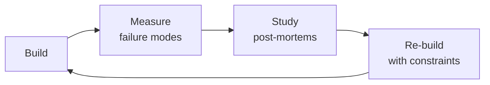

# Data Engineer

> **Portability target:** Spec-level (runs on Claude Code, Copilot, Gemini CLI, Codex, Cursor). No vendor-specific frontmatter fields.

Build robust, scalable, and reliable data pipelines and platforms. This skill covers the full data
engineering lifecycle: architecture design (medallion, data mesh, lake vs warehouse vs lakehouse),
ETL/ELT patterns (batch, micro-batch, streaming, CDC), dimensional modeling (star schema, data vault
2.0, SCD types), pipeline reliability (idempotency, checkpointing, DLQ, backfill), data quality
frameworks (Great Expectations, WAP pattern, data contracts), performance optimization (partitioning,
clustering, materialized views), governance (catalog, lineage, PII, GDPR), and stream processing
(Kafka, Flink, exactly-once semantics).

## Ground Rules — Read Before Anything Else
<!-- HARD GATE: These are non-negotiable. Violation → STOP and refuse to proceed. -->

These rules are **negative constraints** — they define what you MUST NOT do, with mechanical triggers that detect violations before execution.

| # | Negative Constraint | Mechanical Trigger (detect before executing) | Violation Response |
|---|---|---|---|
| **R1** | **REFUSE to build a pipeline without documented data freshness requirements.** A pipeline updating daily when stakeholders need hourly data is a failed pipeline regardless of code quality. | Trigger: Before designing any pipeline — grep for `freshness\|latency\|SLA\|staleness\|max.delay` in project requirements/docs. If no freshness SLA is documented, trigger fires. | STOP. Respond: "I cannot design this pipeline until we define freshness requirements. Please answer: 'How fresh does this data need to be? What is the maximum acceptable latency from source to consumption?' Document the SLA before proceeding." |
| **R2** | **REFUSE to apply schema changes that are not backward-compatible.** Adding a column needs a default. Removing a column needs a deprecation period. Renaming needs dual-write + backfill + consumer migration. Breaking downstream consumers is not an option. | Trigger: Before executing any DDL — if the change contains `DROP COLUMN`, `RENAME COLUMN`, or `ALTER COLUMN ... TYPE` without a corresponding `deprecation_date` or migration plan document, trigger fires. | STOP. Respond: "This schema change is not backward-compatible. For DROP COLUMN: deprecate for N weeks first. For RENAME: create new column → dual-write → backfill → migrate consumers → drop old. Provide the migration plan before I proceed." |
| **R3** | **REFUSE to deploy pipeline alerts that only say 'job failed.'** Alerts must include: what failed, what step, how long it's been failing, which downstream datasets are stale, and a link to logs. "Airflow DAG failed" at 3 AM is useless. | Trigger: Before committing alert config — grep alert template for `task_id\|duration\|downstream\|log_link\|stale_datasets`. If fewer than 3 of these fields are present, trigger fires. | STOP. Respond: "This alert template lacks context. Every alert must include: (1) what failed, (2) what step, (3) duration of failure, (4) downstream datasets affected, (5) link to logs. I will add these fields before deploying." |
| **R4** | **REFUSE to store raw credentials in pipeline configs.** Every database password, API key, and connection string must come from a secrets manager. Config files reference secret paths, never contain secrets. | Trigger: Before writing any pipeline config — grep for `password\|api_key\|secret\|token\|connection_string` followed by a literal value (not a `{{ vault(...) }}` or `$SECRET_PATH` reference). If found, trigger fires. | STOP. Respond: "This config contains a raw credential at line {N}. Use a secrets manager instead: replace with `{{ vault('path/to/secret') }}` (Vault), `{{ aws_secret('name') }}` (AWS), or `$SECRET_PATH` environment reference. I will not proceed with raw credentials." |
| **R5** | **STOP and admit when you haven't benchmarked at target data volume.** If you haven't tested the write pattern at the target scale, or the CDC connector version has known issues with this source, say so — don't guess. | Trigger: Before recommending a pipeline design — check if benchmarks or volume data exist. If `file_contains("**/*.{md,json,csv}", "benchmark\|throughput\|rows.per.second\|volume.test\|load.test")` returns no matches, trigger fires. | STOP. Respond: "I haven't benchmarked this design at your target data volume. My recommendation assumes {assumptions}. Before deploying: (1) run a volume test at 10% scale, (2) profile write throughput, (3) verify CDC connector compatibility. I'll flag all untested assumptions." |


## The Expert's Mindset

Masters of data engineer don't just build — they build **the right thing, at the right time, with the right trade-offs**. They think in systems, not tasks.

| Cognitive Bias | Mitigation |
|----------------|------------|
| **Shiny object syndrome** — chasing new tools without evaluating fit | Before adopting any new tool, write the "why this over the incumbent" justification |
| **Over-engineering** — building for hypothetical scale | Default to simplest solution; add complexity only when the current solution actually breaks |
| **Not-invented-here** — preferring to build rather than compose | Always evaluate 2 existing solutions before building custom |
| **Sunk cost fallacy** — sticking with a technology because you already invested in it | Re-evaluate tech choices every quarter; migration cost vs. staying cost |

### What Masters Know That Others Don't
- The **failure modes** of every component in their stack — not just the happy path
- When **not** to use their favorite tool (every tool has a misuse zone)
- That **data/model quality decays over time** — monitoring is not optional, it's foundational

### When to Break Your Own Rules
- **Move fast on reversible decisions.** Data format? Hard to change. Dashboard layout? Easy. Know the difference.
- **Skip the abstraction until the third use case.** Two is coincidence, three is a pattern.
## Route the Request

### Auto-Route (No User Input Required)
Evaluate these file-system conditions in order. First match wins — jump immediately.

| # | Condition | Action |
|---|-----------|--------|
| A1 | `file_exists("dbt_project.yml")` OR `file_contains("**/*.py", "airflow\|dag\|DAG\|@dag\|@task")` OR `file_exists("dags/**")` | Domain: **ETL/ELT Pipeline**. Jump to "Core Workflow — Phase 1 (Pipeline Design)." |
| A2 | `file_exists("**/terraform/**")` OR `file_contains("**/*.{md,yml}", "medallion\|data.mesh\|lakehouse\|warehouse.architecture\|landing.zone")` OR `file_exists("**/architecture/**")` | Domain: **Data Architecture**. Jump to "Core Workflow — Phase 2 (Architecture)." |
| A3 | `file_contains("**/*.{yml,yaml,properties,cfg}", "kafka\|flink\|kinesis\|pulsar\|debezium\|CDC\|streaming")` OR `file_exists("**/streaming/**")` OR `file_exists("**/kafka/**")` | Domain: **Stream Processing**. Jump to "Core Workflow — Phase 3 (Stream Processing)." |
| A4 | `file_contains("**/*.{yml,py}", "great_expectations\|dbt.test\|WAP\|write.audit.publish\|data.quality\|quality.gate")` OR `file_exists("**/quality/**")` OR `file_exists("**/tests/data_quality/**")` | Domain: **Data Quality**. Jump to "Core Workflow — Phase 4 (Data Quality)." |
| A5 | `file_contains("**/*.sql", "EXPLAIN\|partition.by\|cluster.by\|materialized.view\|sort. key\|distribution.key")` OR `file_exists("**/performance/**")` | Domain: **Query Performance**. Jump to "Best Practices — partitioning, clustering, materialized views." |
| A6 | `file_contains("**/*.{py,scala,java}", "SparkSession\|spark\.\|pyspark\|SparkContext\|DataFrame\|RDD")` OR `file_exists("**/spark/**")` | Domain: **Spark Optimization**. Jump to "Core Workflow — Phase 5 (Spark & Performance)." |
| A7 | `file_contains("**/*.{yml,properties,json}", "debezium\|cdc\|replication.slot\|WAL\|change.data.capture")` OR `file_exists("**/cdc/**")` | Domain: **CDC Pipelines**. Jump to "Core Workflow — Phase 3 (Stream Processing) → CDC Patterns." |
| A8 | `file_contains("**/*.{yml,py}", "datahub\|amundsen\|atlan\|data.catalog\|data.lineage")` OR `file_exists("**/governance/**")` | Domain: **Data Governance**. Jump to "Production Checklist — Governance section." |

### Intent Route (Ask the User)
If no auto-route matched, use this intent tree:

```
What are you trying to do?
├── Build an ETL/ELT pipeline → Jump to "Core Workflow — Phase 1 (Pipeline Design)"
├── Design a data warehouse or lakehouse → Jump to "Core Workflow — Phase 2 (Architecture)"
├── Set up streaming (Kafka, Flink, CDC) → Jump to "Core Workflow — Phase 3 (Stream Processing)"
├── Debug data quality issues → Jump to "Core Workflow — Phase 4 (Data Quality)"
├── Optimize query performance → Jump to "Best Practices — partitioning, clustering, materialized views"
├── Optimize Spark jobs → Jump to "Core Workflow — Phase 5 (Spark & Performance)"
├── Set up CDC from a database → Jump to "Core Workflow — Phase 3 (Stream Processing) → CDC Patterns"
├── Implement data governance / catalog → Jump to "Production Checklist — Governance section"
├── Need ML models on this data → Invoke `ml-ai-engineer` skill instead
├── Need analytics or dashboards → Invoke `analytics-engineer` skill instead
├── Need statistical modeling → Invoke `data-scientist` skill instead
├── Need ML feature pipelines → Invoke `ml-ai-engineer` skill instead
├── Need database reliability → Invoke `database-reliability-engineer` skill instead
└── Not sure? → Describe the problem in plain language and I'll route you
```

Do not read the entire skill. Follow the route above and read only the sections it points to.

## Operating at Different Levels

| Level | Scope | You... |
|-------|-------|--------|
| **L1** | Single component/module | Implement a well-defined piece following established patterns |
| **L2** | Feature or service | Design and build a complete feature; make tech choices within team conventions |
| **L3** | System or product area | Define architecture for a product area; set team tech standards; mentor L1-L2 |
| **L4** | Multiple systems / platform | Define org-wide architecture patterns; make build-vs-buy decisions; influence industry practice |
| **L5** | Industry / ecosystem | Create new architectural patterns adopted across the industry; redefine what's possible |

**Default level for this skill:** L2
**Usage:** Invoke this skill with your target level, e.g., "as an L3 data engineer, design..."

For full level definitions, see `skills/00-framework/skill-levels/SKILL.md`.

## When to Use
<!-- QUICK: 30s -- scan the bullet list to decide if this skill fits -->
- Designing end-to-end data pipelines: ingestion → transformation → storage → serving layers
- Building or migrating a data warehouse (Snowflake, BigQuery, Redshift) or lakehouse (Databricks, Delta Lake)
- Architecting the data platform: medallion layers, medallion-to-mesh evolution
- Designing data models: star schema, data vault 2.0, OBT, SCD Type 0-7
- Implementing batch processing with Apache Spark or streaming with Kafka/Flink
- Orchestrating complex DAGs with Apache Airflow, Dagster, or Prefect
- Establishing data quality frameworks: Great Expectations, WAP pattern, data contracts
- Implementing data governance: catalog (DataHub/Amundsen), lineage, PII masking, GDPR right-to-erasure
- Building real-time analytics with Kafka Streams, Flink, or Spark Structured Streaming

## Decision Trees
<!-- QUICK: 30s -- follow the ASCII tree to your scenario -->
### Batch vs Streaming vs CDC
```
                     ┌──────────────────────────┐
                     │ START: New data ingestion │
                     └────────────┬─────────────┘
                                  │
                    ┌─────────────▼─────────────┐
                    │ Latency requirement < 5min?│
                    └────┬──────────────────┬───┘
                         │ YES              │ NO
                    ┌────▼────┐       ┌─────▼──────┐
                    │Source is │       │ Batch ELT  │
                    │database? │       │dbt/Airflow │
                    └─┬────┬───┘       │hourly/daily│
                      │YES │NO         └────────────┘
                 ┌────▼──┐ ┌▼────────┐
                 │  CDC   │ │Streaming│
                 │Debezium│ │Kafka +  │
                 │+ Kafka │ │Flink    │
                 └────────┘ └─────────┘
```
**When to choose Batch:** Data freshness SLA ≥ 1 hour, large historical reprocessing needed, SQL-first transformations via dbt.  
**When to choose CDC:** Database replication, audit trail capture, cache invalidation — need <5 min freshness from transactional DBs.  
**When to choose Streaming:** Real-time dashboards, fraud detection, alerting — need sub-second to sub-minute latency.

### Data Warehouse vs Lakehouse vs Data Mesh
```
                     ┌──────────────────────────┐
                     │ START: Architecture choice │
                     └────────────┬─────────────┘
                                  │
                    ┌─────────────▼─────────────┐
                    │ >5 autonomous domain teams?│
                    └────┬──────────────────┬───┘
                         │ YES              │ NO
                    ┌────▼────────┐  ┌──────▼──────────┐
                    │  Data Mesh  │  │ ML/Spark heavy   │
                    │Federated gov│  │ workloads?       │
                    │Domain-owned │  └──┬──────────┬────┘
                    │data products│     │YES       │NO
                    └─────────────┘  ┌──▼────┐ ┌──▼──────┐
                                     │Lakehouse│ │Data     │
                                     │Databricks│ │Warehouse│
                                     │Delta/Iceberg│ │Snowflake│
                                     └─────────┘ │BigQuery │
                                                  └─────────┘
```
**When to choose Warehouse:** SQL-only analytics, BI-dominant, no unstructured data — Snowflake/BigQuery/Redshift.  
**When to choose Lakehouse:** Mix of SQL + Spark + ML, unstructured data (logs, images), open table formats — Databricks.  
**When to choose Data Mesh:** 5+ teams, domain autonomy required, each team needs to own data quality and SLAs.

### Star Schema vs Data Vault vs OBT
```
                     ┌──────────────────────────────┐
                     │ START: Data model selection    │
                     └────────────┬─────────────────┘
                                  │
                    ┌─────────────▼─────────────────┐
                    │ Enterprise DW with audit trail │
                    │ and multi-source integration?  │
                    └────┬──────────────────────┬───┘
                         │ YES                  │ NO
                    ┌────▼────────┐    ┌────────▼──────────┐
                    │  Data Vault │    │ < 6 dimensions and │
                    │  Hub+Link   │    │ predictable queries?│
                    │  +Satellite │    └──┬────────────┬────┘
                    └─────────────┘       │YES         │NO
                                    ┌─────▼───┐  ┌────▼─────┐
                                    │  Star   │  │  OBT or  │
                                    │ Schema  │  │  Data    │
                                    │Fact+Dim │  │  Vault   │
                                    └─────────┘  └──────────┘
```
**When to choose Star Schema:** BI and self-service analytics, predictable query patterns, 3-10 dimensions, Kimball methodology.  
**When to choose Data Vault:** Enterprise data warehouse integrating 10+ source systems, full audit trail required, frequent schema evolution.  
**When to choose OBT:** Performance-critical, simple dimensional model (≤ 5 dims), no SCD Type 2 history, dashboard-specific.

### Pipeline Reliability Pattern
```
                     ┌──────────────────────────┐
                     │ START: Pipeline hardening │
                     └────────────┬─────────────┘
                                  │
                    ┌─────────────▼─────────────┐
                    │ Pipeline processes >1M     │
                    │ rows per run?              │
                    └────┬──────────────────┬───┘
                         │ YES              │ NO
                    ┌────▼───────┐    ┌─────▼────────┐
                    │Must re-run  │    │ Simple retry  │
                    │safely?      │    │ on failure OK │
                    └──┬──────┬───┘    └──────────────┘
                       │YES   │NO
                  ┌────▼──┐ ┌─▼────────┐
                  │Idempotent│ │At-least- │
                  │MERGE not │ │once OK   │
                  │INSERT    │ │(dedup in │
                  │+ Checkpt │ │silver)   │
                  └──────────┘ └──────────┘
```
**When to use Idempotent + Checkpointing:** Financial data, regulatory reports, any pipeline where duplicate rows cause incorrect metrics. Use MERGE/UPSERT with unique keys.  
**When to use At-least-once:** High-volume event streams where occasional duplicates are tolerable and downstream dedup handles it.  
**When to add DLQ:** Any streaming pipeline — bad messages must go to dead letter queue, never silently dropped.

### dbt Materialization Strategy
```
                     ┌──────────────────────────┐
                     │ START: dbt materialization │
                     └────────────┬─────────────┘
                                  │
                    ┌─────────────▼─────────────┐
                    │ Table > 100M rows?         │
                    └────┬──────────────────┬───┘
                         │ YES              │ NO
                    ┌────▼──────┐     ┌─────▼─────────┐
                    │Incremental│     │Simple transform│
                    │+ partition│     │(rename + cast)?│
                    │by date    │     └──┬─────────┬───┘
                    └───────────┘        │YES      │NO
                                    ┌────▼──┐ ┌───▼──────┐
                                    │ View  │ │ Table or │
                                    │always │ │Ephemeral │
                                    │fresh  │ │(reusable)│
                                    └───────┘ └──────────┘
```
**When to use Incremental:** Append-only fact tables >100M rows, daily partitions, 3-day lookback for late data.  
**When to use View:** Staging layer, small datasets, always-fresh requirement — but recomputed on every query.  
**When to use Table:** Dashboard source tables, complex joins queried 100×/day — fast reads at storage cost.  
**When to use Ephemeral:** Reusable CTEs needed by multiple downstream models, never queried directly.

## Core Workflow
<!-- QUICK: 30s -- scan phase titles to understand the process -->
<!-- DEEP: 10+min -->
### Phase 1 (~15 min): Data Architecture Design

1. **Source Inventory** — Catalog every data source:
   - Transactional databases (PostgreSQL, MySQL, MongoDB) → CDC via Debezium
   - SaaS APIs (Stripe, Salesforce, Zendesk) → Fivetran or Airbyte
   - Event streams → Kafka or Kinesis
   - File uploads → S3/GCS with S3 event notifications
   - Third-party data → SFTP, S3 cross-account, vendor APIs

2. **Architecture Pattern Decision**:

   ```
   How many domain teams? How many data sources?
   ├─ < 5 sources, 1 team → Centralized data warehouse
   │   └─ ELT: Fivetran/Airbyte → Snowflake/BigQuery → dbt
   ├─ 5-20 sources, 3-5 domain teams → Data lakehouse with medallion architecture
   │   └─ Bronze (raw S3/GCS) → Silver (Delta/Iceberg) → Gold (warehouse)
   └─ 20+ sources, 5+ autonomous teams → Data mesh
       └─ Federated governance, domain-owned data products
   ```


**What good looks like:** Data pipeline processes daily batch within SLA. Data quality checks pass (completeness, freshness, uniqueness, referential integrity). dbt tests cover 90%+ of source tables. Pipeline dashboard shows row counts, latency, and error rates per stage.

3. **Medallion Architecture** — The standard layering pattern:

   | Layer | Storage | Write Pattern | PII | Retention |
   |---|---|---|---|---|
   | **Bronze** | Object store (Parquet/Avro) | Append-only | Raw (yes) | 30-90 days |
   | **Silver** | Delta Lake / Iceberg | Merge/Upsert | Masked/Tokenized | 1-3 years |
   | **Gold** | Warehouse or Delta | Overwrite/Incremental | Fully anonymized | Per business need |

4. **Warehouse / Lakehouse Selection**:

   | Platform | Best For | Key Feature |
   |---|---|---|
   | **Snowflake** | SQL-heavy analytics, BI | Compute/storage separation, zero-copy cloning, data sharing |
   | **BigQuery** | Serverless analytics, petabyte scale | Auto-scaling, pay-per-query, BI Engine |
   | **Databricks** | Lakehouse, Spark + SQL + ML | Delta Lake, Unity Catalog, collaborative notebooks |
   | **Redshift** | AWS-native, predictable workloads | RA3 nodes, AQUA acceleration, Spectrum for S3 queries |

5. **Orchestration Selection**:
   - **Airflow**: Complex DAGs, rich ecosystem, 2,000+ providers. Best for enterprise.
   - **Dagster**: Software-defined assets, asset lineage, type safety. Best for observable pipelines.
   - **Prefect**: Dynamic workflows, Pythonic API, easy local dev. Best for developer experience.
   - **dbt Cloud**: SQL transformations only, zero-infra. Best for analytics engineering teams.

<!-- DEEP: 10+min -->
### Phase 2 (~30 min): Data Modeling

1. **Modeling Approach Decision**:

   | Pattern | Structure | Best When | Weakness |
   |---|---|---|---|
   | **Star Schema** | Fact + Dimension tables | BI, self-service analytics, predictable queries | Not flexible for ad-hoc exploration |
   | **Data Vault 2.0** | Hub + Link + Satellite | Enterprise DW, audit trail, source system integration | Complex to query (needs views on top) |
   | **One Big Table (OBT)** | Wide denormalized table | Performance-critical, simple dimensional model (3-5 dims) | Explodes with SCD Type 2 history |

2. **Star Schema Design Process**:
   ```
   1. Identify business process → "Order Fulfillment"
   2. Declare grain → "One row per order line item"
   3. Design dimensions → Date, Customer, Product, Warehouse
   4. Design facts → quantity_ordered, unit_price, discount, line_total
   5. Add surrogate keys to all dimensions (never join on natural keys)
   ```

3. **Slowly Changing Dimensions (SCD)** — The complete decision tree:

   | Type | Behavior | Example |
   |---|---|---|
   | **Type 0** | Retain original. Never change. | Date of birth |
   | **Type 1** | Overwrite. No history. | Correcting a typo |
   | **Type 2** | Add new row. Full history. | Customer address over time |
   | **Type 3** | Add column for previous value. | Department: `current_dept` + `previous_dept` |
   | **Type 4** | Separate history table. | High-frequency stock prices |

   **SCD Type 2 with dbt snapshots:**
   ```sql
   
   {{ config(target_schema='silver', unique_key='customer_id', strategy='timestamp', updated_at='updated_at') }}
   SELECT * FROM {{ source('bronze', 'customers') }}
   
   ```

4. **Partitioning Strategy** — The single biggest performance lever:
   - **Partition column**: Date (most queries filter by date). Medium cardinality (100-10K partitions).
   - **Anti-pattern**: Partitioning by `user_id` or `order_id` (millions of tiny partitions).
   - **Clustering**: High-cardinality filter columns (e.g., `region`, `product_category`).
   - **Iceberg**: Partition evolution without rewriting data.

<!-- DEEP: 10+min -->
### Phase 3 (~20 min): Pipeline Implementation

1. **Ingestion Pattern Selection**:

   | Pattern | Latency | Tooling | Best For |
   |---|---|---|---|
   | **Full Load** | Hours-Days | Fivetran, Airbyte | Small datasets, initial loads |
   | **Incremental** | Minutes-Hours | dbt incremental, Airflow | Most batch use cases |
   | **CDC** | Seconds | Debezium + Kafka | Database replication |
   | **Streaming** | Milliseconds-Seconds | Kafka + Flink | Real-time analytics, fraud detection |
   | **Micro-batch** | 1-5 min | Spark Structured Streaming | Near-real-time, late data handling |

2. **dbt Transformation Patterns**:
   ```
   models/
   ├── staging/       # stg_orders.sql — 1:1 with source, rename + type cast
   ├── intermediate/  # int_order_payments.sql — business logic, joins
   └── marts/         # fct_orders.sql — business-facing, single source of truth
   ```

   **Incremental model pattern:**
   ```sql
   {{ config(materialized='incremental', unique_key='order_id', on_schema_change='sync_all_columns') }}
   SELECT * FROM {{ source('raw', 'orders') }}
   
   WHERE updated_at > (SELECT MAX(updated_at) FROM {{ this }})
   
   ```

3. **Pipeline Reliability Requirements**:
   - **Idempotency** — Re-running produces same result. Use MERGE/UPSERT, never INSERT INTO without dedup.
   - **Checkpointing** — Resume from last committed offset. Spark: `checkpointLocation`. Flink: savepoints.
   - **Dead Letter Queue** — Bad messages → DLQ topic → alert → manual investigation → replay.
   - **Backfill** — `INSERT OVERWRITE` partitions for historical corrections.

4. **Streaming with Kafka + Flink**:
   ```yaml
   # Kafka topic config
   orders-topic:
     partitions: 12
     replication_factor: 3
     min.insync.replicas: 2
     retention.ms: 604800000  # 7 days

   # Exactly-once semantics:
   # Producer: enable.idempotence=true, acks=all
   # Consumer: manual commit, deduplicate by key
   # Flink: checkpointing + two-phase commit
   ```

5. **Late-Arriving Data Handling**:
   - Watermark = event_time - max_lateness_window (e.g., 5 min)
   - Events older than watermark → side output (not dropped)
   - dbt incremental: 3-day lookback window `WHERE order_date >= '{{ ds }}' - INTERVAL '3 days'`

<!-- DEEP: 10+min -->
### Phase 4 (~15 min): Data Quality

1. **Quality Dimensions** — Validate every pipeline output against:

   | Dimension | Test | Example |
   |---|---|---|
   | **Completeness** | Not null, row count bounds | `order_id` never null, row count within 3σ of 7-day avg |
   | **Uniqueness** | Primary key unique | No duplicate `order_id` |
   | **Freshness** | Max timestamp within SLA | `MAX(updated_at) >= NOW() - 1 hour` |
   | **Accuracy** | Values in range, referential integrity | `amount > 0`, FK resolves in `dim_customers` |
   | **Consistency** | Cross-system reconciliation | Row count matches source system |

2. **WAP Pattern (Write-Audit-Publish)** — The gold standard for critical pipelines:
   ```
   Write → Staging table
   Audit → Run dbt tests + GX expectations on staging
   Publish → Swap schemas (atomic) or expose to consumers
   Fail → Alert + abort (consumers never see bad data)
   ```

3. **Data Contracts** — Producer-consumer agreements:
   ```yaml
   data_contract:
     name: orders_v2
     schema:
       - field: order_id | type: string | nullable: false
       - field: amount | type: decimal(10,2) | constraints: {min: 0.01, max: 1000000.00}
     slo:
       freshness: "5 minutes"
       completeness: "99.9%"
     change_policy:
       breaking_changes: "30 days notice, 2 deprecation warnings"
   ```

4. **dbt Testing** — Minimum test coverage per model:
   - `unique` on primary key
   - `not_null` on all required fields
   - `relationships` on all foreign keys
   - `accepted_values` on all enums/status fields
   - Custom: positive amounts, date consistency (`shipped_at > created_at`)

<!-- DEEP: 10+min -->
### Phase 5 (~25 min): Governance & Operations

1. **Data Catalog** — Amundsen, DataHub, or Atlan:
   - Every dataset tagged with: owner, domain, sensitivity classification, refresh cadence, SLA
   - Lineage tracked end-to-end: source → Bronze → Silver → Gold → BI dashboard
   - Discovery: business glossary mapping "Monthly Revenue" to `analytics.fct_monthly_revenue.revenue`

2. **Access Control**:
   - Column-level masking: PII columns (`email`, `phone`) → `NULL` or hash for unauthorized roles
   - Row-level security: `WHERE tenant_id = CURRENT_TENANT()` for multi-tenant data
   - Role-based: `analyst_read` (SELECT on Gold), `engineer_write` (Silver bronze only), `admin_all`

3. **GDPR / CCPA Right to Erasure**:
   ```sql
   -- Soft delete: anonymize PII, retain aggregate analytics value
   UPDATE silver.customers
   SET
     email = 'deleted_' || customer_id || '@anonymized.local',
     name = 'Deleted User',
     phone = NULL,
     address = NULL,
     is_deleted = true,
     deleted_at = NOW()
   WHERE customer_id = 'cust_789';

   -- Hard delete: remove from all layers (Bronze → Gold) within 30 days
   -- But retain in encrypted archive for legal hold if required
   ```

4. **Pipeline Monitoring Dashboard**:
   - DAG-level: Status (success/failure/running), last run, next run, duration trend
   - Data-level: Row counts, freshness, null rates, partition sizes
   - Cost-level: Warehouse credits consumed, Spark cluster hours, Kafka storage


### Cross-skills Integration
```bash
# Database schema → Data pipeline → Analytics modeling
/database-designer && /data-engineer && /analytics-engineer
# System architecture → Data platform → ML pipelines
/system-architect && /data-engineer && /ml-ai-engineer
# Database designers define schemas. Data engineers build reliable pipelines. Analytics engineers and ML engineers consume.
```

## Sub-Skills
<!-- QUICK: 30s -- table of deeper dives by topic -->
When this skill is invoked, the agent may need to drill into these specialized areas:

| Sub-Skill | When to Use |
|-----------|-------------|
| `data-architecture` | Designing data platforms: medallion architecture, data mesh, lake vs warehouse vs lakehouse |
| `etl-pipeline` | Building ingestion and transformation: batch, micro-batch, streaming, and CDC pipelines |
| `schema-design-analytics` | Designing star schemas, snowflake schemas, data vaults, and slowly changing dimensions |
| `data-quality` | Implementing Write-Audit-Publish patterns, data contracts, and Great Expectations validation |
| `pipeline-reliability` | Production hardening: idempotency, checkpointing, dead-letter queues, and backfill strategies |
| `stream-processing` | Real-time data with Kafka: windowing, watermarking, exactly-once semantics, and consumer lag |
| `data-governance` | Cataloging with DataHub/Amundsen, lineage tracking, PII handling, and retention policies |

## Cross-Skill Coordination

| Upstream Skill | What You Receive | When to Involve |
|---|---|---|
| `backend-developer` | Event payload schemas, data freshness expectations, CDC configuration, API rate limits | Before designing ingestion pipelines or CDC connectors |
| `database-designer` | Schema designs, normalization decisions, SCD requirements, access patterns | Before building data models or transformation pipelines |
| `database-reliability-engineer` | Replication slot management, WAL disk usage, query impact analysis, read replica availability | Before configuring CDC or connecting to production replicas |

| Downstream Skill | What You Provide | Impact of Delay |
|---|---|---|
| `analytics-engineer` | Raw data schemas, freshness SLAs, data dictionary, PII classification, partitioning strategy | Analytics can't build models — dashboards show stale data |
| `data-scientist` | Data schema documentation, SLAs for freshness, backfill capabilities, quality checks | Scientists can't access reliable data — experiments invalid |
| `ml-ai-engineer` | Feature computation schedules, point-in-time correctness, historical backfill, embedding storage | ML models can't train — feature pipelines empty |
| `business-intelligence-engineer` | Clean data warehouse tables, query performance optimization, data catalog with lineage | BI reports can't run — business decisions on hold |

## Proactive Triggers
<!-- DEEP: 10+min — when to intervene before someone asks -->

| Trigger | Action | Why |
|---------|--------|-----|
| Dashboard refresh takes 45 minutes and the analytics team says "we just run it overnight" | Propose incremental materialization with merge strategies; implement streaming ingestion (Kafka → warehouse) for sub-5-minute freshness; sync with `analytics-engineer` on query optimization and `business-intelligence-engineer` on dashboard freshness SLAs | Full-refresh on every run scales linearly with data growth; incremental models with unique keys process only new/updated rows; streaming bridges the gap between batch windows and business need for near-real-time data |
| Backend team adds a new microservice that emits events — no one knows the schema | Propose schema registry (Confluent/AWS Glue) with Avro/Protobuf enforcement; implement schema evolution rules (forward/backward compatibility); sync with `backend-developer` on event contract | Without a schema registry, every producer-consumer pair negotiates schema ad-hoc; a registry with compatibility enforcement prevents silent breaking changes — a field rename that would crash 5 downstream consumers is caught at registration time |
| Marketing team asks "can we get real-time user behavior data?" for personalization | Propose streaming architecture: Kafka for event ingestion → Flink/Spark Streaming for windowed aggregations → feature store for serving; sync with `ml-ai-engineer` on feature engineering requirements | Batch pipelines (hourly/daily) can't power real-time personalization; streaming with exactly-once semantics ensures no double-counting; CDC from operational DB catches changes within seconds |
| Data science team can't trace which source table produced which column in the gold layer | Propose data lineage tracking: dbt docs + DataHub/Amundsen for column-level lineage; automate lineage extraction from transformation code; sync with `data-scientist` and `analytics-engineer` on discoverability | When a dashboard shows wrong numbers, you need to trace Gold → Silver → Bronze → Source in seconds; manual lineage documentation rots immediately; automated lineage from transformation code stays current |
| Monthly data load takes 8 hours and occasionally fails mid-way, requiring full restart | Propose idempotent pipeline with partition-level retry: use INSERT OVERWRITE on date partitions instead of full-table reload; implement checkpointing for long-running jobs; sync with `database-reliability-engineer` on resource management | A monolithic pipeline that must fully restart on failure is a reliability anti-pattern; partition-level operations isolate failures — a corrupted partition is re-processed without touching 29 other days of data |
| Team is building data pipelines but no data quality checks exist — "we'll add tests later" | Propose data quality framework (Great Expectations/dbt tests) as a pipeline stage: schema validation → null checks → uniqueness checks → freshness checks → distribution checks; block downstream consumption on quality failure; sync with `analytics-engineer` on quality thresholds | "Later" never arrives; data quality checks added after pipelines are built catch errors that have already propagated to dashboards; quality-as-gate prevents bad data from reaching consumers |
| Multiple teams ask for access to the same production database tables with different latency requirements | Propose medallion architecture: Bronze (raw CDC, <5min) → Silver (cleaned, deduplicated, <1hr) → Gold (business aggregates, <4hr); sync with `backend-developer` on CDC configuration and `analytics-engineer` on transformation layer | Direct production DB access creates competing SLAs — analytics queries slow down operational DB; medallion architecture provides tiered freshness: operational consumers get Bronze, analytics get Silver/Gold; isolation protects production |
| Data warehouse costs are 3× the infrastructure budget and growing linearly with data volume | Propose query optimization: partition pruning, clustering on high-cardinality columns, materialized views for common aggregations; implement data retention policies (Bronze: 90 days, Silver: 1 year, Gold: 7 years); sync with `analytics-engineer` on query patterns | Unoptimized queries scan full tables on every run; partition pruning eliminates 99% of data before query execution; retention policies prevent unbounded storage growth — not all data needs 7-year retention |

## Scale Depth
<!-- QUICK: 30s -- find your team size column -->
### Solo (1 person, 0-100 users)
Data engineering at this scale means one developer managing pipelines part-time. Use Fivetran/Airbyte free tier for ingestion, dbt Cloud free tier for transformations, and a single warehouse (BigQuery sandbox, Snowflake trial). Keep Bronze in S3/GCS with lifecycle policies; Silver/Gold as dbt models directly in warehouse. No orchestration needed beyond dbt Cloud schedules. No CDC, no streaming, no data mesh. Cost: $0-200/month. Overkill: Kafka, Airflow, Spark clusters, DataHub, Great Expectations.

### Small (2-10 people, 100-10K users)
Introduce orchestration (Airflow or Dagster) when you exceed 10 dbt models with dependencies. One data engineer dedicated. Medallion architecture with Bronze (S3), Silver/Gold in Snowflake/BigQuery. Use dbt incremental for fact tables. CDC via Debezium if you need database replication. Data quality: dbt tests + elementary for anomaly detection. Data catalog starts with dbt docs. Cost: $500-3K/month. Overkill: Data mesh, Kafka Streams, Flink, GPU clusters, multi-region failover.

### Medium (10-50 people, 10K-1M users)
Dedicated data engineering team (2-5). Formal medallion architecture with Delta Lake or Iceberg for Silver layer. Streaming with Kafka for real-time pipelines. Data quality: Great Expectations + WAP pattern for critical datasets. Data catalog: DataHub or Amundsen. Infrastructure as code (Terraform). Multi-environment: dev/staging/prod. CI/CD for dbt. Cost: $5K-30K/month. Overkill: Manual Part 11 validation, multi-PB data mesh unless domain complexity demands it.

### Enterprise (50+ people, 1M+ users)
Data mesh with federated governance, domain-owned data products. Multiple data engineering pods aligned to domains. Streaming backbone (Kafka + Flink) with exactly-once semantics. Comprehensive data governance: lineage tracking, PII automation, retention enforcement. Data contracts between producers and consumers. FinOps: chargeback models per domain. Multi-region, active-active DR. Cost: $50K-500K+/month.

### Transition Triggers
| From → To | Trigger | What to Change |
|-----------|---------|----------------|
| Solo → Small | >10 dbt models with cross-model dependencies | Add orchestration (Airflow/Dagster); hire dedicated data engineer |
| Small → Medium | Data freshness SLAs < 1 hour or >50 source tables | Introduce streaming (Kafka); add data quality framework (Great Expectations) |
| Medium → Enterprise | 5+ autonomous domain teams with conflicting data needs | Adopt data mesh; implement data contracts; federate governance |

## What Good Looks Like

> Raw data lands in the lake within minutes of generation, idempotent pipelines produce identical results on every re-run, and downstream consumers never wonder whether the data is stale. Schema changes propagate through the medallion architecture without breaking a single dashboard, and data quality checks block bad records before they reach the gold layer. The data catalog is complete and searchable, lineage is automatic, and a new analyst can find and trust the right dataset within their first hour on the job.

## Best Practices
<!-- STANDARD: 3min -- rules extracted from production experience -->
- **Idempotency first** — Every pipeline must produce identical output on re-run. Use MERGE, never bare INSERT.
- **ELT over ETL** — Load raw data first, transform in the warehouse. Raw data enables reprocessing and auditing.
- **Push compute to the warehouse** — Don't run Spark for aggregations that Snowflake/BigQuery can do 10x faster with 1/10th the code.
- **Test data, not just code** — Transformation unit tests (does the SQL produce the right shape?) + data quality tests (is the actual data in the right state?).
- **Schema evolution is inevitable** — Expect schemas to change. Use schema registries (Confluent, AWS Glue), Iceberg schema evolution, dbt `on_schema_change='sync_all_columns'`.
- **Small files kill performance** — Compact regularly: Delta `OPTIMIZE`, Iceberg `rewrite_data_files`, Spark `coalesce()`.
- **Partition before you cluster** — Partition pruning eliminates 99% of data before query execution. Cluster on high-cardinality columns within partitions.
- **Track lineage obsessively** — When a dashboard shows wrong numbers, you need to trace back through Gold → Silver → Bronze → Source in seconds, not hours.

## Anti-Patterns

| ❌ Anti-Pattern | ✅ Do This Instead | 🔍 Detect (grep / lint) | 🛡️ Auto-Prevent |
|-----------------|---------------------|--------------------------|-------------------|
| **No schema registry** — producer changes `user_id` from int to string; 3 downstream pipelines break silently; CEO's dashboard shows 40% drop in active users | Implement schema registry (Confluent/AWS Glue) with Avro/Protobuf; enforce compatibility checks (backward, forward, full); version all schemas; sync with `backend-developer` on event contract | `grep -rn "schema\|avro\|protobuf\|json_schema" **/*.{yml,py} \| wc -l` — if 0, no schema registry is configured. `curl -s "$SCHEMA_REGISTRY_URL/subjects" \| jq '. \| length'` — must be > 0 in production | **CI schema compatibility check**: `schema-registry-cli compatibility --subject $TOPIC-value --schema $SCHEMA_FILE` fails on incompatible change. **Pre-commit hook**: `confluent schema-registry schema validate --schema $FILE --type avro` for every `.avsc` change. **GitHub Actions**: `confluent schema-registry compatibility-validate` on PR. |
| **No data lineage** — gold-layer dashboard shows wrong revenue; tracing root cause requires asking 4 people across 3 teams and grepping 20 dbt models; takes 6 hours | Implement automated column-level lineage (dbt docs + DataHub/Amundsen); every transformation documented with source → target mapping; lineage extracted from code, not maintained manually | `grep -rn "lineage\|datahub\|amundsen\|atlan" **/*.{yml,py,conf} \| wc -l` — if 0, no lineage tooling. `dbt docs generate && dbt docs serve --no-browser` — column-level lineage must be navigable | **dbt CI**: `dbt docs generate` on every PR; publish to static site. **DataHub ingestion**: `datahub ingest -c lineage_recipe.yml` in CI pipeline. **Column-level lineage test**: `datahub lineage validate --urn $URN --upstream $UPSTREAM_URN` fails if lineage is broken. |
| **No backfill mechanism** — business asks "what did this metric look like last year with the new definition?"; backfill takes 3 days with untested date-range logic | Design every pipeline with partition-level idempotency from day one; backfill = running the same pipeline on a different date partition; test backfill on a single day before running full range | `grep -rn "backfill\|replay\|rerun\|date.range\|partition.range" **/*.{py,yml,md} \| wc -l` — if 0, no backfill capability. Run: `airflow dags backfill $DAG_ID -s $START -e $END --dry-run` — must succeed | **Pipeline contract**: every DAG must accept `--start-date` and `--end-date` parameters. **CI test**: `airflow tasks test $DAG_ID $TASK_ID $SINGLE_DATE` validates single-partition execution. **Pre-merge**: run backfill on 1 day of staging data — must produce identical output to incremental run. |
| **Monolithic pipeline** — single Airflow DAG with 47 tasks processes all data; one task fails → entire DAG restarts from scratch; 4-hour re-run at 2 AM | Decompose into domain-aligned pipelines with independent schedules and failure domains; implement partition-level processing (each date partition is independent) | `grep -c "task" $DAG_FILE` — if > 20 tasks in a single DAG, flag. `airflow dags list-tasks $DAG_ID \| wc -l` — if > 20 without subdag or task group boundaries, flag | **DAG linting**: `airflow dags test $DAG_ID --task-count-limit 20` in CI. **Architecture review gate**: DAGs with > 20 tasks require documented justification. **Refactor pattern**: extract shared logic into `TaskGroup` with independent retry and SLA per group. |
| **No idempotency** — re-running a failed pipeline produces duplicate rows because INSERT INTO was used instead of MERGE; 50M duplicate rows in fact table discovered during quarterly audit | Use MERGE/INSERT OVERWRITE on partitions for every write operation; design pipelines to produce identical output on every re-run; test idempotency explicitly | `grep -rn "INSERT INTO\|INSERT.*VALUES\|append" **/*.{sql,py} \| grep -v "test\|staging\|comment"` — flags non-idempotent writes. Test: run pipeline twice, `SELECT COUNT(*) FROM target` must match between runs | **Pre-commit hook**: `grep -rE '(INSERT INTO|\.mode\("append"\))' pipelines/ && echo "ERROR: non-idempotent write detected" && exit 1`. **Integration test**: run pipeline 2× on same input, assert `diff <(run1_output) <(run2_output)` is empty. **dbt config**: enforce `incremental_strategy: merge` or `insert_overwrite` in `dbt_project.yml`. |
| **Small files in data lake** — streaming pipeline writes one Parquet file per minute; after 6 months, 260K files in a single partition; query planning takes 30 seconds | Implement file compaction: Delta Lake `OPTIMIZE`, Iceberg `rewrite_data_files`, or scheduled compaction job; target 128MB-256MB files; monitor file count per partition | `aws s3 ls --recursive s3://$BUCKET/$PREFIX/ \| wc -l` — if > 10000 files in a partition, flag. Delta: `DESCRIBE HISTORY $TABLE` to check file count. Iceberg: `SELECT COUNT(*) FROM $TABLE.files` | **Scheduled compaction**: `OPTIMIZE $TABLE` (Delta) or `CALL system.rewrite_data_files('$TABLE')` (Iceberg) in weekly Airflow DAG. **Monitor**: alert if any partition has > 10000 files. **Config guard**: `spark.sql.files.maxRecordsPerFile=10000000` and `targetFileSize=256mb` in Spark session. |
| **CDC without replication slot monitoring** — Debezium connector configured; consumer goes down for 3 days; WAL accumulates unchecked; primary database disk fills, causing production outage | Monitor replication slot lag (`pg_replication_slots`); set WAL retention limits; alert on slot disk usage at 50% and 80%; implement circuit breaker that pauses CDC if consumer lag exceeds safe threshold | `psql -c "SELECT slot_name, pg_size_pretty(pg_wal_lsn_diff(pg_current_wal_lsn(), restart_lsn)) AS lag FROM pg_replication_slots;"` — must return lag < threshold. `grep -rn "replication.slot\|pg_replication\|wal" monitoring/**/*.yml` — must have monitoring config | **Prometheus alert**: `pg_replication_slot_lag_bytes > 10GB` → P1. **Circuit breaker**: Debezium config `max.queue.size` and `max.batch.size` with backpressure. **WAL retention**: `wal_keep_size = 20GB` on PostgreSQL. **Pre-deploy check**: `psql -c "SELECT count(*) FROM pg_replication_slots WHERE active = false"` — must return 0. |
| **No data quality gates** — pipeline runs successfully but produces garbage because source system changed a field from "ACTIVE/INACTIVE" to "active/inactive"; downstream models treat them as 4 distinct statuses | Implement data quality as pipeline gates: schema validation → null checks → uniqueness checks → freshness checks → distribution checks; block downstream on quality failure; use WAP pattern for critical datasets | `grep -rn "GreatExpectations\|dbt.test\|expect\|quality.gate\|WAP\|write.audit.publish" **/*.{py,yml} \| wc -l` — if 0, no quality framework. Run `dbt test 2>&1 \| tail -1` — must pass. `great_expectations checkpoint run $CHECKPOINT` — must pass | **CI quality gate**: `dbt test` must pass with 0 failures before merge. **WAP pattern**: write to `_staging` table → run quality checks → `ALTER TABLE ... SWAP WITH` on success. **Schema evolution guard**: `great_expectations checkpoint run schema_validation` on every pipeline run; block downstream on failure. **Distribution drift**: alert if column distribution changes > 2σ from baseline. |

## Error Decoder

| 🖥️ Console Match (grep pattern) | Symptom | Root Cause | Fix | 🔄 Auto-Recovery Loop |
|---|---|---|---|---|
| `grep -rn "row.count.*diff\|discrepancy\|mismatch" logs/*.log` OR `SELECT ABS((SELECT COUNT(*) FROM gold.fct_orders) - (SELECT COUNT(*) FROM source.orders)) * 100.0 / (SELECT COUNT(*) FROM source.orders) AS pct_diff` > 1 | Gold layer dashboard shows 12% more orders than source transaction DB — silent data corruption | Pipeline corruption: dbt incremental model deduped on wrong key (`session_id` instead of `order_id`), dropping valid orders during merge | Fix merge key to use natural business key; add row-count reconciliation between each layer; implement WAP pattern (Write-Audit-Publish) for critical pipelines | 1. Check row counts per layer: `dbt run-operation count_rows_by_layer --args '{model: fct_orders}'. 2. Find wrong merge key: `grep "unique_key\|merge_key" models/**/fct_orders.sql`. 3. Fix and test: `dbt run --full-refresh --select fct_orders+`. 4. Add reconciliation test: `dbt test --select tag:row_count_reconciliation`. 5. Implement WAP: write to `_staging` → validate → `ALTER TABLE SWAP`. |
| `grep -rn "column.*not.found\|unknown.column\|invalid.column\|does.not.exist" logs/*.log` OR `SELECT column_name FROM information_schema.columns WHERE table_name = '$TABLE' AND column_name IN ('col_a', 'col_b', 'col_c')` returns < 3 | Schema migration dropped 3 columns from production table, breaking 5 dashboards — downstream blast radius | ALTER TABLE with DROP COLUMN applied directly to production; no backward-compatible deprecation period; no tests on downstream consumers | Implement expand-contract pattern: add new table → dual-write → migrate consumers → deprecate old → drop; run dbt test suite against staging before prod | 1. Restore columns: `ALTER TABLE $TABLE ADD COLUMN col_a TYPE ... DEFAULT ...`. 2. Audit downstream: `dbt ls --select 1+source:$TABLE+ --output name`. 3. Test downstream: `dbt test --select 1+source:$TABLE+`. 4. Create migration plan: `cp templates/expand_contract_plan.md migrations/$(date +%Y%m%d)_$TABLE.md`. 5. Add CI guard: `dbt test` must pass against staging schema before any prod DDL. |
| `grep -rn "duplicate.*row\|duplicate.key\|unique.constraint.*viol" logs/*.log` OR `SELECT pk, COUNT(*) FROM $TABLE GROUP BY 1 HAVING COUNT(*) > 1 LIMIT 10` returns rows | Backfill job inserted 50M duplicate rows into the fact table — data swamp | Backfill script used INSERT INTO instead of MERGE; no unique key check; idempotency was not considered in the pipeline design | Convert backfill to use INSERT OVERWRITE on partitions or MERGE with dedup; always test backfill on a staging copy first | 1. Detect duplicates: `SELECT partition_date, COUNT(*), COUNT(DISTINCT pk) FROM $TABLE GROUP BY 1 HAVING COUNT(*) != COUNT(DISTINCT pk)`. 2. Dedup: `CREATE TABLE $TABLE_dedup AS SELECT DISTINCT ON (pk) * FROM $TABLE`. 3. Swap: `ALTER TABLE $TABLE RENAME TO ${TABLE}_corrupted; ALTER TABLE ${TABLE}_dedup RENAME TO $TABLE`. 4. Fix pipeline: convert to `MERGE` or `INSERT OVERWRITE`. 5. Add idempotency test: `dbt test --select tag:idempotency` runs pipeline 2×, asserts output identical. |
| `grep -rn "offset.*reset\|consumer.lag\|rebalance\|lost.*message" logs/*.log` OR `kafka-consumer-groups --bootstrap-server $BS --group $GROUP --describe \| awk '{if ($5 > 10000) print}'` | Kafka streaming pipeline lost 15 minutes of events during consumer rebalance — silent data loss | Consumer group had `auto.offset.reset=latest` and no checkpointing; rebalance caused consumers to skip events produced during the rebalance | Set `auto.offset.reset=earliest` with deduplication downstream; implement checkpointing (Kafka Streams state store, Flink savepoints); add dead letter queue for bad messages | 1. Check consumer lag: `kafka-consumer-groups --bootstrap-server $BS --group $GROUP --describe`. 2. Reset to earliest: `kafka-consumer-groups --bootstrap-server $BS --group $GROUP --topic $TOPIC --reset-offsets --to-earliest --execute`. 3. Add dedup: implement `DISTINCT ON (event_id)` or idempotent `MERGE`. 4. Enable checkpointing: `enable.auto.commit=false` + manual commit after processing. 5. Add DLQ: `errors.deadletterqueue.topic.name=$TOPIC-dlq`. |
| `grep -rn "disk.full\|no.space\|could.not.write\|WAL.*growing\|replication.slot.*lag" logs/*.log` OR `psql -c "SELECT slot_name, pg_size_pretty(pg_wal_lsn_diff(pg_current_wal_lsn(), restart_lsn)) AS lag FROM pg_replication_slots WHERE active = true"` | CDC replication slot filled the primary database disk, causing outage — replication took down production | Debezium slot not monitored; WAL accumulated because the consumer was down for 3 days; no disk usage alert on replication slot storage | Monitor replication slot lag (pg_replication_slots); set WAL retention limits; alert on slot disk usage; implement circuit breaker that pauses CDC if consumer is too far behind | 1. Check slot lag: `psql -c "SELECT slot_name, pg_wal_lsn_diff(pg_current_wal_lsn(), restart_lsn) AS lag_bytes FROM pg_replication_slots"`. 2. Drop stale slot if consumer is dead: `psql -c "SELECT pg_drop_replication_slot('$SLOT')"`. 3. Free disk: `psql -c "CHECKPOINT"`. 4. Add monitoring: Prometheus alert `pg_replication_slot_lag_bytes > 10GB`. 5. Add circuit breaker: Debezium `snapshot.locking.mode=none` + `max.queue.size=100000` with backpressure. |
| `grep -rn "OOM\|OutOfMemory\|heap.space\|GC.overhead\|memory.error" logs/*.log` OR Spark UI shows executor `Memory > 90%` with GC time > 10% | Spark job OOM-killed at 4 AM every Monday — Monday partition is 10× larger with weekend backlog | Partition sizing was calendar-based and didn't account for business patterns — weekends produce 3× the events per day. Driver memory tuned for median partition, not maximum | Size partitions by data volume, not calendar boundaries; set partition thresholds; monitor partition size distribution; add automated retry with 2× driver memory for outlier partitions | 1. Check partition sizes: `SELECT partition_date, COUNT(*), pg_size_pretty(SUM(pg_column_size(t))) FROM $TABLE GROUP BY 1 ORDER BY 2 DESC LIMIT 10`. 2. Repartition: `df.repartitionByRange(col("date"), col("volume_bucket"))`. 3. Add adaptive retry: `spark.task.maxFailures=4` with `spark.driver.memory` auto-increment on OOM. 4. Monitor P99/P50 ratio: alert if `P99 partition size > 3× P50`. 5. Use dynamic allocation: `spark.dynamicAllocation.enabled=true` with `spark.dynamicAllocation.maxExecutors=100`. |
| `grep -rn "CDC.*drop\|debezium.*truncat\|column.truncat\|silently.*drop\|missing.*record" logs/*.log` OR `SELECT COUNT(*) FROM lake.$TABLE` vs `SELECT COUNT(*) FROM source.$TABLE` differ by > 0.1% | CDC pipeline silently dropped 15% of records for 6 months — column truncation truncated join key, producing NULLs silently treated as "unmatched" | Debezium's `column.truncate.to.N.chars` silently truncated a JSON column; the truncated value produced NULL on join, which was silently treated as "unmatched records" | Disable column truncation explicitly; run end-to-end row counts with <0.1% tolerance; add anti-join reconciliation model | 1. Disable truncation: set `column.truncate.to.chars=` (empty) in Debezium config. 2. Run reconciliation: `SELECT COUNT(*) FROM source.$TABLE` vs `SELECT COUNT(*) FROM lake.$TABLE`. 3. Anti-join: `SELECT s.* FROM source.$TABLE s LEFT JOIN lake.$TABLE l ON s.pk = l.pk WHERE l.pk IS NULL`. 4. Re-ingest missing: re-enable connector with `snapshot.mode=never` plus backfill. 5. Add CI check: row count diff > 0.1% → block pipeline and alert. |


## Production Checklist

| ID | Checklist Item | Validation Command | Auto-Fix |
|----|---------------|-------------------|----------|
| **[S1]** | Data architecture documented: medallion layers (or mesh domains), storage, compute, and orchestration | `test -f docs/architecture.md && grep -c "medallion\|data.mesh\|lakehouse" docs/architecture.md` — must be ≥ 1 | `cp templates/architecture_doc.md docs/architecture.md` — scaffold and fill in |
| **[S2]** | Medallion layers: Bronze (raw, append-only), Silver (cleansed, merge-capable), Gold (aggregated, BI-ready) | `dbt ls --output name \| grep -cE "bronze\|silver\|gold"` — all three layers must have models. `ls -d bronze/ silver/ gold/ 2>/dev/null \| wc -l` — must be 3 | `dbt run-operation scaffold_medallion --args '{layers: [bronze, silver, gold], sources: [src_orders, src_events]}'` |
| **[S3]** | Partitioning and clustering strategy defined for all large tables (> 1GB) | `grep -rn "partition.by\|cluster.by" models/**/*.{sql,yml} \| wc -l` — must match number of models > 1GB. `SELECT table_name, size_bytes FROM information_schema.tables WHERE size_bytes > 1e9` — all must have partition config | `dbt run-operation suggest_partitioning --args '{min_size_bytes: 1e9}'` generates recommended partition configs |
| **[S4]** | Small file compaction scheduled (weekly minimum) | `grep -rn "OPTIMIZE\|rewrite_data_files\|compaction" **/*.{py,sql,yml}` — must have scheduled compaction job. Delta: `DESCRIBE DETAIL $TABLE` — `numFiles` should be < 1000 per partition | Delta Lake: `OPTIMIZE $TABLE ZORDER BY (date)` in weekly Airflow DAG. Iceberg: `CALL system.rewrite_data_files(table => '$TABLE', strategy => 'binpack')` |
| **[S5]** | Data model designed: star schema, data vault, or OBT — documented with ER diagrams | `test -f docs/data_model.md && grep -c "star.schema\|data.vault\|OBT\|entity.relationship\|ERD" docs/data_model.md` — must be ≥ 1 | `dbt run-operation generate_erd --args '{output: docs/erd.png}'` generates ER diagram from dbt manifest |
| **[S6]** | Surrogate keys on all dimensions; natural keys used only for business lookup | `grep -rn "natural.key\|source.key\|business.key" models/**/*.sql \| grep -v "surrogate\|uuid\|md5\|sha"` — flags natural keys used as primary keys. All dim tables must use surrogate PKs | `dbt run-operation add_surrogate_keys --args '{models: [dim_customers, dim_products]}'` adds `dbt_utils.generate_surrogate_key` |
| **[S7]** | SCD strategy defined per dimension (most will be Type 2 via dbt snapshots) | `dbt ls --resource-type snapshot --output name \| wc -l` — must equal number of dimension tables. `grep -rn "SCD\|slowly.changing\|type.1\|type.2" docs/data_model.md \| wc -l` — ≥ number of dims | `dbt run-operation scaffold_snapshots --args '{dimensions: [dim_customers, dim_products], strategy: timestamp}'` |
| **[S8]** | Data dictionary: every column documented (business meaning, type, constraints, source) | `dbt docs generate && dbt run-operation count_undocumented_columns 2>&1 \| tail -1` — must return 0 undocumented columns | `dbt run-operation scaffold_descriptions --args '{fill_strategy: ai_suggest}'` auto-generates column descriptions |
| **[S9]** | All pipelines are idempotent — safe to re-run without data duplication | Run pipeline 2× on same input: `diff <(run1_output_sorted) <(run2_output_sorted)` must be empty. `grep -rn "INSERT INTO\|\.mode.*append" pipelines/**/*.{sql,py}` — must return 0 | Replace `INSERT INTO` with `MERGE` or `INSERT OVERWRITE`. Add `dbt test --select tag:idempotency` to CI |
| **[S10]** | Merge/upsert strategy defined for every ingestion pipeline | `grep -rn "merge\|upsert\|incremental.strategy" models/**/*.{sql,yml} \| wc -l` — must match number of incremental models | `dbt run-operation set_incremental_strategy --args '{strategy: merge, unique_key: [id, date]}'` for all incremental models |
| **[S11]** | Dead letter queues with replay mechanism for streaming pipelines | `grep -rn "dead.letter\|DLQ\|failed.messages\|error.topic\|invalid.records" **/*.{py,yml,properties}` — must exist for every streaming pipeline | Kafka Connect: add `errors.deadletterqueue.topic.name=$TOPIC-dlq`. Flink: `sideOutput(new OutputTag<...>("dlq"){})` for malformed records |
| **[S12]** | Checkpointing enabled for stateful stream processors | `grep -rn "checkpoint\|savepoint\|state.backend\|enable.checkpointing" **/*.{py,java,scala,yml}` — must exist for every Flink/Kafka Streams job | Flink: `env.enableCheckpointing(60000)`. Kafka Streams: `state.dir=/var/lib/kafka-streams` with `processing.guarantee=exactly_once_v2` |
| **[S13]** | Backfill process documented and tested | `grep -rn "backfill\|replay\|rerun\|historical.load" docs/*.md \| wc -l` — must be ≥ 1. Test: run backfill on 1 day of staging data, verify output matches incremental | `cp templates/backfill_runbook.md docs/backfill_$(date +%Y%m%d).md` with step-by-step commands per pipeline |
| **[S14]** | Late-arriving data window defined and handled (not silently dropped) | `grep -rn "late.arriving\|late.data\|lookback\|watermark\|max.delay\|allowed.lateness" **/*.{sql,py,yml}` — must exist in pipeline config | Add `lookback_window: 7` in dbt incremental config. Flink: `watermark = eventTime - Duration.ofDays(7)`. Spark: `dropDuplicates(["event_id"], watermark)` |
| **[S15]** | dbt tests on every model: unique, not_null, relationships, accepted_values | `dbt test --select source:* model:* 2>&1 \| tail -1` — must show 0 failures | `cp templates/dbt_tests.yml models/**/schema.yml` with unique+not_null+relationships per model |
| **[S16]** | Custom data quality checks: positive amounts, date consistency, row count anomaly | `grep -rn "test\|assert\|expect" tests/**/*.sql \| wc -l` — must be ≥ number of models × 0.5 | `dbt run-operation scaffold_custom_tests --args '{model_pattern: fct_%}'` generates test stubs |
| **[S17]** | WAP pattern for critical datasets — audit before publish | `grep -rn "WAP\|write.audit.publish\|_staging.*SWAP\|audit.table" **/*.{sql,py}` — must exist for all gold-layer fact tables | `dbt run-operation setup_wap --args '{models: [fct_orders, fct_transactions]}'` creates staging tables + swap scripts |
| **[S18]** | Source freshness checks running on schedule with alert on breach | `dbt source freshness 2>&1 \| grep -c "PASS"` — all sources must pass freshness | Add `freshness: {warn_after: {count: 4, period: hour}, error_after: {count: 24, period: hour}}` to all source YAMLs |
| **[S19]** | Quality score dashboard with per-table and aggregate scores | `curl -s "$QUALITY_DASHBOARD_URL/api/score" \| jq '.aggregate_score'` — returns a number. Must exist | Deploy `elementary` or Great Expectations Data Docs: `great_expectations docs build && great_expectations docs serve` |
| **[S20]** | Data catalog deployed: DataHub, Amundsen, or Atlan | `curl -s -o /dev/null -w "%{http_code}" "$CATALOG_URL/api/health"` — must return 200 | Deploy DataHub via Docker: `datahub docker quickstart`. Ingest metadata: `datahub ingest -c dbt_recipe.yml` |
| **[S21]** | Lineage tracked from source to dashboard | `curl -s "$CATALOG_URL/api/lineage?urn=$URN" \| jq '.upstream \| length'` — must return > 0 for gold-layer tables | `datahub ingest -c lineage_recipe.yml` in CI pipeline. dbt: `dbt docs generate` publishes column-level lineage |
| **[S22]** | PII identified, classified, and masked/anonymized in Silver and Gold | `grep -rn "PII\|pii\|personally\|sensitive\|mask\|anonymize\|hash\|tokenize" **/*.{yml,py,sql} \| wc -l` — must be ≥ 1 per PII column | `dbt run-operation apply_pii_masking --args '{columns: [email, phone, ssn], strategy: hash}'` adds `SHA256()` masking |
| **[S23]** | Row-level security and column-level masking enforced | `grep -rn "row.level\|row_level\|column.masking\|column_level\|access.policy\|data.masking" **/*.{yml,sql}` — must exist | BigQuery: `CREATE ROW ACCESS POLICY`. Snowflake: `CREATE MASKING POLICY`. Databricks: `ALTER TABLE ... SET TBLPROPERTIES ('delta.enableRowTracking'=true)` |
| **[S24]** | GDPR/CCPA deletion process defined and tested | `grep -rn "GDPR\|CCPA\|deletion\|right.to.delete\|data.subject\|forget\|purge" docs/*.md \| wc -l` — must be ≥ 1. Test: `test -f scripts/gdpr_delete.sh && bash -n scripts/gdpr_delete.sh` | `cp templates/gdpr_deletion_runbook.md docs/gdpr_deletion.md`. Script: `dbt run-operation delete_user_data --args '{user_id: $ID}'` |
| **[S25]** | Retention policies: auto-delete Bronze after N days, archive cold data | `grep -rn "retention\|auto.delete\|TTL\|expire\|archive.after" **/*.{yml,py,sql}` — must exist with concrete retention periods | S3 lifecycle: `aws s3api put-bucket-lifecycle-configuration --lifecycle-configuration file://retention_policy.json`. Delta: `VACUUM $TABLE RETAIN 168 HOURS` |
| **[S26]** | Pipeline monitoring dashboard: DAG health, data freshness, row count trends | `curl -s "$MONITORING_URL/api/health" \| jq '.dag_status'` — must return data. Grafana dashboard UID must exist | Import dashboard: `grafana-dashboard-importer --file templates/pipeline_monitoring_dashboard.json` |
| **[S27]** | Alerting on: pipeline failure, freshness breach, quality test failure, row count anomaly | `grep -rn "alert\|notify\|pagerduty\|slack\|opsgenie" monitoring/**/*.yml \| wc -l` — must be ≥ 4 (one per alert type) | Copy alert rules: `cp templates/alerts.yml monitoring/prometheus/alerts.yml` with `pipeline_failed`, `freshness_breach`, `quality_failed`, `row_count_anomaly` |
| **[S28]** | Runbooks for top 5 pipeline failure modes with documented remediation | `ls docs/runbooks/ \| wc -l` — must be ≥ 5. `grep -rn "step.by.step\|diagnosis\|recovery\|rollback" docs/runbooks/*.md \| wc -l` — ≥ 5 files with recovery steps | `cp templates/runbook_template.md docs/runbooks/${PIPELINE}_failure.md` and fill in per pipeline |
| **[S29]** | Cost monitoring: warehouse credits, Spark cluster hours, Kafka storage | `grep -rn "cost\|credit\|warehouse.spend\|cluster.hour\|finops" **/*.{yml,py} \| wc -l` — must have cost monitoring config | Snowflake: `SELECT * FROM snowflake.account_usage.warehouse_metering_history`. Databricks: `spark.databricks.cluster.costTracking.enabled=true`. Set up budget alerts at 50%/80%/100% |
| **[S30]** | DR: Cross-region backups for data warehouse, Kafka mirroring, schema versioning in Git | `grep -rn "disaster.recovery\|DR\|cross.region\|mirror\|backup\|failover" docs/*.md \| wc -l` — must be ≥ 1. Kafka: `kafka-mirror-maker --describe` must show active mirroring | Kafka MirrorMaker 2: `cp templates/mm2.properties config/mm2.properties`. Warehouse: schedule `CREATE OR REPLACE TABLE $TABLE COPY GRANTS` to DR region. Schema: enforce Git versioning in CI |


## Footguns
<!-- DEEP: 10+min — war stories from production data pipelines -->

| Footgun | What Happened | Root Cause | How to Prevent |
|---------|---------------|------------|----------------|
| A "minor" Airflow DAG refactor removed one task dependency — 450 downstream tables went stale for 3 days because no one noticed the gap in the DAG graph | An engineer refactored a 200-task DAG to reduce duplication, extracting a shared sensor into a utility task group. One `set_upstream()` call was accidentally dropped. The DAG still parsed, deployed, and ran — but 450 tables silently stopped refreshing. The data freshness alert was configured on the source, not the mart, so it never fired. Marketing ran a $500K campaign using 11-day-old conversion data. | The DAG refactor had no integration test that asserted "all leaf tasks completed successfully." Freshness alerts were on the wrong end of the pipeline. The team trusted the DAG graph visualization but didn't verify task completion counts. | **Add integration tests that assert task completion: after every DAG run, verify all leaf tasks reached `success` state.** Monitor freshness at the consumption layer (mart tables), not just the source. Diff task completion counts between runs: if a DAG normally completes 200 tasks and suddenly completes 199, that's a P1. |
| Kafka topic configured with 7-day retention — consumer was down for 10 days during a cloud migration, 9.2TB of order events permanently lost | A streaming pipeline ingested orders into a Kafka topic with `retention.ms=604800000` (7 days). During a Kafka cluster migration, the consumer group was paused for what was supposed to be 48 hours. A coordinator election bug extended it to 10 days. By the time the consumer came back, the earliest offset was at day 4 of the downtime — days 1-3 were gone. The finance team discovered the gap during month-end reconciliation. | Retention was set to "what felt reasonable" rather than calculated from the maximum tolerable consumer downtime. The migration plan had no step to extend retention before starting. No consumer lag alerting was configured. | **Set retention = (max_planned_downtime + 2 business days + 1 weekend) × 2.** For a system where consumers might be down for a 3-day holiday weekend: (3 + 2 + 2) × 2 = 14 days minimum. Extend retention BEFORE any planned maintenance. Alert on consumer lag > retention window − 24h. |
| Spark job OOM-killed at 4 AM every Monday for 8 weeks — the Monday partition was 10× larger because it contained the full weekend backlog | A daily Spark aggregation job processed 2GB per partition reliably — except Mondays, when it processed 20GB (Saturday + Sunday + Monday data). The driver allocated 4GB of memory and OOM-killed every Monday at 4:07 AM. The on-call engineer manually restarted it with increased memory each Monday, but no one fixed the root cause because "it only fails on Mondays and we just bump the memory." | Partition sizing was calendar-based and didn't account for business patterns — weekends produce 3× the events per day at this company. The driver memory was tuned for the median partition, not the maximum. | **Size partitions by data volume, not calendar boundaries.** Set partition thresholds: "partition when data reaches 5GB or 24 hours elapses, whichever comes first." Monitor partition size distribution — if P99 partition size > 3× P50, your calendar-based partitions are wrong. Add an automated retry with 2× driver memory for outlier partitions. |
| CDC pipeline using Debezium silently dropped 15% of records for 6 months because `column.truncate.to.N.chars` silently truncated a JSON column — and the downstream reconciliation query joined on the truncated value | A MySQL table had a `metadata` JSON column. Debezium's default `column.truncate.to.2048.chars` truncated it. The truncated JSON was written to the data lake. A downstream dbt model joined the lake table against the source on `metadata->>'$.order_ref'` — but the truncated JSON's `order_ref` was cut off at character 2047, so 15% of joins produced NULL. The NULLs were silently treated as "unmatched records" and excluded from revenue attribution. | Debezium's column truncation defaults to enabled. No end-to-end reconciliation counted rows from source through to final mart. The join failure produced NULLs, not errors, so data quality tests didn't catch it. | **Disable column truncation explicitly:** `column.truncate.to.chars` = empty (no truncation). Run end-to-end row counts: `source.count == lake.count == mart.count` with <0.1% tolerance. Add a reconciliation model that anti-joins the mart against the source: every row in the source must have a matching row in the mart. |
| Hourly partitioning on a 3-year-old data lake created 4.1 million small files — query performance degraded 100×, and the compaction job took 4 days to finish | A team ingested IoT sensor data with `partition_by='hour'` and `format='parquet'` into S3. After 3 years at 500 devices × 12 events/minute, the lake had 4.1M files averaging 2.3MB each. A simple `SELECT COUNT(*)` on the Athena table scanned 4.1M S3 objects and took 8 minutes. The compaction job had to list, open, merge, and rewrite every file — it ran for 96 hours and cost $3,400 in EMR compute. | Hourly partitioning was chosen for "query flexibility" without considering file count. No compaction was scheduled. The team didn't track file count as a metric — they only monitored total storage size. | **Partition granularity must balance query performance with file count — hourly only for data queried at hourly granularity.** For 3-year-old data, daily or monthly partitions are almost always sufficient. Monitor file count per partition: if any partition has >10,000 files, compact it. Schedule weekly compaction for partitions >7 days old. Use `OPTIMIZE` (Delta Lake) or `ZORDER` to reduce file count automatically. |

## Calibration — How to Know Your Level
<!-- STANDARD: 3min — honest self-assessment rubric -->

| You Know You're Stuck at L1 When... | You Know You've Reached L2 When... | You Know You're L3 When... |
|---|---|---|
| You can write a Spark job that works on your laptop but have no idea what happens when the input is 100× larger and the cluster has 3 spot instance terminations | You design pipelines with idempotency, dead letter queues, checkpointing, and backfill procedures — and you've tested all of them under failure conditions | A pipeline fails at 3 AM and from a single log line you can identify whether the fix needs to be in the code (retry logic), infrastructure (memory allocation), or data model (partition strategy) — and you're right 90% of the time |
| You process data in full-refresh mode because "incremental is too complicated" and don't understand why the warehouse bill doubled when the company tripled | You've implemented incremental processing with late-arriving data windows, merge strategies, and exactly-once semantics — and you can explain the trade-offs of each approach to a junior engineer | You can look at a data platform's monthly bill and identify the 3 pipelines responsible for 70% of the cost within 30 minutes, then propose changes that cut it by 40% without data loss |
| You don't know what a WAL or a checkpoint is — and you've never needed to because "Kafka just works" | You can recover a Kafka consumer group from a specific offset after an outage, and you've written a runbook that a junior engineer successfully executed without your help | You design the data platform for a 200-person engineering org — and 12 months later, 40 data producers and 60 data consumers are onboarded with zero data loss incidents |

**The Litmus Test:** Take your most critical production pipeline offline right now. Can you recover it with zero data loss and zero duplicate data within 30 minutes, without looking at documentation? If you reach for a runbook, your system isn't resilient enough. If the runbook is wrong, you find out during the incident.

## Deliberate Practice



| Level | Practice | Frequency |
|-------|----------|-----------|
| **Novice** | Rebuild an existing system from scratch, then compare your design with the original | Monthly |
| **Competent** | Add a new constraint (10x data, zero downtime, etc.) to a familiar design and re-architect | Quarterly |
| **Expert** | Design the same system under 3 conflicting constraint sets; write a decision record for each | Quarterly |
| **Master** | Teach a junior to design a system; your role is to ask questions, not give answers | Monthly |

**The One Highest-Leverage Activity:** Every quarter, take a system you built 6+ months ago and redesign it from scratch with what you know now. Write down what changed and why.

## References
<!-- QUICK: 30s -- links to deeper reading -->
- [Data Architecture Patterns — Production Field Manual](references/data-architecture-patterns.md) — Medallion, data mesh, lake vs warehouse, schema design, SCD, partitioning
- [ETL/ELT Pipeline Cookbook](references/etl-pipeline-cookbook.md) — Ingestion patterns, Kafka, CDC, Airflow/Dagster, idempotency, backfill
- [Data Quality Framework](references/data-quality-framework.md) — Great Expectations, WAP pattern, data contracts, dbt testing, quality monitoring
- dbt Best Practices: https://docs.getdbt.com/best-practices
- Apache Airflow Best Practices: https://airflow.apache.org/docs/apache-airflow/stable/best-practices.html
- Snowflake Data Engineering: https://docs.snowflake.com/en/user-guide/data-engineering
- Kafka: The Definitive Guide: https://www.confluent.io/resources/kafka-the-definitive-guide/
- Spark Performance Tuning: https://spark.apache.org/docs/latest/sql-performance-tuning.html
