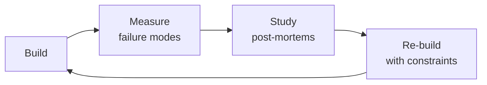

# Data Scientist

Apply the scientific method to data problems — frame questions as testable hypotheses, design rigorous
experiments, perform exploratory data analysis, build and validate statistical models, and communicate
results to drive business decisions. This skill covers the full data science lifecycle: problem framing,
EDA methodology, statistical testing (t-test, chi-square, ANOVA, non-parametric), A/B testing design
(sample size, power analysis, MDE, SRM, peeking corrections), causal inference (DID, RDD, IV, propensity
scores), regression analysis, time series forecasting, survival analysis, feature engineering, model
interpretability (SHAP, LIME, partial dependence), Bayesian approaches, and ethical data science.

## Route the Request

### Auto-Route (No User Input Required)
Evaluate these file-system conditions in order. First match wins — jump immediately.

| # | Condition | Action |
|---|-----------|--------|
| A1 | `file_contains("*.py", "statsmodels.formula.api")` OR `file_contains("*.py", "scipy.stats.ttest_ind")` OR `file_contains("*.py", "chi2_contingency")` OR `file_contains("*.R", "t.test(")` | Load **statistical-testing** sub-skill — test selection, assumption checking, effect sizes, p-value reporting |
| A2 | `file_contains("*.py", "power_analysis")` OR `file_contains("*.py", "TTestIndPower")` OR `file_contains("*.py", "minimum_detectable_effect")` OR `file_contains("*.py", "sample_size_calc")` | Load **experiment-design** sub-skill — power analysis, SRM check, CUPED, sequential testing, alpha-spending |
| A3 | `file_contains("*.py", "from causalinference")` OR `file_contains("*.py", "from dowhy")` OR `file_contains("*.py", "propensity_score")` OR `file_contains("*.py", "DifferenceInDifferences")` OR `file_contains("*.py", "from linearmodels")` | Load **causal-inference** sub-skill — DID, RDD, IV/2SLS, DAGs, do-calculus, placebo tests |
| A4 | `file_contains("*.py", "XGBClassifier(")` OR `file_contains("*.py", "LGBMClassifier(")` OR `file_contains("*.py", "RandomForestClassifier(")` OR `file_contains("*.py", "cross_val_score(")` | Load **predictive-modeling** sub-skill — feature engineering, model selection, hyperparameter tuning, cross-validation |
| A5 | `file_contains("*.py", "from statsmodels.tsa.arima")` OR `file_contains("*.py", "from prophet import Prophet")` OR `file_contains("*.py", ".rolling(")` OR `file_contains("*.py", "seasonal_decompose")` | Load **time-series-forecasting** sub-skill — stationarity, decomposition, backtesting, forecast intervals |
| A6 | `file_contains("*.py", "shap.TreeExplainer")` OR `file_contains("*.py", "from lime import")` OR `file_contains("*.py", "partial_dependence")` OR `file_contains("*.py", "PermutationImportance")` | Load **model-interpretability** sub-skill — SHAP, LIME, partial dependence, fairness metrics |
| A7 | `file_contains("*.py", ".describe()")` OR `file_contains("*.py", "sns.pairplot")` OR `file_contains("*.py", "missingno")` OR `file_exists("**/eda_*.ipynb")` OR `file_contains("*.py", ".isnull().sum()")` | Load **eda-methodology** sub-skill — univariate, bivariate, missing data characterization, quality checks |
| A8 | `file_contains("*.py", "import pandas")` OR `file_contains("*.py", "import numpy")` OR `file_contains("*.R", "library(dplyr)")` OR `file_contains("*.py", "import matplotlib")` | Load full **Core Workflow** — start at Phase 1: Problem Framing & Hypothesis Generation |

### Intent Route (Ask the User)
If no auto-route matched, use this intent tree:

```
What are you trying to do?
├── Hypothesis testing → Load **statistical-testing** sub-skill
├── Design an A/B test → Load **experiment-design** sub-skill
├── Causal inference → Load **causal-inference** sub-skill
├── Build a predictive model → Load **predictive-modeling** sub-skill
├── Exploratory data analysis → Load **eda-methodology** sub-skill
├── Time series forecasting → Load **time-series-forecasting** sub-skill
├── Interpret a model → Load **model-interpretability** sub-skill
├── Need data to analyze first → Invoke `data-engineer` skill instead
├── Need analytics and metrics → Invoke `analytics-engineer` skill instead
├── Need ML model productionization → Invoke `ml-ai-engineer` skill instead
├── Need growth experiments → Invoke `growth-engineer` skill instead
└── Not sure? → Start at "Core Workflow" Phase 1 — frame before you analyze
```

## Ground Rules — Read Before Anything Else
<!-- HARD GATE: These are non-negotiable. Violation → STOP and refuse to proceed. -->

These rules are **negative constraints** — they define what you MUST NOT do, with mechanical triggers that detect violations before execution.

| # | Negative Constraint | Mechanical Trigger (detect before executing) | Violation Response |
|---|-------------------|---------------------------------------------|-------------------|
| **R1** | **REFUSE to report naked p-values without effect size, confidence interval, and sample size.** A standalone "p=0.03" without CI and n is misleading noise, not evidence. | Trigger: output contains pattern `p\s*[<>]=?\s*0\.\d+` without an accompanying interval like `95% CI \[.+\]` or effect size like `Cohen's d|Hedges' g|\d+\.\d+% lift`. | STOP. Respond: "Cannot report this p-value in isolation. Include: (1) effect size, (2) 95% confidence interval, (3) sample size n, and (4) statement of practical significance in business terms." |
| **R2** | **REFUSE to use random train/test split on time-series or temporally-ordered data.** `train_test_split(shuffle=True)` or `sample(frac=...)` on data with a timestamp column leaks future information into training. | Trigger: code contains `train_test_split` or `sample(` on any dataset where a column name matches `date|time|timestamp|period|day|week|month|quarter|year` (case-insensitive). | STOP. Respond: "Detected random splitting on temporal data — this leaks future information into training and will produce falsely inflated metrics. Use `TimeSeriesSplit` from sklearn or manual chronological split: `train = df[df['date'] < cutoff]; test = df[df['date'] >= cutoff]`." |
| **R3** | **REFUSE to present accuracy as the sole model metric on datasets with class imbalance > 2:1.** Accuracy on a 95/5 split is meaningless — a model predicting the majority class scores 95%. | Trigger: code output contains `accuracy` or `score` as the only reported metric AND class distribution check (`value_counts(normalize=True)`) shows any class < 20% or > 80%. | STOP. Respond: "Accuracy is misleading on imbalanced data (class ratio detected: X:Y). Replace with: (1) precision and recall per class, (2) F1-score per class, (3) precision-recall AUC (not ROC AUC), and (4) confusion matrix with raw counts." |
| **R4** | **DETECT and flag any feature computed with data from after the prediction point.** Temporal leakage (e.g., `days_since_last_login` computed at label time) is the #1 cause of "98% AUC in validation, 56% in production." | Trigger: any feature name matching `days_since_|_after_|post_|future_|next_` OR any feature derived from a column whose timestamp is later than the label/prediction timestamp. | STOP. Respond: "Suspected temporal leakage in feature [name]: this feature uses data from after the prediction point. Audit every feature against the question: 'Would I know this value at prediction time?' Remove or recompute any feature whose value depends on post-prediction data." |
| **R5** | **REFUSE to compare model results without a baseline.** Reporting "XGBoost achieves 87% F1" without comparing to a trivial baseline (mean, mode, last-value, or a simple heuristic) overstates model value. | Trigger: model performance numbers are reported without any preceding baseline comparison line containing `baseline|naive|dummy|heuristic|rule.based|simple average`. | STOP. Respond: "No baseline comparison found. Always report: (1) baseline method (e.g., 'always-predict-majority-class'), (2) baseline metric, (3) model metric, (4) delta. If the model's improvement over baseline is < 5%, question whether model complexity is justified." |
| **R6** | **REFUSE to run unadjusted hypothesis tests after continuous monitoring or interim peeking.** Checking p-values daily on an ongoing experiment without sequential correction inflates false positive rate from 5% to 26-40%. | Trigger: code contains a p-value comparison (`.pvalue < 0.05`) AND either (a) no alpha-spending function (`alpha_spending|O'Brien-Fleming|Pocock|Lan-DeMets`) or (b) no sequential test wrapper (`GroupSequential|always_valid`). | STOP. Respond: "Detected unadjusted interim analysis. Continuous peeking at p < 0.05 without correction inflates Type I error to ~26% (30-day experiment, daily peeking). Either: (1) pre-register a single analysis date and do not peek, or (2) use sequential testing with alpha-spending boundaries (O'Brien-Fleming: α=0.001 at first look, α=0.005 at second, α=0.045 at final)." |
| **R7** | **DETECT and flag Simpson's paradox — always segment before reporting aggregates.** An overall positive result that disagrees with every segment is not a win — it's a red flag. | Trigger: aggregate metric (mean, rate, lift) reported across full population WITHOUT accompanying segment breakdowns for at least: `region|platform|device|cohort|traffic_source`. | STOP. Respond: "Aggregate result reported without segment breakdown. Always check: does the direction hold within each major segment? If the overall result is positive but key segments are negative, investigate confounding. Report: aggregate + segment-level results with interaction terms." |


## The Expert's Mindset

Masters of data scientist don't just build — they build **the right thing, at the right time, with the right trade-offs**. They think in systems, not tasks.

| Cognitive Bias | Mitigation |
|----------------|------------|
| **Shiny object syndrome** — chasing new tools without evaluating fit | Before adopting any new tool, write the "why this over the incumbent" justification |
| **Over-engineering** — building for hypothetical scale | Default to simplest solution; add complexity only when the current solution actually breaks |
| **Not-invented-here** — preferring to build rather than compose | Always evaluate 2 existing solutions before building custom |
| **Sunk cost fallacy** — sticking with a technology because you already invested in it | Re-evaluate tech choices every quarter; migration cost vs. staying cost |

### What Masters Know That Others Don't
- The **failure modes** of every component in their stack — not just the happy path
- When **not** to use their favorite tool (every tool has a misuse zone)
- That **data/model quality decays over time** — monitoring is not optional, it's foundational

### When to Break Your Own Rules
- **Move fast on reversible decisions.** Data format? Hard to change. Dashboard layout? Easy. Know the difference.
- **Skip the abstraction until the third use case.** Two is coincidence, three is a pattern.
## Operating at Different Levels

| Level | Scope | You... |
|-------|-------|--------|
| **L1** | Single component/module | Implement a well-defined piece following established patterns |
| **L2** | Feature or service | Design and build a complete feature; make tech choices within team conventions |
| **L3** | System or product area | Define architecture for a product area; set team tech standards; mentor L1-L2 |
| **L4** | Multiple systems / platform | Define org-wide architecture patterns; make build-vs-buy decisions; influence industry practice |
| **L5** | Industry / ecosystem | Create new architectural patterns adopted across the industry; redefine what's possible |

**Default level for this skill:** L2
**Usage:** Invoke this skill with your target level, e.g., "as an L3 data scientist, design..."

For full level definitions, see `skills/00-framework/skill-levels/SKILL.md`.

## When to Use

- You need to choose the right statistical test (t-test, chi-square, ANOVA, non-parametric) for a hypothesis
- You are designing an A/B test — sample size calculation, minimum detectable effect, peeking corrections
- You need to run exploratory data analysis (EDA) on a new dataset to surface patterns and anomalies
- You are building a predictive model (regression, classification, time series) for a business forecast
- You need to apply causal inference (difference-in-differences, RDD, instrumental variables) to observational data
- You are interpreting a black-box model using SHAP values, LIME explanations, or partial dependence plots
- You need to analyze time-to-event data with survival analysis or customer churn models
- You are setting up an experiment design with proper randomization, control groups, and statistical power

## Decision Trees
<!-- QUICK: 30s -- follow the ASCII tree to your scenario -->
### Choosing the Right Statistical Test

```
Outcome variable type?
├── Continuous (numeric)
│   ├── 2 groups, independent        → Independent t-test (Welch's if unequal variance)
│   ├── 2 groups, paired              → Paired t-test
│   ├── 3+ groups, independent        → One-way ANOVA → Tukey HSD post-hoc
│   ├── 3+ groups, repeated measures  → Repeated measures ANOVA → Bonferroni post-hoc
│   └── Non-normal / ordinal          → Mann-Whitney U (2 groups) or Kruskal-Wallis (3+)
│
├── Categorical (yes/no, A/B/C)
│   ├── 2 categories, 1 sample        → Binomial test or one-proportion z-test
│   ├── 2 categories, 2+ samples      → Chi-square test of independence
│   ├── Small expected counts (<5)    → Fisher's exact test
│   └── Ordinal categories            → Cochran-Armitage trend test
│
├── Time-to-event (survival)
│   ├── Compare 2+ groups             → Log-rank test
│   └── Cox model with covariates     → Cox proportional hazards
│
└── Relationship between 2+ variables
    ├── Linear relationship           → Pearson correlation
    ├── Monotonic (non-linear)        → Spearman rank correlation
    └── Predict Y from X1..Xn          → Linear/logistic regression
```

### Experiment Design Decision

```
What question are you answering?
├── "Does X cause Y?" (Causal)
│   ├── Can randomize? → A/B test (RCT)
│   │   ├── Single treatment vs control      → Simple A/B, t-test
│   │   ├── Multiple variants                 → Multi-arm test, ANOVA + Tukey
│   │   ├── Continuous optimization           → Multi-arm bandit (Thompson sampling)
│   │   └── Network effects / interference    → Switchback or cluster randomization
│   │
│   └── Cannot randomize? → Quasi-experimental
│       ├── Before/after with control group   → Difference-in-Differences (DID)
│       ├── Clear eligibility cutoff          → Regression Discontinuity (RDD)
│       ├── Instrument available              → Instrumental Variables (IV/2SLS)
│       └── Observational, many covariates    → Propensity score matching
│
├── "What will Y be?" (Prediction)
│   ├── Structured/tabular data → XGBoost, LightGBM, CatBoost
│   ├── Time series → ARIMA, Prophet, Temporal Fusion Transformer
│   └── Rare events → SMOTE + balanced ensemble or anomaly detection
│
└── "How do X and Y relate?" (Association/Exploration)
    ├── Which features matter? → SHAP values, permutation importance
    ├── Non-linear patterns? → GAMs, splines, partial dependence plots
    └── Segments behave differently? → Interaction terms, stratified analysis

**What good looks like:** The output opens correctly in the target tool. All validations pass. No placeholder content remains.

```

## Core Workflow
<!-- QUICK: 30s -- scan phase titles to understand the process -->
<!-- DEEP: 10+min -->
### Phase 1 (~15 min): Problem Framing & Hypothesis Generation

1. **Translate business question into statistical question**
   - Input: Stakeholder asks "Why is churn increasing?"
   - Output: "Is churn rate significantly higher in cohort Q2 vs Q1? What features predict churn?"
   - Frame as falsifiable hypothesis: H₀: churn_rate_Q2 = churn_rate_Q1 vs Hₐ: churn_rate_Q2 > churn_rate_Q1

2. **Define success metrics before touching data**
   - Primary metric: the one KPI the experiment/model must move
   - Guardrail metrics: metrics that must NOT degrade (e.g., revenue, latency, CSAT)
   - Diagnostic metrics: metrics to explain why (e.g., feature adoption, error rates)

3. **Map data requirements**
   - Identify all data sources, granularity, time range, completeness
   - Document known biases: selection bias, survivorship bias, measurement error
   - Determine if existing data can answer the question or if new data collection is needed

<!-- DEEP: 10+min -->
### Phase 2 (~30 min): Exploratory Data Analysis (EDA)

4. **Univariate analysis** — One variable at a time
   - Continuous: distribution (histogram, boxplot), central tendency (mean/median), spread (std/IQR), skew, outliers
   - Categorical: frequency counts, proportions, cardinality
   - Input: raw dataset. Output: summary statistics table + distribution plots

5. **Bivariate analysis** — Relationships between pairs
   - Continuous-Continuous: scatter plot, Pearson/Spearman correlation, hexbin for dense data
   - Continuous-Categorical: grouped boxplots, violin plots, aggregated statistics by category
   - Categorical-Categorical: contingency table, mosaic plot, Cramér's V
   - Input: EDA dataset. Output: correlation matrix, cross-tabulations, initial hypotheses validated/rejected

6. **Missing data assessment** — NOT just "drop NA"
   - Is missingness MCAR, MAR, or MNAR? (Little's MCAR test)
   - Decision: MNAR → flag as feature; MAR → impute (KNN, MICE, iterative); MCAR → drop if <5%
   - Input: dataset with missing values. Output: missingness report + imputation strategy

7. **Data quality checks**
   - Impossible values (age = 300, negative revenue)
   - Timestamp consistency (events in the future, out of business hours)
   - Duplicate records, near-duplicates
   - Input: dataset. Output: data quality issues log with remediation actions

<!-- DEEP: 10+min -->
### Phase 3 (~20 min): Statistical Testing & Experimentation

8. **Check test assumptions before running the test**
   - Normality: Shapiro-Wilk (n < 2000) or Kolmogorov-Smirnov (n > 2000), Q-Q plot visual inspection
   - Equal variance: Levene's test or Bartlett's test
   - Independence: Durbin-Watson for time series, design review for clustering
   - If assumptions violated: use non-parametric alternative or transform data

9. **Design the experiment with statistical power**
   - Effect size: what's the Minimum Detectable Effect (MDE) in business terms?
   - Power analysis: α = 0.05, β = 0.20 (power = 80%), compute required sample size N
   - Duration estimate: N / daily_traffic with buffer for seasonality, holidays, ramp-up
   - Use: `statsmodels.stats.power` or online calculators

10. **Run and monitor the experiment**
    - SRM check (Sample Ratio Mismatch): χ² test that observed assignment matches expected
    - Peeking correction: sequential testing (always valid p-values) or spend α across interim looks
    - CUPED (variance reduction): use pre-experiment covariates to reduce variance 10-30%

11. **Analyze results — go beyond the p-value**
    - Report: effect size + confidence interval + practical significance
    - Subgroup analysis: was the effect consistent across segments?
    - Multiple comparison correction: Bonferroni or Benjamini-Hochberg if testing many metrics
    - Input: experiment data. Output: decision (ship/iterate/kill) with evidence memo

<!-- DEEP: 10+min -->
### Phase 4 (~15 min): Predictive Modeling

12. **Feature engineering** — more impactful than model choice
    - Transformations: log for skewed targets, Box-Cox for normality, one-hot/label/target encoding
    - Interactions: create cross-features from domain knowledge (e.g., price × promotion_flag)
    - Temporal: lag features, rolling windows (7d, 30d), day-of-week, holiday indicators
    - Input: cleaned dataset. Output: feature matrix + feature importance ranking

13. **Model selection and training**
    - Split: chronological for time series (NEVER random), stratified for imbalanced classification
    - Cross-validation: k-fold for IID, time-series split for temporal, group k-fold for clustered
    - Hyperparameter tuning: Bayesian optimization (Optuna) over grid search for >3 params
    - Baseline: always compare to a simple model (mean, linear regression, previous period)

14. **Model evaluation — context-dependent metrics**
    - Classification: accuracy (balanced only), precision/recall/F1 (imbalanced), ROC-AUC, PR-AUC
    - Regression: RMSE (sensitive to outliers), MAE (robust), MAPE (interpretable, biased at zero)
    - Time series: MAE, sMAPE, MASE (scale-independent); backtesting with expanding window

15. **Model interpretability** — mandatory for any model affecting humans
    - Global: feature importance (SHAP summary, permutation), partial dependence plots
    - Local: SHAP waterfall for individual predictions, LIME for text/image
    - Input: trained model + holdout set. Output: interpretability report

<!-- DEEP: 10+min -->
### Phase 5 (~25 min): Communication

16. **Craft the narrative — not the methodology**
    - Lead with the decision: "We should ship variant B — +3.2% conversion [95% CI: +1.8%, +4.6%]"
    - Show uncertainty: always include confidence intervals, not just point estimates
    - Visualization: bar charts for comparisons, line charts for trends, waterfall for decomposition
    - Anticipate objections: "But what about segment X?" — pre-compute subgroup results

17. **Write the decision memo**
    - Structure: TL;DR → Business context → Methodology (appendix) → Results → Decision → Risks
    - Input: all analysis outputs. Output: 1-2 page memo + appendix with technical details

## Cross-Skill Coordination

| Upstream Skill | What You Receive | When to Involve |
|---|---|---|
| `data-engineer` | Data schema documentation, SLAs for freshness, backfill capabilities, quality checks | Before designing experiments or analysis that depend on data availability |
| `analytics-engineer` | Metric calculation logic, experiment metric implementation, curated analysis datasets | Before defining experiment metrics or building analysis models |
| `ml-ai-engineer` | Model artifacts, feature engineering code, inference pipeline requirements, monitoring thresholds | Before productionizing statistical models or integrating ML predictions |

| Downstream Skill | What You Provide | Impact of Delay |
|---|---|---|
| `product-strategist` | Experiment results with confidence intervals, effect sizes, trade-off analysis | Product decisions lack evidence — roadmap driven by intuition |
| `growth-engineer` | Experiment tracking setup, metric calculation, statistical significance implementation, SRM checks | Growth experiments can't measure impact — invalid results |
| `ml-ai-engineer` | Feature engineering insights, model evaluation metrics, training data quality assessment | ML models built on poor features — garbage in, garbage out |
| `analytics-engineer` | Metric definitions, experiment frameworks, statistical function specifications | Analytics can't build trusted metrics — dashboards unreliable |

## Proactive Triggers

| Trigger | Action | Why |
|---------|--------|-----|
| Experiment reaches pre-registered duration — decision gate activated | Run final analysis with pre-specified tests; report effect size + CI + practical significance; close experiment within 48 hours | Indefinite experiments waste traffic and delay decisions — pre-registered duration is the contract, honor it |
| SRM (Sample Ratio Mismatch) check fails on running experiment | Pause experiment immediately; investigate bucketing bug, bot traffic, or infrastructure issue; do NOT analyze results | SRM invalidates the entire experiment — any result from a mismatched sample is garbage regardless of p-value |
| Model AUC > 0.98 on holdout — suspiciously good | Audit features for target leakage (future info, post-outcome signals); check for identity leaks; suspect before celebrating | If your model is "too good," suspect leakage — the most common ML failure is invisible data leakage, not underfitting |
| Simpson's paradox detected: overall result disagrees with every segment | Report both aggregate and segmented results; investigate confounder; add interaction terms to model; do NOT report aggregate alone | An overall positive that disagrees with every segment is not a win — it's a warning to dig deeper |
| Stakeholder requests "just give me the p-value" without effect size or CI | Refuse to report p-value alone; educate on effect size; always include CI and practical significance assessment | A p-value without effect size is responsibility without accountability — with enough data, everything is "significant" |
| Model deployed to production without fairness evaluation | Audit model predictions by demographic slice; evaluate demographic parity and equal opportunity; document disparities before customers are affected | Historical data encodes historical bias — a model deployed without fairness evaluation amplifies discrimination at scale |
| Chronological leakage detected: future data leaking into training set | Re-split by strict time boundaries; audit every feature for temporal dependency; use expanding window backtest | Random train/test splits on temporal data leak the future into the past — time-based splits are non-negotiable |
| Analysis code produces different results when re-run 6 months later | Pin dependencies, set random seeds, version datasets with hashes, log git commit — reproducibility requires discipline, not luck | An unreproducible experiment result is an anecdote, not evidence — science requires reproducibility |

## Scale Depth
<!-- QUICK: 30s -- find your team size column -->
### Solo (1 person, 0-100 users)
- **What changes**: Data scientist = you also do data engineering, analytics, and ML. Focus on fast, directional analyses. Jupyter notebooks are fine. Statistical rigor: report p-values but don't obsess over power analysis. Models are proof-of-concept.
- **What to skip**: Power analysis for every test. Formal experiment documentation. Separate training/serving infrastructure. Model monitoring and drift detection. Multiple comparison corrections for exploratory analyses.
- **Coordination**: Self-contained. Share results as notebook exports or 2-pager memos.
- **Cost**: Free — use Python (scipy, statsmodels, scikit-learn), Jupyter, and Google Colab.

### Small Team (2-10 people, 100-10K users)
- **What changes**: Basic experiment platform (growth tool, feature flag service). Statistical rigor: power analysis before all experiments, SRM checks, CUPED. Peer review of experiment designs before launch. Model versioning with Git. Result documentation in shared knowledge base.
- **What to skip**: Full MLOps pipeline. Experimentation platform (use feature flags + SQL). Causal inference for every question (A/B test when possible).
- **Coordination**: Weekly experiment review. Coordinate with data engineer for pipeline reliability. Share experiment calendar to avoid interaction effects.
- **Cost**: $0-500/month for BI tools. Time: 1-2 days per experiment from design to decision.

### Medium Team (10-50 people, 10K-1M users)
- **What changes**: Dedicated experimentation platform with automated SRM, sequential testing, CUPED. Full MLOps for production models. Experimentation culture: quarterly planning, experiment review board. Model governance: fairness audits, documentation for compliance. Advanced causal inference for non-randomizable questions.
- **What to skip**: Real-time model serving (batch is fine for most). Custom experimentation platform (use off-the-shelf). Bayesian methods everywhere (frequentist is adequate for most).
- **Coordination**: Bi-weekly experiment review board. Data science guild for methodology standards. Coordinate with compliance for model risk management.
- **Cost**: $2K-10K/month (experimentation platform, compute). Dedicated experimentation PM.

### Enterprise (50+ people, 1M+ users)
- **What changes**: Tiered experimentation (exploratory → canary → holdout → full launch). Model risk management framework. Centralized feature store connecting experiments to production models. Data science platform with shared compute, versioned environments, and reproducibility guarantees. Cross-team experiment interference detection. Federated learning for privacy-sensitive use cases.
- **What's full production**: Experimentation center of excellence. Model cards for all production models. Ethical AI review board. Counterfactual evaluation framework. Data science on-call rotation for critical models.
- **Coordination**: Monthly experiment governance board. Cross-functional model review (legal, compliance, product, engineering). Quarterly methodology audit.
- **Cost**: $50K-200K+/month (platform, compute, dedicated experimentation team, governance).

### Transition Triggers
- **Solo → Small**: Second analyst joins. >100 users making predictive models valuable. First revenue-impacting experiment.
- **Small → Medium**: 5+ parallel experiments. First production model serving customers. Compliance requirements appear.
- **Medium → Enterprise**: 20+ data scientists. Model risk management required by regulation. Cross-team experiment interference observed.

## What Good Looks Like

> Every experiment begins with a pre-registered hypothesis, a power analysis, and a peer-reviewed design before the first user is bucketed. Results include confidence intervals and effect sizes, not just p-values, and the experimentation platform automatically flags SRM violations and peeking issues. Stakeholders make decisions on statistically rigorous evidence within 48 hours of experiment completion, and the experiment knowledge base means no question is tested twice. Models in production have documented performance baselines, and degradation triggers a retrain before any customer notices.

### Cross-skills Integration
```bash
# Analytics models → Statistical analysis → ML models
/analytics-engineer && /data-scientist && /ml-ai-engineer
# Clean datasets → Hypothesis testing → Business decisions
/data-engineer && /data-scientist && /product-manager
# Analytics engineers provide clean, modeled data. Data scientists test hypotheses and build models. ML engineers productionize.
```

## Sub-Skills
<!-- QUICK: 30s -- table of deeper dives by topic -->
| Sub-Skill | When to Use | Context |
|-----------|-------------|---------|
| `experiment-design` | Designing A/B tests, multi-arm bandits, quasi-experiments | Power analysis, MDE calculation, SRM checks, peeking corrections, CUPED, sequential testing |
| `statistical-testing` | Choosing and running the right statistical test | Test selection decision tree, assumption checking, effect size + CI reporting, multiple comparison corrections |
| `causal-inference` | When randomization is impossible | DID, RDD, IV/2SLS, propensity score matching, synthetic control, DAG-based identification |
| `eda-methodology` | Initial data exploration and quality assessment | Univariate/bivariate analysis, missing data handling (MCAR/MAR/MNAR), outlier detection, data quality checks |
| `predictive-modeling` | Building models to predict outcomes | Feature engineering, model selection (XGBoost, LightGBM), hyperparameter tuning (Optuna), evaluation metrics |
| `time-series-forecasting` | Forecasting metrics over time | ARIMA, Prophet, exponential smoothing, backtesting, trend/seasonality decomposition, changepoint detection |
| `model-interpretability` | Explaining model predictions to stakeholders | SHAP, LIME, partial dependence plots, permutation importance, ICE plots, accumulated local effects |
| `bayesian-methods` | When prior knowledge exists or uncertainty quantification matters | Bayesian A/B testing, hierarchical models, probabilistic programming (PyMC, Stan), credible intervals |

## Best Practices
<!-- STANDARD: 3min -- rules extracted from production experience -->
- **Frame before you analyze** — Write down the hypothesis, null, alternative, and decision criteria before opening the dataset. Prevents p-hacking and confirmation bias.
- **Always report effect size + confidence interval** — A p-value alone is insufficient. "Statistically significant" with 0.01% lift on a $10 test is useless.
- **CUPED by default** — Pre-experiment covariates reduce variance 10-30%, cutting required sample size proportionally. The single highest-ROI experiment technique.
- **SRM check is non-negotiable** — Sample Ratio Mismatch invalidates an experiment. Automate this check; never skip it.
- **Peek, but peek correctly** — Continuous monitoring with unadjusted p-values inflates false positives 5-20x. Use sequential testing or alpha-spending.
- **One primary metric per experiment** — Multiple primary metrics require multiple comparison correction (Bonferroni). Use secondary and guardrail metrics instead.
- **Chronological splits for time series** — Random train/test split leaks future into past. Always split by time. Always backtest on expanding or rolling windows.
- **Interpretability is not optional** — If your model affects humans (loans, hiring, healthcare), you MUST explain predictions. Use SHAP for global + local explanations.
- **Simpson's paradox is lurking** — Always check if aggregated trends reverse within subgroups. Analyze both overall and segmented.
- **Communicate uncertainty visually** — Error bars, confidence bands, prediction intervals. Point estimates alone mislead decision-makers.


## Anti-Patterns

| ❌ Anti-Pattern | ✅ Do This Instead | 🔍 Detect (grep / lint) | 🛡️ Auto-Prevent |
|-----------------|---------------------|--------------------------|-------------------|
| Reporting "statistically significant" without effect size, confidence interval, or practical significance assessment | Always report effect size + 95% CI + "what this means in business terms" — a significant 0.02% lift on a $10 test is useless | `grep -nP 'p\s*[<>]\s*0\.0\d' *.py *.R` → flag any p-value reported without accompanying CI/effect size in ±5 lines | pre-commit hook: `rg 'p\s*<\s*0\.0\d' --after 5 | grep -v 'CI\|confiden\|effect.size\|Cohen\|Hedges'` — fail if p reported without CI context |
| Continuously monitoring experiments and stopping at the first p < 0.05 | Pre-register duration + sample size; use sequential testing or alpha-spending if monitoring continuously; unadjusted peeking inflates false positives 5-20x | `grep -nP '\.pvalue\s*<\s*0\.05' *.py` → check if `GroupSequential` or `alpha_spending` appears within same file | ESLint rule + pre-commit: detect `pvalue < 0.05` without `GroupSequential\|alpha_spending\|O'Brien-Fleming` in same commit — block the commit |
| Using random train/test split on time-series data | Always split chronologically; backtest on expanding or rolling windows; random splits leak future information into training | `grep -nP 'train_test_split.*shuffle\s*=\s*True' *.py` near `date\|time\|timestamp\|period` columns | pre-commit hook: `rg 'train_test_split' -l | xargs rg -l 'date\|timestamp\|period'` → fail with "Temporal data detected — use TimeSeriesSplit" |
| Deploying a model without a baseline comparison — "82% accuracy" without context | Always compare to a simple baseline (mean, last-value, rule-based heuristic); 82% accuracy sounds good until you learn the baseline is 81% | `grep -nP '(accuracy|F1|AUC|precision).*0\.\d+' *.py` → check if `baseline\|naive\|dummy\|heuristic` appears before the metric report | pytest fixture: `test_baseline_exists()` — assert that every model training script defines and reports at least one baseline metric before model metrics |
| Running 50 metrics per experiment and highlighting the one with p < 0.05 | One primary metric, pre-registered; apply Bonferroni or FDR correction for secondary metrics; cherry-picking is p-hacking | `grep -cP '\.pvalue|p_value' *.py` → count distinct p-value comparisons; if > 3 without `multipletests\|Bonferroni\|FDR\|holm`, flag | pre-commit hook: count `pvalue` occurrences in analysis scripts → if > 3 without `statsmodels.stats.multitest`, emit warning and require override flag |
| Treating missing data as ignorable without characterizing the missingness mechanism (MCAR/MAR/MNAR) | Characterize missing data pattern before imputation; MNAR missingness can't be fixed with simple imputation — it requires modeling the missingness itself | `grep -nP 'dropna\(\)|fillna\(.*\)' *.py` → flag if no preceding `Little's MCAR\|missingno.matrix\|msno\|missing_data` analysis | pre-commit hook: detect `dropna()` or `fillna()` — require comment or docstring confirming MCAR/MAR/MNAR assessment was performed |
| Interpreting SHAP values as causal effects | SHAP explains correlation, not causation — a feature can be highly predictive without being causally actionable; use causal inference methods for "why" questions | `grep -nP 'SHAP.*causes?|shap.*because|feature.*causes?' *.py` → flag causal language near SHAP | pytest: `test_no_causal_shap()` — grep output of analysis notebook/script for "SHAP.*caus" and fail with explanation |
| Building production ML without monitoring for drift — train once, deploy forever | Implement data drift detection, prediction drift monitoring, and automated retraining triggers — models decay silently | `grep -nP 'model\.predict|\.save_model|pickle\.dump' *.py` → flag if no `drift\|monitor\|retrain\|evidently\|alibi` found in project | CI quality gate: `rg -l 'model.predict\|.save_model' | xargs rg -L 'drift\|monitor\|retrain'` → fail deployment if prediction code lacks drift monitoring |

## Error Decoder

| 🖥️ Console Match (grep pattern) | Symptom | Root Cause | Fix | 🔄 Auto-Recovery Loop |
|---|---|---|---|---|
| `grep -i "AUC.*0\.9[5-9]\|accuracy.*0\.9[5-9]" *.py` → AUC/accuracy > 0.95 on validation | Model achieves 98% AUC on holdout but performs at chance level in production | Temporal leakage: trained on random split that leaked future information; features included post-outcome signals like `days_since_last_purchase` | Use time-based split for temporal data; audit every feature for target leakage; use expanding window backtesting | 1. `grep -rn 'train_test_split' *.py` → identify split method 2. Replace with `TimeSeriesSplit(n_splits=5)` from sklearn 3. Audit features: `for col in df.columns: print(col, df[col].dtype)` 4. Create feature timeline — flag any column whose latest timestamp > label timestamp 5. Retrain with chronological split only 6. Verify AUC dropped to realistic range (< 0.85) |
| `grep -rn "random\.seed\|np\.random\.seed\|torch\.manual_seed" *.py` → no seed found | A/B test from 6 months ago can't be reproduced — different results every re-run | Experiment not reproducible: no pinned dependencies, no random seed, analysis code used different data versions each time | Pin all library versions (requirements.txt/lockfile); set `random.seed`, `numpy.random.seed`; version datasets with hashes; log git commit hash | 1. `pip freeze > requirements.txt` — pin all deps 2. Add `SEED = 42; random.seed(SEED); np.random.seed(SEED)` at top of script 3. `md5 data.csv > data.hash` — version data 4. `git rev-parse HEAD > git_commit.txt` — log commit 5. Re-run twice and diff outputs — if not identical, check for non-deterministic ops |
| `grep -rn "demographic_parity\|equal_opportunity\|fairness\|disparate_impact" *.py` → no fairness metrics | ML model recommended higher credit limits to men than equally-qualified women | Feature selection bias: training data included gender-correlated features (income, ZIP code) without fairness evaluation; biased historical lending patterns baked into model | Evaluate fairness metrics (demographic parity, equal opportunity) during model development; exclude or adjust biased proxy features; audit model on demographic slices | 1. `pip install fairlearn aif360` 2. Add `from fairlearn.metrics import demographic_parity_difference` 3. Compute per-group metrics: `for group in df['gender'].unique(): print(group, model.score(X[df.gender==group], y[df.gender==group]))` 4. If parity difference > 0.1 → drop proxy features (ZIP, income if gender-correlated) 5. Re-evaluate fairness after each feature removal 6. Gate deployment on parity threshold |
| `grep -rn "segment\|subgroup\|stratified\|cohort" *.py` → no segment analysis | Simpson's paradox: overall A/B test shows +3% lift, but every segment shows negative | Aggregated results reverse direction when data is pooled; hidden confounder (e.g., treatment deployed to high-traffic region first) masks true effect | Always segment analysis by region, platform, and cohort before reporting aggregate results; include interaction terms in statistical model | 1. Identify potential confounders: `df.groupby(['region', 'platform']).size()` 2. Compute stratified lift: `for seg in segments: print(seg, compute_lift(df[df.segment==seg]))` 3. Check direction consistency — if any segment disagrees with aggregate, investigate confounder 4. Add interaction: `smf.ols('metric ~ treatment * region', data=df).fit().summary()` 5. Report only if effect direction holds across all major segments |
| `grep -oP 'p\s*=\s*0\.0[0-4]\d' *.py` → p<0.05 but `grep -c "effect.size\|Cohen\|lift\|CI" *.py` returns 0 | "Statistically significant" result (p=0.03) but effect is a $0.02/user lift on a $10 test | Statistical significance ≠ practical significance; tiny effect size detected due to massive sample (10M users) | Report effect size + confidence interval alongside p-value; define minimum practically significant effect before experiment starts | 1. Compute effect size: `Cohen's d = (mean_treatment - mean_control) / pooled_std` 2. Compute MDE: `statsmodels.stats.power.TTestIndPower().solve_power(effect_size=None, nobs=n, alpha=0.05, power=0.8)` 3. If observed effect < MDE: "Result is statistically significant but practically meaningless — the effect is smaller than our pre-registered MDE of X" 4. Gate decision: only ship if observed effect ≥ MDE AND CI does not cross zero |
| `grep -rn "shap\.TreeExplainer\|shap\.summary_plot" *.py` → but `grep -rn "correlation|confound|DAG|causal" *.py` returns 0 | Stakeholder interprets SHAP feature ranking as "what causes the outcome" | SHAP correlation-causation confusion: highly predictive features may be downstream effects or proxies for unmeasured confounders | Replace causal language with associative language; run a DAG-based causal check before interpreting SHAP as actionable | 1. Draw DAG: list all variables, draw arrows for known causal relationships 2. Identify backdoor paths per SHAP top-5 feature 3. If feature X is not causally upstream of Y in the DAG → flag: "X is predictive (SHAP rank #N) but not causally actionable per DAG" 4. Add disclaimer: "SHAP values explain model predictions, not real-world causation. Do not treat high-SHAP features as intervention targets without causal validation." |
| `grep -oP 'p\s*[<>]=\s*0\.0(49|50|51)' *.py` → p-value hovers near 0.05 threshold | Stakeholder asks "Is p=0.051 significant?" — conclusion depends entirely on arbitrary 0.05 cutoff | Dichotomous thinking about p-values: treating α=0.05 as a magical boundary rather than a continuous measure of evidence against H₀ | Report the p-value as continuous evidence, not a binary decision; include Bayes factor or false positive risk as alternative | 1. Compute Bayes factor: `BF = exp((BIC_null - BIC_alt) / 2)` 2. Report: "p=0.051 means the data are ~2.5× more likely under Hₐ than H₀ (assuming equal priors). This is weak evidence, not a failed experiment." 3. Recommend: "Increase sample to N=X to achieve p<0.01 (not 0.05) which requires BF>8" 4. Never use phrases "trending toward significance" or "marginally significant" |


## Production Checklist

| ID | Checklist Item | Validation Command | Auto-Fix |
|----|---------------|-------------------|----------|
| **[S1]** | Business question translated to falsifiable statistical hypothesis (H₀ and Hₐ explicitly stated) | `grep -c 'H[₀0]\|H[ₐa]\|null.hypothesis\|alternative.hypothesis' analysis.py` → must return ≥ 1 | pre-commit hook: require `## Hypothesis` section in analysis script header with explicit H₀/Hₐ |
| **[S2]** | Primary metric defined; guardrail metrics identified; diagnostic metrics mapped | `grep -c 'primary_metric\|guardrail\|diagnostic' analysis.py` → must return ≥ 3 | pytest: `test_metrics_defined()` — parse script for metric definitions; fail if primary + 2 guardrails not found |
| **[S3]** | EDA completed: univariate distributions, bivariate relationships, missing data characterized (MCAR/MAR/MNAR) | `grep -c 'histogram\|boxplot\|correlation\|isnull\|missingno\|MCAR\|MAR\|MNAR' eda.py` → must return ≥ 3 | CI gate: require `eda_report.html` artifact from `pandas-profiling` or `ydata-profiling` in CI output |
| **[S4]** | Data quality issues documented: impossible values, timestamp anomalies, duplicates, measurement errors | `grep -c 'impossible\|anomaly\|duplicate\|measurement.error\|out.of.range' data_quality.py` → must return ≥ 2 | `great_expectations` suite in CI: run expectation suite, block if any `expect_column_values_to_be_between` fails |
| **[S5]** | Experiment: power analysis completed (α=0.05, power≥0.80); MDE justified in business terms | `grep -c 'power_analysis\|TTestIndPower\|solve_power\|minimum_detectable_effect' experiment.py` → must return ≥ 1 | pytest fixture: `test_power_analysis()` — assert `solve_power()` call exists and power ≥ 0.80 |
| **[S6]** | Experiment: SRM check automated and passing before analysis | `grep -c 'sample_ratio_mismatch\|SRM\|chi2.*assignment\|expected.*observed' experiment.py` → must return ≥ 1 | pytest: `test_srm_check()` — compute χ² on assignment ratios, fail if p < 0.01 (SRM detected) |
| **[S7]** | Experiment: peeking correction in place (sequential testing or alpha-spending) | `grep -c 'alpha_spending\|GroupSequential\|sequential.testing\|always.valid\|Lan-DeMets\|O.Brien.Fleming' experiment.py` → must return ≥ 1 | CI gate: if `experiment_duration > 7` days AND no sequential test found → block and require override |
| **[S8]** | Experiment: results reported as effect size + 95% CI + practical significance assessment | `grep -c 'effect.size\|Cohen\|95%.CI\|practical.significance\|business.impact' results.py` → must return ≥ 3 | pytest: `test_results_reporting()` — assert output contains effect size, CI, and business interpretation strings |
| **[S9]** | Model: chronological or grouped split used (no random split leakage) | `grep -c 'TimeSeriesSplit\|GroupKFold\|chronological\|time.based.split' model.py` → must return ≥ 1 | pre-commit hook: if `train_test_split` found AND `date\|timestamp\|period` column exists → fail with fix suggestion |
| **[S10]** | Model: baseline model comparison included (always compare to simple heuristic) | `grep -c 'baseline\|DummyClassifier\|DummyRegressor\|naive\|heuristic\|simple.average' model.py` → must return ≥ 1 | pytest: `test_baseline_exists()` — assert `DummyClassifier`/`DummyRegressor` or manual baseline is instantiated before model |
| **[S11]** | Model: interpretability analysis completed (SHAP, LIME, or partial dependence) | `grep -c 'shap\|LIME\|partial_dependence\|permutation_importance\|eli5' model.py` → must return ≥ 1 | CI gate: require `shap_summary.png` or `pdp_plot.png` artifact in CI output |
| **[S12]** | Model: fairness evaluation across demographic segments (if relevant) | `grep -c 'fairness\|demographic.parity\|equal.opportunity\|disparate.impact\|Fairlearn\|AIF360' model.py` → must return ≥ 0 (optional) | If demographic columns present → CI gate auto-enables: block if `demographic_parity_difference > 0.1` |
| **[S13]** | Decision memo written: TL;DR, context, results, recommendation, risks, next steps | `test -f decision_memo.md` → exit 0 | CI: generate `decision_memo_template.md`; require user to fill and commit before merge |
| **[S14]** | Code, data, and results reproducible (pinned dependencies, seed set, data version documented) | `test -f requirements.txt && test -f data.hash && grep -c 'SEED\|random.seed\|np.random.seed' analysis.py` → all must pass | `make repro-check`: generates lockfile, hashes data, injects seed if missing, fails if seed changes between runs |
| **[S15]** | Stakeholder communication: 1-page summary with visualization, technical appendix for peer review | `grep -c 'summary\|visualization\|executive\|appendix' report.py` → must return ≥ 2 | CI: run `quarto render report.qmd` → fail if output PDF/HTML not generated or < 1 page |

## Footguns
<!-- DEEP: 10+min — war stories from data science in production -->

| Footgun | What Happened | Root Cause | How to Prevent |
|---------|---------------|------------|----------------|
| 30-day A/B test with daily peeking — team found "significance" on day 12, shipped a feature that had zero effect, and reversed it 6 weeks later after a properly-designed follow-up | A growth team ran an experiment on the signup flow with daily Slack alerts showing the p-value. On day 12, p dropped below 0.05, the team celebrated and shipped. Six weeks later, a replication experiment with pre-registered analysis plan showed a 0.1% lift (not significant). The original "effect" was noise from peeking — the p-value had crossed 0.05 8 times during the 30-day period. | No sequential testing correction. The team treated p < 0.05 as a one-time threshold but checked it 30 times — effectively running 30 hypothesis tests. The probability of finding "significance" by day 30 with daily peeking at α=0.05 is 26%, not 5%. | **Use sequential testing (always-valid p-values) or pre-register a fixed analysis date and don't look before it.** If stakeholders insist on interim looks, use α-spending (e.g., Lan-DeMets O'Brien-Fleming boundaries): look at day 7 (α=0.001), day 14 (α=0.005), day 30 (α=0.045). Tools: Eppo, Statsig both implement sequential testing out of the box. |
| Churn model achieved 0.91 AUC in validation — but leaked the target by including `days_since_last_login` as a feature. Failed completely in production | A data scientist trained an XGBoost model to predict 30-day churn using 90 features. Validation AUC was 0.91 — the best the team had ever seen. In production, AUC was 0.56 (barely above random). The issue: `days_since_last_login` was computed at the time of the label, meaning for churned users it was always ≥30. The model learned that `days_since_last_login > 30 → churn` — a post-hoc observation, not a prediction. | Temporal leakage: a feature was computed after the prediction point. The scientist used `pandas` to join features to labels without checking the timestamp order of each feature. | **For every feature, ask: "Would I know this value at prediction time?"** If a feature is computed from data after the label timestamp, it's leakage. Build a feature timeline: label each column with the latest timestamp it uses. Any column with a timestamp > prediction_time is invalid. Use `timeseries_split` or group-based cross-validation that respects temporal order. |
| Presented "statistically significant 1.2% lift" to VP of Product — sample size was 200 users, MDE was never discussed, and the 95% CI was [-0.8%, +3.2%] | A PM asked "Is the new onboarding flow better?" The data scientist ran a t-test on 200 users and reported p=0.04, calling it "statistically significant." The VP approved a full rollout. The actual effect — measured 3 months later with 50,000 users — was -0.3% (not significant, wrong direction). The 1.2% "effect" was noise from a tiny sample. The 95% CI crossed zero, which the scientist didn't report. | Statistical significance ≠ practical significance. With n=200, the minimum detectable effect was 8% — the scientist couldn't have detected a 1.2% effect even if it were real. The CI was reported as a footnote, not as the primary result. | **Always report the 95% CI as the primary result, not the p-value.** State the MDE in business terms: "With our sample size of 200, we can only detect effects ≥ 8%. The observed 1.2% is within the noise band." If the CI crosses zero, the result is inconclusive — regardless of p-value. Use a sample size calculator BEFORE the experiment, not after. |
| Applied random 80/20 train-test split to a time-series forecasting problem — model achieved MAPE 3% in validation, 47% in production | A demand forecasting model for a retail chain was trained with `train_test_split(shuffle=True)` on 2 years of daily sales. The model "saw" December 2023 data in training and "predicted" December 2023 in the test set — it learned that December = high sales and regurgitated it. In production, it predicted 2024 holiday demand but got the trend wrong because it had never actually forecasted into the future. | Random splitting breaks temporal dependence. Sales in December 2023 are correlated with November 2023, so putting both months in the same split means the test set isn't independent. The model memorized seasonal patterns instead of learning to extrapolate. | **Always split time-series data chronologically: train on [Jan 2023 – Oct 2024], test on [Nov 2024 – Dec 2024].** Use walk-forward validation: train on expanding windows and test on the next period. If your test error is drastically different from validation error, you have temporal leakage. |
| ML model predicted credit risk with 95% accuracy — by predicting "low risk" for everyone. 95% accuracy on a 95/5 class imbalance is worse than a coin flip | A fintech team built a default prediction model and celebrated the 95% accuracy. The business deployed it to automate loan approvals. Six months later, default rates hadn't changed — the model was approving the same loans as before. Investigation: the dataset was 95% non-defaulters. The model learned to predict "no default" for every applicant. Accuracy = 95%. Precision on the 5% minority class = 0%. Recall on defaults = 0%. | Accuracy is meaningless for imbalanced classification. The team never computed precision, recall, or F1 for the minority class. The business metric (default rate reduction) was never validated. | **Never report accuracy alone for imbalanced problems.** Minimum: precision, recall, and F1 for EVERY class. Better: use precision-recall AUC (not ROC AUC) for imbalanced data. Better still: tie to a business metric — "If we reject the top 10% highest-risk applicants, how much would the default rate decrease?" Report the confusion matrix with raw counts. If 3 of 4 numbers in the matrix are near zero, your model is useless. |

## Calibration — How to Know Your Level
<!-- STANDARD: 3min — honest self-assessment rubric -->

| You Know You're Stuck at L1 When... | You Know You've Reached L2 When... | You Know You're L3 When... |
|---|---|---|
| You can run `model.fit()` and report accuracy but can't explain when accuracy is a misleading metric — or name 3 alternatives | You can design an experiment end-to-end: power analysis with business-justified MDE, sequential testing with pre-registered analysis plan, and results reported as effect size + CI | A product manager describes a messy business question in 5 minutes and within 15 minutes you can specify the exact statistical test, sample size, decision rule, and the 3 ways the analysis could go wrong |
| You apply a t-test to every A/B test without checking whether the data meets the assumptions (normality, independence, equal variance) | You select the appropriate test based on data characteristics (Mann-Whitney for skewed metrics, delta method for ratio metrics, CUPED for variance reduction) and verify assumptions before running | You can look at a published academic study or industry white paper and identify the fatal statistical flaw (p-hacking, leakage, confounding, selection bias) within 10 minutes |
| You see a "statistically significant p=0.04" result and recommend shipping without looking at the sample size, effect size, or confidence interval | You refuse to report a p-value without the accompanying effect size, 95% CI, and a statement about practical significance in business terms | The CEO asks "Should we bet $10M on this recommendation?" and you give a calibrated probability — "65% chance the effect is real and ≥2%" — and 12 months later your forecast was correct |

**The Litmus Test:** Someone hands you a dataset and says "find insights." Can you produce a report that includes: (a) data quality issues that would invalidate any analysis, (b) the right statistical framework for each research question, (c) effect sizes with uncertainty, and (d) a clear "here's what we know, here's what we don't know" conclusion? If your report says "the data shows X" without caveats, you're not L3 yet.

## Deliberate Practice



| Level | Practice | Frequency |
|-------|----------|-----------|
| **Novice** | Rebuild an existing system from scratch, then compare your design with the original | Monthly |
| **Competent** | Add a new constraint (10x data, zero downtime, etc.) to a familiar design and re-architect | Quarterly |
| **Expert** | Design the same system under 3 conflicting constraint sets; write a decision record for each | Quarterly |
| **Master** | Teach a junior to design a system; your role is to ask questions, not give answers | Monthly |

**The One Highest-Leverage Activity:** Every quarter, take a system you built 6+ months ago and redesign it from scratch with what you know now. Write down what changed and why.

## References
<!-- QUICK: 30s -- links to deeper reading -->
- [Statistical Testing Field Manual](references/statistical-testing.md) — Test selection, assumption checking, effect sizes, multiple comparisons
- [A/B Testing Design & Analysis Guide](references/ab-testing-guide.md) — Power analysis, SRM, CUPED, sequential testing, multi-arm bandits
- [Causal Inference Cookbook](references/causal-inference.md) — DID, RDD, IV, propensity scores, DAGs, do-calculus
- [Model Interpretability Guide](references/model-interpretability.md) — SHAP, LIME, partial dependence, fairness evaluation
- Trustworthy Online Controlled Experiments (Kohavi, Tang, Xu) — The A/B testing bible
- Causal Inference: The Mixtape (Cunningham) — Accessible causal inference with code examples
- Statistical Rethinking (McElreath) — Bayesian approach to data science
- https://www.evanmiller.org/ — Practical A/B testing calculators and explainers
