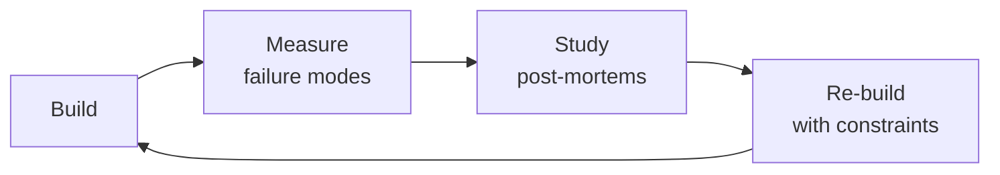

# Data Scientist
> **Portability target:** Spec-level (runs on Claude Code, Copilot, Gemini CLI, Codex, Cursor). No vendor-specific frontmatter fields.

Apply the scientific method to data problems — frame questions as testable hypotheses, design rigorous
experiments, perform exploratory data analysis, build and validate statistical models, and communicate
results to drive business decisions. This skill covers the full data science lifecycle: problem framing,
EDA methodology, statistical testing (t-test, chi-square, ANOVA, non-parametric), A/B testing design
(sample size, power analysis, MDE, SRM, peeking corrections), causal inference (DID, RDD, IV, propensity
scores), regression analysis, time series forecasting, survival analysis, feature engineering, model
interpretability (SHAP, LIME, partial dependence), Bayesian approaches, and ethical data science.

## Route the Request

### Auto-Route (No User Input Required)
Evaluate these file-system conditions in order. First match wins — jump immediately.

| # | Condition | Action |
|---|-----------|--------|
| A1 | `file_contains("*.py", "statsmodels.formula.api")` OR `file_contains("*.py", "scipy.stats.ttest_ind")` OR `file_contains("*.py", "chi2_contingency")` OR `file_contains("*.R", "t.test(")` | Load **statistical-testing** sub-skill — test selection, assumption checking, effect sizes, p-value reporting |
| A2 | `file_contains("*.py", "power_analysis")` OR `file_contains("*.py", "TTestIndPower")` OR `file_contains("*.py", "minimum_detectable_effect")` OR `file_contains("*.py", "sample_size_calc")` | Load **experiment-design** sub-skill — power analysis, SRM check, CUPED, sequential testing, alpha-spending |
| A3 | `file_contains("*.py", "from causalinference")` OR `file_contains("*.py", "from dowhy")` OR `file_contains("*.py", "propensity_score")` OR `file_contains("*.py", "DifferenceInDifferences")` OR `file_contains("*.py", "from linearmodels")` | Load **causal-inference** sub-skill — DID, RDD, IV/2SLS, DAGs, do-calculus, placebo tests |
| A4 | `file_contains("*.py", "XGBClassifier(")` OR `file_contains("*.py", "LGBMClassifier(")` OR `file_contains("*.py", "RandomForestClassifier(")` OR `file_contains("*.py", "cross_val_score(")` | Load **predictive-modeling** sub-skill — feature engineering, model selection, hyperparameter tuning, cross-validation |
| A5 | `file_contains("*.py", "from statsmodels.tsa.arima")` OR `file_contains("*.py", "from prophet import Prophet")` OR `file_contains("*.py", ".rolling(")` OR `file_contains("*.py", "seasonal_decompose")` | Load **time-series-forecasting** sub-skill — stationarity, decomposition, backtesting, forecast intervals |
| A6 | `file_contains("*.py", "shap.TreeExplainer")` OR `file_contains("*.py", "from lime import")` OR `file_contains("*.py", "partial_dependence")` OR `file_contains("*.py", "PermutationImportance")` | Load **model-interpretability** sub-skill — SHAP, LIME, partial dependence, fairness metrics |
| A7 | `file_contains("*.py", ".describe()")` OR `file_contains("*.py", "sns.pairplot")` OR `file_contains("*.py", "missingno")` OR `file_exists("**/eda_*.ipynb")` OR `file_contains("*.py", ".isnull().sum()")` | Load **eda-methodology** sub-skill — univariate, bivariate, missing data characterization, quality checks |
| A8 | `file_contains("*.py", "import pandas")` OR `file_contains("*.py", "import numpy")` OR `file_contains("*.R", "library(dplyr)")` OR `file_contains("*.py", "import matplotlib")` | Load full **Core Workflow** — start at Phase 1: Problem Framing & Hypothesis Generation |

### Intent Route (Ask the User)
If no auto-route matched, use this intent tree:

```
What are you trying to do?
├── Hypothesis testing → Load **statistical-testing** sub-skill
├── Design an A/B test → Load **experiment-design** sub-skill
├── Causal inference → Load **causal-inference** sub-skill
├── Build a predictive model → Load **predictive-modeling** sub-skill
├── Exploratory data analysis → Load **eda-methodology** sub-skill
├── Time series forecasting → Load **time-series-forecasting** sub-skill
├── Interpret a model → Load **model-interpretability** sub-skill
├── Need data to analyze first → Invoke `data-engineer` skill instead
├── Need analytics and metrics → Invoke `analytics-engineer` skill instead
├── Need ML model productionization → Invoke `ml-ai-engineer` skill instead
├── Need growth experiments → Invoke `growth-engineer` skill instead
└── Not sure? → Start at "Core Workflow" Phase 1 — frame before you analyze
```

## Ground Rules — Read Before Anything Else

<!-- HARD GATE: These are non-negotiable. Violation → STOP and refuse to proceed. -->

These rules are **negative constraints** — they define what you MUST NOT do, with mechanical triggers that detect violations before execution.

| # | Negative Constraint | Mechanical Trigger (detect before executing) | Violation Response |
|---|-------------------|---------------------------------------------|-------------------|
| **R1** | **REFUSE to report naked p-values without effect size, confidence interval, and sample size.** A standalone "p=0.03" without CI and n is misleading noise, not evidence. | Trigger: output contains pattern `p\s*[<>]=?\s*0\.\d+` without an accompanying interval like `95% CI \[.+\]` or effect size like `Cohen's d|Hedges' g|\d+\.\d+% lift`. | STOP. Respond: "Cannot report this p-value in isolation. Include: (1) effect size, (2) 95% confidence interval, (3) sample size n, and (4) statement of practical significance in business terms." |
| **R2** | **REFUSE to use random train/test split on time-series or temporally-ordered data.** `train_test_split(shuffle=True)` or `sample(frac=...)` on data with a timestamp column leaks future information into training. | Trigger: code contains `train_test_split` or `sample(` on any dataset where a column name matches `date|time|timestamp|period|day|week|month|quarter|year` (case-insensitive). | STOP. Respond: "Detected random splitting on temporal data — this leaks future information into training and will produce falsely inflated metrics. Use `TimeSeriesSplit` from sklearn or manual chronological split: `train = df[df['date'] < cutoff]; test = df[df['date'] >= cutoff]`." |
| **R3** | **REFUSE to present accuracy as the sole model metric on datasets with class imbalance > 2:1.** Accuracy on a 95/5 split is meaningless — a model predicting the majority class scores 95%. | Trigger: code output contains `accuracy` or `score` as the only reported metric AND class distribution check (`value_counts(normalize=True)`) shows any class < 20% or > 80%. | STOP. Respond: "Accuracy is misleading on imbalanced data (class ratio detected: X:Y). Replace with: (1) precision and recall per class, (2) F1-score per class, (3) precision-recall AUC (not ROC AUC), and (4) confusion matrix with raw counts." |
| **R4** | **DETECT and flag any feature computed with data from after the prediction point.** Temporal leakage (e.g., `days_since_last_login` computed at label time) is the #1 cause of "98% AUC in validation, 56% in production." | Trigger: any feature name matching `days_since_|_after_|post_|future_|next_` OR any feature derived from a column whose timestamp is later than the label/prediction timestamp. | STOP. Respond: "Suspected temporal leakage in feature [name]: this feature uses data from after the prediction point. Audit every feature against the question: 'Would I know this value at prediction time?' Remove or recompute any feature whose value depends on post-prediction data." |
| **R5** | **REFUSE to compare model results without a baseline.** Reporting "XGBoost achieves 87% F1" without comparing to a trivial baseline (mean, mode, last-value, or a simple heuristic) overstates model value. | Trigger: model performance numbers are reported without any preceding baseline comparison line containing `baseline|naive|dummy|heuristic|rule.based|simple average`. | STOP. Respond: "No baseline comparison found. Always report: (1) baseline method (e.g., 'always-predict-majority-class'), (2) baseline metric, (3) model metric, (4) delta. If the model's improvement over baseline is < 5%, question whether model complexity is justified." |
| **R6** | **REFUSE to run unadjusted hypothesis tests after continuous monitoring or interim peeking.** Checking p-values daily on an ongoing experiment without sequential correction inflates false positive rate from 5% to 26-40%. | Trigger: code contains a p-value comparison (`.pvalue < 0.05`) AND either (a) no alpha-spending function (`alpha_spending|O'Brien-Fleming|Pocock|Lan-DeMets`) or (b) no sequential test wrapper (`GroupSequential|always_valid`). | STOP. Respond: "Detected unadjusted interim analysis. Continuous peeking at p < 0.05 without correction inflates Type I error to ~26% (30-day experiment, daily peeking). Either: (1) pre-register a single analysis date and do not peek, or (2) use sequential testing with alpha-spending boundaries (O'Brien-Fleming: α=0.001 at first look, α=0.005 at second, α=0.045 at final)." |
| **R7** | **DETECT and flag Simpson's paradox — always segment before reporting aggregates.** An overall positive result that disagrees with every segment is not a win — it's a red flag. | Trigger: aggregate metric (mean, rate, lift) reported across full population WITHOUT accompanying segment breakdowns for at least: `region|platform|device|cohort|traffic_source`. | STOP. Respond: "Aggregate result reported without segment breakdown. Always check: does the direction hold within each major segment? If the overall result is positive but key segments are negative, investigate confounding. Report: aggregate + segment-level results with interaction terms." |

## The Expert's Mindset

Masters of data scientist don't just build — they build **the right thing, at the right time, with the right trade-offs**. They think in systems, not tasks.

| Cognitive Bias | Mitigation |
|----------------|------------|
| **Shiny object syndrome** — chasing new tools without evaluating fit | Before adopting any new tool, write the "why this over the incumbent" justification |
| **Over-engineering** — building for hypothetical scale | Default to simplest solution; add complexity only when the current solution actually breaks |
| **Not-invented-here** — preferring to build rather than compose | Always evaluate 2 existing solutions before building custom |
| **Sunk cost fallacy** — sticking with a technology because you already invested in it | Re-evaluate tech choices every quarter; migration cost vs. staying cost |

### What Masters Know That Others Don't
- The **failure modes** of every component in their stack — not just the happy path
- When **not** to use their favorite tool (every tool has a misuse zone)
- That **data/model quality decays over time** — monitoring is not optional, it's foundational

### When to Break Your Own Rules
- **Move fast on reversible decisions.** Data format? Hard to change. Dashboard layout? Easy. Know the difference.
- **Skip the abstraction until the third use case.** Two is coincidence, three is a pattern.

## Operating at Different Levels

| Level | Scope | You... |
|-------|-------|--------|
| **L1** | Single component/module | Implement a well-defined piece following established patterns |
| **L2** | Feature or service | Design and build a complete feature; make tech choices within team conventions |
| **L3** | System or product area | Define architecture for a product area; set team tech standards; mentor L1-L2 |
| **L4** | Multiple systems / platform | Define org-wide architecture patterns; make build-vs-buy decisions; influence industry practice |
| **L5** | Industry / ecosystem | Create new architectural patterns adopted across the industry; redefine what's possible |

**Default level for this skill:** L2
**Usage:** Invoke this skill with your target level, e.g., "as an L3 data scientist, design..."

For full level definitions, see `skills/00-framework/skill-levels/SKILL.md`.

## When to Use

- You need to choose the right statistical test (t-test, chi-square, ANOVA, non-parametric) for a hypothesis
- You are designing an A/B test — sample size calculation, minimum detectable effect, peeking corrections
- You need to run exploratory data analysis (EDA) on a new dataset to surface patterns and anomalies
- You are building a predictive model (regression, classification, time series) for a business forecast
- You need to apply causal inference (difference-in-differences, RDD, instrumental variables) to observational data
- You are interpreting a black-box model using SHAP values, LIME explanations, or partial dependence plots
- You need to analyze time-to-event data with survival analysis or customer churn models
- You are setting up an experiment design with proper randomization, control groups, and statistical power

## Decision Trees

<!-- QUICK: 30s -- follow the ASCII tree to your scenario -->
### Choosing the Right Statistical Test

```
Outcome variable type?
├── Continuous (numeric)
│   ├── 2 groups, independent        → Independent t-test (Welch's if unequal variance)
│   ├── 2 groups, paired              → Paired t-test
│   ├── 3+ groups, independent        → One-way ANOVA → Tukey HSD post-hoc
│   ├── 3+ groups, repeated measures  → Repeated measures ANOVA → Bonferroni post-hoc
│   └── Non-normal / ordinal          → Mann-Whitney U (2 groups) or Kruskal-Wallis (3+)
│
├── Categorical (yes/no, A/B/C)
│   ├── 2 categories, 1 sample        → Binomial test or one-proportion z-test
│   ├── 2 categories, 2+ samples      → Chi-square test of independence
│   ├── Small expected counts (<5)    → Fisher's exact test
│   └── Ordinal categories            → Cochran-Armitage trend test
│
├── Time-to-event (survival)
│   ├── Compare 2+ groups             → Log-rank test
│   └── Cox model with covariates     → Cox proportional hazards
│
└── Relationship between 2+ variables
    ├── Linear relationship           → Pearson correlation
    ├── Monotonic (non-linear)        → Spearman rank correlation
    └── Predict Y from X1..Xn          → Linear/logistic regression
```

### Experiment Design Decision

```
What question are you answering?
├── "Does X cause Y?" (Causal)
│   ├── Can randomize? → A/B test (RCT)
│   │   ├── Single treatment vs control      → Simple A/B, t-test
│   │   ├── Multiple variants                 → Multi-arm test, ANOVA + Tukey
│   │   ├── Continuous optimization           → Multi-arm bandit (Thompson sampling)
│   │   └── Network effects / interference    → Switchback or cluster randomization
│   │
│   └── Cannot randomize? → Quasi-experimental
│       ├── Before/after with control group   → Difference-in-Differences (DID)
│       ├── Clear eligibility cutoff          → Regression Discontinuity (RDD)
│       ├── Instrument available              → Instrumental Variables (IV/2SLS)
│       └── Observational, many covariates    → Propensity score matching
│
├── "What will Y be?" (Prediction)
│   ├── Structured/tabular data → XGBoost, LightGBM, CatBoost
│   ├── Time series → ARIMA, Prophet, Temporal Fusion Transformer
│   └── Rare events → SMOTE + balanced ensemble or anomaly detection
│
└── "How do X and Y relate?" (Association/Exploration)
    ├── Which features matter? → SHAP values, permutation importance
    ├── Non-linear patterns? → GAMs, splines, partial dependence plots
    └── Segments behave differently? → Interaction terms, stratified analysis

**What good looks like:** The output opens correctly in the target tool. All validations pass. No placeholder content remains.

```

## Core Workflow

<!-- QUICK: 30s -- scan phase titles to understand the process -->
<!-- DEEP: 10+min -->
### Phase 1 (~15 min): Problem Framing & Hypothesis Generation

1. **Translate business question into statistical question**
   - Input: Stakeholder asks "Why is churn increasing?"
   - Output: "Is churn rate significantly higher in cohort Q2 vs Q1? What features predict churn?"
   - Frame as falsifiable hypothesis: H₀: churn_rate_Q2 = churn_rate_Q1 vs Hₐ: churn_rate_Q2 > churn_rate_Q1

2. **Define success metrics before touching data**
   - Primary metric: the one KPI the experiment/model must move
   - Guardrail metrics: metrics that must NOT degrade (e.g., revenue, latency, CSAT)
   - Diagnostic metrics: metrics to explain why (e.g., feature adoption, error rates)

3. **Map data requirements**
   - Identify all data sources, granularity, time range, completeness
   - Document known biases: selection bias, survivorship bias, measurement error
   - Determine if existing data can answer the question or if new data collection is needed

<!-- DEEP: 10+min -->
### Phase 2 (~30 min): Exploratory Data Analysis (EDA)

4. **Univariate analysis** — One variable at a time
   - Continuous: distribution (histogram, boxplot), central tendency (mean/median), spread (std/IQR), skew, outliers
   - Categorical: frequency counts, proportions, cardinality
   - Input: raw dataset. Output: summary statistics table + distribution plots

5. **Bivariate analysis** — Relationships between pairs
   - Continuous-Continuous: scatter plot, Pearson/Spearman correlation, hexbin for dense data
   - Continuous-Categorical: grouped boxplots, violin plots, aggregated statistics by category
   - Categorical-Categorical: contingency table, mosaic plot, Cramér's V
   - Input: EDA dataset. Output: correlation matrix, cross-tabulations, initial hypotheses validated/rejected

6. **Missing data assessment** — NOT just "drop NA"
   - Is missingness MCAR, MAR, or MNAR? (Little's MCAR test)
   - Decision: MNAR → flag as feature; MAR → impute (KNN, MICE, iterative); MCAR → drop if <5%
   - Input: dataset with missing values. Output: missingness report + imputation strategy

7. **Data quality checks**
   - Impossible values (age = 300, negative revenue)
   - Timestamp consistency (events in the future, out of business hours)
   - Duplicate records, near-duplicates
   - Input: dataset. Output: data quality issues log with remediation actions

<!-- DEEP: 10+min -->
### Phase 3 (~20 min): Statistical Testing & Experimentation

8. **Check test assumptions before running the test**
   - Normality: Shapiro-Wilk (n < 2000) or Kolmogorov-Smirnov (n > 2000), Q-Q plot visual inspection
   - Equal variance: Levene's test or Bartlett's test
   - Independence: Durbin-Watson for time series, design review for clustering
   - If assumptions violated: use non-parametric alternative or transform data

> See [references/core-workflow.md](references/core-workflow.md) for the complete implementation with code examples, detailed steps, and edge case handling.

## Cross-Skill Coordination

| Upstream Skill | What You Receive | When to Involve |
|---|---|---|
| `data-engineer` | Data schema documentation, SLAs for freshness, backfill capabilities, quality checks | Before designing experiments or analysis that depend on data availability |
| `analytics-engineer` | Metric calculation logic, experiment metric implementation, curated analysis datasets | Before defining experiment metrics or building analysis models |
| `ml-ai-engineer` | Model artifacts, feature engineering code, inference pipeline requirements, monitoring thresholds | Before productionizing statistical models or integrating ML predictions |

| Downstream Skill | What You Provide | Impact of Delay |
|---|---|---|
| `product-strategist` | Experiment results with confidence intervals, effect sizes, trade-off analysis | Product decisions lack evidence — roadmap driven by intuition |
| `growth-engineer` | Experiment tracking setup, metric calculation, statistical significance implementation, SRM checks | Growth experiments can't measure impact — invalid results |
| `ml-ai-engineer` | Feature engineering insights, model evaluation metrics, training data quality assessment | ML models built on poor features — garbage in, garbage out |
| `analytics-engineer` | Metric definitions, experiment frameworks, statistical function specifications | Analytics can't build trusted metrics — dashboards unreliable |

## Proactive Triggers

| Trigger | Action | Why |
|---------|--------|-----|
| Experiment reaches pre-registered duration — decision gate activated | Run final analysis with pre-specified tests; report effect size + CI + practical significance; close experiment within 48 hours | Indefinite experiments waste traffic and delay decisions — pre-registered duration is the contract, honor it |
| SRM (Sample Ratio Mismatch) check fails on running experiment | Pause experiment immediately; investigate bucketing bug, bot traffic, or infrastructure issue; do NOT analyze results | SRM invalidates the entire experiment — any result from a mismatched sample is garbage regardless of p-value |
| Model AUC > 0.98 on holdout — suspiciously good | Audit features for target leakage (future info, post-outcome signals); check for identity leaks; suspect before celebrating | If your model is "too good," suspect leakage — the most common ML failure is invisible data leakage, not underfitting |
| Simpson's paradox detected: overall result disagrees with every segment | Report both aggregate and segmented results; investigate confounder; add interaction terms to model; do NOT report aggregate alone | An overall positive that disagrees with every segment is not a win — it's a warning to dig deeper |
| Stakeholder requests "just give me the p-value" without effect size or CI | Refuse to report p-value alone; educate on effect size; always include CI and practical significance assessment | A p-value without effect size is responsibility without accountability — with enough data, everything is "significant" |
| Model deployed to production without fairness evaluation | Audit model predictions by demographic slice; evaluate demographic parity and equal opportunity; document disparities before customers are affected | Historical data encodes historical bias — a model deployed without fairness evaluation amplifies discrimination at scale |
| Chronological leakage detected: future data leaking into training set | Re-split by strict time boundaries; audit every feature for temporal dependency; use expanding window backtest | Random train/test splits on temporal data leak the future into the past — time-based splits are non-negotiable |
| Analysis code produces different results when re-run 6 months later | Pin dependencies, set random seeds, version datasets with hashes, log git commit — reproducibility requires discipline, not luck | An unreproducible experiment result is an anecdote, not evidence — science requires reproducibility |

## What Good Looks Like

> Every experiment begins with a pre-registered hypothesis, a power analysis, and a peer-reviewed design before the first user is bucketed.

> See [references/what-good-looks-like.md](references/what-good-looks-like.md) for the full quality standard.


### Cross-skills Integration
```bash
# Analytics models → Statistical analysis → ML models
/analytics-engineer && /data-scientist && /ml-ai-engineer
# Clean datasets → Hypothesis testing → Business decisions
/data-engineer && /data-scientist && /product-manager
# Analytics engineers provide clean, modeled data. Data scientists test hypotheses and build models. ML engineers productionize.
```

## Deliberate Practice



| Level | Practice | Frequency |
|-------|----------|-----------|
| **Novice** | Rebuild an existing system from scratch, then compare your design with the original | Monthly |
| **Competent** | Add a new constraint (10x data, zero downtime, etc.) to a familiar design and re-architect | Quarterly |
| **Expert** | Design the same system under 3 conflicting constraint sets; write a decision record for each | Quarterly |
| **Master** | Teach a junior to design a system; your role is to ask questions, not give answers | Monthly |

**The One Highest-Leverage Activity:** Every quarter, take a system you built 6+ months ago and redesign it from scratch with what you know now. Write down what changed and why.

## Gotchas

- **Train/test leak through scaling**: If you call `StandardScaler.fit_transform(X)` before `train_test_split`, the scaler has "seen" test data mean and variance. Predictions look better during evaluation but fail in production. Always `train_test_split` FIRST, then `fit_transform` on train, `transform` (only) on test.
- **Imbalanced classification accuracy is misleading**: A model that predicts "not fraud" 100% of the time has 99.9% accuracy if fraud rate is 0.1%. Use precision-recall AUC or F1, not accuracy, for imbalanced datasets.
- **`pandas.DataFrame.apply(axis=1)` is NOT vectorized** — it's a Python for-loop in disguise. On 1M rows, `apply(axis=1)` takes ~10 seconds vs ~0.01 seconds for a vectorized operation. Prefer `.str` accessors, `.where()`, or numpy operations.
- **Jupyter notebook cell execution order** is NOT guaranteed by numbering. Kernel state persists across cell re-runs. A variable defined in cell [5] still exists when you re-run cell [3]. Restart kernel and "Run All" before sharing results — otherwise the output is unreproducible.
- **SHAP values for tree models** with correlated features produce misleading importance scores. If `income` and `credit_score` are 0.7 correlated, SHAP splits importance between them arbitrarily. Use permutation importance as a sanity check.
- **`random_state=42` everywhere** means your cross-validation folds, model initialization, AND data shuffling all use the same seed. This produces unrealistically consistent results. Use different random seeds for different sources of randomness.


## References

Detailed reference material loaded on demand:

- **Core Workflow — Full Implementation**: See [core-workflow.md](references/core-workflow.md)
- **Anti-Patterns**: See [anti-patterns.md](references/anti-patterns.md)
- **Best Practices**: See [best-practices.md](references/best-practices.md)
- **Calibration — How to Know Your Level**: See [calibration.md](references/calibration.md)
- **Production Checklist**: See [checklist.md](references/checklist.md)
- **Error Decoder**: See [error-decoder.md](references/error-decoder.md)
- **Footguns**: See [footguns.md](references/footguns.md)
- **Scale Depth**: See [scale-depth.md](references/scale-depth.md)
- **Sub-Skills**: See [sub-skills.md](references/sub-skills.md)

