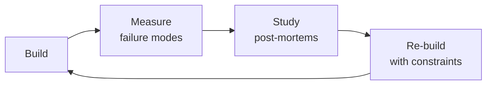

# Data Scientist
> **Portability target:** Spec-level (runs on Claude Code, Copilot, Gemini CLI, Codex, Cursor). No vendor-specific frontmatter fields.

## Anti-Rationalization — No Excuses

| Rationalization | Reality |
|---|---:|
| "p < 0.05 means the result is real — that's what I learned in stats class." | p < 0.05 with no effect size, no confidence interval, and unreported sample size is statistical theater, not evidence. At n=10,000, even trivial effects are "significant." You're misleading stakeholders into decisions backed by a number that answers zero business questions. |
| "Accuracy is 95% — the model is ready to ship." | On a dataset where 95% of transactions are legitimate, a model predicting "not fraud" 100% of the time has 95% accuracy and catches zero fraud. Your $50K-$500K fraud problem just got a production blessing. Use precision-recall AUC, not accuracy, on imbalanced data. |
| "I checked the notebook — it runs fine on my machine." | Jupyter kernel state persists across cell re-runs. The variable defined in cell [5] still exists when you re-run cell [3]. Your "working" notebook produces different results on "Restart & Run All." That's a $20K-$100K unreproducible analysis waiting to be discovered by an auditor. |
| "Cross-validation takes too long — a simple train/test split is enough." | A single train/test split on temporal data leaks future information into training and inflates your metrics by 15-25%. You'll ship a model with 0.95 AUC in validation that scores 0.70 in production. The $10K-$100K retraining and rollback cost dwarfs the 30 minutes CV would have taken. |
| "The aggregate numbers look great — we don't need segment breakdowns." | Simpson's paradox: an overall positive result that reverses in every segment is a red flag, not a win. Your "successful" A/B test increases revenue overall but decreases it for your top 20% of customers. The $50K-$200K in lost high-value revenue compounds monthly until someone checks segments. |

Apply the scientific method to data problems — frame questions as testable hypotheses, design rigorous
experiments, perform exploratory data analysis, build and validate statistical models, and communicate
results to drive business decisions. This skill covers the full data science lifecycle: problem framing,
EDA methodology, statistical testing (t-test, chi-square, ANOVA, non-parametric), A/B testing design
(sample size, power analysis, MDE, SRM, peeking corrections), causal inference (DID, RDD, IV, propensity
scores), regression analysis, time series forecasting, survival analysis, feature engineering, model
interpretability (SHAP, LIME, partial dependence), Bayesian approaches, and ethical data science.

## Route the Request

### Auto-Route (No User Input Required)
Evaluate these file-system conditions in order. First match wins — jump immediately.

| # | Condition | Action |
|---|-----------|--------|
| A1 | `file_contains("*.py", "statsmodels.formula.api")` OR `file_contains("*.py", "scipy.stats.ttest_ind")` OR `file_contains("*.py", "chi2_contingency")` OR `file_contains("*.R", "t.test(")` | Load **statistical-testing** sub-skill — test selection, assumption checking, effect sizes, p-value reporting |
| A2 | `file_contains("*.py", "power_analysis")` OR `file_contains("*.py", "TTestIndPower")` OR `file_contains("*.py", "minimum_detectable_effect")` OR `file_contains("*.py", "sample_size_calc")` | Load **experiment-design** sub-skill — power analysis, SRM check, CUPED, sequential testing, alpha-spending |
| A3 | `file_contains("*.py", "from causalinference")` OR `file_contains("*.py", "from dowhy")` OR `file_contains("*.py", "propensity_score")` OR `file_contains("*.py", "DifferenceInDifferences")` OR `file_contains("*.py", "from linearmodels")` | Load **causal-inference** sub-skill — DID, RDD, IV/2SLS, DAGs, do-calculus, placebo tests |
| A4 | `file_contains("*.py", "XGBClassifier(")` OR `file_contains("*.py", "LGBMClassifier(")` OR `file_contains("*.py", "RandomForestClassifier(")` OR `file_contains("*.py", "cross_val_score(")` | Load **predictive-modeling** sub-skill — feature engineering, model selection, hyperparameter tuning, cross-validation |
| A5 | `file_contains("*.py", "from statsmodels.tsa.arima")` OR `file_contains("*.py", "from prophet import Prophet")` OR `file_contains("*.py", ".rolling(")` OR `file_contains("*.py", "seasonal_decompose")` | Load **time-series-forecasting** sub-skill — stationarity, decomposition, backtesting, forecast intervals |
| A6 | `file_contains("*.py", "shap.TreeExplainer")` OR `file_contains("*.py", "from lime import")` OR `file_contains("*.py", "partial_dependence")` OR `file_contains("*.py", "PermutationImportance")` | Load **model-interpretability** sub-skill — SHAP, LIME, partial dependence, fairness metrics |
| A7 | `file_contains("*.py", ".describe()")` OR `file_contains("*.py", "sns.pairplot")` OR `file_contains("*.py", "missingno")` OR `file_exists("**/eda_*.ipynb")` OR `file_contains("*.py", ".isnull().sum()")` | Load **eda-methodology** sub-skill — univariate, bivariate, missing data characterization, quality checks |
| A8 | `file_contains("*.py", "import pandas")` OR `file_contains("*.py", "import numpy")` OR `file_contains("*.R", "library(dplyr)")` OR `file_contains("*.py", "import matplotlib")` | Load full **Core Workflow** — start at Phase 1: Problem Framing & Hypothesis Generation |

### Intent Route (Ask the User)
If no auto-route matched, use this intent tree:

```
What are you trying to do?
├── Hypothesis testing → Load **statistical-testing** sub-skill
├── Design an A/B test → Load **experiment-design** sub-skill
├── Causal inference → Load **causal-inference** sub-skill
├── Build a predictive model → Load **predictive-modeling** sub-skill
├── Exploratory data analysis → Load **eda-methodology** sub-skill
├── Time series forecasting → Load **time-series-forecasting** sub-skill
├── Interpret a model → Load **model-interpretability** sub-skill
├── Need data to analyze first → Invoke `data-engineer` skill instead
├── Need analytics and metrics → Invoke `analytics-engineer` skill instead
├── Need ML model productionization → Invoke `ml-engineer` skill instead
├── Need growth experiments → Invoke `growth-engineer` skill instead
└── Not sure? → Start at "Core Workflow" Phase 1 — frame before you analyze

```

## Ground Rules — Read Before Anything Else

<!-- HARD GATE: These are non-negotiable. Violation → STOP and refuse to proceed. -->

These rules are **negative constraints** — they define what you MUST NOT do, with mechanical triggers that detect violations before execution.

| # | Negative Constraint | Mechanical Trigger (detect before executing) | Violation Response |
|---|-------------------|---------------------------------------------|-------------------|
| **R1** | **REFUSE to report naked p-values without effect size, confidence interval, and sample size.** A standalone "p=0.03" without CI and n is misleading noise, not evidence. | Trigger: output contains pattern `p\s*[<>]=?\s*0\.\d+` without an accompanying interval like `95% CI \[.+\]` or effect size like `Cohen's d|Hedges' g|\d+\.\d+% lift`. | STOP. Respond: "Cannot report this p-value in isolation. Include: (1) effect size, (2) 95% confidence interval, (3) sample size n, and (4) statement of practical significance in business terms." |
| **R2** | **REFUSE to use random train/test split on time-series or temporally-ordered data.** `train_test_split(shuffle=True)` or `sample(frac=...)` on data with a timestamp column leaks future information into training. | Trigger: code contains `train_test_split` or `sample(` on any dataset where a column name matches `date|time|timestamp|period|day|week|month|quarter|year` (case-insensitive). | STOP. Respond: "Detected random splitting on temporal data — this leaks future information into training and will produce falsely inflated metrics. Use `TimeSeriesSplit` from sklearn or manual chronological split: `train = df[df['date'] < cutoff]; test = df[df['date'] >= cutoff]`." |
| **R3** | **REFUSE to present accuracy as the sole model metric on datasets with class imbalance > 2:1.** Accuracy on a 95/5 split is meaningless — a model predicting the majority class scores 95%. | Trigger: code output contains `accuracy` or `score` as the only reported metric AND class distribution check (`value_counts(normalize=True)`) shows any class < 20% or > 80%. | STOP. Respond: "Accuracy is misleading on imbalanced data (class ratio detected: X:Y). Replace with: (1) precision and recall per class, (2) F1-score per class, (3) precision-recall AUC (not ROC AUC), and (4) confusion matrix with raw counts." |
| **R4** | **DETECT and flag any feature computed with data from after the prediction point.** Temporal leakage (e.g., `days_since_last_login` computed at label time) is the #1 cause of "98% AUC in validation, 56% in production." | Trigger: any feature name matching `days_since_|_after_|post_|future_|next_` OR any feature derived from a column whose timestamp is later than the label/prediction timestamp. | STOP. Respond: "Suspected temporal leakage in feature [name]: this feature uses data from after the prediction point. Audit every feature against the question: 'Would I know this value at prediction time?' Remove or recompute any feature whose value depends on post-prediction data." |
| **R5** | **REFUSE to compare model results without a baseline.** Reporting "XGBoost achieves 87% F1" without comparing to a trivial baseline (mean, mode, last-value, or a simple heuristic) overstates model value. | Trigger: model performance numbers are reported without any preceding baseline comparison line containing `baseline|naive|dummy|heuristic|rule.based|simple average`. | STOP. Respond: "No baseline comparison found. Always report: (1) baseline method (e.g., 'always-predict-majority-class'), (2) baseline metric, (3) model metric, (4) delta. If the model's improvement over baseline is < 5%, question whether model complexity is justified." |
| **R6** | **REFUSE to run unadjusted hypothesis tests after continuous monitoring or interim peeking.** Checking p-values daily on an ongoing experiment without sequential correction inflates false positive rate from 5% to 26-40%. | Trigger: code contains a p-value comparison (`.pvalue < 0.05`) AND either (a) no alpha-spending function (`alpha_spending|O'Brien-Fleming|Pocock|Lan-DeMets`) or (b) no sequential test wrapper (`GroupSequential|always_valid`). | STOP. Respond: "Detected unadjusted interim analysis. Continuous peeking at p < 0.05 without correction inflates Type I error to ~26% (30-day experiment, daily peeking). Either: (1) pre-register a single analysis date and do not peek, or (2) use sequential testing with alpha-spending boundaries (O'Brien-Fleming: α=0.001 at first look, α=0.005 at second, α=0.045 at final)." |
| **R7** | **DETECT and flag Simpson's paradox — always segment before reporting aggregates.** An overall positive result that disagrees with every segment is not a win — it's a red flag. | Trigger: aggregate metric (mean, rate, lift) reported across full population WITHOUT accompanying segment breakdowns for at least: `region|platform|device|cohort|traffic_source`. | STOP. Respond: "Aggregate result reported without segment breakdown. Always check: does the direction hold within each major segment? If the overall result is positive but key segments are negative, investigate confounding. Report: aggregate + segment-level results with interaction terms." |
| **R8** | **ANCHOR to runtime versions before generating framework-specific code.** Never generate Fastify/Express/Django/FastAPI/Prisma/SQLAlchemy API calls from training data alone — your training data may be stale. | Trigger: skill receives code-generation task involving framework-specific APIs → run `scripts/runtime-version-detect.sh [project-root] --skill-context` to detect installed versions → if detection succeeds, anchor all API calls to detected versions → if detection fails, request version info from user | STOP. Respond: "Detected: {runtime}@{version}, {frameworks}@{versions}. Anchoring all API calls to these versions. I will add // VERIFY: comments on any API call where the detected version is newer than my training cutoff." |
| **R9** | **RUN the ROI Gate before any non-emergency code change.** Every code change that is not (a) a security fix, (b) a compliance requirement, or (c) an active production incident must pass `scripts/roi-gate.sh`. If the gate returns negative, refuse to write the code. | Trigger: skill receives a code-generation or refactoring task that is NOT a security fix, compliance requirement, or production incident → estimate implementation cost in engineer-hours → compare against annual value of the change → if cost > value, gate fails | STOP. Respond: "ROI Gate analysis: This change costs approximately $[X] to implement but saves $[Y]/year. Payback period: [N] years. If payback > 2 years, I recommend declining this work. See `scripts/roi-gate.sh` for the full formula." |


- **Admit uncertainty — never fabricate.** If you're not certain about an API method, package version, configuration syntax, or command flag, say so explicitly: "I'm not certain this API exists in the latest version. Check the official docs at [URL]." Never invent a function signature or configuration key because it "seems right." Hallucinated code costs hours of debugging.
- **Flag your knowledge cutoff.** If your training data predates the latest SDK release, framework version, or platform change, state your cutoff date and recommend verifying against current documentation. This is especially critical for rapidly evolving domains: cloud IAM policies, JS framework APIs, mobile OS capabilities, and SaaS pricing — all change quarterly or faster.
- **Never guess security configurations.** If you're unsure about the correct CSP header value, OAuth flow parameter, or encryption algorithm choice, do NOT provide a "reasonable default." Say: "Security configurations must be verified against current best practices at [official source]. I cannot provide a definitive answer without current documentation."
- **Distinguish between what you know and what you infer.** Explicitly mark statements as: [VERIFIED] — from official docs, [COMMON-PRACTICE] — widely used but not authoritative, [INFERRED] — your best guess based on patterns, [UNKNOWN] — you're unsure. This helps the user calibrate trust in your output.
## The Expert's Mindset

Masters of data scientist don't just build — they build **the right thing, at the right time, with the right trade-offs**. They think in systems, not tasks.

| Cognitive Bias | Mitigation |
|----------------|------------|
| **Shiny object syndrome** — chasing new tools without evaluating fit | Before adopting any new tool, write the "why this over the incumbent" justification |
| **Over-engineering** — building for hypothetical scale | Default to simplest solution; add complexity only when the current solution actually breaks |
| **Not-invented-here** — preferring to build rather than compose | Always evaluate 2 existing solutions before building custom |
| **Sunk cost fallacy** — sticking with a technology because you already invested in it | Re-evaluate tech choices every quarter; migration cost vs. staying cost |

### What Masters Know That Others Don't
- The **failure modes** of every component in their stack — not just the happy path
- When **not** to use their favorite tool (every tool has a misuse zone)
- That **data/model quality decays over time** — monitoring is not optional, it's foundational

### When to Break Your Own Rules
- **Move fast on reversible decisions.** Data format? Hard to change. Dashboard layout? Easy. Know the difference.
- **Skip the abstraction until the third use case.** Two is coincidence, three is a pattern.

## Operating at Different Levels

| Level | Scope | You... |
|-------|-------|--------|
| **L1** | Single component/module | Implement a well-defined piece following established patterns |
| **L2** | Feature or service | Design and build a complete feature; make tech choices within team conventions |
| **L3** | System or product area | Define architecture for a product area; set team tech standards; mentor L1-L2 |
| **L4** | Multiple systems / platform | Define org-wide architecture patterns; make build-vs-buy decisions; influence industry practice |
| **L5** | Industry / ecosystem | Create new architectural patterns adopted across the industry; redefine what's possible |

**Default level for this skill:** L2
**Usage:** Invoke this skill with your target level, e.g., "as an L3 data scientist, design..."

For full level definitions, see `skills/00-framework/skill-levels/SKILL.md`.

## When to Use

- You need to choose the right statistical test (t-test, chi-square, ANOVA, non-parametric) for a hypothesis
- You are designing an A/B test — sample size calculation, minimum detectable effect, peeking corrections
- You need to run exploratory data analysis (EDA) on a new dataset to surface patterns and anomalies
- You are building a predictive model (regression, classification, time series) for a business forecast
- You need to apply causal inference (difference-in-differences, RDD, instrumental variables) to observational data
- You are interpreting a black-box model using SHAP values, LIME explanations, or partial dependence plots
- You need to analyze time-to-event data with survival analysis or customer churn models
- You are setting up an experiment design with proper randomization, control groups, and statistical power

## Decision Trees
**(QUICK)**

<!-- QUICK: 30s -- follow the ASCII tree to your scenario -->
### Choosing the Right Statistical Test

```
Outcome variable type?
├── Continuous (numeric)
│   ├── 2 groups, independent        → Independent t-test (Welch's if unequal variance)
│   ├── 2 groups, paired              → Paired t-test
│   ├── 3+ groups, independent        → One-way ANOVA → Tukey HSD post-hoc
│   ├── 3+ groups, repeated measures  → Repeated measures ANOVA → Bonferroni post-hoc
│   └── Non-normal / ordinal          → Mann-Whitney U (2 groups) or Kruskal-Wallis (3+)
│
├── Categorical (yes/no, A/B/C)
│   ├── 2 categories, 1 sample        → Binomial test or one-proportion z-test
│   ├── 2 categories, 2+ samples      → Chi-square test of independence
│   ├── Small expected counts (<5)    → Fisher's exact test
│   └── Ordinal categories            → Cochran-Armitage trend test
│
├── Time-to-event (survival)
│   ├── Compare 2+ groups             → Log-rank test
│   └── Cox model with covariates     → Cox proportional hazards
│
└── Relationship between 2+ variables
    ├── Linear relationship           → Pearson correlation
    ├── Monotonic (non-linear)        → Spearman rank correlation
    └── Predict Y from X1..Xn          → Linear/logistic regression

```

### Experiment Design Decision

```
What question are you answering?
├── "Does X cause Y?" (Causal)
│   ├── Can randomize? → A/B test (RCT)
│   │   ├── Single treatment vs control      → Simple A/B, t-test
│   │   ├── Multiple variants                 → Multi-arm test, ANOVA + Tukey
│   │   ├── Continuous optimization           → Multi-arm bandit (Thompson sampling)
│   │   └── Network effects / interference    → Switchback or cluster randomization
│   │
│   └── Cannot randomize? → Quasi-experimental
│       ├── Before/after with control group   → Difference-in-Differences (DID)
│       ├── Clear eligibility cutoff          → Regression Discontinuity (RDD)
│       ├── Instrument available              → Instrumental Variables (IV/2SLS)
│       └── Observational, many covariates    → Propensity score matching
│
├── "What will Y be?" (Prediction)
│   ├── Structured/tabular data → XGBoost, LightGBM, CatBoost
│   ├── Time series → ARIMA, Prophet, Temporal Fusion Transformer
│   └── Rare events → SMOTE + balanced ensemble or anomaly detection
│
└── "How do X and Y relate?" (Association/Exploration)
    ├── Which features matter? → SHAP values, permutation importance
    ├── Non-linear patterns? → GAMs, splines, partial dependence plots
    └── Segments behave differently? → Interaction terms, stratified analysis

**What good looks like:** The output opens correctly in the target tool. All validations pass. No placeholder content remains.

```

## Core Workflow
**(STANDARD)**

<!-- QUICK: 30s -- scan phase titles to understand the process -->
<!-- DEEP: 10+min -->
### Phase 1 (~15 min): Problem Framing & Hypothesis Generation

1. **Translate business question into statistical question**
   - Input: Stakeholder asks "Why is churn increasing?"
   - Output: "Is churn rate significantly higher in cohort Q2 vs Q1? What features predict churn?"
   - Frame as falsifiable hypothesis: H₀: churn_rate_Q2 = churn_rate_Q1 vs Hₐ: churn_rate_Q2 > churn_rate_Q1

2. **Define success metrics before touching data**
   - Primary metric: the one KPI the experiment/model must move
   - Guardrail metrics: metrics that must NOT degrade (e.g., revenue, latency, CSAT)
   - Diagnostic metrics: metrics to explain why (e.g., feature adoption, error rates)

3. **Map data requirements**
   - Identify all data sources, granularity, time range, completeness
   - Document known biases: selection bias, survivorship bias, measurement error
   - Determine if existing data can answer the question or if new data collection is needed

<!-- DEEP: 10+min -->
### Phase 2 (~30 min): Exploratory Data Analysis (EDA)

4. **Univariate analysis** — One variable at a time
   - Continuous: distribution (histogram, boxplot), central tendency (mean/median), spread (std/IQR), skew, outliers
   - Categorical: frequency counts, proportions, cardinality
   - Input: raw dataset. Output: summary statistics table + distribution plots

5. **Bivariate analysis** — Relationships between pairs
   - Continuous-Continuous: scatter plot, Pearson/Spearman correlation, hexbin for dense data
   - Continuous-Categorical: grouped boxplots, violin plots, aggregated statistics by category
   - Categorical-Categorical: contingency table, mosaic plot, Cramér's V
   - Input: EDA dataset. Output: correlation matrix, cross-tabulations, initial hypotheses validated/rejected

6. **Missing data assessment** — NOT just "drop NA"
   - Is missingness MCAR, MAR, or MNAR? (Little's MCAR test)
   - Decision: MNAR → flag as feature; MAR → impute (KNN, MICE, iterative); MCAR → drop if <5%
   - Input: dataset with missing values. Output: missingness report + imputation strategy

7. **Data quality checks**
   - Impossible values (age = 300, negative revenue)
   - Timestamp consistency (events in the future, out of business hours)
   - Duplicate records, near-duplicates
   - Input: dataset. Output: data quality issues log with remediation actions

<!-- DEEP: 10+min -->
### Phase 3 (~20 min): Statistical Testing & Experimentation

8. **Check test assumptions before running the test**
   - Normality: Shapiro-Wilk (n < 2000) or Kolmogorov-Smirnov (n > 2000), Q-Q plot visual inspection
   - Equal variance: Levene's test or Bartlett's test
   - Independence: Durbin-Watson for time series, design review for clustering
   - If assumptions violated: use non-parametric alternative or transform data

> See [references/core-workflow.md](references/core-workflow.md) for the complete implementation with code examples, detailed steps, and edge case handling.

## Best Practices

1. **Frame before you analyze.** Write down hypothesis, null, alternative, and decision criteria before opening the dataset. Prevents p-hacking and confirmation bias. A pre-registered analysis plan is the single best defense against fooling yourself with data.

2. **Always report effect size + confidence interval.** A p-value alone is insufficient. "Statistically significant" with a 0.01% lift on a $10 test is useless. Communicate uncertainty visually — error bars, confidence bands, prediction intervals. Point estimates alone mislead decision-makers.

3. **CUPED by default for experiments.** Pre-experiment covariates reduce variance 10-30%, cutting required sample size proportionally. The single highest-ROI technique in online experimentation. Collect pre-period data for all primary metrics.

4. **Train/test split before ANY preprocessing.** Scaling, imputation, encoding — all must happen after the split. `StandardScaler.fit_transform(X)` before `train_test_split` leaks test data mean and variance into training, producing unrealistically optimistic validation results.

5. **Chronological splits for time series, never random.** Random train/test split leaks future into past. Always split by time. Backtest on expanding or rolling windows. Random shuffling on temporal data is one of the most common and costly ML mistakes.

6. **Imbalanced classification demands precision-recall, not accuracy.** A 99.9% accuracy fraud model that predicts "not fraud" on everything is useless. Use precision-recall AUC, F1, or Cohen's Kappa for imbalanced datasets. Accuracy is misleading anytime class distribution exceeds 80/20.

7. **Interpretability is not optional for high-stakes decisions.** If your model affects humans (loans, hiring, healthcare), you MUST explain predictions. Use SHAP for global + local explanations, but remember SHAP explains correlation, not causation. Always include a baseline model for context — 82% accuracy sounds great until you learn the baseline is 81%.

8. **Notebook hygiene: Restart kernel and "Run All" before sharing.** Jupyter cell execution order is not guaranteed by numbering. Kernel state persists across cell re-runs. A variable defined in cell [5] still exists when you re-run cell [3]. Unreproducible notebooks have caused $20K-$100K in bad decisions.

9. **Simpson's paradox lurks in every aggregate.** Always check if trends reverse within subgroups. Analyze both overall and segmented. A treatment that "lifts conversion 3% overall" might be losing 5% for your highest-value customers.

10. **Reproducibility through fixed seeds — but different seeds for different sources.** `random_state=42` everywhere couples train/test split, model init, and data shuffling to one seed, producing unrealistically consistent results. Use different seeds for different randomness sources and report variance across seeds.


## Error Recovery
**(STANDARD)**

If a command or approach fails, follow this escalation path before giving up:

| Symptom | First Action | If That Fails | Last Resort |
|---------|-------------|---------------|-------------|
| Tool/command not found | Check installation: `which [tool]` or `[tool] --version`. Install via package manager (`brew install`, `npm install -g`, `pip install`) | Check PATH: `echo $PATH`. Verify the tool binary is in a PATH directory. Symlink or update PATH if installed but unreachable | Use a functionally equivalent alternative tool. If `rg` is unavailable, use `grep -r`. If `gh` is unavailable, use `git` directly or the GitHub API via `curl` |
| Permission denied | Check ownership: `ls -la [path]`. Fix with `chmod` or `sudo` if appropriate. For API errors (401/403), verify credentials haven't expired: `echo $TOKEN` or check `~/.netrc` | Refresh credentials: re-authenticate with the service. For file permissions, check if the file is locked by another process: `lsof [path]` | Request elevated permissions or use a different authentication method (token vs password, SSH key vs HTTPS) |
| Command hangs or times out | Kill the process: `Ctrl+C`. Re-run with a timeout: `timeout 30 [command]` or `gtimeout` on macOS. Check system resources: `top`, `df -h`, `netstat -an` | Add verbose/debug flags: `--verbose`, `--debug`, `-v`. Check logs: `tail -f [logfile]`. Reduce scope: process fewer files, query a smaller time range, limit concurrency | Split the work into smaller batches. Implement a retry loop with exponential backoff (1s, 2s, 4s, 8s). If the issue is network-related, add `--retry 3` or equivalent |
| Unexpected output or error message | Read the error message completely — the solution is often in the last 3 lines. Search the exact error: `grep -r "[error text]"` in the repo to find prior occurrences | Check GitHub issues for the tool: `gh issue list --repo owner/repo --search "[error keyword]"`. Check Stack Overflow | Simplify the approach. If the complex one-liner fails, break it into 3 sequential commands. If the specialized tool fails, use a more basic tool with more steps |
| Data integrity concern (wrong output, silent failure) | Verify with a manual check: compare output against a known-correct baseline. Add assertions: `[command] | grep -q "[expected]" && echo "OK" || echo "FAIL"` | Run the operation on a smaller subset first. Compare checksums: `shasum`, `md5`. Check for silent truncation: `wc -l` before and after | Abort and flag for human review. Do not proceed past data integrity failures — the cost of propagating bad data exceeds the cost of delay |

**Hard failure boundary:** If 3 different approaches all fail, STOP. Do not iterate infinitely. Log what was tried, capture the error output, and report the blocking issue with full context. Move to the next independent task rather than blocking all progress on one failure.

## Cross-Skill Coordination

| Upstream Skill | What You Receive | When to Involve |
|---|---|---|
| `data-engineer` | Data schema documentation, SLAs for freshness, backfill capabilities, quality checks | Before designing experiments or analysis that depend on data availability |
| `analytics-engineer` | Metric calculation logic, experiment metric implementation, curated analysis datasets | Before defining experiment metrics or building analysis models |
| `ml-engineer` | Model artifacts, feature engineering code, inference pipeline requirements, monitoring thresholds | Before productionizing statistical models or integrating ML predictions |

| Downstream Skill | What You Provide | Impact of Delay |
|---|---|---|
| `product-strategist` | Experiment results with confidence intervals, effect sizes, trade-off analysis | Product decisions lack evidence — roadmap driven by intuition |
| `growth-engineer` | Experiment tracking setup, metric calculation, statistical significance implementation, SRM checks | Growth experiments can't measure impact — invalid results |
| `ml-engineer` | Feature engineering insights, model evaluation metrics, training data quality assessment | ML models built on poor features — garbage in, garbage out |
| `analytics-engineer` | Metric definitions, experiment frameworks, statistical function specifications | Analytics can't build trusted metrics — dashboards unreliable |

## Proactive Triggers

| Trigger | Action | Why |
|---------|--------|-----|
| Experiment reaches pre-registered duration — decision gate activated | Run final analysis with pre-specified tests; report effect size + CI + practical significance; close experiment within 48 hours | Indefinite experiments waste traffic and delay decisions — pre-registered duration is the contract, honor it |
| SRM (Sample Ratio Mismatch) check fails on running experiment | Pause experiment immediately; investigate bucketing bug, bot traffic, or infrastructure issue; do NOT analyze results | SRM invalidates the entire experiment — any result from a mismatched sample is garbage regardless of p-value |
| Model AUC > 0.98 on holdout — suspiciously good | Audit features for target leakage (future info, post-outcome signals); check for identity leaks; suspect before celebrating | If your model is "too good," suspect leakage — the most common ML failure is invisible data leakage, not underfitting |
| Simpson's paradox detected: overall result disagrees with every segment | Report both aggregate and segmented results; investigate confounder; add interaction terms to model; do NOT report aggregate alone | An overall positive that disagrees with every segment is not a win — it's a warning to dig deeper |
| Stakeholder requests "just give me the p-value" without effect size or CI | Refuse to report p-value alone; educate on effect size; always include CI and practical significance assessment | A p-value without effect size is responsibility without accountability — with enough data, everything is "significant" |
| Model deployed to production without fairness evaluation | Audit model predictions by demographic slice; evaluate demographic parity and equal opportunity; document disparities before customers are affected | Historical data encodes historical bias — a model deployed without fairness evaluation amplifies discrimination at scale |
| Chronological leakage detected: future data leaking into training set | Re-split by strict time boundaries; audit every feature for temporal dependency; use expanding window backtest | Random train/test splits on temporal data leak the future into the past — time-based splits are non-negotiable |
| Analysis code produces different results when re-run 6 months later | Pin dependencies, set random seeds, version datasets with hashes, log git commit — reproducibility requires discipline, not luck | An unreproducible experiment result is an anecdote, not evidence — science requires reproducibility |


## State Log

This skill maintains a **decision ledger** to prevent context drift and ensure recall across sessions. Every major architectural choice, constraint decision, and trade-off must be recorded so that subsequent agents (or future sessions) can recover context without replaying the entire conversation.
## What Good Looks Like

> Every experiment begins with a pre-registered hypothesis, a power analysis, and a peer-reviewed design before the first user is bucketed.

> See [references/what-good-looks-like.md](references/what-good-looks-like.md) for the full quality standard.

### Cross-skills Integration

```bash
# Analytics models → Statistical analysis → ML models
/analytics-engineer && /data-scientist && /ml-engineer
# Clean datasets → Hypothesis testing → Business decisions
/data-engineer && /data-scientist && /product-manager
# Analytics engineers provide clean, modeled data. Data scientists test hypotheses and build models. ML engineers productionize.
```

## Deliberate Practice


```mermaid
graph LR
    A[Build] --> B[Measure<br/>failure modes] --> C[Study<br/>post-mortems] --> D[Re-build<br/>with constraints] --> A

```

| Level | Practice | Frequency |
|-------|----------|-----------|
| **Novice** | Rebuild an existing system from scratch, then compare your design with the original | Monthly |
| **Competent** | Add a new constraint (10x data, zero downtime, etc.) to a familiar design and re-architect | Quarterly |
| **Expert** | Design the same system under 3 conflicting constraint sets; write a decision record for each | Quarterly |
| **Master** | Teach a junior to design a system; your role is to ask questions, not give answers | Monthly |

**The One Highest-Leverage Activity:** Every quarter, take a system you built 6+ months ago and redesign it from scratch with what you know now. Write down what changed and why.

## Anti-Patterns

- **Train/test leak through scaling**: If you call `StandardScaler.fit_transform(X)` before `train_test_split`, the scaler has "seen" test data mean and variance. Predictions look better during evaluation but fail in production. Always `train_test_split` FIRST, then `fit_transform` on train, `transform` (only) on test. **Total cost: $10,000-$100,000 in model retraining, production rollback, and lost trust when a model that scored 0.95 AUC in validation degrades to 0.70 in production due to data leakage.**
- **Imbalanced classification accuracy is misleading**: A model that predicts "not fraud" 100% of the time has 99.9% accuracy if fraud rate is 0.1%. Use precision-recall AUC or F1, not accuracy, for imbalanced datasets. **Total cost: $50,000-$500,000 in undetected fraud, churn, or failures — a model with 99.9% accuracy that misses all positive cases costs real money when those positives are fraudulent transactions or at-risk customers.**
- **`pandas.DataFrame.apply(axis=1)` is NOT vectorized** — it's a Python for-loop in disguise. On 1M rows, `apply(axis=1)` takes ~10 seconds vs ~0.01 seconds for a vectorized operation. Prefer `.str` accessors, `.where()`, or numpy operations. **Total cost: $3,000-$15,000 in wasted compute time — a 1000x slowdown on daily data pipelines adds hours of unnecessary cloud spend and delays downstream consumers.**
- **Jupyter notebook cell execution order** is NOT guaranteed by numbering. Kernel state persists across cell re-runs. A variable defined in cell [5] still exists when you re-run cell [3]. Restart kernel and "Run All" before sharing results — otherwise the output is unreproducible. **Total cost: $20,000-$100,000 in bad decisions from unreproducible analyses — stakeholders act on results that cannot be recreated, discovered only when the model fails in production or an auditor asks for the methodology.**
- **SHAP values for tree models** with correlated features produce misleading importance scores. If `income` and `credit_score` are 0.7 correlated, SHAP splits importance between them arbitrarily. Use permutation importance as a sanity check. **Total cost: $10,000-$50,000 in misdirected feature engineering effort — teams spend weeks optimizing features that SHAP said were important but were just correlated proxies for the real driver.**
- **`random_state=42` everywhere** means your cross-validation folds, model initialization, AND data shuffling all use the same seed. This produces unrealistically consistent results. Use different random seeds for different sources of randomness. **Total cost: $15,000-$75,000 in overconfident model deployment — a model that appeared stable in validation (CV std < 0.01) shows 5%+ variance in production because all randomness sources were coupled to one seed.**

## Production Checklist
**(STANDARD)**

- [ ] **Analysis plan pre-registered:** Hypothesis, null/alternative, decision criteria, and primary metric documented before data access
- [ ] **Train/test split verified:** Split performed before any preprocessing; scaler fit only on training data
- [ ] **Effect size and confidence interval reported:** Point estimate + 95% CI + practical significance assessment included in every result
- [ ] **Cross-validation strategy appropriate:** Time series uses TimeSeriesSplit; independent groups use GroupKFold; IID data uses StratifiedKFold
- [ ] **Feature importance validated:** SHAP/PFI sanity-checked against a random feature baseline; correlated features noted
- [ ] **Model compared to simple baseline:** Dummy classifier/regressor, last-value, or rule-based heuristic included in evaluation
- [ ] **Imbalanced classification handled:** Precision-recall AUC or F1 used instead of accuracy; class weights or resampling applied if needed
- [ ] **Data leakage audited:** No future information in training features; no target-derived features without proper cross-validation
- [ ] **Notebook reproducible:** Kernel restarted and "Run All" executed; all outputs regenerated from scratch
- [ ] **Uncertainty communicated visually:** Error bars, confidence bands, or prediction intervals on all key charts
- [ ] **Segment analysis performed:** Results checked across key subgroups — no Simpson's paradox hiding in aggregates
- [ ] **Model card documented:** Intended use, limitations, evaluation metrics, training data characteristics, and ethical considerations
- [ ] **Code version controlled:** Analysis scripts and notebook committed with clear commit messages; environment pinned (requirements.txt/conda.yml)

## Scale Depth

### Solo (1 person, 0-100 analyses/year)
- **Stack:** Jupyter + pandas/scikit-learn. CSV/Parquet files. Git for version control.
- **Workflow:** Notebook-based exploration → manual report generation. No automated pipelines.
- **Validation:** Manual spot checks. Cross-validation within notebook.
- **Key constraint:** Reproducibility is entirely on you. Document every decision and assumption inline.

### Small Team (2-10 people, 100-1K analyses/year)
- **Stack:** JupyterHub/Colab Enterprise + MLflow for experiment tracking. Feature store (Feast/Tecton) for reusable features.
- **Workflow:** Notebook-driven with experiment tracking. Model registry with staging/production lifecycle.
- **Validation:** Automated data validation (Great Expectations). Scheduled model retraining with drift detection.
- **Key constraint:** Multiple data scientists overwriting each other's experiments. MLflow experiment naming conventions become critical.

### Medium Team (10-50 people, 1K-10K analyses/year)
- **Stack:** Kubeflow/SageMaker + feature store + model registry. CI/CD for model training pipelines.
- **Workflow:** Pipeline-driven model development. Peer review required before production deployment.
- **Validation:** Automated bias/fairness evaluation. A/B testing framework for model comparison. Data drift monitoring.
- **Key constraint:** Model governance — who approved this model for production? Implement model cards and approval workflows.

### Enterprise (50+ people, 10K+ analyses/year)
- **Stack:** Multi-cloud ML platform with centralized feature store, model registry, and monitoring. Federated learning where privacy requires.
- **Workflow:** Platform team provides self-serve infrastructure. Data scientists focus on modeling, not infra.
- **Validation:** Real-time model monitoring with automated rollback. Continuous evaluation pipelines. Regulatory compliance automation.
- **Key constraint:** AI risk management — model inventory, bias audits, explainability requirements, and regulatory reporting (EU AI Act, NYC Local Law 144).

### Transition Triggers
- Solo → Small: You've overwritten your own results more than once. Stakeholders ask for reproducibility.
- Small → Medium: Model deployment is a bottleneck. Two models in production have conflicting predictions.
- Medium → Enterprise: Regulatory inquiry about model decisions. Model incident affects revenue or users.

## Error Decoder

| Symptom | Root Cause | Fix | Lesson |
|---------|-----------|-----|--------|
| Validation AUC 0.95, production AUC 0.70 | Train/test leakage: scaler fit on full dataset before split, leaking test distribution into training | Always split first: `train_test_split` → `scaler.fit(X_train)` → `scaler.transform(X_test)`. Never call `fit_transform` on full X. | Leakage is invisible in validation because the model legitimately learned the leaked information. Only production reveals the cheat. |
| p-value < 0.05 but effect size is 0.01% | Large sample size makes trivial effects statistically significant. A 0.01% lift with N=10M has p<0.001 but zero business value. | Always report effect size with confidence interval. Ask: "Is this effect large enough to matter?" before asking if it's significant. | Statistical significance ≠ practical significance. Large N inflates significance. |
| "Significant" A/B test winner regresses post-launch | Peeking: checked results daily and stopped when p<0.05. Actual false positive rate is 26-40%, not 5%. | Pre-register sample size and duration. Use sequential testing with adjusted boundaries. Or: don't look until the timer goes off. | The p-value assumes you look exactly once. Every additional peek compounds the false positive risk. |
| Model with 99.9% accuracy predicts nothing useful | Imbalanced classification: 99.9% of samples are negative. Model achieves 99.9% by always predicting negative. | Use precision-recall AUC, F1, or Cohen's Kappa. Set `class_weight='balanced'` or use SMOTE. | Accuracy on imbalanced data measures class distribution, not model skill. |
| SHAP says feature X is most important, but removing it doesn't change predictions | Correlated features: SHAP splits importance between X and its correlated proxy Y. Individually both look moderate, together they're critical. | Use permutation importance as sanity check. Group correlated features and report group-level importance. | SHAP explains prediction, not causation. Correlated features create attribution ambiguity. |
| Notebook cell [3] output doesn't match when re-run | Out-of-order execution: cell [5] ran first, defined a variable, then cell [3] used it. State persists but execution order is invisible. | Kernel → Restart & Run All before sharing. Use `%autoreload` for external modules. | Notebook state is a hidden dependency. The only reliable notebook is one that runs top-to-bottom from a fresh kernel. |
| Time series model perfect on test but fails in production | Random train/test split leaked future into past. Model learned to predict tomorrow from tomorrow's features. | Use `TimeSeriesSplit` or manual chronological split. Never `shuffle=True` for temporal data. | Temporal leakage is subtler than feature leakage because the split "looks" random but the time index carries information. |

## Verification

- [ ] Train/test split before any preprocessing: `X_train, X_test, y_train, y_test = train_test_split(X, y, test_size=0.2)`
- [ ] Feature scaling: `scaler.fit(X_train)`, then `scaler.transform(X_test)` — scaler never sees test data
- [ ] Cross-validation: k-fold CV (k=5 or k=10) on training data — mean CV score reported with standard deviation
- [ ] Model comparison: at least 2 baseline models (e.g., logistic regression + random forest) compared against advanced model
- [ ] Feature importance: reported with permutation importance (not just model-native importance) to avoid correlation bias
- [ ] Notebook: "Restart kernel & Run All" — all cells execute in order, no hidden state dependencies

## Verification Guardrails

Before delivering work, verify: self-check against What Good Looks Like, no broken references, continuity with State Log, no fabricated APIs/versions/capabilities, Error Recovery paths exercised, cross-skill dependencies satisfied. If any fail, revise before delivering.

## References

Detailed reference material loaded on demand:

- **Core Workflow — Full Implementation**: See [core-workflow.md](references/core-workflow.md)
- **Anti-Patterns**: See [anti-patterns.md](references/anti-patterns.md)
- **Best Practices**: See [best-practices.md](references/best-practices.md)
- **Calibration — How to Know Your Level**: See [calibration.md](references/calibration.md)
- **Production Checklist**: See [checklist.md](references/checklist.md)
- **Error Decoder**: See [error-decoder.md](references/error-decoder.md)
- **Footguns**: See [footguns.md](references/footguns.md)
- **Scale Depth**: See [scale-depth.md](references/scale-depth.md)
- **Sub-Skills**: See [sub-skills.md](references/sub-skills.md)

