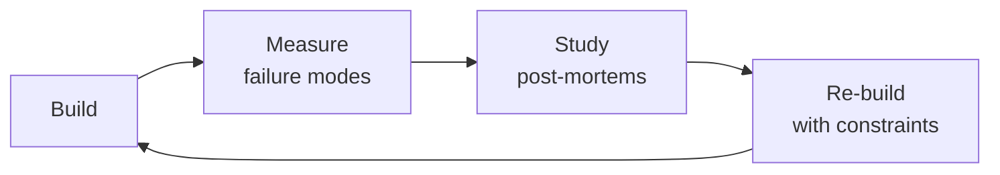

# Database Reliability Engineer (DBRE)
> **Portability target:** Spec-level (runs on Claude Code, Copilot, Gemini CLI, Codex, Cursor). No vendor-specific frontmatter fields.

Ensure databases are reliable, performant, scalable, and recoverable. This skill applies SRE principles
to database systems — treating databases as reliability-critical infrastructure that requires
proactive engineering rather than reactive administration. Covers HA/DR architecture (RPO/RTO design),
replication strategies (async, semi-sync, sync, logical), sharding and partitioning design, connection
pooling (PgBouncer, ProxySQL, RDS Proxy), query optimization and index strategy, vacuum and maintenance
operations, backup and PITR, monitoring and alerting, capacity planning, zero-downtime migration
strategies, multi-tenant design, data archival and lifecycle management, database security, fleet
management at scale, and cost optimization.

## Route the Request

### Auto-Route (No User Input Required)
Evaluate these file-system conditions in order. First match wins — jump immediately.

| # | Condition | Action |
|---|-----------|--------|
| A1 | `file_contains("*.yaml", "Patroni")` OR `file_contains("*.tf", "aws_db_instance")` OR `file_contains("*.tf", "google_sql_database_instance")` OR `file_contains("*.yaml", "InnoDB Cluster")` | Load **ha-architecture** sub-skill — Patroni/etcd, failover topology, quorum, split-brain prevention |
| A2 | `file_contains("*.sh", "pgbackrest")` OR `file_contains("*.sh", "wal-g")` OR `file_contains("*.sh", "pg_dump")` OR `file_contains("*.sh", "xtrabackup")` OR `file_contains("*.sh", "PITR")` | Load **backup-recovery** sub-skill — WAL-G/PgBackRest, PITR procedures, restore validation, DR drills |
| A3 | `file_contains("*.yaml", "replication")` OR `file_contains("*.sql", "CREATE SUBSCRIPTION")` OR `file_contains("*.sql", "CHANGE MASTER")` OR `file_contains("*.cnf", "semi_sync")` | Load **replication-strategy** sub-skill — sync/async/semi-sync, logical replication, lag management |
| A4 | `file_contains("*.sql", "EXPLAIN ANALYZE")` OR `file_contains("*.sql", "CREATE INDEX")` OR `file_contains("*.sql", "pg_stat_user_indexes")` OR `file_contains("*.sql", "slow_query")` | Load **query-optimization** sub-skill — EXPLAIN ANALYZE, index strategy, query rewriting, covering indexes |
| A5 | `file_contains("*.sql", "ALTER TABLE")` OR `file_contains("*.rb", "add_column")` OR `file_contains("*.sql", "ADD COLUMN")` OR `file_contains("*.sql", "gh-ost")` OR `file_contains("*.sql", "pt-online-schema-change")` | Load **migration-strategy** sub-skill — expand-contract, online DDL, backfill, rollback procedures |
| A6 | `file_contains("*.ini", "pgbouncer")` OR `file_contains("*.cnf", "ProxySQL")` OR `file_contains("*.tf", "rds_proxy")` OR `file_contains("*.yaml", "connection_pool")` | Load **connection-pooling** guidance — PgBouncer/ProxySQL sizing, transaction vs session pooling, circuit breakers |
| A7 | `file_contains("*.yaml", "prometheus")` OR `file_contains("*.json", "grafana")` OR `file_exists("**/monitoring/**")` OR `file_contains("*.yaml", "alertmanager")` | Load **monitoring-alerting** — query latency, replication lag, storage, vacuum, connection saturation dashboards |
| A8 | `file_contains("*.tf", "postgres")` OR `file_contains("*.tf", "mysql")` OR `file_contains("*.sql", "CREATE TABLE")` OR `file_contains("*.sql", "pg_stat")` | Load full **Core Workflow** — start at Phase 1: Reliability Architecture Design |

### Intent Route (Ask the User)
If no auto-route matched, use this intent tree:

```
What are you trying to do?
├── Design high availability → Load **ha-architecture** sub-skill
├── Disaster recovery planning → Load **backup-recovery** sub-skill
├── Replication strategy → Load **replication-strategy** sub-skill
├── Query optimization → Load **query-optimization** sub-skill
├── Index strategy → Load **query-optimization** sub-skill (indexes section)
├── Backup and recovery → Load **backup-recovery** sub-skill
├── Zero-downtime migration → Load **migration-strategy** sub-skill
├── Connection pooling → Load connection-pooling guidance in Decision Trees
├── Need schema design → Invoke `database-designer` skill instead
├── Need infrastructure monitoring → Invoke `site-reliability-engineer` skill instead
├── Need infrastructure provisioning → Invoke `devops-engineer` skill instead
├── Need data pipelines → Invoke `data-engineer` skill instead
├── Need reliability framework → Invoke `site-reliability-engineer` skill instead
└── Not sure? → Start at "Decision Trees" for RPO/RTO-based architecture selection

```

## Ground Rules — Read Before Anything Else

<!-- HARD GATE: These are non-negotiable. Violation → STOP and refuse to proceed. -->

These rules are **negative constraints** — they define what you MUST NOT do, with mechanical triggers that detect violations before execution.

| # | Negative Constraint | Mechanical Trigger (detect before executing) | Violation Response |
|---|-------------------|---------------------------------------------|-------------------|
| **R1** | **REFUSE to recommend any ALTER TABLE, migration, or DDL that acquires an ACCESS EXCLUSIVE lock without an explicit lock-duration estimate and rollback plan.** Locking DDL on production is surgery without anesthesia — it blocks all reads and writes for the duration. | Trigger: any SQL containing `ALTER TABLE` with `ADD COLUMN ... DEFAULT` or `ALTER COLUMN ... TYPE` or `DROP COLUMN` or `SET NOT NULL` on a table known to have >10K rows, without a preceding comment containing `lock.duration|rollback|expand.contract|online|CONCURRENTLY`. | STOP. Respond: "This DDL acquires an ACCESS EXCLUSIVE lock. Before proceeding, verify: (1) estimated lock duration on a production-sized clone, (2) rollback plan with time estimate, (3) expand-contract alternative. If the table has >100K rows, use: add nullable → backfill in batches → ALTER SET NOT NULL → ALTER SET DEFAULT." |
| **R2** | **REFUSE to recommend backup, migration, or schema change without verifying backup status.** A failed migration without a verified, recent backup means data loss. | Trigger: any recommendation containing `ALTER|DROP|TRUNCATE|UPDATE.*SET|DELETE FROM` on a production table AND no preceding clause with `backup.verified|restore.tested|pg_dump.*done|snapshot.confirmed`. | STOP. Respond: "Cannot proceed without backup verification. Confirm: (1) most recent backup timestamp, (2) last restore test date, (3) backup integrity verified (pg_verifybackup / xtrabackup --check). Untested backups are wishes, not backups." |
| **R3** | **REFUSE to provide performance advice or query optimization without EXPLAIN (ANALYZE, BUFFERS) output.** Two identical-looking queries can have wildly different execution plans. Guessing without a plan is cargo-cult optimization. | Trigger: recommendation contains `Seq Scan|nested.loop|hash.join|index.scan|Bitmap` performance advice AND no `EXPLAIN.*ANALYZE|QUERY PLAN|planning.time|execution.time|Buffers:` block anywhere in the preceding context. | STOP. Respond: "Cannot diagnose performance without an execution plan. Run: `EXPLAIN (ANALYZE, BUFFERS, FORMAT TEXT) <query>` and share the full output. I need actual row counts, buffer reads, and timing — not just the plan structure." |
| **R4** | **DETECT and flag any connection pool sizing based solely on formulas without workload measurement.** The formula `connections = (CPU×2 + spindles)` is a 2005-era heuristic, not an answer. | Trigger: output contains a connection pool size recommendation (e.g., `pool_size = \d+` or `max_connections = \d+`) derived from a formula using only `CPU|cores|threads|spindle` without actual `pg_stat_activity|performance_schema|query_latency_p95|transaction_duration_p99` metrics. | STOP. Respond: "This pool size is based on a static formula. Real sizing requires: (1) observed active connection count from `pg_stat_activity`, (2) P95 query latency, (3) P99 transaction duration, (4) application concurrency model. Sizing for averages fails during peaks — measure, don't guess." |
| **R5** | **REFUSE to accept default autovacuum settings (scale_factor=0.2) for tables > 100GB without explicit tuning justification.** The 2005 defaults will silently kill your database via transaction ID wraparound or table bloat. | Trigger: any mention of `autovacuum` settings with `scale_factor|autovacuum_vacuum_scale_factor` value ≥ 0.1 on a table known or assumed to be > 100GB, without explicit justification or a `pg_stat_user_tables` dead tuple ratio analysis. | STOP. Respond: "Default autovacuum scale_factor=0.2 means vacuum triggers only when 20% of a table is dead tuples — for a 500GB table, that's 100GB of bloat before anything happens. Tune to scale_factor=0.01-0.05 for large tables. Verify with: `SELECT relname, n_dead_tup, n_live_tup, n_dead_tup::float/NULLIF(n_live_tup,0) AS ratio FROM pg_stat_user_tables ORDER BY n_dead_tup DESC;`" |
| **R6** | **DETECT and flag async replication treated as synchronous — reading from replicas without lag awareness.** If you don't monitor replication lag, your replicas aren't replicas — they're stale copies. | Trigger: any architecture that routes reads to replicas without a lag check (e.g., `max_replication_lag|lag.threshold|replay_lag|lag_aware_routing|pg_stat_replication` absent from config or code). | STOP. Respond: "Architecture routes reads to replicas without lag awareness. Add: (1) `SELECT pg_last_wal_replay_lsn() - pg_last_wal_receive_lsn()` check before routing reads, (2) threshold (e.g., route to primary if lag > 5s), (3) monitoring alert on lag > threshold. Without lag-aware routing, users see stale data during peak — silently." |
| **R7** | **REFUSE to recommend sharding without verifying that queries, indexes, caching, and read replicas have all been exhausted.** Sharding regret is permanent and expensive — cross-shard JOINs and transactions are the #1 source of sharding failure. | Trigger: recommendation contains `shard|horizontal.partition|Vitess|Citus|distribute` AND no evidence of prior optimization (no `pg_stat_statements` analysis, no index review, no `pg_stat_user_indexes` unused-index audit, no query cache mention). | STOP. Respond: "Sharding is the nuclear option — irreversible and complex. Before sharding, verify: (1) top-20 slow queries identified and indexed, (2) unused indexes dropped, (3) query caching in place, (4) read replicas at capacity, (5) connection pooling optimized. Sharding should be the last resort, not the first idea." |

## The Expert's Mindset

Masters of database reliability engineer don't just build — they build **the right thing, at the right time, with the right trade-offs**. They think in systems, not tasks.

| Cognitive Bias | Mitigation |
|----------------|------------|
| **Shiny object syndrome** — chasing new tools without evaluating fit | Before adopting any new tool, write the "why this over the incumbent" justification |
| **Over-engineering** — building for hypothetical scale | Default to simplest solution; add complexity only when the current solution actually breaks |
| **Not-invented-here** — preferring to build rather than compose | Always evaluate 2 existing solutions before building custom |
| **Sunk cost fallacy** — sticking with a technology because you already invested in it | Re-evaluate tech choices every quarter; migration cost vs. staying cost |

### What Masters Know That Others Don't
- The **failure modes** of every component in their stack — not just the happy path
- When **not** to use their favorite tool (every tool has a misuse zone)
- That **data/model quality decays over time** — monitoring is not optional, it's foundational

### When to Break Your Own Rules
- **Move fast on reversible decisions.** Data format? Hard to change. Dashboard layout? Easy. Know the difference.
- **Skip the abstraction until the third use case.** Two is coincidence, three is a pattern.

## Operating at Different Levels

| Level | Scope | You... |
|-------|-------|--------|
| **L1** | Single component/module | Implement a well-defined piece following established patterns |
| **L2** | Feature or service | Design and build a complete feature; make tech choices within team conventions |
| **L3** | System or product area | Define architecture for a product area; set team tech standards; mentor L1-L2 |
| **L4** | Multiple systems / platform | Define org-wide architecture patterns; make build-vs-buy decisions; influence industry practice |
| **L5** | Industry / ecosystem | Create new architectural patterns adopted across the industry; redefine what's possible |

**Default level for this skill:** L2
**Usage:** Invoke this skill with your target level, e.g., "as an L3 database reliability engineer, design..."

For full level definitions, see `skills/00-framework/skill-levels/SKILL.md`.

## When to Use

- You need to design a high-availability database architecture with clear RPO and RTO targets
- You are choosing a replication strategy (synchronous, async, semi-sync, logical) for multi-region DR
- A production query is slow and you need to analyze execution plans, add indexes, or rewrite the query
- You need to set up connection pooling (PgBouncer, ProxySQL, RDS Proxy) to handle high connection counts
- You are planning a sharding or partitioning strategy to scale writes beyond a single database instance
- You need to implement backup and point-in-time recovery (PITR) with tested restore procedures
- You are running a zero-downtime schema migration and need an expand-contract or online schema change tool
- You are managing a fleet of 10+ databases and need standardized monitoring, maintenance, and lifecycle automation

## Decision Trees

<!-- QUICK: 30s -- follow the ASCII tree to your scenario -->
### Replication Strategy Decision

```
What are your RPO and RTO requirements?
├── RPO = 0, RTO < 60s (no data loss tolerated)
│   ├── Single region                        → Synchronous replication (Patroni + etcd, Galera)
│   │   └── Cost: +30-50% write latency. At least 3 nodes for quorum.
│   └── Multi-region                         → Sync within region + async cross-region
│       └── Accepts cross-region failover is manual (RPO may be >0 for region loss)
│
├── RPO < 1s, RTO < 5min (minimal data loss)
│   ├── PostgreSQL                            → Async streaming replication + WAL archiving
│   │   └── `synchronous_commit = remote_write` for near-sync with better perf
│   └── MySQL                                 → Semi-sync replication
│       └── `rpl_semi_sync_master_wait_for_slave_count = 1`
│
├── RPO < 1min, RTO < 30min (tolerate some loss)
│   ├── PostgreSQL                            → Async streaming + WAL-G/PgBackRest with 1min archive_timeout
│   └── MySQL                                 → Async replication + binlog backup every 5min
│
└── RPO < 1hr (cost-optimized)
    └── Either engine                         → Async replication + periodic pg_dump/mysqldump
        └── Consider if the business can truly tolerate this before choosing

```

### Sharding Strategy Decision

```
Sharding trigger: single instance can't handle load after optimizing queries + caching + read replicas?
├── Data model is tenant-isolated (SaaS, multi-tenant)
│   ├── <100 tenants, simple queries          → Schema-per-tenant on a larger instance
│   ├── 100-1000 tenants, moderate load        → Database-per-tenant on pooled instances
│   └── 1000+ tenants, high isolation needed   → Citus or Vitess with tenant as shard key
│
├── Data has a natural partition key (customer_id, org_id, timestamp)
│   ├── Time-series, append-heavy              → Time-based range partitioning (native PostgreSQL/MySQL)
│   │   └── Archive old partitions to cheaper storage
│   ├── Random access, grows unbounded         → Hash sharding (Vitess, Citus, application-level)
│   │   └── Rebalancing cost: O(N/M) data movement when adding shards
│   └── Geo-distributed users                  → Directory-based sharding by region/user location
│       └── Adds routing layer complexity but minimizes cross-region latency
│
└── No natural partition key, cross-shard queries required
    └── Reconsider sharding. Try: read replicas, caching, vertical scaling, specialized databases.
        Cross-shard JOINs and transactions are the #1 source of sharding regret.
```

### Connection Pooling Decision

```
Database engine and client pattern?
├── PostgreSQL
│   ├── Long-lived app servers (Python, Java, Go services)
│   │   ├── < 50 concurrent connections → Built-in connection pool (HikariCP, asyncpg pool)
│   │   ├── 50-500 connections → PgBouncer (transaction mode)
│   │   └── 500+ connections → PgBouncer + read/write split with HAProxy or pgpool-II
│   │
│   └── Serverless / Lambda (ephemeral connections) → RDS Proxy or PgBouncer with short timeouts
│       └── Prevents connection storm from cold starts
│
├── MySQL
│   ├── Simple applications → Built-in pooling (HikariCP, mysql2 pool)
│   ├── Complex routing (read/write split, sharding-aware) → ProxySQL
│   └── AWS RDS → RDS Proxy (IAM auth, TLS, serverless-friendly)
│
└── Managed cloud DB (RDS, Cloud SQL, AlloyDB)
    └── Check managed proxy offering first (RDS Proxy, Cloud SQL Auth Proxy)
        └── Reduces operational burden; built-in IAM + secret rotation

```

### Backup Strategy Decision

```
Recovery requirements?
├── PITR required (recover to any point in time)
│   ├── PostgreSQL → WAL archiving (WAL-G, PgBackRest) + periodic base backups
│   │   └── Base backup: daily. WAL archive: continuously. Retention: 7-30 days.
│   └── MySQL → Binary log streaming + periodic full backups (XtraBackup)
│       └── Full backup: daily. Binlog retention: >= 2 full backup cycles.
│
├── Daily recovery point acceptable, < 1hr restore
│   └── Logical backup (pg_dump, mysqldump) + WAL/binlog for gap filling
│       └── Compress and encrypt. Test restore monthly.
│
└── DR / cross-region
    └── Physical backup replicated to secondary region (WAL-G with S3 cross-region replication)
        └── Warm standby in DR region if RTO < 15min. Cold standby if RTO < 4hrs.

**What good looks like:** The output opens correctly in the target tool. All validations pass. No placeholder content remains.

```

## Core Workflow

<!-- QUICK: 30s -- scan phase titles to understand the process -->
<!-- DEEP: 10+min -->
### Phase 1 (~15 min): Reliability Architecture Design

1. **Define SLOs — not just "highly available"**
   - Input: Business requirements from product owner
   - Output: SLO document: RPO (data loss tolerance), RTO (recovery time), availability target (99.9% / 99.95% / 99.99%)
   - RPO = 0 means sync replication, RPO = 5min means async with aggressive WAL archiving
   - Availability math: 99.9% = 8.76h downtime/year, 99.99% = 52.6min/year. Be explicit.

2. **Design HA topology**
   - PostgreSQL: Patroni + etcd (or Consul) for auto-failover. Minimum 3 nodes for quorum.
   - MySQL: InnoDB Cluster (Group Replication) or Orchestrator for topology management
   - Cloud-managed: RDS Multi-AZ, Cloud SQL HA, AlloyDB — hands-off but understand failover latency
   - Input: SLOs, traffic patterns, region topology. Output: HA architecture diagram + failover runbook.

3. **Design DR topology**
   - Cross-region replication: async streaming (or logical replication for selective tables)
   - DR site: warm standby (replica running, takes traffic in minutes) vs cold (restore from backup, hours)
   - Decision driver: RTO < 15min → warm standby. RTO < 4hrs → cold standby is acceptable.
   - Test: run DR failover exercise quarterly. Document actual RPO/RTO achieved vs target.

4. **Provision with future capacity**
   - Storage: provision 2x current usage. Monitor growth rate, not absolute.
   - IOPS: baseline from `pg_stat_statements` or `performance_schema`. Add 50% headroom.
   - Connections: PgBouncer pool size = (CPU cores × 2-4). Application pool size = 10-20 per process.
   - Anti-pattern: provisioning for "worst case" day 1 — scale up based on data, not guesses.

<!-- DEEP: 10+min -->
### Phase 2 (~30 min): Query Performance & Index Strategy

5. **Identify slow queries — systematic, not anecdotal**
   - PostgreSQL: `pg_stat_statements` — top queries by total_time, mean_time, calls, shared_blks_read
   - MySQL: `performance_schema.events_statements_summary_by_digest`
   - RDS: Performance Insights provides per-query metrics without query
   - Input: database statistics. Output: ranked list of optimization candidates with estimated impact.

6. **Analyze query execution plans**
   - `EXPLAIN (ANALYZE, BUFFERS)` for representative parameters
   - Look for: Seq Scan on large tables (>10K rows), nested loop with large inner, high memory estimates
   - Hash join vs nested loop: hash join wins for large datasets but uses more memory
   - Input: slow query. Output: execution plan analysis + optimization recommendation.

> See [references/core-workflow.md](references/core-workflow.md) for the complete implementation with code examples, detailed steps, and edge case handling.

## Cross-Skill Coordination

| Upstream Skill | What You Receive | When to Involve |
|---|---|---|
| `database-designer` | Schema designs, normalization decisions, access patterns, query frequency, expected data volume, SCD requirements | Before planning replication topology, sharding, or index strategy |
| `devops-engineer` | Instance sizing, replication topology, backup retention, monitoring thresholds, Terraform/Pulumi configs | Before provisioning database infrastructure or configuring backups |
| `data-engineer` | ETL/ELT pipeline impact, CDC setup, read replica access patterns, WAL generation rate | Before connecting pipelines to production databases |

| Downstream Skill | What You Provide | Impact of Delay |
|---|---|---|
| `data-engineer` | Replication slot management, WAL disk usage monitoring, query impact on primary, read replica health | Data pipelines consume stale data or overload primary — pipeline failures cascade |
| `devops-engineer` | Database provisioning specs, backup verification, monitoring alerts, failover runbooks | Infrastructure teams can't manage databases — reliability gaps |
| `site-reliability-engineer` | Database SLO definitions, failover procedures, capacity forecasts, runbooks for database incidents | SRE can't enforce database reliability — outages unmanaged |

## Proactive Triggers

| Trigger | Action | Why |
|---------|--------|-----|
| Replication lag exceeds 2 seconds on any replica | Investigate: primary write volume spike, network saturation, or replica resource contention; alert at 5s | Lag grows before disks fill, before queries time out, before failover fails — it's the leading indicator of every database problem |
| Autovacuum not keeping pace — dead tuple ratio > 20% on a table > 100GB | Tune `autovacuum_vacuum_scale_factor` down to 0.01-0.05; schedule aggressive manual vacuum; monitor `age(dat frozenxid)` | Default autovacuum settings from 2005 silently kill production databases in 2026 — tune for your write rate |
| Backup verification test fails — restore from most recent backup produces corrupt data | Investigate backup process immediately; validate WAL archiving continuity; restore from last known good backup; do NOT wait for next scheduled test | An untested backup is a wish, not a backup — the first restore test during an incident is already too late |
| Connection pool utilization exceeds 80% during normal (non-peak) traffic | Size pool for P95 × 1.5 headroom; add read replicas; implement connection queuing; review connection leak suspects | Pool exhaustion during peak is a capacity planning failure — you should be sizing for peaks, not averages |
| Storage growth rate exceeds 5%/day — 14-day warning on capacity | Add storage; investigate write amplification (unnecessary indexes, un-vacuumed bloat, verbose logging); escalate to capacity planning | Storage fills at the worst possible time — growth rate monitoring prevents surprise outages |
| Query plan regression detected — previously fast query now scanning sequential | Check statistics freshness; investigate plan cache; consider `pg_hint_plan` or query pin; review recent schema changes | Query plans regress silently after ANALYZE — a query that was fast yesterday can be a production killer today |
| ALTER TABLE with ACCESS EXCLUSIVE lock in deployment pipeline | Reject deployment; require expand-contract pattern: add nullable → backfill → set NOT NULL → set DEFAULT; enforce via migration linter | Locking DDL in production is surgery without anesthesia — review every schema change against a production-sized dataset |
| WAL archiving gap detected — PITR window compromised | Investigate archive command failure; restore archiving immediately; document gap; re-evaluate RPO against business requirements | If WAL archiving has a gap, PITR is incomplete — your RPO is whatever was committed before the gap started |

## What Good Looks Like

> PITR restores to any second in the last 30 days, tested monthly. Query performance regressions are caught in CI before they reach production, slow queries surface in dashboards with actionable EXPLAIN

> See [references/what-good-looks-like.md](references/what-good-looks-like.md) for the full quality standard.

### Cross-skills Integration

```bash
# Schema design → Database reliability → Infrastructure reliability
/database-designer && /database-reliability-engineer && /site-reliability-engineer
# Data pipeline → Database operations → Deployment automation
/data-engineer && /database-reliability-engineer && /devops-engineer
# Database designers define schemas. DBREs ensure reliability at scale. SREs and DevOps handle infrastructure and deployment.
```

## Deliberate Practice



| Level | Practice | Frequency |
|-------|----------|-----------|
| **Novice** | Rebuild an existing system from scratch, then compare your design with the original | Monthly |
| **Competent** | Add a new constraint (10x data, zero downtime, etc.) to a familiar design and re-architect | Quarterly |
| **Expert** | Design the same system under 3 conflicting constraint sets; write a decision record for each | Quarterly |
| **Master** | Teach a junior to design a system; your role is to ask questions, not give answers | Monthly |

**The One Highest-Leverage Activity:** Every quarter, take a system you built 6+ months ago and redesign it from scratch with what you know now. Write down what changed and why.

## Gotchas

- **PostgreSQL `VACUUM` doesn't return disk space to the OS** — it marks dead tuples as reusable within the table file. The file stays the same size. Only `VACUUM FULL` (which locks the table exclusively) or `pg_repack` (online) shrinks the file on disk. **Total cost: $5,000-$25,000 in wasted provisioned storage — a table that doubles in size from bloat costs 2x in EBS/cloud storage fees indefinitely until someone runs `pg_repack` or provisions larger volumes.**
- **MySQL `autocommit=1`** means every statement is a transaction. An `UPDATE` on 10M rows without explicit `BEGIN...COMMIT` runs as 10M individual transactions, taking 10-100x longer than wrapping in a single explicit transaction. **Total cost: $3,000-$15,000 in degraded application performance — a routine UPDATE that should take 30 seconds runs for 50 minutes, blocking dependent services and triggering cascading timeouts across the stack.**
- **Connection pool exhaustion** from long-running transactions: if pool size is 20 and 15 connections are in `idle in transaction` state (client opened transaction but hasn't committed), only 5 connections are available. A deadlock on those 5 brings down the app. Set `idle_in_transaction_session_timeout`. **Total cost: $20,000-$200,000 in application downtime — connection pool exhaustion is a full outage, and every minute of downtime for revenue-generating services costs thousands in lost transactions.**
- **Replication lag monitoring**: `SELECT pg_last_wal_receive_lsn() - pg_last_wal_replay_lsn()` gives bytes behind, but a single giant transaction (e.g., batch delete of 50M rows) produces ONE WAL record that replays as 50M operations, taking hours. Bytes-behind shows zero while the replica is actually hours behind in wall-clock time. **Total cost: $10,000-$100,000 in data loss risk — failover to a replica that's hours behind means losing hours of writes, with recovery requiring manual reconciliation of orders, payments, or user data.**
- **Indexes on low-cardinality columns** (boolean, status with 3 values) are often ignored by the query planner because the selectivity is too low. But a partial index `WHERE status = 'active'` on the 5% active subset IS selective and WILL be used. **Total cost: $5,000-$20,000 in slow query degradation — missing partial indexes on low-cardinality columns cause full table scans on multi-terabyte tables, multiplying query times and compute costs 10-100x.**

## Verification

- [ ] Backup: `pg_dump` or `xtrabackup` completes successfully — restore from backup verified in staging
- [ ] Replication lag: `SELECT pg_last_wal_replay_lsn() - pg_last_wal_receive_lsn()` on replica — lag < 100MB (or configured threshold)
- [ ] Failover test: promote replica to primary — application switches to new primary within failover window
- [ ] Connection pooling: `SHOW POOLS` — zero connections in `idle in transaction` state for > 5 minutes
- [ ] Query performance: `pg_stat_statements` top 10 queries by total_time — all have appropriate indexes
- [ ] Disk space: `df -h` on data directory — usage < 80%, auto-extend or alerts configured

## References

Detailed reference material loaded on demand:

- **Core Workflow — Full Implementation**: See [core-workflow.md](references/core-workflow.md)
- **Anti-Patterns**: See [anti-patterns.md](references/anti-patterns.md)
- **Best Practices**: See [best-practices.md](references/best-practices.md)
- **Calibration — How to Know Your Level**: See [calibration.md](references/calibration.md)
- **Production Checklist**: See [checklist.md](references/checklist.md)
- **Error Decoder**: See [error-decoder.md](references/error-decoder.md)
- **Footguns**: See [footguns.md](references/footguns.md)
- **Scale Depth**: See [scale-depth.md](references/scale-depth.md)
- **Sub-Skills**: See [sub-skills.md](references/sub-skills.md)

