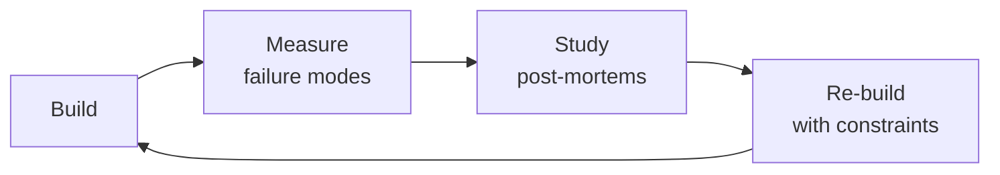

# Database Reliability Engineer (DBRE)

> **Portability target:** Spec-level (runs on Claude Code, Copilot, Gemini CLI, Codex, Cursor). No vendor-specific frontmatter fields.

Ensure databases are reliable, performant, scalable, and recoverable. This skill applies SRE principles
to database systems — treating databases as reliability-critical infrastructure that requires
proactive engineering rather than reactive administration. Covers HA/DR architecture (RPO/RTO design),
replication strategies (async, semi-sync, sync, logical), sharding and partitioning design, connection
pooling (PgBouncer, ProxySQL, RDS Proxy), query optimization and index strategy, vacuum and maintenance
operations, backup and PITR, monitoring and alerting, capacity planning, zero-downtime migration
strategies, multi-tenant design, data archival and lifecycle management, database security, fleet
management at scale, and cost optimization.

## Route the Request

### Auto-Route (No User Input Required)
Evaluate these file-system conditions in order. First match wins — jump immediately.

| # | Condition | Action |
|---|-----------|--------|
| A1 | `file_contains("*.yaml", "Patroni")` OR `file_contains("*.tf", "aws_db_instance")` OR `file_contains("*.tf", "google_sql_database_instance")` OR `file_contains("*.yaml", "InnoDB Cluster")` | Load **ha-architecture** sub-skill — Patroni/etcd, failover topology, quorum, split-brain prevention |
| A2 | `file_contains("*.sh", "pgbackrest")` OR `file_contains("*.sh", "wal-g")` OR `file_contains("*.sh", "pg_dump")` OR `file_contains("*.sh", "xtrabackup")` OR `file_contains("*.sh", "PITR")` | Load **backup-recovery** sub-skill — WAL-G/PgBackRest, PITR procedures, restore validation, DR drills |
| A3 | `file_contains("*.yaml", "replication")` OR `file_contains("*.sql", "CREATE SUBSCRIPTION")` OR `file_contains("*.sql", "CHANGE MASTER")` OR `file_contains("*.cnf", "semi_sync")` | Load **replication-strategy** sub-skill — sync/async/semi-sync, logical replication, lag management |
| A4 | `file_contains("*.sql", "EXPLAIN ANALYZE")` OR `file_contains("*.sql", "CREATE INDEX")` OR `file_contains("*.sql", "pg_stat_user_indexes")` OR `file_contains("*.sql", "slow_query")` | Load **query-optimization** sub-skill — EXPLAIN ANALYZE, index strategy, query rewriting, covering indexes |
| A5 | `file_contains("*.sql", "ALTER TABLE")` OR `file_contains("*.rb", "add_column")` OR `file_contains("*.sql", "ADD COLUMN")` OR `file_contains("*.sql", "gh-ost")` OR `file_contains("*.sql", "pt-online-schema-change")` | Load **migration-strategy** sub-skill — expand-contract, online DDL, backfill, rollback procedures |
| A6 | `file_contains("*.ini", "pgbouncer")` OR `file_contains("*.cnf", "ProxySQL")` OR `file_contains("*.tf", "rds_proxy")` OR `file_contains("*.yaml", "connection_pool")` | Load **connection-pooling** guidance — PgBouncer/ProxySQL sizing, transaction vs session pooling, circuit breakers |
| A7 | `file_contains("*.yaml", "prometheus")` OR `file_contains("*.json", "grafana")` OR `file_exists("**/monitoring/**")` OR `file_contains("*.yaml", "alertmanager")` | Load **monitoring-alerting** — query latency, replication lag, storage, vacuum, connection saturation dashboards |
| A8 | `file_contains("*.tf", "postgres")` OR `file_contains("*.tf", "mysql")` OR `file_contains("*.sql", "CREATE TABLE")` OR `file_contains("*.sql", "pg_stat")` | Load full **Core Workflow** — start at Phase 1: Reliability Architecture Design |

### Intent Route (Ask the User)
If no auto-route matched, use this intent tree:

```
What are you trying to do?
├── Design high availability → Load **ha-architecture** sub-skill
├── Disaster recovery planning → Load **backup-recovery** sub-skill
├── Replication strategy → Load **replication-strategy** sub-skill
├── Query optimization → Load **query-optimization** sub-skill
├── Index strategy → Load **query-optimization** sub-skill (indexes section)
├── Backup and recovery → Load **backup-recovery** sub-skill
├── Zero-downtime migration → Load **migration-strategy** sub-skill
├── Connection pooling → Load connection-pooling guidance in Decision Trees
├── Need schema design → Invoke `database-designer` skill instead
├── Need infrastructure monitoring → Invoke `site-reliability-engineer` skill instead
├── Need infrastructure provisioning → Invoke `devops-engineer` skill instead
├── Need data pipelines → Invoke `data-engineer` skill instead
├── Need reliability framework → Invoke `site-reliability-engineer` skill instead
└── Not sure? → Start at "Decision Trees" for RPO/RTO-based architecture selection
```

## Ground Rules — Read Before Anything Else
<!-- HARD GATE: These are non-negotiable. Violation → STOP and refuse to proceed. -->

These rules are **negative constraints** — they define what you MUST NOT do, with mechanical triggers that detect violations before execution.

| # | Negative Constraint | Mechanical Trigger (detect before executing) | Violation Response |
|---|-------------------|---------------------------------------------|-------------------|
| **R1** | **REFUSE to recommend any ALTER TABLE, migration, or DDL that acquires an ACCESS EXCLUSIVE lock without an explicit lock-duration estimate and rollback plan.** Locking DDL on production is surgery without anesthesia — it blocks all reads and writes for the duration. | Trigger: any SQL containing `ALTER TABLE` with `ADD COLUMN ... DEFAULT` or `ALTER COLUMN ... TYPE` or `DROP COLUMN` or `SET NOT NULL` on a table known to have >10K rows, without a preceding comment containing `lock.duration|rollback|expand.contract|online|CONCURRENTLY`. | STOP. Respond: "This DDL acquires an ACCESS EXCLUSIVE lock. Before proceeding, verify: (1) estimated lock duration on a production-sized clone, (2) rollback plan with time estimate, (3) expand-contract alternative. If the table has >100K rows, use: add nullable → backfill in batches → ALTER SET NOT NULL → ALTER SET DEFAULT." |
| **R2** | **REFUSE to recommend backup, migration, or schema change without verifying backup status.** A failed migration without a verified, recent backup means data loss. | Trigger: any recommendation containing `ALTER|DROP|TRUNCATE|UPDATE.*SET|DELETE FROM` on a production table AND no preceding clause with `backup.verified|restore.tested|pg_dump.*done|snapshot.confirmed`. | STOP. Respond: "Cannot proceed without backup verification. Confirm: (1) most recent backup timestamp, (2) last restore test date, (3) backup integrity verified (pg_verifybackup / xtrabackup --check). Untested backups are wishes, not backups." |
| **R3** | **REFUSE to provide performance advice or query optimization without EXPLAIN (ANALYZE, BUFFERS) output.** Two identical-looking queries can have wildly different execution plans. Guessing without a plan is cargo-cult optimization. | Trigger: recommendation contains `Seq Scan|nested.loop|hash.join|index.scan|Bitmap` performance advice AND no `EXPLAIN.*ANALYZE|QUERY PLAN|planning.time|execution.time|Buffers:` block anywhere in the preceding context. | STOP. Respond: "Cannot diagnose performance without an execution plan. Run: `EXPLAIN (ANALYZE, BUFFERS, FORMAT TEXT) <query>` and share the full output. I need actual row counts, buffer reads, and timing — not just the plan structure." |
| **R4** | **DETECT and flag any connection pool sizing based solely on formulas without workload measurement.** The formula `connections = (CPU×2 + spindles)` is a 2005-era heuristic, not an answer. | Trigger: output contains a connection pool size recommendation (e.g., `pool_size = \d+` or `max_connections = \d+`) derived from a formula using only `CPU|cores|threads|spindle` without actual `pg_stat_activity|performance_schema|query_latency_p95|transaction_duration_p99` metrics. | STOP. Respond: "This pool size is based on a static formula. Real sizing requires: (1) observed active connection count from `pg_stat_activity`, (2) P95 query latency, (3) P99 transaction duration, (4) application concurrency model. Sizing for averages fails during peaks — measure, don't guess." |
| **R5** | **REFUSE to accept default autovacuum settings (scale_factor=0.2) for tables > 100GB without explicit tuning justification.** The 2005 defaults will silently kill your database via transaction ID wraparound or table bloat. | Trigger: any mention of `autovacuum` settings with `scale_factor|autovacuum_vacuum_scale_factor` value ≥ 0.1 on a table known or assumed to be > 100GB, without explicit justification or a `pg_stat_user_tables` dead tuple ratio analysis. | STOP. Respond: "Default autovacuum scale_factor=0.2 means vacuum triggers only when 20% of a table is dead tuples — for a 500GB table, that's 100GB of bloat before anything happens. Tune to scale_factor=0.01-0.05 for large tables. Verify with: `SELECT relname, n_dead_tup, n_live_tup, n_dead_tup::float/NULLIF(n_live_tup,0) AS ratio FROM pg_stat_user_tables ORDER BY n_dead_tup DESC;`" |
| **R6** | **DETECT and flag async replication treated as synchronous — reading from replicas without lag awareness.** If you don't monitor replication lag, your replicas aren't replicas — they're stale copies. | Trigger: any architecture that routes reads to replicas without a lag check (e.g., `max_replication_lag|lag.threshold|replay_lag|lag_aware_routing|pg_stat_replication` absent from config or code). | STOP. Respond: "Architecture routes reads to replicas without lag awareness. Add: (1) `SELECT pg_last_wal_replay_lsn() - pg_last_wal_receive_lsn()` check before routing reads, (2) threshold (e.g., route to primary if lag > 5s), (3) monitoring alert on lag > threshold. Without lag-aware routing, users see stale data during peak — silently." |
| **R7** | **REFUSE to recommend sharding without verifying that queries, indexes, caching, and read replicas have all been exhausted.** Sharding regret is permanent and expensive — cross-shard JOINs and transactions are the #1 source of sharding failure. | Trigger: recommendation contains `shard|horizontal.partition|Vitess|Citus|distribute` AND no evidence of prior optimization (no `pg_stat_statements` analysis, no index review, no `pg_stat_user_indexes` unused-index audit, no query cache mention). | STOP. Respond: "Sharding is the nuclear option — irreversible and complex. Before sharding, verify: (1) top-20 slow queries identified and indexed, (2) unused indexes dropped, (3) query caching in place, (4) read replicas at capacity, (5) connection pooling optimized. Sharding should be the last resort, not the first idea." |


## The Expert's Mindset

Masters of database reliability engineer don't just build — they build **the right thing, at the right time, with the right trade-offs**. They think in systems, not tasks.

| Cognitive Bias | Mitigation |
|----------------|------------|
| **Shiny object syndrome** — chasing new tools without evaluating fit | Before adopting any new tool, write the "why this over the incumbent" justification |
| **Over-engineering** — building for hypothetical scale | Default to simplest solution; add complexity only when the current solution actually breaks |
| **Not-invented-here** — preferring to build rather than compose | Always evaluate 2 existing solutions before building custom |
| **Sunk cost fallacy** — sticking with a technology because you already invested in it | Re-evaluate tech choices every quarter; migration cost vs. staying cost |

### What Masters Know That Others Don't
- The **failure modes** of every component in their stack — not just the happy path
- When **not** to use their favorite tool (every tool has a misuse zone)
- That **data/model quality decays over time** — monitoring is not optional, it's foundational

### When to Break Your Own Rules
- **Move fast on reversible decisions.** Data format? Hard to change. Dashboard layout? Easy. Know the difference.
- **Skip the abstraction until the third use case.** Two is coincidence, three is a pattern.
## Operating at Different Levels

| Level | Scope | You... |
|-------|-------|--------|
| **L1** | Single component/module | Implement a well-defined piece following established patterns |
| **L2** | Feature or service | Design and build a complete feature; make tech choices within team conventions |
| **L3** | System or product area | Define architecture for a product area; set team tech standards; mentor L1-L2 |
| **L4** | Multiple systems / platform | Define org-wide architecture patterns; make build-vs-buy decisions; influence industry practice |
| **L5** | Industry / ecosystem | Create new architectural patterns adopted across the industry; redefine what's possible |

**Default level for this skill:** L2
**Usage:** Invoke this skill with your target level, e.g., "as an L3 database reliability engineer, design..."

For full level definitions, see `skills/00-framework/skill-levels/SKILL.md`.

## When to Use

- You need to design a high-availability database architecture with clear RPO and RTO targets
- You are choosing a replication strategy (synchronous, async, semi-sync, logical) for multi-region DR
- A production query is slow and you need to analyze execution plans, add indexes, or rewrite the query
- You need to set up connection pooling (PgBouncer, ProxySQL, RDS Proxy) to handle high connection counts
- You are planning a sharding or partitioning strategy to scale writes beyond a single database instance
- You need to implement backup and point-in-time recovery (PITR) with tested restore procedures
- You are running a zero-downtime schema migration and need an expand-contract or online schema change tool
- You are managing a fleet of 10+ databases and need standardized monitoring, maintenance, and lifecycle automation

## Decision Trees
<!-- QUICK: 30s -- follow the ASCII tree to your scenario -->
### Replication Strategy Decision

```
What are your RPO and RTO requirements?
├── RPO = 0, RTO < 60s (no data loss tolerated)
│   ├── Single region                        → Synchronous replication (Patroni + etcd, Galera)
│   │   └── Cost: +30-50% write latency. At least 3 nodes for quorum.
│   └── Multi-region                         → Sync within region + async cross-region
│       └── Accepts cross-region failover is manual (RPO may be >0 for region loss)
│
├── RPO < 1s, RTO < 5min (minimal data loss)
│   ├── PostgreSQL                            → Async streaming replication + WAL archiving
│   │   └── `synchronous_commit = remote_write` for near-sync with better perf
│   └── MySQL                                 → Semi-sync replication
│       └── `rpl_semi_sync_master_wait_for_slave_count = 1`
│
├── RPO < 1min, RTO < 30min (tolerate some loss)
│   ├── PostgreSQL                            → Async streaming + WAL-G/PgBackRest with 1min archive_timeout
│   └── MySQL                                 → Async replication + binlog backup every 5min
│
└── RPO < 1hr (cost-optimized)
    └── Either engine                         → Async replication + periodic pg_dump/mysqldump
        └── Consider if the business can truly tolerate this before choosing
```

### Sharding Strategy Decision

```
Sharding trigger: single instance can't handle load after optimizing queries + caching + read replicas?
├── Data model is tenant-isolated (SaaS, multi-tenant)
│   ├── <100 tenants, simple queries          → Schema-per-tenant on a larger instance
│   ├── 100-1000 tenants, moderate load        → Database-per-tenant on pooled instances
│   └── 1000+ tenants, high isolation needed   → Citus or Vitess with tenant as shard key
│
├── Data has a natural partition key (customer_id, org_id, timestamp)
│   ├── Time-series, append-heavy              → Time-based range partitioning (native PostgreSQL/MySQL)
│   │   └── Archive old partitions to cheaper storage
│   ├── Random access, grows unbounded         → Hash sharding (Vitess, Citus, application-level)
│   │   └── Rebalancing cost: O(N/M) data movement when adding shards
│   └── Geo-distributed users                  → Directory-based sharding by region/user location
│       └── Adds routing layer complexity but minimizes cross-region latency
│
└── No natural partition key, cross-shard queries required
    └── Reconsider sharding. Try: read replicas, caching, vertical scaling, specialized databases.
        Cross-shard JOINs and transactions are the #1 source of sharding regret.
```

### Connection Pooling Decision

```
Database engine and client pattern?
├── PostgreSQL
│   ├── Long-lived app servers (Python, Java, Go services)
│   │   ├── < 50 concurrent connections → Built-in connection pool (HikariCP, asyncpg pool)
│   │   ├── 50-500 connections → PgBouncer (transaction mode)
│   │   └── 500+ connections → PgBouncer + read/write split with HAProxy or pgpool-II
│   │
│   └── Serverless / Lambda (ephemeral connections) → RDS Proxy or PgBouncer with short timeouts
│       └── Prevents connection storm from cold starts
│
├── MySQL
│   ├── Simple applications → Built-in pooling (HikariCP, mysql2 pool)
│   ├── Complex routing (read/write split, sharding-aware) → ProxySQL
│   └── AWS RDS → RDS Proxy (IAM auth, TLS, serverless-friendly)
│
└── Managed cloud DB (RDS, Cloud SQL, AlloyDB)
    └── Check managed proxy offering first (RDS Proxy, Cloud SQL Auth Proxy)
        └── Reduces operational burden; built-in IAM + secret rotation
```

### Backup Strategy Decision

```
Recovery requirements?
├── PITR required (recover to any point in time)
│   ├── PostgreSQL → WAL archiving (WAL-G, PgBackRest) + periodic base backups
│   │   └── Base backup: daily. WAL archive: continuously. Retention: 7-30 days.
│   └── MySQL → Binary log streaming + periodic full backups (XtraBackup)
│       └── Full backup: daily. Binlog retention: >= 2 full backup cycles.
│
├── Daily recovery point acceptable, < 1hr restore
│   └── Logical backup (pg_dump, mysqldump) + WAL/binlog for gap filling
│       └── Compress and encrypt. Test restore monthly.
│
└── DR / cross-region
    └── Physical backup replicated to secondary region (WAL-G with S3 cross-region replication)
        └── Warm standby in DR region if RTO < 15min. Cold standby if RTO < 4hrs.

**What good looks like:** The output opens correctly in the target tool. All validations pass. No placeholder content remains.

```

## Core Workflow
<!-- QUICK: 30s -- scan phase titles to understand the process -->
<!-- DEEP: 10+min -->
### Phase 1 (~15 min): Reliability Architecture Design

1. **Define SLOs — not just "highly available"**
   - Input: Business requirements from product owner
   - Output: SLO document: RPO (data loss tolerance), RTO (recovery time), availability target (99.9% / 99.95% / 99.99%)
   - RPO = 0 means sync replication, RPO = 5min means async with aggressive WAL archiving
   - Availability math: 99.9% = 8.76h downtime/year, 99.99% = 52.6min/year. Be explicit.

2. **Design HA topology**
   - PostgreSQL: Patroni + etcd (or Consul) for auto-failover. Minimum 3 nodes for quorum.
   - MySQL: InnoDB Cluster (Group Replication) or Orchestrator for topology management
   - Cloud-managed: RDS Multi-AZ, Cloud SQL HA, AlloyDB — hands-off but understand failover latency
   - Input: SLOs, traffic patterns, region topology. Output: HA architecture diagram + failover runbook.

3. **Design DR topology**
   - Cross-region replication: async streaming (or logical replication for selective tables)
   - DR site: warm standby (replica running, takes traffic in minutes) vs cold (restore from backup, hours)
   - Decision driver: RTO < 15min → warm standby. RTO < 4hrs → cold standby is acceptable.
   - Test: run DR failover exercise quarterly. Document actual RPO/RTO achieved vs target.

4. **Provision with future capacity**
   - Storage: provision 2x current usage. Monitor growth rate, not absolute.
   - IOPS: baseline from `pg_stat_statements` or `performance_schema`. Add 50% headroom.
   - Connections: PgBouncer pool size = (CPU cores × 2-4). Application pool size = 10-20 per process.
   - Anti-pattern: provisioning for "worst case" day 1 — scale up based on data, not guesses.

<!-- DEEP: 10+min -->
### Phase 2 (~30 min): Query Performance & Index Strategy

5. **Identify slow queries — systematic, not anecdotal**
   - PostgreSQL: `pg_stat_statements` — top queries by total_time, mean_time, calls, shared_blks_read
   - MySQL: `performance_schema.events_statements_summary_by_digest`
   - RDS: Performance Insights provides per-query metrics without query
   - Input: database statistics. Output: ranked list of optimization candidates with estimated impact.

6. **Analyze query execution plans**
   - `EXPLAIN (ANALYZE, BUFFERS)` for representative parameters
   - Look for: Seq Scan on large tables (>10K rows), nested loop with large inner, high memory estimates
   - Hash join vs nested loop: hash join wins for large datasets but uses more memory
   - Input: slow query. Output: execution plan analysis + optimization recommendation.

7. **Index strategy — deliberate, not reactive**
   - Every index must serve at least one specific query. Add index → measure improvement → keep or drop.
   - Composite index column order: equality filters → range filters → sort columns. Most selective first.
   - Covering indexes: `INCLUDE (col1, col2)` avoids heap fetches for index-only scans
   - Partial indexes: `WHERE status = 'active'` — smaller, faster for well-defined subsets
   - When NOT to index: tables < 1000 rows, columns with < 2 distinct values, write-heavy tables (>100 writes/s)
   - Input: query patterns. Output: index creation DDL with justification.

8. **Query rewriting techniques**
   - CTE (WITH) vs subquery: CTEs are optimization fences in PostgreSQL <12. Subqueries can be optimized as part of parent.
   - `WHERE EXISTS` over `IN` for large subquery results. `LATERAL` joins for top-N-per-group.
   - Avoid function calls on indexed columns: `WHERE date_trunc('day', created_at) = '2024-01-01'` → `WHERE created_at >= '2024-01-01' AND created_at < '2024-01-02'`.

<!-- DEEP: 10+min -->
### Phase 3 (~20 min): Maintenance & Operations

9. **Vacuum strategy (PostgreSQL) — the non-negotiable**
   - Autovacuum must be ON. Tune: `autovacuum_vacuum_scale_factor = 0.01` (not default 0.2) for large tables
   - Monitor: dead tuple ratio (`pg_stat_user_tables.n_dead_tup / n_live_tup`). Alert: > 10%
   - Anti-wraparound vacuum: monitor `age(datfrozenxid)`. Alert at 200M, critical at 1B.
   - Manual `VACUUM FULL` only when bloat is severe and during maintenance windows. It rewrites the table with exclusive lock.

10. **MySQL maintenance**
    - InnoDB: `ANALYZE TABLE` for stale statistics. `OPTIMIZE TABLE` for fragmented tables.
    - Purge lag: `SHOW ENGINE INNODB STATUS` — check history list length. Lag > 10K impacts query performance.
    - Buffer pool hit rate: should be > 99%. If < 95%, increase `innodb_buffer_pool_size`.

11. **Scheduled maintenance windows**
    - Monthly: REINDEX on heavily-updated indexes (concurrent where possible)
    - Monthly: update table statistics (`ANALYZE`)
    - Quarterly: validate backups — actually restore the latest backup to a staging instance
    - Quarterly: DR failover drill — measure actual RPO/RTO vs targets

<!-- DEEP: 10+min -->
### Phase 4 (~15 min): Backup, Recovery & Migration

12. **Backup verification — the backup that isn't tested doesn't exist**
    - Weekly: automated restore test of latest backup to ephemeral instance
    - Verify: row counts match, recent data present, no corruption
    - Input: backup files. Output: backup validation report

13. **PITR recovery drill**
    - Scenario: "recover orders table to state 2 hours ago"
    - Process: restore base backup → replay WAL/binary logs to target time → extract data
    - Input: backup + WAL archives. Output: recovered data validated + time-to-recover recorded

14. **Zero-downtime migration — expand-contract pattern**
    - **Expand**: Add new column/table. Dual-write: app writes to both old and new schema.
    - **Backfill**: Populate new schema with historical data in batches (1000 rows, 100ms sleep between)
    - **Verify**: Data consistency check between old and new. Row counts, checksums.
    - **Switch**: App reads from new schema. Keep dual-write for 1 release cycle.
    - **Contract**: Drop old column/table after confirming no reads remain.
    - Input: migration requirements. Output: migration runbook + rollback plan.

15. **Schema change safety rules**
    - Adding nullable column: safe. Instant on PostgreSQL 11+.
    - Adding column with DEFAULT + NOT NULL: unsafe on large tables (rewrites entire table). Use: add nullable → backfill → set NOT NULL → set DEFAULT.
    - Renaming column: unsafe. Use expand-contract: add new column → dual-write → migrate reads → drop old.
    - Dropping column/table: only after weeks of monitoring showing zero references.

<!-- DEEP: 10+min -->
### Phase 5 (~25 min): Monitoring, Capacity & Fleet Management

16. **Essential monitoring metrics**
    - **Latency**: p50, p95, p99 query duration. Alert: p95 > 2x baseline.
    - **Throughput**: queries/sec, connections active/idle. Alert: connections > 80% pool capacity.
    - **Replication lag**: bytes behind (PostgreSQL), seconds behind (MySQL). Alert: > 5s or growing.
    - **Errors**: deadlocks, connection timeouts, statement timeouts. Alert: any sustained increase.
    - **Storage**: disk usage % + growth rate. Alert: > 75% or > 7 days until full at current growth rate.
    - **Bloat**: dead tuples ratio (PostgreSQL), fragmentation (MySQL). Alert: > 10%.

17. **Capacity planning — data-driven, not calendar-driven**
    - Track: storage growth rate (GB/week), connection growth, IOPS trend, replication lag trend
    - Forecast: when will current instance hit 70% of any limit? Plan upgrade 1 month before.
    - Input: 90-day metrics history. Output: capacity forecast with upgrade timeline and cost estimate.

18. **Fleet management — treat databases as cattle, not pets**
    - Every database: source-controlled schema (migration files), configuration in Git, backup verified
    - Standardize: same PostgreSQL extensions, same autovacuum tuning, same monitoring dashboard
    - Automation: Terraform/Pulumi for provisioning, Ansible for config management, CI/CD for migrations
    - Anti-pattern: SSH into production to run ad-hoc queries. Use read replicas or staging.

## Cross-Skill Coordination

| Upstream Skill | What You Receive | When to Involve |
|---|---|---|
| `database-designer` | Schema designs, normalization decisions, access patterns, query frequency, expected data volume, SCD requirements | Before planning replication topology, sharding, or index strategy |
| `devops-engineer` | Instance sizing, replication topology, backup retention, monitoring thresholds, Terraform/Pulumi configs | Before provisioning database infrastructure or configuring backups |
| `data-engineer` | ETL/ELT pipeline impact, CDC setup, read replica access patterns, WAL generation rate | Before connecting pipelines to production databases |

| Downstream Skill | What You Provide | Impact of Delay |
|---|---|---|
| `data-engineer` | Replication slot management, WAL disk usage monitoring, query impact on primary, read replica health | Data pipelines consume stale data or overload primary — pipeline failures cascade |
| `devops-engineer` | Database provisioning specs, backup verification, monitoring alerts, failover runbooks | Infrastructure teams can't manage databases — reliability gaps |
| `site-reliability-engineer` | Database SLO definitions, failover procedures, capacity forecasts, runbooks for database incidents | SRE can't enforce database reliability — outages unmanaged |

## Proactive Triggers

| Trigger | Action | Why |
|---------|--------|-----|
| Replication lag exceeds 2 seconds on any replica | Investigate: primary write volume spike, network saturation, or replica resource contention; alert at 5s | Lag grows before disks fill, before queries time out, before failover fails — it's the leading indicator of every database problem |
| Autovacuum not keeping pace — dead tuple ratio > 20% on a table > 100GB | Tune `autovacuum_vacuum_scale_factor` down to 0.01-0.05; schedule aggressive manual vacuum; monitor `age(dat frozenxid)` | Default autovacuum settings from 2005 silently kill production databases in 2026 — tune for your write rate |
| Backup verification test fails — restore from most recent backup produces corrupt data | Investigate backup process immediately; validate WAL archiving continuity; restore from last known good backup; do NOT wait for next scheduled test | An untested backup is a wish, not a backup — the first restore test during an incident is already too late |
| Connection pool utilization exceeds 80% during normal (non-peak) traffic | Size pool for P95 × 1.5 headroom; add read replicas; implement connection queuing; review connection leak suspects | Pool exhaustion during peak is a capacity planning failure — you should be sizing for peaks, not averages |
| Storage growth rate exceeds 5%/day — 14-day warning on capacity | Add storage; investigate write amplification (unnecessary indexes, un-vacuumed bloat, verbose logging); escalate to capacity planning | Storage fills at the worst possible time — growth rate monitoring prevents surprise outages |
| Query plan regression detected — previously fast query now scanning sequential | Check statistics freshness; investigate plan cache; consider `pg_hint_plan` or query pin; review recent schema changes | Query plans regress silently after ANALYZE — a query that was fast yesterday can be a production killer today |
| ALTER TABLE with ACCESS EXCLUSIVE lock in deployment pipeline | Reject deployment; require expand-contract pattern: add nullable → backfill → set NOT NULL → set DEFAULT; enforce via migration linter | Locking DDL in production is surgery without anesthesia — review every schema change against a production-sized dataset |
| WAL archiving gap detected — PITR window compromised | Investigate archive command failure; restore archiving immediately; document gap; re-evaluate RPO against business requirements | If WAL archiving has a gap, PITR is incomplete — your RPO is whatever was committed before the gap started |

## Scale Depth
<!-- QUICK: 30s -- find your team size column -->
### Solo (1 person, 0-100 users)
- **What changes**: DBRE = you're also the backend developer and DevOps. Single database instance, nightly pg_dump backup to S3. Monitoring: database alerts go to your phone. HA: accept downtime for patching. Connection pool: app-level only.
- **What to skip**: Replication. Automated failover. PITR. Connection pooling middleware. Multi-AZ. DR site. Fleet management. Sharding. Read replicas.
- **Coordination**: Self-contained. Monitor via cloud provider dashboard.
- **Cost**: $20-50/month (managed small instance). Free tier often sufficient.

### Small Team (2-10 people, 100-10K users)
- **What changes**: Primary + 1 read replica (or 1-2 async replicas). Automated backups with WAL archiving (PITR possible). Connection pool: PgBouncer or app-level pool with max limits. Monitoring: basic dashboard + alerts. HA: manual failover with runbook. Schema migrations: versioned migrations with expand-contract for non-trivial changes.
- **What to skip**: Multi-AZ auto-failover (if using managed, it's included). Sharding. Read/write split routing layer. DR site (backups to different region enough). Fleet management automation.
- **Coordination**: Coordinate with backend developers on slow queries. Share migration plans before execution. Weekly review of database metrics.
- **Cost**: $100-500/month (managed with read replica + backup storage).

### Medium Team (10-50 people, 10K-1M users)
- **What changes**: HA: auto-failover (Patroni + etcd, or managed Multi-AZ). Read replicas: 2+ for load distribution + failover candidates. PITR with 1-minute granularity. Connection pooling: PgBouncer/ProxySQL with read/write split. Monitoring: per-query performance, SLO dashboards, replication lag alerts. DR site: warm standby in different region. Schema migrations: strict expand-contract, no locking DDL in production. Fleet management: standardized provisioning and monitoring.
- **What to skip**: Full sharding (use vertical scaling + read replicas until they fail). Multi-master replication (complexity rarely justified). Real-time cross-region replication (async adequate for most).
- **Coordination**: Bi-weekly schema review with backend team. Monthly capacity review with DevOps. Quarterly DR failover drill with incident response team.
- **Cost**: $1K-5K/month (managed HA + replicas + backup + DR). Add $500-2K/month for self-hosted tooling.

### Enterprise (50+ people, 1M+ users)
- **What changes**: Multiple database clusters per service, some sharded (Vitess, Citus). Multi-region active-active or active-passive with sub-minute failover. Full observability: query performance, lock contention, bloat, vacuum, replication, and capacity in unified dashboard. Database change management: CI/CD pipeline with automated migration safety checks (linter for locking DDL, long-running queries). Fleet management at scale: 50+ instances, standardized tooling, self-service provisioning for teams. Cost optimization: reserved instances, storage tiering, archival automation. Runbooks for 20+ failure scenarios.
- **What's full production**: Database reliability as a platform service — teams request databases via API/Terraform, get monitoring/backup/HA by default. Chaos engineering for databases: automated failover drills. Anomaly detection: ML-based query performance and storage forecasting. Database load testing in CI/CD pipeline.
- **Coordination**: Database architecture review board (bi-weekly). Cross-team schema compatibility checks. Monthly FinOps review. Quarterly multi-region DR test.
- **Cost**: $10K-100K+/month depending on scale. Reserved instances save 30-50%. Data transfer costs dominate multi-region setups.

### Transition Triggers
- **Solo → Small**: >100 users. First paying customers. Downtime costs real money (>$100/hr). Manual backup restore too slow.
- **Small → Medium**: >10K users. Read replica needed. Replication lag causing data inconsistencies. Connection pool exhaustion.
- **Medium → Enterprise**: >1M users. Compliance requirements (SOC 2, HIPAA). Multiple teams with shared database dependencies. Single instance cannot scale vertically.

## What Good Looks Like

> Failover completes in under 30 seconds with zero data loss, and the application retries transparently without a single user seeing an error. PITR restores to any second in the last 30 days, tested monthly. Query performance regressions are caught in CI before they reach production, slow queries surface in dashboards with actionable EXPLAIN plans, and connection pools never exhaust because capacity planning runs ahead of traffic. Every database is provisioned via Terraform with backups, monitoring, and HA configured by default — no snowflake instances exist.

### Cross-skills Integration
```bash
# Schema design → Database reliability → Infrastructure reliability
/database-designer && /database-reliability-engineer && /site-reliability-engineer
# Data pipeline → Database operations → Deployment automation
/data-engineer && /database-reliability-engineer && /devops-engineer
# Database designers define schemas. DBREs ensure reliability at scale. SREs and DevOps handle infrastructure and deployment.
```

## Sub-Skills
<!-- QUICK: 30s -- table of deeper dives by topic -->
| Sub-Skill | When to Use | Context |
|-----------|-------------|---------|
| `ha-architecture` | Designing high availability: auto-failover, quorum, split-brain prevention | Patroni, etcd, multi-AZ, failover testing, quorum design, witness nodes |
| `replication-strategy` | Setting up replication: async, sync, semi-sync, logical, cross-region | RPO/RTO tradeoffs, replication lag monitoring, conflict resolution, failover procedures |
| `query-optimization` | Slow queries, performance degradation, scaling bottlenecks | EXPLAIN ANALYZE, index design, query rewriting, statistics, plan caching, hint usage |
| `connection-pooling` | Connection exhaustion, serverless connection storms, multi-app access | PgBouncer, ProxySQL, pool sizing, transaction vs session mode, read/write split routing |
| `backup-recovery` | Backup strategy, PITR setup, disaster recovery planning | WAL-G, PgBackRest, XtraBackup, backup validation, restore drills, PITR procedures |
| `sharding-design` | Scaling beyond single instance, multi-tenant isolation | Range/hash/directory sharding, Vitess/Citus, resharding, cross-shard query handling |
| `migration-strategy` | Schema changes, data migrations, zero-downtime requirements | Expand-contract, online DDL (gh-ost, pt-online-schema-change), backfill, dual-write |
| `fleet-management` | Managing many databases at scale, standardization, self-service | Terraform, Ansible, configuration management, provisioning automation, lifecycle management |

## Best Practices
<!-- STANDARD: 3min -- rules extracted from production experience -->
- **Backup that isn't tested doesn't exist** — Automate weekly restore tests. The first time you test a restore should NOT be during an incident.
- **Connection pooling is mandatory, not optional** — Every PostgreSQL/MySQL instance serving >5 application instances needs PgBouncer or ProxySQL in front. Default max_connections is a trap.
- **Autovacuum must be aggressive on large tables** — Default `scale_factor = 0.2` is designed for 2005-era storage. Set to 0.01-0.05 for tables > 100GB. Monitor dead tuple ratio.
- **Index with purpose, not panic** — Every index must serve a specific, measured query. Review unused indexes monthly (`pg_stat_user_indexes.idx_scan = 0`) and drop them. Each index costs writes.
- **Never run locking DDL in production without review** — `ALTER TABLE ... ADD COLUMN DEFAULT ... NOT NULL` rewrites entire table. Use expand-contract: add nullable → backfill → set NOT NULL → set DEFAULT.
- **Replication lag is a leading indicator of trouble** — Lag grows before disks fill, before queries time out, before failover fails. Alert on lag > 5s. Investigate lag > 2s.
- **Monitor storage growth rate, not just absolute usage** — Knowing you're at 60% is useless without knowing you're consuming 5%/day. Calculate days-until-full and alert at 14 days.
- **PITR requires continuous WAL archiving** — If WAL archiving has a gap, PITR is incomplete. Monitor `pg_stat_archiver` for failures. Archive timeout ≤ 1min for RPO < 1min.
- **Fleet management scales through standardization** — Every database in your fleet should be provisioned identically (same extensions, same autovacuum settings, same backup schedule). Differences are bugs.
- **DR testing is quarterly, not optional** — If you haven't failed over to DR this quarter, you don't have DR. Record actual RPO/RTO and track improvement over time.


## Anti-Patterns

| ❌ Anti-Pattern | ✅ Do This Instead | 🔍 Detect (grep / lint) | 🛡️ Auto-Prevent |
|-----------------|---------------------|--------------------------|-------------------|
| Trusting that backups work without automated restore verification | Automate weekly restore-to-staging tests; monitor backup output for truncation/failure; alert on "backup not verified in 7 days" | `grep -rn 'pg_dump\|pgbackrest\|wal-g backup' *.sh` → flag if no `restore\|pg_restore\|--restore` found within same script or crontab | CI pipeline: weekly cron `make backup-verify` — restore latest backup to ephemeral instance, run `pg_verifybackup`, fail if restore takes > RTO |
| Sizing connection pools for average traffic instead of peak | Size for P95 × 1.5 headroom; monitor connection count trends; add read replicas or pool queuing before exhaustion | `grep -rn 'pool_size\|max_connections\|default_pool_size' *.ini *.yaml *.conf` → extract value; check if derived from `avg\|mean\|typical` language rather than `p95\|peak\|max` | Terraform policy: `aws_db_parameter_group` max_connections must be ≥ P95 from CloudWatch `DatabaseConnections` metric over 30d + 50% headroom |
| Running locking DDL (ADD COLUMN DEFAULT NOT NULL) on production without review | Use expand-contract: add nullable → backfill in batches → set NOT NULL → set DEFAULT; review every DDL against production-sized dataset | `grep -nP 'ALTER TABLE.*ADD.*DEFAULT.*NOT NULL\|ALTER TABLE.*DROP COLUMN' *.sql` → flag any DDL without preceding `-- lock.duration\|-- rollback\|-- expand.contract` comment | pre-commit hook: `rg 'ALTER TABLE' *.sql | rg -v 'CONCURRENTLY\|expand.contract\|lock.duration\|rollback'` → fail with mandatory review template |
| Accepting default autovacuum settings (scale_factor = 0.2) on large tables | Set scale_factor to 0.01-0.05 for tables > 100GB; monitor dead tuple ratio; tune based on write rate, not storage percentage | `grep -nP 'autovacuum_vacuum_scale_factor\s*=\s*0\.[12]' postgresql.conf *.sql` → flag any scale_factor ≥ 0.1 on tables > 100GB | Terraform module: `autovacuum_vacuum_scale_factor` defaults to 0.03 for all provisioned instances; override requires explicit justification in PR |
| Creating indexes reactively when queries are slow without reviewing existing index usage | Review `pg_stat_user_indexes` monthly; drop unused indexes (idx_scan = 0); every index costs writes — index with purpose, not panic | `grep -c 'CREATE INDEX' *.sql` in migration history vs `SELECT count(*) FROM pg_stat_user_indexes WHERE idx_scan = 0` → ratio > 0.3 means 30%+ unused indexes | CI gate: monthly `unused_index_report.sql` runs in CI; blocks new `CREATE INDEX` if unused-index-count exceeds threshold |
| Assuming async replication is synchronous — reading from replicas without lag awareness | Implement lag-aware routing: read from primary if replica lag > threshold; monitor and alert on lag; size replicas for peak read volume | `grep -rn 'read.replica\|reader.endpoint\|REPLICA' *.yaml *.tf *.rb` → flag if no `lag\|replay_lag\|pg_last_wal_replay_lsn\|seconds_behind_master` check nearby | Application-level: inject `max_replica_lag_ms=5000` config; health-check endpoint exposes replica lag; router skips replicas with lag > threshold |
| Storing monitoring data only as absolute values without growth rates | Track growth rates: days-until-full for storage, connection growth trend, replication lag trajectory — absolutes without rates are blind | `grep -rn 'disk.usage\|storage.used\|connections.count\|lag.seconds' *.json *.yaml` → flag if no `rate\|trend\|growth\|forecast\|days.until\|projection` derivative metric | Grafana alert: `deriv(disk_used_bytes[7d]) * 30 + disk_used_bytes > disk_total_bytes` → predict full-disk 30 days ahead |
| Running production databases as snowflakes — each instance has different configs, extensions, backup schedule | Standardize fleet: Terraform all instances with identical configuration; configuration drift is a bug — differences are undocumented failure modes | `for host in $(cat prod_hosts); do ssh $host 'md5sum /etc/postgresql/*/main/postgresql.conf'; done \| sort \| uniq -c` → >1 unique hash means drift | Terraform drift detection in CI: `terraform plan -detailed-exitcode` on every PR; block merge if drift detected |

## Error Decoder

| 🖥️ Console Match (grep pattern) | Symptom | Root Cause | Fix | 🔄 Auto-Recovery Loop |
|---|---|---|---|---|
| `grep -i "FATAL.*remaining connection slots are reserved\|too many clients" /var/log/postgresql/*.log` | Application returns 503 errors; `psql` fails with "too many clients already" | Connection pool exhaustion: PgBouncer pool sized for average, peak traffic exceeded max_connections | Size connection pool for peak × 1.5 headroom; implement connection queuing; add circuit breaker; auto-scale on connection threshold | 1. `SELECT count(*) FROM pg_stat_activity WHERE state = 'active'` → confirm saturation 2. `pgbouncer -R -d pgbouncer.ini` → reload with increased pool 3. `ALTER SYSTEM SET max_connections = X*1.5; SELECT pg_reload_conf()` 4. Add `reserve_pool_size` and `reserve_pool_timeout` in PgBouncer 5. Set alert: `connections_active / max_connections > 0.8` |
| `grep -i "WARNING.*database.*must be vacuumed\|approaching wraparound\|oldest xmin is far in the past" /var/log/postgresql/*.log` | PostgreSQL refuses new transactions — "database must be vacuumed within N transactions" | Autovacuum scale_factor too high for large tables; dead tuples accumulating faster than vacuum can clear; transaction ID approaching wraparound | Reduce `autovacuum_vacuum_scale_factor` to 0.01 for large tables; run aggressive VACUUM FREEZE; increase autovacuum workers and cost limit | 1. `SELECT datname, age(datfrozenxid) FROM pg_database ORDER BY 2 DESC` → identify database approaching 2B 2. `SELECT relname, n_dead_tup FROM pg_stat_user_tables ORDER BY n_dead_tup DESC LIMIT 10` → identify worst tables 3. `ALTER TABLE X SET (autovacuum_vacuum_scale_factor = 0.01, autovacuum_vacuum_cost_limit = 2000)` 4. `VACUUM FREEZE VERBOSE X` (outside business hours) 5. Monitor: `SELECT datname, age(datfrozenxid) FROM pg_database` hourly until age < 200M |
| `grep -i "PANIC\|could not write to file\|No space left on device\|disk full" /var/log/postgresql/*.log` | Database crashes; writes fail; "could not extend file" in logs | Disk full — WAL archiving, index creation, or data growth consumed all available space | Free space by archiving old WALs; drop unused indexes; add storage; set disk usage alerts at 70% (warn) and 85% (critical) | 1. `df -h $PGDATA` → confirm disk usage 2. `pg_archivecleanup $PGDATA/pg_wal $(pg_controldata \| grep "Latest checkpoint's REDO WAL" \| awk '{print $NF}')` → clean old WALs 3. `SELECT schemaname, tablename, pg_size_pretty(pg_total_relation_size(schemaname\|\|'.'\|\|tablename)) FROM pg_tables ORDER BY pg_total_relation_size(schemaname\|\|'.'\|\|tablename) DESC LIMIT 20` → find space hogs 4. `DROP INDEX CONCURRENTLY unused_idx` (from `pg_stat_user_indexes WHERE idx_scan = 0`) 5. Set alert: `disk_used / disk_total > 0.75` |
| `grep -i "split.brain\|multiple primaries\|two masters\|diverged" patroni.log` OR `grep -i "errant transaction\|drifted" mysql-error.log` | Split-brain: both nodes accept writes; data diverges between primary and replica; 3,400+ inconsistent rows | Network partition between primary and etcd/consul; leader key expired but old primary still accepting writes; no fencing (STONITH) | Configure fencing: `pg_rewind` or STONITH to kill old primary; set `maximum_lag_on_failover` nonzero; use `target_session_attrs=read-write` with short timeout | 1. `patronictl list` → identify both nodes claiming primary 2. Kill old primary: `systemctl stop patroni@old_primary` or `patronictl pause old_primary` 3. `pg_rewind --source-server='host=new_primary' --target-pgdata=$PGDATA` on old primary 4. Rejoin as replica: `patronictl reinit old_primary` 5. Verify: `SELECT pg_is_in_recovery()` must return `t` on replica 6. Audit: `SELECT * FROM inconsistent_table EXCEPT SELECT * FROM dblink('new_primary', 'SELECT * FROM inconsistent_table')` → manually reconcile |
| `grep -i "replication lag\|streaming replica lag\|replay_lag\|flush_lag" /var/log/postgresql/*.log` | Application serves stale data: users see orders from 2 hours ago; replica behind by hours | Async replication bottleneck: WAL generation rate exceeds network throughput or replica disk write speed; no lag monitoring or alert | Add read replicas; tune `wal_sender_timeout`; implement lag-aware routing; switch to sync replication if RPO=0 required | 1. `SELECT client_addr, state, sync_state, pg_wal_lsn_diff(sent_lsn, write_lsn) AS write_lag_bytes FROM pg_stat_replication` → measure lag per replica 2. If lag > threshold: `SELECT pg_wal_replay_pause()` (if acceptable), or add replica capacity 3. Enable lag-aware routing: app checks `pg_last_wal_replay_lsn()` vs `pg_current_wal_lsn()` before routing reads 4. `ALTER SYSTEM SET wal_sender_timeout = '30s'; SELECT pg_reload_conf()` 5. Set alert: `pg_wal_lsn_diff(pg_current_wal_lsn(), replay_lsn) > 5GB` |
| `grep -i "deadlock detected\|could not serialize access\|could not obtain lock" /var/log/postgresql/*.log` | Transactions fail with "deadlock detected" or "could not serialize access"; application retries spike | Contention: concurrent transactions acquiring locks in different order; long-running transactions holding locks; missing indexes causing seq scans to lock rows | Add index to reduce scan-to-lock ratio; shorten transaction duration; use `SELECT ... FOR UPDATE SKIP LOCKED` for queue patterns; set `deadlock_timeout` and `log_lock_waits` | 1. `SELECT blocked.pid, blocked.query AS blocked_query, blocking.pid AS blocking_pid, blocking.query AS blocking_query FROM pg_stat_activity blocked JOIN pg_locks b ON blocked.pid = b.pid JOIN pg_locks bl ON b.locktype = bl.locktype AND b.database = bl.database AND b.relation = bl.relation AND b.page = bl.page AND b.tuple = bl.tuple AND b.transactionid = bl.transactionid AND b.virtualxid = bl.virtualxid AND b.virtualtransaction = bl.virtualtransaction AND b.mode = bl.mode JOIN pg_stat_activity blocking ON bl.pid = blocking.pid WHERE NOT b.granted` → identify blocker 2. `SELECT pg_terminate_backend(blocking_pid)` → kill oldest blocker 3. Add missing index to eliminate seq scan lock 4. Set `log_lock_waits = on; deadlock_timeout = 1s` |
| `grep -i "ERROR.*permission denied\|role.*does not exist\|must be owner" /var/log/postgresql/*.log` | Application fails with "permission denied" after pooling change; security audit finds tenant A can see tenant B's data | PgBouncer transaction pooling reuses connections with stale `SET ROLE`/`search_path` state between tenants | Switch to session pooling if app modifies session state; use `server_reset_query = DISCARD ALL`; move authorization to app layer | 1. `SELECT pid, usename, application_name, query FROM pg_stat_activity WHERE state != 'idle'` → verify no cross-tenant role leakage 2. `ALTER SYSTEM SET pgbouncer.pool_mode = 'session'` → if session state required 3. OR: `server_reset_query = 'DISCARD ALL'` in pgbouncer.ini 4. `SELECT pg_terminate_backend(pid)` → kill stale connections 5. Audit: run 100 mixed-tenant requests, verify `pg_stat_activity.rolname` stays constant per tenant |


## Production Checklist

| ID | Checklist Item | Validation Command | Auto-Fix |
|----|---------------|-------------------|----------|
| **[S1]** | SLOs documented: RPO (data loss tolerance), RTO (recovery time target), availability target (99.9%+), with explicit downtime budget | `grep -c 'RPO\|RTO\|recovery_point\|recovery_time\|availability\|downtime.budget' slo.yaml` → must return ≥ 4 | Terraform output: `rpo_seconds`, `rto_seconds`, `availability_target` as module outputs; CI validates values are non-empty |
| **[S2]** | HA topology designed and tested: auto-failover (Patroni, InnoDB Cluster, or managed HA), quorum prevents split-brain | `grep -c 'Patroni\|etcd\|consul\|InnoDB.Cluster\|Group.Replication\|Multi-AZ' ha.yaml` → must return ≥ 2 | `make ha-failover-test` → triggers controlled failover in staging, validates new primary elected within RTO, runs `pg_is_in_recovery()` checks |
| **[S3]** | Replication configured: streaming with appropriate sync level for RPO, WAL/binary log archiving continuous | `psql -c "SELECT sync_state FROM pg_stat_replication" \| grep -c 'sync\|async\|potential'` → must return ≥ 1 | `make replication-check` → validates `pg_stat_replication` has ≥ 1 standby, `pg_stat_archiver.failed_count = 0`, `pg_last_wal_receive_lsn()` within threshold |
| **[S4]** | Connection pooling deployed: PgBouncer/ProxySQL/RDS Proxy sized for peak connections + 50% headroom | `pgbouncer -c /etc/pgbouncer/pgbouncer.ini --check` → exit 0; `SELECT count(*)/max_connections::float FROM pg_stat_activity` must be < 0.8 | Terraform: `pgbouncer_pool_size = ceil(p95_active_connections * 1.5)` auto-computed from CloudWatch 30d P95 |
| **[S5]** | Backup verified: weekly automated restore tests pass; PITR drill completed within last quarter | `test $(find /backup/verify/ -mtime -7 -name 'restore_success' \| wc -l) -ge 1` → exit 0 if restore test in last 7 days | CI scheduled pipeline: `make backup-restore-test` → restores latest backup to ephemeral instance, runs `pg_verifybackup`, writes timestamp file, alerts on failure |
| **[S6]** | DR site tested: quarterly failover drill measures actual RPO/RTO against targets; runbook updated | `grep -c 'drill.*pass\|failover.*test.*pass\|actual.rpo\|actual.rto' dr_log.md` → must return ≥ 2 within last 90 days | `make dr-drill` → automated cross-region failover with metrics capture; comparison `actual_rpo <= target_rpo && actual_rto <= target_rto` gates pass/fail |
| **[S7]** | Monitoring dashboard: query latency (p50/p95/p99), throughput, connections, replication lag, storage, bloat, errors | `curl -s grafana:3000/api/dashboards/uid/db-reliability \| jq '.dashboard.panels \| length'` → must be ≥ 12 panels | Terraform: `grafana_dashboard` resource with JSON model — `terraform plan` fails if dashboard not provisioned or panel count < 12 |
| **[S8]** | Alerts configured: replication lag > 5s, storage > 75%, connections > 80% pool, backup failure, deadlock spike, vacuum wraparound approaching | `curl -s prometheus:9090/api/v1/rules \| jq '.data.groups[].rules \| length'` → must be ≥ 8 rules | Terraform: `prometheus_rule_group` resource — `terraform plan` fails if alert count < 8; CI validates each alert has `severity` and `runbook_url` labels |
| **[S9]** | Query optimization: top 20 slow queries identified and indexed; unused indexes reviewed and dropped | `psql -c "SELECT query FROM pg_stat_statements ORDER BY mean_exec_time DESC LIMIT 20" \| wc -l` ≥ 20; `psql -c "SELECT count(*) FROM pg_stat_user_indexes WHERE idx_scan = 0 AND indexrelname NOT LIKE 'pg_%'"` → must return 0 | `make query-audit` → generates top-20 slow query report + unused index list; auto-flags any query > 1s mean_time or any index with idx_scan=0 for > 30 days |
| **[S10]** | Autovacuum tuned: scale_factor reduced for large tables; dead tuple ratio monitored; anti-wraparound alerting in place | `psql -c "SELECT relname, n_dead_tup::float/NULLIF(n_live_tup,0) AS ratio FROM pg_stat_user_tables WHERE n_live_tup > 0 AND n_dead_tup::float/NULLIF(n_live_tup,0) > 0.2"` → must return 0 rows | `make autovacuum-tune` → queries `pg_stat_user_tables`, auto-generates `ALTER TABLE X SET (autovacuum_vacuum_scale_factor = 0.03)` for all tables > 10GB with ratio > 0.1 |
| **[S11]** | Schema migrations safe: expand-contract for all changes; no locking DDL without explicit review; rollback plan for every migration | `grep -rn 'ALTER TABLE' migrations/ \| grep -v 'CONCURRENTLY\|expand.contract\|lock.duration\|rollback' \| wc -l` → must return 0 | pre-commit hook: every `ALTER TABLE` must include `-- lock-duration: <estimate>` and `-- rollback: <command>` comments; CI blocks merge if missing |
| **[S12]** | Capacity plan: 90-day growth trends tracked; upgrade timeline forecast 30 days before hitting 70% of any resource limit | `promtool query instant 'predict_linear(disk_used_bytes[30d], 90*86400) / disk_total_bytes'` → value must be < 0.85 | Grafana alert: `predict_linear(disk_used_bytes[30d], 90*86400) / disk_total_bytes > 0.85` → auto-file capacity ticket and notify on-call |
| **[S13]** | Fleet standardized: all instances provisioned with identical configuration; database schemas in source control (migrations) | `for host in $(cat prod_hosts); do ssh $host 'md5sum /etc/postgresql/*/main/postgresql.conf'; done \| sort \| uniq -c \| wc -l` → must return 1 | Terraform: `terraform plan -detailed-exitcode` in CI → block merge if drift detected; all config changes must go through Terraform |
| **[S14]** | Runbooks exist for: primary failure, replication breakage, storage full, connection exhaustion, data corruption, backup restoration | `grep -c '^# .*Failure\|^# .*Incident\|^# .*Recovery' runbooks/*.md \| grep -c ':'` → must return ≥ 6 runbook files | `make runbook-check` → validates each scenario has: (1) symptoms/detection, (2) severity classification, (3) step-by-step recovery, (4) rollback steps, (5) escalation path |
| **[S15]** | Security: encryption at rest and in transit enabled; audit logging for sensitive data access; IAM-based access control; no shared superuser credentials | `psql -c "SHOW ssl" \| grep -c 'on'` → 1; `psql -c "SHOW data_checksums" \| grep -c 'on'` → 1; `grep -c 'pgaudit\|pg_audit\|log_statement' postgresql.conf` → ≥ 2 | Terraform: `ssl = true`, `data_checksums = true`, `pgaudit.log = 'ddl,role,write'` enforced at module level; `terraform plan` fails if overridden |

## Footguns
<!-- DEEP: 10+min — war stories from production database operations -->

| Footgun | What Happened | Root Cause | How to Prevent |
|---------|---------------|------------|----------------|
| VACUUM FULL on a 500GB `orders` table during business hours locked it for 4 hours — checkout was down, $240K in lost revenue | A developer noticed the `orders` table was 60% dead tuples after a bulk-archive job. They ran `VACUUM FULL orders` at 10:30 AM to "clean up," not realizing VACUUM FULL takes an ACCESS EXCLUSIVE lock — the same lock level as DROP TABLE. Every query against `orders` (including checkout, order history, and shipping) blocked for 4 hours. The table had 1.2B rows; VACUUM FULL rewrote every one. | The developer confused VACUUM (non-blocking, reclaims space within existing pages) with VACUUM FULL (exclusive lock, rewrites entire table to compact). The team's autovacuum was tuned for OLTP but the bulk archive created dead tuples at 50× the normal rate. | **Never run VACUUM FULL during business hours — it takes an ACCESS EXCLUSIVE lock.** Run `pg_stat_user_tables.n_dead_tup / n_live_tup` as a metric; alert if >20%. Tune autovacuum: `autovacuum_vacuum_scale_factor = 0.01` and `autovacuum_vacuum_cost_limit = 2000` for large tables. If you must VACUUM FULL, schedule a maintenance window and test the duration on a staging clone first. |
| Restored from backup after a data corruption incident — but the backup was 11 days old because WAL archiving had silently stopped. 11 days of order data permanently lost | A disk failure corrupted the primary database. The team initiated PITR to "5 minutes before the corruption." The restore failed — the last WAL segment in the archive was from 11 days ago. The `archive_command` had been failing silently because the NFS mount filled up. PostgreSQL logs showed the error, but no one monitored archive status. CFO had to restate revenue by $1.8M. | WAL archiving was assumed to be working because it had worked 3 months ago during setup. No alerting on archive failures. `pg_stat_archiver` showed `failed_count` climbing, but no one queried it. | **Monitor `pg_stat_archiver`: alert if `failed_count > 0` or `last_failed_time > now() - 5min`.** Run a weekly restore test: pick a random 1-hour window from the past week, restore to a point in that window, verify row counts. If restoration succeeds, delete the test instance. The backup doesn't exist if you haven't restored from it. |
| Added a `WHERE customer_id IN (...)` index — index was 3× the table size, filled the disk to 100%, database crashed at 3:00 AM | A query on `orders` was slow because it filtered by `customer_id` and `created_at`. The engineer created a composite index `ON orders (customer_id, created_at)`. The index included 1.2B rows, each with an 8-byte `customer_id` + 8-byte `created_at` + 6-byte tuple ID = ~26GB. But `orders` had wide rows (average 200 bytes), making the table ~240GB. The index was fine. However, the PG data directory was on a 300GB volume with only 35GB free. Index creation took 35GB → disk filled → PANIC: could not write to file. | The engineer didn't check available disk space before creating the index. PostgreSQL requires ~110% of the index size as temporary space during creation (for the sort). Free space was measured at 35GB, but the sort needed ~29GB — close enough that concurrent write activity tipped it over. | **Check disk space before any DDL on large tables: `df -h $PGDATA` must show free space ≥ 1.5× the estimated index size.** Estimate index size: `table_rows × (sum of indexed column widths + 6 bytes tuple ID)`. Create indexes with `CONCURRENTLY` to avoid locking, but be aware it requires 2× the space. Add a disk space alert: warn at 70%, critical at 85%, block DDL at 90%. |
| Patroni auto-failover created a split-brain — both nodes accepted writes for 12 minutes, 3,400 inconsistent rows across 8 tables | A network partition between the Patroni primary and etcd caused the leader key to expire. The replica was promoted to primary. But the original primary was still running and accepting writes — the network partition only broke the etcd connection, not the application connection. For 12 minutes, both nodes processed writes: the original primary handled 2,100 writes, the new primary handled 1,300. When the network healed, Patroni tried to rejoin the old primary as a replica — and hit 3,400 conflicts. | Patroni's `maximum_lag_on_failover` was set to 0, allowing failover with any lag. No fencing mechanism (STONITH) ensured the old primary was truly dead before promotion. The application didn't use `target_session_attrs=read-write` with a short timeout. | **Configure fencing: use `pg_rewind` or a STONITH mechanism to ensure the old primary cannot accept writes after a failover.** Set `maximum_lag_on_failover` to a nonzero value (e.g., 1MB). Configure client libraries to use `target_session_attrs=read-write` and set `connect_timeout=3s`. Test split-brain scenarios quarterly — simulate a network partition and verify exactly one node accepts writes. |
| PgBouncer in transaction pooling mode pooled connections — but the application used `SET ROLE` per request to implement row-level security. Every user ran as superuser for 2 months | The application executed `SET ROLE app_user` at the start of each request and `RESET ROLE` at the end. With PgBouncer in transaction pooling, the `SET ROLE` was scoped to the transaction — but the connection was returned to the pool with the role still set. The next request from a different tenant reused the connection and inherited `app_user_tenant_7`'s role. When PgBouncer was changed to session pooling, `SET ROLE` leaked across requests in the same session. | Transaction pooling reuses connections between transactions, so session-level state (SET ROLE, SET search_path, TEMP TABLEs) leaks between clients. The team didn't test the security model with connection pooling enabled. | **Transaction pooling + session state = data leakage. Use session pooling if the application modifies session state.** Or use `DISCARD ALL` on connection return (PgBouncer `server_reset_query = DISCARD ALL`). Better: move authorization to the application layer (use JWT claims, not database roles per tenant). Test with `pg_stat_activity`: verify that no connection has a `role` different from the application's service account after 100 mixed-tenant requests. |

## Calibration — How to Know Your Level
<!-- STANDARD: 3min — honest self-assessment rubric -->

| You Know You're Stuck at L1 When... | You Know You've Reached L2 When... | You Know You're L3 When... |
|---|---|---|
| You can run `SELECT`, `INSERT`, `UPDATE` but would freeze if `pg_stat_activity` shows 200 `idle in transaction` connections at 3:00 AM | You can recover a database from backup with PITR to a specific timestamp, and you've done it in a quarterly drill — not just read the docs | You get paged at 3 AM: "database is slow." Within 5 minutes looking at `pg_stat_activity`, `pg_locks`, and `vmstat`, you identify whether the problem is queries, infrastructure, or the application |
| You write `CREATE INDEX` without checking if a similar index already exists — or how much space the index will consume | You plan index changes with `EXPLAIN (ANALYZE, BUFFERS)`, estimate the size, check disk space, and schedule the creation during a low-traffic window | You can look at a database's `pg_stat_user_tables` and `pg_stat_user_indexes` and identify which 3 indexes are costing more than they're saving — and prove it with before/after metrics |
| You don't know what autovacuum is or why `n_dead_tup` matters until the database wraps around the transaction ID and shuts down in single-user mode | You've tuned autovacuum for your workload: `scale_factor` per-table, `cost_limit` per instance, and you monitor dead tuple ratios weekly | You design the database layer for a 200-service microservice architecture — and 12 months later, zero outages attributable to database configuration, connection management, or index strategy |

**The Litmus Test:** Someone hands you SSH access to a production PostgreSQL instance you've never seen. Can you produce a health assessment — connection saturation, query performance, replication status, backup freshness, vacuum health, disk forecast — with specific recommendations, in under 30 minutes? If you reach for a SaaS monitoring tool, you're not L3 yet.

## Deliberate Practice



| Level | Practice | Frequency |
|-------|----------|-----------|
| **Novice** | Rebuild an existing system from scratch, then compare your design with the original | Monthly |
| **Competent** | Add a new constraint (10x data, zero downtime, etc.) to a familiar design and re-architect | Quarterly |
| **Expert** | Design the same system under 3 conflicting constraint sets; write a decision record for each | Quarterly |
| **Master** | Teach a junior to design a system; your role is to ask questions, not give answers | Monthly |

**The One Highest-Leverage Activity:** Every quarter, take a system you built 6+ months ago and redesign it from scratch with what you know now. Write down what changed and why.

## References
<!-- QUICK: 30s -- links to deeper reading -->
- [HA & DR Architecture Patterns](references/ha-dr-architecture.md) — Patroni, RPO/RTO design, failover topologies, split-brain prevention, DR site design
- [Query Optimization & Index Strategy](references/query-optimization.md) — EXPLAIN ANALYZE deep dive, index types, covering/partial indexes, query rewriting patterns
- [Backup & Recovery Runbook](references/backup-recovery.md) — WAL-G/PgBackRest, PITR procedures, backup validation, restore drills, corruption recovery
- [Migration & Expand-Contract Patterns](references/migration-strategies.md) — Zero-downtime schema changes, online DDL tools, backfill strategies, rollback procedures
- [Fleet Management at Scale](references/fleet-management.md) — Terraform/Pulumi provisioning, configuration standardization, lifecycle automation, cost optimization
- PostgreSQL Documentation — Chapter 25: Backup and Restore, Chapter 30: Reliability, Chapter 68: GiST/GIN/BRIN indexes
- MySQL Documentation — Chapter 7: Backup and Recovery, Chapter 17: InnoDB, Chapter 18: Replication
- Database Reliability Engineering (Campbell, Majors) — The SRE approach to databases
- https://www.citusdata.com/blog/ — Practical PostgreSQL at scale
- https://www.percona.com/blog/ — MySQL and MongoDB operations
