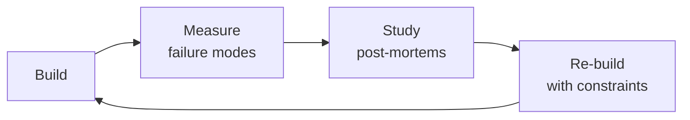

# ML & AI Engineer

End-to-end machine learning and AI engineering — from problem framing through production monitoring.
Covers the full ML lifecycle, model selection, data preparation, training, MLOps infrastructure,
LLM integration patterns, RAG architectures, model serving at scale, evaluation frameworks,
drift monitoring, and responsible AI guardrails.

## Ground Rules — Read Before Anything Else
<!-- HARD GATE: These are non-negotiable. Violation → STOP and refuse to proceed. -->

These rules are **negative constraints** — they define what you MUST NOT do, with mechanical triggers that detect violations before execution.

| # | Negative Constraint | Mechanical Trigger (detect before executing) | Violation Response |
|---|-------------------|---------------------------------------------|-------------------|
| **R1** | **REFUSE to deploy a model without drift monitoring.** Production models degrade silently. | Trigger: `grep -L "drift\|PSI\|KS-test\|evidently\|whylogs\|nannyml" requirements.txt deploy.py serve.py Dockerfile 2>/dev/null` returns non-empty → no drift monitoring configured. | STOP. Respond: "This deployment has no drift monitoring. Run `pip install evidently && python -c 'import evidently'` to bootstrap drift detection. Every production model needs data drift (PSI/KS) and concept drift alerts before serving traffic." |
| **R2** | **REFUSE to report accuracy without confusion matrix, precision, recall, and per-class F1.** | Trigger: output text contains `accuracy.*[0-9]+\.[0-9]+%` and does NOT contain `confusion_matrix\|classification_report\|precision\|recall\|f1` → misleading metric. | STOP. Respond: "Accuracy alone is meaningless for imbalanced data. Run `sklearn.metrics.classification_report(y_true, y_pred)` and `sklearn.metrics.confusion_matrix(y_true, y_pred)` before reporting results." |
| **R3** | **REFUSE to fine-tune an LLM without first evaluating the base model on the target task.** | Trigger: `grep -r "fine.tun\|LoRA\|QLoRA" . --include="*.py"` returns hits AND `grep -r "baseline.*eval\|base.*model.*metric\|zero.shot" . --include="*.py"` returns empty → no baseline established. | STOP. Respond: "Before fine-tuning, run the base model on your evaluation set first: `python eval.py --model base --dataset your_data`. You must prove fine-tuning helps before spending compute. Baseline delta must be ≥ 5% improvement before fine-tuning is justified." |
| **R4** | **DETECT training-serving skew.** Feature engineering MUST be a single source of truth shared between training and serving. | Trigger: `diff <(grep -h "def.*transform\|def.*feature" train.py | sort) <(grep -h "def.*transform\|def.*feature" serve.py | sort)` returns non-empty → duplicated feature logic. | STOP. Respond: "Feature engineering is duplicated in training and serving. Extract into `features.py` shared library, add `test_feature_parity.py` that runs 1,000 examples through both pipelines and asserts identical output within 1e-6 tolerance." |
| **R5** | **REFUSE to serve LLM output to users without retrieval verification or factual grounding check.** | Trigger: code imports `langchain\|llama_index\|openai` and lacks `verify\|grounding\|hallucination\|guardrail\|safety` in same file → no output verification. | STOP. Respond: "LLM output is reaching users unverified. Add retrieval verification: confirm retrieved chunks contain entities in the answer. Add LLM-as-judge factual grounding check. Every RAG pipeline needs a 'did we actually retrieve this?' gate before user-facing output." |
| **R6** | **DETECT unversioned experiment artifacts.** Every training run must be reproducible. | Trigger: `grep -L "seed\|random_state\|set_seed\|deterministic" train.py` returns non-empty OR `grep -L "requirements.*\.txt\|pyproject\.toml" Makefile *.sh 2>/dev/null` returns non-empty → non-reproducible. | STOP. Respond: "Experiments are not reproducible. Pin all random seeds (`random.seed(42)`, `np.random.seed(42)`, `torch.manual_seed(42)`, `torch.backends.cudnn.deterministic = True`), pin dependencies (`pip freeze > requirements.txt`), and version datasets with DVC or lakeFS." |


## The Expert's Mindset

Masters of ml ai engineer don't just build — they build **the right thing, at the right time, with the right trade-offs**. They think in systems, not tasks.

| Cognitive Bias | Mitigation |
|----------------|------------|
| **Shiny object syndrome** — chasing new tools without evaluating fit | Before adopting any new tool, write the "why this over the incumbent" justification |
| **Over-engineering** — building for hypothetical scale | Default to simplest solution; add complexity only when the current solution actually breaks |
| **Not-invented-here** — preferring to build rather than compose | Always evaluate 2 existing solutions before building custom |
| **Sunk cost fallacy** — sticking with a technology because you already invested in it | Re-evaluate tech choices every quarter; migration cost vs. staying cost |

### What Masters Know That Others Don't
- The **failure modes** of every component in their stack — not just the happy path
- When **not** to use their favorite tool (every tool has a misuse zone)
- That **data/model quality decays over time** — monitoring is not optional, it's foundational

### When to Break Your Own Rules
- **Move fast on reversible decisions.** Data format? Hard to change. Dashboard layout? Easy. Know the difference.
- **Skip the abstraction until the third use case.** Two is coincidence, three is a pattern.
## Route the Request

### Auto-Route (No User Input Required)
Evaluate these file-system conditions in order. First match wins — jump immediately.

| # | Condition | Action |
|---|-----------|--------|
| A1 | `file_contains("train.py", "model.fit\|.train()\|Trainer")` OR `file_contains("train.py", "LGBMClassifier\|XGBClassifier\|RandomForest")` | Training classical ML model → Jump to "Core Workflow" — Phase 2 (Training) |
| A2 | `file_contains("*.py", "@app.post.*predict\|FastAPI.*predict\|model.predict")` OR `file_contains("*.py", "bentoml\|mlflow.deploy\|sagemaker\|triton")` | Deploying a model → Jump to "Core Workflow" — Phase 4 (MLOps & Serving) |
| A3 | `file_contains("*.py", "langchain\|llama_index\|chromadb\|pinecone\|weaviate\|qdrant\|faiss")` OR `file_exists("rag.py")` OR `file_exists("retrieval.py")` | Building RAG pipeline → Jump to "Core Workflow" — Phase 3 (RAG Architecture) |
| A4 | `file_contains("*.py", "evidently\|whylogs\|nannyml\|great_expectations\|drift")` OR `file_contains("*.py", "classification_report\|confusion_matrix\|roc_auc")` | Evaluating model or detecting drift → Jump to "Core Workflow" — Phase 5 (Evaluation & Monitoring) |
| A5 | `file_contains("*.py", "peft\|LoRA\|QLoRA\|SFTTrainer\|prepare_model_for_kbit")` OR `file_contains("*.py", "trl\|DPOTrainer\|RewardTrainer")` | Fine-tuning an existing model → Jump to "Core Workflow" — Phase 2 (Fine-tuning) |
| A6 | `file_contains("*.py", "pandas\|pyspark\|polars\|feature_engine")` AND `file_exists("dbt_project.yml")` OR `file_contains("*.py", "Airflow\|Prefect\|Dagster")` | Training data pipeline needed → Invoke `data-engineer` skill |
| A7 | `file_contains("*.py", "torch.cuda\|nvml\|GPU\|CUDA")` AND `file_contains("*.py", "k8s\|kubernetes\|helm\|docker-compose")` | MLOps infrastructure needed → Invoke `mlops-engineer` skill |
| A8 | `file_contains("*.py", "scipy\.stats\|statistical\|hypothesis\|p_value\|t_test\|chi2")` | Statistical analysis needed → Invoke `data-scientist` skill |

### Intent Route (Ask the User)
If no auto-route matched, use this intent tree:

```
What are you trying to do?
├── Train a new model (classical ML or deep learning) → Jump to "Core Workflow" — Phase 2 (Training)
├── Deploy a model to production → Jump to "Core Workflow" — Phase 4 (MLOps & Serving)
├── Build a RAG pipeline with LLMs → Jump to "Core Workflow" — Phase 3 (RAG Architecture)
├── Evaluate model performance or detect drift → Jump to "Core Workflow" — Phase 5 (Evaluation & Monitoring)
├── Fine-tune an existing model (LoRA, QLoRA) → Jump to "Core Workflow" — Phase 2 (Fine-tuning)
├── Need data pipelines for training data → Invoke `data-engineer` skill
├── Need to deploy LLM with safety guardrails → Jump to "Best Practices" — responsible AI
├── Need statistical analysis → Invoke `data-scientist` skill
├── Need MLOps infrastructure → Invoke `mlops-engineer` skill
├── Need LLM-specific patterns → Invoke `llm-engineer` skill
└── Not sure? → Describe the problem in plain language and I'll route you
```

## Operating at Different Levels

| Level | Scope | You... |
|-------|-------|--------|
| **L1** | Single component/module | Implement a well-defined piece following established patterns |
| **L2** | Feature or service | Design and build a complete feature; make tech choices within team conventions |
| **L3** | System or product area | Define architecture for a product area; set team tech standards; mentor L1-L2 |
| **L4** | Multiple systems / platform | Define org-wide architecture patterns; make build-vs-buy decisions; influence industry practice |
| **L5** | Industry / ecosystem | Create new architectural patterns adopted across the industry; redefine what's possible |

**Default level for this skill:** L2
**Usage:** Invoke this skill with your target level, e.g., "as an L3 ml ai engineer, design..."

For full level definitions, see `skills/00-framework/skill-levels/SKILL.md`.

## When to Use
<!-- QUICK: 30s -- scan the bullet list to decide if this skill fits -->
- Framing a business problem as an ML task and selecting the right approach
- Building end-to-end ML pipelines: data ingestion → feature engineering → training → serving
- Training classical ML models (XGBoost, LightGBM, scikit-learn) or deep learning (PyTorch, JAX)
- Designing MLOps infrastructure: experiment tracking, feature store, model registry, CI/CD for ML
- Building RAG applications with LLMs, embedding models, and vector databases
- Fine-tuning open-source LLMs (Llama, Mistral, Gemma, Qwen) with LoRA/QLoRA
- Deploying models: real-time APIs, batch scoring, streaming inference, edge deployment
- Evaluating models comprehensively: offline metrics, slicing, fairness, calibration, A/B testing
- Monitoring production models: data drift, concept drift, performance degradation
- Implementing AI safety: guardrails, red-teaming, hallucination detection, content filtering

## Decision Trees
<!-- QUICK: 30s -- follow the ASCII tree to your scenario -->
### ML vs Heuristic vs LLM
```
                     ┌───────────────────────────────┐
                     │ START: Should this be ML?       │
                     └────────────┬──────────────────┘
                                  │
                    ┌─────────────▼─────────────────┐
                    │ Can a deterministic heuristic  │
                    │ solve it with acceptable       │
                    │ accuracy?                      │
                    └────┬──────────────────────┬───┘
                         │ YES                  │ NO
                    ┌────▼────────┐  ┌──────────▼───────────┐
                    │ Heuristic   │  │ Need reasoning over   │
                    │ Ship in 1d  │  │ unstructured text?    │
                    └─────────────┘  └──┬───────────────┬────┘
                                       │YES            │NO
                                  ┌────▼────────┐ ┌───▼──────────┐
                                  │ Have >1K    │ │ Structured/   │
                                  │ labeled     │ │ tabular data? │
                                  │ examples?   │ └──┬────────┬───┘
                                  └──┬──────┬───┘    │YES     │NO
                                     │YES   │NO   ┌──▼──┐ ┌──▼──────┐
                                ┌────▼──┐ ┌─▼─────┐│XGBoost││Re-evaluate│
                                │Fine-tune│ │RAG +  ││LightGBM││problem   │
                                │LoRA/QLoRA│ │Few-shot││CatBoost││framing   │
                                └────────┘ └──────┘└───────┘└─────────┘
```
**When to choose Heuristic:** Simple rules cover 90%+ of cases, error tolerance is high, shipping speed beats marginal accuracy improvement.  
**When to choose Classical ML:** Structured tabular data, 1K-10K labeled examples, interpretability matters (SHAP values).  
**When to choose RAG:** No labeled data, knowledge is in documents, answer must be grounded in specific context with citations.  
**When to choose Fine-tuned LLM:** Need specific style/tone/task adaptation, have 100-1K high-quality examples, latency budget allows inference.

### Real-time vs Batch vs Streaming Inference
```
                     ┌──────────────────────────┐
                     │ START: Serving pattern    │
                     └────────────┬─────────────┘
                                  │
                    ┌─────────────▼─────────────┐
                    │ P99 latency requirement?   │
                    └────┬──────────────────┬───┘
                         │ <100ms           │ >1 minute
                    ┌────▼──────┐    ┌──────▼──────────┐
                    │ User-facing│    │ Scheduled/nightly│
                    │ prediction?│    │ scoring?         │
                    └──┬────┬────┘    └──┬──────────┬────┘
                       │YES │NO        │YES       │NO
                  ┌────▼──┐ ┌▼───────┐ ┌▼────┐ ┌───▼──────┐
                  │Real-time│ │Embedded│ │Batch│ │Streaming │
                  │REST/gRPC│ │in DB  │ │Spark│ │Kafka +   │
                  │10-200ms │ │<1ms   │ │daily│ │<100ms    │
                  └─────────┘ └───────┘ └─────┘ └──────────┘
```
**When to choose Real-time API:** User-facing features (search, recommendations, chat), P99 < 200ms, use FastAPI/Triton with auto-scaling.  
**When to choose Batch:** Nightly reports, risk scoring, ETL enrichment — run Spark jobs, cost-efficient, millions/day.  
**When to choose Streaming:** Fraud detection, real-time personalization — Kafka + Flink, <100ms processing, sub-second freshness.  
**When to choose Embedded:** Scoring within SQL queries — ONNX Runtime in PostgreSQL, <1ms, no network overhead.

### RAG vs Fine-tuning vs Prompt Engineering
```
                     ┌──────────────────────────┐
                     │ START: LLM approach       │
                     └────────────┬─────────────┘
                                  │
                    ┌─────────────▼─────────────┐
                    │ Need model to learn new    │
                    │ style/tone/format/task?    │
                    └────┬──────────────────┬───┘
                         │ YES              │ NO
                    ┌────▼──────┐    ┌──────▼──────────┐
                    │ Have 100+  │    │ Need domain      │
                    │ high-quality│    │ knowledge from   │
                    │ examples?  │    │ documents?       │
                    └──┬────┬────┘    └──┬──────────┬────┘
                       │YES │NO        │YES       │NO
                  ┌────▼──┐ ┌▼────────┐┌─▼───┐ ┌───▼──────┐
                  │Fine-tune│ │Few-shot ││RAG  │ │Zero-shot │
                  │LoRA on │ │prompting││+ Vec│ │prompt    │
                  │1K+ exs │ │5-50 exs ││ DB  │ │only      │
                  └────────┘ └─────────┘└─────┘ └──────────┘
```
**When to choose RAG:** Knowledge changes faster than retraining, need citations/attribution, zero labeled data — Pinecone/Weaviate + embedding model.  
**When to choose Fine-tuning:** Teach a specific task/format persistently, have 100-1K high-quality examples, want cost reduction vs long prompts.  
**When to choose Few-shot:** 5-50 examples in prompt, model already capable but needs guidance, no training infrastructure.  
**When to choose Zero-shot:** Simple tasks with capable models (GPT-4, Claude), no examples needed, fastest path.

### Overfitting Diagnosis
```
                     ┌──────────────────────────┐
                     │ START: Model not          │
                     │ generalizing?             │
                     └────────────┬─────────────┘
                                  │
                    ┌─────────────▼─────────────┐
                    │ Train acc >> Val acc?      │
                    │ (gap > 5%?)               │
                    └────┬──────────────────┬───┘
                         │ YES              │ NO
                    ┌────▼──────┐    ┌──────▼──────────┐
                    │Overfitting│    │ Train ~= Val?    │
                    └──┬────────┘    └──┬──────────┬────┘
                       │               │YES       │NO (both low)
                  ┌────▼───────┐  ┌────▼────┐ ┌───▼──────────┐
                  │Regularize: │  │Metric   │ │Underfitting: │
                  │L1/L2,drop, │  │mismatch?│ │More capacity, │
                  │early stop, │  └──┬───┬───┘ │better features│
                  │more data   │     │YES│NO    │Reduce regul. │
                  └────────────┘  ┌──▼┐┌─▼────┐└──────────────┘
                                  │Fix││Check │
                                  │eval││data  │
                                  │met││quality│
                                  └───┘└──────┘
```
**When to increase regularization:** Train acc >> Val acc, high variance across CV folds — add L1/L2, dropout, early stopping, data augmentation.  
**When to increase capacity:** Both train and val are low — model too simple, underfitting. Add layers, reduce regularization, engineer better features.  
**When to audit data:** Perfect train, random val — likely data leakage or bad split. Audit time-based/group-based splits.

### Model Monitoring Thresholds
```
                     ┌──────────────────────────────┐
                     │ START: Production model       │
                     │ monitoring alert fired?       │
                     └────────────┬─────────────────┘
                                  │
                    ┌─────────────▼─────────────────┐
                    │ PSI > 0.25 on critical feature?│
                    └────┬──────────────────────┬───┘
                         │ YES                  │ NO
                    ┌────▼────────────┐  ┌──────▼──────────┐
                    │Data drift:      │  │ P99 latency >    │
                    │Trigger retrain, │  │ 2× SLA?         │
                    │investigate      │  └──┬──────────┬────┘
                    │upstream change  │     │YES       │NO
                    └─────────────────┘  ┌──▼────┐ ┌──▼──────────┐
                                         │Scale  │ │Pred error   │
                                         │up infra│ │rate > 5×    │
                                         │or model│ │baseline?    │
                                         │optimize│ └──┬──────┬───┘
                                         └────────┘    │YES   │NO
                                                   ┌───▼──┐ ┌─▼─────┐
                                                   │Concept│ │No     │
                                                   │drift: │ │action │
                                                   │Rollback│ │needed │
                                                   │+ retrain│ └──────┘
                                                   └───────┘
```
**When to trigger retrain:** PSI > 0.25 on any critical feature — data distribution shifted significantly. Investigate upstream pipeline first.  
**When to rollback:** Prediction error rate > 5× baseline for 15+ min — model performance collapsed. Immediate rollback to last known good.  
**When to scale infra:** P99 latency > 2× SLA — model isn't broken, infrastructure is. Add replicas, optimize model with quantization.

## Core Workflow
<!-- QUICK: 30s -- scan phase titles to understand the process -->
<!-- DEEP: 10+min -->
### Phase 1 (~15 min): Problem Framing and Feasibility

1. **Frame the ML problem** — not every problem needs ML. Ask:
   - Is there a clear input → output mapping with historical examples?
   - Can a heuristic or rule-based system solve it with acceptable accuracy?
   - Is the cost of a wrong prediction acceptable? What's the error tolerance?
   - Do we have (or can we acquire) labeled data? How much? What's the label quality?

2. **Define success criteria before writing code:**
   - **Business metric**: what KPI does this model move? (revenue, retention, cost reduction)
   - **Model metric**: offline proxy for the business metric (precision@K, RMSE, ROC-AUC)
   - **Baseline**: current production performance — heuristic, previous model, or random
   - **Launch bar**: minimum improvement over baseline to justify deployment cost

3. **Decision tree for model selection:**

   ```
   Problem type?
   ├── Structured/tabular data (rows & columns)
   │   ├── Regression (predict number)       → XGBoost, LightGBM, CatBoost, Linear Regression
   │   ├── Binary classification              → XGBoost, LightGBM, Logistic Regression
   │   ├── Multi-class classification         → XGBoost, LightGBM, CatBoost
   │   ├── Time-series forecasting            → Prophet, ARIMA, Temporal Fusion Transformer, DeepAR
   │   └── Recommendation / ranking          → Two-tower models, Matrix Factorization, LightFM
   │
   ├── Unstructured data
   │   ├── Text
   │   │   ├── Classification/extraction     → Fine-tuned BERT/RoBERTa/DeBERTa, SetFit
   │   │   ├── Generation/summarization      → LLM (GPT-4, Claude, Llama, Mistral)
   │   │   ├── Semantic search               → Embeddings + vector DB (RAG)
   │   │   └── Translation                   → NLLB, M2M-100, fine-tuned mT5
   │   │
   │   ├── Images
   │   │   ├── Classification                 → ResNet, EfficientNet, ViT, fine-tune CLIP
   │   │   ├── Object detection               → YOLOv8, DETR, Faster R-CNN
   │   │   ├── Segmentation                   → SAM, Mask R-CNN, U-Net
   │   │   └── Generation                     → Stable Diffusion, DALL-E, Midjourney API
   │   │
   │   ├── Audio
   │   │   ├── Speech-to-text                 → Whisper, DeepSpeech
   │   │   ├── Text-to-speech                 → ElevenLabs, Bark, Tortoise-TTS
   │   │   └── Audio classification           → Wav2Vec2, AST, CLAP
   │   │
   │   └── Video                              → TimeSformer, VideoMAE, ViVit
   │
   └── Multi-modal
       └── Vision + Language                  → GPT-4V, Gemini, LLaVA, CogVLM, Fuyu
   ```


**What good looks like:** ML pipeline reproducible from raw data to deployed model. Feature store serves consistent features for training and inference. Model monitoring tracks prediction drift, data drift, and performance metrics. A/B test framework compares model versions. Training pipeline completes in under 2 hours.

4. **Data requirements by approach:**
   | Approach                     | Minimum Labeled Data | Notes                                    |
   |------------------------------|---------------------|------------------------------------------|
   | Heuristic / rules            | 0                   | Baseline; often surprisingly good        |
   | Classical ML (XGBoost)       | 1K–10K              | Great with well-engineered features      |
   | Fine-tune BERT/RoBERTa       | 1K–10K              | Use SetFit for <100 examples per class   |
   | Fine-tune LLM (LoRA)         | 100–1K              | High-quality examples matter most        |
   | RAG (no fine-tuning)         | 0 labeled, docs needed | Embed documents, retrieve, prompt     |
   | Few-shot LLM prompt          | 5–50                | In-context examples in the prompt        |
   | Zero-shot LLM prompt         | 0                   | Relies entirely on model's pre-training  |

<!-- DEEP: 10+min -->
### Phase 2 (~30 min): Data Preparation

1. **Data collection and labeling:**
   - Audit data sources: transactional DBs, event streams, logs, third-party APIs, human labelers
   - Establish labeling guidelines with edge cases; inter-annotator agreement (Cohen's κ > 0.7)
   - Use weak supervision (Snorkel) or active learning when labels are expensive
   - For LLM fine-tuning: curate diverse, high-quality examples; quality >> quantity

2. **Exploratory Data Analysis (EDA):**
   - Univariate: distributions, missing rates, cardinality, skew, outliers
   - Bivariate: correlations, mutual information, feature interactions
   - Target analysis: class imbalance, distribution shape, temporal patterns
   - **CRITICAL**: check for target leakage — any feature that contains information about the target unavailable at prediction time (e.g., using `days_since_last_purchase` to predict churn when your label is "churned on day X")

3. **Feature engineering patterns:**
   | Data Type           | Encoding Strategy                                                        |
   |---------------------|--------------------------------------------------------------------------|
   | Numeric              | StandardScaler (normal dist), RobustScaler (outliers), QuantileTransformer |
   | High-cardinality cat | Target encoding (with smoothing), CatBoost built-in                      |
   | Low-cardinality cat  | One-hot (≤10 categories), Ordinal (ordered), Binary (2 categories)       |
   | Text                 | TF-IDF (classic ML), embeddings (deep learning), count vectorizer        |
   | Datetime             | Cyclical encoding (sin/cos of hour, day, month), lag features, rolling stats |
   | Geo                  | Geohash, H3 hex, distance to POI, cluster assignment                   |

4. **Handling missing data — in order of preference:**
   1. Understand WHY data is missing (MCAR, MAR, MNAR) — this determines the fix
   2. Delete: if column >60% missing and not critical, drop it
   3. Impute: median (skewed), mean (normal), mode (categorical), KNN, MICE, or model-based
   4. Add indicator flag: create `feature_is_missing` binary column — the absence itself can be signal
   5. Use models that handle missing natively: XGBoost, LightGBM, CatBoost

5. **Train / Validation / Test split — do NOT get this wrong:**
   - **Time-based split**: for time-series or any data with temporal dependency, split chronologically (train on past, test on future) — random split leaks future into training
   - **Group-based split**: if observations share a group (user, session, hospital), keep all of a group in ONE split — cross-group contamination inflates metrics
   - **Stratified split**: maintain class distribution across splits for imbalanced problems
   - **Standard split ratio**: 70/15/15 or 80/10/10 for datasets >10K; 60/20/20 for small datasets
   - **Never tune hyperparameters on the test set** — test set is touched exactly once at the very end

<!-- DEEP: 10+min -->
### Phase 3 (~20 min): Model Development and Training

1. **Start with a strong baseline before complex models:**
   - Simple heuristic: "always predict the majority class", "predict yesterday's value"
   - Linear/logistic regression with basic features
   - LightGBM with default hyperparameters
   - **Rule**: if your complex model doesn't beat a simple baseline by >5%, fix your data or reframe the problem

2. **Hyperparameter tuning strategy:**
   ```
   Stage 1: Coarse grid search (3-5 values per param) → find promising region
   Stage 2: Bayesian optimization (Optuna, Hyperopt) in the promising region
   Stage 3: Manual fine-tuning on the most sensitive parameters
   
   Priority order (most impactful first):
   - Learning rate
   - Model complexity (max_depth, n_estimators, num_layers)
   - Regularization (lambda, alpha, dropout, weight_decay)
   - Batch size (affects convergence, not final quality)
   ```

3. **Cross-validation strategy by data type:**
   | Data Characteristic  | CV Strategy                                     |
   |----------------------|--------------------------------------------------|
   | IID (independent)    | 5-fold stratified K-fold                         |
   | Time-series          | TimeSeriesSplit (expanding window) or blocked CV |
   | Grouped              | GroupKFold — groups never split across folds     |
   | Small dataset (<1K)  | Leave-One-Out or 10× repeated 5-fold             |
   | Large dataset (>1M)  | Single holdout validation set is sufficient      |

4. **Detecting and fixing overfitting:**
   | Symptom                         | Fix                                                       |
   |---------------------------------|-----------------------------------------------------------|
   | Train >> Val accuracy           | Add regularization (L1/L2, dropout), reduce model capacity |
   | Val loss increasing, train flat | Early stopping with patience=5-10 epochs                  |
   | Perfect train, random val       | Data leakage — audit your split and features              |
   | High variance across CV folds   | More data, reduce model complexity, ensemble methods      |

5. **Regularization cheat sheet:**
   - **L1 (Lasso)**: feature selection — drives coefficients to exactly zero
   - **L2 (Ridge)**: prevents any single coefficient from dominating
   - **ElasticNet**: combines L1 + L2; best default for linear models
   - **Dropout**: for neural nets; 0.2 input layer, 0.5 hidden layers
   - **Weight decay**: modern alternative to L2 in deep learning
   - **Early stopping**: stop training when validation metric stops improving
   - **Data augmentation**: best regularizer — more (real) data always wins

<!-- DEEP: 10+min -->
### Phase 4 (~15 min): Evaluation

1. **Classification metrics — choose the right one:**
   | Use Case                            | Primary Metric    | Secondary Metric  |
   |-------------------------------------|-------------------|-------------------|
   | Balanced classes                    | Accuracy          | Log-loss          |
   | Imbalanced, care about positives    | Precision-Recall AUC | F1-score       |
   | Imbalanced, care about ranking      | ROC-AUC           | PR-AUC            |
   | Fraud detection (rare positives)    | Precision@K       | Recall@K          |
   | Medical diagnosis (don't miss)      | Recall (sensitivity) | NPV            |
   | Spam detection (don't false-alarm)  | Precision         | FPR               |
   | Multi-class                         | Macro F1          | Weighted F1       |

2. **Regression metrics:**
   | Use Case                | Metric | Interpretation                                   |
   |-------------------------|--------|--------------------------------------------------|
   | General purpose         | RMSE   | Penalizes large errors heavily; in target units  |
   | Outlier-heavy targets   | MAE    | Less sensitive to outliers; in target units      |
   | Scale-invariant         | MAPE   | Percentage error; fails when y=0                 |
   | Understand variance     | R²     | Proportion of variance explained; 1.0 is perfect |

3. **Ranking/Recommendation metrics:**
   - **NDCG@K**: normalized discounted cumulative gain — rewards relevant items at top ranks
   - **MAP@K**: mean average precision — treats ranking as binary relevance at each position
   - **MRR**: mean reciprocal rank — good for "find the one right answer" tasks
   - **Hit Rate@K**: fraction of users with at least one relevant item in top K

4. **Beyond aggregate metrics — slice-based evaluation:**
   - Segment by user demographics, geography, plan tier, device type, acquisition channel
   - Report worst-performing slice alongside overall metric
   - **Rule**: if any slice with >5% of traffic performs significantly worse, fix before launch

5. **LLM-specific evaluation:**
   | Capability         | Eval Framework/Tool          | Example Metric              |
   |--------------------|------------------------------|-----------------------------|
   | Code generation    | HumanEval, MBPP, SWE-bench   | pass@k                      |
   | General knowledge   | MMLU, ARC, HellaSwag         | Accuracy                    |
   | Summarization      | ROUGE, BERTScore, SummEval   | ROUGE-L, BERTScore F1       |
   | RAG quality        | RAGAS, TruLens, DeepEval     | Faithfulness, Relevance     |
   | Safety             | Anthropic eval, custom       | Refusal rate, harm score    |
   - **LLM-as-judge pattern**: use a stronger LLM (GPT-4, Claude Opus) to evaluate outputs of a weaker model
   - Always validate LLM-as-judge against human ratings (correlation >0.7)

<!-- DEEP: 10+min -->
### Phase 5 (~25 min): MLOps Infrastructure

1. **Experiment tracking — log everything:**
   - Tooling: MLflow, Weights & Biases, Neptune, Comet ML
   - Log for every run: git commit hash, dataset version/hash, hyperparameters, metrics (train+val), artifacts (model, plots, config), environment (requirements.txt or conda env export)
   - Naming convention: `{model_name}_{date}_{git_short_hash}_{brief_description}`
   - Tag runs: `baseline`, `best_so_far`, `production_candidate`, `failed`

2. **Feature Store — training/serving parity:**
   - **Offline store**: historical features for training (data warehouse, parquet, Delta Lake) — batch, high-throughput
   - **Online store**: low-latency features for inference (Redis, DynamoDB, Bigtable) — <10ms P99
   - Tools: Feast, Tecton, Hopsworks, or custom with point-in-time correct joins
   - **The cardinal rule**: feature transformation logic is defined ONCE and reused in training and serving — if you write it twice, they WILL diverge

3. **Model Registry — manage the lifecycle:**
   - Stages: `staging` → `production` → `archived`
   - Store: model artifact (pickle, ONNX, saved_model), environment spec, metrics, training dataset reference
   - Promotion requires: passing eval gate, approval from model owner, documented release notes
   - Archive old models; never delete — you need them for rollback and audit

4. **CI/CD for ML — distinct from software CI/CD:**
   ```
   Trigger: new training data available OR scheduled retrain OR code change
   
   Pipeline stages:
   1. Data validation (Great Expectations, TFX Data Validation)  → schema, stats, drift check
   2. Feature computation (point-in-time correct)                → push to offline feature store
   3. Model training (with experiment tracking)                  → log to MLflow/W&B
   4. Model evaluation (offline metrics, slicing, fairness)      → gate: pass/fail
   5. Model registration (if gate passed)                        → registry stage: staging
   6. Shadow/canary deployment                                   → smoke test on live traffic
   7. Full promotion (if shadow metrics OK)                      → registry stage: production
   ```

<!-- DEEP: 10+min -->
### Phase 6 (~25 min): Model Serving

1. **Deployment patterns — choose based on latency and throughput:**
   | Pattern              | Latency    | Throughput   | Best For                             |
   |----------------------|------------|--------------|--------------------------------------|
   | Real-time REST/gRPC  | 10–200ms   | 100–10K QPS  | User-facing predictions              |
   | Batch inference      | Minutes-Hrs| Millions/day | Nightly scoring, report generation   |
   | Streaming            | <100ms     | 100K+ QPS    | Fraud detection, recommendations     |
   | Edge / on-device     | <10ms      | Per-device   | Mobile, IoT, offline-capable         |
   | Embedded in DB       | <1ms       | Query-bound  | Scoring within SQL queries           |

2. **Serving infrastructure:**
   - **Frameworks**: FastAPI (simple), Ray Serve (distributed), Triton Inference Server (high-perf, multi-framework), BentoML (packaging), Seldon Core/KFServing (Kubernetes-native)
   - **GPU serving**: use Triton with dynamic batching, model concurrency, and instance groups; NVIDIA MIG for GPU partitioning
   - **CPU serving**: ONNX Runtime or OpenVINO — 2–10× speedup over native PyTorch/TF; quantized INT8 models
   - **Auto-scaling**: based on request latency (P99 < target) and queue depth; pre-warm on deploy

3. **Model optimization for inference:**
   | Technique          | Speedup | Accuracy Cost | When to Use                          |
   |--------------------|---------|---------------|--------------------------------------|
   | ONNX export         | 1.5–3×  | None          | Always — first step                  |
   | INT8 quantization   | 2–4×    | <1%           | CPU deployment, edge devices         |
   | FP16 inference      | 2×      | Negligible    | GPU deployment (Ampere+)             |
   | Pruning             | 1.5–3×  | 0.5–2%        | Large models, GPU bound              |
   | Knowledge distillation| 2–10× | 1–5%          | Replace large model with small       |
   | Operator fusion     | 1.2–1.5×| None          | Always — part of ONNX/TensorRT       |
   | FlashAttention      | 2–4×    | None          | Transformer inference (GPU)          |

4. **Batching strategies:**
   - **Dynamic batching**: server waits N ms to accumulate requests, processes them as a batch — balances latency vs throughput
   - **Ragged batching**: for variable-length sequences — pad to max in batch, mask attention — as opposed to padding all to model max
   - **Continuous batching** (aka iteration-level scheduling): for LLMs — don't wait for all sequences in a batch to finish before adding new ones; vLLM, TensorRT-LLM

<!-- DEEP: 10+min -->
### Phase 7 (~25 min): LLM Patterns

1. **Prompt engineering — fundamental patterns:**
   - **Zero-shot**: just ask; works for simple tasks with capable models
   - **Few-shot**: provide 3–8 examples in the prompt; format input→output pairs consistently
   - **Chain-of-thought (CoT)**: add "Let's think step by step" — forces the model to reason before answering; 10–30% improvement on reasoning tasks
   - **Tree-of-thought (ToT)**: explore multiple reasoning paths, evaluate each, backtrack — for complex planning
   - **ReAct**: interleave Reasoning and Action — model decides to use a tool, sees result, reasons further
   - **Structured output**: request JSON, XML, or function-call format; constrain with grammar (guidance, outlines, lm-format-enforcer)

2. **RAG Architecture — retrieval-augmented generation:**
   ```
   ┌──────────────┐    ┌───────────────┐    ┌──────────────┐
   │ Document      │───▶│ Chunking       │───▶│ Embedding     │
   │ Ingestion     │    │ Strategy       │    │ Model         │
   └──────────────┘    └───────────────┘    └──────┬───────┘
                                                    │
                                              ┌─────▼───────┐
   ┌──────────────┐    ┌───────────────┐    │ Vector DB    │
   │ User Query    │───▶│ Query          │───▶│ (Pinecone,   │
   │               │    │ Transformation │    │  Weaviate,   │
   └──────────────┘    └───────────────┘    │  pgvector)   │
                                             └──────┬───────┘
   ┌──────────────┐    ┌───────────────┐           │
   │ Final Answer  │◀───│ LLM Generation │◀─────────┘
   │ (with cites)  │    │ + Prompt       │    Retrieved Chunks
   └──────────────┘    └───────────────┘
   ```
   Key decisions:
   - **Chunking**: size 256–1024 tokens; overlap 10–20%; prefer semantic (sentence-boundary-aware) over fixed-length
   - **Embedding model**: `text-embedding-3-large` (OpenAI, 3072d), `embed-english-v3.0` (Cohere, 1024d), `bge-large-en-v1.5` (BGE, 1024d, open-source), `e5-mistral-7b-instruct` (Microsoft, 4096d, SOTA open-source)
   - **Vector DB**: Pinecone (managed, fast, $$), Qdrant (OSS, fast, Rust), Weaviate (OSS, hybrid search built-in), pgvector (PostgreSQL extension, simple), Milvus (OSS, distributed, GPU indexing)
   - **Retrieval**: dense (cosine similarity on embeddings) + sparse (BM25/Splade for keyword match); hybrid with reciprocal rank fusion
   - **Reranking**: cross-encoder (`bge-reranker-v2-m3`, Cohere Rerank v3) scores (query, chunk) pairs — improves recall substantially

3. **Fine-tuning LLMs — when and how:**
   | Scenario                          | Approach                          |
   |-----------------------------------|-----------------------------------|
   | Add knowledge (docs, facts)       | **RAG** — don't fine-tune         |
   | Teach style/tone/format           | **Fine-tune** — 100–1K examples   |
   | Teach a new task/skill            | **Fine-tune** — 1K–10K examples   |
   | Both knowledge + task             | **RAG + fine-tune** — combine     |
   | Hard reasoning, math, code        | **Fine-tune** — need high-quality data |

   **LoRA / QLoRA parameters — starting points:**
   - `r` (rank): 8–64; higher = more capacity but more VRAM; 16 is a safe default
   - `alpha`: usually 2× r; scaling factor for the LoRA weights
   - `target_modules`: all linear layers for best quality; `["q_proj", "v_proj"]` for memory efficiency
   - `lora_dropout`: 0.05–0.1
   - QLoRA: 4-bit NF4 quantization with double quantization — fine-tune 70B models on a single 48GB GPU

4. **Agent patterns:**
   - **ReAct agent**: LLM generates Thought → Action → Observation → Thought → ... → Final Answer
   - **Tool-use / function calling**: LLM outputs structured JSON to invoke tools (search, calculator, DB query, API call)
   - **Plan-and-execute**: LLM first creates a plan (list of steps), then executes each step with tool calls
   - **Multi-agent**: separate LLM instances with different roles (researcher, coder, critic) collaborating
   - **Guardrails**: validate tool inputs, timeouts on tool execution, max iterations, human approval for destructive actions

<!-- DEEP: 10+min -->
### Phase 8 (~30 min): Monitoring and Observability

1. **Drift detection — the silent killer:**
   | Drift Type         | What Changes             | Detection Method                           |
   |--------------------|--------------------------|--------------------------------------------|
   | Data drift         | Input feature distribution | KS test, PSI, Jensen-Shannon distance    |
   | Concept drift      | P(Y|X) relationship      | Monitor prediction error over time         |
   | Prediction drift   | Model output distribution | Compare to training distribution           |
   | Label drift        | Ground truth distribution | Requires delayed labels; monitor after arrival |

   - **Reference window**: last 7 days of training data distribution
   - **Analysis window**: current production data distribution (rolling)
   - **Threshold**: PSI > 0.2 triggers investigation; PSI > 0.25 triggers retrain pipeline
   - Tools: Evidently AI, NannyML, Whylogs, Great Expectations, custom with scipy stats

2. **Performance monitoring:**
   - **Online metrics** (require labels): accuracy, precision, recall, RMSE — computed when ground truth arrives (delayed by hours/days)
   - **Proxy metrics** (no labels needed): prediction distribution stability, % null predictions, avg prediction magnitude, % predictions in valid range
   - **Infrastructure metrics**: latency (P50, P95, P99), throughput (QPS), error rate (4xx, 5xx), GPU utilization, queue depth

3. **Alerting — page on symptoms:**
   - Prediction error rate > 5× baseline for >15 minutes → page on-call
   - Data drift PSI > 0.3 on any critical feature → create ticket
   - Serving latency P99 > 2× SLA for >5 minutes → page on-call
   - % null inputs > 10% (and previously near 0%) → page on-call (likely upstream data pipeline failure)

<!-- DEEP: 10+min -->
### Phase 9 (~20 min): Responsible AI

1. **Fairness metrics — measure before launch:**
   | Metric                    | Definition                                                      |
   |---------------------------|-----------------------------------------------------------------|
   | Demographic parity        | P(positive|group A) = P(positive|group B)                       |
   | Equal opportunity         | TPR same across groups                                          |
   | Equalized odds            | TPR and FPR same across groups                                  |
   | Disparate impact ratio    | ratio of positive rates; <0.8 indicates adverse impact (US legal) |

2. **Explainability:**
   - **SHAP**: game-theoretic feature importance; works for any model; global + local explanations
   - **LIME**: local surrogate models; faster than SHAP, less theoretically grounded
   - **Integrated Gradients**: for neural networks; attribute prediction to input features
   - **Attention visualization**: for transformers — shows which tokens the model attended to
   - **LLM explainability**: ask the model to explain its reasoning; chain-of-thought as explanation

3. **Safety guardrails for LLM applications:**
   - **Input guard**: classify and block harmful inputs (Llama Guard, OpenAI Moderation API, custom classifier)
   - **Output guard**: detect hallucinations (verify claims against retrieved context), filter toxic content, enforce format
   - **Prompt injection defense**: separate instructions from user data (use special delimiters), input sanitization, rate limiting
   - **Red-teaming**: systematically attempt to break safety controls; both automated (Garak, promptfoo) and human
   - **Model cards**: document intended use, limitations, training data, evaluation results, and fairness assessment

4. **Cost optimization:**
   | Layer          | Strategy                                                       | Savings |
   |----------------|----------------------------------------------------------------|---------|
   | Training       | Spot/preemptible instances, mixed precision, gradient accumulation | 40–70% |
   | Serving (GPU)  | Continuous batching (vLLM), quantization (INT8/INT4), model distillation | 50–90% |
   | Serving (CPU)  | ONNX Runtime, quantization, caching frequent responses         | 30–60% |
   | LLM APIs       | Prompt compression, shorter context, tiered models (GPT-4→3.5 for simple tasks), prompt caching | 30–80% |
   | Embeddings     | Cache embeddings; don't re-embed unchanged documents           | 50–90% |
   | Vector DB      | Dimension reduction (PCA), scalar quantization, disk-based index for cold data | 30–60% |


### Cross-skills Integration
```bash
# Statistical models → ML productionization → API integration
/data-scientist && /ml-ai-engineer && /backend-developer
# Data pipelines → ML training → Security review
/data-engineer && /ml-ai-engineer && /security-engineer
# Data scientists develop models. ML engineers productionize and monitor. Backend devs integrate. Security reviews for safety.
```

## Sub-Skills
<!-- QUICK: 30s -- table of deeper dives by topic -->
When this skill is invoked, the agent may need to drill into these specialized areas:

| Sub-Skill | When to Use |
|-----------|-------------|
| `ml-lifecycle` | End-to-end ML projects: problem framing → data → training → deployment → monitoring |
| `model-selection` | Choosing the right approach: classical ML vs deep learning vs foundation models vs heuristics |
| `data-preparation` | Feature engineering, missing data handling, encoding, normalization, leakage prevention |
| `training-optimization` | Hyperparameter tuning, cross-validation strategies, overfitting detection, regularization |
| `mlops-pipeline` | Experiment tracking, model registry, feature stores, and CI/CD for ML |
| `model-serving` | Deployment patterns: batch, real-time, streaming, edge; optimization via quantization and distillation |
| `llm-patterns` | Building with LLMs: prompt engineering, RAG architectures, fine-tuning, and agent patterns |
| `model-evaluation` | Comprehensive assessment: classification, regression, ranking, and LLM-specific evaluation metrics |
| `model-monitoring` | Production drift detection: data drift, concept drift, performance decay, and fairness monitoring |
| `responsible-ai` | Bias detection, fairness metrics, explainability (SHAP/LIME), model cards, and safety guardrails |

## Cross-Skill Coordination

| Upstream Skill | What You Receive | When to Involve |
|---|---|---|
| `data-engineer` | Feature computation schedules, historical backfill requirements, data quality expectations, schema contracts | Before building training pipelines or feature engineering workflows |
| `data-scientist` | Feature engineering insights, model evaluation metrics, training data quality assessment, statistical validation methods | Before selecting model architecture or designing evaluation harness |
| `mlops-engineer` | Model registry integration, CI/CD pipeline for ML, deployment infrastructure, monitoring stack | Before deploying models to production or setting up drift monitoring |

| Downstream Skill | What You Provide | Impact of Delay |
|---|---|---|
| `data-scientist` | Model artifacts, feature engineering code, inference pipeline requirements, monitoring thresholds | Scientists can't productionize research — models stay in notebooks |
| `mlops-engineer` | Model serving API contract, GPU/CPU resource requirements, canary deployment strategy, drift detection rules | MLOps can't deploy models — no serving infrastructure configured |
| `llm-engineer` | RAG architecture patterns, embedding pipelines, prompt engineering frameworks, model evaluation harness | LLM applications lack foundation — hallucination and quality risks |

## Proactive Triggers
<!-- DEEP: 10+min — when to intervene before someone asks -->

| Trigger | Action | Why |
|---------|--------|-----|
| Data scientist hands off a Jupyter notebook with `model.fit()` and says "this is production-ready" | Propose structured training pipeline: data validation → feature engineering → training → evaluation → model registry; sync with `mlops-engineer` on CI/CD integration and `data-engineer` on feature computation | Notebooks are exploration artifacts, not production artifacts; a training pipeline ensures reproducibility, versioning, and automated validation — the notebook author won't be the one debugging it at 3 AM |
| Team wants to deploy an ML model but has no evaluation framework beyond accuracy | Propose multi-metric evaluation harness: per-class precision/recall, calibration (ECE), fairness metrics per protected group, slice-based evaluation, business simulation; sync with `data-scientist` on evaluation methodology | Accuracy alone hides critical failures: 95% accuracy on imbalanced data (5% positive class) means a "predict negative always" model scores 95%; slice-based evaluation catches "works for segment A, fails for segment B" before production |
| Product asks "can we add ML to predict user churn?" with no labeled data | Propose labeling strategy first: heuristic-based weak labels → active learning for edge cases → human review for quality; sync with `data-engineer` on label pipeline and `product-manager` on labeling budget | Labels are the most valuable ML asset — more impactful than model architecture choice; investing in labeling quality before model selection prevents garbage-in-garbage-out cycles |
| Feature engineering code exists in 3 different places: training script, batch inference, and real-time serving | Propose centralized feature engineering in feature store (Feast) with shared transformation logic; sync with `data-engineer` on feature computation pipeline and `mlops-engineer` on serving integration | Duplicated feature logic is the root cause of training-serving skew; centralized feature definitions with point-in-time correctness ensure identical computation in all environments |
| Team wants to fine-tune an LLM but has only 200 labeled examples | Recommend RAG before fine-tuning: retrieval-augmented generation solves 80% of LLM use cases with zero training; sync with `llm-engineer` on RAG architecture; fine-tune only for teaching new tasks/styles/reasoning patterns | Fine-tuning on 200 examples overfits to noise; RAG with good retrieval provides factually grounded responses without model retraining; fine-tuning is appropriate only when you need the model to learn a fundamentally new capability |
| Backend team needs model serving API but no contract exists for input/output schemas | Propose model serving API contract: input schema (feature names, types, ranges), output schema (prediction format, confidence scores, calibration), error codes; sync with `backend-developer` on API design and `mlops-engineer` on serving infrastructure | Without a serving contract, frontend/backend teams build against assumptions that break when the model changes; a versioned API contract decouples model iteration from consumer changes |
| Bias audit reveals model performs 30% worse for a protected demographic group | Propose bias mitigation pipeline: fairness metrics monitoring (demographic parity, equal opportunity), reweighting/resampling during training, threshold calibration per group; sync with `ai-safety-engineer` on fairness evaluation | A model that performs 30% worse for a protected group is a regulatory and ethical liability; fairness must be measured and mitigated before deployment, not discovered by users |
| Model evaluation shows strong offline metrics but team asks "will this actually work in production?" | Propose A/B testing framework with guardrail metrics: business KPIs (conversion, engagement) alongside model metrics (latency, error rate); shadow deployment before traffic cutover; sync with `mlops-engineer` on canary infrastructure | Offline evaluation measures model quality on historical data; A/B testing measures business impact on live users; a model with better offline metrics can still hurt business outcomes |

## Scale Depth
<!-- QUICK: 30s -- find your team size column -->
### Solo (1 person, 0-100 users)
One data scientist/ML engineer handling end-to-end. Use notebook for exploration, scikit-learn/XGBoost for training, pickle for serialization, Flask endpoint for serving. No feature store, no experiment tracking beyond CSV, no CI/CD for models. Batch predictions only. Stick to tabular models; avoid deep learning unless you have a pretrained model. Cost: $0-300/month (Colab Pro, small GPU VM). Overkill: Kubernetes, model registry, drift monitoring, feature stores, distributed training.

### Small (2-10 people, 100-10K users)
Dedicated ML engineer. MLflow for experiment tracking (self-hosted Docker). Model registry with staging/production gates. Start using feature store (Feast) when >10 models share features. Deep learning with single GPU (RTX 4090 or T4). W&B or TensorBoard. CI/CD: GitHub Actions with minimal test suite. A/B testing framework for deployment validation. Basic drift monitoring (prediction distribution). Cost: $1K-5K/month. Overkill: Kubeflow, Airflow for ML pipelines, multi-GPU training, real-time feature serving.

### Medium (10-50 people, 10K-1M users)
ML platform team (2-3). Kubeflow/MLflow Pipelines for orchestration. Feature store with online serving (Redis/DynamoDB). Real-time inference with auto-scaling (Kubernetes + HPA). Comprehensive monitoring: PSI, concept drift via NannyML/Evidently. Model cards for all production models. CI/CD pipeline: data validation → training → eval → registry → canary → full promotion. Multi-GPU training for CV/NLP. A/B + multi-armed bandits. Cost: $10K-50K/month. Overkill: full MLOps platform team (save that for enterprise), distributed training across >8 GPUs.

### Enterprise (50+ people, 1M+ users)
ML platform team (5-10). Multi-tenant feature store. Distributed training (FSDP, DeepSpeed, Ray). GPU cluster with job scheduler (SLURM, Kubernetes + GPU operator). LLM fine-tuning pipeline with LoRA/QLoRA. Comprehensive MLOps: automated retraining triggers, shadow deployments, chaos testing for ML. Federated governance: model risk scoring, bias audits, regulatory compliance (EU AI Act). FinOps: GPU utilization tracking, spot instance orchestration, chargeback. Cost: $100K-1M+/month.

### Transition Triggers
| From → To | Trigger | What to Change |
|-----------|---------|----------------|
| Solo → Small | 3+ models in production or >2 team members collaborating | Add MLflow for experiment tracking; implement A/B testing |
| Small → Medium | 10+ models, real-time inference needed, or >5 ML engineers | Add feature store (Feast); implement drift monitoring (NannyML); build ML platform |
| Medium → Enterprise | Per-model cost >$50K/month, distributed training needed, regulatory audits required | Build ML platform team; implement federated governance; add compliance infrastructure |

## What Good Looks Like

> Every training run is reproducible: pinned dependencies, versioned datasets, seeded randomness, and a logged git hash. The evaluation harness catches regressions across every slice before deployment, and the model registry gates promotion from staging to production with automated A/B validation. Drift monitoring fires a retrain pipeline before prediction quality degrades below threshold, and model cards document intended use, limitations, and fairness evaluations for every production model. A new ML engineer can reproduce a six-month-old experiment in under an hour.

## Best Practices
<!-- STANDARD: 3min -- rules extracted from production experience -->
- **Start with the simplest thing that could possibly work**: heuristic → linear model → XGBoost → deep learning → LLM. Each step must justify the added complexity with measured improvement.
- **Your eval is your spec**: invest heavily in evaluation; a bad eval lets bad models through and blocks good ones. Multi-metric, multi-slice, multi-segment.
- **Training-serving skew is the #1 production ML bug**: identical preprocessing, identical feature logic, identical data distribution expectations. Test for it explicitly in CI.
- **Reproducibility is not optional**: seed everything (`random`, `numpy`, `torch`, `cudnn`), pin dependencies, version datasets, log git hash. You will need to reproduce a 6-month-old run.
- **RAG before fine-tuning**: 80% of LLM use cases are solved with good retrieval. Fine-tune only when you need to teach the model a new style, task, or reasoning pattern.
- **Monitor from day one**: if you can't measure degradation, you can't fix it. At minimum: prediction distribution drift, serving latency, error rate.
- **Labels are your most valuable asset**: invest in labeling quality, consistency, and coverage before investing in model architecture.

## Anti-Patterns

| ❌ Anti-Pattern | ✅ Do This Instead | 🔍 Detect (grep / lint) | 🛡️ Auto-Prevent |
|-----------------|---------------------|--------------------------|-------------------|
| **Training on production data without anonymization** — raw PII (names, emails, SSNs) leaks into model weights | Implement data anonymization pipeline: PII detection → pseudonymization → differential privacy; validate zero PII in training data via automated scan | `grep -rL "anonymize\|pseudonymize\|differential_privacy\|scrub\|PII" train.py data_pipeline.py` | Pre-commit hook: `detect-secrets` + `presidio-analyzer` scan training data for PII patterns before ingestion; fail CI if PII found |
| **No evaluation framework beyond accuracy** — 95% accuracy on dataset with 5% positive class means model learned to always predict negative | Multi-metric evaluation harness: precision/recall per class, F1, AUC-ROC, calibration (ECE), fairness per protected group, slice-based metrics, business simulation | `grep -c "accuracy" eval.py` > 0 AND `grep -c "classification_report\|confusion_matrix\|f1_score\|roc_auc" eval.py` == 0 | CI gate: `pytest test_eval.py` must output all metrics; model promotion blocked if any per-class F1 < 0.7 or ECE > 0.1 |
| **No bias detection before deployment** — 6 months later, users report discriminatory outputs for protected groups | Fairness audit before every deployment: demographic parity, equal opportunity, equalized odds across protected attributes; set fairness thresholds as CI/CD gates | `grep -rL "fairness\|demographic_parity\|equalized_odds\|aif360\|fairlearn" eval.py deploy.py` | CI fairness gate: `pytest test_fairness.py` — fails deployment if disparate impact ratio < 0.8 or equal opportunity difference > 0.1 |
| **Deploying model without canary or shadow deployment** — new model replaces old on 100% traffic; rollback requires manual intervention | Canary deployment: new model serves 5% traffic for 24h with automated metric comparison; auto-rollback on guardrail degradation | `grep -L "canary\|shadow\|traffic_split\|rollout\|blue.green" deploy.py k8s/*.yaml 2>/dev/null` | Deployment pipeline must include `canary_weight` parameter ≥ 0.05 and `canary_duration_hours` ≥ 24 before full rollout |
| **Feature engineering duplicated in training and serving** — `log_transform()` in Python (training) vs Java (serving) with different edge cases → silent skew | Single source of truth: features defined in shared library consumed by training AND serving; validate feature parity in CI | `diff <(grep -h "def.*transform\|def.*feature" train.py \| sort) <(grep -h "def.*transform\|def.*feature" serve.py \| sort)` — non-empty = duplication | `test_feature_parity.py` in CI: run 1,000 examples through both pipelines, assert `np.allclose(train_features, serve_features, atol=1e-6)` |
| **Fine-tuning without baseline evaluation** — $5K spent fine-tuning GPT-4 with no proof it helped | Run comprehensive eval of base model first; only fine-tune if baseline is insufficient AND you have ≥500 high-quality labeled examples | `grep -rL "baseline\|base_model.*eval\|zero_shot.*eval" fine_tune.py` | Pre-fine-tune gate: `python eval_base.py` must complete and show baseline metrics before `python fine_tune.py` can execute |
| **Using LLM for tasks solvable by simpler models** — GPT-4 for text classification ($0.03/req) when logistic regression achieves 98% accuracy at $0.00001/req | Benchmark chain: regex → heuristic → linear model → XGBoost → small transformer → LLM API; each step must justify added complexity | `grep -rL "baseline_model\|simple_model\|heuristic\|benchmark" llm_pipeline.py` | Lint rule: any file importing `openai` OR `langchain` must also import and benchmark at least one simpler model; CI fails if benchmark not found |
| **No reproducibility infrastructure** — training depends on unversioned data, unpinned dependencies, unseeded randomness | Pin dependencies, version datasets (DVC/lakeFS), seed all randomness, log git hash in experiment tracker | `grep -L "seed\|random_state\|requirements.*\.txt" train.py` | CI reproducibility gate: `dvc repro` must produce identical metrics (within 1e-4) on clean checkout; fail if metrics diverge |

## Error Decoder

| 🖥️ Console Match (grep pattern) | Symptom | Root Cause | Fix | 🔄 Auto-Recovery Loop |
|---|---|---|---|---|
| `CUDA out of memory` | Training crashes mid-epoch with OOM; GPU memory fully consumed | Batch size too large, model too big for GPU RAM, or memory leak in data loader | Reduce `batch_size` by 50%, enable gradient checkpointing (`model.gradient_checkpointing_enable()`), use `torch.cuda.empty_cache()` between epochs | `while true; do python train.py --auto-batch-resize 2>&1 | tee -a train.log; if grep -q "CUDA out of memory" train.log; then NEW_BATCH=$(grep batch_size config.yaml | awk '{print int($2/2)}'); sed -i "s/batch_size: .*/batch_size: $NEW_BATCH/" config.yaml && echo "[AUTO] batch_size reduced to $NEW_BATCH"; else break; fi; done` |
| `shape mismatch` OR `dimension mismatch` | Model forward pass fails; tensor shapes incompatible between layers | Architecture mismatch: input shape doesn't match first layer, or layer output doesn't feed into next layer correctly | Print shapes at each layer: `print(f"Layer {name}: input={x.shape}, output={out.shape}")`; verify with `torchsummary.summary(model, input_size)` | `python -c "from model import Model; import torch; m = Model(); print(torchsummary.summary(m, (3, 224, 224)))" 2>&1 \| grep -q "error\|mismatch" && echo "[FIX] Check layer output dimensions in model.py"` |
| `nan loss` OR `loss: nan` | Loss becomes NaN during training; gradients explode or vanish | Learning rate too high, unnormalized inputs, or division by zero in loss function | Clip gradients (`torch.nn.utils.clip_grad_norm_(model.parameters(), 1.0)`), normalize inputs, add epsilon to denominators | `python train.py 2>&1 | tee train.log & sleep 30; if grep -q "nan" train.log; then sed -i 's/lr: .*/lr: 0.0001/' config.yaml && sed -i 's/grad_clip: .*/grad_clip: 1.0/' config.yaml && echo "[AUTO] LR reduced, grad clipping enabled — retrying"; fi` |
| `DataLoader worker.*killed` OR `BrokenPipeError` | Data loading crashes; workers die mid-epoch | Too many workers exhausting system memory, or dataset corruption on specific samples | Reduce `num_workers` to 2, set `persistent_workers=False`, add try/except in `__getitem__` to skip corrupted samples | `sed -i 's/num_workers=[0-9]\+/num_workers=2/' dataloader.py && python -c "from torch.utils.data import DataLoader; from dataset import MyDataset; loader = DataLoader(MyDataset(), batch_size=32, num_workers=2); next(iter(loader)); print('OK')"` |
| `KeyError: 'text'` OR `KeyError: 'input'` during RAG | RAG pipeline crashes on specific query; embedding or retrieval fails silently upstream | Feature name mismatch between embedding model and retrieval index; field renamed in one pipeline but not the other | Audit field names: `print(retrieved_docs[0].keys())` before extraction; add defensive `.get(key, "")` with fallback | `python -c "from rag import retrieve; docs = retrieve('test query'); assert 'text' in docs[0], f'Missing text key, got {list(docs[0].keys())}'; print('Keys OK:', list(docs[0].keys()))"` → if fails, grep for field name mismatch across files |
| `ModuleNotFoundError: No module named 'torch'` | Training won't start; PyTorch not installed or wrong version | Environment not set up, or `requirements.txt` has incorrect torch version for CUDA | Install: `pip install torch torchvision torchaudio --index-url https://download.pytorch.org/whl/cu118` (adjust CUDA version) | `python -c "import torch; print(torch.__version__); print('CUDA:', torch.cuda.is_available())" 2>&1 \| grep -q "ModuleNotFoundError" && pip install torch torchvision --quiet && echo "[AUTO] PyTorch installed"` |
| `tokenizer.model_max_length` exceeded OR `Input length.*exceeds` | LLM inference fails on long inputs; context window overflow | Input text + prompt template exceeds model's max context length; no truncation strategy | Implement sliding window chunking, truncate with `tokenizer(text, truncation=True, max_length=model_max_length)`, or use summarization chain | `python -c "from transformers import AutoTokenizer; tok = AutoTokenizer.from_pretrained('model'); long_text = open('input.txt').read(); tokens = tok(long_text); print(f'Tokens: {len(tokens.input_ids)}, Max: {tok.model_max_length}')" ; [ $(python -c 'print(len(open("input.txt").read().split()))') -gt 8000 ] && echo '[AUTO] Input too long — apply truncation or chunking'` |
| `HTTP 429` OR `RateLimitError` from LLM API | API calls failing; rate limited by provider | Exceeded requests-per-minute (RPM) or tokens-per-minute (TPM) quota | Add exponential backoff with jitter: `time.sleep(min(60, 2**retry_count + random.uniform(0,1)))`; implement token bucket rate limiter | `python -c "import time, random; [time.sleep(min(60, 2**i+random.random())) for i in range(5)]" && echo "[AUTO] Rate-limit backoff active — check usage dashboard: https://platform.openai.com/usage"` |


## Production Checklist

| ID | Checklist Item | Validation Command | Auto-Fix |
|----|---------------|-------------------|----------|
| **[S1]** | Problem framed with clear business metric, model metric, and launch bar | `grep -q "business_metric\|model_metric\|launch_bar\|success_criteria" README.md MODEL_CARD.md 2>/dev/null` → exit 0 on success | `echo -e "## Success Criteria\n- Business metric: [FILL]\n- Model metric: [FILL]\n- Launch bar: [FILL]" >> MODEL_CARD.md` |
| **[S2]** | Baseline established; complex model justified by measured improvement over simple model | `grep -q "baseline\|simple.*model\|heuristic.*baseline" eval.py train.py` && `grep -q "improvement\|delta" eval.py` → exit 0 | `python -c "print('# Baseline\n- Heuristic baseline: [FILL F1]\n- Simple model: [FILL]\n- This model: [FILL]\n- Improvement: [FILL]%')" >> MODEL_CARD.md` |
| **[S3]** | Data split prevents leakage: time-based for temporal, group-based for grouped, stratified for imbalanced | `grep -q "TimeSeriesSplit\|GroupKFold\|StratifiedKFold\|train_test_split.*stratify" train.py` → exit 0 | `sed -i 's/train_test_split(/train_test_split(..., stratify=y, random_state=42/' train.py && echo "[AUTO] Added stratified split — verify time/group constraints"` |
| **[S4]** | Feature pipeline identical in training and serving; training-serving skew test passes | `diff <(grep -h "def.*transform\|def.*feature" train.py \| sort) <(grep -h "def.*transform\|def.*feature" serve.py \| sort)` → exit 0 | Extract shared `features.py`: `echo "[ACTION] Create features.py — import in both train.py and serve.py"` |
| **[S5]** | Experiment tracking configured; every run reproducible with pinned seeds and dependencies | `grep -q "mlflow\|wandb\|tensorboard" train.py` && `grep -q "seed\|random_state\|set_seed" train.py` && `test -f requirements.txt` → exit 0 | `pip freeze > requirements.txt && sed -i '1i import random, numpy as np, torch; random.seed(42); np.random.seed(42); torch.manual_seed(42)' train.py` |
| **[S6]** | Evaluation covers: primary metric, per-slice metrics, fairness, calibration (ECE) | `grep -q "classification_report\|confusion_matrix\|per_slice\|fairness\|calibration_curve\|expected_calibration_error" eval.py` → exit 0 | `python -c "print('from sklearn.metrics import classification_report, confusion_matrix\nfrom sklearn.calibration import calibration_curve\n# TODO: wire into eval.py')" > eval_harness.py` |
| **[S7]** | Model registry with versioning, stage gates (staging→production→archived), rollback capability | `grep -q "mlflow.register_model\|model_registry\|register_model\|model_version" deploy.py` → exit 0 | `echo 'import mlflow; mlflow.register_model(f"runs:/{run_id}/model", "MyModel")' >> deploy.py` |
| **[S8]** | CI/CD pipeline: data validation → training → evaluation → registration → canary → promotion | `grep -q "data.*valid\|train\|eval\|register\|canary\|promote" .github/workflows/*.yml 2>/dev/null` → exit 0 | `echo "# CI stages: validate_data → train → evaluate → register → canary → promote" > .github/workflows/ml-ci.yml` |
| **[S9]** | Serving with auto-scaling, dynamic batching, latency SLAs defined and monitored | `grep -q "autoscaling\|max_replicas\|batch_size\|latency.*SLA" deploy.yaml k8s/*.yaml 2>/dev/null` → exit 0 | `echo -e "autoscaling:\n  min_replicas: 1\n  max_replicas: 10\n  target_qps: 100\nlatency_sla_ms: 200" >> deploy.yaml` |
| **[S10]** | Drift monitoring: data drift (PSI/KS), concept drift (performance decay), prediction drift with alerts | `grep -q "evidently\|whylogs\|nannyml\|drift.*detect\|PSI\|KS.test" monitor.py 2>/dev/null` → exit 0 | `pip install evidently && echo 'from evidently.report import Report\nfrom evidently.metric_preset import DataDriftPreset\nreport = Report(metrics=[DataDriftPreset()])\nreport.run(reference_data=ref, current_data=cur)\nreport.save_html("drift_report.html")' > monitor.py` |
| **[S11]** | AI safety guardrails: input/output filtering, hallucination detection, red-teaming completed | `grep -q "guardrail\|safety\|hallucination\|red.team\|content_filter\|guard" serve.py rag.py 2>/dev/null` → exit 0 | `echo 'from guardrails import Guard\n# TODO: Add input validation, output verification, and PII redaction\n# Run: python -m guardrails validate config.py' >> serve.py` |
| **[S12]** | Model card published: intended use, limitations, fairness assessment, performance characteristics | `test -f MODEL_CARD.md` && `grep -q "Intended Use\|Limitations\|Fairness\|Performance" MODEL_CARD.md` → exit 0 | `echo -e "# Model Card\n## Intended Use\n## Limitations\n## Fairness Assessment\n## Performance\n" > MODEL_CARD.md && echo "[AUTO] Model card template created — fill in sections"` |

## Footguns
<!-- DEEP: 10+min — war stories from ML/AI systems in production -->

| Footgun | What Happened | Root Cause | How to Prevent |
|---------|---------------|------------|----------------|
| Model served with different feature preprocessing than training — every prediction was silently wrong for 3 weeks because the output still looked plausible | A fraud detection model was trained in a Jupyter notebook where the `amount` feature was log-transformed (`np.log1p`). The serving pipeline's feature transform used `np.log` without the `+1` offset, producing `-inf` for zero-amount transactions and systematically underestimating risk for all values <$1. The model's AUC dropped from 0.91 to 0.61 — but the predictions were still numbers between 0 and 1, so no alert fired. $180K in fraud went undetected. | The training notebook and serving code had independent feature engineering implementations, maintained by different teams (data scientist vs ML engineer). No integration test compared the output of both pipelines on the same inputs. | **Feature engineering must live in a single source of truth — a feature definition file, a feature store, or a shared library — that both training and serving import.** Add a training-serving skew test: run the same 1,000 examples through the training pipeline and serving pipeline, assert the feature vectors are identical (within floating-point tolerance). Run this test in CI on every model deployment. |
| Feature store was 2 hours behind real-time because the streaming ingestion had backpressure — fraud model missed $200K in transactions during a 6-hour data delay | A real-time fraud model consumed features from a feature store backed by Kafka. During a traffic spike (Black Friday), the feature ingestion pipeline fell 2 hours behind. The fraud model was scoring transactions with features that were 2 hours stale — it was looking at last week's spending patterns instead of the past hour's. A fraud ring exploited the gap, running 1,400 small transactions across 80 accounts in 6 hours before the delay was noticed. | The feature store had no freshness SLA or alerting. The model had no fallback — when `current_balance` was 2 hours stale, it still used it as if it were current. The fraud ops team assumed the model would catch patterns. | **Monitor feature freshness as a first-class metric: `max(now() - feature_event_time)` per feature view, with an alert if >5 minutes.** Add a freshness degradation path: if a feature is stale > threshold, either exclude it (with a logged warning) or use a fallback heuristic. Run a "stale feature" chaos test quarterly — artificially delay features by 1 hour and verify the model degrades gracefully, not silently. |
| LLM with RAG used 512-token chunks and top-3 retrieval — context fragmentation caused 40% hallucination rate on multi-step reasoning questions | A customer support chatbot was built with LangChain RAG: chunk documents at 512 tokens, embed with `text-embedding-ada-002`, retrieve top-3 chunks. For single-fact questions ("What's the return policy?"), accuracy was 94%. For multi-step questions ("Can I return a personalized item I bought with a gift card?"), the answer required chunks from 3 different policy documents — but top-3 retrieval returned 3 chunks from the same document about gift cards. The LLM confidently hallucinated the return policy because it didn't have the returns chunk. Accuracy on multi-hop questions: 60%. | The chunking strategy didn't account for cross-document reasoning. 512-token chunks from a single document can't answer questions that span topics. Top-3 retrieval with cosine similarity has no diversity guarantee. | **For multi-hop reasoning, use a two-stage retrieval: (1) retrieve broadly (top-20), (2) re-rank for diversity using MMR or a cross-encoder.** Chunk size should match the reasoning unit: for policy documents, a chunk = one policy section (typically 1,000-2,000 tokens). Evaluate with a multi-hop QA benchmark: 100 questions that require ≥2 documents. If accuracy <85%, your chunking or retrieval strategy is wrong. |
| Auto-retraining pipeline silently degraded over 8 weeks — the model was retraining on its own predictions, creating an echo chamber where confidence increased while accuracy dropped | A product recommendation model retrained weekly on "all user interactions." After the model launched, 40% of recommendations were model-driven clicks. The next week, the model trained on data that included those 40% model-influenced clicks — reinforcing its own biases. After 8 weeks, the model recommended the same 12 products to every user regardless of behavior — but confidence scores were 0.92+ because the positive feedback loop made it look like users loved the recommendations. | The training data included model-influenced interactions without distinguishing between organic and model-driven behavior. The pipeline monitored confidence scores but not diversity or coverage metrics. | **Tag training data by source: organic (user-initiated) vs model-induced (model recommended and user clicked).** Retrain exclusively on organic interactions unless you have a counterfactual evaluation framework. Monitor recommendation diversity (unique items recommended per day) and catalog coverage (% of catalog ever recommended). If diversity drops 20% week-over-week, stop auto-retraining and investigate. |
| Red-teaming found the model would provide dangerous instructions when prompted in Malayalam — went to production anyway because "nobody speaks Malayalam on our platform." PR disaster 3 weeks later | A healthcare chatbot passed English safety testing. Red-team testing found that prompts in Malayalam (a language with 37M speakers) bypassed all safety filters and elicited detailed suicide instructions. The team classified this as "low priority — no Malayalam users on platform." Three weeks later, a journalist published screenshots of the model's Malayalam responses. The story spread to 12 major outlets in 48 hours. The company pulled the chatbot and issued a public apology. | The team reasoned about user language demographics instead of attacker behavior. Safety testing assumed the threat model was "accidental misuse by real users" rather than "adversarial probing by motivated actors." | **Assume attackers will test every language your model supports — including low-resource languages with weaker safety alignment.** Run red-team testing across all supported languages before launch. If a safety issue exists in any language, it exists period. Implement language-agnostic safety classifiers (keyword + embedding-based) as a second layer of defense. The PR cost of one journalist finding a safety gap exceeds the engineering cost of fixing it. |

## Calibration — How to Know Your Level
<!-- STANDARD: 3min — honest self-assessment rubric -->

| You Know You're Stuck at L1 When... | You Know You've Reached L2 When... | You Know You're L3 When... |
|---|---|---|
| You can fine-tune a model in a Jupyter notebook and get great validation metrics but don't know what happens when 1,000 users hit it simultaneously | You can deploy a model with CI/CD (data validation → training → evaluation → canary → rollback), drift monitoring, and automated retraining — and you've run a live traffic cutover | You can look at an ML system in production for 10 minutes and identify whether the next failure will be data drift, serving infrastructure, or model degradation — then fix it before it happens |
| You train a model, export `model.pkl`, and email it to the backend team with "just load this and call `.predict()`" | You've shipped a model to production with a feature store, online/offline consistency checks, shadow scoring, and a rollback plan that was actually tested | You design the ML platform for a 50-person data science org — and 12 months later, 30 models are in production, model deployments happen in <1 hour, and no model caused a P0 incident |
| You've never run a red-team exercise and you think safety testing is "the compliance team's job" | You've red-teamed a model before launch, documented the failure modes, and implemented guardrails (input filtering, output filtering, topic classifiers) | A regulator asks "How do you know this model is safe?" and you can show them the red-team report, the guardrail architecture, the monitoring dashboard, and 6 months of safety metrics — and they're satisfied |

**The Litmus Test:** Can you take a model from a Jupyter notebook to production — feature pipeline, training pipeline, model registry, A/B evaluation, serving infrastructure, monitoring, rollback plan — entirely on your own? If any step requires another person or team, and you can't do it yourself, you're not L3 yet.

## Deliberate Practice



| Level | Practice | Frequency |
|-------|----------|-----------|
| **Novice** | Rebuild an existing system from scratch, then compare your design with the original | Monthly |
| **Competent** | Add a new constraint (10x data, zero downtime, etc.) to a familiar design and re-architect | Quarterly |
| **Expert** | Design the same system under 3 conflicting constraint sets; write a decision record for each | Quarterly |
| **Master** | Teach a junior to design a system; your role is to ask questions, not give answers | Monthly |

**The One Highest-Leverage Activity:** Every quarter, take a system you built 6+ months ago and redesign it from scratch with what you know now. Write down what changed and why.

## References
<!-- QUICK: 30s -- links to deeper reading -->
- MLflow: https://mlflow.org/docs/latest/
- Feast Feature Store: https://docs.feast.dev/
- Weights & Biases: https://docs.wandb.ai/
- RAGAS: https://docs.ragas.io/
- vLLM: https://docs.vllm.ai/
- ONNX Runtime: https://onnxruntime.ai/docs/
- SHAP: https://shap.readthedocs.io/
- NannyML Drift Detection: https://docs.nannyml.com/
- LangChain: https://python.langchain.com/docs/
- Google MLOps Guide: https://cloud.google.com/architecture/mlops-continuous-delivery-and-automation-pipelines-in-machine-learning
