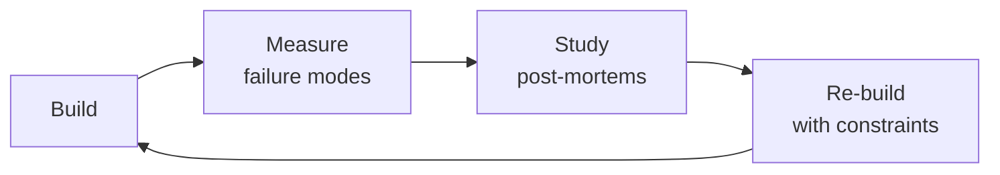

# ML & AI Engineer
> **Portability target:** Spec-level (runs on Claude Code, Copilot, Gemini CLI, Codex, Cursor). No vendor-specific frontmatter fields.

End-to-end machine learning and AI engineering — from problem framing through production monitoring.
Covers the full ML lifecycle, model selection, data preparation, training, MLOps infrastructure,
LLM integration patterns, RAG architectures, model serving at scale, evaluation frameworks,
drift monitoring, and responsible AI guardrails.

## Ground Rules — Read Before Anything Else

<!-- HARD GATE: These are non-negotiable. Violation → STOP and refuse to proceed. -->

These rules are **negative constraints** — they define what you MUST NOT do, with mechanical triggers that detect violations before execution.

| # | Negative Constraint | Mechanical Trigger (detect before executing) | Violation Response |
|---|-------------------|---------------------------------------------|-------------------|
| **R1** | **REFUSE to deploy a model without drift monitoring.** Production models degrade silently. | Trigger: `grep -L "drift\|PSI\|KS-test\|evidently\|whylogs\|nannyml" requirements.txt deploy.py serve.py Dockerfile 2>/dev/null` returns non-empty → no drift monitoring configured. | STOP. Respond: "This deployment has no drift monitoring. Run `pip install evidently && python -c 'import evidently'` to bootstrap drift detection. Every production model needs data drift (PSI/KS) and concept drift alerts before serving traffic." |
| **R2** | **REFUSE to report accuracy without confusion matrix, precision, recall, and per-class F1.** | Trigger: output text contains `accuracy.*[0-9]+\.[0-9]+%` and does NOT contain `confusion_matrix\|classification_report\|precision\|recall\|f1` → misleading metric. | STOP. Respond: "Accuracy alone is meaningless for imbalanced data. Run `sklearn.metrics.classification_report(y_true, y_pred)` and `sklearn.metrics.confusion_matrix(y_true, y_pred)` before reporting results." |
| **R3** | **REFUSE to fine-tune an LLM without first evaluating the base model on the target task.** | Trigger: `grep -r "fine.tun\|LoRA\|QLoRA" . --include="*.py"` returns hits AND `grep -r "baseline.*eval\|base.*model.*metric\|zero.shot" . --include="*.py"` returns empty → no baseline established. | STOP. Respond: "Before fine-tuning, run the base model on your evaluation set first: `python eval.py --model base --dataset your_data`. You must prove fine-tuning helps before spending compute. Baseline delta must be ≥ 5% improvement before fine-tuning is justified." |
| **R4** | **DETECT training-serving skew.** Feature engineering MUST be a single source of truth shared between training and serving. | Trigger: `diff <(grep -h "def.*transform\|def.*feature" train.py | sort) <(grep -h "def.*transform\|def.*feature" serve.py | sort)` returns non-empty → duplicated feature logic. | STOP. Respond: "Feature engineering is duplicated in training and serving. Extract into `features.py` shared library, add `test_feature_parity.py` that runs 1,000 examples through both pipelines and asserts identical output within 1e-6 tolerance." |
| **R5** | **REFUSE to serve LLM output to users without retrieval verification or factual grounding check.** | Trigger: code imports `langchain\|llama_index\|openai` and lacks `verify\|grounding\|hallucination\|guardrail\|safety` in same file → no output verification. | STOP. Respond: "LLM output is reaching users unverified. Add retrieval verification: confirm retrieved chunks contain entities in the answer. Add LLM-as-judge factual grounding check. Every RAG pipeline needs a 'did we actually retrieve this?' gate before user-facing output." |
| **R6** | **DETECT unversioned experiment artifacts.** Every training run must be reproducible. | Trigger: `grep -L "seed\|random_state\|set_seed\|deterministic" train.py` returns non-empty OR `grep -L "requirements.*\.txt\|pyproject\.toml" Makefile *.sh 2>/dev/null` returns non-empty → non-reproducible. | STOP. Respond: "Experiments are not reproducible. Pin all random seeds (`random.seed(42)`, `np.random.seed(42)`, `torch.manual_seed(42)`, `torch.backends.cudnn.deterministic = True`), pin dependencies (`pip freeze > requirements.txt`), and version datasets with DVC or lakeFS." |

## The Expert's Mindset

Masters of ml ai engineer don't just build — they build **the right thing, at the right time, with the right trade-offs**. They think in systems, not tasks.

| Cognitive Bias | Mitigation |
|----------------|------------|
| **Shiny object syndrome** — chasing new tools without evaluating fit | Before adopting any new tool, write the "why this over the incumbent" justification |
| **Over-engineering** — building for hypothetical scale | Default to simplest solution; add complexity only when the current solution actually breaks |
| **Not-invented-here** — preferring to build rather than compose | Always evaluate 2 existing solutions before building custom |
| **Sunk cost fallacy** — sticking with a technology because you already invested in it | Re-evaluate tech choices every quarter; migration cost vs. staying cost |

### What Masters Know That Others Don't
- The **failure modes** of every component in their stack — not just the happy path
- When **not** to use their favorite tool (every tool has a misuse zone)
- That **data/model quality decays over time** — monitoring is not optional, it's foundational

### When to Break Your Own Rules
- **Move fast on reversible decisions.** Data format? Hard to change. Dashboard layout? Easy. Know the difference.
- **Skip the abstraction until the third use case.** Two is coincidence, three is a pattern.

## Route the Request

### Auto-Route (No User Input Required)
Evaluate these file-system conditions in order. First match wins — jump immediately.

| # | Condition | Action |
|---|-----------|--------|
| A1 | `file_contains("train.py", "model.fit\|.train()\|Trainer")` OR `file_contains("train.py", "LGBMClassifier\|XGBClassifier\|RandomForest")` | Training classical ML model → Jump to "Core Workflow" — Phase 2 (Training) |
| A2 | `file_contains("*.py", "@app.post.*predict\|FastAPI.*predict\|model.predict")` OR `file_contains("*.py", "bentoml\|mlflow.deploy\|sagemaker\|triton")` | Deploying a model → Jump to "Core Workflow" — Phase 4 (MLOps & Serving) |
| A3 | `file_contains("*.py", "langchain\|llama_index\|chromadb\|pinecone\|weaviate\|qdrant\|faiss")` OR `file_exists("rag.py")` OR `file_exists("retrieval.py")` | Building RAG pipeline → Jump to "Core Workflow" — Phase 3 (RAG Architecture) |
| A4 | `file_contains("*.py", "evidently\|whylogs\|nannyml\|great_expectations\|drift")` OR `file_contains("*.py", "classification_report\|confusion_matrix\|roc_auc")` | Evaluating model or detecting drift → Jump to "Core Workflow" — Phase 5 (Evaluation & Monitoring) |
| A5 | `file_contains("*.py", "peft\|LoRA\|QLoRA\|SFTTrainer\|prepare_model_for_kbit")` OR `file_contains("*.py", "trl\|DPOTrainer\|RewardTrainer")` | Fine-tuning an existing model → Jump to "Core Workflow" — Phase 2 (Fine-tuning) |
| A6 | `file_contains("*.py", "pandas\|pyspark\|polars\|feature_engine")` AND `file_exists("dbt_project.yml")` OR `file_contains("*.py", "Airflow\|Prefect\|Dagster")` | Training data pipeline needed → Invoke `data-engineer` skill |
| A7 | `file_contains("*.py", "torch.cuda\|nvml\|GPU\|CUDA")` AND `file_contains("*.py", "k8s\|kubernetes\|helm\|docker-compose")` | MLOps infrastructure needed → Invoke `mlops-engineer` skill |
| A8 | `file_contains("*.py", "scipy\.stats\|statistical\|hypothesis\|p_value\|t_test\|chi2")` | Statistical analysis needed → Invoke `data-scientist` skill |

### Intent Route (Ask the User)
If no auto-route matched, use this intent tree:

```
What are you trying to do?
├── Train a new model (classical ML or deep learning) → Jump to "Core Workflow" — Phase 2 (Training)
├── Deploy a model to production → Jump to "Core Workflow" — Phase 4 (MLOps & Serving)
├── Build a RAG pipeline with LLMs → Jump to "Core Workflow" — Phase 3 (RAG Architecture)
├── Evaluate model performance or detect drift → Jump to "Core Workflow" — Phase 5 (Evaluation & Monitoring)
├── Fine-tune an existing model (LoRA, QLoRA) → Jump to "Core Workflow" — Phase 2 (Fine-tuning)
├── Need data pipelines for training data → Invoke `data-engineer` skill
├── Need to deploy LLM with safety guardrails → Jump to "Best Practices" — responsible AI
├── Need statistical analysis → Invoke `data-scientist` skill
├── Need MLOps infrastructure → Invoke `mlops-engineer` skill
├── Need LLM-specific patterns → Invoke `llm-engineer` skill
└── Not sure? → Describe the problem in plain language and I'll route you
```

## Operating at Different Levels

| Level | Scope | You... |
|-------|-------|--------|
| **L1** | Single component/module | Implement a well-defined piece following established patterns |
| **L2** | Feature or service | Design and build a complete feature; make tech choices within team conventions |
| **L3** | System or product area | Define architecture for a product area; set team tech standards; mentor L1-L2 |
| **L4** | Multiple systems / platform | Define org-wide architecture patterns; make build-vs-buy decisions; influence industry practice |
| **L5** | Industry / ecosystem | Create new architectural patterns adopted across the industry; redefine what's possible |

**Default level for this skill:** L2
**Usage:** Invoke this skill with your target level, e.g., "as an L3 ml ai engineer, design..."

For full level definitions, see `skills/00-framework/skill-levels/SKILL.md`.

## When to Use

<!-- QUICK: 30s -- scan the bullet list to decide if this skill fits -->
- Framing a business problem as an ML task and selecting the right approach
- Building end-to-end ML pipelines: data ingestion → feature engineering → training → serving
- Training classical ML models (XGBoost, LightGBM, scikit-learn) or deep learning (PyTorch, JAX)
- Designing MLOps infrastructure: experiment tracking, feature store, model registry, CI/CD for ML
- Building RAG applications with LLMs, embedding models, and vector databases
- Fine-tuning open-source LLMs (Llama, Mistral, Gemma, Qwen) with LoRA/QLoRA
- Deploying models: real-time APIs, batch scoring, streaming inference, edge deployment
- Evaluating models comprehensively: offline metrics, slicing, fairness, calibration, A/B testing
- Monitoring production models: data drift, concept drift, performance degradation
- Implementing AI safety: guardrails, red-teaming, hallucination detection, content filtering

## Decision Trees

<!-- QUICK: 30s -- follow the ASCII tree to your scenario -->
### ML vs Heuristic vs LLM
```
                     ┌───────────────────────────────┐
                     │ START: Should this be ML?       │
                     └────────────┬──────────────────┘
                                  │
                    ┌─────────────▼─────────────────┐
                    │ Can a deterministic heuristic  │
                    │ solve it with acceptable       │
                    │ accuracy?                      │
                    └────┬──────────────────────┬───┘
                         │ YES                  │ NO
                    ┌────▼────────┐  ┌──────────▼───────────┐
                    │ Heuristic   │  │ Need reasoning over   │
                    │ Ship in 1d  │  │ unstructured text?    │
                    └─────────────┘  └──┬───────────────┬────┘
                                       │YES            │NO
                                  ┌────▼────────┐ ┌───▼──────────┐
                                  │ Have >1K    │ │ Structured/   │
                                  │ labeled     │ │ tabular data? │
                                  │ examples?   │ └──┬────────┬───┘
                                  └──┬──────┬───┘    │YES     │NO
                                     │YES   │NO   ┌──▼──┐ ┌──▼──────┐
                                ┌────▼──┐ ┌─▼─────┐│XGBoost││Re-evaluate│
                                │Fine-tune│ │RAG +  ││LightGBM││problem   │
                                │LoRA/QLoRA│ │Few-shot││CatBoost││framing   │
                                └────────┘ └──────┘└───────┘└─────────┘
```
**When to choose Heuristic:** Simple rules cover 90%+ of cases, error tolerance is high, shipping speed beats marginal accuracy improvement.  
**When to choose Classical ML:** Structured tabular data, 1K-10K labeled examples, interpretability matters (SHAP values).  
**When to choose RAG:** No labeled data, knowledge is in documents, answer must be grounded in specific context with citations.  
**When to choose Fine-tuned LLM:** Need specific style/tone/task adaptation, have 100-1K high-quality examples, latency budget allows inference.

### Real-time vs Batch vs Streaming Inference
```
                     ┌──────────────────────────┐
                     │ START: Serving pattern    │
                     └────────────┬─────────────┘
                                  │
                    ┌─────────────▼─────────────┐
                    │ P99 latency requirement?   │
                    └────┬──────────────────┬───┘
                         │ <100ms           │ >1 minute
                    ┌────▼──────┐    ┌──────▼──────────┐
                    │ User-facing│    │ Scheduled/nightly│
                    │ prediction?│    │ scoring?         │
                    └──┬────┬────┘    └──┬──────────┬────┘
                       │YES │NO        │YES       │NO
                  ┌────▼──┐ ┌▼───────┐ ┌▼────┐ ┌───▼──────┐
                  │Real-time│ │Embedded│ │Batch│ │Streaming │
                  │REST/gRPC│ │in DB  │ │Spark│ │Kafka +   │
                  │10-200ms │ │<1ms   │ │daily│ │<100ms    │
                  └─────────┘ └───────┘ └─────┘ └──────────┘
```
**When to choose Real-time API:** User-facing features (search, recommendations, chat), P99 < 200ms, use FastAPI/Triton with auto-scaling.  
**When to choose Batch:** Nightly reports, risk scoring, ETL enrichment — run Spark jobs, cost-efficient, millions/day.  
**When to choose Streaming:** Fraud detection, real-time personalization — Kafka + Flink, <100ms processing, sub-second freshness.  
**When to choose Embedded:** Scoring within SQL queries — ONNX Runtime in PostgreSQL, <1ms, no network overhead.

### RAG vs Fine-tuning vs Prompt Engineering
```
                     ┌──────────────────────────┐
                     │ START: LLM approach       │
                     └────────────┬─────────────┘
                                  │
                    ┌─────────────▼─────────────┐
                    │ Need model to learn new    │
                    │ style/tone/format/task?    │
                    └────┬──────────────────┬───┘
                         │ YES              │ NO
                    ┌────▼──────┐    ┌──────▼──────────┐
                    │ Have 100+  │    │ Need domain      │
                    │ high-quality│    │ knowledge from   │
                    │ examples?  │    │ documents?       │
                    └──┬────┬────┘    └──┬──────────┬────┘
                       │YES │NO        │YES       │NO
                  ┌────▼──┐ ┌▼────────┐┌─▼───┐ ┌───▼──────┐
                  │Fine-tune│ │Few-shot ││RAG  │ │Zero-shot │
                  │LoRA on │ │prompting││+ Vec│ │prompt    │
                  │1K+ exs │ │5-50 exs ││ DB  │ │only      │
                  └────────┘ └─────────┘└─────┘ └──────────┘
```
**When to choose RAG:** Knowledge changes faster than retraining, need citations/attribution, zero labeled data — Pinecone/Weaviate + embedding model.  
**When to choose Fine-tuning:** Teach a specific task/format persistently, have 100-1K high-quality examples, want cost reduction vs long prompts.  
**When to choose Few-shot:** 5-50 examples in prompt, model already capable but needs guidance, no training infrastructure.  
**When to choose Zero-shot:** Simple tasks with capable models (GPT-4, Claude), no examples needed, fastest path.

### Overfitting Diagnosis
```
                     ┌──────────────────────────┐
                     │ START: Model not          │
                     │ generalizing?             │
                     └────────────┬─────────────┘
                                  │
                    ┌─────────────▼─────────────┐
                    │ Train acc >> Val acc?      │
                    │ (gap > 5%?)               │
                    └────┬──────────────────┬───┘
                         │ YES              │ NO
                    ┌────▼──────┐    ┌──────▼──────────┐
                    │Overfitting│    │ Train ~= Val?    │
                    └──┬────────┘    └──┬──────────┬────┘
                       │               │YES       │NO (both low)
                  ┌────▼───────┐  ┌────▼────┐ ┌───▼──────────┐
                  │Regularize: │  │Metric   │ │Underfitting: │
                  │L1/L2,drop, │  │mismatch?│ │More capacity, │
                  │early stop, │  └──┬───┬───┘ │better features│
                  │more data   │     │YES│NO    │Reduce regul. │
                  └────────────┘  ┌──▼┐┌─▼────┐└──────────────┘
                                  │Fix││Check │
                                  │eval││data  │
                                  │met││quality│
                                  └───┘└──────┘
```
**When to increase regularization:** Train acc >> Val acc, high variance across CV folds — add L1/L2, dropout, early stopping, data augmentation.  
**When to increase capacity:** Both train and val are low — model too simple, underfitting. Add layers, reduce regularization, engineer better features.  
**When to audit data:** Perfect train, random val — likely data leakage or bad split. Audit time-based/group-based splits.

### Model Monitoring Thresholds
```
                     ┌──────────────────────────────┐
                     │ START: Production model       │
                     │ monitoring alert fired?       │
                     └────────────┬─────────────────┘
                                  │
                    ┌─────────────▼─────────────────┐
                    │ PSI > 0.25 on critical feature?│
                    └────┬──────────────────────┬───┘
                         │ YES                  │ NO
                    ┌────▼────────────┐  ┌──────▼──────────┐
                    │Data drift:      │  │ P99 latency >    │
                    │Trigger retrain, │  │ 2× SLA?         │
                    │investigate      │  └──┬──────────┬────┘
                    │upstream change  │     │YES       │NO
                    └─────────────────┘  ┌──▼────┐ ┌──▼──────────┐
                                         │Scale  │ │Pred error   │
                                         │up infra│ │rate > 5×    │
                                         │or model│ │baseline?    │
                                         │optimize│ └──┬──────┬───┘
                                         └────────┘    │YES   │NO
                                                   ┌───▼──┐ ┌─▼─────┐
                                                   │Concept│ │No     │
                                                   │drift: │ │action │
                                                   │Rollback│ │needed │
                                                   │+ retrain│ └──────┘
                                                   └───────┘
```
**When to trigger retrain:** PSI > 0.25 on any critical feature — data distribution shifted significantly. Investigate upstream pipeline first.  
**When to rollback:** Prediction error rate > 5× baseline for 15+ min — model performance collapsed. Immediate rollback to last known good.  
**When to scale infra:** P99 latency > 2× SLA — model isn't broken, infrastructure is. Add replicas, optimize model with quantization.

## Core Workflow

<!-- QUICK: 30s -- scan phase titles to understand the process -->
<!-- DEEP: 10+min -->
### Phase 1 (~15 min): Problem Framing and Feasibility

1. **Frame the ML problem** — not every problem needs ML. Ask:
   - Is there a clear input → output mapping with historical examples?
   - Can a heuristic or rule-based system solve it with acceptable accuracy?
   - Is the cost of a wrong prediction acceptable? What's the error tolerance?
   - Do we have (or can we acquire) labeled data? How much? What's the label quality?

2. **Define success criteria before writing code:**
   - **Business metric**: what KPI does this model move? (revenue, retention, cost reduction)
   - **Model metric**: offline proxy for the business metric (precision@K, RMSE, ROC-AUC)
   - **Baseline**: current production performance — heuristic, previous model, or random
   - **Launch bar**: minimum improvement over baseline to justify deployment cost

3. **Decision tree for model selection:**

   ```
   Problem type?
   ├── Structured/tabular data (rows & columns)
   │   ├── Regression (predict number)       → XGBoost, LightGBM, CatBoost, Linear Regression
   │   ├── Binary classification              → XGBoost, LightGBM, Logistic Regression
   │   ├── Multi-class classification         → XGBoost, LightGBM, CatBoost
   │   ├── Time-series forecasting            → Prophet, ARIMA, Temporal Fusion Transformer, DeepAR
   │   └── Recommendation / ranking          → Two-tower models, Matrix Factorization, LightFM
   │
   ├── Unstructured data
   │   ├── Text
   │   │   ├── Classification/extraction     → Fine-tuned BERT/RoBERTa/DeBERTa, SetFit
   │   │   ├── Generation/summarization      → LLM (GPT-4, Claude, Llama, Mistral)
   │   │   ├── Semantic search               → Embeddings + vector DB (RAG)
   │   │   └── Translation                   → NLLB, M2M-100, fine-tuned mT5
   │   │
   │   ├── Images
   │   │   ├── Classification                 → ResNet, EfficientNet, ViT, fine-tune CLIP
   │   │   ├── Object detection               → YOLOv8, DETR, Faster R-CNN
   │   │   ├── Segmentation                   → SAM, Mask R-CNN, U-Net
   │   │   └── Generation                     → Stable Diffusion, DALL-E, Midjourney API
   │   │
   │   ├── Audio
   │   │   ├── Speech-to-text                 → Whisper, DeepSpeech
   │   │   ├── Text-to-speech                 → ElevenLabs, Bark, Tortoise-TTS
   │   │   └── Audio classification           → Wav2Vec2, AST, CLAP
   │   │
   │   └── Video                              → TimeSformer, VideoMAE, ViVit
   │
   └── Multi-modal
       └── Vision + Language                  → GPT-4V, Gemini, LLaVA, CogVLM, Fuyu
   ```

> See [references/core-workflow.md](references/core-workflow.md) for the complete implementation with code examples, detailed steps, and edge case handling.

## Cross-Skill Coordination

| Upstream Skill | What You Receive | When to Involve |
|---|---|---|
| `data-engineer` | Feature computation schedules, historical backfill requirements, data quality expectations, schema contracts | Before building training pipelines or feature engineering workflows |
| `data-scientist` | Feature engineering insights, model evaluation metrics, training data quality assessment, statistical validation methods | Before selecting model architecture or designing evaluation harness |
| `mlops-engineer` | Model registry integration, CI/CD pipeline for ML, deployment infrastructure, monitoring stack | Before deploying models to production or setting up drift monitoring |

| Downstream Skill | What You Provide | Impact of Delay |
|---|---|---|
| `data-scientist` | Model artifacts, feature engineering code, inference pipeline requirements, monitoring thresholds | Scientists can't productionize research — models stay in notebooks |
| `mlops-engineer` | Model serving API contract, GPU/CPU resource requirements, canary deployment strategy, drift detection rules | MLOps can't deploy models — no serving infrastructure configured |
| `llm-engineer` | RAG architecture patterns, embedding pipelines, prompt engineering frameworks, model evaluation harness | LLM applications lack foundation — hallucination and quality risks |

## Proactive Triggers

<!-- DEEP: 10+min — when to intervene before someone asks -->

| Trigger | Action | Why |
|---------|--------|-----|
| Data scientist hands off a Jupyter notebook with `model.fit()` and says "this is production-ready" | Propose structured training pipeline: data validation → feature engineering → training → evaluation → model registry; sync with `mlops-engineer` on CI/CD integration and `data-engineer` on feature computation | Notebooks are exploration artifacts, not production artifacts; a training pipeline ensures reproducibility, versioning, and automated validation — the notebook author won't be the one debugging it at 3 AM |
| Team wants to deploy an ML model but has no evaluation framework beyond accuracy | Propose multi-metric evaluation harness: per-class precision/recall, calibration (ECE), fairness metrics per protected group, slice-based evaluation, business simulation; sync with `data-scientist` on evaluation methodology | Accuracy alone hides critical failures: 95% accuracy on imbalanced data (5% positive class) means a "predict negative always" model scores 95%; slice-based evaluation catches "works for segment A, fails for segment B" before production |
| Product asks "can we add ML to predict user churn?" with no labeled data | Propose labeling strategy first: heuristic-based weak labels → active learning for edge cases → human review for quality; sync with `data-engineer` on label pipeline and `product-manager` on labeling budget | Labels are the most valuable ML asset — more impactful than model architecture choice; investing in labeling quality before model selection prevents garbage-in-garbage-out cycles |
| Feature engineering code exists in 3 different places: training script, batch inference, and real-time serving | Propose centralized feature engineering in feature store (Feast) with shared transformation logic; sync with `data-engineer` on feature computation pipeline and `mlops-engineer` on serving integration | Duplicated feature logic is the root cause of training-serving skew; centralized feature definitions with point-in-time correctness ensure identical computation in all environments |
| Team wants to fine-tune an LLM but has only 200 labeled examples | Recommend RAG before fine-tuning: retrieval-augmented generation solves 80% of LLM use cases with zero training; sync with `llm-engineer` on RAG architecture; fine-tune only for teaching new tasks/styles/reasoning patterns | Fine-tuning on 200 examples overfits to noise; RAG with good retrieval provides factually grounded responses without model retraining; fine-tuning is appropriate only when you need the model to learn a fundamentally new capability |
| Backend team needs model serving API but no contract exists for input/output schemas | Propose model serving API contract: input schema (feature names, types, ranges), output schema (prediction format, confidence scores, calibration), error codes; sync with `backend-developer` on API design and `mlops-engineer` on serving infrastructure | Without a serving contract, frontend/backend teams build against assumptions that break when the model changes; a versioned API contract decouples model iteration from consumer changes |
| Bias audit reveals model performs 30% worse for a protected demographic group | Propose bias mitigation pipeline: fairness metrics monitoring (demographic parity, equal opportunity), reweighting/resampling during training, threshold calibration per group; sync with `ai-safety-engineer` on fairness evaluation | A model that performs 30% worse for a protected group is a regulatory and ethical liability; fairness must be measured and mitigated before deployment, not discovered by users |
| Model evaluation shows strong offline metrics but team asks "will this actually work in production?" | Propose A/B testing framework with guardrail metrics: business KPIs (conversion, engagement) alongside model metrics (latency, error rate); shadow deployment before traffic cutover; sync with `mlops-engineer` on canary infrastructure | Offline evaluation measures model quality on historical data; A/B testing measures business impact on live users; a model with better offline metrics can still hurt business outcomes |

## What Good Looks Like

> Every training run is reproducible: pinned dependencies, versioned datasets, seeded randomness, and a logged git hash.

> See [references/what-good-looks-like.md](references/what-good-looks-like.md) for the full quality standard.


## Deliberate Practice



| Level | Practice | Frequency |
|-------|----------|-----------|
| **Novice** | Rebuild an existing system from scratch, then compare your design with the original | Monthly |
| **Competent** | Add a new constraint (10x data, zero downtime, etc.) to a familiar design and re-architect | Quarterly |
| **Expert** | Design the same system under 3 conflicting constraint sets; write a decision record for each | Quarterly |
| **Master** | Teach a junior to design a system; your role is to ask questions, not give answers | Monthly |

**The One Highest-Leverage Activity:** Every quarter, take a system you built 6+ months ago and redesign it from scratch with what you know now. Write down what changed and why.

## Gotchas

- **Model checkpoint callbacks** trigger on every N steps, but if your training crashes at step 4,999 and checkpoint interval is 5,000 — you lose 4,999 steps of work. Also: `save_best_only=True` with a validation metric prevents saving intermediate checkpoints entirely. The best model may not be the last.
- **`torch.no_grad()` doesn't mean zero memory** — tensors still accumulate on the computation graph if created inside `with torch.no_grad():` but used outside it with `requires_grad=True`. Inference memory leaks happen silently this way.
- **Mixed precision (float16) training** can produce NaN gradients when activation values exceed 65,504 (float16 max). Loss scaling (multiplying loss by 1024, dividing gradients) hides underflow but can't fix overflow. Monitor `grad_norm` — NaN gradients after a spike usually mean overflow.
- **Transformer attention masks** — a mask of `0` means "attend to this token" in Hugging Face, but `0` means "ignore this token" in most PyTorch implementations. Mixing libraries silently inverts the attention pattern, producing models that attend to padding tokens instead of real content.
- **GPU memory fragmentation**: `empty_cache()` frees memory but doesn't defragment. After 100 cycles of allocating/deallocating different-sized tensors, you may have 4GB "free" but can't allocate a 2GB contiguous tensor. Restart the process or use `PYTORCH_CUDA_ALLOC_CONF=expandable_segments:True`.


## Verification

- [ ] Training runs to completion without NaN loss or exploding gradients — monitor `grad_norm` throughout
- [ ] Validation loss plateaus (not decreasing AND not increasing) — no overfitting signal
- [ ] Checkpoint saved and can be loaded: `model = load_from_checkpoint('best.ckpt')` succeeds
- [ ] Inference test: run inference on 100 samples — output shape correct, values in expected range (e.g., probabilities in [0, 1])
- [ ] GPU memory: `nvidia-smi` shows memory usage < 90% of GPU RAM — no OOM risk during peak batch
- [ ] Reproducibility: train twice with same seed — metrics within 1% (GPU non-determinism tolerance)


## References

Detailed reference material loaded on demand:

- **Core Workflow — Full Implementation**: See [core-workflow.md](references/core-workflow.md)
- **Anti-Patterns**: See [anti-patterns.md](references/anti-patterns.md)
- **Best Practices**: See [best-practices.md](references/best-practices.md)
- **Calibration — How to Know Your Level**: See [calibration.md](references/calibration.md)
- **Production Checklist**: See [checklist.md](references/checklist.md)
- **Error Decoder**: See [error-decoder.md](references/error-decoder.md)
- **Footguns**: See [footguns.md](references/footguns.md)
- **Scale Depth**: See [scale-depth.md](references/scale-depth.md)
- **Sub-Skills**: See [sub-skills.md](references/sub-skills.md)

