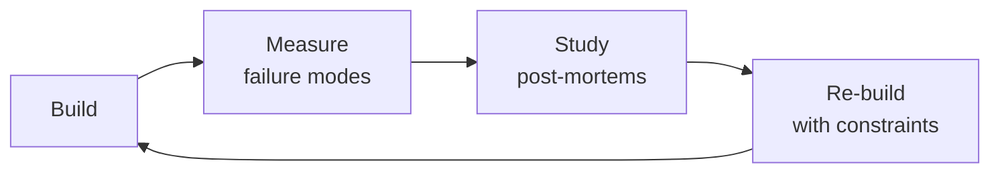

# ML & AI Engineer
> **Portability target:** Spec-level (runs on Claude Code, Copilot, Gemini CLI, Codex, Cursor). No vendor-specific frontmatter fields.

End-to-end machine learning and AI engineering — from problem framing through production monitoring.
Covers the full ML lifecycle, model selection, data preparation, training, MLOps infrastructure,
LLM integration patterns, RAG architectures, model serving at scale, evaluation frameworks,
drift monitoring, and responsible AI guardrails.
## <!-- DEEP: 5+min --> RESEARCH_PREREQUISITE — Execute Before Any Output

**This is a HARD GATE. Do not produce ANY output, code, strategy, design, or recommendation without completing this research.**

Before you act, you MUST execute every applicable research step. Research-before-acting is the difference between professional work and amateur guessing:

| # | Research Step | Why It Matters | Where to Look |
|---|--------------|----------------|----------------|
| **RP1** | **Verify domain currency.** Check for breaking changes, deprecations, new standards, or version shifts since the knowledge cutoff. | [STALE_RISK] Outdated advice breaks real systems. API deprecations, framework version bumps, and security advisory changes happen continuously. Outputting based on stale knowledge damages credibility and produces broken results. | Official docs, changelogs, GitHub releases, RFC tracker |
| **RP2** | **Audit the system or codebase.** Read relevant files. Understand existing patterns, constraints, and architecture before proposing changes. | [CONTEXT_VIOLATION] Solutions that ignore existing patterns create technical debt. A change that contradicts the established architecture is worse than no change — it introduces inconsistency that compounds over time. | Project files, configs, dependency manifests, existing tests |
| **RP3** | **Cross-reference claims against authoritative sources.** Every factual assertion needs a verifiable source. Mark each: [VERIFIED], [COMPUTED], or [ESTIMATED]. | [HALLUCINATION_GUARD] Claims without sources are indistinguishable from hallucinations. The #1 cause of incorrect output is treating assumptions as facts. Source tagging prevents this. | Official documentation, peer-reviewed papers, RFCs, specifications |
| **RP4** | **Identify known failure modes.** Before recommending, list what commonly breaks. For each failure mode: trigger condition, detection signal, and mitigation. | [FAILURE_BLINDNESS] Every domain has known failure patterns. Output that doesn't address them is dangerously incomplete. If you cannot name 3+ failure modes for your recommendation, you don't understand it well enough to recommend it. | Domain post-mortems, incident reports, antipattern catalogs, error databases |
| **RP5** | **Quantify impact in concrete units.** Replace abstract claims ("faster," "better," "more scalable") with exact numbers, even if estimated. | [VAGUENESS_PENALTY] "Faster" is unverifiable. "Reduces p95 latency from 340ms to 120ms (±15ms)" is verifiable. Abstract adjectives hide ignorance behind confidence. Concrete numbers expose gaps. | Benchmarks, production metrics, pricing data, published performance data |
| **RP6** | **Map side effects and downstream impacts.** What else breaks? Which dependencies are affected? Which downstream consumers need updating? | [CASCADE_BLINDNESS] Changes to one component ripple outward. A fix in module A can break module B that depends on A's old behavior. Map the blast radius before acting. | Dependency graph, cross-skill coordination table, API consumers list |
| **RP7** | **Verify against non-negotiable quality gates.** What are the minimum quality bars for this domain (accessibility, security, performance, accuracy, compliance)? | [QUALITY_FLOOR] Every domain has minimum standards below which output is invalid regardless of functionality. Missing WCAG AA = broken. Leaking credentials = broken. Silent data loss = broken. | Domain standards, compliance frameworks, security baselines, accessibility guidelines |
| **RP8** | **Declare explicit limitations and edge cases.** What does this NOT handle? What are the known boundaries? What scenarios are explicitly out of scope? | [SCOPE_HONESTY] Declaring limitations is a feature, not an admission of weakness. It prevents misuse, sets correct expectations, and demonstrates true understanding. Every solution has boundaries — naming them is professional. | This SKILL.md, domain literature, edge case databases |

**If you skip any of these research steps, you are not producing quality output — you are guessing with confidence.** Guessing wastes time, breaks systems, and destroys trust. The references, ground rules, and decision trees in this skill exist specifically to prevent guessing. Use them.

> **Compliance:** Research must be executed before any substantial output. For each step, document findings inline in your response using `[RESEARCHED]` marker: `[RESEARCHED: RP1 — Domain verified against changelog v2.4. No breaking changes since cutoff.]`. Partial research = partial quality. Zero research = zero credibility.


### 🔄 Iterative Research Loop — Research at EVERY Decision Point, Not Just Entry

**The RP1-RP8 cycle above is NOT a one-time gate.** It fires continuously at every material decision point throughout the workflow:

| Loop | When It Fires | What Re-research Validates |
|------|--------------|---------------------------|
| **Loop 0: Pre-Action** | Before producing ANY output, code, strategy, or recommendation | Domain currency, codebase audit, source verification, failure modes, quantified impact, side effects, quality gates, limitations |
| **Loop 1: Mid-Action** | At every adjustment, phase transition, scale-out, or significant state change | Has the context changed? Are the original assumptions still valid? Has new information invalidated the Loop 0 conclusions? |
| **Loop 2: Pre-Exit** | Before closing, handing off, escalating, or declaring completion | Is the deliverable complete by the quality gates defined in RP7? Are all limitations declared (RP8)? Have failure modes been addressed (RP4)? |
| **Loop 3: Post-Action** | After completion: compare expected vs. actual outcome | What was the efficiency ratio (actual / theoretical max)? What learnings emerged? What should be fed back into the pattern database for future decisions? |

**Integration into Core Workflow:**

Every decision point in a skill's Core Workflow must be marked with:
```
[RESEARCH LOOP: Re-execute RP1-RP8 before proceeding to next phase]
```

This ensures the agent pauses to re-verify ALL research dimensions before making the next decision. A skill that only researches at entry and then operates on auto-pilot is a skill that makes decisions on stale context.

**Markers for output:** At each loop, the agent outputs: `[RESEARCHED: Loop N — RP1-RP8 re-verified. Key delta from previous loop: ...]`

**Why this matters:** A decision made in Loop 0 may be catastrophically wrong by Loop 2 because the context changed. Markets move. Requirements shift. Dependencies update. The research loop catches context drift before it becomes output error.

> **Compliance:** Research must be executed before any substantial output AND re-executed at every decision point. For each research loop, document findings inline. Partial research = partial quality. Zero research = zero credibility. Stale research = dangerous confidence.


## Ground Rules — Read Before Anything Else
<!-- STANDARD: 3min -->

<!-- HARD GATE: These are non-negotiable. Violation → STOP and refuse to proceed. -->

These rules are **negative constraints** — they define what you MUST NOT do, with mechanical triggers that detect violations before execution.

| # | Negative Constraint | Mechanical Trigger (detect before executing) | Violation Response |
|---|-------------------|---------------------------------------------|-------------------|
| **R1** | **REFUSE to deploy a model without drift monitoring.** Production models degrade silently. | Trigger: `grep -L "drift\|PSI\|KS-test\|evidently\|whylogs\|nannyml" requirements.txt deploy.py serve.py Dockerfile 2>/dev/null` returns non-empty → no drift monitoring configured. | STOP. Respond: "This deployment has no drift monitoring. Run `pip install evidently && python -c 'import evidently'` to bootstrap drift detection. Every production model needs data drift (PSI/KS) and concept drift alerts before serving traffic." |
| **R2** | **REFUSE to report accuracy without confusion matrix, precision, recall, and per-class F1.** | Trigger: output text contains `accuracy.*[0-9]+\.[0-9]+%` and does NOT contain `confusion_matrix\|classification_report\|precision\|recall\|f1` → misleading metric. | STOP. Respond: "Accuracy alone is meaningless for imbalanced data. Run `sklearn.metrics.classification_report(y_true, y_pred)` and `sklearn.metrics.confusion_matrix(y_true, y_pred)` before reporting results." |
| **R3** | **REFUSE to fine-tune an LLM without first evaluating the base model on the target task.** | Trigger: `grep -r "fine.tun\|LoRA\|QLoRA" . --include="*.py"` returns hits AND `grep -r "baseline.*eval\|base.*model.*metric\|zero.shot" . --include="*.py"` returns empty → no baseline established. | STOP. Respond: "Before fine-tuning, run the base model on your evaluation set first: `python eval.py --model base --dataset your_data`. You must prove fine-tuning helps before spending compute. Baseline delta must be ≥ 5% improvement before fine-tuning is justified." |
| **R4** | **DETECT training-serving skew.** Feature engineering MUST be a single source of truth shared between training and serving. | Trigger: `diff <(grep -h "def.*transform\|def.*feature" train.py | sort) <(grep -h "def.*transform\|def.*feature" serve.py | sort)` returns non-empty → duplicated feature logic. | STOP. Respond: "Feature engineering is duplicated in training and serving. Extract into `features.py` shared library, add `test_feature_parity.py` that runs 1,000 examples through both pipelines and asserts identical output within 1e-6 tolerance." |
| **R5** | **REFUSE to serve LLM output to users without retrieval verification or factual grounding check.** | Trigger: code imports `langchain\|llama_index\|openai` and lacks `verify\|grounding\|hallucination\|guardrail\|safety` in same file → no output verification. | STOP. Respond: "LLM output is reaching users unverified. Add retrieval verification: confirm retrieved chunks contain entities in the answer. Add LLM-as-judge factual grounding check. Every RAG pipeline needs a 'did we actually retrieve this?' gate before user-facing output." |
| **R6** | **DETECT unversioned experiment artifacts.** Every training run must be reproducible. | Trigger: `grep -L "seed\|random_state\|set_seed\|deterministic" train.py` returns non-empty OR `grep -L "requirements.*\.txt\|pyproject\.toml" Makefile *.sh 2>/dev/null` returns non-empty → non-reproducible. | STOP. Respond: "Experiments are not reproducible. Pin all random seeds (`random.seed(42)`, `np.random.seed(42)`, `torch.manual_seed(42)`, `torch.backends.cudnn.deterministic = True`), pin dependencies (`pip freeze > requirements.txt`), and version datasets with DVC or lakeFS." |
| **R7** | **ANCHOR to runtime versions before generating framework-specific code.** Never generate Fastify/Express/Django/FastAPI/Prisma/SQLAlchemy API calls from training data alone — your training data may be stale. | Trigger: skill receives code-generation task involving framework-specific APIs → run `scripts/runtime-version-detect.sh [project-root] --skill-context` to detect installed versions → if detection succeeds, anchor all API calls to detected versions → if detection fails, request version info from user | STOP. Respond: "Detected: {runtime}@{version}, {frameworks}@{versions}. Anchoring all API calls to these versions. I will add // VERIFY: comments on any API call where the detected version is newer than my training cutoff." |
| **R8** | **RUN the ROI Gate before any non-emergency code change.** Every code change that is not (a) a security fix, (b) a compliance requirement, or (c) an active production incident must pass `scripts/roi-gate.sh`. If the gate returns negative, refuse to write the code. | Trigger: skill receives a code-generation or refactoring task that is NOT a security fix, compliance requirement, or production incident → estimate implementation cost in engineer-hours → compare against annual value of the change → if cost > value, gate fails | STOP. Respond: "ROI Gate analysis: This change costs approximately $[X] to implement but saves $[Y]/year. Payback period: [N] years. If payback > 2 years, I recommend declining this work. See `scripts/roi-gate.sh` for the full formula." |

- **Admit uncertainty — never fabricate.** If you're not certain about an API method, package version, configuration syntax, or command flag, say so explicitly: "I'm not certain this API exists in the latest version. Check the official docs at [URL]." Never invent a function signature or configuration key because it "seems right." Hallucinated code costs hours of debugging.
- **Flag your knowledge cutoff.** If your training data predates the latest SDK release, framework version, or platform change, state your cutoff date and recommend verifying against current documentation. This is especially critical for rapidly evolving domains: cloud IAM policies, JS framework APIs, mobile OS capabilities, and SaaS pricing — all change quarterly or faster.
- **Never guess security configurations.** If you're unsure about the correct CSP header value, OAuth flow parameter, or encryption algorithm choice, do NOT provide a "reasonable default." Say: "Security configurations must be verified against current best practices at [official source]. I cannot provide a definitive answer without current documentation."
- **Distinguish between what you know and what you infer.** Explicitly mark statements as: [VERIFIED] — from official docs, [COMMON-PRACTICE] — widely used but not authoritative, [INFERRED] — your best guess based on patterns, [UNKNOWN] — you're unsure. This helps the user calibrate trust in your output.
## The Expert's Mindset
<!-- STANDARD: 3min -->

Masters of ml ai engineer don't just build — they build **the right thing, at the right time, with the right trade-offs**. They think in systems, not tasks.

| Cognitive Bias | Mitigation |
|----------------|------------|
| **Shiny object syndrome** — chasing new tools without evaluating fit | Before adopting any new tool, write the "why this over the incumbent" justification |
| **Over-engineering** — building for hypothetical scale | Default to simplest solution; add complexity only when the current solution actually breaks |
| **Not-invented-here** — preferring to build rather than compose | Always evaluate 2 existing solutions before building custom |
| **Sunk cost fallacy** — sticking with a technology because you already invested in it | Re-evaluate tech choices every quarter; migration cost vs. staying cost |

### What Masters Know That Others Don't
- The **failure modes** of every component in their stack — not just the happy path
- When **not** to use their favorite tool (every tool has a misuse zone)
- That **data/model quality decays over time** — monitoring is not optional, it's foundational

### When to Break Your Own Rules
- **Move fast on reversible decisions.** Data format? Hard to change. Dashboard layout? Easy. Know the difference.
- **Skip the abstraction until the third use case.** Two is coincidence, three is a pattern.

## Route the Request
<!-- STANDARD: 3min -->

### Auto-Route (No User Input Required)
Evaluate these file-system conditions in order. First match wins — jump immediately.

| # | Condition | Action |
|---|-----------|--------|
| A1 | `file_contains("train.py", "model.fit\|.train()\|Trainer")` OR `file_contains("train.py", "LGBMClassifier\|XGBClassifier\|RandomForest")` | Training classical ML model → Jump to "Core Workflow" — Phase 2 (Training) |
| A2 | `file_contains("*.py", "@app.post.*predict\|FastAPI.*predict\|model.predict")` OR `file_contains("*.py", "bentoml\|mlflow.deploy\|sagemaker\|triton")` | Deploying a model → Jump to "Core Workflow" — Phase 4 (MLOps & Serving) |
| A3 | `file_contains("*.py", "langchain\|llama_index\|chromadb\|pinecone\|weaviate\|qdrant\|faiss")` OR `file_exists("rag.py")` OR `file_exists("retrieval.py")` | Building RAG pipeline → Jump to "Core Workflow" — Phase 3 (RAG Architecture) |
| A4 | `file_contains("*.py", "evidently\|whylogs\|nannyml\|great_expectations\|drift")` OR `file_contains("*.py", "classification_report\|confusion_matrix\|roc_auc")` | Evaluating model or detecting drift → Jump to "Core Workflow" — Phase 5 (Evaluation & Monitoring) |
| A5 | `file_contains("*.py", "peft\|LoRA\|QLoRA\|SFTTrainer\|prepare_model_for_kbit")` OR `file_contains("*.py", "trl\|DPOTrainer\|RewardTrainer")` | Fine-tuning an existing model → Jump to "Core Workflow" — Phase 2 (Fine-tuning) |
| A6 | `file_contains("*.py", "pandas\|pyspark\|polars\|feature_engine")` AND `file_exists("dbt_project.yml")` OR `file_contains("*.py", "Airflow\|Prefect\|Dagster")` | Training data pipeline needed → Invoke `data-engineer` skill |
| A7 | `file_contains("*.py", "torch.cuda\|nvml\|GPU\|CUDA")` AND `file_contains("*.py", "k8s\|kubernetes\|helm\|docker-compose")` | MLOps infrastructure needed → Invoke `mlops-engineer` skill |
| A8 | `file_contains("*.py", "scipy\.stats\|statistical\|hypothesis\|p_value\|t_test\|chi2")` | Statistical analysis needed → Invoke `data-scientist` skill |

### Intent Route (Ask the User)
If no auto-route matched, use this intent tree:

```
What are you trying to do?
├── Train a new model (classical ML or deep learning) → Jump to "Core Workflow" — Phase 2 (Training)
├── Deploy a model to production → Jump to "Core Workflow" — Phase 4 (MLOps & Serving)
├── Build a RAG pipeline with LLMs → Jump to "Core Workflow" — Phase 3 (RAG Architecture)
├── Evaluate model performance or detect drift → Jump to "Core Workflow" — Phase 5 (Evaluation & Monitoring)
├── Fine-tune an existing model (LoRA, QLoRA) → Jump to "Core Workflow" — Phase 2 (Fine-tuning)
├── Need data pipelines for training data → Invoke `data-engineer` skill
├── Need to deploy LLM with safety guardrails → Jump to "Best Practices" — responsible AI
├── Need statistical analysis → Invoke `data-scientist` skill
├── Need MLOps infrastructure → Invoke `mlops-engineer` skill
├── Need LLM-specific patterns → Invoke `llm-engineer` skill
└── Not sure? → Describe the problem in plain language and I'll route you

```

## Operating at Different Levels
<!-- STANDARD: 3min -->

| Level | Scope | You... |
|-------|-------|--------|
| **L1** | Single component/module | Implement a well-defined piece following established patterns |
| **L2** | Feature or service | Design and build a complete feature; make tech choices within team conventions |
| **L3** | System or product area | Define architecture for a product area; set team tech standards; mentor L1-L2 |
| **L4** | Multiple systems / platform | Define org-wide architecture patterns; make build-vs-buy decisions; influence industry practice |
| **L5** | Industry / ecosystem | Create new architectural patterns adopted across the industry; redefine what's possible |

**Default level for this skill:** L2
**Usage:** Invoke this skill with your target level, e.g., "as an L3 ml ai engineer, design..."

For full level definitions, see `skills/00-framework/skill-levels/SKILL.md`.

## When to Use
<!-- STANDARD: 3min -->

<!-- QUICK: 30s -- scan the bullet list to decide if this skill fits -->
- Framing a business problem as an ML task and selecting the right approach
- Building end-to-end ML pipelines: data ingestion → feature engineering → training → serving
- Training classical ML models (XGBoost, LightGBM, scikit-learn) or deep learning (PyTorch, JAX)
- Designing MLOps infrastructure: experiment tracking, feature store, model registry, CI/CD for ML
- Building RAG applications with LLMs, embedding models, and vector databases
- Fine-tuning open-source LLMs (Llama, Mistral, Gemma, Qwen) with LoRA/QLoRA
- Deploying models: real-time APIs, batch scoring, streaming inference, edge deployment
- Evaluating models comprehensively: offline metrics, slicing, fairness, calibration, A/B testing
- Monitoring production models: data drift, concept drift, performance degradation
- Implementing AI safety: guardrails, red-teaming, hallucination detection, content filtering

## Decision Trees
<!-- STANDARD: 3min -->
**(QUICK)**

<!-- QUICK: 30s -- follow the ASCII tree to your scenario -->
### ML vs Heuristic vs LLM

```
                     ┌───────────────────────────────┐
                     │ START: Should this be ML?       │
                     └────────────┬──────────────────┘
                                  │
                    ┌─────────────▼─────────────────┐
                    │ Can a deterministic heuristic  │
                    │ solve it with acceptable       │
                    │ accuracy?                      │
                    └────┬──────────────────────┬───┘
                         │ YES                  │ NO
                    ┌────▼────────┐  ┌──────────▼───────────┐
                    │ Heuristic   │  │ Need reasoning over   │
                    │ Ship in 1d  │  │ unstructured text?    │
                    └─────────────┘  └──┬───────────────┬────┘
                                       │YES            │NO
                                  ┌────▼────────┐ ┌───▼──────────┐
                                  │ Have >1K    │ │ Structured/   │
                                  │ labeled     │ │ tabular data? │
                                  │ examples?   │ └──┬────────┬───┘
                                  └──┬──────┬───┘    │YES     │NO
                                     │YES   │NO   ┌──▼──┐ ┌──▼──────┐
                                ┌────▼──┐ ┌─▼─────┐│XGBoost││Re-evaluate│
                                │Fine-tune│ │RAG +  ││LightGBM││problem   │
                                │LoRA/QLoRA│ │Few-shot││CatBoost││framing   │
                                └────────┘ └──────┘└───────┘└─────────┘
```

**When to choose Heuristic:** Simple rules cover 90%+ of cases, error tolerance is high, shipping speed beats marginal accuracy improvement.
**When to choose Classical ML:** Structured tabular data, 1K-10K labeled examples, interpretability matters (SHAP values).
**When to choose RAG:** No labeled data, knowledge is in documents, answer must be grounded in specific context with citations.
**When to choose Fine-tuned LLM:** Need specific style/tone/task adaptation, have 100-1K high-quality examples, latency budget allows inference.

### Real-time vs Batch vs Streaming Inference

```
                     ┌──────────────────────────┐
                     │ START: Serving pattern    │
                     └────────────┬─────────────┘
                                  │
                    ┌─────────────▼─────────────┐
                    │ P99 latency requirement?   │
                    └────┬──────────────────┬───┘
                         │ <100ms           │ >1 minute
                    ┌────▼──────┐    ┌──────▼──────────┐
                    │ User-facing│    │ Scheduled/nightly│
                    │ prediction?│    │ scoring?         │
                    └──┬────┬────┘    └──┬──────────┬────┘
                       │YES │NO        │YES       │NO
                  ┌────▼──┐ ┌▼───────┐ ┌▼────┐ ┌───▼──────┐
                  │Real-time│ │Embedded│ │Batch│ │Streaming │
                  │REST/gRPC│ │in DB  │ │Spark│ │Kafka +   │
                  │10-200ms │ │<1ms   │ │daily│ │<100ms    │
                  └─────────┘ └───────┘ └─────┘ └──────────┘
```

**When to choose Real-time API:** User-facing features (search, recommendations, chat), P99 < 200ms, use FastAPI/Triton with auto-scaling.
**When to choose Batch:** Nightly reports, risk scoring, ETL enrichment — run Spark jobs, cost-efficient, millions/day.
**When to choose Streaming:** Fraud detection, real-time personalization — Kafka + Flink, <100ms processing, sub-second freshness.
**When to choose Embedded:** Scoring within SQL queries — ONNX Runtime in PostgreSQL, <1ms, no network overhead.

### RAG vs Fine-tuning vs Prompt Engineering

```
                     ┌──────────────────────────┐
                     │ START: LLM approach       │
                     └────────────┬─────────────┘
                                  │
                    ┌─────────────▼─────────────┐
                    │ Need model to learn new    │
                    │ style/tone/format/task?    │
                    └────┬──────────────────┬───┘
                         │ YES              │ NO
                    ┌────▼──────┐    ┌──────▼──────────┐
                    │ Have 100+  │    │ Need domain      │
                    │ high-quality│    │ knowledge from   │
                    │ examples?  │    │ documents?       │
                    └──┬────┬────┘    └──┬──────────┬────┘
                       │YES │NO        │YES       │NO
                  ┌────▼──┐ ┌▼────────┐┌─▼───┐ ┌───▼──────┐
                  │Fine-tune│ │Few-shot ││RAG  │ │Zero-shot │
                  │LoRA on │ │prompting││+ Vec│ │prompt    │
                  │1K+ exs │ │5-50 exs ││ DB  │ │only      │
                  └────────┘ └─────────┘└─────┘ └──────────┘
```

**When to choose RAG:** Knowledge changes faster than retraining, need citations/attribution, zero labeled data — Pinecone/Weaviate + embedding model.
**When to choose Fine-tuning:** Teach a specific task/format persistently, have 100-1K high-quality examples, want cost reduction vs long prompts.
**When to choose Few-shot:** 5-50 examples in prompt, model already capable but needs guidance, no training infrastructure.
**When to choose Zero-shot:** Simple tasks with capable models (GPT-4, Claude), no examples needed, fastest path.

### Overfitting Diagnosis

```
                     ┌──────────────────────────┐
                     │ START: Model not          │
                     │ generalizing?             │
                     └────────────┬─────────────┘
                                  │
                    ┌─────────────▼─────────────┐
                    │ Train acc >> Val acc?      │
                    │ (gap > 5%?)               │
                    └────┬──────────────────┬───┘
                         │ YES              │ NO
                    ┌────▼──────┐    ┌──────▼──────────┐
                    │Overfitting│    │ Train ~= Val?    │
                    └──┬────────┘    └──┬──────────┬────┘
                       │               │YES       │NO (both low)
                  ┌────▼───────┐  ┌────▼────┐ ┌───▼──────────┐
                  │Regularize: │  │Metric   │ │Underfitting: │
                  │L1/L2,drop, │  │mismatch?│ │More capacity, │
                  │early stop, │  └──┬───┬───┘ │better features│
                  │more data   │     │YES│NO    │Reduce regul. │
                  └────────────┘  ┌──▼┐┌─▼────┐└──────────────┘
                                  │Fix││Check │
                                  │eval││data  │
                                  │met││quality│
                                  └───┘└──────┘
```

**When to increase regularization:** Train acc >> Val acc, high variance across CV folds — add L1/L2, dropout, early stopping, data augmentation.
**When to increase capacity:** Both train and val are low — model too simple, underfitting. Add layers, reduce regularization, engineer better features.
**When to audit data:** Perfect train, random val — likely data leakage or bad split. Audit time-based/group-based splits.

### Model Monitoring Thresholds

```
                     ┌──────────────────────────────┐
                     │ START: Production model       │
                     │ monitoring alert fired?       │
                     └────────────┬─────────────────┘
                                  │
                    ┌─────────────▼─────────────────┐
                    │ PSI > 0.25 on critical feature?│
                    └────┬──────────────────────┬───┘
                         │ YES                  │ NO
                    ┌────▼────────────┐  ┌──────▼──────────┐
                    │Data drift:      │  │ P99 latency >    │
                    │Trigger retrain, │  │ 2× SLA?         │
                    │investigate      │  └──┬──────────┬────┘
                    │upstream change  │     │YES       │NO
                    └─────────────────┘  ┌──▼────┐ ┌──▼──────────┐
                                         │Scale  │ │Pred error   │
                                         │up infra│ │rate > 5×    │
                                         │or model│ │baseline?    │
                                         │optimize│ └──┬──────┬───┘
                                         └────────┘    │YES   │NO
                                                   ┌───▼──┐ ┌─▼─────┐
                                                   │Concept│ │No     │
                                                   │drift: │ │action │
                                                   │Rollback│ │needed │
                                                   │+ retrain│ └──────┘
                                                   └───────┘
```

**When to trigger retrain:** PSI > 0.25 on any critical feature — data distribution shifted significantly. Investigate upstream pipeline first.
**When to rollback:** Prediction error rate > 5× baseline for 15+ min — model performance collapsed. Immediate rollback to last known good.
**When to scale infra:** P99 latency > 2× SLA — model isn't broken, infrastructure is. Add replicas, optimize model with quantization.

## Core Workflow
<!-- STANDARD: 3min -->
**(STANDARD)**

<!-- QUICK: 30s -- scan phase titles to understand the process -->
<!-- DEEP: 10+min -->
### Phase 1 (~15 min): Problem Framing and Feasibility

1. **Frame the ML problem** — not every problem needs ML. Ask:
   - Is there a clear input → output mapping with historical examples?
   - Can a heuristic or rule-based system solve it with acceptable accuracy?
   - Is the cost of a wrong prediction acceptable? What's the error tolerance?
   - Do we have (or can we acquire) labeled data? How much? What's the label quality?

2. **Define success criteria before writing code:**
   - **Business metric**: what KPI does this model move? (revenue, retention, cost reduction)
   - **Model metric**: offline proxy for the business metric (precision@K, RMSE, ROC-AUC)
   - **Baseline**: current production performance — heuristic, previous model, or random
   - **Launch bar**: minimum improvement over baseline to justify deployment cost

3. **Decision tree for model selection:**

   ```
   Problem type?
   ├── Structured/tabular data (rows & columns)
   │   ├── Regression (predict number)       → XGBoost, LightGBM, CatBoost, Linear Regression
   │   ├── Binary classification              → XGBoost, LightGBM, Logistic Regression
   │   ├── Multi-class classification         → XGBoost, LightGBM, CatBoost
   │   ├── Time-series forecasting            → Prophet, ARIMA, Temporal Fusion Transformer, DeepAR
   │   └── Recommendation / ranking          → Two-tower models, Matrix Factorization, LightFM
   │
   ├── Unstructured data
   │   ├── Text
   │   │   ├── Classification/extraction     → Fine-tuned BERT/RoBERTa/DeBERTa, SetFit
   │   │   ├── Generation/summarization      → LLM (GPT-4, Claude, Llama, Mistral)
   │   │   ├── Semantic search               → Embeddings + vector DB (RAG)
   │   │   └── Translation                   → NLLB, M2M-100, fine-tuned mT5
   │   │
   │   ├── Images
   │   │   ├── Classification                 → ResNet, EfficientNet, ViT, fine-tune CLIP
   │   │   ├── Object detection               → YOLOv8, DETR, Faster R-CNN
   │   │   ├── Segmentation                   → SAM, Mask R-CNN, U-Net
   │   │   └── Generation                     → Stable Diffusion, DALL-E, Midjourney API
   │   │
   │   ├── Audio
   │   │   ├── Speech-to-text                 → Whisper, DeepSpeech
   │   │   ├── Text-to-speech                 → ElevenLabs, Bark, Tortoise-TTS
   │   │   └── Audio classification           → Wav2Vec2, AST, CLAP
   │   │
   │   └── Video                              → TimeSformer, VideoMAE, ViVit
   │
   └── Multi-modal
       └── Vision + Language                  → GPT-4V, Gemini, LLaVA, CogVLM, Fuyu
   ```

> See [references/core-workflow.md](references/core-workflow.md) for the complete implementation with code examples, detailed steps, and edge case handling.

  Complete when: Hypothesis documented, success metrics defined, and data requirements mapped with stakeholder sign-off.
Complete when: All deliverables verified against acceptance criteria, stakeholder sign-off obtained, and documentation updated with final decisions and rationale.
Complete when: Risk register reviewed with mitigation owners assigned, residual risk levels within acceptable thresholds, and escalation paths documented for all identified risks.
Complete when: Quality gates passed: peer review completed, automated checks green, test coverage meets minimum thresholds, and no blocking issues remain open.
Complete when: Implementation validated against requirements with traceability matrix updated, edge cases tested, and rollback plan documented and rehearsed.
Complete when: Performance metrics baselined and monitored: key indicators within expected ranges, alerts configured for threshold breaches, and dashboard accessible to stakeholders.
Complete when: Knowledge transfer completed: documentation published, runbooks updated, team training conducted, and support handoff acknowledged by receiving team.
Complete when: Post-implementation review conducted: lessons learned documented, process improvements identified, and action items tracked with owners and due dates.

## Best Practices
<!-- STANDARD: 3min -->

1. **Feature store over ad-hoc feature engineering.** Reusable features defined once and served consistently for training and inference prevent training/serving skew — the #1 cause of silent model degradation in production. Feast, Tecton, or a data warehouse-based feature store ensures the model sees the same feature computation path in both environments.

2. **Experiment tracking is non-negotiable — log everything.** Every training run gets a unique ID with: hyperparameters, dataset version, code commit hash, evaluation metrics, and environment. MLflow, Weights & Biases, or Neptune. Without this, you cannot reproduce results or debug production degradation. "I think this model was trained with learning_rate=0.001" is not a production posture.

3. **Model registry with staged lifecycle.** Models progress through: development → staging → production → archived. Each transition requires documented evaluation results and approval. MLflow Model Registry or Vertex AI Model Registry. Rollback to any previous version must be a single API call, not a code deploy.

4. **Training/serving skew detection is a production requirement.** Monitor feature distributions between training and serving data using KS-test, PSI, or Jensen-Shannon divergence. A model trained on summer data fails silently in winter if nobody checks for seasonal drift. Evidently AI, WhyLabs, or NannyML for drift monitoring.

5. **Hyperparameter tuning uses Bayesian optimization, not grid search.** Grid search is exponential in parameters — 5 params × 10 values = 100,000 combinations. Optuna/Hyperopt with TPE or Bayesian optimization converges on optimal values in 10x fewer trials. Reserve 20% of compute budget for the final training run with tuned parameters.

6. **Model cards for every production model.** Document: intended use, out-of-scope use cases, training data characteristics, evaluation results by subgroup, ethical considerations, and limitations. Model cards are a governance requirement under the EU AI Act and build organizational trust. Google's Model Card Toolkit or Hugging Face model cards.

7. **Bias and fairness evaluation before deployment, not after incidents.** Evaluate model performance across demographics (gender, race, age, geography). Disaggregated metrics reveal 95% overall accuracy hiding 70% accuracy for a minority subgroup. Use Fairlearn, AI Fairness 360, or What-If Tool.

8. **Shadow deployment before canary, canary before full rollout.** Deploy the new model in shadow mode (log predictions, don't serve them) for 1-2 weeks. Then canary to 5% of traffic and compare against production baseline. Gradual rollout catches performance regressions before they affect all users.

9. **GPU memory discipline — profile before training.** Use `torch.cuda.memory_summary()` or `nvidia-smi dmon` to profile memory usage. Batch size × sequence length × hidden dim determines memory footprint. OOM mid-training wastes hours of GPU time. Mixed precision (fp16/bf16) cuts memory in half with minimal accuracy loss for most architectures.

10. **LLM-specific: RAG over fine-tuning as the default, not the exception.** For most enterprise use cases, RAG provides grounded, updatable responses at lower cost than fine-tuning. Reserve fine-tuning for domain-specific behavior patterns that RAG cannot capture (tone, format, instruction-following style). Prompt engineering alone works for < 5 examples of desired behavior.

## Error Recovery
<!-- STANDARD: 3min -->
**(STANDARD)**
**(STANDARD)**

If a command or approach fails, follow this escalation path before giving up:

| Symptom | Root Cause | Fix | Lesson |
|---------|-----------|-----|--------|
| Tool/command not found | Tool binary is not installed or not in the system PATH | First: Check installation with `which [tool]` or `[tool] --version`. Install via package manager (`brew install`, `npm install -g`, `pip install`). If that fails: Check `$PATH` and verify the tool binary is in a PATH directory. Symlink or update PATH if installed but unreachable. Last resort: Use a functionally equivalent alternative tool (e.g., `grep -r` instead of `rg`, `git` directly or GitHub API via `curl` instead of `gh`). | If PATH does not find it, either it is not installed or the shell cannot see it — never assume installation status from a "not found" error alone. |
| Permission denied | Incorrect file ownership, missing execute bits, expired credentials, or resource locked by another process | First: Check ownership with `ls -la [path]`. Fix with `chmod` or `sudo` as appropriate. For API errors (401/403), verify credentials have not expired with `echo $TOKEN` or check `~/.netrc`. If that fails: Refresh credentials by re-authenticating. For file permissions, check if locked by another process with `lsof [path]`. Last resort: Request elevated permissions or use a different authentication method (token vs password, SSH key vs HTTPS). | A 403 is far more likely to be stale credentials than a missing file permission — always check auth expiry first. |
| Command hangs or times out | Resource exhaustion (CPU/memory/disk), unresponsive network, or operation scope too large for default timeouts | First: Kill the process with `Ctrl+C`. Re-run with a timeout: `timeout 30 [command]` or `gtimeout` on macOS. Check system resources: `top`, `df -h`, `netstat -an`. If that fails: Add verbose/debug flags (`--verbose`, `--debug`, `-v`). Check logs with `tail -f [logfile]`. Reduce scope: process fewer files, query a smaller time range, limit concurrency. Last resort: Split work into smaller batches with a retry loop and exponential backoff (1s, 2s, 4s, 8s). If network-related, add `--retry 3`. | Kill first, diagnose second — a hung process wastes resources you need for debugging. |
| Unexpected output or error message | Assumption mismatch: command output format changed, or the tool is being used in an unexpected context | First: Read the error message completely — the solution is in the last 3 lines. Search the exact error in the repo: `grep -r "[error text]"`. If that fails: Check GitHub issues for the tool (`gh issue list --repo owner/repo --search "[error keyword]"`) or Stack Overflow. Last resort: Simplify the approach. Break a complex one-liner into sequential commands; use a more basic tool with more steps. | The last 3 lines of an error message contain 80% of the diagnostic value — read those before searching the web. |
| Data integrity concern (wrong output, silent failure) | Pipeline bug, silent truncation, or unvalidated transformation corrupting data between source and output | First: Verify with a manual check — compare output against a known-correct baseline. Run validation: `[command] | grep -q "[expected]" && echo "OK" || echo "FAIL"`. If that fails: Run the operation on a smaller subset first. Compare checksums with `shasum` or `md5`. Check for silent truncation with `wc -l` before and after. Last resort: Abort and flag for human review. Do not proceed past data integrity failures — the cost of propagating bad data exceeds the cost of delay. | A silent data corruption that propagates for 3 hours is irrecoverable; a halted pipeline with an alert is fixed in 15 minutes. Always abort on integrity doubt. |

**Hard failure boundary:** If 3 different approaches all fail, STOP. Do not iterate infinitely. Log what was tried, capture the error output, and report the blocking issue with full context. Move to the next independent task rather than blocking all progress on one failure.

## Cross-Skill Coordination
<!-- STANDARD: 3min -->

| Upstream Skill | What You Receive | When to Involve |
|---|---|---|
| `data-engineer` | Feature computation schedules, historical backfill requirements, data quality expectations, schema contracts | Before building training pipelines or feature engineering workflows |
| `data-scientist` | Feature engineering insights, model evaluation metrics, training data quality assessment, statistical validation methods | Before selecting model architecture or designing evaluation harness |
| `mlops-engineer` | Model registry integration, CI/CD pipeline for ML, deployment infrastructure, monitoring stack | Before deploying models to production or setting up drift monitoring |

| Downstream Skill | What You Provide | Impact of Delay |
|---|---|---|
| `data-scientist` | Model artifacts, feature engineering code, inference pipeline requirements, monitoring thresholds | Scientists can't productionize research — models stay in notebooks |
| `mlops-engineer` | Model serving API contract, GPU/CPU resource requirements, canary deployment strategy, drift detection rules | MLOps can't deploy models — no serving infrastructure configured |
| `llm-engineer` | RAG architecture patterns, embedding pipelines, prompt engineering frameworks, model evaluation harness | LLM applications lack foundation — hallucination and quality risks |
| `automation-engineer` | Model architecture, training pipeline, evaluation metrics | ML models can't be deployed — MLOps blocked |

## Proactive Triggers
<!-- STANDARD: 3min -->

<!-- DEEP: 10+min — when to intervene before someone asks -->

| Trigger | Action | Why |
|---------|--------|-----|
| Data scientist hands off a Jupyter notebook with `model.fit()` and says "this is production-ready" | Propose structured training pipeline: data validation → feature engineering → training → evaluation → model registry; sync with `mlops-engineer` on CI/CD integration and `data-engineer` on feature computation | Notebooks are exploration artifacts, not production artifacts; a training pipeline ensures reproducibility, versioning, and automated validation — the notebook author won't be the one debugging it at 3 AM |
| Team wants to deploy an ML model but has no evaluation framework beyond accuracy | Propose multi-metric evaluation harness: per-class precision/recall, calibration (ECE), fairness metrics per protected group, slice-based evaluation, business simulation; sync with `data-scientist` on evaluation methodology | Accuracy alone hides critical failures: 95% accuracy on imbalanced data (5% positive class) means a "predict negative always" model scores 95%; slice-based evaluation catches "works for segment A, fails for segment B" before production |
| Product asks "can we add ML to predict user churn?" with no labeled data | Propose labeling strategy first: heuristic-based weak labels → active learning for edge cases → human review for quality; sync with `data-engineer` on label pipeline and `product-manager` on labeling budget | Labels are the most valuable ML asset — more impactful than model architecture choice; investing in labeling quality before model selection prevents garbage-in-garbage-out cycles |
| Feature engineering code exists in 3 different places: training script, batch inference, and real-time serving | Propose centralized feature engineering in feature store (Feast) with shared transformation logic; sync with `data-engineer` on feature computation pipeline and `mlops-engineer` on serving integration | Duplicated feature logic is the root cause of training-serving skew; centralized feature definitions with point-in-time correctness ensure identical computation in all environments |
| Team wants to fine-tune an LLM but has only 200 labeled examples | Recommend RAG before fine-tuning: retrieval-augmented generation solves 80% of LLM use cases with zero training; sync with `llm-engineer` on RAG architecture; fine-tune only for teaching new tasks/styles/reasoning patterns | Fine-tuning on 200 examples overfits to noise; RAG with good retrieval provides factually grounded responses without model retraining; fine-tuning is appropriate only when you need the model to learn a fundamentally new capability |
| Backend team needs model serving API but no contract exists for input/output schemas | Propose model serving API contract: input schema (feature names, types, ranges), output schema (prediction format, confidence scores, calibration), error codes; sync with `backend-developer` on API design and `mlops-engineer` on serving infrastructure | Without a serving contract, frontend/backend teams build against assumptions that break when the model changes; a versioned API contract decouples model iteration from consumer changes |
| Bias audit reveals model performs 30% worse for a protected demographic group | Propose bias mitigation pipeline: fairness metrics monitoring (demographic parity, equal opportunity), reweighting/resampling during training, threshold calibration per group; sync with `ai-safety-engineer` on fairness evaluation | A model that performs 30% worse for a protected group is a regulatory and ethical liability; fairness must be measured and mitigated before deployment, not discovered by users |
| Model evaluation shows strong offline metrics but team asks "will this actually work in production?" | Propose A/B testing framework with guardrail metrics: business KPIs (conversion, engagement) alongside model metrics (latency, error rate); shadow deployment before traffic cutover; sync with `mlops-engineer` on canary infrastructure | Offline evaluation measures model quality on historical data; A/B testing measures business impact on live users; a model with better offline metrics can still hurt business outcomes |

## State Log
<!-- STANDARD: 3min -->

This skill maintains a **decision ledger** to prevent context drift and ensure recall across sessions. Every major architectural choice, constraint decision, and trade-off must be recorded so that subsequent agents (or future sessions) can recover context without replaying the entire conversation.
## What Good Looks Like
<!-- STANDARD: 3min -->

> Every training run is reproducible: pinned dependencies, versioned datasets, seeded randomness, and a logged git hash.

> See [references/what-good-looks-like.md](references/what-good-looks-like.md) for the full quality standard.

## Deliberate Practice
<!-- STANDARD: 3min -->


```mermaid
graph LR
    A[Build] --> B[Measure<br/>failure modes] --> C[Study<br/>post-mortems] --> D[Re-build<br/>with constraints] --> A

```

| Level | Practice | Frequency |
|-------|----------|-----------|
| **Novice** | Rebuild an existing system from scratch, then compare your design with the original | Monthly |
| **Competent** | Add a new constraint (10x data, zero downtime, etc.) to a familiar design and re-architect | Quarterly |
| **Expert** | Design the same system under 3 conflicting constraint sets; write a decision record for each | Quarterly |
| **Master** | Teach a junior to design a system; your role is to ask questions, not give answers | Monthly |

**The One Highest-Leverage Activity:** Every quarter, take a system you built 6+ months ago and redesign it from scratch with what you know now. Write down what changed and why.

## Anti-Patterns
<!-- STANDARD: 3min -->

- **Model checkpoint callbacks** trigger on every N steps, but if your training crashes at step 4,999 and checkpoint interval is 5,000 — you lose 4,999 steps of work. Also: `save_best_only=True` with a validation metric prevents saving intermediate checkpoints entirely. The best model may not be the last. **Total cost: $50-$500 per GPU-hour wasted — losing 4,999 steps on an 8×A100 cluster at $30/GPU-hour means $1,200-$12,000 in burned compute with zero recoverable output.**
- **`torch.no_grad()` doesn't mean zero memory** — tensors still accumulate on the computation graph if created inside `with torch.no_grad():` but used outside it with `requires_grad=True`. Inference memory leaks happen silently this way. **Total cost: $10-$100 per GPU-hour in wasted memory overhead — a slow memory leak that OOMs after 48 hours of inference on a $3/GPU-hour instance wastes $144 in compute and requires a restart that delays serving by hours.**
- **Mixed precision (float16) training** can produce NaN gradients when activation values exceed 65,504 (float16 max). Loss scaling (multiplying loss by 1024, dividing gradients) hides underflow but can't fix overflow. Monitor `grad_norm` — NaN gradients after a spike usually mean overflow. **Total cost: $100-$1,000 in wasted GPU time per failed run — a NaN at step 8,000 of a 10,000-step training run on 8×H100s at $25/GPU-hour wastes $4,500 in compute with no usable checkpoint.**
- **Transformer attention masks** — a mask of `0` means "attend to this token" in Hugging Face, but `0` means "ignore this token" in most PyTorch implementations. Mixing libraries silently inverts the attention pattern, producing models that attend to padding tokens instead of real content. **Total cost: $5,000-$50,000 in wasted training runs — a model trained with inverted attention masks converges to garbage, wasting an entire training budget before anyone notices the validation metrics are nonsensical.**
- **GPU memory fragmentation**: `empty_cache()` frees memory but doesn't defragment. After 100 cycles of allocating/deallocating different-sized tensors, you may have 4GB "free" but can't allocate a 2GB contiguous tensor. Restart the process or use `PYTORCH_CUDA_ALLOC_CONF=expandable_segments:True`. **Total cost: $20-$200 per restart cycle — each fragmentation-induced OOM requires a full process restart on multi-GPU nodes, costing 5-15 minutes of idle GPU time at $20-$200 per node-hour depending on GPU tier.**

## Production Checklist
<!-- STANDARD: 3min -->
**(STANDARD)**

Before any model reaches production, verify ALL of:

1. Model card documented: intended use, out-of-scope use cases, training data characteristics, evaluation results by subgroup, ethical considerations, and limitations
2. Experiment tracking configured — every training run has: hyperparameters, dataset version, code commit hash, evaluation metrics, and environment
3. Model registered in model registry with staged lifecycle: development → staging → production → archived, with documented evaluation results at each transition
4. Training/serving skew monitoring deployed: KS-test or PSI on feature distributions between training and inference, alerting on drift
5. Shadow deployment completed for 1-2 weeks before canary: log predictions, compare against production baseline
6. Canary deployment to 5% traffic with automated comparison against production model, auto-rollback on regression
7. Bias and fairness evaluation across demographics completed: gender, race, age, geography — disaggregated metrics documented
8. Feature store serving features identically for training and inference — no duplicate feature computation paths
9. GPU memory profiling completed: batch size × sequence length verified to fit in available memory with headroom for gradients and optimizer states
10. Mixed precision (fp16/bf16) evaluated with loss scaling — NaN gradient monitoring enabled via grad_norm alerts
11. Hyperparameter tuning completed with Bayesian optimization — grid search considered insufficient justification for production
12. Inference latency and throughput benchmarks met: p50, p95, p99 latencies under SLO, throughput supports peak traffic × 1.5
13. Rollback plan verified: single API call to revert to previous model version, end-to-end rollback tested in staging
14. Monitoring dashboards live: prediction distribution, feature drift, latency, error rate, and business KPIs

## Gotchas
<!-- STANDARD: 3min -->

| Gotcha | Cost | Fix |
|--------|------|-----|
| Pipeline silently produces stale data due to missing freshness checks | $5K-$25K in bad decisions per week | Implement source freshness monitoring with dbt `source freshness` checks and automated alerts on SLA breach |
| Incremental model divergence from source of truth beyond 2% | $10K-$50K in incorrect executive reports per quarter | Schedule weekly full-refresh reconciliation; add row-count audit checks comparing incremental vs full-refresh output |
| Notebook results unreproducible due to kernel state and cell execution order | $20K-$100K per incident | Restart kernel and 'Run All' before sharing; pin dependencies in requirements.txt; set random seeds with documentation |
| Data leakage through improper train/test split before preprocessing | $10K-$100K in production model failures | Split before any `.fit_transform()`; use `Pipeline` objects; audit features for temporal or target leakage before training |
| Dashboard loading >5s erodes executive trust | $15K-$50K in lost stakeholder confidence | Profile query plans; add materialized views; push heavy compute to dbt; implement BI query cache with freshness SLAs |

| Gotcha | Cost | Fix |
|--------|------|-----|
| Pipeline silently produces stale data due to missing freshness checks | $5K-$25K in bad decisions per week | Implement source freshness monitoring with dbt `source freshness` checks and automated alerts on SLA breach |
| Incremental model divergence from source of truth beyond 2% | $10K-$50K in incorrect executive reports per quarter | Schedule weekly full-refresh reconciliation; add row-count audit checks comparing incremental vs full-refresh output |
| Notebook results unreproducible due to kernel state and cell execution order | $20K-$100K per incident | Restart kernel and 'Run All' before sharing; pin dependencies in requirements.txt; set random seeds with documentation |
| Data leakage through improper train/test split before preprocessing | $10K-$100K in production model failures | Split before any `.fit_transform()`; use `Pipeline` objects; audit features for temporal or target leakage before training |
| Dashboard loading >5s erodes executive trust | $15K-$50K in lost stakeholder confidence | Profile query plans; add materialized views; push heavy compute to dbt; implement BI query cache with freshness SLAs |

## Verification
<!-- STANDARD: 3min -->

- [ ] Training runs to completion without NaN loss or exploding gradients — monitor `grad_norm` throughout
- [ ] Validation loss plateaus (not decreasing AND not increasing) — no overfitting signal
- [ ] Checkpoint saved and can be loaded: `model = load_from_checkpoint('best.ckpt')` succeeds
- [ ] Inference test: run inference on 100 samples — output shape correct, values in expected range (e.g., probabilities in [0, 1])
- [ ] GPU memory: `nvidia-smi` shows memory usage < 90% of GPU RAM — no OOM risk during peak batch
- [ ] Reproducibility: train twice with same seed — metrics within 1% (GPU non-determinism tolerance)

## Anti-Hallucination — Output Integrity

Before delivering ML/AI engineering work, verify:

| Guardrail | Check | Consequence of Violation |
|---|---|---|
| No fabricated model architectures | Every model name, architecture variant, and paper reference is verified against published literature (arXiv, conference proceedings) | Fabricated model names propagate through code reviews and architecture docs; downstream teams build against non-existent capabilities |
| No hallucinated hyperparameters | Every hyperparameter recommended (learning rate, batch size, dropout) is sourced from published benchmarks or ablation studies | Hallucinated hyperparameters waste $500-$5K in GPU compute per training run on wrong configurations |
| Uncertainty tagged | Any claim about model performance, convergence behavior, or scaling properties without empirical evidence is tagged [ESTIMATED] or [UNVERIFIED] | Untagged performance claims become sprint commitments; missed milestones cost $10K-$50K in delayed launches |
| Version/dependency verified | Every library version, CUDA version, and framework capability asserted is verified against release notes for the specified version | Version mismatch between recommendation and reality causes silent failures or NaN losses — debugging takes 2-5 days |
| Benchmark claims sourced | Every accuracy/F1/BLEU/ROUGE claim cites specific dataset, split, and evaluation protocol | Uncited benchmarks are marketing, not engineering — they create false confidence in production readiness |

## Verification Guardrails
<!-- STANDARD: 3min -->

Before delivering work, verify: self-check against What Good Looks Like, no broken references, continuity with State Log, no fabricated APIs/versions/capabilities, Error Recovery paths exercised, cross-skill dependencies satisfied. If any fail, revise before delivering.

## References
<!-- STANDARD: 3min -->

Detailed reference material loaded on demand:

- **Core Workflow — Full Implementation**: See [core-workflow.md](references/core-workflow.md)
- **Anti-Patterns**: See [anti-patterns.md](references/anti-patterns.md)
- **Best Practices**: See [best-practices.md](references/best-practices.md)
- **Calibration — How to Know Your Level**: See [calibration.md](references/calibration.md)
- **Production Checklist**: See [checklist.md](references/checklist.md)
- **Error Decoder**: See [error-decoder.md](references/error-decoder.md)
- **Footguns**: See [footguns.md](references/footguns.md)
- **Sub-Skills**: See [sub-skills.md](references/sub-skills.md)
