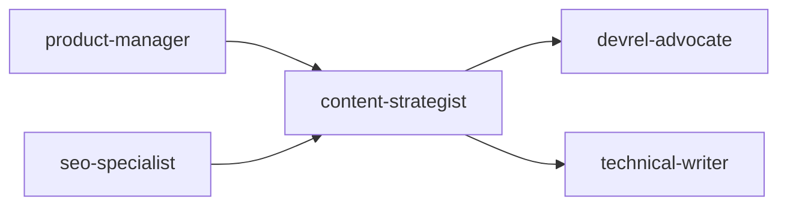
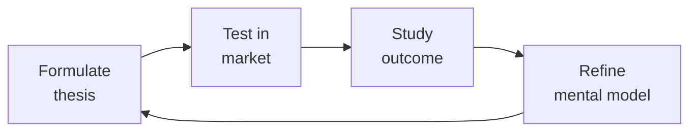

# Content Strategist

End-to-end content strategy system covering planning, creation, governance, and measurement. Designed for product-led and SaaS organizations building authority through topical depth, structured content operations, and data-driven iteration.

## Route the Request
<!-- QUICK: 30s -- pick your path, skip the rest -->

What are you trying to do?
├── Content planning (pillars, personas, workflows)
│   ├── New content program → Start at "Core Workflow > Phase 1"
│   └── Existing program refresh → Go to "Core Workflow > Phase 2"
├── Editorial calendar design
│   └── Multi-writer coordination → Jump to "Sub-Skills > Editorial Calendar Design"
├── Content audit (inventory, categorization)
│   └── Traffic declining or content bloat → Go to "Sub-Skills > Content Audit & Inventory"
├── Content marketing funnel
│   └── Mapping content to buyer journey → Go to "Core Workflow > Phase 1"
├── Topic clusters & pillar strategy
│   └── Building SEO authority → Go to "Sub-Skills > Topic Cluster Architecture"
├── Content repurposing
│   └── Maximizing existing content ROI → Go to "Sub-Skills > Content Repurposing"
├── Tone of voice guidelines
│   └── Inconsistent brand voice → Go to "Sub-Skills > Tone-of-Voice & Style Guidelines"
├── Cross-skill: Coordinate content-keyword strategy with `seo-specialist` → Open that skill
├── Cross-skill: Involve `devrel-advocate` for developer tutorials and technical content → Open that skill
├── Cross-skill: Align campaign content with `marketing-manager` → Open that skill
└── Don't know where to start? → Start at "Core Workflow > Phase 1"

Do not read the entire skill. Follow the route above and read only the sections it points to.

## Ground Rules — Read Before Anything Else

These rules apply to *every* response this skill produces.

- **Never recommend content without audience research.** Every content piece needs evidence of who it serves and why.
- **Every content piece needs a measurable goal.** If you can't define what success looks like, don't recommend creating it.
- **Content calendar dates without capacity planning are wishful thinking.** Always pair deadlines with a realistic estimate of writer/editor hours.
- **Tone of voice must match real brand values, not aspirational ones.** If the brand says "bold" but writes like a bank, fix the brand values, not the copy.
- **Always anchor recommendations in data.** Cite traffic, engagement, or conversion data — never rely on "best practice" alone.
- **Admit what you don't know.** If you haven't seen audience research or performance data, say so before recommending content direction.


## The Expert's Mindset

Master content strategists understand that strategy is not about predicting the future — it's about **being less wrong than the competition, faster**.

| Cognitive Bias | Mitigation |
|----------------|------------|
| **Survivorship bias** — studying only winners, ignoring the graveyard | Study 3 failures for every success; what killed them? |
| **Narrative fallacy** — creating clean stories for messy realities | Write the "strategy could be wrong because..." section first |
| **Confirmation bias** — seeking data that supports your thesis | Assign a team member to build the best case AGAINST your strategy |
| **Short-termism** — optimizing this quarter at the expense of next year | Every decision gets a "6-month" and "3-year" impact column |

### What Masters Know That Others Don't
- **The bottleneck is always one thing.** Find it. Fix it. Then find the next one.
- **Strategy = what you say NO to.** If your strategy doesn't exclude anything, it's not a strategy.
- **Timing beats brilliance.** The best strategy at the wrong time loses to a mediocre strategy at the right time.

### When to Break Your Own Rules
- **Bet the company when the asymmetry is right.** If downside = $1M and upside = $1B, the math doesn't care about your process.
- **Ignore the data when you're creating a new category.** By definition, there's no data for something that doesn't exist yet.
## Operating at Different Levels

| Level | Scope | You... |
|-------|-------|--------|
| **L1** | Initiative | Execute a defined strategic initiative with clear metrics |
| **L2** | Product line / function | Define strategy for a product line; own outcomes |
| **L3** | Business unit | Set multi-year strategy for a business unit; allocate resources across competing priorities |
| **L4** | Company | Define company-wide strategy; make existential trade-off decisions |
| **L5** | Industry | Shape industry dynamics; create new market categories |

**Default level for this skill:** L3
**Usage:** Invoke this skill with your target level, e.g., "as an L3 content strategist, develop..."

For full level definitions, see `skills/00-framework/skill-levels/SKILL.md`.

## When to Use
<!-- QUICK: 30s -- scan the bullet list to decide if this skill fits -->
- Building a new content program from scratch — defining pillars, audience personas, and editorial workflows
- Running a content audit to identify gaps, consolidation opportunities, and refresh candidates
- Designing a topic cluster architecture to establish topical authority for SEO
- Creating or updating tone-of-voice and style guidelines across a multi-writer team
- Planning quarterly or annual editorial calendars aligned with product launches and campaigns
- Repurposing high-performing long-form content into derivative formats (social, email, video scripts)
- Measuring content ROI and building dashboards that connect content to pipeline/revenue
- Optimizing a content marketing funnel from awareness through conversion and retention

## Decision Trees
<!-- QUICK: 30s -- follow the ASCII tree to your scenario -->
### Content Format Selection
```
                     ┌──────────────────────────┐
                     │ START: Which content      │
                     │ format to create?         │
                     └────────────┬─────────────┘
                                  │
                    ┌─────────────▼─────────────┐
                    │ Target is TOFU (Top of     │
                    │ Funnel — awareness)?       │
                    └────┬──────────────────┬───┘
                         │ YES              │ NO
                    ┌────▼──────┐    ┌──────▼──────────┐
                    │ Best for   │    │ BOFU (Bottom)?    │
                    │ organic    │    └──┬──────────┬────┘
                    │ search?    │       │YES       │NO (MOFU)
                    └──┬───┬─────┘  ┌────▼────┐ ┌───▼──────────┐
                       │YES│NO     │Case study│ │Webinar,      │
                  ┌────▼──┐┌▼──────┐│Comparison│ │Guide,         │
                  │Blog   ││Video, ││ROI calc, │ │Checklist,     │
                  │post,  ││Podcast││Free trial│ │Template —     │
                  │Guide  ││Social │└──────────┘ │POV content    │
                  │(SEO)  ││media  │              └──────────────┘
                  └───────┘└───────┘
```
**When to choose Blog/Guide:** TOFU + organic search focus — invest in SEO, cluster strategy, evergreen content with 6-12 month shelf life.  
**When to choose Video/Podcast:** TOFU + brand building — reach audiences on YouTube, Spotify; high production cost, long payback.  
**When to choose Case Study/Comparison:** BOFU — close deals with social proof; quantifiable ROI metrics required.  
**When to choose Webinar/Template:** MOFU — nurture leads with gated assets; capture email → nurture sequence.

### Content Refresh vs. New Creation
```
                     ┌──────────────────────────┐
                     │ START: Publish new or      │
                     │ refresh existing?          │
                     └────────────┬─────────────┘
                                  │
                    ┌─────────────▼─────────────┐
                    │ Existing page ranks #4-15  │
                    │ for target keyword AND     │
                    │ age > 6 months?            │
                    └────┬──────────────────┬───┘
                         │ YES              │ NO
                    ┌────▼──────┐    ┌──────▼──────────┐
                    │ Refresh   │    │ Keyword gap      │
                    │ existing  │    │ not covered at   │
                    │ page —    │    │ all?             │
                    │ update    │    └──┬──────────┬────┘
                    │ stats, add│      │YES       │NO
                    │ new       │ ┌────▼────┐ ┌──▼──────────┐
                    │ section,  │ │Create new│ │Content      │
                    │ republish │ │pillar +  │ │cannibaliz-  │
                    │ with new  │ │cluster   │ │ation risk — │
                    │ date      │ └──────────┘ │consolidate  │
                    └───────────┘               │or de-optimize│
                                                └─────────────┘
```
**When to Refresh:** Existing page ranks #4-15, 6+ months old — update stats, add new sections, republish with fresh date (SEO win in 30-60 days).  
**When to Create New:** Keyword gap uncovered, no existing page within striking distance — build pillar + cluster, target long-tail first.  
**When to Consolidate:** Multiple pages competing for same keyword — merge into one definitive resource, 301 redirects.

### Content Distribution Channel Mix
```
                     ┌──────────────────────────┐
                     │ START: Where to distribute │
                     │ this content?              │
                     └────────────┬─────────────┘
                                  │
                    ┌─────────────▼─────────────┐
                    │ Content drives organic     │
                    │ search traffic (SEO ROI)?  │
                    └────┬──────────────────┬───┘
                         │ YES              │ NO
                    ┌────▼──────┐    ┌──────▼──────────┐
                    │ SEO +     │    │ Content is        │
                    │ owned     │    │ time-sensitive?   │
                    │ channels  │    └──┬──────────┬────┘
                    │ + email   │       │YES       │NO
                    │ nurture   │  ┌────▼────┐ ┌──▼──────────┐
                    └───────────┘  │Social    │ │Gated asset  │
                                   │(real-time)│ │— email      │
                                   │+ push     │ │capture +    │
                                   │notifications│ │retargeting │
                                   └──────────┘ └─────────────┘
```
**When to choose SEO + Owned:** Evergreen content, ROI from organic — invest in keyword research, backlinks, updates. Distribution: blog + newsletter.
**When to choose Social + Push:** News, announcements, time-sensitive — Twitter, LinkedIn, Slack communities, push notifications.  
**When to choose Gated + Retargeting:** High-value lead gen asset — landing page, form, email sequence, retargeting ads.

### Content Audit Decision Matrix
```
                     ┌──────────────────────────────┐
                     │ START: How to handle existing  │
                     │ content piece?                 │
                     └────────────┬─────────────────┘
                                  │
                    ┌─────────────▼─────────────────┐
                    │ Traffic > 100/month AND        │
                    │ conversion rate > 1%?          │
                    └────┬──────────────────────┬───┘
                         │ YES                  │ NO
                    ┌────▼──────────┐    ┌──────▼──────────┐
                    │ KEEP +        │    │ Traffic > 100    │
                    │ OPTIMIZE:     │    │ but < 1% CVR?    │
                    │ Add CTAs,     │    └──┬──────────┬────┘
                    │ update offers,│      │YES       │NO
                    │ internal links│ ┌────▼────┐ ┌──▼──────────┐
                    └───────────────┘ │REFRESH  │ │Traffic < 10 │
                                      │Improve  │ │AND age > 1yr│
                                      │CVR: CTAs,│ └──┬──────┬───┘
                                      │offers,   │   │YES   │NO
                                      │format    │┌──▼──┐┌─▼──────┐
                                      └──────────┘│DELETE││KEEP +  │
                                                   │or 301││MONITOR │
                                                   │redirect││(low   │
                                                   └──────┘│priority)│
                                                           └────────┘
```
**When to Keep + Optimize:** High traffic + high CVR — your best assets. Update CTAs, add related content links, optimize for conversions.  
**When to Refresh:** High traffic, low conversion — content is found but doesn't convert. Improve CTAs, update offers, or fix format/paywall.
**When to Delete/Redirect:** <10 visits/month, >1 year old, no backlinks — prune. 301 redirect to closest relevant page.

### Content Team Structure Decision
```
                     ┌──────────────────────────────┐
                     │ START: How to staff content?   │
                     └────────────┬─────────────────┘
                                  │
                    ┌─────────────▼─────────────────┐
                    │ Publishing cadence > 4         │
                    │ long-form pieces/week?         │
                    └────┬──────────────────────┬───┘
                         │ YES                  │ NO
                    ┌────▼──────────┐    ┌──────▼──────────┐
                    │ In-house team │    │ Need specialized  │
                    │ + freelance   │    │ domain expertise  │
                    │ pool for      │    │ (SME-level)?     │
                    │ overflow      │    └──┬──────────┬────┘
                    └───────────────┘       │YES       │NO
                                       ┌────▼────┐ ┌──▼──────────┐
                                       │Agency+  │ │Freelance    │
                                       │SME      │ │generalist   │
                                       │external │ │or small     │
                                       │partners │ │in-house team│
                                       └─────────┘ └─────────────┘
```
**When to build in-house team:** >4 pieces/week, need deep product knowledge, fast iteration — hire editor + writers; supplement with freelancers.
**When to use Agency + SME:** Niche domain expertise (legal, medical, financial) — pair agency with subject matter experts for accuracy.  
**When to use Freelance:** <4 pieces/week, general topics — cost-effective, flexible, no benefits overhead.

## Core Workflow
<!-- QUICK: 30s -- scan phase titles to understand the process -->
<!-- DEEP: 10+min -->
### Phase 1 (~15 min): Strategy Foundation

1. **Audience & Persona Research** — Define primary and secondary personas including: job titles, pain points, goals, information needs by funnel stage, preferred content formats, and channels. Validate with customer interviews, sales call recordings, and support ticket analysis.
2. **Content Mission Statement** — Articulate who the content serves, what unique value it provides, and how it differentiates from competitors. Example: "We help backend engineers transition from monolith to microservices with production-tested patterns."
3. **Topic Cluster Architecture** — Identify 3–5 pillar topics (broad, high-volume). For each pillar, map 15–30 cluster topics (specific, long-tail). Define internal linking strategy: every cluster post links to its pillar; pillar links to all clusters. This signals topical authority to search engines.
4. **Competitive Content Audit** — Analyze top 5 competitors: content formats, publishing cadence, average word count, content depth scores, backlink profiles, social engagement. Identify whitespace — topics they under-serve or formats they ignore.
5. **Deliverable: Content Strategy Brief** — A document including persona cards, topic cluster map, competitive analysis, content funnel mapping, and KPIs per funnel stage.

<!-- DEEP: 10+min -->
### Phase 2 (~30 min): Content Operations

1. **Editorial Calendar Setup** — Build a quarterly calendar with: working titles, target keywords, funnel stage, assigned writer, draft deadline, review deadline, publish date, distribution channels. Use Notion/Airtable/Asana with calendar and Kanban views.
2. **Content Brief Template** — Standardize briefs with: target persona, funnel stage, primary/secondary keywords, search intent (informational/commercial/transactional/navigational), target word count, outline with H2/H3 structure, internal links to include, competitor URLs to beat, CTAs.
3. **Tone of Voice Guidelines** — Define 3–4 brand voice attributes (e.g., "authoritative but approachable"). For each attribute: do/don't examples, vocabulary preferences, sentence structure guidance. Include grammar and formatting rules: Oxford comma usage, heading capitalization style, code snippet formatting.
4. **Review & Approval Workflow** — Define stages: outline review → first draft → peer review → SEO review → final edit → stakeholder approval (if needed) → publish. Set SLAs per stage. Use Google Docs "suggesting" mode or a collaborative CMS.
5. **Content Governance** — Establish content ownership (who updates what), refresh cadence (quarterly for high-traffic, annually for evergreen), deprecation criteria (outdated, low traffic for 12+ months, brand misalignment). Maintain a content inventory with status, owner, last-updated, and performance fields.

<!-- DEEP: 10+min -->
### Phase 3 (~20 min): Measurement & Optimization

1. **Content Metrics Framework** — Map metrics to funnel stages:
   - **Awareness**: organic sessions, impressions, new users, social shares, backlinks acquired
   - **Consideration**: time on page, scroll depth, newsletter sign-ups, gated asset downloads
   - **Conversion**: demo requests, free trial starts, contact sales form submissions, pipeline influenced
   - **Retention**: returning visitor rate, help doc satisfaction scores, churn reduction from educational content
2. **Content Performance Dashboard** — Build in Looker Studio/Tableau. Track: top 20 pages by traffic, top 20 by conversions, pages with highest growth/decline month-over-month, pages with high traffic but low conversion (optimization candidates), pages ranking positions 4–15 (quick-win targets).
3. **Content Refresh Program** — Quarterly: identify pages with declining traffic, update with current data/examples, improve depth, expand keyword coverage, re-publish with new date. Track uplift 30/60/90 days post-refresh.
4. **Repurposing Engine** — From each high-performing long-form piece, generate: Twitter thread, LinkedIn carousel, email newsletter version, podcast talking points, YouTube script, infographic. Maximize ROI per research investment.

## Best Practices
<!-- STANDARD: 3min -- rules extracted from production experience -->
- Always write for search intent first, search engines second. Google rewards content that satisfies user needs.
- Use the "inverted pyramid" structure: key takeaway first, supporting details next, background last.
- Every piece of content should have exactly one primary CTA. Too many choices reduce conversion.
- Maintain a content debt backlog alongside the editorial calendar — schedule at least one refresh per sprint.
- Interview subject matter experts before writing technical content; record and transcribe to capture nuance.
- Repurpose content based on data, not hunches — only promote pieces that have already validated with the target audience.
- Use the "skyscraper technique" for competitive topics: find the best existing content, make something 10x better, then promote it.

## Anti-Patterns

| ❌ Anti-Pattern | ✅ Do This Instead |
|---|---|
| Building an editorial calendar from keyword targets alone without writer capacity planning | Schedule only what your team can actually produce — one great post beats four rushed posts; map every assignment to a named writer with estimated hours |
| Publishing all content at top-of-funnel (awareness) with no consideration or decision-stage content | Balance 40% TOFU (traffic), 40% MOFU (nurture), 20% BOFU (convert); every piece needs a conversion goal tied to funnel stage |
| Letting content accumulate as digital debt — 80% of posts from 2 years ago drive zero traffic but remain published | Quarterly content audit: categorize every post as keep/refresh/consolidate/delete; merge thin posts; 301 redirect consolidated pages |
| Repurposing content by copy-pasting the same text across platforms without format adaptation | Tailor each format to its platform: blog → Twitter thread (bite-sized takeaways), LinkedIn (professional narrative with opinion), video (visual demo) |
| Letting multiple writers use their own style with no tone-of-voice guidelines — brand sounds like different companies | Create 1-page tone-of-voice guide: 3 brand voice attributes with do/don't examples; enforce via editorial review checklist; use Vale linter |
| Publishing content because "we haven't posted this week" without a documented content mission or audience need | Every piece maps to a documented customer journey stage, target keyword cluster, and measurable conversion goal — no content for content's sake |
| Treating content ROI as "pageviews" without connecting to pipeline or revenue | Track content-sourced and content-influenced pipeline; attribute to revenue, not traffic; multi-touch attribution when possible |
| Ignoring content that is already performing — always creating new instead of optimizing existing | Before creating new content, refresh top-performing posts with updated data, better depth, more internal links — a refreshed post compounds faster than a new one |

## Cross-Skill Coordination
<!-- QUICK: 30s -- table of who to talk to when -->
Content strategy sits between marketing, product, SEO, and brand. Content produced in silos underperforms; coordination amplifies reach and relevance.

### Decision Gates & Artifacts

| Gate | Condition | Action |
|------|-----------|--------|
| Content ↔ SEO | Keyword strategy or topic cluster change | Loop in `seo-specialist`; share keyword targets and SERP intent analysis |
| Content ↔ Product | Feature launch or messaging pivot | Coordinate with `product-manager`; align content calendar with roadmap |
| Content ↔ DevRel | Developer-focused content or tutorial series | Involve `devrel-advocate`; co-author technical content with developer perspective |
| Content ↔ Marketing | Campaign launch or lead magnet creation | Sync with `marketing-manager`; align content funnel to demand gen goals |
| Content ↔ UX Writing | In-product copy or onboarding flow | Coordinate with `ux-writer`; maintain brand voice consistency across surfaces |

**Artifacts shared across skills:**
- Editorial calendar (shared with `marketing-manager`, `seo-specialist`, `devrel-advocate`)
- Content brief templates (shared with `seo-specialist`, `ux-writer`)
- Tone-of-voice guidelines (shared with `ux-writer`, `devrel-advocate`, `marketing-manager`)
- Content performance dashboards (shared with `growth-engineer`, `marketing-manager`, `seo-specialist`)

| Coordinate With | When | What to Share/Ask |
|-----------------|------|-------------------|
| **SEO Specialist** | Keyword research, content planning, audits | Keyword targets, SERP intent, content gap analysis, cannibalization risks |
| **Growth Engineer** | Content-led growth experiments, landing pages | Content as experiment variant, conversion copy for A/B tests |
| **UX Writer / Product** | In-product copy, onboarding flows, microcopy | Tone of voice alignment, terminology consistency, user-facing messaging |
| **Marketing/Demand Gen** | Campaign content, lead magnets, email sequences | Content calendar alignment, campaign briefs, distribution channel strategy |
| **Social Media Manager** | Content distribution, repurposing | Social-optimized excerpts, visual assets, engagement data for topic ideation |
| **Technical Writer** | Documentation, knowledge base, blog | Editorial standards for docs, content hierarchy, cross-linking strategy |
| **Data/Analytics** | Content performance, funnel metrics | Content attribution model, engagement metrics, conversion tracking by content piece |
| **Design/Brand** | Visual content, infographics, brand consistency | Brand guidelines, visual asset requirements, content format specifications |
| **Product Strategist** | Product launches, feature announcements | Product roadmap, feature positioning, customer-facing messaging |

### Communication Triggers — When to Proactively Notify

| Trigger | Notify | Why |
|---------|--------|-----|
| Editorial calendar shift >2 weeks | Marketing, Social Media, SEO Specialist | Distribution, promotion, and keyword targeting depend on timing |
| Content underperforming benchmark by >50% after 30 days | SEO Specialist, Growth Engineer, Data | May need SEO refresh, promotion boost, or format change |
| New topic cluster identified (strategy pivot) | SEO Specialist, Marketing, Product Strategist | Realignment of content investment; cross-team buy-in needed |
| Brand voice/tone guidelines updated | UX Writer, Technical Writer, Marketing | Consistency across all public-facing content surfaces |
| Competitor launches major content initiative | SEO Specialist, Product Strategist, Marketing | Competitive response needed; content differentiation strategy |
| Content audit reveals >20% of content is stale/outdated | SEO Specialist, Technical Writer | Refresh or deprecation decisions; 301 redirect planning |
| High-performing content generating leads but not tracked | Data/Analytics, Growth Engineer | Attribution gap; content ROI under-reported |

### Escalation Path

| Situation | Escalate To | Rationale |
|-----------|------------|-----------|
| Content strategy misaligned with product direction | **Product Strategist** + CEO Strategist | Strategic realignment; product-market messaging disconnect |
| >3 months of content investment with zero attributable pipeline | **Growth Engineer** + Marketing Lead | ROI crisis; strategy or distribution fundamentally broken |
| Brand reputation risk from published content | **Legal Advisor** + PR/Comms | Libel, trademark, or regulatory exposure |
| Resource request denied for critical content hire | **CEO Strategist** or CMO | Content under-investment affects all growth channels |
| Content team blocked by engineering (CMS, publishing, tooling) | **CTO Advisor** + Project Manager | Operational bottleneck; needs engineering prioritization |

### Route to Other Skills

- **`seo-specialist`** — When content needs keyword research, SERP analysis, topic cluster architecture, or SEO content briefs
- **`product-manager`** — When content strategy needs product roadmap alignment, feature positioning, or competitive messaging
- **`devrel-advocate`** — When creating developer tutorials, technical blog posts, or community-facing content
- **`marketing-manager`** — When aligning content calendar with campaigns, demand gen, or multi-channel distribution

## Proactive Triggers

| Trigger | Action | Why |
|---------|--------|-----|
| Content audit reveals > 30% of pages are stale or driving zero traffic | Run refresh/consolidate sprint before creating anything new; merge thin posts into comprehensive resources; 301 redirect | Content debt compounds — old thin pages drag down site authority signal; fix debt before adding more |
| High-performing pillar post loses > 20% traffic over 90 days | Flag for immediate refresh: update data, add new sections, improve internal links, check for competitor content that surpassed it | A declining pillar is a compounding loss — each month of decline costs more in lost organic traffic than fixing it costs |
| Competitor publishes definitive content that outranks yours for a core keyword | Analyze competitor piece for depth, freshness, format; plan 10x better version; prioritize over net-new content | Defending existing rankings is cheaper than earning new ones — react within 30 days or cede the position permanently |
| Keyword cannibalization detected — 2+ pages competing for same term, neither in top 3 | Merge cannibalized pages into one comprehensive resource; 301 redirect weaker pages; update internal links | Cannibalization splits your authority — one strong page beats three weak ones on the same keyword |
| Content calendar slip > 3 weeks — multiple deadlines missed | Audit root cause: writer capacity, review bottleneck, unclear briefs; reduce calendar to sustainable cadence; add buffer days | A calendar with constant slips is a wish list — cut volume before stakeholders stop trusting publish dates |
| Attribution gap identified — high-performing content generating leads not tracked in CRM | Implement UTM + CRM tracking; add content attribution to pipeline reporting; close the loop within one month | Content ROI is invisible without attribution — untracked leads are under-reported impact that costs budget justification |
| Content team blocked by CMS or publishing tooling for > 2 weeks | Escalate to engineering/product; request temporary workaround (e.g., publish to staging URL, use alternative CMS); quantify opportunity cost | Blocked publishing is an operational emergency, not a nice-to-have — each week of delay compounds missed traffic and lead generation |
| Brand voice inconsistency flagged in public by audience — "did someone else write this?" | Audit recent content for voice alignment; reinforce tone-of-voice guide with editorial team; add Vale linter to CI | Brand voice inconsistency erodes trust faster than grammatical errors — audience notices before internal review does |

## Scale Depth
<!-- QUICK: 30s -- find your team size column -->
### Solo (1 person, 0-100 users)
Founder or solo marketer writing everything. Content strategy = a Notion doc. Publish 1-2 posts/week on company blog. Distribution: Twitter/LinkedIn + email to small list. SEO: basic keyword research (free tools), no cluster strategy. No editorial calendar beyond Google Calendar. Measure: page views + email signups. Cost: $0-200/month (CMS hosting, email tool free tier). Overkill: content agency, topic cluster tools, T-shaped writers, multi-channel attribution.

### Small (2-10 people, 100-10K users)
Hire 1-2 content writers or a fractional editor. Editorial calendar in Airtable/Notion. Publish 2-4 pieces/week. SEO: keyword research (Ahrefs/Semrush), topic clusters, pillar pages. Content refresh cycle established. Distribution: newsletter, social scheduling (Buffer/Hootsuite), syndication. Basic attribution: UTM + CRM tracking. Cost: $3K-10K/month. Overkill: in-house video production, dedicated content operations role.

### Medium (10-50 people, 10K-1M users)
Content team (3-5): editor, writers, content strategist, freelance pool. CMS with workflows and approvals. SEO: advanced (enterprise Ahrefs, Clearscope/MarketMuse). Content Ops: content management platform (Contentful/Sanity). Multi-channel: blog, newsletter, podcast, webinars, gated assets. Attribution: multi-touch, pipeline influence modeling. A/B test headlines, CTAs, formats. Cost: $15K-50K/month.

### Enterprise (50+ people, 1M+ users)
Content department (10+): specialists per channel, content ops manager, managing editor. Multi-language, multi-region content operations. AI-assisted content creation + human editorial review. Content supply chain: request → brief → draft → review → publish → distribute → measure. Full attribution: content-sourced vs content-influenced pipeline. Brand-level editorial standards. Cost: $100K-500K+/month.

### Transition Triggers
| From → To | Trigger | What to Change |
|-----------|---------|----------------|
| Solo → Small | >2 posts/week consistently for 3 months, or content requests > 1/day | Hire fractional writer/editor; add SEO tool (Ahrefs/Semrush); implement editorial calendar |
| Small → Medium | >4 posts/week, 3+ content channels active, or content ROI > $50K/month | Build in-house team; implement CMS workflows; add attribution model |
| Medium → Enterprise | Multi-language needs, >10 content creators, or content influences >$1M pipeline/month | Dedicate content ops; invest in AI tools; build content supply chain |

## What Good Looks Like

> Every piece of content maps to a documented stage of the customer journey, a target keyword cluster, and a measurable conversion goal — no one publishes because "we haven't posted this week." The editorial calendar runs three months ahead, aligned with product launches and campaigns, and the content supply chain moves a brief from request to publish without bottlenecking on a single reviewer. Organic traffic compounds month over month because pillar pages earn backlinks naturally, and content ROI is reported in pipeline dollars, not pageviews.

### Cross-skills Integration

Run skills in the order shown:
```bash
# Chain A: product-manager → content-strategist → devrel-advocate
# Chain B: seo-specialist → content-strategist → technical-writer
```

## Sub-Skills
<!-- QUICK: 30s -- table of deeper dives by topic -->
| Sub-Skill | When to Use | Context |
|-----------|-------------|---------|
| **Content Audit & Inventory** | Traffic declining or content bloat >100 pieces | Screaming Frog, Google Analytics, GSC — categorize: keep/refresh/consolidate/delete |
| **Topic Cluster Architecture** | Building SEO authority for a new or competitive niche | Pillar + cluster model, keyword mapping, internal linking structure — Ahrefs, Semrush |
| **Editorial Calendar Design** | >2 writers contributing, multiple deadlines/week | Airtable, Notion, CoSchedule — align with product launches, campaigns, events |
| **Tone-of-Voice & Style Guidelines** | Multi-writer team, inconsistent brand voice across channels | Brand voice charter, style guide, writing templates, editorial review process |
| **Content Repurposing** | High-performing long-form content exists; want to maximize ROI | Blog → social threads, video scripts, newsletter, slides, infographics, podcast episodes |
| **Content ROI Measurement** | Justifying content budget or optimizing content investment | Multi-touch attribution, pipeline influence, content scoring — tools: Google Analytics, HubSpot, Salesforce |
| **B2B vs B2C Content Strategy** | Differentiating approach by audience type | B2B: case studies, whitepapers, webinars, LinkedIn. B2C: blog, video, social, email nurture |
| **AI-Assisted Content Production** | Scaling output while maintaining quality and brand voice | ChatGPT, Claude, Jasper — draft, research, summarize; human editing for accuracy + voice |


<!-- DEEP: 10+min -->
## Error Decoder

| Symptom | Root Cause | Fix | Lesson |
|---------|------------|-----|--------|
| Content calendar has 30 scheduled posts but only 5 were published this quarter | Calendar was built from keyword targets alone without writer capacity planning -- each post needs 8 hours of research, writing, and editing | Reduce to 10 posts per quarter with confirmed writer assignments. Add buffer: plan for 2 weeks of editing per post. Track capacity, not just deadlines. | A content calendar without capacity planning is a wish list, not a plan. Schedule only what your team can actually produce. Priority: one great post beats four rushed posts. |
| Blog traffic dropped 50% after 6 months of consistent publishing | All content was written for top-of-funnel keywords (awareness) -- no consideration or decision-stage content to capture readers ready to convert | Map every upcoming piece to a funnel stage. Balance: 40% TOFU (traffic), 40% MOFU (nurture), 20% BOFU (convert). Add CTAs that match intent at each stage. | Content that generates traffic but not conversions is content marketing theater. Map every piece to the buyer journey and give it a conversion goal. Content without an outcome is noise. |
| Content audit found 80% of posts from 2 years ago still published but driving zero traffic | No content refresh or deprecation process -- pages accumulate like digital debt, diluting site authority with thin content | Quarterly content audit: categorize every post as keep/refresh/consolidate/delete. Merge thin posts into comprehensive resources. 301 redirect consolidated pages. | Content debt compounds. Old, thin pages drag down your site's overall quality signal. Schedule quarterly audits before you have 200+ pages of dead content. |
| Repurposing existing content generated almost no engagement despite heavy promotion | Repurposed content was a direct copy-paste of the original blog post into a LinkedIn article -- no format adaptation for the platform | Tailor each format to its platform: blog becomes Twitter thread (bite-sized takeaways), blog becomes LinkedIn (professional narrative with opinion), blog becomes video (visual demo). | Repurposing is not copy-pasting -- it is reformatting for the medium. Each platform has its own content grammar. Respect it. One piece of research should yield 5 platform-native outputs. |
| Brand voice is inconsistent across blog, newsletter, and social media | No tone-of-voice guidelines existed -- each writer used their own style, and the brand sounded like 3 different companies | Create a 1-page tone-of-voice guide: 3 brand voice attributes with do/do not examples. Enforce via editorial review checklist and Vale linter in CI. | Tone of voice inconsistency erodes brand trust faster than grammatical errors. A 1-page guide enforced in review prevents brand schizophrenia. Writers want guardrails -- give them some. |


## Production Checklist
<!-- QUICK: 30s -- binary pass/fail items. All must pass. -->
- [ ] **[S1]**  Content mission statement is documented and visible to all content creators
- [ ] **[S2]**  Topic cluster map exists with pillar pages and cluster relationships defined
- [ ] **[S3]**  Editorial calendar covers next 90 days with assignments, deadlines, and distribution plan
- [ ] **[S4]**  Content brief template is standardized and used for every assigned piece
- [ ] **[S5]**  Tone of voice guidelines are published and include do/don't examples for each voice attribute
- [ ] **[S6]**  Review workflow is defined with SLAs per stage and tracked
- [ ] **[S7]**  Content inventory is maintained with status, owner, last-updated, and performance data
- [ ] **[S8]**  Quarterly content audit process is in place — identifies gaps, refreshes, consolidations, and deletions
- [ ] **[S9]**  Content performance dashboard shows funnel-stage metrics and month-over-month trends
- [ ] **[S10]**  Keyword cannibalization is monitored and addressed within each content cluster
- [ ] **[S11]**  All published content has structured data (Article, HowTo, or FAQ schema as applicable)
- [ ] **[S12]**  Internal linking strategy is enforced — every new post links to pillar page and 3+ relevant cluster posts
- [ ] **[S13]**  Accessibility baseline met: proper heading hierarchy, alt text, sufficient color contrast in embedded graphics
- [ ] **[S14]**  Content refresh triggers are automated: pages dropping >20% traffic over 90 days flagged for review

## MVP vs Growth vs Scale

| Phase | Team Size | Content Volume | Priority | Content Approach |
|-------|-----------|---------------|----------|-----------------|
| **MVP (0→1)** | 1-3 devs, no content hire | 3-5 foundational pages | Educate early adopters | 1 long-form pillar post + 3 cluster posts + blog. Write in-house (founders or engineers). No calendar. Google Docs → publish. |
| **Growth (1→10)** | 3-10 devs, 1 content strategist + 1-2 writers | 2-4 posts/week | Build organic pipeline | Topic clusters, editorial calendar, content briefs, freelance writers. CMS (Ghost/WordPress). Quarterly audits. |
| **Scale (10→N)** | 10+ devs, content team (3-8) | 5-10 posts/week + programmatic | Defend authority, expand TAM | Multi-format (blog, video, podcast, newsletter, social). Content ops platform. Programmatic SEO. Editorial governance. |

**MVP content rule:** Write the 3 pieces your top competitor has that you don't. Make them 2x better. Ship in 2 weeks. Done.

## Cost-Effective Decision Table

| Decision | Free/Cheap Option | Paid Upgrade | When to Upgrade |
|----------|------------------|--------------|-----------------|
| CMS / publishing | Ghost (self-hosted, $9/mo VPS) or GitHub Pages + Markdown | WordPress VIP ($2K+/mo) or Contentful ($489/mo) | Need multi-author workflows, localization, or non-dev editors |
| Keyword research | Google autocomplete + AlsoAsked.com (free tier) | Ahrefs ($99/mo) or SEMrush ($129/mo) | Publishing >4 posts/month with strategic keyword targeting |
| Content optimization | Manual SERP analysis (look at top 10 yourself) | Clearscope ($170/mo) or MarketMuse ($149/mo) | >8 posts/month and need data-driven briefs at scale |
| Editorial calendar | Notion / Airtable (free) | CoSchedule ($29/mo) or Asana Premium | Team >4 writers needing calendar + assignment management |
| Freelance writers | Upwork / personal network ($0.10-0.30/word) | Content agency or in-house hire ($60K-120K/yr) | >8 posts/month or need deep domain expertise |
| Content analytics | Google Analytics 4 + Looker Studio (free) | ChartMogul + Mixpanel or Amplitude | Need attribution to pipeline/revenue, not just traffic |

**Annual content budget by phase:** MVP: $0-1K (time only). Growth: $15K-60K (freelancers + tools). Scale: $120K-500K+ (team + tools + multimedia).

## Scalability Decision Tree

```
Do you have >50 unoptimized posts that drive no traffic?
├── YES → Content audit first. Categorize: keep/refresh/consolidate/delete. Don't write new.
└── NO → Good. Proceed.

Is your publishing cadence causing quality issues (rushed, thin content)?
├── YES → Cut cadence by 50%. Double quality. 1 deep post > 4 shallow posts for SEO.
└── NO → Cadence is fine.

Are you ranking page 2 (positions 11-20) for 15+ target keywords?
├── YES → "Quick-win" refresh sprint: update those pages with fresher data, better depth, more internal links.
└── NO → Focus on new content in underserved topic areas.

Is keyword cannibalization visible (2+ pages ranking for same keyword, neither in top 3)?
├── YES → Merge cannibalized pages into one comprehensive page. 301 redirect the weaker one.
└── NO → Good targeting discipline.

Are you producing content in 1 format only (all blog posts)?
├── YES → Repurpose top 3 performers: blog → LinkedIn post → email newsletter → Twitter thread. Zero new research cost.
└── NO → Already multi-format. Focus on format that drives most conversions.
```


**What good looks like:** A 30-day content calendar published with each piece assigned to a writer, a reviewer, and a distribution channel — not just topics, but drafts are due 5 days before publish for editorial review. Topic cluster model maps every primary keyword to a pillar page and 5-8 supporting articles; internal links connect them. Every content piece has a specific CTA tied to a tracked conversion goal (signup, demo request, PDF download). Content audit within the last 90 days shows what's performing, what's stale, and what needs updating — with a timeline for each action.
## When NOT to Use This Skill (Overkill)

- **Product hasn't launched yet**: Content strategy before you know who your users are is writing blind. Wait until you have 50+ paying/users customers and can interview them.
- **Organic isn't your primary channel**: If you're a sales-led enterprise company closing 5 deals/year, content marketing won't move the needle. Invest in sales enablement docs instead.
- **You have 1 writer (and it's you)**: A 12-month editorial calendar, content brief template system, and quarterly audit process are overkill. Write 1 good post per week. Publish. Learn. Iterate.
- **Your topic is ultra-niche (TAM <10K people)**: Content strategy at scale assumes a large addressable market. If your audience is 500 CTOs at Fortune 500, do 1:1 outreach, not content marketing.
- **You're in a regulated industry where all content needs legal review (pharma, finance)**: Standard content velocity advice doesn't apply. Plan for 2-4 week legal review cycles and lower cadence.

## Token-Efficient Workflow

```
# Step 1: Quick audit — which content to refresh first?
# Run a script that queries GA4/GSC API, outputs prioritized list as JSON
python3 scripts/content_audit.py --site example.com --min-age 180 --output json
# Returns: [{"url":"/blog/x","traffic_change":-40,"priority":"high"}, ...]

# Step 2: Decision tree → pick action
# Traffic drop >30% + age >6 months → REFRESH (update data, expand, republish)
# Ranking position 4-15 → QUICK WIN (improve title, meta, internal links)
# Traffic <10 visits/month + age >12 months → DELETE or CONSOLIDATE

# Step 3: Execute the single action. Verify with exit codes.
# Check if a page has proper heading structure
curl -s https://example.com/blog/x | python3 -c "
import sys, re
html = sys.stdin.read()
h1 = len(re.findall(r'<h1[^>]*>', html))
h2 = len(re.findall(r'<h2[^>]*>', html))
print(f'H1:{h1} H2:{h2}')
sys.exit(0 if h1 == 1 else 1)
"

# Step 4: Verify impact — re-run audit after 30 days
python3 scripts/content_audit.py --site example.com --url /blog/x --compare-30d
```

**Principle:** Automated audit scripts output JSON. Agent reads structured data, not prose. Decision tree maps every audit finding to exactly one action. No deliberation loops.

## Deliberate Practice



| Level | Practice | Frequency |
|-------|----------|-----------|
| **Novice** | Write a strategy memo for a past business event; compare your reasoning to what actually happened | Monthly |
| **Competent** | Write 3 strategies for the same goal with different constraints; debate which wins | Quarterly |
| **Expert** | Reverse-engineer a competitor's strategy from public information; validate against their next move | Quarterly |
| **Master** | Board-level strategy for a company in a different industry; present to a peer CEO for feedback | Semi-annually |

**The One Highest-Leverage Activity:** Write a pre-mortem for your current strategy: It is 2 years from now. Our strategy failed. Why?

## References
<!-- QUICK: 30s -- links to deeper reading -->
- [Content Marketing Institute — B2B Content Marketing Benchmarks](https://contentmarketinginstitute.com/)
- [HubSpot — Topic Clusters and Pillar Pages](https://blog.hubspot.com/marketing/topic-clusters-seo)
- [Backlinko — Skyscraper Technique](https://backlinko.com/skyscraper-technique)
- [Google — Search Quality Evaluator Guidelines](https://static.googleusercontent.com/media/guidelines.raterhub.com/en//searchqualityevaluatorguidelines.pdf)
- [Clearscope — Content Optimization](https://www.clearscope.io/)
- [Animalz — Content Strategy Blog](https://www.animalz.co/blog/)
