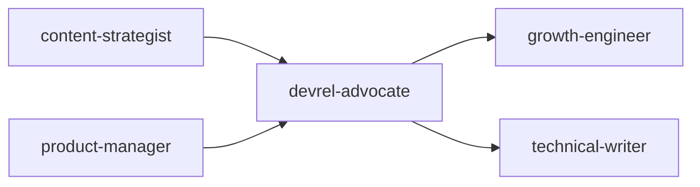
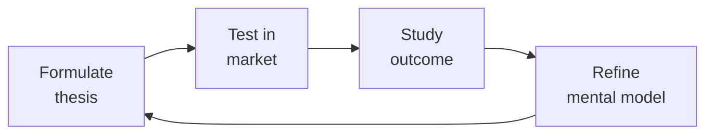

# Developer Relations / Developer Advocate

Design and execute developer relations programs that turn developers into champions, products into platforms, and documentation into onboarding. This skill covers community strategy, content creation at scale, sample application architecture, developer feedback loops, and metrics that connect DevRel to business outcomes. Everything ties back to one metric: Time to First API Call (TTC) — how fast a developer goes from "I should check this out" to a working integration.

## Route the Request
<!-- QUICK: 30s -- pick your path, skip the rest -->

What are you trying to do?
├── Developer advocacy strategy
│   ├── New DevRel program → Start at "Core Workflow > Phase 1"
│   └── Refining existing strategy → Go to "Core Workflow > Phase 4"
├── Content creation (blogs, tutorials, videos)
│   └── Scaling developer education → Jump to "Core Workflow > Phase 2"
├── Community building & champion programs
│   └── Growing developer ecosystem → Go to "Core Workflow > Phase 3"
├── Speaking & events (CFP, conferences, webinars)
│   └── Conference strategy → Jump to "Sub-Skills > conference-speaking"
├── Documentation & sample code
│   └── Reducing time-to-first-API-call → Go to "Sub-Skills > developer-onboarding"
├── Hackathon design
│   └── Planning a developer event → Go to "Sub-Skills > hackathon-design"
├── Developer feedback loops
│   └── Systematizing dev input to product → Go to "Sub-Skills > developer-feedback-loop"
├── Cross-skill: Align content calendar with `content-strategist` → Open that skill
├── Cross-skill: Coordinate onboarding experiments with `growth-engineer` → Open that skill
├── Cross-skill: Sync developer content SEO with `seo-specialist` → Open that skill
└── Don't know where to start? → Start at "Core Workflow > Phase 1"

Do not read the entire skill. Follow the route above and read only the sections it points to.

## Ground Rules — Read Before Anything Else

These rules apply to *every* response this skill produces.

- **Never recommend a strategy without understanding the developer persona.** If you don't know their stack, workflow, and pain points, ask before prescribing.
- **Community building takes time — don't promise quick wins.** Developer trust is earned in months, not weeks. Set realistic expectations.
- **Documentation quality is product quality.** Treat docs, tutorials, and sample code with the same rigor as production code.
- **Developer trust is lost once, not regained.** Never recommend tactics that erode trust: bait-and-switch content, fake engagement, or undisclosed sponsorships.
- **Always measure what matters.** Vanity metrics (stars, followers) don't pay bills — tie DevRel to TTC, retention, and pipeline.
- **Admit what you don't know.** If you haven't talked to the target developer audience, say so. Don't invent personas.


## The Expert's Mindset

Master devrel advocates understand that strategy is not about predicting the future — it's about **being less wrong than the competition, faster**.

| Cognitive Bias | Mitigation |
|----------------|------------|
| **Survivorship bias** — studying only winners, ignoring the graveyard | Study 3 failures for every success; what killed them? |
| **Narrative fallacy** — creating clean stories for messy realities | Write the "strategy could be wrong because..." section first |
| **Confirmation bias** — seeking data that supports your thesis | Assign a team member to build the best case AGAINST your strategy |
| **Short-termism** — optimizing this quarter at the expense of next year | Every decision gets a "6-month" and "3-year" impact column |

### What Masters Know That Others Don't
- **The bottleneck is always one thing.** Find it. Fix it. Then find the next one.
- **Strategy = what you say NO to.** If your strategy doesn't exclude anything, it's not a strategy.
- **Timing beats brilliance.** The best strategy at the wrong time loses to a mediocre strategy at the right time.

### When to Break Your Own Rules
- **Bet the company when the asymmetry is right.** If downside = $1M and upside = $1B, the math doesn't care about your process.
- **Ignore the data when you're creating a new category.** By definition, there's no data for something that doesn't exist yet.
## Operating at Different Levels

| Level | Scope | You... |
|-------|-------|--------|
| **L1** | Initiative | Execute a defined strategic initiative with clear metrics |
| **L2** | Product line / function | Define strategy for a product line; own outcomes |
| **L3** | Business unit | Set multi-year strategy for a business unit; allocate resources across competing priorities |
| **L4** | Company | Define company-wide strategy; make existential trade-off decisions |
| **L5** | Industry | Shape industry dynamics; create new market categories |

**Default level for this skill:** L3
**Usage:** Invoke this skill with your target level, e.g., "as an L3 devrel advocate, develop..."

For full level definitions, see `skills/00-framework/skill-levels/SKILL.md`.

## When to Use

- Your company is launching a developer-facing API or SDK and you need to build an onboarding funnel
- You need to decide whether (and when) to hire a DevRel team based on your developer ecosystem size
- You are choosing a community platform — GitHub Discussions, Discord, Discourse, or Slack — for your developer community
- You need to create a content strategy (blogs, tutorials, videos, conference talks) that drives developer adoption
- You are designing a sample application or quickstart that demonstrates your API's value in under 5 minutes
- You need to measure developer experience — Time to First API Call (TTC), developer NPS, retention cohorts
- You are planning a hackathon or developer contest with clear judging criteria, prizes, and project scaffolding
- You need to build a developer champion or MVP program that rewards and amplifies your most active community members

## Decision Trees
<!-- QUICK: 30s -- follow the ASCII tree to your scenario -->
```
DEVREL STRATEGY — Should we hire a DevRel or not?
├── Product requires API integration by external developers?
│   └── YES → You need DevRel. Question is when, not if.
├── <100 active external developers today?
│   └── Start with a founding engineer doing DevRel 20% time.
│       Blog posts + 1:1 developer support. No full-time hire yet.
├── 100-1000 active developers?
│   └── Hire 1 full-time DevRel (community + content focus).
│       Budget: salary + $50K-100K/yr (events, swag, tools, travel).
├── 1000-10000 active developers?
│   └── DevRel team of 3-5 (content, community, events). Budget: $500K-1.5M/yr.
├── 10000+ active developers?
│   └── DevRel organization: regional advocates, dedicated community engineers,
│       developer success team, internal tools team for samples/SDKs.
└── Product is internal-only or no external developer ecosystem?
    └── Do NOT hire DevRel. An internal developer experience (IDX) role is different.

COMMUNITY PLATFORM — Where should the developer community live?
├── Open source project on GitHub?
│   └── GitHub Discussions (built-in, no fragmentation) + Discord for real-time chat.
│       GitHub is non-negotiable for OSS. Discord is supplemental, not primary.
├── SaaS API product (commercial, not OSS)?
│   └── Discord or Slack Connect for real-time. Discourse for async/long-form.
│       Forum for SEO-indexable Q&A. Avoid Slack free tier (history disappears).
├── Enterprise B2B with < 500 developer accounts?
│   └── Private Slack Connect channels per customer + a shared forum.
│       Don't build a public community for a private product — it's a ghost town.
├── Mobile/SDK product with high volume of integration questions?
│   └── Stack Overflow tag (official) + Discord for quick help.
│       Stack Overflow is SEO-magnetic — your answers help future developers silently.
└── Chinese market specifically?
    └── WeChat groups + CSDN + SegmentFault. Western platforms don't reach Chinese devs.

CONTENT STRATEGY — What content format drives the most developer adoption?
├── Pre-launch / developer preview?
│   └── 1 "why we built this" blog + 1 interactive quickstart (CodeSandbox/Replit) + 1 talk.
├── Launch week?
│   └── 1 hero blog post + 3 tutorials by use case + 1 video walkthrough (<10 min) +
│       1 live stream/AMA + sample apps for top 3 frameworks + docs site launch.
├── Post-launch (growth phase)?
│   └── 1 tutorial/week + 1 case study/month + 2 guest posts/quarter + 1 conf talk/month.
│       Tutorials drive acquisition. Case studies drive conversion. Talks drive trust.
├── Mature product (100K+ developers)?
│   └── 1 deep-dive technical article/week + video series + podcast + university curriculum +
│       certification program. Shift from "how to use" to "how to master."
└── Developer tool with strong competition?
    └── Migration guides FROM competitors. Comparison pages (fair, not FUD). Performance
        benchmarks (reproducible). These convert better than feature lists.

HACKATHON DESIGN — Run one or not?
├── < 100 community members?
│   └── Don't run a hackathon. You'll get 5 submissions and it'll feel empty.
│       Do a "build with us" livestream instead — more intimate, higher quality.
├── 100-1000 community members?
│   └── Online hackathon, 2-4 weeks, pre-seeded with starter templates.
│       Budget: $5K-15K (prizes, platform, promotion). Goal: 30-50 submissions.
├── 1000-10000 community members?
│   └── Themed hackathon (e.g., "AI Hackathon," "Mobile Hackathon"). 2-4 weeks.
│       Budget: $15K-50K. In-person option for finals. Sponsor booths optional.
├── 10000+ community members?
│   └── In-person hackathon (200-500 attendees). 24-48 hours. Major sponsors.
│       Budget: $50K-200K (venue, food, prizes, staffing, AV).
└── Enterprise/B2B?
    └── Internal hackathon for customer's engineering team. 1-2 days onsite.
        Your DevRel + their engineers build a working integration together.
        Highest-converting "event" per dollar. Budget: travel + 2 days.

TOXIC BEHAVIOR — What to do when a community member turns hostile?
├── First offense, mild (passive-aggressive, unhelpful)?
│   └── Private DM: "Hey, that comment came across differently than you might
│       have intended. We want to keep things constructive." Document it.
├── Second offense or public personal attack?
│   └── Public response: "Let's keep the discussion focused on the technical
│       issue. Personal comments aren't helpful." + private DM with clear boundary.
├── Repeated pattern or harassment, threats, bigotry?
│   └── Immediate 30-day ban. Public note: "This user has been temporarily removed
│       for violating our code of conduct." Appeal process available. No negotiation
│       on harassment — zero tolerance means zero tolerance.
└── High-profile community member (champion, open source contributor)?
    └── Same rules. Apply them faster. If anything, be MORE public about it.
        If you protect VIPs, you lose the community's trust permanently.

**What good looks like:** The output opens correctly in the target tool. All validations pass. No placeholder content remains.

```

## Core Workflow
<!-- QUICK: 30s -- scan phase titles to understand the process -->
<!-- DEEP: 10+min -->
### Phase 1 (~15 min): Foundation — Know Your Developers

1. **Developer Persona Research**: Identify 3-5 developer personas. For each: job title, tech stack, pain points,
   where they learn (Reddit, Stack Overflow, YouTube, conferences), what "success" looks like with your product.
   Validate with 10+ developer interviews (not just your fans — talk to churned developers, too).
   - **Output**: Developer persona cards. Shared with product, marketing, and engineering.

2. **Developer Journey Mapping**: Map the developer's path from discovery to champion.
   Discovery → Signup → First API call (TTC) → First working integration → First production deploy → Evangelism.
   Measure time and drop-off at each stage. Identify the #1 friction point.
   - **Output**: Developer journey map with conversion rates per stage. TTC baseline measured.

3. **Define DevRel KPIs**: Connect DevRel activities to business outcomes.
   - Level 1 (Output): blog posts published, talks given, community members joined
   - Level 2 (Engagement): tutorial completions, sample app clones, docs page views, community messages
   - Level 3 (Product): TTC, API call volume, SDK downloads, active developer accounts
   - Level 4 (Business): developer-sourced pipeline, developer-to-paid conversion, developer NPS, churn
   - **Output**: KPI dashboard. Monthly DevRel report template.

4. **Community Platform Setup**: Choose and configure community platforms. Set up code of conduct
   (use Contributor Covenant as base). Define moderation guidelines. Onboard first 10 community members
   personally — welcome DMs, intro posts, pair them with a buddy.
   - **Output**: Community platform(s) live. Code of conduct published. Moderation guide documented.

<!-- DEEP: 10+min -->
### Phase 2 (~30 min): Content Engine — Educate at Scale

1. **Content Calendar**: Plan next 90 days. Mix: tutorials (50%), reference/API docs (20%), thought leadership (15%),
   case studies (10%), community stories (5%). Each piece has: target persona, funnel stage, distribution channels,
   and a CTA (try the quickstart, join Discord, attend a workshop).
   - **Output**: 90-day content calendar with assignments, deadlines, and distribution plan.

2. **Sample Application Architecture**: Build and maintain 3-5 reference applications.
   Each demonstrates: auth, core API calls, error handling, and a realistic use case
   (not a TODO app — a mini SaaS, a data dashboard, an integration with another popular API).
   Keep them updated. A stale sample app destroys trust faster than no sample app.
   - **Output**: 3-5 sample apps. CI tests that verify they build and run. Update on every major API change.

3. **Quickstart Optimization**: A developer should go from zero to a working API call in < 5 minutes.
   Remove every step that isn't absolutely necessary. Pre-fill API keys in the quickstart if possible.
   Use CodeSandbox/Replit/StackBlitz embeds for zero-install try-it-now experiences.
   - **Output**: Quickstart flow optimized. TTC measured and improving sprint over sprint.

4. **Conference & Event Strategy**: Identify 3-5 conferences where your target developers gather.
   Submit CFPs 6 months ahead. Prepare: 1 keynote-level talk, 2 technical deep dives, 1 workshop.
   Booth strategy: live demos > swag > brochures. Staff booths with engineers, not salespeople.
   - **Output**: Conference calendar. Talk abstracts submitted. Workshop materials prepared.

<!-- DEEP: 10+min -->
### Phase 3 (~20 min): Community Building — Turn Users into Champions

1. **Champion Program Design**: Identify top 1% of community members (answer questions without being asked,
   build integrations unprompted, speak about your product publicly). Formalize with: early access to features,
   private Slack/Discord channel, swag, speaker opportunities, contributor recognition in docs.
   Never pay champions directly — it destroys authenticity. Reward with access, recognition, and impact.
   - **Output**: Champion program live. 5-20 champions identified and onboarded.

2. **Developer Feedback Loop**: Every week, bring top developer feedback to product and engineering.
   Format: "Developer problem → Proposed solution → How many developers affected → Revenue/reputation impact."
   Close the loop: when product ships a developer-requested feature, personally notify the developers
   who requested it. Publicly credit them.
   - **Output**: Weekly developer voice report. Feature request tracker with public status.

3. **Office Hours & Developer Support**: Run weekly public office hours (livestream or Discord voice).
   Answer questions live. Record and publish. This scales 1:many instead of 1:1.
   For enterprise developers: quarterly roadmap reviews, monthly check-ins, dedicated Slack channel.
   - **Output**: Office hours schedule published. Recordings available. Support SLAs defined.

4. **Moderation & Community Health**: Weekly: review flagged content, check community sentiment,
   look for unanswered questions (>24 hours old). Monthly: review moderation actions, update guidelines
   if needed. Quarterly: community health survey (safety, belonging, value).
   - **Output**: Community health dashboard. Moderation log. Quarterly health report.

<!-- DEEP: 10+min -->
### Phase 4 (~15 min): Measurement & Iteration

1. **Developer NPS (dNPS)**: Survey developers quarterly. "How likely are you to recommend our
   product to another developer?" Segment by persona, tenure, and usage level.
   - **Output**: dNPS score and trends. Segmented analysis.

2. **Attribution Modeling**: Track how developers found you: organic search, social media, conference,
   referral, docs, sample app. Attribute downstream conversions (signup, first API call, paid conversion)
   to acquisition source. This is hard to do perfectly — aim for directional accuracy.
   - **Output**: Attribution dashboard. Channel ROI analysis.

3. **DevRel Quarterly Business Review**: Present to leadership: developer growth, engagement metrics,
   product feedback shipped, community health, dNPS, pipeline influenced. Always connect DevRel activities
   to revenue or product improvement. Never report "we published 12 blog posts" without "which drove 300
   developer signups and 15 qualified leads."
   - **Output**: QBR deck. Action items for next quarter.

## Cross-Skill Coordination
<!-- QUICK: 30s -- table of who to talk to when -->

### Decision Gates & Artifacts

| Gate | Condition | Action |
|------|-----------|--------|
| DevRel ↔ Content | Blog post, tutorial, or educational content series planned | Coordinate with `content-strategist`; align editorial calendar and SEO keywords |
| DevRel ↔ Growth | Developer onboarding optimization or TTC changes | Involve `growth-engineer`; share dNPS data and signup funnel metrics |
| DevRel ↔ Product | Developer feedback prioritization or feature requests | Coordinate with `product-manager`; share structured feedback with user counts |
| DevRel ↔ SEO | Developer docs discoverability or content SEO | Sync with `seo-specialist`; align on developer keyword strategy |
| DevRel ↔ Engineering | Sample app broken or SDK feature request | Involve `backend-developer` or `frontend-developer`; share reproduction steps |

**Artifacts shared across skills:**
- Developer content calendar (shared with `content-strategist`, `seo-specialist`)
- Sample app repositories (shared with `backend-developer`, `frontend-developer`)
- Developer feedback reports (shared with `product-manager`, `backend-developer`)
- dNPS survey results and TTC benchmarks (shared with `product-manager`, `growth-engineer`)

| Coordinate With | When (Trigger) | What Info Flows |
|---|---|---|
| **Product Manager** | Feature prioritization, developer feedback | Developer pain points, feature requests with user count, competitive gaps |
| **Content Strategist** | Blog posts, tutorials, documentation | Technical content briefs, SEO keywords for developer topics, content calendar alignment |
| **Technical Writer** | API docs, quickstarts, sample app READMEs | Docs gaps identified by developers, common support questions that need documenting |
| **API Designer** | API usability feedback, DX improvements | Developer friction in API design, SDK ergonomics, error message quality |
| **Frontend/Backend Developer** | Sample app maintenance, SDK development | Sample app bugs, SDK feature requests, developer-reported issues |
| **Growth Engineer** | Developer onboarding optimization, A/B testing signup flow | TTC data, signup funnel drop-off, experiment ideas for onboarding |
| **UX Researcher** | Developer experience research, usability testing | Developer journey pain points, persona validation, usability study recruitment |
| **Marketing / Demand Gen** | Event promotion, content distribution, paid campaigns | Developer channel strategy, event calendar, content amplification |
| **CEO Strategist** | DevRel strategy, budget, headcount | Developer ecosystem metrics, competitive landscape, ROI of DevRel investment |
| **Legal Advisor** | Code of conduct enforcement, contributor agreements, event liability | Code of conduct review, CLA/DCO strategy, event legal requirements |
| **SEO Specialist** | Developer content SEO, docs SEO, Stack Overflow presence | Developer keyword strategy, docs site architecture, hreflang for localized developer hubs |
| **Customer Success** | Enterprise developer accounts, escalated issues | Developer health scores, churn risks, expansion opportunities |

### Communication Triggers

| Trigger | Notify | Why |
|---|---|---|
| TTC increases by >30% month-over-month | Product Manager, Growth Engineer, API Designer | Onboarding regression; urgent investigation |
| Developer NPS drops >10 points in a quarter | Product Manager, CEO Strategist, API Designer | Developer satisfaction crisis; root cause analysis |
| Community Code of Conduct violation by high-profile member | Legal Advisor, CEO Strategist | Reputation risk; consistent enforcement critical |
| Competing product launches significantly better DX | Product Manager, API Designer, CEO Strategist | Competitive threat; DX gap analysis and response |
| Developer-requested feature shipped | Original requesters (personally), community (publicly) | Close the feedback loop; build trust |
| Sample app broken due to API change | API Designer, Backend Developer | Developer trust at risk; fix immediately |
| Conference CFP accepted (major event) | Content Strategist, Marketing | Amplify; prepare talk + booth + side events |
| Community growth stalls (<5% month-over-month for 3 months) | Product Manager, Growth Engineer | Growth program audit; channel diversification |

### Route to Other Skills

- **`content-strategist`** — When producing developer blog posts, tutorials, or educational content series that need editorial alignment
- **`growth-engineer`** — When optimizing developer onboarding flows, signup experiments, or TTC metrics
- **`seo-specialist`** — When optimizing developer docs for search or developer content SEO strategy
- **`backend-developer` / `frontend-developer`** — When sample app maintenance or SDK development needs engineering support

## Proactive Triggers

| Trigger | Action | Why |
|---------|--------|-----|
| Time-to-First-API-Call (TTC) increases > 30% month-over-month | Audit quickstart: count steps from "I want to try" to "it worked"; remove friction; test with new developer unfamiliar with product | TTC is the single most important DevRel metric — every added step costs 50% of developers; degradation is a conversion emergency |
| Sample app CI pipeline fails — quickstart no longer compiles | Fix within 24 hours; notify API team if breaking change caused it; add pre-release sample app testing to API deployment pipeline | A stale sample app is worse than no sample app — developers who try and fail are less likely to try again |
| Community Code of Conduct violation by high-profile contributor | Enforce consistently — same consequences as any member; notify Legal Advisor; communicate decision to community | The moment your community sees VIPs protected from consequences, trust evaporates — strongest enforcement on strongest contributors |
| Developer NPS drops > 10 points in a quarter | Run root cause analysis; survey detractors; correlate with product changes, support response times, and community activity | dNPS decline is a lagging indicator — by the time it drops 10 points, developers have been frustrated for months |
| Developer-requested feature shipped after 6+ months of advocacy | Personally notify every developer who requested it; credit by name (with permission); publish community update with before/after | Closing the feedback loop publicly is the single highest-ROI trust-building activity in DevRel |
| Conference CFP accepted at major event (KubeCon, re:Invent, PyCon) | Notify Content Strategist, Marketing; prepare talk + workshop + booth plan; amplify across all channels; schedule follow-up content | A major conference talk is a force multiplier — plan the full content funnel, not just the 45-minute slot |
| Community growth stalls < 5% month-over-month for 3 consecutive months | Audit acquisition channels; review onboarding conversion; survey inactive members; test new content formats or platforms | Community growth stall is a leading indicator of product-market fit issues in the developer segment |
| Champion program members churning > 30% annually | Survey departing champions; review tier benefits; ensure champions feel impact (feedback shapes product) not just recognition (swag, badges) | Champions stay for impact, not perks — if they don't see their feedback in the product roadmap, they leave |

## Scale Depth
<!-- QUICK: 30s -- find your team size column -->
### Solo (1 person, 0-100 developers)
- **What changes**: You are the DevRel. Blog posts written by you (or founding engineers). 1:1 developer support via email/DM. No community platform — GitHub Issues + email is enough. Sample apps: 1-2, updated when you remember. No conferences yet — guest on podcasts instead.
- **What's overkill**: Community platform, hackathons, champion program, dNPS surveys, DevRel metrics dashboard, conference sponsorships, swag, dedicated sample app maintenance.
- **Coordination**: You talk to developers directly. Feedback goes straight into your own product decisions.
- **Cost**: $0-1K/yr (domain, maybe a podcast mic).
- **Transition trigger**: You can't personally respond to every developer within 48 hours.

### Small Team (2-10 people, 100-1K developers)
- **What changes**: 1 full-time DevRel. Blog: 1 post/week. Community: Discord or Discourse. Sample apps: 3-5, updated per release. Conferences: 2-3/year (regional). Champion program: informal (you know the top 10 developers by name). Office hours: bi-weekly. dNPS: annual survey.
- **What's overkill**: Multiple DevRel hires, global conference circuit, certification program, dedicated developer success team, sophisticated attribution model, internal DevRel tools team.
- **Coordination**: Weekly sync with product and engineering. Monthly developer feedback report.
- **Cost**: $150K-250K/yr (salary + events + tools + swag).
- **Transition trigger**: 1000+ active developers OR developer support volume >20 hours/week OR revenue from developer ecosystem >$500K ARR.

### Medium Team (10-50 people, 1K-10K developers)
- **What changes**: DevRel team of 3-5 (content lead, community manager, developer advocate × 2-3). Blog: 2-3 posts/week. Video: 1/week. Community: Discord + Discourse + Stack Overflow. Sample apps: 10+, CI-tested. Conferences: 8-12/year (global). Champion program: structured with tiers. Hackathons: 2-3/year (online + in-person). dNPS: quarterly. Office hours: weekly. Developer feedback loop: formalized with product triage. Swag: strategic (champions, events, new signups).
- **What's overkill**: Regional DevRel teams, certification program, developer university, dedicated developer success function, internal sample app/SDK platform team.
- **Coordination**: Bi-weekly DevRel-product sync. Monthly stakeholder review. Quarterly developer advisory board.
- **Cost**: $500K-1.5M/yr.
- **Transition trigger**: 10K+ developers OR developer ecosystem revenue >$5M ARR OR international expansion requiring regional DevRel presence.

### Enterprise (50+ people, 10K+ developers)
- **What changes**: DevRel organization (10-30 people). Regional DevRel teams (NA, EMEA, APAC, LATAM). Roles: developer advocates, community engineers, developer success managers, DevRel operations, internal tools engineers for SDKs and sample apps. Certification program. Developer university (self-paced courses). Global conference circuit (20+ events/year). Multiple hackathons per quarter. Dedicated moderation team. Developer advisory board (meets quarterly). dNPS: continuous (in-product surveys). Attribution: multi-touch with CRM integration. Swag: global logistics. Internal advocacy: DevRel has a seat at the product strategy table.
- **What's full production**: Developer ecosystem platform (developer portal, unified docs, community, SDK downloads, status page). Developer success with SLAs. Paid developer support tiers. M&A developer ecosystem integration. Developer fund or startup program. Annual developer conference (owned event, 1000+ attendees).
- **Coordination**: Weekly DevRel leadership meeting. Monthly cross-functional review with product, engineering, marketing, sales. Quarterly executive review. Dedicated DevRel ops function for tools, metrics, and budget.
- **Cost**: $2M-10M+/yr.
- **Transition trigger**: 10K+ active developers OR developer ecosystem is primary growth channel OR IPO/acquisition requires mature developer ecosystem metrics.

## What Good Looks Like

> A developer discovers the product through a conference talk or tutorial, finds a well-maintained sample app that builds on their first try, and gets their question answered in the community forum within hours. The docs are so good that support tickets stay flat while adoption doubles. Product teams ship features with developer feedback already incorporated because the DevRel team runs a tight feedback loop, and the community champions mentor newcomers before the DevRel team even sees the question. Developer NPS trends upward every quarter.

### Cross-skills Integration

Run skills in the order shown:
```bash
# Chain A: content-strategist → devrel-advocate → growth-engineer
# Chain B: product-manager → devrel-advocate → technical-writer
```

## Sub-Skills
<!-- QUICK: 30s -- table of deeper dives by topic -->
| Sub-Skill | When to Use | Context |
|---|---|---|
| `community-strategy` | Building or restructuring a developer community | Platform selection, moderation, code of conduct, community health, growth tactics |
| `content-creation` | Planning or executing developer content | Blog posts, tutorials, video scripts, talk abstracts, content calendar, distribution |
| `sample-app-development` | Building reference applications | Architecture, maintenance, CI testing, framework coverage, realistic use cases |
| `developer-onboarding` | Optimizing time-to-first-API-call | Quickstart design, signup flow, SDK ergonomics, zero-install demos (CodeSandbox) |
| `conference-speaking` | Preparing for a talk or workshop | CFP strategy, talk structure, slide design, live demos, audience engagement |
| `hackathon-design` | Planning a hackathon | Theme, prizes, judging criteria, platform, promotion, sponsor management |
| `champion-program` | Formalizing top contributor recognition | Tiers, benefits, selection criteria, renewal, community governance |
| `developer-feedback-loop` | Systematizing dev feedback to product | Collection, triage, product advocacy, closing the loop, feature request tracking |

## Best Practices
<!-- STANDARD: 3min -- rules extracted from production experience -->
- **Developer experience is the product**: Developers choose APIs based on DX — clear docs, fast TTC, helpful error messages, consistent SDKs. A 10% improvement in TTC beats a 10% improvement in API performance for adoption. Measure both.
- **Answer questions in public — always**: If one developer asks, 10 others have the same question silently. Answer in a forum, Stack Overflow, or GitHub Discussion. The SEO value compounds for years.
- **Never pay community champions directly**: It destroys authenticity and creates perverse incentives. Reward with access (early features, private channels), recognition (spotlight, swag, speaker ops), and impact (their feedback shapes the product).
- **Keep sample apps alive**: A stale sample app that doesn't compile is worse than no sample app. CI-test every sample app on every API release. Pin dependencies. Update within 1 week of a breaking change.
- **Show, don't tell**: A 5-minute video of a working integration converts better than a 2000-word blog post. A live demo converts better than a video. An interactive sandbox converts better than a live demo. Push toward interactivity.
- **Hire for empathy, not charisma**: The best developer advocates aren't the most extroverted — they're the ones who feel genuine frustration when developers struggle and genuine joy when they succeed. Nurture this trait.
- **Treat your community's time as sacred**: Every email, every event, every tutorial must respect the developer's time. If your workshop takes 2 hours but could be a 15-minute video, you've stolen 1 hour and 45 minutes from every attendee.
- **Metrics must connect to business outcomes**: "We have 5,000 Discord members" means nothing. "Discord community members convert to paid at 3× the rate of non-members" means everything. Always tie DevRel metrics to revenue or product impact.
- **Close the feedback loop publicly**: When a developer-requested feature ships, credit them by name (with permission). This is the single highest-ROI trust-building activity in DevRel.
- **Enforce the code of conduct consistently — especially for VIPs**: The moment your community sees you protect a high-profile contributor from consequences, trust evaporates. Your strongest enforcement should be on your strongest contributors.


## Anti-Patterns

| ❌ Anti-Pattern | ✅ Do This Instead |
|---|---|
| Launching a community platform (Discord/Discourse) before you have 100+ active developers | Use GitHub Issues + email for 1:1 support until critical mass; launch platform only when developers are asking for it, not when you're ready to build it |
| Staffing conference booths with salespeople who can't do live demos or answer technical questions | Staff developer booths with engineers; follow up within 24 hours with personalized onboarding link; track conversions to first API call |
| Selecting community champions by activity volume (posts made) instead of helpfulness (answers given, PRs reviewed) | Weight helpfulness over volume; champions represent your brand — selecting by activity selects for noise, not signal |
| Building quickstarts that require reading docs, installing SDK, creating account, generating API key — each on a separate page | Build single-page quickstart with pre-filled keys, one-click code copy, and CodeSandbox/Replit embed — target < 5 minutes to first API call |
| Paying community champions directly for contributions | Reward with access (early features, private channels), recognition (spotlight, speaker ops), and impact (feedback shapes product) — direct payment destroys authenticity |
| Shipping sample apps without CI — they silently break on the next API change | CI-test every sample app on every API release; pin dependencies; update within 1 week of a breaking change |
| Measuring DevRel success by vanity metrics: "5,000 Discord members" with no connection to business outcomes | Tie every metric to revenue or product impact: "Discord members convert to paid at 3× the rate of non-members" |
| Letting developer feedback accumulate without closing the loop — features ship, requesters never hear about it | Personally notify every requester when their feature ships; credit by name; close the loop publicly — single highest-ROI trust activity |

<!-- DEEP: 10+min -->
## Error Decoder

| Symptom | Root Cause | Fix | Lesson |
|---------|------------|-----|--------|
| Developer community platform launched but has fewer than 10 posts after 6 months | Platform was set up before there was enough developer adoption -- a ghost town that scares away new visitors | Shut down the public community until you have 100+ active developers. Use GitHub Issues + email for 1:1 support until critical mass. | A community with fewer than 100 members is not a community -- it is a graveyard. Launch your platform only when developers are asking for it, not when you are ready to build it. |
| Sample app has not compiled in 4 months and developers report broken quickstarts | No CI pipeline for sample apps -- API changes broke endpoints but nobody noticed until support tickets piled up | Add CI pipeline that builds and tests every sample app on every API release. Set up automated alerts for broken builds. Pin dependency versions. | A stale sample app is worse than no sample app. Developers who try your quickstart and fail are less likely to try again. CI-test every sample app on every release. |
| Developer NPS dropped 20 points after champion program launched | Champion program selected top users by activity volume, not by helpfulness -- power users spammed the community with low-value posts | Restructure champion selection criteria: weight helpfulness (answers given, PRs reviewed) over activity (posts made). Add community moderation training. | Developer champions represent your brand. Choosing by activity volume selects for noise, not signal. Measure helpfulness, not volume. Enforce standards on everyone equally. |
| Conference booth generated 500 leads but only 3 converted to active developers | Booth was staffed by salespeople who promised features the product did not have and collected business cards with no follow-up | Staff developer booths with engineers who can do live demos. Follow up within 24 hours with a personalized onboarding link. Track conversions from event to first API call. | A conference booth without engineering staffing and a structured follow-up funnel is a waste of money. DevRel events must convert to first API call, not just lead count. |
| Time-to-First-API-Call averages 45 minutes despite having quickstart docs | Quickstart asks developers to read docs, install SDK, create account, generate API key, and call endpoint -- each step is a separate page with navigation required | Build a single-page quickstart with pre-filled API key, code samples that copy in one click, and a CodeSandbox or Replit embed that makes the first call in under 5 minutes. | TTC is the single most important DevRel metric. Every additional step between "I want to try this" and "it worked" costs you 50% of developers. Remove steps, do not add them. |


## Production Checklist
<!-- QUICK: 30s -- binary pass/fail items. All must pass. -->
- [ ] **[S1]**  Community platform(s) live with published code of conduct and moderation guidelines
- [ ] **[S2]**  Developer personas documented (3-5) and validated with 10+ developer interviews
- [ ] **[S3]**  Developer journey mapped from discovery to champion with conversion rates and TTC baseline
- [ ] **[S4]**  Quickstart enables a working API call in < 5 minutes; measured and tracked per release
- [ ] **[S5]**  3-5 sample applications maintained and CI-tested on every API change
- [ ] **[S6]**  90-day content calendar published with persona, funnel stage, and distribution channel per piece
- [ ] **[S7]**  Champion program live with 5-20 members; tiers, benefits, and selection criteria defined
- [ ] **[S8]**  Developer feedback loop formalized: weekly report to product, feature requests tracked with public status
- [ ] **[S9]**  Weekly office hours running and recorded; questions answered in public (forum/Stack Overflow)
- [ ] **[S10]**  dNPS measured quarterly; segmented by persona, tenure, and usage level
- [ ] **[S11]**  Attribution tracking for developer acquisition sources (organic, social, referral, events, docs)
- [ ] **[S12]**  Conference/event strategy: CFP calendar, talk abstracts, workshop materials prepared
- [ ] **[S13]**  Hackathon playbook documented (if applicable): theme, platform, judging rubric, prize structure
- [ ] **[S14]**  Swag strategy: champions, event attendees, new signups; inventory managed
- [ ] **[S15]**  Moderation log reviewed weekly; community health survey run quarterly
- [ ] **[S16]**  DevRel dashboard tracks: developer growth, engagement, TTC, dNPS, pipeline influenced
- [ ] **[S17]**  Quarterly Business Review (QBR) delivered to leadership with DevRel impact on business outcomes

## Deliberate Practice



| Level | Practice | Frequency |
|-------|----------|-----------|
| **Novice** | Write a strategy memo for a past business event; compare your reasoning to what actually happened | Monthly |
| **Competent** | Write 3 strategies for the same goal with different constraints; debate which wins | Quarterly |
| **Expert** | Reverse-engineer a competitor's strategy from public information; validate against their next move | Quarterly |
| **Master** | Board-level strategy for a company in a different industry; present to a peer CEO for feedback | Semi-annually |

**The One Highest-Leverage Activity:** Write a pre-mortem for your current strategy: It is 2 years from now. Our strategy failed. Why?

## References
<!-- QUICK: 30s -- links to deeper reading -->
- [Developer Relations: How to Build and Grow a Successful Developer Program](https://www.amazon.com/Developer-Relations-Build-Successful-Program/dp/148427163X/) — Caroline Lewko, James Parton
- [The Business Value of Developer Relations](https://www.amazon.com/Business-Value-Developer-Relations-Community/dp/1484237474/) — Mary Thengvall
- [Community Canvas](https://community-canvas.org/) — Framework for designing communities
- [Contributor Covenant](https://www.contributor-covenant.org/) — Standard open source code of conduct
- [DevRel Collective](https://devrelcollective.fun/) — Community of DevRel professionals
- [Orbit Model](https://orbit.love/model) — Community member engagement framework
- [Measuring Developer Relations](https://devtomanager.com/) — DevRel metrics and ROI
- [SlashData — State of Developer Relations](https://www.slashdata.co/) — Annual industry benchmark report
- [DevRelCon](https://www.devrelcon.com/) — The main DevRel conference
- [references/community-health-survey.md](references/community-health-survey.md) — Template survey questions
- [references/hackathon-playbook.md](references/hackathon-playbook.md) — Step-by-step hackathon execution guide
