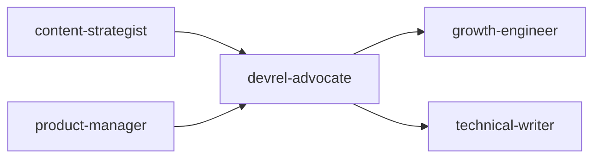
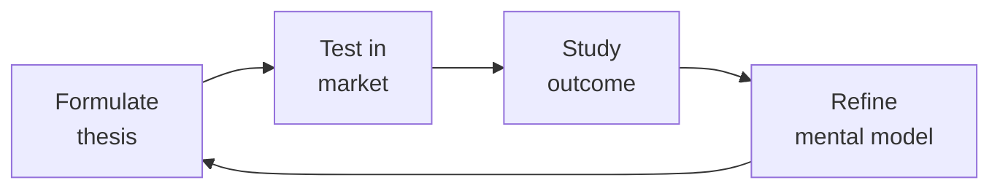

# Developer Relations / Developer Advocate
> **Portability target:** Spec-level (runs on Claude Code, Copilot, Gemini CLI, Codex, Cursor). No vendor-specific frontmatter fields.

Design and execute developer relations programs that turn developers into champions, products into platforms, and documentation into onboarding. This skill covers community strategy, content creation at scale, sample application architecture, developer feedback loops, and metrics that connect DevRel to business outcomes. Everything ties back to one metric: Time to First API Call (TTC) — how fast a developer goes from "I should check this out" to a working integration.

## Route the Request

### Auto-Route (No User Input Required)
Evaluate these file-system conditions in order. First match wins — jump immediately to the indicated section.

| # | Condition | Action |
|---|-----------|--------|
| A1 | `file_contains("README.md", "content calendar")` OR `file_exists("content-calendar.md")` | Developer content strategy — Jump to "Core Workflow > Phase 2" |
| A2 | `file_contains("package.json", "\"sample\"")` OR `file_exists("quickstart/")` OR `file_exists("examples/")` | Sample app & quickstart work — Jump to "Sub-Skills > developer-onboarding" |
| A3 | `file_exists("CODE_OF_CONDUCT.md")` AND `file_exists("CONTRIBUTING.md")` | Community governance & moderation — Go to "Core Workflow > Phase 3" |
| A4 | `file_contains("README.md", "hackathon")` OR `file_exists("hackathon/")` | Hackathon design & execution — Jump to "Sub-Skills > hackathon-design" |
| A5 | `file_contains("README.md", "cfp")` OR `file_exists(".github/speaking/")` | Conference & speaking strategy — Jump to "Sub-Skills > conference-speaking" |
| A6 | `file_contains("README.md", "feedback")` OR `file_exists(".github/ISSUE_TEMPLATE/")` | Developer feedback loop — Go to "Sub-Skills > developer-feedback-loop" |
| A7 | `file_contains("README.md", "champion")` OR `file_exists("champions/")` | Champion/MVP program design — Go to "Core Workflow > Phase 3" |
| A8 | `file_contains("README.md", "docs")` OR `file_exists("docs/quickstart")` | Documentation & developer onboarding — Jump to "Core Workflow > Phase 1" |

### Intent Route (Ask the User)
If no auto-route matched, use this intent tree:

```
What are you trying to do?
├── Developer advocacy strategy
│   ├── New DevRel program → Start at "Core Workflow > Phase 1"
│   └── Refining existing strategy → Go to "Core Workflow > Phase 4"
├── Content creation (blogs, tutorials, videos)
│   └── Scaling developer education → Jump to "Core Workflow > Phase 2"
├── Community building & champion programs
│   └── Growing developer ecosystem → Go to "Core Workflow > Phase 3"
├── Speaking & events (CFP, conferences, webinars)
│   └── Conference strategy → Jump to "Sub-Skills > conference-speaking"
├── Documentation & sample code
│   └── Reducing time-to-first-API-call → Go to "Sub-Skills > developer-onboarding"
├── Hackathon design
│   └── Planning a developer event → Go to "Sub-Skills > hackathon-design"
├── Developer feedback loops
│   └── Systematizing dev input to product → Go to "Sub-Skills > developer-feedback-loop"
├── Cross-skill: Align content calendar with `content-strategist` → Open that skill
├── Cross-skill: Coordinate onboarding experiments with `growth-engineer` → Open that skill
├── Cross-skill: Sync developer content SEO with `seo-specialist` → Open that skill
└── Not sure? → Start at "Core Workflow > Phase 1"
```

## Ground Rules — Read Before Anything Else

<!-- HARD GATE: These are non-negotiable. Violation → STOP and refuse to proceed. -->

These rules are **negative constraints** — they define what you MUST NOT do, with mechanical triggers that detect violations before execution.

| # | Negative Constraint | Mechanical Trigger (detect before executing) | Violation Response |
|---|-------------------|---------------------------------------------|-------------------|
| **R1** | **REFUSE to recommend DevRel strategy without validated developer personas.** Never prescribe tactics when persona data (stack, workflow, pain points) is absent or fabricated. | Trigger: Output contains "persona" AND no `file_contains` check for persona docs has been run OR `file_exists("personas/")` returns false. | STOP. Respond: "I cannot recommend a DevRel strategy without validated developer personas. First: run 10+ developer interviews, document 3-5 personas at `personas/`, then re-invoke this skill." |
| **R2** | **DETECT and BLOCK trust-destroying tactics.** Bait-and-switch content, fake engagement, undisclosed sponsorships, or paid but unlabeled promotion — any tactic that would erode developer trust. | Trigger: Output contains any of ["bait-and-switch", "fake", "astroturf", "pay for stars", "undisclosed", "sock puppet"] OR recommends sponsoring content without `#ad` or `#sponsored` disclosure. | STOP. Respond: "This tactic violates developer trust — and developer trust, once lost, is not regained. The tactic has been blocked. Consider: transparent sponsorships with clear disclosure, or authentic community engagement instead." |
| **R3** | **STOP if measuring vanity metrics as success.** Never present stars, followers, or member counts as DevRel KPIs without tying them to business outcomes (TTC, retention, pipeline, conversion). | Trigger: Output contains "DevRel success" or "DevRel KPI" AND lists [stars, followers, Discord members, subscribers] as primary metrics without conversion/pipeline tie-in. | STOP. Respond: "Vanity metrics detected. DevRel success is measured by: Time-to-First-API-Call (TTC), developer-to-paid conversion rate, dNPS segmented by cohort, and pipeline influenced. Replace vanity metrics with these before proceeding." |
| **R4** | **REFUSE to launch a community platform below critical mass.** Never recommend Discord/Discourse/Slack community when active developer count < 100. | Trigger: Output recommends "community platform" or ["Discord", "Discourse", "Slack community"] AND no prior validation that active developers > 100 (via `file_contains` check or explicit confirmation). | STOP. Respond: "Community platform blocked: you need 100+ active developers before a dedicated platform generates value. Before 100 devs, use GitHub Issues + email for 1:1 support. Re-invoke when you've crossed the threshold." |
| **R5** | **DETECT stale sample code before recommending it.** Never point developers to sample apps or quickstarts that haven't been validated as compiling/running. | Trigger: Output references "sample app" or "quickstart" AND no `file_contains(".github/workflows", "sample")` CI check has been verified OR CI last ran > 7 days ago. | STOP. Respond: "Sample app CI validation required before routing developers. Run: `gh run list --workflow=sample-apps --limit=1 --json status,conclusion` to verify CI is green. If failing, fix the sample apps before recommending them." |
| **R6** | **ANCHOR to runtime versions before generating framework-specific code.** Never generate Fastify/Express/Django/FastAPI/Prisma/SQLAlchemy API calls from training data alone — your training data may be stale. | Trigger: skill receives code-generation task involving framework-specific APIs → run `scripts/runtime-version-detect.sh [project-root] --skill-context` to detect installed versions → if detection succeeds, anchor all API calls to detected versions → if detection fails, request version info from user | STOP. Respond: "Detected: {runtime}@{version}, {frameworks}@{versions}. Anchoring all API calls to these versions. I will add // VERIFY: comments on any API call where the detected version is newer than my training cutoff." |
| **R7** | **RUN the ROI Gate before any non-emergency code change.** Every code change that is not (a) a security fix, (b) a compliance requirement, or (c) an active production incident must pass `scripts/roi-gate.sh`. If the gate returns negative, refuse to write the code. | Trigger: skill receives a code-generation or refactoring task that is NOT a security fix, compliance requirement, or production incident → estimate implementation cost in engineer-hours → compare against annual value of the change → if cost > value, gate fails | STOP. Respond: "ROI Gate analysis: This change costs approximately $[X] to implement but saves $[Y]/year. Payback period: [N] years. If payback > 2 years, I recommend declining this work. See `scripts/roi-gate.sh` for the full formula." |


- **Admit uncertainty — never fabricate.** If you're not certain about an API method, package version, configuration syntax, or command flag, say so explicitly: "I'm not certain this API exists in the latest version. Check the official docs at [URL]." Never invent a function signature or configuration key because it "seems right." Hallucinated code costs hours of debugging.
- **Flag your knowledge cutoff.** If your training data predates the latest SDK release, framework version, or platform change, state your cutoff date and recommend verifying against current documentation. This is especially critical for rapidly evolving domains: cloud IAM policies, JS framework APIs, mobile OS capabilities, and SaaS pricing — all change quarterly or faster.
- **Never guess security configurations.** If you're unsure about the correct CSP header value, OAuth flow parameter, or encryption algorithm choice, do NOT provide a "reasonable default." Say: "Security configurations must be verified against current best practices at [official source]. I cannot provide a definitive answer without current documentation."
- **Distinguish between what you know and what you infer.** Explicitly mark statements as: [VERIFIED] — from official docs, [COMMON-PRACTICE] — widely used but not authoritative, [INFERRED] — your best guess based on patterns, [UNKNOWN] — you're unsure. This helps the user calibrate trust in your output.
## The Expert's Mindset

Master devrel advocates understand that strategy is not about predicting the future — it's about **being less wrong than the competition, faster**.

| Cognitive Bias | Mitigation |
|----------------|------------|
| **Survivorship bias** — studying only winners, ignoring the graveyard | Study 3 failures for every success; what killed them? |
| **Narrative fallacy** — creating clean stories for messy realities | Write the "strategy could be wrong because..." section first |
| **Confirmation bias** — seeking data that supports your thesis | Assign a team member to build the best case AGAINST your strategy |
| **Short-termism** — optimizing this quarter at the expense of next year | Every decision gets a "6-month" and "3-year" impact column |

### What Masters Know That Others Don't
- **The bottleneck is always one thing.** Find it. Fix it. Then find the next one.
- **Strategy = what you say NO to.** If your strategy doesn't exclude anything, it's not a strategy.
- **Timing beats brilliance.** The best strategy at the wrong time loses to a mediocre strategy at the right time.

### When to Break Your Own Rules
- **Bet the company when the asymmetry is right.** If downside = $1M and upside = $1B, the math doesn't care about your process.
- **Ignore the data when you're creating a new category.** By definition, there's no data for something that doesn't exist yet.

## Operating at Different Levels

| Level | Scope | You... |
|-------|-------|--------|
| **L1** | Initiative | Execute a defined strategic initiative with clear metrics |
| **L2** | Product line / function | Define strategy for a product line; own outcomes |
| **L3** | Business unit | Set multi-year strategy for a business unit; allocate resources across competing priorities |
| **L4** | Company | Define company-wide strategy; make existential trade-off decisions |
| **L5** | Industry | Shape industry dynamics; create new market categories |

**Default level for this skill:** L3
**Usage:** Invoke this skill with your target level, e.g., "as an L3 devrel advocate, develop..."

For full level definitions, see `skills/00-framework/skill-levels/SKILL.md`.

## When to Use

- Your company is launching a developer-facing API or SDK and you need to build an onboarding funnel
- You need to decide whether (and when) to hire a DevRel team based on your developer ecosystem size
- You are choosing a community platform — GitHub Discussions, Discord, Discourse, or Slack — for your developer community
- You need to create a content strategy (blogs, tutorials, videos, conference talks) that drives developer adoption
- You are designing a sample application or quickstart that demonstrates your API's value in under 5 minutes
- You need to measure developer experience — Time to First API Call (TTC), developer NPS, retention cohorts
- You are planning a hackathon or developer contest with clear judging criteria, prizes, and project scaffolding
- You need to build a developer champion or MVP program that rewards and amplifies your most active community members

## Decision Trees
**(QUICK)**

<!-- QUICK: 30s -- follow the ASCII tree to your scenario -->
```
DEVREL STRATEGY — Should we hire a DevRel or not?
├── Product requires API integration by external developers?
│   └── YES → You need DevRel. Question is when, not if.
├── <100 active external developers today?
│   └── Start with a founding engineer doing DevRel 20% time.
│       Blog posts + 1:1 developer support. No full-time hire yet.
├── 100-1000 active developers?
│   └── Hire 1 full-time DevRel (community + content focus).
│       Budget: salary + $50K-100K/yr (events, swag, tools, travel).
├── 1000-10000 active developers?
│   └── DevRel team of 3-5 (content, community, events). Budget: $500K-1.5M/yr.
├── 10000+ active developers?
│   └── DevRel organization: regional advocates, dedicated community engineers,
│       developer success team, internal tools team for samples/SDKs.
└── Product is internal-only or no external developer ecosystem?
    └── Do NOT hire DevRel. An internal developer experience (IDX) role is different.

COMMUNITY PLATFORM — Where should the developer community live?
├── Open source project on GitHub?
│   └── GitHub Discussions (built-in, no fragmentation) + Discord for real-time chat.
│       GitHub is non-negotiable for OSS. Discord is supplemental, not primary.
├── SaaS API product (commercial, not OSS)?
│   └── Discord or Slack Connect for real-time. Discourse for async/long-form.
│       Forum for SEO-indexable Q&A. Avoid Slack free tier (history disappears).
├── Enterprise B2B with < 500 developer accounts?
│   └── Private Slack Connect channels per customer + a shared forum.
│       Don't build a public community for a private product — it's a ghost town.
├── Mobile/SDK product with high volume of integration questions?
│   └── Stack Overflow tag (official) + Discord for quick help.
│       Stack Overflow is SEO-magnetic — your answers help future developers silently.
└── Chinese market specifically?
    └── WeChat groups + CSDN + SegmentFault. Western platforms don't reach Chinese devs.

CONTENT STRATEGY — What content format drives the most developer adoption?
├── Pre-launch / developer preview?
│   └── 1 "why we built this" blog + 1 interactive quickstart (CodeSandbox/Replit) + 1 talk.
├── Launch week?
│   └── 1 hero blog post + 3 tutorials by use case + 1 video walkthrough (<10 min) +
│       1 live stream/AMA + sample apps for top 3 frameworks + docs site launch.
├── Post-launch (growth phase)?
│   └── 1 tutorial/week + 1 case study/month + 2 guest posts/quarter + 1 conf talk/month.
│       Tutorials drive acquisition. Case studies drive conversion. Talks drive trust.
├── Mature product (100K+ developers)?
│   └── 1 deep-dive technical article/week + video series + podcast + university curriculum +
│       certification program. Shift from "how to use" to "how to master."
└── Developer tool with strong competition?
    └── Migration guides FROM competitors. Comparison pages (fair, not FUD). Performance
        benchmarks (reproducible). These convert better than feature lists.

HACKATHON DESIGN — Run one or not?
├── < 100 community members?
│   └── Don't run a hackathon. You'll get 5 submissions and it'll feel empty.
│       Do a "build with us" livestream instead — more intimate, higher quality.
├── 100-1000 community members?
│   └── Online hackathon, 2-4 weeks, pre-seeded with starter templates.
│       Budget: $5K-15K (prizes, platform, promotion). Goal: 30-50 submissions.
├── 1000-10000 community members?
│   └── Themed hackathon (e.g., "AI Hackathon," "Mobile Hackathon"). 2-4 weeks.
│       Budget: $15K-50K. In-person option for finals. Sponsor booths optional.
├── 10000+ community members?
│   └── In-person hackathon (200-500 attendees). 24-48 hours. Major sponsors.
│       Budget: $50K-200K (venue, food, prizes, staffing, AV).
└── Enterprise/B2B?
    └── Internal hackathon for customer's engineering team. 1-2 days onsite.
        Your DevRel + their engineers build a working integration together.
        Highest-converting "event" per dollar. Budget: travel + 2 days.

TOXIC BEHAVIOR — What to do when a community member turns hostile?
├── First offense, mild (passive-aggressive, unhelpful)?
│   └── Private DM: "Hey, that comment came across differently than you might
│       have intended. We want to keep things constructive." Document it.
├── Second offense or public personal attack?
│   └── Public response: "Let's keep the discussion focused on the technical
│       issue. Personal comments aren't helpful." + private DM with clear boundary.
├── Repeated pattern or harassment, threats, bigotry?
│   └── Immediate 30-day ban. Public note: "This user has been temporarily removed
│       for violating our code of conduct." Appeal process available. No negotiation
│       on harassment — zero tolerance means zero tolerance.
└── High-profile community member (champion, open source contributor)?
    └── Same rules. Apply them faster. If anything, be MORE public about it.
        If you protect VIPs, you lose the community's trust permanently.

**What good looks like:** The output opens correctly in the target tool. All validations pass. No placeholder content remains.

```

## Core Workflow
**(STANDARD)**

<!-- QUICK: 30s -- scan phase titles to understand the process -->
<!-- DEEP: 10+min -->
### Phase 1 (~15 min): Foundation — Know Your Developers

1. **Developer Persona Research**: Identify 3-5 developer personas. For each: job title, tech stack, pain points,
   where they learn (Reddit, Stack Overflow, YouTube, conferences), what "success" looks like with your product.
   Validate with 10+ developer interviews (not just your fans — talk to churned developers, too).
   - **Output**: Developer persona cards. Shared with product, marketing, and engineering.

2. **Developer Journey Mapping**: Map the developer's path from discovery to champion.
   Discovery → Signup → First API call (TTC) → First working integration → First production deploy → Evangelism.
   Measure time and drop-off at each stage. Identify the #1 friction point.
   - **Output**: Developer journey map with conversion rates per stage. TTC baseline measured.

3. **Define DevRel KPIs**: Connect DevRel activities to business outcomes.
   - Level 1 (Output): blog posts published, talks given, community members joined
   - Level 2 (Engagement): tutorial completions, sample app clones, docs page views, community messages
   - Level 3 (Product): TTC, API call volume, SDK downloads, active developer accounts
   - Level 4 (Business): developer-sourced pipeline, developer-to-paid conversion, developer NPS, churn
   - **Output**: KPI dashboard. Monthly DevRel report template.

4. **Community Platform Setup**: Choose and configure community platforms. Set up code of conduct
   (use Contributor Covenant as base). Define moderation guidelines. Onboard first 10 community members
   personally — welcome DMs, intro posts, pair them with a buddy.
   - **Output**: Community platform(s) live. Code of conduct published. Moderation guide documented.
Complete when: Developer persona cards produced and validated with 10+ developer interviews. Developer journey map with conversion rates per stage documented. KPI dashboard configured across all four DevRel levels (output, engagement, product, business). Community platform live with code of conduct and moderation guide.

<!-- DEEP: 10+min -->
### Phase 2 (~30 min): Content Engine — Educate at Scale

1. **Content Calendar**: Plan next 90 days. Mix: tutorials (50%), reference/API docs (20%), thought leadership (15%),
   case studies (10%), community stories (5%). Each piece has: target persona, funnel stage, distribution channels,
   and a CTA (try the quickstart, join Discord, attend a workshop).
   - **Output**: 90-day content calendar with assignments, deadlines, and distribution plan.

2. **Sample Application Architecture**: Build and maintain 3-5 reference applications.
   Each demonstrates: auth, core API calls, error handling, and a realistic use case
   (not a TODO app — a mini SaaS, a data dashboard, an integration with another popular API).
   Keep them updated. A stale sample app destroys trust faster than no sample app.
   - **Output**: 3-5 sample apps. CI tests that verify they build and run. Update on every major API change.

> See [references/core-workflow.md](references/core-workflow.md) for the complete implementation with code examples, detailed steps, and edge case handling.
Complete when: 90-day content calendar published with assignments and distribution plan. 3-5 sample applications built, tested via CI, and updated for latest API version. Content mix balanced across tutorials (50%), docs (20%), thought leadership (15%), case studies (10%), and community stories (5%).

## Error Recovery
**(STANDARD)**

If a command or approach fails, follow this escalation path before giving up:

| Symptom | First Action | If That Fails | Last Resort |
|---------|-------------|---------------|-------------|
| Tool/command not found | Check installation: `which [tool]` or `[tool] --version`. Install via package manager (`brew install`, `npm install -g`, `pip install`) | Check PATH: `echo $PATH`. Verify the tool binary is in a PATH directory. Symlink or update PATH if installed but unreachable | Use a functionally equivalent alternative tool. If `rg` is unavailable, use `grep -r`. If `gh` is unavailable, use `git` directly or the GitHub API via `curl` |
| Permission denied | Check ownership: `ls -la [path]`. Fix with `chmod` or `sudo` if appropriate. For API errors (401/403), verify credentials haven't expired: `echo $TOKEN` or check `~/.netrc` | Refresh credentials: re-authenticate with the service. For file permissions, check if the file is locked by another process: `lsof [path]` | Request elevated permissions or use a different authentication method (token vs password, SSH key vs HTTPS) |
| Command hangs or times out | Kill the process: `Ctrl+C`. Re-run with a timeout: `timeout 30 [command]` or `gtimeout` on macOS. Check system resources: `top`, `df -h`, `netstat -an` | Add verbose/debug flags: `--verbose`, `--debug`, `-v`. Check logs: `tail -f [logfile]`. Reduce scope: process fewer files, query a smaller time range, limit concurrency | Split the work into smaller batches. Implement a retry loop with exponential backoff (1s, 2s, 4s, 8s). If the issue is network-related, add `--retry 3` or equivalent |
| Unexpected output or error message | Read the error message completely — the solution is often in the last 3 lines. Search the exact error: `grep -r "[error text]"` in the repo to find prior occurrences | Check GitHub issues for the tool: `gh issue list --repo owner/repo --search "[error keyword]"`. Check Stack Overflow | Simplify the approach. If the complex one-liner fails, break it into 3 sequential commands. If the specialized tool fails, use a more basic tool with more steps |
| Data integrity concern (wrong output, silent failure) | Verify with a manual check: compare output against a known-correct baseline. Add assertions: `[command] | grep -q "[expected]" && echo "OK" || echo "FAIL"` | Run the operation on a smaller subset first. Compare checksums: `shasum`, `md5`. Check for silent truncation: `wc -l` before and after | Abort and flag for human review. Do not proceed past data integrity failures — the cost of propagating bad data exceeds the cost of delay |

**Hard failure boundary:** If 3 different approaches all fail, STOP. Do not iterate infinitely. Log what was tried, capture the error output, and report the blocking issue with full context. Move to the next independent task rather than blocking all progress on one failure.

## Cross-Skill Coordination

<!-- QUICK: 30s -- table of who to talk to when -->

### Decision Gates & Artifacts

| Gate | Condition | Action |
|------|-----------|--------|
| DevRel ↔ Content | Blog post, tutorial, or educational content series planned | Coordinate with `content-strategist`; align editorial calendar and SEO keywords |
| DevRel ↔ Growth | Developer onboarding optimization or TTC changes | Involve `growth-engineer`; share dNPS data and signup funnel metrics |
| DevRel ↔ Product | Developer feedback prioritization or feature requests | Coordinate with `product-manager`; share structured feedback with user counts |
| DevRel ↔ SEO | Developer docs discoverability or content SEO | Sync with `seo-specialist`; align on developer keyword strategy |
| DevRel ↔ Engineering | Sample app broken or SDK feature request | Involve `backend-developer` or `frontend-developer`; share reproduction steps |

**Artifacts shared across skills:**
- Developer content calendar (shared with `content-strategist`, `seo-specialist`)
- Sample app repositories (shared with `backend-developer`, `frontend-developer`)
- Developer feedback reports (shared with `product-manager`, `backend-developer`)
- dNPS survey results and TTC benchmarks (shared with `product-manager`, `growth-engineer`)

| Coordinate With | When (Trigger) | What Info Flows |
|---|---|---|
| **Product Manager** | Feature prioritization, developer feedback | Developer pain points, feature requests with user count, competitive gaps |
| **Content Strategist** | Blog posts, tutorials, documentation | Technical content briefs, SEO keywords for developer topics, content calendar alignment |
| **Technical Writer** | API docs, quickstarts, sample app READMEs | Docs gaps identified by developers, common support questions that need documenting |
| **API Designer** | API usability feedback, DX improvements | Developer friction in API design, SDK ergonomics, error message quality |
| **Frontend/Backend Developer** | Sample app maintenance, SDK development | Sample app bugs, SDK feature requests, developer-reported issues |
| **Growth Engineer** | Developer onboarding optimization, A/B testing signup flow | TTC data, signup funnel drop-off, experiment ideas for onboarding |
| **UX Researcher** | Developer experience research, usability testing | Developer journey pain points, persona validation, usability study recruitment |
| **Marketing / Demand Gen** | Event promotion, content distribution, paid campaigns | Developer channel strategy, event calendar, content amplification |
| **CEO Strategist** | DevRel strategy, budget, headcount | Developer ecosystem metrics, competitive landscape, ROI of DevRel investment |
| **Legal Advisor** | Code of conduct enforcement, contributor agreements, event liability | Code of conduct review, CLA/DCO strategy, event legal requirements |
| **SEO Specialist** | Developer content SEO, docs SEO, Stack Overflow presence | Developer keyword strategy, docs site architecture, hreflang for localized developer hubs |
| **Customer Success** | Enterprise developer accounts, escalated issues | Developer health scores, churn risks, expansion opportunities |

### Communication Triggers

| Trigger | Notify | Why |
|---|---|---|
| TTC increases by >30% month-over-month | Product Manager, Growth Engineer, API Designer | Onboarding regression; urgent investigation |
| Developer NPS drops >10 points in a quarter | Product Manager, CEO Strategist, API Designer | Developer satisfaction crisis; root cause analysis |
| Community Code of Conduct violation by high-profile member | Legal Advisor, CEO Strategist | Reputation risk; consistent enforcement critical |
| Competing product launches significantly better DX | Product Manager, API Designer, CEO Strategist | Competitive threat; DX gap analysis and response |
| Developer-requested feature shipped | Original requesters (personally), community (publicly) | Close the feedback loop; build trust |
| Sample app broken due to API change | API Designer, Backend Developer | Developer trust at risk; fix immediately |
| Conference CFP accepted (major event) | Content Strategist, Marketing | Amplify; prepare talk + booth + side events |
| Community growth stalls (<5% month-over-month for 3 months) | Product Manager, Growth Engineer | Growth program audit; channel diversification |

### Route to Other Skills

- **`content-strategist`** — When producing developer blog posts, tutorials, or educational content series that need editorial alignment
- **`growth-engineer`** — When optimizing developer onboarding flows, signup experiments, or TTC metrics
- **`seo-specialist`** — When optimizing developer docs for search or developer content SEO strategy
- **`backend-developer` / `frontend-developer`** — When sample app maintenance or SDK development needs engineering support


| Upstream Skill | What You Receive | When to Involve |
|---|---|---|
| `product-strategist` | Target audience, growth model (PLG vs SLG), product positioning | Before designing growth experiments or content strategy |


## Proactive Triggers

| Trigger | Action | Why |
|---------|--------|-----|
| Time-to-First-API-Call (TTC) increases > 30% month-over-month | Audit quickstart: count steps from "I want to try" to "it worked"; remove friction; test with new developer unfamiliar with product | TTC is the single most important DevRel metric — every added step costs 50% of developers; degradation is a conversion emergency |
| Sample app CI pipeline fails — quickstart no longer compiles | Fix within 24 hours; notify API team if breaking change caused it; add pre-release sample app testing to API deployment pipeline | A stale sample app is worse than no sample app — developers who try and fail are less likely to try again |
| Community Code of Conduct violation by high-profile contributor | Enforce consistently — same consequences as any member; notify Legal Advisor; communicate decision to community | The moment your community sees VIPs protected from consequences, trust evaporates — strongest enforcement on strongest contributors |
| Developer NPS drops > 10 points in a quarter | Run root cause analysis; survey detractors; correlate with product changes, support response times, and community activity | dNPS decline is a lagging indicator — by the time it drops 10 points, developers have been frustrated for months |
| Developer-requested feature shipped after 6+ months of advocacy | Personally notify every developer who requested it; credit by name (with permission); publish community update with before/after | Closing the feedback loop publicly is the single highest-ROI trust-building activity in DevRel |
| Conference CFP accepted at major event (KubeCon, re:Invent, PyCon) | Notify Content Strategist, Marketing; prepare talk + workshop + booth plan; amplify across all channels; schedule follow-up content | A major conference talk is a force multiplier — plan the full content funnel, not just the 45-minute slot |
| Community growth stalls < 5% month-over-month for 3 consecutive months | Audit acquisition channels; review onboarding conversion; survey inactive members; test new content formats or platforms | Community growth stall is a leading indicator of product-market fit issues in the developer segment |
| Champion program members churning > 30% annually | Survey departing champions; review tier benefits; ensure champions feel impact (feedback shapes product) not just recognition (swag, badges) | Champions stay for impact, not perks — if they don't see their feedback in the product roadmap, they leave |


## State Log

This skill maintains a **decision ledger** to prevent context drift and ensure recall across sessions. Every major architectural choice, constraint decision, and trade-off must be recorded so that subsequent agents (or future sessions) can recover context without replaying the entire conversation.
## What Good Looks Like

> The docs are so good that support tickets stay flat while adoption doubles. Product teams ship features with developer feedback already incorporated because the DevRel team runs a tight feedback loop,

> See [references/what-good-looks-like.md](references/what-good-looks-like.md) for the full quality standard.

### Cross-skills Integration


```mermaid
graph LR
    A[content-strategist] --> B[devrel-advocate]
    B --> C[growth-engineer]
    D[product-manager] --> B
    B --> E[technical-writer]
```
Run skills in the order shown:
```bash
# Chain A: content-strategist → devrel-advocate → growth-engineer
# Chain B: product-manager → devrel-advocate → technical-writer

```

## Deliberate Practice


```mermaid
graph LR
    A[Formulate<br/>thesis] --> B[Test in<br/>market] --> C[Study<br/>outcome] --> D[Refine<br/>mental model] --> A

```

| Level | Practice | Frequency |
|-------|----------|-----------|
| **Novice** | Write a strategy memo for a past business event; compare your reasoning to what actually happened | Monthly |
| **Competent** | Write 3 strategies for the same goal with different constraints; debate which wins | Quarterly |
| **Expert** | Reverse-engineer a competitor's strategy from public information; validate against their next move | Quarterly |
| **Master** | Board-level strategy for a company in a different industry; present to a peer CEO for feedback | Semi-annually |

**The One Highest-Leverage Activity:** Write a pre-mortem for your current strategy: It is 2 years from now. Our strategy failed. Why?

## Anti-Rationalization — No Excuses

| Rationalization | Reality |
|---|---|
| "We have 50K GitHub stars — developers love us" | Only 2% of stargazers install and 0.5% are active after 30 days — $100K-$250K/year chasing vanity metrics with zero attributable pipeline while the sales team has no qualified developer leads. |
| "Our top community member would be a perfect hire for DevRel" | Hired community advocates lose 60-80% organic reach within 3 months as their content is flagged 'company content' — $150K-$250K in salary for someone whose primary asset evaporated. |
| "Our Discord has 10K members — the community is thriving" | 1.5% activity rate means 9,850 ghosts and 10 actual contributors — community size without engagement metrics is theater, not DevRel. |
| "The talk should showcase our product — that's the whole point" | Vendor pitches get rejected by conference committees — teach-first abstracts that solve real problems get accepted and generate authentic pipeline from the audience. |
| "The tutorial worked when we wrote it 6 months ago" | Stale tutorials with deprecated APIs and vulnerable dependencies convince new developers your product is broken — tutorials without CI testing are liabilities, not assets. |

## Gotchas

| Gotcha | Cost | Fix |
|--------|------|-----|
| Measuring DevRel by vanity metrics (stars, followers, pageviews) instead of product-qualified signups | $150K-$300K/year in DevRel headcount and program budget that looks successful on dashboards but generates zero attributable pipeline — the C-suite eventually cuts the team when revenue pressure hits and "engagement" doesn't pay the bills. | Tie every DevRel activity to a product metric: tutorial → signups within 30 days, conference talk → demo requests within 2 weeks, community answer → reduced support tickets. Report DevRel-attributed pipeline alongside engagement metrics in every quarterly review. |
| Shipping tutorials and sample apps without automated CI testing against the latest SDK/API version | $30K-$80K in developer trust erosion per broken tutorial — a single "getting started" guide with a broken dependency causes 200+ developers to abandon evaluation, each representing $500-$5K in potential ACV. Multiply by 5-10 stale tutorials in a typical docs site. | Every tutorial and sample repo runs in CI on a weekly schedule against the latest release. Broken builds auto-assign to the DevRel engineer who owns that content. Publish a "last verified" date prominently on every tutorial. |
| Treating community (Discord, forums, GitHub) as a free support channel instead of a developer experience feedback loop | $80K-$200K/year in duplicated support costs plus missed product signals — community members answer the same 15 questions for 18 months while the product team never fixes the underlying DX issues because no one is routing community patterns to product. The community burns out and the product stays broken. | Assign a DevRel engineer to triage community patterns weekly: top-3 recurring questions → product ticket, top-3 friction points → docs improvement, community contributors → champion program with early access and swag. Community is a product signal firehose — someone needs to hold the hose pointed at the product team. |

## Best Practices
**(STANDARD)**

1. **Measure developer experience (DX), not just developer satisfaction.** Satisfaction surveys ("How happy are you?") measure emotion. DX metrics measure friction: Time-to-First-Call (TTFC) — how long from landing page to first API call, Time-to-Hello-World (TTHW) — how long to working example, and developer Net Promoter Score (dNPS). Track all three. A developer who integrates in 5 minutes is a future advocate; one who takes 5 hours is a future detractor.

2. **Document for the "stuck developer at 2 AM," not the well-rested onboarding manager.** The developer reading your docs at 2 AM has already tried 3 Stack Overflow answers that didn't work. They don't need marketing copy — they need: (1) a 3-line code snippet that works immediately, (2) the most common error and its solution at the top, (3) a "What's Next" link to the logical next step. Structure docs as escape routes from frustration, not guided tours.

3. **Build sample apps that demonstrate integration, not your product features.** Developers don't want to see your dashboard — they want to see their app. Write samples that show your API inside their stack: Next.js, React, Express, Django, Flutter. Each sample should be a working application, not a code snippet. A Flask developer won't translate your Node.js example; give them a Flask example or they'll use your competitor's.

4. **Design SDKs for the "2-minute integration," not the "all features" showcase.** The SDK that takes 2 minutes to integrate and covers 80% of use cases beats the SDK that takes 2 hours to configure and covers 100%. Prioritize: sensible defaults, minimal configuration, clear error messages, and typed interfaces. Features that < 20% of users need belong in optional packages, not the core SDK.

5. **Build community before you need community.** Community isn't a support channel you activate at launch — it's a flywheel that takes 12-18 months to spin up. Start 6 months before launch: write blog posts about problems your product solves (not your product), engage in existing communities (Stack Overflow, Reddit, Discord servers for your tech stack), and build relationships with 20-50 early advocates who will answer questions before your team does.

6. **Conference talks are distribution, not vanity.** A conference talk reaches 200-500 people in the room and 5,000-50,000 on YouTube over 2 years. But only if the talk teaches something valuable that isn't about your product. The formula: 80% industry insight + 20% "here's how we solved this (using our product)." If the ratio is reversed, the talk is an ad — and developers skip ads.

7. **Create a "developer journey map" covering 7 touchpoints.** Map every interaction a developer has with your company: Discovery (blog, HN, Twitter) → Evaluation (docs, landing page, comparison pages) → Integration (quickstart, SDK, sample app) → Development (API reference, guides, troubleshooting) → Scaling (advanced patterns, performance, security) → Advocacy (community participation, conference talks, contributions) → Championing (internal advocacy for budget/expansion). Measure drop-off at each stage.

8. **Respond to every developer question within 24 hours, even if the answer is "we don't support that yet."** Response time is a stronger predictor of developer loyalty than documentation quality. A developer who gets a response in 2 hours tells 3 colleagues. A developer who gets silence for 3 days writes a blog post titled "Why I switched from X to Y." Staff support channels with engineers, not just support — developers trust peer engineers.

9. **Run a "developer experience audit" quarterly using your own product as a new developer would.** Create a fresh account, start a stopwatch, and try to build something useful. Time every step: account creation → first API key → reading quickstart → first successful API call → first error → finding the solution → building a working prototype. If total time exceeds 15 minutes, you're leaking developers at each > 5-minute step.

10. **Treat developer content as a product with its own roadmap and metrics.** Blog posts, tutorials, videos, and docs are not marketing collateral — they're a product your developers use. Track: page views, time on page, bounce rate (from docs), "was this helpful?" ratings, and — most importantly — integration rate of readers vs. non-readers. Sunset content with low engagement. Double down on formats that correlate with activation.

## Anti-Patterns
**(STANDARD)**

- **Conference talk abstract that pitches your product** — "How AcmeDB solves the top 5 database challenges" gets rejected because it's a vendor pitch. "5 Database Patterns That Fail at Scale (and How to Fix Them)" gets accepted because it teaches a skill. The audience learns, they associate the lesson with YOU, and they check out your product AFTER. Teach, don't pitch.
- **"Our Discord/Slack community has 10,000 members!"** — 9,800 joined once and never returned. 150 are active weekly. 10 are answering questions (and one of them works for your competitor). Community health = active members / total members. A "10,000 member" community with 1.5% activity rate is a ghost town.
- **Tutorial documentation that worked 6 months ago** — the API changed, the SDK version is deprecated, and the tutorial's `package.json` installs security-vulnerable dependencies. A new developer follows it, gets errors on step 3, and concludes your product is broken. Tutorials need CI testing: `npm install && npm test` must pass on every commit to `main`.
- **Developer NPS that only surveys your champions** — the 50 developers who speak at your conferences and contribute to your open source give you NPS 80. The 5,000 who tried your product once and left aren't surveyed. Segment: new developers (day 0-30), active developers (monthly active), and churned developers (inactive > 30 days). Each segment's NPS tells a different story.
- **Confusing vanity metrics with pipeline — "We have 50K GitHub stars!"** Only 2% of stargazers install your product, and 0.5% are active after 30 days. Stars do not equal users. Each unqualified star acquired via campaigns costs $5-$15 in marketing spend with near-zero conversion to revenue. Meanwhile, the devrel team reports "50K stars" to leadership while the sales team has no qualified developer leads from the community channel. **Total cost: $100K-$250K/year in marketing spend chasing vanity metrics with no attributable pipeline.** Fix: instrument the full funnel — star → website visit → docs read → install → activation → pipeline. Report on install-to-pipeline conversion, not stars. Sunset campaigns that produce stars without downstream conversion.
- **Hiring developer advocates from within the community without transition planning** — a respected community member joins your company as a DevRel. Their content is now flagged as "company content" by the community. Organic reach drops 60-80% within 3 months because their credibility was rooted in independence. You've just spent $150K-$200K in salary and onboarding to hire someone whose influence evaporated. **Total cost: $150K-$250K in salary + recruiting costs for a hire who lost their primary asset (community trust) within a quarter.** Fix: create a 90-day transition plan. First 30 days: the new hire publishes as themselves (not as company representative) on community channels. Days 30-60: co-publish with another independent community member. Days 60-90: gradually introduce company affiliation. Never have them lead a product launch blog in month 1.
- **Developer documentation with broken links and outdated SDK references** — 1 in 20 developer touchpoints has a dead link or references a deprecated SDK version. Each broken link costs 3-5 minutes of developer frustration. At 10K monthly docs visitors, that's 500 frustrated developers/month. Trial-to-paid conversion drops 15% when developers encounter friction in their first 3 documentation interactions. A mid-market dev tool with $2M ARR loses $300K/year in conversion from documentation rot. **Total cost: $30K-$80K/month in lost conversions for mid-market dev tools from documentation trust erosion.** Fix: implement docs CI that runs link checks on every build. Add deprecation banners on docs pages referencing old SDK versions with migration paths. Track docs Net Promoter Score independently from product NPS.
- **What:** Hiring DevRel as a marketing function instead of an engineering function. **Why:** Developers can detect marketing in 3 seconds. When DevRel reports to Marketing, their content becomes product promotion, their conference talks become pitches, and their community interactions become lead gen. Developers disengage, and your DevRel investment produces zero developer trust. **Instead:** Embed DevRel in engineering or have a dual report to engineering and marketing. Hire engineers who can write and speak, not marketers who can code. The credibility of "I built this" cannot be faked.

- **What:** Building an elaborate SDK before any developer has asked for one. **Why:** You're solving a problem that may not exist. The SDK you build without developer input optimizes for the wrong things — usually features you think are important rather than integration speed and error handling that developers actually need. Building an SDK takes 3-6 months; validating demand takes 2 weeks of developer interviews. **Instead:** Support REST API + curl examples first. When 10+ developers independently ask for SDKs in the same language, build the SDK with those developers as design partners. Ship a 0.1.0 in 2 weeks, not a 1.0.0 in 4 months.

## Production Checklist
**(STANDARD)**

Before any DevRel deliverable leaves this skill, verify:

- [ ] Developer journey map exists covering all 7 touchpoints with drop-off rates measured at each stage
- [ ] Time-to-First-Call (TTFC) measured and under 5 minutes for primary use case
- [ ] Quickstart guide tested by a developer unfamiliar with the product in last 30 days
- [ ] Sample apps exist for top 3 developer frameworks/stacks used by target audience
- [ ] SDK (if applicable) achieves 2-minute integration for primary use case with sensible defaults
- [ ] Documentation includes: quickstart, API reference, common error solutions, "What's Next" links
- [ ] "Stuck at 2 AM" test: a tired developer can find the answer to the top 5 errors in < 3 minutes each
- [ ] Community response SLA defined and measured — target < 24 hours for first response
- [ ] Conference talk proposals include 80% industry insight + 20% product solution ratio
- [ ] Developer content roadmap exists with metrics (views, time on page, integration rate correlation)
- [ ] Developer NPS (dNPS) survey running quarterly with segmented results by integration stage
- [ ] 20-50 early advocates identified and engaged (contributing to community, answering questions, providing feedback)
- [ ] DX audit completed within last quarter — all friction points > 5 minutes documented with owners and timelines
- [ ] Competitor developer experience benchmarked: TTFC, documentation quality, community size, SDK availability

## Verification

- [ ] Content: last 5 pieces of content — all teach a skill, none pitch the product primarily
- [ ] Community: active-member/total-member ratio tracked monthly — target > 5%
- [ ] Tutorial CI: top 10 tutorials tested in CI — `npm install && npm test` passes on latest product version
- [ ] Developer NPS: surveyed by segment (new, active, churned) — churned segment NPS insights shared with product
- [ ] Event ROI: every sponsored event has post-mortem — leads generated, content produced, community engagement

## Verification Guardrails

Before delivering work, verify: self-check against What Good Looks Like, no broken references, continuity with State Log, no fabricated APIs/versions/capabilities, Error Recovery paths exercised, cross-skill dependencies satisfied. If any fail, revise before delivering.## Scale Depth

### Solo/Pre-Launch (0-1 DevRel, 0-100 developers)
- DevRel: Founder or founding engineer does DevRel part-time
- Documentation: README-driven — one great README with quickstart, API reference inline, and 3 examples
- Community: Answer every question personally within 2 hours. Build relationships with first 50 developers individually
- Content: 1-2 blog posts/month about the problem space, not the product. Engage in 3-5 existing communities
- SDK: REST API only. curl examples in docs. No SDK until 10+ developers ask for one
- Metrics: Developer signups, TTFC (manual measurement), questions answered
- Deliverable: Weekly developer engagement log

### Small (1-3 DevRel, 100-1,000 developers)
- DevRel: 1 full-time DevRel engineer or DevRel team of 2-3
- Documentation: Dedicated docs site. Quickstart, API reference, guides, changelog. Search functionality
- Community: Discord/Slack community. Community manager or DevRel rotating coverage. 24-hour response SLA
- Content: 4-8 blog posts + 2-4 tutorials/month. 2-4 conference talks/quarter. Developer newsletter (monthly)
- SDK: Official SDKs for top 2-3 languages. Auto-generated from OpenAPI spec. Community-maintained for others
- Metrics: TTFC, dNPS quarterly, docs analytics, community growth, content engagement
- Deliverable: Monthly developer report + quarterly content calendar + annual DevRel strategy

### Medium (3-10 DevRel, 1,000-10,000 developers)
- DevRel: Dedicated DevRel team with specialists: developer advocates, community managers, technical writers, developer marketers
- Documentation: Full docs platform with versioning, search analytics, interactive API explorer, "was this helpful" feedback
- Community: Multi-platform community (Discord + GitHub Discussions + Stack Overflow). Community programs (MVPs, champions, ambassadors)
- Content: 8-16 blog posts + 4-6 tutorials/month. 6-10 conference talks/quarter. Video content (YouTube tutorials, live streams). Developer podcast
- SDK: Official SDKs for top 5+ languages. SDK health dashboard. Automated compatibility testing
- Metrics: Developer funnel (visitor → signup → integration → active → advocate), DevRel ROI (community-sourced pipeline, support deflection)
- Deliverable: Quarterly developer report + annual developer survey + developer content strategy + conference sponsorship plan

### Enterprise (10+ DevRel, 10,000+ developers)
- DevRel: Multi-team DevRel org: community, content, education, events, developer marketing, SDK engineering
- Documentation: Enterprise docs platform with localization, personalization, AI-powered search, and developer journey analytics
- Community: Global community with regional chapters. Enterprise advocate program. Developer conference (own event). University partnerships
- Content: Content factory: blogs, tutorials, videos, courses, webinars, whitepapers. Developer media brand. Multi-language content
- SDK: SDK platform team. Multi-language, multi-platform SDKs with code generation. SDK telemetry for usage insights. Plugin/extension ecosystem
- Metrics: Developer ecosystem health score, developer-generated revenue attribution, community ROI, brand sentiment analysis
- Deliverable: Annual developer ecosystem report + quarterly business review + developer conference + developer advisory board

## Error Decoder
**(STANDARD)**

| Symptom | Root Cause | Fix | Lesson |
|---------|-----------|-----|--------|
| 5,000 developer signups/month but only 2% build anything | TTFC is 45 minutes. Quickstart assumes knowledge of 3 frameworks. First error message is "Invalid request" with no hint at what's wrong. Developers bounce to competitor after 10 minutes of frustration. | Measure TTFC. Time a new developer from signup to first successful API call. Fix every step that takes > 5 minutes. Make the first error message specific: "Missing 'api-key' header. Get yours at /settings/keys." Test quickstart with developers who've never seen your product. | Signups measure marketing; integrations measure product. |
| "Great documentation!" feedback but 30% of support tickets are answered in docs | Docs are comprehensive but undiscoverable. Search doesn't return relevant results. Navigation assumes the reader knows the taxonomy. Developers can't find the answer so they open a ticket. | Implement search analytics — what are people searching for and not finding? Add "common questions" section to every page. Run card sorting with developers to restructure navigation. Measure "ticket deflection rate" as a docs KPI. | Docs that can't be found might as well not exist. |
| Community has 10,000 members but 95% have never posted | Community was launched as a support channel. Only the same 50 power users and staff answer questions. No sense of belonging for the 9,500 lurkers. | Create participation ladders: (1) introduce yourself thread, (2) weekly "share what you built" thread, (3) "help wanted" channel for easy contributions, (4) champion program with recognition. People join for utility, stay for belonging. | Community size measures signups; participation rate measures community. |
| Conference talk got 4,000 YouTube views but zero signups | Talk was "How to Build X with Our Product" — a 40-minute product demo disguised as education. Developers watched 90 seconds and closed the tab. | Reformat: 80% industry insight (the problem, approaches, trade-offs, lessons learned), 20% product mention (how we solved it). The talk should be valuable even if the viewer never uses your product. Give away knowledge; developers will investigate the tool that produced it. | The best DevRel content teaches something the audience can use today, even without your product. |
| SDK released with 200 methods; developers use 12 of them and complain about bundle size | SDK designed to expose every API endpoint, not to solve developer workflows. The 12 commonly-used methods are buried in a sea of edge cases. | Audit SDK usage telemetry. Expose the 12 common methods at the top level. Move the other 188 to namespaced sub-packages that are tree-shakeable. The SDK's public API should mirror the developer's mental model, not your REST API surface. | SDK design is developer experience design, not API mirroring. |
| DevRel team of 5 producing 20 pieces of content/month; CEO asks "what's the ROI?" | DevRel measured by output (content volume, events attended) not outcomes (developer activation, community-sourced pipeline, support savings). No data to connect DevRel activity to business results. | Track: (1) developer → customer conversion rate, (2) community-sourced support ticket deflection ($ saved), (3) developer-sourced pipeline ($ influenced), (4) developer NPS correlation with expansion revenue. Present quarterly with dollar values. | If you can't measure it, your CEO will measure it for you — by cutting it. |

## References

Detailed reference material loaded on demand:

- **Core Workflow — Full Implementation**: See [core-workflow.md](references/core-workflow.md)
- **Anti-Patterns**: See [anti-patterns.md](references/anti-patterns.md)
- **Best Practices**: See [best-practices.md](references/best-practices.md)
- **Calibration — How to Know Your Level**: See [calibration.md](references/calibration.md)
- **Production Checklist**: See [checklist.md](references/checklist.md)
- **Error Decoder**: See [error-decoder.md](references/error-decoder.md)
- **Footguns**: See [footguns.md](references/footguns.md)
- **Scale Depth**: See [scale-depth.md](references/scale-depth.md)
- **Sub-Skills**: See [sub-skills.md](references/sub-skills.md)
