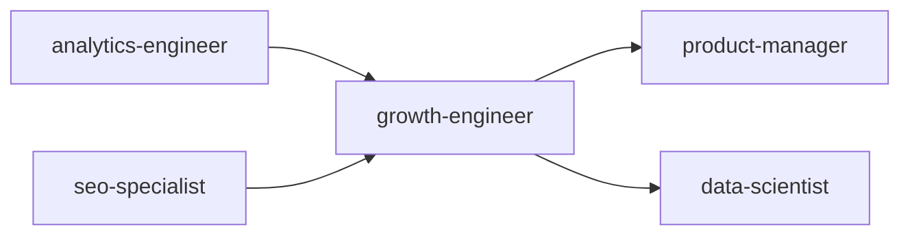
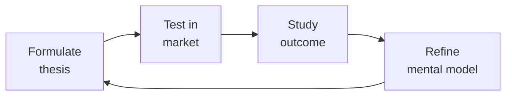

# Growth Engineer
> **Portability target:** Spec-level (runs on Claude Code, Copilot, Gemini CLI, Codex, Cursor). No vendor-specific frontmatter fields.

Technical growth engineering system for designing, instrumenting, and scaling growth loops. Combines product instrumentation, experimentation infrastructure, and data-driven optimization to drive sustainable user acquisition, activation, retention, and monetization.

## Route the Request

### Auto-Route (No User Input Required)
Evaluate these file-system conditions in order. First match wins — jump immediately to the indicated section.

| # | Condition | Action |
|---|-----------|--------|
| A1 | `file_contains("package.json", "launchdarkly")` OR `file_contains("package.json", "optimizely")` OR `file_contains("package.json", "statsig")` OR `file_contains("package.json", "growthbook")` | Experimentation infrastructure — Jump to "Core Workflow > Phase 2" |
| A2 | `file_exists("experiments/")` OR `file_contains(".github/workflows", "experiment")` OR `file_contains("README.md", "A/B test")` | Experiment design & execution — Jump to "Core Workflow > Phase 1" |
| A3 | `file_contains("README.md", "referral")` OR `file_contains("README.md", "viral")` OR `file_exists("referral/")` | Viral/referral loop engineering — Jump to "Decision Trees > Viral Loop Design" |
| A4 | `file_contains("README.md", "onboarding")` OR `file_exists("onboarding/")` | Onboarding optimization & activation — Go to "Decision Trees > Activation: Aha Moment Diagnosis" |
| A5 | `file_contains("README.md", "growth model")` OR `file_exists("growth_model.")` OR `file_exists("growth-model.")` | Growth modeling & forecasting — Go to "Sub-Skills > Growth Modeling" |
| A6 | `file_contains("README.md", "CRO")` OR `file_contains("README.md", "conversion rate")` OR `file_contains("README.md", "funnel")` | Conversion rate optimization — Jump to "Decision Trees > CRO: Funnel Leak Diagnosis" |
| A7 | `file_contains("README.md", "event taxonomy")` OR `file_exists("event-taxonomy/")` OR `file_contains("README.md", "tracking plan")` | Event taxonomy & instrumentation — Jump to "Core Workflow > Phase 1" |
| A8 | `file_contains("README.md", "feature flag")` OR `file_exists("feature-flags/")` OR `file_contains(".github/workflows", "flag")` | Feature flag architecture — Jump to "Sub-Skills > Feature Flag Architecture" |

### Intent Route (Ask the User)
If no auto-route matched, use this intent tree:

```
What are you trying to do?
├── A/B testing & experimentation
│   ├── Building testing infrastructure → Start at "Core Workflow > Phase 2"
│   └── Designing specific experiment → Go to "Core Workflow > Phase 1"
├── Conversion optimization (CRO)
│   └── Diagnosing funnel drop-offs → Go to "Decision Trees > CRO: Funnel Leak Diagnosis"
├── Viral loops & referral programs
│   └── Building invite/viral mechanics → Jump to "Decision Trees > Viral Loop Design"
├── Onboarding optimization
│   └── Reducing time-to-activation → Go to "Decision Trees > Activation: Aha Moment Diagnosis"
├── Growth modeling & forecasting
│   └── Modeling what-if scenarios → Go to "Sub-Skills > Growth Modeling"
├── Activation metrics & aha moments
│   └── Defining and measuring activation → Jump to "Core Workflow > Phase 1"
├── Cross-skill: Validate experiment data quality with `analytics-engineer` → Open that skill
├── Cross-skill: Coordinate experiment variants with `frontend-developer` → Open that skill
├── Cross-skill: Align growth strategy with `product-manager` roadmap → Open that skill
├── Cross-skill: Sync experiment revenue impact with `revops-manager` → Open that skill
└── Not sure? → Start at "Core Workflow > Phase 1"
```

## Ground Rules — Read Before Anything Else

<!-- HARD GATE: These are non-negotiable. Violation → STOP and refuse to proceed. -->

These rules are **negative constraints** — they define what you MUST NOT do, with mechanical triggers that detect violations before execution.

| # | Negative Constraint | Mechanical Trigger (detect before executing) | Violation Response |
|---|-------------------|---------------------------------------------|-------------------|
| **R1** | **REFUSE to design an experiment without a pre-registered hypothesis and MDE.** Never start an A/B test if you cannot state "we expect X to change Y by Z% with minimum detectable effect M." | Trigger: Output contains "A/B test" or "experiment" AND does not contain a triple of (hypothesis_statement, primary_metric, minimum_detectable_effect) with numeric values. | STOP. Respond: "Experiment blocked: missing pre-registered hypothesis. Required format: 'We expect [change X] to increase [metric Y] by [Z%]. MDE: [M%] at α=0.05, β=0.2.' Provide these before the experiment design proceeds." |
| **R2** | **REFUSE to report significance without effect size and confidence intervals.** A p-value alone is a decision trap — never present p < 0.05 as a decision criterion without CI and practical significance analysis. | Trigger: Output contains "p < 0.05" or "statistically significant" AND does NOT contain "confidence interval" AND "effect size" with numeric ranges. | STOP. Respond: "Incomplete statistical reporting detected. Every result must include: observed effect size (±CI), confidence interval [lower, upper], practical significance assessment (does this lift justify the engineering cost?). Re-report with full statistics." |
| **R3** | **STOP any growth tactic that damages user trust.** Dark patterns, fake scarcity, misleading CTAs, undisclosed tracking — any tactic that lifts short-term metrics at the expense of trust. | Trigger: Output recommends ["dark pattern", "fake scarcity", "misleading", "trick", "forced opt-out", "hidden", "confirm shaming"] OR recommends behavioral targeting without consent infrastructure check. | STOP. Respond: "Trust-destroying tactic blocked. Short-term metric lifts from dark patterns produce long-term brand damage that no A/B test can measure. The growth engineer optimizes for net revenue retention, not this quarter's signups. Redesign with transparent, user-respecting mechanics." |
| **R4** | **REFUSE to launch an experiment without a kill criterion and guardrail metrics.** Every experiment must have a pre-registered kill switch: "Stop if [guardrail] degrades by [threshold]." | Trigger: Output proposes launching an experiment AND does not define at least one guardrail metric with a numeric degradation threshold (e.g., "p99 latency > 500ms", "error rate > 1%", "revenue drop > 2%"). | STOP. Respond: "Experiment blocked: no kill criteria defined. Pre-register at minimum: (1) primary guardrail metric with degradation threshold, (2) auto-kill condition, (3) monitoring dashboard URL. Example: 'Kill if: revenue_per_user drops > 2% or p99 latency exceeds 500ms.'" |
| **R5** | **DETECT and BLOCK peeking.** Never check experiment results before the pre-committed runtime — peeking inflates false positive rate from 5% to 25-30%. | Trigger: Output suggests "check results early" or "interim analysis" or proposes runtime shorter than the sample-size-calculated minimum with standard α/β. | STOP. Respond: "Peeking blocked. Pre-registered runtime is [N] days based on sample size [S] at MDE=[M]%. Checking early inflates the false positive rate. If early stopping is essential, use sequential testing with always-valid p-values (Lakens' GroupSeq or Eppo's sequential framework) — not ad-hoc interim checks." |
| **R6** | **REFUSE to instrument after the fact.** Never recommend optimization or experimentation on a metric that isn't instrumented, validated, and baselined. | Trigger: Output proposes optimizing a metric AND no `file_contains` check for event tracking exists OR no baseline data (mean, variance, sample size) is presented for that metric. | STOP. Respond: "Instrumentation required before optimization. The metric [M] has no confirmed tracking or baseline data. First: verify the event is in the taxonomy (`grep '[M]' event-taxonomy.md`), confirm data pipeline is flowing, establish a 2-week baseline. Then re-invoke." |

## The Expert's Mindset

Master growth engineers understand that strategy is not about predicting the future — it's about **being less wrong than the competition, faster**.

| Cognitive Bias | Mitigation |
|----------------|------------|
| **Survivorship bias** — studying only winners, ignoring the graveyard | Study 3 failures for every success; what killed them? |
| **Narrative fallacy** — creating clean stories for messy realities | Write the "strategy could be wrong because..." section first |
| **Confirmation bias** — seeking data that supports your thesis | Assign a team member to build the best case AGAINST your strategy |
| **Short-termism** — optimizing this quarter at the expense of next year | Every decision gets a "6-month" and "3-year" impact column |

### What Masters Know That Others Don't
- **The bottleneck is always one thing.** Find it. Fix it. Then find the next one.
- **Strategy = what you say NO to.** If your strategy doesn't exclude anything, it's not a strategy.
- **Timing beats brilliance.** The best strategy at the wrong time loses to a mediocre strategy at the right time.

### When to Break Your Own Rules
- **Bet the company when the asymmetry is right.** If downside = $1M and upside = $1B, the math doesn't care about your process.
- **Ignore the data when you're creating a new category.** By definition, there's no data for something that doesn't exist yet.

## Operating at Different Levels

| Level | Scope | You... |
|-------|-------|--------|
| **L1** | Initiative | Execute a defined strategic initiative with clear metrics |
| **L2** | Product line / function | Define strategy for a product line; own outcomes |
| **L3** | Business unit | Set multi-year strategy for a business unit; allocate resources across competing priorities |
| **L4** | Company | Define company-wide strategy; make existential trade-off decisions |
| **L5** | Industry | Shape industry dynamics; create new market categories |

**Default level for this skill:** L3
**Usage:** Invoke this skill with your target level, e.g., "as an L3 growth engineer, develop..."

For full level definitions, see `skills/00-framework/skill-levels/SKILL.md`.

## When to Use

<!-- QUICK: 30s -- scan the bullet list to decide if this skill fits -->
- Designing or rebuilding an A/B testing infrastructure from scratch (server-side, client-side, or hybrid)
- Diagnosing a leaky activation funnel with high drop-off between signup and aha moment
- Implementing a referral or viral loop program (double-sided rewards, invite tracking, fraud prevention)
- Running a conversion rate optimization (CRO) program on key landing or pricing pages
- Building a growth model to forecast user base evolution given acquisition/retention/monetization levers
- Optimizing onboarding flows — reducing time-to-value and improving activation rates
- Establishing an experimentation culture: hypothesis frameworks, statistical rigor, experiment backlogs
- Designing feature flags and progressive rollouts to de-risk product changes

## Decision Trees

Key decision paths (full trees in [references/decision-trees.md](references/decision-trees.md)):

<!-- QUICK: 30s -- follow the ASCII tree to your scenario -->
### Experiment Design: A/B vs Multivariate vs Sequential vs Bayesian
```
                     ┌──────────────────────────────┐... [See full decision trees →](references/decision-trees.md)

## Core Workflow

<!-- QUICK: 30s -- scan phase titles to understand the process -->
<!-- DEEP: 10+min -->
### Phase 1 (~15 min): Instrumentation & Modeling

1. **Event Taxonomy Design** — Define a standardized event schema: `category.action_label` (e.g., `user.signed_up`, `checkout.started_payment`). Document every event with: trigger condition, properties schema, expected volume, and downstream use cases. Implement via a CDI (Customer Data Infrastructure) like Segment, RudderStack, or mParticle.
2. **Growth Model Construction** — Build a bottom-up growth model in a spreadsheet or Python notebook. Inputs: new user acquisition by channel (organic, paid, referral, viral), activation rate, retention curve (D1/D7/D30), resurrection rate, monetization (ARPU by cohort). Model different scenarios: doubling referral conversion, improving D7 retention by 10%, adding a new acquisition channel.
3. **North Star Metric & Driver Tree** — Identify the single metric that best captures user value (e.g., DAU, messages sent, projects created). Decompose into a driver tree: each driver has sub-drivers with measurable inputs. This becomes the experimentation backlog source.
4. **Activation Analysis** — Define the "aha moment" for the product. Use cohort analysis to find the action that, when completed within the first N days, correlates most strongly with long-term retention. Example: "User who invites 3 teammates within 7 days has 80% D30 retention vs. 20% baseline."

<!-- DEEP: 10+min -->
### Phase 2 (~30 min): Experimentation Infrastructure

1. **A/B Testing Framework** — Choose approach based on needs:
   - **Client-side** (e.g., Optimizely, LaunchDarkly for visual tests): fast to iterate, limited to UI changes.
   - **Server-side** (feature flags with randomized assignment): robust, works for API/logic changes, avoids flicker.
   - **Hybrid**: server-side for core logic, client-side for UI experiments.
2. **Statistical Engine** — Implement or integrate: randomization via consistent hashing on user/device ID, sample size calculator (minimum detectable effect, power=0.8, alpha=0.05), sequential testing or always-valid p-values to avoid peeking, CUPED (Controlled-experiment Using Pre-Experiment Data) for variance reduction, multiple comparison correction (Bonferroni or Benjamini-Hochberg).
3. **Experiment Governance** — Define workflow: hypothesis document → engineering review → ethics/privacy review → implementation → QA (AA test validation) → ramp (1% → 10% → 50%) → analysis → ship/kill decision → post-experiment review.
4. **Feature Flags** — Implement a feature flag system (LaunchDarkly, Flagr, or custom). Every non-trivial change ships behind a flag. Supports: percentage rollouts, user targeting by property, kill switches, operational flags for load shedding.

<!-- DEEP: 10+min -->
### Phase 3 (~20 min): Growth Loop Execution

1. **Acquisition Loops**:
   - **Viral/Referral**: Double-sided incentive ("Give $10, Get $10"). Track: invites sent, click-through rate, signup conversion, reward redemption rate, viral coefficient (K = invites_per_user × CTR × signup_rate). Fraud detection: velocity checks, device fingerprinting, reward limits per household/IP.
   - **SEO/Content Loop**: Content → organic traffic → signups → user-generated content → more organic traffic. Measure content-to-signup rate, time to index, keyword velocity.
   - **Paid Acquisition**: CAC by channel, LTV:CAC ratio, payback period. Implement attribution (first-touch, last-touch, multi-touch). Optimize spend toward channels with LTV:CAC > 3:1.
2. **Activation Loop**: Onboarding optimization. Simplify signup (social login, magic link), implement progressive profiling (ask for more data over time), guide users to aha moment with checklists, tooltips, and contextual nudges. Measure time-to-activation and activation rate.
3. **Retention Loop**: Identify habit-forming triggers (external: email/push notifications; internal: user's own data). Build re-engagement flows: personalized digests, inactivity nudges, feature discovery emails. Measure D7/D30/D90 retention by cohort.
4. **Monetization Loop**: Optimize pricing page (design, copy, social proof, money-back guarantee). Test: annual vs. monthly defaults, price anchoring, feature gating, expansion revenue (upsell/cross-sell). Measure ARPU, expansion MRR, churn rate.

## Cross-Skill Coordination

<!-- QUICK: 30s -- table of who to talk to when -->
Growth engineering intersects product, marketing, data, and engineering. Experiments fail when coordination breaks — wrong data, wrong audience, or wrong interpretation.

### Decision Gates & Artifacts

| Gate | Condition | Action |
|------|-----------|--------|
| Growth ↔ Data | Experiment tracking setup or data quality issue | Coordinate with `analytics-engineer` or `data-scientist`; share tracking plan and event taxonomy |
| Growth ↔ Frontend | UI experiment, landing page variant, or feature flag | Involve `frontend-developer`; share variant specs and rendering requirements |
| Growth ↔ Product | Growth experiment conflicts with roadmap or feature flags | Coordinate with `product-manager`; align experiment calendar with product milestones |
| Growth ↔ Marketing | Campaign experiment or channel attribution test | Sync with `marketing-manager`; agree on audience targeting and attribution methodology |
| Growth ↔ RevOps | Revenue-impacting experiment or pricing test | Involve `revops-manager`; share projected revenue impact and success criteria |

**Artifacts shared across skills:**
- Experiment hypothesis register (shared with `data-scientist`, `product-manager`)
- Growth model spreadsheet (shared with `product-manager`, `revops-manager`, `marketing-manager`)
- Feature flag configuration map (shared with `frontend-developer`)
- Experiment results dashboard (shared with `data-scientist`, `analytics-engineer`, `marketing-manager`, `product-manager`)

| Coordinate With | When | What to Share/Ask |
|-----------------|------|-------------------|
| **Product Strategist** | Hypothesis generation, roadmap alignment | Experiment backlog, growth model inputs, feature prioritization impact |
| **Data/Analytics Engineer** | Event taxonomy, experiment tracking, dashboards | Tracking plan, statistical methodology, data quality requirements |
| **Frontend Developer** | UI experiments, landing pages, onboarding flows | Variant implementation, feature flag integration, rendering performance |
| **Backend Developer** | API experiments, pricing logic, auth flows | Server-side flagging, data pipeline changes, API response variants |
| **SEO Specialist** | SEO-safe experimentation parameters | Canonical handling, noindex rules, experiment URL structures |
| **Content Strategist** | Copy variants, landing pages, email experiments | Copy hypotheses, variant messaging, content-led experiment design |
| **Marketing/Demand Gen** | Channel experiments, campaign attribution | Channel budget, audience targeting, attribution methodology |
| **UX Designer** | Onboarding redesign, conversion flow experiments | Prototype variants, usability considerations, interaction design |
| **QA Engineer** | Experiment QA, cross-browser/device testing | Variant matrix, device coverage, regression testing scope |
| **Project Manager** | Experiment calendar, resource allocation | Experiment schedule, capacity planning, cross-team dependencies |

### Communication Triggers — When to Proactively Notify

| Trigger | Notify | Why |
|---------|--------|-----|
| Experiment reaches statistical significance (p<0.05, adequate power) | Product Strategist, Data, Project Manager | Ship decision or further validation needed |
| Experiment shows statistically significant NEGATIVE result | Product Strategist, UX Designer | Halt variant; investigate cause; learning documentation |
| Experiment running >2x planned duration without significance | Data, Project Manager | Underpowered; may need increased traffic or early termination |
| Tracking/data quality issue discovered mid-experiment | Data, Backend/Frontend Dev | Pause experiment; fix tracking; restart with clean data |
| Experiment conflicts with another active experiment (same user population) | Project Manager, other Growth Engineer | Interaction effect risk; coordinate deconfliction |
| Feature flag causing performance regression | Frontend Dev, System Architect, DevOps | Latency impact; may need flag removal or optimization |
| Viral coefficient exceeds threshold (invite system abuse risk) | Security Reviewer, Legal Advisor | Fraud or abuse vector; rate limiting or verification needed |

### Escalation Path

| Situation | Escalate To | Rationale |
|-----------|------------|-----------|
| Experiment shows negative revenue impact at scale | **Product Strategist** + CEO Strategist | Revenue at risk; executive decision on continuation |
| Feature flag infrastructure failure (all users see wrong variant) | **CTO Advisor** + DevOps | Production incident; rollback decision |
| Data pipeline failure corrupting experiment results for >24 hours | **Data Lead** + CTO Advisor | Trust in experimentation system at risk |
| Growth team blocked by engineering for >1 sprint without resolution | **CTO Advisor** or VP Engineering | Prioritization escalation; growth impact quantified |
| Experiment suggests pricing change could increase revenue >20% | **Product Strategist** + CEO Strategist + Legal Advisor | Strategic pricing decision; legal and competitive review |

### Route to Other Skills

- **`analytics-engineer`** — When experiment tracking, event taxonomy, or data pipeline integration is needed
- **`frontend-developer`** — When implementing UI variants, landing page experiments, or feature flags
- **`product-manager`** — When growth experiments need product roadmap alignment or feature prioritization input
- **`revops-manager`** — When experiments affect pricing, revenue models, or sales funnel metrics

## Proactive Triggers

<!-- QUICK: 30s -- trigger-action table for autonomous growth workflow -->

The growth engineer detects experiment and funnel anomalies before they corrupt results or waste traffic. Every trigger is tied to an observable signal in the experimentation pipeline.

| Trigger | Action | Why |
|---------|--------|-----|
| AA test shows statistically significant difference between control and control (p < 0.05) — this means your randomization is broken | Halt all active experiments immediately. Audit the bucketing function: is it using consistent hashing? Are users being re-randomized on session changes? Is the variant assignment sticky across devices? Do not restart experiments until AA passes with p > 0.30 | A broken randomization invalidates every experiment result retroactively. An AA test failure is a code-red infrastructure incident for the growth team — treat it with the same urgency as a production outage |
| `product-manager` requests an experiment on a feature that's also being A/B tested by another team — user populations overlap | Check the experiment registry for population overlap. If >5% of users would see both experiments, coordinate with the other team: either (a) run sequentially, (b) mutually exclude populations, or (c) run a factorial design. Never let overlapping experiments run blind | Interaction effects between concurrent experiments can make both results uninterpretable. A winning experiment in one test could be a losing experiment when combined with another — and you'll never know |
| Experiment has been running at the pre-calculated sample size for 1 week but the p-value hasn't crossed the threshold — the effect is smaller than hypothesized | Don't extend the runtime hoping for significance (p-hacking). Conclude: the effect is smaller than the MDE. If the observed effect is directionally positive but non-significant, consider: (a) ship if the cost is low and the directional evidence is strong, (b) kill if the engineering cost is high, (c) redesign with a larger intervention | Most experiments don't win. A non-significant result is still a result — it tells you the intervention didn't move the metric meaningfully. Learning what doesn't work is as valuable as learning what does |
| Feature flag for a winning experiment has been at 100% for 3 months — it's no longer an experiment, it's permanent code behind a flag | Remove the flag and make the winning variant the default code path. Delete the old code path. Feature flags are operational risk — every flag left in production is a potential misconfiguration incident. The lifecycle is: experiment → ramp → default → remove | Permanent feature flags are tech debt with a kill-switch. Every flag that survives past the experiment is an unvacuumed rug — cleanup aggressively. A flag that's been at 100% for a quarter should be a removed flag in the next sprint |
| Funnel analysis shows a 40% drop-off at a specific step, but the drop-off has been there for 6 months and nobody investigated — it's become "normal" | The biggest opportunity in any funnel is the biggest drop-off. Don't optimize the 2% drop at step 7 when step 3 is bleeding 40%. Focus all experimentation energy on the largest absolute drop until it's no longer the largest | Funnel optimization is triage, not a buffet. You don't fix everything at once — you fix the biggest leak first, then re-measure, then fix the new biggest leak. A 40% drop-off that's been ignored for 6 months is a revenue emergency disguised as "that's just how it is" |
| `seo-specialist` flags that your experiment's canonical URL setup will cause duplicate content issues on Google — the experiment traffic is being indexed as separate pages | Freeze the experiment. Implement SEO-safe experimentation: (a) use `rel=canonical` pointing to the control URL on all variant pages, (b) add `<meta name="robots" content="noindex">` on variant pages if the content differs substantially, (c) use `Vary: User-Agent` headers, (d) never change URL structure for variants — use query parameters or cookies instead | SEO and experimentation have conflicting goals: SEO wants stable URLs and consistent content; experimentation wants to show different content. An experiment that tanks organic traffic destroys more value than any conversion lift can recover. SEO review is a mandatory experiment launch gate |
| Experiment results dashboard shows 0 statistically significant experiments shipped in the last 90 days despite 12 experiments run — the team is learning but not shipping | Audit the experiment portfolio: (a) are experiments too small (low MDE, small interventions)? (b) are you testing the right things (things that could plausibly move the needle)? (c) is there a cultural fear of shipping "losing" variants that show directional improvement? Ship one directionally-positive, non-significant experiment this month and measure the real-world impact | Zero wins in 12 experiments is a strategy signal, not a bad luck signal. Either the experiments are too timid, the metrics are too noisy, or the team is optimizing local maxima. Shift from "does this button color matter?" to "does this product model work?" |

### Service Interaction: Growth Engineer → Product Manager

The Growth-Engineer-to-Product-Manager partnership is the engine of data-driven product development. The growth engineer brings experiment rigor and technical execution; the PM brings customer context and strategic prioritization.

| Interaction Point | What Growth Engineer Provides | What Product Manager Needs |
|-------------------|------------------------------|---------------------------|
| **Experiment hypothesis generation** | Funnel data showing the largest drop-off, statistical power analysis for proposed tests, technical feasibility of experiment variants | Customer problem context: why do users drop off here? Qualitative data from user interviews, competitive analysis, business priority |
| **A/B test design** | Sample size calculation, MDE specification, randomization method, guardrail metrics, runtime commitment | Success metric definition (what business outcome are we optimizing?), trade-off tolerance (what guardrail degradation is acceptable?) |
| **Experiment results interpretation** | Statistical analysis (p-value, confidence interval, effect size, power), segment analysis, interaction check with concurrent experiments | Business interpretation: is a 2% lift meaningful for this feature? Does the winning variant align with the product strategy? Should we ship, iterate, or kill? |
| **Feature flag lifecycle** | Flag implementation, percentage rollout ramp plan, monitoring dashboard, automated kill-switch criteria | Rollout communication plan (internal and external), success criteria for 100% rollout, timeline for flag removal |
| **Growth model update** | Updated model with actual cohort data, variance analysis (forecast vs. actual), what-if scenarios for proposed experiments | Strategic context: upcoming launches, market changes, competitive moves that affect growth assumptions; prioritization of growth levers |

## What Good Looks Like

> The feature flag platform enables percentage rollouts, kill switches, and automatic ramp-down when guardrail metrics degrade, and the experimentation pipeline detects interactions between concurrent e

> See [references/what-good-looks-like.md](references/what-good-looks-like.md) for the full quality standard.


### Cross-skills Integration

Run skills in the order shown:
```bash
# Chain A: analytics-engineer → growth-engineer → product-manager
# Chain B: seo-specialist → growth-engineer → data-scientist
```

## Deliberate Practice



| Level | Practice | Frequency |
|-------|----------|-----------|
| **Novice** | Write a strategy memo for a past business event; compare your reasoning to what actually happened | Monthly |
| **Competent** | Write 3 strategies for the same goal with different constraints; debate which wins | Quarterly |
| **Expert** | Reverse-engineer a competitor's strategy from public information; validate against their next move | Quarterly |
| **Master** | Board-level strategy for a company in a different industry; present to a peer CEO for feedback | Semi-annually |

**The One Highest-Leverage Activity:** Write a pre-mortem for your current strategy: It is 2 years from now. Our strategy failed. Why?

## Gotchas

- **A/B test peeking**: checking p-values daily and stopping when p < 0.05 inflates the false positive rate from 5% to ~30%. A test that shows "significant" on day 3 needs to run the full pre-registered duration — the effect may regress to zero.
- **CUPED (pre-experiment covariates)** MUST use pre-experiment data only. Using in-experiment data (e.g., day-1 revenue to adjust day-7 revenue) creates a biased estimator that systematically underestimates the treatment effect.
- **Cookie-based user tracking** loses 30-50% of mobile users (Safari ITP blocks third-party cookies, Android app switches break continuity). Server-side identity resolution (email, user ID on login) is the only reliable cross-device tracking for growth experiments.
- **`navigator.sendBeacon()` for event tracking** fires even when the page is unloading, but the payload size limit is 64KB. If your analytics payload is 70KB (e.g., full DOM snapshot for session replay), the beacon silently drops with no error callback.
- **Funnel conversion rates** are ratios, not counts. A funnel that goes 1000 → 200 → 40 (4% overall) can't be decomposed as 20% × 20% = 4% if the 200 users who reached step 2 are DIFFERENT from the 200 in the 20% step-1-to-2 rate. Joined vs unjoined funnels produce different numbers — report both.


## Verification

- [ ] A/B test duration pre-registered: start date, end date, sample size, and success metric documented BEFORE test starts
- [ ] Sample ratio mismatch (SRM): chi-squared test passes — control and variant groups are within 0.1% of expected split
- [ ] CUPED covariates: all covariates are pre-experiment data (timestamp < experiment start time)
- [ ] Multiple testing correction: Bonferroni or Benjamini-Hochberg applied if testing multiple metrics
- [ ] Cookie-less tracking: server-side identity resolution works — login event associates anonymous session with user ID
- [ ] Funnel analysis: both joined AND unjoined funnel conversion rates reported — discrepancy explained


## References

Detailed reference material loaded on demand:

- **Anti-Patterns**: See [anti-patterns.md](references/anti-patterns.md)
- **Best Practices**: See [best-practices.md](references/best-practices.md)
- **Calibration — How to Know Your Level**: See [calibration.md](references/calibration.md)
- **Production Checklist**: See [checklist.md](references/checklist.md)
- **Cost-Effective Decision Table**: See [cost-decisions.md](references/cost-decisions.md)
- **Error Decoder**: See [error-decoder.md](references/error-decoder.md)
- **Footguns**: See [footguns.md](references/footguns.md)
- **MVP vs Growth vs Scale**: See [mvp-growth-scale.md](references/mvp-growth-scale.md)
- **Scalability Decision Tree**: See [scalability-tree.md](references/scalability-tree.md)
- **Scale Depth**: See [scale-depth.md](references/scale-depth.md)
- **Sub-Skills**: See [sub-skills.md](references/sub-skills.md)
- **Token-Efficient Workflow**: See [token-workflow.md](references/token-workflow.md)
- **When NOT to Use This Skill (Overkill)**: See [when-not-to-use.md](references/when-not-to-use.md)

