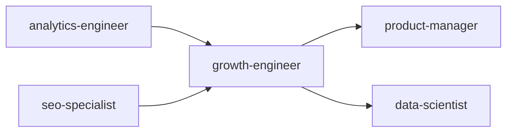

# Growth Engineer

Technical growth engineering system for designing, instrumenting, and scaling growth loops. Combines product instrumentation, experimentation infrastructure, and data-driven optimization to drive sustainable user acquisition, activation, retention, and monetization.

## Route the Request
<!-- QUICK: 30s -- pick your path, skip the rest -->

What are you trying to do?
├── A/B testing & experimentation
│   ├── Building testing infrastructure → Start at "Core Workflow > Phase 2"
│   └── Designing specific experiment → Go to "Core Workflow > Phase 1"
├── Conversion optimization (CRO)
│   └── Diagnosing funnel drop-offs → Go to "Decision Trees > CRO: Funnel Leak Diagnosis"
├── Viral loops & referral programs
│   └── Building invite/viral mechanics → Jump to "Decision Trees > Viral Loop Design"
├── Onboarding optimization
│   └── Reducing time-to-activation → Go to "Decision Trees > Activation: Aha Moment Diagnosis"
├── Growth modeling & forecasting
│   └── Modeling what-if scenarios → Go to "Sub-Skills > Growth Modeling"
├── Activation metrics & aha moments
│   └── Defining and measuring activation → Jump to "Core Workflow > Phase 1"
└── Don't know where to start? → Start at "Core Workflow > Phase 1"

Do not read the entire skill. Follow the route above and read only the sections it points to.

## Ground Rules — Read Before Anything Else

These rules apply to *every* response this skill produces.

- **Never run an A/B test without a hypothesis and minimum detectable effect.** If you can't state "we expect X to change Y by Z%," don't start the experiment.
- **Statistical significance is not the same as practical significance.** A p < 0.05 on a 0.1% lift that costs 10x to implement is a bad decision. Always report effect size and confidence intervals.
- **Growth hacks that damage user trust are net negative.** Dark patterns, fake scarcity, and misleading CTAs may lift metrics short-term but destroy retention and brand.
- **Every experiment needs a kill criterion defined before launch.** Pre-register: "We will stop if [metric] drops below [threshold]" or "if results aren't conclusive within [timeframe]."
- **Always instrument before optimizing.** You can't improve what you don't measure. Ensure analytics, event tracking, and data quality before recommending changes.
- **Admit what you don't know.** If you don't have baseline data, sample size estimates, or funnel data, say so. Don't simulate numbers.

## When to Use
<!-- QUICK: 30s -- scan the bullet list to decide if this skill fits -->
- Designing or rebuilding an A/B testing infrastructure from scratch (server-side, client-side, or hybrid)
- Diagnosing a leaky activation funnel with high drop-off between signup and aha moment
- Implementing a referral or viral loop program (double-sided rewards, invite tracking, fraud prevention)
- Running a conversion rate optimization (CRO) program on key landing or pricing pages
- Building a growth model to forecast user base evolution given acquisition/retention/monetization levers
- Optimizing onboarding flows — reducing time-to-value and improving activation rates
- Establishing an experimentation culture: hypothesis frameworks, statistical rigor, experiment backlogs
- Designing feature flags and progressive rollouts to de-risk product changes

## Decision Trees
<!-- QUICK: 30s -- follow the ASCII tree to your scenario -->
### Experiment Design: A/B vs Multivariate vs Sequential vs Bayesian
```
                     ┌──────────────────────────────┐
                     │ START: Experiment type?        │
                     └────────────┬─────────────────┘
                                  │
                    ┌─────────────▼─────────────────┐
                    │ Testing >3 variables            │
                    │ simultaneously AND need         │
                    │ interaction effects?            │
                    └────┬──────────────────────┬───┘
                         │ YES                  │ NO
                    ┌────▼──────┐    ┌──────────▼──────────┐
                    │ Multivariate│    │ Need early stopping  │
                    │ Test (MVT) │    │ for clear winners?   │
                    │ Requires 4x │    └──┬──────────────┬────┘
                    │ traffic of  │       │YES          │NO
                    │ A/B         │  ┌────▼────┐ ┌──────▼─────────┐
                    └─────────────┘  │Sequential│ │Standard A/B    │
                                     │or Bayesian│ │Frequentist:   │
                                     │A/B — stop │ │Fixed horizon, │
                                     │at interim │ │MDE pre-defined│
                                     │looks      │ │p-value < 0.05 │
                                     └──────────┘ └────────────────┘
```
**When to choose Multivariate:** Testing layout, headline, CTA, and image simultaneously — needs 4× traffic of A/B per variant, interaction effects matter.
**When to choose Sequential/Bayesian:** Early stopping allowed, continuous monitoring, faster decision when effect is large — use Eppo, Statsig, or custom Bayesian framework.
**When to choose Standard A/B:** Simple change, fixed duration, pre-registered analysis — most common, lowest complexity, p-value < 0.05 at planned horizon.

### Activation: Aha Moment Diagnosis
```
                     ┌──────────────────────────────┐
                     │ START: Activation rate low     │
                     │ (< 30% of signups activated)? │
                     └────────────┬─────────────────┘
                                  │
                    ┌─────────────▼─────────────────┐
                    │ Users dropping before first    │
                    │ key action (e.g., first        │
                    │ transaction, first playlist)?  │
                    └────┬──────────────────────┬───┘
                         │ YES                  │ NO
                    ┌────▼──────────┐    ┌──────▼──────────┐
                    │Onboarding     │    │ Users activate   │
                    │Friction:      │    │ but don't return │
                    │Simplify flow, │    │ (Day 7 retention │
                    │progressive    │    │ < 20%)?          │
                    │disclosure,    │    └──┬──────────┬────┘
                    │tooltips       │       │YES      │NO
                    └───────────────┘  ┌────▼────┐ ┌─▼──────────┐
                                       │Habit    │ │Value prop  │
                                       │formation│ │mismatch —  │
                                       │— email, │ │targeting or│
                                       │push,    │ │acquisition │
                                       │in-app   │ │channel     │
                                       │nudges   │ │problem     │
                                       └─────────┘ └────────────┘
```
**When to optimize onboarding:** Metric: time-to-aha moment > target. Simplify initial flow, remove optional steps, progressive disclosure, contextual tooltips.
**When to build habits:** Users activate once but churn — add email/push notifications, streaks, in-app nudges, re-engagement triggers.
**When to fix acquisition:** Users don't even reach aha moment — wrong audience, misleading ads, or value proposition mismatch.

### CRO: Funnel Leak Diagnosis
```
                     ┌──────────────────────────────┐
                     │ START: Which funnel stage      │
                     │ to optimize?                   │
                     └────────────┬─────────────────┘
                                  │
                    ┌─────────────▼─────────────────┐
                    │ >60% drop between landing      │
                    │ page visit → signup?           │
                    └────┬──────────────────────┬───┘
                         │ YES                  │ NO
                    ┌────▼──────────┐    ┌──────▼──────────┐
                    │Top-of-funnel  │    │ >50% drop between │
                    │CRO:          │    │ signup → aha?     │
                    │Headline,hero,│    └──┬──────────┬────┘
                    │CTA,social    │       │YES       │NO
                    │proof,above-  │  ┌────▼────┐ ┌──▼──────────┐
                    │fold tweaks   │  │Activation│ │Monetization │
                    └──────────────┘  │CRO:     │ │CRO:         │
                                      │onboarding│ │pricing page,│
                                      │flow,     │ │trial length,│
                                      │TTV reduce│ │payment flow │
                                      └──────────┘ └─────────────┘
```
**When to optimize top-of-funnel:** >60% drop LP → signup — A/B test headline, hero image, CTA copy, social proof placement, form fields reduction.
**When to optimize activation:** >50% drop signup → aha — simplify onboarding, add guided tours, reduce TTV, trigger contextual help.
**When to optimize monetization:** Low conversion free→paid — test pricing page layout, trial length, payment options, upgrade prompts.

### Viral Loop Design
```
                     ┌──────────────────────────────┐
                     │ START: What type of viral      │
                     │ mechanism to build?            │
                     └────────────┬─────────────────┘
                                  │
                    ┌─────────────▼─────────────────┐
                    │ Product inherently improves    │
                    │ with more users (network       │
                    │ effect, collaboration)?        │
                    └────┬──────────────────────┬───┘
                         │ YES                  │ NO
                    ┌────▼──────────┐    ┌──────▼──────────┐
                    │Inherent      │    │ Users motivated   │
                    │Virality:     │    │ by reward (credit,│
                    │Invite        │    │ storage, cash)?   │
                    │collaborators │    └──┬──────────┬────┘
                    │vs invite     │       │YES       │NO
                    │strangers     │  ┌────▼────┐ ┌──▼──────────┐
                    └──────────────┘  │Incentivized│ │Content     │
                                      │Referral   │ │Virality:   │
                                      │(Dropbox   │ │Shareable   │
                                      │model —    │ │outputs,    │
                                      │two-sided  │ │public      │
                                      │reward)    │ │results     │
                                      └───────────┘ └────────────┘
```
**When to build inherent virality:** Slack, Figma, Notion — collaboration drives adoption. Build invite-to-workspace, shared links, guest access.
**When to build incentivized referral:** Dropbox, Uber model — two-sided reward (give $10/get $10), clear trigger post-aha moment, fraud detection.
**When to build content virality:** Spotify Wrapped, Strava — create shareable outputs from product usage; public by default with privacy controls.

### Experiment Ramp Decision
```
                     ┌──────────────────────────────┐
                     │ START: How to ramp an          │
                     │ experiment?                    │
                     └────────────┬─────────────────┘
                                  │
                    ┌─────────────▼─────────────────┐
                    │ High-risk change (payment,      │
                    │ auth, core experience)?         │
                    └────┬──────────────────────┬───┘
                         │ YES                  │ NO
                    ┌────▼──────────┐    ┌──────▼──────────┐
                    │Phased rollout │    │ User-facing UI   │
                    │1% → 5% → 25% │    │ change?          │
                    │→ 50% with    │    └──┬──────────┬────┘
                    │monitoring     │       │YES       │NO
                    │gates per stage│  ┌────▼────┐ ┌──▼──────────┐
                    └───────────────┘  │Instant   │ │Shadow       │
                                       │50/50 A/B │ │deployment:  │
                                       │with kill │ │log both     │
                                       │switch    │ │variants,    │
                                       │ready     │ │compare      │
                                       └──────────┘ │analytically │
                                                    └─────────────┘
```
**When to do phased rollout:** High-risk — payment flow, auth, core UX. Start at 1%, monitor revenue/errors, gate at each stage, auto-rollback on anomaly.
**When to launch 50/50 A/B:** Standard UI/UX change with kill switch — quick statistical read, lower operational overhead than phased.
**When to shadow deploy:** Backend algorithm change, ML model update — log predictions from new model, compare offline, no user impact until validated.

## Core Workflow
<!-- QUICK: 30s -- scan phase titles to understand the process -->
### Phase 1 (~15 min): Instrumentation & Modeling

1. **Event Taxonomy Design** — Define a standardized event schema: `category.action_label` (e.g., `user.signed_up`, `checkout.started_payment`). Document every event with: trigger condition, properties schema, expected volume, and downstream use cases. Implement via a CDI (Customer Data Infrastructure) like Segment, RudderStack, or mParticle.
2. **Growth Model Construction** — Build a bottom-up growth model in a spreadsheet or Python notebook. Inputs: new user acquisition by channel (organic, paid, referral, viral), activation rate, retention curve (D1/D7/D30), resurrection rate, monetization (ARPU by cohort). Model different scenarios: doubling referral conversion, improving D7 retention by 10%, adding a new acquisition channel.
3. **North Star Metric & Driver Tree** — Identify the single metric that best captures user value (e.g., DAU, messages sent, projects created). Decompose into a driver tree: each driver has sub-drivers with measurable inputs. This becomes the experimentation backlog source.
4. **Activation Analysis** — Define the "aha moment" for the product. Use cohort analysis to find the action that, when completed within the first N days, correlates most strongly with long-term retention. Example: "User who invites 3 teammates within 7 days has 80% D30 retention vs. 20% baseline."

### Phase 2 (~30 min): Experimentation Infrastructure

1. **A/B Testing Framework** — Choose approach based on needs:
   - **Client-side** (e.g., Optimizely, LaunchDarkly for visual tests): fast to iterate, limited to UI changes.
   - **Server-side** (feature flags with randomized assignment): robust, works for API/logic changes, avoids flicker.
   - **Hybrid**: server-side for core logic, client-side for UI experiments.
2. **Statistical Engine** — Implement or integrate: randomization via consistent hashing on user/device ID, sample size calculator (minimum detectable effect, power=0.8, alpha=0.05), sequential testing or always-valid p-values to avoid peeking, CUPED (Controlled-experiment Using Pre-Experiment Data) for variance reduction, multiple comparison correction (Bonferroni or Benjamini-Hochberg).
3. **Experiment Governance** — Define workflow: hypothesis document → engineering review → ethics/privacy review → implementation → QA (AA test validation) → ramp (1% → 10% → 50%) → analysis → ship/kill decision → post-experiment review.
4. **Feature Flags** — Implement a feature flag system (LaunchDarkly, Flagr, or custom). Every non-trivial change ships behind a flag. Supports: percentage rollouts, user targeting by property, kill switches, operational flags for load shedding.

### Phase 3 (~20 min): Growth Loop Execution

1. **Acquisition Loops**:
   - **Viral/Referral**: Double-sided incentive ("Give $10, Get $10"). Track: invites sent, click-through rate, signup conversion, reward redemption rate, viral coefficient (K = invites_per_user × CTR × signup_rate). Fraud detection: velocity checks, device fingerprinting, reward limits per household/IP.
   - **SEO/Content Loop**: Content → organic traffic → signups → user-generated content → more organic traffic. Measure content-to-signup rate, time to index, keyword velocity.
   - **Paid Acquisition**: CAC by channel, LTV:CAC ratio, payback period. Implement attribution (first-touch, last-touch, multi-touch). Optimize spend toward channels with LTV:CAC > 3:1.
2. **Activation Loop**: Onboarding optimization. Simplify signup (social login, magic link), implement progressive profiling (ask for more data over time), guide users to aha moment with checklists, tooltips, and contextual nudges. Measure time-to-activation and activation rate.
3. **Retention Loop**: Identify habit-forming triggers (external: email/push notifications; internal: user's own data). Build re-engagement flows: personalized digests, inactivity nudges, feature discovery emails. Measure D7/D30/D90 retention by cohort.
4. **Monetization Loop**: Optimize pricing page (design, copy, social proof, money-back guarantee). Test: annual vs. monthly defaults, price anchoring, feature gating, expansion revenue (upsell/cross-sell). Measure ARPU, expansion MRR, churn rate.

## Best Practices
<!-- STANDARD: 3min -- rules extracted from production experience -->
- Run AA tests on every new experiment configuration before launching real tests — ensure no systemic bias in randomization.
- Never stop an experiment early based on "significance trending" — pre-commit to runtime based on sample size calculations.
- Segment experiment results by platform, geography, and user type — aggregate lift can hide heterogeneous treatment effects.
- Maintain a single source of truth for metrics definitions (metrics layer like dbt or Looker explores).
- Ship "losing" variants when they teach something fundamental about user behavior — the goal is learning, not just winning.
- Use holdout groups (control groups that never see the treatment for extended periods) to measure long-term effects invisible in short experiments.
- Implement circuit breakers on all external growth loops: rate limiting, fraud thresholds, automated kill on anomaly detection.
- Growth model should be a living document — update monthly with actuals and reforecast.

## Cross-Skill Coordination
<!-- QUICK: 30s -- table of who to talk to when -->
Growth engineering intersects product, marketing, data, and engineering. Experiments fail when coordination breaks — wrong data, wrong audience, or wrong interpretation.

| Coordinate With | When | What to Share/Ask |
|-----------------|------|-------------------|
| **Product Strategist** | Hypothesis generation, roadmap alignment | Experiment backlog, growth model inputs, feature prioritization impact |
| **Data/Analytics Engineer** | Event taxonomy, experiment tracking, dashboards | Tracking plan, statistical methodology, data quality requirements |
| **Frontend Developer** | UI experiments, landing pages, onboarding flows | Variant implementation, feature flag integration, rendering performance |
| **Backend Developer** | API experiments, pricing logic, auth flows | Server-side flagging, data pipeline changes, API response variants |
| **SEO Specialist** | SEO-safe experimentation parameters | Canonical handling, noindex rules, experiment URL structures |
| **Content Strategist** | Copy variants, landing pages, email experiments | Copy hypotheses, variant messaging, content-led experiment design |
| **Marketing/Demand Gen** | Channel experiments, campaign attribution | Channel budget, audience targeting, attribution methodology |
| **UX Designer** | Onboarding redesign, conversion flow experiments | Prototype variants, usability considerations, interaction design |
| **QA Engineer** | Experiment QA, cross-browser/device testing | Variant matrix, device coverage, regression testing scope |
| **Project Manager** | Experiment calendar, resource allocation | Experiment schedule, capacity planning, cross-team dependencies |

### Communication Triggers — When to Proactively Notify

| Trigger | Notify | Why |
|---------|--------|-----|
| Experiment reaches statistical significance (p<0.05, adequate power) | Product Strategist, Data, Project Manager | Ship decision or further validation needed |
| Experiment shows statistically significant NEGATIVE result | Product Strategist, UX Designer | Halt variant; investigate cause; learning documentation |
| Experiment running >2x planned duration without significance | Data, Project Manager | Underpowered; may need increased traffic or early termination |
| Tracking/data quality issue discovered mid-experiment | Data, Backend/Frontend Dev | Pause experiment; fix tracking; restart with clean data |
| Experiment conflicts with another active experiment (same user population) | Project Manager, other Growth Engineer | Interaction effect risk; coordinate deconfliction |
| Feature flag causing performance regression | Frontend Dev, System Architect, DevOps | Latency impact; may need flag removal or optimization |
| Viral coefficient exceeds threshold (invite system abuse risk) | Security Reviewer, Legal Advisor | Fraud or abuse vector; rate limiting or verification needed |

### Escalation Path

| Situation | Escalate To | Rationale |
|-----------|------------|-----------|
| Experiment shows negative revenue impact at scale | **Product Strategist** + CEO Strategist | Revenue at risk; executive decision on continuation |
| Feature flag infrastructure failure (all users see wrong variant) | **CTO Advisor** + DevOps | Production incident; rollback decision |
| Data pipeline failure corrupting experiment results for >24 hours | **Data Lead** + CTO Advisor | Trust in experimentation system at risk |
| Growth team blocked by engineering for >1 sprint without resolution | **CTO Advisor** or VP Engineering | Prioritization escalation; growth impact quantified |
| Experiment suggests pricing change could increase revenue >20% | **Product Strategist** + CEO Strategist + Legal Advisor | Strategic pricing decision; legal and competitive review |

## Scale Depth
<!-- QUICK: 30s -- find your team size column -->
### Solo (1 person, 0-100 users)
Founder running experiments manually with a Google Sheet + Google Optimize free tier. Feature flags via environment variables or simple config toggles. Funnel analysis: Mixpanel/Amplitude free tier. No formal experimentation framework — ship and measure. Growth model: spreadsheet projections. Cost: $0-200/month. Overkill: server-side A/B framework, experiment platform (Eppo/Optimizely), full CDP, feature flag SaaS.

### Small (2-10 people, 100-10K users)
Dedicated growth engineer. A/B testing: LaunchDarkly/Flagsmith + custom or lightweight platform (GrowthBook open-source). Funnel analysis: Mixpanel/Amplitude with SQL access. Experimentation framework with hypothesis template and pre-registration. Feature flags for progressive rollouts. Growth model: Python/spreadsheet with weekly updates. Cost: $500-3K/month. Overkill: CDP (Segment), multivariate testing, multi-armed bandits.

### Medium (10-50 people, 10K-1M users)
Growth team (2-3 engineers). Experiment platform: Eppo, Statsig, or Optimizely with server-side + client-side. Feature flag platform with targeting rules, gradual rollouts, kill switches. CDP for unified user profiles. Multi-armed bandits for ongoing optimization. Statistical rigor: CUPED, sequential testing, stratified sampling. Growth model in Python with data warehouse integration. Cost: $5K-25K/month.

### Enterprise (50+ people, 1M+ users)
Growth engineering pod (5-10). Experiment platform with custom integrations, holdout groups, long-term effect measurement. Shadow deployments for ML models. Experiment interaction detection. Global feature flag management with change management. Dedicated experimentation data pipeline. Causal inference: diff-in-diff, IV, synthetic control. Growth model: real-time, ML-driven forecast. Cost: $50K-300K+/month.

### Transition Triggers
| From → To | Trigger | What to Change |
|-----------|---------|----------------|
| Solo → Small | >2 experiments/month, need feature flags for production safety | Add LaunchDarkly/Flagsmith; implement hypothesis template; move beyond Google Optimize |
| Small → Medium | >10 experiments/month, need interaction detection, or >3 growth engineers | Adopt experiment platform (Eppo/Statsig); add CDP; implement advanced statistical methods |
| Medium → Enterprise | >50 experiments/month, ML-driven personalization, regulatory experimentation requirements | Build dedicated experimentation pipeline; add causal inference; implement holdout groups |

## What Good Looks Like

> Every experiment ships with a pre-registered hypothesis and a predetermined decision criterion, so there is no post-hoc storytelling. The feature flag platform enables percentage rollouts, kill switches, and automatic ramp-down when guardrail metrics degrade, and the experimentation pipeline detects interactions between concurrent experiments before they corrupt results. The growth model updates weekly from the warehouse and forecasts the next quarter within a 5% margin, so the team knows within days whether a winning experiment moved the needle on company-level metrics.

### Cross-skills Integration

Run skills in the order shown:
```bash
# Chain A: analytics-engineer → growth-engineer → product-manager
# Chain B: seo-specialist → growth-engineer → data-scientist
```

## Sub-Skills
<!-- QUICK: 30s -- table of deeper dives by topic -->
| Sub-Skill | When to Use | Context |
|-----------|-------------|---------|
| **A/B Testing Infrastructure** | Building or replacing experimentation framework | LaunchDarkly, GrowthBook, Eppo, Statsig — server-side + client-side bucketing, consistent hashing |
| **Funnel Optimization** | Diagnosing conversion drop-offs at specific stages | Mixpanel, Amplitude, PostHog — funnel analysis, segmentation, session replay (Hotjar/FullStory) |
| **Growth Modeling** | Forecasting user/revenue growth and modeling what-if scenarios | Python (pandas, numpy) or spreadsheet — acquisition × activation × retention × referral × revenue |
| **Feature Flag Architecture** | Implementing progressive rollouts and operational safety | LaunchDarkly, Flagsmith, Unleash — kill switches, percentage rollouts, target groups |
| **Referral & Viral Loop Engineering** | Building invite/referral programs with fraud prevention | Custom + fraud detection — two-sided rewards, invite tracking, rate limiting, verification |
| **Onboarding Optimization** | Reducing time-to-value and improving activation rates | Progressive disclosure, tooltips, guided tours, checklists — measure: time-to-aha moment |
| **Pricing & Packaging Experiments** | Testing monetization models and pricing page CRO | Survey-based (Van Westendorp), A/B pricing page, trial length, feature gating — requires legal review |
| **Causal Inference for Growth** | Measuring long-term effects when A/B tests are impractical | Diff-in-diff, instrumental variables, synthetic control, regression discontinuity — Python (DoWhy, CausalPy) |


### Error Decoder

| Problem | Root Cause | Fix |
|---------|------------|-----|
| Organic traffic drops sharply | Algorithm update or technical SEO issue | Check GSC for manual actions, verify crawlability, check Core Web Vitals. Rollback recent structural changes. |
| Content ranks but doesn't convert | Content targets top-of-funnel only | Map content to buyer journey: awareness → consideration → decision. Every content piece has a next step CTA. |
| A/B test shows no winner | Sample size too small or test duration too short | Minimum 1 full business cycle per variant. Use sequential testing — don't peek at results. |
| Viral loop doesn't activate | Invite flow has friction | Cut invite flow to 3 taps max. Show invite value before asking. Track invite-to-signup conversion rate. |
| Developer community is silent | No low-friction contribution path | Start with issues labeled "good first issue." Respond within 24h. Celebrate first PR with public thank-you. |
| Paid acquisition CPA too high | Targeting too broad or creative not differentiated | Narrow to lookalike audiences. Test 5+ creative angles per audience segment. Kill underperformers after $500 spend. |
| Activation rate < 10% | Onboarding doesn't demonstrate core value in first session | Force "aha moment" within first 5 minutes. Cut all non-essential onboarding steps. Show value before asking for commitment. |


## Production Checklist
<!-- QUICK: 30s -- binary pass/fail items. All must pass. -->
- [ ] **[S1]**  Event taxonomy is documented, versioned, and enforced through CI checks on instrumentation PRs
- [ ] **[S2]**  A/B testing framework supports server-side and client-side experiments with consistent user bucketing
- [ ] **[S3]**  Sample size calculator is accessible to all experimenters with minimum detectable effect, power, and alpha inputs
- [ ] **[S4]**  Experiment governance: every experiment has a hypothesis document, success metrics, guardrail metrics, and pre-registered runtime
- [ ] **[S5]**  Feature flag system supports percentage rollouts, targeting rules, and instant kill-switch capability
- [ ] **[S6]**  Growth model is built, reviewed, and updated monthly — covers acquisition, activation, retention, monetization
- [ ] **[S7]**  Activation analysis identifies the aha moment and the critical path users must complete within N days
- [ ] **[S8]**  Referral/viral program has fraud detection: velocity limits, device fingerprinting, reward caps
- [ ] **[S9]**  Onboarding flow is instrumented end-to-end with funnel analysis tracking reach/drop-off at each step
- [ ] **[S10]**  Attribution model is defined and consistently applied across all marketing spend analysis
- [ ] **[S11]**  Holdout group exists for measuring long-term incremental impact of growth interventions
- [ ] **[S12]**  Dashboard tracks: experiment velocity (tests per week), win rate, cumulative uplift from shipped experiments
- [ ] **[S13]**  All experiment results are documented in a searchable knowledge base with ship/kill rationale
- [ ] **[S14]**  Privacy review process exists for experiments involving user data or behavioral targeting

## MVP vs Growth vs Scale

| Phase | Team Size | Users | Priority | Growth Approach |
|-------|-----------|-------|----------|----------------|
| **MVP (0→1)** | 1-3 devs, no growth hire | 0-1K | Find first 100 passionate users | Manual outreach + analytics (Plausible/PostHog free) + basic email. No A/B tests — just ship and watch retention. Feature flags: env vars or a JSON config. |
| **Growth (1→10)** | 3-10 devs, 1 growth engineer | 1K-100K | Systematic experimentation | Server-side feature flags (LaunchDarkly free tier or Flagr), A/B testing framework, event taxonomy, growth model spreadsheet. Weekly experiment review. |
| **Scale (10→N)** | 10+ devs, growth team (3-5) | 100K+ | Experimentation culture + automation | Full experimentation platform, ML-powered personalization, automated experiment analysis, dedicated data engineering, holdout groups, multi-arm bandits. |

**MVP rule:** Ship a feature flag in 2 hours (env var + if statement), not 2 weeks (platform evaluation + integration). Upgrade tooling when you've run 10+ manual experiments and the overhead is visible.

## Cost-Effective Decision Table

| Decision | Free/Cheap Option | Paid Upgrade | When to Upgrade |
|----------|------------------|--------------|-----------------|
| Feature flags | Environment variables or JSON config in DB | LaunchDarkly ($75/mo starter) or Flagsmith (self-hosted free) | >5 flags, need non-engineer toggling, or need % rollouts |
| A/B testing | Custom: hash(user_id) % 2 → variant, log to analytics | LaunchDarkly experiments, GrowthBook (self-hosted free, cloud $99/mo) | >1 experiment/month, need statistical engine, or non-engineers run tests |
| Analytics | PostHog (self-hosted free, cloud $0.00031/event) or Plausible ($9/mo) | Amplitude ($800+/mo) or Mixpanel Growth ($20/mo startup) | Need behavioral cohorts, funnel analysis beyond basic funnels, or >1M events/mo |
| Event pipeline | Manual Segment/RudderStack setup | Segment Team ($120/mo) or RudderStack Cloud (free up to 1M events) | >5 event destinations or need warehouse sync |
| Experiment analysis | Google Sheets + manual t-test | GrowthBook (open source), Statsig (free up to 10K MTUs) | >2 experiments/month, need CUPED/bootstrap/pre-registration |
| Growth model | Google Sheets with cohort tables | Python/Jupyter notebook with automated data pull | Model has >20 inputs or updated monthly (worth automation) |
| Referral/viral | Custom: invite codes, reward via DB flag + API call | ReferralRock ($200/mo) or FriendBuy ($299/mo) | Need fraud detection, multi-language, or A/B testing referral mechanics |

**Annual growth tool budget:** MVP: $0-240. Growth: $1K-15K. Scale: $30K-200K+.

## Scalability Decision Tree

```
Are you running >1 experiment per week?
├── YES → Is experiment analysis taking >2 hours per experiment?
│   ├── YES → Invest in automated analysis (GrowthBook/Statsig). Pre-register experiments.
│   └── NO → Manual analysis is fine. Ship velocity is good.
└── NO → Don't build an experimentation platform. Run a few high-quality experiments.

Does your activation rate need improvement (e.g., <30% of signups reach aha moment)?
├── YES → This is your #1 growth priority. Run onboarding experiments before acquisition experiments.
│   Focus on time-to-value. Every 10% improvement in activation compounds across retention.
└── NO → Activation is healthy. Move to retention or monetization experiments.

Is your experiment win rate <10%?
├── YES → Your hypotheses are too weak. Invest in user research + data analysis before ideating.
│   (Industry average is 10-30% win rate. Below 10% = you're guessing.)
└── NO → Win rate is healthy. Increase experiment velocity.

Do experiments take >2 weeks from hypothesis to results?
├── YES → Bottleneck: engineering time, analysis time, or review process. Identify and fix the slowest step.
└── NO → Speed is good. Focus on experiment quality (effect size, learning value).

Have you shipped a "losing" experiment in the last quarter?
├── NO → You're optimizing for wins, not learning. Run 1 experiment you expect to lose but will teach something fundamental.
└── YES → Good. Learning culture is healthy.
```


**What good looks like:** Event taxonomy documented and implemented across all platforms. A/B test framework is self-serve for PMs. Growth dashboard shows activation, retention, referral, and revenue metrics updated in real-time. Experiment velocity is 2+ concurrent experiments.

## When NOT to Use This Skill (Overkill)

- **Pre-product-market-fit (0 paying customers)**: A/B testing before you have 1K+ users is statistically meaningless. You don't have enough data. Ship based on intuition and user conversations.
- **B2B with <100 customers and high ACV (>$50K)**: A/B tests need sample size. With 100 customers, you'd need a 50%+ effect to detect anything. Talk to customers instead.
- **Internal tools**: Growth engineering optimization on an admin dashboard used by 5 people is a waste. Just ask them what they need.
- **Your product is perfectly retained (no churn problem) and viral (K-factor >1)**: Congratulations. Spend time scaling infrastructure, not optimizing growth loops.
- **You're in a market where growth is capped by regulation or supply, not demand** (e.g., FDA-regulated devices, capacity-constrained services): Growth engineering won't help if you can't serve more users.

## Token-Efficient Workflow

```
# Step 1: Quick diagnostic — what's the #1 growth bottleneck?
python3 scripts/growth_diagnostic.py \
  --signups 5000 --activation-rate 0.25 --d7-retention 0.40 --referral-rate 0.05 \
  --output json
# Returns: {"bottleneck":"activation","score":0.25,"benchmark":0.40,"gap_pct":-37.5}

# Step 2: Decision tree → pick the lever
# Bottleneck = activation → onboarding experiment (reduce time-to-aha)
# Bottleneck = retention → re-engagement experiment (email/push cadence)
# Bottleneck = referral → incentive experiment (single-sided vs double-sided reward)
# Bottleneck = acquisition → channel experiment (new paid/organic channel test)

# Step 3: Quick experiment setup — feature flag + analytics event
# Create feature flag (simplest: config key)
echo '{"onboarding_v2": {"enabled": true, "rollout": 0.5}}' > flags/onboarding.json

# Track variant in analytics
# In code: analytics.track('user_signup', {variant: getUserVariant('onboarding_v2')})

# Step 4: Verify after 7-14 days with exit code
python3 scripts/analyze_experiment.py \
  --metric activation_rate --control 0.25 --treatment 0.31 --n 2000 \
  --output json  # Returns: {"significant":true,"lift":0.24,"p_value":0.003}
# Exit code 0 = significant winner, 1 = inconclusive, 2 = significant loser
```

**Principle:** `growth_diagnostic.py` outputs JSON with one bottleneck. Agent follows decision tree to exactly one action. Analysis script outputs exit code for significance. No parsing prose output.

## References
<!-- QUICK: 30s -- links to deeper reading -->
- [Microsoft — CUPED Variance Reduction](https://www.microsoft.com/en-us/research/publication/controlled-experiments-on-the-web-survey-and-practical-guide/)
- [Ron Kohavi — Trustworthy Online Controlled Experiments (Book)](https://experimentguide.com/)
- [LaunchDarkly — Feature Management](https://launchdarkly.com/)
- [Reforge — Growth Series](https://www.reforge.com/)
- [Lenny's Newsletter — Growth](https://www.lennysnewsletter.com/)
- [Segment — Customer Data Infrastructure](https://segment.com/)
