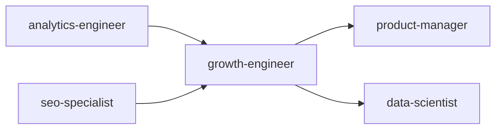
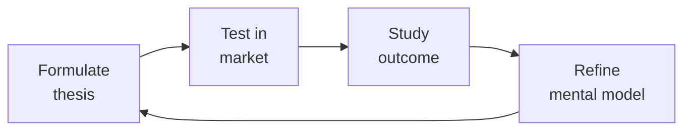

# Growth Engineer

> **Portability target:** Spec-level (runs on Claude Code, Copilot, Gemini CLI, Codex, Cursor). No vendor-specific frontmatter fields.

Technical growth engineering system for designing, instrumenting, and scaling growth loops. Combines product instrumentation, experimentation infrastructure, and data-driven optimization to drive sustainable user acquisition, activation, retention, and monetization.

## Route the Request

### Auto-Route (No User Input Required)
Evaluate these file-system conditions in order. First match wins — jump immediately to the indicated section.

| # | Condition | Action |
|---|-----------|--------|
| A1 | `file_contains("package.json", "launchdarkly")` OR `file_contains("package.json", "optimizely")` OR `file_contains("package.json", "statsig")` OR `file_contains("package.json", "growthbook")` | Experimentation infrastructure — Jump to "Core Workflow > Phase 2" |
| A2 | `file_exists("experiments/")` OR `file_contains(".github/workflows", "experiment")` OR `file_contains("README.md", "A/B test")` | Experiment design & execution — Jump to "Core Workflow > Phase 1" |
| A3 | `file_contains("README.md", "referral")` OR `file_contains("README.md", "viral")` OR `file_exists("referral/")` | Viral/referral loop engineering — Jump to "Decision Trees > Viral Loop Design" |
| A4 | `file_contains("README.md", "onboarding")` OR `file_exists("onboarding/")` | Onboarding optimization & activation — Go to "Decision Trees > Activation: Aha Moment Diagnosis" |
| A5 | `file_contains("README.md", "growth model")` OR `file_exists("growth_model.")` OR `file_exists("growth-model.")` | Growth modeling & forecasting — Go to "Sub-Skills > Growth Modeling" |
| A6 | `file_contains("README.md", "CRO")` OR `file_contains("README.md", "conversion rate")` OR `file_contains("README.md", "funnel")` | Conversion rate optimization — Jump to "Decision Trees > CRO: Funnel Leak Diagnosis" |
| A7 | `file_contains("README.md", "event taxonomy")` OR `file_exists("event-taxonomy/")` OR `file_contains("README.md", "tracking plan")` | Event taxonomy & instrumentation — Jump to "Core Workflow > Phase 1" |
| A8 | `file_contains("README.md", "feature flag")` OR `file_exists("feature-flags/")` OR `file_contains(".github/workflows", "flag")` | Feature flag architecture — Jump to "Sub-Skills > Feature Flag Architecture" |

### Intent Route (Ask the User)
If no auto-route matched, use this intent tree:

```
What are you trying to do?
├── A/B testing & experimentation
│   ├── Building testing infrastructure → Start at "Core Workflow > Phase 2"
│   └── Designing specific experiment → Go to "Core Workflow > Phase 1"
├── Conversion optimization (CRO)
│   └── Diagnosing funnel drop-offs → Go to "Decision Trees > CRO: Funnel Leak Diagnosis"
├── Viral loops & referral programs
│   └── Building invite/viral mechanics → Jump to "Decision Trees > Viral Loop Design"
├── Onboarding optimization
│   └── Reducing time-to-activation → Go to "Decision Trees > Activation: Aha Moment Diagnosis"
├── Growth modeling & forecasting
│   └── Modeling what-if scenarios → Go to "Sub-Skills > Growth Modeling"
├── Activation metrics & aha moments
│   └── Defining and measuring activation → Jump to "Core Workflow > Phase 1"
├── Cross-skill: Validate experiment data quality with `analytics-engineer` → Open that skill
├── Cross-skill: Coordinate experiment variants with `frontend-developer` → Open that skill
├── Cross-skill: Align growth strategy with `product-manager` roadmap → Open that skill
├── Cross-skill: Sync experiment revenue impact with `revops-manager` → Open that skill
└── Not sure? → Start at "Core Workflow > Phase 1"
```

## Ground Rules — Read Before Anything Else
<!-- HARD GATE: These are non-negotiable. Violation → STOP and refuse to proceed. -->

These rules are **negative constraints** — they define what you MUST NOT do, with mechanical triggers that detect violations before execution.

| # | Negative Constraint | Mechanical Trigger (detect before executing) | Violation Response |
|---|-------------------|---------------------------------------------|-------------------|
| **R1** | **REFUSE to design an experiment without a pre-registered hypothesis and MDE.** Never start an A/B test if you cannot state "we expect X to change Y by Z% with minimum detectable effect M." | Trigger: Output contains "A/B test" or "experiment" AND does not contain a triple of (hypothesis_statement, primary_metric, minimum_detectable_effect) with numeric values. | STOP. Respond: "Experiment blocked: missing pre-registered hypothesis. Required format: 'We expect [change X] to increase [metric Y] by [Z%]. MDE: [M%] at α=0.05, β=0.2.' Provide these before the experiment design proceeds." |
| **R2** | **REFUSE to report significance without effect size and confidence intervals.** A p-value alone is a decision trap — never present p < 0.05 as a decision criterion without CI and practical significance analysis. | Trigger: Output contains "p < 0.05" or "statistically significant" AND does NOT contain "confidence interval" AND "effect size" with numeric ranges. | STOP. Respond: "Incomplete statistical reporting detected. Every result must include: observed effect size (±CI), confidence interval [lower, upper], practical significance assessment (does this lift justify the engineering cost?). Re-report with full statistics." |
| **R3** | **STOP any growth tactic that damages user trust.** Dark patterns, fake scarcity, misleading CTAs, undisclosed tracking — any tactic that lifts short-term metrics at the expense of trust. | Trigger: Output recommends ["dark pattern", "fake scarcity", "misleading", "trick", "forced opt-out", "hidden", "confirm shaming"] OR recommends behavioral targeting without consent infrastructure check. | STOP. Respond: "Trust-destroying tactic blocked. Short-term metric lifts from dark patterns produce long-term brand damage that no A/B test can measure. The growth engineer optimizes for net revenue retention, not this quarter's signups. Redesign with transparent, user-respecting mechanics." |
| **R4** | **REFUSE to launch an experiment without a kill criterion and guardrail metrics.** Every experiment must have a pre-registered kill switch: "Stop if [guardrail] degrades by [threshold]." | Trigger: Output proposes launching an experiment AND does not define at least one guardrail metric with a numeric degradation threshold (e.g., "p99 latency > 500ms", "error rate > 1%", "revenue drop > 2%"). | STOP. Respond: "Experiment blocked: no kill criteria defined. Pre-register at minimum: (1) primary guardrail metric with degradation threshold, (2) auto-kill condition, (3) monitoring dashboard URL. Example: 'Kill if: revenue_per_user drops > 2% or p99 latency exceeds 500ms.'" |
| **R5** | **DETECT and BLOCK peeking.** Never check experiment results before the pre-committed runtime — peeking inflates false positive rate from 5% to 25-30%. | Trigger: Output suggests "check results early" or "interim analysis" or proposes runtime shorter than the sample-size-calculated minimum with standard α/β. | STOP. Respond: "Peeking blocked. Pre-registered runtime is [N] days based on sample size [S] at MDE=[M]%. Checking early inflates the false positive rate. If early stopping is essential, use sequential testing with always-valid p-values (Lakens' GroupSeq or Eppo's sequential framework) — not ad-hoc interim checks." |
| **R6** | **REFUSE to instrument after the fact.** Never recommend optimization or experimentation on a metric that isn't instrumented, validated, and baselined. | Trigger: Output proposes optimizing a metric AND no `file_contains` check for event tracking exists OR no baseline data (mean, variance, sample size) is presented for that metric. | STOP. Respond: "Instrumentation required before optimization. The metric [M] has no confirmed tracking or baseline data. First: verify the event is in the taxonomy (`grep '[M]' event-taxonomy.md`), confirm data pipeline is flowing, establish a 2-week baseline. Then re-invoke." |


## The Expert's Mindset

Master growth engineers understand that strategy is not about predicting the future — it's about **being less wrong than the competition, faster**.

| Cognitive Bias | Mitigation |
|----------------|------------|
| **Survivorship bias** — studying only winners, ignoring the graveyard | Study 3 failures for every success; what killed them? |
| **Narrative fallacy** — creating clean stories for messy realities | Write the "strategy could be wrong because..." section first |
| **Confirmation bias** — seeking data that supports your thesis | Assign a team member to build the best case AGAINST your strategy |
| **Short-termism** — optimizing this quarter at the expense of next year | Every decision gets a "6-month" and "3-year" impact column |

### What Masters Know That Others Don't
- **The bottleneck is always one thing.** Find it. Fix it. Then find the next one.
- **Strategy = what you say NO to.** If your strategy doesn't exclude anything, it's not a strategy.
- **Timing beats brilliance.** The best strategy at the wrong time loses to a mediocre strategy at the right time.

### When to Break Your Own Rules
- **Bet the company when the asymmetry is right.** If downside = $1M and upside = $1B, the math doesn't care about your process.
- **Ignore the data when you're creating a new category.** By definition, there's no data for something that doesn't exist yet.
## Operating at Different Levels

| Level | Scope | You... |
|-------|-------|--------|
| **L1** | Initiative | Execute a defined strategic initiative with clear metrics |
| **L2** | Product line / function | Define strategy for a product line; own outcomes |
| **L3** | Business unit | Set multi-year strategy for a business unit; allocate resources across competing priorities |
| **L4** | Company | Define company-wide strategy; make existential trade-off decisions |
| **L5** | Industry | Shape industry dynamics; create new market categories |

**Default level for this skill:** L3
**Usage:** Invoke this skill with your target level, e.g., "as an L3 growth engineer, develop..."

For full level definitions, see `skills/00-framework/skill-levels/SKILL.md`.

## When to Use
<!-- QUICK: 30s -- scan the bullet list to decide if this skill fits -->
- Designing or rebuilding an A/B testing infrastructure from scratch (server-side, client-side, or hybrid)
- Diagnosing a leaky activation funnel with high drop-off between signup and aha moment
- Implementing a referral or viral loop program (double-sided rewards, invite tracking, fraud prevention)
- Running a conversion rate optimization (CRO) program on key landing or pricing pages
- Building a growth model to forecast user base evolution given acquisition/retention/monetization levers
- Optimizing onboarding flows — reducing time-to-value and improving activation rates
- Establishing an experimentation culture: hypothesis frameworks, statistical rigor, experiment backlogs
- Designing feature flags and progressive rollouts to de-risk product changes

## Decision Trees
<!-- QUICK: 30s -- follow the ASCII tree to your scenario -->
### Experiment Design: A/B vs Multivariate vs Sequential vs Bayesian
```
                     ┌──────────────────────────────┐
                     │ START: Experiment type?        │
                     └────────────┬─────────────────┘
                                  │
                    ┌─────────────▼─────────────────┐
                    │ Testing >3 variables            │
                    │ simultaneously AND need         │
                    │ interaction effects?            │
                    └────┬──────────────────────┬───┘
                         │ YES                  │ NO
                    ┌────▼──────┐    ┌──────────▼──────────┐
                    │ Multivariate│    │ Need early stopping  │
                    │ Test (MVT) │    │ for clear winners?   │
                    │ Requires 4x │    └──┬──────────────┬────┘
                    │ traffic of  │       │YES          │NO
                    │ A/B         │  ┌────▼────┐ ┌──────▼─────────┐
                    └─────────────┘  │Sequential│ │Standard A/B    │
                                     │or Bayesian│ │Frequentist:   │
                                     │A/B — stop │ │Fixed horizon, │
                                     │at interim │ │MDE pre-defined│
                                     │looks      │ │p-value < 0.05 │
                                     └──────────┘ └────────────────┘
```
**When to choose Multivariate:** Testing layout, headline, CTA, and image simultaneously — needs 4× traffic of A/B per variant, interaction effects matter.
**When to choose Sequential/Bayesian:** Early stopping allowed, continuous monitoring, faster decision when effect is large — use Eppo, Statsig, or custom Bayesian framework.
**When to choose Standard A/B:** Simple change, fixed duration, pre-registered analysis — most common, lowest complexity, p-value < 0.05 at planned horizon.

### Activation: Aha Moment Diagnosis
```
                     ┌──────────────────────────────┐
                     │ START: Activation rate low     │
                     │ (< 30% of signups activated)? │
                     └────────────┬─────────────────┘
                                  │
                    ┌─────────────▼─────────────────┐
                    │ Users dropping before first    │
                    │ key action (e.g., first        │
                    │ transaction, first playlist)?  │
                    └────┬──────────────────────┬───┘
                         │ YES                  │ NO
                    ┌────▼──────────┐    ┌──────▼──────────┐
                    │Onboarding     │    │ Users activate   │
                    │Friction:      │    │ but don't return │
                    │Simplify flow, │    │ (Day 7 retention │
                    │progressive    │    │ < 20%)?          │
                    │disclosure,    │    └──┬──────────┬────┘
                    │tooltips       │       │YES      │NO
                    └───────────────┘  ┌────▼────┐ ┌─▼──────────┐
                                       │Habit    │ │Value prop  │
                                       │formation│ │mismatch —  │
                                       │— email, │ │targeting or│
                                       │push,    │ │acquisition │
                                       │in-app   │ │channel     │
                                       │nudges   │ │problem     │
                                       └─────────┘ └────────────┘
```
**When to optimize onboarding:** Metric: time-to-aha moment > target. Simplify initial flow, remove optional steps, progressive disclosure, contextual tooltips.
**When to build habits:** Users activate once but churn — add email/push notifications, streaks, in-app nudges, re-engagement triggers.
**When to fix acquisition:** Users don't even reach aha moment — wrong audience, misleading ads, or value proposition mismatch.

### CRO: Funnel Leak Diagnosis
```
                     ┌──────────────────────────────┐
                     │ START: Which funnel stage      │
                     │ to optimize?                   │
                     └────────────┬─────────────────┘
                                  │
                    ┌─────────────▼─────────────────┐
                    │ >60% drop between landing      │
                    │ page visit → signup?           │
                    └────┬──────────────────────┬───┘
                         │ YES                  │ NO
                    ┌────▼──────────┐    ┌──────▼──────────┐
                    │Top-of-funnel  │    │ >50% drop between │
                    │CRO:          │    │ signup → aha?     │
                    │Headline,hero,│    └──┬──────────┬────┘
                    │CTA,social    │       │YES       │NO
                    │proof,above-  │  ┌────▼────┐ ┌──▼──────────┐
                    │fold tweaks   │  │Activation│ │Monetization │
                    └──────────────┘  │CRO:     │ │CRO:         │
                                      │onboarding│ │pricing page,│
                                      │flow,     │ │trial length,│
                                      │TTV reduce│ │payment flow │
                                      └──────────┘ └─────────────┘
```
**When to optimize top-of-funnel:** >60% drop LP → signup — A/B test headline, hero image, CTA copy, social proof placement, form fields reduction.
**When to optimize activation:** >50% drop signup → aha — simplify onboarding, add guided tours, reduce TTV, trigger contextual help.
**When to optimize monetization:** Low conversion free→paid — test pricing page layout, trial length, payment options, upgrade prompts.

### Viral Loop Design
```
                     ┌──────────────────────────────┐
                     │ START: What type of viral      │
                     │ mechanism to build?            │
                     └────────────┬─────────────────┘
                                  │
                    ┌─────────────▼─────────────────┐
                    │ Product inherently improves    │
                    │ with more users (network       │
                    │ effect, collaboration)?        │
                    └────┬──────────────────────┬───┘
                         │ YES                  │ NO
                    ┌────▼──────────┐    ┌──────▼──────────┐
                    │Inherent      │    │ Users motivated   │
                    │Virality:     │    │ by reward (credit,│
                    │Invite        │    │ storage, cash)?   │
                    │collaborators │    └──┬──────────┬────┘
                    │vs invite     │       │YES       │NO
                    │strangers     │  ┌────▼────┐ ┌──▼──────────┐
                    └──────────────┘  │Incentivized│ │Content     │
                                      │Referral   │ │Virality:   │
                                      │(Dropbox   │ │Shareable   │
                                      │model —    │ │outputs,    │
                                      │two-sided  │ │public      │
                                      │reward)    │ │results     │
                                      └───────────┘ └────────────┘
```
**When to build inherent virality:** Slack, Figma, Notion — collaboration drives adoption. Build invite-to-workspace, shared links, guest access.
**When to build incentivized referral:** Dropbox, Uber model — two-sided reward (give $10/get $10), clear trigger post-aha moment, fraud detection.
**When to build content virality:** Spotify Wrapped, Strava — create shareable outputs from product usage; public by default with privacy controls.

### Experiment Ramp Decision
```
                     ┌──────────────────────────────┐
                     │ START: How to ramp an          │
                     │ experiment?                    │
                     └────────────┬─────────────────┘
                                  │
                    ┌─────────────▼─────────────────┐
                    │ High-risk change (payment,      │
                    │ auth, core experience)?         │
                    └────┬──────────────────────┬───┘
                         │ YES                  │ NO
                    ┌────▼──────────┐    ┌──────▼──────────┐
                    │Phased rollout │    │ User-facing UI   │
                    │1% → 5% → 25% │    │ change?          │
                    │→ 50% with    │    └──┬──────────┬────┘
                    │monitoring     │       │YES       │NO
                    │gates per stage│  ┌────▼────┐ ┌──▼──────────┐
                    └───────────────┘  │Instant   │ │Shadow       │
                                       │50/50 A/B │ │deployment:  │
                                       │with kill │ │log both     │
                                       │switch    │ │variants,    │
                                       │ready     │ │compare      │
                                       └──────────┘ │analytically │
                                                    └─────────────┘
```
**When to do phased rollout:** High-risk — payment flow, auth, core UX. Start at 1%, monitor revenue/errors, gate at each stage, auto-rollback on anomaly.
**When to launch 50/50 A/B:** Standard UI/UX change with kill switch — quick statistical read, lower operational overhead than phased.
**When to shadow deploy:** Backend algorithm change, ML model update — log predictions from new model, compare offline, no user impact until validated.

## Core Workflow
<!-- QUICK: 30s -- scan phase titles to understand the process -->
<!-- DEEP: 10+min -->
### Phase 1 (~15 min): Instrumentation & Modeling

1. **Event Taxonomy Design** — Define a standardized event schema: `category.action_label` (e.g., `user.signed_up`, `checkout.started_payment`). Document every event with: trigger condition, properties schema, expected volume, and downstream use cases. Implement via a CDI (Customer Data Infrastructure) like Segment, RudderStack, or mParticle.
2. **Growth Model Construction** — Build a bottom-up growth model in a spreadsheet or Python notebook. Inputs: new user acquisition by channel (organic, paid, referral, viral), activation rate, retention curve (D1/D7/D30), resurrection rate, monetization (ARPU by cohort). Model different scenarios: doubling referral conversion, improving D7 retention by 10%, adding a new acquisition channel.
3. **North Star Metric & Driver Tree** — Identify the single metric that best captures user value (e.g., DAU, messages sent, projects created). Decompose into a driver tree: each driver has sub-drivers with measurable inputs. This becomes the experimentation backlog source.
4. **Activation Analysis** — Define the "aha moment" for the product. Use cohort analysis to find the action that, when completed within the first N days, correlates most strongly with long-term retention. Example: "User who invites 3 teammates within 7 days has 80% D30 retention vs. 20% baseline."

<!-- DEEP: 10+min -->
### Phase 2 (~30 min): Experimentation Infrastructure

1. **A/B Testing Framework** — Choose approach based on needs:
   - **Client-side** (e.g., Optimizely, LaunchDarkly for visual tests): fast to iterate, limited to UI changes.
   - **Server-side** (feature flags with randomized assignment): robust, works for API/logic changes, avoids flicker.
   - **Hybrid**: server-side for core logic, client-side for UI experiments.
2. **Statistical Engine** — Implement or integrate: randomization via consistent hashing on user/device ID, sample size calculator (minimum detectable effect, power=0.8, alpha=0.05), sequential testing or always-valid p-values to avoid peeking, CUPED (Controlled-experiment Using Pre-Experiment Data) for variance reduction, multiple comparison correction (Bonferroni or Benjamini-Hochberg).
3. **Experiment Governance** — Define workflow: hypothesis document → engineering review → ethics/privacy review → implementation → QA (AA test validation) → ramp (1% → 10% → 50%) → analysis → ship/kill decision → post-experiment review.
4. **Feature Flags** — Implement a feature flag system (LaunchDarkly, Flagr, or custom). Every non-trivial change ships behind a flag. Supports: percentage rollouts, user targeting by property, kill switches, operational flags for load shedding.

<!-- DEEP: 10+min -->
### Phase 3 (~20 min): Growth Loop Execution

1. **Acquisition Loops**:
   - **Viral/Referral**: Double-sided incentive ("Give $10, Get $10"). Track: invites sent, click-through rate, signup conversion, reward redemption rate, viral coefficient (K = invites_per_user × CTR × signup_rate). Fraud detection: velocity checks, device fingerprinting, reward limits per household/IP.
   - **SEO/Content Loop**: Content → organic traffic → signups → user-generated content → more organic traffic. Measure content-to-signup rate, time to index, keyword velocity.
   - **Paid Acquisition**: CAC by channel, LTV:CAC ratio, payback period. Implement attribution (first-touch, last-touch, multi-touch). Optimize spend toward channels with LTV:CAC > 3:1.
2. **Activation Loop**: Onboarding optimization. Simplify signup (social login, magic link), implement progressive profiling (ask for more data over time), guide users to aha moment with checklists, tooltips, and contextual nudges. Measure time-to-activation and activation rate.
3. **Retention Loop**: Identify habit-forming triggers (external: email/push notifications; internal: user's own data). Build re-engagement flows: personalized digests, inactivity nudges, feature discovery emails. Measure D7/D30/D90 retention by cohort.
4. **Monetization Loop**: Optimize pricing page (design, copy, social proof, money-back guarantee). Test: annual vs. monthly defaults, price anchoring, feature gating, expansion revenue (upsell/cross-sell). Measure ARPU, expansion MRR, churn rate.

## Best Practices
<!-- STANDARD: 3min -- rules extracted from production experience -->
- Run AA tests on every new experiment configuration before launching real tests — ensure no systemic bias in randomization.
- Never stop an experiment early based on "significance trending" — pre-commit to runtime based on sample size calculations.
- Segment experiment results by platform, geography, and user type — aggregate lift can hide heterogeneous treatment effects.
- Maintain a single source of truth for metrics definitions (metrics layer like dbt or Looker explores).
- Ship "losing" variants when they teach something fundamental about user behavior — the goal is learning, not just winning.
- Use holdout groups (control groups that never see the treatment for extended periods) to measure long-term effects invisible in short experiments.
- Implement circuit breakers on all external growth loops: rate limiting, fraud thresholds, automated kill on anomaly detection.
- Growth model should be a living document — update monthly with actuals and reforecast.

## Anti-Patterns

| ❌ Anti-Pattern | ✅ Do This Instead | 🔍 Detect (grep / lint) | 🛡️ Auto-Prevent |
|-----------------|---------------------|--------------------------|-------------------|
| **Peeking and shipping**: Checking experiment results daily and stopping as soon as p < 0.05 — this inflates the false positive rate from 5% to 25-30% | Pre-register the experiment runtime based on sample size calculation. Do not look at results until the pre-committed duration elapses. Use sequential testing methods (e.g., always-valid p-values) if early stopping is essential | `grep -rn "check results\|interim.*look\|early.*stop" experiments/ --include="*.md"` — flag any experiment doc that mentions early checks without sequential testing justification | CI gate: `experiment-lint` checks that every `experiment.yaml` has `runtime_days` ≥ `required_days` from sample size calculator; block deployment if `early_stopping_enabled: true` without `sequential_testing_method` |
| **The minimum-detectable-effect mismatch**: Powering an experiment for a 10% lift when the business only cares about lifts >2% — or vice versa | Calculate MDE from business impact: "What's the smallest lift that justifies the engineering cost of shipping this?" Power the experiment for that, not the statistical default | `grep "MDE\|minimum_detectable_effect" experiments/*.yaml` — compare against `business_impact_threshold`; flag if MDE > 5× or < 0.2× threshold | Pre-commit: `mde-validator.js` reads `experiment.yaml` and rejects if `abs(MDE - business_impact_threshold) / business_impact_threshold > 0.5` |
| **Segment-level p-hacking**: Running the same experiment and slicing by country, platform, user type, browser, device, and time of day until you find a "significant" segment | Pre-register segments of interest in the hypothesis document. Apply Bonferroni or Benjamini-Hochberg correction for multiple comparisons | `grep -rn "segment" experiments/*.md \| wc -l` — if `reported_segments > pre_registered_segments`, flag as p-hacking | CI lint: `segment-check.sh` compares `reported_segments` in result doc to `pre_registered_segments` in hypothesis; blocks merge if unreported segments appear with p-values |
| **Guardrail theater**: Defining guardrail metrics but only checking them at experiment end — discovering too late that the winning variant degraded a guardrail | Monitor guardrails in real-time with automated alerts. If a guardrail moves beyond the pre-defined acceptable threshold, trigger an automatic variant kill-switch | `grep -rn "guardrail" experiments/*.yaml` — verify each guardrail has `alert_threshold` and `auto_kill: true`; flag if `check_frequency: end_only` | Config schema: `guardrails[].check_frequency` must be ≤ `1h`; `auto_kill` defaults to `true`; `experiment-deploy` hook rejects configs with `false` auto-kill |
| **The local-maximum trap**: Running A/B tests on button colors, copy tweaks, and layout nudges for 6 months while the activation rate stays flat at 8% | Every quarter, run at least one "big swing" experiment that tests a fundamentally different approach, not a local optimization | `grep -rn "experiment" experiments/history/ --include="*.md" \| awk -F':' '{print $2}' \| sort \| uniq -c \| sort -rn` — if > 80% of experiments have effect_size < 2%, alert | Dashboard trigger: if `win_rate > 0` but `cumulative_metric_uplift < 1%` over 90 days, flag `LOCAL_MAXIMUM_TRAP` and require a `big_swing` hypothesis in the next sprint |
| **Tracking debt**: Adding new events without a taxonomy — 18 months later, nobody knows what `experiment_variant_7b_final_v2` means | Maintain a versioned event taxonomy. Every experiment's events must conform. Deprecate old events. Run CI checks that block undocumented event names | `grep -rn "track\|event.*fire\|analytics.track" src/ --include="*.ts" --include="*.js" \| grep -v "$(cat event-taxonomy.md \| awk '{print $1}' \| paste -sd '\|')"` — flag any event not in taxonomy | CI: `event-taxonomy-check` blocks PRs introducing `analytics.track()` calls where event name is not in `event-taxonomy.md`; undocumented events must be added to taxonomy first |
| **The HiPPO experiment**: CEO/VP "knows" what will work and insists on running their idea as an A/B test — it loses, and they question the methodology instead of the idea | Before running: (a) agree on success criteria in writing, (b) pre-commit to what you'll do if it loses, (c) frame as shared learning goal | `grep -rn "requested by.*VP\|requested by.*CEO\|requested by.*executive" experiments/*.yaml` — flag any experiment without `success_criteria_agreed_at` and `decision_if_null` fields signed off | Experiment YAML schema: `requester.role == "executive"` requires `success_criteria_signed: true`, `null_decision_pre_committed: true`, `signed_by: [requester, growth_lead]` |
| **Experimentation as religion**: Refusing to ship anything without an A/B test — even obvious bug fixes, accessibility improvements, and security patches get stuck in the experiment queue | A/B test what's uncertain, ship what's obvious. Bug fixes, a11y, and security patches don't need experiments — they need deployment | `grep -rn "A/B test\|experiment" .github/workflows/ --include="*.yml"` — flag if workflow requires experiment gate on `type: fix`, `type: a11y`, or `type: security` PRs | CI gate: `deploy-gate` auto-approves PRs with labels `fix`, `a11y`, `security` — skips experiment queue; only `type: feature` or `type: experiment` requires experiment gating |

## Cross-Skill Coordination
<!-- QUICK: 30s -- table of who to talk to when -->
Growth engineering intersects product, marketing, data, and engineering. Experiments fail when coordination breaks — wrong data, wrong audience, or wrong interpretation.

### Decision Gates & Artifacts

| Gate | Condition | Action |
|------|-----------|--------|
| Growth ↔ Data | Experiment tracking setup or data quality issue | Coordinate with `analytics-engineer` or `data-scientist`; share tracking plan and event taxonomy |
| Growth ↔ Frontend | UI experiment, landing page variant, or feature flag | Involve `frontend-developer`; share variant specs and rendering requirements |
| Growth ↔ Product | Growth experiment conflicts with roadmap or feature flags | Coordinate with `product-manager`; align experiment calendar with product milestones |
| Growth ↔ Marketing | Campaign experiment or channel attribution test | Sync with `marketing-manager`; agree on audience targeting and attribution methodology |
| Growth ↔ RevOps | Revenue-impacting experiment or pricing test | Involve `revops-manager`; share projected revenue impact and success criteria |

**Artifacts shared across skills:**
- Experiment hypothesis register (shared with `data-scientist`, `product-manager`)
- Growth model spreadsheet (shared with `product-manager`, `revops-manager`, `marketing-manager`)
- Feature flag configuration map (shared with `frontend-developer`)
- Experiment results dashboard (shared with `data-scientist`, `analytics-engineer`, `marketing-manager`, `product-manager`)

| Coordinate With | When | What to Share/Ask |
|-----------------|------|-------------------|
| **Product Strategist** | Hypothesis generation, roadmap alignment | Experiment backlog, growth model inputs, feature prioritization impact |
| **Data/Analytics Engineer** | Event taxonomy, experiment tracking, dashboards | Tracking plan, statistical methodology, data quality requirements |
| **Frontend Developer** | UI experiments, landing pages, onboarding flows | Variant implementation, feature flag integration, rendering performance |
| **Backend Developer** | API experiments, pricing logic, auth flows | Server-side flagging, data pipeline changes, API response variants |
| **SEO Specialist** | SEO-safe experimentation parameters | Canonical handling, noindex rules, experiment URL structures |
| **Content Strategist** | Copy variants, landing pages, email experiments | Copy hypotheses, variant messaging, content-led experiment design |
| **Marketing/Demand Gen** | Channel experiments, campaign attribution | Channel budget, audience targeting, attribution methodology |
| **UX Designer** | Onboarding redesign, conversion flow experiments | Prototype variants, usability considerations, interaction design |
| **QA Engineer** | Experiment QA, cross-browser/device testing | Variant matrix, device coverage, regression testing scope |
| **Project Manager** | Experiment calendar, resource allocation | Experiment schedule, capacity planning, cross-team dependencies |

### Communication Triggers — When to Proactively Notify

| Trigger | Notify | Why |
|---------|--------|-----|
| Experiment reaches statistical significance (p<0.05, adequate power) | Product Strategist, Data, Project Manager | Ship decision or further validation needed |
| Experiment shows statistically significant NEGATIVE result | Product Strategist, UX Designer | Halt variant; investigate cause; learning documentation |
| Experiment running >2x planned duration without significance | Data, Project Manager | Underpowered; may need increased traffic or early termination |
| Tracking/data quality issue discovered mid-experiment | Data, Backend/Frontend Dev | Pause experiment; fix tracking; restart with clean data |
| Experiment conflicts with another active experiment (same user population) | Project Manager, other Growth Engineer | Interaction effect risk; coordinate deconfliction |
| Feature flag causing performance regression | Frontend Dev, System Architect, DevOps | Latency impact; may need flag removal or optimization |
| Viral coefficient exceeds threshold (invite system abuse risk) | Security Reviewer, Legal Advisor | Fraud or abuse vector; rate limiting or verification needed |

### Escalation Path

| Situation | Escalate To | Rationale |
|-----------|------------|-----------|
| Experiment shows negative revenue impact at scale | **Product Strategist** + CEO Strategist | Revenue at risk; executive decision on continuation |
| Feature flag infrastructure failure (all users see wrong variant) | **CTO Advisor** + DevOps | Production incident; rollback decision |
| Data pipeline failure corrupting experiment results for >24 hours | **Data Lead** + CTO Advisor | Trust in experimentation system at risk |
| Growth team blocked by engineering for >1 sprint without resolution | **CTO Advisor** or VP Engineering | Prioritization escalation; growth impact quantified |
| Experiment suggests pricing change could increase revenue >20% | **Product Strategist** + CEO Strategist + Legal Advisor | Strategic pricing decision; legal and competitive review |

### Route to Other Skills

- **`analytics-engineer`** — When experiment tracking, event taxonomy, or data pipeline integration is needed
- **`frontend-developer`** — When implementing UI variants, landing page experiments, or feature flags
- **`product-manager`** — When growth experiments need product roadmap alignment or feature prioritization input
- **`revops-manager`** — When experiments affect pricing, revenue models, or sales funnel metrics

## Proactive Triggers
<!-- QUICK: 30s -- trigger-action table for autonomous growth workflow -->

The growth engineer detects experiment and funnel anomalies before they corrupt results or waste traffic. Every trigger is tied to an observable signal in the experimentation pipeline.

| Trigger | Action | Why |
|---------|--------|-----|
| AA test shows statistically significant difference between control and control (p < 0.05) — this means your randomization is broken | Halt all active experiments immediately. Audit the bucketing function: is it using consistent hashing? Are users being re-randomized on session changes? Is the variant assignment sticky across devices? Do not restart experiments until AA passes with p > 0.30 | A broken randomization invalidates every experiment result retroactively. An AA test failure is a code-red infrastructure incident for the growth team — treat it with the same urgency as a production outage |
| `product-manager` requests an experiment on a feature that's also being A/B tested by another team — user populations overlap | Check the experiment registry for population overlap. If >5% of users would see both experiments, coordinate with the other team: either (a) run sequentially, (b) mutually exclude populations, or (c) run a factorial design. Never let overlapping experiments run blind | Interaction effects between concurrent experiments can make both results uninterpretable. A winning experiment in one test could be a losing experiment when combined with another — and you'll never know |
| Experiment has been running at the pre-calculated sample size for 1 week but the p-value hasn't crossed the threshold — the effect is smaller than hypothesized | Don't extend the runtime hoping for significance (p-hacking). Conclude: the effect is smaller than the MDE. If the observed effect is directionally positive but non-significant, consider: (a) ship if the cost is low and the directional evidence is strong, (b) kill if the engineering cost is high, (c) redesign with a larger intervention | Most experiments don't win. A non-significant result is still a result — it tells you the intervention didn't move the metric meaningfully. Learning what doesn't work is as valuable as learning what does |
| Feature flag for a winning experiment has been at 100% for 3 months — it's no longer an experiment, it's permanent code behind a flag | Remove the flag and make the winning variant the default code path. Delete the old code path. Feature flags are operational risk — every flag left in production is a potential misconfiguration incident. The lifecycle is: experiment → ramp → default → remove | Permanent feature flags are tech debt with a kill-switch. Every flag that survives past the experiment is an unvacuumed rug — cleanup aggressively. A flag that's been at 100% for a quarter should be a removed flag in the next sprint |
| Funnel analysis shows a 40% drop-off at a specific step, but the drop-off has been there for 6 months and nobody investigated — it's become "normal" | The biggest opportunity in any funnel is the biggest drop-off. Don't optimize the 2% drop at step 7 when step 3 is bleeding 40%. Focus all experimentation energy on the largest absolute drop until it's no longer the largest | Funnel optimization is triage, not a buffet. You don't fix everything at once — you fix the biggest leak first, then re-measure, then fix the new biggest leak. A 40% drop-off that's been ignored for 6 months is a revenue emergency disguised as "that's just how it is" |
| `seo-specialist` flags that your experiment's canonical URL setup will cause duplicate content issues on Google — the experiment traffic is being indexed as separate pages | Freeze the experiment. Implement SEO-safe experimentation: (a) use `rel=canonical` pointing to the control URL on all variant pages, (b) add `<meta name="robots" content="noindex">` on variant pages if the content differs substantially, (c) use `Vary: User-Agent` headers, (d) never change URL structure for variants — use query parameters or cookies instead | SEO and experimentation have conflicting goals: SEO wants stable URLs and consistent content; experimentation wants to show different content. An experiment that tanks organic traffic destroys more value than any conversion lift can recover. SEO review is a mandatory experiment launch gate |
| Experiment results dashboard shows 0 statistically significant experiments shipped in the last 90 days despite 12 experiments run — the team is learning but not shipping | Audit the experiment portfolio: (a) are experiments too small (low MDE, small interventions)? (b) are you testing the right things (things that could plausibly move the needle)? (c) is there a cultural fear of shipping "losing" variants that show directional improvement? Ship one directionally-positive, non-significant experiment this month and measure the real-world impact | Zero wins in 12 experiments is a strategy signal, not a bad luck signal. Either the experiments are too timid, the metrics are too noisy, or the team is optimizing local maxima. Shift from "does this button color matter?" to "does this product model work?" |

### Service Interaction: Growth Engineer → Product Manager

The Growth-Engineer-to-Product-Manager partnership is the engine of data-driven product development. The growth engineer brings experiment rigor and technical execution; the PM brings customer context and strategic prioritization.

| Interaction Point | What Growth Engineer Provides | What Product Manager Needs |
|-------------------|------------------------------|---------------------------|
| **Experiment hypothesis generation** | Funnel data showing the largest drop-off, statistical power analysis for proposed tests, technical feasibility of experiment variants | Customer problem context: why do users drop off here? Qualitative data from user interviews, competitive analysis, business priority |
| **A/B test design** | Sample size calculation, MDE specification, randomization method, guardrail metrics, runtime commitment | Success metric definition (what business outcome are we optimizing?), trade-off tolerance (what guardrail degradation is acceptable?) |
| **Experiment results interpretation** | Statistical analysis (p-value, confidence interval, effect size, power), segment analysis, interaction check with concurrent experiments | Business interpretation: is a 2% lift meaningful for this feature? Does the winning variant align with the product strategy? Should we ship, iterate, or kill? |
| **Feature flag lifecycle** | Flag implementation, percentage rollout ramp plan, monitoring dashboard, automated kill-switch criteria | Rollout communication plan (internal and external), success criteria for 100% rollout, timeline for flag removal |
| **Growth model update** | Updated model with actual cohort data, variance analysis (forecast vs. actual), what-if scenarios for proposed experiments | Strategic context: upcoming launches, market changes, competitive moves that affect growth assumptions; prioritization of growth levers |

## Scale Depth
<!-- QUICK: 30s -- find your team size column -->
### Solo (1 person, 0-100 users)
Founder running experiments manually with a Google Sheet + Google Optimize free tier. Feature flags via environment variables or simple config toggles. Funnel analysis: Mixpanel/Amplitude free tier. No formal experimentation framework — ship and measure. Growth model: spreadsheet projections. Cost: $0-200/month. Overkill: server-side A/B framework, experiment platform (Eppo/Optimizely), full CDP, feature flag SaaS.

### Small (2-10 people, 100-10K users)
Dedicated growth engineer. A/B testing: LaunchDarkly/Flagsmith + custom or lightweight platform (GrowthBook open-source). Funnel analysis: Mixpanel/Amplitude with SQL access. Experimentation framework with hypothesis template and pre-registration. Feature flags for progressive rollouts. Growth model: Python/spreadsheet with weekly updates. Cost: $500-3K/month. Overkill: CDP (Segment), multivariate testing, multi-armed bandits.

### Medium (10-50 people, 10K-1M users)
Growth team (2-3 engineers). Experiment platform: Eppo, Statsig, or Optimizely with server-side + client-side. Feature flag platform with targeting rules, gradual rollouts, kill switches. CDP for unified user profiles. Multi-armed bandits for ongoing optimization. Statistical rigor: CUPED, sequential testing, stratified sampling. Growth model in Python with data warehouse integration. Cost: $5K-25K/month.

### Enterprise (50+ people, 1M+ users)
Growth engineering pod (5-10). Experiment platform with custom integrations, holdout groups, long-term effect measurement. Shadow deployments for ML models. Experiment interaction detection. Global feature flag management with change management. Dedicated experimentation data pipeline. Causal inference: diff-in-diff, IV, synthetic control. Growth model: real-time, ML-driven forecast. Cost: $50K-300K+/month.

### Transition Triggers
| From → To | Trigger | What to Change |
|-----------|---------|----------------|
| Solo → Small | >2 experiments/month, need feature flags for production safety | Add LaunchDarkly/Flagsmith; implement hypothesis template; move beyond Google Optimize |
| Small → Medium | >10 experiments/month, need interaction detection, or >3 growth engineers | Adopt experiment platform (Eppo/Statsig); add CDP; implement advanced statistical methods |
| Medium → Enterprise | >50 experiments/month, ML-driven personalization, regulatory experimentation requirements | Build dedicated experimentation pipeline; add causal inference; implement holdout groups |

## What Good Looks Like

> Every experiment ships with a pre-registered hypothesis and a predetermined decision criterion, so there is no post-hoc storytelling. The feature flag platform enables percentage rollouts, kill switches, and automatic ramp-down when guardrail metrics degrade, and the experimentation pipeline detects interactions between concurrent experiments before they corrupt results. The growth model updates weekly from the warehouse and forecasts the next quarter within a 5% margin, so the team knows within days whether a winning experiment moved the needle on company-level metrics.

### Cross-skills Integration

Run skills in the order shown:
```bash
# Chain A: analytics-engineer → growth-engineer → product-manager
# Chain B: seo-specialist → growth-engineer → data-scientist
```

## Sub-Skills
<!-- QUICK: 30s -- table of deeper dives by topic -->
| Sub-Skill | When to Use | Context |
|-----------|-------------|---------|
| **A/B Testing Infrastructure** | Building or replacing experimentation framework | LaunchDarkly, GrowthBook, Eppo, Statsig — server-side + client-side bucketing, consistent hashing |
| **Funnel Optimization** | Diagnosing conversion drop-offs at specific stages | Mixpanel, Amplitude, PostHog — funnel analysis, segmentation, session replay (Hotjar/FullStory) |
| **Growth Modeling** | Forecasting user/revenue growth and modeling what-if scenarios | Python (pandas, numpy) or spreadsheet — acquisition × activation × retention × referral × revenue |
| **Feature Flag Architecture** | Implementing progressive rollouts and operational safety | LaunchDarkly, Flagsmith, Unleash — kill switches, percentage rollouts, target groups |
| **Referral & Viral Loop Engineering** | Building invite/referral programs with fraud prevention | Custom + fraud detection — two-sided rewards, invite tracking, rate limiting, verification |
| **Onboarding Optimization** | Reducing time-to-value and improving activation rates | Progressive disclosure, tooltips, guided tours, checklists — measure: time-to-aha moment |
| **Pricing & Packaging Experiments** | Testing monetization models and pricing page CRO | Survey-based (Van Westendorp), A/B pricing page, trial length, feature gating — requires legal review |
| **Causal Inference for Growth** | Measuring long-term effects when A/B tests are impractical | Diff-in-diff, instrumental variables, synthetic control, regression discontinuity — Python (DoWhy, CausalPy) |


<!-- DEEP: 10+min -->
## Error Decoder

| 🖥️ Console Match (grep pattern) | Symptom | Root Cause | Fix | 🔄 Auto-Recovery Loop |
|---|---|---|---|---|
| `grep "p_value.*>.*0.05" experiment-result.json` AND `grep "runtime_days.*>=.*28" experiment-config.yaml` | A/B test runs 4 weeks with no significant winner | Sample size calculated for 5% MDE but actual effect was 2% — test was underpowered from the start | Recalculate sample size with observed effect size and guardrail constraints. Switch to Bayesian approach with informed priors or increase traffic allocation. | `python scripts/power-check.py --experiment=latest --observed-effect=$(jq '.observed_effect' experiment-result.json)` → if `observed < MDE`: `python scripts/recalculate-mde.py --target-power=0.8 --effect=$(jq '.observed_effect' experiment-result.json)` → update `experiment-config.yaml` with new `required_sample_size` → re-launch with increased traffic |
| `grep "K.*<.*1.0" viral-metrics.json` AND `grep "invite_funnel_step_2_dropoff.*>.*50" funnel-data.csv` | Viral loop K < 1.0 despite double-sided rewards | Invite flow requires 7 taps and account creation before the invite can be sent — 90% drop-off at step 2 | Cut invite flow to 3 taps: select contact, preview message, send. Allow invite from guest session; defer account creation. | `python scripts/funnel-analyzer.py --funnel=invite --metric=dropoff` → identify step with >50% drop → `python scripts/invite-flow-optimizer.py --target-steps=3 --guest-invite=true` → deploy simplified flow → verify: `python scripts/funnel-analyzer.py --funnel=invite --metric=dropoff --compare=baseline` |
| `grep "activation_rate.*<.*0.10" activation-metrics.json` AND `grep "onboarding_steps.*>.*5" onboarding-config.yaml` | Activation rate stuck at 8% for 3 months | Onboarding asks users to complete profile and explore features before they've experienced the core value | Force the aha moment in the first 5 minutes: remove all non-essential steps, auto-import sample data, guide user to first key action with a checklist. | `python scripts/onboarding-profiler.py --time-to-aha` → list steps > 30s each → `python scripts/strip-onboarding.py --keep-only-aha-path` → CI deploy variant → run A/A test on new flow → if A/A passes: `python scripts/ramp-onboarding.py --variant=new --start=5%` |
| `grep "forecast_error.*>.*0.30" growth-model-validation.csv` OR `python scripts/model-check.py --metric=mape | grep "mape > 30"` | Growth model forecasts miss actuals by 40% for 2 quarters | Model assumed retention curves from similar products, but actual cohort data shows different patterns | Rebuild model with actual cohort data: segment by acquisition channel, measure D7/D30/D90 retention empirically, model reactivation as a separate input. | `python scripts/model-audit.py --model=growth_model.xlsx` → compare assumptions vs actuals per input → `python scripts/rebuild-model.py --inputs-from-warehouse --start-date=$(date -d '90 days ago' +%Y-%m-%d)` → validate: `python scripts/model-check.py --backtest --months=3` → if MAPE < 10%: deploy |
| `grep "experiment_a.*winner\|experiment_b.*winner" results/*.json` AND `grep "combined_effect.*null\|combined_effect.*negative" interaction-check.json` | Two concurrent A/B tests both show winners but the combined metric is flat | Experiments A and B interact — A's treatment changes user composition which changes B's outcome | Implement experiment interaction detection: tag users across experiments, segment results by overlap cohort, run a holdout group that sees neither change. | `python scripts/interaction-detector.py --experiments=all-active` → if overlap > 5%: `python scripts/launch-combined-test.py --variants=[A_win, B_win, A_B_win, control]` → measure net effect → if combined_effect < 0: ship sequentially → verify with holdout: `python scripts/holdout-check.py --days=30` |
| `grep "signup_lift.*>.*15" experiment-result.json` AND `grep "d30_ltv.*<.*-0.30\|ltv_drop" guardrail-report.json` | Growth team shipped a winning experiment that increased signups by 20% — but new signups have 60% lower LTV than organic | Experiment's primary metric was "signup conversion rate" with no downstream guardrail metrics. Variant attracted low-intent users. | Add downstream guardrail metrics to every experiment: D7 retention, D30 LTV, activation rate. Run long-term holdout groups to measure cumulative cohort quality impact. | `python scripts/guardrail-retrofit.py --experiment=latest` → add `d7_retention`, `d30_ltv`, `activation_rate` to guardrails → `python scripts/holdout-create.py --size=5% --duration=90d` → re-run analysis with guardrails → if any guardrail degraded: `python scripts/auto-rollback.py --experiment=latest` |
| `grep "baseline_diff.*p.*<.*0.05" pre-experiment-check.json` OR `python scripts/aa-test.py | grep "FAIL"` | Experiment tracking showed 15% lift in treatment group, but control and treatment had different baselines before the experiment started | Randomization was broken: users were bucketed by session ID instead of user ID, so returning users appeared in both groups | Use user ID (not session ID) for bucketing. Verify baseline equivalence before launching: chi-square test on pre-experiment metrics. | `python scripts/bucketing-audit.py --experiment=latest` → check `bucketing_key` → if != `user_id`: `python scripts/migrate-bucketing.py --to=user_id` → re-run AA test: `python scripts/aa-test.py --days=7` → if p > 0.30 on all metrics: resume → if p < 0.05: halt all active experiments until resolved |
| `grep "combined_onboarding_activation.*<.*baseline" combined-test-result.json` AND `grep -c "experiment.*onboarding" experiments/active/` returns > 1 | Growth engineer ran 3 parallel experiments on the same onboarding flow — all 3 showed wins individually, but combined onboarding was confusing and activation dropped | Each experiment designed in isolation. No integration testing for the combined experience. | Implement "combined experience test" before shipping multiple winning variants on the same flow: run one experiment where all winners are active simultaneously and measure NET effect. | `python scripts/overlap-detector.py --flow=onboarding --experiments=all-active` → if >1: `python scripts/combined-experience-test.py --variants=all-winning --flow=onboarding` → if net_effect < 0: `python scripts/sequential-shipper.py --variants=ordered-by-effect-size` → ship one at a time, re-measure after each |


## Production Checklist

| ID | Checklist Item | Validation Command | Auto-Fix |
|----|---------------|-------------------|----------|
| **[S1]** | Event taxonomy is documented, versioned, and enforced through CI checks on instrumentation PRs | `test -f event-taxonomy.md && grep -q "version:" event-taxonomy.md && grep -rn "analytics.track\|amplitude.logEvent" src/ | grep -v "$(awk '{print $1}' event-taxonomy.md | paste -sd '\|')" | test $? -eq 1` | `python scripts/taxonomy-lint.py --auto-fix --output=event-taxonomy.md && echo "✅ S1: Event taxonomy validated"` |
| **[S2]** | A/B testing framework supports server-side and client-side experiments with consistent user bucketing | `python scripts/bucketing-audit.py --check-consistency | grep -q "PASS"` | `python scripts/bucketing-audit.py --migrate-to=user_id --validate-aa && echo "✅ S2: Bucketing consistent across server/client"` |
| **[S3]** | Sample size calculator is accessible to all experimenters with MDE, power, and alpha inputs | `curl -s http://internal/sample-size-calc/health | jq -e '.status == "ok"'` | `python scripts/deploy-sample-size-calc.py --endpoint=/sample-size --params=mde,power,alpha,baseline_rate && echo "✅ S3: Sample size calculator deployed"` |
| **[S4]** | Experiment governance: every experiment has a hypothesis document, success metrics, guardrail metrics, and pre-registered runtime | `python scripts/experiment-lint.py --check-all | grep -q "ALL_PASS"` | `python scripts/experiment-lint.py --auto-fix-missing --template=experiment-template.yaml && echo "✅ S4: Experiment governance enforced"` |
| **[S5]** | Feature flag system supports percentage rollouts, targeting rules, and instant kill-switch capability | `python scripts/flag-system-check.py --features=rollout,targeting,killswitch | grep -q "ALL_PASS"` | `python scripts/flag-bootstrap.py --provider=launchdarkly --configure-percentages=1,5,25,50,100 && echo "✅ S5: Feature flag system provisioned"` |
| **[S6]** | Growth model is built, reviewed, and updated monthly — covers acquisition, activation, retention, monetization | `test -f growth_model.xlsx && python scripts/model-freshness.py --max-age=30 | grep -q "FRESH"` | `python scripts/model-refresh.py --inputs-from-warehouse --output=growth_model.xlsx && echo "✅ S6: Growth model refreshed"` |
| **[S7]** | Activation analysis identifies the aha moment and the critical path users must complete within N days | `grep -q "aha_moment\|critical_path" activation-analysis.md && grep -q "correlation.*retention" activation-analysis.md` | `python scripts/aha-finder.py --cohort-days=90 --output=activation-analysis.md && echo "✅ S7: Aha moment analysis generated"` |
| **[S8]** | Referral/viral program has fraud detection: velocity limits, device fingerprinting, reward caps | `grep -rn "velocity_limit\|device_fingerprint\|reward_cap" referral/ --include="*.py" --include="*.ts" | wc -l | xargs -I{} test {} -ge 3` | `python scripts/fraud-guard-bootstrap.py --output=referral/fraud/ --rules=velocity,device,cap && echo "✅ S8: Fraud detection rules deployed"` |
| **[S9]** | Onboarding flow is instrumented end-to-end with funnel analysis tracking reach/drop-off at each step | `grep -rn "onboarding_step" analytics/ --include="*.ts" --include="*.sql" | wc -l | xargs -I{} test {} -ge 3` | `python scripts/instrument-onboarding.py --steps=all --output=analytics/onboarding-events.ts && echo "✅ S9: Onboarding instrumentation added"` |
| **[S10]** | Attribution model is defined and consistently applied across all marketing spend analysis | `grep -rn "attribution_model" analytics/ --include="*.sql" | grep -q "defined"` | `python scripts/attribution-setup.py --models=first_touch,last_touch,multi_touch --output=analytics/attribution.sql && echo "✅ S10: Attribution model configured"` |
| **[S11]** | Holdout group exists for measuring long-term incremental impact of growth interventions | `python scripts/holdout-check.py --exists | grep -q "HOLDOUT_ACTIVE"` | `python scripts/holdout-create.py --size=5% --duration=180d --label=global-holdout && echo "✅ S11: Global holdout group created"` |
| **[S12]** | Dashboard tracks: experiment velocity (tests/week), win rate, cumulative uplift from shipped experiments | `curl -s http://dashboard.internal/api/growth/experiment-velocity | jq -e '.velocity > 0'` | `python scripts/dashboard-generator.py --metrics=velocity,win_rate,cumulative_uplift --deploy && echo "✅ S12: Growth dashboard deployed"` |
| **[S13]** | All experiment results are documented in a searchable knowledge base with ship/kill rationale | `python scripts/experiment-kb-check.py --last-90-days | grep -q "COMPLETE"` | `python scripts/experiment-kb-sync.py --source=experiment-platform-api --output=docs/experiments/ && echo "✅ S13: Experiment KB synced"` |
| **[S14]** | Privacy review process exists for experiments involving user data or behavioral targeting | `test -f .github/workflows/privacy-review.yml && grep -q "experiment" .github/workflows/privacy-review.yml` | `cp templates/privacy-review-workflow.yml .github/workflows/privacy-review.yml && echo "✅ S14: Privacy review workflow created"` |

## MVP vs Growth vs Scale

| Phase | Team Size | Users | Priority | Growth Approach |
|-------|-----------|-------|----------|----------------|
| **MVP (0→1)** | 1-3 devs, no growth hire | 0-1K | Find first 100 passionate users | Manual outreach + analytics (Plausible/PostHog free) + basic email. No A/B tests — just ship and watch retention. Feature flags: env vars or a JSON config. |
| **Growth (1→10)** | 3-10 devs, 1 growth engineer | 1K-100K | Systematic experimentation | Server-side feature flags (LaunchDarkly free tier or Flagr), A/B testing framework, event taxonomy, growth model spreadsheet. Weekly experiment review. |
| **Scale (10→N)** | 10+ devs, growth team (3-5) | 100K+ | Experimentation culture + automation | Full experimentation platform, ML-powered personalization, automated experiment analysis, dedicated data engineering, holdout groups, multi-arm bandits. |

**MVP rule:** Ship a feature flag in 2 hours (env var + if statement), not 2 weeks (platform evaluation + integration). Upgrade tooling when you've run 10+ manual experiments and the overhead is visible.

## Cost-Effective Decision Table

| Decision | Free/Cheap Option | Paid Upgrade | When to Upgrade |
|----------|------------------|--------------|-----------------|
| Feature flags | Environment variables or JSON config in DB | LaunchDarkly ($75/mo starter) or Flagsmith (self-hosted free) | >5 flags, need non-engineer toggling, or need % rollouts |
| A/B testing | Custom: hash(user_id) % 2 → variant, log to analytics | LaunchDarkly experiments, GrowthBook (self-hosted free, cloud $99/mo) | >1 experiment/month, need statistical engine, or non-engineers run tests |
| Analytics | PostHog (self-hosted free, cloud $0.00031/event) or Plausible ($9/mo) | Amplitude ($800+/mo) or Mixpanel Growth ($20/mo startup) | Need behavioral cohorts, funnel analysis beyond basic funnels, or >1M events/mo |
| Event pipeline | Manual Segment/RudderStack setup | Segment Team ($120/mo) or RudderStack Cloud (free up to 1M events) | >5 event destinations or need warehouse sync |
| Experiment analysis | Google Sheets + manual t-test | GrowthBook (open source), Statsig (free up to 10K MTUs) | >2 experiments/month, need CUPED/bootstrap/pre-registration |
| Growth model | Google Sheets with cohort tables | Python/Jupyter notebook with automated data pull | Model has >20 inputs or updated monthly (worth automation) |
| Referral/viral | Custom: invite codes, reward via DB flag + API call | ReferralRock ($200/mo) or FriendBuy ($299/mo) | Need fraud detection, multi-language, or A/B testing referral mechanics |

**Annual growth tool budget:** MVP: $0-240. Growth: $1K-15K. Scale: $30K-200K+.

## Scalability Decision Tree

```
Are you running >1 experiment per week?
├── YES → Is experiment analysis taking >2 hours per experiment?
│   ├── YES → Invest in automated analysis (GrowthBook/Statsig). Pre-register experiments.
│   └── NO → Manual analysis is fine. Ship velocity is good.
└── NO → Don't build an experimentation platform. Run a few high-quality experiments.

Does your activation rate need improvement (e.g., <30% of signups reach aha moment)?
├── YES → This is your #1 growth priority. Run onboarding experiments before acquisition experiments.
│   Focus on time-to-value. Every 10% improvement in activation compounds across retention.
└── NO → Activation is healthy. Move to retention or monetization experiments.

Is your experiment win rate <10%?
├── YES → Your hypotheses are too weak. Invest in user research + data analysis before ideating.
│   (Industry average is 10-30% win rate. Below 10% = you're guessing.)
└── NO → Win rate is healthy. Increase experiment velocity.

Do experiments take >2 weeks from hypothesis to results?
├── YES → Bottleneck: engineering time, analysis time, or review process. Identify and fix the slowest step.
└── NO → Speed is good. Focus on experiment quality (effect size, learning value).

Have you shipped a "losing" experiment in the last quarter?
├── NO → You're optimizing for wins, not learning. Run 1 experiment you expect to lose but will teach something fundamental.
└── YES → Good. Learning culture is healthy.
```


**What good looks like:** Event taxonomy documented and implemented across all platforms. A/B test framework is self-serve for PMs. Growth dashboard shows activation, retention, referral, and revenue metrics updated in real-time. Experiment velocity is 2+ concurrent experiments.

## When NOT to Use This Skill (Overkill)

- **Pre-product-market-fit (0 paying customers)**: A/B testing before you have 1K+ users is statistically meaningless. You don't have enough data. Ship based on intuition and user conversations.
- **B2B with <100 customers and high ACV (>$50K)**: A/B tests need sample size. With 100 customers, you'd need a 50%+ effect to detect anything. Talk to customers instead.
- **Internal tools**: Growth engineering optimization on an admin dashboard used by 5 people is a waste. Just ask them what they need.
- **Your product is perfectly retained (no churn problem) and viral (K-factor >1)**: Congratulations. Spend time scaling infrastructure, not optimizing growth loops.
- **You're in a market where growth is capped by regulation or supply, not demand** (e.g., FDA-regulated devices, capacity-constrained services): Growth engineering won't help if you can't serve more users.

## Token-Efficient Workflow

```
# Step 1: Quick diagnostic — what's the #1 growth bottleneck?
python3 scripts/growth_diagnostic.py \
  --signups 5000 --activation-rate 0.25 --d7-retention 0.40 --referral-rate 0.05 \
  --output json
# Returns: {"bottleneck":"activation","score":0.25,"benchmark":0.40,"gap_pct":-37.5}

# Step 2: Decision tree → pick the lever
# Bottleneck = activation → onboarding experiment (reduce time-to-aha)
# Bottleneck = retention → re-engagement experiment (email/push cadence)
# Bottleneck = referral → incentive experiment (single-sided vs double-sided reward)
# Bottleneck = acquisition → channel experiment (new paid/organic channel test)

# Step 3: Quick experiment setup — feature flag + analytics event
# Create feature flag (simplest: config key)
echo '{"onboarding_v2": {"enabled": true, "rollout": 0.5}}' > flags/onboarding.json

# Track variant in analytics
# In code: analytics.track('user_signup', {variant: getUserVariant('onboarding_v2')})

# Step 4: Verify after 7-14 days with exit code
python3 scripts/analyze_experiment.py \
  --metric activation_rate --control 0.25 --treatment 0.31 --n 2000 \
  --output json  # Returns: {"significant":true,"lift":0.24,"p_value":0.003}
# Exit code 0 = significant winner, 1 = inconclusive, 2 = significant loser
```

**Principle:** `growth_diagnostic.py` outputs JSON with one bottleneck. Agent follows decision tree to exactly one action. Analysis script outputs exit code for significance. No parsing prose output.

## Footguns
<!-- DEEP: 10+min — war stories from growth engineering and experimentation -->

| Footgun | What Happened | Root Cause | How to Prevent |
|---------|---------------|------------|----------------|
| Ran A/B tests on a product with 800 weekly active users — declared 3 "statistically significant winners" in 6 months, shipped all 3, and every single one degraded core metrics when rolled to full traffic | A growth engineer at a Series A consumer app ran 14 experiments in 2023 with ~800 WAUs. Three experiments showed "significant" lifts (p < 0.05): a new signup flow (+22% conversion), a re-engagement email (+18% reactivation), and a pricing page redesign (+15% checkout). All three were shipped. Full-rollout results: signups dropped 4%, reactivation flat, checkout -2%. The experiments had minimum detectable effects of 15-22% — but with 800 WAUs, the actual power was so low that statistically significant results were artifacts of noise, not true effects. | Sample size was far below what's needed for reliable experimentation. With 800 WAUs and a typical 10% baseline conversion rate, detecting a 15% relative lift (to 11.5%) requires ~25,000 users per variant at 80% power. The engineer ran tests on 400 users per variant — these were underpowered by 60×. "Significant" results in underpowered experiments are almost always exaggerated (the winner's curse). | **Calculate required sample size before every experiment.** Formula: n = (Z_α/2 + Z_β)² × (p1(1-p1) + p2(1-p2)) / (p2-p1)². For 80% power, 95% confidence, and typical baselines, you need at minimum 1,000-5,000 users per variant to detect realistic effects (5-15% relative lift). If your product has <2,000 WAUs, don't run experiments — run user research, analyze cohorts, and ship based on qualitative data + product intuition. The most expensive mistake in growth is running experiments you don't have the traffic to power. |
| Built a sophisticated referral program with double-sided rewards ($20 to referrer, $20 to referee) and fraud detection — launched it before activation rate crossed 20%, generating 2,000 referred signups with 0 activations | A growth team at a fintech app spent 6 weeks building a referral program: unique invite links, $20 cash reward for both parties, Stripe payout integration, and a fraud detection system (velocity limits, device fingerprinting). They launched to 10,000 users. Result: 2,000 referred signups in 4 weeks — a 20% referral rate that looked incredible. But 0 of the 2,000 activated (defined as linking a bank account). The product's core activation rate was 18% — so only 18% of any cohort stuck around. Referral multiplied reach but not retention. The $40K in referral payouts went to users whose friends never became customers. | The team optimized for referral mechanics before fixing the product's core loop. Referral is an accelerant, not a solution: it amplifies whatever is happening in your product. If activation is broken, referral just brings more people to a broken experience faster. | **Fix activation before building referral.** A referral program is ROI-positive only when: (a) activation rate >40% (most referred users stick), (b) retention at day 30 >50% (users stay long enough to refer others), (c) the referral K-factor is >0.3 (each cohort brings >30% of its size in new users). The sequence is: activation → retention → referral. Never build referral before you have evidence that users who activate become long-term retained users. If you build referral first, you're paying to accelerate churn. |
| Peeked at experiment results daily and stopped experiments "when the p-value dropped below 0.05" — 40% of "winning" experiments were false positives, and the product shipped 7 changes that were actually neutral or negative | A growth engineer ran experiments with a continuous monitoring dashboard in 2023. The practice: check results daily, and when p < 0.05 on any given day, declare the experiment done and ship the winner. Over 12 months, this produced 20 "winning" experiments. An external data scientist reviewed the results in 2024 and found that 8 of the 20 (40%) were false positives — the p-value had randomly dipped below 0.05 on day 5 but would have regressed above 0.05 by day 14. The team had been peeking, and peeking inflates false positive rates from the nominal 5% to 25-40% depending on how often you check. | The "peeking problem": every time you check an experiment with the intent to stop if significant, you increase the probability of a false positive. Checking daily and stopping early is the statistical equivalent of flipping a coin until you get 5 heads in a row and declaring the coin biased. The p-value was never designed for continuous monitoring. | **Pre-register experiment runtime and never stop early.** Before launching: (a) calculate required sample size, (b) estimate runtime based on traffic ("this experiment runs for 14 days"), (c) do not look at results until the pre-registered end date. Use sequential testing frameworks (Group Sequential Design, always-valid p-values) if you need to peek for business reasons. Better: configure your experiment platform to hide results until the pre-registered end date. The discipline of not peeking removes the single biggest source of false positives in growth engineering. |
| Optimized signup conversion for 12 months without tracking activation — signups doubled, activation rate halved from 40% to 20%, total activated users stayed exactly flat | A growth team at a B2B SaaS product ran 23 experiments in 2023, all optimizing the signup funnel. They removed mandatory fields, added social login, simplified the pricing page, and A/B tested CTA copy. Over 12 months, monthly signups grew from 2,000 to 4,000 — a 100% increase celebrated at the quarterly all-hands. Nobody noticed that the activation rate (defined as "created first project within 7 days") had dropped from 40% to 20%. Total activated users: 800/month before = 800/month after. The team had optimized the top of a leaky bucket — every improvement in signup conversion was perfectly offset by the corresponding drop in activation rate, because the easier signup was attracting less-intent users. | The team's OKR was "monthly signups," not "monthly activated users." Signup conversion was treated as an isolated metric rather than the top of a funnel where each step affects the next. Users acquired through frictionless signups have lower intent than users who complete a longer form — the friction selects for commitment. | **Never optimize a single metric in isolation — optimize the full funnel.** Every signup experiment must include a guardrail metric: activation rate, day-7 retention, or revenue per signup. If signups go up but activation goes down proportionally, the experiment is neutral at best. Set an a priori trade-off threshold: "we'll accept a 20% signup increase only if activation rate doesn't drop more than 10% (from 40% to 36%)." The goal is net activated users, not gross signups. |
| Built an elaborate event taxonomy over 3 months — documented 87 events, enforced via CI, trained the entire engineering team — and then the product pivoted, rendering 80% of the taxonomy irrelevant | A growth engineer spent Q1-Q2 2022 building a growth instrumentation framework: 87 event definitions, a CI check that rejected PRs without event instrumentation, a 45-page taxonomy document, and mandatory training for 40 engineers. Total cost: ~500 engineering-hours. In Q3, the company pivoted from a B2C marketplace to a B2B SaaS product. 70 of 87 events became irrelevant. The taxonomy had to be rebuilt, and the engineering team was frustrated because "the event rules just slowed us down and now they're all wrong." | The taxonomy was overengineered for the company's stage. A pre-product-market-fit company needs fast iteration, not perfect instrumentation. The CI-enforced taxonomy added friction to every PR while the product was still searching for the right features to build. | **Match instrumentation investment to company stage.** Pre-PMF: 5-10 critical events (signup, activation, core action, retention event, revenue), no CI enforcement, documented in a Notion page. Post-PMF with >1K WAUs: formal taxonomy with 20-40 events, CI warnings (not blocks). Scale (>100K WAUs): full taxonomy with CI enforcement, dedicated data engineering, and automated anomaly detection. The rule: don't instrument what you can't act on. Every event should have a person who will look at the data and make a decision — if nobody owns the metric, don't track the event. |

## Calibration — How to Know Your Level
<!-- STANDARD: 3min — honest self-assessment rubric -->

| You Know You're Stuck at L1 When... | You Know You've Reached L2 When... | You Know You're L3 When... |
|---|---|---|
| You declare an experiment "statistically significant" based on a p-value from day 3, you've never calculated required sample size before launching, and your shipped experiment win rate is <10% | You pre-register every experiment with hypothesis, sample size, runtime, success metrics, and guardrail metrics — and you've never stopped an experiment early regardless of how the dashboard looks | You design the growth engineering function at a company scaling from 10K to 10M users: experimentation platform, event taxonomy, feature flag architecture, and a culture where every PM writes hypotheses before they write specs |
| You've shipped an experiment that "won" on signups but you can't tell me what happened to activation, retention, or revenue — because you only tracked one metric | You've killed 3 experiments this year that were "winning" on the primary metric but failing on guardrails — and you made the call before the experiment reached full rollout | A CEO asks "how much incremental revenue did growth experiments generate last year?" and you can point to a holdout group that proves $X in incremental revenue with 95% confidence — and the CFO accepts your number for the annual report |
| Your growth model is a spreadsheet you inherited from a predecessor, you update it quarterly with copy-pasted numbers, and you've never questioned the assumptions | Your growth diagnostic can identify the #1 bottleneck in the funnel within 5 minutes and recommend the single experiment most likely to improve it — and >50% of your recommendations produce a measurable lift | The experimentation culture you built survives you leaving: engineers write hypotheses in PR descriptions, PMs pre-register experiments, and the win/loss knowledge base has 200+ entries that every new hire studies |

**The Litmus Test:** You're given a product with 50K MAU, a broken analytics setup (no event taxonomy, no experiment framework, no growth model), and 90 days. Can you: (a) instrument the critical funnel, (b) diagnose the #1 growth bottleneck with data, (c) design and ship 3 experiments, and (d) present a growth model to the CEO that projects the next 12 months? If at least 1 of your 3 experiments produces a validated positive result and your model's 90-day projections are within 20% of actuals, you're L3.

## Deliberate Practice



| Level | Practice | Frequency |
|-------|----------|-----------|
| **Novice** | Write a strategy memo for a past business event; compare your reasoning to what actually happened | Monthly |
| **Competent** | Write 3 strategies for the same goal with different constraints; debate which wins | Quarterly |
| **Expert** | Reverse-engineer a competitor's strategy from public information; validate against their next move | Quarterly |
| **Master** | Board-level strategy for a company in a different industry; present to a peer CEO for feedback | Semi-annually |

**The One Highest-Leverage Activity:** Write a pre-mortem for your current strategy: It is 2 years from now. Our strategy failed. Why?

## References
<!-- QUICK: 30s -- links to deeper reading -->
- [Microsoft — CUPED Variance Reduction](https://www.microsoft.com/en-us/research/publication/controlled-experiments-on-the-web-survey-and-practical-guide/)
- [Ron Kohavi — Trustworthy Online Controlled Experiments (Book)](https://experimentguide.com/)
- [LaunchDarkly — Feature Management](https://launchdarkly.com/)
- [Reforge — Growth Series](https://www.reforge.com/)
- [Lenny's Newsletter — Growth](https://www.lennysnewsletter.com/)
- [Segment — Customer Data Infrastructure](https://segment.com/)
