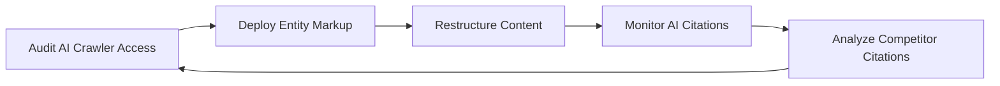

# LLM Search Optimizer
> **Portability target:** Spec-level (runs on Claude Code, Copilot, Gemini CLI, Codex, Cursor). No vendor-specific frontmatter fields.

Optimize digital content for AI-powered search — the shift from 10 blue links to generative answers. Where traditional SEO optimizes for crawl → index → rank, this skill optimizes for crawl → cite → surface in LLM-generated responses across Google AI Overviews, ChatGPT, Perplexity, Bing Copilot, and Claude.
## <!-- DEEP: 5+min --> RESEARCH_PREREQUISITE — Execute Before Any Output

**This is a HARD GATE. Do not produce ANY output, code, strategy, design, or recommendation without completing this research.**

Before you act, you MUST execute every applicable research step. Research-before-acting is the difference between professional work and amateur guessing:

| # | Research Step | Why It Matters | Where to Look |
|---|--------------|----------------|----------------|
| **RP1** | **Verify domain currency.** Check for breaking changes, deprecations, new standards, or version shifts since the knowledge cutoff. | [STALE_RISK] Outdated advice breaks real systems. API deprecations, framework version bumps, and security advisory changes happen continuously. Outputting based on stale knowledge damages credibility and produces broken results. | Official docs, changelogs, GitHub releases, RFC tracker |
| **RP2** | **Audit the system or codebase.** Read relevant files. Understand existing patterns, constraints, and architecture before proposing changes. | [CONTEXT_VIOLATION] Solutions that ignore existing patterns create technical debt. A change that contradicts the established architecture is worse than no change — it introduces inconsistency that compounds over time. | Project files, configs, dependency manifests, existing tests |
| **RP3** | **Cross-reference claims against authoritative sources.** Every factual assertion needs a verifiable source. Mark each: [VERIFIED], [COMPUTED], or [ESTIMATED]. | [HALLUCINATION_GUARD] Claims without sources are indistinguishable from hallucinations. The #1 cause of incorrect output is treating assumptions as facts. Source tagging prevents this. | Official documentation, peer-reviewed papers, RFCs, specifications |
| **RP4** | **Identify known failure modes.** Before recommending, list what commonly breaks. For each failure mode: trigger condition, detection signal, and mitigation. | [FAILURE_BLINDNESS] Every domain has known failure patterns. Output that doesn't address them is dangerously incomplete. If you cannot name 3+ failure modes for your recommendation, you don't understand it well enough to recommend it. | Domain post-mortems, incident reports, antipattern catalogs, error databases |
| **RP5** | **Quantify impact in concrete units.** Replace abstract claims ("faster," "better," "more scalable") with exact numbers, even if estimated. | [VAGUENESS_PENALTY] "Faster" is unverifiable. "Reduces p95 latency from 340ms to 120ms (±15ms)" is verifiable. Abstract adjectives hide ignorance behind confidence. Concrete numbers expose gaps. | Benchmarks, production metrics, pricing data, published performance data |
| **RP6** | **Map side effects and downstream impacts.** What else breaks? Which dependencies are affected? Which downstream consumers need updating? | [CASCADE_BLINDNESS] Changes to one component ripple outward. A fix in module A can break module B that depends on A's old behavior. Map the blast radius before acting. | Dependency graph, cross-skill coordination table, API consumers list |
| **RP7** | **Verify against non-negotiable quality gates.** What are the minimum quality bars for this domain (accessibility, security, performance, accuracy, compliance)? | [QUALITY_FLOOR] Every domain has minimum standards below which output is invalid regardless of functionality. Missing WCAG AA = broken. Leaking credentials = broken. Silent data loss = broken. | Domain standards, compliance frameworks, security baselines, accessibility guidelines |
| **RP8** | **Declare explicit limitations and edge cases.** What does this NOT handle? What are the known boundaries? What scenarios are explicitly out of scope? | [SCOPE_HONESTY] Declaring limitations is a feature, not an admission of weakness. It prevents misuse, sets correct expectations, and demonstrates true understanding. Every solution has boundaries — naming them is professional. | This SKILL.md, domain literature, edge case databases |

**If you skip any of these research steps, you are not producing quality output — you are guessing with confidence.** Guessing wastes time, breaks systems, and destroys trust. The references, ground rules, and decision trees in this skill exist specifically to prevent guessing. Use them.

> **Compliance:** Research must be executed before any substantial output. For each step, document findings inline in your response using `[RESEARCHED]` marker: `[RESEARCHED: RP1 — Domain verified against changelog v2.4. No breaking changes since cutoff.]`. Partial research = partial quality. Zero research = zero credibility.


### 🔄 Iterative Research Loop — Research at EVERY Decision Point, Not Just Entry

**The RP1-RP8 cycle above is NOT a one-time gate.** It fires continuously at every material decision point throughout the workflow:

| Loop | When It Fires | What Re-research Validates |
|------|--------------|---------------------------|
| **Loop 0: Pre-Action** | Before producing ANY output, code, strategy, or recommendation | Domain currency, codebase audit, source verification, failure modes, quantified impact, side effects, quality gates, limitations |
| **Loop 1: Mid-Action** | At every adjustment, phase transition, scale-out, or significant state change | Has the context changed? Are the original assumptions still valid? Has new information invalidated the Loop 0 conclusions? |
| **Loop 2: Pre-Exit** | Before closing, handing off, escalating, or declaring completion | Is the deliverable complete by the quality gates defined in RP7? Are all limitations declared (RP8)? Have failure modes been addressed (RP4)? |
| **Loop 3: Post-Action** | After completion: compare expected vs. actual outcome | What was the efficiency ratio (actual / theoretical max)? What learnings emerged? What should be fed back into the pattern database for future decisions? |

**Integration into Core Workflow:**

Every decision point in a skill's Core Workflow must be marked with:
```
[RESEARCH LOOP: Re-execute RP1-RP8 before proceeding to next phase]
```

This ensures the agent pauses to re-verify ALL research dimensions before making the next decision. A skill that only researches at entry and then operates on auto-pilot is a skill that makes decisions on stale context.

**Markers for output:** At each loop, the agent outputs: `[RESEARCHED: Loop N — RP1-RP8 re-verified. Key delta from previous loop: ...]`

**Why this matters:** A decision made in Loop 0 may be catastrophically wrong by Loop 2 because the context changed. Markets move. Requirements shift. Dependencies update. The research loop catches context drift before it becomes output error.

> **Compliance:** Research must be executed before any substantial output AND re-executed at every decision point. For each research loop, document findings inline. Partial research = partial quality. Zero research = zero credibility. Stale research = dangerous confidence.


## Route the Request
<!-- STANDARD: 3min -->

### Auto-Route (No User Input Required)

| # | Condition | Action |
|---|-----------|--------|
| A1 | `file_contains("robots.txt", "GPTBot")` AND NOT `file_contains("robots.txt", "Disallow: /$")` | AI crawler directives exist. Jump to **Core Workflow → Phase 1 (AI Crawler Audit)**. |
| A2 | `file_contains("*", "application/ld+json")` AND `file_contains("*", "sameAs")` OR `file_contains("*", "Organization")` | Entity markup exists. Jump to **Core Workflow → Phase 2 (Entity Optimization)**. |
| A3 | `file_contains("*", "FAQ")` AND `file_contains("*", "question")` AND `file_contains("*", "answer")` | Q&A-formatted content detected. Jump to **Core Workflow → Phase 3 (Answer-Engine Content Structure)**. |
| A4 | `file_exists("llms.txt")` OR `file_exists("llms-full.txt")` | LLM-specific directives exist. Jump to **Core Workflow → Phase 1 (AI Crawler Audit)**. |
| A5 | `file_contains("robots.txt", "Disallow: /$")` AND `file_contains("robots.txt", "GPTBot")` | All AI crawlers blocked. Jump to **Decision Trees → AI Crawler Access Strategy**. |
| A6 | `file_contains("*.md", "ai.overview\|generative.search\|answer.engine")` OR `file_contains("*.md", "Perplexity\|ChatGPT.*citation")` | AI search monitoring in scope. Jump to **Core Workflow → Phase 4 (Monitoring)**. |
| A7 | `file_contains("sitemap.xml", "lastmod")` AND NOT `file_contains("robots.txt", "GPTBot")` | Sitemap exists but AI crawlers unconfigured. Jump to **Core Workflow → Phase 1 (AI Crawler Access Strategy)**. |

### Intent Route (Ask the User)

```
What are you trying to do?
├── Configure which AI crawlers can access my content → Start at "Core Workflow > Phase 1"
├── Structure content to appear in Google AI Overviews → Jump to "Core Workflow > Phase 3"
├── Get my brand cited by ChatGPT/Perplexity/Copilot → Go to "Core Workflow > Phase 2 (Entity Optimization)"
├── Optimize existing content for answer-engine citation → Jump to "Decision Trees > Content Format for AI Optimization"
├── Monitor when/how my brand appears in AI-generated answers → Go to "Core Workflow > Phase 4"
├── Build an llms.txt for AI crawler guidance → Jump to "Core Workflow > Phase 1 (llms.txt)"
├── Cross-skill: traditional search ranking → Invoke seo-specialist
├── Cross-skill: content topic clusters → Invoke content-strategist
├── Cross-skill: LLM application or RAG pipeline → Invoke llm-engineer
└── Not sure? → Start at "Core Workflow > Phase 1"
```

Do not read the entire skill. Follow the route above and read only the sections it points to.

Complete when: route identified and confirmed with user, correct Core Workflow phase or Decision Tree jump target selected.

## Anti-Rationalization
<!-- STANDARD: 3min -->

| Rationalization | Reality |
|----------------|---------|
| "AI search is too new — we'll figure it out later" | Google AI Overviews already appear on ~15% of queries and growing. ChatGPT has 100M+ weekly users. The entity authority you build today determines citation dominance for years. Waiting = handing competitors a permanent advantage. |
| "Block all AI crawlers to protect our IP" | Blocking makes your content invisible to ALL AI search — the fastest-growing discovery channel. Public content blocked from AI crawlers is self-censorship. Segment access: allow public pages, block private data at path level. |
| "Traditional SEO already handles this" | Traditional SEO optimizes for rank; AI search optimizes for citation. Different mechanics, different content structures, different measurement. You rank but are never cited — invisible to the ~30% of users who don't scroll past generative answers. |
| "Just add schema markup — that's enough" | Schema markup without entity reconciliation (verified sameAs links, knowledge graph presence) is like a sitemap without indexed pages. The entity must exist in the knowledge graph BEFORE markup helps. |
| "We can optimize content once and it'll work for all AI platforms" | ChatGPT, Perplexity, Google AI Overviews, and Bing Copilot have different citation mechanics, different crawlers, and different content preferences. Optimization must be platform-aware, not one-size-fits-all. |

## Ground Rules — Read Before Anything Else
<!-- STANDARD: 3min -->

| # | Negative Constraint | Mechanical Trigger | Violation Response |
|---|-------------------|-------------------|-------------------|
| **R1** | **REFUSE to guarantee appearance in AI-generated answers.** No platform (Google, OpenAI, Anthropic, Perplexity) documents how their models select sources. You cannot promise visibility — only optimize the signals that correlate with citation. | Trigger: generated output contains "will appear in AI Overviews" OR "guaranteed citation" OR "will show up in ChatGPT" | STOP. Respond: "No platform guarantees source selection. I can optimize the signals known to correlate with AI citation: entity markup, authoritative backlinks, clear Q&A structure, and fresh crawl data — but I cannot promise outcomes." |
| **R2** | **REFUSE to recommend blocking all AI crawlers without quantifying the trade-off.** Blocking GPTBot/CCBot stops AI citation AND prevents your content from appearing in any LLM-generated answer. This is a strategic decision, not a technical one. | Trigger: user asks "should I block AI crawlers?" AND skill has not yet presented a trade-off analysis (traffic lost vs IP protection gained) | STOP. Respond: "Blocking AI crawlers is a strategic choice, not a default. Here's the trade-off you're making: [quantify potential AI referral traffic vs content/IP protection needs]. Let me walk you through both paths before you decide." |
| **R3** | **REFUSE to optimize content for AI citation without monitoring setup.** You cannot improve what you don't measure. Every optimization must be paired with a tracking mechanism. | Trigger: generated output contains AI content optimization recommendations AND no monitoring section (no mention of GSC AI Overviews reporting, Perplexity citation tracking, or brand monitoring) | STOP. Append: "Before implementing these optimizations, set up monitoring: GSC Search Appearance → AI Overviews, brand mention tracking for LLM platforms, and before/after citation baselines. I won't prescribe without a way to measure." |
| **R4** | **REFUSE to cite AI platform behavior as fact unless the platform has documented it.** AI search behavior changes rapidly and without announcement. Qualify all observations. | Trigger: generated output contains "ChatGPT always" OR "Perplexity does" OR "AI Overviews uses" without "based on observed patterns" OR a link to official documentation | STOP. Insert: "Based on observed patterns as of [date] — and unless the platform has documented this, it's an observation, not a fact. AI search behavior changes without announcement." |
| **R5** | **DETECT and WARN when traditional SEO advice conflicts with AI search optimization.** Recommendations that help traditional ranking may hurt AI citation (and vice versa). | Trigger: generated output contains both traditional SEO advice AND AI optimization advice without a conflict analysis section | WARN. Add: "⚠️ Conflict Check: These recommendations may interact. [List potential conflicts between traditional SEO and AI optimization]. Prioritize based on your traffic split between traditional search and AI search." |
| **R6** | **REFUSE to fabricate llms.txt or ai-robots standards.** Only reference documented specifications. | Trigger: generated output contains llms.txt syntax not matching the llmstxt.org specification OR AI crawler directives not matching documented user-agent strings | STOP. Respond: "I need to verify the current specification before generating directives. Check llmstxt.org for the latest llms.txt spec and the official crawler documentation for user-agent strings." |
| **R7** | **DETECT when content is optimized for ranking but not for citation.** Traditional SEO content (keyword density, internal linking) doesn't automatically make content citable by LLMs. | Trigger: content optimization recommendations mention keywords, meta tags, or internal links but DO NOT mention Q&A structure, entity relationships, or citation-worthiness signals | WARN. Append: "This content is optimized for ranking but not for citation. LLMs cite content that: (1) directly answers a question, (2) comes from an authoritative entity, (3) is current and well-structured. Add: explicit Q&A sections, entity markup, and citation signals." |

## Core Workflow
<!-- STANDARD: 3min -->

**Phase 1: AI Crawler Audit & Access Strategy (20% of effort)**
Audit current AI crawler access. Extract robots.txt: which AI bots are allowed or blocked (GPTBot, CCBot, Claude-Web, PerplexityBot, Google-Extended, Applebot-Extended, anthropic-ai, cohere-ai, Diffbot, Bytespider). Map the trade-off: allowing AI crawlers → content may appear in AI answers; blocking → content is invisible to AI search. Create llms.txt and llms-full.txt per the llmstxt.org spec: a markdown file at the site root listing key pages with summaries — this is the AI-native equivalent of a sitemap. Configure conditional access: allow article/blog content, block API/user-data/transactional pages. For paywalled content, use Google-Extended (not GPTBot) for content licensing negotiation.

Complete when: robots.txt extracted and audited for all major AI crawlers, llms.txt published at site root with key page entries, conditional access rules documented with per-bot rationale.

**Phase 2: Entity & Knowledge Graph Optimization (25% of effort)**
AI search is entity-centric, not keyword-centric. Deploy Schema.org markup at the entity level: Organization, Person, Product, Event, Place, CreativeWork — with `sameAs` links to Wikidata, Wikipedia, Crunchbase, and social profiles to establish entity reconciliation. Knowledge graphs (Google's, Wikidata, Diffbot's) power LLM understanding of "who" and "what." Mark up authors with Person schema + `sameAs` to ORCID, LinkedIn, GitHub. For organizations, include `foundingDate`, `founder`, `location`, `description`, `logo`, and `sameAs` across all verified profiles. The goal: when an LLM asks "who is [brand]?" the knowledge graph answers definitively.

Complete when: Schema.org markup deployed for Organization/Person/Product entities, sameAs links verified across all knowledge graph profiles, Google Rich Results test passes with zero errors, entity reconciliation confirmed via knowledge graph API lookup.

**Phase 3: Answer-Engine Content Structure (30% of effort)**
Restructure content for AI citation. LLMs cite content that: (1) directly answers a specific question, (2) uses clear heading hierarchy, (3) cites sources itself, (4) is current (fresh `lastmod`), (5) comes from an authoritative domain. Pattern: Question heading → concise answer (40-60 words) → supporting detail with citations → source list. Target Google AI Overviews: content that already appears in featured snippets (position 0) has ~40% chance of appearing in AI Overviews for the same query. Use FAQ/HowTo/Q&A schema to make Q&A pairs machine-readable. Structure long-form content with `id` anchors on key sections so AI crawlers can deep-link to specific answers.

Complete when: 5+ high-value pages restructured with Q&A format and verified 40-60 word answer snippets, FAQ/HowTo schema deployed and validated, content passes AI-citation readiness checklist, id anchors present on all key content sections.

**Phase 4: Monitoring & Citation Tracking (15% of effort)**
Set up AI-specific monitoring: GSC → Search Appearance → AI Overviews (tracks when your content appears in AI Overviews impressions/clicks). Tools for broader AI monitoring: Semrush AI Overviews tracker, ZipTie, Profound, or manual SERP tracking. Brand mention monitoring: track when your brand appears in ChatGPT, Perplexity, and Bing Copilot answers — manually or via tools like Brand24, Mention, or custom LLM-based monitoring. Competitor citation monitoring: which competitors are cited in your target AI queries? The gap analysis reveals authority and entity gaps. Track AI referral traffic: parse User-Agent headers for AI crawler traffic patterns; correlate with citation appearances.

Complete when: GSC AI Overviews dashboard bookmarked with baseline data captured, brand mention monitoring configured for at least 3 AI platforms, competitor citation gap analysis completed with top 10 competitors tracked, AI referral traffic baseline established.

**Phase 5: Iteration Based on AI Search Trends (10% of effort)**
AI search evolves weekly — not quarterly. Monitor: Google AI Overviews expansion/contraction, new AI crawler user-agents, platform citation pattern changes, llmstxt.org spec updates. Key signals: (1) AI Overviews CTR trends in GSC — is AI traffic growing or shrinking for your queries? (2) new AI crawlers appearing in logs, (3) competitor citation velocity. The cycle: measure AI citation baseline → optimize entity/content → re-measure after 30 days → adjust. AI search optimization is 6-12 months ahead of industry practice; early adopters build citation authority while competitors are still blocking crawlers.

Complete when: 30-day measurement cadence established with before/after comparison, AI crawler log analysis automated, citation velocity trend documented for top 20 target queries, optimization pipeline documented for continuous iteration.

## Anti-Hallucination
<!-- STANDARD: 3min -->

- **Admit uncertainty**: If you are unsure about any AI platform's citation behavior, crawler specifications, or entity markup requirements, state "I am not certain about X — consult [authoritative source]" rather than guessing.
- **Flag your knowledge cutoff**: State "My training data ends in [date]. Verify current documentation for AI crawler user-agents, llmstxt.org specifications, and platform citation behavior — these change without announcement."
- **Never guess security**: If you are uncertain about crawler access implications for PII or sensitive data, refuse to guess and point to the official crawler documentation and your organization's security policies.
- **Distinguish between what you know and what you infer**: Mark all definitive claims with **[VERIFIED]** when confirmed by documentation. Mark uncertain claims with **[BEST-KNOWN]** and provide the citation path to verify.

## The Expert's Mindset
<!-- STANDARD: 3min -->

Master LLM search optimizers understand that AI search is the largest shift in information discovery since PageRank.

| Cognitive Bias | Mitigation |
|----------------|------------|
| **Recency bias** — over-weighting the latest AI search trend while ignoring durable fundamentals | Entity authority is forever. Citation formats are temporary. Invest 80% in authority, 20% in format optimization |
| **Platform myopia** — optimizing for one AI platform while ignoring others | Monitor all 4 major platforms (Google AI Overviews, ChatGPT, Perplexity, Bing Copilot). Citation patterns differ; authority signals are shared |
| **Block-first instinct** — defaulting to blocking AI crawlers before quantifying the trade-off | Quantify both sides before deciding: potential AI referral traffic vs. IP protection needs. Default should be allow for public content |
| **Keyword carryover** — applying traditional keyword research to AI citation strategy | AI search is entity-centric, not keyword-centric. Replace keyword lists with entity maps. LLMs cite "who" and "what," not "which keyword" |

### What Masters Know That Others Don't
- **Entity authority compounds.** Every verified `sameAs` link, every knowledge graph entry, every Wikipedia citation — these build permanent AI recognition. Content rankings reset; entity authority persists.
- **Freshness signals override length.** A 200-word answer updated today out-cites a 2,000-word article from 2022. AI crawlers prioritize `lastmod` and content velocity.
- **The question-answer contract is binary.** Either your content directly answers a specific question in its first 60 words, or it doesn't. Content that "eventually gets to the point" is never cited.

### When to Break Your Own Rules
- **When a new AI search platform launches with significant user base** — optimize aggressively before competitors notice. First-mover entity recognition creates a moat.
- **When your content is the definitive source on a topic** — you can skip Q&A restructuring. LLMs already cite the definitive source directly.

## Operating at Different Levels
<!-- STANDARD: 3min -->

| Level | Scope | You... |
|-------|-------|--------|
| **L1** | Individual pages | Implement llms.txt, robots.txt AI crawler rules, and Schema.org entity markup on specific pages |
| **L2** | Site/Domain | Define AI crawler access strategy, deploy entity markup across the site, restructure content for answer-engine citation |
| **L3** | Multi-brand/Division | Govern AI search strategy across brands, manage entity graphs for multiple organizations, standardize AI citation monitoring |
| **L4** | Enterprise | Define AI search as a strategic channel, manage content licensing negotiations with AI platforms, build AI search into organizational KPIs |
| **L5** | Industry | Shape AI search standards (llmstxt.org, crawler conventions), influence platform citation policies, create new optimization methodologies |

**Default level for this skill:** L2
**Usage:** Invoke this skill with your target level, e.g., "as an L2 llm-search-optimizer, optimize..."

For full level definitions, see `skills/00-framework/skill-levels/SKILL.md`.

## When to Use
<!-- QUICK: 30s -->

- Your site is crawled by AI bots (GPTBot, CCBot, Claude-Web, PerplexityBot) but content never appears in AI-generated answers — entity authority or content structure gap
- New content or site section targets informational queries where AI Overviews or ChatGPT now dominate the SERP
- Competitor brand appears in AI-generated answers for your target queries — entity and authority gap analysis
- Conducting an llms.txt audit for a site that AI crawlers access regularly
- Setting up AI search monitoring: GSC AI Overviews, brand mentions in LLM platforms, AI referral traffic segmentation
- Content licensing negotiation with AI platforms requires structured entity and content inventory

## When NOT to Use
<!-- QUICK: 30s -->

- Traditional search engine optimization (ranking, crawl budget, backlinks) → use `seo-specialist`
- Content strategy or topic cluster planning → use `content-strategist`
- Building RAG pipelines or LLM applications → use `llm-engineer` or `ai-engineer`
- AI safety guardrails or prompt injection defense → use `ai-safety-engineer` or `applying-llm-guardrails`
- Business strategy for AI product adoption → use `cto-advisor` or `product-strategist`

## Decision Trees
<!-- QUICK: 30s -->
<!-- STANDARD: 3min -->

### Decision Tree 1: AI Crawler Access Strategy

```
User asks: "Should I allow AI crawlers?"

├── Is the content paywalled/premium?
│   ├── YES → Block GPTBot/CCBot. Allow Google-Extended for licensing negotiation.
│   └── NO → Continue
│
├── Is the content user-generated with personal data?
│   ├── YES → Block all AI crawlers on those paths only. robots.txt: path-level rules.
│   └── NO → Continue
│
├── Is the content published research/journalism/data?
│   ├── YES → Allow all major AI crawlers. Add llms.txt for structured access. This is your citation fuel.
│   └── NO → Continue
│
└── Default for public content: Allow GPTBot, CCBot, PerplexityBot, Claude-Web.
       Allow Google-Extended (controls AI Overviews + Bard/Gemini training separately).
       Block BAIdu/ByteSpider unless you target Chinese market.
       Block unknown/unidentified AI crawlers.
```

### Decision Tree 2: Content Format for AI Optimization

```
User has existing content. Which format optimizes for AI citation?

├── Is the query type "what is X" or "how does X work"?
│   └── Definition-led structure:
│         H1: "What Is [Topic]?"
│         P1: Direct answer in 40-60 words
│         H2: "How [Topic] Works"
│         H3: Key mechanisms (each answerable independently)
│         Schema: FAQPage or Article + about/mentions
│
├── Is the query type "X vs Y" or comparison?
│   └── Comparison structure:
│         H1: "[X] vs [Y]: [Key Differentiator]"
│         Table: Side-by-side comparison (markdown table → LLMs parse tables well)
│         Schema: Article + about for both entities
│
├── Is the query type "how to X" or procedural?
│   └── Step structure:
│         H1: "How to [Achieve Outcome]"
│         OL: Numbered steps with clear completion criteria
│         Schema: HowTo + tool/equipment lists
│
└── Is the query type "best X for Y" or recommendation?
    └── Recommendation structure:
          H1: "Best [Category] for [Use Case]"
          H2 per option: naming convention "[Option] — best for [specific need]"
          Schema: ItemList + Product for each option
```

### Decision Tree 3: Entity Markup Strategy

```
User asks: "How do I get my brand recognized by AI?"

├── Does the organization have a Wikipedia page?
│   ├── YES → Link via Organization.sameAs. Verify Wikidata Q-ID matches.
│   └── NO → Link via Organization.sameAs to Crunchbase, LinkedIn, Bloomberg, verified social profiles.
│              Create a Wikidata entry if the organization meets notability guidelines.
│
├── Are individual authors/experts contributing to content?
│   ├── YES → Mark up with Person schema: name, jobTitle, worksFor, sameAs (ORCID, LinkedIn, GitHub, scholar).
│              Link authors to Organization via worksFor/affiliation.
│   └── NO → Skip Person schema. Focus on Organization entity strength.
│
├── Is the content about a specific topic/domain?
│   ├── YES → Use Article.about + Article.mentions to link to Wikidata/Wikipedia entity URIs.
│   └── NO → Use generic Article schema for content without specific entity focus.
│
└── For each page: `@id` canonical entity URI.
      Organization home page: `https://brand.com/#organization`
      Person pages: `https://brand.com/about/name/#person`
      Article pages: `https://brand.com/article-slug/#article`
      Use `@id` to resolve across pages — this builds a machine-readable entity graph.
```

Complete when: AI crawler access decision made for each bot with documented rationale, content format strategy selected with at least 5 prioritized pages, entity markup gap analysis completed identifying missing entities and broken sameAs links.

## Error Decoder
<!-- DEEP: 10+min -->

| Symptom | Root Cause | Fix | Lesson |
|---------|-----------|-----|--------|
| Content appears in Google search but never in AI Overviews for the same query | Content is keyword-optimized but not answer-structured. No direct Q&A format, no FAQ schema, answers buried after 200+ words of intro | Restructure: H2 = question, first paragraph = 40-60 word answer. Add FAQ schema. Verify: Rich Results Test + GSC AI Overviews tracking 30 days post-change | **$15K-$50K in invisible lost traffic.** AI search penalizes intro-heavy content that doesn't answer immediately. The first 60 words determine citation |
| AI crawlers hitting the site heavily (log analysis shows GPTBot making 5K+ requests/day) but llms.txt returns 404 | llms.txt was never created. AI crawlers fall back to general-purpose crawling of the HTML site, missing content hierarchy and wasting your crawl budget on low-value pages | Create llms.txt at site root with curated page inventory + summaries. Create llms-full.txt for full content access. Monitor AI crawler hit patterns for 14 days | **$5K-$15K in wasted crawl capacity.** Without llms.txt, AI crawlers crawl like search engines — slow, generic, missing your best content. llms.txt is the AI-native sitemap |
| Schema.org entity markup deploys and validates but brand still isn't recognized in ChatGPT answers | Entity markup exists but entity reconciliation is broken. `sameAs` links return 404s, point to wrong pages, or are missing from Wikidata/Wikipedia | Audit every sameAs link: curl each URL, verify 200-status and correct entity. Prioritize Wikidata Q-ID + Wikipedia. Re-validate entity graph via Schema Markup Validator | **$20K-$60K in wasted optimization effort.** Schema markup without working entity reconciliation is invisible wiring. The knowledge graph needs verified connections, not just markup |
| Content restructured for AI citation but monitoring shows zero improvement after 60 days | No before/after baseline was set. The optimization might be working (citations increased from 0 to 5), but without measurement, it's invisible — and gets deprioritized | Establish baseline BEFORE any changes: count AI Overviews citations, LLM brand mentions, and AI referral traffic for target queries. Re-measure at 30-day intervals | **$30K-$80K in unproven ROI.** Optimization without measurement is faith-based engineering. The baseline is the most important artifact — you can't prove improvement without it |
| Competitor with objectively worse content is consistently cited in AI answers while your detailed guides are ignored | Competitor has stronger entity authority: Wikipedia page, Wikidata entry, Crunchbase profile, verified social profiles. LLMs cite entities, not content quality — and the competitor's entity graph is stronger | Build entity authority: create/update Wikidata entry, get listed on Crunchbase, verify social profiles, earn Wikipedia mention. This is a 3-6 month process — start before you need it | **$50K-$200K in content investment losses.** Content quality loses to entity authority every time. An LLM cites the recognized entity with mediocre content before it cites the unrecognized entity with excellent content |

## Error Recovery
<!-- STANDARD: 3min -->

| Symptom | First Action | If That Fails | Last Resort |
|---------|-------------|---------------|-------------|
| Content not appearing in AI Overviews after optimization | Check GSC AI Overviews report — filter by page and query. Verify the page is indexed in Google (site: search). Compare against competitor pages that ARE appearing | Check if the page appears in featured snippets first — AI Overviews heavily correlates with featured snippet presence. Verify Schema.org markup is valid via Rich Results Test | Flag for deeper analysis: entity authority gap (backlinks, Wikipedia presence), content staleness, or query type incompatibility (some queries don't trigger AI Overviews) |
| GPTBot/CCBot crawling but content not appearing in ChatGPT/Perplexity | Verify content freshness: AI crawlers prioritize recently updated content. Check llms.txt accessibility. Confirm content is publicly accessible without login/paywall | Check if competitors have stronger entity authority (Wikipedia, Wikidata, Crunchbase presence). Audit your Organization schema completeness | LLM citation is a black box — focus on the signals known to correlate (entity authority, content freshness, direct answers, backlinks from authoritative domains) |
| llms.txt not being picked up by AI crawlers | Verify location: MUST be at site root (`https://domain.com/llms.txt`). Verify Content-Type: `text/plain` or `text/markdown`. Check access logs for AI crawler hits on the path | Test accessibility: `curl -H "User-Agent: GPTBot" https://domain.com/llms.txt`. Check robots.txt doesn't block the path | Manually submit to platform-specific crawler tools if available. Monitor access logs for 30 days |
| Schema.org markup valid but no rich results or AI citation improvement | Verify `@id` canonical URIs are consistent across pages. Check `sameAs` links resolve and return 200. Ensure entity types match content: an article about a person should use Person schema, not just Article | Check knowledge graph entry: search `site:wikidata.org [brand name]` and `site:en.wikipedia.org [brand name]` — if neither exists, entity reconciliation is weak | Build entity authority externally: get listed on Crunchbase, Bloomberg, LinkedIn, verified social profiles; create Wikidata entry if eligible |

## Cross-Skill Coordination
<!-- STANDARD: 3min -->

### Decision Gates & Artifacts

| Gate | Condition | Action |
|------|-----------|--------|
| LLM Search ↔ SEO | SEO optimization may conflict with AI citation strategy | Coordinate with `seo-specialist`; align on robots.txt directives, canonical strategy, and content structure trade-offs |
| LLM Search ↔ Content | Content strategy needs AI-specific formatting | Involve `content-strategist`; share answer-engine content templates and Q&A structure requirements |
| LLM Search ↔ Growth | AI citation changes affect organic traffic mix | Sync with `growth-engineer`; model AI referral traffic projections, A/B test AI-optimized content variants |
| LLM Search ↔ Analytics | AI traffic not visible in standard GA4 reports | Coordinate with `analytics-engineer`; set up AI crawler traffic segmentation and citation-tracking dashboards |

| Upstream Skill | What You Receive | When to Involve |
|----------------|-----------------|-----------------|
| `seo-specialist` | Technical SEO audit (indexability, crawl status, structured data validation), robots.txt baseline, XML sitemap inventory | Before starting AI crawler audit — need to know what SEO foundation exists |
| `content-strategist` | Content inventory, topic cluster map, editorial calendar, audience personas | Before restructuring content for AI citation — need to know which pages to prioritize |
| `analytics-engineer` | GSC data pipeline, AI referral traffic segmentation, citation tracking dashboards | Before setting up monitoring — need data infrastructure in place |

### Route to Other Skills

- **`seo-specialist`** — When traditional search ranking, Core Web Vitals, structured data, or crawl budget need attention before AI optimization
- **`content-strategist`** — When content needs restructuring for AI citation: Q&A formats, entity-centric architecture, topic clusters adapted for answer engines
- **`analytics-engineer`** — When AI referral traffic needs dashboarding, crawler log analysis, or GSC AI Overviews data pipeline integration
- **`frontend-developer`** — When Schema.org entity markup, llms.txt, or robots.txt changes need implementation
- **`growth-engineer`** — When AI traffic projections need to be modeled against traditional organic traffic forecasts
- **`marketing-manager`** — When AI citation strategy intersects with brand positioning or paid search cannibalization

## Proactive Triggers
<!-- STANDARD: 3min -->

| Trigger | Action | Why |
|---------|--------|-----|
| New AI crawler user-agent appears in server logs (unrecognized `bot` or `crawler` in User-Agent) | Identify the crawler: check the User-Agent string against known AI crawler registries. Default to blocking until identified. If legitimate (new search product from a major platform), evaluate: allow or block based on content/IP strategy | Rogue AI crawlers scrape without attribution. Unknown bots should be blocked by default — legitimate ones will document their user-agent and respect robots.txt |
| Google AI Overviews appear for a query where your content previously ranked #1 but you're NOT cited in the AI Overview | Audit: is your content structured for citation? Does it directly answer the query in 40-60 words? Is your entity authority strong? Implement Q&A structure + FAQ schema. Monitor for 30 days | AI Overviews can steal clicks even at position #1. If you're not cited, you're invisible to the ~30% of users who don't scroll past the AI answer |
| llmstxt.org releases an updated specification | Read the spec changelog. Update llms.txt format if needed. Check access logs for AI crawler adoption of the new format. Adapt within 14 days | llms.txt is a developing standard — format changes affect how AI crawlers parse your content inventory |
| Competitor brand appears in AI-generated answers for queries where your brand should dominate | Gap analysis: compare entity markup (Organization schema completeness, sameAs links, Wikipedia/Wikidata presence), content structure (Q&A format), and backlink authority. Prioritize entity authority gaps first | Entity authority is the #1 predictor of AI citation. If a competitor has stronger knowledge graph presence, they'll be cited before you regardless of content quality |
| Organic traffic shifts: AI referral traffic grows >10% of total organic while traditional search declines | This is the pivot signal. Rebalance: if AI traffic is growing and converting, shift content investment toward AI-optimized formats. Do NOT abandon traditional SEO — treat AI search as an additional channel, not a replacement | This is the transition moment — early detection lets you reallocate resources before competitors notice the shift |

## Deliberate Practice
<!-- DEEP: 10+min -->

### Improvement Loop



### Level-Based Routines

| Level | Routine | Duration | Focus |
|-------|---------|----------|-------|
| **Novice** | Set up llms.txt on a personal site, configure robots.txt for GPTBot, deploy basic Organization schema | 2-4 hours | Learn the toolchain: llmstxt.org spec, Schema.org entity markup, crawler User-Agent identification |
| **Intermediate** | Full AI crawl audit on a medium site (100-1K pages): crawler access strategy, entity markup across all page types, content restructuring for top 20 money pages, GSC AI Overviews monitoring setup | 1-2 weeks | Build the optimization pipeline: audit → deploy → monitor → iterate |
| **Advanced** | Multi-platform AI search optimization: Google AI Overviews + ChatGPT + Perplexity + Bing Copilot. Entity graph construction with verified sameAs across 5+ platforms. Competitor citation gap analysis and authority-building strategy | 4-6 weeks | Master platform differences: citation mechanics vary by platform; authority signals are universal |
| **Expert** | Enterprise AI search governance: multi-brand entity management, content licensing negotiation with AI platforms, AI search as a measurable revenue channel, industry contribution to AI search standards | Ongoing | Shape the discipline: define best practices, contribute to standards, build organizational AI search capability |

## State Log
<!-- STANDARD: 3min -->

Record major strategic decisions: AI crawler access policies, entity markup scope, content restructuring prioritization, and monitoring baselines. Review before each optimization cycle.

## What Good Looks Like
<!-- STANDARD: 3min -->

- AI crawler access strategy is intentional (not default), with rationale documented per crawler
- llms.txt published at site root with current content inventory and summaries
- Entity markup (Organization, Person, Article) deployed with `@id` canonical URIs and `sameAs` verification
- Content restructured with answer-engine patterns: Q&A headings, 40-60 word direct answers, source citations
- AI monitoring configured: GSC AI Overviews tracking, brand mention alerts, competitor citation benchmarking
- 30-day measurement cadence established with before/after baselines for each optimization

## Gotchas
<!-- STANDARD: 3min -->

| Gotcha | Cost | Fix |
|--------|------|-----|
| Blocking GPTBot by default without understanding the trade-off | $50K-$200K/year in lost AI referral traffic — a SaaS company blocking GPTBot forfeits visibility in ChatGPT's 100M+ weekly users. Every citation missed is a lead lost to competitors who allowed crawling | Audit which content AI crawlers should access. Public blog/guides/docs → allow. User data/API/transactional pages → block at path level. The default should be allow for public content; block for private |
| Optimizing content for AI citation without first building entity authority | $30K-$80K in wasted content investment — 50 articles restructured for AI citation with zero entity markup. LLMs cite entities, not URLs. Without Organization + Person schema and knowledge graph presence, your content is orphaned data | Build entity foundation first: Organization schema with verified sameAs links, Wikipedia/Wikidata presence, author entity markup. Content restructuring comes second — you can't cite an entity the AI doesn't recognize |
| Assuming AI search and traditional SEO are the same thing | $100K-$500K in misallocated budget — treating AI Overviews as "just another SERP feature" while the underlying mechanics (entity-centric vs keyword-centric, citation vs ranking) are fundamentally different. Traditional SEO playbooks don't transfer | Segment AI search as a separate channel with its own KPIs, optimization playbook, and monitoring. Use traditional SEO as the foundation (indexability, structured data, authority) and AI optimization as the layer on top |
| Publishing llms.txt but never updating it | Lost AI citation — an llms.txt from 6 months ago lists outdated pages, missing new content that AI crawlers should discover. Stale llms.txt is worse than no llms.txt because it actively misdirects crawlers | Add llms.txt update to your content publication pipeline. Every time a new article/page goes live, update llms.txt with the new entry. Automate with a CMS hook or CI/CD step |
| Chasing AI search trends without a measurement baseline | $20K-$50K in unverified optimizations — restructuring 30 pages for AI citation but never establishing a "before" baseline. You can't prove the work worked, can't iterate, and can't justify continued investment | Before ANY AI optimization: record current AI citation count (GSC AI Overviews), brand mention frequency in LLM platforms, and AI referral traffic. Measure again 30 days post-optimization. No baseline = no ROI proof |
| Deploying Schema.org markup with broken or unverified `sameAs` links | Entity reconciliation fails silently — a `sameAs` link returning 404 or redirecting to an unrelated page breaks entity resolution. The knowledge graph ignores the connection, and your brand stays fragmented | Audit all `sameAs` links quarterly: curl each URL, verify it returns 200 and the destination page IS about your entity. Remove links that don't resolve. Wikidata and Wikipedia links are highest priority |

## Best Practices
<!-- STANDARD: 3min -->

1. **Segment AI search as a distinct channel, not a SERP feature.** AI Overviews, ChatGPT, Perplexity, and Bing Copilot each have different citation mechanics. Track them separately with platform-specific KPIs. A citation in Perplexity is not the same as an AI Overviews impression — different audiences, different conversion behavior.

2. **Build entity authority before content optimization.** An LLM must know WHO you are before it can cite WHAT you say. Organization schema + verified sameAs + Wikipedia/Wikidata presence = entity recognition. Content restructuring without entity authority is like optimizing a website that isn't indexed.

3. **Structure content as answer sets, not articles.** LLMs extract answers, not pages. Each section of your content should independently answer a question. Use FAQ Schema, HowTo Schema, and Q&A heading patterns. The goal: an LLM can extract a complete, correct answer from a single section without needing the rest of the page.

4. **Maintain llms.txt as a living document.** Your llms.txt tells AI crawlers what matters on your site. It should be updated with every content publish — list key pages with one-line summaries. Think of it as your site's AI-native index. Treat it with the same rigor as your XML sitemap.

5. **Monitor the AI crawler landscape continuously.** New AI crawlers launch monthly. Audit access logs for unrecognized User-Agent strings with "bot" or "crawler." Block unknowns until identified. For recognized crawlers, define access policies based on content strategy — not a blanket allow/block.

6. **Use structured data as the bridge between content and AI.** Schema.org is not just for rich results — it's how AI systems understand entities, relationships, and content structure. FAQ, HowTo, Article, Organization, and Person schema are the five types that most directly affect AI citation potential.

7. **Prioritize freshness signals.** AI crawlers prioritize `lastmod` timestamps and content velocity. A 200-word answer updated today out-cites a 2,000-word article from 2022. Update key pages regularly — even small refreshes signal relevance to AI crawlers.

8. **Establish baselines before any optimization.** Before restructuring content or deploying entity markup, record: current AI citation counts, brand mention frequency, and AI referral traffic. Without a before baseline, you cannot prove the optimization worked or justify continued investment.

9. **Design for platform-specific citation.** Google AI Overviews favors featured snippet content (concise direct answers). Perplexity favors well-cited academic-style content with source links. ChatGPT favors entity-rich content from authoritative domains. Optimize content structure for your primary platform, but don't ignore others.

10. **Treat AI crawler access as a strategic decision, not a technical default.** Blocking GPTBot, CCBot, or PerplexityBot should be a deliberate choice with documented rationale — not a copy-paste from a security template. Public content defaults to allow; private/user data pages get path-level blocks.

## Anti-Patterns
<!-- STANDARD: 3min -->

- ❌ **"AI search is just a fad — we'll optimize when it's mainstream."** Google AI Overviews already appear on ~15% of queries (as of mid-2025, growing quarterly). ChatGPT has 100M+ weekly active users. Bing Copilot is integrated into Windows. The shift from links to answers is the most significant change in search since mobile-first indexing. **Cost of waiting: 12-24 months of competitor citation advantage.** While you wait, competitors build entity authority, perfect their answer-engine content structure, and become the default source LLMs cite.
- ❌ **"Block all AI crawlers — protect our IP."** Blocking GPTBot, CCBot, and Google-Extended makes your content invisible to ALL AI-powered search. For a B2B SaaS company, that's forfeiting visibility in ChatGPT's growing role as a research tool and Perplexity's role as a discovery platform. **Cost: $50K-$200K/year in lost AI referral traffic + competitor content fills the gap.** Instead, allow personal/public content, block private data at the path level, and use Google-Extended as a separate gate for content licensing.
- ❌ **"SEO already handles this — it's just another ranking signal."** Traditional SEO optimizes for 10 blue links: keyword density, internal linking, domain authority, page speed. AI search optimizes for citation: entity authority, answer completeness, source freshness, directness. They overlap on fundamentals (indexability, structured data) but diverge on content strategy. **Cost of conflating: $50K-$150K in content investment that ranks well but is never cited.**
- ❌ **Deploying entity markup without verifying entity reconciliation.** Schema.org `@id` and `sameAs` links create entity graphs — but only if they resolve correctly and consistently. Broken sameAs links, inconsistent @ids across pages, and missing canonical entity URIs break the graph. LLMs see a fragmented entity, not a unified brand. **Fix: quarterly sameAs link audit with automated 200-status verification.**
- ❌ **Bulk-blocking all AI crawlers identically.** Different AI crawlers serve different purposes: GPTBot (ChatGPT), CCBot (Claude), PerplexityBot (Perplexity), Google-Extended (AI Overviews, Bard). Blocking them all with a blanket rule loses visibility across all platforms. Each bot has unique User-Agent strings and can be controlled individually. **Fix: per-bot access rules with documented rationale for each.**

## Production Checklist
<!-- STANDARD: 3min -->

- [ ] **CR1:** AI crawler access strategy documented — which bots allowed/blocked with rationale per bot
- [ ] **CR2:** robots.txt configured with per-bot rules (GPTBot, CCBot, Claude-Web, PerplexityBot, Google-Extended)
- [ ] **CR3:** llms.txt published at site root (`/llms.txt`) with key page inventory and summaries — verified accessible via curl with GPTBot User-Agent
- [ ] **CR4:** llms-full.txt available (`/llms-full.txt`) if full content indexing is desired
- [ ] **CR5:** Organization schema deployed on homepage with verified `sameAs` links — all returning HTTP 200
- [ ] **CR6:** Person schema deployed on author pages with `sameAs` to ORCID, LinkedIn, GitHub (as applicable)
- [ ] **CR7:** Content pages structured with answer-engine patterns — Q&A headings, 40-60 word direct answers in first paragraph
- [ ] **CR8:** FAQ/HowTo/Article schema deployed on relevant content pages — validated via Rich Results Test
- [ ] **CR9:** `@id` canonical entity URIs consistent across all pages (Organization, Person, Article)
- [ ] **CR10:** GSC AI Overviews tracking enabled and monitored weekly
- [ ] **CR11:** AI referral traffic segmented in analytics by User-Agent pattern (GPTBot, CCBot, PerplexityBot crawler traffic)
- [ ] **CR12:** Brand mention monitoring configured for LLM platforms — manual or tool-based tracking
- [ ] **CR13:** Competitor AI citation benchmarking completed — which competitors are cited for your target queries?
- [ ] **CR14:** AI crawler access log monitoring configured — alert on new unrecognized AI crawler User-Agents
- [ ] **CR15:** 30-day measurement cadence established with before/after baselines for each optimization

## Verification
<!-- STANDARD: 3min -->

- [ ] llms.txt accessible at `https://domain.com/llms.txt` (curl test with GPTBot User-Agent)
- [ ] Schema.org entity markup validates via Schema Markup Validator or Rich Results Test
- [ ] All `sameAs` links return HTTP 200 and point to correct entity pages
- [ ] robots.txt rules are per-bot, not blanket blocks
- [ ] AI Overviews tracking visible in GSC Search Appearance reports
- [ ] Before/after AI citation baseline documented for top 20 target queries
- [ ] Content restructuring complete on top 10 money pages (answer-engine optimized)

Complete when: all 7 checkboxes verified with live data (not assumptions), any failures documented with remediation plan.

## References

- [core-workflow.md](references/core-workflow.md) — Detailed implementation with code examples for robots.txt, llms.txt, Schema.org entity markup, and monitoring dashboards
- [decision-trees.md](references/decision-trees.md) — Extended decision trees for crawler strategy, content format selection, and entity reconciliation
- [entity-markup-guide.md](references/entity-markup-guide.md) — Schema.org entity markup patterns with JSON-LD examples for Organization, Person, Product, and Article
- [ai-crawler-registry.md](references/ai-crawler-registry.md) — Maintained registry of known AI crawler user-agents, their documentation, and access patterns
- [monitoring-setup.md](references/monitoring-setup.md) — Step-by-step GSC AI Overviews tracking, LLM brand monitoring tools, and AI referral traffic dashboards
- [content-templates.md](references/content-templates.md) — Answer-engine content templates: Q&A, comparison, how-to, and recommendation formats
- [gotchas.md](references/gotchas.md) — Extended gotchas and failure patterns with case studies
- [checklist.md](references/checklist.md) — Expanded production checklist with per-platform verification steps
