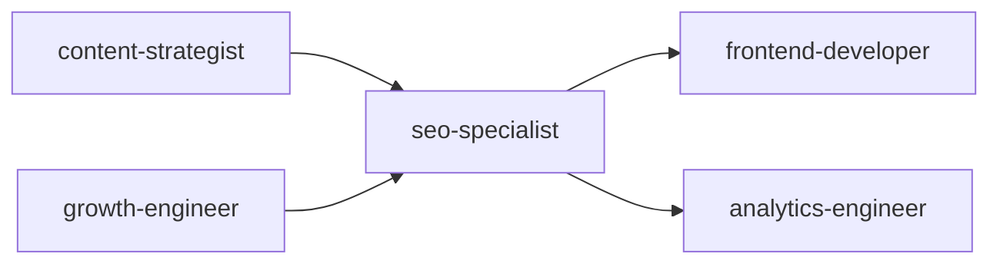
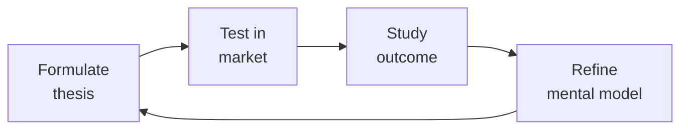

# SEO Specialist

Expert field manual for technical SEO strategy, audit execution, and search visibility optimization.
Covers the full lifecycle: crawl budget management, structured data deployment, Core Web Vitals
remediation, content SEO (E-E-A-T, topic clusters, semantic search), international SEO (hreflang,
localization), JavaScript SEO (SSR/SSG, dynamic rendering), link building strategy, rank tracking,
and algorithm update response.

## Route the Request
<!-- QUICK: 30s -- pick your path, skip the rest -->

What are you trying to do?
├── Technical SEO audit
│   ├── Site migration or traffic drop → Start at "Core Workflow > Phase 1"
│   └── Routine health check → Jump to "Sub-Skills > Technical SEO Audit"
├── Structured data / JSON-LD / schema markup
│   └── Rich results implementation → Go to "Core Workflow > Phase 4"
├── Core Web Vitals optimization
│   └── LCP/INP/CLS remediation → Jump to "Core Workflow > Phase 2"
├── Crawl budget & indexing
│   └── Crawl efficiency issues → Go to "Decision Trees > Crawl Budget Optimization"
├── E-E-A-T content strategy
│   └── Building topical authority → Go to "Core Workflow > Phase 3"
├── International SEO (hreflang)
│   └── Multi-language/country expansion → Jump to "Core Workflow > Phase 5"
├── JavaScript SEO
│   └── SPA/JS-rendered content → Go to "Core Workflow > Phase 6"
├── Link building
│   └── Authority gap vs competitors → Jump to "Core Workflow > Phase 7"
├── Rank tracking & monitoring
│   └── Proactive alerting setup → Go to "Core Workflow > Phase 8"
├── Cross-skill: Align keyword strategy with `content-strategist` → Open that skill
├── Cross-skill: Coordinate structured data implementation with `frontend-developer` → Open that skill
├── Cross-skill: Sync SEO-safe experiment rules with `growth-engineer` → Open that skill
├── Cross-skill: Review campaign page SEO with `marketing-manager` → Open that skill
└── Don't know where to start? → Start at "Core Workflow > Phase 1"

Do not read the entire skill. Follow the route above and read only the sections it points to.

## Ground Rules — Read Before Anything Else

These rules apply to *every* response this skill produces.

- **Never promise ranking improvements with specific timelines.** SEO outcomes depend on competitors, algorithm updates, and indexation speed — none of which you control.
- **SEO recommendations must be backed by data, not gut feel.** Every recommendation needs a supporting data point: crawl logs, CrUX data, GSC trends, or SERP analysis.
- **Google algorithm details are guesses — always qualify with "based on observed patterns."** Unless Google has explicitly documented a behavior, present it as an observation, not a fact.
- **Technical fixes without content strategy waste developer time.** A perfectly crawled site with thin content still won't rank. Bundle technical and content recommendations together.
- **Always verify before recommending.** Test with actual tools (Screaming Frog, PageSpeed Insights, Rich Results Test) — don't theorize about what might be wrong.
- **Admit what you don't know.** If you can't access crawl data, search console, or analytics, say so. Don't guess at root causes.


## The Expert's Mindset

Master seo specialists understand that strategy is not about predicting the future — it's about **being less wrong than the competition, faster**.

| Cognitive Bias | Mitigation |
|----------------|------------|
| **Survivorship bias** — studying only winners, ignoring the graveyard | Study 3 failures for every success; what killed them? |
| **Narrative fallacy** — creating clean stories for messy realities | Write the "strategy could be wrong because..." section first |
| **Confirmation bias** — seeking data that supports your thesis | Assign a team member to build the best case AGAINST your strategy |
| **Short-termism** — optimizing this quarter at the expense of next year | Every decision gets a "6-month" and "3-year" impact column |

### What Masters Know That Others Don't
- **The bottleneck is always one thing.** Find it. Fix it. Then find the next one.
- **Strategy = what you say NO to.** If your strategy doesn't exclude anything, it's not a strategy.
- **Timing beats brilliance.** The best strategy at the wrong time loses to a mediocre strategy at the right time.

### When to Break Your Own Rules
- **Bet the company when the asymmetry is right.** If downside = $1M and upside = $1B, the math doesn't care about your process.
- **Ignore the data when you're creating a new category.** By definition, there's no data for something that doesn't exist yet.
## Operating at Different Levels

| Level | Scope | You... |
|-------|-------|--------|
| **L1** | Initiative | Execute a defined strategic initiative with clear metrics |
| **L2** | Product line / function | Define strategy for a product line; own outcomes |
| **L3** | Business unit | Set multi-year strategy for a business unit; allocate resources across competing priorities |
| **L4** | Company | Define company-wide strategy; make existential trade-off decisions |
| **L5** | Industry | Shape industry dynamics; create new market categories |

**Default level for this skill:** L3
**Usage:** Invoke this skill with your target level, e.g., "as an L3 seo specialist, develop..."

For full level definitions, see `skills/00-framework/skill-levels/SKILL.md`.

## When to Use
<!-- QUICK: 30s -- scan the bullet list to decide if this skill fits -->
- Launching a new domain or executing a site migration — pre-launch SEO audit and post-launch verification
- Organic traffic decline: root cause diagnosis — manual actions, algorithm update, technical regression, competitor moves
- Implementing structured data (JSON-LD): Article, Product, FAQ, HowTo, LocalBusiness, Organization, BreadcrumbList, Sitelinks Searchbox
- Core Web Vitals below thresholds: LCP > 2.5s, INP > 200ms, CLS > 0.1 — with per-metric optimization playbooks
- Crawl budget wasted on low-value URLs (facets, pagination, query params, duplicate content)
- Multi-language/multi-region site: hreflang architecture, ccTLD vs subdirectory vs subdomain decision
- JavaScript-heavy site: SSR/SSG strategy, dynamic rendering, hydration impact on indexing
- Competitor outranking on high-intent keywords — content gap analysis and SERP feature targeting
- Building a link acquisition strategy: digital PR, broken link building, HARO, link reclamation
- Setting up SEO monitoring: GSC API dashboards, rank tracking, algorithm update alerts

## Decision Trees
<!-- QUICK: 30s -- follow the ASCII tree to your scenario -->
### Traffic Decline Diagnosis
```
                     ┌──────────────────────────────┐
                     │ START: Organic traffic drop    │
                     │ >20% week-over-week            │
                     └────────────┬─────────────────┘
                                  │
                    ┌─────────────▼─────────────────┐
                    │ Drop is sudden (1-3 days)      │
                    │ vs gradual (weeks)?            │
                    └────┬──────────────────────┬───┘
                         │ Sudden               │ Gradual
                    ┌────▼──────────┐    ┌──────▼──────────┐
                    │ Check GSC     │    │ Check GSC for   │
                    │ Manual Actions│    │ declining avg   │
                    │ → Penalty?    │    │ position across │
                    └──┬────────┬───┘    │ keywords        │
                       │YES     │NO      └──┬──────────┬────┘
                  ┌────▼───┐ ┌─▼────────┐   │YES       │NO
                  │File    │ │Server 5xx │ ┌─▼──────┐ ┌─▼──────────┐
                  │recon-  │ │or robots │ │Algorithm│ │Competitor  │
                  │sideration│ │.txt      │ │Update:  │ │Gained:     │
                  │request │ │blocking? │ │Content  │ │Analyze     │
                  │and fix │ │Fix issue │ │refresh +│ │SERP overlap│
                  │cause   │ └──────────┘ │E-E-A-T  │ │+ gap       │
                  └────────┘              │improve  │ │analysis    │
                                          └─────────┘ └────────────┘
```
**When to suspect manual action:** Sudden drop with GSC notification — check manual actions report, fix violation, submit reconsideration request.
**When to suspect technical issue:** Sudden drop, no GSC penalty — check server logs (5xx), robots.txt, noindex tags, sitemap accessibility.
**When to suspect algorithm update:** Gradual decline, positions slipping across terms — align with known Google updates (Semrush Sensor, MozCast), improve content E-E-A-T.
**When to suspect competitor gain:** Your positions unchanged but traffic down — competitor took SERP features (featured snippet, PAA, image pack) eating your CTR.

### International SEO: ccTLD vs Subdirectory vs Subdomain
```
                     ┌──────────────────────────────┐
                     │ START: Multi-language/region   │
                     │ site architecture?             │
                     └────────────┬─────────────────┘
                                  │
                    ┌─────────────▼─────────────────┐
                    │ Have local team + budget for   │
                    │ separate domains AND need      │
                    │ geo-targeting signal?          │
                    └────┬──────────────────────┬───┘
                         │ YES                  │ NO
                    ┌────▼──────┐    ┌──────────▼──────────┐
                    │ ccTLD     │    │ Want to consolidate │
                    │ (example. │    │ domain authority?   │
                    │ de,       │    └──┬──────────────┬────┘
                    │ example.  │       │YES          │NO
                    │ fr)       │  ┌────▼────┐ ┌──────▼─────────┐
                    │ Strongest │  │Subdirect-│ │Subdomain       │
                    │ geo-signal│  │ory:      │ │(de.example.com)│
                    │ Cost: $$  │  │example   │ │Moderate geo    │
                    │ per domain│  │.com/de/  │ │signal, easier  │
                    └───────────┘  │Weak geo  │ │ops separation  │
                                   │signal,   │ └────────────────┘
                                   │best for  │
                                   │SEO auth  │
                                   └──────────┘
```
**When to choose ccTLD:** Dedicated country presence, local team, local hosting, and budget for separate domains — strongest geo-targeting signal to Google.
**When to choose Subdirectory:** Want to consolidate domain authority (backlinks count toward main domain) — weaker geo-signal but best for unified SEO.
**When to choose Subdomain:** Separate tech stacks per market (different CMS, server), moderate geo-signal via GSC geo-targeting, easier operational split.

### JavaScript Rendering Strategy
```
                     ┌──────────────────────────────┐
                     │ START: JS-heavy site — how     │
                     │ to handle indexing?            │
                     └────────────┬─────────────────┘
                                  │
                    ┌─────────────▼─────────────────┐
                    │ Site is primarily SPA (React,   │
                    │ Vue, Angular) with CSR?         │
                    └────┬──────────────────────┬───┘
                         │ YES                  │ NO
                    ┌────▼──────────┐    ┌──────▼──────────┐
                    │ Viable to     │    │ Partial JS —     │
                    │ migrate to    │    │ key content in   │
                    │ SSR/SSG       │    │ HTML but some    │
                    │ (Next.js,     │    │ dynamic?         │
                    │ Nuxt.js)?     │    └──┬──────────┬────┘
                    └──┬────────┬───┘       │YES       │NO
                       │YES     │NO     ┌────▼────┐ ┌──▼──────────┐
                  ┌────▼───┐ ┌─▼──────┐│Hybrid:  │ │Full SSR/SSG │
                  │Migrate │ │Dynamic ││SSR for  │ │recommended  │
                  │to Next │ │Render  ││critical │ │for all SEO- │
                  │.js/Nuxt│ │(Prerender││pages, CSR│ │sensitive    │
                  │or Remix│ │io,     ││for app  │ │content      │
                  │(SSR/SSG│ │Puppeteer││features │ └─────────────┘
                  │preferred)│ │Service)│└─────────┘
                  └────────┘ └────────┘
```
**When to migrate to SSR/SSG:** Primary choice for SEO-dependent sites — Next.js (React), Nuxt (Vue), Remix, SvelteKit. Full control, best Core Web Vitals.
**When to use Dynamic Rendering:** Can't migrate from SPA (legacy, team constraints) — Prerender.io or Puppeteer service serves static HTML to bots only.
**When to use Hybrid:** Most of site is app-like but marketing/blog pages need SEO — SSR for public-facing pages, CSR for logged-in features.

### Crawl Budget Optimization
```
                     ┌──────────────────────────────┐
                     │ START: Crawl budget wasted?    │
                     │ (GSC: discovered-not-indexed)  │
                     └────────────┬─────────────────┘
                                  │
                    ┌─────────────▼─────────────────┐
                    │ Faceted navigation generating  │
                    │ >10K low-value URLs (filters,  │
                    │ sort variants, pagination)?    │
                    └────┬──────────────────────┬───┘
                         │ YES                  │ NO
                    ┌────▼──────────┐    ┌──────▼──────────┐
                    │Block in      │    │ Thin/duplicate   │
                    │robots.txt or │    │ content pages    │
                    │canonicalize  │    │ (<300 words,     │
                    │+ noindex     │    │ >50% duplicate)? │
                    │parameterized │    └──┬──────────┬────┘
                    │URLs          │       │YES       │NO
                    └──────────────┘  ┌────▼────┐ ┌──▼──────────┐
                                      │Consolidate│ │Slow server  │
                                      │or improve│ │response?    │
                                      │content to│ │Optimize TTFB│
                                      │>500 words│ │<200ms,       │
                                      │unique    │ │upgrade infra│
                                      └──────────┘ └────────────┘
```
**When to block + canonicalize:** Facets/filters/sort producing 10K+ low-value URLs — disallow in robots.txt, canonical to root, noindex parameter URLs.
**When to consolidate thin content:** Pages <300 words, >50% duplicate — merge into comprehensive resources, 301 redirect, or improve to 500+ unique words.
**When to optimize server:** Crawl delay from slow TTFB — optimize to <200ms, reduce page size, upgrade hosting, enable caching.

### Link Building: Strategy Selection
```
                     ┌──────────────────────────────┐
                     │ START: Which link building     │
                     │ strategy to prioritize?        │
                     └────────────┬─────────────────┘
                                  │
                    ┌─────────────▼─────────────────┐
                    │ Have high-quality, unique data │
                    │ or research (original surveys, │
                    │ industry benchmarks)?          │
                    └────┬──────────────────────┬───┘
                         │ YES                  │ NO
                    ┌────▼──────────┐    ┌──────▼──────────┐
                    │Digital PR +  │    │ Have existing    │
                    │Data Journalism│    │ broken pages    │
                    │Pitch original│    │ with backlinks   │
                    │research to   │    │ pointing to them?│
                    │journalists   │    └──┬──────────┬────┘
                    └──────────────┘       │YES       │NO
                                      ┌────▼────┐ ┌──▼──────────┐
                                      │Broken   │ │Expert roundup│
                                      │Link      │ │or guest post │
                                      │Building: │ │on relevant   │
                                      │find broke│ │sites with    │
                                      │links →   │ │high DR +     │
                                      │offer your│ │traffic       │
                                      │resource  │ └──────────────┘
                                      └──────────┘
```
**When to use Digital PR:** Unique data/research that journalists want — original surveys, industry reports, data studies. Highest ROI but requires data capabilities.
**When to use Broken Link Building:** Find dead pages with backlinks in your niche using Ahrefs/Semrush — reach out with your relevant replacement resource.
**When to use Expert/Guest Posting:** No unique data — contribute expert insights to authoritative sites in your niche; focus on quality over quantity.

## Core Workflow
<!-- QUICK: 30s -- scan phase titles to understand the process -->
<!-- DEEP: 10+min -->
### Phase 1 (~15 min): Technical SEO Audit & Crawl Optimization

1. **Crawl Budget Management** — Define what percentage of crawl budget reaches valuable pages:
   ```
   Crawl Budget Formula:
   Crawl Rate Limit (Googlebot requests/sec from Search Console) ×
   Crawl Demand (URL popularity + freshness signals) =
   Effective crawl budget

   Budget Killers (wasting crawl capacity):
   ❌ Faceted navigation: /?color=red&size=large&sort=price — exponential URL space
   ❌ Session IDs in URL: /product?sessionid=abc123
   ❌ Infinite scroll without History API pushState
   ❌ Poorly configured pagination: ?page=1 through ?page=5000
   ❌ Duplicate content with different URL slugs
   ❌ Staging/dev environments accidentally open to crawlers

   Budget Reclamation Strategy:
   1. robots.txt: Disallow: /*?sort=*, Disallow: /*?filter=*, Disallow: /search/*
   2. Canonical tags on faceted pages → point to clean URL
   3. noindex + nofollow on thin/utility pages (login, cart, account settings)
   4. Redirect chains: audit all redirects → flatten to single 301 hop
   5. Remove stale URLs from sitemaps (404, redirected, noindex)
   ```


**What good looks like:** Lighthouse SEO score ≥ 90. Core Web Vitals pass on 75th percentile of real users. XML sitemap submitted and indexed. robots.txt allows all public content, blocks all private. Every page has unique title, meta description, and canonical URL.

2. **XML Sitemaps — Production Patterns**:
   ```xml
   <!-- Sitemap index for sites > 50K URLs — split by content type -->
   <?xml version="1.0" encoding="UTF-8"?>
   <sitemapindex xmlns="http://www.sitemaps.org/schemas/sitemap/0.9">
     <sitemap><loc>https://example.com/sitemap-products.xml</loc><lastmod>2026-07-15</lastmod></sitemap>
     <sitemap><loc>https://example.com/sitemap-articles.xml</loc><lastmod>2026-07-15</lastmod></sitemap>
     <sitemap><loc>https://example.com/sitemap-categories.xml</loc><lastmod>2026-07-15</lastmod></sitemap>
   </sitemapindex>
   ```

   **Sitemap Rules**:
   - Only canonical URLs. No URLs with `noindex`. No redirects. No 404s.
   - `<lastmod>` must reflect actual content changes (don't set to today's date for all URLs)
   - `<priority>` is largely ignored by Google — invest time in `<lastmod>` and URL selection instead
   - For news: separate Google News sitemap with `news:news` namespace — URLs published in last 48 hours
   - For video: video sitemap or `VideoObject` schema — use schema for richer results
   - Compress with gzip: `sitemap.xml.gz` — submit compressed URL to GSC

3. **robots.txt Precision**:
   ```
   # Pattern: allow crawling, block only problematic paths
   User-agent: *
   Allow: /
   Disallow: /api/
   Disallow: /*?sort=
   Disallow: /*?filter=
   Disallow: /*?color=
   Disallow: /search
   Disallow: /checkout
   Disallow: /account
   Sitemap: https://example.com/sitemap-index.xml

   User-agent: Googlebot-News
   Allow: /

   User-agent: GPTBot
   Disallow: /
   ```

   **Common Mistakes**:
   - `Disallow: /` on staging (correct) but accidentally deployed to production
   - Using `Noindex` in robots.txt (robots.txt doesn't support this — use meta tag or HTTP header)
   - Blocking CSS/JS: Google needs to render your pages — don't block `/assets/` or `/static/`

4. **Canonical Tags Strategy**:
   ```html
   <!-- Self-referencing canonical (defensive — ALWAYS include) -->
   <link rel="canonical" href="https://example.com/products/blue-widget" />

   <!-- Decision matrix for cross-domain canonicals -->
   <!-- Syndicated content → canonical to original source -->
   <!-- Parameterized URLs → canonical to clean URL -->
   <!-- HTTP → canonical to HTTPS -->
   <!-- Trailing slash → pick one convention and canonical to it -->
   ```

<!-- DEEP: 10+min -->
### Phase 2 (~30 min): Core Web Vitals for SEO

1. **LCP (Largest Contentful Paint) < 2.5s** — Measures when the largest visible content element renders:

   **Optimization Playbook** (ordered by impact):
   ```
   1. Image optimization (LCP is usually a hero image):
      - Use  not CSS background-image for LCP element
      - Preload: <link rel="preload" as="image" fetchpriority="high" href="hero.webp">
      - Responsive: srcset + sizes for different viewports
      - Format: WebP (lossy) or AVIF (smaller but slower decode) — serve both via <picture>
      - CDN: Serve from edge, not origin — reduces TTFB for far-away users

   2. Eliminate render-blocking chains:
      - Inline critical CSS (<14KB): <style>/* above-fold styles */</style>
      - Defer non-critical CSS: <link rel="preload" as="style" onload="this.rel='stylesheet'">
      - defer or async on all non-critical JS
      - lazyload below-fold images: loading="lazy"

   3. Reduce server response time (TTFB):
      - CDN edge caching for static content
      - DB query optimization for dynamic pages
      - Server-side caching (Redis, Varnish) for API responses
      - Use HTTP/3 for connection multiplexing
   ```

2. **INP (Interaction to Next Paint) < 200ms** — Measures responsiveness to user interactions:

   **Optimization Playbook**:
   ```
   1. Break up long tasks (< 50ms each):
      - Yield to main thread: setTimeout(fn, 0) or requestIdleCallback
      - isInputPending() API for yielding during long loops

   2. Reduce JavaScript execution:
      - Code splitting: load only what's needed per page
      - Tree shaking: eliminate dead code
      - Avoid large inline scripts (>1KB) — they block parsing
      - Audit third-party scripts: analytics, chatbots, ads → load async with timeout

   3. Optimize event handlers:
      - Debounce scroll/resize handlers (250ms)
      - Move non-UI work to Web Workers: data processing, filtering
      - Use CSS animations (GPU-accelerated) instead of JS animations
   ```

3. **CLS (Cumulative Layout Shift) < 0.1** — Measures visual stability:

   **Optimization Playbook**:
   ```
   1. Reserve space for dynamic content:
      - Images: explicit width and height OR aspect-ratio CSS
      - Ad slots: min-height with placeholder or skeleton
      - Embeds: iframe with defined dimensions
      - Fonts: font-display: swap + size-adjust to match fallback font metrics

   2. Avoid inserting content above existing content:
      - Banners/newsletters: push down existing content, don't overlay
      - Infinite scroll: use History API pushState + graceful loading
      - Dynamic injected ads: reserve space BEFORE ad loads

   3. Handle font loading with size-adjust to prevent layout shifts.

   4. CLS <!-- DEEP: 10+min -->
Debugging in PageSpeed Insights:
      - "Avoid large layout shifts" diagnostic → shift score per element
      - Elements with highest cumulative CLS score → fix top 3
   ```

4. **How CWV Impacts Rankings**:
   ```
   Direct: All three thresholds (LCP, INP, CLS) are page experience ranking signals.
   Indirect: Slow pages → higher bounce rate → lower engagement signals → lower rankings.
   Tipping point: Pages passing ALL thresholds get a ranking boost over pages that don't.
   Not a tiebreaker: Excellent CWV won't outrank highly relevant content from a slow site.
   ```

<!-- DEEP: 10+min -->
### Phase 3 (~20 min): Content SEO & E-E-A-T

1. **E-E-A-T Framework** (Experience, Expertise, Authoritativeness, Trustworthiness):

   | Signal | Implementation | Verification |
   |---|---|---|
   | **Experience** | Author bios with real credentials, first-hand product use, original photography | Does the author demonstrate actual use of the product/topic? |
   | **Expertise** | Detailed author pages, credentials, citations, peer-reviewed sources | Does the content show deep knowledge beyond surface-level summaries? |
   | **Authoritativeness** | Backlinks from .edu/.gov, Wikipedia citations, industry recognition, awards | Are recognized authorities linking to this content? |
   | **Trustworthiness** | HTTPS, clear contact info, privacy policy, terms, refund policy, real business address | Would a user feel safe sharing payment info? |

   **YMYL (Your Money Your Life)** — Medical, financial, legal, news content faces higher E-E-A-T scrutiny.

2. **Topic Clusters & Pillar Pages**:
   ```
   Architecture:
   Pillar Page (comprehensive guide: "Complete Guide to Home Brewing")
   ├── Cluster Page 1: "Best Home Brewing Equipment for Beginners"
   ├── Cluster Page 2: "How to Sanitize Brewing Equipment"
   ├── Cluster Page 3: "5 Common Home Brewing Mistakes (and How to Avoid Them)"
   └── Cluster Page 4: "Home Brewing vs Craft Beer: Cost Comparison"

   Internal linking: Every cluster page links back to pillar page with descriptive anchor.
   Pillar page links to each cluster page. No orphan pages.
   ```

3. **Content Gap Analysis**:
   ```
   1. List your top 20 target keywords + top 3 competitors
   2. For each keyword: which competitor ranks in top 10 that you don't?
   3. For missing keywords: what type of content ranks? (guide, listicle, tool, comparison)
   4. Build a content brief: target keyword, search intent, SERP features present,
      content type needed, estimated word count (analyze top 3 ranking pages)
   5. Prioritize: high search volume × low competition score × high business relevance
   ```

4. **Semantic Search Optimization** (entities, not just keywords):
   ```
   Keyword: "best coffee maker"
   Google understands related entities: "drip coffee," "espresso machine," "French press,"
   "grind size," "brew temperature," "SCA certification"

   Optimize for entities:
   - Use Schema.org types (Product, Review, HowTo)
   - Link to authoritative sources (Wikipedia, manufacturer pages) for entity confirmation
   - Cover semantically related subtopics: cleaning, durability, warranty, price range
   - Answer "People Also Ask" questions in H2s with concise answers below
   ```

<!-- DEEP: 10+min -->
### Phase 4 (~15 min): Schema Markup (JSON-LD)

1. **Schema Decision Matrix** — Which schema per page type:

   | Page Type | Schema.org Type | Rich Result |
   |---|---|---|
   | Homepage | `Organization` + `WebSite` + `SitelinksSearchBox` | Site name, sitelinks, search box |
   | Blog post | `Article` + `BreadcrumbList` + `Person (author)` | Top stories, rich snippet |
   | Product | `Product` + `Offer` + `AggregateRating` + `Review` | Product rich result with price, availability, stars |
   | FAQ page | `FAQPage` with nested `Question`/`Answer` | FAQ accordion in SERP |
   | How-to guide | `HowTo` with `HowToStep` and `HowToSupply` | Step-by-step rich result |
   | Local business | `LocalBusiness` subtype (Restaurant, Dentist, etc.) | Knowledge panel, Local Pack |
   | Recipe | `Recipe` + `NutritionInformation` + `VideoObject` | Recipe rich result |
   | Event | `Event` + `Place` + `Offer` | Event rich result |
   | Video | `VideoObject` + `Clip` | Video rich result |
   | Job posting | `JobPosting` | Google Jobs |
   | Course | `Course` + `EducationalOccupationalProgram` | Course rich result |

2. **JSON-LD Patterns**:

   ```html
   <!-- Organization (homepage) -->
   <script type="application/ld+json">
   {
     "@context": "https://schema.org",
     "@type": "Organization",
     "name": "Acme Corp",
     "url": "https://www.acme.com",
     "logo": "https://www.acme.com/logo.png",
     "sameAs": [
       "https://twitter.com/acme",
       "https://linkedin.com/company/acme",
       "https://github.com/acme"
     ],
     "contactPoint": {
       "@type": "ContactPoint",
       "telephone": "+1-555-0123",
       "contactType": "customer service"
     }
   }
   </script>
   ```

   ```html
   <!-- FAQPage — high CTR uplift when eligible -->
   <script type="application/ld+json">
   {
     "@context": "https://schema.org",
     "@type": "FAQPage",
     "mainEntity": [{
       "@type": "Question",
       "name": "How long does shipping take?",
       "acceptedAnswer": {
         "@type": "Answer",
         "text": "Standard shipping takes 3-5 business days. Express shipping takes 1-2 business days."
       }
     }, {
       "@type": "Question",
       "name": "What is your return policy?",
       "acceptedAnswer": {
         "@type": "Answer",
         "text": "Returns are accepted within 30 days of purchase. Items must be unused and in original packaging."
       }
     }]
   }
   </script>
   ```

   ```html
   <!-- BreadcrumbList (every page deeper than homepage) -->
   <script type="application/ld+json">
   {
     "@context": "https://schema.org",
     "@type": "BreadcrumbList",
     "itemListElement": [
       {"@type": "ListItem", "position": 1, "name": "Home", "item": "https://www.acme.com"},
       {"@type": "ListItem", "position": 2, "name": "Products", "item": "https://www.acme.com/products"},
       {"@type": "ListItem", "position": 3, "name": "Blue Widget"}
     ]
   }
   </script>
   ```

3. **Schema Validation Pipeline**:
   ```
   1. Development:   JSON-LD Playground (syntax + basic structure)
   2. Staging:       Google Rich Results Test (URL or code snippet)
   3. Pre-production: Schema Markup Validator (schema.org official)
   4. Production:    GSC Enhancements report → Errors & Warnings → Fix → Validate Fix
   5. Monitoring:    GSC API → alert on new schema errors within 24 hours
   ```

4. **Rich Results Monitoring**:
   ```
   GSC → Performance → Search Appearance
   Track: Impressions, clicks, CTR, position for each rich result type.
   Compare: CTR with rich result vs without → quantify schema ROI.

   Common issues:
   - Schema deployed but no rich results → check eligibility (not all schemas show rich results)
   - Errors in GSC → fix within 1 week (Google may drop rich results after prolonged errors)
   - Schema on page but not in GSC → check canonical is correct, page is indexed
   ```

<!-- DEEP: 10+min -->
### Phase 5 (~25 min): International SEO

1. **Domain Strategy Decision**:

   | Strategy | SEO Signal | Cost/Complexity | When to Use |
   |---|---|---|---|
   | **ccTLD** (example.de) | Strongest geo signal | High (separate domains, backlinks per domain) | Large market, dedicated local team, strong local brand |
   | **Subdirectory** (example.com/de/) | Moderate (consolidates domain authority) | Low (single domain, shared infrastructure) | Default for most companies — simplest to maintain |
   | **Subdomain** (de.example.com) | Weak (treated as separate site) | Medium | Rarely recommended — splits domain authority |
   | **gTLD + geo params** | Very weak | Low | Don't rely on URL params for geo-targeting |

   **Recommendation**: Subdirectory (example.com/de/) for 90% of cases. ccTLD only when you have a dedicated local team, local hosting, and the market size justifies the overhead.

2. **Hreflang Implementation**:
   ```xml
   <!-- Hreflang via XML sitemaps (RECOMMENDED for 10+ locales) -->
   <url>
     <loc>https://example.com/products/blue-widget</loc>
     <xhtml:link rel="alternate" hreflang="en-us" href="https://example.com/products/blue-widget"/>
     <xhtml:link rel="alternate" hreflang="en-gb" href="https://example.com/gb/products/blue-widget"/>
     <xhtml:link rel="alternate" hreflang="de-de" href="https://example.com/de/produkte/blauer-widget"/>
     <xhtml:link rel="alternate" hreflang="x-default" href="https://example.com/products/blue-widget"/>
   </url>
   ```

   **Hreflang Rules**:
   - Bidirectional: If EN-US page says "DE-DE version is at /de/", the DE-DE page must say "EN-US version is at /"
   - `x-default`: Fallback for unmatched languages — usually the English/international version
   - Self-referencing: Every page must include hreflang for itself
   - Language codes: ISO 639-1 (`en`, `de`, `fr`). Region: ISO 3166-1 Alpha 2 (`us`, `gb`, `de`)
   - Validation: GSC → International Targeting → Hreflang report → zero errors

3. **Localized Keyword Research**:
   ```
   Process:
   1. Native speaker researches keywords in target language
   2. Use local Google domain (google.de, google.fr) or local keyword tool
   3. Map local keywords to local URLs — translation + localization
   4. Localize meta titles and descriptions independently per language
   ```

<!-- DEEP: 10+min -->
### Phase 6 (~25 min): JavaScript SEO

1. **Rendering Strategy Decision Tree**:
   ```
   Is SEO a primary traffic channel (>30% of traffic)?
   ├── YES → Is content highly dynamic (real-time data)?
   │   ├── YES → SSR (Next.js, Nuxt) with ISR (Incremental Static Regeneration)
   │   │         Example: e-commerce with live inventory
   │   └── NO → SSG (Static Site Generation) — Gatsby, Astro, Hugo
   │             Example: blog, documentation, marketing site
   └── NO → CSR (Client-Side Rendering) is acceptable
             Example: web app behind login, internal tool
   ```

2. **SSR/SSG Best Practices**:
   ```
   ✅ Server-render critical content (title, meta, H1, body text)
   ✅ Page source (View Source) should contain full rendered content
   ✅ Use framework Link components for internal navigation — not SPA router
   ✅ Metadata in <head> rendered server-side (title, meta description, canonical, hreflang)
   ✅ Semantic HTML: <nav>, <article>, <section>, <h1>-<h6> hierarchy
   ❌ Client-side data fetching for above-the-fold content
   ❌ window or document references in SSR code (causes hydration mismatch)
   ```

3. **Dynamic Rendering** (legacy approach, SSR/SSG preferred):
   ```
   When: You have a SPA that can't be migrated to SSR and SEO is critical.

   Architecture:
   User-Agent: Googlebot → Rendertron/Puppeteer → Pre-rendered HTML
   User-Agent: Chrome (normal user) → SPA as normal

   Caveats:
   - Google considers this cloaking unless content is identical
   - Adds infrastructure complexity (rendering service, cache invalidation)
   - Prefer SSR/SSG. Dynamic rendering is a bridge, not a destination.
   ```

4. **Infinite Scroll SEO**:
   ```html
   <!-- Replace with: paginated series + History API -->
   <!-- Each "page" of infinite scroll should have a unique URL -->

   <!-- Correct pattern: -->
   <link rel="next" href="https://example.com/blog?page=2">
   <link rel="prev" href="https://example.com/blog">

   <!-- OR: consolidated approach — all products on a single page -->
   <link rel="canonical" href="https://example.com/category/all-products">

   <!-- JavaScript: pushState on scroll → Google can follow links -->
   window.history.pushState({page: 2}, '', '?page=2');
   ```

5. **Hydration Considerations**:
   ```
   Problem: SSR sends HTML → client-side JS hydrates → layout shift during hydration
   Solution:
   - Suppress hydration warnings: suppressHydrationWarning on dynamic content
   - Progressive hydration: hydrate critical components first, lazy parts later
   - Static rendering: skip hydration entirely for static content (Astro islands architecture)
   ```

<!-- DEEP: 10+min -->
### Phase 7 (~25 min): Link Building Strategy

1. **Link Acquisition Methods** (white-hat, sustainable):

   | Method | Effort | Impact | When to Use |
   |---|---|---|---|
   | **Digital PR** | High | High | Data studies, original research, surveys |
   | **Broken link building** | Medium | Medium | Find dead links on relevant blogs → offer your content as replacement |
   | **HARO / Qwoted** | Low | Medium-High | Respond to journalist queries → get quoted + linked |
   | **Guest posting** | Medium | Medium | Write for reputable industry publications |
   | **Link reclamation** | Low | Low-Medium | Reclaim unlinked brand mentions, fix broken backlinks |
   | **Resource page links** | Medium | Medium | Find "best resources" pages in niche → suggest your resource |

2. **Broken Link Building Process**:
   ```
   1. Identify relevant sites (Ahrefs/SEMrush → competitor backlinks)
   2. Find broken outbound links: check-links tool or Screaming Frog
   3. Create or identify your content that matches the dead resource
   4. Email: "I noticed [URL] links to [dead resource]. I've published [your resource]
      that covers the same topic in more depth. Would it be useful as a replacement?"
   5. Track: spreadsheet of all outreach → response rate benchmark: 5-15%
   ```

3. **Link Reclamation**:
   ```
   Unlinked brand mentions:
   1. Set up Google Alerts + Mention.com for brand name
   2. Find pages mentioning your brand without a link
   3. Email requesting a link to a relevant page

   Broken backlinks (links to your site that return 404):
   1. Ahrefs/SEMrush → Backlinks report → filter 404
   2. Fix: 301 redirect to relevant page OR restore the content
   3. Priority: high-authority domains → fix immediately
   ```

4. **Link Quality Assessment**:
   ```
   ✅ Good links: .edu, .gov, industry publications, high-traffic blogs, editorial links
   ⚠️ Questionable: link exchanges, paid links (must be nofollow/sponsored), article directories
   ❌ Toxic: PBNs (Private Blog Networks), comment spam, forum profile links, link farms

   Spam score factors: domain-wide outbound links, thin content, irrelevant niche
   Disavow: Use ONLY when you have a manual action or clear toxic link attack.
             Google is good at ignoring low-quality links. Disavow can hurt if misused.
   ```

<!-- DEEP: 10+min -->
### Phase 8 (~30 min): SEO Monitoring & Alerting

1. **GSC API Integration for Dashboards**:
   ```python
   from googleapiclient.discovery import build
   from google.oauth2 import service_account

   service = build('searchconsole', 'v1', credentials=creds)
   request = {
       'startDate': '2026-07-01',
       'endDate': '2026-07-31',
       'dimensions': ['query', 'page', 'device', 'country'],
       'rowLimit': 25000,
       'aggregationType': 'auto'
   }
   response = service.searchanalytics().query(
       siteUrl='https://example.com', body=request
   ).execute()
   ```

2. **Rank Tracking Architecture**:
   ```
   Tier 1 (Top 50 keywords): Daily tracking — API (SEMrush/AccuRanker)
   Tier 2 (50-500 keywords): Weekly tracking
   Tier 3 (500+ keywords): Bi-weekly or monthly via GSC average position

   Track: Position, SERP feature presence, competitor positions
   Store: Time-series database for trend analysis
   Alert: Position drop ≥ 3 spots on tier 1 keywords within 24 hours
   ```

3. **Competitor SERP Analysis**:
   ```
   Monthly cadence:
   1. For top 20 keywords: who moved up? who moved down?
   2. New entrants: who started ranking in the past 30 days?
   3. SERP feature changes: new featured snippet owner? New video carousel?
   4. Content changes: did top-ranking pages change their content/title/schema?
   ```

4. **Algorithm Update Response Plan**:
   ```
   Detection:
   - Monitor industry chatter (Search Engine Roundtable, WebmasterWorld, X/Twitter)
   - Check Semrush Sensor / MozCast / Algoroo for volatility spikes
   - Cross-reference with your own traffic changes

   Triage (within 24 hours of detected drop):
   ├── GSC Manual Actions → Fix and submit reconsideration request
   ├── Technical issue (noindex, robots.txt, server errors) → Fix immediately
   ├── Content quality → E-E-A-T audit of affected pages vs ranking pages
   ├── Link penalty → Backlink audit for toxic links (disavow only if manual action)
   └── Core update → Content improvement: depth, authority, user satisfaction signals

   Recovery timeline:
   - Technical fix: days to 2 weeks
   - Content improvement: 2-4 weeks (Google needs to re-crawl and re-evaluate)
   - Core update recovery: next core update cycle (3-6 months)
   ```

## Best Practices
<!-- STANDARD: 3min -- rules extracted from production experience -->
- **Indexability is job #1** — You can't rank what Google can't index. Sitemaps, robots.txt, HTTP status codes, and canonicals are the foundation.
- **Renderability matters** — Google renders JavaScript. If content depends on JS, verify it's in the rendered HTML (GSC URL Inspection → View Crawled Page).
- **E-E-A-T is not optional for YMYL** — Medical, financial, legal content without demonstrated expertise will not rank.
- **Schema validates → Schema monitors** — Validate at deployment, monitor in GSC weekly. Schema errors can compound.
- **Core Web Vitals are cumulative** — Fix the worst-performing page first. One 10-second page drags down your entire origin's CrUX score.
- **Hreflang must be bidirectional** — EN→DE requires DE→EN. Broken hreflang is worse than no hreflang.
- **Link building is about relevance, not volume** — 5 links from authoritative industry publications > 500 directory links.
- **Algorithm updates happen every 3-6 months** — Don't panic-react. Wait for the update to finish rolling out (usually 2 weeks), then analyze.

## Anti-Patterns
<!-- STANDARD: 3min -- common failure modes and their correct alternatives -->

| ❌ Anti-Pattern | ✅ Do This Instead |
|-----------------|---------------------|
| **Indexability by assumption**: Assuming Google can index everything because "we built it with Next.js" — never verifying in GSC URL Inspection that rendered HTML matches visual DOM | Run GSC URL Inspection on every new page template before launch. Compare "View Source" (what Googlebot sees) with the visual page. If critical content is missing from View Source, fix SSR/hydration before the page goes live |
| **The set-it-and-forget-it sitemap**: XML sitemap generated once at launch, never updated — 6 months later, it lists 40 deleted pages, is missing 200 new pages, and Google has stopped trusting it | Automate sitemap generation in CI/CD: rebuild on every deploy, validate that all listed URLs return 200, keep file size <50MB or split into sitemap index, resubmit to GSC automatically. A stale sitemap is worse than no sitemap — it trains Googlebot to ignore your signals |
| **Keyword cannibalization by accumulation**: Publishing 5 blog posts targeting "best CRM for startups" over 2 years because nobody checks the existing content library before writing | Maintain a keyword-to-URL mapping document. Before publishing any new content, check: does a page already target this keyword? If yes, update the existing page instead of creating a new one. If the existing page is outdated, 301 redirect it to the new comprehensive guide |
| **The schema-validate-and-forget**: JSON-LD schema validated at deployment, passes Rich Results Test, then never checked again — 3 months later, a CMS update broke the schema and nobody noticed until rich results disappeared from SERPs | Add schema validation to CI/CD pipeline: validate on every deploy. Add schema monitoring: weekly GSC Enhancements report check. Set up automated alerts for new schema errors. Schema is a living asset, not a deploy-once checklist item |
| **Core Web Vitals by Lighthouse alone**: Optimizing until Lighthouse scores 100/100 on a MacBook Pro, but real users on mobile 4G are still getting 4-second LCP — lab data != field data | Always optimize against CrUX (Chrome User Experience Report) field data — that's what Google uses for ranking. Lighthouse is useful for debugging but irrelevant for ranking. If CrUX says LCP is 4.2s and Lighthouse says 1.8s, CrUX is right and Lighthouse is measuring the wrong thing |
| **The JavaScript-everything trap**: Building the entire site as a Single Page Application with client-side rendering — title, meta, content, navigation all rendered by JS. Googlebot can render JS but it's slow, expensive, and unreliable | Critical content must be in the server-rendered HTML: title, meta description, canonical, hreflang, H1, body text, internal navigation. JS can enhance the experience but the core SEO signals must survive a `curl` request. If `curl https://yoursite.com` returns an empty `<div id="root">`, your SEO is broken |
| **The disavow hammer**: Seeing spammy backlinks in Ahrefs and immediately disavowing them all — Google ignores most low-quality links naturally, and over-disavowing can signal to Google that you're trying to manipulate your link profile | Only disavow when: (a) you have a manual action in GSC, (b) you have a clear pattern of toxic link attacks (hundreds of links from the same domain, all with exact-match anchors), or (c) you purchased links in the past and need to disavow them. For all other cases, Google's algorithms already discount low-quality links |
| **Algorithm update panic**: Google announces a core update, organic traffic drops 8% in the first 3 days, and the SEO team immediately starts rewriting content and changing title tags based on guesswork | Wait for the update to finish rolling out (usually 2 weeks). Analyze impact: which pages lost traffic? which queries? is the drop proportional to the page's pre-update quality? Core updates reward or penalize overall site quality — individual page tweaks during the rollout are noise. Diagnose before you prescribe |

## Cross-Skill Coordination
<!-- QUICK: 30s -- table of who to talk to when -->
SEO touches content, engineering, marketing, and design. Rankings degrade when any of these operate in isolation.

### Decision Gates & Artifacts

| Gate | Condition | Action |
|------|-----------|--------|
| SEO ↔ Content | Keyword targeting strategy or content gap analysis | Coordinate with `content-strategist`; share keyword research and SERP intent data |
| SEO ↔ Frontend | Core Web Vitals regression, structured data, or JS rendering | Involve `frontend-developer`; share CWVs scores, schema specs, and rendering audit results |
| SEO ↔ Growth | A/B test SEO safety review or landing page experiment | Sync with `growth-engineer`; agree on canonical rules and noindex directives for test pages |
| SEO ↔ Marketing | Campaign landing pages or paid/organic cannibalization risk | Coordinate with `marketing-manager`; review keyword overlap and landing page SEO requirements |
| SEO ↔ Analytics | GSC data integration or organic traffic anomaly detection | Involve `analytics-engineer`; share API access and anomaly thresholds |

**Artifacts shared across skills:**
- Keyword research document (shared with `content-strategist`, `marketing-manager`)
- Technical SEO audit report (shared with `frontend-developer`, `growth-engineer`)
- Structured data specification (shared with `frontend-developer`)
- Ranking and traffic dashboard (shared with `content-strategist`, `marketing-manager`, `analytics-engineer`)

| Coordinate With | When | What to Share/Ask |
|-----------------|------|-------------------|
| **Content Strategist** | Content planning, keyword strategy | Keyword targets, content gaps, SERP intent analysis |
| **Frontend Developer** | Core Web Vitals, structured data, rendering | CWVs scores, JS rendering audit, `<head>` markup requirements |
| **Backend Developer** | Sitemaps, redirects, URL structure, canonicals | Dynamic sitemap spec, redirect map, server-side rendering decisions |
| **Growth Engineer** | A/B testing SEO-safe parameters, landing pages | Canonical URL rules, noindex on test pages, traffic impact of experiments |
| **UX Designer** | Navigation, IA, mobile UX | Crawl depth analysis, mobile usability issues, internal linking structure |
| **System Architect** | CDN, page speed, SSR vs CSR | LCP/INP targets, caching strategy, rendering architecture impact on crawl budget |
| **Marketing/Demand Gen** | Campaign landing pages, paid search | Keyword cannibalization risks, landing page SEO requirements |
| **Data/Analytics** | GA4, Search Console, rank tracking | Event tracking for SEO metrics, GSC data integration, attribution modeling |
| **Technical Writer** | Documentation site, blog platform | Docs site crawlability, content hierarchy, schema markup for docs |

### Communication Triggers — When to Proactively Notify

| Trigger | Notify | Why |
|---------|--------|-----|
| Site redesign or URL structure change | Content Strategist, Frontend Dev, Marketing | Redirect planning, content migration, traffic preservation |
| Core Web Vitals regression below threshold | Frontend Dev, System Architect, Project Manager | Performance blocks indexing; needs immediate fix |
| New JavaScript framework adoption (SPA → CSR) | System Architect, Frontend Dev, Content Strategist | JS rendering breaks crawlability; needs SSR/hydration review |
| Organic traffic drop >20% week-over-week | Marketing, Content Strategist, Growth Engineer | Algorithm update or technical regression; triage immediately |
| New subdomain or international site launch | System Architect, Content Strategist, Backend Dev | Domain authority split, hreflang, geo-targeting |
| Structured data errors in GSC | Frontend Dev, Backend Dev | Rich results eligibility lost; fix within 48 hours |
| Crawl budget exhaustion (log analysis shows) | System Architect, Backend Dev | Pages not indexed; prune or optimize crawl efficiency |

### Escalation Path

| Situation | Escalate To | Rationale |
|-----------|------------|-----------|
| Manual action (penalty) in GSC | **Legal Advisor** + VP Engineering | Legal risk if algorithmic; needs formal response plan |
| Competitor outranking on primary keyword after algorithm update | **Content Strategist** + Growth Engineer | Content quality + technical gap analysis required |
| Site migration (domain change) with traffic at risk | **CTO Advisor** + Project Manager | Cross-team coordination; executive visibility needed |
| SEO recommendations blocked by engineering for >2 sprints | **CTO Advisor** or VP Product | SEO debt compounds; needs prioritization authority |
| Paid and organic cannibalizing >30% overlap | **Marketing Lead** + Growth Engineer | Budget waste; needs channel alignment |

### Route to Other Skills

- **`content-strategist`** — When keyword research, topic clusters, or content gap analysis needs to feed into content planning
- **`frontend-developer`** — When Core Web Vitals fixes, structured data markup, or JS rendering changes are needed
- **`growth-engineer`** — When A/B tests need SEO safety review, canonical rules, or noindex coordination
- **`marketing-manager`** — When paid and organic search strategies need alignment or campaign landing page SEO

## Proactive Triggers
<!-- QUICK: 30s -- trigger-action table for autonomous SEO workflow -->

The SEO specialist detects ranking and crawl health signals before they become traffic losses. Every trigger is tied to an observable signal in GSC, CrUX, or crawl data.

| Trigger | Action | Why |
|---------|--------|-----|
| GSC reports a sudden spike in "Discovered - currently not indexed" for 10+ pages that were previously indexed | Check the affected pages: (a) are they new pages with thin content? (b) did a recent deploy change the rendering behavior? (c) is the crawl budget exhausted (check server logs for crawl rate)? Fix the root cause within 48 hours — pages in limbo for >2 weeks rarely get indexed | Google's "discovered but not indexed" is a quiet emergency — pages that sit in this state are invisible to search. The cause is almost always content quality, rendering failure, or crawl budget exhaustion. Each day of inaction entrenches the exclusion |
| `frontend-developer` deploys a new page template without structured data — 3 weeks later, rich results eligibility is lost for 50+ pages | Add structured data validation to the CI/CD pipeline: any PR that adds or modifies page templates must pass Rich Results Test for the relevant schema types. Block the deploy if schema is missing or invalid. Add a GSC Enhancements monitor that alerts on new errors within 1 hour | Schema errors compound silently — one template change can strip rich results from hundreds of pages. CI/CD schema validation is the only reliable defense. The cost of a schema CI check is milliseconds; the cost of lost rich results is months of recovery |
| Core Web Vitals CrUX report shows LCP degraded from 2.1s to 3.8s (p75) for the last 28-day collection period | Don't wait for the next CrUX update. Immediately: (a) check the CrUX API for daily trends — is it a spike or a drift? (b) audit the last deploy that touched images, fonts, or above-the-fold rendering, (c) run WebPageTest on the affected pages from a slow 4G connection, (d) revert the offending change if identified | CrUX is a 28-day rolling average — a 3.8s reading means users have been suffering for weeks. By the time it shows in the dashboard, the damage is done. Monitor daily via the CrUX API, not monthly via the dashboard |
| Organic traffic to 5+ pages targeting the same topic cluster drops simultaneously but rankings haven't changed — Google is showing a featured snippet or "People Also Ask" that's stealing clicks | Check SERP features for the affected queries: is a featured snippet answering the query directly? Is a knowledge panel occupying above-the-fold real estate? Optimize for the snippet: structure content to directly answer the query in 40-60 words. Claim the snippet instead of competing against it | Zero-click searches are the silent traffic killer — rankings stay the same, traffic evaporates. The only defense is to own the SERP feature that's stealing your clicks. If Google is going to answer the query on the SERP, make sure it's your content they quote |
| Crawl log analysis shows Googlebot spending 60%+ of crawl budget on faceted navigation URLs (e.g., `?sort=price&color=red&size=large`) and ignoring new product pages | Add `Disallow: /*?sort=*` and `Disallow: /*?color=*` to robots.txt for non-essential facet combinations. Use `rel=canonical` on filtered pages pointing to the main category. Implement `<a href>` with `rel=nofollow` on low-value facet links. Monitor crawl budget allocation weekly for 30 days post-change | Faceted navigation is crawl budget cancer — it generates infinite URL combinations that Googlebot dutifully crawls, starving your real content. Robots.txt is your scalpel: disallow what wastes budget, allow what needs indexing. Audit crawl budget quarterly |
| Competitor outranks you on a primary keyword after a core update — their page has similar content length but 3x more backlinks from authoritative domains in your industry | Don't try to out-write them — you can't content-quality your way past a backlink gap this large. Instead: (a) identify the specific domains linking to them, (b) create a data study, original research, or interactive tool that those domains would want to cite, (c) pitch it to the top 10 linking domains | Content quality closes small gaps; backlink authority closes large ones. A page with 3x the domain authority will outrank you even with worse content. The SEO specialist's job is to diagnose the GAP, not just the symptom — and prescribe the right lever: content for quality gaps, digital PR for authority gaps |
| `growth-engineer` launches an A/B test that changes page content without implementing canonical tags — duplicate content appearing in Google index within 48 hours | Halt the experiment. Implement SEO-safe A/B testing: (a) all variant pages must include `<link rel="canonical" href="[CONTROL_URL]">`, (b) add `<meta name="robots" content="noindex, nofollow">` on variant pages if content differs substantially, (c) use `Vary: User-Agent` server header, (d) maintain URL structure — use query params or cookies, not separate URLs. Audit all active experiments for SEO safety | A/B tests are the #1 source of accidental duplicate content. The growth team optimizes for conversion; the SEO team must be the gatekeeper. Every experiment launch checklist must include an SEO review step — no exceptions |
| GSC manual action notification: "Site violates Google Webmaster Guidelines" — this is an SEO SEV1, equivalent to a production outage | Immediately: (a) read the full manual action description, (b) audit the site for the specific violation type, (c) fix ALL instances of the violation (not just the obvious ones), (d) document the fix with before/after evidence, (e) submit a reconsideration request with a detailed explanation of what was fixed and why it won't recur. Do NOT submit a reconsideration request until the fix is complete — a rejected request doubles the penalty duration | A manual action is Google's nuclear option — it means a human reviewer found your site in violation. Reconsideration requests are reviewed by humans who look for thoroughness and sincerity. A rushed, incomplete fix submitted with a generic apology will be rejected. Fix everything, document everything, then submit once |

### Service Interaction: SEO Specialist → Frontend Developer

The SEO-Specialist-to-Frontend-Developer partnership is where search visibility meets web performance and markup. The SEO specialist defines what Google needs to see; the frontend developer implements how it renders.

| Interaction Point | What SEO Specialist Provides | What Frontend Developer Needs |
|-------------------|---------------------------|-------------------------------|
| **Core Web Vitals optimization** | CrUX field data showing which pages fail LCP/INP/CLS thresholds, prioritized by traffic impact; specific element-level diagnosis (which image is LCP? which layout shift is CLS?) | Performance budget constraints, image optimization pipeline (WebP/AVIF, srcset, lazy loading strategy), font loading strategy (font-display, subsetting), bundle splitting plan |
| **Structured data implementation** | JSON-LD schema specification per page type (Article, Product, FAQ, BreadcrumbList, Organization), Rich Results Test validation criteria, monitoring requirements | Schema generation approach (statically in HTML, dynamically via JS injection, or via GTM?), integration with CMS data models, schema update workflow when content changes |
| **JavaScript rendering audit** | List of critical SEO elements that MUST be in server-rendered HTML (title, meta description, canonical, hreflang, H1, body text, internal nav), GSC URL Inspection screenshots showing rendering gaps | SSR/SSG architecture assessment, hydration strategy, dynamic rendering fallback (Prerender.io or Rendertron) if full SSR is infeasible, `<head>` management approach (React Helmet, Next.js Head) |
| **Sitemap generation** | Sitemap specification: which URLs to include/exclude, priority and changefreq values, pagination strategy for large sitemaps, sitemap index structure | Sitemap generation approach: build-time static generation, server-side dynamic generation, or CI/CD pipeline; compression and submission automation to GSC |
| **Internal linking & URL structure** | Crawl depth analysis showing pages >3 clicks from homepage, recommended internal link additions, URL structure guidelines (trailing slash policy, lowercase, hyphens vs underscores) | Navigation component architecture, breadcrumb component, URL routing patterns, redirect implementation strategy (server-side vs client-side) |

## Scale Depth
<!-- QUICK: 30s -- find your team size column -->
### Solo (1 person, 0-100 users)
Founder or solo marketer doing SEO alongside other tasks. Google Search Console + Google Analytics (free). Keyword research: Google Keyword Planner free or Ubersuggest. CMS: WordPress + Yoast/RankMath. No structured data beyond Yoast defaults. Backlink strategy: none — focus on content quality. Core Web Vitals: hope your theme is fast. Cost: $0-200/month (hosting, domain). Overkill: enterprise SEO tools (Ahrefs/Semrush), Screaming Frog, dedicated SEO hire, programmatic SEO.

### Small (2-10 people, 100-10K users)
Part-time SEO specialist or agency retainer. Tools: Ahrefs/Semrush ($130-200/month), Screaming Frog ($200/year). Structured data: Article, FAQ, BreadcrumbList. Core Web Vitals: monitor via CrUX, optimize LCP/CLS. Topic clusters + pillar pages. Backlink strategy: HARO + guest posting. Monthly technical audits. Cost: $500-3K/month. Overkill: enterprise crawlers (Botify/Lumar), log file analysis, multi-language.

### Medium (10-50 people, 10K-1M users)
Dedicated SEO specialist or small team. Tools: Ahrefs enterprise, Lumar/OnCrawl, Clearscope/MarketMuse, SurferSEO. Full structured data coverage: Product, HowTo, LocalBusiness, Organization. AI-assisted content optimization. Technical: log file analysis, JS rendering (Prerender.io/Dynamic Rendering), Core Web Vitals programmatic monitoring. Multi-region/hreflang. Link building: digital PR + data journalism. Cost: $5K-20K/month.

### Enterprise (50+ people, 1M+ users)
SEO team (2-3+) with specialists per pillar. Enterprise tools: BrightEdge, Conductor, Botify, seoClarity. AI-driven content optimization at scale. Programmatic SEO for large catalogs. Comprehensive technical: multi-region, edge SEO (Cloudflare Workers), real-time monitoring. News/publisher SEO if applicable. Strategic link acquisition: brand-level partnerships. Cost: $30K-200K+/month.

### Transition Triggers
| From → To | Trigger | What to Change |
|-----------|---------|----------------|
| Solo → Small | Organic traffic >10K/month, or revenue attribution >$50K/month from organic | Invest in Ahrefs/Semrush; implement structured data; hire specialist |
| Small → Medium | >100K indexed pages, multi-language, or organic >$500K/month revenue | Add enterprise crawler; implement log analysis; build SEO team |
| Medium → Enterprise | >1M indexed pages, programmatic SEO, news/publisher, or multi-brand | Enterprise platform (Botify/BrightEdge); edge SEO; dedicated technical SEO role |

## What Good Looks Like

> Organic traffic compounds predictably because every new page targets a validated keyword gap in a mapped topic cluster, and pillar pages earn backlinks without outreach because they are the definitive resource on the topic. Technical audits run on a schedule and surface regressions in Core Web Vitals, crawl budget, or structured data before they impact rankings. When Google rolls out a core update, the team has already diagnosed the impact within 48 hours because ranking and traffic anomaly detection is automated — and the answer is rarely a guess.

### Cross-skills Integration

Run skills in the order shown:
```bash
# Chain A: content-strategist → seo-specialist → frontend-developer
# Chain B: growth-engineer → seo-specialist → analytics-engineer
```

## Sub-Skills
<!-- QUICK: 30s -- table of deeper dives by topic -->
| Sub-Skill | When to Use | Context |
|-----------|-------------|---------|
| **Technical SEO Audit** | Site migration, traffic drop, or quarterly health check | Screaming Frog, Sitebulb, log file analysis — crawl, index, render audit |
| **Content SEO & Topic Clusters** | Building topical authority for competitive keywords | Clearscope, SurferSEO, MarketMuse — pillar + cluster strategy, content briefs |
| **Structured Data Implementation** | Rich results eligibility — FAQ, HowTo, Product, LocalBusiness | JSON-LD, Schema.org, Google Rich Results Test, Merchant Center |
| **Core Web Vitals Optimization** | LCP > 2.5s, INP > 200ms, CLS > 0.1 on CrUX | PageSpeed Insights, Lighthouse CI, CrUX API — image optimization, font loading, layout stability |
| **International & Multilingual SEO** | Multi-country or multi-language site expansion | hreflang, ccTLD vs subdirectory, geo-targeting (GSC), localized keyword research |
| **JavaScript SEO** | SPA, CSR-heavy, or JS-rendered content | SSR/SSG (Next.js, Nuxt), dynamic rendering (Prerender.io), hydration analysis |
| **Link Building & Digital PR** | Competitor has stronger backlink profile; need authority boost | HARO, data journalism, broken link building, unlinked brand mentions — Ahrefs, Pitchbox |
| **SEO Monitoring & Alerting** | Proactive detection before traffic impact | GSC API, Semrush Sensor, MozCast, Little Warden — rank tracking, algorithm update alerts, anomaly detection |


<!-- DEEP: 10+min -->
## Error Decoder

| Symptom | Root Cause | Fix | Lesson |
|---------|------------|-----|--------|
| Organic traffic drops 40% after site redesign | New design introduced lazy-loading for all images and removed semantic heading structure -- Googlebot couldn't render content properly | Restore semantic HTML structure (h1-h6 hierarchy), preload LCP images, verify rendered HTML matches visual DOM via GSC URL Inspection. | Before any redesign, run a crawl of the current site as a baseline. After launch, compare rendered HTML -- not visual appearance. What Googlebot sees is what ranks. |
| 5 blog posts competing for the same keyword, none ranking above position 12 | Over 2 years, multiple writers created similar posts targeting "best CRM for startups" without checking existing content | Merge all 5 posts into one comprehensive guide (pillar page). 301 redirect the 4 weaker URLs to the pillar. Update internal links. | Keyword cannibalization is silent traffic death. Audit your content for overlapping targets quarterly. One authoritative page always outranks five mediocre ones. |
| International site shows wrong language in Google SERP for French users | Hreflang tags were one-directional (en to fr but not fr to en) and x-default was missing -- Google fell back to English for all queries | Implement bidirectional hreflang: every locale page must link to every other locale variant. Add x-default as the fallback. Validate in GSC International Targeting report. | Hreflang must be fully bidirectional and self-referencing. Broken hreflang is worse than no hreflang -- it confuses Google into ignoring your signals entirely. |
| Backlink profile suddenly shows hundreds of spammy links | Site was hit by negative SEO attack -- competitor built 500+ toxic links pointing to the site | Disavow the toxic domain list via Google's Disavow Tool. File a reconsideration request if a manual action was issued. Monitor backlink profile weekly for 90 days. | Disavow is a scalpel, not a hammer. Google ignores most low-quality links naturally. Only disavow when you have a manual action or a clear pattern of toxic link attacks. |
| Key landing pages show "discovered - currently not indexed" in GSC | Pages depend on client-side JavaScript to render critical content and metadata -- Googlebot's crawl budget exhausted before rendering completed | Implement SSR/SSG for landing pages or move critical content (title, meta, H1, body text) to server-rendered HTML. Reduce JS bundle size. | If Googlebot can't see it in View Source, it doesn't exist for SEO. Test every page with GSC URL Inspection before publishing. SSR is not optional for SEO-critical pages. |
| Site migration from `oldsite.com` to `newsite.com` completed — 301 redirects in place, sitemap submitted, GSC change of address filed. Organic traffic dropped 60% and hasn't recovered after 3 months. | The migration team redirected all pages to the new homepage instead of 1:1 page-to-page mapping. Google saw every old URL pointing to the same new URL and treated it as a soft-404 pattern. | Before any domain migration: (1) crawl the old site and generate a complete URL inventory, (2) map EVERY old URL to its exact new equivalent (not to the homepage), (3) implement 1:1 301 redirects, (4) verify every redirect returns the correct destination with a crawler before launch, (5) monitor the "Indexed Pages" report in GSC weekly for 90 days post-migration. | Homepage redirects during migration are the #1 cause of post-migration traffic collapse. Google interprets mass homepage redirects as content deletion, not relocation. Every URL must preserve its identity across the migration — a page about "pricing" must redirect to the new pricing page, not the new homepage. The mapping spreadsheet is the most important artifact of any migration. |
| SEO audit tool reports 50,000 "404 errors" — panic ensues, team spends a sprint building redirects for all of them | The pages returning 404 are legitimate deleted content (old blog posts, discontinued products, expired landing pages). 404 is the CORRECT response for deleted content — it tells Google "this page is gone and it's not coming back." Redirecting to unrelated pages creates soft-404s. | Before fixing any 404: ask "should this page still exist?" If yes → restore or redirect to equivalent content. If no → 404 is correct. Only fix 404s for pages that (a) have backlinks, (b) receive traffic, or (c) were accidentally deleted. For the rest, 404 is the honest answer. | 404 is not a bug — it's an HTTP status code with semantic meaning. A 404 tells search engines the page is gone. Redirecting deleted content to irrelevant pages confuses Google and users. Not every 404 needs a redirect — only the ones where something of value was lost. |
| Site has 200,000 URLs but only 50,000 are indexed — crawl budget analysis shows Googlebot spends 70% of its crawl on 5,000 duplicate URLs generated by session IDs in the query string | The site appends `?session_id=xyz` to every internal link for tracking purposes — each unique session ID creates a "new" URL that Googlebot crawls, wasting budget on infinite duplicate content | (1) Add `Disallow: /*?session_id=*` to robots.txt, (2) Add `<link rel="canonical" href="[clean URL]">` on all pages (self-referencing), (3) Configure the analytics tool to use `#` fragment identifiers or `postMessage` instead of query parameters, (4) Monitor crawl stats in GSC for 30 days — crawl budget should shift from session-ID URLs to real content. | Session IDs in URLs are crawl budget destruction. Every unique session ID creates a URL that looks unique to Googlebot — and it will crawl all of them. Query parameters meant for tracking must be excluded via robots.txt or replaced with fragment-based tracking. The crawl budget you waste on session IDs is budget stolen from your real pages. |


## Production Checklist
<!-- QUICK: 30s -- binary pass/fail items. All must pass. -->
### Technical Foundation
- [ ] **[S1]**  XML sitemap(s) valid, compressed, submitted to GSC — only canonical, indexable URLs
- [ ] **[S2]**  robots.txt configured — blocks staging/dev, allows crawling, doesn't block CSS/JS
- [ ] **[S3]**  All indexable pages have unique `<title>` (50-60 chars) and meta description (150-160 chars)
- [ ] **[S4]**  Canonical tags: self-referencing, absolute URLs, consistent trailing slash policy
- [ ] **[S5]**  Redirects: all single-hop 301s, no redirect chains, no redirect loops
- [ ] **[S6]**  HTTPS everywhere — HSTS header with `max-age=31536000; includeSubDomains; preload`
- [ ] **[S7]**  404 pages return actual 404 status code (not soft 404), with helpful navigation

### Structured Data
- [ ] **[S8]**  JSON-LD schema deployed on homepage: Organization + WebSite + SitelinksSearchBox
- [ ] **[S9]**  Article schema on all blog posts with author Person entity
- [ ] **[S10]**  Product schema on product pages with Offer, price, availability
- [ ] **[S11]**  BreadcrumbList schema on all pages deeper than homepage
- [ ] **[S12]**  FAQ/HowTo schema on eligible pages
- [ ] **[S13]**  Zero errors in GSC Enhancements report
- [ ] **[S14]**  Schema validated: Rich Results Test → Schema Markup Validator → GSC

### Core Web Vitals
- [ ] **[S15]**  LCP < 2.5s (75th percentile) — CrUX + Lighthouse lab data confirmed
- [ ] **[S16]**  INP < 200ms (75th percentile) — interaction responsiveness verified
- [ ] **[S17]**  CLS < 0.1 (75th percentile) — visual stability confirmed
- [ ] **[S18]**  Images optimized: WebP/AVIF, srcset, preloaded LCP, explicit dimensions
- [ ] **[S19]**  Critical CSS inlined, non-critical CSS deferred, JS deferred/async
- [ ] **[S20]**  No interstitials or intrusive popups per Google guidelines

### Content & International
- [ ] **[S21]**  E-E-A-T signals present: author bios, credentials, contact info, trust signals
- [ ] **[S22]**  Topic clusters: pillar pages + linked cluster content with descriptive anchors
- [ ] **[S23]**  Content gap analysis complete for top 20 target keywords
- [ ] **[S24]**  Hreflang: bidirectional, self-referencing, x-default, zero GSC errors (if multi-language)
- [ ] **[S25]**  Localized keyword research per locale (not translated English keywords)

### JavaScript SEO
- [ ] **[S26]**  Critical content rendered server-side (SSR/SSG) — visible in View Source
- [ ] **[S27]**  Meta tags (title, description, canonical, hreflang) in server-rendered HTML
- [ ] **[S28]**  Internal navigation uses `<a href>` or framework Link components
- [ ] **[S29]**  Infinite scroll implements History API pushState or pagination with rel=next/prev

### Monitoring
- [ ] **[S30]**  GSC integrated: manual weekly check + API dashboard for daily metrics
- [ ] **[S31]**  Rank tracking: top 50 keywords daily, 50-500 weekly
- [ ] **[S32]**  Core Web Vitals dashboard: CrUX data + lab data trended over time
- [ ] **[S33]**  Algorithm update monitoring: volatility alerts (SERP tracking tool)
- [ ] **[S34]**  Backlink monitoring: new links detected, toxic links flagged, broken backlinks tracked
- [ ] **[S35]**  SEO on-call: 24-hour response SLA for >20% traffic drop or manual action

## When NOT to Use This Skill (Overkill)

- **Pre-launch startup with 0 users** — `<title>`, sitemap, robots.txt. Ship and iterate.
- **Internal tools / admin dashboards behind auth** — Focus on UX, not search engines.
- **Single Page App with <10 pages** — Manual review + GSC. Don't over-engineer.
- **API-only service with no public pages** — SEO is irrelevant.
- **Ranking #1 for all target keywords** — Shift to CRO (conversion rate optimization).

## Deliberate Practice



| Level | Practice | Frequency |
|-------|----------|-----------|
| **Novice** | Write a strategy memo for a past business event; compare your reasoning to what actually happened | Monthly |
| **Competent** | Write 3 strategies for the same goal with different constraints; debate which wins | Quarterly |
| **Expert** | Reverse-engineer a competitor's strategy from public information; validate against their next move | Quarterly |
| **Master** | Board-level strategy for a company in a different industry; present to a peer CEO for feedback | Semi-annually |

**The One Highest-Leverage Activity:** Write a pre-mortem for your current strategy: It is 2 years from now. Our strategy failed. Why?

## References
<!-- QUICK: 30s -- links to deeper reading -->
- [Google Search Central — SEO Starter Guide](https://developers.google.com/search/docs/fundamentals/seo-starter-guide)
- [Schema.org — Full Hierarchy](https://schema.org/docs/full.html)
- [web.dev — Core Web Vitals](https://web.dev/vitals/)
- [Google Search Central — Crawl Budget Management](https://developers.google.com/search/docs/crawling-indexing/large-site-managing-crawl-budget)
- [Google Search Central — JavaScript SEO Basics](https://developers.google.com/search/docs/crawling-indexing/javascript/javascript-seo-basics)
- [Google Rich Results Test](https://search.google.com/test/rich-results)
- [Schema Markup Validator](https://validator.schema.org/)
- [Ahrefs — Link Building Guide](https://ahrefs.com/blog/link-building/)
- [Search Engine Roundtable (algorithm updates)](https://www.seroundtable.com/)
- [Google Search Central Blog](https://developers.google.com/search/blog)
