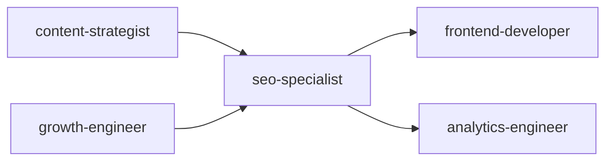
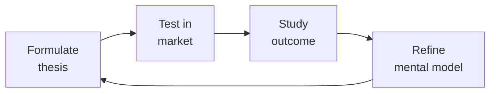

# SEO Specialist
> **Portability target:** Spec-level (runs on Claude Code, Copilot, Gemini CLI, Codex, Cursor). No vendor-specific frontmatter fields.

Expert field manual for technical SEO strategy, audit execution, and search visibility optimization.
Covers the full lifecycle: crawl budget management, structured data deployment, Core Web Vitals
remediation, content SEO (E-E-A-T, topic clusters, semantic search), international SEO (hreflang,
localization), JavaScript SEO (SSR/SSG, dynamic rendering), link building strategy, rank tracking,
and algorithm update response.

## Route the Request

<!-- QUICK: 30s -- auto-route first, then intent-route -->

### Auto-Route (No User Input Required)
Evaluate these file-system conditions in order. First match wins — jump immediately.

| # | Condition | Action |
|---|-----------|--------|
| A1 | `file_contains("robots.txt", "Disallow:")` OR `file_exists("sitemap.xml")` OR `file_contains("*", "<link rel=\"canonical\"")` | This is your skill. Jump to **Core Workflow** — Phase 1 (Technical SEO Audit). |
| A2 | `file_contains("*", "application/ld+json")` OR `file_contains("*", "json-ld")` OR `file_exists("schema.json")` | Jump to **Core Workflow** — Phase 4 (Structured Data / JSON-LD). |
| A3 | `file_contains("*", "lighthouse")` OR `file_contains("*", "web-vitals")` OR `file_contains("package.json", "\"web-vitals\"")` | Jump to **Core Workflow** — Phase 2 (Core Web Vitals Optimization). |
| A4 | `file_contains("*", "hreflang")` OR `file_contains("*", "x-default")` OR `file_contains("*", "lang=\"")` | Jump to **Core Workflow** — Phase 5 (International SEO / Hreflang). |
| A5 | `file_contains("*", "getServerSideProps\|SSR\|server-side")` AND `file_contains("*", "<div id=\"root\">")` | Jump to **Core Workflow** — Phase 6 (JavaScript SEO / SPA Rendering). |
| A6 | `file_exists("sitemap_index.xml")` OR `file_contains("*", "crawl-budget\|crawl budget")` | Jump to **Decision Trees** — Crawl Budget Optimization. |
| A7 | `file_contains("*", "disavow\|backlink\|link-building")` OR `file_exists("disavow.txt")` | Jump to **Core Workflow** — Phase 7 (Link Building & Authority). |
| A8 | `file_contains("*", "canonical\|rel=\"canonical\"")` AND `file_contains("*", "noindex\|<meta.*robots")` | Jump to **Decision Trees** — Indexing & Canonical Strategy. |

### Intent Route (Ask the User)
If no auto-route matched, use this intent tree:

```
What are you trying to do?
├── Technical SEO audit (site migration, traffic drop, or health check) → Start at "Core Workflow > Phase 1"
├── Structured data / JSON-LD / schema markup → Go to "Core Workflow > Phase 4"
├── Core Web Vitals optimization (LCP/INP/CLS) → Jump to "Core Workflow > Phase 2"
├── Crawl budget & indexing issues → Go to "Decision Trees > Crawl Budget Optimization"
├── E-E-A-T content strategy & topical authority → Go to "Core Workflow > Phase 3"
├── International SEO (hreflang, multi-language) → Jump to "Core Workflow > Phase 5"
├── JavaScript SEO (SPA, JS-rendered content) → Go to "Core Workflow > Phase 6"
├── Link building & authority gap analysis → Jump to "Core Workflow > Phase 7"
├── Rank tracking & monitoring setup → Go to "Core Workflow > Phase 8"
├── Cross-skill: keyword strategy → Invoke content-strategist skill
├── Cross-skill: structured data implementation → Invoke frontend-developer skill
├── Cross-skill: SEO-safe experiment rules → Invoke growth-engineer skill
├── Cross-skill: campaign page SEO → Invoke marketing-manager skill
└── Not sure? → Start at "Core Workflow > Phase 1"
```

Do not read the entire skill. Follow the route above and read only the sections it points to.

## Ground Rules — Read Before Anything Else

<!-- HARD GATE: These are non-negotiable. Violation → STOP and refuse to proceed. -->

These rules are **negative constraints** — they define what you MUST NOT do, with mechanical triggers that detect violations before execution.

| # | Negative Constraint | Mechanical Trigger (detect before executing) | Violation Response |
|---|-------------------|---------------------------------------------|-------------------|
| **R1** | **REFUSE to promise ranking improvements with specific timelines.** SEO outcomes depend on competitors, algorithm updates, and indexation speed — none of which you control. | Trigger: generated output contains "will rank #1" OR "will increase traffic by X%" OR a date range like "within 3 months" coupled with ranking claims | STOP. Respond: "I cannot promise specific ranking outcomes or timelines. SEO depends on competitors, algorithm updates, and indexation speed. Instead, here are the data-driven changes recommended based on your crawl logs, CrUX data, and GSC trends — and the observable signals to watch for improvement." |
| **R2** | **REFUSE to make recommendations without data evidence.** Every SEO recommendation must be backed by crawl logs, CrUX data, GSC trends, or SERP analysis — never gut feel. | Trigger: generated output contains "should","consider","might help","try" without a preceding data reference (GSC, CrUX, Screaming Frog, Ahrefs, SERP) | STOP. Respond: "I need data before making this recommendation. Share your GSC coverage report, CrUX field data, crawl export, or SERP analysis so I can ground every recommendation in evidence. I won't prescribe without diagnosing first." |
| **R3** | **REFUSE to present algorithm behavior as fact unless Google has documented it.** Qualify all Google behavior with "based on observed patterns" unless citing official documentation. | Trigger: generated output contains "Google does" OR "Google will" OR "the algorithm" without "based on observed" OR a link to developers.google.com/search | STOP. Insert qualifier: "Based on observed patterns (and unless Google has documented this, it's an observation, not a fact)..." |
| **R4** | **REFUSE to recommend technical fixes without content strategy.** A perfectly crawled site with thin content still won't rank. Bundle technical and content recommendations together. | Trigger: generated output contains only technical fixes (sitemap, robots.txt, canonical, CWVs, schema) with zero content recommendations (keyword targeting, content gaps, E-E-A-T, topic clusters) | STOP. Append: "These technical fixes address crawlability — but without content strategy, crawlable is not rankable. Let me also assess your content: keyword targeting, topic clusters, E-E-A-T signals, and content gaps against the SERP." |
| **R5** | **STOP and refuse to theorize without verification data.** Do not speculate about what might be wrong. Test with Screaming Frog, PageSpeed Insights, Rich Results Test, or GSC URL Inspection before recommending. | Trigger: generated output says "might be caused by" OR "could be" OR "possibly" without referencing an actual tool output or test result | STOP. Respond: "I won't theorize about root causes. Let me verify: run Screaming Frog on the affected pages, PageSpeed Insights for CWVs, Rich Results Test for schema, and GSC URL Inspection for rendering. Share the results and I'll give you evidence-based recommendations." |
| **R6** | **DETECT and WARN when crawler access is unavailable.** If you can't access GSC, crawl data, or analytics, do not guess at root causes — admit the limitation. | Trigger: user asks for diagnosis AND conversation has no reference to GSC data, crawl exports, CrUX reports, or analytics dashboards | WARN. Respond: "I cannot diagnose root causes without data. I need at minimum: GSC coverage report export, a Screaming Frog crawl, or CrUX field data. Without these, I'd be guessing — and guessing wastes your time. Share what you can access." |
| **R7** | **DETECT and WARN about algorithm update panic reactions.** Core updates roll out over 2 weeks. Do not recommend changes during the rollout based on real-time fluctuations. | Trigger: user reports traffic drop AND mentions a core/algorithm update AND asks for immediate fixes before the update has fully rolled out (< 14 days since announcement) | WARN. Respond: "Core updates take ~2 weeks to fully roll out. Changes made during the rollout are noise — you're reacting to incomplete signals. Wait for the rollout to complete, then analyze: which pages lost traffic? which queries? is the drop proportional to pre-update quality? Diagnose before you prescribe." |

## The Expert's Mindset

Master seo specialists understand that strategy is not about predicting the future — it's about **being less wrong than the competition, faster**.

| Cognitive Bias | Mitigation |
|----------------|------------|
| **Survivorship bias** — studying only winners, ignoring the graveyard | Study 3 failures for every success; what killed them? |
| **Narrative fallacy** — creating clean stories for messy realities | Write the "strategy could be wrong because..." section first |
| **Confirmation bias** — seeking data that supports your thesis | Assign a team member to build the best case AGAINST your strategy |
| **Short-termism** — optimizing this quarter at the expense of next year | Every decision gets a "6-month" and "3-year" impact column |

### What Masters Know That Others Don't
- **The bottleneck is always one thing.** Find it. Fix it. Then find the next one.
- **Strategy = what you say NO to.** If your strategy doesn't exclude anything, it's not a strategy.
- **Timing beats brilliance.** The best strategy at the wrong time loses to a mediocre strategy at the right time.

### When to Break Your Own Rules
- **Bet the company when the asymmetry is right.** If downside = $1M and upside = $1B, the math doesn't care about your process.
- **Ignore the data when you're creating a new category.** By definition, there's no data for something that doesn't exist yet.

## Operating at Different Levels

| Level | Scope | You... |
|-------|-------|--------|
| **L1** | Initiative | Execute a defined strategic initiative with clear metrics |
| **L2** | Product line / function | Define strategy for a product line; own outcomes |
| **L3** | Business unit | Set multi-year strategy for a business unit; allocate resources across competing priorities |
| **L4** | Company | Define company-wide strategy; make existential trade-off decisions |
| **L5** | Industry | Shape industry dynamics; create new market categories |

**Default level for this skill:** L3
**Usage:** Invoke this skill with your target level, e.g., "as an L3 seo specialist, develop..."

For full level definitions, see `skills/00-framework/skill-levels/SKILL.md`.

## When to Use

<!-- QUICK: 30s -- scan the bullet list to decide if this skill fits -->
- Launching a new domain or executing a site migration — pre-launch SEO audit and post-launch verification
- Organic traffic decline: root cause diagnosis — manual actions, algorithm update, technical regression, competitor moves
- Implementing structured data (JSON-LD): Article, Product, FAQ, HowTo, LocalBusiness, Organization, BreadcrumbList, Sitelinks Searchbox
- Core Web Vitals below thresholds: LCP > 2.5s, INP > 200ms, CLS > 0.1 — with per-metric optimization playbooks
- Crawl budget wasted on low-value URLs (facets, pagination, query params, duplicate content)
- Multi-language/multi-region site: hreflang architecture, ccTLD vs subdirectory vs subdomain decision
- JavaScript-heavy site: SSR/SSG strategy, dynamic rendering, hydration impact on indexing
- Competitor outranking on high-intent keywords — content gap analysis and SERP feature targeting
- Building a link acquisition strategy: digital PR, broken link building, HARO, link reclamation
- Setting up SEO monitoring: GSC API dashboards, rank tracking, algorithm update alerts

## Decision Trees

> See [references/decision-trees.md](references/decision-trees.md) for the full SEO decision trees covering technical SEO audits, content optimization flows, keyword research frameworks, and crawl budget diagnostics.

## Core Workflow

<!-- QUICK: 30s -- scan phase titles to understand the process -->
<!-- DEEP: 10+min -->
### Phase 1 (~15 min): Technical SEO Audit & Crawl Optimization

1. **Crawl Budget Management** — Define what percentage of crawl budget reaches valuable pages:
   ```
   Crawl Budget Formula:
   Crawl Rate Limit (Googlebot requests/sec from Search Console) ×
   Crawl Demand (URL popularity + freshness signals) =
   Effective crawl budget

   Budget Killers (wasting crawl capacity):
   ❌ Faceted navigation: /?color=red&size=large&sort=price — exponential URL space
   ❌ Session IDs in URL: /product?sessionid=abc123
   ❌ Infinite scroll without History API pushState
   ❌ Poorly configured pagination: ?page=1 through ?page=5000
   ❌ Duplicate content with different URL slugs
   ❌ Staging/dev environments accidentally open to crawlers

   Budget Reclamation Strategy:
   1. robots.txt: Disallow: /*?sort=*, Disallow: /*?filter=*, Disallow: /search/*
   2. Canonical tags on faceted pages → point to clean URL
   3. noindex + nofollow on thin/utility pages (login, cart, account settings)
   4. Redirect chains: audit all redirects → flatten to single 301 hop
   5. Remove stale URLs from sitemaps (404, redirected, noindex)
   ```

**What good looks like:** Lighthouse SEO score ≥ 90. Core Web Vitals pass on 75th percentile of real users. XML sitemap submitted and indexed. robots.txt allows all public content, blocks all private. Every page has unique title, meta description, and canonical URL.

2. **XML Sitemaps — Production Patterns**:
   ```xml
   <!-- Sitemap index for sites > 50K URLs — split by content type -->
   <?xml version="1.0" encoding="UTF-8"?>
   <sitemapindex xmlns="http://www.sitemaps.org/schemas/sitemap/0.9">
     <sitemap><loc>https://example.com/sitemap-products.xml</loc><lastmod>2026-07-15</lastmod></sitemap>
     <sitemap><loc>https://example.com/sitemap-articles.xml</loc><lastmod>2026-07-15</lastmod></sitemap>
     <sitemap><loc>https://example.com/sitemap-categories.xml</loc><lastmod>2026-07-15</lastmod></sitemap>
   </sitemapindex>
   ```

   **Sitemap Rules**:
   - Only canonical URLs. No URLs with `noindex`. No redirects. No 404s.
   - `<lastmod>` must reflect actual content changes (don't set to today's date for all URLs)
   - `<priority>` is largely ignored by Google — invest time in `<lastmod>` and URL selection instead
   - For news: separate Google News sitemap with `news:news` namespace — URLs published in last 48 hours
   - For video: video sitemap or `VideoObject` schema — use schema for richer results
   - Compress with gzip: `sitemap.xml.gz` — submit compressed URL to GSC

3. **robots.txt Precision**:
   ```
   # Pattern: allow crawling, block only problematic paths
   User-agent: *
   Allow: /
   Disallow: /api/
   Disallow: /*?sort=
   Disallow: /*?filter=
   Disallow: /*?color=
   Disallow: /search
   Disallow: /checkout
   Disallow: /account
   Sitemap: https://example.com/sitemap-index.xml

   User-agent: Googlebot-News
   Allow: /

   User-agent: GPTBot
   Disallow: /
   ```

> See [references/core-workflow.md](references/core-workflow.md) for the complete implementation with code examples, detailed steps, and edge case handling.

## Cross-Skill Coordination

<!-- QUICK: 30s -- table of who to talk to when -->
SEO touches content, engineering, marketing, and design. Rankings degrade when any of these operate in isolation.

### Decision Gates & Artifacts

| Gate | Condition | Action |
|------|-----------|--------|
| SEO ↔ Content | Keyword targeting strategy or content gap analysis | Coordinate with `content-strategist`; share keyword research and SERP intent data |
| SEO ↔ Frontend | Core Web Vitals regression, structured data, or JS rendering | Involve `frontend-developer`; share CWVs scores, schema specs, and rendering audit results |
| SEO ↔ Growth | A/B test SEO safety review or landing page experiment | Sync with `growth-engineer`; agree on canonical rules and noindex directives for test pages |
| SEO ↔ Marketing | Campaign landing pages or paid/organic cannibalization risk | Coordinate with `marketing-manager`; review keyword overlap and landing page SEO requirements |
| SEO ↔ Analytics | GSC data integration or organic traffic anomaly detection | Involve `analytics-engineer`; share API access and anomaly thresholds |

**Artifacts shared across skills:**
- Keyword research document (shared with `content-strategist`, `marketing-manager`)
- Technical SEO audit report (shared with `frontend-developer`, `growth-engineer`)
- Structured data specification (shared with `frontend-developer`)
- Ranking and traffic dashboard (shared with `content-strategist`, `marketing-manager`, `analytics-engineer`)

| Coordinate With | When | What to Share/Ask |
|-----------------|------|-------------------|
| **Content Strategist** | Content planning, keyword strategy | Keyword targets, content gaps, SERP intent analysis |
| **Frontend Developer** | Core Web Vitals, structured data, rendering | CWVs scores, JS rendering audit, `<head>` markup requirements |
| **Backend Developer** | Sitemaps, redirects, URL structure, canonicals | Dynamic sitemap spec, redirect map, server-side rendering decisions |
| **Growth Engineer** | A/B testing SEO-safe parameters, landing pages | Canonical URL rules, noindex on test pages, traffic impact of experiments |
| **UX Designer** | Navigation, IA, mobile UX | Crawl depth analysis, mobile usability issues, internal linking structure |
| **System Architect** | CDN, page speed, SSR vs CSR | LCP/INP targets, caching strategy, rendering architecture impact on crawl budget |
| **Marketing/Demand Gen** | Campaign landing pages, paid search | Keyword cannibalization risks, landing page SEO requirements |
| **Data/Analytics** | GA4, Search Console, rank tracking | Event tracking for SEO metrics, GSC data integration, attribution modeling |
| **Technical Writer** | Documentation site, blog platform | Docs site crawlability, content hierarchy, schema markup for docs |

### Communication Triggers — When to Proactively Notify

| Trigger | Notify | Why |
|---------|--------|-----|
| Site redesign or URL structure change | Content Strategist, Frontend Dev, Marketing | Redirect planning, content migration, traffic preservation |
| Core Web Vitals regression below threshold | Frontend Dev, System Architect, Project Manager | Performance blocks indexing; needs immediate fix |
| New JavaScript framework adoption (SPA → CSR) | System Architect, Frontend Dev, Content Strategist | JS rendering breaks crawlability; needs SSR/hydration review |
| Organic traffic drop >20% week-over-week | Marketing, Content Strategist, Growth Engineer | Algorithm update or technical regression; triage immediately |
| New subdomain or international site launch | System Architect, Content Strategist, Backend Dev | Domain authority split, hreflang, geo-targeting |
| Structured data errors in GSC | Frontend Dev, Backend Dev | Rich results eligibility lost; fix within 48 hours |
| Crawl budget exhaustion (log analysis shows) | System Architect, Backend Dev | Pages not indexed; prune or optimize crawl efficiency |

### Escalation Path

| Situation | Escalate To | Rationale |
|-----------|------------|-----------|
| Manual action (penalty) in GSC | **Legal Advisor** + VP Engineering | Legal risk if algorithmic; needs formal response plan |
| Competitor outranking on primary keyword after algorithm update | **Content Strategist** + Growth Engineer | Content quality + technical gap analysis required |
| Site migration (domain change) with traffic at risk | **CTO Advisor** + Project Manager | Cross-team coordination; executive visibility needed |
| SEO recommendations blocked by engineering for >2 sprints | **CTO Advisor** or VP Product | SEO debt compounds; needs prioritization authority |
| Paid and organic cannibalizing >30% overlap | **Marketing Lead** + Growth Engineer | Budget waste; needs channel alignment |

### Route to Other Skills

- **`content-strategist`** — When keyword research, topic clusters, or content gap analysis needs to feed into content planning
- **`frontend-developer`** — When Core Web Vitals fixes, structured data markup, or JS rendering changes are needed
- **`growth-engineer`** — When A/B tests need SEO safety review, canonical rules, or noindex coordination
- **`marketing-manager`** — When paid and organic search strategies need alignment or campaign landing page SEO

## Proactive Triggers

<!-- QUICK: 30s -- trigger-action table for autonomous SEO workflow -->

The SEO specialist detects ranking and crawl health signals before they become traffic losses. Every trigger is tied to an observable signal in GSC, CrUX, or crawl data.

| Trigger | Action | Why |
|---------|--------|-----|
| GSC reports a sudden spike in "Discovered - currently not indexed" for 10+ pages that were previously indexed | Check the affected pages: (a) are they new pages with thin content? (b) did a recent deploy change the rendering behavior? (c) is the crawl budget exhausted (check server logs for crawl rate)? Fix the root cause within 48 hours — pages in limbo for >2 weeks rarely get indexed | Google's "discovered but not indexed" is a quiet emergency — pages that sit in this state are invisible to search. The cause is almost always content quality, rendering failure, or crawl budget exhaustion. Each day of inaction entrenches the exclusion |
| `frontend-developer` deploys a new page template without structured data — 3 weeks later, rich results eligibility is lost for 50+ pages | Add structured data validation to the CI/CD pipeline: any PR that adds or modifies page templates must pass Rich Results Test for the relevant schema types. Block the deploy if schema is missing or invalid. Add a GSC Enhancements monitor that alerts on new errors within 1 hour | Schema errors compound silently — one template change can strip rich results from hundreds of pages. CI/CD schema validation is the only reliable defense. The cost of a schema CI check is milliseconds; the cost of lost rich results is months of recovery |
| Core Web Vitals CrUX report shows LCP degraded from 2.1s to 3.8s (p75) for the last 28-day collection period | Don't wait for the next CrUX update. Immediately: (a) check the CrUX API for daily trends — is it a spike or a drift? (b) audit the last deploy that touched images, fonts, or above-the-fold rendering, (c) run WebPageTest on the affected pages from a slow 4G connection, (d) revert the offending change if identified | CrUX is a 28-day rolling average — a 3.8s reading means users have been suffering for weeks. By the time it shows in the dashboard, the damage is done. Monitor daily via the CrUX API, not monthly via the dashboard |
| Organic traffic to 5+ pages targeting the same topic cluster drops simultaneously but rankings haven't changed — Google is showing a featured snippet or "People Also Ask" that's stealing clicks | Check SERP features for the affected queries: is a featured snippet answering the query directly? Is a knowledge panel occupying above-the-fold real estate? Optimize for the snippet: structure content to directly answer the query in 40-60 words. Claim the snippet instead of competing against it | Zero-click searches are the silent traffic killer — rankings stay the same, traffic evaporates. The only defense is to own the SERP feature that's stealing your clicks. If Google is going to answer the query on the SERP, make sure it's your content they quote |
| Crawl log analysis shows Googlebot spending 60%+ of crawl budget on faceted navigation URLs (e.g., `?sort=price&color=red&size=large`) and ignoring new product pages | Add `Disallow: /*?sort=*` and `Disallow: /*?color=*` to robots.txt for non-essential facet combinations. Use `rel=canonical` on filtered pages pointing to the main category. Implement `<a href>` with `rel=nofollow` on low-value facet links. Monitor crawl budget allocation weekly for 30 days post-change | Faceted navigation is crawl budget cancer — it generates infinite URL combinations that Googlebot dutifully crawls, starving your real content. Robots.txt is your scalpel: disallow what wastes budget, allow what needs indexing. Audit crawl budget quarterly |
| Competitor outranks you on a primary keyword after a core update — their page has similar content length but 3x more backlinks from authoritative domains in your industry | Don't try to out-write them — you can't content-quality your way past a backlink gap this large. Instead: (a) identify the specific domains linking to them, (b) create a data study, original research, or interactive tool that those domains would want to cite, (c) pitch it to the top 10 linking domains | Content quality closes small gaps; backlink authority closes large ones. A page with 3x the domain authority will outrank you even with worse content. The SEO specialist's job is to diagnose the GAP, not just the symptom — and prescribe the right lever: content for quality gaps, digital PR for authority gaps |
| `growth-engineer` launches an A/B test that changes page content without implementing canonical tags — duplicate content appearing in Google index within 48 hours | Halt the experiment. Implement SEO-safe A/B testing: (a) all variant pages must include `<link rel="canonical" href="[CONTROL_URL]">`, (b) add `<meta name="robots" content="noindex, nofollow">` on variant pages if content differs substantially, (c) use `Vary: User-Agent` server header, (d) maintain URL structure — use query params or cookies, not separate URLs. Audit all active experiments for SEO safety | A/B tests are the #1 source of accidental duplicate content. The growth team optimizes for conversion; the SEO team must be the gatekeeper. Every experiment launch checklist must include an SEO review step — no exceptions |
| GSC manual action notification: "Site violates Google Webmaster Guidelines" — this is an SEO SEV1, equivalent to a production outage | Immediately: (a) read the full manual action description, (b) audit the site for the specific violation type, (c) fix ALL instances of the violation (not just the obvious ones), (d) document the fix with before/after evidence, (e) submit a reconsideration request with a detailed explanation of what was fixed and why it won't recur. Do NOT submit a reconsideration request until the fix is complete — a rejected request doubles the penalty duration | A manual action is Google's nuclear option — it means a human reviewer found your site in violation. Reconsideration requests are reviewed by humans who look for thoroughness and sincerity. A rushed, incomplete fix submitted with a generic apology will be rejected. Fix everything, document everything, then submit once |

### Service Interaction: SEO Specialist → Frontend Developer

The SEO-Specialist-to-Frontend-Developer partnership is where search visibility meets web performance and markup. The SEO specialist defines what Google needs to see; the frontend developer implements how it renders.

| Interaction Point | What SEO Specialist Provides | What Frontend Developer Needs |
|-------------------|---------------------------|-------------------------------|
| **Core Web Vitals optimization** | CrUX field data showing which pages fail LCP/INP/CLS thresholds, prioritized by traffic impact; specific element-level diagnosis (which image is LCP? which layout shift is CLS?) | Performance budget constraints, image optimization pipeline (WebP/AVIF, srcset, lazy loading strategy), font loading strategy (font-display, subsetting), bundle splitting plan |
| **Structured data implementation** | JSON-LD schema specification per page type (Article, Product, FAQ, BreadcrumbList, Organization), Rich Results Test validation criteria, monitoring requirements | Schema generation approach (statically in HTML, dynamically via JS injection, or via GTM?), integration with CMS data models, schema update workflow when content changes |
| **JavaScript rendering audit** | List of critical SEO elements that MUST be in server-rendered HTML (title, meta description, canonical, hreflang, H1, body text, internal nav), GSC URL Inspection screenshots showing rendering gaps | SSR/SSG architecture assessment, hydration strategy, dynamic rendering fallback (Prerender.io or Rendertron) if full SSR is infeasible, `<head>` management approach (React Helmet, Next.js Head) |
| **Sitemap generation** | Sitemap specification: which URLs to include/exclude, priority and changefreq values, pagination strategy for large sitemaps, sitemap index structure | Sitemap generation approach: build-time static generation, server-side dynamic generation, or CI/CD pipeline; compression and submission automation to GSC |
| **Internal linking & URL structure** | Crawl depth analysis showing pages >3 clicks from homepage, recommended internal link additions, URL structure guidelines (trailing slash policy, lowercase, hyphens vs underscores) | Navigation component architecture, breadcrumb component, URL routing patterns, redirect implementation strategy (server-side vs client-side) |

## What Good Looks Like

> Organic traffic compounds predictably because every new page targets a validated keyword gap in a mapped topic cluster, and pillar pages earn backlinks without outreach because they are the definitive

> See [references/what-good-looks-like.md](references/what-good-looks-like.md) for the full quality standard.

### Cross-skills Integration


Run skills in the order shown:
```bash
# Chain A: content-strategist → seo-specialist → frontend-developer
# Chain B: growth-engineer → seo-specialist → analytics-engineer

```

## Deliberate Practice



| Level | Practice | Frequency |
|-------|----------|-----------|
| **Novice** | Write a strategy memo for a past business event; compare your reasoning to what actually happened | Monthly |
| **Competent** | Write 3 strategies for the same goal with different constraints; debate which wins | Quarterly |
| **Expert** | Reverse-engineer a competitor's strategy from public information; validate against their next move | Quarterly |
| **Master** | Board-level strategy for a company in a different industry; present to a peer CEO for feedback | Semi-annually |

**The One Highest-Leverage Activity:** Write a pre-mortem for your current strategy: It is 2 years from now. Our strategy failed. Why?

## Gotchas

- **A Google algorithm update can erase 40-90% of your organic traffic overnight.** Core updates, helpful content updates, and spam updates hit sites with thin content, aggressive monetization, or poor UX disproportionately. An ecommerce site doing $200K/month from organic traffic can drop to $20K-$120K/month after one update — and recovery takes 3-12 months. **Total cost: $10K-$500K/month in lost revenue during ranking recovery.** Diversify traffic sources (email, paid, social) so no single channel exceeds 50% of revenue, and maintain content quality above Google's E-E-A-T bar continuously — not just after a penalty.
- **Keyword cannibalization silently bleeds $5K-$20K/month in lost rankings.** When 3 blog posts target the same keyword ("best project management software"), they split authority and all rank worse than one authoritative page would. A page ranking #4 instead of #1 captures ~8% of clicks vs. ~28% — losing 20% of potential traffic on a $25K/month keyword. **Total cost: $5K-$20K/month per cannibalized keyword cluster.** Audit with Search Console's query report — if multiple URLs rank for the same high-value query, consolidate into one comprehensive page and 301-redirect the others.
- **Every 100ms of page load delay costs an ecommerce site ~$2.5K/month in lost conversions per $100K/month revenue.** At 2.5s load time vs. 1.5s, conversion rates drop ~7%. For a $1M/month ecommerce operation, that's $17.5K/month — $210K/year — in recoverable revenue. **Total cost: $2.5K per 100ms delay per $100K/month revenue; $25K-$210K/year for typical ecommerce.** Run Lighthouse CI in your pipeline with a Performance score ≥ 90 gate; treat page speed as an ongoing engineering investment, not a one-time optimization.
- **A bad backlink profile penalty costs $10K-$100K in recovery and 3-12 months of lost traffic.** Buying 500 backlinks for $2K sounds cheap — until Google's spam detection flags your domain. Disavowing, removing, or replacing toxic links costs $10K-$50K in SEO consultant fees, and rebuilding lost rankings takes months. **Total cost: $10K-$100K recovery cost + 3-12 months lost revenue.** Never buy links; earn them through content worth linking to. Audit your backlink profile quarterly with Ahrefs or Semrush and proactively disavow toxic domains before Google penalizes you.
- **JavaScript-rendered content** that Googlebot CAN render is still indexed ~2-4 weeks after HTML content. If critical content (H1, body text, internal links) only exists in the JS bundle, you lose 2-4 weeks of ranking every time it changes. SSR or prerendering is non-negotiable for SEO-critical content.
- **`rel="canonical"` across domains** only works as a HINT, not a directive. Cross-domain canonicals are treated as suggestions; Google may choose a different canonical version. For true de-duplication, use `noindex` on duplicates, not cross-domain canonicals.
- **Core Web Vitals data** in Search Console is the 75th percentile of real-user Chrome UX Report data, NOT lab data from Lighthouse. Lighthouse says your LCP is 1.2s, but real users on 3G in rural areas experience 4.5s. Only the 4.5s matters.
- **Redirect chains** (A → B → C) lose ~10% of link equity per hop AND add 200-600ms latency per redirect. A chain of 5 redirects costs 1-3 seconds of load time and ~40% link equity loss. Fix intermediate redirects to point directly to the final destination.
- **Hreflang tags** with incorrect language+country codes silently fail. `en-uk` is invalid (correct: `en-gb`). `pt-br` is valid. Missing reciprocal tags (page A points to B, but B doesn't point back to A) causes Google to ignore all hreflang annotations on both pages.

## Verification

- [ ] Run Lighthouse: Performance ≥ 90, SEO = 100, Best Practices ≥ 90
- [ ] Crawl test: `screamingfrog` or `sitebulb` crawl — zero broken links, zero orphan pages, canonical tags correct
- [ ] Structured data: Google Rich Results Test — all pages have valid structured data, zero errors
- [ ] Robots.txt: `googlebot` can access all SEO-critical pages, blocked from admin/login/checkout-success
- [ ] Sitemap: `sitemap.xml` contains all indexable pages, `lastmod` dates are correct
- [ ] Mobile-friendly: Google Mobile-Friendly Test — all pages pass
- [ ] Hreflang: for each locale pair, reciprocal tags exist and point to correct URLs

## References

Detailed reference material loaded on demand:

- **Core Workflow — Full Implementation**: See [core-workflow.md](references/core-workflow.md)
- **Anti-Patterns**: See [anti-patterns.md](references/anti-patterns.md)
- **Best Practices**: See [best-practices.md](references/best-practices.md)
- **Calibration — How to Know Your Level**: See [calibration.md](references/calibration.md)
- **Production Checklist**: See [checklist.md](references/checklist.md)
- **Error Decoder**: See [error-decoder.md](references/error-decoder.md)
- **Footguns**: See [footguns.md](references/footguns.md)
- **Scale Depth**: See [scale-depth.md](references/scale-depth.md)
- **Sub-Skills**: See [sub-skills.md](references/sub-skills.md)
- **When NOT to Use This Skill (Overkill)**: See [when-not-to-use.md](references/when-not-to-use.md)

