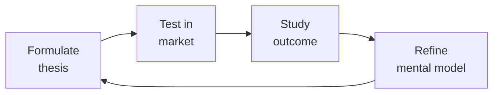

## 3. Legal Basis Decision Framework


## 3. Legal Basis Decision Framework

Choosing the wrong legal basis is one of the most common GDPR violations and one of the hardest to fix retroactively (you cannot switch legal bases mid-stream without a new collection event). This framework walks through each legal basis, when to use it, and how to document it.

### 3.1 Consent (Art. 6(1)(a))

Consent is the most demanding legal basis and the most widely misunderstood.

**Valid consent checklist -- all must be YES:**

| Criterion | Test | Non-compliant example |
|---|---|---|
| **Freely given** | Can the data subject refuse without detriment? Is there a genuine choice? | To use our app, you must agree to marketing emails. (Bundling consent with service access = not freely given.) |
| **Specific** | Is consent granular per purpose? One consent per processing purpose. | A single checkbox: I agree to the Terms and Privacy Policy. (Bundling multiple purposes = not specific.) |
| **Informed** | Has the data subject been told: controller identity, purpose of each processing activity, types of data, right to withdraw, existence of automated decision-making, transfer to third countries and safeguards? | We use cookies to improve your experience. (Not specific enough about what data, which cookies, for what purposes.) |
| **Unambiguous** | Clear affirmative action. No pre-ticked boxes. Silence or inactivity is not consent. | A pre-ticked Sign me up for the newsletter checkbox. |
| **Withdrawable** | Must be as easy to withdraw as to give. At any time. No detriment for withdrawal. | Requiring a phone call to withdraw consent that was given by a single click. |
| **Named parties** | All controllers and processors relying on the consent must be named at the time of collection. | We and our partners -- which partners? What do they do with the data? |
| **Not conditional** | Consent cannot be a condition of service if the processing is not necessary for that service (Art. 7(4), bundling prohibition). | Accept all cookies or leave the site. (Cookie wall -- see Section 5 below.) |

**Consent record requirements (Art. 7(1)):** Must be able to demonstrate consent was given. Store: timestamp, consent text shown at the time, consent string/token, IP address, user agent, banner/notice version, purposes consented to, and withdrawal mechanism.

**When consent is the RIGHT choice:**
- Marketing communications (email, SMS, push notifications)
- Non-essential cookies and trackers (analytics, advertising, personalization)
- Processing special categories of data where no other Art. 9(2) basis applies
- Any processing that the data subject would not reasonably expect

**When consent is the WRONG choice:**
- Employment relationships (power imbalance -- consent is rarely freely given)
- Processing necessary to fulfill a contract (use Art. 6(1)(b) instead)
- Public authorities performing their tasks (use Art. 6(1)(e) instead)

### 3.2 Legitimate Interest (Art. 6(1)(f))

Legitimate interest is the most flexible legal basis -- but it requires a documented balancing exercise, and it is not available to public authorities performing their tasks.

**The Legitimate Interest Assessment (LIA) -- 3-Part Test:**

**Part 1: Purpose Test** -- Is there a legitimate interest?
- The interest must be lawful (not contrary to any law).
- The interest must be sufficiently specific. Commercial interest or business purposes is too vague. Examples of established legitimate interests: fraud prevention, direct marketing (to existing customers about similar products -- soft opt-in under ePrivacy), network and information security, intra-group administrative transfers, whistleblowing schemes (within limits).
- Document: What is the specific interest we are pursuing? Who benefits? How does this align with our business purpose as understood by data subjects?

**Part 2: Necessity Test** -- Is the processing necessary for that interest?
- Necessary means: is there a less intrusive way to achieve the same purpose? If you can achieve the same result with aggregated, anonymized, or pseudonymized data, the processing of personal data is not necessary.
- Document: Can we achieve this purpose without processing personal data? Can we achieve it with less data? Can we achieve it with less intrusive means? What alternatives did we consider and why were they rejected?

**Part 3: Balancing Test** -- Does the individual's interests override the legitimate interest?
- Consider: the nature of the data (is it sensitive? is it publicly available?), the reasonable expectations of the data subject (would they be surprised?), the status of the controller and data subject (is there a power imbalance? is the data subject a child?), the impact on the data subject (could this cause harm, distress, discrimination, loss of control?), the safeguards applied (pseudonymization, opt-out mechanisms, enhanced transparency).
- If the impact outweighs the interest, you cannot use legitimate interest.
- Document the balancing conclusion: The balancing test weighs in favor of [controller/data subject] because [reasoning]. Safeguards applied: [list].

**When legitimate interest is appropriate:**
- Fraud detection and prevention
- IT security monitoring (IDS/IPS, log analysis for threats)
- Direct marketing to existing customers about similar products (with opt-out -- this is the ePrivacy soft opt-in)
- Internal reporting and analytics using pseudonymized data
- Business continuity and disaster recovery (backups containing personal data)

**When legitimate interest is NOT appropriate:**
- Any processing where consent is required by ePrivacy (cookies, electronic marketing to non-customers)
- Processing special categories of data (Art. 9 provides its own exhaustive list of exceptions)
- Processing that would surprise or distress the data subject
- Processing children's data for marketing or profiling

### 3.3 Contract Necessity (Art. 6(1)(b))

This is the most narrowly interpreted legal basis. Necessary for the performance of a contract means: without this processing, the contract cannot be performed. Not helpful for business, not mentioned in the terms, but *strictly necessary*.

**The Contract Necessity Test:**
- Is the processing objectively necessary to deliver the core service the data subject has requested?
- Would the contract be impossible to perform without this processing?
- Is there a less intrusive way to perform the contract?

**Qualifies as contract necessity:**
- Processing a delivery address to ship a purchased item
- Processing payment information to charge for a subscription
- Processing an email address to send a password reset link
- Processing a username to display in a multiplayer game

**Does NOT qualify as contract necessity:**
- Using purchase history to recommend products (this is a separate purpose -- use legitimate interest with opt-out, or consent)
- Sharing email with marketing partners (separate purpose -- requires consent)
- Profiling user behavior to improve the service (this is not necessary to deliver the service the user signed up for -- use legitimate interest or consent)
- Sending promotional emails about service upgrades (marketing -- requires consent or soft opt-in)

**Critical distinction -- services vs. features:** Just because a feature is described in your terms does not make all associated data processing contractually necessary. The test is objective, not contractual. You cannot contract your way into a wider legal basis.

### 3.4 Legal Obligation (Art. 6(1)(c))

Processing that is necessary for compliance with a legal obligation to which the controller is subject.

**Must be:**
- A specific law (EU or Member State law) -- not a general government request or recommendation.
- The obligation must be mandatory, not optional.
- **Examples by industry:**
  - **Financial services:** AML/KYC under 4AMLD/5AMLD -- customer due diligence, transaction monitoring, suspicious activity reporting, record-keeping for 5 years post-relationship.
  - **Employment:** Tax withholding and social security reporting, workplace safety reporting, minimum wage compliance records.
  - **Healthcare:** Medical device adverse event reporting, clinical trial documentation (ICH GCP), prescription records.
  - **Telecommunications:** Data retention under national laws (subject to CJEU case law limitations -- see Tele2 Sverige, La Quadrature du Net).
  - **E-commerce:** Invoice retention (typically 6-10 years depending on Member State), VAT reporting.

### 3.5 Vital Interests (Art. 6(1)(d))

Narrowly limited to processing necessary to protect the vital interests of the data subject or another natural person -- life-or-death situations. Emergency medical treatment, disaster response, humanitarian emergencies. Cannot be used for routine processing. If another legal basis is available (e.g., consent in a medical context), use that instead.

### 3.6 Public Task (Art. 6(1)(e))

Only available to public authorities or private organizations performing a task in the public interest vested by law. Not applicable to most commercial organizations.

### 3.7 Decision Tree: Which Legal Basis?

```
START: Is the processing necessary to comply with a specific, mandatory law?
  |-- YES -> Use Legal Obligation (Art. 6(1)(c))
  |-- NO -> Is it strictly necessary to perform the contract with the data subject?
            |-- YES -> Use Contract Necessity (Art. 6(1)(b))
            |-- NO -> Is the data subject in a life-or-death situation?
                      |-- YES -> Use Vital Interests (Art. 6(1)(d))
                      |-- NO -> Is consent required by ePrivacy or for special category data?
                                |-- YES -> Use Consent (Art. 6(1)(a)) -- must meet all validity criteria
                                |-- NO -> Can you pass the LIA 3-part test?
                                          |-- YES -> Use Legitimate Interest (Art. 6(1)(f)) -- document the LIA
                                          |-- NO -> Use Consent (Art. 6(1)(a))
```

**Switching legal bases:** You cannot switch retroactively. If you collected data under consent and the data subject withdraws, you must stop processing -- you cannot pivot to legitimate interest. If you collected under legitimate interest and the data subject objects successfully, you must stop. Choose carefully at collection time and document your reasoning.

---
## 4. Data Subject Rights (DSAR)

GDPR provides 8 data subject rights. Implementing these at scale requires a centralized DSAR engine -- a request management system that orchestrates identity verification, data collection across all data stores, response assembly, and fulfillment tracking.

For a comprehensive DSAR implementation guide including technical architecture, deletion cascades, portability formats, exemption handling, and quarterly testing protocols, see `references/dsar-implementation-guide.md`.

### 4.1 The 8 Rights at a Glance

| Right | Art. | Summary |
|---|---|---|
| **Access** | 15 | Data subject can obtain confirmation of whether their data is processed, a copy of the data, and metadata (purposes, categories, recipients, retention, rights). |
| **Rectification** | 16 | Correct inaccurate data; complete incomplete data. |
| **Erasure (Right to be Forgotten)** | 17 | Delete data where: no longer necessary, consent withdrawn, objection upheld, unlawful processing, legal obligation. Subject to exemptions (freedom of expression, legal obligation, public health, archiving, legal claims). |
| **Restriction** | 18 | Limit processing while accuracy is contested, processing is unlawful, data is needed for legal claims, or objection is pending. |
| **Portability** | 20 | Receive data in structured, commonly used, machine-readable format (JSON, CSV, XML). Only applies to data provided by the data subject, processed by automated means, based on consent or contract. |
| **Objection** | 21 | Object to processing based on legitimate interest or public task. Absolute right to object to direct marketing. |
| **Automated decision-making** | 22 | Right not to be subject to decisions based solely on automated processing that produce legal or similarly significant effects. Exceptions: contract necessity, authorized by law, explicit consent. |
| **Notification obligation** | 19 | Controllers must communicate rectification, erasure, or restriction to each recipient unless impossible or disproportionate. |

### 4.2 30-Day Response Timeline

- **Clock starts:** Upon receipt of the request. Receipt means the request has been received by the designated DSAR channel and contains sufficient information to identify the data subject and the right being exercised.
- **Standard deadline:** 30 calendar days (not business days).
- **Extensions:** Up to an additional 60 days (total 90) for complex or numerous requests. Must inform the data subject within the first 30 days of the extension and the reasons.
- **ID verification tolling:** The clock pauses while you await identity verification. Start the clock only after identity is confirmed.
- **CCPA comparison:** CCPA allows 45 days (extendable to 90 with notice).

### 4.3 Identity Verification

Use a tiered approach based on the sensitivity of data requested:

| Tier | Risk Level | Methods | When to Use |
|---|---|---|---|
| **Basic** | Low | Email confirmation, logged-in session | Access request for non-sensitive data by authenticated user |
| **Medium** | Moderate | Government ID + selfie match, knowledge-based authentication | Account data including contact details, purchase history |
| **High** | High | Notarized document, in-person verification, multi-factor | Special category data, financial data, deletion requests |

**Critical principle:** Do not request more personal data for verification than necessary. If the data subject is already authenticated in your system, do not demand a passport scan for a simple access request.

### 4.4 Exemptions and Limitations

**Manifestly unfounded (Art. 12(5)):**
- The request is vexatious, harassing, or made in bad faith
- Examples: repetitive requests with no interval for data refresh, requests made to disrupt operations
- Response: refuse or charge a reasonable fee. Must demonstrate why it is manifestly unfounded.

**Excessive (Art. 12(5)):**
- The request overlaps with a recent previous request
- Response: charge a reasonable fee or refuse. The bar is higher than manifestly unfounded -- repetition alone may not qualify if sufficient time has passed.

**Adversely affecting others' rights (Art. 15(4)):**
- Access response cannot include personal data of third parties unless they consent or it is unreasonable to withhold
- Must redact third-party data or split files with joint data subjects

**Other exemptions:** Legal professional privilege, management forecasting, negotiation data, regulatory references, journalistic/academic/artistic purposes (Member State derogations).

### 4.5 Technical Architecture

A centralized DSAR engine should follow this architecture:

1. **Intake Layer:** Web form, email parser, API endpoint. Validates request completeness, creates case in tracking system.
2. **ID Verification Service:** Integrates with auth system, optionally with third-party IDV provider. Returns verified identity token.
3. **Data Store Connectors:** A plugin system -- one connector per data store (PostgreSQL, MongoDB, S3, Salesforce, Zendesk, Stripe, analytics warehouse). Each connector implements: `search(subject_id)`, `retrieve(record_ids)`, `delete(record_ids)`, `export(record_ids, format)`.
4. **Response Assembly Engine:** Aggregates results from all connectors, deduplicates, organizes by category, applies redactions, generates the response package.
5. **Deletion Orchestrator:** Coordinates cascading deletion across all stores. Tracks confirmation from each processor. Implements legal hold checks.
6. **Tracking Dashboard:** See the DSAR implementation guide for dashboard design.


---
## 5. Cookie Compliance

Cookie compliance sits at the intersection of the ePrivacy Directive (2002/58/EC, as amended by 2009/136/EC) and GDPR. The ePrivacy Directive (the lex specialis for electronic communications) requires consent for storing or accessing information on a user's terminal equipment, with a narrow exemption for strictly necessary cookies. GDPR then governs what you do with any personal data collected via those cookies.

### 5.1 ePrivacy Directive + GDPR Interplay

**The rule:** You must obtain prior consent before setting any cookie or tracker that is not strictly necessary (ePrivacy Art. 5(3)). GDPR then provides the standard for what valid consent looks like (freely given, specific, informed, unambiguous -- Art. 4(11) and Art. 7). This means cookie consent must meet ALL the GDPR consent validity criteria.

**Strictly necessary exemption** covers only:
- Session cookies for login state (but not persistent login cookies)
- Shopping cart cookies
- Load-balancing cookies
- Security cookies (CSRF tokens)
- Cookies remembering cookie preferences (ironically)

**The exemption does NOT cover:**
- Analytics cookies (even first-party) -- unless they are essential to providing the service explicitly requested by the user
- A/B testing cookies
- Personalization cookies
- Advertising/targeting cookies
- Social media tracking pixels

### 5.2 Consent Management Platform (CMP) Selection Criteria

When selecting a CMP (OneTrust, Cookiebot, Usercentrics, Cookie Information), evaluate:

| Criterion | Requirement |
|---|---|
| **IAB TCF v2.2 compliance** | Must support the Transparency & Consent Framework for programmatic advertising |
| **Granular consent** | Per-purpose and per-vendor toggles, not just accept all / reject all |
| **Prior blocking** | Must block cookies/scripts before consent -- not just fire and then honor withdrawal |
| **Consent logging** | Records timestamp, consent string, IP, user agent, banner version, purpose list, vendor list |
| **Consent refresh** | Configurable refresh interval (13 months max), re-prompt on material change |
| **Withdrawal mechanism** | Persistent floating button or link; as easy to withdraw as to give |
| **Multi-domain/language** | If you operate across domains and languages |
| **Accessibility** | WCAG 2.1 AA compliant consent interface |
| **API/Webhook** | Programmatic access to consent state for downstream systems |
| **GPC signal** | Honors Global Privacy Control browser signal as opt-out |

### 5.3 Cookie Categorization

| Category | Description | Examples | Consent Required? |
|---|---|---|---|
| **Strictly Necessary** | Essential for the website to function; requested service cannot be provided without them | Session cookies, CSRF tokens, load balancers, shopping cart, cookie preferences | No |
| **Performance / Analytics** | Collect information about how visitors use the site (page views, time on site, error messages) | Google Analytics, Mixpanel, Hotjar heatmaps | Yes |
| **Functional** | Enable enhanced functionality and personalization (remembering preferences, language selection) | Language preference, region selector, video player cookies | Yes |
| **Targeting / Advertising** | Track browsing across sites to build profiles and serve targeted ads | Facebook pixel, Google Ads, retargeting, programmatic ad cookies | Yes (explicit) |

### 5.4 Consent Logs

Per Art. 7(1) accountability, you must be able to demonstrate that consent was given. Log every consent event:

| Field | Example |
|---|---|
| **Consent ID** | `cons_abc123def456` |
| **Timestamp** | `2026-01-15T14:32:17Z` |
| **Consent string** | IAB TCF consent string (e.g., `CO4QHXgO4QHXg...`) |
| **IP address** | `203.0.113.42` (hashed after 30 days) |
| **User agent** | `Mozilla/5.0 ... Chrome/120.0` |
| **Banner version** | `v3.2.1` |
| **Purposes consented** | `[store_and_access_info, create_personalised_ads_profile, measure_ad_performance, ...]` |
| **Purposes rejected** | `[use_limited_data_to_select_content]` |
| **Vendors consented** | `[Google (755), Facebook (89), ...]` |
| **GPC signal honored** | `false` |
| **Consent scope** | Domain(s) covered by this consent |

Store consent logs in an append-only, immutable data store. Retain for the life of the processing plus the statute of limitations for legal claims (typically 3-7 years after the consent expires or is withdrawn).

### 5.5 Consent Refresh

- **Maximum validity:** 13 months from the date consent was given (per IAB TCF policy and advocated by several EU DPAs -- notably CNIL). After 13 months, re-prompt.
- **Material change triggers:** If you add a new purpose, new vendor, new data category, or change how data is used, you must re-obtain consent. The existing consent does not cover the new processing.
- **CNIL guidance:** Recommends 6-month consent validity for advertising cookies specifically.

### 5.6 Cookie Walls Prohibition

A cookie wall is a mechanism that conditions access to a website or service on the user's acceptance of all cookies. The EDPB has stated (Opinion 04/2012, confirmed in post-GDPR guidance) that cookie walls are not valid consent because consent is not freely given when access is conditional. If your only options are "Accept all cookies" or "Leave the site," you do not have valid consent.

**Compliant alternative:** Offer a genuine choice. If the user declines non-essential cookies, they still access the content. You may offer a cookie-free paid alternative (e.g., ad-free subscription), but the free service cannot be contingent on accepting tracking.

---
## 6. Data Protection Impact Assessments (DPIAs)

A DPIA is a process for identifying and minimizing the data protection risks of a project. It is a legal requirement (Art. 35) for processing that is likely to result in a high risk to individuals. The DPIA must be completed *before* the processing begins.

For a comprehensive DPIA template with all sections elaborated, risk matrix, and fillable indicators, see `references/dpia-template-detailed.md`.

### 6.1 When is a DPIA Required?

The EDPB (WP248) established 9 criteria. A DPIA is required if processing meets **2 or more** of these criteria:

1. **Evaluation or scoring** -- including profiling and predicting behavior (credit scoring, performance assessment)
2. **Automated decision-making with legal or similar significant effect** (hiring algorithms, loan decisions)
3. **Systematic monitoring** -- of publicly accessible areas (CCTV, location tracking in apps)
4. **Sensitive data or highly personal data** -- special categories, financial data, location data, communications data
5. **Data processed on a large scale** -- consider number of subjects, volume of data, duration, geographic extent
6. **Matching or combining datasets** -- from multiple sources in a way that exceeds reasonable expectations
7. **Data concerning vulnerable persons** -- children, employees, patients, asylum seekers, mentally ill persons
8. **Innovative use of technological or organizational solutions** -- AI, machine learning, IoT, biometric identification
9. **Preventing data subjects from exercising a right or using a service** -- deny-listing, fraud databases that block access

**Mandatory DPIA triggers (regardless of criteria count):**
- Systematic and extensive profiling with significant effects
- Large-scale processing of special categories of data or criminal conviction data
- Systematic large-scale monitoring of publicly accessible areas

**National DPA lists:** Many EU DPAs publish their own lists of processing activities that require a DPIA. Check your lead DPA's list. The UK ICO, for example, requires DPIAs for: innovative technology, denylisting, biometric/genetic data, data matching, invisible processing, tracking, targeting children, risk of physical harm.

### 6.2 DPIA Methodology

1. **Describe the processing:** What data? How collected? How stored? Who accesses? How long? What systems? Who are the data subjects? (See detailed template for structured questionnaire.)
2. **Assess necessity and proportionality:** For each purpose -- why is this processing necessary? Why can't less data achieve it? Why can't it be done with less intrusive means?
3. **Identify risks:** Using the WP29 risk criteria, enumerate risks to rights and freedoms. Each risk: describe the risk event, the potential impact, and the likelihood.
4. **Identify mitigation measures:** For each risk, specify the measure (technical or organizational) that reduces likelihood or impact.
5. **Assess residual risk:** After mitigation, is the risk low, medium, or high? If high, consultation with the DPA is required before processing.
6. **Document and sign off:** DPO review, stakeholder approvals, version control.
7. **Integrate into project plan:** DPIA outcomes feed into design decisions, not sit on a shelf.

### 6.3 Risk Assessment Matrix

Use a 5x5 likelihood x severity matrix:

| Likelihood \ Severity | 1 (Minimal) | 2 (Limited) | 3 (Significant) | 4 (Severe) | 5 (Maximum) |
|---|---|---|---|---|---|
| **5 (Almost Certain)** | Medium (5) | High (10) | Extreme (15) | Extreme (20) | Extreme (25) |
| **4 (Likely)** | Medium (4) | Medium (8) | High (12) | Extreme (16) | Extreme (20) |
| **3 (Possible)** | Low (3) | Medium (6) | High (9) | High (12) | Extreme (15) |
| **2 (Unlikely)** | Low (2) | Low (4) | Medium (6) | Medium (8) | High (10) |
| **1 (Rare)** | Low (1) | Low (2) | Low (3) | Medium (4) | Medium (5) |

**Risk acceptance thresholds:**
- Low (1-3): Acceptable, document monitoring plan
- Medium (4-6): Acceptable with ongoing monitoring, periodic review
- High (8-12): Requires additional mitigation; if residual risk remains high after mitigation, DPA consultation
- Extreme (15-25): Stop. Redesign. Processing cannot proceed without fundamental changes.

### 6.4 DPA Consultation (Art. 36)

If the DPIA indicates high residual risk and no mitigation can reduce it, you must consult the DPA before processing. The consultation must include: responsibilities of controller/processor, purposes and means of processing, measures and safeguards, DPO contact details, DPIA, and any other information the DPA requests. The DPA has 8 weeks (extendable to 14) to respond. Processing without consultation when required can result in fines and orders to suspend processing.

---
## 7. Data Breach Notification

### 7.1 The 72-Hour Rule (Art. 33)

**When the clock starts:** Upon becoming *aware* of a personal data breach. Awareness means having a reasonable degree of certainty that a breach has occurred -- not necessarily knowing all details, but enough to conclude that personal data may have been compromised.

**What triggers awareness:**
- An alert from your monitoring system
- A report from a processor
- A third-party notification (security researcher, customer)
- Discovery during internal audit or investigation

**What does NOT start the clock:**
- An unconfirmed rumor
- A vague anomaly that could have non-breach explanations
- A suspicion that requires investigation -- but the investigation must happen *immediately*

**The 72-hour timeline is absolute:** 72 hours from awareness, not 3 business days. If the 72nd hour falls on a weekend or holiday, the deadline does not extend. If you miss the window, you can still notify, but must provide reasons for the delay (Art. 33(1)).

**Internal escalation workflow:**
1. **Detection (0-2 hours):** Anyone who detects a potential breach reports to the incident response team via a dedicated channel (Slack, PagerDuty, email to security@).
2. **Triage (0-4 hours):** Incident response team assesses: is personal data involved? What categories? How many data subjects? What is the nature of the breach (confidentiality, integrity, availability)?
3. **Containment (0-4 hours):** Isolate affected systems, revoke compromised credentials, take affected services offline if necessary, preserve logs and forensic evidence.
4. **Risk assessment (4-24 hours):** Determine the risk to individuals. See risk assessment framework below.
5. **DPA notification (0-72 hours):** If risk exists, notify the supervisory authority.
6. **Data subject notification (without undue delay):** If high risk, notify affected individuals.
7. **Post-incident (<30 days):** Root cause analysis, remediation, update DPIA and security measures, tabletop exercise to test improvements.

### 7.2 Breach Risk Assessment

| Risk Level | Criteria | Action |
|---|---|---|
| **Low** | Encrypted data, no potential for harm, data already publicly available | No notification to DPA or data subjects required. Document in internal breach log. |
| **Medium** | Some potential for inconvenience or limited harm (e.g., exposed email addresses only) | Notify DPA within 72 hours. Data subject notification not required. |
| **High** | Identity theft risk, financial loss, special categories exposed, large data set, data can be linked with other data to cause harm | Notify DPA within 72 hours AND notify data subjects without undue delay. |

**Factors that increase risk:** Special categories of data, financial data, credentials (especially if reused), children's data, data volume, data subjects could be identified from the breach, data can enable identity theft or fraud, data can cause reputational harm, discrimination, or loss of confidentiality.

**Factors that decrease risk:** Strong encryption with intact keys, data that is already public, data that cannot be linked to identifiable individuals.

### 7.3 DPA Notification Content (Art. 33(3))

The notification to the supervisory authority must include:

1. Nature of the breach: categories and approximate number of data subjects, categories and approximate number of records
2. DPO contact details or other contact point
3. Likely consequences of the breach
4. Measures taken or proposed to address the breach, including mitigation of adverse effects

If all information is not available, provide it in phases without undue further delay.

### 7.4 Data Subject Notification Content (Art. 34)

When the breach is likely to result in high risk to rights and freedoms, communicate to data subjects without undue delay. The communication must:

1. Describe the nature of the breach in clear and plain language
2. Provide the DPO contact details or other contact point
3. Describe the likely consequences
4. Describe measures taken or proposed to address the breach
5. Describe steps the data subject can take to protect themselves (change passwords, monitor accounts, contact credit bureaus)

**No notification required if:**
- The data was encrypted with strong encryption (and keys were not compromised)
- The controller has taken subsequent measures ensuring high risk is no longer likely
- Notification would involve disproportionate effort (in which case, use a public communication)

### 7.5 Internal Breach Log

Per Art. 33(5), every breach must be documented regardless of whether notification was made. The log must include:

- Date and time of detection
- Date and time of awareness (when 72-hour clock started)
- Description of the breach (what happened, how, what data, how many subjects)
- Risk assessment outcome (low/medium/high) and justification
- Whether DPA was notified and when
- Whether data subjects were notified and when
- Containment and remediation measures
- Root cause
- Corrective actions to prevent recurrence
- Regulatory reference number (if assigned by DPA)

This log must be available for inspection by the supervisory authority.

### 7.6 Tabletop Exercise Format

Conduct at least annually. Format:

1. **Scenario injection:** Present a realistic breach scenario (e.g., S3 bucket misconfigured exposing 50,000 customer records; phishing attack on HR with employee data exfiltrated; rogue employee downloading customer database)
2. **Timed response:** Participants work through the escalation workflow against the clock. Facilitator tracks times.
3. **Decision points:** Force participants to make decisions: Is this notifiable? Who needs to be involved? What do we tell customers? Do we involve law enforcement?
4. **Hot wash:** Debrief immediately after. What worked? What did not? Where were the delays?
5. **After-action report:** Document findings, assign action items, set deadlines. Feed into updated incident response plan.


---
## 8. International Transfers

The GDPR restricts transfers of personal data to third countries (non-EEA) unless specific safeguards are in place. This became significantly more complex after the CJEU Schrems II ruling (July 2020), which invalidated the Privacy Shield and raised the bar for transfer assessments.

For a comprehensive international transfer compliance guide covering adequacy decisions, SCC module selection, Transfer Impact Assessments, BCRs, UK-specific requirements, and the Data Privacy Framework, see `references/international-transfer-guide.md`.

### 8.1 Transfer Identification

A transfer occurs when personal data is sent from the EEA to a third country or international organization (Art. 44). **Remote access from a third country constitutes a transfer** -- if an engineer in India accesses an EU-hosted database, that is a transfer. This makes transfers pervasive for any organization with global operations or remote workforce.

### 8.2 Transfer Safeguards Hierarchy

In order of preference:

1. **Adequacy decision** (Art. 45): The European Commission has determined the country provides an adequate level of protection. Current list includes: Andorra, Argentina, Canada (commercial), Faroe Islands, Guernsey, Israel, Isle of Man, Japan, Jersey, New Zealand, Republic of Korea, Switzerland, UK, Uruguay. **Note:** The US is NOT on the general adequacy list but has the Data Privacy Framework (see below).

2. **Appropriate safeguards** (Art. 46):
   - Standard Contractual Clauses (SCCs) -- 2021 version, the most common mechanism
   - Binding Corporate Rules (BCRs) -- for intra-group transfers
   - Approved codes of conduct (Art. 40) with binding commitments
   - Approved certification mechanisms (Art. 42) with binding commitments
   - Ad hoc contractual clauses authorized by DPA

3. **Data Privacy Framework (DPF):** For transfers to the US, organizations that self-certify under the EU-US DPF, UK Extension, or Swiss-US DPF provide adequate protection. Check the DPF list before relying on this.

4. **Derogations** (Art. 49): Narrow, exceptional situations -- consent (explicit), contract necessity, public interest, legal claims, vital interests, public register. These are NOT suitable for routine, repetitive transfers.

### 8.3 Standard Contractual Clauses (SCCs 2021)

The 2021 SCCs are modular. Choose the correct module(s):
- **Module 1:** Controller to Controller
- **Module 2:** Controller to Processor (most common for SaaS)
- **Module 3:** Processor to Sub-Processor
- **Module 4:** Processor to Controller

**Key obligations:**
- Complete Annex I (parties, description of transfer), Annex II (security measures), Annex III (sub-processors)
- Include the docking clause to allow additional parties to accede
- Conduct a Transfer Impact Assessment (TIA) before executing
- Implement supplementary measures if TIA identifies gaps

### 8.4 Transfer Impact Assessment (TIA)

Per EDPB Recommendations 01/2020, before transferring data under SCCs, you must assess:

1. The laws and practices of the destination country regarding government access to data
2. Whether those laws impinge on the effectiveness of the SCCs
3. Whether supplementary measures can address any gaps

**Specific risk factors for US transfers:**
- FISA Section 702 (surveillance of non-US persons)
- Executive Order 12333 (foreign intelligence gathering)
- Cloud Act (US law enforcement access to data held by US companies)
- Assess whether your data is of the type that might be subject to these authorities

**If gaps exist:** Implement supplementary measures -- encryption with keys held outside the destination country, pseudonymization with no re-identification capability in the destination country, or (if gaps cannot be closed) suspend transfers.

---
## 9. Data Protection Officer (DPO)

### 9.1 When a DPO is Required (Art. 37)

Mandatory if ANY of these apply:
- **Public authorities or bodies** (except courts in their judicial capacity)
- **Core activities consist of processing that requires regular and systematic monitoring of data subjects on a large scale** -- e.g., behavioral advertising, location tracking, health monitoring, CCTV networks
- **Core activities consist of large-scale processing of special categories of data (Art. 9) or criminal conviction data (Art. 10)** -- e.g., hospital processing patient data, insurance company processing health data, background check services

"Core activities" means the key operations necessary to achieve the organization's purpose -- not ancillary functions like payroll. If you are a marketing company, profiling for advertising is a core activity. If you are a furniture manufacturer, the marketing department's cookies are core to marketing but may or may not be core to the organization -- assess both.

**Even if not required:** Voluntary DPO appointment is considered a strong indicator of accountability. If you appoint a DPO, they have all the same protections and obligations as a mandatory DPO.

### 9.2 DPO Responsibilities (Art. 39)

- Inform and advise the controller/processor and employees of their data protection obligations
- Monitor compliance with GDPR and organizational data protection policies
- Advise on DPIAs and monitor their performance
- Cooperate with the supervisory authority
- Act as the contact point for the DPA on processing issues
- Take into account the risk associated with processing operations

### 9.3 Independence and Protections (Art. 38)

- The DPO cannot be dismissed or penalized for performing their tasks
- The DPO reports directly to the highest management level
- The DPO must have adequate resources to perform their tasks
- The DPO cannot receive instructions regarding the exercise of their tasks
- The DPO must not have a conflict of interest (cannot be the person who decides purposes and means of processing -- e.g., CEO, CTO, CMO typically cannot be DPO)
- Contact information must be published and communicated to the supervisory authority

### 9.4 DPO or Not -- Decision Matrix

| Factor | DPO Required? |
|---|---|
| Public authority | Yes, always |
| Core activity: large-scale regular monitoring | Yes |
| Core activity: large-scale special category data | Yes |
| None of the above, but process personal data | No (but recommended) |
| Fewer than 250 employees and occasional processing | No |

---
## 10. Privacy by Design

Privacy by design (Art. 25) requires that data protection be integrated into the processing activities and business practices from the design stage through the entire lifecycle. It is not a feature to add later -- it is a design constraint.

### 10.1 Data Minimization in Architecture

- Design schemas so that personal data and non-personal data are stored in separate, access-controlled tables/collections
- At the API layer, implement field-level access control -- never return more fields than the caller needs
- Use GraphQL or sparse field selectors (e.g., `?fields=id,name,email` in REST) to enforce minimization at read time
- Implement purpose-based access tokens: a service calling the user API for authentication receives only auth-relevant fields; a service calling for analytics receives only pseudonymized data
- Audit database schemas quarterly: any field without a documented purpose and legal basis is flagged for deletion

### 10.2 Pseudonymization Techniques

| Technique | What It Does | When to Use | Key Management |
|---|---|---|---|
| **Tokenization** | Replace identifier with a random token, store mapping in a secure vault | When you need to re-identify later (analytics linking, customer support) | Vault must be isolated with strict access control |
| **Hashing (salted)** | One-way transformation with salt -- cannot reverse, but can link records | Analytics, data warehousing -- when re-identification is not needed but consistency is | Salt must be stored separately, rotated periodically |
| **Encryption** | Reversible with key -- protects confidentiality while retaining utility | Data at rest, application-layer protection for sensitive fields | Key must be in a KMS (AWS KMS, HashiCorp Vault), not in the application code |
| **Aggregation** | Replace individual data with statistical summaries | Reporting, dashboards, public datasets | n/a (no key needed) |

**Critical distinction:** Pseudonymized data is still personal data under GDPR because re-identification is possible (you hold the key/mapping). Anonymized data (truly irreversible) is not personal data. Most organizations never achieve true anonymization -- be honest in your assessments.

### 10.3 Privacy Patterns

| Pattern | Description | Use Case |
|---|---|---|
| **k-anonymity** | Ensure each record is indistinguishable from at least k-1 other records in the dataset | Publishing datasets, analytics exports. Typical: k >= 5 for low-risk, k >= 20 for higher-risk. |
| **l-diversity** | Extension of k-anonymity: within each k-anonymous group, at least l distinct values for sensitive attributes | When k-anonymity alone can leak sensitive attribute values (e.g., all k records share same disease). Typical: l >= 2. |
| **Differential privacy** | Add calibrated noise to query results so the presence or absence of any individual record cannot be determined | Public-facing analytics, API responses with aggregate counts. Epsilon (privacy budget) controls the tradeoff. Typical: epsilon 0.1-1.0. |

### 10.4 Privacy-Enhancing Technologies (PETs)

| Technology | What It Does | Maturity | When to Use |
|---|---|---|---|
| **Homomorphic encryption** | Perform computations on encrypted data without decrypting | Emerging (high overhead) | Financial services, healthcare -- when you need to process data without seeing it |
| **Secure multi-party computation (SMPC)** | Multiple parties compute a function over their private inputs without revealing them | Emerging | Cross-organization analytics, fraud detection consortiums |
| **Zero-knowledge proofs (ZKP)** | Prove a statement is true without revealing the underlying data | Maturing | Age verification (prove age > 18 without revealing birthdate), identity verification |
| **Federated learning** | Train ML models across decentralized data without centralizing raw data | Maturing | Mobile keyboard prediction, healthcare model training across hospitals |

**Implementation guidance for PETs:** These are specialist tools. Do not deploy them without expert input. The error mode for a misconfigured PET is that you think data is private but it is not -- far worse than knowing you have a compliance gap.

---
## 11. CCPA/CPRA Comparison

The California Consumer Privacy Act (CCPA, as amended by the California Privacy Rights Act -- CPRA) is the closest US equivalent to GDPR. Understanding the differences is essential for any organization processing both EU and California resident data.

### 11.1 Applicability Thresholds

An organization must comply with CCPA/CPRA if it does business in California AND meets any ONE of:
- Annual gross revenue exceeds $25 million (globally)
- Buys, sells, or shares personal information of 100,000 or more consumers or households
- Derives 50% or more of annual revenue from selling or sharing consumers' personal information

**Comparison:** GDPR applies to any organization that processes personal data of individuals in the EEA, regardless of revenue or scale (subject to the household exemption for purely personal activities).

### 11.2 Consumer Rights Under CCPA/CPRA

| Right | Description | GDPR Equivalent |
|---|---|---|
| **Right to Know** | Request disclosure of categories and specific pieces of personal information collected, sources, purposes, and third parties shared with | Right of Access (Art. 15) |
| **Right to Delete** | Request deletion of personal information, subject to exceptions | Right to Erasure (Art. 17) |
| **Right to Correct** | Request correction of inaccurate personal information (added by CPRA) | Right to Rectification (Art. 16) |
| **Right to Opt-Out of Sale/Sharing** | Direct businesses to stop selling or sharing personal information for cross-context behavioral advertising | Right to Object (Art. 21) -- but CCPA is opt-OUT, GDPR is opt-IN for some processing |
| **Right to Limit Use of Sensitive PI** | Limit use of sensitive personal information to what is necessary to perform the service (added by CPRA) | Special categories under Art. 9 with explicit consent |
| **Right to Non-Discrimination** | Businesses cannot discriminate against consumers who exercise CCPA rights | No explicit equivalent, but fairness principle (Art. 5(1)(a)) covers this |

### 11.3 Key Differences from GDPR

| Dimension | GDPR | CCPA/CPRA |
|---|---|---|
| **Default consent model** | Opt-in for most processing (consent as legal basis) | Opt-out for sale/sharing (business can process until consumer opts out) |
| **Personal information definition** | Any information relating to an identified or identifiable natural person | Broader: includes household data, inferences drawn from personal information |
| **Sensitive data** | Special categories of personal data (Art. 9) with heightened protections | Sensitive personal information subcategory (SSN, precise geolocation, race, religion, health, biometrics, etc.) with right to limit use |
| **Enforcement** | Supervisory authorities, administrative fines up to 4% global annual turnover or EUR20M | California AG and California Privacy Protection Agency (CPPA); administrative fines; private right of action ONLY for data breaches (not for other violations) |
| **DPO requirement** | Required in specific circumstances | No DPO requirement, but businesses must provide methods for submitting requests |
| **DPIA requirement** | Required for high-risk processing (Art. 35) | Cybersecurity audit and risk assessment required for processing presenting significant risk (CPRA) |
| **Data retention** | Storage limitation principle (Art. 5(1)(e)) | No explicit storage limitation, but must inform consumers of retention period at collection |
| **Cross-border transfers** | Extensive restrictions with adequacy decisions, SCCs, etc. | No cross-border transfer restrictions (US federal system) |

### 11.4 Operational Impact

For organizations subject to both:
- **Do not build parallel systems.** A single DSAR engine that handles both GDPR and CCPA request types, with jurisdiction logic to apply the correct rules (timeline, verification standard, data scope).
- **Unify consent management.** Your CMP should handle GDPR (opt-in, granular) and CCPA (opt-out link, GPC signal) with jurisdiction detection.
- **Privacy notices can be unified** but must clearly differentiate rights available to different jurisdictions.
- **Data mapping is the common foundation** -- both regimes require you to know what data you have and where it lives.

---
## 12. Monitoring & Maintenance

Compliance is not a one-time project. Build these recurring processes:

### 12.1 Consent Audit

- **Quarterly:** Review a sample (10%) of consent records for completeness (all required fields present, consent valid at time of processing). Verify that consent withdrawal propagates to all downstream systems within 30 days.
- **Annually:** Full audit of consent architecture. Test the consent withdrawal flow end-to-end.
- **Consent refresh cadence:** 13-month maximum. Schedule automated re-consent prompts 30 days before expiration.

### 12.2 Data Retention Schedule Enforcement

- **Automated purging scripts:** Cron/scheduled jobs that query for records past retention period. Must run at least monthly.
- **Deletion logs:** Retain evidence of every deletion run -- what was deleted, when, by which job.
- **Legal hold override:** Mechanism to suspend automated deletion. Each hold must have: case identifier, scope (which records), start date, expiry/review date, legal owner.
- **Quarterly verification:** Spot-check 50-100 records across different data categories to confirm deletion has occurred.

### 12.3 Vendor Compliance

- **Annual review:** For every processor -- reconfirm contract currency, SCC version, sub-processor list, security certification status (SOC 2, ISO 27001), and DPA terms.
- **Sub-processor notifications:** When a processor adds a new sub-processor, assess within 30 days. If you object and the processor cannot accommodate, you may need to terminate.
- **Onboarding checklist:** Before sending data to any new vendor -- DPA executed, SCCs attached (if non-EEA), TIA completed, vendor risk tier assigned, privacy team approval.

### 12.4 Privacy Impact Metrics

Track these KPIs monthly. Review quarterly with DPO and management:

| Metric | Target | Escalation Trigger |
|---|---|---|
| DSAR volume | Track trend | >2x normal monthly volume |
| DSAR response time | <30 days (100%) | Any response approaching day 25 |
| DSAR rejection rate | <15% | >20% in any quarter |
| Consent opt-in rate (marketing) | Track trend | <5% -- your consent UX may be coercive or confusing |
| Breach count (total) | 0 | Any breach triggers review |
| High-risk breaches | 0 | Any high-risk breach triggers full investigation |
| Employee training completion | 100% | <95% within 30 days of assignment |
| Vendor DPA currency | 100% | <100% triggers remediation plan |
| ROPA review currency | <12 months since last review per record | Any record >13 months stale |

---
## Production Checklist
<!-- QUICK: 30s -- binary pass/fail items. All must pass. -->
| **[S15]** | Records of Processing Activities (ROPA) complete, accurate, and reviewed within last 12 months | `find ropa/ -name "*.md\|*.json" -mtime -365 \| wc -l` → ≥ 1. `grep -rn "processing.activity\|data.category\|purpose\|legal.basis" ropa/ \| wc -l` → all Art. 30 fields present | ROPA audit: `scripts/ropa-completeness-check.sh` — verifies all GDPR Art. 30 required fields present; auto-generates missing entries from data inventory |
| **[S16]** | Legal basis documented for every processing activity with LIAs where legitimate interest is claimed | `grep -rn "legitimate.interest\|LIA\|balancing.test" dpias/ ropa/ --include="*.md" 2>/dev/null \| wc -l` → must match legitimate-interest count in ROPA | LIA checker: `scripts/lia-gap-check.sh` — cross-references legitimate interest bases with completed LIAs; flags gaps |
| **[S17]** | Consent Management Platform deployed, blocking non-essential cookies/trackers before consent | `curl -s https://example.com \| grep -c "cookie.*banner\|consent.*manage\|cookiebot\|onetrust\|termly"` → must be ≥1. `python3 scripts/check_cookie_blocking.py` → exit 0 (prior blocking active) | Cookie audit: `scripts/cookie-blocking-check.sh` — verifies no non-essential cookies set before consent; blocks deployment if prior-blocking missing |
| **[S18]** | Consent logs maintain timestamp, consent string, IP, and banner version — retrievable per user | `grep -rn "consent.*log\|consent.*record\|consent.*audit" --include="*.sql\|*.js\|*.ts" \| wc -l` → must be >0. `python3 scripts/test_consent_log.py --user-id TEST` → returns consent history | Consent log validator: `scripts/consent-log-audit.sh` — verifies log contains: timestamp, consent string, IP, banner version, user ID. Weekly automated test |
| **[S19]** | Consent withdrawal mechanism tested and confirmed to propagate to all downstream systems | `python3 scripts/test_consent_withdrawal.py --user-id TEST` → exit 0 within SLA. Propagation verified across all processors | Withdrawal tester: `scripts/consent-withdrawal-test.sh` — weekly test of withdraw propagation to all downstream systems; alerts if any processor fails to action within 48h |
| **[S20]** | Do Not Sell or Share link and mechanism implemented and honoring GPC signal (CCPA/CPRA) | `curl -s https://example.com \| grep -c "Do.Not.Sell\|opt.out\|GPC\|global.privacy.control"` → must be ≥1. `python3 scripts/test_gpc_signal.py` → exit 0 | GPC validator: `scripts/gpc-honor-check.sh` — verifies GPC signal detected and honored; auto-blocks sale/share if GPC signal present |
| **[S21]** | DSAR automation pipeline functional: access, portability, and deletion tested quarterly | `python3 scripts/test_dsar_workflow.py --type all` → exit 0. Test covers: access request, data export, deletion request, verification | DSAR pipeline: `scripts/dsar-quarterly-test.sh` — full end-to-end DSAR test; generates compliance report; alerts on any step failure |
| **[S22]** | DSAR response times tracked and within regulatory SLAs (30 days GDPR, 45 days CCPA) | `grep -rn "DSAR\|data.subject.request\|access.request" dsar/ --include="*.csv\|*.json" -l \| xargs jq '.[] \| select(.response_days > 28)'` → must return empty | SLA monitor: `scripts/dsar-sla-tracker.sh` — daily check of open DSARs; alerts at 20 days (GDPR) and 35 days (CCPA); auto-escalates overdue requests |
| **[S23]** | Deletion cascade confirmed to reach all processors with confirmation tracking | `python3 scripts/test_deletion_cascade.py --user-id TEST` → all processors confirm deletion within their SLA. Audit trail logs every confirmation | Deletion verifier: `scripts/deletion-cascade-check.sh` — quarterly test deletion across all processors; requires confirmation from each; flags non-responsive processors |
| **[S24]** | DPIA template integrated into SDLC and completed for all high-risk processing activities | `grep -rn "DPIA\|data.protection.impact" .github/ project/ --include="*.yml\|*.md" 2>/dev/null \| wc -l` → must be >0. `find dpias/ -name "*.md" \| wc -l` → ≥ number of high-risk activities | DPIA gate: `scripts/dpia-sdlc-check.sh` — CI gate; if PR introduces new data processing, requires DPIA or "no DPIA required" justification before merge |
| **[S25]** | Standard Contractual Clauses (2021 version) executed with all non-EEA processors | `find sccs/ -name "*2021*" -o -name "*SCC*2021*" \| wc -l` → must match non-EEA vendor count. `pdfgrep "2021/914" sccs/*.pdf \| wc -l` → all SCCs must be 2021 version | SCC validator: `scripts/scc-version-check.sh` — verifies all SCCs reference 2021/914; flags pre-2021 SCCs for re-execution before Dec 2027 deadline |
| **[S26]** | Transfer Impact Assessments completed for all third-country transfers | `find tias/ -name "*.md" \| wc -l` → must match number of non-adequate-country data transfers. `grep -rn "risk.assessment\|supplementary.measure\|transfer.impact" tias/ \| wc -l` → all TIAs contain required sections | TIA checker: `scripts/tia-gap-check.sh` — enumerates third-country transfers; flags any without completed TIA; auto-generates TIA template |
| **[S27]** | Data breach response plan documented, tested via tabletop exercise within last 12 months | `find incident-response/ -name "breach-response*" -mtime -365 \| wc -l` → ≥ 1. `grep -rn "tabletop\|exercise\|tested" incident-response/ \| wc -l` → evidence of testing | IR test scheduler: `scripts/breach-response-drill.sh` — quarterly tabletop exercise; verifies 72h notification workflow; auto-schedules if overdue |
| **[S28]** | Breach notification templates prepared and ready for rapid deployment | `find incident-response/ -name "*template*" -o -name "*notification*" \| wc -l` → ≥ 3 (supervisory authority, data subjects, internal). Templates include placeholder fields for breach details | Template validator: `scripts/breach-template-check.sh` — verifies templates exist for SA notification (Art. 33), data subject notification (Art. 34), and internal comms; flags missing |
| **[S29]** | Internal breach log maintained with all incidents regardless of notification obligation | `grep -rn "breach.log\|incident.log\|security.incident" incident-response/ --include="*.md\|*.csv\|*.json" -l \| wc -l` → must be ≥1. Contains: date, description, data types, affected individuals, response | Breach log audit: `scripts/breach-log-check.sh` — verifies log captures all incidents (even non-notifiable); checks fields per Art. 33(5) GDPR; monthly review cadence |
| **[S30]** | Privacy policy accurately reflects all processing — updated within last 12 months | `find privacy-policy/ -name "*.md" -mtime -365 \| wc -l` → ≥ 1. `python3 scripts/check_privacy_policy_accuracy.py` → exit 0 (no discrepancies with data inventory) | Policy accuracy checker: `scripts/privacy-policy-audit.sh` — cross-references policy claims with data inventory; flags discrepancies; auto-alerts 30 days before annual review |
| **[S31]** | Employee privacy training completed for all staff with access to personal data (annual) | `grep -rn "training\|completion\|acknowledgment" training/ --include="*.csv\|*.json" \| grep -c "complete\|passed"` → must cover all employees. `find training/ -name "*.csv" -mtime -365` → recent records | Training tracker: `scripts/privacy-training-check.sh` — alerts on overdue training; auto-assigns role-specific modules; blocks data access for non-compliant staff |
| **[S32]** | Data retention schedule enforced — automated purging of data past retention period | `grep -rn "retention\|delete.after\|purge\|anonymi[sz]" data-policies/ --include="*.md" \| wc -l` → must be ≥ per data category. `python3 scripts/check_retention_jobs.py` → all deletion jobs ran successfully | Retention enforcer: `scripts/retention-policy-check.sh` — verifies deletion/anonymization jobs ran in past 30 days; alerts on overdue purges; blocks new collection if retention not configured |
| **[S33]** | Legal hold process documented and accessible to legal team | `grep -rn "legal.hold\|litigation.hold\|preservation.notice" incident-response/ legal/ --include="*.md" \| wc -l` → must be ≥3 documents. Process covers: hold issuance, scope determination, custodian notification, release | Legal hold audit: `scripts/legal-hold-check.sh` — verifies process documentation exists; tests hold issuance workflow annually |
| **[S34]** | DPO appointed or privacy responsibility formally assigned to a qualified individual | `grep -rn "DPO\|data.protection.officer\|privacy.officer" compliance/ --include="*.md" \| wc -l` → must be ≥1. Role documented with: name/contact, reporting line, independence guarantee, budget | DPO checker: `scripts/dpo-appointment-check.sh` — verifies DPO or privacy lead documented; checks Art. 37-39 compliance; alerts if role vacant |
| **[S35]** | DPO contact information published and communicated to supervisory authority | `curl -s https://example.com/privacy \| grep -c "data.protection.officer\|DPO\|privacy@\|dpo@"` → must be ≥1. SA notification verified | DPO publication check: `scripts/dpo-contact-check.sh` — crawls privacy page for DPO contact; verifies SA notification record exists |
| **[S36]** | Vendor DPA inventory current — all processors have executed DPAs with SCCs where applicable | `scripts/vendor-dpa-gap.sh 2>/dev/null` → must return 0. All vendors processing personal data have signed DPA | DPA enforcement: `scripts/vendor-dpa-check.sh` — cross-references vendor list with signed DPAs; auto-generates DPA requests for gaps; monthly audit |
| **[S37]** | Vendor sub-processor list current and authorized | `grep -rn "sub.processor\|subprocessor" vendor/ --include="*.md" -l \| xargs grep -L "approved\|authorized\|last.reviewed"` → must return empty. All sub-processor changes trigger review | Sub-processor tracker: `scripts/subprocessor-audit.sh` — verifies all vendor sub-processors listed and authorized; alerts on new sub-processors without approval |
| **[S38]** | Privacy metrics dashboard live and reviewed quarterly | `grep -rn "privacy.*metric\|privacy.*dashboard\|privacy.*KPI" compliance/ --include="*.md" \| wc -l` → must be ≥1. Dashboard shows: DSAR volume/age/SLA compliance, consent rates, breach incidents, training completion | Dashboard validator: `scripts/privacy-metrics-check.sh` — verifies dashboard accessible; checks last review date <90 days; auto-generates quarterly report |
- [ ] **[S39]**  Annual compliance review completed and documented

---

## Footguns
<!-- DEEP: 10+min — war stories from privacy compliance and data protection -->

| Footgun | What Happened | Root Cause | How to Prevent |
|---------|---------------|------------|----------------|
| DSAR response turned into a PR disaster — customer requested "all data about me" and the export included internal Slack messages where sales team discussed the customer's negotiation weaknesses | A B2B SaaS company received a GDPR Subject Access Request from a customer who was in contract renewal negotiations. The engineering team ran a full database export filtered by customer email across ALL internal systems, including Slack. The 1,400-page export included 17 Slack messages where the sales team discussed "this guy always caves by end of quarter, push for the enterprise tier." The customer posted excerpts on LinkedIn. The deal died. The ICO investigated the data breach (internal comms about a customer are personal data if they identify the individual). | The DSAR pipeline had no scope boundaries — "all data about this person" was interpreted literally by an engineer who treated it as a grep exercise. No privacy review step filtered out internal communications, legal advice, or third-party confidential information. | **DSAR responses must pass through a human privacy review before release.** Build a DSAR pipeline that collects structured personal data (user profile, purchase history, support tickets) but quarantines unstructured data (emails, chat logs, CRM notes) for manual review. Train reviewers: "Would this document embarrass the company or violate someone else's privacy if published on the front page of the Financial Times?" Exemptions exist for legal privilege, management forecasting, and third-party confidential data — use them. Test your DSAR pipeline quarterly with a "hostile customer" scenario: someone who will scrutinize every page. |
| Consent banner displayed "We value your privacy" but 47 tracking cookies fired on page load before any user interaction — €75M GDPR fine from the CNIL | A French e-commerce company used a consent management platform (CMP) that showed a friendly banner: "We use cookies to improve your experience. By continuing, you accept." But a CNIL investigation found that 47 marketing and analytics cookies were already active on page load — before the user clicked anything. The CMP was configured in "implied consent" mode: the banner was cosmetic. The CNIL fine was €75M (€50M for GDPR violation + €25M for ePrivacy Directive violation). | The CMP was treated as a liability shield, not a consent mechanism. "Implied consent" is not consent under GDPR — consent requires an affirmative action. The marketing team rejected "reject all" as a visible option because "it would hurt our retargeting campaigns." | **Test consent with a script, not a screenshot.** Write an automated test: load the homepage with a fresh incognito session, enumerate every cookie and tracker set before ANY user interaction, and fail the build if anything fires without consent. The consent banner must have EQUAL prominence for "Accept All" and "Reject All" buttons. Consent must be granular by purpose — no "all or nothing" pre-ticked boxes. If your marketing team says "this will kill our analytics," the answer is: "30% analytics coverage with valid consent is legally defensible. 100% coverage without consent is a €75M fine." |
| DPIA concluded "low risk" for an AI-powered hiring tool — 6 months later the tool was found to discriminate by gender, and the DPIA was used as evidence of regulatory negligence | An HR tech startup deployed an AI tool that screened resumes and ranked candidates. The DPIA assessed 2 risks: data security (encryption in transit/at rest — low risk) and data minimization (only resume text collected — low risk). It did NOT assess algorithmic bias, fairness, or automated decision-making under GDPR Article 22. Six months later, an investigative journalist demonstrated the tool downgraded female candidates by 30% based on proxy variables in resume language patterns. The Italian Garante fined the company €20M and cited the DPIA as evidence the company failed to identify obvious risks. | The DPIA assessed IT security risks but not AI ethics risks. GDPR Article 35 requires assessing risks to "rights and freedoms of natural persons" — not just data security. The risk of automated discrimination was foreseeable but unexamined because the DPIA author was a security engineer, not a privacy or AI ethics professional. | **DPIAs for AI/automated decision systems must include fairness and bias assessment sections.** At minimum: (a) what training data was used, and what biases are known in that data? (b) was the system tested for differential impact across protected characteristics? (c) does Article 22 apply (solely automated decision with legal/significant effect)? If yes, what safeguards exist (human intervention, explainability, contestation mechanism)? The DPIA sign-off must include someone accountable for AI ethics — this is not a checkbox for your infosec team. |
| "Right to erasure" request complied with — deleted from production database within 24 hours, but the backup tapes in cold storage weren't erased because "they're immutable archives" | A German bank received a GDPR erasure request. The engineering team deleted the customer from the primary database, the analytics warehouse, and the CRM within 24 hours. The DPO signed off. Eighteen months later, during a regulatory audit, the auditor asked: "What about your backup tapes?" The bank held 7 years of LTO tape backups in an Iron Mountain vault. The engineering team argued backups were "immutable archives" exempt from erasure. The Bayerisches Landesamt fined €14M: GDPR Article 17 applies to backups unless erasure is "impossible or involves disproportionate effort" — and the bank had never even attempted to assess the effort. | The team equated "difficult" with "impossible." LTO tapes can be reloaded to disk, the specific records deleted, and the cleaned data re-archived. The "disproportionate effort" exemption requires documented assessment and alternative measures (restricted processing). "We didn't try" is not a legal defense. | **Build erasure into your backup architecture from day one.** Store personal data in a separate logical partition from non-personal operational data so erasure doesn't require rebuilding entire backups. The exemption for backups requires: (a) a documented assessment of the effort required, (b) implementation of "restricted processing" (the data exists but is never restored), and (c) a commitment to erase from backups during the next recovery cycle. Never claim "impossible" without a written engineering assessment with cost and timeline estimates. |
| Cross-border data transfer relied on Privacy Shield certification — 6 months after Schrems II invalidated it, and 3 months after the company's own external counsel warned them | A US-based SaaS company with 40,000 EU customers continued transferring data to US servers under their Privacy Shield certification. On July 16, 2020, the CJEU issued Schrems II invalidating Privacy Shield. The company's external counsel sent a memo on July 22: "You must implement SCCs with supplementary measures within 90 days." The memo was filed in the "legal/2020" folder and forgotten. In January 2021, the Austrian DPA received a complaint from noyb (Max Schrems' organization). Investigation confirmed the company was still relying on Privacy Shield 6 months post-invalidation. Fine: €18M. | The legal team provided advice but had no mechanism to verify it was actioned. The engineering team never saw the memo. No compliance tracking system existed that linked legal obligations to engineering implementation with deadlines and ownership. | **Every regulatory change memo must generate a compliance ticket with an owner, deadline, and acceptance criteria — not just a PDF in a folder.** Build a compliance obligation register that maps each legal requirement to: (a) the technical control that implements it, (b) the owner responsible for it, (c) the evidence that proves it works, and (d) the next review date. When Schrems III or any major ruling drops, the question isn't "did someone write a memo?" — it's "is the ticket assigned and is the deadline tracking?" |

## Calibration — How to Know Your Level
<!-- STANDARD: 3min — honest self-assessment rubric -->

| You Know You're Stuck at L1 When... | You Know You've Reached L2 When... | You Know You're L3 When... |
|---|---|---|
| You cite "consent" as the legal basis for every processing activity without being able to name the other 5 lawful bases | You can walk into any system at the company and trace where personal data enters, where it's stored, who accesses it, and how it's deleted — without asking an engineer | A supervisory authority audits your organization and the lead auditor says "I wish more companies had your data governance" after 3 days of review — and this isn't because you hid problems, but because your documentation was so thorough |
| You confuse "data processor" and "data controller" in a meeting with enterprise customers | You can negotiate a DPA with a Fortune 500 procurement team and explain why their "unlimited audit rights" clause is incompatible with your multi-tenant architecture without sounding evasive | You design a privacy program that expands into 15 new countries in 12 months without a single regulatory action — and each launch is handled by the legal team using the framework you built, not by you personally |
| Your DPIA template asks the same 5 questions regardless of whether you're assessing a cookie banner or an AI hiring algorithm | You've completed 20+ DPIAs where the data protection officer accepted every one without requesting a redo | A regulator reviews your DPIA for a high-risk AI system and says "this is the standard we wish the guidance described" — not because you answered every question, but because you anticipated questions the guidance hadn't yet asked |

**The Litmus Test:** A customer emails: "I want every piece of data you have about me, and I want it deleted within 7 days." Can you produce a complete, accurate export and confirm erasure across all systems — including backups, logs, analytics, CRM, and third-party processors — without a single manual SQL query? If anyone on your team says "we'll need to check with engineering about the backup situation," you're not ready for a regulator visit.

## Deliberate Practice


```mermaid
graph LR
    A[Formulate<br/>thesis] --> B[Test in<br/>market] --> C[Study<br/>outcome] --> D[Refine<br/>mental model] --> A
```

| Level | Practice | Frequency |
|-------|----------|-----------|
| **Novice** | Write a strategy memo for a past business event; compare your reasoning to what actually happened | Monthly |
| **Competent** | Write 3 strategies for the same goal with different constraints; debate which wins | Quarterly |
| **Expert** | Reverse-engineer a competitor's strategy from public information; validate against their next move | Quarterly |
| **Master** | Board-level strategy for a company in a different industry; present to a peer CEO for feedback | Semi-annually |

**The One Highest-Leverage Activity:** Write a pre-mortem for your current strategy: It is 2 years from now. Our strategy failed. Why?
## References
<!-- QUICK: 30s -- links to deeper reading -->
**Primary Legislation:**
- [GDPR Full Text -- EUR-Lex](https://eur-lex.europa.eu/eli/reg/2016/679/oj)
- [CCPA/CPRA -- California AG](https://oag.ca.gov/privacy/ccpa)
- [ePrivacy Directive 2002/58/EC](https://eur-lex.europa.eu/eli/dir/2002/58/oj)

**EDPB / WP29 Guidance:**
- [EDPB Guidelines 4/2019 -- Article 25: Data Protection by Design and by Default](https://edpb.europa.eu/our-work-tools/our-documents/guidelines/guidelines-42019-article-25-data-protection-design-and_en)
- [EDPB Recommendations 01/2020 -- Supplementary Measures for International Transfers](https://edpb.europa.eu/our-work-tools/our-documents/recommendations/recommendations-012020-measures-supplement-transfer_en)
- [WP248 -- DPIA Guidelines](https://edpb.europa.eu/our-work-tools/our-documents/guidelines/guidelines-data-protection-impact-assessment-dpia_en)
- [EDPB Guidelines 01/2022 -- Data Subject Rights: Right of Access](https://edpb.europa.eu/our-work-tools/our-documents/guidelines/guidelines-012022-data-subject-rights-right-access_en)
- [EDPB Guidelines 05/2020 -- Consent](https://edpb.europa.eu/our-work-tools/our-documents/guidelines/guidelines-052020-consent-under-regulation-2016679_en)

**International Transfers:**
- [European Commission -- Standard Contractual Clauses (SCCs)](https://commission.europa.eu/law/law-topic/data-protection/international-dimension-data-protection/standard-contractual-clauses-scc_en)
- [Data Privacy Framework Program](https://www.dataprivacyframework.gov/)
- [UK ICO -- International Data Transfer Agreement (IDTA)](https://ico.org.uk/for-organisations/guide-to-data-protection/guide-to-the-general-data-protection-regulation-gdpr/international-transfers/)

**Cookie Compliance:**
- [IAB Europe -- Transparency & Consent Framework (TCF)](https://iabeurope.eu/transparency-consent-framework/)
- [CNIL -- Cookies and Other Trackers Guidelines](https://www.cnil.fr/en/cookies-and-other-trackers)

**Regulatory Guidance:**
- [ICO -- Guide to the General Data Protection Regulation](https://ico.org.uk/for-organisations/guide-to-data-protection/guide-to-the-general-data-protection-regulation-gdpr/)
- [EDPB -- Binding Corporate Rules](https://edpb.europa.eu/our-work-tools/our-documents/guidelines/guidelines-22022-relevant-update-recommendations-12022_en)

**Tools:**
- [OneTrust -- Privacy Management Platform](https://www.onetrust.com/)
- [BigID -- Data Discovery and Intelligence](https://bigid.com/)

---
**Internal Reference Documents:**
- [DSAR Implementation Guide](references/dsar-implementation-guide.md)
- [DPIA Detailed Template](references/dpia-template-detailed.md)
- [International Transfer Compliance Guide](references/international-transfer-guide.md)
