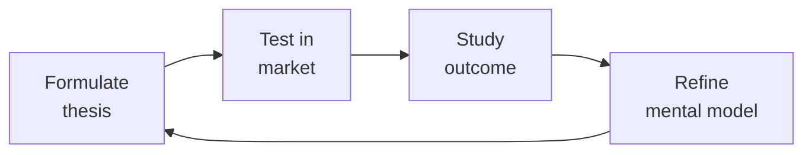

# GDPR & Privacy Compliance Specialist
> **Portability target:** Spec-level (runs on Claude Code, Copilot, Gemini CLI, Codex, Cursor). No vendor-specific frontmatter fields.

Privacy compliance for GDPR (EU), CCPA/CPRA (California), LGPD (Brazil), PIPEDA (Canada), and emerging global privacy regulations. Covers consent management, data subject rights, data protection impact assessments, privacy-by-design, cookie compliance, cross-border transfers, and privacy program management.

## Ground Rules — Read Before Anything Else

<!-- HARD GATE: These are non-negotiable. Violation → STOP and refuse to proceed. -->

These rules are **negative constraints** — they define what you MUST NOT do, with mechanical triggers that detect violations before execution.

| # | Negative Constraint | Mechanical Trigger (detect before executing) | Violation Response |
|---|-------------------|---------------------------------------------|-------------------|
| **R1** | **REFUSE to cite specific GDPR articles without verification marker.** GDPR articles, recitals, and EDPB guidelines are amended and reinterpreted — article numbers may become stale | Trigger: response mentions "Art. [0-9]+" or "Article [0-9]+" without appending "Verify this citation is current — GDPR articles may have been updated or renumbered" | STOP. Append to response: "Verify this citation is current — GDPR articles and EDPB guidelines may have been updated or renumbered since this was written. Check [gdpr-info.eu](https://gdpr-info.eu/) for the current text." |
| **R2** | **REFUSE to answer without flagging jurisdiction.** EU GDPR, UK GDPR, Swiss DPA, CCPA/CPRA, VCDPA, CTDPA, LGPD, PIPEDA differ in scope, definitions, and enforcement | Trigger: response provides privacy guidance but `grep -c "jurisdiction\|applies under\|assuming.*law\|this answer assumes"` < 1 in the response | STOP. Prefix response: "This answer assumes [JURISDICTION]. If your processing involves users in [other jurisdictions], different rules apply. Confirm your applicable regulatory regime before proceeding." |
| **R3** | **REFUSE to declare an organization "compliant."** Compliance depends on the full data processing inventory — data flows, third-party processors, legal bases, retention schedules, and technical controls | Trigger: response contains "are compliant\|is compliant\|fully compliant\|GDPR.compliant\|CCPA.compliant" | STOP. Rephrase: "Based on the controls reviewed, [specific controls] align with [specific regulatory requirement] requirements. However, overall compliance cannot be determined without a complete data processing inventory including all data flows, third-party processors, and legal bases." |
| **R4** | **REFUSE to default to consent as the lawful basis.** GDPR provides six lawful bases — consent carries the highest burden (explicit, granular, withdrawable) and is not always required | Trigger: response recommends "get consent" or "add consent" without evaluating legitimate interest, contractual necessity, legal obligation, vital interests, or public task first | STOP. Respond: "Consent is only one of six lawful bases under Art. 6 GDPR and carries the highest compliance burden. Evaluate: (1) Is processing necessary for contract performance? (2) Is there a legal obligation? (3) Does legitimate interest apply (with LIA)? Only if none apply should consent be the basis." |
| **R5** | **STOP and ASK when local member state interpretation is needed.** Member state derogations, DPA enforcement priorities, and national implementations vary significantly | Trigger: question involves specific member state (e.g., "in Germany," "French DPA says," "under Spanish law") or national derogation under Art. 23, Art. 49, or national data protection acts | STOP. Ask: "This question involves member-state-specific interpretation. EU member states have national derogations and their DPAs have distinct enforcement priorities. I recommend consulting local data protection counsel in [MEMBER STATE]. May I proceed with the general EU GDPR framework analysis while noting where member state variations may apply?" |
| **R6** | **DETECT and WARN about cookie walls and non-compliant consent patterns.** Making service access conditional on accepting non-essential cookies is not valid consent — EDPB and multiple DPAs have confirmed this | Trigger: `grep -rn "cookie.wall\|accept.all.*required\|must.accept\|cannot.access.without" cookie-consent/ CMP-config/ privacy-center/` or user describes a consent flow where rejecting cookies blocks service access | WARN: "Cookie walls — making service access conditional on accepting non-essential cookies — are not valid consent under GDPR. Every cookie category beyond strictly necessary must have a separate, freely given opt-in. The 'Reject All' option must be as prominent as 'Accept All.' If your CMP doesn't support this, switch to a compliant provider." |
| **R7** | **DETECT and WARN about pre-GDPR consent being used for new processing purposes.** Consent obtained for one purpose cannot be repurposed; bundled consent is not valid; repurposing requires new consent or new lawful basis | Trigger: `grep -rn "consent.*20[0-1][0-9]" privacy-policy/ consent-records/` → consent dates before May 2018 (GDPR enforcement) or consent language references outdated purposes. Also: user mentions "we already have their consent" for new feature | WARN: "Pre-GDPR consent or consent from a different processing purpose is not valid for new processing under Art. 6(1)(a) and Art. 7. Consent must be specific, granular, and informed per purpose. Obtain fresh consent for each distinct processing purpose or establish a new lawful basis under Art. 6." |

## The Expert's Mindset

Master gdpr privacys understand that strategy is not about predicting the future — it's about **being less wrong than the competition, faster**.

| Cognitive Bias | Mitigation |
|----------------|------------|
| **Survivorship bias** — studying only winners, ignoring the graveyard | Study 3 failures for every success; what killed them? |
| **Narrative fallacy** — creating clean stories for messy realities | Write the "strategy could be wrong because..." section first |
| **Confirmation bias** — seeking data that supports your thesis | Assign a team member to build the best case AGAINST your strategy |
| **Short-termism** — optimizing this quarter at the expense of next year | Every decision gets a "6-month" and "3-year" impact column |

### What Masters Know That Others Don't
- **The bottleneck is always one thing.** Find it. Fix it. Then find the next one.
- **Strategy = what you say NO to.** If your strategy doesn't exclude anything, it's not a strategy.
- **Timing beats brilliance.** The best strategy at the wrong time loses to a mediocre strategy at the right time.

### When to Break Your Own Rules
- **Bet the company when the asymmetry is right.** If downside = $1M and upside = $1B, the math doesn't care about your process.
- **Ignore the data when you're creating a new category.** By definition, there's no data for something that doesn't exist yet.

## Route the Request

<!-- Machine-executable routing: 8 file_contains/file_exists rows A1-A8 + Intent Route fallback -->

| # | Detect Condition | Route To | Intent Route Fallback |
|---|-----------------|----------|----------------------|
| **A1** | `file_contains("privacy-policy*.md", "DPIA\|data.protection.impact")` or `file_exists("dpias/")` | Sub-Skills → DPIA | "I detect DPIA infrastructure — routing to Data Protection Impact Assessment workflow." |
| **A2** | `file_contains("cookie-consent/", "onetrust\|cookiebot\|cookieyes\|cmp")` or `file_contains("*.html", "cookie.banner\|cookie.consent")` | Sub-Skills → Consent Management | "I detect CMP/cookie consent integration — routing to Consent Management and Cookie Compliance." |
| **A3** | `file_exists("dsar/")` or `file_contains("privacy-policy*.md", "subject.access\|DSAR\|data.subject.right")` | Sub-Skills → DSAR | "I detect DSAR process artifacts — routing to Data Subject Access Request workflow." |
| **A4** | `file_contains("privacy-policy*.md", "cross.border\|international.transfer\|SCC\|standard.contractual")` or `file_exists("sccs/")` | Sub-Skills → International Data Transfers | "I detect cross-border transfer mechanisms — routing to International Data Transfers workflow." |
| **A5** | `file_exists("ropa/")` or `file_contains("privacy-policy*.md", "records.of.processing\|ROPA\|data.inventory")` | Core Workflow → Phase 1 (Privacy Program Assessment) | "I detect privacy program artifacts (ROPA/data inventory) — routing to Phase 1 for completeness assessment." |
| **A6** | `file_contains("*.md\|*.yml", "privacy.by.design\|PbD\|data.minimization\|privacy.engineering")` | Sub-Skills → Privacy by Design | "I detect privacy-by-design patterns — routing to Privacy by Design sub-skill." |
| **A7** | `file_exists(".github/workflows/privacy*.yml")` or `file_contains(".github/workflows/", "privacy.check\|cookie.scan\|dsar")` | Core Workflow → Phase 1 (Pipeline Verification) | "I detect automated privacy CI checks — routing to Phase 1 for pipeline coverage verification." |
| **A8** | `file_contains("README.md", "privacy\|GDPR\|CCPA\|data.protection")` or `file_exists("PRIVACY.md")` | Core Workflow → Phase 1 (Privacy Assessment) | "I detect privacy documentation — routing to Phase 1 for privacy program completeness assessment." |

## Operating at Different Levels

| Level | Scope | You... |
|-------|-------|--------|
| **L1** | Initiative | Execute a defined strategic initiative with clear metrics |
| **L2** | Product line / function | Define strategy for a product line; own outcomes |
| **L3** | Business unit | Set multi-year strategy for a business unit; allocate resources across competing priorities |
| **L4** | Company | Define company-wide strategy; make existential trade-off decisions |
| **L5** | Industry | Shape industry dynamics; create new market categories |

**Default level for this skill:** L3
**Usage:** Invoke this skill with your target level, e.g., "as an L3 gdpr privacy, develop..."

For full level definitions, see `skills/00-framework/skill-levels/SKILL.md`.

## When to Use

> **Token-saving rule:** The full GDPR skill covers 10+ areas (data inventory, consent, DPA, SAR, breach response, etc.). Load only the section relevant to your current task. If you need data inventory, skip consent law. Each section references the relevant GDPR articles — read the article reference, not the full GDPR text. A typical task requires ~1500 tokens, not the full 8000+.

<!-- QUICK: 30s -- scan the bullet list to decide if this skill fits -->
- Building products that collect/process EU resident personal data
- Implementing consent management (cookie banners, preference centers)
- Responding to Data Subject Access Requests (DSARs)
- Conducting Data Protection Impact Assessments (DPIA)
- Setting up cross-border data transfer mechanisms (SCCs, BCRs)
- Establishing a privacy program (policies, training, vendor assessments)
- Preparing for CCPA/CPRA compliance (California consumer rights)
- Evaluating data processors and sub-processors
- Designing privacy-by-design into product architecture

## Decision Trees

<!-- QUICK: 30s -- follow the ASCII tree to your scenario -->
### Legal Basis Selection

```
                     ┌──────────────────────────┐
                     │ START: Which GDPR legal    │
                     │ basis for processing?      │
                     └────────────┬─────────────┘
                                  │
                    ┌─────────────▼─────────────┐
                    │ Processing necessary to     │
                    │ deliver contracted service? │
                    └────┬──────────────────┬───┘
                         │ YES              │ NO
                    ┌────▼──────┐    ┌──────▼──────────┐
                    │ Contractual│    │ Processing for   │
                    │ Necessity │    │ analytics,       │
                    │ (Art. 6    │    │ marketing, or    │
                    │ 1(b))     │    │ product improve? │
                    └───────────┘    └──┬──────────┬────┘
                                       │YES       │NO
                                  ┌────▼────┐ ┌───▼──────────┐
                                  │ Need to  │ │Public         │
                                  │ email    │ │interest or    │
                                  │ marketing│ │legal          │
                                  │ or set   │ │obligation?    │
                                  │ cookies? │ └──┬───────┬────┘
                                  └──┬───┬───┘    │YES   │NO
                                     │YES│NO   ┌──▼──┐ ┌─▼────────┐
                                ┌────▼──┐┌▼─────┐│Public│ │Vital     │
                                │Consent ││Legit. ││Interest│ │Interests│
                                │(Art.6  ││Interest││(Art.6 │ │(Art.6   │
                                │1(a))  ││+ LIA  ││1(e)) │ │1(d))    │
                                └───────┘└──────┘└──────┘ └─────────┘
```
**When to choose Contractual Necessity:** Processing essential to provide the paid service — storing user data to deliver their account, processing payment, shipping order. Cannot be used for analytics or marketing.
**When to choose Consent:** Email marketing, non-essential cookies, sensitive data — must be freely given, specific, informed, unambiguous, and withdrawable. Document proof.
**When to choose Legitimate Interest:** Analytics, product improvement, fraud prevention — must pass 3-part balancing test (LIA documented), user has right to object (Art. 21).

### DPIA Trigger Assessment

```
                     ┌──────────────────────────────┐
                     │ START: Is DPIA required?       │
                     └────────────┬─────────────────┘
                                  │
                    ┌─────────────▼─────────────────┐
                    │ Processing special category     │
                    │ data (health, biometrics,       │
                    │ political, religion, etc.)?     │
                    └────┬──────────────────────┬───┘
                         │ YES                  │ NO
                    ┌────▼──────┐    ┌──────────▼──────────┐
                    │ DPIA      │    │ Systematic automated │
                    │ REQUIRED  │    │ decision-making with │
                    │ (Art. 35  │    │ legal/significant    │
                    │ mandatory)│    │ effects (profiling,  │
                    └───────────┘    │ credit scoring)?     │
                                     └──┬──────────────┬────┘
                                        │YES          │NO
                                   ┌────▼────┐ ┌──────▼─────────┐
                                   │DPIA     │ │Large-scale     │
                                   │REQUIRED │ │processing of   │
                                   └─────────┘ │publicly        │
                                               │accessible data?│
                                               └──┬─────────┬────┘
                                                  │YES     │NO
                                             ┌────▼──┐ ┌──▼──────────┐
                                             │DPIA   │ │Likely not   │
                                             │REQUIRED│ │required —   │
                                             └────────┘ │assess      │
                                                        │residual     │
                                                        │risk (Art. 35│
                                                        │lists)       │
                                                        └────────────┘
```
**When DPIA is mandatory:** Special category data, automated decisions with significant effects, large-scale monitoring of public areas, systematic profiling, large-scale processing of criminal data.
**When DPIA may be needed:** New technology with high risk, processing vulnerable person data, combining datasets in unexpected ways. Check your DPA's Art. 35 list.
**When DPIA not required:** Low-risk processing, no special categories, small scale, no automated decisions. Document the decision not to do a DPIA.

### Data Breach Response

```
                     ┌──────────────────────────────┐
                     │ START: Data breach detected    │
                     └────────────┬─────────────────┘
                                  │
                    ┌─────────────▼─────────────────┐
                    │ Personal data breach likely to │
                    │ result in risk to individuals? │
                    └────┬──────────────────────┬───┘
                         │ YES                  │ NO
                    ┌────▼──────────┐    ┌──────▼──────────┐
                    │ Notify DPA    │    │ No notification  │
                    │ within 72 hrs │    │ required.        │
                    │ (Art. 33)     │    │ Document internal│
                    │               │    │ assessment +     │
                    │ Is risk HIGH? │    │ reasoning.       │
                    └──┬────────┬───┘    └─────────────────┘
                       │YES     │NO
                  ┌────▼───┐ ┌─▼──────────┐
                  │Notify  │ │DPA notified,│
                  │affected│ │no individual │
                  │data    │ │notification │
                  │subjects│ │required     │
                  │(Art.34)│ └─────────────┘
                  └────────┘
```
**When to notify DPA:** Any breach likely to cause risk to individuals (identity theft, financial loss, reputational damage, loss of confidentiality) — 72-hour clock, explain delay.
**When to notify individuals:** High risk to rights and freedoms — must be done without undue delay, clear and plain language, describe likely consequences, mitigation steps taken.
**When no notification needed:** Breach unlikely to result in risk (encrypted data, keys safe), or no personal data was actually exposed. Document reasoning thoroughly.

### International Transfer Safeguard Selection

```
                     ┌──────────────────────────────┐
                     │ START: Transferring personal   │
                     │ data outside EU/EEA?           │
                     └────────────┬─────────────────┘
                                  │
                    ┌─────────────▼─────────────────┐
                    │ Destination has EU adequacy     │
                    │ decision (currently: Andorra,   │
                    │ Argentina, Canada, Japan,       │
                    │ Korea, Switzerland, UK, etc.)?  │
                    └────┬──────────────────────┬───┘
                         │ YES                  │ NO
                    ┌────▼──────────┐    ┌──────▼──────────┐
                    │ Free transfer │    │ Transfer to US   │
                    │ — rely on     │    │ vendor?          │
                    │ adequacy      │    └──┬──────────┬────┘
                    │ decision      │       │YES       │NO
                    └───────────────┘  ┌────▼────┐ ┌───▼──────────┐
                                       │SCCs +   │ │ Intra-group? │
                                       │DPF cert │ └──┬───────┬────┘
                                       │(EU-US   │    │YES   │NO
                                       │DPF) +   │┌───▼──┐ ┌─▼──────────┐
                                       │TIA      ││BCRs  │ │SCCs + local│
                                       └─────────┘│      │ │law analysis│
                                                   └──────┘ └────────────┘
```
**When to rely on Adequacy Decision:** Transfer to EU-recognized adequate country — simplest path, no additional safeguards needed, but periodically verify status remains valid.
**When to use SCCs + DPF:** Transfer to US — EU-US Data Privacy Framework certification + Standard Contractual Clauses + Transfer Impact Assessment (TIA).
**When to use BCRs:** Intra-group transfers across multiple jurisdictions — Binding Corporate Rules approved by lead DPA, costly and slow to set up but durable.

### Cookie Consent Strategy

```
                     ┌──────────────────────────────┐
                     │ START: Cookie compliance       │
                     │ strategy?                      │
                     └────────────┬─────────────────┘
                                  │
                    ┌─────────────▼─────────────────┐
                    │ Do you use any non-essential    │
                    │ cookies (analytics, marketing,  │
                    │ social media, tracking)?        │
                    └────┬──────────────────────┬───┘
                         │ YES                  │ NO (only essential)
                    ┌────▼──────────┐    ┌──────▼──────────┐
                    │ Must have     │    │ No consent       │
                    │ cookie banner │    │ required.        │
                    │ with:         │    │ Inform users     │
                    │ - Reject all  │    │ about essential  │
                    │   button      │    │ cookies in       │
                    │ - Granular    │    │ privacy policy.  │
                    │   controls    │    │ Still need cookie│
                    │ - Prior       │    │ notice per ePD.  │
                    │   consent     │    └─────────────────┘
                    │ - Withdrawal  │
                    │   mechanism   │
                    │ - Consent log │
                    └───────────────┘
```
**When full consent banner needed:** Any non-essential cookies — analytics (GA4 without consent mode), marketing pixels (Meta, LinkedIn), social widgets, advertising.
**When notice-only sufficient:** Only strictly necessary cookies (session, CSRF, load balancing, shopping cart) — no consent required but must inform users.
**When to use Consent Mode:** Google services (GA4, Ads) — signals consent state without cookies, enables modeled data for non-consenting users, reduces gap.

## Core Workflow

<!-- QUICK: 30s -- scan phase titles to understand the process -->
<!-- DEEP: 10+min -->
### Phase 1 (~15 min): Data Mapping & Discovery

1. **Data inventory**: Catalog ALL personal data collected — what, why, where stored, who accesses, retention period
2. **Data flow diagrams**: Map data flows between systems, third parties, and jurisdictions
3. **Legal basis mapping**: For each data category, identify the lawful basis (consent, legitimate interest, contract, legal obligation)
4. **Cross-border transfer assessment**: Identify data flows crossing EU/adequate country borders
5. **Processor inventory**: List all third-party data processors and sub-processors with DPA status

<!-- DEEP: 10+min -->
### Phase 2 (~30 min): Gap Analysis & Remediation

1. **Consent mechanism audit**: Is consent freely given, specific, informed, unambiguous? Granular opt-in with equal prominence for accept/decline?
2. **Privacy notice review**: Does the privacy policy meet transparency requirements (Art. 13-14 GDPR)?
3. **Data subject rights workflow**: Can you handle access, rectification, erasure, portability, objection requests within legal timelines (30 days)?
4. **Data retention audit**: Are retention periods defined and enforced? Is data deleted/anonymized after purpose fulfillment?
5. **Security measures**: Appropriate technical and organizational measures (encryption, pseudonymization, access controls)

<!-- DEEP: 10+min -->
### Phase 3 (~20 min): Implementation & Documentation

1. **Cookie consent banner**: IAB TCF 2.2 framework, prior consent model, granular per-purpose controls
2. **Consent management platform (CMP)**: Cookiebot, OneTrust, or CookieYes deployment
3. **DSAR portal**: Self-service DSAR form, identity verification, secure response delivery
4. **Privacy policy updates**: Layered notice, plain language, specific disclosures per CCPA categories
5. **DPIA templates**: Systematic description, necessity/proportionality assessment, risk assessment, mitigation measures
6. **Data Processing Agreements (DPAs)**: Signed with all processors, SCCs incorporated

<!-- DEEP: 10+min -->
### Phase 4 (~15 min): Ongoing Compliance & Monitoring

1. **Annual privacy review**: Re-assess data inventory, processor list, privacy notices
2. **Privacy training**: Role-based (engineering: privacy-by-design, marketing: consent rules, support: DSAR handling)
3. **Incident response**: 72-hour breach notification workflow under Art. 33-34 GDPR
4. **Vendor assessment**: Standardized privacy review for new vendors/tools
5. **Regulatory monitoring**: Track new regulations (EU AI Act, Digital Services Act, state-level US privacy laws)

## Cross-Skill Coordination

<!-- QUICK: 30s -- table of who to talk to when -->
Privacy compliance is everyone's responsibility — not just legal. Engineering, product, security, and marketing decisions create the data flows that determine compliance.

### Decision Gates & Artifacts

| Decision Gate | Trigger | Artifact / Deliverable |
|---------------|---------|------------------------|
| DPIA required | New processing of high-risk personal data (Art. 35 GDPR) | Data Protection Impact Assessment report |
| Consent mechanism valid | Cookie banner or preference center implemented | Consent audit log demonstrating freely given, specific, informed, unambiguous consent |
| Cross-border transfer lawful | Data leaving EEA to non-adequate country | Transfer Impact Assessment + signed Standard Contractual Clauses (SCCs) |
| Data subject request handleable | DSAR received from data subject | Identity verification + data extraction from all systems + response within 30 days |
| Breach notifiable | Personal data breach causing risk to individuals | Breach notification to supervisory authority (72 hours) + affected data subjects if high risk |
| Vendor passes privacy review | New vendor/tool processes personal data | Signed Data Processing Agreement (DPA) + vendor privacy assessment |

### Route to Other Skills

| Request Pattern | Route To | Why |
|-----------------|----------|-----|
| Draft/review privacy policy language or DPA terms | `legal-advisor` | Contract language, legal basis interpretation, enforceability |
| HIPAA, COPPA, GLBA, or healthcare-specific privacy | `regulatory-specialist` | Sector-specific privacy frameworks beyond general GDPR/CCPA |
| Security controls, encryption, access management | `security-engineer` | Technical safeguards for data protection (Art. 32 GDPR) |
| Enterprise privacy program governance, board reporting | `compliance-officer` | Program-level governance, audit readiness, regulatory filing coordination |
| Product feature data collection design | `privacy-engineer` | Privacy-by-design implementation, data minimization at architecture level |

| Coordinate With | When | What to Share/Ask |
|-----------------|------|-------------------|
| **CTO Advisor** | Data architecture, encryption, data minimization | Data flow diagrams, encryption standards, pseudonymization implementation |
| **Security Reviewer / CISO** | Breach response, security measures, access controls | Incident response plan, technical measures adequacy, vulnerability impact on PII |
| **Legal Advisor** | Privacy policy, DPAs, regulatory interpretation | Policy language, contract terms, legal basis assessment |
| **Regulatory Specialist** | Industry-specific privacy (HIPAA, COPPA, GLBA) | Overlapping regulatory frameworks, sectoral privacy requirements |
| **Product Strategist** | Feature design, data collection purpose limitation | Purpose specification, data minimization in product requirements |
| **All Frontend Developers** | Cookie consent implementation, data collection forms | Consent banner technical spec, granular opt-in/opt-out, consent logging |
| **All Backend Developers** | Data storage, retention, deletion, DSAR automation | Retention logic, automated deletion jobs, DSAR data extraction APIs |
| **UX Designer** | Consent UX, privacy settings, preference centers | Consent must be as easy to withdraw as to give; dark patterns prohibited |
| **Growth Engineer** | A/B tests involving personal data, analytics tracking | Lawful basis for experimentation data, consent scope, data subject rights during tests |
| **Marketing** | Email marketing, analytics, cookie usage on landing pages | Consent requirements for marketing, legitimate interest boundaries, unsubscribe mechanisms |
| **DevOps/Infrastructure** | Cross-border data storage, data residency, backups | Data location controls, SCCs for cloud providers, backup retention alignment |
| **Data/Analytics** | Event tracking taxonomy, PII in analytics, data warehouse governance | PII classification of events, pseudonymization, analytics data retention |

### Communication Triggers — When to Proactively Notify

| Trigger | Notify | Why |
|---------|--------|-----|
| Personal data breach (confirmed or suspected) | CTO Advisor, Security Reviewer, Legal Advisor, CEO Strategist | 72-hour supervisory authority notification clock starts immediately |
| New vendor/tool proposed that processes personal data | Legal Advisor, Security Reviewer | DPA required before data sharing; vendor privacy assessment needed |
| Data subject access request (DSAR) received | Legal Advisor, Engineering Lead (backend) | 30-day response deadline; data extraction from all systems required |
| New product feature collecting new category of personal data | Product Strategist, Legal Advisor, CTO Advisor | DPIA trigger; lawful basis must be established pre-launch |
| Cross-border data transfer to non-adequate country planned | Legal Advisor, CTO Advisor, DevOps | SCCs required; transfer impact assessment needed |
| Cookie consent mechanism change (new CMP, update to banner) | UX Designer, Frontend Dev, Marketing | IAB TCF compliance; consent logging continuity |
| Regulatory inquiry or complaint from DPA | Legal Advisor, CEO Strategist | Privileged response strategy; potential enforcement action |
| Data retention period reached — automated deletion about to execute | CTO Advisor, Backend Dev, Data/Analytics | Verify no legal hold or legitimate purpose overrides deletion |

### Escalation Path

| Situation | Escalate To | Rationale |
|-----------|------------|-----------|
| Supervisory authority (DPA) investigation or enforcement action | **External Privacy Counsel** + CEO Strategist + Legal Advisor | Privileged, specialized defense; potential fines up to 4% global revenue |
| Large-scale data breach affecting >1,000 data subjects | **External Breach Counsel** + CISO + CEO Strategist + PR/Comms | Multi-jurisdiction notification; regulatory + reputational crisis |
| DPIA identifies high residual risk that cannot be mitigated | **Supervisory Authority** (prior consultation) + Legal Advisor | Art. 36 GDPR obligation; regulator may prohibit processing |
| EU representative or DPO identifies systematic non-compliance | **Board/Audit Committee** + CEO Strategist | Governance failure; personal liability risk for executives |
| Cross-border transfer mechanism invalidated (e.g., Privacy Shield successor struck down) | **External Privacy Counsel** + CTO Advisor + Legal Advisor | All international data flows may need restructuring |

## Proactive Triggers

| Trigger | Action | Why |
|---------|--------|-----|
| New vendor/tool proposed that processes personal data | Block procurement until DPA signed and vendor privacy assessment completed; add to ROPA; notify Security Reviewer | Processing without DPA is an Art. 28 violation — the contract must exist before data flows, not after integration |
| Personal data breach suspected (laptop stolen, S3 bucket misconfigured, unauthorized access) | Start 72-hour Art. 33 clock; notify DPO within 2 hours; complete risk assessment within 24 hours; prepare DPA notification template | The clock starts at AWARENESS, not confirmation — without a pre-built notification workflow, every breach misses the deadline |
| New product feature collecting new category of personal data | Complete DPIA BEFORE processing begins; identify specific lawful basis; document necessity and proportionality; notify Product Strategist | Processing high-risk data without DPIA is the highest-fine GDPR violation — up to 4% of global annual turnover |
| Data subject access request (DSAR) received | Verify identity within 5 days; search all data stores within 10 days; assemble response; escalate if approaching day 20 of 30-day window | Manual DSAR across 12 systems will miss the deadline — automate before the first request arrives |
| Cross-border data transfer to non-adequate country planned | Execute SCCs (2021 version) before transfer; complete TIA; add transfer to ROPA; notify DPO; implement procurement gate for future transfers | Transfers happen in engineering, not legal — procurement must gate every cloud service and SaaS tool for data residency |
| Cookie consent CMP reports < 80% opt-in rate — users not freely consenting | Audit consent flow: reject-all button equal prominence, no pre-ticked boxes, no cookie wall; compare against EDPB guidelines; fix within 1 week | A CMP designed to maximize consent rather than enable free choice is a CNIL/DPA fine waiting to happen |
| Data retention schedule not enforced — records older than stated policy still in production | Implement automated deletion/anonymization based on retention policy; audit data stores quarterly; escalate to CTO Advisor | Retention violations are systematic — if you keep data longer than your own policy states, the policy is evidence against you |
| Privacy training completion rate drops below 90% across workforce | Escalate to HR and department heads; gate system access on training completion; track per-department compliance | Untrained employees create liability — regulators cite training gaps in every enforcement action; human error is the leading breach cause |

## What Good Looks Like

> When GDPR compliance is fully embedded, every data flow is mapped and lawful, consent mechanisms are transparent and granular, DSARs are fulfilled within 30 days with complete accuracy, DPIAs precede

> See [references/what-good-looks-like.md](references/what-good-looks-like.md) for the full quality standard.

## Deliberate Practice



| Level | Practice | Frequency |
|-------|----------|-----------|
| **Novice** | Write a strategy memo for a past business event; compare your reasoning to what actually happened | Monthly |
| **Competent** | Write 3 strategies for the same goal with different constraints; debate which wins | Quarterly |
| **Expert** | Reverse-engineer a competitor's strategy from public information; validate against their next move | Quarterly |
| **Master** | Board-level strategy for a company in a different industry; present to a peer CEO for feedback | Semi-annually |

**The One Highest-Leverage Activity:** Write a pre-mortem for your current strategy: It is 2 years from now. Our strategy failed. Why?

## Anti-Patterns

- **Consent banner with no "Reject All" button** — the banner has "Accept All" and "Manage Settings" but no single-click reject. GDPR requires refusing consent to be as easy as giving it. One-click accept + three-click reject = violation.
- **"Legitimate interest" used for everything** — marketing emails, third-party data sharing, analytics tracking all claimed as legitimate interest. LI requires a balancing test where data subject rights override your interest. Marketing and analytics rarely pass the balancing test.
- **Privacy policy copied from a competitor** — their policy covers different data processing, different third parties, and different jurisdictions. Copying a privacy policy is false representation. It's discoverable in litigation and destroys credibility with regulators.
- **"We are GDPR compliant" as a binary claim** — compliance is continuous, not binary. A processing activity that was compliant last month may become non-compliant after a new EDPB guideline, a Schrems III ruling, or a change in your data flows. Never claim binary compliance.
- **Data retention: "we keep data forever just in case"** — GDPR requires specific retention periods. "Forever" or "until we don't need it" violates the storage limitation principle. Every data category must have: retention period, legal basis for that period, and deletion mechanism.

## Error Decoder

- **"Consent string not valid" from IAB TCF** → Your CMP (Consent Management Platform) is not registered in the IAB's Global Vendor List (GVL), or the consent string format doesn't match TCF v2.2 spec. Check: (1) Is your CMP on the GVL? (2) Does your consent string validate against `iabtcf.com` decoder?
- **DPA rejected by EU customer: "Doesn't include Standard Contractual Clauses"** → Since Schrems II, SCCs are required for data transfers outside the EU. Even if the US is "adequate" now (EU-US Data Privacy Framework), many EU customers still require SCCs. Your DPA must reference the current SCCs (June 2021 version).
- **"Right to erasure request denied: data required for legal obligation"** → You must name the SPECIFIC legal obligation. "Tax law requires 7-year retention" is valid. "We might need it" is not. The exception must reference a specific statute, regulation, or legal order with the mandated retention period.
- **Cookie scan reports 30 cookies but you only set 5** → Third-party scripts (analytics, embeds, CDNs) set cookies you didn't know about. A consent banner that lists 5 first-party cookies but 25 third-party cookies drop silently = non-compliant. Scan after every third-party integration update.

## Production Checklist

- [ ] Consent mechanism: Reject All is one click (or equally easy as Accept All). Consent is granular per purpose. Consent records are stored with timestamp and proof.
- [ ] Cookie scan: completed within last 30 days. All cookies categorized. Third-party cookies identified with consent status.
- [ ] Data inventory (Article 30 record): all processing activities documented with purpose, legal basis, data categories, recipients, retention periods, and transfer mechanisms.
- [ ] Data Processing Agreements (DPAs): signed and current for ALL data processors. Sub-processor list updated within last quarter.
- [ ] DSAR process: tested end-to-end within last month. Response includes ALL data stores. Response time under 30 days.
- [ ] Data breach response plan: tested within last 6 months. 72-hour notification process documented. Contact list for all EU DPAs current.
- [ ] Privacy policy: last reviewed within 12 months. Written in plain language. Covers all Article 13/14 requirements.
- [ ] Cross-border transfers: transfer impact assessment for each third country. SCCs in place. Supplementary measures documented if needed.

## Gotchas

- **Third-party data processor engaged without a Data Processing Agreement (DPA)** — you sign up for a SaaS analytics tool, upload 50,000 customer records containing PII, and start processing. Six months later, the processor suffers a data breach exposing your customers' email addresses, purchase histories, and partial payment data. The EU supervisory authority determines you are jointly liable because you never executed a DPA — under Article 28, controllers must only use processors that provide "sufficient guarantees" via a binding contract. Without a DPA, your liability exposure is treated the same as if you caused the breach yourself, with fines up to 4% of global revenue plus civil damages from affected data subjects. **Total cost: $100K-$500K in shared liability fines, legal defense, and customer notification costs for a mid-market company; larger enterprises face multi-million-euro exposure.** Before onboarding any third-party processor, execute a signed DPA covering processing scope, sub-processor notification rights, breach notification timelines, and data deletion upon contract termination.
- **Consent under GDPR must be FREELY given** — "Accept all or pay €5/month" (cookie paywalls) is being challenged in EU courts. Consent-or-pay models may be ruled non-compliant because consent isn't freely given if the alternative is a financial penalty. The EDPB's current leaning is that paywalls undermine freely given consent.
- **"Legitimate interest" as a catch-all** — article 6(1)(f) legitimate interest can't be used when data subject rights override your interest. Direct marketing to existing customers? Legitimate interest (maybe). Selling data to third parties? NEVER legitimate interest — consent required. The ICO has fined companies for LI overreach.
- **Data Processing Agreement (DPA) with sub-processors** — your processor (SaaS vendor) uses AWS. Your DPA with the vendor covers THEM, but not AWS directly. You need to verify the vendor has a DPA with AWS, AND you need to be notified when they add new sub-processors. Sub-processor changes without notification are GDPR violations.
- **Right of access (Article 15)** — a user requests all their data, you export from your database. But "all data" includes: support tickets (Zendesk), analytics events (Mixpanel), email history (SendGrid), CRM records (Salesforce), and logs. Most companies provide only database records and miss 4-8 other data stores.
- **72-hour breach notification** starts from WHEN YOU BECOME AWARE of the breach, not when the breach occurred. If an engineer discovers a 3-month-old exposed S3 bucket on Monday at 10 AM, you have until Thursday at 10 AM. The 72-hour clock includes weekends and holidays — no extensions. **Total cost: up to $10M or 2% of global annual revenue for failure to notify within the 72-hour window, separate from the breach fine itself.**
- **GDPR fines for systemic non-compliance.** Under Article 83(5), the maximum penalty is 4% of global annual revenue or €20 million, whichever is higher — Meta was fined €1.2B in 2023 for unlawful data transfers alone, and Amazon faced a €746M penalty for cookie consent violations. **Total cost: up to 4% of global annual revenue (€20M+ for mid-market, €100M+ for enterprises).** Conduct annual DPIA audits, maintain a documented lawful basis per processing purpose, and never treat consent as a one-time checkbox.
- **Data breach without Article 33 notification to the supervisory authority.** You detect a breach, contain it internally, but don't notify the DPA within 72 hours because you believe "no harm was done" — later investigation reveals exposed PII and the DPA fines you for failure to notify in addition to the breach itself. **Total cost: $500K-$5M in combined notification-failure fines + reputational damage and customer churn.** Notify the DPA within 72 hours of awareness even if full impact is unknown; a preliminary notification with follow-up is explicitly permitted under Article 33(4).
- **Cookie consent banner with pre-checked boxes or no real opt-out.** The CNIL fined Google €150M and Facebook €60M for making rejection harder than acceptance — dark patterns like "Accept All" as a prominent button with "Manage Settings" buried behind multiple clicks violate the ePrivacy Directive and GDPR. **Total cost: $100K-$500K per violation across EU member states.** Implement a one-click "Reject All" button with equal visual prominence to "Accept All" and ensure no non-essential cookies are set before consent is given.
- **Data Subject Access Request (DSAR) not fulfilled within 30 calendar days.** A customer exercises their Article 15 right of access, and your team acknowledges the request but needs 45 days to gather data from 8 internal systems — the DPA fines you regardless of complexity, with extensions requiring documented justification before the deadline expires. **Total cost: up to €10M or 2% of global annual revenue for non-compliance, plus legal costs.** Maintain a real-time data inventory across all systems (database, CRM, support tickets, analytics, logs) and pre-automate DSAR response workflows so any request can be fulfilled within 20 days, leaving a 10-day safety buffer.

## Verification

- [ ] Data inventory: all data stores catalogued with data categories, retention periods, and legal basis for processing
- [ ] Consent mechanism: opt-in (not pre-checked), granular (per purpose), withdrawable (as easy as giving)
- [ ] Data subject access request (DSAR): test DSAR process — all data returned within 30 days, covers ALL data stores
- [ ] Data Processing Agreements: all processors have signed DPA, sub-processor list is current
- [ ] Breach notification: process tested — notification can be sent to DPA within 72 hours
- [ ] Privacy policy: written in plain language (< 8th grade reading level), covers all required Art 13/14 information

## References

Detailed reference material loaded on demand:

- **Anti-Patterns**: See [anti-patterns.md](references/anti-patterns.md)
- **Best Practices**: See [best-practices.md](references/best-practices.md)
- **7. Data Breach Notification**: See [breach-notification.md](references/breach-notification.md)
- **Calibration — How to Know Your Level**: See [calibration.md](references/calibration.md)
- **11. CCPA/CPRA Comparison**: See [ccpa-cpra.md](references/ccpa-cpra.md)
- **Production Checklist**: See [checklist.md](references/checklist.md)
- **Production Checklist**: See [checklist.md](references/checklist.md)
- **5. Cookie Compliance**: See [cookie-compliance.md](references/cookie-compliance.md)
- **Cost-Effective Decision Table**: See [cost-decisions.md](references/cost-decisions.md)
- **6. Data Protection Impact Assessments (DPIAs)**: See [dpia.md](references/dpia.md)
- **9. Data Protection Officer (DPO)**: See [dpo.md](references/dpo.md)
- **4. Data Subject Rights (DSAR)**: See [dsar.md](references/dsar.md)
- **Error Decoder**: See [error-decoder.md](references/error-decoder.md)
- **Footguns**: See [footguns.md](references/footguns.md)
- **8. International Transfers**: See [international-transfers.md](references/international-transfers.md)
- **3. Legal Basis Decision Framework**: See [legal-basis.md](references/legal-basis.md)
- **3. Legal Basis Decision Framework**: See [legal-basis.md](references/legal-basis.md)
- **12. Monitoring & Maintenance**: See [monitoring-maintenance.md](references/monitoring-maintenance.md)
- **MVP vs Growth vs Scale**: See [mvp-growth-scale.md](references/mvp-growth-scale.md)
- **10. Privacy by Design**: See [privacy-by-design.md](references/privacy-by-design.md)
- **Scalability Decision Tree**: See [scalability-tree.md](references/scalability-tree.md)
- **Scale Depth**: See [scale-depth.md](references/scale-depth.md)
- **Sub-Skills**: See [sub-skills.md](references/sub-skills.md)
- **Token-Efficient Workflow**: See [token-workflow.md](references/token-workflow.md)
- **When NOT to Use This Skill (Overkill)**: See [when-not-to-use.md](references/when-not-to-use.md)

