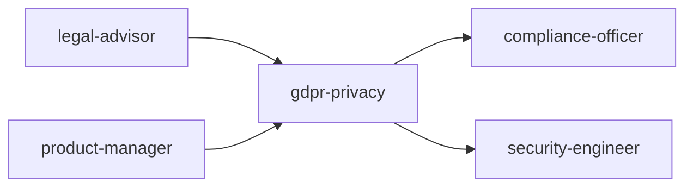

# Scale Depth

<!-- QUICK: 30s -- find your team size column -->
### Solo (1 person, 0-100 users)
Minimal viable compliance. Privacy policy: free template (Termly/Iubenda). Cookie consent: CookieYes free plan (<25K pageviews). DSAR: manual email template. No DPO, no DPIA, no ROPA, no vendor assessments. If no EU users, block EU traffic. Key: have a privacy policy, basic cookie notice, and know your data flows. Cost: $0-50/month. Overkill: OneTrust, automated DSAR portal, BCRs, external privacy counsel retainer, ISO 27701.

### Small (2-10 people, 100-10K users)
Fractional DPO (2-4 hours/month) or privacy counsel retainer. Cookie consent: Cookiebot or OneTrust ($50-300/month). DSAR: automated portal (Mine PrivacyOps free tier). DPIA for any high-risk processing. Signed DPAs with all vendors processing personal data. ROPA maintained (Google Sheets at minimum). Privacy training for all staff. Cost: $500-3K/month. Overkill: dedicated in-house DPO, enterprise privacy management platform, BCRs.

### Medium (10-50 people, 10K-1M users)
In-house privacy lead or fractional DPO (10+ hours/week). OneTrust/TrustArc privacy platform. Automated data discovery and classification. Privacy by design integrated into SDLC (DPIA template, review gates). Comprehensive vendor risk assessments. ISO 27001 or SOC 2 for security foundation. Regular privacy training with completion tracking. Incident response plan tested annually. Cost: $5K-20K/month. Overkill: full ISO 27701 certification, AI governance program unless AI is core product.

### Enterprise (50+ people, 1M+ users)
In-house DPO + privacy team (2-5). OneTrust Enterprise / BigID. Automated data mapping, DSAR processing, vendor assessments. ISO 27701 certification (PIMS). Binding Corporate Rules for cross-border transfers. AI governance program (EU AI Act ready). Dedicated privacy engineering function: PETs, data minimization at architecture level. Board-level privacy reporting. Regulatory engagement strategy. Cost: $50K-500K+/month.

### Transition Triggers
| From → To | Trigger | What to Change |
|-----------|---------|----------------|
| Solo → Small | >5 DSARs/month, >20 vendors processing personal data, or first DPIA required | Hire fractional DPO; implement automated DSAR portal; execute DPAs with all vendors |
| Small → Medium | >20 DSARs/month, >50 vendors, or launched in 3+ EU markets | Purchase privacy management platform; hire privacy lead; integrate privacy into SDLC |
| Medium → Enterprise | 1M+ data subjects, regulatory investigation, or M&A activity | Hire in-house DPO team; pursue ISO 27701; implement BCRs; add AI governance |


### Cross-skills Integration

Run skills in the order shown:
```bash
# Chain A: legal-advisor → gdpr-privacy → compliance-officer
# Chain B: product-manager → gdpr-privacy → security-engineer
```
