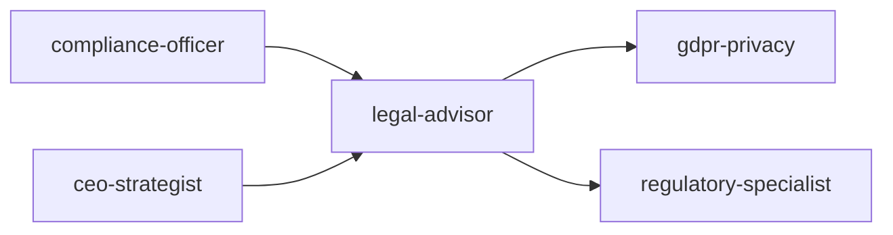

# Legal Advisor

Comprehensive legal advisory framework for software and SaaS businesses. Covers document drafting, intellectual property strategy, open-source compliance, and risk assessment — designed to be used alongside qualified legal counsel, not as a replacement.

## Ground Rules — Read First

- **This is not legal advice.** Everything here is educational. The user must consult a qualified attorney for their specific situation. Laws vary by jurisdiction, change over time, and depend on specific facts.
- **Never cite specific statutes without verification.** Laws, regulations, and their interpretations change. If you reference a specific law (GDPR Article 17, CCPA §1798.100, etc.), add: "Verify this section is current — it may have been amended or reinterpreted since this was written."
- **Flag jurisdiction dependencies.** Most legal answers depend on WHERE. Flag this explicitly: "This answer assumes US federal law. If your users are in the EU, California, China, or other jurisdictions, different rules apply."
- **Never draft without disclaimers.** Any generated contract language, ToS, privacy policy, or agreement MUST include a visible disclaimer: "This is a draft template, not legal advice. Review with qualified counsel before use."
- **Prefer "consult an attorney" over confident answers.** When in doubt between two interpretations, say so and recommend counsel. A confident wrong answer in legal matters is worse than an uncertain one.

## Route the Request
<!-- QUICK: 30s -- pick your path, skip the rest -->

What are you trying to do?
├── Contract review
│   ├── Vendor/partner agreement → Start at "Core Workflow > Phase 1"
│   └── Employment agreement → Go to "Sub-Skills > Contract Review & Drafting"
├── IP protection (patents, trademarks, copyrights)
│   └── Building IP strategy → Jump to "Sub-Skills > IP Portfolio Management"
├── SaaS agreements (MSA, DPA, ToS)
│   └── Launching or updating SaaS legal docs → Go to "Sub-Skills > SaaS Legal Foundations"
├── Open-source license compliance
│   └── License audit or compatibility check → Jump to "Sub-Skills > Open Source License Compliance" and "Decision Trees"
├── Fundraising term sheets (SAFE, convertible note)
│   └── Preparing for fundraising → Go to "Sub-Skills > Funding & M&A Legal Prep"
├── Employment law (contractor vs employee, equity)
│   └── Hiring or contractor classification → Go to "Core Workflow > Phase 1"
├── ToS / Privacy Policy drafting
│   └── New or updated legal docs → Jump to "Sub-Skills > SaaS Legal Foundations"
├── Data Processing Agreements (DPAs)
│   └── Vendor processing personal data → Go to "Sub-Skills > Data Processing Agreements"
└── Don't know where to start? → Start at "Core Workflow > Phase 1"

Do not read the entire skill. Follow the route above and read only the sections it points to.

## When to Use
<!-- QUICK: 30s -- scan the bullet list to decide if this skill fits -->
- Drafting or updating Terms of Service (ToS), Privacy Policy, or End User License Agreement (EULA) for a SaaS product
- Evaluating open-source license compatibility when incorporating third-party libraries into proprietary software
- Setting up a DMCA compliance process (notice-and-takedown, counter-notice, repeat infringer policy)
- Establishing an IP protection strategy: patents, trademarks, copyrights, trade secrets
- Reviewing vendor contracts or partnership agreements for liability, indemnification, and IP ownership clauses
- Conducting an open-source license audit of the codebase ahead of fundraising, acquisition, or IPO
- Crafting a trademark registration and enforcement strategy
- Building a contributor license agreement (CLA) or developer certificate of origin (DCO) process

## Decision Trees
<!-- QUICK: 30s -- follow the ASCII tree to your scenario -->
### Open Source License Selection
```
                     ┌──────────────────────────┐
                     │ START: Which open-source   │
                     │ license?                   │
                     └────────────┬─────────────┘
                                  │
                    ┌─────────────▼─────────────┐
                    │ Want to require derivative  │
                    │ works to also be open       │
                    │ source (copyleft)?          │
                    └────┬──────────────────┬───┘
                         │ YES              │ NO
                    ┌────▼──────┐    ┌──────▼──────────┐
                    │ Strong    │    │ Want to prevent   │
                    │ copyleft  │    │ others from       │
                    │ or weak?  │    │ using your name   │
                    └──┬───┬────┘    │ in promotion?     │
                       │   │        └──┬──────────┬────┘
                  ┌────▼┐ ┌▼────────┐  │YES       │NO
                  │GPL  │ │Weak:    │ ┌▼──────┐ ┌──▼──────────┐
                  │v3.0 │ │MPL 2.0  │ │MIT +  │ │Completely   │
                  │(most│ │(file-   │ │Apache │ │unrestricted:│
                  │restrictive)│ │level)  │ │2.0    │ │CC0 / Public │
                  └─────┘ │LGPL     │ │(patent│ │Domain        │
                           │(library)│ │grant) │ └──────────────┘
                           └─────────┘ └───────┘
```
**When to choose GPL v3:** Want maximum copyleft — anyone distributing modified versions must also release source under GPL. Strongest community enforcement.
**When to choose MPL 2.0/LGPL:** Weak copyleft — file-level (MPL) or library-level (LGPL). Allows linking from proprietary code while keeping your library open.
**When to choose MIT/Apache 2.0:** Permissive — MIT is simplest (no patent grant), Apache 2.0 adds explicit patent grant and contributor protection. Both allow proprietary use.
**When to choose CC0:** Abandon copyright entirely — public domain dedication. Use for documentation, reference implementations, or when you truly don't care.

### SaaS Agreement Risk Triage
```
                     ┌──────────────────────────────┐
                     │ START: Reviewing contract —    │
                     │ what risk level?               │
                     └────────────┬─────────────────┘
                                  │
                    ┌─────────────▼─────────────────┐
                    │ Annual contract value < $5K?   │
                    └────┬──────────────────────┬───┘
                         │ YES                  │ NO
                    ┌────▼──────────┐    ┌──────▼──────────┐
                    │ Low risk:     │    │ ACV > $50K OR    │
                    │ Accept        │    │ involves DPA,    │
                    │ standard terms│    │ HIPAA BAA, or    │
                    │ unless glaring│    │ custom IP terms? │
                    │ red flag      │    └──┬──────────┬────┘
                    └───────────────┘       │YES       │NO
                                       ┌────▼────┐ ┌──▼──────────┐
                                       │High Risk│ │Medium Risk: │
                                       │Engage   │ │Negotiate    │
                                       │External │ │key terms:   │
                                       │Counsel  │ │liability cap│
                                       │for every│ │IP ownership,│
                                       │redline  │ │indemnity    │
                                       └─────────┘ └─────────────┘
```
**When to accept standard terms:** Low ACV ($0-5K), no data processing obligations, no custom IP — accept vendor paper with minimal redlines (cap at fees paid, no indemnity).
**When to negotiate key terms:** Medium ACV ($5-50K) — negotiate liability cap (2× fees), clarify IP ownership of deliverables, mutual confidentiality, and termination for convenience.
**When to engage external counsel:** High ACV (>$50K), DPAs (GDPR), BAAs (HIPAA), custom software development, IP transfer — specialized counsel, full redline, board visibility.

### Trademark Protection Strategy
```
                     ┌──────────────────────────────┐
                     │ START: Trademark strategy?     │
                     └────────────┬─────────────────┘
                                  │
                    ┌─────────────▼─────────────────┐
                    │ Operating in US only vs         │
                    │ multiple countries?             │
                    └────┬──────────────────────┬───┘
                         │ US only             │ Multi-country
                    ┌────▼──────────┐    ┌──────▼──────────┐
                    │ USPTO §1(a)   │    │ Revenue >$100K  │
                    │ (use-based)   │    │ in target       │
                    │ if product in │    │ country?        │
                    │ commerce.     │    └──┬──────────┬────┘
                    │ §1(b) (intent-│       │YES      │NO
                    │ to-use) if    │  ┌────▼────┐ ┌─▼──────────┐
                    │ pre-launch.   │  │Madrid   │ │File in key │
                    └───────────────┘  │Protocol:│ │markets only│
                                       │WIPO base│ │(US + top 3)│
                                       │+designate│ │nationally  │
                                       │countries │ └────────────┘
                                       └──────────┘
```
**When to file use-based US:** Product already in commerce — §1(a) filing with specimen of use, faster to registration, lower cost ($250-350/class).
**When to file intent-to-use US:** Pre-launch, want priority date now — §1(b) filing, reserves priority, but must prove use later (Statement of Use).
**When to use Madrid Protocol:** 3+ countries needed — file WIPO application based on home registration, designate member countries, single renewal, cheaper than individual national filings.
**When to file nationally:** Only 1-2 key markets — direct national filing may be faster and cheaper than Madrid route with fewer designated countries.

### IP Assignment vs License Decision
```
                     ┌──────────────────────────────┐
                     │ START: Contractor/employee     │
                     │ creates IP — how to secure?    │
                     └────────────┬─────────────────┘
                                  │
                    ┌─────────────▼─────────────────┐
                    │ Work done by employee within    │
                    │ scope of employment?            │
                    └────┬──────────────────────┬───┘
                         │ YES                  │ NO (contractor)
                    ┌────▼──────────┐    ┌──────▼──────────┐
                    │ Work-for-hire│    │ Contractor using  │
                    │ doctrine     │    │ their own tools,  │
                    │ applies (US) │    │ no supervision?   │
                    │ — IP auto-   │    └──┬──────────┬────┘
                    │ owned by     │       │YES       │NO
                    │ employer.    │  ┌────▼────┐ ┌──▼──────────┐
                    │ Still get    │  │IP       │ │May qualify  │
                    │ signed       │  │Assign-  │ │as work-for- │
                    │ agreement    │  │ment +   │ │hire — but   │
                    │ confirming.  │  │Moral    │ │get assignment│
                    └──────────────┘  │Rights   │ │for certainty │
                                      │Waiver   │ └──────────────┘
                                      └─────────┘
```
**When work-for-hire applies:** US employee creating within scope — automatic IP ownership to employer. Still get written confirmation for audit trail and investors.
**When IP assignment needed:** Contractor or non-US contributor — signed agreement with "present assignment of future rights" language + moral rights waiver where applicable.
**When to use license instead:** Third-party contribution to your open source project — CLA with license grant (not assignment) may be sufficient for project stewardship.

### DMCA Safe Harbor Eligibility
```
                     ┌──────────────────────────────┐
                     │ START: Need DMCA safe harbor?  │
                     └────────────┬─────────────────┘
                                  │
                    ┌─────────────▼─────────────────┐
                    │ Do you host user-generated      │
                    │ content (comments, uploads,     │
                    │ repos, listings)?               │
                    └────┬──────────────────────┬───┘
                         │ YES                  │ NO
                    ┌────▼──────────┐    ┌──────▼──────────┐
                    │ Must register │    │DMCA safe harbor  │
                    │ DMCA agent    │    │not applicable.   │
                    │ with USCO     │    │Still need:       │
                    │ ($6 fee).     │    │respond to notices│
                    │ Implement:    │    │as matter of risk │
                    │ - Notice-and- │    │management.       │
                    │   takedown    │    └─────────────────┘
                    │ - Counter-notice│
                    │ - Repeat      │
                    │   infringer   │
                    │   policy      │
                    │ - No knowledge│
                    │   of infring. │
                    └───────────────┘
```
**When DMCA safe harbor needed:** Any platform hosting user-submitted content (comments, repos, uploads) — registration is $6, but failure to implement = full liability for user infringement.
**When not needed:** No UGC, only your own content — still respond to takedown notices as a matter of risk management but safe harbor unavailable.
**Key requirements:** Designated agent registered at copyright.gov, expeditious takedown, counter-notice process, repeat infringer termination policy, no actual knowledge of infringement.

## Core Workflow
<!-- QUICK: 30s -- scan phase titles to understand the process -->
### Phase 1 (~15 min): Document Inventory & Gap Analysis

1. **Legal Document Audit** — Inventory all existing legal documents: ToS, Privacy Policy, EULA, DPA (Data Processing Agreement), Cookie Policy, Acceptable Use Policy, Refund Policy, Service Level Agreement, MSAs with enterprise customers.
2. **Regulatory Gap Analysis** — Map applicable regulations to existing compliance: GDPR (EU users), CCPA/CPRA (California residents), PIPEDA (Canada), LGPD (Brazil), DMA/DSA (EU platforms), COPPA (children under 13), CalOPPA (California online privacy). Flag each as compliant, partially compliant, or non-compliant.
3. **Jurisdiction Mapping** — Identify where the company operates, where data is stored/processed, and which jurisdictions' laws apply. This drives governing law selection and dispute resolution clauses.
4. **Deliverable: Legal Audit Report** — Prioritized matrix of missing or outdated documents, compliance gaps, and recommended remediation timeline.

### Phase 2 (~30 min): Document Drafting & Review

1. **Terms of Service** — Key clauses to include:
   - **Acceptance of terms**: explicit consent mechanism (clickwrap, not browsewrap).
   - **Account responsibilities**: user's obligation to secure credentials, liability for account activity.
   - **Acceptable use**: prohibited activities (illegal content, reverse engineering, scraping, spamming).
   - **Intellectual property**: clarify who owns what — customer owns their data, company owns the platform.
   - **Payment terms**: subscription billing, auto-renewal, refunds, taxes.
   - **Termination**: grounds for termination, effect on data (export window before deletion).
   - **Disclaimers & limitations of liability**: "as-is" disclaimer, liability cap (e.g., fees paid in last 12 months).
   - **Indemnification**: mutual or one-way, scope, procedure.
   - **Dispute resolution**: governing law, venue, arbitration clause (opt-out provision for consumers), class action waiver.
   - **Changes to terms**: notice period, user's right to reject by discontinuing use.
2. **Privacy Policy** — Must cover (per GDPR/CCPA template):
   - Categories of personal data collected (with examples)
   - Purposes and legal bases for processing
   - Third-party data sharing and categories of recipients
   - Cross-border data transfer mechanisms (SCCs, DPF)
   - Data retention periods per category
   - User rights: access, rectification, erasure, portability, objection, automated decision-making
   - Cookie and tracking technology disclosures
   - Children's privacy (COPPA)
   - Contact information for DPO or privacy inquiries
   - Effective date and change notification process
3. **EULA** — For installed/distributed software:
   - License grant: scope (perpetual, subscription), restrictions, permitted copies.
   - Updates and maintenance: auto-update permission, end-of-life policy.
   - Data collection: telemetry, crash reporting, usage analytics.
   - Third-party components: open-source attribution and license notices.
   - Source code escrow (enterprise deals).
4. **Contract Review Framework** — Standardized checklist for reviewing third-party agreements:
   - **IP ownership**: who owns deliverables, work product, and pre-existing IP.
   - **Confidentiality**: definition of confidential info, exceptions, term, post-termination obligations.
   - **Indemnification**: scope (IP infringement, bodily injury, data breach), caps, exclusions.
   - **Limitation of liability**: carve-outs (gross negligence, willful misconduct, breach of confidentiality, IP infringement).
   - **Termination**: for convenience, for cause, cure period, effect (transition assistance, data return).
   - **Data processing**: if vendor processes personal data, require DPA with SCCs if cross-border.
   - **Insurance**: require minimum coverage (CGL, E&O, cyber) and certificate of insurance.
   - **Assignment**: change of control clause, no assignment without consent.

### Phase 3 (~20 min): IP & Open-Source Strategy

1. **Patent Strategy** — Decide: defensive (build portfolio to deter lawsuits), offensive (assert against competitors), or none (rely on trade secrets and speed). File provisionals to establish priority date. Conduct freedom-to-operate searches before major product launches.
2. **Trademark Strategy** — File for name, logo, and tagline in key classes (9 for software, 42 for SaaS). Conduct clearance search before adopting any brand element. Monitor for infringement (watch service). Enforce consistently — failure to police can weaken mark. Use ® for registered, ™ for unregistered.
3. **Open-Source License Audit** — Run `license-checker` or FOSSA across the entire dependency tree. Categorize licenses:
   - **Permissive** (MIT, Apache 2.0, BSD): safe for proprietary use with attribution.
   - **Weak copyleft** (LGPL, MPL): okay in library/linking context; may require sharing modifications to the library itself.
   - **Strong copyleft** (GPL, AGPL, SSPL): avoid in proprietary core unless legal reviews and isolates as a separate process. AGPL is particularly risky for SaaS — triggers if users interact with the code remotely.
   - **Source-available / non-commercial** (BSL, Elastic License, CC BY-NC): read the specific terms — some prohibit competitive use.
4. **Contributor License Management** — For open-source projects: DCO (lighter, trust-based, sign-off-by in commits) vs. CLA (formal, signed agreement assigning or licensing rights to the project). CLA needed if you plan to relicense or offer commercial licenses later.
5. **Trade Secret Protection** — Identify trade secrets: algorithms, training data, pricing models, customer lists. Implement reasonable measures: access controls, NDAs with employees and contractors, document labeling, exit interview procedures, non-compete/non-solicit where enforceable.

## Best Practices
<!-- STANDARD: 3min -- rules extracted from production experience -->
- Never copy-paste legal documents from competitors — this creates copyright issues and may not fit your business model.
- Ensure clickwrap (user must click "I agree") rather than browsewrap (passive notice) — courts consistently uphold clickwrap.
- Version all legal documents with effective dates. Archive old versions. Notify users of material changes with at least 30 days notice.
- Segregate open-source components with strong copyleft licenses into separate services communicating via API — this may avoid the "derivative work" trigger.
- Include an open-source attribution page in your product (usually in Settings > Legal) listing all third-party components and their licenses.
- When processing data on behalf of enterprise customers, sign a DPA that incorporates the latest EU Standard Contractual Clauses (SCCs).
- Trademark clearance should happen before finalizing any product name — rebranding is expensive and disrupts SEO.

## Cross-Skill Coordination
<!-- QUICK: 30s -- table of who to talk to when -->
Legal advice touches every function. Missed coordination creates liability; over-lawyering blocks velocity. Balance is structural.

| Coordinate With | When | What to Share/Ask |
|-----------------|------|-------------------|
| **CEO Strategist** | Fundraising, M&A, IP strategy, major contracts | Deal terms, cap table implications, fiduciary duties, risk appetite |
| **CTO Advisor** | Open-source licensing, IP assignment, tech transactions | License compatibility matrix, contributor agreements, technology due diligence |
| **GDPR/Privacy Specialist** | Privacy policies, data processing agreements, breach response | Data processing purposes, consent mechanisms, cross-border transfer assessments |
| **Regulatory Specialist** | FDA, HIPAA, financial services compliance | Industry-specific regulatory frameworks, audit readiness |
| **Product Strategist** | Terms of Service, feature launches, pricing changes | Feature legal review, ToS updates, consumer protection requirements |
| **Security Reviewer** | Data breaches, security incidents, vulnerability disclosure | Breach notification obligations, regulatory reporting timelines, disclosure policies |
| **Growth Engineer** | A/B testing terms, referral programs, sweepstakes | Promotional law compliance, contest rules, marketing claims substantiation |
| **Project Manager** | Contract review cycles, legal hold notices, litigation | Legal review SLAs, resource allocation for legal workstreams |
| **HR/People Ops** | Employment agreements, contractor classification, equity grants | Offer letter templates, IP assignment clauses, worker classification tests |
| **All Engineering Teams** | Open-source compliance, 3rd-party library licensing | License approval process, attribution requirements, copyleft triggers |

### Communication Triggers — When to Proactively Notify

| Trigger | Notify | Why |
|---------|--------|-----|
| New open-source dependency with copyleft license (GPL, AGPL) | CTO Advisor, Engineering Lead | Copyleft can force source disclosure; evaluate alternatives before integration |
| DMCA takedown notice received | CTO Advisor, Security Reviewer, Content Team | 24-72 hour response window; content removal and counter-notice process |
| Data breach or suspected breach | GDPR/Privacy Specialist, Security Reviewer, CEO Strategist | 72-hour regulatory notification clock starts; parallel breach investigation |
| Third-party IP claim or cease-and-desist letter received | CEO Strategist, Product Strategist | Litigation risk; product changes may be required |
| New product feature collecting sensitive data (health, financial, minors) | GDPR/Privacy Specialist, Regulatory Specialist, Product Strategist | Enhanced regulatory obligations; DPIA may be required |
| Contract with liability cap >2x annual contract value | CEO Strategist, CFO | Enterprise risk exposure; board-level decision |
| Employee invention assignment dispute | CTO Advisor, HR | IP ownership at risk; product IP chain of title affected |

### Escalation Path

| Situation | Escalate To | Rationale |
|-----------|------------|-----------|
| Regulatory investigation or subpoena received | **External Counsel** + CEO Strategist | Privileged response required; in-house may not be sufficient |
| Patent infringement claim from competitor | **External IP Litigation Counsel** + CEO Strategist | Specialized litigation; business existential risk |
| Whistleblower complaint (internal) | **Board/Audit Committee** + External Counsel | Governance obligation; independent investigation required |
| Cross-border M&A or IPO preparation | **External Transactional Counsel** + CEO Strategist + CFO | Complex multi-jurisdiction; specialized expertise required |
| Criminal allegation involving employee or company | **External Criminal Defense Counsel** + Board | Personal and corporate liability; privilege critical |

## Scale Depth
<!-- QUICK: 30s -- find your team size column -->
### Solo (1 person, 0-100 users)
Founder reviewing contracts themselves or with free templates. ToS/Privacy Policy from Termly/Iubenda ($0-50). Open source: MIT license default. Trademark: no registration, common law rights only. No DMCA registration. Contracts: clickwrap via checkbox. IP: employee agreements as work-for-hire. No external counsel unless existential risk. Cost: $0-200/month. Overkill: external counsel retainer, patent filings, formal CLAs, multi-jurisdiction trademark.

### Small (2-10 people, 100-10K users)
Fractional general counsel or law firm retainer (5-10 hours/month). Custom-drafted ToS/Privacy Policy ($3-8K). Trademark: USPTO registration for name + logo ($250-350/class). DMCA: registered agent + takedown process. Open source: license audit before funding round. Contractor IP assignments standardized. Cost: $1K-5K/month. Overkill: in-house counsel, patent portfolio, Madrid Protocol trademarks.

### Medium (10-50 people, 10K-1M users)
In-house counsel or dedicated law firm relationship. Full contract management system (Ironclad, LinkSquares). IP portfolio: patents (provisional + PCT), trademarks (USPTO + Madrid), trade secrets program. Open source: automated license compliance (FOSSA, Snyk). DMCA: automated notice processing. Data processing: DPAs for all vendors. Cost: $8K-30K/month. Overkill: patent litigation budget, multi-country regulatory filings (unless regulated industry).

### Enterprise (50+ people, 1M+ users)
Legal department (2-5+). Full IP management: patent prosecution, trademark enforcement globally, defensive publication program. Enterprise CLM: Salesforce/ironclad with AI review. Open source program office (OSPO). M&A due diligence capability. Regulatory compliance team. Litigation management. Board governance. Employment law counsel. Cost: $50K-500K+/month.

### Transition Triggers
| From → To | Trigger | What to Change |
|-----------|---------|----------------|
| Solo → Small | First enterprise contract, funding round, or user complaint | Hire fractional counsel; file USPTO trademark; do open-source audit |
| Small → Medium | Series A, 50+ employees, IP litigation threat, or international expansion | Hire in-house counsel; build IP portfolio (patents + Madrid marks); implement CLM |
| Medium → Enterprise | IPO prep, M&A, multi-country regulatory overlay, or legal team >3 | Build legal department; establish OSPO; add compliance team; formalize litigation management |


### Cross-skills Integration

Run skills in the order shown:
```bash
# Chain A: compliance-officer → legal-advisor → gdpr-privacy
# Chain B: ceo-strategist → legal-advisor → regulatory-specialist
```

## Sub-Skills
<!-- QUICK: 30s -- table of deeper dives by topic -->
| Sub-Skill | When to Use | Context |
|-----------|-------------|---------|
| **Contract Review & Drafting** | Any B2B agreement, vendor contract, partnership, or employment agreement | Ironclad, LinkSquares, DocuSign CLM — redlining, clause libraries, negotiation playbooks |
| **Open Source License Compliance** | Using or distributing open source software in products | FOSSA, Snyk, SPDX — license compatibility matrix, copyleft analysis, SBOM generation |
| **IP Portfolio Management** | Building moat through patents, trademarks, and trade secrets | USPTO, WIPO, Madrid Protocol — patent filing strategy (provisional → PCT → national), trademark classes |
| **SaaS Legal Foundations** | Launching or updating ToS, Privacy Policy, EULA for web/mobile app | Clickwrap/ browsewrap, GDPR/CCPA integration, limitation of liability, arbitration clause, auto-renewal |
| **DMCA & Content Liability** | Platform hosting user-generated content | DMCA safe harbor registration, notice-and-takedown, counter-notice, repeat infringer policy, Section 230 |
| **Funding & M&A Legal Prep** | Preparing for fundraising, acquisition, or IPO | IP assignment audit, cap table clean-up, open-source license audit, data room preparation, reps & warranties |
| **Contributor Agreements (CLA/DCO)** | Managing external contributions to company open-source projects | CLA (individual + corporate), DCO (Developer Certificate of Origin), license grant vs IP assignment |
| **Data Processing Agreements (DPAs)** | Vendors processing user personal data | GDPR Art. 28 clauses, SCCs, sub-processor disclosure, security measures, audit rights, breach notification |


### Error Decoder

| Problem | Root Cause | Fix |
|---------|------------|-----|
| Contract signed with unfavorable terms | Missing redline on key clauses | Never sign first draft. Redline: liability cap, indemnification, termination for convenience, IP ownership, data processing. |
| No BAA with HIPAA-covered vendor | Assumed vendor had one | Verify BAA before sharing any PHI. Retroactive BAA does not cover data already shared. |
| GDPR fine exposure | No data inventory or lawful basis documented | Document every data field, its purpose, lawful basis, retention period, and third-party sharing. |
| Open source license violation | Dependency used in proprietary product | Check license compatibility: GPL/AGPL is not compatible with proprietary distribution. Use only MIT/Apache 2.0/BSD in proprietary products. |
| Employee classification lawsuit | Contractor treated as employee | IRS 20-factor test. If contractor works exclusively, uses company equipment, and has set hours → they're an employee. |
| Privacy policy doesn't match app behavior | Policy written before features built | Policy must reflect actual data collection. Conduct pre-release audit: every permission request maps to a policy disclosure. |
| Jurisdiction conflict for international users | Terms only reference one country | Specify governing law AND dispute resolution. EU users need GDPR compliance regardless of where you're based. |


## Production Checklist
<!-- QUICK: 30s -- binary pass/fail items. All must pass. -->
- [ ] **[S1]**  Terms of Service, Privacy Policy, and EULA are published, versioned, and accessible from every page footer
- [ ] **[S2]**  Clickwrap acceptance is implemented with timestamped records of user consent
- [ ] **[S3]**  Privacy Policy accurately reflects all data collection, processing, and sharing — updated at least annually
- [ ] **[S4]**  Open-source license audit is complete and results are documented with remediation plan for any copyleft conflicts
- [ ] **[S5]**  Open-source attribution page exists in-product listing all third-party components and licenses
- [ ] **[S6]**  DMCA policy is published with designated agent registered at U.S. Copyright Office
- [ ] **[S7]**  Trademark applications filed for core brand elements in classes 9 and 42; monitoring/watch service active
- [ ] **[S8]**  Data Processing Agreement (DPA) template with SCCs is available for enterprise customers
- [ ] **[S9]**  Contract review checklist is standardized and used for all vendor and partnership agreements
- [ ] **[S10]**  Contributor license process (CLA or DCO) is configured for all public open-source repositories
- [ ] **[S11]**  Trade secret inventory is documented and reasonable protection measures are implemented
- [ ] **[S12]**  Insurance requirements are met: CGL, E&O, cyber insurance with adequate coverage for business size

## MVP vs Growth vs Scale

| Phase | Team Size | Priority | Legal Approach |
|-------|-----------|----------|---------------|
| **MVP (0→1)** | 1-3 devs, no lawyer on staff | Ship legally without getting sued | Automated ToS/Privacy generators (Termly $10/mo, Iubenda $9/mo). State basic data practices. Register DMCA agent. No trademark filing yet — use ™. CLA: DCO (one-line sign-off in commits). |
| **Growth (1→10)** | 3-15 devs, part-time outside counsel ($200-500/hr, 5-10 hrs/mo) | Compliance + IP protection | Lawyer-drafted or lawyer-reviewed ToS/Privacy. File trademarks in class 9 + 42 ($1-3K per class). Open-source license audit with FOSSA. Contract review template + lawyer escalation for >$50K deals. |
| **Scale (10→N)** | 15+ devs, in-house counsel or dedicated outside GC | Defensible legal posture | Custom legal documents maintained by counsel. Full IP strategy (patents, trademarks globally). DPA with SCCs for all vendors. Compliance program (GDPR, CCPA, SOC 2). Regulatory monitoring. |

**MVP legal rule:** Don't let legal block your launch. Use generators for v1 documents. Get a lawyer to review before you have 1K users or raise funding. Nobody sues a startup with no money.

## Cost-Effective Decision Table

| Decision | Free/Cheap Option | Paid Upgrade | When to Upgrade |
|----------|------------------|--------------|-----------------|
| Terms of Service | Termly / GetTerms.io generator ($10-20/mo) | Lawyer-drafted ($2K-5K one-time) | Revenue >$10K/mo, enterprise customers, or fundraising |
| Privacy Policy | Iubenda ($9/mo) or Termly | Lawyer-customized ($1K-3K) | Processing sensitive data, EU users, or B2B enterprise deals |
| Trademark filing | Self-file via USPTO TEAS ($250-350/class) | IP lawyer ($1K-3K/class including search) | Need comprehensive clearance search, international filing, or office action response |
| Open-source audit | `license-checker` + `pip-licenses` (free) | FOSSA ($330/mo startup) or Snyk | Fundraising, acquisition, or >50 dependencies with copyleft risk |
| Contract review | Template + checklist + lawyer for red flags | In-house counsel ($150K-250K/yr) | >5 contracts/month or contracts >$100K |
| DMCA compliance | Self-register agent ($6) + publish policy on site | Designated agent service | Receiving >5 DMCA notices/month |
| Patent filing | Provisional (self-file: $70-140 micro-entity) | Patent attorney ($8K-15K for non-provisional) | Strong IP asset for fundraising/defense, or competitors filing in your space |
| GDPR compliance | Self-assessment + ICO guidance (free) | Privacy consultant ($5K-15K engagement) | >10K EU users or enterprise customers requiring GDPR compliance |

**Annual legal budget by phase:** MVP: $100-500. Growth: $5K-30K. Scale: $50K-300K+.

## Scalability Decision Tree

```
Do you have paying customers?
├── YES → Do you have Terms of Service?
│   ├── NO → Get them TODAY. Use Termly/GetTerms for v1. Lawyer review within 90 days.
│   └── YES → Good. Are they clickwrap (user clicks "I agree")?
│       ├── NO → Implement clickwrap. Browsewrap is unenforceable in most jurisdictions.
│       └── YES → Good.
└── NO → Terms can wait. Focus on building.

Do you collect ANY user data (email, analytics, cookies)?
├── YES → Do you have a Privacy Policy?
│   ├── NO → This is priority #1. Every data privacy law requires one. Iubenda/Termly today.
│   └── YES → Is it accurate? (Check: does it list all 3rd-party tools you use?)
│       ├── NO → Update it. Inaccurate privacy policy is worse than no privacy policy.
│       └── YES → Good.
└── NO → (Unlikely for any software product.) Privacy policy still recommended.

Are you using ANY open-source dependencies? (Answer: yes, you are.)
├── YES → Run `npx license-checker --summary` or `pip-licenses`. Any GPL/AGPL?
│   ├── YES (GPL/AGPL in core) → Urgent: isolate via separate service or replace with MIT/Apache alternative.
│   └── No copyleft → Run FOSSA or similar before fundraising/acquisition. Keep license docs updated.
└── NO → Impossible. Run the scan anyway.

Are you fundraising or being acquired within 12 months?
├── YES → IP audit NOW: trademark filings, open-source license clean, all contractor IP assigned.
└── NO → Maintain good practices. Audit annually.
```


**What good looks like:** All customer-facing legal documents (ToS, Privacy Policy, EULA) published and versioned. Contract template library covers MSA, DPA, and SOW with standard redlines. Clickwrap consent recorded with timestamps. GDPR data map documents every data field and its lawful basis.

## When NOT to Use This Skill (Overkill)

- **Solo developer with a side project and 0 users**: A full IP strategy, trademark filings, and lawyer-drafted ToS for a project with no users is burning money. Use MIT license. Add a basic privacy notice. Ship.
- **Internal tool never exposed externally**: ToS, Privacy Policy, DMCA — these are for public-facing products. Internal tools need access control docs, not legal docs.
- **You're building on a platform that handles legal (Apple App Store, Shopify, WordPress.com)**: Use their templates. Add your privacy points. Don't start from scratch.
- **Open-source hobby project**: MIT or Apache 2.0 license + DCO. That's 90% of what you need. Don't set up a legal entity for a weekend project.
- **You have in-house counsel**: This skill is designed for teams without dedicated legal. If you have counsel, defer to them and use this as a checklist for what to ask about.

## Token-Efficient Workflow

```
# Step 1: Quick audit — what legal docs exist and are they current?
python3 scripts/legal_audit.py --site example.com --output json
# Returns: {"tos": {"exists": true, "age_days": 200, "clickwrap": false},
#           "privacy": {"exists": true, "age_days": 400, "score": "outdated"},
#           "open_source": {"gpl_count": 2, "total_deps": 150}}

# Step 2: Decision tree → prioritize by risk
# No ToS on product with users → CRITICAL. Deploy within 48 hours.
# Privacy Policy >365 days → HIGH. Update with current practices.
# GPL/AGPL in codebase → HIGH. Isolate or replace.
# No clickwrap → MEDIUM. Add to signup flow, record consent.

# Step 3: Execute with exit codes
# Check if a site has a privacy policy link in footer
curl -s https://example.com | grep -qi "privacy" && echo "FOUND" || echo "MISSING"

# Run open-source license scan (one command, exit code 1 = GPL found)
npx license-checker --production --summary 2>&1 | \
  python3 -c "import sys; text=sys.stdin.read(); sys.exit(1 if 'GPL' in text or 'AGPL' in text else 0)"

# Step 4: Verify — re-run audit after changes
python3 scripts/legal_audit.py --site example.com --verify --output json
# Exit code 0 = all critical issues resolved
```

**Principle:** `legal_audit.py` outputs structured JSON with issue severity. Agent maps severity → action via decision tree. Never reads legal document text into context (token waste). Exit codes verify fixes.

## References
<!-- QUICK: 30s -- links to deeper reading -->
- [IAPP — Privacy Policy Template Guidance](https://iapp.org/)
- [FOSSA — Open Source License Compliance](https://fossa.com/)
- [Choose a License](https://choosealicense.com/)
- [U.S. Copyright Office — DMCA Designated Agent](https://www.copyright.gov/dmca-directory/)
- [USPTO — Trademark Basics](https://www.uspto.gov/trademarks/basics)
- [Open Source Initiative — Approved Licenses](https://opensource.org/licenses/)
- [European Commission — Standard Contractual Clauses (SCCs)](https://commission.europa.eu/law/law-topic/data-protection/international-dimension-data-protection/standard-contractual-clauses-scc_en)
