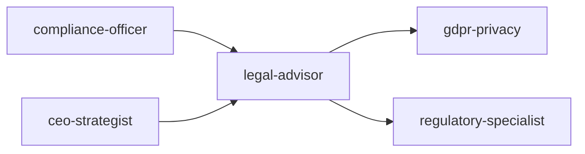
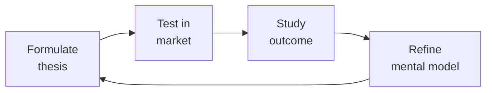

---
name: legal-advisor
description: Contract review framework, corporate structure decision matrix, IP protection
  strategy (patent/trademark/copyright/trade secret), SaaS agreements (MSA+DPA), open-source
  license compliance, fundraising term sheets (SAFE/convertible note/Series Seed),
  employment law (contractor vs employee, equity), data processing agreements, and
  ToS/Privacy Policy generation.
author: Sandeep Kumar Penchala
type: legal
status: stable
version: 1.0.0
updated: 2026-07-21
tags:
- legal-advisor
token_budget: 4000
output:
  type: code
  path_hint: ./
chain:
  consumes_from:
  - accessibility-auditor
  - ai-safety-health-reviewer
  - board-manager
  - health-regulatory-submission
  - hipaa-technical-implementation
  - privacy-engineer
  feeds_into:
  - accountant
  - bizdev-manager
  - board-manager
  - ceo-strategist
  - compliance-officer
  - content-policy-manager
  - crisis-response-manager
  - gdpr-privacy
  - health-regulatory-submission
  - hipaa-technical-implementation
  - hr-manager
  - investor-relations
  - medical-content-reviewer
  - partnerships-manager
  - people-ops
  - regulatory-specialist
  - treasury-manager
------
# Legal Advisor

Comprehensive legal advisory framework for software and SaaS businesses. Covers document drafting, intellectual property strategy, open-source compliance, and risk assessment — designed to be used alongside qualified legal counsel, not as a replacement.

## Ground Rules — Read Before Anything Else

- **This is not legal advice.** Everything here is educational. The user must consult a qualified attorney for their specific situation. Laws vary by jurisdiction, change over time, and depend on specific facts.
- **Never cite specific statutes without verification.** Laws, regulations, and their interpretations change. If you reference a specific law (GDPR Article 17, CCPA §1798.100, etc.), add: "Verify this section is current — it may have been amended or reinterpreted since this was written."
- **Flag jurisdiction dependencies.** Most legal answers depend on WHERE. Flag this explicitly: "This answer assumes US federal law. If your users are in the EU, California, China, or other jurisdictions, different rules apply."
- **Never draft without disclaimers.** Any generated contract language, ToS, privacy policy, or agreement MUST include a visible disclaimer: "This is a draft template, not legal advice. Review with qualified counsel before use."
- **Prefer "consult an attorney" over confident answers.** When in doubt between two interpretations, say so and recommend counsel. A confident wrong answer in legal matters is worse than an uncertain one.


## The Expert's Mindset

Master legal advisors understand that strategy is not about predicting the future — it's about **being less wrong than the competition, faster**.

| Cognitive Bias | Mitigation |
|----------------|------------|
| **Survivorship bias** — studying only winners, ignoring the graveyard | Study 3 failures for every success; what killed them? |
| **Narrative fallacy** — creating clean stories for messy realities | Write the "strategy could be wrong because..." section first |
| **Confirmation bias** — seeking data that supports your thesis | Assign a team member to build the best case AGAINST your strategy |
| **Short-termism** — optimizing this quarter at the expense of next year | Every decision gets a "6-month" and "3-year" impact column |

### What Masters Know That Others Don't
- **The bottleneck is always one thing.** Find it. Fix it. Then find the next one.
- **Strategy = what you say NO to.** If your strategy doesn't exclude anything, it's not a strategy.
- **Timing beats brilliance.** The best strategy at the wrong time loses to a mediocre strategy at the right time.

### When to Break Your Own Rules
- **Bet the company when the asymmetry is right.** If downside = $1M and upside = $1B, the math doesn't care about your process.
- **Ignore the data when you're creating a new category.** By definition, there's no data for something that doesn't exist yet.
## Route the Request
<!-- QUICK: 30s -- pick your path, skip the rest -->

What are you trying to do?
├── Contract review
│   ├── Vendor/partner agreement → Start at "Core Workflow > Phase 1"
│   └── Employment agreement → Go to "Sub-Skills > Contract Review & Drafting"
├── IP protection (patents, trademarks, copyrights)
│   └── Building IP strategy → Jump to "Sub-Skills > IP Portfolio Management"
├── SaaS agreements (MSA, DPA, ToS)
│   └── Launching or updating SaaS legal docs → Go to "Sub-Skills > SaaS Legal Foundations"
├── Open-source license compliance
│   └── License audit or compatibility check → Jump to "Sub-Skills > Open Source License Compliance" and "Decision Trees"
├── Fundraising term sheets (SAFE, convertible note)
│   └── Preparing for fundraising → Go to "Sub-Skills > Funding & M&A Legal Prep"
├── Employment law (contractor vs employee, equity)
│   └── Hiring or contractor classification → Go to "Core Workflow > Phase 1"
├── ToS / Privacy Policy drafting
│   └── New or updated legal docs → Jump to "Sub-Skills > SaaS Legal Foundations"
├── Data Processing Agreements (DPAs)
│   └── Vendor processing personal data → Go to "Sub-Skills > Data Processing Agreements"
├── Cross-skill routing
│   ├── DPA or privacy policy drafting → Route to `gdpr-privacy`
│   ├── FDA/HIPAA/healthcare regulation → Route to `regulatory-specialist`
│   ├── Fundraising/M&A strategy → Route to `ceo-strategist`
│   ├── General regulatory compliance → Route to `compliance-officer`
│   ├── Content moderation/policy → Route to `content-policy-manager`
│   └── Partnership deal structuring → Route to `bizdev-manager`
└── Don't know where to start? → Start at "Core Workflow > Phase 1"

Do not read the entire skill. Follow the route above and read only the sections it points to.

## Operating at Different Levels

| Level | Scope | You... |
|-------|-------|--------|
| **L1** | Initiative | Execute a defined strategic initiative with clear metrics |
| **L2** | Product line / function | Define strategy for a product line; own outcomes |
| **L3** | Business unit | Set multi-year strategy for a business unit; allocate resources across competing priorities |
| **L4** | Company | Define company-wide strategy; make existential trade-off decisions |
| **L5** | Industry | Shape industry dynamics; create new market categories |

**Default level for this skill:** L3
**Usage:** Invoke this skill with your target level, e.g., "as an L3 legal advisor, develop..."

For full level definitions, see `skills/00-framework/skill-levels/SKILL.md`.

## When to Use
<!-- QUICK: 30s -- scan the bullet list to decide if this skill fits -->
- Drafting or updating Terms of Service (ToS), Privacy Policy, or End User License Agreement (EULA) for a SaaS product
- Evaluating open-source license compatibility when incorporating third-party libraries into proprietary software
- Setting up a DMCA compliance process (notice-and-takedown, counter-notice, repeat infringer policy)
- Establishing an IP protection strategy: patents, trademarks, copyrights, trade secrets
- Reviewing vendor contracts or partnership agreements for liability, indemnification, and IP ownership clauses
- Conducting an open-source license audit of the codebase ahead of fundraising, acquisition, or IPO
- Crafting a trademark registration and enforcement strategy
- Building a contributor license agreement (CLA) or developer certificate of origin (DCO) process

## Decision Trees
<!-- QUICK: 30s -- follow the ASCII tree to your scenario -->
### Open Source License Selection
```
                     ┌──────────────────────────┐
                     │ START: Which open-source   │
                     │ license?                   │
                     └────────────┬─────────────┘
                                  │
                    ┌─────────────▼─────────────┐
                    │ Want to require derivative  │
                    │ works to also be open       │
                    │ source (copyleft)?          │
                    └────┬──────────────────┬───┘
                         │ YES              │ NO
                    ┌────▼──────┐    ┌──────▼──────────┐
                    │ Strong    │    │ Want to prevent   │
                    │ copyleft  │    │ others from       │
                    │ or weak?  │    │ using your name   │
                    └──┬───┬────┘    │ in promotion?     │
                       │   │        └──┬──────────┬────┘
                  ┌────▼┐ ┌▼────────┐  │YES       │NO
                  │GPL  │ │Weak:    │ ┌▼──────┐ ┌──▼──────────┐
                  │v3.0 │ │MPL 2.0  │ │MIT +  │ │Completely   │
                  │(most│ │(file-   │ │Apache │ │unrestricted:│
                  │restrictive)│ │level)  │ │2.0    │ │CC0 / Public │
                  └─────┘ │LGPL     │ │(patent│ │Domain        │
                           │(library)│ │grant) │ └──────────────┘
                           └─────────┘ └───────┘
```
**When to choose GPL v3:** Want maximum copyleft — anyone distributing modified versions must also release source under GPL. Strongest community enforcement.
**When to choose MPL 2.0/LGPL:** Weak copyleft — file-level (MPL) or library-level (LGPL). Allows linking from proprietary code while keeping your library open.
**When to choose MIT/Apache 2.0:** Permissive — MIT is simplest (no patent grant), Apache 2.0 adds explicit patent grant and contributor protection. Both allow proprietary use.
**When to choose CC0:** Abandon copyright entirely — public domain dedication. Use for documentation, reference implementations, or when you truly don't care.

### SaaS Agreement Risk Triage
```
                     ┌──────────────────────────────┐
                     │ START: Reviewing contract —    │
                     │ what risk level?               │
                     └────────────┬─────────────────┘
                                  │
                    ┌─────────────▼─────────────────┐
                    │ Annual contract value < $5K?   │
                    └────┬──────────────────────┬───┘
                         │ YES                  │ NO
                    ┌────▼──────────┐    ┌──────▼──────────┐
                    │ Low risk:     │    │ ACV > $50K OR    │
                    │ Accept        │    │ involves DPA,    │
                    │ standard terms│    │ HIPAA BAA, or    │
                    │ unless glaring│    │ custom IP terms? │
                    │ red flag      │    └──┬──────────┬────┘
                    └───────────────┘       │YES       │NO
                                       ┌────▼────┐ ┌──▼──────────┐
                                       │High Risk│ │Medium Risk: │
                                       │Engage   │ │Negotiate    │
                                       │External │ │key terms:   │
                                       │Counsel  │ │liability cap│
                                       │for every│ │IP ownership,│
                                       │redline  │ │indemnity    │
                                       └─────────┘ └─────────────┘
```
**When to accept standard terms:** Low ACV ($0-5K), no data processing obligations, no custom IP — accept vendor paper with minimal redlines (cap at fees paid, no indemnity).
**When to negotiate key terms:** Medium ACV ($5-50K) — negotiate liability cap (2× fees), clarify IP ownership of deliverables, mutual confidentiality, and termination for convenience.
**When to engage external counsel:** High ACV (>$50K), DPAs (GDPR), BAAs (HIPAA), custom software development, IP transfer — specialized counsel, full redline, board visibility.

### Trademark Protection Strategy
```
                     ┌──────────────────────────────┐
                     │ START: Trademark strategy?     │
                     └────────────┬─────────────────┘
                                  │
                    ┌─────────────▼─────────────────┐
                    │ Operating in US only vs         │
                    │ multiple countries?             │
                    └────┬──────────────────────┬───┘
                         │ US only             │ Multi-country
                    ┌────▼──────────┐    ┌──────▼──────────┐
                    │ USPTO §1(a)   │    │ Revenue >$100K  │
                    │ (use-based)   │    │ in target       │
                    │ if product in │    │ country?        │
                    │ commerce.     │    └──┬──────────┬────┘
                    │ §1(b) (intent-│       │YES      │NO
                    │ to-use) if    │  ┌────▼────┐ ┌─▼──────────┐
                    │ pre-launch.   │  │Madrid   │ │File in key │
                    └───────────────┘  │Protocol:│ │markets only│
                                       │WIPO base│ │(US + top 3)│
                                       │+designate│ │nationally  │
                                       │countries │ └────────────┘
                                       └──────────┘
```
**When to file use-based US:** Product already in commerce — §1(a) filing with specimen of use, faster to registration, lower cost ($250-350/class).
**When to file intent-to-use US:** Pre-launch, want priority date now — §1(b) filing, reserves priority, but must prove use later (Statement of Use).
**When to use Madrid Protocol:** 3+ countries needed — file WIPO application based on home registration, designate member countries, single renewal, cheaper than individual national filings.
**When to file nationally:** Only 1-2 key markets — direct national filing may be faster and cheaper than Madrid route with fewer designated countries.

### IP Assignment vs License Decision
```
                     ┌──────────────────────────────┐
                     │ START: Contractor/employee     │
                     │ creates IP — how to secure?    │
                     └────────────┬─────────────────┘
                                  │
                    ┌─────────────▼─────────────────┐
                    │ Work done by employee within    │
                    │ scope of employment?            │
                    └────┬──────────────────────┬───┘
                         │ YES                  │ NO (contractor)
                    ┌────▼──────────┐    ┌──────▼──────────┐
                    │ Work-for-hire│    │ Contractor using  │
                    │ doctrine     │    │ their own tools,  │
                    │ applies (US) │    │ no supervision?   │
                    │ — IP auto-   │    └──┬──────────┬────┘
                    │ owned by     │       │YES       │NO
                    │ employer.    │  ┌────▼────┐ ┌──▼──────────┐
                    │ Still get    │  │IP       │ │May qualify  │
                    │ signed       │  │Assign-  │ │as work-for- │
                    │ agreement    │  │ment +   │ │hire — but   │
                    │ confirming.  │  │Moral    │ │get assignment│
                    └──────────────┘  │Rights   │ │for certainty │
                                      │Waiver   │ └──────────────┘
                                      └─────────┘
```
**When work-for-hire applies:** US employee creating within scope — automatic IP ownership to employer. Still get written confirmation for audit trail and investors.
**When IP assignment needed:** Contractor or non-US contributor — signed agreement with "present assignment of future rights" language + moral rights waiver where applicable.
**When to use license instead:** Third-party contribution to your open source project — CLA with license grant (not assignment) may be sufficient for project stewardship.

### DMCA Safe Harbor Eligibility
```
                     ┌──────────────────────────────┐
                     │ START: Need DMCA safe harbor?  │
                     └────────────┬─────────────────┘
                                  │
                    ┌─────────────▼─────────────────┐
                    │ Do you host user-generated      │
                    │ content (comments, uploads,     │
                    │ repos, listings)?               │
                    └────┬──────────────────────┬───┘
                         │ YES                  │ NO
                    ┌────▼──────────┐    ┌──────▼──────────┐
                    │ Must register │    │DMCA safe harbor  │
                    │ DMCA agent    │    │not applicable.   │
                    │ with USCO     │    │Still need:       │
                    │ ($6 fee).     │    │respond to notices│
                    │ Implement:    │    │as matter of risk │
                    │ - Notice-and- │    │management.       │
                    │   takedown    │    └─────────────────┘
                    │ - Counter-notice│
                    │ - Repeat      │
                    │   infringer   │
                    │   policy      │
                    │ - No knowledge│
                    │   of infring. │
                    └───────────────┘
```
**When DMCA safe harbor needed:** Any platform hosting user-submitted content (comments, repos, uploads) — registration is $6, but failure to implement = full liability for user infringement.
**When not needed:** No UGC, only your own content — still respond to takedown notices as a matter of risk management but safe harbor unavailable.
**Key requirements:** Designated agent registered at copyright.gov, expeditious takedown, counter-notice process, repeat infringer termination policy, no actual knowledge of infringement.

## Core Workflow
<!-- QUICK: 30s -- scan phase titles to understand the process -->
<!-- DEEP: 10+min -->
### Phase 1 (~15 min): Document Inventory & Gap Analysis

1. **Legal Document Audit** — Inventory all existing legal documents: ToS, Privacy Policy, EULA, DPA (Data Processing Agreement), Cookie Policy, Acceptable Use Policy, Refund Policy, Service Level Agreement, MSAs with enterprise customers.
2. **Regulatory Gap Analysis** — Map applicable regulations to existing compliance: GDPR (EU users), CCPA/CPRA (California residents), PIPEDA (Canada), LGPD (Brazil), DMA/DSA (EU platforms), COPPA (children under 13), CalOPPA (California online privacy). Flag each as compliant, partially compliant, or non-compliant.
3. **Jurisdiction Mapping** — Identify where the company operates, where data is stored/processed, and which jurisdictions' laws apply. This drives governing law selection and dispute resolution clauses.
4. **Deliverable: Legal Audit Report** — Prioritized matrix of missing or outdated documents, compliance gaps, and recommended remediation timeline.

<!-- DEEP: 10+min -->
### Phase 2 (~30 min): Document Drafting & Review

1. **Terms of Service** — Key clauses to include:
   - **Acceptance of terms**: explicit consent mechanism (clickwrap, not browsewrap).
   - **Account responsibilities**: user's obligation to secure credentials, liability for account activity.
   - **Acceptable use**: prohibited activities (illegal content, reverse engineering, scraping, spamming).
   - **Intellectual property**: clarify who owns what — customer owns their data, company owns the platform.
   - **Payment terms**: subscription billing, auto-renewal, refunds, taxes.
   - **Termination**: grounds for termination, effect on data (export window before deletion).
   - **Disclaimers & limitations of liability**: "as-is" disclaimer, liability cap (e.g., fees paid in last 12 months).
   - **Indemnification**: mutual or one-way, scope, procedure.
   - **Dispute resolution**: governing law, venue, arbitration clause (opt-out provision for consumers), class action waiver.
   - **Changes to terms**: notice period, user's right to reject by discontinuing use.
2. **Privacy Policy** — Must cover (per GDPR/CCPA template):
   - Categories of personal data collected (with examples)
   - Purposes and legal bases for processing
   - Third-party data sharing and categories of recipients
   - Cross-border data transfer mechanisms (SCCs, DPF)
   - Data retention periods per category
   - User rights: access, rectification, erasure, portability, objection, automated decision-making
   - Cookie and tracking technology disclosures
   - Children's privacy (COPPA)
   - Contact information for DPO or privacy inquiries
   - Effective date and change notification process
3. **EULA** — For installed/distributed software:
   - License grant: scope (perpetual, subscription), restrictions, permitted copies.
   - Updates and maintenance: auto-update permission, end-of-life policy.
   - Data collection: telemetry, crash reporting, usage analytics.
   - Third-party components: open-source attribution and license notices.
   - Source code escrow (enterprise deals).
4. **Contract Review Framework** — Standardized checklist for reviewing third-party agreements:
   - **IP ownership**: who owns deliverables, work product, and pre-existing IP.
   - **Confidentiality**: definition of confidential info, exceptions, term, post-termination obligations.
   - **Indemnification**: scope (IP infringement, bodily injury, data breach), caps, exclusions.
   - **Limitation of liability**: carve-outs (gross negligence, willful misconduct, breach of confidentiality, IP infringement).
   - **Termination**: for convenience, for cause, cure period, effect (transition assistance, data return).
   - **Data processing**: if vendor processes personal data, require DPA with SCCs if cross-border.
   - **Insurance**: require minimum coverage (CGL, E&O, cyber) and certificate of insurance.
   - **Assignment**: change of control clause, no assignment without consent.

<!-- DEEP: 10+min -->
### Phase 3 (~20 min): IP & Open-Source Strategy

1. **Patent Strategy** — Decide: defensive (build portfolio to deter lawsuits), offensive (assert against competitors), or none (rely on trade secrets and speed). File provisionals to establish priority date. Conduct freedom-to-operate searches before major product launches.
2. **Trademark Strategy** — File for name, logo, and tagline in key classes (9 for software, 42 for SaaS). Conduct clearance search before adopting any brand element. Monitor for infringement (watch service). Enforce consistently — failure to police can weaken mark. Use ® for registered, ™ for unregistered.
3. **Open-Source License Audit** — Run `license-checker` or FOSSA across the entire dependency tree. Categorize licenses:
   - **Permissive** (MIT, Apache 2.0, BSD): safe for proprietary use with attribution.
   - **Weak copyleft** (LGPL, MPL): okay in library/linking context; may require sharing modifications to the library itself.
   - **Strong copyleft** (GPL, AGPL, SSPL): avoid in proprietary core unless legal reviews and isolates as a separate process. AGPL is particularly risky for SaaS — triggers if users interact with the code remotely.
   - **Source-available / non-commercial** (BSL, Elastic License, CC BY-NC): read the specific terms — some prohibit competitive use.
4. **Contributor License Management** — For open-source projects: DCO (lighter, trust-based, sign-off-by in commits) vs. CLA (formal, signed agreement assigning or licensing rights to the project). CLA needed if you plan to relicense or offer commercial licenses later.
5. **Trade Secret Protection** — Identify trade secrets: algorithms, training data, pricing models, customer lists. Implement reasonable measures: access controls, NDAs with employees and contractors, document labeling, exit interview procedures, non-compete/non-solicit where enforceable.

## Best Practices
<!-- STANDARD: 3min -- rules extracted from production experience -->
- Never copy-paste legal documents from competitors — this creates copyright issues and may not fit your business model.
- Ensure clickwrap (user must click "I agree") rather than browsewrap (passive notice) — courts consistently uphold clickwrap.
- Version all legal documents with effective dates. Archive old versions. Notify users of material changes with at least 30 days notice.
- Segregate open-source components with strong copyleft licenses into separate services communicating via API — this may avoid the "derivative work" trigger.
- Include an open-source attribution page in your product (usually in Settings > Legal) listing all third-party components and their licenses.
- When processing data on behalf of enterprise customers, sign a DPA that incorporates the latest EU Standard Contractual Clauses (SCCs).
- Trademark clearance should happen before finalizing any product name — rebranding is expensive and disrupts SEO.

## Anti-Patterns

| ❌ Anti-Pattern | ✅ Do This Instead |
|-----------------|---------------------|
| Copy-pasting a competitor's Terms of Service and changing the company name — this is copyright infringement and their terms may not fit your business model | Draft from industry templates (YC Series Seed, Cooley GO) customized to your actual data practices, liability model, and jurisdiction. Run through a qualified attorney before publishing |
| Using browsewrap (passive "by using this site you agree") instead of clickwrap for binding terms | Implement explicit clickwrap: user must check a box or click "I Agree" before proceeding. Courts routinely strike down browsewrap as unenforceable — Uber lost a major arbitration clause case because the terms were buried behind a hyperlink |
| Treating all open-source licenses as "free to use" without understanding copyleft triggers — GPL/AGPL code in your backend can force you to open-source your entire codebase | Segregate strong copyleft components (GPL, AGPL, EUPL) into separate services behind an API boundary. Use FOSSA or Snyk for automated license compliance scanning in CI/CD. Maintain an SPDX-compliant SBOM |
| Collecting user data first, then figuring out privacy policy and consent later — this is per se illegal under GDPR (fines up to 4% global revenue) and several US state laws | Privacy-by-design: define data collection purpose, legal basis, and retention period BEFORE writing any data ingestion code. Implement consent management at project kickoff, not as launch-day panic |
| Filing a trademark application without a proper clearance search — rebranding after a cease-and-desist costs $50K-250K in design, domain, SEO, and customer confusion | Commission a comprehensive trademark clearance search (USPTO TESS + common law + domain + social media handles) BEFORE finalizing any product name. Budget $500-2K for the search — it's the cheapest insurance you'll buy |
| Signing enterprise contracts without a limitation of liability cap — uncapped liability means one data breach could bankrupt the company | Include mutual liability caps tied to contract value (12-24 months of fees) with standard carve-outs for gross negligence, willful misconduct, and IP infringement. Never accept uncapped indemnification for third-party claims |
| Using NDAs as a substitute for actual IP assignment agreements with contractors — an NDA prevents disclosure but does NOT transfer ownership of the work | Always use a written IP assignment agreement (work-for-hire clause) with every contractor BEFORE work begins. For employees, ensure employment agreements include present assignment of future inventions. Without this, the contractor owns what they build for you |

## Cross-Skill Coordination
<!-- QUICK: 30s -- table of who to talk to when -->
Legal advice touches every function. Missed coordination creates liability; over-lawyering blocks velocity. Balance is structural.

### Decision Gates & Artifacts

| Decision Gate | Trigger | Artifact / Deliverable |
|---------------|---------|------------------------|
| Contract liability cap acceptable | Vendor/partner agreement with liability clause >2x ACV | Risk assessment memo + board approval if material |
| Open-source license compatible | New third-party dependency with copyleft license (GPL, AGPL) | License compatibility matrix + legal sign-off before integration |
| IP assignment verified | New hire, contractor, or acquisition | Signed IP assignment agreement + chain-of-title documentation |
| Fundraising term sheet reviewed | SAFE, convertible note, or Series Seed offer received | Term sheet redline + cap table impact analysis |
| Trademark cleared | New product/brand name proposed | Trademark clearance search + availability opinion |
| DMCA process triggered | Takedown notice or counter-notice received | Takedown/counter-notice within statutory deadline + repeat infringer policy check |
| Corporate structure decision made | New entity, subsidiary, or international expansion | Entity formation documents + tax/liability analysis |

### Route to Other Skills

| Request Pattern | Route To | Why |
|-----------------|----------|-----|
| DPA, privacy policy, or cookie consent drafting | `gdpr-privacy` | Specialized privacy compliance knowledge beyond general legal |
| FDA, HIPAA, or medical device regulation | `regulatory-specialist` | Industry-specific regulatory frameworks for healthcare/life sciences |
| Fundraising strategy, M&A, board governance | `ceo-strategist` | Business-level deal strategy, cap table, and fiduciary duty |
| General regulatory filing, audit prep, compliance programs | `compliance-officer` | Cross-domain regulatory compliance program management |
| Content moderation, platform policy, user-generated content rules | `content-policy-manager` | Platform-specific content governance and moderation frameworks |
| Business development deals, partnership structuring | `bizdev-manager` | Commercial terms, partnership economics, go-to-market strategy |

| Coordinate With | When | What to Share/Ask |
|-----------------|------|-------------------|
| **CEO Strategist** | Fundraising, M&A, IP strategy, major contracts | Deal terms, cap table implications, fiduciary duties, risk appetite |
| **CTO Advisor** | Open-source licensing, IP assignment, tech transactions | License compatibility matrix, contributor agreements, technology due diligence |
| **GDPR/Privacy Specialist** | Privacy policies, data processing agreements, breach response | Data processing purposes, consent mechanisms, cross-border transfer assessments |
| **Regulatory Specialist** | FDA, HIPAA, financial services compliance | Industry-specific regulatory frameworks, audit readiness |
| **Product Strategist** | Terms of Service, feature launches, pricing changes | Feature legal review, ToS updates, consumer protection requirements |
| **Security Reviewer** | Data breaches, security incidents, vulnerability disclosure | Breach notification obligations, regulatory reporting timelines, disclosure policies |
| **Growth Engineer** | A/B testing terms, referral programs, sweepstakes | Promotional law compliance, contest rules, marketing claims substantiation |
| **Project Manager** | Contract review cycles, legal hold notices, litigation | Legal review SLAs, resource allocation for legal workstreams |
| **HR/People Ops** | Employment agreements, contractor classification, equity grants | Offer letter templates, IP assignment clauses, worker classification tests |
| **All Engineering Teams** | Open-source compliance, 3rd-party library licensing | License approval process, attribution requirements, copyleft triggers |

### Communication Triggers — When to Proactively Notify

| Trigger | Notify | Why |
|---------|--------|-----|
| New open-source dependency with copyleft license (GPL, AGPL) | CTO Advisor, Engineering Lead | Copyleft can force source disclosure; evaluate alternatives before integration |
| DMCA takedown notice received | CTO Advisor, Security Reviewer, Content Team | 24-72 hour response window; content removal and counter-notice process |
| Data breach or suspected breach | GDPR/Privacy Specialist, Security Reviewer, CEO Strategist | 72-hour regulatory notification clock starts; parallel breach investigation |
| Third-party IP claim or cease-and-desist letter received | CEO Strategist, Product Strategist | Litigation risk; product changes may be required |
| New product feature collecting sensitive data (health, financial, minors) | GDPR/Privacy Specialist, Regulatory Specialist, Product Strategist | Enhanced regulatory obligations; DPIA may be required |
| Contract with liability cap >2x annual contract value | CEO Strategist, CFO | Enterprise risk exposure; board-level decision |
| Employee invention assignment dispute | CTO Advisor, HR | IP ownership at risk; product IP chain of title affected |

### Escalation Path

| Situation | Escalate To | Rationale |
|-----------|------------|-----------|
| Regulatory investigation or subpoena received | **External Counsel** + CEO Strategist | Privileged response required; in-house may not be sufficient |
| Patent infringement claim from competitor | **External IP Litigation Counsel** + CEO Strategist | Specialized litigation; business existential risk |
| Whistleblower complaint (internal) | **Board/Audit Committee** + External Counsel | Governance obligation; independent investigation required |
| Cross-border M&A or IPO preparation | **External Transactional Counsel** + CEO Strategist + CFO | Complex multi-jurisdiction; specialized expertise required |
| Criminal allegation involving employee or company | **External Criminal Defense Counsel** + Board | Personal and corporate liability; privilege critical |

## Proactive Triggers

| Trigger | Action | Why |
|---------|--------|-----|
| User mentions "we're launching in Europe next month" without discussing GDPR readiness | Prompt: "GDPR requires a Data Protection Officer, lawful basis documentation, and a records of processing activities (Art. 30) BEFORE processing EU resident data. Fines are up to 4% of global annual revenue. Want me to run the GDPR-readiness checklist?" | GDPR is not post-launch compliance — it's a pre-launch requirement. Launching without Art. 30 documentation and consent mechanisms creates immediate liability. EU regulators have fined companies within weeks of market entry |
| Developer asks to integrate a GPL-licensed library into the main backend codebase | Flag: "GPL/AGPL is a strong copyleft license — integrating it may require you to open-source your entire backend. Consider: (1) Is there an MIT/Apache alternative? (2) Can this run as a separate service behind an API boundary? Let me audit all current dependencies for copyleft triggers" | One GPL dependency integrated into proprietary code can create an enforceable obligation to release the entire codebase. This is how many startups discover they've accidentally open-sourced their core IP during due diligence |
| User describes "we don't have a privacy policy yet, we'll add one before launch" | Intervene: "Privacy policy must be published BEFORE you collect any user data — not at launch. Under GDPR, CCPA, and similar laws, you need to disclose what data you collect, why, and how long you keep it at the point of collection. A retroactive privacy policy is legally meaningless and creates ongoing exposure" | Pre-collection disclosure is a universal requirement across privacy regulations. A privacy policy posted after data collection began does not cure the original violation. This creates liability for every user whose data was collected without notice |
| Co-founder asks to use personal funds for company expenses without proper documentation | Alert: "Commingling personal and business funds pierces the corporate veil — eliminating limited liability protection. Every company expense must go through a business bank account with clear documentation. This is how founders lose personal asset protection in litigation. Set up a business account and expense policy now" | Commingling is the #1 way courts pierce the corporate veil. Once pierced, founders are personally liable for all company debts and judgments. This applies to LLCs and corporations equally — the protection is conditional on separation of finances |
| Product team describes collecting health data or children's data without special handling | Escalate: "Health data (HIPAA) and children's data (COPPA, GDPR Art. 8) trigger additional regulatory frameworks with mandatory requirements. This is not general privacy — these are regulated data categories with per-violation fines. The product design must include age verification, parental consent flows, and data segregation BEFORE implementation" | Regulated data categories impose obligations that general privacy laws don't — mandatory breach notification timelines (HIPAA: 60 days), verifiable parental consent (COPPA), data minimization requirements. Designing the product without these constraints means expensive redesign or regulatory action |
| Developer proposes an "accept terms on signup" flow without version tracking or change notification | Warn: "Terms of service need: (1) version tracking with effective dates, (2) user re-consent for material changes, (3) archived versions accessible to users, (4) audit trail of who accepted which version and when. A simple checkbox without versioning means you can't prove a user agreed to the current terms in a dispute" | Without versioned acceptance records, you cannot enforce arbitration clauses, liability limitations, or class action waivers against users who signed up under old terms. Courts require proof that the specific user agreed to the specific version being enforced |
| User mentions "we'll just use the same contract template for all our enterprise customers" without customization | Flag: "Enterprise contracts need per-customer negotiation on: liability caps, SLA commitments, data processing terms, termination rights, and IP ownership of custom work. A one-size template either gives away too much (low liability cap for a $500K deal) or is too aggressive (no SLA for a mission-critical deployment). Each enterprise deal needs legal review of these 5 key terms" | Enterprise contract standardization saves time but creates risk at both ends. Underselling liability caps loses money; overselling SLAs creates unbounded operational liability. The gap between a $5K and $500K contract should be reflected in the legal terms |
| Team discusses an acquisition or funding round without having done IP assignment cleanup | Intervene immediately: "Due diligence will require: (1) signed IP assignment agreements from every founder, employee, and contractor who ever contributed code, (2) open-source license audit (SBOM), (3) trademark registration status, (4) patent filings if any. Missing IP assignments from a former contractor who contributed 20% of the codebase can kill a deal. Start the IP cleanup audit now — it takes months" | IP ownership gaps are the #1 deal-killer in M&A and funding due diligence. A single contractor without a signed IP assignment means the company doesn't own its own product. This is unfixable retroactively without locating and negotiating with the former contractor |

## Scale Depth
<!-- QUICK: 30s -- find your team size column -->
### Solo (1 person, 0-100 users)
Founder reviewing contracts themselves or with free templates. ToS/Privacy Policy from Termly/Iubenda ($0-50). Open source: MIT license default. Trademark: no registration, common law rights only. No DMCA registration. Contracts: clickwrap via checkbox. IP: employee agreements as work-for-hire. No external counsel unless existential risk. Cost: $0-200/month. Overkill: external counsel retainer, patent filings, formal CLAs, multi-jurisdiction trademark.

### Small (2-10 people, 100-10K users)
Fractional general counsel or law firm retainer (5-10 hours/month). Custom-drafted ToS/Privacy Policy ($3-8K). Trademark: USPTO registration for name + logo ($250-350/class). DMCA: registered agent + takedown process. Open source: license audit before funding round. Contractor IP assignments standardized. Cost: $1K-5K/month. Overkill: in-house counsel, patent portfolio, Madrid Protocol trademarks.

### Medium (10-50 people, 10K-1M users)
In-house counsel or dedicated law firm relationship. Full contract management system (Ironclad, LinkSquares). IP portfolio: patents (provisional + PCT), trademarks (USPTO + Madrid), trade secrets program. Open source: automated license compliance (FOSSA, Snyk). DMCA: automated notice processing. Data processing: DPAs for all vendors. Cost: $8K-30K/month. Overkill: patent litigation budget, multi-country regulatory filings (unless regulated industry).

### Enterprise (50+ people, 1M+ users)
Legal department (2-5+). Full IP management: patent prosecution, trademark enforcement globally, defensive publication program. Enterprise CLM: Salesforce/ironclad with AI review. Open source program office (OSPO). M&A due diligence capability. Regulatory compliance team. Litigation management. Board governance. Employment law counsel. Cost: $50K-500K+/month.

### Transition Triggers
| From → To | Trigger | What to Change |
|-----------|---------|----------------|
| Solo → Small | First enterprise contract, funding round, or user complaint | Hire fractional counsel; file USPTO trademark; do open-source audit |
| Small → Medium | Series A, 50+ employees, IP litigation threat, or international expansion | Hire in-house counsel; build IP portfolio (patents + Madrid marks); implement CLM |
| Medium → Enterprise | IPO prep, M&A, multi-country regulatory overlay, or legal team >3 | Build legal department; establish OSPO; add compliance team; formalize litigation management |


### Cross-skills Integration

Run skills in the order shown:
```bash
# Chain A: compliance-officer → legal-advisor → gdpr-privacy
# Chain B: ceo-strategist → legal-advisor → regulatory-specialist
```

## What Good Looks Like

> When legal advisory is applied perfectly, contracts are negotiated with precision using playbook-driven redlines that close in days not weeks, open source licenses are cataloged with zero copyleft surprises in shipping code, IP portfolios are strategically filed to create durable competitive moats, every partnership agreement protects the company's core assets while enabling commercial velocity, and the legal function is seen by the business as an enabler, not a gatekeeper.

## Sub-Skills
<!-- QUICK: 30s -- table of deeper dives by topic -->
| Sub-Skill | When to Use | Context |
|-----------|-------------|---------|
| **Contract Review & Drafting** | Any B2B agreement, vendor contract, partnership, or employment agreement | Ironclad, LinkSquares, DocuSign CLM — redlining, clause libraries, negotiation playbooks |
| **Open Source License Compliance** | Using or distributing open source software in products | FOSSA, Snyk, SPDX — license compatibility matrix, copyleft analysis, SBOM generation |
| **IP Portfolio Management** | Building moat through patents, trademarks, and trade secrets | USPTO, WIPO, Madrid Protocol — patent filing strategy (provisional → PCT → national), trademark classes |
| **SaaS Legal Foundations** | Launching or updating ToS, Privacy Policy, EULA for web/mobile app | Clickwrap/ browsewrap, GDPR/CCPA integration, limitation of liability, arbitration clause, auto-renewal |
| **DMCA & Content Liability** | Platform hosting user-generated content | DMCA safe harbor registration, notice-and-takedown, counter-notice, repeat infringer policy, Section 230 |
| **Funding & M&A Legal Prep** | Preparing for fundraising, acquisition, or IPO | IP assignment audit, cap table clean-up, open-source license audit, data room preparation, reps & warranties |
| **Contributor Agreements (CLA/DCO)** | Managing external contributions to company open-source projects | CLA (individual + corporate), DCO (Developer Certificate of Origin), license grant vs IP assignment |
| **Data Processing Agreements (DPAs)** | Vendors processing user personal data | GDPR Art. 28 clauses, SCCs, sub-processor disclosure, security measures, audit rights, breach notification |


<!-- DEEP: 10+min -->
## Error Decoder

| Symptom | Root Cause | Fix | Lesson |
|---------|------------|-----|--------|
| Acquisition deal fell through when buyer's due diligence found GPL-licensed code in proprietary product | Engineering had included a GPL-licensed library in the core product without legal review -- copyleft triggered source disclosure requirements | Replace the GPL dependency with an MIT/Apache 2.0 equivalent. If no equivalent exists, isolate the GPL component behind an API boundary. Document the remediation in the data room. | GPL in your proprietary codebase is a dealbreaker for any acquisition. Run license-checker on your entire dependency tree before fundraising, not the night before a term sheet. |
| Vendor contract auto-renewed for 3 years at 3x the market rate | Contract had an evergreen auto-renewal clause with a 90-day termination window requiring written notice -- the team missed the window | Add automated contract renewal tracking with 120/60/30-day alerts. Renegotiate the renewal clause in all future contracts: shorter terms, mutual termination for convenience, 60-day notice. | Auto-renewal clauses without alert systems are financial traps. Every contract must have a renewal reminder in your legal calendar from day one. If you are not tracking, you are paying. |
| Employee who built the core algorithm left and started a competing product | Employment agreement had a general IP assignment clause, but the contractor agreement for the initial prototype had no IP assignment -- the company only licensed the prototype | Verify that every contractor agreement includes present assignment of future IP rights and a moral rights waiver. Audit contractor agreements retroactively and get assignments signed. | IP without assignment is a license. A license can be terminated. Every external contributor, regardless of engagement length, needs a signed IP assignment agreement before writing a line of code. |
| DMCA counter-notice deadline missed -- user's content stayed down and the user sued | Takedown notice was processed, but no system tracked the 14-business-day counter-notice window -- files stayed down permanently by default | Implement DMCA workflow automation: notice intake to takedown to counter-notice clock tracking to content restoration after 14 days if no lawsuit. Register designated agent with USCO. | DMCA safe harbor requires more than processing takedowns. You must also honor counter-notices and track the restoration window. Automate both directions, not just takedowns. |
| Trademark registration rejected due to likelihood of confusion with existing mark | Clearance search was a quick Google check and did not include USPTO database search for similar marks in Class 42 | Use USPTO TSDR or a trademark search service before adopting any brand name. Search for phonetic and visual similarity, not just exact matches. Budget $500-1K per clearance search. | A trademark that fails registration because you skipped clearance search costs 10x more in rebranding than the search would have cost. Clear before you commit to a name. |


## Production Checklist
<!-- QUICK: 30s -- binary pass/fail items. All must pass. -->
- [ ] **[S1]**  Terms of Service, Privacy Policy, and EULA are published, versioned, and accessible from every page footer
- [ ] **[S2]**  Clickwrap acceptance is implemented with timestamped records of user consent
- [ ] **[S3]**  Privacy Policy accurately reflects all data collection, processing, and sharing — updated at least annually
- [ ] **[S4]**  Open-source license audit is complete and results are documented with remediation plan for any copyleft conflicts
- [ ] **[S5]**  Open-source attribution page exists in-product listing all third-party components and licenses
- [ ] **[S6]**  DMCA policy is published with designated agent registered at U.S. Copyright Office
- [ ] **[S7]**  Trademark applications filed for core brand elements in classes 9 and 42; monitoring/watch service active
- [ ] **[S8]**  Data Processing Agreement (DPA) template with SCCs is available for enterprise customers
- [ ] **[S9]**  Contract review checklist is standardized and used for all vendor and partnership agreements
- [ ] **[S10]**  Contributor license process (CLA or DCO) is configured for all public open-source repositories
- [ ] **[S11]**  Trade secret inventory is documented and reasonable protection measures are implemented
- [ ] **[S12]**  Insurance requirements are met: CGL, E&O, cyber insurance with adequate coverage for business size

## MVP vs Growth vs Scale

| Phase | Team Size | Priority | Legal Approach |
|-------|-----------|----------|---------------|
| **MVP (0→1)** | 1-3 devs, no lawyer on staff | Ship legally without getting sued | Automated ToS/Privacy generators (Termly $10/mo, Iubenda $9/mo). State basic data practices. Register DMCA agent. No trademark filing yet — use ™. CLA: DCO (one-line sign-off in commits). |
| **Growth (1→10)** | 3-15 devs, part-time outside counsel ($200-500/hr, 5-10 hrs/mo) | Compliance + IP protection | Lawyer-drafted or lawyer-reviewed ToS/Privacy. File trademarks in class 9 + 42 ($1-3K per class). Open-source license audit with FOSSA. Contract review template + lawyer escalation for >$50K deals. |
| **Scale (10→N)** | 15+ devs, in-house counsel or dedicated outside GC | Defensible legal posture | Custom legal documents maintained by counsel. Full IP strategy (patents, trademarks globally). DPA with SCCs for all vendors. Compliance program (GDPR, CCPA, SOC 2). Regulatory monitoring. |

**MVP legal rule:** Don't let legal block your launch. Use generators for v1 documents. Get a lawyer to review before you have 1K users or raise funding. Nobody sues a startup with no money.

## Cost-Effective Decision Table

| Decision | Free/Cheap Option | Paid Upgrade | When to Upgrade |
|----------|------------------|--------------|-----------------|
| Terms of Service | Termly / GetTerms.io generator ($10-20/mo) | Lawyer-drafted ($2K-5K one-time) | Revenue >$10K/mo, enterprise customers, or fundraising |
| Privacy Policy | Iubenda ($9/mo) or Termly | Lawyer-customized ($1K-3K) | Processing sensitive data, EU users, or B2B enterprise deals |
| Trademark filing | Self-file via USPTO TEAS ($250-350/class) | IP lawyer ($1K-3K/class including search) | Need comprehensive clearance search, international filing, or office action response |
| Open-source audit | `license-checker` + `pip-licenses` (free) | FOSSA ($330/mo startup) or Snyk | Fundraising, acquisition, or >50 dependencies with copyleft risk |
| Contract review | Template + checklist + lawyer for red flags | In-house counsel ($150K-250K/yr) | >5 contracts/month or contracts >$100K |
| DMCA compliance | Self-register agent ($6) + publish policy on site | Designated agent service | Receiving >5 DMCA notices/month |
| Patent filing | Provisional (self-file: $70-140 micro-entity) | Patent attorney ($8K-15K for non-provisional) | Strong IP asset for fundraising/defense, or competitors filing in your space |
| GDPR compliance | Self-assessment + ICO guidance (free) | Privacy consultant ($5K-15K engagement) | >10K EU users or enterprise customers requiring GDPR compliance |

**Annual legal budget by phase:** MVP: $100-500. Growth: $5K-30K. Scale: $50K-300K+.

## Scalability Decision Tree

```
Do you have paying customers?
├── YES → Do you have Terms of Service?
│   ├── NO → Get them TODAY. Use Termly/GetTerms for v1. Lawyer review within 90 days.
│   └── YES → Good. Are they clickwrap (user clicks "I agree")?
│       ├── NO → Implement clickwrap. Browsewrap is unenforceable in most jurisdictions.
│       └── YES → Good.
└── NO → Terms can wait. Focus on building.

Do you collect ANY user data (email, analytics, cookies)?
├── YES → Do you have a Privacy Policy?
│   ├── NO → This is priority #1. Every data privacy law requires one. Iubenda/Termly today.
│   └── YES → Is it accurate? (Check: does it list all 3rd-party tools you use?)
│       ├── NO → Update it. Inaccurate privacy policy is worse than no privacy policy.
│       └── YES → Good.
└── NO → (Unlikely for any software product.) Privacy policy still recommended.

Are you using ANY open-source dependencies? (Answer: yes, you are.)
├── YES → Run `npx license-checker --summary` or `pip-licenses`. Any GPL/AGPL?
│   ├── YES (GPL/AGPL in core) → Urgent: isolate via separate service or replace with MIT/Apache alternative.
│   └── No copyleft → Run FOSSA or similar before fundraising/acquisition. Keep license docs updated.
└── NO → Impossible. Run the scan anyway.

Are you fundraising or being acquired within 12 months?
├── YES → IP audit NOW: trademark filings, open-source license clean, all contractor IP assigned.
└── NO → Maintain good practices. Audit annually.
```


**What good looks like:** All customer-facing legal documents (ToS, Privacy Policy, EULA) published and versioned. Contract template library covers MSA, DPA, and SOW with standard redlines. Clickwrap consent recorded with timestamps. GDPR data map documents every data field and its lawful basis.

## When NOT to Use This Skill (Overkill)

- **Solo developer with a side project and 0 users**: A full IP strategy, trademark filings, and lawyer-drafted ToS for a project with no users is burning money. Use MIT license. Add a basic privacy notice. Ship.
- **Internal tool never exposed externally**: ToS, Privacy Policy, DMCA — these are for public-facing products. Internal tools need access control docs, not legal docs.
- **You're building on a platform that handles legal (Apple App Store, Shopify, WordPress.com)**: Use their templates. Add your privacy points. Don't start from scratch.
- **Open-source hobby project**: MIT or Apache 2.0 license + DCO. That's 90% of what you need. Don't set up a legal entity for a weekend project.
- **You have in-house counsel**: This skill is designed for teams without dedicated legal. If you have counsel, defer to them and use this as a checklist for what to ask about.

## Token-Efficient Workflow

```
# Step 1: Quick audit — what legal docs exist and are they current?
python3 scripts/legal_audit.py --site example.com --output json
# Returns: {"tos": {"exists": true, "age_days": 200, "clickwrap": false},
#           "privacy": {"exists": true, "age_days": 400, "score": "outdated"},
#           "open_source": {"gpl_count": 2, "total_deps": 150}}

# Step 2: Decision tree → prioritize by risk
# No ToS on product with users → CRITICAL. Deploy within 48 hours.
# Privacy Policy >365 days → HIGH. Update with current practices.
# GPL/AGPL in codebase → HIGH. Isolate or replace.
# No clickwrap → MEDIUM. Add to signup flow, record consent.

# Step 3: Execute with exit codes
# Check if a site has a privacy policy link in footer
curl -s https://example.com | grep -qi "privacy" && echo "FOUND" || echo "MISSING"

# Run open-source license scan (one command, exit code 1 = GPL found)
npx license-checker --production --summary 2>&1 | \
  python3 -c "import sys; text=sys.stdin.read(); sys.exit(1 if 'GPL' in text or 'AGPL' in text else 0)"

# Step 4: Verify — re-run audit after changes
python3 scripts/legal_audit.py --site example.com --verify --output json
# Exit code 0 = all critical issues resolved
```

**Principle:** `legal_audit.py` outputs structured JSON with issue severity. Agent maps severity → action via decision tree. Never reads legal document text into context (token waste). Exit codes verify fixes.

## Footguns
<!-- DEEP: 10+min — war stories from startup legal counsel -->

| Footgun | What Happened | Root Cause | How to Prevent |
|---------|---------------|------------|----------------|
| Founder used a "standard NDA template" Googled at 11 PM — it had a forum selection clause requiring disputes in Delaware Chancery Court, and when the partnership collapsed, the founder had to litigate in a state they'd never visited | A technical founder found an NDA template on a legal blog labeled "Standard Mutual NDA — Free Download." They signed it with a potential manufacturing partner without reading the boilerplate. The forum selection clause required all disputes to be resolved in Delaware Court of Chancery. When the partner reverse-engineered the product and launched a competitor, the founder had to hire Delaware counsel ($650/hr), fly to Wilmington for depositions, and litigate in a court with no connection to either party. Legal fees: $180K for a dispute that should have cost $20K in their home state. | The founder treated all boilerplate as identical. Forum selection is one of the most consequential clauses in any contract — it determines which law applies, where you'll litigate, and how much it will cost. The template was drafted by a Delaware lawyer for Delaware clients. | **Read 3 clauses in every contract before signing: (1) forum selection/governing law, (2) limitation of liability, (3) IP ownership.** If the forum is a state you've never been to, demand your home state. If the counterparty refuses, that's a red flag — they're planning for litigation. Never use a template without knowing who wrote it, for whom, and under which state's law. |
| Startup signed MSA with a Fortune 500 customer that had no limitation of liability clause — the customer's integration broke their own production environment and sued the startup for $2.3M in "consequential damages" | A 12-person SaaS startup landed their first enterprise customer. The customer sent a 47-page MSA with a clause: "Vendor shall indemnify Customer for all losses, damages, and liabilities arising from Vendor's services." The founder was excited about the deal and signed without redlines. Six months later, the customer's internal team misconfigured the integration. Their production ERP system went down for 14 hours. The customer claimed $2.3M in lost revenue and sued under the unlimited liability clause. The startup's insurance covered $1M. The founder personally guaranteed the remaining $1.3M settlement. | No limitation of liability. Most commercial contracts cap liability at 12 months of fees paid or $X (whichever is higher). The clause should exclude gross negligence and willful misconduct but cap everything else. The founder didn't know what a limitation of liability clause was. | **Never sign a contract without a limitation of liability clause. Never.** Standard cap: 12 months of fees or the contract value. For SaaS: never accept uncapped liability for data breaches, IP infringement, or service failures. Invest $500 in a contract review by outside counsel for ANY deal over $50K — it's insurance, not overhead. If the customer says "legal will never approve a liability cap," they're bluffing. Every enterprise procurement team has a liability cap template. |
| Two co-founders split with a handshake — the one who left started a competitor using code they both wrote, and 18 months of litigation established they'd each owned 50% of the IP, rendering both companies unsellable | Two friends built an MVP over 6 months with no written agreement. One wanted to raise VC; the other wanted to bootstrap. They "agreed to part ways." The VC-bound founder incorporated and started fundraising. The other used the same codebase to launch a direct competitor. When the VC-bound founder sent a cease-and-desist, the competitor's lawyer asked: "Show us the IP assignment agreement." There was none. The code was a joint work — both owned 50% of the IP. Neither could transfer clean title to investors. The startup died. | No CIIA (Confidential Information and Invention Assignment Agreement). No entity formation before writing code. Every line of code written before incorporation is jointly owned by the people who wrote it unless there's a signed assignment. | **Incorporate FIRST, then write code.** The day you have a co-founder, file incorporation papers. Every founder and contractor signs a CIIA BEFORE touching the codebase. The CIIA assigns all IP to the company. Use Clerky or Stripe Atlas ($500) for standard formation docs — don't DIY incorporation any more than you'd DIY surgery. If code was written pre-incorporation, the founders sign a "Founder IP Assignment" retroactively assigning it to the company. Do this before your first investor meeting. |
| VC term sheet said "standard participating preferred with 3× liquidation preference" — founders celebrated a $50M exit and got $0 because the preference stack consumed every dollar | A startup raised $8M Series A on a term sheet the founders' lawyer called "market standard." At exit: the company sold for $50M. The investors held participating preferred with 3× liquidation preference. Calculation: 3 × $8M = $24M to investors first (liquidation preference), then investors participate pro-rata in remaining $26M as if they'd converted to common, taking another ~$20M. What about the founders and employees who owned 60% of fully diluted equity? They split $6M. But the option pool strike prices, tax withholding, and transaction fees consumed the remaining $6M. Founders: $0 each. Employees: worthless options. | The founders and their lawyer didn't understand the economic impact of participating preferred × 3×. They focused on valuation ($50M! Great!) and ignored liquidation preference structure. "Participating" means investors get their preference AND participate in proceeds. "3×" means they get 3× their investment before anyone else sees a dollar. | **Model the exit waterfall before signing a term sheet.** Build a cap table with every liquidation scenario: what does each shareholder get at $10M, $25M, $50M, $100M exits? If founders get $0 at a $50M exit, the deal is bad regardless of the headline valuation. Standard (non-participating) 1× preference is founder-friendly. Participating preferred with a cap (e.g., "participating up to 3×") is a compromise. Uncapped participating preferred is a trap. If your lawyer can't explain the waterfall in plain English, get a new lawyer. |
| Employment offer letter used a template from 2012 — the "at-will employment" clause was unenforceable in Montana, and the company paid $90K to settle a wrongful termination claim they should have won | A startup used the same offer letter template for all hires across 50 states. They fired a Montana-based employee for documented performance issues. The employee sued for wrongful termination. Montana is the only US state that doesn't recognize at-will employment — after a probationary period, terminations require "good cause." The startup's documentation was solid (PIP, written warnings, performance reviews), but their offer letter said "employment is at-will" — which is a misrepresentation of Montana law. The court found the termination was substantively justified but the company's failure to follow Montana-specific procedure (the Wrongful Discharge from Employment Act requires specific steps) made the termination procedurally defective. Settlement: $90K. | The offer letter template was written by a California lawyer and assumed California law applies everywhere. Employment law is hyper-local — every state has different rules for at-will, non-competes, final paycheck timing, and mandatory notices. | **Employment templates must be jurisdiction-specific, not one-size-fits-all.** At minimum, maintain state-specific addenda for CA, NY, MA, MT, and WA. Use an HR platform (Rippling, Gusto, Deel) that generates compliant offer letters per jurisdiction. If you have remote employees in 10+ states, invest in a multi-state employment law audit ($5K-15K) — it's cheaper than one wrongful termination settlement. |

## Calibration — How to Know Your Level
<!-- STANDARD: 3min — honest self-assessment rubric -->

| You Know You're Stuck at L1 When... | You Know You've Reached L2 When... | You Know You're L3 When... |
|---|---|---|
| You can redline a contract but can't explain to a founder which 3 clauses will determine whether they get rich or get destroyed | You can look at a term sheet for 5 minutes and tell the founder: "The $20M valuation with this liquidation structure leaves you with nothing below a $60M exit — here's the math" | A VC's general counsel reads your term sheet redlines and responds with: "These are the best founder-protective terms I've seen in 15 years" — and the deal still closes |
| You forward contracts to "outside counsel" for every question because you're afraid to make a call | You handle 90% of commercial contracts in-house (MSAs, DPAs, SOWs, NDAs) and escalate only the 10% that genuinely need specialist attention | You design the contract playbook that a 200-person legal team uses globally — every clause has a fallback position, an explanation for sales, and an escalation trigger |
| You tell a founder "you need to talk to a lawyer" without being able to name the specific issue or what kind of lawyer they need | You can tell a founder in 10 minutes whether their cap table is clean enough for Series A, their open-source licenses won't kill a acquisition, and their contractor agreements won't blow up in diligence | An acquirer's $2,000/hr M&A partner reviews your client's legal due diligence and finds nothing — not because the client hid things, but because you anticipated every diligence request and had the answer ready before they asked |

**The Litmus Test:** A founder hands you a 40-page MSA from their biggest customer and says "should I sign this?" Can you identify the 3 highest-risk clauses in under 10 minutes, explain the risk to a non-lawyer in plain English, and propose specific redlines that protect the founder without killing the deal? If you can't find the liability cap, IP indemnity, and termination rights within 2 minutes of skimming, you're not ready for L3.

## Deliberate Practice



| Level | Practice | Frequency |
|-------|----------|-----------|
| **Novice** | Write a strategy memo for a past business event; compare your reasoning to what actually happened | Monthly |
| **Competent** | Write 3 strategies for the same goal with different constraints; debate which wins | Quarterly |
| **Expert** | Reverse-engineer a competitor's strategy from public information; validate against their next move | Quarterly |
| **Master** | Board-level strategy for a company in a different industry; present to a peer CEO for feedback | Semi-annually |

**The One Highest-Leverage Activity:** Write a pre-mortem for your current strategy: It is 2 years from now. Our strategy failed. Why?

## References
<!-- QUICK: 30s -- links to deeper reading -->
- [IAPP — Privacy Policy Template Guidance](https://iapp.org/)
- [FOSSA — Open Source License Compliance](https://fossa.com/)
- [Choose a License](https://choosealicense.com/)
- [U.S. Copyright Office — DMCA Designated Agent](https://www.copyright.gov/dmca-directory/)
- [USPTO — Trademark Basics](https://www.uspto.gov/trademarks/basics)
- [Open Source Initiative — Approved Licenses](https://opensource.org/licenses/)
- [European Commission — Standard Contractual Clauses (SCCs)](https://commission.europa.eu/law/law-topic/data-protection/international-dimension-data-protection/standard-contractual-clauses-scc_en)
