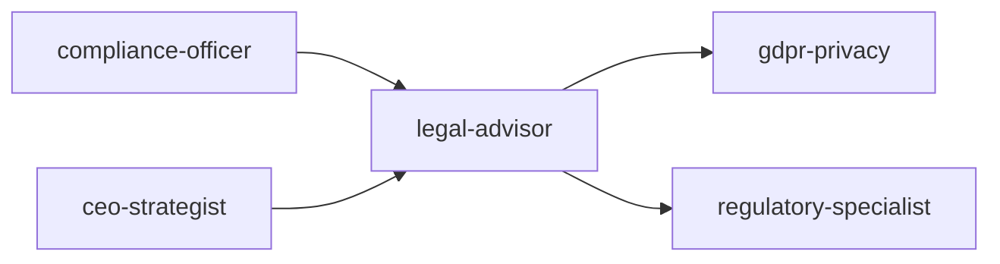

# Scale Depth

<!-- QUICK: 30s -- find your team size column -->
### Solo (1 person, 0-100 users)
Founder reviewing contracts themselves or with free templates. ToS/Privacy Policy from Termly/Iubenda ($0-50). Open source: MIT license default. Trademark: no registration, common law rights only. No DMCA registration. Contracts: clickwrap via checkbox. IP: employee agreements as work-for-hire. No external counsel unless existential risk. Cost: $0-200/month. Overkill: external counsel retainer, patent filings, formal CLAs, multi-jurisdiction trademark.

### Small (2-10 people, 100-10K users)
Fractional general counsel or law firm retainer (5-10 hours/month). Custom-drafted ToS/Privacy Policy ($3-8K). Trademark: USPTO registration for name + logo ($250-350/class). DMCA: registered agent + takedown process. Open source: license audit before funding round. Contractor IP assignments standardized. Cost: $1K-5K/month. Overkill: in-house counsel, patent portfolio, Madrid Protocol trademarks.

### Medium (10-50 people, 10K-1M users)
In-house counsel or dedicated law firm relationship. Full contract management system (Ironclad, LinkSquares). IP portfolio: patents (provisional + PCT), trademarks (USPTO + Madrid), trade secrets program. Open source: automated license compliance (FOSSA, Snyk). DMCA: automated notice processing. Data processing: DPAs for all vendors. Cost: $8K-30K/month. Overkill: patent litigation budget, multi-country regulatory filings (unless regulated industry).

### Enterprise (50+ people, 1M+ users)
Legal department (2-5+). Full IP management: patent prosecution, trademark enforcement globally, defensive publication program. Enterprise CLM: Salesforce/ironclad with AI review. Open source program office (OSPO). M&A due diligence capability. Regulatory compliance team. Litigation management. Board governance. Employment law counsel. Cost: $50K-500K+/month.

### Transition Triggers
| From → To | Trigger | What to Change |
|-----------|---------|----------------|
| Solo → Small | First enterprise contract, funding round, or user complaint | Hire fractional counsel; file USPTO trademark; do open-source audit |
| Small → Medium | Series A, 50+ employees, IP litigation threat, or international expansion | Hire in-house counsel; build IP portfolio (patents + Madrid marks); implement CLM |
| Medium → Enterprise | IPO prep, M&A, multi-country regulatory overlay, or legal team >3 | Build legal department; establish OSPO; add compliance team; formalize litigation management |


### Cross-skills Integration

Run skills in the order shown:
```bash
# Chain A: compliance-officer → legal-advisor → gdpr-privacy
# Chain B: ceo-strategist → legal-advisor → regulatory-specialist
```
