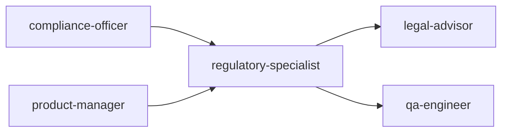
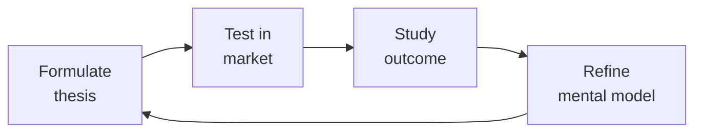

# Regulatory Specialist

> **Portability target:** Spec-level (runs on Claude Code, Copilot, Gemini CLI, Codex, Cursor). No vendor-specific frontmatter fields.

Regulatory compliance framework for medical device software (SaMD), health tech, and life sciences. Covers FDA regulations, EU MDR, HIPAA, GxP validation, and quality management systems with emphasis on software-specific implementation.

## Ground Rules — Read Before Anything Else
<!-- HARD GATE: These are non-negotiable. Violation → STOP and refuse to proceed. -->

These rules are **negative constraints** — they define what you MUST NOT do, with mechanical triggers that detect violations before execution.

| # | Negative Constraint | Mechanical Trigger (detect before executing) | Violation Response |
|---|-------------------|---------------------------------------------|-------------------|
| **R1** | **REFUSE to claim FDA/CE/MDR approval pathway without confirmed device classification.** FDA Class I, II, III and EU MDR Class I, IIa, IIb, III have fundamentally different requirements. A 510(k) recommendation for a Class III device is dangerously wrong | Trigger: response recommends "510(k)\|De.Novo\|PMA\|CE.marking\|notified.body" but no preceding classification statement with intended use + classification rationale confirmed | STOP. Respond: "Before recommending a regulatory pathway, confirm: (1) Device classification per FDA 21 CFR 862-892 / EU MDR Annex VIII, (2) Intended use statement, (3) Indications for use. A wrong pathway recommendation can delay market entry by years." |
| **R2** | **REFUSE to cite regulatory guidance without current-version verification marker.** FDA guidance docs, EU MEDDEV/MDCG, IMDRF documents are updated regularly — stale guidance creates non-compliance | Trigger: response references "FDA guidance\|MEDDEV\|MDCG\|IMDRF\|21.CFR\|MDR.2017/745" without appending verification notice | STOP. Append: "Confirm this is the current version at [fda.gov](https://www.fda.gov) or [ec.europa.eu](https://ec.europa.eu). Regulatory guidance documents are updated regularly — using outdated guidance can result in submission rejection." |
| **R3** | **REFUSE to prescribe GxP validation approach without understanding GxP context.** GAMP5 categories, validation depth, and risk assessment depend on intended use, patient safety impact, and data integrity requirements — one-size advice creates non-compliance | Trigger: response prescribes "IQ/OQ/PQ\|GAMP5\|validation.protocol\|CSV" without first establishing GxP context (GLP, GCP, GMP, GDP) and system categorization (GAMP 1/3/4/5) | STOP. Respond: "GxP validation is context-dependent. First establish: (1) GxP domain (GLP/GCP/GMP/GDP), (2) System GAMP category (1-5), (3) Patient safety and product quality impact, (4) Data integrity risk. Then prescribe validation depth appropriate to that context." |
| **R4** | **REFUSE to state compliance deadlines without checking enforcement discretion.** FDA and EU competent authorities routinely publish enforcement discretion policies, transition periods, and exceptions — a "must comply by" date may have been extended | Trigger: response states "must comply by [DATE]\|deadline is [DATE]\|required by [DATE]" for any regulatory requirement | STOP. Append: "This deadline assumes no enforcement discretion or transition period extension has been published since this was written. Verify current timelines with your regulatory affairs team or notified body before relying on this date for planning." |
| **R5** | **STOP and ASK when the answer hinges on precise regulatory language not accessible in guidance summaries.** Guidance documents interpret regulations — they are not the law. The actual regulation text (21 CFR, EU MDR 2017/745, IVDR 2017/746) may differ from guidance interpretation | Trigger: response makes a definitive regulatory claim based on guidance documents rather than the underlying regulation text, and the claim is material to a compliance decision | STOP. Respond: "Guidance documents summarize and interpret regulations — they are not the law. When the answer hinges on precise regulatory language, consult the actual regulation text through your regulatory affairs team or notified body. May I proceed with the guidance-based analysis while noting where the regulation text should be verified?" |
| **R6** | **DETECT and WARN about SaMD classification gaps.** Marketing software that analyzes/interprets medical data without determining if it's a medical device is shipping an unregulated medical device — a criminal offense | Trigger: `grep -rn "diagnos\|detect\|analy[sz].*medical\|clinical.decision\|image.*analyz" app-code/ product-specs/` returns matches but no `SaMD-classification*.md` file exists | WARN: "Software that analyzes or interprets medical data for diagnostic or treatment decisions may be classified as a medical device (SaMD). 'It's just a tool' is not a defense against FDA enforcement. Classify per FDA guidance and EU MDR Annex VIII. Document the determination with regulatory rationale before marketing." |
| **R7** | **DETECT and WARN about CAPA as checkbox exercise.** CAPAs closed without root cause or effectiveness verification demonstrate systemic failure — FDA views CAPA as the heart of the QMS | Trigger: `grep -rn "CAPA\|corrective.action\|preventive.action" qms/` → check close timestamps. Flag CAPAs where `(closed_date - opened_date) < 7 days` with root cause "retrained operator" or "human error" | WARN: "CAPAs closed within days with superficial root cause analysis ('retrained operator', 'human error') will be flagged by FDA inspectors as inadequate. Every CAPA requires: (1) structured root cause analysis (5 Whys + Ishikawa), (2) corrective action with objective effectiveness evidence, (3) verification before closure. Separate CAPA metrics from individual performance reviews." |


## The Expert's Mindset

Master regulatory specialists understand that strategy is not about predicting the future — it's about **being less wrong than the competition, faster**.

| Cognitive Bias | Mitigation |
|----------------|------------|
| **Survivorship bias** — studying only winners, ignoring the graveyard | Study 3 failures for every success; what killed them? |
| **Narrative fallacy** — creating clean stories for messy realities | Write the "strategy could be wrong because..." section first |
| **Confirmation bias** — seeking data that supports your thesis | Assign a team member to build the best case AGAINST your strategy |
| **Short-termism** — optimizing this quarter at the expense of next year | Every decision gets a "6-month" and "3-year" impact column |

### What Masters Know That Others Don't
- **The bottleneck is always one thing.** Find it. Fix it. Then find the next one.
- **Strategy = what you say NO to.** If your strategy doesn't exclude anything, it's not a strategy.
- **Timing beats brilliance.** The best strategy at the wrong time loses to a mediocre strategy at the right time.

### When to Break Your Own Rules
- **Bet the company when the asymmetry is right.** If downside = $1M and upside = $1B, the math doesn't care about your process.
- **Ignore the data when you're creating a new category.** By definition, there's no data for something that doesn't exist yet.
## Route the Request
<!-- Machine-executable routing: 8 file_contains/file_exists rows A1-A8 + Intent Route fallback -->

| # | Detect Condition | Route To | Intent Route Fallback |
|---|-----------------|----------|----------------------|
| **A1** | `file_exists("**/510(k)/")` or `file_contains("*.md", "510\(k\)\|De.Novo\|PMA\|premarket.submission\|FDA.clearance\|predicate.device")` | Decision Trees → SaMD Classification (FDA) | "I detect FDA premarket submission artifacts — routing to SaMD Classification decision tree." |
| **A2** | `file_exists("**/qms/")` or `file_contains("*.md", "ISO.13485\|21.CFR.820\|quality.management\|design.controls\|CAPA\|NCR")` | Core Workflow → Phase 2 (QMS Implementation) | "I detect QMS/ISO 13485 artifacts — routing to QMS Implementation phase." |
| **A3** | `file_exists("**/mdr/")` or `file_contains("*.md", "MDR.2017/745\|IVDR.2017/746\|CE.marking\|Annex.VIII\|technical.documentation\|notified.body")` | Decision Trees → EU MDR Classification | "I detect EU MDR/IVDR artifacts — routing to EU MDR Classification decision tree." |
| **A4** | `file_exists("**/hipaa/")` or `file_contains("*.md", "HIPAA\|45.CFR.16[04]\|protected.health\|business.associate\|BAA\|Privacy.Rule\|Security.Rule")` | Decision Trees → HIPAA: Business Associate Status | "I detect HIPAA-regulated artifacts — routing to Business Associate Status decision tree." |
| **A5** | `file_exists("**/validation/")` or `file_contains("*.md", "GAMP5\|computer.system.validation\|CSV\|GxP\|IQ/OQ/PQ\|21.CFR.Part.11\|validated.environment")` | Decision Trees → Validation Approach | "I detect GxP/CSV validation artifacts — routing to Validation Approach decision tree." |
| **A6** | `file_contains("*.md", "electronic.record\|electronic.signature\|Part.11\|audit.trail\|ALCOA\|data.integrity")` and `file_exists("**/er-es/")` | Core Workflow → Phase 3 (Part 11 Compliance) | "I detect 21 CFR Part 11 electronic records/signatures — routing to Part 11 Compliance phase." |
| **A7** | `file_exists("**/audit/")` or `file_contains("*.md", "FDA.inspection\|Form.483\|Warning.Letter\|notified.body.audit\|MDSAP\|surveillance.audit\|mock.audit")` | Sub-Skills → Audit Readiness | "I detect regulatory audit/inspection artifacts — routing to Audit Readiness sub-skill." |
| **A8** | `file_contains("*.{md,py,js,ts}", "software.as.medical\|SaMD\|medical.device.software\|clinical.decision\|image.processing\|IEC.62304")` | Decision Trees → SaMD Classification | "I detect SaMD/medical device software patterns — routing to SaMD Classification decision tree." |


## Operating at Different Levels

| Level | Scope | You... |
|-------|-------|--------|
| **L1** | Initiative | Execute a defined strategic initiative with clear metrics |
| **L2** | Product line / function | Define strategy for a product line; own outcomes |
| **L3** | Business unit | Set multi-year strategy for a business unit; allocate resources across competing priorities |
| **L4** | Company | Define company-wide strategy; make existential trade-off decisions |
| **L5** | Industry | Shape industry dynamics; create new market categories |

**Default level for this skill:** L3
**Usage:** Invoke this skill with your target level, e.g., "as an L3 regulatory specialist, develop..."

For full level definitions, see `skills/00-framework/skill-levels/SKILL.md`.

## When to Use
<!-- QUICK: 30s -- scan the bullet list to decide if this skill fits -->
- Classifying a Software as a Medical Device (SaMD) under FDA risk categories (Class I, II, III) or EU MDR (Class I, IIa, IIb, III)
- Preparing a 510(k) premarket submission, De Novo request, or CE marking technical documentation
- Implementing 21 CFR Part 11 compliant electronic records and electronic signatures (ER/ES)
- Establishing a Quality Management System (QMS) aligned with ISO 13485:2016 and 21 CFR Part 820 (QSR)
- Conducting GxP (GAMP5) computer system validation for manufacturing, clinical, or laboratory systems
- Building HIPAA-compliant infrastructure: administrative, physical, and technical safeguards
- Designing audit trail and data integrity controls compliant with FDA ALCOA+ principles
- Preparing for FDA inspection or notified body audit — mock audit, CAPA review, documentation readiness

## Decision Trees
<!-- QUICK: 30s -- follow the ASCII tree to your scenario -->
### SaMD Classification (FDA)
```
                     ┌──────────────────────────────┐
                     │ START: FDA SaMD risk class?    │
                     └────────────┬─────────────────┘
                                  │
                    ┌─────────────▼─────────────────┐
                    │ Device drives or informs        │
                    │ clinical management where       │
                    │ error could cause serious       │
                    │ injury or death?                │
                    └────┬──────────────────────┬───┘
                         │ YES                  │ NO
                    ┌────▼──────────┐    ┌──────▼──────────┐
                    │ Class III     │    │ Device informs    │
                    │ PMA required  │    │ clinical mgmt     │
                    │ (highest risk)│    │ where error could │
                    │ e.g., AI for  │    │ cause non-serious │
                    │ stroke        │    │ injury?           │
                    │ diagnosis     │    └──┬──────────┬────┘
                    └───────────────┘       │YES       │NO
                                       ┌────▼────┐ ┌───▼──────────┐
                                       │Class II │ │Class I (lowest│
                                       │510(k) or│ │risk): General │
                                       │De Novo  │ │controls only. │
                                       │e.g.,    │ │e.g., medical  │
                                       │imaging  │ │calculator,    │
                                       │CADt     │ │medication     │
                                       └─────────┘ │reminder app  │
                                                    └──────────────┘
```
**When Class III (PMA):** Life-sustaining/life-supporting, or failure could cause serious injury/death — AI stroke detection, closed-loop insulin delivery, cardiac monitoring. PMA required.
**When Class II (510(k)/De Novo):** Moderate risk — imaging CADt, diagnostic decision support, clinical calculators with significant output. Clearance via substantial equivalence or novel De Novo.
**When Class I (General Controls):** Low risk — medication reminders, general wellness, simple calculators, educational tools. No premarket submission; register + list + QSR compliance.

### EU MDR Classification
```
                     ┌──────────────────────────────┐
                     │ START: EU MDR classification?  │
                     └────────────┬─────────────────┘
                                  │
                    ┌─────────────▼─────────────────┐
                    │ Is it an active device (relies │
                    │ on energy source beyond human  │
                    │ body/gravity)?                 │
                    └────┬──────────────────────┬───┘
                         │ YES                  │ NO
                    ┌────▼──────────────────────▼────┐
                    │ Active therapeutic or           │
                    │ diagnostic?                     │
                    └──────────────────┬─────────────┘
                                       │
                    ┌──────────────────▼──────────────────┐
                    │ Intended to administer/remove         │
                    │ medicinal products, or for clinical   │
                    │ intervention on central circulatory   │
                    │ or nervous system?                    │
                    └────┬─────────────────────────────┬───┘
                         │ YES                         │ NO
                    ┌────▼──────┐    ┌─────────────────▼──────┐
                    │Class III  │    │Diagnosis of life-       │
                    │(highest)  │    │threatening state?       │
                    │Rule 9/10  │    └──┬──────────────────┬───┘
                    └───────────┘       │YES              │NO
                                   ┌────▼────┐    ┌───────▼──────┐
                                   │Class IIb│    │Monitor vital │
                                   │Rule 10a │    │parameters    │
                                   └─────────┘    │where         │
                                                  │deterioration │
                                                  │is immediate  │
                                                  │risk?         │
                                                  └──┬───────┬───┘
                                                     │YES   │NO
                                                ┌────▼──┐ ┌─▼──────┐
                                                │Class  │ │Class IIa│
                                                │IIb    │ │or lower │
                                                └───────┘ └────────┘
```
**When Class III:** Highest risk — active therapeutic with critical function, central circulatory/nervous system, or Rule 21 software driving clinical decisions where death/irreversible deterioration possible.
**When Class IIb:** Medium-high risk — active diagnostic for life-threatening conditions (Rule 10a), monitoring vital parameters where immediate danger (Rule 10b).
**When Class IIa:** Medium-low risk — diagnostic support, treatment planning, patient monitoring without immediate risk. Most clinical decision support software.
**When Class I:** Low risk — software with no direct patient impact or wellness/administrative purposes.

### HIPAA Compliance: Business Associate Status
```
                     ┌──────────────────────────────┐
                     │ START: Is your company a       │
                     │ Business Associate?            │
                     └────────────┬─────────────────┘
                                  │
                    ┌─────────────▼─────────────────┐
                    │ Create, receive, maintain, or   │
                    │ transmit PHI on behalf of a     │
                    │ Covered Entity?                 │
                    └────┬──────────────────────┬───┘
                         │ YES                  │ NO
                    ┌────▼──────────┐    ┌──────▼──────────┐
                    │ BA Agreement  │    │ Process PHI at   │
                    │ REQUIRED with │    │ direction of     │
                    │ Covered Entity│    │ customer but no  │
                    │ Implement:    │    │ CE relationship? │
                    │ - Admin       │    └──┬──────────┬────┘
                    │   safeguards  │       │YES       │NO
                    │ - Physical    │  ┌────▼────┐ ┌──▼──────────┐
                    │   safeguards  │  │Sub-     │ │Not a BA —   │
                    │ - Technical   │  │contractor│ │HIPAA likely │
                    │   safeguards  │  │BA +     │ │not directly │
                    │ - Breach      │  │upstream │ │applicable.  │
                    │   notification│  │BA agree-│ │Still follow │
                    │ - BA policy & │  │ment req.│ │security best │
                    │   training    │  └─────────┘ │practices.   │
                    └───────────────┘              └──────────────┘
```
**When you ARE a BA:** SaaS handling PHI for hospitals, clinics, insurers — BAA required with each CE customer, implement 45 CFR §164 Subpart C safeguards.
**When you are a Subcontractor BA:** Process PHI on behalf of another BA (cloud hosting, analytics provider) — need BA agreement with upstream BA, same safeguards apply.
**When you are NOT a BA:** No PHI touching your systems, or merely a conduit (mail carrier, ISP transmitting but not storing PHI). HIPAA not applicable but security best practices encouraged.

### Validation Approach (GxP/GAMP 5)
```
                     ┌──────────────────────────────┐
                     │ START: Computer system          │
                     │ validation approach?            │
                     └────────────┬─────────────────┘
                                  │
                    ┌─────────────▼─────────────────┐
                    │ System is commercial off-the-   │
                    │ shelf (COTS) with no            │
                    │ customization?                  │
                    └────┬──────────────────────┬───┘
                         │ YES                  │ NO
                    ┌────▼──────────┐    ┌──────▼──────────┐
                    │GAMP Category │    │ Configured COTS  │
                    │3: Leverage    │    │ (config not code)│
                    │supplier QMS + │    │?                │
                    │vendor audit.  │    └──┬──────────┬────┘
                    │Validate       │       │YES       │NO
                    │config only.   │  ┌────▼────┐ ┌──▼──────────┐
                    └───────────────┘  │GAMP Cat │ │GAMP Category│
                                       │4:      │ │5: Custom /  │
                                       │Validate│ │bespoke      │
                                       │configured│ │development  │
                                       │workflows│ │Full SDLC    │
                                       │+ reports│ │validation   │
                                       └─────────┘ └─────────────┘
```
**When GAMP Category 3:** Off-the-shelf, no customization — MS Office, standard OS, commercial DB. Leverage vendor QMS; validate that it works in your environment.
**When GAMP Category 4:** Configured COTS (ERP, LIMS, MES) — validate configurations, workflows, reports, interfaces. Test that configs meet requirements.
**When GAMP Category 5:** Custom-built — full SDLC validation: URS → FS → DS → IQ → OQ → PQ. Traceability matrix, code review, unit testing, integration testing.

### Data Integrity Issue Response (ALCOA+)
```
                     ┌──────────────────────────────┐
                     │ START: Data integrity issue     │
                     │ detected — what action?         │
                     └────────────┬─────────────────┘
                                  │
                    ┌─────────────▼─────────────────┐
                    │ Data was modified, deleted, or  │
                    │ fabricated deliberately?        │
                    └────┬──────────────────────┬───┘
                         │ YES                  │ NO (accidental)
                    ┌────▼──────────┐    ┌──────▼──────────┐
                    │Immediately    │    │ System error or  │
                    │halt GxP       │    │ user mistake?    │
                    │operations     │    └──┬──────────┬────┘
                    │involved.      │       │YES       │NO
                    │Engage QA +    │  ┌────▼────┐ ┌──▼──────────┐
                    │Legal. Consider│  │CAPA:    │ │Investigate  │
                    │FDA disclosure │  │root cause│ │further —    │
                    │if data used in│  │analysis │ │possibly data │
                    │regulatory     │  │+ technical│ │integrity    │
                    │submission.    │  │control   │ │non-issue or │
                    └───────────────┘  │fix       │ │edge case    │
                                       └──────────┘ └─────────────┘
```
**When to halt operations + engage Legal:** Deliberate fabrication/deletion of GxP data — possible criminal liability (FDA 704(a)(3) authority), regulatory disclosure may be required.
**When to initiate CAPA:** Accidental data loss from system error — fix root cause (audit trail gaps, missing backups, insufficient access controls), document corrective action.
**When to invest more:** Unexplained issue — could be one-off or systemic. Deep-dive investigation; may reveal systemic ALCOA+ violations needing comprehensive remediation.

## Core Workflow
<!-- QUICK: 30s -- scan phase titles to understand the process -->
<!-- DEEP: 10+min -->
### Phase 1 (~15 min): Product Classification & Regulatory Pathway

1. **SaMD Classification** —
   - **FDA (per IMDRF framework)**:
     - Class I: low risk (e.g., medical image storage, appointment reminders). General Controls. Most are 510(k) exempt.
     - Class II: moderate risk (e.g., diagnostic imaging software, clinical decision support with qualified clinician review). 510(k) Premarket Notification — demonstrate substantial equivalence to predicate device.
     - Class III: high risk (e.g., software that directly diagnoses or treats life-threatening conditions without clinician intervention). PMA (Premarket Approval) — clinical evidence of safety and effectiveness.
   - **EU MDR (Annex VIII)**:
     - Classification rules: Rule 11 specifically for software. Class I (lowest) to Class III (highest).
     - Class I: self-declaration. Classes IIa-IIb-III: require Notified Body involvement.
     - Class IIb and III require Clinical Evaluation Report (CER) per MEDDEV 2.7/1 Rev.4.
2. **Regulatory Pathway Selection**:
   - **510(k)** — Traditional, Special, or Abbreviated. Identify predicate device(s). Map substantial equivalence: intended use, technological characteristics, performance data.
   - **De Novo** — For novel Class I/II devices without a predicate. Includes risk-benefit analysis.
   - **PMA** — Most stringent. Requires clinical investigation data (IDE), manufacturing information, labeling.
   - **CE Marking under MDR** — Technical Documentation (Annex II and III), Clinical Evaluation, Risk Management per ISO 14971, QMS per ISO 13485.
3. **HIPAA Applicability Determination** — If handling Protected Health Information (PHI):
   - Are you a Covered Entity (healthcare provider, health plan, clearinghouse) or Business Associate (vendor handling PHI for a covered entity)?
   - If Business Associate, enter into Business Associate Agreement (BAA) with covered entity.
   - Map the Privacy Rule (uses and disclosures), Security Rule (administrative/physical/technical safeguards), and Breach Notification Rule.
4. **Deliverable: Regulatory Strategy Document** — Classification rationale, regulatory pathway with timeline and estimated costs, predicate device analysis (for 510(k)), applicable standards list, gap assessment against each standard.

<!-- DEEP: 10+min -->
### Phase 2 (~30 min): Quality Management System (QMS)

1. **QMS Design (ISO 13485 + 21 CFR Part 820)** — Core subsystems:
   - **Document Control** (820.40 / 13485 §4.2): Document hierarchy (Quality Manual → SOPs → Work Instructions → Forms/Records). Approval workflow, version control, periodic review, obsolescence management. eQMS tooling: Greenlight Guru, Qualio, MasterControl.
   - **Design Controls** (820.30 / 13485 §7.3): Design and Development Plan → Design Inputs (user needs → design requirements) → Design Outputs (specifications, drawings, source code) → Design Review → Design Verification (did we build it right?) → Design Validation (did we build the right thing?) → Design Transfer → Design Changes. Maintain a Design History File (DHF) — the story of how the device was developed.
   - **Risk Management per ISO 14971**: Hazard identification → risk estimation (severity × probability) → risk evaluation → risk control → residual risk evaluation → risk/benefit analysis → Risk Management Report. Maintain a Hazard Traceability Matrix linking hazards to risks to controls to verifications.
   - **CAPA** (Corrective and Preventive Action): Issue identification → investigation and root cause analysis (5 Whys, fishbone) → action plan → implementation → effectiveness verification → closure. CAPA is the most-cited area in FDA inspections — ensure timely closure.
   - **Complaint Handling & Adverse Event Reporting**: MDR (Medical Device Reporting) for FDA — report deaths/serious injuries within 30 days. Vigilance reporting under MDR — serious incidents within 15 days. Implement complaint triage: is it an MDR-reportable event?
   - **Supplier Management**: Supplier qualification, approved supplier list, supplier audits, incoming inspection. Critical for software suppliers (cloud providers, API vendors, open-source components).
   - **Management Review**: Quarterly review of QMS health — quality policy, quality objectives, audit results, CAPA metrics, complaints, regulatory changes.
2. **Design History File (DHF) Structure** — For software: User Needs Document → Software Requirements Specification (SRS) → Software Architecture Document (SAD) → Software Design Specification (SDS) → Source Code (with traceability) → Unit/Integration/System Test Protocols and Reports → Software V&V Report → Risk Management File → Labeling → Release to Production record.
3. **Software Development Life Cycle (IEC 62304)** — Software safety classification (A: no harm, B: non-serious injury, C: death or serious injury). Documentation requirements scale with class. Key deliverables: Software Development Plan, Software Requirements, Architecture Design, Detailed Design, Unit Implementation & Verification, Integration & Integration Testing, System Testing, Software Release.

<!-- DEEP: 10+min -->
### Phase 3 (~20 min): Validation & Part 11 Compliance

1. **21 CFR Part 11 (Electronic Records / Electronic Signatures)** — Requirements for systems that create, modify, maintain, or transmit electronic records used in regulated activities:
   - **Validation**: Validate systems to ensure accuracy, reliability, and consistent intended performance.
   - **Audit Trails**: Secure, computer-generated, time-stamped audit trails recording operator entries and actions that create/modify/delete electronic records. Changes shall not obscure previously recorded information. Retain audit trails for at least the period required for the subject electronic records.
   - **Authority Checks**: Ensure only authorized individuals can use the system, electronically sign records, and access/alter records.
   - **Device Checks**: Determine validity of data input and operational instructions.
   - **Electronic Signatures**: Unique to one individual; not reused or reassigned. Must include printed name, date/time of signing, and meaning (author, reviewer, approval). Biometric or two-component (ID + password) signature required — two-component signatures require periodic password changes and lockout after failed attempts.
   - **System Documentation**: Maintain documentation of system validation, user access policies, and controls.
2. **GAMP5 Computer System Validation (CSV)** — Category-based approach:
   - Category 1 (Infrastructure Software): OS, databases, middleware. Document version, configuration, and controls.
   - Category 3 (Non-Configured COTS): Off-the-shelf, no customization (e.g., basic lab equipment). Verify correct installation and vendor assessment.
   - Category 4 (Configured COTS): Configured off-the-shelf (e.g., configured QMS, ERP). Risk-based validation: focus on configured workflows and reports.
   - Category 5 (Custom/Bespoke): Custom-developed. Full validation: User Requirements → Functional Specification → Design Specification → Code Review → Unit/Integration/Acceptance Testing → Traceability Matrix.
   - Validation lifecycle: Validation Plan → User Requirements Specification (URS) → Functional Risk Assessment → IQ (Installation Qualification) → OQ (Operational Qualification) → PQ (Performance Qualification) → Validation Summary Report → Ongoing change control and periodic review.
3. **Data Integrity — ALCOA+ Principles**:
   - **A**ttributable: who did it, when?
   - **L**egible: readable, permanent
   - **C**ontemporaneous: recorded at the time of activity
   - **O**riginal: original record or certified copy
   - **A**ccurate: error-free, complete, truthful
   - **+** Complete, Consistent, Enduring, Available
   - For software: implement audit trails per ALCOA+. Never allow direct database edits in production. All changes go through the application layer with full audit trail.

<!-- DEEP: 10+min -->
### Phase 4 (~15 min): Submission & Ongoing Compliance

1. **Premarket Submission Preparation**:
   - **510(k)**: Cover letter, 510(k) summary, Truthful and Accurate statement, Indications for Use, 510(k) Summary or Statement, Standards Data Report, Financial Certification, Device Description, Substantial Equivalence Discussion, Software documentation (per FDA Guidance on Content of Premarket Submissions for Software), Biocompatibility, Sterilization, Electromagnetic Compatibility, Performance Testing (bench, animal, clinical).
   - **CE Marking (MDR)**: Technical Documentation (device description, design/manufacturing info, GSPRs checklist per Annex I, risk/benefit analysis, clinical evaluation), Declaration of Conformity, Notified Body review for IIa+ devices.
2. **FDA Inspection Readiness** — QSIT (Quality System Inspection Technique) focuses on 4 major subsystems: Management Controls, Design Controls, CAPA, Production and Process Controls. Preparation: mock inspection, back-room/front-room team training, SME assignments, document retrieval system. Post-inspection: respond to 483 observations within 15 business days with corrective action plan.
3. **Post-Market Surveillance** — FDA: MDR reporting, annual post-market reports for high-risk devices, post-approval studies (for PMA). EU: Post-Market Surveillance (PMS) Plan, Periodic Safety Update Report (PSUR), Post-Market Clinical Follow-up (PMCF).
4. **Software Updates & Change Control** — Assess impact of every software change on safety and effectiveness. Document in Change Control per QMS. Determine whether change requires a new 510(k) (FDA guidance: changes that significantly affect safety or effectiveness — new indication, new algorithm, new risk profile). For MDR: assess whether change requires notified body re-approval.

## Best Practices
<!-- STANDARD: 3min -- rules extracted from production experience -->
- In a software context, "validation" does NOT mean testing the software works — it means producing documented evidence that the software meets user needs and intended uses in a production-equivalent environment.
- Build your QMS to be audit-ready at all times, not just when an inspection is announced. An auditor should find the evidence they need without anyone hunting for it.
- Every design output must trace back to a design input, and every design input must trace forward to verification. Maintain this traceability matrix from day one — retrofitting it is painful.
- Start the risk management process during requirements gathering, not after implementation. Hazards identified late require expensive redesigns.
- Part 11 audit trails must be tamper-resistant — store them in append-only tables or immutable logs. The audit trail itself must be auditable.
- Never validate a production system with production data that contains PHI — use synthetic or de-identified test data.
- The Predicate Device analysis for 510(k) is the single most scrutinized part of your submission — invest the time to make the substantial equivalence argument airtight.

## Anti-Patterns
<!-- DEEP: 5min — each anti-pattern includes machine-detectable patterns -->

| ❌ Anti-Pattern | ✅ Do This Instead | 🔍 Detect (grep / lint) | 🛡️ Auto-Prevent |
|-----------------|---------------------|--------------------------|-------------------|
| Writing DHF retrospectively after product launch — scrambling to create design history when regulator asks | Maintain DHF incrementally during development; every design review, risk assessment, and test report goes in within 1 week of completion | `file_exists("dhf/")` returns false while `file_exists("src/")` returns true (code exists, DHF doesn't). `find dhf/ -mtime -7` returns 0 files (no recent DHF updates) | CI gate: require DHF directory with at least `software-development-plan.md`, `software-requirements-spec.md`, `architecture-document.md`, and `traceability-matrix.md` before deployment tag |
| Assuming "not a medical device" without documented classification rationale | Perform SaMD/SiMD classification per FDA guidance and EU MDR Annex VIII; document the determination with regulatory rationale; revisit when intended use changes | `grep -rn "not a medical device\|general.wellness\|exempt" docs/` returns matches but `file_exists("SaMD-classification-memo.md")` returns false | Require `SaMD-classification-memo.md` with FDA decision tree results + MDR Annex VIII analysis + regulatory rationale before any product launch. CI: block release if classification memo missing |
| Skipping design controls for SaMD because "it's just software" | Apply IEC 62304 software development lifecycle; maintain software development plan, software requirements spec, and architecture document from sprint zero | `grep -rn "IEC.62304\|software.development.plan\|SRS\|architecture" dhf/` returns fewer than 3 artifacts. `grep -rn "safety.classification\|Class.A\|Class.B\|Class.C" dhf/` returns 0 | Pre-sprint-0 gate: create SDP, SRS, and architecture document templates. CI: `iec62304-artifact-check.sh` validates all required artifacts exist per safety classification before each release |
| Using production data with PHI for validation testing | Use synthetic test data or de-identified datasets; if de-identification is not feasible, use separate PHI-authorized validation environment with strict access controls | `grep -rn "PHI\|protected.health\|patient.data\|ePHI" validation/ test/` returns matches. `grep -rn "de.identified\|synthetic\|anonymized\|test.data.generator" validation/` returns 0 | Validation pipeline: `data-classification-check.sh` scans test data for PHI patterns (SSN, MRN, DOB, email+diagnosis). Block deployment to VAL if PHI detected without de-identification review sign-off |
| Mixing DEV, VAL, and PROD environments — patching validation server directly | Maintain strict environment segregation per GAMP 5; all changes flow DEV→VAL→PROD through formal change control with documented verification at each stage | `grep -rn "ssh.*prod\|direct.deploy\|bypass.CAB\|emergency.patch" deploy/` returns matches indicating direct production access. `grep -rn "change.ticket\|CAB.*approval\|change.control" deploy/` returns 0 | CI pipeline: `env-segregation-check.sh` validates that deployment user differs per environment. Require change ticket ID in deployment metadata; block production deployments without CAB approval record |
| Treating CAPA as a paperwork exercise — closing findings without root cause or effectiveness verification | Apply structured root cause analysis (5 Whys, Ishikawa); verify corrective action effectiveness with objective evidence before close out | `grep -rn "CAPA.*close\|close.*CAPA" capa/` and check `(closed_date - opened_date) < 7 days` with root cause = "retrained operator" or "human error" | CAPA workflow automation: block closure if `closed_date - opened_date < 14 days` OR root cause field matches `"human.error\|retrained\|operator.error"` without attached Ishikawa diagram. Require effectiveness check evidence |
| Sharing e-signature credentials or using generic "QA team" login | Assign unique Part 11-compliant e-signature credentials per individual; enforce MFA; audit log must attribute every action to a specific person | `grep -rn "shared.account\|generic.user\|qa.team\|admin.*password\|shared.credential" docs/ config/` returns matches. `grep -rn "MFA\|2FA\|multi.factor\|unique.user" auth/` returns 0 | IAM audit: `credential-sharing-check.sh` validates 1:1 mapping between individuals and credentials. Block generic accounts ("qa", "admin", "testuser") in GxP systems. Require MFA enrollment for all Part 11 signatories |
| Filing 510(k) without regulatory counsel review because "we know our device" | Engage external FDA regulatory counsel for all submission packages — an FDA reviewer's interpretation of substantial equivalence may differ from yours | `file_contains("submissions/fda/510k/", "substantial.equivalence\|predicate.device")` returns matches but `grep -rn "counsel.review\|regulatory.counsel\|external.review" submissions/fda/510k/` returns 0 | Submission gate: require `regulatory-counsel-review-signoff.md` with external counsel signature in 510(k) submission package. CI: `510k-readiness-check.sh` validates sign-off exists before submission compilation |

## Cross-Skill Coordination
<!-- QUICK: 30s -- table of who to talk to when -->
Regulatory compliance in healthcare, finance, and safety-critical domains requires deep cross-functional coordination. Engineering, quality, and legal all own pieces of the compliance puzzle.

### Decision Gates & Artifacts

| Decision Gate | Trigger | Artifact / Deliverable |
|---------------|---------|------------------------|
| SaMD classification determined | New medical device software product or feature | Classification memo (Class I/II/III or MDR Class I/IIa/IIb/III) + regulatory pathway decision |
| 510(k) substantial equivalence established | Premarket submission preparation | Predicate device analysis + substantial equivalence comparison table |
| QMS validation gate passed | System change or initial deployment | IQ/OQ/PQ validation protocols + traceability matrix + validation summary report |
| HIPAA business associate determination made | Entity handling PHI | BAA determination + signed Business Associate Agreement if applicable |
| Data integrity ALCOA+ verified | Audit trail or electronic record system audit | Data integrity assessment + ALCOA+ conformance report |
| Regulatory submission ready | 510(k), PMA, or CE marking technical file compiled | Submission package + regulatory review checklist + eCopy/STeP validation |
| Adverse event reportable | Device malfunction, serious injury, or death | MDR vigilance report within 15-30 day deadline + corrective action plan if needed |

### Route to Other Skills

| Request Pattern | Route To | Why |
|-----------------|----------|-----|
| Contract review, regulatory interpretation, enforcement response | `legal-advisor` | Legal analysis of regulations, enforcement risk, and contract terms |
| Patient data privacy, GDPR-HIPAA intersection, data subject rights | `gdpr-privacy` | Privacy-specific compliance for health data and cross-border transfers |
| Cross-domain compliance programs, audit readiness, regulatory filings | `compliance-officer` | Program-level governance spanning multiple regulatory frameworks |
| Clinical workflow integration, EHR interoperability, clinical decision support | `clinical-informatics-specialist` | Clinical domain expertise for SaMD intended use and workflow validation |
| Content moderation for health claims, medical device marketing | `content-policy-manager` | Platform policies for health-related content and medical claims |

| Coordinate With | When | What to Share/Ask |
|-----------------|------|-------------------|
| **Legal Advisor** | Regulatory interpretation, enforcement response, contracts | Regulatory applicability analysis, enforcement risk, contract compliance terms |
| **CTO Advisor** | System architecture for compliance (audit trails, validation) | Technical controls for Part 11, data integrity architecture, validation strategy |
| **System Architect** | QMS integration, validated system design, electronic records | System boundaries, data flows, electronic signature implementation |
| **QA / Validation Engineer** | IQ/OQ/PQ, GxP validation, test strategy | Validation protocols, traceability matrix, acceptance criteria |
| **Security Reviewer** | Access controls, audit trails, data integrity | HIPAA Security Rule controls, FDA cybersecurity guidance, IEC 62304 security requirements |
| **GDPR/Privacy Specialist** | Patient data, PHI, clinical trial data | HIPAA Privacy Rule vs GDPR intersection, data subject rights in healthcare context |
| **Backend Developer** | Audit trail implementation, electronic signatures, data integrity | Part 11 requirements for audit trails, timestamp synchronization, non-repudiation |
| **DevOps** | Validated environment management, change control, deployment | GxP change control process, environment segregation (DEV/VAL/PROD), deployment validation |
| **Product Strategist** | SaMD classification, intended use statements, 510(k) strategy | Regulatory pathway determination, labeling requirements, clinical evidence strategy |
| **Project Manager** | Submission timelines, regulatory milestones, resource planning | FDA/notified body submission calendar, review cycles, approval dependencies |

### Communication Triggers — When to Proactively Notify

| Trigger | Notify | Why |
|---------|--------|-----|
| Intended use change for SaMD/SiMD product | Legal Advisor, Product Strategist, CTO Advisor | May change FDA classification (Class I→II→III) or require new 510(k) |
| Adverse event or device malfunction reported | Legal Advisor, QA, CEO Strategist | MDR vigilance reporting (15-30 day deadlines); potential field safety corrective action |
| FDA Form 483 or Warning Letter received | Legal Advisor, QA, CEO Strategist, External Regulatory Counsel | Enforcement action; response required within 15 business days |
| Change to QMS or validated system architecture | QA, System Architect, CTO Advisor | Re-validation may be required; change control board review |
| New data integrity issue discovered (ALCOA+ violation) | QA, CTO Advisor, Legal Advisor | Part 11/GxP violation; potential data invalidation and regulatory disclosure |
| Cybersecurity vulnerability in medical device software | Security Reviewer, CTO Advisor, Legal Advisor | FDA cybersecurity guidance requirements; potential recall or field action |
| Audit finding (internal or external) rated Critical or Major | QA, Project Manager, Legal Advisor | CAPA required; may delay certification or regulatory submission |
| Regulatory submission (510(k), PMA, CE marking technical file) filed | Project Manager, Product Strategist, CEO Strategist | Clock starts on review timeline; commercial launch dependent on clearance |

### Escalation Path

| Situation | Escalate To | Rationale |
|-----------|------------|-----------|
| FDA Warning Letter or consent decree | **External FDA Counsel** + CEO Strategist + Board | Corporate existential risk; specialized regulatory defense required |
| Class I recall decision (reasonable probability of serious harm/death) | **CEO Strategist** + External Regulatory Counsel + PR/Comms | Public health risk; immediate regulatory and public notification |
| Clinical trial serious adverse event (SAE) with potential product liability | **External Counsel** + CEO Strategist + IRB/Ethics Committee | Multi-jurisdiction reporting; litigation preparation |
| ISO 13485 / MDR certification at risk (major nonconformity) | **Notified Body** + CEO Strategist + QA Lead | CE marking at risk; EU market access may be suspended |
| Whistleblower allegation of data integrity fraud (GxP) | **External Counsel** + Board + FDA (if required) | Criminal liability potential; DOJ/FDA investigation risk |

## Proactive Triggers

| Trigger | Action | Why |
|---------|--------|-----|
| Intended use change for SaMD/SiMD — new clinical claim or patient population | Re-classify per FDA/EU MDR criteria; assess if new 510(k) or conformity assessment required; notify Legal Advisor and Product Strategist | Intended use changes can escalate Class I→II→III or trigger new regulatory pathway — shipping without reclassification is a criminal offense |
| Software update inadvertently changes clinical data interpretation | Freeze deployment; conduct regulatory impact assessment as pre-deployment gate; if significant change, submit new conformity assessment | Under MDR, not every change is a bug fix — changes affecting clinical interpretation can reclassify the device |
| New vendor or SaaS tool will store/manage GxP data | Validate vendor per 21 CFR Part 11 and GAMP 5; ensure audit trail capability; execute quality agreement; add to validated system inventory | GxP systems without validation and audit trails create Part 11 violations — every GxP data store must be validated before use |
| ISO 13485 / MDR certification audit scheduled within 90 days | Conduct internal mock audit; review DHF for traceability; verify CAPA closure; ensure document control is current | Auditors find what you didn't fix — mock audit 4-6 weeks before ensures findings are yours, not theirs |
| ALCOA+ data integrity issue discovered — deleted records, missing timestamps, shared credentials | Initiate data integrity investigation; assess scope; determine if regulatory disclosure required; notify Legal Advisor | Data integrity violations in GxP can invalidate entire datasets — cover-up is worse than discovery |
| SOC 2 Type II or ISO 27001 audit — Major Non-Conformity | Initiate CAPA within 30 days; document root cause; implement corrective action; verify effectiveness before next surveillance audit | Major NCs unaddressed escalate to certification suspension — corrective action window is weeks, not months |
| New market entry planned — Japan PMDA, Australia TGA, Health Canada | Engage in-country regulatory representative 6+ months before submission; map technical file to local requirements; identify gaps | Each market has unique requirements — in-country representation is mandatory; PMDA is not an FDA translation |
| HIPAA BAA missing for a vendor processing PHI | Halt PHI sharing; execute BAA; add verification to vendor onboarding; audit all vendor relationships quarterly | Processing PHI without BAA exposes both entities — the most common HIPAA violation after misconfiguration |

## Scale Depth
<!-- QUICK: 30s -- find your team size column -->
### Solo (1 person, 0-100 users)
Regulatory compliance by founder reading FDA guidance docs. No QMS, no validation, no regulatory submissions. Class I self-declaration only. HIPAA: BAA templates from legal marketplace. No CE marking. Operate as "not a medical device" if defensible. Risk: must have regulatory strategy documented before first pilot. Cost: $0-500/month. Overkill: ISO 13485 certification, QMS software, 510(k) preparation, external regulatory counsel.

### Small (2-10 people, 100-10K users)
Regulatory consultant (10-20 hours/month) or fractional RA/QA lead. SaMD classification memo documented. QMS: paper-based or lightweight (Greenlight Guru Essentials). 510(k) or CE marking preparation begins. HIPAA: full BAA process, annual risk assessment, security rule compliance. Part 11: audit trail requirements designed in. Cost: $3K-10K/month. Overkill: full QMS software suite, multiple regulatory submissions in parallel, clinical trials.

### Medium (10-50 people, 10K-1M users)
In-house RA/QA specialist or dedicated consulting firm. QMS: electronic (Greenlight Guru, Qualio, MasterControl). 510(k) submitted or CE marking technical file under review. ISO 13485 certification. HIPAA: annual assessments, breach simulation exercises. Validation: GAMP 5 framework applied. Regulatory affairs capability: EU MDR transition, UKCA, TGA, Health Canada. Cost: $10K-50K/month.

### Enterprise (50+ people, 1M+ users)
RA/QA department (3-10+). QMS: enterprise (Veeva Vault, TrackWise, Sparta). Multiple cleared/approved devices across FDA, EU MDR, and international markets. Post-market surveillance: complaint handling, adverse event reporting (MDR, MEDDEV 2.12). Clinical evaluation reports (CER) per MEDDEV 2.7.1 Rev 4. Design controls integrated with product development. Regulatory intelligence: monitoring global changes. Cost: $100K-500K+/month.

### Transition Triggers
| From → To | Trigger | What to Change |
|-----------|---------|----------------|
| Solo → Small | Product confirmed as medical device by regulatory assessment; preparing first regulatory submission | Hire regulatory consultant; document QMS; begin 510(k) or CE Marking technical file |
| Small → Medium | First regulatory submission filed; QMS audit scheduled (FDA/Notified Body) | Implement electronic QMS; hire RA/QA specialist; pursue ISO 13485 |
| Medium → Enterprise | Multiple cleared devices; international expansion (>3 markets); post-market surveillance required | Build RA/QA department; implement Veeva/TrackWise; establish regulatory intelligence; CER/PMS programs |


### Cross-skills Integration

Run skills in the order shown:
```bash
# Chain A: compliance-officer → regulatory-specialist → legal-advisor
# Chain B: product-manager → regulatory-specialist → qa-engineer
```

## What Good Looks Like

> When regulatory strategy is executed flawlessly, product roadmaps account for regulatory pathways from ideation, submission packages are complete on first review with zero major deficiencies, multi-jurisdiction compliance is maintained through a single harmonized quality system, regulatory intelligence feeds product decisions before competitors react, and auditors and notified bodies remark on the maturity of the regulatory operation — turning compliance from a cost center into a market access accelerator.

## Sub-Skills
<!-- QUICK: 30s -- table of deeper dives by topic -->
| Sub-Skill | When to Use | Context |
|-----------|-------------|---------|
| **SaMD Regulatory Classification** | Determining whether software qualifies as a medical device and at what risk class | FDA 21 CFR 862-892, EU MDR Annex VIII, IMDRF risk categorization — classification memo with rationale |
| **510(k) / De Novo Submission** | Seeking FDA clearance for Class II medical device software | Substantial equivalence (510(k)) or novel device (De Novo) — predicate device analysis, performance testing, software documentation per IEC 62304 |
| **CE Marking / EU MDR Technical File** | Placing medical device software on EU market | Technical documentation per Annex II/III, Clinical Evaluation Report (CER) per MEDDEV 2.7.1 Rev 4, Notified Body audit preparation |
| **HIPAA Compliance Program** | Handling PHI as a Covered Entity or Business Associate | 45 CFR §164 — administrative/physical/technical safeguards, BAA management, breach notification, annual risk assessment, workforce training |
| **21 CFR Part 11 / EU Annex 11 Validation** | Electronic records/electronic signatures in regulated GxP environments | Audit trail design, ALCOA+ data integrity, electronic signature controls, CSV per GAMP 5, IQ/OQ/PQ documentation |
| **QMS Implementation (ISO 13485 / 21 CFR 820)** | Building quality management system for medical device development | Greenlight Guru, Qualio, MasterControl, Veeva Vault — document control, CAPA, complaint handling, design controls, management review |
| **FDA Inspection Readiness** | Preparing for FDA pre-approval inspection, routine surveillance, or for-cause inspection | Mock audit, SME preparation, back-room coordination, CAPA evidence, documentation organization, 483 response strategy |
| **Post-Market Surveillance (PMS)** | Ongoing monitoring of device safety and performance after market clearance | Vigilance reporting (MDR, MEDDEV 2.12), complaint trending, PMCF, PSUR, recall/field action management |


<!-- DEEP: 10+min -->
## Error Decoder
<!-- DEEP: 5min — each entry includes a console-string matcher for automatic recovery loops -->

| 🖥️ Console Match (grep pattern) | Symptom | Root Cause | Fix | 🔄 Auto-Recovery Loop |
|---|---|---|---|---|
| `grep -rn "Warning.Letter\|untitled.letter\|FDA.inspection.*483" compliance/` → match found but `file_exists("SaMD-classification-memo.md")` returns false | FDA issued a Warning Letter for marketing an unclassified medical device | Software analyzed medical images and highlighted potential abnormalities — classified as a medical device, but company assumed it was a general wellness product | Immediately cease marketing. Engage regulatory consultant. File for 510(k) clearance or De Novo classification. Determine if clinical hold or recall is needed | 1. `grep -rn "diagnos\|detect\|clinical.decision\|image.*analyz" src/` → inventory all clinical functions. 2. For each: run FDA SaMD decision tree → classify. 3. Document in `SaMD-classification-memo.md`. 4. CI gate: block release if classification memo missing for any software touching medical data |
| `grep -rn "major.non.conformity\|certification.audit.*failed" audit/` → match. `find dhf/ -name "*.md" \| wc -l` < 10 → DHF gaps | ISO 13485 certification audit resulted in 3 major non-conformities for documentation gaps | DHF assembled retroactively — missing traceability from requirements to tests, no evidence of design reviews | Implement eQMS with version-controlled documents and automated traceability. Conduct quarterly DHF audits. Assign document ownership per subsystem | 1. `dhf-audit.sh` → enumerate required DHF artifacts per ISO 13485. 2. Generate gap report: `dhf-gaps.md`. 3. For each gap: create artifact and link in traceability matrix. 4. CI: `dhf-completeness-check.sh` validates all artifacts exist and are linked before audit prep |
| `grep -rn "NSE\|Not.Substantially.Equivalent\|510\(k\).*reject" submissions/` → match. `grep -rn "predicate.device\|technological.characteristics" submissions/510k/` → check predicate analysis depth | 510(k) submission returned with Not Substantially Equivalent — 6 months of work wasted | Predicate device comparison focused on clinical outcomes but did not address different technological characteristics — FDA determined new intended use | Analyze NSE letter for specific deficiencies. Engage regulatory consultant. Consider De Novo classification for novel technology rather than forcing 510(k) fit | 1. `grep -rn "substantial.equivalence" submissions/510k/` → extract predicate comparison. 2. `510k-gap-analyzer.sh` → cross-reference FDA Refuse-to-Accept checklist. 3. If technology is novel: evaluate De Novo pathway. 4. Resubmit with addressed deficiencies and regulatory counsel review |
| `grep -rn "PHI\|ePHI\|protected.health" infra/` → match. `grep -rn "Block.Public.Access\|encryption\|server.side.encryption" infra/` → check if safeguards active. `grep -rn "BAA" contracts/` → check BAAs | HIPAA fine of $100K after a cloud misconfiguration exposed 5,000 patient records | Engineering provisioned S3 bucket storing PHI without encryption and made it publicly accessible — no BAA with cloud provider either | Enable S3 Block Public Access by default. Encrypt all data at rest. Execute BAAs with all cloud vendors. Implement automated compliance scanning | 1. `aws s3api get-public-access-block --bucket "*"` → verify Block Public Access. 2. `aws s3api get-bucket-encryption --bucket "*"` → verify encryption. 3. `baa-audit.sh` → cross-reference PHI-processing vendors with signed BAAs. 4. CI: `hipaa-guardrail-check.sh` blocks deployments exposing PHI without safeguards |
| `grep -rn "software.update\|bug.fix.*deploy\|patch.*release" changelog/` → match. `grep -rn "regulatory.impact\|conformity.assessment\|notified.body.*notify" changelog/` → 0 matches for same release | MDR Notified Body audit flagged software update as requiring a new conformity assessment | Bug-fix update inadvertently changed how clinical data was interpreted — the change affected the device's intended purpose under MDR | Freeze the update. Assess the change's impact on safety and performance. If significant change, submit new conformity assessment. Implement regulatory impact review as pre-deployment gate | 1. `regulatory-impact-check.sh` → diff current vs proposed software behavior. 2. Evaluate: does change affect clinical interpretation, safety, or intended use? 3. If yes: add `regulatory-impact-assessment.md` and notify notified body. 4. CI: block deployment if software behavior change detected without regulatory impact sign-off |
| `grep -rn "SOC.2.*exception\|qualified.opinion\|change.management.*gap" audit/` → match. `grep -rn "CAB\|change.advisory\|change.ticket" deploy/` → 0 matches | SOC 2 Type II report qualified with exception for change management — customer-facing and embarrassing | Engineering deployed directly to production without change control tickets; no CAB existed; deployments were "ask for forgiveness" | Implement formal CAB with weekly review; require change tickets for all production changes; enforce segregation of duties so deployer ≠ approver; re-audit in 6 months | 1. `change-control-audit.sh` → verify every production deployment has change ticket + CAB approval. 2. `git log --oneline prod..HEAD` → find unapproved changes. 3. CI: block production deploys without `change_ticket_id` in deployment metadata. 4. Monthly CAB effectiveness review |
| `grep -rn "Form.483\|FDA.*inspection.*finding" compliance/fda/` → match. `grep -rn "CAPA.*close\|CAPA.*resol" capa/` → check close timestamps. Flag: `(closed_date - opened_date) < 7 days` with root cause "human error" | FDA Form 483 received for inadequate CAPA — CAPAs closed within days without root cause investigation | CAPA system treated as checkbox exercise; pressure to close findings quickly led to superficial "retrained operator" responses | Implement structured root cause analysis (5 Whys + Ishikawa) as mandatory CAPA step. Require objective evidence of effectiveness before closure. Separate CAPA metrics from individual performance reviews | 1. `capa-quality-audit.sh` → scan all closed CAPAs. 2. Flag any where `(closed_date - opened_date) < 14 days` OR root cause matches "human error" without Ishikawa. 3. Reopen flagged CAPAs with proper RCA. 4. CI: `capa-closure-gate.sh` blocks closure without RCA + effectiveness evidence |
| `grep -rn "PCI\|cardholder\|credit.card\|payment" src/` → match. `grep -rn "iframe\|hosted.fields\|tokeniz\|Stripe.Elements\|Braintree" src/` → 0 matches = custom handling detected | PCI DSS SAQ-A changed to SAQ-D after scope creep — 300+ requirements instead of 22 | Engineering added custom checkout page that touched cardholder data directly instead of using iframe tokenization | Migrate to iframe/redirect payment integration (Stripe Elements, Braintree Hosted Fields). Tokenize all card data before it touches your servers. Document network segmentation to keep CDE minimal | 1. `pci-scope-check.sh` → grep for cardholder data touchpoints in source. 2. For each touchpoint: verify tokenization or iframe isolation. 3. If custom handling found: migrate to hosted fields. 4. CI: `pci-scope-guard.sh` blocks PRs adding cardholder data handling without PSP tokenization |


## Production Checklist
<!-- QUICK: 30s -- binary pass/fail items. Each has a mechanical validation command. -->

| ID | Checklist Item | Validation Command | Auto-Fix |
|----|---------------|-------------------|----------|
| **[S1]** | SaMD classification documented with rationale per FDA and EU MDR criteria | `file_exists("SaMD-classification-memo.md")` → true. `grep -c "intended.use\|classification.rationale\|FDA.decision.tree" SaMD-classification-memo.md` → ≥ 3 | `saMD-classify.sh`: run FDA decision tree + MDR Annex VIII analysis → generate `SaMD-classification-memo.md` with intended use + classification + rationale |
| **[S2]** | Regulatory pathway selected (510(k), De Novo, PMA, CE Marking) with timeline and cost estimates | `grep -rn "regulatory.pathway\|510\(k\)\|De.Novo\|PMA\|CE.marking" submissions/` → pathway documented. `grep -rn "timeline\|cost.estimate\|submission.date" submissions/` → planning exists | `regulatory-pathway-planner.sh`: based on classification memo, generate pathway options with timeline + cost estimates. Require sign-off before submission prep begins |
| **[S3]** | QMS implements all required subsystems per ISO 13485 and 21 CFR Part 820 — audited within last 12 months | `grep -rn "document.control\|CAPA\|complaint.handling\|design.control\|management.review" qms/` → all subsystems present. `find qms/audit/ -mtime -365` → audit within 12 months | `qms-subsystem-audit.sh`: enumerate required ISO 13485 subsystems → flag missing → generate implementation template. `qms-audit-reminder.sh`: alert if last audit > 11 months ago |
| **[S4]** | Design History File (DHF) complete for current device version — traceability from user needs to verification | `find dhf/ -name "*.md" \| wc -l` → ≥ 10 artifacts. `grep -rn "traceability\|requirements.*→.*test\|verified.by" dhf/` → traceability exists | `dhf-completeness-check.sh`: enumerate required DHF artifacts → generate gap report → create missing templates. CI gate: block release if DHF artifact count < minimum |
| **[S5]** | ISO 14971 Risk Management File exists with hazard traceability matrix and risk/benefit analysis | `file_exists("risk-management/risk-management-file.md")` → true. `grep -c "hazard\|harm\|severity\|probability\|risk.benefit" risk-management/risk-management-file.md` → ≥ 5 | `risk-management-generator.sh`: from DHF requirements → identify hazards → generate FMEA + risk/benefit analysis template → pre-populate hazard traceability matrix |
| **[S6]** | Software development follows IEC 62304 lifecycle with artifacts appropriate for safety classification | `grep -rn "IEC.62304\|safety.classification\|software.development.plan\|SRS\|architecture" dhf/` → all artifacts per safety class. `grep -c "IEC.62304" dhf/software-development-plan.md` → ≥ 1 | `iec62304-artifact-check.sh`: determine safety class → enumerate required IEC 62304 artifacts → generate missing templates. CI: validate artifacts exist before release tag |
| **[S7]** | 21 CFR Part 11 controls implemented for all GxP-regulated electronic records: audit trails, authority checks, e-signatures | `grep -rn "audit.trail\|authority.check\|e.signature\|electronic.signature\|unique.user" compliance/part11/` → all controls documented. `grep -rn "audit_log\|timestamp\|user_id" src/` → implemented in code | `part11-compliance-scan.sh`: inventory GxP systems → for each: verify audit trail, authority checks, e-signature → flag gaps → generate remediation tasks |
| **[S8]** | Computer System Validation (CSV/GAMP5) performed for all GxP systems with IQ/OQ/PQ documentation | `find validation/ -name "IQ-*.md\|OQ-*.md\|PQ-*.md" \| wc -l` → ≥ 3 per GxP system. `grep -rn "validation.summary\|acceptance.criteria.*met" validation/` → validation completed | `csv-gap-check.sh`: enumerate GxP systems → for each: verify IQ, OQ, PQ exist → generate validation protocol templates for missing documents |
| **[S9]** | Audit trails are secure, tamper-resistant, time-stamped, and retained per record retention requirements | `grep -rn "audit.trail\|audit.log\|immutable\|append.only\|tamper" src/ infra/` → implementation found. `grep -rn "retention.*period\|record.retention\|retain.*year" compliance/` → retention policy exists | `audit-trail-validator.sh`: verify audit log immutability, timestamp accuracy, retention configuration. CI: `audit-trail-integrity-check.sh` runs daily — alert on modification or gap |
| **[S10]** | ALCOA+ data integrity principles embedded in system design and verified through periodic data integrity audits | `grep -rn "ALCOA\|Attributable\|Legible\|Contemporaneous\|Original\|Accurate\|Complete\|Consistent\|Enduring\|Available" compliance/data-integrity/` → principles documented. `find audit/data-integrity/ -mtime -180` → audit within 6 months | `alcoa-self-assessment.sh`: per GxP system → score against each ALCOA+ principle → generate gap report → schedule remediation. Quarterly automated re-assessment |
| **[S11]** | HIPAA compliance: BAA executed with all covered entities, Security Rule safeguards implemented, Breach Notification procedures in place | `grep -rn "BAA" contracts/` → BAAs exist. `grep -rn "admin.safeguard\|physical.safeguard\|technical.safeguard" compliance/hipaa/` → safeguards documented. `file_exists("compliance/hipaa/breach-notification-procedure.md")` → true | `hipaa-compliance-scan.sh`: cross-reference PHI-processing vendors with signed BAAs → for each gap: generate BAA from template. `hipaa-safeguard-audit.sh`: verify admin/physical/technical safeguards |
| **[S12]** | CAPA system operational: issues tracked to closure with root cause analysis and effectiveness verification | `grep -rn "CAPA" qms/` → system exists. `grep -c "root.cause\|5.Whys\|Ishikawa" capa/*.md` → RCA present in all. `grep -c "effectiveness.check\|effectiveness.verif" capa/*.md` → effectiveness check present | `capa-quality-audit.sh`: scan all CAPAs → flag those missing RCA or effectiveness check → block closure. CI: `capa-aging-alert.sh` → alert on CAPAs open > 30 days |
| **[S13]** | FDA inspection / Notified Body audit readiness program in place with mock audits conducted | `file_exists("audit/inspection-readiness-plan.md")` → true. `find audit/mock-audit/ -mtime -180` → mock audit within 6 months | `mock-audit-scheduler.sh`: 6 weeks before scheduled audit → generate mock audit plan + checklist → assign SME preparation. `inspection-readiness-score.sh`: rate readiness across all QMS areas |
| **[S14]** | Post-market surveillance programs active: complaint handling, MDR/vigilance reporting, PSUR, PMCF | `grep -rn "complaint.handling\|vigilance\|MDR.report\|PSUR\|PMCF\|post.market" pms/` → all programs documented. `find pms/reports/ -mtime -90` → recent report activity | `pms-program-check.sh`: verify complaint handling SOP, vigilance reporting procedure, PSUR schedule, PMCF plan. Generate missing program templates. Alert if reporting deadline approaching |
| **[S15]** | Change control process includes assessment of regulatory impact (new 510(k) or notified body notification required?) | `grep -rn "regulatory.impact\|510\(k\).*required\|notified.body.*notif\|significant.change" change-control/` → regulatory impact assessment exists. `grep -rn "regulatory.impact" .github/ CI/` → integrated into CI | `regulatory-impact-gate.sh`: for each change: evaluate if it affects intended use, clinical interpretation, safety, or performance → if yes: block deployment until regulatory impact assessment complete and signed off |

## MVP vs Growth vs Scale

| Phase | Team Size | Priority | Regulatory Approach |
|-------|-----------|----------|---------------------|
| **MVP (0→1)** | 1-3 devs, no regulatory hire | Classify correctly, don't ship unregulated | Determine if you're a medical device (FDA decision tree). If yes: hire regulatory consultant ($200-400/hr, 20-40 hrs for classification + pathway). If no: document the determination. |
| **Growth (1→10)** | 3-15 devs, part-time regulatory consultant (10-20 hrs/mo) | Build QMS, prepare submission | ISO 13485-aligned QMS (eQMS tool: Greenlight Guru $600/mo or Qualio $1K/mo), design controls, risk management (ISO 14971), software lifecycle (IEC 62304). Regulatory submission prep. |
| **Scale (10→N)** | 15+ devs, in-house regulatory team (2-4) | Maintain compliance, expand markets | Full QMS with continuous improvement, post-market surveillance, multiple-country regulatory, notified body/ FDA relationship management, regulatory intelligence for new markets. |

**MVP regulatory rule:** Classification is everything. One wrong call = you're shipping an unregulated medical device, which is a criminal offense. Hire a regulatory consultant for 20 hours to classify your product. It costs $4K-8K and can save $500K+ in remediation. If you're NOT a medical device, document the decision rationale.

## Cost-Effective Decision Table

| Decision | Free/Cheap Option | Paid Upgrade | When to Upgrade |
|----------|------------------|--------------|-----------------|
| SaMD classification | FDA classification wizard (free) + guidance docs | Regulatory consultant ($4K-8K for classification) | Any ambiguity. Classification error is the #1 most expensive mistake. |
| QMS tooling | Manual: Google Docs + spreadsheets + DocuSign | Greenlight Guru ($600/mo) or Qualio ($1K/mo) | >3 design control documents or preparing for 510(k)/CE marking |
| 510(k) submission | Self-prepare (requires deep regulatory knowledge, 3-6 months) | Regulatory consultant ($50K-100K full submission) | First-time submission or novel device. If you have a clear predicate, self-prep may be viable. |
| CE Marking (MDR) | Self-prepare technical documentation | Notified body + consultant ($80K-150K) | Mandatory for Class IIa+. Not optional. |
| HIPAA compliance | Self-assessment + HHS guidance + BAA templates (free) | HIPAA consultant ($10K-25K engagement) | Processing PHI for covered entities. HIPAA violations are $100-50K per violation. |
| Part 11 compliance | Manual: documented procedures + change-controlled spreadsheets | Validated eQMS + audit trail systems ($1K-3K/mo) | Any GxP-regulated activity. Manual Part 11 is auditable but painful at scale. |
| Clinical evaluation (MDR) | Literature review (requires expertise) | CRO or consultant ($30K-80K) | Class IIb/III devices. Required for CE marking. |
| ISO 13485 certification | Self-implement QMS, hire auditor ($5K-8K for certification audit) | Consultant-led implementation ($30K-60K) | First-time certification or significant QMS gaps |

**Annual regulatory budget by phase:** MVP: $4K-15K (consultant classification + initial guidance). Growth: $50K-200K (QMS + submission + consultant). Scale: $200K-800K+ (team + maintenance + new markets).

## Scalability Decision Tree

```
Is your software intended for medical purposes (diagnosis, treatment, prevention, monitoring)?
├── YES → It's potentially SaMD. Proceed to classification.
│   ├── Is it Class I (low risk, e.g., medical image storage)?
│   │   └── General controls, likely 510(k) exempt. Document decision. Ship.
│   ├── Is it Class II (moderate risk, e.g., diagnostic aid with clinician review)?
│   │   └── 510(k) required. Identify predicate device. Full design controls per 820.30.
│   └── Is it Class III (high risk, e.g., autonomous diagnosis)?
│       └── PMA required. Clinical evidence needed. This is a 2-4 year, $5M+ pathway.
└── NO → Not a medical device under FDA. Document the determination. Ship as general software.

Do you handle Protected Health Information (PHI)?
├── YES → Are you a Covered Entity or Business Associate?
│   ├── Covered Entity → Full HIPAA compliance (Privacy, Security, Breach rules).
│   └── Business Associate → Sign BAA. Implement Security Rule safeguards.
└── NO → HIPAA doesn't apply. Still follow good security practices.

Have you had an FDA inspection or notified body audit in the last 2 years?
├── YES → Were observations (483) or non-conformities issued?
│   ├── YES → CAPA required. Address within timeline. Failure = warning letter.
│   └── NO → Clean audit. Maintain QMS. Schedule next internal audit.
└── NO → Schedule a mock audit within 6 months. Don't wait for the real thing.

Is your software changing (new feature, new algorithm, new intended use)?
├── YES → Does the change significantly affect safety or effectiveness?
│   ├── YES → May need new 510(k) or notified body notification. Assess with consultant.
│   └── NO → Document in change control. No submission needed. Move forward.
└── NO → Maintain. Review annually.
```


**What good looks like:** Regulatory pathway document with requirements, timeline, and budget. Evidence binder prepared for submission (QMS, risk management, clinical evaluation, PMS). Regulatory submission accepted within first review cycle. Post-market surveillance plan active.

## When NOT to Use This Skill (Overkill)

- **You're NOT building medical device software or handling PHI**: This entire skill is overkill for general SaaS. Use security best practices + standard legal docs. The FDA won't knock on your door.
- **You're at concept stage with no prototype**: Regulatory strategy before you've validated the clinical need is premature. Build a prototype. Test with clinicians. Then classify.
- **Wellness/fitness app with explicit "not medical advice" disclaimers**: If you're a step counter or meditation app and you never claim to diagnose or treat, you're likely not SaMD. Get a consultant to confirm, then use standard software practices.
- **You're building on a regulated platform (e.g., Apple HealthKit with FDA-cleared algorithms)**: Your regulatory burden may be lower if the platform handles classification. Still consult — don't assume.
- **Research-only tool (no clinical use)**: IRB oversight may be sufficient. FDA regulations for investigational devices differ from commercial devices.

## Token-Efficient Workflow

```
# Step 1: Classification decision tree (scripted)
python3 scripts/classify_samd.py \
  --intended-use "Software that analyzes retinal images to detect diabetic retinopathy" \
  --clinician-review false --output json
# Returns: {"is_samd": true, "fda_class": "Class II", "pathway": "510(k)", "confidence": "high"}

# Step 2: Decision tree → action per classification
# Class I → Document determination. Ship with general controls.
# Class II → Identify predicate devices. Prepare 510(k). Build QMS.
# Class III → PMA pathway. This is a multi-year commitment. Plan accordingly.

# Step 3: Checklist execution with exit codes
# Verify design controls are in place
python3 scripts/check_design_controls.py --repo . --output json
# Returns: {"design_inputs": true, "design_outputs": true, "traceability": false,
#           "dhf_complete": false, "missing": ["traceability_matrix", "design_review_003"]}
# Exit code 0 = all controls present, 1 = gaps

# Step 4: QMS document status
python3 scripts/qms_status.py --qms-dir docs/qms --output json
# Returns: {"documents": 45, "overdue_review": 3, "next_audit_days": 120}
```

**Principle:** `classify_samd.py` outputs JSON with classification + pathway. Agent follows decision tree to exactly one next action. Document checks verify completeness via exit codes. Never reads regulation text into agent context.

## Footguns
<!-- DEEP: 10+min — war stories from regulatory affairs and medical device compliance -->

| Footgun | What Happened | Root Cause | How to Prevent |
|---------|---------------|------------|----------------|
| 510(k) submission rejected on day 87 of 90-day review — the predicate device had been recalled 6 months before submission, but nobody checked the FDA recall database | A digital health startup spent 14 months and $400K preparing a 510(k) submission for an AI diagnostic tool. They identified a predicate device cleared in 2018 and built their substantial equivalence argument around it. On day 87 of the FDA's 90-day review clock, the reviewer issued an Additional Information request: "Predicate device K180123 was subject to a Class I recall in March 2022. Please identify an alternative predicate that has not been recalled." With 3 days remaining, the company had no backup predicate. The submission was rejected. They restarted with a new predicate: 11 additional months, $220K in additional costs, and their Series B investors were not happy. | The predicate selection was treated as a one-time research task, not a living due diligence process. The team checked the 510(k) database at project start but never monitored the predicate's post-market status during the 14-month preparation. | **Re-check your predicate device's status every 30 days during submission preparation.** Query: FDA's MAUDE database for adverse events, the recall database, and the 510(k) database for any supplemental filings or clearance modifications. Build a "predicate health dashboard" that auto-alerts if your predicate gets recalled, receives a warning letter, or has a safety communication issued. Always prepare 2 backup predicates with SE arguments drafted — if your primary gets torpedoed, you switch without losing months. |
| QMS passed ISO 13485 certification audit with zero non-conformities — but the entire Design History File was fabricated during a 2-week sprint by a contractor who had never seen the product | A medical device startup hired an ISO 13485 consultant to "get us certified fast." The consultant built a QMS documentation set — quality manual, SOPs, work instructions, design controls — that was internally consistent and audit-ready. The problem: none of it reflected what the engineering team actually did. The DHF documented design reviews that never happened, risk assessments with hazard scores the team had never seen, and traceability matrices generated from JIRA by keyword matching. The auditor found zero non-conformities because the documentation was internally perfect. Eighteen months later, an FDA inspector asked an engineer: "Walk me through your design review for requirement RQ-047." The engineer's blank stare triggered a 4-week inspection that found the QMS was fictional. | The consultant optimized for certification speed, not operational reality. The engineering team treated the QMS as a "compliance wrapper" — something the consultant builds while engineers ship product. No engineer participated in QMS documentation. | **QMS must be built by the people who use it, not by a consultant working in isolation.** The consultant's role is teaching and reviewing, not authoring. Every SOP must be drafted by the team that follows it, then reviewed by the consultant for regulatory gaps. Run a "QMS walk-through": pick a random design input, ask the engineer who wrote it to show the corresponding design output, verification test, and trace link — in real time, without prep. If they can't find it in 60 seconds, your QMS is documentation theater. |
| HIPAA BAA signed with primary cloud vendor — but the vendor's 5 sub-processors (CDN, error tracking, analytics, customer support, email delivery) had no BAAs, exposing PHI to unauthorized entities | A telehealth platform signed a BAA with AWS and documented HIPAA compliance. Their architecture included CloudFront (CDN), Sentry (error tracking), Mixpanel (analytics), Intercom (support), and SendGrid (email). PHI flowed through every one of these services — error logs contained patient names and diagnoses, support tickets included medical images, analytics tracked user behavior by patient ID. None of the 5 sub-processors had signed BAAs. During a vendor security review by a hospital customer, this was discovered. The hospital terminated the $2.4M contract. OCR was notified. | The compliance scope stopped at the primary infrastructure provider. The team understood "AWS signs BAA = HIPAA covered" but didn't realize PHI was leaking to tools the engineering team had added without privacy review. | **Map your full data flow, not just your infrastructure.** For every tool your application connects to, answer: (a) does PHI ever touch this system? (b) if yes, is a BAA in place? (c) if the vendor won't sign a BAA, can you filter PHI before it reaches them? (d) has this been tested? Common PHI leaks: error tracking (stack traces with patient data), analytics (event properties with diagnoses), CDN logs (query strings with patient IDs). Audit your sub-processor list quarterly — new SaaS tools get added by engineering without privacy review every month. |
| CAPA system tracked 47 open issues — the "root cause" for every single one was "human error" and zero process changes were implemented in 3 years | An FDA-regulated manufacturer had a mature CAPA system with 47 open CAPAs ranging from "labeling error on batch #1427" to "sterilization cycle deviation on autoclave #3." Every CAPA's root cause analysis concluded: "Operator error — retrained." Not a single CAPA identified a process flaw, design weakness, or environmental factor. During an FDA inspection, the investigator sampled 12 CAPAs and asked: "If operator error is your root cause for everything, why does retraining never fix it?" The CAPA logs showed 6 "retrained" operators who had subsequent errors within 90 days. The FDA issued a Warning Letter citing CAPA system failure — the single most common finding in FDA warning letters. | CAPA was treated as a personnel management tool, not a quality engineering process. Root cause analysis stopped at the first plausible human action ("operator pressed the wrong button") rather than asking: "What made it easy to press the wrong button? Why didn't the system prevent it? Why didn't inspection catch it?" | **Ban "human error" as a root cause — it's always a starting point, never a conclusion.** Every CAPA must ask 5 Whys past the human action: "They pressed the wrong button → Why? The buttons look identical and are 3mm apart → Why? The UI designer used the default button component → Why? There's no human factors review in the design process → Root cause: design control process doesn't include usability engineering per IEC 62366." If your CAPA "root cause" doesn't identify a process change, it's incomplete. Require CAPA closure verification: is the error rate actually lower 90 days after the fix? |
| AI/ML diagnostic tool deployed as "clinical decision support" claiming it wasn't a medical device — FDA issued Untitled Letter 14 months later, pulling the product from market | A startup built a deep learning model that analyzed radiology images and suggested diagnoses. They marketed it to hospitals as "clinical decision support — not a medical device." Their legal rationale: the tool "assists clinicians" rather than replacing them, and clinicians make the final call. The FDA's 2019 Clinical Decision Support guidance distinguishes between software that "provides information for clinical consideration" (not regulated) vs software that "analyzes medical images to provide specific diagnostic output" (regulated as SaMD). The AI tool fell squarely in the regulated category. After 14 months on market with 40 hospital deployments, the FDA issued an Untitled Letter. The company had to pull the product, notify all customers, and start a 510(k) submission from scratch. | The company used FDA guidance language ("clinical decision support") as a shield without understanding the distinction. Their tool didn't just provide reference information — it analyzed medical images, detected patterns, and output diagnostic recommendations. That's the definition of SaMD per FDA's 2019 CDS guidance and IMDRF risk categorization framework. | **If your software analyzes medical images, physiological signals, or patient-specific data to generate diagnostic or treatment recommendations, it's SaMD — full stop.** The "clinician makes the final call" argument works for reference tools showing textbook information. It does NOT work for tools that process patient data, apply algorithms, and output specific clinical suggestions. Get a regulatory consultant to classify your device BEFORE you write a line of code — not after you have paying hospital customers. The FDA does not accept "we thought we weren't a device" as a defense. |

## Calibration — How to Know Your Level
<!-- STANDARD: 3min — honest self-assessment rubric -->

| You Know You're Stuck at L1 When... | You Know You've Reached L2 When... | You Know You're L3 When... |
|---|---|---|
| You can recite ISO 13485 clause numbers from memory but can't walk into an engineering standup and explain what a design review actually looks like in practice | You've prepared a 510(k) submission that passed FDA review on the first cycle with no Additional Information requests — and your SE argument was so thorough the reviewer noted "well-organized submission" in the clearance letter | An FDA investigator walks out of your facility after a 5-day Level 2 inspection with zero 483 observations — and your team wasn't surprised by a single question because your mock audit program predicted every inquiry |
| You think "compliance" means having all the documents signed and stored in a binder | You can walk into a CAPA review board and, in 10 minutes, identify the 2 CAPAs whose root cause analyses are surface-level and need to be reopened | You design a regulatory strategy for a novel device with no predicate and no established pathway, and your De Novo submission is the one the FDA uses to write the special controls for the new device classification |
| Your regulatory advice to engineering is always "you can't do that" without explaining what they CAN do to meet the requirement | You tell a product team "here's what the regulation requires, here's what we can build that satisfies it, and here's the evidence we'll need to prove it" — and they walk away with a plan | A competitor's regulatory affairs VP reads your 510(k) clearance order and knows it was you — not because your name is on it, but because the quality of the submission is unmistakable |

**The Litmus Test:** Your company's SaMD product is live in 3 countries. A patient is harmed, and the event is potentially attributable to your software. Within 24 hours, can you: (a) determine if the event is reportable in each jurisdiction, (b) file the required reports with the correct timelines (FDA MDR 30-day, EU MDR 15-day vigilance, etc.), (c) produce the design history showing how that specific software function was verified, and (d) brief the CEO on the regulatory exposure — all without panic? Masters have done this before and the first 2 hours are a checklist, not a crisis.

## Deliberate Practice



| Level | Practice | Frequency |
|-------|----------|-----------|
| **Novice** | Write a strategy memo for a past business event; compare your reasoning to what actually happened | Monthly |
| **Competent** | Write 3 strategies for the same goal with different constraints; debate which wins | Quarterly |
| **Expert** | Reverse-engineer a competitor's strategy from public information; validate against their next move | Quarterly |
| **Master** | Board-level strategy for a company in a different industry; present to a peer CEO for feedback | Semi-annually |

**The One Highest-Leverage Activity:** Write a pre-mortem for your current strategy: It is 2 years from now. Our strategy failed. Why?

## References
<!-- QUICK: 30s -- links to deeper reading -->
- [FDA — 21 CFR Part 11 (Electronic Records; Electronic Signatures)](https://www.ecfr.gov/current/title-21/chapter-I/subchapter-A/part-11)
- [FDA — 21 CFR Part 820 (Quality System Regulation — transitioning to ISO 13485 via QMSR)](https://www.ecfr.gov/current/title-21/chapter-I/subchapter-H/part-820)
- [ISO 13485:2016 — Medical Devices Quality Management Systems](https://www.iso.org/standard/59752.html)
- [ISO 14971:2019 — Medical Devices — Application of Risk Management](https://www.iso.org/standard/72704.html)
- [IEC 62304:2006+AMD1:2015 — Medical Device Software — Life Cycle Processes](https://www.iso.org/standard/64686.html)
- [EU MDR 2017/745 — Full Text](https://eur-lex.europa.eu/legal-content/EN/TXT/?uri=CELEX:32017R0745)
- [FDA — Content of Premarket Submissions for Software](https://www.fda.gov/regulatory-information/search-fda-guidance-documents/content-premarket-submissions-management-cybersecurity-medical-devices)
- [IMDRF — SaMD Classification Framework](https://www.imdrf.org/documents/software-medical-device-possible-framework-risk-categorization-and-corresponding-considerations)
- [GAMP5 — A Risk-Based Approach to Compliant GxP Computerized Systems](https://ispe.org/publications/guidance-documents/gamp-5)
- [HIPAA — Security Rule Guidance](https://www.hhs.gov/hipaa/for-professionals/security/index.html)
