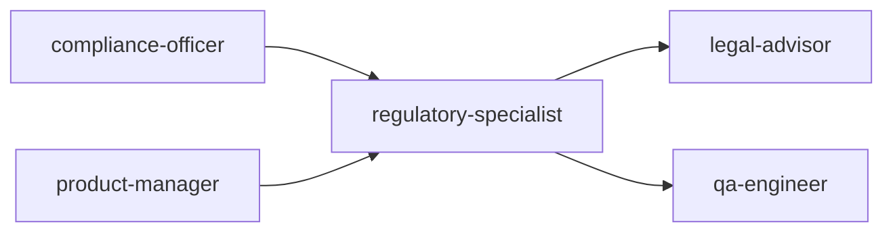

# Scale Depth

<!-- QUICK: 30s -- find your team size column -->
### Solo (1 person, 0-100 users)
Regulatory compliance by founder reading FDA guidance docs. No QMS, no validation, no regulatory submissions. Class I self-declaration only. HIPAA: BAA templates from legal marketplace. No CE marking. Operate as "not a medical device" if defensible. Risk: must have regulatory strategy documented before first pilot. Cost: $0-500/month. Overkill: ISO 13485 certification, QMS software, 510(k) preparation, external regulatory counsel.

### Small (2-10 people, 100-10K users)
Regulatory consultant (10-20 hours/month) or fractional RA/QA lead. SaMD classification memo documented. QMS: paper-based or lightweight (Greenlight Guru Essentials). 510(k) or CE marking preparation begins. HIPAA: full BAA process, annual risk assessment, security rule compliance. Part 11: audit trail requirements designed in. Cost: $3K-10K/month. Overkill: full QMS software suite, multiple regulatory submissions in parallel, clinical trials.

### Medium (10-50 people, 10K-1M users)
In-house RA/QA specialist or dedicated consulting firm. QMS: electronic (Greenlight Guru, Qualio, MasterControl). 510(k) submitted or CE marking technical file under review. ISO 13485 certification. HIPAA: annual assessments, breach simulation exercises. Validation: GAMP 5 framework applied. Regulatory affairs capability: EU MDR transition, UKCA, TGA, Health Canada. Cost: $10K-50K/month.

### Enterprise (50+ people, 1M+ users)
RA/QA department (3-10+). QMS: enterprise (Veeva Vault, TrackWise, Sparta). Multiple cleared/approved devices across FDA, EU MDR, and international markets. Post-market surveillance: complaint handling, adverse event reporting (MDR, MEDDEV 2.12). Clinical evaluation reports (CER) per MEDDEV 2.7.1 Rev 4. Design controls integrated with product development. Regulatory intelligence: monitoring global changes. Cost: $100K-500K+/month.

### Transition Triggers
| From → To | Trigger | What to Change |
|-----------|---------|----------------|
| Solo → Small | Product confirmed as medical device by regulatory assessment; preparing first regulatory submission | Hire regulatory consultant; document QMS; begin 510(k) or CE Marking technical file |
| Small → Medium | First regulatory submission filed; QMS audit scheduled (FDA/Notified Body) | Implement electronic QMS; hire RA/QA specialist; pursue ISO 13485 |
| Medium → Enterprise | Multiple cleared devices; international expansion (>3 markets); post-market surveillance required | Build RA/QA department; implement Veeva/TrackWise; establish regulatory intelligence; CER/PMS programs |


### Cross-skills Integration

Run skills in the order shown:
```bash
# Chain A: compliance-officer → regulatory-specialist → legal-advisor
# Chain B: product-manager → regulatory-specialist → qa-engineer
```
