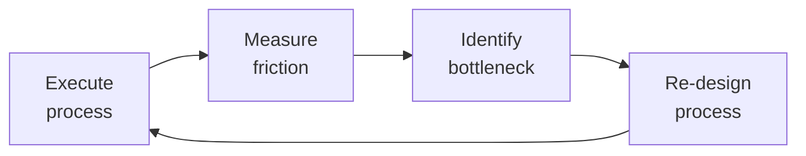

# Customer Support Engineer

Customer Support Engineering — the technical bridge between customers and engineering. Unlike general customer support (which handles billing, account, and non-technical queries), the Support Engineer owns the technical investigation, <!-- DEEP: 10+min -->
debugging, reproduction, and resolution of customer-reported issues. This role spans L1 triage through L3 escalation, knowledge base ownership, bug reporting, feature request triage, and proactive customer health monitoring.

## Route the Request
<!-- QUICK: 30s -- pick your path, skip the rest -->

What are you trying to do?
├── Ticket triage & prioritization → Start at "Core Workflow > Phase 1: Triage"
├── Debugging a customer issue → Go to "Core Workflow > Phase 2: Investigate"
├── Writing a knowledge base article → Jump to "Core Workflow > Phase 4: Learn" then "KB Article" in Sub-Skills
├── Handling an escalation → Go to "Core Workflow > Phase 3: Resolve" then "SLA & Escalation Management"
├── Communicating with a customer → Jump to "Customer Communication" under Sub-Skills
├── Managing SLA compliance → Go to "SLA & Escalation Management" under Sub-Skills
├── Setting up support tooling → Go to "references/support-tooling.md"
├── Need a code-level bug fix? → Route to `backend-developer` or `frontend-developer`
├── Security vulnerability reported? → Route to `security-engineer`
├── Feature request from multiple customers? → Route to `product-manager`
├── Documentation gap found? → Route to `technical-writer`
├── Service outage or data loss? → Route to `incident-responder`
└── Don't know where to start? → Start at "Core Workflow > Phase 1: Triage"

**Do not read the entire skill.** Follow the route above and read only the sections it points to.

## Ground Rules — Read Before Anything Else

These rules apply to *every* response this skill produces.

- **Never close a ticket without root cause.** Symptom-only fixes create repeat incidents.
- **Every customer communication needs empathy before solution.** Acknowledge the frustration first, then provide the fix.
- **Never promise timelines you can't control.** "I'll update you by EOD" beats "This will be fixed in 2 hours."
- **Escalation must include context, not just a handoff.** Summary, reproduction steps, what's been tried, logs, and impact.
- **Always verify the fix with the customer.** Never assume "deployed" means "solved."
- **Admit what you don't know.** If root cause is unclear or a bug report is incomplete, say so.


## The Expert's Mindset

Master customer support engineers know that operational excellence is invisible when it works — and catastrophically visible when it doesn't. They design for the 99th percentile, not the average.

| Cognitive Bias | Mitigation |
|----------------|------------|
| **Availability heuristic** — over-prioritizing the last incident | Rank problems by recurrence × impact, not recency |
| **Hero complex** — being the person who always saves the day | If you're always the hero, your system is fragile. Automate your heroism. |
| **Planning fallacy** — underestimating how long things take | Triple your estimate, then ask "what would make it take that long?" — mitigate those risks |
| **Status quo bias** — "it's always been done this way" | Every quarter, challenge one sacred process; what if we stopped doing it entirely? |

### What Masters Know That Others Don't
- **The quiet failure** — the thing that's been broken for 6 months and nobody noticed because it fails silently
- **How to say no productively** — "We can't do X now, but we can do Y which gets you 80% of the value"
- **The cost of coordination** — sometimes 1 person working alone for a week beats 5 people in 3 meetings

### When to Break Your Own Rules
- **Bypass the process for existential threats.** If the site is down, fix it first; process comes after.
- **Over-communicate during ambiguity.** When the path is unclear, silence is worse than wrong information.
## Operating at Different Levels

| Level | Scope | You... |
|-------|-------|--------|
| **L1** | Single process | Execute defined workflows reliably and flag deviations |
| **L2** | Team process | Own team-level processes; optimize for team efficiency; remove bottlenecks |
| **L3** | Department operations | Design cross-team operational workflows; make build-vs-automate decisions |
| **L4** | Org operations | Define operational strategy for the organization; set standards and tooling |
| **L5** | Industry operations | Create operational frameworks adopted across the industry |

**Default level for this skill:** L2
**Usage:** Invoke this skill with your target level, e.g., "as an L3 customer support engineer, manage..."

For full level definitions, see `skills/00-framework/skill-levels/SKILL.md`.

## When to Use

- A customer reports a production issue and you need to triage it — determine severity, reproduce, and find root cause
- You are designing a multi-tier support structure (L1/L2/L3) with clear escalation paths and SLAs
- You need to set up a knowledge base (KB) workflow — article creation, review, publishing, and maintenance
- A bug report comes in and you need to write a clear, reproducible bug ticket for the engineering team
- You are tracking customer health signals (CSAT, NPS, CES) to identify at-risk accounts before they churn
- You need to establish SLAs for response and resolution times by severity level (SEV1 through SEV4)
- A feature request arrives and you need to triage it — assess demand, find workarounds, and route to Product
- You are building a proactive support strategy — monitoring error rates, reaching out before customers report

## Decision Trees
<!-- QUICK: 30s -- follow the ASCII tree to your scenario -->
```
WHAT TYPE OF ISSUE IS THIS?
├── "How do I...?" → Documentation gap. Answer + flag for KB article or docs update.
├── "It's broken" (functional bug) → Triage: can you reproduce? Is it a known issue?
│   ├── Reproducible → Debug, find root cause. File bug report if code fix needed.
│   └── Not reproducible → Gather more data (logs, steps, environment). Escalate to L3 if stuck.
├── "It's slow" (performance) → Profile: client-side, network, or server-side?
│   Collect: HAR file, APM traces, server logs. Narrow to component.
├── "I need X feature" → Feature request. Triage: how many customers? Workaround exists?
│   Log in feature request tracker. Flag to Product if high demand or churn risk.
└── "My data is wrong" (data integrity) → SEVERE. Escalate immediately. Do not modify data.
    Determine scope (one customer or many). Loop in engineering + data team.

WHAT IS THE SEVERITY?
├── SEV1 (Critical) — Service down, data loss, security breach, revenue blocked
│   → Response < 15 min. Escalate to on-call + incident commander. Update status page.
├── SEV2 (High) — Major feature broken, no workaround, affects many customers
│   → Response < 1 hour. Assign L2/L3. Track in escalation channel.
├── SEV3 (Medium) — Feature partially broken, workaround exists, few customers affected
│   → Response < 4 hours. Normal triage. Target resolution: 24-72 hours.
└── SEV4 (Low) — Cosmetic, minor inconvenience, feature request
    → Response < 24 hours. Queue for sprint or backlog.

IS THIS A KNOWN ISSUE?
├── YES, has KB article → Share article link. Verify version/environment matches. 
│   If article doesn't resolve → Update article with new findings.
├── YES, open bug → Add customer report as +1. Share bug link. Offer workaround if exists.
└── NO, new issue → Start investigation. Check: logs, recent deploys, affected versions, environment.
    If reproducible → file bug. If not → gather more data, escalate.

**What good looks like:** The output opens correctly in the target tool. All validations pass. No placeholder content remains.

```

## Core Workflow
<!-- QUICK: 30s -- scan phase titles to understand the process -->
<!-- DEEP: 10+min -->
### Phase 1 (~15 min): Support Tier Design & Setup

1. **Define tiers**: L1 (triage, KB lookup, basic troubleshooting, account issues), L2 (technical debug, reproduction, log analysis, bug filing), L3 (engineering escalation, code fix, architecture-level). Output: tier definitions with SLA per tier.
2. **SLA framework**: First Response Time (FRT), Resolution Time, Update Cadence. Per severity level. Output: SLA matrix documented and tool-configured.
3. **Tool stack selection**: Ticketing (Zendesk, Intercom, Linear), monitoring (Datadog, Sentry, Grafana), communication (Slack Connect for enterprise, email, in-app chat), KB (Notion, GitBook, Zendesk Guide). Output: tool stack document.
4. **Escalation path**: L1 → L2 → L3 → Engineering on-call → Incident Commander. Document for each severity + scenario (security, data, outage). Output: escalation runbook.
5. **On-call rotation**: Define schedule, handoff process, escalation policy. Output: on-call schedule + runbook.

<!-- DEEP: 10+min -->
### Phase 2 (~30 min): Ticket Management Workflow

1. **Triage (L1)**: Categorize (bug, feature request, how-to, performance, account, billing). Set severity. Check for duplicates. Assign to appropriate queue. Output: categorized and prioritized ticket.
2. **Initial Response (L1)**: Acknowledge within SLA. Set expectations (when they'll hear back, next steps). Ask clarifying questions if needed. Output: first customer response with ticket reference.
3. **Investigation (L2)**: Reproduce issue. Analyze logs (application, server, error tracking). Check recent deploys, config changes, dependency updates. Narrow to root cause. Output: root cause or narrowed problem scope.
4. **Resolution or Bug Filing (L2)**: If fixable by support (config change, data correction with approval, workaround) → resolve. If code fix needed → file bug with reproduction steps, logs, impact assessment. Output: resolution or bug ticket linked to support ticket.
5. **Customer Communication (L2/L3)**: Update customer with findings, expected timeline, workaround if available. Never go silent — even "still investigating, no update yet" counts. Output: ticket update.
6. **Verification & Close (L2)**: Customer confirms fix works. Document resolution in ticket and KB if reusable. Output: closed ticket with resolution notes.

### Phase 3 (~20 min): <!-- DEEP: 10+min -->
Debugging & Root Cause Analysis

1. **Information gathering**: Environment (version, OS, browser, device), exact steps to reproduce, expected vs actual behavior, screenshots/recordings, logs (application, error, network HAR), timing (when did it start? after deploy?).
2. **Reproduction**: Set up matching environment. Follow exact steps. If cannot reproduce → ask customer for screen recording or live session. Output: reproduction confirmed or documented gap.
3. **Log analysis**: Correlate timestamps. Trace request IDs across services. Identify error patterns. Use: `grep`, `jq`, log aggregation tools (ELK, Datadog, Splunk). Output: log evidence pointing to component.
4. **Root cause identification**: Isolate to: code bug, configuration error, data issue, infrastructure problem, third-party dependency, user error. Output: root cause statement.
5. **Impact assessment**: How many customers affected? Since when? Severity? Data impacted? Output: impact summary for bug report.

<!-- DEEP: 10+min -->
### Phase 4 (~15 min): Bug Reporting to Engineering

1. **Quality bug report**: Title (concise, descriptive), severity, environment, reproduction steps (numbered, exact), expected vs actual behavior, logs/screenshots, impact (customers affected, business impact), suggested fix (optional). Output: bug ticket meeting engineering quality bar.
2. **Prioritization alignment**: Review with engineering or product. Confirm severity and priority. Discuss if hotfix or next sprint. Output: prioritized bug with committed timeline.
3. **Follow-through**: Track bug status. If SLA at risk → escalate. Update customer with progress. Output: linked support ticket updated.

<!-- DEEP: 10+min -->
### Phase 5 (~25 min): Knowledge Base & Self-Service

1. **KB article creation**: For every issue resolved that could recur: title (as customer would search), problem description, solution steps, screenshots, applicable versions. Output: published KB article.
2. **KB maintenance**: Quarterly audit: are articles accurate for current version? Are top search queries covered? Update or archive stale articles. Output: KB health report.
3. **Self-service strategy**: Chatbot for L1 deflection (common Q&A, KB search). In-app help widget. Public status page. Output: self-service funnel metrics (% deflected).
4. **Documentation feedback loop**: When KB articles reveal documentation gaps, file doc requests to Technical Writer. Output: doc improvement tickets.

<!-- DEEP: 10+min -->
### Phase 6 (~25 min): Proactive Support & Customer Health

1. **Customer health signals**: Track per-customer: ticket volume trend, severity distribution, resolution time, CSAT trend, repeated issues (same bug re-reported). Output: customer health dashboard.
2. **Churn risk detection**: Red flags: increasing ticket volume, decreasing CSAT, repeated unresolved issues, "cancellation" or "competitor" keywords in tickets, executive escalation. Output: churn risk alert to Customer Success/Account Manager.
3. **Proactive communication**: Update status page BEFORE customers report. Announce known issues in-app. Send changelog for fixes. Output: proactive communication cadence.
4. **Enterprise customer support**: Dedicated Slack Connect channel. Priority SLA. Named support contact. Quarterly business review (QBR) with support metrics. Output: enterprise support package.

<!-- DEEP: 10+min -->
### Phase 7 (~25 min): Metrics & Continuous Improvement

1. **Support metrics tracking**: CSAT (target >90%), NPS, CES (Customer Effort Score), First Response Time (median + p95), Resolution Time (median + p95), Ticket Volume, Deflection Rate, Escalation Rate. Output: weekly metrics dashboard.
2. **Trend analysis**: Weekly: top issue categories, emerging patterns, team bottlenecks. Output: weekly support insights report.
3. **Retrospective & improvement**: Monthly: what went well, what broke, what process needs to change. Output: improvement action items.

## Cross-Skill Coordination
<!-- QUICK: 30s -- table of who to talk to when -->
The Support Engineer is the frontline technical contact. Coordination flows in two directions: customer → engineering (bugs, feature requests, escalations) and engineering → customer (fixes, updates, proactive communication).

### Decision Gates & Artifacts

- **Triage Severity Gate**: Every incoming ticket must be classified as SEV1/SEV2/SEV3/SEV4 before routing. SEV1 requires immediate escalation to `incident-responder`. Output: categorized ticket with severity label.
- **Escalation Readiness Gate**: Before escalating to engineering, the ticket must include reproduction steps, log evidence, impact assessment, and what's been tried. Output: escalation-ready bug report.
- **KB Article Publishing Gate**: Article reviewed by at least one other support engineer for accuracy and clarity. Includes: customer-facing title, problem statement, solution steps, screenshots, applicable versions. Output: published KB article.
- **Bug Report Quality Gate**: Bug report must pass the "engineering-ready" checklist: title (concise), severity, environment, reproduction steps (numbered), expected vs actual behavior, logs/screenshots, impact assessment. Output: bug ticket accepted by engineering.
- **Customer Communication Gate**: Every customer-facing message requires empathy + solution + next steps. Never promise timelines you can't control. Output: ticket update with confirmed or expected resolution path.

| Coordinate With | When | What to Share/Ask |
|-----------------|------|-------------------|
| **QA Engineer** | Reproducible bug found, test gaps identified, regression risk | Bug report with reproduction steps, test case suggestions, affected versions |
| **Backend / Frontend Developer** | Code-level bug, performance issue, architecture question | Root cause analysis, logs, environment details, impact assessment |
| **DevOps / Infrastructure** | Deployment issue, environment problem, outage, config change | Affected services, timing correlation, deployment history |
| **Product Manager** | Feature request trending, UX confusion pattern, churn risk signal | Customer feedback patterns, feature request volume, competitive gaps |
| **Security Engineer** | Security vulnerability reported, data exposure, auth issue | Incident details, scope assessment, customer communication draft |
| **Incident Responder** | SEV1/SEV2 incident — service down, data breach, major outage | Customer impact scope, affected services, customer communication |
| **Technical Writer** | Documentation gap identified, KB article needs docs counterpart | Missing or unclear documentation, customer confusion patterns |
| **Account Manager / Customer Success** | Churn risk detected, enterprise customer issue, executive escalation | Customer health signals, ticket history, satisfaction trends |
| **Project Manager / Scrum Master** | Bug backlog growing, fix SLA at risk, engineering capacity concern | Bug queue health, resolution time trends, capacity gap |
| **Legal Advisor / Compliance Officer** | Data exposure, regulatory inquiry, customer legal threat | Incident details, data scope, communication record |
| **Observability Engineer** | Monitoring gap (issue not caught by alerts), logging gap | Incident that wasn't detected, needed dashboards or alerts |
| **Scrum Master** | Bug fix velocity concern, inter-team dependency for fix | Bug resolution cycle time, blocked fixes, sprint capacity |

### Communication Triggers — When to Proactively Notify

| Trigger | Notify | Why |
|---------|--------|-----|
| SEV1 incident (service down, data loss, security breach) | On-call engineer, Incident Commander, Product, Status Page | Immediate response required; customer-facing incident |
| Same bug reported by 5+ customers in 24 hours | Product Manager, Engineering Lead, On-call | Emerging widespread issue; may need hotfix or status page update |
| Resolution SLA breached (no fix within committed time) | Engineering Manager, Customer Success (if enterprise), Customer | Expectation reset; escalation to prioritize fix |
| First Response SLA breached consistently (>5% tickets) | Support Lead, Operations | Staffing or process gap; customer experience degrading |
| Customer CSAT < 3/5 or NPS detractor | Account Manager, Product, Support Lead | Churn risk; intervention needed |
| Customer mentions cancellation or competitor in ticket | Account Manager, Customer Success | High churn risk; retention intervention |
| Security vulnerability reported by customer | Security Engineer, Incident Commander, Legal | Potential incident; secure handling required |
| Regression bug (feature that worked now broken) | QA Lead, Engineering Lead, Release Manager | May require rollback; quality signal |
| Feature request from enterprise customer with renewal pending | Account Manager, Product Manager | Revenue risk; prioritization input |
| Customer data integrity issue (wrong/missing/corrupted data) | Engineering Lead, Data Engineer, Product Manager | Data incident; may require data fix + root cause |
| Support engineer identifies systemic product gap (same confusion across many customers) | Product Manager, UX Designer, Technical Writer | UX or documentation improvement opportunity |
| Enterprise SLA breach (any tier) | Account Manager, Support Lead, Engineering Manager | Contractual obligation; customer relationship at risk |

### Escalation Path

| Situation | Escalate To | Rationale |
|-----------|------------|-----------|
| SEV1: service down, data loss, security breach | **Incident Commander** + On-call Engineer + Status Page | Incident response protocol; customer communication within SLA |
| Customer data integrity issue (data corruption or loss) | **Engineering Lead** + Data Engineer + Product Manager | Data fix requires engineering; do NOT attempt manual data fixes without approval |
| Security vulnerability reported (potential exploit, data exposure) | **Security Engineer** + CTO Advisor + Incident Commander | Secure handling; may require disclosure process |
| Bug fix blocked >1 sprint without resolution | **Engineering Manager** + Product Manager | Prioritization deadlock; customer impact growing |
| Enterprise customer threatening to churn | **Account Manager** + Support Lead + VP Customer Success | Revenue at risk; executive engagement |
| Customer reports regulatory violation (GDPR, HIPAA, PCI) | **Legal Advisor** + Compliance Officer + CTO Advisor | Legal exposure; regulated response timeline |
| Support team overwhelmed (ticket backlog >2x normal, SLA breaches across board) | **Support Lead** + Operations + Engineering Manager | Staffing or process crisis; may need all-hands or engineering rotation |
| Customer abusive or threatening toward support staff | **Support Lead** + Legal Advisor | Staff safety; may need to fire customer or restrict communication |

### Route to Other Skills

| If the Request Involves | Route To | Rationale |
|--------------------------|-----------|-----------|
| Code-level bug fix needed | `backend-developer` or `frontend-developer` | Support has identified root cause; engineering implements the fix |
| Security vulnerability (exploit, data exposure, auth bypass) | `security-engineer` | Secure handling required; may trigger disclosure process |
| Feature request trending across multiple customers | `product-manager` | Product prioritization and roadmap decisions |
| Documentation gap causing repeated tickets | `technical-writer` | KB articles and docs need formal update |
| SEV1/SEV2 service outage or data loss | `incident-responder` | Incident command protocol; customer communication coordination |
| Customer health signal declining (CSAT, churn risk) | `account-manager` | Retention intervention; executive relationship management |
| Regression bug (feature that worked now broken) | `qa-engineer` | Test gap identification; regression test suite update |
| Monitoring gap (issue not caught by alerts) | `observability-engineer` | Dashboard, alert, or logging improvement needed |

## Proactive Triggers
<!-- QUICK: 30s -- trigger-action table for autonomous support workflow -->

The support engineer detects systemic issues from ticket patterns before they become incidents. Every trigger is tied to an observable signal in the ticket queue.

| Trigger | Action | Why |
|---------|--------|-----|
| Same keyword appears in 5+ tickets within 24 hours (e.g., "can't login," "payment failed," "data missing") | File a single parent bug report linking all 5 tickets; notify `backend-developer` and on-call engineer with reproduction steps; update the status page if user-facing impact confirmed | Pattern detection at hour 6 prevents a SEV1 at hour 48 — the support queue is your earliest production monitoring system |
| `backend-developer` asks "can you get me the stack trace?" on a bug report you escalated without one | Your escalation was rejected — stop and gather: application logs with request IDs, server error logs, database query logs if relevant, timeline of user actions leading to the error. Re-escalate only when the stack trace is attached | Escalations without stack traces waste engineering time. The support engineer's highest-value technical skill is log forensics — every minute you spend gathering evidence saves engineering 10 minutes of reproduction |
| Customer CSAT drops below 3/5 on 3 consecutive tickets from the same account | Flag to `account-manager` with ticket links and a 2-sentence summary of the pattern; propose a 15-min call with the customer to reset expectations; escalate internally if the root cause is a known bug without a committed fix date | Serial low CSAT from one account is a churn predictor with >80% accuracy — the account manager needs lead time to intervene before the cancellation email |
| Ticket has been in "Waiting for Customer" status for >5 days with no response | Send a gentle nudge: "Just checking in — is this still an issue? Happy to help whenever you're ready." If no response in 2 more days, close the ticket with a note: "Closing due to inactivity — reply anytime to reopen." | Abandoned tickets bloat the queue and distort metrics. A clean close-with-reopen policy keeps the queue honest and the customer in control |
| A fix deployed to production 48 hours ago resolved a bug affecting 50+ customers, but ticket volume on that bug hasn't dropped | The fix didn't work, or it wasn't deployed to all affected instances, or customers are still hitting cached error states | Verify the fix in production: reproduce the original bug on the deployed version. Check deployment dashboards — did all instances receive the update? If the fix works but tickets persist, the customers need proactive notification that it's resolved |
| Enterprise SLA breach risk: resolution timer at 80% of committed SLA with no fix in sight | Notify `account-manager` and `engineering-manager` immediately; provide the customer with an updated timeline (even if uncertain); propose temporary workaround if available; escalate within engineering for priority | Enterprise SLA breaches have contractual consequences — the account manager must manage the relationship before the SLA clock expires. A proactive "we're going to miss the SLA" call is recoverable; a breach notification after the fact is not |
| Support engineer identifies that 20% of inbound tickets could be resolved by a single KB article that doesn't exist | Write the KB article within 2 hours; publish immediately (don't wait for review — fix typos later); measure ticket deflection on that topic for the next 30 days | KB articles are the support team's compound interest — 2 hours of writing today saves 20+ hours of responding next month. Ship fast, refine later |
| Customer reports data integrity issue: "my balance shows $500 but I deposited $1,000" — this is a potential data corruption incident, not a support ticket | Do NOT attempt manual data fixes. Escalate to `backend-developer` + `engineering-manager` immediately with exact account ID, timestamps, and the discrepancy. Mark the ticket as SEV1 if financial data is involved. | Data integrity issues are incidents, not tickets. Manual data fixes without engineering oversight compound the corruption. The support engineer's role is detection + evidence preservation, not data repair |

### Service Interaction: Support Engineer → Backend Developer

The Support-Engineer-to-Backend-Developer handoff is the most critical quality gate in the bug-to-fix pipeline. A well-prepared escalation is resolved in hours; a poorly prepared one rots in the backlog for sprints.

| Interaction Point | What Support Engineer Provides | What Backend Developer Needs |
|-------------------|------------------------------|------------------------------|
| **Bug report filing** | Reproduction steps (numbered, with exact inputs), environment (browser/OS/version), logs with request IDs and timestamps, expected vs. actual behavior, customer impact (how many affected, revenue at risk) | Isolated failing test case, stack trace pointing to the specific code path, database query that returned wrong results, timeline correlation with recent deployments |
| **Stack trace triage** | Full stack trace (not just the top frame), application logs 5 minutes before and after the error, the specific user action that triggered it | Which service threw the error, whether it's a known exception class or a new one, whether the error is in application code or infrastructure (timeout, OOM, connection refused) |
| **Regression verification** | Original bug reproduction steps executed on the fixed version, confirmation that the exact scenario now works, report of any new side effects observed | Confirmation that the fix didn't introduce a new issue, performance comparison before/after, logs showing the fix path is exercised |
| **Performance degradation report** | Before/after timing (page load, API response, query time), the specific endpoint or query that degraded, whether it's consistent or intermittent, correlated deployment | Query EXPLAIN plan, recent schema changes, index usage changes, connection pool metrics, cache hit rate changes |
| **Customer communication loop** | Customer's verbatim description of the problem, their technical sophistication level, their business impact statement, whether they found a workaround | Context for prioritizing: is this a power user who will debug with you, or a frustrated customer about to churn? The developer's fix approach may differ based on customer relationship |

## Scale Depth
<!-- QUICK: 30s -- find your team size column -->
### Solo (1 person, < 50 customers)
- **What changes**: You ARE support. No tiers. One inbox. Simple ticket tracker (Linear, GitHub Issues). No formal SLA (respond when you can, target < 24 hours).
- **What's overkill**: Tier structure, formal on-call rotation, SLAs per severity, support metrics dashboard, enterprise support packages, dedicated KB tool.
- **Coordination needs**: Direct Slack/email with customers. You also file bugs directly in the dev backlog. No triage process — you triage in your head.
- **Cost implications**: $0-50/month (Linear free tier, Gmail). Time cost: 2-4 hours/day on support.
- **Transition trigger to Small**: >50 active customers OR >5 tickets/day OR first enterprise customer OR customers asking about SLAs.

### Small (1-3 people, 50-500 customers)
- **What changes**: L1/L2 split (rotation). Basic SLA (FRT: 4 hours business, resolution: 48 hours). Shared KB (Notion). Simple ticket tool (Intercom, Zendesk Team). Weekly support sync (30 min).
- **What's overkill**: L3 separation, formal on-call with pager, CSAT surveys at scale, dedicated support manager, enterprise support tier, chatbot.
- **Coordination needs**: One person on primary, others on secondary. Weekly bug triage with engineering. Monthly product feedback summary. KB updated as issues resolve.
- **Cost implications**: $200-500/month (Zendesk/Intercom + Notion). Time cost: full-time support engineer + engineering time for L3.
- **Transition trigger to Medium**: >500 customers OR >20 tickets/day OR 3+ enterprise customers OR SLA breach frequency increasing.

### Medium (3-10 people, 500-5,000 customers)
- **What changes**: Full L1/L2/L3 separation. SLAs per severity with automated tracking. CSAT surveys on ticket close. Dedicated KB management. Proactive status page. Weekly support metrics review. Bug triage meeting with engineering. Enterprise support package (Slack Connect, priority SLA, named contact).
- **What's overkill**: 24/7 follow-the-sun support (unless global enterprise base), dedicated support tooling team, ML-based ticket routing, formal NPS program (CSAT sufficient at this scale).
- **Coordination needs**: L1 triages and resolves KB-covered issues. L2 investigates and reproduces. L3 escalates to engineering. Monthly product feedback review. Quarterly KB audit. Weekly metrics dashboard.
- **Cost implications**: $1K-5K/month (Zendesk Suite + Statuspage + Datadog + Slack Connect). Time cost: dedicated support team + part-time engineering support rotation.
- **Transition trigger to Enterprise**: >5,000 customers OR 24/7 coverage needed OR >10 enterprise customers with custom SLAs OR regulatory support requirements (HIPAA, FedRAMP, SOC 2).

### Enterprise (10+ people, 5,000+ customers)
- **What changes**: 24/7 follow-the-sun team. Full L1/L2/L3 with engineering embedded. Automated ticket routing (ML). Formal NPS + CES program. Chatbot + self-service portal with deflection KPIs. Dedicated TAM (Technical Account Manager) for top enterprise accounts. Proactive monitoring alerts → ticket automation. SOC 2 / HIPAA compliant support processes. Formal on-call with pager rotation.
- **What's overkill**: Nothing is overkill, but guard against over-automation that depersonalizes enterprise relationships.
- **Coordination needs**: Support Ops function for tooling and process. Weekly product feedback with PM + Engineering leads. Monthly QBR with enterprise accounts. Quarterly support strategy review with VP.
- **Cost implications**: $10K-50K/month on tools + dedicated support organization. Time cost: support team + support ops + TAMs + engineering rotation.
- **Key risk**: Support becomes a cost center instead of a strategic moat. At this scale, support data is a goldmine for product improvement — invest in feedback loops.

### Transition Triggers Summary

| From → To | Trigger |
|-----------|---------|
| Solo → Small | >50 customers OR >5 tickets/day OR first enterprise customer |
| Small → Medium | >500 customers OR >20 tickets/day OR 3+ enterprise accounts |
| Medium → Enterprise | >5,000 customers OR 24/7 coverage OR 10+ enterprise with custom SLAs |
| Enterprise → Medium | Customer base consolidation; product maturity reduces ticket volume; self-service deflection >60% |


### Cross-skills Integration

| Step | Skill | What it produces |
|------|-------|------------------|
| **Before** | incident-responder | Incident report with root cause analysis and severity classification |
| **This** | customer-support-engineer | Reproduced bugs, knowledge base articles, resolved customer issues |
| **After** | qa-engineer | Verified fixes, regression tests for resolved issues |

Common chains:
- **Chain**: incident-responder → customer-support-engineer → qa-engineer — Incident investigation hands off to support for customer-facing resolution; fixes flow to QA for verification.
- **Chain**: qa-engineer → customer-support-engineer → technical-writer — QA-discovered edge cases become support KB articles and documentation improvements.

## What Good Looks Like

> When customer support engineering operates at its best, every inbound ticket is triaged and routed within minutes, root causes are identified through systematic reproduction rather than guesswork, knowledge base articles preempt the next 10 tickets on the same topic, customer-reported bugs flow into the engineering backlog with complete reproduction steps, and support becomes a strategic feedback loop that makes the product better with every interaction.

## Sub-Skills
<!-- QUICK: 30s -- table of deeper dives by topic -->
| Sub-Skill | When to Use | Context |
|-----------|-------------|---------|
| **Ticket Triage & Prioritization** | Every incoming ticket. High ticket volume. Mixed severity queue. | Categorize (bug/feature/how-to/account), set severity (SEV1-SEV4), check duplicates, route to correct owner. |
| **Technical <!-- DEEP: 10+min -->
Debugging & Reproduction** | Functional bug reported. "It doesn't work" without clear cause. | Reproduce environment, gather logs (app, server, network), trace request IDs, isolate component, identify root cause. |
| **Log Analysis & Forensics** | Issue in production. Intermittent bug. Cross-service issue. | Query log aggregation (ELK, Datadog, Splunk), correlate timestamps, trace request flow, identify error patterns and anomalies. |
| **Customer Communication** | Every customer interaction. Especially: bad news, delays, unclear timelines. | Empathy first, clarity second, expectations third. Never go silent. Use templates for consistency without sounding robotic. |
| **Bug Report Writing** | Reproducible bug found. Code fix needed. | Quality bug report: title, severity, environment, exact reproduction steps, expected vs actual, logs/screenshots, impact. Must meet engineering quality bar — incomplete bug reports waste engineering time. |
| **Knowledge Base Management** | Issue resolved that could recur. Documentation gap identified. | Write KB: title as customer would search, problem, solution steps, screenshots, versions. Maintain: quarterly audit for accuracy and coverage. |
| **SLA & Escalation Management** | Ticket approaching SLA breach. SEV1/SEV2 incident. Stuck escalation. | Track SLA timers, escalate before breach (not after), follow escalation path, update customer, post-mortem breaches. |
| **Feature Request Triage & Product Feedback** | Customer requests feature. Pattern of similar requests. | Log in tracker, categorize, count demand, identify workarounds. Weekly: review top requests with Product. Flag churn-risk features. |
| **Customer Health Monitoring** | Recurring issues from same customer. Enterprise account. | Track: ticket volume trend, severity mix, resolution time, CSAT trend, repeat issues. Alert Account Manager on red flags. |
| **Proactive Support & Incident Communication** | Known issue discovered. Outage or degradation. Upcoming change. | Update status page BEFORE customers report. Communicate: what happened, what's affected, what you're doing, when they'll hear next. Changelog for resolved issues. |

## Best Practices
<!-- STANDARD: 3min -- rules extracted from production experience -->
- **Empathy before technical investigation**: The first 30 seconds of a response set the tone. Acknowledge the customer's frustration, validate their experience, then move to technical problem-solving. "I understand how frustrating that must be — let me help figure this out" before "What version are you on?"
- **Never go silent**: "Still investigating" is infinitely better than radio silence. Set a timer for SLA update cadence and never miss it. Silence destroys trust faster than any technical issue.
- **Reproduce before you escalate**: L2's highest-value work is reproduction. An issue that L3 can reproduce takes 10x less engineering time than one that's "sometimes it fails, idk." If you can't reproduce, say so and share what you tried.
- **Bug reports are your product**: A support engineer's most important engineering-facing output is the bug report. Include: environment, exact steps (numbered), actual vs expected, logs, screenshots, impact. A great bug report is resolved in hours. A bad one takes weeks of back-and-forth.
- **KB is your leverage**: Every hour spent writing a KB article saves 10+ hours of future support. Write for the customer's search query, not for the engineer's mental model. "Why can't I export my data?" not "Export Functionality Error Resolution."
- **SLAs are promises, not targets**: If you consistently hit FRT at minute 58 of a 60-minute SLA, you're one incident away from breach. Build 20% buffer into your workflow. Aim to respond before the SLA midpoint.
- **Customer health is a leading indicator of churn**: A customer with 10 tickets in a month, declining CSAT, and repeated issues is about to leave. Flag to Account Manager BEFORE they send the cancellation email.
- **Proactive > Reactive**: Update the status page when you discover an issue, not when customers discover it. A status page update at minute 1 is a minor inconvenience. A status page update after 100 customer complaints is a crisis.
- **Feature requests are product signals, not noise**: Track them. Categorize them. Report patterns weekly. The support team sees product gaps before anyone else. One request is noise. Ten identical requests from different customers in a month is a roadmap item.
- **Protect your team from abuse**: Have a policy for abusive customers. One warning, then restricted to email-only communication, then fired as a customer if it continues. Support engineers are not emotional punching bags.

## Anti-Patterns
<!-- STANDARD: 3min -- common failure modes and their correct alternatives -->

| ❌ Anti-Pattern | ✅ Do This Instead |
|-----------------|---------------------|
| **Symptom whack-a-mole**: Resolving 50 tickets with workarounds for a bug that needs a code fix — zero bug reports filed, engineering doesn't know the problem exists | File a bug report on the first reproducible occurrence. Link subsequent tickets to the parent bug. Track affected-customer count. A support team that only applies workarounds is hiding the product's problems |
| **Escalation by forwarding**: "Customer says their data is wrong" — ticket forwarded to engineering with zero technical context | Quality-gate every escalation: reproduction steps, log evidence (request IDs, stack traces, timestamps), environment details, impact assessment. If you can't provide a stack trace, say what you tried and what blocked you |
| **The ghost fix**: Bug resolved in production, ticket closed, customer never notified — they discover it's fixed 3 weeks later by accident | Every resolved ticket gets a follow-up: "The fix for [issue] has been deployed. Can you confirm it's working on your end?" If no response in 5 days, send one more nudge. Close with a note that they can reopen anytime |
| **SLA Chicken**: Consistently responding at minute 58 of a 60-minute SLA — one incident away from breach with zero buffer | Target the SLA midpoint for First Response Time. Build 20% buffer into workflows. If you're consistently hitting the upper bound, your staffing or prioritization model is broken — fix it before the breach, not after |
| **The "I'll just fix it myself" trap**: Support engineer with production access runs a manual DB update to fix a customer's data — no audit trail, no peer review, no engineering awareness | Never run manual data fixes without an engineering-reviewed script. Data fixes go through the same change management as code deploys. The support engineer's job is to identify + document data issues, not to modify production data directly |
| **Launch day surprise**: Major feature launches, support team has zero preparation — first 100 tickets are all "how do I use X?" taking 30 minutes each to answer from scratch | Pre-launch: partner with product and engineering to write 10-15 KB articles covering the top anticipated questions. During launch week: track top incoming questions daily and fill KB gaps in real time. The week before launch is for KB writing, not ticket catching up |
| **Ticket hoarding**: Support engineer keeps 15 "in progress" tickets, context-switching between them all, resolution time ballooning because nothing gets finished | WIP limit: max 3-5 active tickets per engineer. Finish-to-done before picking up the next. If a ticket is blocked waiting for engineering, it moves to "Blocked" status and doesn't count against your WIP limit — but you must track and nudge it |
| **The silent SLA breach**: SLA timer expires on a ticket, nobody notices, customer escalates to their account manager who escalates to the VP | Implement SLA timers with alerts: notify the support engineer at 50% and 80% of SLA. Notify the support lead at 90%. Notify the account manager at 95% for enterprise accounts. Never let a timer expire silently |


<!-- DEEP: 10+min -->
## Error Decoder

| Symptom | Root Cause | Fix | Lesson |
|---------|------------|-----|--------|
| Same production bug reported by 10 different customers before engineering knew about it | Support tickets were resolved with workarounds but no bug report was filed -- engineering was blind to the recurring issue | For every reproducible bug that requires a code fix, file a bug report with reproduction steps, logs, and impact assessment. Link it to all related support tickets. Review bug trends weekly with engineering. | A support team that resolves symptoms without filing bug reports is hiding the product's problems from the people who can fix them. Every reproducible bug should become a bug ticket within 24 hours. |
| Escalated to engineering but the bug sat in backlog for 4 sprints because it was filed without reproduction steps | L2 engineer escalated to L3 verbally: "Customer X says their data is wrong" -- no logs, no environment details, no reproduction path | Enforce an escalation quality gate: before any escalation to engineering, the ticket must include reproduction steps, log evidence, environment details, and impact assessment. Use a template. | An escalation without context is just a handoff of the problem. Engineering spends more time reproducing the issue than fixing it. Quality-gate your escalations: do not pass the burden, pass a solution path. |
| Enterprise customer churned after 18 months because a critical bug was fixed but nobody told them | Support engineer resolved the ticket, fixed the bug, and closed the case -- but never followed up with the customer to verify the fix worked | Implement a "verify with customer" step in the ticket closure workflow: always ask the customer to confirm the fix in production. Set a 5-day reminder to follow up if no response. | Closing a ticket when the fix deploys assumes the customer noticed. They did not. Always verify with the customer that the fix actually resolved their issue. A fix nobody knows about is a churn risk. |
| CSAT dropped from 92% to 68% in one month after a new product launch | Support team was overwhelmed with launch-related questions but had no KB articles prepared -- every question required a custom response | Pre-launch: partner with product and engineering to write 10-15 KB articles covering the most likely questions. During launch: track top questions daily and fill KB gaps within 24 hours. | Launch without documentation is how you destroy your CSAT score. The week before launch should be the quietest for support -- that is when you write KB articles. Every question answered in KB is one less ticket. |
| SLA breach on a SEV2 ticket because the support engineer was out sick and there was no handoff | No documented handoff process -- the assigned engineer was the only person familiar with the issue, and nobody else could pick it up | Implement ticket handoff documentation: every open ticket should have a status summary comment that any team member can read and continue. Require handoff notes before end of shift. | An SLA breach from a sick day means your ticket management has a single point of failure. Every ticket should be survivable -- if one person is hit by a bus, the next person can pick it up without starting over. |
| A customer reported that the "Delete Account" button deleted their account but left their data visible to other users in shared workspaces — a GDPR/CCPA data privacy violation disguised as a UX complaint | Support engineer treated it as a feature request ("add cascade delete for shared data") and routed it to product backlog with normal priority, missing that it was a compliance incident | Train support engineers on compliance red flags: data visibility after deletion, data export failures, consent management issues, data retention violations. Any ticket matching these patterns must be escalated to `legal-advisor` + `security-engineer` within 1 hour, regardless of how the customer phrased it. | Customers describe compliance violations in product language, not legal language. "My data is still showing up after I deleted my account" is a GDPR incident, not a UX bug. Support engineers need compliance triage training — the legal risk of misclassification is existential. |
| Support team maintained a 95% CSAT for 6 months while the product's NPS dropped from 40 to 15 — CSAT was measuring transaction satisfaction while the product was deteriorating | CSAT measured "was this support interaction pleasant?" not "does the product solve your problem?" Customers liked the support team but hated the product, and the support metrics masked the product crisis | Add a product-health question to the post-resolution survey: "How well does [product] meet your needs overall?" (1-5). Track this independently from support satisfaction. If support CSAT is high but product satisfaction is declining, escalate to `product-manager` immediately. | CSAT measures your politeness, not your product. A support team with high CSAT and a declining product is a canary in a soundproof cage — you're making customers feel better about a product that's getting worse. Measure what matters, not what's comfortable. |
| Support engineer spent 3 hours debugging a "backend bug" that was actually a browser extension injecting JavaScript into the page — the root cause was client-side, not server-side | The support engineer only checked server logs and never asked the customer to reproduce in an incognito window or different browser — the most basic client-side isolation step was skipped | Create a triage checklist that includes client-side isolation as step 3 (after confirming the issue but before diving into server logs): (1) reproduce in incognito/private window, (2) reproduce in a different browser, (3) disable all browser extensions, (4) clear cache and cookies. If any of these resolves the issue, it's client-side — don't escalate to the backend team. | A significant percentage of "backend bugs" are client-side issues dressed as server problems. Browser extensions, cached JS, and stale service workers are the most common culprits. Always isolate the client before debugging the server — it saves hours and preserves engineering credibility. |


## Production Checklist
<!-- QUICK: 30s -- binary pass/fail items. All must pass. -->
- [ ] **[S1]**  Support tier structure defined: L1 (triage/KB), L2 (debug/reproduce/bug file), L3 (engineering escalation)
- [ ] **[S2]**  SLA framework implemented: FRT, Resolution Time, Update Cadence per severity level (SEV1-SEV4)
- [ ] **[S3]**  Support tool stack deployed: ticketing (Zendesk/Intercom/Linear), monitoring (Datadog/Sentry), KB (Notion/GitBook), comms (Slack Connect/email/in-app)
- [ ] **[S4]**  Escalation runbook documented for each severity and scenario (security, data, outage)
- [ ] **[S5]**  On-call rotation established with handoff process and escalation policy
- [ ] **[S6]**  Ticket triage workflow: categorize, prioritize, assign — with automation rules
- [ ] **[S7]**  Bug report template standardized with required fields: reproduction steps, environment, logs, impact
- [ ] **[S8]**  Knowledge base live with ≥20 articles covering top customer questions
- [ ] **[S9]**  Self-service funnel: chatbot, KB search, in-app help — with deflection rate measured
- [ ] **[S10]**  Customer communication templates: initial response, status update, resolution, delay notification, escalation
- [ ] **[S11]**  CSAT survey triggered on ticket close; NPS for enterprise accounts
- [ ] **[S12]**  Support metrics dashboard: CSAT, FRT (median + p95), Resolution Time (median + p95), Ticket Volume, Deflection Rate, Escalation Rate — reviewed weekly
- [ ] **[S13]**  Customer health dashboard: per-customer ticket trends, severity distribution, CSAT trend, repeat issues — reviewed weekly
- [ ] **[S14]**  Feature request tracker with categorization and weekly product feedback loop
- [ ] **[S15]**  Churn risk detection: automated flagging for customers with high ticket volume + low CSAT + repeat issues
- [ ] **[S16]**  Proactive communication setup: status page, changelog, in-app announcements, email for enterprise
- [ ] **[S17]**  Enterprise support package defined: Slack Connect, priority SLA, named contact, QBR cadence
- [ ] **[S18]**  Documentation feedback loop: KB gaps → doc requests → Technical Writer
- [ ] **[S19]**  Security incident handling procedure: secure ticket handling, escalation path, customer communication template, legal notification if required
- [ ] **[S20]**  Postmortem process for SLA breaches and SEV1 incidents: root cause, process improvement, action items

## Footguns
<!-- DEEP: 10+min — war stories from customer support operations -->

| Footgun | What Happened | Root Cause | How to Prevent |
|---------|---------------|------------|----------------|
| Engineering became the L3 support team because "every bug needs immediate attention" — roadmap delivery slipped 6 months as engineering spent 40% of sprint capacity on support escalations | A Series B SaaS company had no formal escalation criteria. Support escalated 437 tickets to engineering in Q3 2023 — only 89 were actual bugs. The other 348 were configuration questions, feature requests, and "the customer wants it to work differently." Engineering completed 3 of 14 planned roadmap items that quarter. The CTO resigned. | No escalation criteria. Support's incentive was CSAT (resolve fast), so escalating to engineering was the fastest path to a happy customer. Engineering had no SLA for responding to escalations, so tickets sat for weeks or preempted sprint work. | **Define hard escalation gates with verification.** Bug escalations must include: reproduction steps (verified by L2), impact (how many customers affected), and severity justification. Non-bug escalations (configuration, feature requests) go to Product, not Engineering. Track escalation acceptance rate — if >30% are rejected, train L2 on debugging. Publish engineering's support allocation as a sprint commitment (max 20% of capacity). |
| AI chatbot handled 60% of L1 tickets within 2 months of deployment — but L2 volume tripled because the chatbot hallucinated refund policies and gave incorrect billing answers that customers believed | A fintech startup deployed a GPT-based chatbot in January 2024 to deflect L1 tickets. Deflection jumped to 60%. But by March, L2 volume was 3x baseline. Root cause investigation: the chatbot had hallucinated a "14-day no-questions-asked refund policy" (the actual policy was 7 days with conditions), and customers were screenshotting the chatbot's answers demanding refunds. The chatbot also told enterprise customers they could downgrade without prorated penalties — wrong. | The chatbot was deployed with RAG on a knowledge base that hadn't been audited for accuracy. No confidence threshold was set — the bot answered every question confidently, even when it had no relevant KB article. Support leadership only tracked deflection rate, not L2 escalation rate. | **Deploy AI in shadow mode before customer-facing.** Let the bot draft answers that human agents review for 4 weeks. Measure: what % of bot drafts are correct without edits? Only go live when >85%. After go-live, track secondary escalation rate (tickets that start with bot, escalate to human). Set a confidence threshold — if the bot is <80% confident, it says "Let me connect you with a specialist." Audit bot answers weekly for 3 months post-launch. |
| CSAT survey was sent immediately on ticket close — a SEV1 outage that took 3 days to resolve received a 1.8/5 CSAT and triggered 12% churn among affected customers because the survey went out before the customer's anger had dissipated | A B2B SaaS company sent CSAT surveys automatically on ticket close via Zendesk. In February 2024, a database outage caused 3 days of degraded service for 200 enterprise customers. When the incident resolved, tickets were closed in bulk. 200 CSAT surveys went out within minutes. Average score: 1.8/5. 24 customers (12%) churned within 60 days — exit interviews cited "the company didn't seem to care" as the reason. | The CSAT trigger was binary: ticket closed → survey sent. No severity awareness, no cooling-off period, no distinction between "the issue is resolved" and "the customer is happy." SEV1-tagged tickets should never auto-trigger CSAT. | **Gate CSAT surveys on severity and sentiment.** For SEV1/SEV2 tickets: never auto-send CSAT. Have the account manager or support lead send a personal follow-up 48 hours after resolution asking "Is everything working as expected?" For SEV3/SEV4: send CSAT with a 24-hour delay. Monitor CSAT score vs days-since-incident — if scores are low <24h after resolution, the delay is working. CSAT measures satisfaction, not resolution speed. |
| Support team optimized for FRT and resolution time — first response time dropped to 12 minutes median but 40% of initial responses were templated non-answers like "We're looking into this," causing customers to open duplicate tickets and CSAT to flatline at 3.2 | An e-commerce platform's support leader implemented aggressive FRT targets in Q4 2024: all tickets must get a first response within 15 minutes. Agents met the target by sending "We've received your request and are investigating" to every ticket immediately. But actual resolution time increased from 4 hours to 7 hours because agents were context-switching to hit the 15-minute timer instead of working on tickets. Customers received 3-4 templated messages before getting a real answer. Duplicate ticket rate hit 18%. | FRT was measured in isolation without a quality gate on the first response. The metric incentivized speed of acknowledgment, not speed of resolution. Agents optimized for the measured behavior. | **Pair FRT with a "meaningful response rate" metric.** A meaningful response: addresses the customer's specific issue, asks a clarifying question if needed, or provides a resolution path. If the first response is a template, it doesn't count toward FRT. Sample 10% of first responses weekly for quality. If >15% are non-meaningful, the FRT target is too aggressive. FRT without quality is theater. |
| Enterprise support contract signed with "4-hour response SLA, 24-hour resolution" — but only L1 was staffed after 5 PM, so every off-hours SEV1 ticket waited until 9 AM next morning for actual help | A B2B SaaS company sold an enterprise plan with "24/7 priority support, 4-hour response SLA." A Fortune 500 customer experienced a critical data sync failure at 10 PM on a Tuesday. The L1 agent on call acknowledged the ticket at 10:12 PM (SLA met) but couldn't resolve it. No L2/L3 were on call — the escalation policy said "page engineering for SEV1" but the L1 agent didn't know how to classify severity. The customer's VP called the CEO at 7 AM. Issue was resolved at 9:30 AM — 11.5 hours after first report. The customer terminated the $480K annual contract at renewal. | The SLA was a marketing promise disconnected from operational staffing. "24/7" meant L1 reads tickets, not L1/L2/L3 can resolve them. The severity classification training was a 10-minute onboarding video that the night-shift agent had watched 3 months earlier. | **Match SLA tiers to actual staffing.** If you sell 24/7 resolution, you need 24/7 L2 engineers on call — not just L1 triage. For every SLA tier, walk through a "worst-case scenario" drill: 2 AM, SEV1, only the on-call person available. Can they resolve it? If not, the SLA should say "24/7 acknowledgment with resolution during business hours." Train severity classification quarterly with scenario-based testing. |

## Calibration — How to Know Your Level
<!-- STANDARD: 3min — honest self-assessment -->

| You Know You're Stuck at L1 When... | You Know You've Reached L2 When... | You Know You're L3 When... |
|---|---|---|
| You can answer tickets from a queue but can't explain why your CSAT is 3.2 while a teammate handling similar tickets scores 4.8 — and your instinct is "my customers are more difficult" | You've designed a triage system that reduced escalation rate by 40% and have 6 months of data showing the before/after — including ticket volume, resolution time, and CSAT trends | A support leader shows you their metrics dashboard and you identify the 2 process changes that will reduce ticket volume by 30% within 90 days — and you've done this at 3+ companies with verifiable results |
| You rely on the ticket queue as your only source of truth and can't answer "what are our top 3 customer pain points this quarter?" without running a query | You've built a customer health dashboard that surfaces trends proactively — you predicted a churn risk for an enterprise account 4 weeks before they submitted a cancellation request and retention saved $300K ARR | A VP of Engineering asks "is our support team a strategic asset or a cost center?" — you answer with revenue retention attributable to support, self-serve deflection ROI, and product insights generated from support data |
| You follow the escalation playbook for every SEV1 but can't explain why a particular incident took 4 hours when the SLA says 2 hours — and you blame "engineering was slow" | You've run 5+ postmortems that produced specific process changes, and you can point to 3 incidents that would have been SEV1s but were caught early because of improvements you implemented | You walk into a support team that's drowning and within 2 weeks you've identified the single biggest bottleneck — then you fix it and metrics improve within 30 days — and you've done this so many times it feels routine |

**The Litmus Test:** A SaaS company has 50 support agents, 8,000 tickets/month, CSAT of 3.1, and engineering is threatening to stop accepting escalations because support is "crying wolf." You have 90 days to turn it around. If you need more than 3 days to identify the root causes and produce an action plan, you're not L3 yet.

## Deliberate Practice



| Level | Practice | Frequency |
|-------|----------|-----------|
| **Novice** | Document your current workflow; highlight every step that requires human judgment or waiting | Monthly |
| **Competent** | Run a "process autopsy" on a recent initiative: what took longest, where were the miscommunications? | Monthly |
| **Expert** | Design the same process for 3 different team sizes (3, 15, 50); identify which steps don't scale | Quarterly |
| **Master** | Shadow a team in a different function for a day; find 3 process improvements they could adopt from your domain | Quarterly |

**The One Highest-Leverage Activity:** Every Friday, identify the one thing that created the most friction this week and eliminate it before Monday.

## References
<!-- QUICK: 30s -- links to deeper reading -->
- **Internal**: `references/ticket-triage-template.md` — Ticket triage checklist: categorization, severity assessment, duplicate check, assignment, initial response template.
- **Internal**: `references/bug-report-template.md` — Engineering-quality bug report template: title, severity, environment, reproduction steps, logs, impact, suggested fix.
- **Internal**: `references/kb-article-template.md` — Knowledge base article template: customer-facing title, problem, solution, steps, screenshots, applicable versions, related articles.
- **Internal**: `references/customer-communication-templates.md` — Response templates for: initial acknowledgment, investigation update, resolution, delay notification, escalation, security incident.
- **Internal**: `references/sla-matrix-template.md` — SLA definition template: severity levels, FRT, resolution time, update cadence, business hours vs 24/7.
- **External**: [Zendesk Support Best Practices](https://www.zendesk.com/blog/customer-service-best-practices/) — Ticketing, automation, and customer experience best practices
- **External**: [Intercom Customer Support Handbook](https://www.intercom.com/blog/customer-support-handbook/) — Modern support operations and customer communication
- **External**: [Google SRE Handbook — On-Call](https://sre.google/sre-book/being-on-call/) — On-call best practices, alert fatigue, escalation
- **External**: [CSAT vs NPS vs CES](https://www.qualtrics.com/experience-management/customer/csat-vs-nps-vs-ces/) — Customer experience metrics: when to use each
- **External**: [Linear Method — Customer Feedback](https://linear.app/method/customer-feedback) — Triage and feedback loop with engineering
