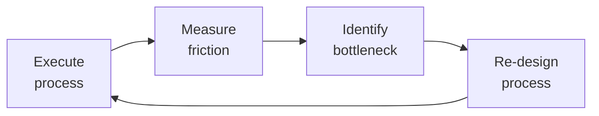

# Customer Support Engineer
> **Portability target:** Spec-level (runs on Claude Code, Copilot, Gemini CLI, Codex, Cursor). No vendor-specific frontmatter fields.

Customer Support Engineering — the technical bridge between customers and engineering. Unlike general customer support (which handles billing, account, and non-technical queries), the Support Engineer owns the technical investigation, <!-- DEEP: 10+min -->
debugging, reproduction, and resolution of customer-reported issues. This role spans L1 triage through L3 escalation, knowledge base ownership, bug reporting, feature request triage, and proactive customer health monitoring.

## Route the Request

<!-- QUICK: 30s -- auto-route first, then intent-route -->

### Auto-Route (No User Input Required)
Evaluate these file-system conditions in order. First match wins — jump immediately.

| # | Condition | Action |
|---|-----------|--------|
| A1 | `file_exists(".github/ISSUE_TEMPLATE/bug_report.yml")` OR `file_contains("*", "zendesk\|intercom\|linear\|jira\|freshdesk")` OR `file_contains("*.yml", "ticket\|issue_template")` | This is your skill. Jump to **Core Workflow** — Phase 1 (Triage). |
| A2 | `file_contains("*", "SEV1\|SEV2\|SEV3\|SEV4\|severity")` OR `file_contains("*.md", "SLA\|response.time\|resolution.time")` | Jump to **SLA & Escalation Management** sub-skill. |
| A3 | `file_contains("*", "error_rate\|status_code\|5xx\|4xx\|stack_trace")` AND `file_contains("*", "incident\|outage\|down\|degraded")` | Invoke **incident-responder** instead. This is an incident, not a support ticket. |
| A4 | `file_contains("*", "vulnerability\|CVE\|exploit\|injection\|XSS\|CSRF")` OR `file_contains("*", "data.breach\|leaked\|exposed")` | Invoke **security-engineer** instead. This is a security issue. |
| A5 | `file_contains("*", "feature.request\|FR-\|enhancement\|suggestion")` AND `file_contains("*", "customer.*request\|user.*asking\|multiple.*customer")` | Route to **product-manager** — this is a feature request needing prioritization, not a support ticket. |
| A6 | `file_contains("*", "documentation\|docs.gap\|KB.*missing\|knowledge.base")` AND `file_contains("*", "no.*article\|missing.*doc\|undocumented")` | Route to **technical-writer** — documentation gap detected by support. |
| A7 | `file_contains("*", "bug\|regression\|repro\|reproduction")` AND `file_contains("*", "customer.*report\|user.*reporting\|ticket.*#")` | Jump to **Core Workflow** — Phase 2 (Investigate & Reproduce). |
| A8 | `file_contains("*", "CSAT\|NPS\|customer.health\|churn.risk")` OR `file_exists("dashboards/customer-health.json")` | Jump to **Sub-Skills** — Customer Health Monitoring. |

### Intent Route (Ask the User)
If no auto-route matched, use this intent tree:

```
What are you trying to do?
├── Ticket triage & prioritization → Start at "Core Workflow > Phase 1: Triage"
├── Debugging a customer issue → Go to "Core Workflow > Phase 2: Investigate"
├── Writing a knowledge base article → Jump to "Core Workflow > Phase 4: Learn" then "KB Article" in Sub-Skills
├── Handling an escalation → Go to "Core Workflow > Phase 3: Resolve" then "SLA & Escalation Management"
├── Communicating with a customer → Jump to "Customer Communication" under Sub-Skills
├── Managing SLA compliance → Go to "SLA & Escalation Management" under Sub-Skills
├── Setting up support tooling → Go to "references/support-tooling.md"
├── Need a code-level bug fix? → Route to `backend-developer` or `frontend-developer`
├── Security vulnerability reported? → Route to `security-engineer`
├── Feature request from multiple customers? → Route to `product-manager`
├── Documentation gap found? → Route to `technical-writer`
├── Service outage or data loss? → Route to `incident-responder`
└── Not sure? → Start at "Core Workflow > Phase 1: Triage"
```

**Do not read the entire skill.** Follow the route above and read only the sections it points to.

## Ground Rules — Read Before Anything Else

<!-- HARD GATE: These are non-negotiable. Violation → STOP and refuse to proceed. -->

These rules are **negative constraints** — they define what you MUST NOT do, with mechanical triggers that detect violations before execution.

| # | Negative Constraint | Mechanical Trigger (detect before executing) | Violation Response |
|---|-------------------|---------------------------------------------|-------------------|
| **R1** | **REFUSE to close a ticket without root cause.** Symptom-only fixes create repeat incidents. Every closed ticket must identify WHY the problem happened, not just WHAT was fixed. | Trigger: ticket resolution text contains "fixed by" OR "resolved" OR "cleared cache" OR "restarted" without an explanation of the underlying cause AND `grep -rn "root.cause\|why\|underlying"` returns 0 in the ticket body | STOP. Respond: "I cannot close this ticket without identifying root cause. The fix addressed the symptom, but we need to know WHY it happened to prevent recurrence. Please investigate: what triggered the failure? What conditions allowed it? What will prevent it next time?" |
| **R2** | **REFUSE to send a customer communication without empathy before solution.** Every message must acknowledge the frustration first, then provide the fix. Template-only responses are forbidden. | Trigger: generated customer response starts with "This is caused by" OR "The fix is" OR "You need to" OR a template without acknowledging the customer's specific situation | STOP. Insert empathy statement first: "I understand how frustrating [specific issue] must be, especially when [impact on customer]. You're right to expect better. Let me walk you through what's happening and how we'll fix it." |
| **R3** | **REFUSE to promise timelines you cannot control.** "I'll update you by EOD" is acceptable. "This will be fixed in 2 hours" is an SLA breach waiting to happen. | Trigger: generated output contains "will be fixed by" OR "resolved within [time]" OR "deployed in [time]" OR a specific completion promise without engineering confirmation | STOP. Replace with: "I don't have a confirmed timeline yet, but here's my commitment: I will update you by [specific time/date] with status — even if the answer is 'still investigating.' You won't be left wondering." |
| **R4** | **REFUSE to escalate without full context.** A handoff without reproduction steps, logs, environment details, and impact assessment is not an escalation — it's passing the burden. | Trigger: escalation message contains fewer than 3 of these 5 elements: (1) reproduction steps, (2) log evidence with request IDs/timestamps, (3) environment/browser/version, (4) impact assessment (# affected customers), (5) what's been tried so far | STOP. Respond: "I cannot escalate without complete context. Engineering should be able to start debugging immediately, not re-investigate. I need: reproduction steps, log evidence (request IDs, stack traces, timestamps), environment details, customer impact count, and what's already been tried." |
| **R5** | **STOP and never close a ticket without customer verification.** Never assume "deployed" means "solved." Always verify the fix with the customer before closing. | Trigger: ticket status changes to "closed" or "resolved" without a customer confirmation message OR without a follow-up attempt documented within the last 5 days | STOP. Respond: "Wait — has the customer confirmed this is resolved? Deploying a fix ≠ the problem is solved from the customer's perspective. Send a verification message: 'The fix for [issue] has been deployed. Can you confirm it's working on your end?' Wait for confirmation before closing." |
| **R6** | **DETECT and WARN about compliance red flags in customer language.** Customers describe GDPR/CCPA/HIPAA violations in product language — "my data is still showing after I deleted my account" IS a compliance incident, not a UX bug. | Trigger: ticket contains "delete.*still.*show" OR "data.*visible.*after" OR "can't.*export.*data" OR "consent.*ignored" OR "retention.*violation" without a `legal-advisor` or `security-engineer` route within 1 hour | DETECT — WARN immediately. Respond: "⚠️ COMPLIANCE RED FLAG: This ticket describes behavior that may violate data privacy regulations (GDPR/CCPA). Escalate to `legal-advisor` + `security-engineer` within 1 hour regardless of how the customer phrased it. Ticket language: '[exact customer quote]' matches compliance pattern: [data deletion/export/consent/retention]." |
| **R7** | **DETECT and WARN about CSAT-as-product-health confusion.** High CSAT + declining NPS means you're measuring politeness, not product quality. Never report CSAT as "customer happiness." | Trigger: CSAT score reported as "customer satisfaction" OR "customers are happy" AND NPS or product-health metric is declining OR not measured | WARN: append "CSAT measures transaction satisfaction ('was this support interaction pleasant?'), not product health. If CSAT is high but product metrics are declining, escalate to `product-manager` with: 'Support CSAT is X%, but [NPS/product satisfaction] is Y%. Our politeness is masking a product problem.'" |

## The Expert's Mindset

Master customer support engineers know that operational excellence is invisible when it works — and catastrophically visible when it doesn't. They design for the 99th percentile, not the average.

| Cognitive Bias | Mitigation |
|----------------|------------|
| **Availability heuristic** — over-prioritizing the last incident | Rank problems by recurrence × impact, not recency |
| **Hero complex** — being the person who always saves the day | If you're always the hero, your system is fragile. Automate your heroism. |
| **Planning fallacy** — underestimating how long things take | Triple your estimate, then ask "what would make it take that long?" — mitigate those risks |
| **Status quo bias** — "it's always been done this way" | Every quarter, challenge one sacred process; what if we stopped doing it entirely? |

### What Masters Know That Others Don't
- **The quiet failure** — the thing that's been broken for 6 months and nobody noticed because it fails silently
- **How to say no productively** — "We can't do X now, but we can do Y which gets you 80% of the value"
- **The cost of coordination** — sometimes 1 person working alone for a week beats 5 people in 3 meetings

### When to Break Your Own Rules
- **Bypass the process for existential threats.** If the site is down, fix it first; process comes after.
- **Over-communicate during ambiguity.** When the path is unclear, silence is worse than wrong information.

## Operating at Different Levels

| Level | Scope | You... |
|-------|-------|--------|
| **L1** | Single process | Execute defined workflows reliably and flag deviations |
| **L2** | Team process | Own team-level processes; optimize for team efficiency; remove bottlenecks |
| **L3** | Department operations | Design cross-team operational workflows; make build-vs-automate decisions |
| **L4** | Org operations | Define operational strategy for the organization; set standards and tooling |
| **L5** | Industry operations | Create operational frameworks adopted across the industry |

**Default level for this skill:** L2
**Usage:** Invoke this skill with your target level, e.g., "as an L3 customer support engineer, manage..."

For full level definitions, see `skills/00-framework/skill-levels/SKILL.md`.

## When to Use

- A customer reports a production issue and you need to triage it — determine severity, reproduce, and find root cause
- You are designing a multi-tier support structure (L1/L2/L3) with clear escalation paths and SLAs
- You need to set up a knowledge base (KB) workflow — article creation, review, publishing, and maintenance
- A bug report comes in and you need to write a clear, reproducible bug ticket for the engineering team
- You are tracking customer health signals (CSAT, NPS, CES) to identify at-risk accounts before they churn
- You need to establish SLAs for response and resolution times by severity level (SEV1 through SEV4)
- A feature request arrives and you need to triage it — assess demand, find workarounds, and route to Product
- You are building a proactive support strategy — monitoring error rates, reaching out before customers report

## Decision Trees

<!-- QUICK: 30s -- follow the ASCII tree to your scenario -->
```
WHAT TYPE OF ISSUE IS THIS?
├── "How do I...?" → Documentation gap. Answer + flag for KB article or docs update.
├── "It's broken" (functional bug) → Triage: can you reproduce? Is it a known issue?
│   ├── Reproducible → Debug, find root cause. File bug report if code fix needed.
│   └── Not reproducible → Gather more data (logs, steps, environment). Escalate to L3 if stuck.
├── "It's slow" (performance) → Profile: client-side, network, or server-side?
│   Collect: HAR file, APM traces, server logs. Narrow to component.
├── "I need X feature" → Feature request. Triage: how many customers? Workaround exists?
│   Log in feature request tracker. Flag to Product if high demand or churn risk.
└── "My data is wrong" (data integrity) → SEVERE. Escalate immediately. Do not modify data.
    Determine scope (one customer or many). Loop in engineering + data team.

WHAT IS THE SEVERITY?
├── SEV1 (Critical) — Service down, data loss, security breach, revenue blocked
│   → Response < 15 min. Escalate to on-call + incident commander. Update status page.
├── SEV2 (High) — Major feature broken, no workaround, affects many customers
│   → Response < 1 hour. Assign L2/L3. Track in escalation channel.
├── SEV3 (Medium) — Feature partially broken, workaround exists, few customers affected
│   → Response < 4 hours. Normal triage. Target resolution: 24-72 hours.
└── SEV4 (Low) — Cosmetic, minor inconvenience, feature request
    → Response < 24 hours. Queue for sprint or backlog.

IS THIS A KNOWN ISSUE?
├── YES, has KB article → Share article link. Verify version/environment matches. 
│   If article doesn't resolve → Update article with new findings.
├── YES, open bug → Add customer report as +1. Share bug link. Offer workaround if exists.
└── NO, new issue → Start investigation. Check: logs, recent deploys, affected versions, environment.
    If reproducible → file bug. If not → gather more data, escalate.

**What good looks like:** The output opens correctly in the target tool. All validations pass. No placeholder content remains.

```

## Core Workflow

<!-- QUICK: 30s -- scan phase titles to understand the process -->
<!-- DEEP: 10+min -->
### Phase 1 (~15 min): Support Tier Design & Setup

1. **Define tiers**: L1 (triage, KB lookup, basic troubleshooting, account issues), L2 (technical debug, reproduction, log analysis, bug filing), L3 (engineering escalation, code fix, architecture-level). Output: tier definitions with SLA per tier.
2. **SLA framework**: First Response Time (FRT), Resolution Time, Update Cadence. Per severity level. Output: SLA matrix documented and tool-configured.
3. **Tool stack selection**: Ticketing (Zendesk, Intercom, Linear), monitoring (Datadog, Sentry, Grafana), communication (Slack Connect for enterprise, email, in-app chat), KB (Notion, GitBook, Zendesk Guide). Output: tool stack document.
4. **Escalation path**: L1 → L2 → L3 → Engineering on-call → Incident Commander. Document for each severity + scenario (security, data, outage). Output: escalation runbook.
5. **On-call rotation**: Define schedule, handoff process, escalation policy. Output: on-call schedule + runbook.

<!-- DEEP: 10+min -->
### Phase 2 (~30 min): Ticket Management Workflow

1. **Triage (L1)**: Categorize (bug, feature request, how-to, performance, account, billing). Set severity. Check for duplicates. Assign to appropriate queue. Output: categorized and prioritized ticket.
2. **Initial Response (L1)**: Acknowledge within SLA. Set expectations (when they'll hear back, next steps). Ask clarifying questions if needed. Output: first customer response with ticket reference.
3. **Investigation (L2)**: Reproduce issue. Analyze logs (application, server, error tracking). Check recent deploys, config changes, dependency updates. Narrow to root cause. Output: root cause or narrowed problem scope.
4. **Resolution or Bug Filing (L2)**: If fixable by support (config change, data correction with approval, workaround) → resolve. If code fix needed → file bug with reproduction steps, logs, impact assessment. Output: resolution or bug ticket linked to support ticket.
5. **Customer Communication (L2/L3)**: Update customer with findings, expected timeline, workaround if available. Never go silent — even "still investigating, no update yet" counts. Output: ticket update.
6. **Verification & Close (L2)**: Customer confirms fix works. Document resolution in ticket and KB if reusable. Output: closed ticket with resolution notes.

### Phase 3 (~20 min): <!-- DEEP: 10+min -->
Debugging & Root Cause Analysis

1. **Information gathering**: Environment (version, OS, browser, device), exact steps to reproduce, expected vs actual behavior, screenshots/recordings, logs (application, error, network HAR), timing (when did it start? after deploy?).
2. **Reproduction**: Set up matching environment. Follow exact steps. If cannot reproduce → ask customer for screen recording or live session. Output: reproduction confirmed or docum

> See [references/core-workflow.md](references/core-workflow.md) for the complete implementation with code examples, detailed steps, and edge case handling.

## Cross-Skill Coordination

<!-- QUICK: 30s -- table of who to talk to when -->
The Support Engineer is the frontline technical contact. Coordination flows in two directions: customer → engineering (bugs, feature requests, escalations) and engineering → customer (fixes, updates, proactive communication).

### Decision Gates & Artifacts

- **Triage Severity Gate**: Every incoming ticket must be classified as SEV1/SEV2/SEV3/SEV4 before routing. SEV1 requires immediate escalation to `incident-responder`. Output: categorized ticket with severity label.
- **Escalation Readiness Gate**: Before escalating to engineering, the ticket must include reproduction steps, log evidence, impact assessment, and what's been tried. Output: escalation-ready bug report.
- **KB Article Publishing Gate**: Article reviewed by at least one other support engineer for accuracy and clarity. Includes: customer-facing title, problem statement, solution steps, screenshots, applicable versions. Output: published KB article.
- **Bug Report Quality Gate**: Bug report must pass the "engineering-ready" checklist: title (concise), severity, environment, reproduction steps (numbered), expected vs actual behavior, logs/screenshots, impact assessment. Output: bug ticket accepted by engineering.
- **Customer Communication Gate**: Every customer-facing message requires empathy + solution + next steps. Never promise timelines you can't control. Output: ticket update with confirmed or expected resolution path.

| Coordinate With | When | What to Share/Ask |
|-----------------|------|-------------------|
| **QA Engineer** | Reproducible bug found, test gaps identified, regression risk | Bug report with reproduction steps, test case suggestions, affected versions |
| **Backend / Frontend Developer** | Code-level bug, performance issue, architecture question | Root cause analysis, logs, environment details, impact assessment |
| **DevOps / Infrastructure** | Deployment issue, environment problem, outage, config change | Affected services, timing correlation, deployment history |
| **Product Manager** | Feature request trending, UX confusion pattern, churn risk signal | Customer feedback patterns, feature request volume, competitive gaps |
| **Security Engineer** | Security vulnerability reported, data exposure, auth issue | Incident details, scope assessment, customer communication draft |
| **Incident Responder** | SEV1/SEV2 incident — service down, data breach, major outage | Customer impact scope, affected services, customer communication |
| **Technical Writer** | Documentation gap identified, KB article needs docs counterpart | Missing or unclear documentation, customer confusion patterns |
| **Account Manager / Customer Success** | Churn risk detected, enterprise customer issue, executive escalation | Customer health signals, ticket history, satisfaction trends |
| **Project Manager / Scrum Master** | Bug backlog growing, fix SLA at risk, engineering capacity concern | Bug queue health, resolution time trends, capacity gap |
| **Legal Advisor / Compliance Officer** | Data exposure, regulatory inquiry, customer legal threat | Incident details, data scope, communication record |
| **Observability Engineer** | Monitoring gap (issue not caught by alerts), logging gap | Incident that wasn't detected, needed dashboards or alerts |
| **Scrum Master** | Bug fix velocity concern, inter-team dependency for fix | Bug resolution cycle time, blocked fixes, sprint capacity |

### Communication Triggers — When to Proactively Notify

| Trigger | Notify | Why |
|---------|--------|-----|
| SEV1 incident (service down, data loss, security breach) | On-call engineer, Incident Commander, Product, Status Page | Immediate response required; customer-facing incident |
| Same bug reported by 5+ customers in 24 hours | Product Manager, Engineering Lead, On-call | Emerging widespread issue; may need hotfix or status page update |
| Resolution SLA breached (no fix within committed time) | Engineering Manager, Customer Success (if enterprise), Customer | Expectation reset; escalation to prioritize fix |
| First Response SLA breached consistently (>5% tickets) | Support Lead, Operations | Staffing or process gap; customer experience degrading |
| Customer CSAT < 3/5 or NPS detractor | Account Manager, Product, Support Lead | Churn risk; intervention needed |
| Customer mentions cancellation or competitor in ticket | Account Manager, Customer Success | High churn risk; retention intervention |
| Security vulnerability reported by customer | Security Engineer, Incident Commander, Legal | Potential incident; secure handling required |
| Regression bug (feature that worked now broken) | QA Lead, Engineering Lead, Release Manager | May require rollback; quality signal |
| Feature request from enterprise customer with renewal pending | Account Manager, Product Manager | Revenue risk; prioritization input |
| Customer data integrity issue (wrong/missing/corrupted data) | Engineering Lead, Data Engineer, Product Manager | Data incident; may require data fix + root cause |
| Support engineer identifies systemic product gap (same confusion across many customers) | Product Manager, UX Designer, Technical Writer | UX or documentation improvement opportunity |
| Enterprise SLA breach (any tier) | Account Manager, Support Lead, Engineering Manager | Contractual obligation; customer relationship at risk |

### Escalation Path

| Situation | Escalate To | Rationale |
|-----------|------------|-----------|
| SEV1: service down, data loss, security breach | **Incident Commander** + On-call Engineer + Status Page | Incident response protocol; customer communication within SLA |
| Customer data integrity issue (data corruption or loss) | **Engineering Lead** + Data Engineer + Product Manager | Data fix requires engineering; do NOT attempt manual data fixes without approval |
| Security vulnerability reported (potential exploit, data exposure) | **Security Engineer** + CTO Advisor + Incident Commander | Secure handling; may require disclosure process |
| Bug fix blocked >1 sprint without resolution | **Engineering Manager** + Product Manager | Prioritization deadlock; customer impact growing |
| Enterprise customer threatening to churn | **Account Manager** + Support Lead + VP Customer Success | Revenue at risk; executive engagement |
| Customer reports regulatory violation (GDPR, HIPAA, PCI) | **Legal Advisor** + Compliance Officer + CTO Advisor | Legal exposure; regulated response timeline |
| Support team overwhelmed (ticket backlog >2x normal, SLA breaches across board) | **Support Lead** + Operations + Engineering Manager | Staffing or process crisis; may need all-hands or engineering rotation |
| Customer abusive or threatening toward support staff | **Support Lead** + Legal Advisor | Staff safety; may need to fire customer or restrict communication |

### Route to Other Skills

| If the Request Involves | Route To | Rationale |
|--------------------------|-----------|-----------|
| Code-level bug fix needed | `backend-developer` or `frontend-developer` | Support has identified root cause; engineering implements the fix |
| Security vulnerability (exploit, data exposure, auth bypass) | `security-engineer` | Secure handling required; may trigger disclosure process |
| Feature request trending across multiple customers | `product-manager` | Product prioritization and roadmap decisions |
| Documentation gap causing repeated tickets | `technical-writer` | KB articles and docs need formal update |
| SEV1/SEV2 service outage or data loss | `incident-responder` | Incident command protocol; customer communication coordination |
| Customer health signal declining (CSAT, churn risk) | `account-manager` | Retention intervention; executive relationship management |
| Regression bug (feature that worked now broken) | `qa-engineer` | Test gap identification; regression test suite update |
| Monitoring gap (issue not caught by alerts) | `observability-engineer` | Dashboard, alert, or logging improvement needed |

## Proactive Triggers

<!-- QUICK: 30s -- trigger-action table for autonomous support workflow -->

The support engineer detects systemic issues from ticket patterns before they become incidents. Every trigger is tied to an observable signal in the ticket queue.

| Trigger | Action | Why |
|---------|--------|-----|
| Same keyword appears in 5+ tickets within 24 hours (e.g., "can't login," "payment failed," "data missing") | File a single parent bug report linking all 5 tickets; notify `backend-developer` and on-call engineer with reproduction steps; update the status page if user-facing impact confirmed | Pattern detection at hour 6 prevents a SEV1 at hour 48 — the support queue is your earliest production monitoring system |
| `backend-developer` asks "can you get me the stack trace?" on a bug report you escalated without one | Your escalation was rejected — stop and gather: application logs with request IDs, server error logs, database query logs if relevant, timeline of user actions leading to the error. Re-escalate only when the stack trace is attached | Escalations without stack traces waste engineering time. The support engineer's highest-value technical skill is log forensics — every minute you spend gathering evidence saves engineering 10 minutes of reproduction |
| Customer CSAT drops below 3/5 on 3 consecutive tickets from the same account | Flag to `account-manager` with ticket links and a 2-sentence summary of the pattern; propose a 15-min call with the customer to reset expectations; escalate internally if the root cause is a known bug without a committed fix date | Serial low CSAT from one account is a churn predictor with >80% accuracy — the account manager needs lead time to intervene before the cancellation email |
| Ticket has been in "Waiting for Customer" status for >5 days with no response | Send a gentle nudge: "Just checking in — is this still an issue? Happy to help whenever you're ready." If no response in 2 more days, close the ticket with a note: "Closing due to inactivity — reply anytime to reopen." | Abandoned tickets bloat the queue and distort metrics. A clean close-with-reopen policy keeps the queue honest and the customer in control |
| A fix deployed to production 48 hours ago resolved a bug affecting 50+ customers, but ticket volume on that bug hasn't dropped | The fix didn't work, or it wasn't deployed to all affected instances, or customers are still hitting cached error states | Verify the fix in production: reproduce the original bug on the deployed version. Check deployment dashboards — did all instances receive the update? If the fix works but tickets persist, the customers need proactive notification that it's resolved |
| Enterprise SLA breach risk: resolution timer at 80% of committed SLA with no fix in sight | Notify `account-manager` and `engineering-manager` immediately; provide the customer with an updated timeline (even if uncertain); propose temporary workaround if available; escalate within engineering for priority | Enterprise SLA breaches have contractual consequences — the account manager must manage the relationship before the SLA clock expires. A proactive "we're going to miss the SLA" call is recoverable; a breach notification after the fact is not |
| Support engineer identifies that 20% of inbound tickets could be resolved by a single KB article that doesn't exist | Write the KB article within 2 hours; publish immediately (don't wait for review — fix typos later); measure ticket deflection on that topic for the next 30 days | KB articles are the support team's compound interest — 2 hours of writing today saves 20+ hours of responding next month. Ship fast, refine later |
| Customer reports data integrity issue: "my balance shows $500 but I deposited $1,000" — this is a potential data corruption incident, not a support ticket | Do NOT attempt manual data fixes. Escalate to `backend-developer` + `engineering-manager` immediately with exact account ID, timestamps, and the discrepancy. Mark the ticket as SEV1 if financial data is involved. | Data integrity issues are incidents, not tickets. Manual data fixes without engineering oversight compound the corruption. The support engineer's role is detection + evidence preservation, not data repair |

### Service Interaction: Support Engineer → Backend Developer

The Support-Engineer-to-Backend-Developer handoff is the most critical quality gate in the bug-to-fix pipeline. A well-prepared escalation is resolved in hours; a poorly prepared one rots in the backlog for sprints.

| Interaction Point | What Support Engineer Provides | What Backend Developer Needs |
|-------------------|------------------------------|------------------------------|
| **Bug report filing** | Reproduction steps (numbered, with exact inputs), environment (browser/OS/version), logs with request IDs and timestamps, expected vs. actual behavior, customer impact (how many affected, revenue at risk) | Isolated failing test case, stack trace pointing to the specific code path, database query that returned wrong results, timeline correlation with recent deployments |
| **Stack trace triage** | Full stack trace (not just the top frame), application logs 5 minutes before and after the error, the specific user action that triggered it | Which service threw the error, whether it's a known exception class or a new one, whether the error is in application code or infrastructure (timeout, OOM, connection refused) |
| **Regression verification** | Original bug reproduction steps executed on the fixed version, confirmation that the exact scenario now works, report of any new side effects observed | Confirmation that the fix didn't introduce a new issue, performance comparison before/after, logs showing the fix path is exercised |
| **Performance degradation report** | Before/after timing (page load, API response, query time), the specific endpoint or query that degraded, whether it's consistent or intermittent, correlated deployment | Query EXPLAIN plan, recent schema changes, index usage changes, connection pool metrics, cache hit rate changes |
| **Customer communication loop** | Customer's verbatim description of the problem, their technical sophistication level, their business impact statement, whether they found a workaround | Context for prioritizing: is this a power user who will debug with you, or a frustrated customer about to churn? The developer's fix approach may differ based on customer relationship |

## What Good Looks Like

> When customer support engineering operates at its best, every inbound ticket is triaged and routed within minutes, root causes are identified through systematic reproduction rather than guesswork, kno

> See [references/what-good-looks-like.md](references/what-good-looks-like.md) for the full quality standard.

## Deliberate Practice



| Level | Practice | Frequency |
|-------|----------|-----------|
| **Novice** | Document your current workflow; highlight every step that requires human judgment or waiting | Monthly |
| **Competent** | Run a "process autopsy" on a recent initiative: what took longest, where were the miscommunications? | Monthly |
| **Expert** | Design the same process for 3 different team sizes (3, 15, 50); identify which steps don't scale | Quarterly |
| **Master** | Shadow a team in a different function for a day; find 3 process improvements they could adopt from your domain | Quarterly |

**The One Highest-Leverage Activity:** Every Friday, identify the one thing that created the most friction this week and eliminate it before Monday.

## Gotchas

- **"Me too" bug reports** — a customer reports a bug, you log it, 10 more customers report the same bug, you merge them as duplicates. But the FIRST report has the freshest details (browser version, exact steps, timestamp) and merging buries it. Always preserve the first report as the canonical source.
- **Debug symbols in production** — `node --inspect-brk` or `DEBUG=*` in a support debugging session exposes environment variables, secrets, and internal API paths. If you enable debug mode for one customer, ALL customers on that instance get debug output. Use per-request debug flags, not global debug modes.
- **Support escalation "L1 → L2 → L3 → Engineering"** with each level gathering the same information again — the customer explains the problem 4 times. Implement a shared investigation document that accumulates context across tiers, with each tier adding before escalating.
- **"Cannot reproduce"** as a resolution — the customer's environment differs from yours in a way you didn't check: timezone, browser extensions, proxy configuration, firewall rules. Ask for HAR file, console logs, and environment details BEFORE trying to reproduce.
- **First response time exceeding 1 hour for critical or high-priority tickets.** B2B SaaS customers who wait more than 60 minutes for an initial response show 50% higher churn rates within 90 days — they interpret slow response as a signal that you won't be reliable when they have an outage. **Total cost: $10K-$100K/month in lost recurring revenue from churning mid-tier and enterprise accounts.** Set an SLA of sub-15-minute acknowledgment for critical tickets with auto-escalation to on-call engineering if unacknowledged at 10 minutes, and publish real-time SLA compliance dashboards internally.
- **No searchable knowledge base or self-service documentation.** Customer support agents answer "how do I reset my password?" 40 times per week at 8 minutes each — 320 minutes/week of Tier 1 time burned on a single query that a help article would solve permanently. Across a 10-person support team, 30-40% of ticket volume is answerable by existing documentation that doesn't exist or isn't surfaced. **Total cost: $50K-$200K/year in redundant Tier 1 labor that could be reallocated to complex customer issues.** Implement a public knowledge base with full-text search, auto-suggest articles in the ticket submission flow using keyword matching, and track deflection rate as a support KPI.
- **Escalating tickets to engineering without complete context.** A support agent escalates with "customer reports slow API" — the engineer spends 45 minutes reproducing the environment, checking API keys, and gathering the same details the agent should have collected, then another 30 minutes in a Slack thread clarifying the actual issue. **Total cost: $15K-$50K/year in wasted engineering hours on context gathering across routine escalations.** Enforce a mandatory escalation template that includes: account ID, affected endpoint, exact error message, reproduction steps, HAR file or API trace, and a 1-line hypothesis — reject escalations that don't complete the template.
- **Measuring support team performance by tickets closed rather than customer satisfaction.** A support agent closes 80 tickets/day — but 30% of customers re-open within 48 hours because the first response was a template link that didn't actually resolve the issue. High ticket velocity with low CSAT means you're generating churn at scale, not solving problems. **Total cost: $30K-$200K/year in hidden churn from customers who silently leave after unresolved tickets rather than escalating.** Weight CSAT scores and first-contact resolution rate at least equally with ticket volume in performance reviews, and trigger proactive follow-up on any ticket closed without customer confirmation within 72 hours.
- **Major incidents without proactive customer communication.** A payment processing outage takes down checkout for 4 hours on Black Friday — engineering is scrambling in a war room, but nobody updates the status page, sends a customer email, or posts to the in-app notification banner. Customers flood support with duplicate tickets, tweet about the outage, and open chargebacks. By the time the incident resolves, 200 enterprise tickets are filed, 40% of affected customers haven't heard a single word from the company, and 15 accounts cite "poor communication during outages" as their cancellation reason within 90 days. **Total cost: $50K-$500K in lost annual contract value from churning accounts that might have stayed if they'd received even one status update during the incident.** Implement an incident communication playbook that triggers a status page update within 5 minutes of incident declaration, a customer-facing update within 15 minutes, and follow-up communication within 24 hours of resolution — even if the update says "we're still investigating."

## Verification

- [ ] Response time SLA: tickets acknowledged within SLA window (e.g., 1 hour for critical, 4 hours for normal)
- [ ] Investigation template: every escalated ticket has a shared investigation document accumulating context across tiers
- [ ] Resolution quality: "cannot reproduce" rate < 10%% — all "cannot reproduce" closures include HAR file/env details request
- [ ] Debug safety: zero instances of DEBUG=* or inspector mode in production — verified via audit log
- [ ] CSAT: customer satisfaction survey sent for every closed ticket — response rate >= 20%%, score >= target
- [ ] Duplicate detection: "me too" reports linked to canonical first report as source of truth

## References

Detailed reference material loaded on demand:

- **Core Workflow — Full Implementation**: See [core-workflow.md](references/core-workflow.md)
- **Anti-Patterns**: See [anti-patterns.md](references/anti-patterns.md)
- **Best Practices**: See [best-practices.md](references/best-practices.md)
- **Calibration — How to Know Your Level**: See [calibration.md](references/calibration.md)
- **Production Checklist**: See [checklist.md](references/checklist.md)
- **Error Decoder**: See [error-decoder.md](references/error-decoder.md)
- **Footguns**: See [footguns.md](references/footguns.md)
- **Scale Depth**: See [scale-depth.md](references/scale-depth.md)
- **Sub-Skills**: See [sub-skills.md](references/sub-skills.md)

