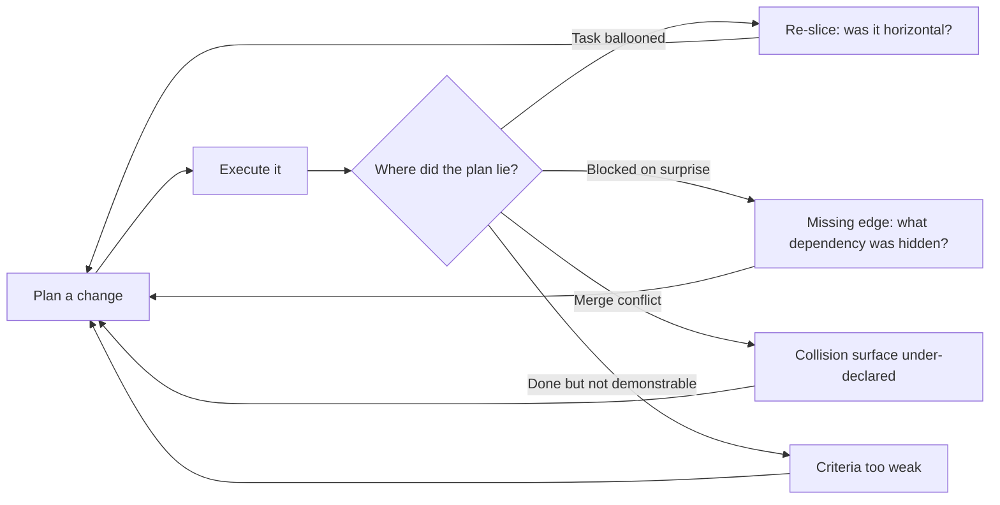

# Implementation Planner

Turns a decided approach into an executable, ordered, parallel-safe task graph with per-task acceptance criteria.

> **Portability target:** Spec-level. This skill encodes planning discipline, not tool-specific ticket syntax.

<!-- QUICK: 30s -->
## Route the Request **(QUICK)**

**Auto-Route:**

| Condition | Route to |
|---|---|
| A01 — A spec exists and someone asks "where do we start?" | Core Workflow Phase 1 |
| A02 — Two or more people/agents must work at once on one feature | Parallelization analysis (Phase 3) |
| A03 — A plan exists but tasks are "finish the backend" sized | Slicing (Phase 2) |
| A04 — Work keeps blocking because of unstated dependencies | Blocking-edge DAG (Phase 3) |
| A05 — A migration/refactor spans services or repos | Sequencing + rollback per slice (Phase 4) |

**Intent Route Tree:**

```
Is the APPROACH decided?
├─ No, unknowns remain ──────────► wayfinder (investigate first)
├─ No, no spec at all ───────────► idea-to-spec (write the spec)
└─ Yes
   ├─ One person, small, understood ─► incremental-implementation (just build it)
   ├─ Needs cost/duration estimate ──► software-project-estimator (then return)
   └─ Multiple tasks / multiple people / real dependencies
      └─► THIS SKILL — decompose, order, then hand to execution
```

<!-- QUICK: 30s -->
## Anti-Rationalization **(QUICK)**

**AR-01 [Task size]:** You CANNOT emit a task whose completion cannot be demonstrated in one sitting. "Implement the API" is not a task, it is a project. Split until each task has one observable outcome.

**AR-02 [Dependencies]:** You CANNOT omit blocking edges because the order "seems obvious". Undeclared order is the single largest source of wasted parallel work. Every task that must wait on another gets an explicit `blocked_by`.

**AR-03 [Criteria]:** You CANNOT write a task without acceptance criteria and a verification command. A task you cannot verify is a task you cannot finish.

**AR-04 [Parallelism]:** You CANNOT mark two tasks parallel if they touch the same file, schema, or shared resource without declaring a merge point. "They're different features" is not a collision analysis.

**AR-05 [Hidden work]:** You CANNOT leave integration, migration, or cleanup work implicit. If it must happen, it becomes a task with an owner and a slot.

<!-- QUICK: 30s -->
## Ground Rules — Read Before Anything Else **(QUICK)**

| # | Rule | Mechanical Trigger | Violation Response |
|---|------|-------------------|-------------------|
| **R1** | **REFUSE to emit a task whose completion cannot be demonstrated in one sitting.** A task without a demoable outcome is a project wearing a task's name. | Task description contains two outcomes joined by "and", or names no observable state change | STOP. Respond: "This task has no single demoable outcome. Name the one state change it produces, or split it at the capability seam." |
| **R2** | **REFUSE to emit a task without acceptance criteria and a verification step.** A task you cannot verify is a task you cannot finish, and an unverifiable ticket blocks the whole wave. | Task has no "done looks like" statement and no command or check that proves it | STOP. Respond: "How will we know this is finished? Give me the acceptance criteria and the verification command, or the task is not ready to emit." |
| **R3** | **REFUSE to leave a dependency implicit.** Undeclared order evaporates the moment two people work at once, and the cost is paid as rework. | Task cannot start until another completes, but no `blocked_by` edge is declared | STOP. Respond: "This task cannot start until X is done. That is an edge, not a sentence — I am declaring blocked_by and re-checking readiness." |
| **R4** | **REFUSE to mark two tasks parallel without a collision check.** The unit of conflict is the file and the shared resource, not the feature; parallelizing by feature produces merge crises. | Two tasks scheduled in one wave with no recorded collision surface (shared files, schema, deploy target, quota) | STOP. Respond: "These two tasks run together. What files and shared resources do they touch? I will not schedule a wave without the collision surface checked." |
| **R5** | **REFUSE to present a plan with no unblocked set.** A plan where nothing can start today is not a plan; it is a wish list with dependencies. | No task is marked as startable-now, or every task has an unresolved predecessor | STOP. Respond: "Nothing here can start today. Find the unblocked frontier, or re-slice — a plan with no entry point is not executable." |
| **R6** | **REFUSE to omit migration, rollout, rollback, and cleanup work.** These are the tasks that turn a finished feature into an unfinished project, and they are always the first omitted. | A change replaces existing behaviour, moves data, or ships behind a flag, and no corresponding migration/cleanup task exists | STOP. Respond: "This change moves data and replaces a path. Where are the backfill, cutover, rollback, and flag-removal tasks? I am emitting them now, not discovering them in the last week." |

<!-- QUICK: 30s -->
## Anti-Hallucination

- **Admit uncertainty.** If you do not know whether two components share state, say so and mark it as an assumption to verify — never invent a dependency graph.
- **Flag your knowledge cutoff.** Framework-specific build/test commands may have changed; mark any command you have not seen in this repo with `# VERIFY:`.
- **[VERIFIED] tags.** Any claim about the current codebase structure must carry `[VERIFIED: file:line]` or be labelled an assumption.
- **Never guess security.** Auth, secrets, and data-boundary ordering is a security decision; when unclear, sequence it early and flag it for review rather than assuming safety.

<!-- QUICK: 30s -->
## The Expert's Mindset **(QUICK)**

Planning masters do not produce a list of things to do. They produce a **graph of what must be true before what else becomes possible**. The list is a byproduct; the graph is the artifact.

The second discipline is **ruthless verticality**. Amateurs slice by layer — all the schemas, then all the services, then all the endpoints — which produces a plan where nothing is demonstrable until the very end and every integration risk surfaces on the last day. Masters slice by thin end-to-end capability, so the first slice is demoable and each later slice adds one honest increment.

Third, masters treat **the critical path as the real schedule**. Adding people to off-path work does not shorten delivery. A plan that does not identify its longest dependency chain is not communicating when the work will be done.

Finally, masters plan for **the work everyone forgets**: the migration, the backfill, the feature-flag removal, the doc update, the rollback. These are the tasks that turn a finished feature into an unfinished project.

<!-- STANDARD: 3min -->
## What Planning Masters Know **(STANDARD)**

| Masters know | Amateurs do |
|---|---|
| Dependencies are discovered, not assumed — they walk the imports and the schema | Assume order from the feature description |
| A task is a promise about a *state change*, not an activity | Write tasks as verbs ("work on X") |
| The unit of parallelism is the file, not the feature | Parallelize by feature and collide at merge |
| The last 10% (integration, flags, migration) is 30% of the tasks | Discover it in the final week |
| A plan is falsifiable — you can tell whether a task is done | Leave "done" to judgement |

### When to Break Your Own Rules **(DEEP)**

A genuinely one-day, one-person change does not need a DAG. If you can hold the whole plan in your head and state it in one sentence, stop planning and start building. The rules above are a cost; pay it only when coordination is the actual risk. Similarly, a plan for work you will personally execute needs the decomposition for your own clarity, not the dependency edges for coordination — keep the slices, drop the ceremony.

<!-- STANDARD: 3min -->
## Deliberate Practice **(STANDARD)**



| Level | Routine |
|---|---|
| Novice | Write the task list, then draw one arrow per dependency you can name |
| Intermediate | Slice vertically; write acceptance criteria before writing the task body |
| Advanced | Predict the critical path, then check the prediction against actual execution |
| Expert | Predict merge collisions and integration surprises; keep a log of plan-vs-reality deltas |

<!-- STANDARD: 3min -->
## Operating at Different Levels **(STANDARD)**

### L1: Apprentice
Break a known feature into ordered tasks using a template. A worklist results.

### L2: Practitioner
Slice vertically; write acceptance criteria and a verification step per task. The plan becomes demonstrable.

### L3: Senior
Build the dependency DAG across a service and identify the critical path. Sequencing now holds under real execution.

### L4: Staff / Principal
Plan cross-service migrations with rollback per slice; coordinate multiple teams. Delivery risk reduces to a known set of edges.

### L5: Transformative
Design the decomposition *approach* for an organisation and define what "task-sized" means there. Planning becomes repeatable across teams.

<!-- QUICK: 30s -->
## When to Use **(QUICK)**

| Condition | Why this skill |
|---|---|
| A spec or design is approved and implementation has not been sequenced | The gap this skill exists to close |
| More than one person or agent will work on the same feature | Parallelism without collision analysis is a merge crisis |
| A plan's tasks are too large to start | Slicing is the intervention |
| Work is repeatedly blocked by unstated ordering | The DAG must be made explicit |
| A migration or refactor crosses a boundary | Sequencing and rollback must be planned per slice |

<!-- QUICK: 30s -->
## When NOT to Use **(QUICK)**

| Condition | Use instead |
|---|---|
| The approach itself is undecided | `wayfinder` — investigate the unknowns first |
| No specification exists yet | `idea-to-spec` — write the spec |
| One person, one sitting, fully understood | `incremental-implementation` — just build it |
| The ask is effort/cost/duration estimation | `software-project-estimator` |
| The ask is sprint scheduling and ceremonies | `scrum-master` |
| The ask is multi-team programme coordination | `technical-program-manager` |
| The ask is prioritisation against business value | `product-manager` |

<!-- STANDARD: 5min -->
## Decision Trees **(STANDARD)**

### Decision Tree 1: Is this task ready to emit?

```
Task drafted
├─ Can its outcome be demonstrated in one sitting?
│  ├─ No ──► SPLIT. Find the seam by capability, not by layer.
│  └─ Yes ↓
├─ Does it name a verification command or check?
│  ├─ No ──► REJECT (R2). You cannot finish what you cannot verify.
│  └─ Yes ↓
├─ Does it depend on another task?
│  ├─ Yes ──► declare blocked_by (R3), then re-check readiness
│  └─ No ──► READY TO EMIT
```

### Decision Tree 2: Can these two tasks run in parallel?

```
Two tasks proposed for the same wave
├─ Same file? ─────────────► NO. Serialise or assign one owner.
├─ Same table/schema? ──────► NO unless the schema change is ordered first.
├─ Same external resource (deploy target, queue, API quota)?
│  └─ YES ──► serialise, or declare a shared-resource lock task
├─ One produces an artifact the other consumes?
│  └─ YES ──► that is a blocking edge, not parallelism
└─ None of the above ───────► PARALLEL OK — record surface as "none (checked)"
```

### Decision Tree 3: How should this be sliced?

```
Feature to decompose
├─ Can one thin path go end-to-end (UI → service → store) and be demoed?
│  ├─ Yes ──► SLICE VERTICALLY. Slice 1 is the walking skeleton.
│  └─ No, a shared foundation is genuinely required first
│     └─ ► ONE foundation task (not a layer), then vertical slices on top.
```

### Decision Tree 4: Where does the migration/cleanup work go?

```
Change replaces something existing, or moves data
├─ Old path must keep working during rollout?
│  └─ YES ──► emit: dual-write/flag task, backfill task, cutover task, flag-removal task
├─ Data must be transformed?
│  └─ YES ──► emit: backfill task with its own reconciliation verification
└─ Nothing to remove afterwards?
   └─ NO ──► you have hidden work. Emit the cleanup task now (R6).
```

<!-- STANDARD: 5min -->
## Core Workflow **(STANDARD)**

| Phase | Time | What you do | Complete when |
|---|---|---|---|
| **1. Baseline** | 10 min | Read the spec; extract state changes, not activities; confirm the approach is decided | Complete when the approach is confirmed decided and the state-change list exists |
| **2. Slice** | 25 min | Convert state changes into thin vertical slices; right-size each to one sitting | Complete when every task is demonstrable in one sitting and has acceptance criteria |
| **3. DAG** | 20 min | Name what must precede each task; draw edges; find the unblocked set and critical path | Complete when every dependency is an explicit edge and the unblocked set is named |
| **4. Waves** | 15 min | Run Decision Tree 2 on every parallel pair; record the collision surface | Complete when every wave has a recorded collision surface (files and shared resources) |
| **5. Forgotten work** | 15 min | Walk Decision Tree 4; emit integration, migration, rollout, rollback, cleanup, docs | Complete when migration, rollout, rollback, and cleanup each have a task slot |
| **6. Risky-first** | 10 min | Reorder so the task most likely to invalidate the plan runs earliest | Complete when the highest-uncertainty task is scheduled in the first wave |
| **7. Verify** | 10 min | Run the Production Checklist against the emitted plan | Complete when all 15 checklist items pass and the DAG validates acyclic |
| **8. Handoff** | 5 min | Emit the plan with criteria, edges, waves, and critical path; name the owner | Complete when the receiving skill can start the first task without asking a question |

<!-- STANDARD: 3min -->
## Best Practices **(STANDARD)**

1. **Slice vertically, always starting with a walking skeleton.** One thin path end-to-end proves the integration; everything after adds one honest increment. Horizontal layers defer all risk to the end.
2. **Write acceptance criteria before the task body.** The criteria define the task. If you cannot write them, you do not yet know what the task is.
3. **Size by demonstrability, not by hours.** "Demonstrable in one sitting" is robust; hour estimates invite false precision.
4. **Make the critical path explicit.** The longest dependency chain is the schedule. Everything else is optimisation.
5. **Declare the collision surface for every parallel pair.** The unit of conflict is the file and the shared resource, not the feature.
6. **Foundation work is allowed but must be one task.** A layer of "all the models first" is a smell; a single shared-foundation task with a named consumer is not.
7. **Every dependency is an edge or it does not exist.** Verbal ordering evaporates the moment two people work at once.
8. **Emit the forgotten work as tasks.** Backfill, rollout flags, rollback, flag-removal, and docs are deliverables, not afterthoughts.
9. **Order risky and unknown tasks early.** Front-load the task most likely to invalidate the plan, so a wrong assumption costs hours, not weeks.
10. **Re-plan when a slice reveals new information.** A plan is a hypothesis; a task that explodes is data about a wrong seam, not a failure to be absorbed silently.

<!-- STANDARD: 5min -->
## Error Decoder **(STANDARD)**

| Symptom | Root Cause | Fix | Lesson |
|---|---|---|---|
| All integration risk lands in the final week; the last task is "wire it together" | Horizontal slicing — every layer built, nothing joined | Re-slice vertically; make slice 1 a walking skeleton | Integration is not a task, it is the property of a vertical slice |
| Two parallel tasks both edit the same config; the merge takes longer than either task | Collision surface never checked; parallelized by feature | Run Decision Tree 2 on every wave; serialise shared files | Parallelism is a property of files, not of features |
| A task stays "in progress" for days with no demo | It was never demonstrable in one sitting | Apply R1; split at the capability seam | A task with no demo is a project wearing a task's name |
| Feature ships, then an unplanned backfill takes another sprint | The data migration was implicit | Walk Decision Tree 4; emit backfill with reconciliation criteria | The migration is 30% of the work and 0% of the naive plan |
| Sprint starts and nobody can begin — everything is blocked | No unblocked set identified; the plan has no entry point | Phase 3 requires naming the unblocked set explicitly | R5: a plan without a first task is not a plan |
| The plan looked right and the schedule slipped identically every time | Critical path never identified; effort added off-path | Name the critical path; track plan-vs-reality deltas | Adding people off the critical path cannot shorten delivery |

<!-- QUICK: 30s -->
## Error Recovery **(QUICK)**

| Symptom | First Action | If That Fails | Last Resort |
|---|---|---|---|
| Task cannot be made demonstrable | Split at the next seam down | Question whether the approach is actually decided | Route back to `wayfinder` |
| Dependency graph is cyclic | Find the real shared prerequisite | Extract it as one foundation task | Reconsider the slicing boundary |
| A parallel wave keeps colliding | Serialise the colliding pair | Assign a single owner per shared file | Drop to one task at a time for that wave |
| Plan invalidated mid-execution | Re-plan only the affected subtree | Re-slice the failed seam | Escalate for a scope decision |

**Hard failure boundary:** After 3 attempts to make a task executable, escalate to a human. Do not repeatedly re-slice without new information.

<!-- STANDARD: 3min -->
## Cross-Skill Coordination **(STANDARD)**

| Upstream Skill | Artifact | What You Need |
|---|---|---|
| `idea-to-spec` | Specification | The decided requirements and boundaries |
| `wayfinder` | Investigation tickets | Whether unknowns are resolved enough to plan |
| `codebase-design` | Module map | Real seams and the shared surfaces that cause collisions |
| `system-architect` | Architecture decision | Service boundaries and integration points |
| `product-manager` | Prioritised scope | What is in and out of this increment |
| `grilling` | Resolved decisions | Answers to the questions the spec left open |

| Downstream Skill | Deliverable | What They'll Do |
|---|---|---|
| `iterative-task-execution` | Ordered task list + criteria | Execute task by task, verifying each |
| `incremental-implementation` | Vertical slice definition | Build slice-by-slice behind flags |
| `project-manager` | Task graph + critical path | Schedule, track, and report |
| `technical-program-manager` | Cross-team dependency edges | Coordinate parallel teams |
| `scrum-master` | Right-sized backlog items | Run the sprint cadence |

<!-- STANDARD: 3min -->
## Proactive Triggers **(STANDARD)**

| # | Detectable pattern | Action |
|---|---|---|
| T1 | A task description joins two outcomes with "and" | Propose the split |
| T2 | A plan where nothing can start today | Find the unblocked set or re-plan |
| T3 | Two tasks scheduled together touching one file | Run the collision check |
| T4 | A refactor with no cleanup or flag-removal task | Emit the forgotten work |
| T5 | A task with no verification command | Reject until criteria exist |
| T6 | A plan longer than a page with no critical path named | Compute and state it |
| T7 | "Implement the backend" as a task | Re-slice vertically |
| T8 | A dependency asserted verbally but never written | Convert it to an edge |
| T9 | A migration with no backfill task | Add backfill with reconciliation criteria |
| T10 | Work starting before an approach is decided | Stop; route to `wayfinder` |

<!-- STANDARD: 3min -->
## Anti-Patterns **(STANDARD)**

| ❌ Anti-Pattern | ✅ Do This Instead |
|----------------|-------------------|
| ❌ **Horizontal layer slicing** — "all the models, then all the services" | ✅ Vertical slices with a walking skeleton first |
| ❌ **Tasks as activities** — "work on auth" | ✅ Tasks as state changes with acceptance criteria |
| ❌ **Parallelizing by feature** — "they're different features" | ✅ Check the file and shared-resource collision surface (R4) |
| ❌ **Implicit dependency order** — order you kept in your head | ✅ Declare every edge, or it does not exist (R3) |
| ❌ **Estimating in hours during planning** — false precision | ✅ Size by demonstrability in one sitting |
| ❌ **Omitting migration and cleanup** — they surface as an unplanned sprint | ✅ Emit backfill, rollout, rollback, and cleanup as tasks (R6) |
| ❌ **Foundation-as-a-layer** — "all the models first" | ✅ One foundation task with a named consumer, then vertical slices |
| ❌ **No critical path named** — the schedule is unknowable | ✅ Name the longest dependency chain |
| ❌ **Absorbing a blown-up task silently** — the wrong seam survives | ✅ Re-slice and re-plan the affected subtree |
| ❌ **A plan with no startable task** — the sprint stalls on day one | ✅ Name the unblocked frontier explicitly (R5) |

<!-- QUICK: 30s -->
## State Log **(QUICK)**

| Turn | Action | Decision | Risk Accepted | Mitigation |
|---|---|---|---|---|
| 1 | Baseline read | Approach confirmed decided | Spec may still hide unknowns | Front-load risky tasks |
| 2 | Slicing | Vertical, skeleton first | Slice 1 may reveal a wrong seam | Re-plan is expected, not failure |
| 3 | DAG build | Edges declared | An unseen dependency may appear | Keep edges explicit for fast amendment |
| 4 | Wave check | Collision surfaces recorded | Resource contention outside files | Shared-resource lock task |
| 5 | Forgotten work | Migration/cleanup added | Scope may exceed expectation | Escalate for a scope decision |

**Anti-Drift Check:** Before each response, verify —
- every emitted task has acceptance criteria and a verification step
- every dependency is an edge, not a sentence
- every parallel wave has a checked collision surface
- the unblocked set and the critical path are stated

<!-- STANDARD: 3min -->
## Production Checklist **(STANDARD)**

- [ ] **CR1: Task size** — Verification: each task's outcome is demonstrable in one sitting
- [ ] **CR2: Acceptance criteria** — Verification: every task states what done looks like
- [ ] **CR3: Verification step** — Verification: every task names a command or check
- [ ] **CR4: Vertical slicing** — Verification: at least one end-to-end slice exists
- [ ] **CR5: Unblocked set named** — Verification: what can start today is explicit
- [ ] **CR6: Dependencies are edges** — Verification: no dependency lives only in prose
- [ ] **CR7: DAG is acyclic** — Verification: the graph parses with no cycle
- [ ] **CR8: Critical path stated** — Verification: the longest chain is written down
- [ ] **CR9: Collision surfaces recorded** — Verification: every wave lists shared files/resources
- [ ] **CR10: Shared files serialised** — Verification: no two tasks in a wave own one file
- [ ] **CR11: Migration emitted** — Verification: backfill tasks carry reconciliation criteria
- [ ] **CR12: Rollout and rollback are tasks** — Verification: flags, cutover, and reversal have slots
- [ ] **CR13: Cleanup scheduled** — Verification: flag removal and dead-path deletion are tasks
- [ ] **CR14: Risky work front-loaded** — Verification: the plan can be invalidated cheaply
- [ ] **CR15: Plan is falsifiable** — Verification: an outside reader can tell when each task is done

<!-- QUICK: 30s -->
## What Good Looks Like **(QUICK)**

A good plan is a **graph with criteria**: each task states a state change, carries acceptance criteria and a verification step, and sits behind explicit edges. A reader can point at any task and answer "how do I know it's finished?" without asking the author.

It is also **honest about time**: the critical path is named, the forgotten work has slots, and the first slice is already startable today. The plan anticipates integration and collision because it checks for them rather than hoping.

**Complete when:**
- every task in the plan has acceptance criteria and a verification step
- every dependency is represented as an explicit edge
- the unblocked set is non-empty and named
- the critical path is written down
- every parallel wave has a recorded collision surface
- migration and backfill work is emitted with reconciliation criteria
- rollout, rollback, and cleanup each have a task slot
- the graph validates as acyclic
- the plan's total task count is proportionate to the increment
- an outside reader can determine completion for any task without asking

**Signs of Excellence:** each task demoable in one sitting; unblocked set obvious; critical path explicit; migration and cleanup present; risky work early; parallel waves collision-checked.
**Signs of Dysfunction:** tasks named as activities; "finish the backend"; no edges; nothing startable; the last task is "integrate"; cleanup discovered late.

<!-- STANDARD: 3min -->
## Verification **(STANDARD)**

Before the plan is handed off, run every item in the Production Checklist and confirm three sample tasks, chosen at random, each have criteria, verification, and edges; the graph parses as a DAG; the unblocked set is non-empty; and the critical path is written down. **Pass criteria:** all 15 checklist items pass and the DAG is acyclic.

<!-- STANDARD: 3min -->
## Verification Guardrails **(STANDARD)**

**Pre-generation:**
- Confirm the approach is decided; if not, route to `wayfinder` rather than inventing one.
- Confirm the spec boundaries (what is in and out) before slicing.

**Post-generation:**
- Re-run the checklist against the emitted plan.
- Mark every unverified codebase assumption with an explicit assumption tag.
- Never present a plan as complete while any task lacks criteria or any dependency lacks an edge.

<!-- QUICK: 30s -->
## References **(QUICK)**

- `references/task-plan-template.md` — the output schema: task fields, graph notation, wave layout
- `references/worked-example.md` — a full worked decomposition of a cross-service feature with DAG and critical path
- `references/slicing-patterns.md` — vertical vs horizontal slicing, walking skeleton, and foundation-task rules
- `scripts/verify-skill.sh` — runnable verification harness for this skill
- Related: `wayfinder`, `idea-to-spec`, `iterative-task-execution`, `incremental-implementation`, `project-manager`, `technical-program-manager`

<!-- STANDARD: 3min -->
## Failure Modes and Known Limitations **(STANDARD)**

What breaks this approach, and where it is the wrong tool:

| Failure mode | Signal | Mitigation |
|---|---|---|
| **The approach was not actually decided** | Slicing proceeds while an unknown remains | Phase 1 gate; route to `wayfinder` |
| **Horizontal slicing** | Slice 1 is "all the models" | Walking skeleton first (AR-02) |
| **Undeclared ordering** | Dependencies exist in prose, not in `blocked_by` | Every dependency is an edge (AR-03) |
| **Parallel collision** | Two tasks in one wave touch one file | Collision check (AR-04) |
| **Forgotten work discovered late** | A migration ships with no backfill task | Decision Tree 4 (AR-05) |
| **A task balloons silently** | "In progress" for days with no demo | Re-slice at the capability seam |
| **Plan aimed at the wrong target** | Every slice inherits one wrong assumption | Front-load the highest-uncertainty task |
| **Over-planning** | 20+ tasks for one increment | Escalate the scope question instead |

**Known limitation:** this skill does not estimate duration or cost — that is
`software-project-estimator`. Numbers in the examples are **[ESTIMATED]** illustrative
assumptions, not measurements. Planning claims here are **[COMMON-PRACTICE]** industry
convention, not the result of a controlled study.

**What breaks this strategy:** a plan produced against a spec that has not been decided. Every
slice then inherits the wrong assumption. The Phase 1 gate exists specifically to prevent this.

## Gotchas **(STANDARD)**

- **The walking skeleton is not optional decoration.** If slice 1 does not go end-to-end, you have not sliced vertically, and the integration risk is exactly where you left it. A late integration failure in a multi-service feature routinely costs **$20,000–$80,000** in schedule recovery.
- **A "refactor" with no behaviour change can still collide.** Refactors touch many files; check the surface like any other wave. Merge conflicts discovered at integration cost **$5,000–$25,000** per incident in rework.
- **Estimation is a different skill.** Drifting into duration promises here produces commitments the plan cannot support; a blown estimate on a **$200,000–$1,000,000** programme is a board-level problem.
- **Plan size is itself a signal.** More than roughly 20 tasks for one increment usually means the increment is too large; escalate the scope question rather than planning harder.
- **Undeclared order is invisible debt.** Every dependency you leave in your head is re-discovered by someone else at the worst time, and the discovery cost lands as idle capacity — commonly **$10,000–$40,000** in a mid-size team.
- **One foundation task is not a licence to build a layer.** "All the models first" reappears under the name "shared kernel"; it has the same failure mode.
