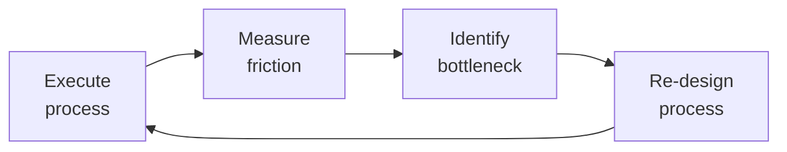

# Technical Project Manager

Technical project management covering initiation through closure. Work breakdown structures (WBS), dependency mapping, critical path analysis, risk management (RAID logs), stakeholder communication plans, budget tracking, resource leveling, milestone management, status reporting cadence, and project postmortems.

## Route the Request
<!-- QUICK: 30s -- pick your path, skip the rest -->

What are you trying to do?
├── Project planning (WBS, Gantt) → Start at "Project Planning & Scheduling" under Sub-Skills
├── Risk management (RAID log) → Go to "RAID Log Management" under Sub-Skills
├── Stakeholder communication → Jump to "Stakeholder Communication" under Sub-Skills
├── Resource allocation → Go to "Resource Allocation" under references/
├── Budget tracking → Jump to "Earned Value Management (EVM)" under Sub-Skills
├── Milestone management & status reporting → Go to "Project Recovery" and "Stakeholder Communication"
├── Running a postmortem → Jump to "Postmortem" section in Core Workflow
├── Need agile team execution and sprint coaching? → Route to `scrum-master`
├── Multi-team program with cross-team dependencies? → Route to `technical-program-manager`
├── Feature scope definition and roadmap? → Route to `product-manager`
├── Engineering capacity or architecture decision? → Route to `engineering-manager`
├── Deployment coordination needed? → Route to `release-manager`
└── Don't know where to start? → Start at "Project Planning & Scheduling"

**Do not read the entire skill.** Follow the route above and read only the sections it points to.

## Ground Rules — Read Before Anything Else

These rules apply to *every* response this skill produces.

- **Never commit to dates without team input.** Dates decided in isolation will slip.
- **Risk register needs mitigation plans, not just identification.** Every risk needs an owner and a response strategy.
- **Status reports must surface blockers, not just progress.** Green status hiding red risks is a project killer.
- **Stakeholder communication should be proactive, not reactive.** Bad news early beats bad news late.
- **Always track dependencies with buffer.** Cross-team dependencies slip — plan for it.
- **Admit what you don't know.** If estimates are rough or key stakeholders haven't committed, say so.


## The Expert's Mindset

Master project managers know that operational excellence is invisible when it works — and catastrophically visible when it doesn't. They design for the 99th percentile, not the average.

| Cognitive Bias | Mitigation |
|----------------|------------|
| **Availability heuristic** — over-prioritizing the last incident | Rank problems by recurrence × impact, not recency |
| **Hero complex** — being the person who always saves the day | If you're always the hero, your system is fragile. Automate your heroism. |
| **Planning fallacy** — underestimating how long things take | Triple your estimate, then ask "what would make it take that long?" — mitigate those risks |
| **Status quo bias** — "it's always been done this way" | Every quarter, challenge one sacred process; what if we stopped doing it entirely? |

### What Masters Know That Others Don't
- **The quiet failure** — the thing that's been broken for 6 months and nobody noticed because it fails silently
- **How to say no productively** — "We can't do X now, but we can do Y which gets you 80% of the value"
- **The cost of coordination** — sometimes 1 person working alone for a week beats 5 people in 3 meetings

### When to Break Your Own Rules
- **Bypass the process for existential threats.** If the site is down, fix it first; process comes after.
- **Over-communicate during ambiguity.** When the path is unclear, silence is worse than wrong information.
## Operating at Different Levels

| Level | Scope | You... |
|-------|-------|--------|
| **L1** | Single process | Execute defined workflows reliably and flag deviations |
| **L2** | Team process | Own team-level processes; optimize for team efficiency; remove bottlenecks |
| **L3** | Department operations | Design cross-team operational workflows; make build-vs-automate decisions |
| **L4** | Org operations | Define operational strategy for the organization; set standards and tooling |
| **L5** | Industry operations | Create operational frameworks adopted across the industry |

**Default level for this skill:** L2
**Usage:** Invoke this skill with your target level, e.g., "as an L3 project manager, manage..."

For full level definitions, see `skills/00-framework/skill-levels/SKILL.md`.

## When to Use
<!-- QUICK: 30s -- scan the bullet list to decide if this skill fits -->
- Starting a new project that needs structured planning (initiation phase)
- Project slipped deadlines or scope creeping — need replanning
- Multiple stakeholders with misaligned expectations
- Need a risk management framework (RAID log)
- Project spans 3+ teams with interdependent deliverables
- Preparing for a gate review or steering committee presentation
- Running a project postmortem/retrospective
- Evaluating project health with objective metrics (EVM, SPI, CPI)
- Resource conflicts across multiple projects
- Need a communication plan (who gets what info, when, how)
- **Use `/scrum-master` instead** when: The team needs coaching on agile practices, sprint ceremonies are dysfunctional, impediments need removal, or team health needs improvement. Scrum-master is about *how* the team works — facilitation, coaching, process improvement.
- **Use `/technical-program-manager` instead** when: You need to coordinate across multiple teams, manage cross-team dependencies, drive a program with a fixed timeline and multiple workstreams. TPM handles scope that spans teams; PM handles scope within a single project.

## Decision Trees
<!-- QUICK: 30s -- follow the ASCII tree to your scenario -->
### Methodology Selection: Waterfall vs Agile vs Hybrid
```
                     ┌──────────────────────────┐
                     │ START: Project methodology? │
                     └────────────┬─────────────┘
                                  │
                    ┌─────────────▼─────────────────┐
                    │ Requirements well-understood,   │
                    │ unlikely to change (>80%        │
                    │ confidence in scope)?           │
                    └────┬──────────────────────┬───┘
                         │ YES                  │ NO
                    ┌────▼──────────┐    ┌──────▼──────────┐
                    │ Deliverable is│    │ Deliverable is   │
                    │ physical/     │    │ software AND     │
                    │ construction? │    │ team co-located  │
                    └──┬────────┬───┘    │ or async-capable?│
                       │YES     │NO      └──┬──────────┬────┘
                  ┌────▼───┐ ┌─▼────────┐   │YES       │NO
                  │Waterfall│ │Hybrid:   │ ┌─▼──────┐ ┌─▼──────────┐
                  │(critical│ │planning  │ │Scrum/  │ │Agile        │
                  │path,    │ │milestones│ │Kanban  │ │framework    │
                  │phase    │ │+ agile   │ │based on│ │with async   │
                  │gates)   │ │delivery  │ │team size│ │ceremonies   │
                  └─────────┘ │sprints   │ │+ cadence│ └─────────────┘
                              └──────────┘ └─────────┘
```
**When to choose Waterfall:** Physical/construction deliverables, regulatory phase-gate requirements, fixed-price contracts with clear scope — critical path method, milestone-driven.
**When to choose Hybrid:** Fixed scope + evolving implementation — waterfall planning/milestones with agile delivery sprints. Good for heavily regulated software.
**When to choose Agile/Scrum:** Software with evolving requirements, co-located or async-capable team — 2-week sprints, backlog refinement, working software increments.

### Risk Response Strategy
```
                     ┌──────────────────────────┐
                     │ START: Risk response?       │
                     └────────────┬─────────────┘
                                  │
                    ┌─────────────▼─────────────────┐
                    │ Probability × Impact score      │
                    │ HIGH (>15 on 5×5 matrix)?      │
                    └────┬──────────────────────┬───┘
                         │ YES                  │ NO
                    ┌────▼──────────┐    ┌──────▼──────────┐
                    │ Can we avoid   │    │ Medium risk      │
                    │ the risk       │    │ (5-15)?          │
                    │ entirely by    │    └──┬──────────┬────┘
                    │ changing plan? │       │YES       │NO (Low)
                    └──┬────────┬───┘  ┌────▼────┐ ┌──▼──────────┐
                       │YES     │NO    │Mitigate:│ │Accept +     │
                  ┌────▼───┐ ┌─▼────────┐│reduce P │ │monitor only:│
                  │Avoid:  │ │Can we     ││or I with│ │log in RAID, │
                  │change  │ │transfer?  ││concrete │ │no active    │
                  │scope,  │ └──┬────┬───┘│actions  │ │mitigation   │
                  │tech, or│    │YES │NO  │+ owners │ └─────────────┘
                  │approach│ ┌──▼──┐┌▼────┐└─────────┘
                  └────────┘ │Trans-││Miti-│
                              │fer:  ││gate: │
                              │insure││build │
                              │ance, ││con-  │
                              │vendor││tingen-│
                              │SLA   ││cy plan│
                              └──────┘└──────┘
```
**When to Avoid:** High risk, viable alternative approach — change technology, scope, or delivery plan to eliminate the risk entirely (strongest response).
**When to Transfer:** Financial or liability risk that can be insured or contracted away — insurance, vendor SLA, fixed-price contract with penalty clauses.
**When to Mitigate:** Can reduce probability (add testing, prototyping) or impact (contingency budget, fallback plan) — always assign an owner and deadline.
**When to Accept:** Low impact or low probability — document in RAID log, monitor triggers, no active mitigation unless threshold crossed.

### Stakeholder Communication Escalation
```
                     ┌──────────────────────────────┐
                     │ START: Who needs what comms?   │
                     └────────────┬─────────────────┘
                                  │
                    ┌─────────────▼─────────────────┐
                    │ Executive sponsor or steering   │
                    │ committee member?               │
                    └────┬──────────────────────┬───┘
                         │ YES                  │ NO
                    ┌────▼──────────┐    ┌──────▼──────────┐
                    │High-level:    │    │ Directly blocked  │
                    │Status on 1    │    │ or dependent on   │
                    │page: RAG,     │    │ deliverables?     │
                    │milestones,    │    └──┬──────────┬────┘
                    │key risks,     │       │YES       │NO
                    │decisions needed│  ┌────▼────┐ ┌─▼──────────┐
                    │Frequency:      │  │Detailed │ │FYI only:   │
                    │monthly or      │  │status:  │ │broadcast   │
                    │at gate reviews │  │task-level│ │channel,    │
                    └────────────────┘  │blockers,│ │newsletter  │
                                        │dependen-│ │or wiki     │
                                        │cies     │ │update      │
                                        └─────────┘ └────────────┘
```
**When to send Executive-level comms:** Sponsor/steering committee — 1-page RAG status, milestone vs plan, top 3 risks, decisions needed. Monthly or at gate reviews.
**When to send Detailed comms:** Team leads, dependent teams, blockers — task-level status, dependencies, timeline changes. Weekly or per sprint.
**When to send General comms:** Wider org, indirect stakeholders — project newsletter, wiki update, Slack broadcast. Optional consumption, no action required.

### Project Health Assessment
```
                     ┌──────────────────────────────┐
                     │ START: Is the project healthy? │
                     └────────────┬─────────────────┘
                                  │
                    ┌─────────────▼─────────────────┐
                    │ SPI (Schedule Performance      │
                    │ Index) < 0.85 OR CPI (Cost     │
                    │ Performance Index) < 0.85?     │
                    └────┬──────────────────────┬───┘
                         │ YES                  │ NO
                    ┌────▼──────────┐    ┌──────▼──────────┐
                    │ RED: Immediate│    │ SPI/CPI 0.85-0.95│
                    │ Corrective    │    │?                 │
                    │ Action:       │    └──┬──────────┬────┘
                    │ - Root cause  │       │YES       │NO
                    │ - Recovery    │  ┌────▼────┐ ┌───▼──────────┐
                    │   plan        │  │AMBER:   │ │GREEN:        │
                    │ - Stakeholder │  │Course-  │ │Monitor only. │
                    │   notification│  │correct  │ │Celebrate if   │
                    │ - Escalate if │  │before it │ │SPI/CPI > 1.0 │
                    │   >2 weeks    │  │hits RED  │ │— ahead of    │
                    └───────────────┘  └─────────┘ │plan.         │
                                                   └──────────────┘
```
**When RED (SPI/CPI < 0.85):** >15% behind schedule or over budget — immediate root cause analysis, recovery plan with specific dates, stakeholder escalation, increased monitoring frequency.
**When AMBER (SPI/CPI 0.85-0.95):** 5-15% off plan — course correct now with specific actions, don't wait for RED. Adjust resource allocation or re-baseline.
**When GREEN (SPI/CPI > 0.95):** On or ahead of plan — continue monitoring, celebrate ahead-of-plan performance, but verify metrics aren't gamed.

### Resource Conflict Resolution
```
                     ┌──────────────────────────────┐
                     │ START: Resource conflict       │
                     │ between projects?              │
                     └────────────┬─────────────────┘
                                  │
                    ┌─────────────▼─────────────────┐
                    │ Both projects have same         │
                    │ strategic priority from         │
                    │ sponsor/portfolio?              │
                    └────┬──────────────────────┬───┘
                         │ YES                  │ NO
                    ┌────▼──────────┐    ┌──────▼──────────┐
                    │Capacity-based│    │ Lower priority   │
                    │Split:         │    │ project yields.  │
                    │% allocation   │    │ Re-plan with     │
                    │agreed with    │    │ remaining        │
                    │both sponsors. │    │ capacity. If     │
                    │If not feasible│    │ blocking higher  │
                    │→ escalate to  │    │ priority →       │
                    │portfolio      │    │ escalate to      │
                    │governance     │    │ portfolio for    │
                    └───────────────┘    │ decision.        │
                                         └──────────────────┘
```
**When to capacity-split:** Equal priority — agree % allocation with both sponsors (e.g., 60/40), document impact on both timelines, review monthly. Escalate to portfolio if not feasible.
**When to yield:** Unequal priority — lower priority project adjusts plan, higher priority proceeds. Escalate to portfolio governance for formal decision if contested.

## Core Workflow
<!-- QUICK: 30s -- scan phase titles to understand the process -->
<!-- DEEP: 10+min -->
### Phase 1 (~15 min): Initiation & Planning

1. **Project charter**: Problem statement, business case, success criteria, constraints, assumptions
2. **Stakeholder analysis**: Power-interest grid, communication preferences, RACI for key decisions
3. **Work breakdown structure (WBS)**: Decompose deliverables into work packages (8-80 hour rule)
4. **Dependency mapping**: Mandatory, discretionary, external, internal dependencies
5. **Critical path analysis**: Longest path through dependencies; zero-float activities
6. **Resource plan**: Who does what, availability, skill gaps, resource leveling
7. **Schedule baseline**: Gantt chart with milestones, dependencies, and buffer
8. **Budget**: Bottom-up estimation, contingency reserve (10-20%), management reserve
9. **Communication plan**: Stakeholder → information need → format → frequency → owner
10. **Risk register (RAID)**: Risks, Assumptions, Issues, Decisions — T-shirt sizing (L/M/S), probability, impact, mitigation

<!-- DEEP: 10+min -->
### Phase 2 (~30 min): Execution & Monitoring

1. **Daily ops**: Standup attendance (observe, don't run), unblocking, dependency tracking
2. **Weekly status**: Progress against milestones, SPI/CPI, top 3 risks, blocked items, decisions needed
3. **RAID log review**: Weekly review, aging analysis, escalation triggers
4. **Change control**: Scope change requests (SCR) → impact analysis → CCB review → approve/reject
5. **Burndown/burnup**: Track earned value vs planned value
6. **Stakeholder updates**: Tailored by audience (executive summary vs detailed technical)

<!-- DEEP: 10+min -->
### Phase 3 (~20 min): Closure & Postmortem

1. **Project closure checklist**: All deliverables accepted, contracts closed, resources released
2. **Lessons learned**: What went well, what went wrong, what to do differently
3. **Postmortem report**: Timeline, metrics (planned vs actual), root causes, action items
4. **Knowledge transfer**: Documentation, runbooks, architecture decisions archived
5. **Celebration**: Acknowledge the team. Seriously — it matters for retention.

## Cross-Skill Coordination
<!-- QUICK: 30s -- table of who to talk to when -->
Project management is the hub — coordinating product, engineering, design, QA, DevOps, stakeholders, and business. The PM doesn't do the work; the PM ensures the right people talk to each other at the right time.

### Decision Gates & Artifacts

- **Phase-Gate Review**: Each project phase (Initiation, Planning, Execution, Closure) requires a go/no-go decision from the sponsor or steering committee. Output: signed phase-gate approval with action items.
- **Risk Threshold Gate**: Any risk escalating from Medium to High (probability × impact > 15 on 5×5 matrix) triggers immediate stakeholder notification and mitigation activation. Output: updated risk register with mitigation owner and deadline.
- **Budget Variance Gate**: Burn rate exceeding plan by >15% triggers escalation to sponsor and finance for corrective action or re-baseline. Output: variance report with root cause and options.
- **Schedule Variance Gate**: SPI < 0.85 is RED — requires root cause analysis, recovery plan, and sponsor escalation. SPI 0.85-0.95 is AMBER — course-correct now. Output: schedule health report with recovery actions.
- **Change Control Gate**: Any scope, date, or resource change requires impact analysis → options (cut scope, add resources, push date) → sponsor decision. Output: approved change request log.
- **Project Closure Gate**: All deliverables accepted, contracts closed, resources released, lessons learned documented. Output: closure checklist signed and postmortem report.

| Coordinate With | When | What to Share/Ask |
|-----------------|------|-------------------|
| **Product Strategist** | Roadmap, scope changes, prioritization | Feature priorities, MVP scope, trade-off decisions, stakeholder expectations |
| **CTO Advisor / Engineering Lead** | Architecture decisions, tech debt, capacity | Engineering capacity, technical risks, build vs buy recommendations |
| **Scrum Master** | Sprint execution, impediments, team health | Sprint goals, velocity trends, blocked items, team capacity changes |
| **UX Designer** | Design deliverables, user research timeline | Design handoff dates, research findings that affect scope, prototype reviews |
| **Frontend/Backend Dev Leads** | Estimation, technical risks, dependency identification | Feasibility input, sequencing constraints, spike results |
| **QA Lead** | Test planning, acceptance criteria, release readiness | Test environment needs, regression scope, defect triage priorities |
| **DevOps / Infrastructure** | Environments, deployments, CI/CD pipeline | Environment availability, deployment schedule, infrastructure dependencies |
| **Security Reviewer** | Security review gates, penetration testing | Security review SLA, findings that block release, remediation priorities |
| **Data/Analytics** | Metrics instrumentation, reporting requirements | Event tracking needs, dashboard readiness, success metric baselines |
| **Business Strategist / Stakeholders** | Business milestones, budget, ROI expectations | Status against business case, budget burn rate, milestone achievement |
| **Legal Advisor** | Contractual obligations, compliance gates | Delivery obligations, SLA commitments, regulatory milestones |
| **Vendor / External Partners** | Third-party deliverables, API integrations | External dependency status, contract deliverables, integration timelines |

### Communication Triggers — When to Proactively Notify

| Trigger | Notify | Why |
|---------|--------|-----|
| Critical path delayed by >1 week | Stakeholders, Product Strategist, All Team Leads | Delivery date impact; replanning required |
| Resource loss (key person leaves, reallocated, or unavailable >2 weeks) | Engineering Lead, Stakeholders | Capacity impact; timeline or scope adjustments needed |
| Scope change request from stakeholder | Product Strategist, Engineering Lead | Impact analysis needed before approval; trade-off decision |
| Risk probability escalates from Medium to High | Stakeholders, Affected Team Leads | Mitigation activation; may require contingency budget |
| External dependency misses committed date | Affected Team Leads, Stakeholders | Schedule impact cascade; escalation to vendor management |
| Budget burn rate exceeds plan by >15% | Stakeholders, Finance | Overrun risk; corrective action or re-baseline needed |
| Major milestone achieved (or missed) | All Stakeholders, All Teams | Celebration or course correction; visibility critical for trust |

### Escalation Path

| Situation | Escalate To | Rationale |
|-----------|------------|-----------|
| Project no longer viable (business case invalidated) | **CEO Strategist** + Sponsor + Portfolio Governance | Stop-work decision; resource reallocation |
| Stakeholder conflict blocking progress for >1 week | **Sponsor** or Steering Committee | Resolution authority beyond PM's influence |
| Vendor breach of contract or non-delivery | **Legal Advisor** + Procurement + Sponsor | Contractual remedy; may require legal action |
| Regulatory/compliance deadline at risk of being missed | **Legal Advisor** + Regulatory Specialist + Sponsor | Regulatory exposure; may require external notification |
| >20% budget or schedule overrun without recovery path | **Sponsor** + Portfolio Governance + Finance | Re-baseline or termination decision; executive approval required |

### Route to Other Skills

| If the Request Involves | Route To | Rationale |
|--------------------------|-----------|-----------|
| Agile team execution, sprint ceremonies, team coaching | `scrum-master` | Scrum-master owns the *how* — facilitation, coaching, impediment removal |
| Multi-team program with cross-team dependencies | `technical-program-manager` | TPM coordinates across teams; PM manages within a single project |
| Feature scope definition, roadmap, and user stories | `product-manager` | Product owns the *what* and *why*; PM owns the *when* and *how* |
| Engineering capacity, architecture decisions, tech debt | `engineering-manager` | Resource allocation and technical strategy decisions |
| Deployment coordination and release readiness | `release-manager` | Release logistics across environments and teams |
| Vendor contract, procurement, or external delivery | `vendor-manager` or `legal-advisor` | Contractual obligations and external dependency management |
| Budget governance and portfolio prioritization | `vp-engineering` or `director-engineering` | Executive decision on cross-project resource allocation |

## Proactive Triggers
<!-- QUICK: 30s -- trigger-action table for autonomous PM workflow -->

The project manager doesn't wait for status reports — the PM detects drift from baseline data and acts before stakeholders ask. Every trigger below is tied to a measurable threshold and a direct action.

| Trigger | Action | Why |
|---------|--------|-----|
| SPI < 0.85 for 2 consecutive weeks | Invoke schedule compression (fast-tracking or crashing); notify sponsor with recovery options | Cumulative critical path delay compounds; this is the last moment to recover without date slip |
| `fullstack-developer` reports a task blocked by unresolved API contract ambiguity | Schedule a 30-min huddle with `fullstack-developer` + `backend-developer` + `api-designer` within 24 hours; log the dependency in RAID | Cross-stack ambiguity is the #1 cause of mid-sprint stall — it compounds as downstream tasks wait |
| Risk probability × impact crosses from Medium to High | Activate mitigation plan within 48 hours; notify all affected `scrum-master`s; allocate contingency budget if pre-approved | High risks left unmitigated become incidents — cost of mitigation is always lower than cost of recovery |
| Vendor deliverable 3 days past committed date with no updated ETA | Escalate to vendor PM with cc to `legal-advisor`; flag as RED dependency in weekly status; assess workaround options with engineering lead | External dependencies are the #1 cause of project delay; early escalation preserves negotiation leverage |
| Stakeholder requests scope change without formal change request | Log the request in change log; produce impact analysis (schedule + budget + resource delta) within 3 business days; schedule a trade-off discussion with sponsor | Unmanaged scope change is the #1 cause of budget overrun — gate all scope changes through impact analysis |
| 3+ stakeholders report conflicting priorities for the same sprint | Call a priority alignment meeting with `product-manager` + all requesting stakeholders; use the RACI matrix to identify the single accountable decider | Conflicting priorities without resolution = team thrashing — one decider per decision |
| Project budget burn rate exceeds plan by >10% for 2 consecutive reporting periods | Analyze variance root cause; produce options (re-scope, request additional budget, adjust timeline); present to sponsor within 5 business days | Budget drift is a leading indicator of scope or estimation failure — catch it before the overrun is unrecoverable |
| Team morale signal: sprint retro participation drops, 1:1s become shorter, nobody asks questions in planning | Flag to `engineering-manager` and `scrum-master`; schedule a no-agenda team health check; review workload distribution for burnout signals | Project success depends on team health — morale erosion is a lagging indicator of burnout; intervene when signals first appear |

### Service Interaction: PM → Fullstack Developer

The project-manager-to-fullstack-developer handoff is the bridge between planning and execution. When done well, tickets flow from roadmap to sprint without clarification loops.

| Interaction Point | What PM Provides | What Fullstack Dev Needs |
|-------------------|-----------------|--------------------------|
| **Sprint planning** | Prioritized backlog with business context, acceptance criteria, and dependency flags | Story points estimate, technical risk flags, sequencing constraints |
| **Ticket breakdown** | Epic-level user stories with clear "definition of done" | Task-level decomposition (frontend, backend, DB, tests), spike identification |
| **Mid-sprint blocker** | Escalation path, stakeholder context for trade-offs, authority to adjust scope | Root cause diagnosis, alternative implementation options, time-to-fix estimate |
| **Cross-team dependency** | Introduction to the owning team's PM, committed dates, escalation contact | Technical requirements document, API contract needs, integration test scenarios |
| **Sprint review prep** | Demo script aligned to stakeholder expectations, success metric context | Working increment, performance benchmarks, known limitations |

## Scale Depth
<!-- QUICK: 30s -- find your team size column -->
### Solo (1 person, 0-100 users)
One person managing 1-3 small projects part-time. Tools: Google Sheets + Notion for tracking, Slack for comms. No formal RAID log — issues tracked in a doc. No EVM; simple milestone tracking. Communication: async updates, no stakeholder meetings beyond weekly check-in. Cost: $0-100/month. Overkill: MS Project, Jira Advanced Roadmaps, portfolio dashboards, formal gate reviews.

### Small (2-10 people, 10-100 users)
Dedicated PM or tech lead wearing PM hat. Tools: Jira/Linear + Confluence/Notion. RAID log maintained. Basic EVM: SPI/CPI on major deliverables. Weekly status reports to stakeholders. Gate reviews for major milestones. Risk register with owners and mitigation plans. Cost: $100-500/month (tools). Overkill: PMO, formal portfolio governance, resource management software.

### Medium (10-50 people, 100-10K users)
1-3 PMs or PMO lead. Tools: Jira Advanced Roadmaps, MS Project, Smartsheet. EVM across all workstreams. Portfolio-level RAID log with cross-project dependencies. Formal stage-gate process with steering committee. Resource capacity planning. Vendor management process. Cost: $2K-10K/month. Overkill: dedicated PMO department, enterprise PPM (Planview, Clarity).

### Enterprise (50+ people, 10K+ users)
PMO (3-10+). Enterprise PPM: Planview, ServiceNow PPM, Clarity. Portfolio governance with stage-gate, benefits realization tracking. Resource management across all projects. Strategic alignment scoring. Vendor performance management. PM methodology training and coaching. Cost: $20K-200K+/month.

### Transition Triggers
| From → To | Trigger | What to Change |
|-----------|---------|----------------|
| Solo → Small | 3+ concurrent projects with cross-team dependencies | Add Jira/Linear for tracking; implement RAID log; start weekly stakeholder reporting |
| Small → Medium | 5+ concurrent projects, shared resource pool, or portfolio budget >$500K | Add PPM tool; implement stage-gate governance; hire dedicated PM(s) |
| Medium → Enterprise | 10+ projects, multi-department resource conflicts, or regulatory oversight | Establish PMO; implement enterprise PPM; add portfolio governance board |


### Cross-skills Integration

| Step | Skill | What it produces |
|------|-------|------------------|
| **Before** | product-manager | Prioritized product backlog, roadmap, and feature requirements |
| **This** | project-manager | WBS, project schedule, RAID log, status reports, resource plan |
| **After** | scrum-master | Sprint plans, backlog refinement, team velocity tracking |

Common chains:
- **Chain**: product-manager → project-manager → scrum-master — Product vision becomes a structured project plan; the scrum master executes sprints against it.
- **Chain**: ceo-strategist → project-manager → technical-program-manager — Strategic initiative gets project-level planning; handed off to TPM for cross-team execution.

## What Good Looks Like

> When project management is applied perfectly, every project has a clear charter with defined success criteria, the critical path is known and actively managed, risks are identified before they become issues, stakeholders receive the right information at the right cadence without information overload, resource constraints are surfaced early with trade-off options, and projects complete within the communicated timeline and budget — not through heroics but through disciplined execution.

## Sub-Skills
<!-- QUICK: 30s -- table of deeper dives by topic -->
| Sub-Skill | When to Use | Context |
|-----------|-------------|---------|
| **Project Planning & Scheduling** | New project initiation or major re-plan | WBS, Gantt charts, critical path method — MS Project, Smartsheet, Jira Advanced Roadmaps |
| **RAID Log Management** | Any project with >2 stakeholders or >1 month duration | Risks, Assumptions, Issues, Dependencies — tracked in spreadsheet or Jira/Confluence with owners and review cadence |
| **Earned Value Management (EVM)** | Budget >$100K or sponsor requires objective progress metrics | SPI (schedule), CPI (cost), EAC (estimate at completion) — calculate from planned vs actual vs earned |
| **Stakeholder Communication** | 3+ stakeholder groups with different information needs | RACI matrix, communication plan (who, what, when, how), steering committee decks, status dashboards |
| **Vendor & Procurement Management** | External vendors delivering project components | RFP/RFQ process, SOW review, SLA monitoring, milestone acceptance, invoice verification |
| **Risk Management** | High-uncertainty projects or regulated environments | Probability × Impact matrix, Monte Carlo simulation, risk response strategies (avoid/transfer/mitigate/accept), contingency reserves |
| **Agile/Scrum PM** | Software projects with evolving requirements | Sprint planning facilitation, backlog grooming, velocity tracking, Scrum of Scrums for multi-team coordination |
| **Project Recovery** | Project >15% behind schedule or >20% over budget | Root cause analysis, recovery plan (crash/fast-track/re-scope), stakeholder re-alignment, increased governance frequency |

## Best Practices
<!-- STANDARD: 3min -- rules extracted from production experience -->
- **Plan for the plan to be wrong**: No plan survives contact with reality. Build 15-20% buffer.
- **RAID log is your second brain**: If it's not in the RAID log, it doesn't exist
- **Status reports are pull, not push**: Dashboard where stakeholders self-serve; don't email PDFs
- **Escalate early, not when it's on fire**: Bad news does not age well. The sooner escalated, the more options available.
- **One decision-maker per decision**: RACI avoids the "everyone agrees but nothing happens" trap
- **Milestones over tasks for external comms**: Stakeholders care about "payment module live," not 47 subtasks
- **Risk identification is everyone's job**: A quiet PM doesn't catch risks; an engineering team speaking up catches them
- **Postmortems are blameless**: Focus on process failures, not individual mistakes

## Anti-Patterns
<!-- STANDARD: 3min -- common failure modes and their correct alternatives -->

| ❌ Anti-Pattern | ✅ Do This Instead |
|-----------------|---------------------|
| **The PM-as-secretary trap**: Taking meeting notes, scheduling everyone's calendar, updating Jira tickets for engineers | PM owns the *plan*, not the *execution*. Engineers update their own tickets. The PM's time is spent on risk identification, stakeholder alignment, and dependency resolution |
| **Green-washing status reports**: Every status report shows GREEN across all workstreams despite known risks | Use objective RAG criteria (SPI < 0.85 = RED, 0.85-0.95 = AMBER). A report with no red items when you know about risks is a lie, not a status report |
| **Planning paralysis**: 4 weeks of planning for a 6-week project because "we need to get the estimate right" | Time-box planning to 10% of project duration. Ship a plan at 80% confidence and refine as you learn. A perfect plan delivered late is worse than a good plan delivered on time |
| **The Gantt chart as truth**: Updating the Gantt chart weekly without validating actual progress against the critical path | Walk the critical path physically: ask each owner "show me the working artifact." A Gantt chart updated from status reports is fiction — validate with evidence, not words |
| **Stakeholder spam**: Sending 40-page status decks to 30 people every week, cc'ing executives on every minor update | Segment stakeholders: exec summary (1 page, decisions needed) for sponsors, detailed status for team leads, self-serve dashboard for everyone else. Communicate at the recipient's altitude |
| **RAID log as theater**: Maintaining a beautiful RAID log that nobody reads and risks age past 30 days without review | RAID log is a working document, not an audit artifact. Review top 10 risks weekly with the team. If a risk is older than 2 weeks without an update, either it's not a risk or you're not managing it |
| **Hero PM syndrome**: The PM personally chases every blocker, resolves every conflict, and becomes the single point of failure for project information | Build systems, not dependencies: self-serve dashboards, documented escalation paths, delegated decision authority. The project should run for 2 weeks without you — if it can't, you've built a bottleneck, not a process |
| **Scope creep by "just this one thing"**: Accepting every small stakeholder request without change control because "it's tiny" | Every scope change — no matter how small — goes through the change log. "Tiny" changes compound: 20 tiny scope additions = 1 major feature. Track cumulative impact and make the cost visible to requesters |

## MVP vs Growth vs Scale

| Phase | Scope | Team Size | Project Management Approach |
|-------|-------|-----------|---------------------------|
| **MVP (0→1)** | 1 project, 1-5 people, 2-week cycles | Solo PM or tech lead doubling as PM | GitHub Projects or Linear + Notion. No Gantt charts. No formal RAID log. One status update/week in Slack. Milestones: "launched," "not launched yet." |
| **Growth (1→10)** | 3-5 concurrent projects, 5-20 people | 1 PM or fractional PM | Proper WBS for projects >1 month. RAID log (Google Sheets). Weekly status reports. Gantt for complex dependency chains. Jira/Asana with timeline view. |
| **Scale (10→N)** | 10+ concurrent projects, 50+ people, multi-team programs | PMO or multiple PMs | Portfolio-level tracking. Earned value management. Resource capacity planning tools (Float/Resource Guru). Standardized charter templates. Formal phase-gate reviews. Executive dashboard. |

## Cost-Effective Decision Table

| Decision | Free/Cheap Option | Paid Upgrade | When to Upgrade |
|----------|------------------|--------------|-----------------|
| Project tracking | GitHub Projects (free) or Trello (free) | Jira ($7.75/user/mo) or Linear ($8/user/mo) | >10 contributors or need dependency visualization |
| Gantt charts | Mermaid Gantt in markdown (free) | TeamGantt ($24/mo) or Smartsheet ($7/user/mo) | Stakeholders demand visual timelines or >50 tasks |
| RAID log | Google Sheets template (free) | Jira Risk Management or dedicated tool | >5 projects or need dashboard aggregation |
| Status reporting | Markdown in shared repo (free) | Notion ($8/user/mo) or Confluence ($6/user/mo) | Need permission control or non-technical stakeholders |
| Resource planning | Google Sheets (free) | Float ($6/user/mo) or Resource Guru ($4/user/mo) | >20 people to manage across >5 projects |
| Time tracking | Toggl Track (free up to 5 users) | Harvest ($12/user/mo) | >5 people tracking or need billable hours reporting |
| Stakeholder comms | Slack channel + weekly message (free) | Loom ($12/mo) for async video updates | >10 stakeholders or need async video walkthroughs |
| Portfolio mgmt | Google Sheets dashboard (free) | Monday.com ($9/user/mo) or Wrike ($9.80/user/mo) | >5 concurrent projects or need roll-up reporting |

**Annual tool budget by phase:** MVP: $0. Growth: $500-2K. Scale: $5K-30K.

## Scalability Decision Tree

```
How long is the project?
├── <2 weeks → TODO list in GitHub Issues. No Gantt, no WBS. Just a checklist with owners.
└── 2 weeks to 2 months → WBS + dependency map + weekly status. Google Sheets sufficient.
    └── >2 months → Full plan with Gantt, RAID, communication plan, phase gates.

How many people involved?
├── 1-3 → Async status updates in Slack. Lightweight planning.
├── 3-10 → Weekly sync (30 min max). RAID log. Written status updates.
└── 10+ → Structured communication plan. Different info for execs vs team vs stakeholders.

Are there external dependencies (other teams, vendors, APIs)?
├── YES → Dependency tracking becomes critical. Flag external deps in RAID with owner + due date.
│   External dependencies are the #1 cause of project delays.
└── NO → Internal alignment is simpler. Focus on sequencing, not negotiation.

Is the budget >$50K or is there a contract with penalties?
├── YES → Formal change control, earned value tracking, regular financial reporting.
└── NO → Lightweight budget tracking. Check monthly not weekly.

Are stakeholders asking for "more visibility"?
├── YES → Create a self-serve dashboard. Don't send more emails. Stakeholders pull, not PM push.
└── NO → Current communication is sufficient. Don't create reports nobody reads.
```


**What good looks like:** Project charter signed by sponsor. WBS decomposed to tasks under 80 hours. RAID log reviewed weekly. Status report sent on schedule with milestones, risks, and decisions needed. Project completes within 10% of estimated timeline.

## When NOT to Use This Skill (Overkill)

- **2-person project lasting 1 week**: A Slack DM and a shared todo list is the plan. Formal WBS, Gantt charts, and RAID logs for a 5-day 2-person effort are overhead, not help.
- **The project is "exploratory" or research**: You can't plan research. You can plan time-boxed spikes. Don't create a WBS for "investigate why the database is slow."
- **Solo founder building an MVP**: You are your own stakeholder, resource, and approver. Ship fast. The only project management you need is "what's the most important thing to build next?"
- **The team is highly experienced and ships consistently without process**: Don't fix what isn't broken. If things slip predictably, apply process surgically to the pain point, not the whole project.
- **You're the bottleneck — the PM is doing all tracking while the team overruns anyway**: The problem isn't planning. It's trust, capacity, or skill. Process won't fix it.
- **The project is a recurring operational activity ("monthly billing run")**: That's a runbook, not a project. Automate it. Don't Gantt-chart recurring ops.

## Token-Efficient Workflow

```
# Step 1: Project health check
python3 scripts/project_health.py --project-id PROJECT --output json
# Returns: {
#   "spi": 0.85, "cpi": 1.05, "critical_path_slippage_days": 4,
#   "risks_high_open": 2, "risks_aging_30d": 1,
#   "blocked_tasks": 3, "stakeholder_nps": 7,
#   "milestones_on_track": 5, "milestones_total": 7
# }

# Step 2: Decision tree
# spi < 0.8 → Schedule compression (fast-tracking or crashing)
# cpi > 1.1 → Under budget (re-allocate or early delivery)
# critical_path_slippage_days > 0 → Focus ONLY on critical path recovery
# risks_high_open > 0 → Top priority: mitigation actions this week
# stakeholder_nps < 6 → Communication plan failing. Fix.
# blocked_tasks > 3 → SWAT unblocking session

# Step 3: Status report — auto-generate from data
python3 scripts/gen_status.py --project-id PROJECT > status_$(date +%Y-%m-%d).md
# 1-page markdown: milestones, top risks, blocked items, decisions needed

# Step 4: Verify RAID freshness
python3 scripts/raid_audit.py --project-id PROJECT --stale-threshold-days 14
# Exit 0 = all items reviewed within 14 days. Exit 1 = stale items found.
```

**Principle:** `project_health.py` reads from the project tracker (Jira/Linear/GitHub issues), computes SPI/CPI, checks milestone dates, and outputs a JSON snapshot. Agent reads 1 JSON file, applies the decision tree, and generates exactly 1 action. No reading task lists into agent context.


<!-- DEEP: 10+min -->
## Error Decoder

| Symptom | Root Cause | Fix | Lesson |
|---------|------------|-----|--------|
| Project missed deadline by 6 weeks despite everyone reporting on track | Critical path had 4 sequential dependencies, each slipping 1 week -- nobody was tracking the cumulative effect on the end date until week 10 | Identify and visualize the critical path from day one. Track float on every dependency. Flag any critical path activity more than 1 day late within 24 hours. Update stakeholders weekly on critical path health. | A project where everyone reports on track but the deadline keeps slipping has a critical path that no one is managing. The critical path is your only real schedule -- everything else has float. |
| Stakeholder complained at the postmortem that they had no idea the project was in trouble | Status reports showed green status every week despite mounting risks -- the PM did not want to escalate bad news | Implement a no red status surprise rule: if a risk crosses into high probability, notify stakeholders immediately. Use RAG status with clear criteria (SPI less than 0.85 = RED, 0.85 to 0.95 = AMBER). | Bad news does not improve with age. A status report that always shows green is either hiding something or not looking. Stakeholders would rather hear bad news early than be surprised later. |
| Scope grew 3x during the project despite an approved charter | Every stakeholder request was accepted as minor without change control -- cumulative impact of 40 minor changes blew the budget | Implement a formal change control process: any scope/date/resource change requires an impact analysis and sponsor sign-off. Track change requests in a log with cumulative budget impact. | Scope creep does not come as one big change -- it comes as 40 small ones. Without a change control process, "just one more thing" becomes "we are twice over budget." |
| Two teams built overlapping functionality because they were not communicating | No RACI matrix was created -- backend team built an API that frontend team was already developing as a client-side feature | Create a RACI matrix at project initiation. Hold weekly cross-team sync. Implement a shared dependency tracking board. Review for overlap at every milestone gate. | Without clear ownership, teams either assume someone else is doing the work or both do it. A RACI matrix prevents both. Assign every deliverable to exactly one accountable person. |
| Postmortem identified 20 lessons learned but none were implemented in the next project | Postmortem was a venting session with no structured action plan -- findings were documented but never assigned owners or tracked | Structure the postmortem with: what went well, what went wrong, root causes, and 3-5 prioritized action items with owners and deadlines. Track action items in the next project kickoff. | A postmortem without owners and deadlines is a therapy session, not an improvement process. Limit action items to the top 3-5 and track them until completion. |
| Fullstack developer spent 3 days building a feature against outdated API specs because the `api-designer` updated the contract mid-sprint without notification | No contract change notification protocol existed — the API designer published a new spec version but didn't notify dependent teams, and the PM's dependency tracker didn't cover in-flight spec changes | Implement a contract change broadcast: any API spec version bump triggers an automated notification to all dependent team leads and PMs. Add "contract version stability" as a sprint readiness gate. Freeze API contracts for the sprint duration unless a SEV1 fix requires a change. | The most expensive bug is the one built against a spec that changed silently. API contracts are commitments, not suggestions — version-freeze contracts for the duration of active sprints. The PM's dependency tracker must include "spec drift" as a risk category. |
| Project sponsor approved a $200K budget for a vendor tool, but after 4 months the vendor's API couldn't support the required throughput — $80K sunk cost with no recovery | Vendor selection was based on feature checklists and sales demos, not a technical proof-of-concept with production-scale load testing | Before any vendor contract exceeding $50K, require a technical PoC: load test the API at 2x expected peak throughput, validate SLAs with penalties, and have the `system-architect` sign off on integration feasibility. Include a 30-day termination clause for technical non-performance. | A vendor sales demo proves the vendor can sell, not that their product works at your scale. The PM must gate procurement decisions on technical validation, not feature matrices. Budget is not the only risk — integration failure is often more expensive than the contract value. |
| Project completed "on time" but the product shipped with 3 critical security vulnerabilities that weren't discovered until the pen test — delayed launch by 6 weeks | Security review was scheduled as the last gate before launch because the PM treated it as a compliance checkbox, not an engineering requirement | Schedule the first security review during architecture design, not after implementation. Add "security review passed" as an entry criterion for every milestone gate, not just the final release gate. Involve `security-engineer` in sprint planning for any feature handling PII, auth, or payments. | Security is not a phase — it's a continuous constraint. Scheduling security review last guarantees it will be skipped or rubber-stamped. The PM must front-load security gates so that findings surface when they are cheap to fix, not when the launch date is immovable. |


## Production Checklist
<!-- QUICK: 30s -- binary pass/fail items. All must pass. -->
- [ ] **[S1]**  Project charter approved with clear success criteria
- [ ] **[S2]**  WBS created with work packages decomposed to <80 hours each
- [ ] **[S3]**  Dependency map complete with critical path identified
- [ ] **[S4]**  RAID log initialized with at least 10 identified risks
- [ ] **[S5]**  Stakeholder analysis complete with communication preferences mapped
- [ ] **[S6]**  Schedule baseline established with milestones and buffer
- [ ] **[S7]**  Budget approved with contingency reserve (10-20%)
- [ ] **[S8]**  Communication plan defined (who gets what info, when, how)
- [ ] **[S9]**  Change control process documented and socialized
- [ ] **[S10]**  Status report template ready (dashboard or document format)
- [ ] **[S11]**  Escalation path defined with triggers
- [ ] **[S12]**  Resource allocation confirmed (no over-allocations >120%)
- [ ] **[S13]**  Kickoff meeting held with all stakeholders
- [ ] **[S14]**  Project retrospective/postmortem scheduled at 2-4 week cadence

## Footguns
<!-- DEEP: 10+min — war stories from project delivery -->

| Footgun | What Happened | Root Cause | How to Prevent |
|---------|---------------|------------|----------------|
| Committed to "Q3 delivery" in a January board meeting when only 15% of scope was defined — project shipped 11 months late, $2.3M over budget, and the CEO was fired | A healthtech startup's board demanded a delivery date for their FDA-submission platform. The PM provided "Q3" based on a team estimate from a 2-hour whiteboarding session covering 15% of known features. In March, 40% of scope was added by regulatory requirements nobody had researched. In June, a key vendor integration was discovered to require a custom API — 8 weeks of unplanned work. The project finally launched in August of the following year. The CEO was terminated at the next board meeting for "failure to execute." | The PM treated a rough estimate as a commitment because the board "needed a date." No delivery range, no confidence interval, no explicit scope-to-date trade-off. The 85% unknown scope was treated as zero risk. | **Never give a single date when scope is <50% defined.** Use confidence intervals: "Based on what we know today (15% scope definition), our P50 delivery is February, P90 is August. We'll narrow this range as scope firms up." At every milestone review, report the current confidence interval. Stakeholders who demand false precision are asking you to manage their anxiety, not the project. If forced to give a date, give the P90 and explain what has to go right for the P50. |
| Cut QA from 4 weeks to 1 week because "we're 2 weeks behind schedule" — shipped with 14 P1 bugs, recall and emergency patching cost $400K | A fintech company's mobile app rewrite was 2 weeks behind the committed launch date. The PM cut QA from 4 weeks to 1 week to "make the date," and the engineering director approved it. The app shipped on time. Within 48 hours: payment processing was double-charging customers, account balances displayed incorrectly, and push notifications were sent to wrong users. 14 P1 bugs. The emergency fix sprint took 3 weeks. Customer support handled 4,200 complaints. The company issued $400K in credits and compliance fines. | The PM treated QA as a buffer, not a gate. The "we're behind" framing assumed the schedule was more important than quality — but the schedule was already wrong. The root cause of being behind was never addressed; QA was cut instead. | **QA is not a buffer — it's a gate with a fixed cost of being wrong.** The schedule being late is a scope/estimation problem; cutting QA converts a schedule problem into a quality problem. When behind: (1) cut scope, not QA; (2) extend the date with explicit trade-off documentation; (3) never let "we'll just test faster" become the plan. If a PM proposes cutting QA, the project sponsor must personally approve it in writing with full acknowledgment of the defect risk. |
| Status reports to the steering committee said "green" for 8 consecutive months — at month 9, "suddenly" everything was red and the launch slipped 4 months | A logistics company's ERP migration had monthly steering committee reviews. For 8 months, every status report showed green across all workstreams. The PM's reports were based on team lead self-assessments — each lead reported green because "we're working hard" and "no major blockers." At month 9, integration testing revealed that 3 of 6 workstreams were 30-40% behind their actual milestones. The PM had never independently verified progress against deliverables. | Status was measured by self-reported sentiment, not objective evidence. "We're working on it" was treated as equivalent to "it's done." No independent verification of milestone completion, no burn-down against deliverables, no "show me the working software" checkpoint. | **Replace sentiment-based status with evidence-based gates.** Every milestone review: demo working functionality, not slides. Status is determined by completed deliverables divided by planned deliverables, not by team lead confidence. A "green" status requires: (1) all planned deliverables for the period are demonstrably complete, (2) buffer consumption is within plan, (3) no new risks rated "high" or "critical" in the past period. If the PM hasn't seen it working, it's not green. |
| Vendor promised "2-week integration, our API is plug-and-play" — 8 weeks later, $50K in unplanned professional services, integration still not complete, blocked 3 downstream workstreams | A retail company selected a payment processing vendor for their e-commerce platform. The vendor's sales engineer demoed a sandbox integration in 2 hours and promised "2 weeks to production." The PM put 2 weeks in the schedule with zero buffer. Reality: the API documentation was out of date, authentication required a custom OAuth flow not mentioned in the demo, rate limits were 10% of what was needed at peak, and the webhook format didn't match any of the 12 documented event types. The PM had no contract lever — no SLA, no penalty clause, no technical acceptance criteria. | The vendor's demo was a sandbox toy, not a production integration. The PM accepted the vendor's estimate without independent technical validation. The contract had no acceptance criteria, no performance SLA, and no penalty for delays. | **Every vendor estimate must survive a technical PoC before it enters the schedule.** Before any vendor commitment >$50K, require: (1) a production-representative integration test with actual data volumes, (2) an `api-designer` review of the API contract, (3) a `system-architect` sign-off on production readiness. Contract must include: acceptance criteria for "integration complete," SLA with financial penalties, 30-day termination for non-performance. Budget contingency for vendor integration = 100% of vendor's estimate, not 20%. |
| One "critical resource" (lead architect) was allocated at 150% across 3 concurrent projects — burned out in 6 weeks, went on medical leave for 3 months, all 3 projects slipped 4-6 months | A digital agency won 3 major client projects simultaneously. The lead architect was the only person who understood the shared platform and was assigned to all 3 at 40-50% each. Within 6 weeks, the architect was working 70-hour weeks, making errors, and missing cross-project design reviews. Week 7: medical leave for burnout. No backup had been trained. The 3 projects collectively slipped 14 months and lost $1.2M in revenue. | Resource allocation was tracked as percentages that summed to >100% across projects, but "150% allocation" doesn't account for context-switching overhead or human limits. No single point of failure analysis was done. No succession plan existed for the architect role. | **Resource allocation must account for context-switching cost.** A person allocated 50% to 3 projects actually delivers ~25% per project (switching cost). Hard cap: no individual >100% total allocation. For critical single points of failure: (1) identify them in the RAID log as top-priority risks, (2) require a trained backup within 30 days, (3) projects that depend on the SPOF must have buffer that accounts for the person being unavailable. "They're irreplaceable" means the project plan has a fatal flaw. |

## Calibration — How to Know Your Level
<!-- STANDARD: 3min — honest self-assessment -->

| You Know You're Stuck at L1 When... | You Know You've Reached L2 When... | You Know You're L3 When... |
|---|---|---|
| You can build a Gantt chart and a RAID log but every project you've managed was late, and you attribute it to "scope creep" or "unrealistic expectations" rather than your planning | You've delivered 3+ projects within 10% of estimated budget and schedule, and you can show the data — actual vs planned for schedule, budget, scope, and quality across each project | A sponsor asks "should we kill this project?" and you give a recommendation with expected value calculation in 30 seconds — and you've killed 2 projects that needed killing, saving the company >$3M in sunk costs |
| Your status reports say "on track" until the week before the deadline when you reveal it's actually 6 weeks behind — and you think that's normal | You can walk into a status meeting and explain exactly which 3 workstreams are at risk, by how much, and what the recovery plan is — and your risk assessment is validated by independent review | A VP hands you a project in crisis — 6 months late, team demoralized, sponsor threatening cancellation — and you turn it around within 90 days, shipping within a revised window that you set on day 30 |
| You treat the project plan as a document you create at the beginning and update only when asked — the plan is a PDF, not a living artifact | You update the critical path weekly based on actual progress, and you can tell any stakeholder within 60 seconds where the project is relative to its baseline | You manage a $15M portfolio of 4-6 concurrent projects and can explain the trade-offs between them — if one slips, you know exactly which other project's resources to reallocate and why |

**The Litmus Test:** A CEO hands you a project that's 8 months late, $4M over budget, with a team that's stopped attending status meetings because "nothing ever changes." Can you produce a recovery plan within 5 business days that identifies what to cut, what to resequence, and what to reset — and can you execute it? If you've never rescued a failing project, you're not L3. Masters have a graveyard of projects they've killed or turned around.

## Deliberate Practice



| Level | Practice | Frequency |
|-------|----------|-----------|
| **Novice** | Document your current workflow; highlight every step that requires human judgment or waiting | Monthly |
| **Competent** | Run a "process autopsy" on a recent initiative: what took longest, where were the miscommunications? | Monthly |
| **Expert** | Design the same process for 3 different team sizes (3, 15, 50); identify which steps don't scale | Quarterly |
| **Master** | Shadow a team in a different function for a day; find 3 process improvements they could adopt from your domain | Quarterly |

**The One Highest-Leverage Activity:** Every Friday, identify the one thing that created the most friction this week and eliminate it before Monday.

## References
<!-- QUICK: 30s -- links to deeper reading -->
- [PMBOK Guide (7th Edition)](https://www.pmi.org/pmbok-guide-standards/foundational/pmbok)
- [Atlassian Project Management Guide](https://www.atlassian.com/project-management)
- [Linear Method](https://linear.app/method)
- [Shape Up: Basecamp's Project Methodology](https://basecamp.com/shapeup)
- [Google Project Management Certificate](https://www.coursera.org/professional-certificates/google-project-management)
- [Earned Value Management (EVM) — DoD Guide](https://www.dau.edu/acquipedia/pages/ArticleDetails.aspx?aid=71c4e37a-5e2b-4d85-8bc5-35b7753e7191)
- [RACI Matrix Guide](https://www.projectmanager.com/blog/raci-chart-made-easy)
- [How to Run a Project Postmortem — Atlassian](https://www.atlassian.com/team-playbook/plays/project-retrospective)
