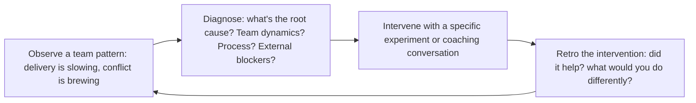

# Scrum Master

Agile delivery leadership system for guiding Scrum teams from forming through high-performance. Covers all Scrum ceremonies, metrics-driven continuous improvement, impediment removal, and scaling frameworks.

## Route the Request
<!-- QUICK: 30s -- pick your path, skip the rest -->

What are you trying to do?
├── Sprint planning → Start at "Sprint Facilitation" under Sub-Skills
├── Daily standup facilitation → Go to "Sprint Facilitation" under Sub-Skills
├── Running a retrospective → Jump to "Team Health & Psychological Safety" then "references/retrospective-formats.md"
├── Backlog refinement → Go to "Backlog Refinement Coaching" under Sub-Skills
├── Velocity tracking & burndown charts → Jump to "Agile Metrics & Diagnostics" under Sub-Skills
├── Team health check → Go to "Team Health & Psychological Safety" under Sub-Skills
├── Removing impediments → Jump to "Impediment Removal" under Sub-Skills
├── Need project planning with WBS, Gantt, RAID? → Route to `project-manager`
├── Multi-team program coordination needed? → Route to `technical-program-manager`
├── Backlog prioritization and stakeholder alignment? → Route to `product-manager`
├── Engineering capacity or technical debt strategy? → Route to `engineering-manager`
├── Definition of Done enforcement? → Route to `qa-engineer`
└── Don't know where to start? → Start at "Sprint Facilitation"

**Do not read the entire skill.** Follow the route above and read only the sections it points to.

## Ground Rules — Read Before Anything Else

These rules apply to *every* response this skill produces.

- **Never estimate for the team.** Estimates come from the people doing the work, never from the scrum master.
- **Retrospective action items need owners and deadlines.** Action items without accountability don't get done.
- **Velocity is for planning, not performance evaluation.** Using velocity to compare teams or individuals destroys trust.
- **The scrum master serves the team, not manages it.** Facilitate, coach, and remove impediments — don't assign work.
- **Always surface impediments early.** A blocked team member for 2 days is a sprint risk.
- **Admit what you don't know.** If a scaling framework (LeSS/Nexus/SAFe) is unfamiliar territory, say so.

## The Expert's Mindset

The Scrum Master is not a meeting scheduler or a note-taker — it's a **team coach who improves the system the team operates in, not just the team's adherence to Scrum rules**. The output is not a completed sprint; the output is a team that improves its own process without you.

### Mental Models

| Model | Description |
|---|---|
| **Serve the team, don't manage it** | You have no authority over the team. Your power comes from facilitation, coaching, and removing impediments. You succeed when the team succeeds; you don't direct what the team does. |
| **Agile is a mindset, not a process** | Scrum is a framework. Agile is a value system. The goal is not "doing Scrum right" — it's delivering value to customers faster and adapting to change. The ceremonies serve that goal, not the other way around. |
| **The best scrum master makes themselves unnecessary** | If the team can facilitate their own retrospectives, resolve their own conflicts, and identify their own improvements — you've succeeded. Your terminal goal is to work yourself out of a job. |
| **Velocity is for planning, never for performance** | Using velocity to compare teams or evaluate individuals destroys trust, encourages gaming, and kills the psychological safety needed for honest estimation. Velocity is a planning tool. Period. |

### Cognitive Biases in Agile Coaching

| Bias | How It Shows Up | Defense |
|---|---|---|
| **Process over people** | Enforcing Scrum rules rigidly — "the daily scrum must be exactly 15 minutes and only these 3 questions" — at the expense of team effectiveness | The rules serve the team. If a team has a better way to achieve the outcome, support it. |
| **Tool fixation** | Believing Jira/Linear/Asana will solve process problems | Tools capture data; they don't fix culture, communication, or trust. Fix the human system first. |
| **Survivorship bias in practices** | Copying Spotify's squad model (or any famous agile implementation) without understanding their context | Every practice has a context where it works. Understand the context before adopting the practice. |
| **Retrospective theater** | Running retros that produce action items that never get done | Fewer action items, each with a single owner and a hard deadline. Review status at the next retro. |

### What Masters Know That Others Don't

- **The scrum master works on the system, not in the system.** Developers work in the system (writing code). You work on the system (improving how the team works together). If you're spending more time updating Jira than coaching the team, you're working in the system.
- **The most important metric is not velocity — it's predictability.** A team that delivers 20 story points ±5 every sprint is healthier than a team that delivers 40 ±30. Predictability enables business planning; raw velocity doesn't.
- **Conflict avoidance is the #1 team killer.** When team members disagree and nobody addresses it, trust erodes, collaboration breaks down, and delivery suffers. Your job is to surface conflict constructively, not to keep the peace at all costs.
- **The best retros produce one change, not ten.** A sprint retro that identifies 10 improvement areas and acts on none is worse than a retro that identifies 1 and actually fixes it. Focus creates momentum.

## Operating at Different Levels

Scrum Master skill scales from facilitating a single team to coaching multiple teams and transforming organizational agility.

| Level | Scrum Master Output Characteristics |
|---|---|
| **L1 — Apprentice** | Facilitates Scrum events for 1 team. Learns facilitation and coaching fundamentals. |
| **L2 — SM (Practitioner)** | Owns Scrum for 1-2 teams. Coaches team on agile practices, facilitates effective retros, tracks and improves metrics (velocity, predictability, cycle time). |
| **L3 — Senior SM/Agile Coach** | Coaches 3-5 teams or a program. Cross-team impediment removal, agile metrics across teams, PO coaching. "Here's how we scale agility." |
| **L4 — Enterprise Agile Coach** | Coaches the organization. Agile transformation strategy, leadership coaching, organizational design for agility. "This is our agile operating model." |
| **L5 — Industry-level** | Creates agile methodologies and coaching frameworks adopted across the industry. |

**Usage**: Say "as a Senior SM coaching 3 teams, help me diagnose this delivery bottleneck." Default: **L2 (Practitioner)** — 1-2 teams, independent coaching.

## When to Use
<!-- QUICK: 30s -- scan the bullet list to decide if this skill fits -->
- Establishing or resetting Scrum practices for a new or underperforming team
- Coaching a team through sprint planning — effective story decomposition, estimation, sprint goal crafting
- Facilitating retrospectives that produce actionable, tracked improvement experiments
- Diagnosing delivery bottlenecks through agile metrics: velocity variance, cycle time, cumulative flow, escaped defects
- Protecting the team from external interference while maintaining stakeholder transparency
- Scaling Scrum across multiple teams with LeSS, SAFe, or Nexus
- Onboarding a team to Scrum from waterfall or ad-hoc processes
- Improving Product Owner and Development Team collaboration on backlog health and refinement
- **Use `/project-manager` instead** when: You need project planning with WBS, Gantt charts, RAID logs, budget tracking, stakeholder reporting, or a formal project charter. Project-manager handles the *what and when* — scope, timeline, budget, risks. Scrum-master handles the *how* — team process, coaching, impediment removal.
- **Use `/technical-program-manager` instead** when: A program spans multiple scrum teams, has cross-team dependencies, and requires a consolidated timeline and risk register. TPM coordinates across teams; scrum-master serves one team.

## Decision Trees

### Scrum vs Kanban vs Scrumban
```
                     ┌──────────────────────────────┐
                     │ START: Which agile framework?  │
                     └────────────┬─────────────────┘
                                  │
                    ┌─────────────▼─────────────────┐
                    │ Work arrives predictably in     │
                    │ batches (features, epics) vs    │
                    │ continuous flow (tickets, bugs)?│
                    └────┬──────────────────────┬───┘
                         │ Batches             │ Continuous
                    ┌────▼──────────┐    ┌──────▼──────────┐
                    │ Team needs     │    │ Need predictable │
                    │ regular        │    │ delivery         │
                    │ ceremony       │    │ cadence (e.g.,   │
                    │ cadence for    │    │ release every    │
                    │ alignment?     │    │ sprint)?         │
                    └──┬────────┬───┘    └──┬──────────┬────┘
                       │YES     │NO        │YES       │NO
                  ┌────▼───┐ ┌─▼──────┐ ┌─▼──────┐ ┌─▼──────────┐
                  │Scrum   │ │Scrumban│ │Scrumban│ │Pure Kanban │
                  │2-week  │ │Sprints │ │Sprints+│ │WIP limits, │
                  │sprints,│ │+ WIP   │ │Kanban  │ │continuous  │
                  │all     │ │limits, │ │metrics │ │flow, CFD   │
                  │ceremonies│ │fewer   │ │        │ │metrics     │
                  └────────┘ │ceremon.│ └────────┘ └────────────┘
                             └────────┘
```
**When to choose Scrum:** Predictable batched work, team needs regular alignment — full ceremonies (sprint planning, daily scrum, review, retro), 2-week cadence, defined sprint goal.
**When to choose Kanban:** Continuous inflow (support tickets, ops), no natural sprint boundary — WIP limits, cycle time, cumulative flow diagram (CFD), no fixed iterations.
**When to choose Scrumban:** Mix of planned features + unplanned work — retain sprint structure with WIP limits, fewer ceremonies, use CFD + burndown metrics.

### Sprint Length Decision
```
                     ┌──────────────────────────────┐
                     │ START: Sprint duration?        │
                     └────────────┬─────────────────┘
                                  │
                    ┌─────────────▼─────────────────┐
                    │ Requirements change frequently  │
                    │ (stakeholders want flexibility)  │
                    │ AND team is experienced?         │
                    └────┬──────────────────────┬───┘
                         │ YES                  │ NO
                    ┌────▼──────────┐    ┌──────▼──────────┐
                    │ 1-week sprint │    │ Team new to      │
                    │ for fast      │    │ Scrum (<6 months)│
                    │ feedback.     │    │ OR work is       │
                    │ Risk: overhead │    │ complex (needs   │
                    │ of ceremonies │    │ spikes + deep    │
                    │ per sprint.   │    │ design)?         │
                    └───────────────┘    └──┬──────────┬────┘
                                           │YES       │NO
                                      ┌────▼────┐ ┌──▼──────────┐
                                      │3-4 week │ │2-week sprint │
                                      │sprint   │ │(default for  │
                                      │for      │ │most teams)   │
                                      │complex  │ │Balance of    │
                                      │work     │ │feedback +    │
                                      └─────────┘ │ceremony cost │
                                                  └──────────────┘
```
**When to choose 1-week:** Experienced team, volatile requirements, fast feedback needed — cost: ceremony overhead ~15% of sprint time.
**When to choose 2-week:** Default for most teams — balances feedback frequency with ceremony overhead (~10%), validates assumptions every 10 business days.
**When to choose 3-4 week:** New Scrum team or inherently complex work (research spikes, deep technical design) — more time to produce meaningful increment, less ceremony overhead.

### Retrospective Health Diagnosis
```
                     ┌──────────────────────────────┐
                     │ START: Retrospectives not      │
                     │ producing value?               │
                     └────────────┬─────────────────┘
                                  │
                    ┌─────────────▼─────────────────┐
                    │ Same issues surface sprint      │
                    │ after sprint — "Groundhog Day"  │
                    │ retro?                          │
                    └────┬──────────────────────┬───┘
                         │ YES                  │ NO
                    ┌────▼──────────┐    ┌──────▼──────────┐
                    │ Action items   │    │ Team disengaged  │
                    │ not completed  │    │ (quiet, phones,  │
                    │ or tracked?    │    │ laptops out)?    │
                    └──┬────────┬───┘    └──┬──────────┬────┘
                       │YES     │NO        │YES       │NO
                  ┌────▼───┐ ┌─▼───────┐ ┌─▼──────┐ ┌─▼──────────┐
                  │Implement│ │Issues are│ │Change  │ │Format is   │
                  │action   │ │systemic  │ │format: │ │fine —      │
                  │tracking │ │(outside  │ │silent  │ │investigate │
                  │board    │ │team      │ │writing, │ │why issues  │
                  │with     │ │control): │ │1-on-1  │ │not being   │
                  │owner +  │ │escalate  │ │check-  │ │raised      │
                  │deadline │ │to mgmt   │ │ins,    │ │(psycho-    │
                  └─────────┘ └──────────┘ │start-  │ │logical     │
                                           │stop-cont│ │safety?)    │
                                           │nue     │ └────────────┘
                                           └────────┘
```
**When to implement action tracking:** Same issues recurring — create visible action board with owner + deadline per item, review at start of each retro, escalate if >2 sprints stale.
**When to escalate:** Issues are systemic/organizational — team can't fix alone. Escalate with data (e.g., "3 sprints blocked by procurement SLAs").
**When to change format:** Disengagement — try silent writing, start-stop-continue, 4Ls (liked/learned/lacked/longed), or 1-on-1 check-ins to rebuild psychological safety.

### Impediment Escalation Triage
```
                     ┌──────────────────────────────┐
                     │ START: Team blocked by          │
                     │ impediment?                    │
                     └────────────┬─────────────────┘
                                  │
                    ┌─────────────▼─────────────────┐
                    │ Can the team resolve it         │
                    │ themselves within 24 hours?     │
                    └────┬──────────────────────┬───┘
                         │ YES                  │ NO
                    ┌────▼──────────┐    ┌──────▼──────────┐
                    │ Team self-    │    │ Impediment is    │
                    │ resolves.     │    │ cross-team       │
                    │ SM monitors   │    │ dependency?      │
                    │ but doesn't    │    └──┬──────────┬────┘
                    │ intervene.    │       │YES       │NO
                    └───────────────┘  ┌────▼────┐ ┌──▼──────────┐
                                       │SM       │ │Organizational│
                                       │facilitates│ │blocker:     │
                                       │cross-team│ │SM escalates │
                                       │resolution│ │to leadership│
                                       │meeting   │ │with business │
                                       └──────────┘ │impact data  │
                                                    └─────────────┘
```
**When team self-resolves:** Impediment within team's span of control — SM observes and coaches but doesn't do it for them. Builds team autonomy.
**When SM facilitates cross-team:** Dependency on another team — SM schedules and facilitates resolution meeting, tracks action items, follows up daily.
**When SM escalates to leadership:** Organizational blocker (procurement, hiring, policy) — SM escalates with quantified business impact data, not just frustration.

### Scaling Framework Selection (LeSS vs SAFe vs Nexus)
```
                     ┌──────────────────────────────┐
                     │ START: Which scaling framework?│
                     └────────────┬─────────────────┘
                                  │
                    ┌─────────────▼─────────────────┐
                    │ 2-8 teams working on same       │
                    │ product, co-located or          │
                    │ timezone-aligned?               │
                    └────┬──────────────────────┬───┘
                         │ YES                  │ NO
                    ┌────▼──────────┐    ┌──────▼──────────┐
                    │ LeSS (2-8     │    │ 5+ teams across   │
                    │ teams) or     │    │ multiple products, │
                    │ Nexus (3-9    │    │ need portfolio    │
                    │ teams) —      │    │ management,       │
                    │ lightweight,  │    │ compliance, and   │
                    │ single product│    │ enterprise        │
                    │ backlog       │    │ governance?       │
                    └───────────────┘    └──┬──────────┬────┘
                                           │YES       │NO
                                      ┌────▼────┐ ┌──▼──────────┐
                                      │SAFe     │ │Stay with    │
                                      │Full     │ │coordinated  │
                                      │with ART,│ │Scrum of     │
                                      │PI       │ │Scrums —     │
                                      │Planning,│ │don't        │
                                      │RTE role │ │over-framework│
                                      └─────────┘ └─────────────┘
```
**When to choose LeSS/Nexus:** Single product, 2-9 teams, co-located — LeSS (minimalist), Nexus (Scrum.org). Keep it simple; avoid SAFe overhead for single product.
**When to choose SAFe:** Enterprise with 5+ teams across multiple products/programs, need portfolio management, compliance, executive visibility — ART, PI Planning, RTE role.
**When to choose Scrum of Scrums:** 3-5 teams, no enterprise governance needed — lightweight coordination with ambassador from each team meeting 2-3×/week.

## Core Workflow
<!-- QUICK: 30s -- scan phase titles to understand the process -->
<!-- DEEP: 10+min -->
### Phase 1 (~15 min): Team Formation & Foundations

1. **Team Chartering** — Purpose, norms, Definition of Ready (DoR), Definition of Done (DoD), roles clarified.
2. **Backlog Establishment** — User story format, ordered by value (WSJF for complex prioritization), relative sizing (Fibonacci), top 2-3 sprints refined.
3. **Sprint Cadence** — 2 weeks standard. Fixed ceremony schedule. Protect the rhythm.

<!-- DEEP: 10+min -->
### Phase 2 (~30 min): Ceremony Facilitation

1. **Sprint Planning** (4hr for 2-week sprint) — What: PO presents sprint goal, team pulls PBIs. How: decompose PBIs into tasks (≤8hrs each). Commit to sprint goal, not individual PBIs.
2. **Daily Scrum** (15 min) — Team coordination, not status report. Walk board right-to-left.
3. **Backlog Refinement** (10% of capacity) — Weekly. Review, split, estimate, add acceptance criteria.
4. **Sprint Review** (1hr/week of sprint) — Collaborative inspection of increment + backlog adaptation.
5. **Sprint Retrospective** (1.5hr for 2-week sprint) — Gather data → generate insights → decide 1-3 improvement experiments → close.

<!-- DEEP: 10+min -->
### Phase 3 (~20 min): Metrics, Impediments & Scaling

1. **Agile Metrics** — Velocity (3-sprint rolling avg), Sprint Burndown, Cumulative Flow Diagram (CFD), Cycle Time, Escaped Defects, Team Health, Sprint Goal Success Rate.
2. **Impediment Removal** — External and internal impediments. Maintain impediment log. Track resolution time.
3. **Scaling** — Nexus (3-9 teams), LeSS (up to 8 teams, single backlog), SAFe (if organizational mandate). Goal: minimize cross-team dependencies.

## Best Practices
<!-- STANDARD: 3min -- rules extracted from production experience -->
- The Scrum Master is a coach, not a secretary. Teach, don't do.
- Sprint goals, not sprint backlogs, are the commitment.
- Protect the retrospective — never cancel it.
- WIP limits reduce cycle time: WIP = team size / 2.
- Velocity is for team forecasting, not management performance review.
- Daily scrum is team-to-team coordination, not status report to SM/PO.
- Healthy backlog has top 2-3 sprints refined to task level.

## Anti-Patterns
<!-- STANDARD: 3min -- common failure modes and their correct alternatives -->

| ❌ Anti-Pattern | ✅ Do This Instead |
|-----------------|---------------------|
| **Scrum Master as team secretary**: Taking meeting notes, updating Jira tickets for developers, sending calendar invites for ceremonies | Coach the team to own their process. Developers update their own tickets. Rotate facilitation duties. The SM's time is for impediment removal and coaching, not administrative tasks |
| **Velocity as performance metric**: Management uses velocity to compare teams or evaluate individual performance | Velocity is a team-internal planning tool, never a management report card. Report sprint goal achievement and business outcomes to leadership. When velocity becomes a KPI, teams pad estimates and hide capacity |
| **Daily scrum as status report**: The SM goes around the room asking "what did you do yesterday?" and developers report to the SM, not to each other | Walk the board right-to-left (Done → In Progress → To Do). Team members address each other. The SM speaks only to note impediments. The scrum is a coordination meeting, not a status meeting |
| **Retrospective action theater**: Every retro produces action items that are documented and promptly forgotten — same complaints surface sprint after sprint | Limit to 1-3 action items per retro with named owners and sprint deadlines. First item of every retro agenda: "Did we complete last sprint's action items?" Track completion rate as a team health metric |
| **Canceled retrospectives**: "We're too busy to retro this sprint — we'll do a double retro next time" | Never cancel the retro. If time is tight, run a 15-minute focused retro on one theme. The retro is the team's improvement engine — canceling it signals that improvement is optional |
| **Over-commitment by default**: The team commits to 40 story points every sprint despite delivering 28 on average, because "this sprint will be different" | Use the 3-sprint rolling average velocity as the commitment ceiling. Factor in PTO, on-call, and known interruptions. Under-commit and over-deliver builds trust; over-commit and under-deliver erodes it |
| **Scrum by the book without context**: Applying every Scrum ceremony and artifact to a 3-person startup team building an MVP | Right-size the framework: 3-person MVP team needs Kanban + weekly retro + async standup. Scrum's value scales with complexity — don't impose ceremony overhead on teams that don't need it |
| **PO-less team syndrome**: The Product Owner is absent for multiple sprints and the team self-prioritizes from an unrefined backlog | Escalate PO unavailability as a blocking impediment to `engineering-manager` within 1 sprint. Use stakeholder proxies for critical decisions. An absent PO is not a Scrum problem — it's an organizational defect |

## MVP vs Growth vs Scale

| Phase | Team Size | Priority | Scrum Approach |
|-------|-----------|----------|---------------|
| **MVP (0→1)** | 1-3 devs | Ship fast, learn faster | Kanban over Scrum. 1-week cycles. No formal ceremonies — async standup in Slack. Retro = 15 min at end of cycle. DoD: "deployed + doesn't crash." No story points — just break work into small tasks. |
| **Growth (1→10)** | 3-15 devs, SM may be rotating role or tech lead | Predictability + continuous improvement | Full Scrum: 2-week sprints, all ceremonies timeboxed, story points + velocity, backlog refinement weekly, retros with action items. |
| **Scale (10→N)** | 15+ devs, dedicated SMs (1 per 1-2 teams) | Cross-team alignment, scaling | Scaling framework (Nexus/LeSS/SAFe). Scrum of Scrums, cross-team refinement, integrated increment, shared DoD. Program-level metrics. |

**MVP rule:** Don't Scrum before you need it. A team of 3 doing daily standups, sprint planning, reviews, and retros for a 1-week cycle is ceremony overhead eating 20% of dev time. Kanban + 1 retro/week is enough.

## Cost-Effective Decision Table

| Decision | Free/Cheap Option | Paid Upgrade | When to Upgrade |
|----------|------------------|--------------|-----------------|
| Scrum board | GitHub Projects / Linear (free) / Trello (free) | Jira Software ($7.75/user/mo) | >10 people, need advanced reporting, or enterprise requirements |
| Retrospectives | Google Docs + Miro free (3 boards) | Miro Team ($8/user/mo) or Parabol ($6/user/mo) | Remote team >5 or need structured retro formats with voting |
| Sprint reports | Jira/GitHub built-in velocity chart (free) | ActionableAgile ($15/user/mo) | Need CFD, Monte Carlo forecasting, or flow metrics |
| Agile coaching | Internal champion reads Scrum Guide + blogs | Professional coach ($150-300/hr) | Team stuck, persistent dysfunction, or scaling to 3+ teams |
| Team health | Google Forms pulse survey, 1 question | Officevibe ($4/user/mo) or CultureAmp | >3 teams or need anonymized trend data |

**Annual Scrum tool budget by phase:** MVP: $0. Growth: $500-5K. Scale: $10K-100K.

## Scalability Decision Tree

```
Is your team size >7 people?
├── YES → Split into 2 teams. Optimal size: 5-7. Don't scale one team to 12.
└── NO → Single team is fine.

Are sprints consistently finishing with >30% carryover?
├── YES → <!-- DEEP: 10+min -->
Root cause: overcommitment? scope creep? unplanned work? Fix the cause.
└── NO → Carryover <20% is healthy.

Is velocity variance >30% sprint-over-sprint?
├── YES → Inconsistent sizing, team changes, scope changes. Stabilize.
└── NO → Stable enough for forecasting. Use 3-sprint rolling average.

Is cycle time >5 days for "ready to done" on average?
├── YES → Bottleneck. Check CFD. Apply WIP limits at constraint.
└── NO → Cycle time is healthy.

Are retro action items being completed?
├── YES → Improvement loop working.
└── NO → Reduce to 1 action item. Track visibly. Build the habit.

Do you have >3 teams on the SAME product?
├── YES → Cross-team coordination needed. Nexus or LeSS. Single Product Backlog.
└── NO → No scaling framework needed.
```


**What good looks like:** Team velocity tracked for 5+ sprints with predictable range. Sprint goal achieved in 8 of 10 sprints. Retro produces action items tracked to completion. Impediments removed within 24 hours. Team health score > 4/5 in retro survey.

## When NOT to Use This Skill (Overkill)

- **Solo developer or pair programming**: Scrum for 1-2 people is absurd. Use Kanban.
- **Team of 3 building an MVP in 2 weeks**: Ceremonies consume more time than they save. Async check-ins. Skip planning. 1 retro at the end.
- **Pure operations/support team (no development)**: Scrum is for complex product development. Ops teams do better with Kanban.
- **Research team with unpredictable work**: Sprints assume you can estimate. If you can't, use Kanban with explicit policies.
- **Team already high-performing with a different process (Shape Up, Kanban, XP)**: Don't "fix" what works. The goal is delivering value, not doing Scrum.

## Token-Efficient Workflow

```
# Step 1: Sprint health check (query from issue tracker API)
python3 scripts/sprint_health.py --team backend --output json
# Returns: {"sprint":"W15","committed":34,"completed":28,"carryover":6,
#           "velocity_3sprint_avg":31,"cycle_time_p85":4.2,"retro_items_done":2}

# Step 2: Decision tree → action
# carryover > 20% → Overcommitted. Reduce commitment by average carryover.
# cycle_time_p85 > 5 days → Check CFD for bottleneck. Apply WIP limit.
# retro_items_done == 0 → Retros need focus. Pick 1 action. Track.

# Step 3: Generate retrospective data (pull metrics before retro)
python3 scripts/retro_data.py --team backend --sprint 15 --output markdown

# Step 4: Verify improvement
python3 scripts/sprint_health.py --team backend --compare-sprint 14 --output json
# Exit code 0 = metrics improved, 1 = worsened
```

**Principle:** `sprint_health.py` queries Linear/Jira API, returns JSON. Agent reads numbers, not narratives. Retro data auto-generated. Improvement tracked via exit codes.

## Cross-Skill Coordination
<!-- QUICK: 30s -- table of who to talk to when -->
The Scrum Master is a servant-leader who enables the team, removes impediments, and facilitates agile ceremonies. Coordination is about protecting the team while keeping stakeholders informed.

### Decision Gates & Artifacts

- **Sprint Planning Readiness Gate**: Backlog refined (top 2-3 sprints at task level), Definition of Ready met for all PBIs, team capacity calculated, sprint goal drafted. Output: sprint backlog with committed PBIs and task breakdown.
- **Definition of Done (DoD) Gate**: No PBI marked "Done" without meeting all DoD criteria (code reviewed, tested, deployed, documented, accepted). Output: working increment that passes all quality gates.
- **Retrospective Action Tracking Gate**: Every retro produces 1-3 improvement experiments with owners and deadlines. Action items not completed within 2 sprints trigger escalation. Output: tracked action item board with completion status.
- **Impediment Escalation Gate**: Impediment not resolved within 24 hours escalates to `engineering-manager` or `project-manager`. Organizational blockers escalate to leadership with quantified business impact data. Output: impediment log with resolution time tracked.
- **Velocity Health Gate**: Velocity drops >30% for 2 consecutive sprints triggers root cause investigation with `product-manager`, `engineering-manager`, and `project-manager`. Output: sprint health diagnostic report.
- **Team Health Gate**: Health check metric collected each sprint. Two consecutive declines trigger intervention with `engineering-manager` and HR/People Ops. Output: team health trend report with intervention plan.

| Coordinate With | When | What to Share/Ask |
|-----------------|------|-------------------|
| **Product Owner / Product Strategist** | Backlog refinement, sprint planning, stakeholder alignment | Sprint goals, backlog health, velocity trends, value delivery metrics |
| **Project Manager** | Cross-team dependencies, timeline expectations, resource changes | Impediments spanning multiple teams, delivery forecasts, capacity changes |
| **Engineering Lead / Tech Lead** | Technical debt, architecture decisions, engineering practices | Tech debt backlog, refactoring needs, pairing/mentoring, code quality metrics |
| **UX Designer** | Sprint readiness, design handoff, usability testing | Design-ready stories before sprint start, research findings integration |
| **QA Engineer** | Definition of Done, test automation, regression strategy | Done criteria adherence, test coverage trends, defect patterns |
| **DevOps / Platform Team** | CI/CD pipeline health, deployment cadence, environment availability | Pipeline failures, deployment blockers, environment provisioning |
| **Other Scrum Masters** | Cross-team coordination, Scrum of Scrums, dependency management | Team dependencies, shared impediments, agile practice alignment |
| **HR / People Ops** | Team health, conflict resolution, professional development | Team morale signals, skill gaps, training needs, interpersonal dynamics |
| **Security Reviewer** | Security requirements in Definition of Done | Security acceptance criteria, threat modeling participation |

### Communication Triggers — When to Proactively Notify

| Trigger | Notify | Why |
|---------|--------|-----|
| Sprint goal at risk (mid-sprint) | Product Owner, Project Manager, Stakeholders | Early expectation management; scope negotiation possible |
| Blocked impediment not resolved in 24 hours | Engineering Lead, Project Manager | Escalation needed; team throughput affected |
| Team velocity drops by >30% for 2 consecutive sprints | Product Owner, Engineering Lead, Project Manager | Systemic issue; root cause investigation required |
| Team health check shows declining trend (2+ consecutive drops) | Engineering Lead, HR/People Ops | Burnout, conflict, or disengagement risk; intervention needed |
| Inter-team dependency not met by commitment date | Other Scrum Master, Project Manager | Downstream sprint impact; escalation to dependency owner |
| Definition of Done not met for >20% of sprint items | Product Owner, Engineering Lead, QA | Quality crisis; root cause in estimation, skills, or technical debt |
| Retrospective action items not completed 2 sprints in a row | Engineering Lead, Team | Continuous improvement credibility at risk; process trust erodes |
| Stakeholder bypassing Scrum process (direct task assignment to devs) | Product Owner, Project Manager | Process integrity; undermines sprint commitment and prioritization |

### Escalation Path

| Situation | Escalate To | Rationale |
|-----------|------------|-----------|
| Team dysfunction or interpersonal conflict affecting delivery >2 sprints | **Engineering Lead** + HR/People Ops | Mediation or team composition change needed; beyond Scrum Master facilitation |
| Product Owner unavailable or unresponsive for >1 sprint | **Product Strategist** + Project Manager | Backlog unrefined; team cannot plan without PO engagement |
| Organizational impediment blocking team (budget, procurement, policy) | **CTO Advisor** or VP Engineering + Project Manager | Authority beyond team level; systemic blocker |
| Agile transformation resistance from senior leadership | **Agile Coach** (external) + CTO Advisor | Cultural change requires executive sponsorship |
| Team consistently over-committing and burning out (utilization >110% for 4+ sprints) | **Engineering Lead** + HR + Project Manager | Sustainability crisis; capacity protection needed |

### Route to Other Skills

| If the Request Involves | Route To | Rationale |
|--------------------------|-----------|-----------|
| Project planning with WBS, Gantt charts, RAID logs | `project-manager` | PM handles the *what and when* — scope, timeline, budget, risks |
| Multi-team program coordination and consolidated timelines | `technical-program-manager` | TPM coordinates across teams; SM serves one team |
| Product backlog prioritization and stakeholder alignment | `product-manager` | Product owns backlog ordering and value delivery |
| Engineering capacity planning and technical debt strategy | `engineering-manager` | Resource allocation and engineering practices decisions |
| Definition of Done enforcement and quality metrics | `qa-engineer` | QA validates sprint output against DoD criteria |
| Organizational impediment (procurement, policy, budget) | `cto-advisor` or `vp-engineering` | Authority beyond team level; systemic blocker |
| Agile transformation resistance from leadership | `agile-coach` (external) + `cto-advisor` | Cultural change requires executive sponsorship |

## Proactive Triggers
<!-- QUICK: 30s -- trigger-action table for autonomous SM workflow -->

The Scrum Master detects process friction before the team feels it. Every trigger below is tied to an observable metric or behavioral signal with a specific intervention.

| Trigger | Action | Why |
|---------|--------|-----|
| Cycle time p85 exceeds 5 days for 2 consecutive sprints | Pull the Cumulative Flow Diagram; identify the bottleneck column (usually "In Review" or "Blocked"); apply a WIP limit at that column equal to team size ÷ 2 | Cycle time inflation is the earliest signal of process debt — catch it before it becomes missed sprint goals |
| `engineering-manager` reports that 2+ team members described the same blocker in 1:1s but didn't raise it in standup | Run an anonymous friction survey; use a safety-check retro format (e.g., "If our process were a car, what's making that noise?"); discuss psychological safety patterns with the EM | Blocker silence in standup is a psychological safety signal — the team doesn't trust that raising issues will lead to resolution |
| Sprint goal missed 3 of last 5 sprints despite team completing 90%+ of committed story points | The team is committing to PBIs, not a sprint goal — refocus planning on crafting a single coherent goal sentence; all PBIs must contribute to that goal; measure goal achievement separately from velocity | Story point completion without goal achievement = busy work. The sprint goal creates coherence and gives the team a shared definition of success |
| Retro action item completion rate drops below 50% for 2 retros | Reduce to exactly 1 action item for the next sprint; make it visible on the sprint board; assign a pair to own it; celebrate completion loudly | Action item completion is a habit, not a process — rebuild trust in the improvement loop by making it small, visible, and celebrated |
| 3+ unplanned interrupts per sprint (SEV1 bugs, exec requests, dependency fire drills) for 3 consecutive sprints | Quantify interrupt cost in story points; present a "capacity vs. interrupt" chart to the `product-manager` and `engineering-manager`; propose a slack buffer (20-30% of capacity) or a dedicated interrupt rotation | Chronic interrupt load is an organizational problem, not a team problem — make the cost visible in the only language the business understands: lost delivery capacity |
| Cross-team dependency blocked >5 days without resolution | Escalate to the owning team's `scrum-master` + `project-manager`; log in shared dependency board; propose a 30-min joint unblocking session with both teams' tech leads | Cross-team dependencies are the #1 cause of sprint goal failure — they decay silently because each team assumes the other is handling it |
| Team health survey shows 2+ consecutive declining scores on "I feel safe speaking up" or "I would recommend this team" | Schedule a no-agenda team health retro; share trends anonymously; commit to one structural change (not a policy — a behavior change); loop in `engineering-manager` for support resources | Team health is a leading indicator of retention — a 2-sprint decline in psychological safety predicts attrition within 2 quarters |

### Service Interaction: SM → Engineering Manager

The Scrum-Master-to-Engineering-Manager partnership is the team's operating system kernel. The SM owns process health; the EM owns people health. They must share signals bidirectionally.

| Interaction Point | What SM Provides | What EM Needs |
|-------------------|-----------------|---------------|
| **Velocity anomaly detection** | Objective sprint data: velocity trend, CFD bottleneck, cycle time p85, escaped defect count | Business context: was velocity down because of a re-org, hiring ramp, or morale issue? |
| **Team health signal** | Anonymous survey trends, retro participation rate, standup engagement pattern | Individual context from 1:1s (without breaking confidentiality): is the signal team-wide or person-specific? |
| **Impediment escalation** | Impediment log with business impact quantified (lost story points, delayed features, at-risk sprint goals) | Organizational authority to remove systemic blockers (procurement, cross-team priority conflicts, tooling budget) |
| **Sprint commitment calibration** | Capacity calculation factoring in PTO, on-call, and historical interrupt rate | Headcount changes, upcoming training, re-org impact — factors the SM can't observe from sprint data |
| **Continuous improvement tracking** | Retro action item completion rate, process experiment results, agile maturity assessment | Career growth alignment: is the team's process maturity enabling or constraining individual development? |

## Scale Depth

### Solo (1 person, 0-100 users)
One Scrum Master serving 1 team part-time (often a developer wearing SM hat). Ceremonies: daily scrum (15 min), sprint planning (2 hours/biweekly), review + retro (1.5 hours combined). Backlog: Product Owner manages in Jira/Linear. No formal scaling needed. Metrics: velocity (basic), sprint burndown. SM focuses on facilitation + impediment removal, light coaching. Cost: $0-200/month (Jira/Linear). Overkill: SAFe, LeSS, Nexus, dedicated SM, agile coaching, portfolio Kanban.

### Small (2-10 people, 100-10K users)
Dedicated Scrum Master for 1-2 teams. Ceremonies standardized with team working agreements. Metrics: velocity, sprint burndown, cycle time, escaped defects. Retrospectives produce tracked action items. Sprint goal consistently achieved (>70% sprint success rate). SM coaches PO on backlog refinement. Cost: $200-1K/month. Overkill: scaling framework, release train, PI Planning.

### Medium (10-50 people, 10K-1M users)
2-3 Scrum Masters or Agile Coaches. Scaling: LeSS or Nexus for 3-8 teams on same product. Metrics: cumulative flow, throughput, lead time, defect density. Cross-team dependency management via Scrum of Scrums. SM community of practice. Agile health assessments (Spotify Squad Health Check). SM coaches leadership on agile principles. Cost: $2K-10K/month. Overkill: SAFe unless enterprise governance demands it.

### Enterprise (50+ people, 10K+ users)
Agile Coaches + Scrum Masters across multiple ARTs (SAFe) or product groups. Release Train Engineer (RTE) for PI Planning. Enterprise agile metrics: flow efficiency, time-to-market, employee NPS. Portfolio Kanban linking strategy to execution. Center of Excellence for agile practices. Value stream mapping. Cost: $20K-150K+/month.

### Transition Triggers
| From → To | Trigger | What to Change |
|-----------|---------|----------------|
| Solo → Small | 2+ teams needing SM, or sprint success rate <60% | Dedicate SM; standardize ceremonies; implement action tracking from retros |
| Small → Medium | 3+ teams on same product, cross-team dependencies blocking sprints | Adopt LeSS/Nexus; implement Scrum of Scrums; add agile health assessments |
| Medium → Enterprise | 5+ products, portfolio governance required, or 50+ developers | Adopt SAFe (if enterprise); add RTE role; implement portfolio Kanban; establish CoE |


### Cross-skills Integration

| Step | Skill | What it produces |
|------|-------|------------------|
| **Before** | project-manager | Project schedule, RAID log, milestone plan, resource allocation |
| **This** | scrum-master | Sprint plans, retrospectives, backlog refinement, velocity metrics |
| **After** | backend-developer | Working software increments delivered each sprint |

Common chains:
- **Chain**: project-manager → scrum-master → backend-developer — Project plan broken into sprints; the team delivers working increments.
- **Chain**: product-manager → scrum-master → qa-engineer — Backlog priorities become sprint goals; QA validates the sprint output.

## What Good Looks Like

> When scrum mastery is at its peak, sprint goals are clear and the team delivers a working increment every sprint, retrospectives produce actionable improvements that are implemented in the next sprint, the backlog is refined so that the top items are always ready for execution, impediments are removed before the team feels the friction, velocity is predictable within a range, and the team's morale and autonomy grow quarter over quarter — the scrum master's success is measured by how little the team needs them.

## Sub-Skills

| Sub-Skill | When to Use | Context |
|-----------|-------------|---------|
| **Sprint Facilitation** | Running sprint planning, daily scrum, review, and retrospective | Time-boxed facilitation, sprint goal crafting, capacity-based planning, visual boards (Miro, Jira) |
| **Backlog Refinement Coaching** | Backlog >2 sprints deep, stories lack clear acceptance criteria, or PO overwhelmed | INVEST criteria, story splitting patterns, 3-amigos sessions, estimation (story points, t-shirt sizing) |
| **Agile Metrics & Diagnostics** | Diagnosing delivery bottlenecks or reporting team health | Velocity trend, CFD, cycle time, throughput, escaped defects, sprint burndown — Jira, Linear, ActionableAgile |
| **Impediment Removal** | Systematic blockers slowing team velocity | Impediment log, escalation paths, cross-team facilitation, organizational blocker quantification in business impact |
| **Team Health & Psychological Safety** | Team engagement declining, conflict surfacing, or turnover rising | Retrospective formats (4Ls, sailboat, start-stop-continue), health checks, 1-on-1s, conflict mediation |
| **Scaling Scrum (LeSS/Nexus/SAFe)** | 3+ teams on same product or multi-team coordination needed | LeSS (2-8 teams, single product), Nexus (3-9 teams), SAFe (enterprise, 5+ products, PI Planning) |
| **Agile Transformation Coaching** | Organization transitioning from waterfall or ad-hoc to agile | Change management, leadership coaching, agile principles over practices, pilot teams, metrics-driven adoption |
| **DoR/DoD Facilitation** | Quality issues from unclear readiness or completion criteria | Definition of Ready (DoR) checklist, Definition of Done (DoD) with quality gates, team agreement, PO + team alignment |


<!-- DEEP: 10+min -->
## Error Decoder

| Symptom | Root Cause | Fix | Lesson |
|---------|------------|-----|--------|
| Same issues surface every retrospective -- Groundhog Day retro syndrome | Retro action items are documented but never tracked -- no owner, no deadline, no follow-through | Create a retro action board visible to the entire team. Each retro produces 1-3 action items with named owners and a deadline. First item of every retro: review previous action items. | A retro without tracked action items is a complaint session. If nothing changes after the retro, the team will stop participating. Action items with accountability are the only output that matters. |
| Sprint goal missed 6 of the last 8 sprints despite team completing all committed story points | Team committed to individual PBIs (stories) but had no sprint goal -- each PBI was independent, and the team had no coherent objective | Introduce sprint goals: one sentence describing what the team will achieve together. All PBIs should contribute to the goal. Measure goal achievement, not story point completion. | A sprint without a goal is just two weeks of tasks. Story points measure output, not outcome. The sprint goal creates alignment and gives the team a reason to collaborate, not just divide and conquer. |
| Daily standup has become a 30-minute status report to the Scrum Master | SM proactively asks "what did you do yesterday?" going around the room -- team members passively report to the SM instead of coordinating with each other | Flip the format: team members walk the board from right to left (Done to In Progress to To Do). Each person addresses the team, not the SM. SM only speaks to remove impediments. | When the standup faces the Scrum Master, it is a status meeting. When it faces the board, it is a coordination meeting. The SM's job is to make themselves invisible in the standup. |
| Product Owner has been unavailable for backlog refinement for 3 sprints -- team is building without direction | PO is over-tasked across multiple teams, and the team has been self-prioritizing from an unrefined backlog | Escalate PO unavailability to the engineering manager and product leadership. Use the available time to refine the backlog with the team's best understanding. Invite a stakeholder proxy if needed. | A team without an available PO will self-prioritize, and that prioritization will not match the business goals. Unavailability of the PO is an impediment -- escalate it like one. |
| Velocity has been declining for 3 sprints, and the team is demoralized | Management started using velocity as a performance metric -- team members are padding estimates and hiding capacity to avoid looking slow | Make velocity data visible only to the team for sprint planning. Report outcomes (sprint goal achievement, business impact) to management, not velocity. Rebuild trust through blameless retros. | Velocity is a planning tool, not a management report card. When velocity becomes a performance metric, teams game it. Protect the team from metric misuse -- your job is to be the shield. |
| Team has adopted Scrum but their Definition of Done stops at "code merged" — no testing, no deployment, no monitoring. Escaped defects are rising, and the team has no visibility into production quality. | DoD was copied from a template without team discussion — the team never internalized why each criterion matters, so they treat it as optional paperwork | Facilitate a DoD workshop: for each criterion, ask "What breaks if we skip this?" Map 3 recent escaped defects to missing DoD items. Make DoD visible on every PR template. Have the team, not the SM, enforce it. | A DoD without team buy-in is a checklist, not a commitment. The team must feel the pain of skipping it. Connect DoD violations to real production incidents — data convinces where process mandates fail. |
| Scrum of Scrums has degraded into 8 teams each giving a 5-minute status update — 40 minutes of monologue with zero cross-team problem-solving | No facilitation structure — the SM running it treated it as a scaled daily scrum instead of a coordination forum | Restructure: 15 minutes max. Each team answers: (1) What did our team complete that others depend on? (2) What will we complete next that others need? (3) What are we blocked on that another team can resolve? Teams that have nothing cross-team-relevant skip their turn. | Scrum of Scrums is not 8 daily standups in a row. It's a dependency resolution forum. If there are no cross-team dependencies to discuss, cancel it. An empty ceremony trains teams to disengage. |


## Production Checklist
<!-- QUICK: 30s -- binary pass/fail items. All must pass. -->
- [ ] **[S1]**  Team charter established: purpose, norms, DoR, DoD, roles clarified and agreed
- [ ] **[S2]**  Product backlog exists with user stories, acceptance criteria, and relative size estimates
- [ ] **[S3]**  Sprint cadence fixed: sprint length, ceremony schedule
- [ ] **[S4]**  Sprint Planning produces a sprint goal, selected PBIs, and a task breakdown
- [ ] **[S5]**  Daily Scrums timeboxed at 15 minutes, focused on coordination toward sprint goal
- [ ] **[S6]**  Backlog Refinement occurs weekly (10% of capacity); top 2-3 sprints ready
- [ ] **[S7]**  Sprint Review demonstrates working increment; stakeholders provide feedback; backlog adapts
- [ ] **[S8]**  Sprint Retrospective produces 1-3 actionable improvement experiments tracked to completion
- [ ] **[S9]**  Agile metrics tracked: velocity (rolling avg), burndown, CFD, cycle time, escaped defects
- [ ] **[S10]**  Team health metric collected each sprint; declining trends addressed proactively
- [ ] **[S11]**  Impediment log maintained with resolution time tracked; systemic impediments escalated
- [ ] **[S12]**  DoD enforced: no PBI marked "Done" without meeting all DoD criteria
- [ ] **[S13]**  If multi-team: scaling framework selected; cross-team coordination operational
- [ ] **[S14]**  Retrospective action items integrated into sprint backlog and counted toward capacity

## Footguns
<!-- DEEP: 10+min — war stories from agile coaching and team dynamics -->

| Footgun | What Happened | Root Cause | How to Prevent |
|---------|---------------|------------|----------------|
| Daily standup grew from 15 minutes to 45 minutes over 6 months because "everyone needs situational awareness" — developers started arriving late, then stopped attending entirely, then the team "voted" to cancel standups | A 9-person team's standup started at 15 minutes in January 2024. By March it was 25 minutes because the tech lead was deep-diving every ticket. By June it was 45 minutes — standup had become a working session where 2-3 people solved problems while 6-7 scrolled Slack. Two senior engineers started "having conflicts" during standup time. In July, the team voted 7-2 to cancel standups. Sprint goal achievement dropped from 85% to 40% in the next 6 weeks because the only cross-team sync mechanism was gone. | The SM didn't enforce the 15-minute timebox. When the tech lead started problem-solving, the SM should have said "let's take this offline" on day 1. Each failure to enforce made enforcement harder — by month 6, the pattern was entrenched. The SM confused "the team wants this" with "this is effective." | **The SM owns the timebox, not the team.** If standup exceeds 15 minutes, the SM interrupts at 15:00 with "Time's up — any parking lot items?" No exceptions. Problem-solving in standup is like smoke in a theater — address it immediately or people leave. Track standup duration as a metric. If it creeps above 15 minutes for 3 consecutive days, the SM's facilitation is failing. The team can vote to change format, but they can't vote to make a ceremony ineffective. |
| Velocity shared with VP of Engineering as a "team health metric" — within 2 sprints, story points inflated 40%, two senior engineers privately admitted they were doubling estimates because "management uses it to compare teams" | A VP of Engineering asked all 5 SMs to report team velocity in a shared dashboard "to identify underperforming teams." The SM for Team Alpha complied. Sprint 1: velocity 42 points. Sprint 2: 48. Sprint 3: 67 — the team hadn't delivered more, they'd re-estimated everything at 1.5x. Team Bravo (a different SM) refused to share velocity, so their 28-point velocity made them look "slow" next to Alpha's inflated 67. The VP used velocity to decide headcount allocation. Team Alpha got 2 more engineers; Team Bravo lost one. Team Bravo's SM quit. | Velocity is a planning tool for the team, not a comparative metric for management. Sharing velocity upward inevitably creates gaming — teams optimize the number, not the outcome. The VP's request was reasonable on the surface ("I want to help") but the SM should have known the predictable second-order effects. | **Never share raw velocity outside the team.** If management wants productivity metrics, share outcomes: sprint goal achievement rate, cycle time, escaped defects, customer value delivered. If forced to share velocity, share it as a trend within each team (never cross-team comparison) with explicit annotation: "This number is meaningful only to this team for planning. A downward trend may mean we're getting better at estimation, not slower." If management insists on cross-team velocity comparison, escalate to the agile coach and your manager — this is the hill to die on. |
| Definition of Done was copied from a Scrum template without team discussion — it said "code merged, tests passing, deployed to staging" but in practice nothing was deployed, tests weren't written, and 23 escaped defects shipped in 6 months | A team adopted Scrum in January 2024. The SM provided a DoD template from scrum.org: "Code reviewed, unit tests passing, UAT signed off, deployed to staging." The team nodded and moved on. In reality: code reviews were rubber-stamps ("LGTM"), unit tests had 12% coverage, UAT was the PO clicking around for 2 minutes, and "deployed to staging" was aspirational — there was no CI/CD pipeline. From February to July, 23 defects escaped to production, 4 were SEV1. When the SM finally audited the DoD, every criterion was being skipped by at least 2 team members. | The DoD was imposed, not co-created. The team didn't understand why each criterion existed, so they treated it as paperwork. The SM never verified that the DoD was actually executable — "deploy to staging" requires a pipeline that didn't exist. | **Co-create the DoD from pain, not templates.** Before writing the DoD, run a retro on the last 3 escaped defects. Ask: "What would have caught this before it reached production?" Those answers become the DoD. Each criterion must be verifiable by automation or a specific person. The DoD must be achievable with current tooling — if "deploy to staging" requires CI/CD that doesn't exist, either build the pipeline or change the DoD. Audit DoD adherence monthly: sample 5 "Done" PBIs and check each criterion. |
| Three consecutive retrospectives produced the same action item: "improve communication" — no owner, no experiment, no measurement, no change | A team ran retros for Q1 2024. Retro #1 (January): top action item "improve communication between frontend and backend." Retro #2 (February): same item. Retro #3 (March): same item. The SM wrote it on the retro board each time and the team vaguely agreed "we should do better." No specific experiment was designed, no owner was assigned, and no metric was tracked. In April, the team stopped attending retros — "it's the same conversation every sprint." | The SM facilitated retros as a venting session, not an improvement engine. Action items were too vague to be actionable. "Improve communication" is a wish, not an experiment. No one was accountable for implementing it, so no one did. | **Every retro action item must be an experiment, not a platitude.** Format: "We will [specific change] for [time period] to see if [metric] improves. [Name] owns this." Example: "We will add a 15-minute frontend-backend sync every Tuesday for 2 sprints to see if cross-team rework drops. Alice owns this." Track action items sprint-over-sprint. If an action item appears in 2 consecutive retros, the SM has failed — the experiment wasn't run, or it was run but not measured. Retros without experiments are therapy, not improvement. |
| Scrum of Scrums became 8 teams × 5 minutes of status updates = 40 minutes of monologue with zero cross-team issues resolved in 6 months | A 60-person organization scaled Scrum with a Scrum of Scrums meeting every Wednesday. Each team's representative gave a 5-minute status update: what we did, what we're doing, any blockers. The entire 40-minute meeting was monologue — no one responded to anyone else's update, no issues were resolved, and representatives multitasked through other teams' slots. An engineer calculated that the SoS consumed 320 person-hours per quarter (8 reps × 1 hour × 40 weeks) with zero documented cross-team issues resolved. | The SM treated SoS as a scaled daily scrum — the purpose of daily scrum is team coordination (planning the day), but the purpose of SoS is cross-team dependency resolution (unblocking). Status monologues don't resolve dependencies. | **Restructure SoS around dependency resolution, not status.** Format: 20 minutes max. Each team answers exactly 3 questions: (1) What did we complete that another team depends on? (2) What will we complete next that another team needs? (3) What are we blocked on that another team can resolve? Teams with no cross-team dependencies skip their turn. Track: how many cross-team blockers were raised and resolved per SoS? If the answer is zero for 3 consecutive sessions, cancel SoS — it's ceremony, not coordination. |

## Calibration — How to Know Your Level
<!-- STANDARD: 3min — honest self-assessment -->

| You Know You're Stuck at L1 When... | You Know You've Reached L2 When... | You Know You're L3 When... |
|---|---|---|
| You can run standups, sprint planning, and retros from memory but if you disappeared tomorrow, the team wouldn't notice for a month — you're a meeting facilitator, not a coach | You've helped a team reduce cycle time by 40% through process experiments you designed, ran, and measured — and you have the before/after cycle time data with specific changes that caused the improvement | You walk into a team's standup for the first time and within 5 minutes you've identified the top impediment — not by what they say, but by what they don't say, body language, who's talking and who's silent — and when you name it, the team's reaction confirms you're right |
| You introduce Scrum ceremonies without understanding why — you've never worked on a team that used them, you just read the Scrum Guide and implemented literally | You adapt Scrum to the team's context — you've dropped ceremonies that don't add value, modified others to fit the team's workflow, and can explain why each adaptation was made with evidence of improvement | A VP asks "are our teams actually agile or just doing the rituals?" — you can answer with data: cycle time trends, sprint goal achievement rates, team health scores, and specific examples of teams that have improved and teams that are stuck |
| You measure team success by velocity and burndown charts because those are the numbers Scrum tells you to track | You measure team success by outcomes — sprint goal achievement, cycle time, escaped defects, team health — and you've stopped tracking velocity except as a planning input for the team | You've coached 3+ teams from "Scrum in name only" to self-organizing, high-trust teams that ship working software predictably — and you can point to specific conversations, experiments, and interventions that made the difference for each team |

**The Litmus Test:** You're assigned to a team that's been "doing Scrum" for 2 years but has never hit a sprint goal, has 40% escaped defect rate, and the most senior engineer said "agile is a waste of time" in the last retro. Can you turn this team around within 6 months? If your answer involves adding more ceremonies or stricter enforcement, you're L1. If your answer involves listening first, identifying the specific dysfunctions, running small experiments, and building trust one conversation at a time, you're on the path to L3. Masters have turned around at least 2 teams that were actively hostile to agile.

## Deliberate Practice

Scrum mastery is built through pattern recognition across many teams. The best scrum masters have seen dysfunction in enough forms to recognize it early and address it before it becomes a crisis.



| Level | Practice Routine | Frequency |
|---|---|---|
| **Novice** | Facilitate a retro for a team you don't know. Practice reading the room. | Monthly |
| **Competent** | Run a sprint health assessment: metrics, team happiness, delivery predictability. Present findings to the team. | Every sprint |
| **Expert** | Coach a Product Owner through a difficult prioritization conversation with stakeholders | Monthly |
| **Master** | Design an agile transformation approach for a 100+ person organization — then execute the first 90 days | Annually |

**The One Highest-Leverage Activity**: After every retro, track whether the team's #1 action item was actually completed before the next retro. Completion rate is your effectiveness metric. If it's below 80%, you're facilitating discussions, not facilitating change.

## References
<!-- QUICK: 30s -- links to deeper reading -->
- [Scrum Guide (Schwaber & Sutherland)](https://scrumguides.org/)
- [LeSS — Large-Scale Scrum](https://less.works/)
- [Nexus Guide](https://www.scrum.org/resources/nexus-guide)
- [SAFe Framework](https://scaledagileframework.com/)
- [Scrum.org — Evidence-Based Management](https://www.scrum.org/resources/evidence-based-management-guide)
- [Actionable Agile — Metrics for Predictability](https://actionableagile.com/)
