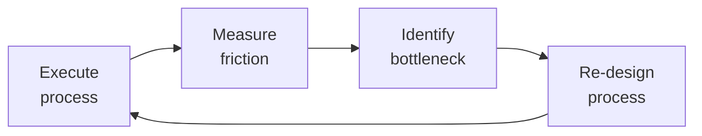

# Technical Program Manager

Technical Program Manager (TPM) — the role that bridges engineering execution across multiple teams. Unlike a PM (single project, single team) or Scrum Master (team process), the TPM owns **cross-team technical initiatives**: programs that span 3+ teams, have complex technical dependencies, and require architectural alignment. Think API migrations, platform launches, multi-team feature rollouts, deprecation programs, and infrastructure modernization.

## Route the Request
<!-- QUICK: 30s -- pick your path, skip the rest -->

What are you trying to do?
├── Building a program roadmap → Start at "Roadmap & Milestone Planning" under Sub-Skills
├── Cross-team coordination → Go to "Dependency Management" under Sub-Skills
├── Managing dependencies across teams → Jump to "Dependency Management" under Sub-Skills
├── Tracking a cross-team initiative → Go to "Program Scoping" then "Roadmap & Milestone Planning"
├── Executive reporting → Jump to "Stakeholder Communication" under Sub-Skills
├── Resource planning across programs → Go to "Risk & Change Management" under Sub-Skills
├── Managing program-level risk → Jump to "Risk & Change Management" under Sub-Skills
├── Single-project planning with WBS, Gantt? → Route to `project-manager`
├── Team-level sprint execution needed? → Route to `scrum-master`
├── Deep architecture decision needed? → Route to `system-architect`
├── Resource allocation across teams? → Route to `engineering-manager`
├── Coordinated multi-service release? → Route to `release-manager`
├── Cross-team API contract definition? → Route to `api-designer`
└── Don't know where to start? → Start at "Program Scoping"

**Do not read the entire skill.** Follow the route above and read only the sections it points to.

## Ground Rules — Read Before Anything Else

These rules apply to *every* response this skill produces.

- **Never coordinate across teams without clear ownership per deliverable.** Every dependency needs a named owner and committed date.
- **Dependency management needs buffer — things will slip.** Plan 20-30% buffer on cross-team dependencies.
- **Executive reporting must be honest about risks, not optimistic for comfort.** Red status today beats a surprise failure next month.
- **Always run an RFC or ADR for cross-cutting technical decisions.** Verbal agreements between teams don't survive turnover.
- **Stakeholder communication should match the audience.** C-suite needs summaries; engineering teams need technical detail.
- **Admit what you don't know.** If a team's architecture or capacity is unclear, escalate and clarify before committing.


## The Expert's Mindset

Master technical program managers know that operational excellence is invisible when it works — and catastrophically visible when it doesn't. They design for the 99th percentile, not the average.

| Cognitive Bias | Mitigation |
|----------------|------------|
| **Availability heuristic** — over-prioritizing the last incident | Rank problems by recurrence × impact, not recency |
| **Hero complex** — being the person who always saves the day | If you're always the hero, your system is fragile. Automate your heroism. |
| **Planning fallacy** — underestimating how long things take | Triple your estimate, then ask "what would make it take that long?" — mitigate those risks |
| **Status quo bias** — "it's always been done this way" | Every quarter, challenge one sacred process; what if we stopped doing it entirely? |

### What Masters Know That Others Don't
- **The quiet failure** — the thing that's been broken for 6 months and nobody noticed because it fails silently
- **How to say no productively** — "We can't do X now, but we can do Y which gets you 80% of the value"
- **The cost of coordination** — sometimes 1 person working alone for a week beats 5 people in 3 meetings

### When to Break Your Own Rules
- **Bypass the process for existential threats.** If the site is down, fix it first; process comes after.
- **Over-communicate during ambiguity.** When the path is unclear, silence is worse than wrong information.
## Operating at Different Levels

| Level | Scope | You... |
|-------|-------|--------|
| **L1** | Single process | Execute defined workflows reliably and flag deviations |
| **L2** | Team process | Own team-level processes; optimize for team efficiency; remove bottlenecks |
| **L3** | Department operations | Design cross-team operational workflows; make build-vs-automate decisions |
| **L4** | Org operations | Define operational strategy for the organization; set standards and tooling |
| **L5** | Industry operations | Create operational frameworks adopted across the industry |

**Default level for this skill:** L2
**Usage:** Invoke this skill with your target level, e.g., "as an L3 technical program manager, manage..."

For full level definitions, see `skills/00-framework/skill-levels/SKILL.md`.

## When to Use

- You are launching a cross-team initiative that spans 3+ engineering teams with interdependent deliverables
- You need to map dependencies across teams, identify blockers, and build a program timeline with critical path
- Your program is technically ambiguous and you need to run an RFC process or Architecture Decision Record (ADR) review
- You are managing a migration or deprecation program that requires a dual-run strategy (old and new in parallel)
- You need to estimate timelines using PERT (optimistic/pessimistic/most-likely) and track schedule risk
- You are building a RACI matrix and stakeholder communication plan for a multi-team program
- You need to define program health metrics — milestone completion rate, dependency risk score, schedule variance
- An external deadline (regulatory, contractual, market) is approaching and you need to assess the feasibility of the date

## Decision Trees
<!-- QUICK: 30s -- follow the ASCII tree to your scenario -->
```
WHAT SCOPE IS THIS INITIATIVE?
├── Single team, well-defined deliverable → This is a PROJECT. Hand off to Project Manager.
├── Single team, process-heavy → This is SCRUM. Hand off to Scrum Master.
└── 3+ teams, technical dependencies, architectural decisions → This is a PROGRAM. Own it as TPM.

IS THE PROGRAM TECHNICALLY AMBIGUOUS?
├── YES, no one knows the right architecture → Run a Technical Design Review (TDR) first.
│   Output: Architecture Decision Record (ADR) + RFC. Then proceed to program planning.
└── NO, solution pattern is known → Skip TDR. Proceed directly to dependency mapping.

HOW MANY DEPENDENCIES SPAN TEAM BOUNDARIES?
├── <5 dependencies → Lightweight tracking. Weekly sync. Shared spreadsheet or Kanban board.
├── 5-20 dependencies → Formal dependency map. Bi-weekly sync. Track blockers + owners + dates.
└── 20+ dependencies → Program board with dependency graph. Weekly dependency review meeting.
    Consider a dedicated "integration team" or "API contract first" approach.

IS THERE AN EXTERNAL DEADLINE (regulatory, contractual, market window)?
├── YES, fixed date → Use PERT estimation (optimistic/pessimistic/most-likely).
│   Track schedule risk weekly. Build 25-30% buffer into critical path.
│   If buffer < 15% remaining → ESCALATE to sponsor with options (scope cut, date push, resource spike).
└── NO, date is flexible → Use rolling-wave planning. Commit only near-term milestones.
    Re-plan quarterly. Prioritize highest-value work over fixed scope.

IS A MIGRATION OR DEPRECATION INVOLVED?
├── YES → Dual-run strategy required (old + new operating in parallel).
│   Define: cutover criteria, rollback plan, data migration verification, sunset date.
│   Key metric: % traffic/usage on new system. Target 100% before sunset deadline.
└── NO → Standard program lifecycle. Go/No-Go at each phase gate.

**What good looks like:** The output opens correctly in the target tool. All validations pass. No placeholder content remains.

```

## Core Workflow
<!-- QUICK: 30s -- scan phase titles to understand the process -->
<!-- DEEP: 10+min -->
### Phase 1 (~15 min): Program Definition & Scoping

1. **Problem Statement** — One paragraph: what problem exists, who it affects, why it matters now. Output: 3-sentence doc.
2. **Success Criteria** — Measurable outcomes (not deliverables). "P95 latency < 200ms" not "build caching layer." Output: 3-5 OKRs or KPIs.
3. **Stakeholder Map** — Power-interest grid. Identify: sponsor, decision-makers, contributors, informed. Output: RACI matrix.
4. **Scope Definition** — What's IN, what's OUT, what's a known unknown. Output: scope document (1 page).
5. **Program Charter** — Combines #1-4 + timeline estimate + resource ask. Output: charter doc for sponsor sign-off.

<!-- DEEP: 10+min -->
### Phase 2 (~30 min): Architecture & Technical Alignment

1. **Technical Design Review (TDR)** — If solution is ambiguous: gather senior engineers from all affected teams. Facilitate, don't dictate. Output: 1-3 architecture options with trade-offs.
2. **Architecture Decision Record (ADR)** — Document architectural choice, context, alternatives considered, consequences. Output: ADR in repo (see references/adr-template.md).
3. **RFC Process** — If change affects public APIs or cross-team contracts: write RFC, circulate, collect feedback (1-2 weeks), decide. Output: approved RFC.
4. **API Contract Definition** — For any cross-team integration: OpenAPI spec, gRPC proto, or event schema. Contract first, implement second. Output: versioned contract artifact.

<!-- DEEP: 10+min -->
### Phase 3 (~20 min): Planning & Dependency Mapping

1. **Work Breakdown** — Each team breaks down their scope into epics/stories. TPM validates cross-team consistency. Output: per-team backlog.
2. **Dependency Map** — For each dependency: type (technical, resource, external), owner team, blocking team, committed date, buffer. Output: dependency matrix or graph.
3. **Critical Path Analysis** — Identify the longest chain of dependent work. This is your schedule bottleneck. Output: critical path diagram.
4. **Milestone Plan** — 5-8 program-level milestones with dates, entry/exit criteria, and responsible teams. Output: milestone timeline.
5. **Resource Negotiation** — Per team: how many engineers, what skills, for how long. Resolve conflicts with engineering managers. Output: staffing plan.
6. **Risk Register** — Technical risks (scalability, data integrity), schedule risks (dependency delays), resource risks (key person dependency), organizational risks (reorgs, priority changes). Mitigation for each. Output: risk register with T-shirt sizing.

<!-- DEEP: 10+min -->
### Phase 4 (~15 min): Execution & Tracking

1. **Program Cadence** — Weekly: TPM sync with team leads (30 min). Bi-weekly: stakeholder status. Monthly: program review with sponsor. Output: meeting calendar.
2. **Dependency Tracking** — Weekly check: are dependencies on track? If any slips >3 days, trigger escalation. Output: dependency status dashboard.
3. **Program Health Dashboard** — Metrics: milestone progress (on-track/at-risk/blocked), risk score (weighted probability × impact), burndown/velocity, team health. Output: dashboard (Notion/Linear/Jira).
4. **Decision Log** — Every significant decision: date, context, options, decision, rationale, dissenting views. Output: decision log (linked to ADRs).
5. **Stakeholder Communication** — Weekly: 1-page exec summary (top 3 wins, top 3 risks, decisions needed). Monthly: program review presentation. Output: status reports.
6. **Technical Debt Tracking** — Maintain program-level tech debt register. Negotiate repayment windows between feature work. Output: tech debt backlog with priority.

<!-- DEEP: 10+min -->
### Phase 5 (~25 min): Risk & Change Management

1. **Risk Review** — Weekly: review risk register. Update probability/impact. Escalate any risk moving from Medium → High. Output: updated risk register.
2. **Change Control** — For any scope/date/resource change: impact analysis → options (cut scope, add resources, push date) → sponsor decision. Output: change request log.
3. **Escalation** — When: deadline certain to be missed, key resource lost, team conflict blocking progress >1 week, external dependency breach. Output: escalation to sponsor with 3 options.

<!-- DEEP: 10+min -->
### Phase 6 (~25 min): Closure & Transition

1. **Program Closure** — All success criteria met? All migrations complete? Old systems decommissioned? Output: closure checklist signed.
2. **Postmortem** — What went well, what went wrong, what to do differently next program. Output: postmortem doc + action items.
3. **Knowledge Transfer** — ADRs, runbooks, operational docs handed to owning teams. Output: handoff document.
4. **Metrics Retrospective** — Planned vs actual: timeline, resources, quality. Output: metrics summary for future estimation.

## Cross-Skill Coordination
<!-- QUICK: 30s -- table of who to talk to when -->
The TPM is the central coordination point for multi-team technical programs. Unlike the PM (who coordinates within a project), the TPM coordinates *across* projects, teams, and sometimes organizations.

### Decision Gates & Artifacts

- **Program Charter Approval Gate**: Program charter (problem statement, success criteria, scope boundaries, timeline estimate, resource ask) must be signed by sponsor before work begins. Output: signed charter document.
- **ADR/RFC Review Gate**: Architecture Decision Records and RFCs circulate for 1-2 weeks of feedback. CTO or `system-architect` approval required for cross-cutting architectural decisions. Output: approved ADR with decision, rationale, and consequences.
- **Milestone Go/No-Go Gate**: Each program milestone has entry/exit criteria. Milestone review with sponsor determines go (proceed), no-go (stop), or conditional-go (proceed with specific remediations). Output: milestone review decision with action items.
- **Dependency Health Gate**: Weekly dependency review. Any dependency slipped >3 days triggers escalation. Dependency risk score aggregated into program health dashboard. Output: dependency status matrix with owner, date, buffer remaining.
- **Risk Score Escalation Gate**: Risk moving from Medium → High (probability × impact crosses threshold) triggers immediate sponsor notification and mitigation activation. Output: updated risk register with mitigation plan and contingency resources.
- **Change Control Gate**: Program scope, date, or resource change requires impact analysis → options (cut scope, add resources, push date) → sponsor decision. Output: change request log with approved path.
- **Program Closure Gate**: All success criteria met, migrations complete, old systems decommissioned, knowledge transferred to owning teams. Output: closure checklist, postmortem, and metrics retrospective.

| Coordinate With | When | What to Share/Ask |
|-----------------|------|-------------------|
| **System Architect** | Architecture decisions, cross-team API design, technical feasibility | ADRs, architecture options, trade-off analysis, scalability constraints |
| **API Designer** | Cross-team API contracts, versioning, migration paths | API specs, deprecation timelines, backward compatibility requirements |
| **Engineering Leads (all teams)** | Resource allocation, technical feasibility, estimation, tech debt | Capacity, skill gaps, technical risks, team velocity, tech debt priority |
| **Project Manager** | Individual team project plans roll up to program | Milestone dates, resource conflicts, team-level risks, change requests |
| **Scrum Master** | Sprint impacts, team health, impediments | Sprint goals affected, velocity trends, cross-team impediments |
| **Product Strategist / Product Manager** | Feature prioritization, scope trade-offs, business value | Program scope vs roadmap alignment, feature cut options, success criteria |
| **CTO Advisor** | Major architecture decisions, build-vs-buy, technical strategy | ADRs needing CTO sign-off, strategic technical risks, platform direction |
| **DevOps / Infrastructure** | Environments, deployment coordination, CI/CD pipeline changes | Environment needs, deployment sequencing, infrastructure dependencies |
| **QA Lead** | Cross-team testing strategy, integration testing, regression scope | Test environment needs, cross-team test coordination, quality gates |
| **Security Reviewer / Security Engineer** | Security review gates, threat modeling for cross-team flows | Security requirements, pen test scheduling, vulnerability remediation timeline |
| **Database Designer** | Schema changes spanning teams, data migration planning | Migration scripts, data integrity verification, rollback procedures |
| **Observability Engineer** | Cross-service monitoring, SLO definitions, alerting | Service dependencies, SLO targets, dashboard requirements |
| **Incident Responder** | Multi-service incidents, cross-team on-call coordination | Escalation paths, runbooks, incident command structure |
| **Migration Architect** | Deprecation/migration programs, dual-run strategy | Migration milestones, cutover criteria, rollback plans |
| **Legal Advisor / Compliance Officer** | Regulatory deadlines, contractual obligations | Compliance milestones, audit requirements, regulatory risk |

### Communication Triggers — When to Proactively Notify

| Trigger | Notify | Why |
|---------|--------|-----|
| Critical path delayed by >1 week | Sponsor, All Team Leads, Product | Delivery date impact; scope/date/resource trade-off decision |
| Dependency blocked >3 days | Dependent team lead, Affected teams | Cascade effect on downstream teams; mitigation options |
| Key resource (staff engineer, tech lead) leaves or is reallocated | Sponsor, Engineering Managers | Program timeline at risk; replacement or scope reduction needed |
| Architecture decision reverses earlier ADR | All Team Leads, System Architect, CTO | Teams may need to re-implement; cost of change |
| External dependency (vendor, partner API) misses committed date | Sponsor, Legal (if contractual), All affected teams | Schedule cascade; contract enforcement or workaround |
| Risk score crosses threshold (Medium → High) | Sponsor, Affected Team Leads | Mitigation activation; may need contingency resources |
| Program scope change proposed by stakeholder | Product Manager, All Team Leads, Sponsor | Impact analysis needed; trade-off decision before approval |
| Migration milestone at risk (cutover date slipping) | All teams, Operations, Sponsor | Dual-run costs; sunset timing impact |
| Cross-team conflict unresolved for >1 week | Engineering Managers, Sponsor | Authority needed to break deadlock; architectural or resource decision |

### Escalation Path

| Situation | Escalate To | Rationale |
|-----------|------------|-----------|
| Program no longer aligned with business strategy | **CTO Advisor** + Sponsor + Product Strategist | Stop-work or re-scope decision; executive alignment |
| >30% schedule overrun with no recovery path | **Sponsor** + CTO Advisor + All Engineering Managers | Re-baseline or terminate; resource reallocation |
| Cross-team architectural deadlock (teams cannot agree) | **System Architect** + CTO Advisor | Technical authority to break tie; ADR with final decision |
| Key vendor breach of contract or non-delivery | **Legal Advisor** + Sponsor + Procurement | Contractual remedy; legal action; alternative vendor |
| Regulatory/compliance deadline at risk | **Legal Advisor** + Regulatory Specialist + Sponsor | Regulatory exposure; external notification requirement |
| Team conflict affecting delivery despite mediation attempts | **Engineering Managers** + HR + Sponsor | Team composition change or mediation beyond TPM scope |
| Security vulnerability discovered mid-program affecting architecture | **Security Engineer** + CTO Advisor + All Team Leads | May require architecture change; full impact assessment |

### Route to Other Skills

| If the Request Involves | Route To | Rationale |
|--------------------------|-----------|-----------|
| Single-project planning with WBS, Gantt charts, RAID log | `project-manager` | PM owns single-project scope; TPM handles multi-team scope |
| Team-level sprint execution and agile ceremonies | `scrum-master` | SM facilitates team process; TPM coordinates across teams |
| Architecture decisions requiring deep domain expertise | `system-architect` | Architect owns technical design decisions; TPM facilitates the ADR process |
| Resource allocation and engineering capacity planning | `engineering-manager` | Engineering managers control team composition and allocation |
| Coordinated release across multiple services | `release-manager` | Release logistics and deployment sequencing |
| Cross-team API contract definition | `api-designer` | API contracts need formal specification before teams implement |
| Executive strategy and portfolio-level prioritization | `vp-engineering` or `director-engineering` | Strategic decisions beyond program scope |

## Proactive Triggers
<!-- QUICK: 30s -- trigger-action table for autonomous TPM workflow -->

The TPM detects cross-team friction before it becomes a delivery blocker. Every trigger is tied to an observable signal in the dependency matrix, milestone tracker, or ADR log.

| Trigger | Action | Why |
|---------|--------|-----|
| Dependency has no named owner 48 hours after being identified | Escalate to the `engineering-manager` of the owning team; if still unowned after 24 more hours, escalate to program sponsor; log the gap in the weekly exec summary | An unowned dependency is not a dependency — it's a wish. Dependencies without owners within 48 hours have a >90% chance of slipping |
| `system-architect` identifies that two teams have designed conflicting API contracts for the same integration point | Schedule an emergency API contract alignment session with both teams' tech leads and the `system-architect`; freeze both teams' implementation on that contract until alignment is reached; publish a decision ADR within 48 hours | Conflicting contracts silently diverge — the integration cost grows exponentially the longer teams build against incompatible assumptions |
| 3+ teams report the same external blocker (vendor API change, platform migration, infra dependency) | Consolidate into a single program-level risk with shared mitigation; assign a single owner to coordinate the response; communicate once to all teams instead of 3 separate threads | Duplicate coordination effort is the TPM's #1 waste — if 3 teams are solving the same problem independently, the TPM has failed to see the pattern |
| Milestone is 2 weeks from deadline with <40% of exit criteria met | Call a milestone risk review with all team leads; present the gap analysis; propose options: (a) de-scope non-critical criteria, (b) add resources with explicit ramp cost, (c) re-baseline the milestone date — require sponsor decision within 3 business days | Milestone optimism bias compounds: teams report "on track" until 1 week before, then discover they're 4 weeks behind. The 2-week/40% rule catches this early |
| ADR has been in "proposed" state for >3 weeks with unresolved comments | Facilitate a 30-min decision meeting with all commenters; enforce the rule: "disagree and commit" after the meeting; the `cto-advisor` or `system-architect` breaks ties; publish the decision within 24 hours | ADR stagnation is architecture by indecision — the cost of no decision exceeds the cost of a suboptimal decision after 3 weeks |
| Program risk register has no HIGH-severity items but 15+ MEDIUM items — risk inflation without acknowledgment | Review each MEDIUM risk: if it hasn't moved in 2 review cycles, either (a) it's actually LOW (downgrade it), (b) it's being avoided (upgrade it to HIGH and activate mitigation), or (c) it's no longer relevant (close it) | Risk inflation dilutes the register's value — a PM with 20 MEDIUM risks manages none of them. Force the hard triage |
| Two engineering teams are in a technical deadlock (each waiting for the other to build first) for >5 days | Escalate to `system-architect` for a binding technical decision documented as an ADR. Define the interface contract first — both teams can then build to the contract independently. | Cross-team deadlocks don't resolve themselves — they freeze in place. A binding architecture decision breaks the stalemate; an ADR makes the rationale permanent |
| Program has been in execution for 2+ months and no decisions have been reversed — every ADR was correct on first pass | That's statistically impossible. Audit the decision log: the team is either not revisiting decisions when context changes, or not documenting decisions honestly | Zero reversed decisions is not a sign of perfect execution — it's a sign that the program isn't learning. Healthy programs reverse 10-20% of decisions as context evolves |

### Service Interaction: TPM → System Architect

The TPM-to-System-Architect relationship is the bridge between program execution and technical integrity. The TPM owns the timeline; the architect owns the design quality. They negotiate the boundary constantly.

| Interaction Point | What TPM Provides | What System Architect Needs |
|-------------------|-------------------|---------------------------|
| **ADR facilitation** | Deadline, decision-makers list, stakeholder map, business context for trade-offs | Technical option analysis, trade-off matrix (latency vs consistency vs cost), recommended approach with rationale |
| **Cross-team dependency mapping** | Dependency matrix with owners, dates, and buffers; escalation triggers for unowned dependencies | System boundary diagram showing which teams own which services; API contract ownership; data flow between systems |
| **Technical risk assessment** | Business impact quantification (revenue at risk, users affected, SLA exposure) | Probability assessment based on codebase complexity, team experience, and architectural coupling; mitigation options |
| **Milestone definition** | Business milestones with hard external dates (regulatory, contractual, market window) | Technical milestones: architecture review complete, API contracts published, integration test passing, load test at 2x target |
| **Architecture change management** | Change impact analysis (schedule delta, team reallocation, cost of delay); sponsor escalation | Why the change is necessary (new constraint, discovered limitation, better approach); what the migration path looks like; what breaks if we don't change |

## Scale Depth
<!-- QUICK: 30s -- find your team size column -->
### Solo (1 person, < 2 teams)
- **What changes**: No formal program. You ARE the program. Lightweight dependency tracking in a todo list.
- **What's overkill**: RACI, formal ADRs, program dashboards, milestone plans, PERT estimation, dedicated program reviews.
- **Coordination needs**: Async updates in Slack. Bi-weekly check-in with stakeholder. No cross-team ceremonies.
- **Cost implications**: $0 tools. Time cost: 2-4 hours/week on program overhead.
- **Transition trigger to Small**: Adding a second team OR an external dependency OR a fixed deadline >1 month out.

### Small (2-10 people, 3-5 teams)
- **What changes**: Formal dependency map. Weekly TPM sync (30 min). Written status updates. Risk register (top 10).
- **What's overkill**: Program dashboards, dedicated program manager tooling, formal change control board, PERT/Monte Carlo estimation (use three-point estimates instead).
- **Coordination needs**: Weekly sync with all team leads. Bi-weekly stakeholder update (1-page). Dependency tracking spreadsheet.
- **Cost implications**: $0-200/year. Time cost: 8-12 hours/week. Shared spreadsheet or GitHub Projects for tracking.
- **Transition trigger to Medium**: 5+ teams OR 20+ cross-team dependencies OR 3+ concurrent programs OR external regulatory deadline.

### Medium (10-50 people, 5-15 teams)
- **What changes**: Full program management. RACI for every workstream. Formal ADR process. Program dashboard. Weekly dependency review. Dedicated TPM (full-time). Change control process. PERT estimation for critical path.
- **What's overkill**: Monte Carlo simulation (use PERT), dedicated program management office (PMO), portfolio-level tracking, earned value management.
- **Coordination needs**: TPM runs weekly dependency sync (all team leads). Bi-weekly program review with sponsor. Monthly steering committee. Program dashboard auto-updated. Decision log maintained.
- **Cost implications**: $500-5K/year on tools (Linear/Notion/Jira Premium). Time cost: full-time TPM + fractional support from team leads.
- **Transition trigger to Enterprise**: 15+ teams OR 3+ concurrent programs sharing resources OR >$1M program budget OR C-level sponsor OR enterprise compliance requirements.

### Enterprise (50+ people, 15+ teams, multiple programs)
- **What changes**: Program Management Office (PMO) or portfolio TPM team. Resource capacity planning tools (Float, Resource Guru). Formal phase-gate reviews. Monte Carlo simulation for schedule confidence. Earned value management. Standardized charter/RFC/ADR templates. Executive dashboard with portfolio view.
- **What's overkill**: Nothing is overkill at this scale, but avoid process for process's sake — every artifact must have a consumer.
- **Coordination needs**: TPM team meets weekly for portfolio sync. Monthly program reviews with CTO/VP-level sponsors. Quarterly steering committee with CEO. Dedicated integration team for cross-program coordination.
- **Cost implications**: $20K-100K/year on tools + dedicated TPM headcount (1 TPM per 2-3 programs). Time cost: 3-5 full-time TPMs.
- **Key risk**: Conway's Law — program structure mirrors org structure. Re-org may be needed before program re-plan.

### Transition Triggers Summary

| From → To | Trigger |
|-----------|---------|
| Solo → Small | Second team joins OR external dependency appears OR fixed deadline >1 month |
| Small → Medium | 5+ teams OR 20+ dependencies OR 3+ concurrent programs |
| Medium → Enterprise | 15+ teams OR portfolio-level resource sharing OR C-level sponsor |
| Enterprise → Medium | Program concludes, postmortem done, ongoing ownership handed to platform team |


### Cross-skills Integration

| Step | Skill | What it produces |
|------|-------|------------------|
| **Before** | project-manager | Project schedule, resource plan, RAID log, stakeholder map |
| **This** | technical-program-manager | Program roadmap, cross-team dependency map, ADRs, executive reports |
| **After** | scrum-master | Sprint plans per team, backlog refinement, velocity tracking |

Common chains:
- **Chain**: project-manager → technical-program-manager → scrum-master — Individual project plans are integrated into a multi-team program; scrum masters drive sprint-level execution.
- **Chain**: ceo-strategist → technical-program-manager → release-manager — Strategic initiative gets program-level orchestration; release manager coordinates the launch.

## What Good Looks Like

> When technical program management is done right, cross-team dependencies are mapped and tracked so that no team is blocked waiting on another, architectural decisions are documented as ADRs with clear rationale and trade-offs, executive stakeholders receive concise reports that surface the decisions they need to make, technical risks are identified and mitigated before they threaten the timeline, and multiple engineering teams move in concert toward a shared milestone — the program runs so smoothly that the TPM's orchestration is nearly invisible.

## Sub-Skills
<!-- QUICK: 30s -- table of deeper dives by topic -->
| Sub-Skill | When to Use | Context |
|-----------|-------------|---------|
| **Program Scoping** | New program initiation. Ambiguous problem space. Multiple stakeholders with conflicting priorities. | Define problem statement, success criteria, scope boundaries, stakeholder map, program charter. |
| **Dependency Management** | Cross-team initiative with 5+ inter-team dependencies. External vendor/API dependencies. | Map dependencies by type (technical, resource, external). Track owners, committed dates, buffers. Weekly dependency review. |
| **Technical Design Review Facilitation** | Solution architecture is ambiguous. Multiple valid approaches exist. Teams disagree on technical direction. | Schedule TDR, invite senior engineers from all affected teams, facilitate option generation and trade-off analysis, drive to ADR. |
| **ADR & RFC Process** | Architecture decision cross-cuts teams. Public API or contract change. Build-vs-buy decision. | Write ADR (context, decision, alternatives, consequences). RFC for public contracts. Circulate 1-2 weeks. Decide and communicate. |
| **Roadmap & Milestone Planning** | Program spans >2 months. Multiple teams with sequenced deliverables. External commitments with dates. | Create milestone timeline (5-8 milestones). Define entry/exit criteria per milestone. Track progress weekly. |
| **Stakeholder Communication** | >3 stakeholder groups with different information needs. C-level sponsor. External stakeholders. | RACI for decisions. Weekly 1-page exec summary. Monthly program review. Self-serve dashboard for status. |
| **Risk & Change Management** | High-uncertainty program. Fixed external deadline. Novel technology. Resource-constrained. | Risk register with T-shirt sizing (L/M/S), probability, impact, mitigation. Change control: impact analysis → options → decision. |
| **API Contract Negotiation** | Teams need to agree on API contracts. Migration from one API version to another. Event schema changes spanning teams. | Contract-first approach. OpenAPI/gRPC/AsyncAPI specs. Versioning strategy. Deprecation policy. Contract testing. |
| **Migration Program Management** | System deprecation. Platform migration. Data migration. Dual-run transition. | Define: cutover criteria, rollback plan, data verification, sunset date. Track: % traffic on new system. Sunset old system only after 100% migration. |
| **Program Health & Metrics** | Sponsor asks "are we on track?" Need objective program health data. | Metrics: milestone progress (on-track/at-risk/blocked), risk score, burndown/velocity, dependency health, team satisfaction. Dashboard auto-updated weekly. |

## Best Practices
<!-- STANDARD: 3min -- rules extracted from production experience -->
- **TPM ≠ PM + technical knowledge**: A TPM manages technical *alignment* across teams, not project tasks within a team. If you're updating Jira tickets, you're doing PM work, not TPM work.
- **Contract first, implement second**: Before Team A builds an integration with Team B, agree on the API contract (OpenAPI spec, event schema, gRPC proto). Version it. Both teams build against the contract. This is the single highest-leverage TPM practice.
- **ADR before implementation, not after**: Architecture Decision Records capture *why* a decision was made. Without them, 6 months later no one remembers why Redis was chosen over Memcached and the program pays for it again.
- **Dependency map is your program's skeleton**: If you can't draw the dependency graph, you don't understand the program. Every dependency must have: owner team, blocking team, committed date, buffer. If a dependency has no owner, it WILL slip.
- **Bad news ages like milk**: If a critical path dependency slips, escalate within 24 hours. A 3-day slip caught early is a scope negotiation. A 3-week slip caught late is a crisis.
- **One decision-maker per decision**: RACI is not optional at scale. Every decision in the decision log must have exactly one "A" (Accountable). "Everyone agrees" without a named decider = no one decides.
- **Program health is a lagging indicator of dependency health**: If all dependencies are on track, the program is on track. Track dependency health obsessively. Program health dashboards that don't include dependency status are lying to you.
- **Dual-run everything for migrations**: Never cut over in one big-bang. Old system and new system run in parallel. Ramp traffic gradually. Verify data consistency. Have a rollback path. Sunset only when new system reaches 100% for 1 full cycle.
- **Estimate with uncertainty, communicate with confidence intervals**: "Q3" is not a date. "Q3 with 80% confidence" is. Use PERT: (optimistic + 4×most-likely + pessimistic) ÷ 6. Share the range, not a single date.
- **The TPM's output is decisions, not documents**: Every artifact (charter, ADR, status report, risk register) exists to drive a decision. If no decision is being made, stop producing the artifact.

## Anti-Patterns
<!-- STANDARD: 3min -- common failure modes and their correct alternatives -->

| ❌ Anti-Pattern | ✅ Do This Instead |
|-----------------|---------------------|
| **TPM as super-PM**: Attending every team's standup, updating Jira tickets, tracking individual tasks across 5 teams | TPM manages cross-team *alignment*, not intra-team execution. If you're updating tickets, you're doing the `scrum-master`'s job. Your unit of work is the dependency, not the task |
| **Contract-after-implementation**: Teams build for 6 weeks against verbal API agreements, then "integrate" — discovering mismatches that take 2x the build time to fix | Contract-first, always. Define OpenAPI/gRPC/AsyncAPI specs before any implementation. Version the contract. Both teams build against the spec. The integration should be a 1-day verification, not a 3-week discovery |
| **The optimistic status report**: "We're nearly on track" when critical path items are slipping — stakeholders discover the real state at the monthly review | Report confidence intervals, not single dates. "Q3 with 80% confidence" is honest. "We're on track" when you're not is a trust-destroying event waiting to happen. Bad news ages like milk |
| **ADR as documentation, not decision**: Writing the ADR *after* implementation to document what was built, instead of *before* to decide what to build | ADRs exist to drive a decision. If implementation has started, the ADR is a post-hoc justification, not a decision record. Write the ADR, get approval, then build |
| **Dependency tracking by spreadsheet that nobody updates**: Beautiful dependency matrix created at kickoff, never touched again, becomes fiction by week 3 | Dependency review is a weekly working session, not a document. Review every dependency in a 30-min sync: owner still committed? date still valid? buffer remaining? Update in real time |
| **Migration without cutover criteria**: "We'll switch when we're confident" — running dual systems for 8+ months because "done" was never defined | Define quantitative cutover criteria before migration starts: latency within 10%, zero data errors for 7 days, error rate <0.1%. Set a hard sunset date. If criteria aren't met by sunset, escalate to sponsor |
| **RACI as decoration**: RACI matrix created at kickoff, posted on the wiki, never referenced again — decisions still require 5 meetings to resolve | RACI is a working decision framework. Every decision that goes to the wrong person is a RACI failure. Review RACI monthly: are decisions flowing to the right accountable person? Update when team composition changes |
| **Program metrics that measure activity, not outcomes**: "15 ADRs written, 40 meetings held, 200 Slack messages" — impressive activity, zero insight into whether the program is on track | Measure: milestone exit criteria met (%), dependencies on track (%), risk score trend (↓ is good), decisions made on time (%). Activity is a vanity metric; milestone progress is the only truth |


<!-- DEEP: 10+min -->
## Error Decoder

| Symptom | Root Cause | Fix | Lesson |
|---------|------------|-----|--------|
| Integration between Team A and Team B took 3 months instead of 3 weeks | Teams started implementing against verbal API contracts -- when they integrated, the request/response schemas did not match, requiring a rewrite | Mandate contract-first development: define OpenAPI spec or gRPC proto before any implementation. Version the contract. Both teams build against the spec, not each other's interpretation. | A verbal API contract is not a contract. If the spec is not documented and versioned before implementation starts, your integration timeline will double. Contract first, implement second. |
| Migration program ran 8 months over schedule because the dual-run period was indefinite | Cutover criteria were "when we are confident it works" -- no quantitative thresholds for switching traffic. The team kept running both systems indefinitely. | Define specific cutover criteria before the migration starts: latency within 10% of old system, zero data integrity errors for 7 days, less than 0.1% error rate. Set a hard sunset date with executive sign-off. | A migration without quantitative cutover criteria is a permanent dual-run. Define "done" before you start, or you will never finish. A hard sunset date creates the urgency to resolve the last 5% of issues. |
| Critical cross-team dependency had no owner -- blocked the program for 3 weeks | Dependency was identified in the kickoff but assigned to "the team that will build it" -- no named owner, no committed date | Every dependency must have: a named owner, a committed date, and a buffer. Track in a dependency matrix with weekly review. Any dependency without an owner for more than 48 hours escalates to the sponsor. | A dependency without a named owner is not a dependency -- it is a wish. If nobody owns it, nobody will build it. Assign owners before you assign dates. |
| Exec sponsor found out about a schedule slip at the monthly review -- canceled the program | TPM was giving optimistic updates ("we are nearly on track") instead of reporting the real risk to the critical path | Report the worst-case, not the best-case, to exec sponsors. Use PERT confidence intervals: "80% confidence: Q3 delivery." Escalate any critical path slip within 48 hours. | Executives value predictability over optimism. A schedule slip reported early is a manageable problem. A schedule slip discovered at the monthly review is a leadership crisis. Trust is built on truthful updates, not safe updates. |
| The program built the wrong architecture because no ADR was written for a foundational decision | Key architecture choice was made in a hallway conversation between two senior engineers -- the rest of the team implemented against assumptions that turned out wrong | Document every significant architecture decision as an ADR (context, decision, alternatives, consequences). Circulate for review before implementation. Require ADR approval for any cross-cutting technical choice. | Architecture decisions made in hallways create assumptions that diverge silently. An ADR does not slow down decision-making -- it prevents the 10x cost of implementing against wrong assumptions. |
| Program had a clear dependency map at kickoff, but by month 3 the map was obsolete — 4 new dependencies emerged from unplanned work and 2 committed dependencies were silently descoped by their owning teams | Dependency tracking was treated as a one-time kickoff artifact, not a living process. No weekly review cadence was established, so changes accumulated invisibly | Institute a mandatory 30-min weekly dependency sync with all team leads. Every dependency gets a status: ON_TRACK, AT_RISK (buffer <50%), BLOCKED. Dependencies that change status trigger immediate notification to dependent teams. | A dependency map is a living document, not a kickoff artifact. Dependencies decay at ~15% per week without active management. The TPM's highest-leverage weekly ritual is the dependency review — skip it and the program drifts blind. |
| Cross-team integration testing was scheduled for the final milestone, but when teams integrated, 12 critical bugs were discovered — adding 6 weeks to the timeline | "Integration at the end" is waterfall thinking applied to an agile program. Teams tested in isolation and assumed integration would be smooth because "the API contracts match" | Schedule integration testing at every milestone, not just the final one. After each team completes a contract-dependent feature, run an integration smoke test within 48 hours. Make "cross-team integration test passing" an exit criterion for every milestone, not just the final one. | API contract conformance does not guarantee integration success. Contracts define the happy path; integration tests discover the edge cases. Integrate early and often — the cost of finding an integration bug grows exponentially with time since the code was written. |
| Program sponsor demanded a "single date" commitment and the TPM gave one — which was missed by 4 months | The TPM collapsed a PERT distribution (optimistic 6 months, most-likely 9 months, pessimistic 14 months) into a single "9 months" number because "stakeholders don't like ranges" | Never communicate a single date for programs with >30% uncertainty. Use confidence intervals: "80% confidence: Q3-Q4 delivery." Explain what changes the range: staffing, scope, external dependencies. Update the range as uncertainty resolves. | A single date is a lie when uncertainty is high. Stakeholders who demand false precision are asking you to manage their anxiety, not the program. Teach them to read confidence intervals — they'll trust you more when you tell them what you don't know. |


## Production Checklist
<!-- QUICK: 30s -- binary pass/fail items. All must pass. -->
- [ ] **[S1]**  Program charter written and signed by sponsor with clear success criteria (measurable OKRs/KPIs)
- [ ] **[S2]**  Stakeholder map complete with RACI for all major decisions
- [ ] **[S3]**  Scope defined: what's IN, what's OUT, what's a KNOWN UNKNOWN
- [ ] **[S4]**  Technical Design Review completed (if architecture ambiguous); ADRs published
- [ ] **[S5]**  API contracts defined and versioned for all cross-team integrations
- [ ] **[S6]**  Dependency map complete: every dependency has owner team, blocking team, committed date, buffer
- [ ] **[S7]**  Critical path identified with buffer (25-30% for fixed-date programs)
- [ ] **[S8]**  Milestone plan established: 5-8 milestones with entry/exit criteria
- [ ] **[S9]**  Resource plan confirmed with all engineering managers — no over-allocations >120%
- [ ] **[S10]**  Risk register initialized with ≥10 risks, T-shirt sized, with mitigation plans
- [ ] **[S11]**  Change control process documented and socialized to all teams
- [ ] **[S12]**  Program cadence established: weekly TPM sync, bi-weekly stakeholder update, monthly review
- [ ] **[S13]**  Program health dashboard live with milestone progress, dependency status, risk score
- [ ] **[S14]**  Decision log started — every significant decision recorded with rationale
- [ ] **[S15]**  Escalation path defined with triggers and named decision-makers
- [ ] **[S16]**  Communication plan: exec summary template, stakeholder update cadence, self-serve dashboard
- [ ] **[S17]**  Technical debt register maintained with repayment windows negotiated
- [ ] **[S18]**  If migration program: dual-run strategy, cutover criteria, rollback plan, sunset date defined
- [ ] **[S19]**  Program closure criteria defined (all success criteria met, old systems decommissioned, knowledge transferred)
- [ ] **[S20]**  Postmortem scheduled at program midpoint and program closure

## Footguns
<!-- DEEP: 10+min — war stories from multi-team program execution -->

| Footgun | What Happened | Root Cause | How to Prevent |
|---------|---------------|------------|----------------|
| No ADR was written for the foundational architecture decision — 4 teams spent 3 months building against incompatible assumptions, then spent 3 more months in rework | A TPM at a fintech company kicked off a 5-team program to rebuild the payments platform in March 2023. The tech leads agreed on "event-driven architecture with Kafka" in a 30-minute whiteboard session. No ADR was written. Team A built with Avro schemas. Team B built with Protobuf. Team C used JSON. Team D assumed exactly-once semantics; Team A built for at-least-once. The incompatibilities were discovered in August during integration testing. Rework consumed September-November. The program, originally targeted for December 2023, launched in June 2024. The TPM was reassigned. | The TPM assumed "tech leads agreed" meant "decisions are documented and understood." Agreement in a meeting without written record is gossip. Each team implemented their own interpretation. The TPM treated architecture decisions as engineering's job, not a program risk. | **The first ADR is the TPM's highest-leverage artifact.** Before any team writes code, document the shared architecture decisions: schema format, consistency model, API contract, error handling, deployment model. Circulate the ADR for written approval from every tech lead. Publish it in a shared location. At every milestone review, audit 2-3 integration points against the ADR. If an ADR changes, treat it as a program-level scope change with full impact assessment. |
| Dependency map created at kickoff was never updated — by month 3 it was 40% obsolete, 2 teams blocked for 6 weeks because a dependency they relied on was silently descoped | A TPM for a cloud migration program created a beautiful dependency map at kickoff (January 2024) with 47 cross-team dependencies. By March, 12 new dependencies had been created by unplanned work, and 7 existing dependencies were quietly descoped when their owning teams reprioritized. The TPM didn't discover this until April, when Team Payment was blocked for 3 sprints waiting for a security review that Team Platform had cancelled in February. Team Payment's EM escalated to the VP. | Dependency tracking was treated as a one-time kickoff artifact, not a living process. No weekly review cadence meant changes accumulated invisibly. The TPM assumed "no news is good news" on dependencies — but no news means you're not asking. | **Dependencies decay at ~15% per week without active management.** Institute a mandatory 30-minute weekly dependency sync with all team leads. Every dependency gets: ON_TRACK, AT_RISK (buffer <50%), or BLOCKED. Changes in status trigger immediate notification to dependent teams. Track dependency freshness: if a dependency hasn't been actively confirmed in 2 weeks, it's AT_RISK by default. The TPM's highest-leverage 30 minutes every week is the dependency review. |
| Cross-team integration testing was scheduled for the final milestone — when all 5 teams integrated, 12 critical bugs were discovered, adding 6 weeks to the timeline | A TPM planned a platform launch with 5 teams building independently against a shared API contract. Integration testing was the final milestone — "we'll plug everything together and it'll just work because the contracts match." On integration day (September 2024), 12 critical bugs emerged: Team A's pagination token format differed from Team B's expectations, Team C's error responses didn't match the contract, Team D's retry logic triggered on Team E's 429 responses and created a thundering herd. The program sponsor added 6 weeks of integration hardening to the timeline. | "Integration at the end" is waterfall thinking applied to an agile program. API contract conformance does not guarantee integration success — contracts define the happy path, integration tests discover the edge cases. | **Integrate at every milestone, not just the final one.** After any team completes a feature with a cross-team contract, run an integration smoke test within 48 hours. Make "cross-team integration tests passing for all completed features" an exit criterion for every milestone. The cost of finding an integration bug grows exponentially with time since the code was written — a bug found 2 days after writing takes 2 hours to fix; a bug found 2 months later takes 2 days. |
| TPM collapsed a PERT distribution (optimistic: 6 months, most-likely: 9 months, pessimistic: 14 months) into a single "9 months" commitment because "stakeholders don't like ranges" — program delivered in 13 months and the TPM lost all credibility | A TPM estimated a regulatory compliance program using PERT: P50 delivery at 9 months, P90 at 14 months. The CFO demanded "a date, not a statistical exercise." The TPM gave "Q3" based on the P50. The program experienced 3 of the 5 identified risks — exactly what the P90 scenario predicted — and delivered in 13 months (Q1 of the following year). The CFO considered the TPM 4 months late and "unreliable." The TPM was not assigned to the next program. | The TPM capitulated to stakeholder discomfort with uncertainty instead of teaching stakeholders to read confidence intervals. "They don't like ranges" is a communication failure, not a stakeholder defect. | **Never communicate a single date when uncertainty exceeds 30%.** Use confidence intervals: "80% confidence: Q3-Q4 delivery." Explain what changes the range: staffing, scope, external dependencies. At every program review, update the range as uncertainty resolves. Stakeholders who demand false precision are asking you to manage their anxiety, not the program. Teach them: "A range is honest — a single date when uncertainty is high is a lie dressed as precision." If forced to give a single date, give the P90 and explain what must go right to deliver earlier. |
| Risk register had 45 risks, each tagged with a T-shirt size and a 2-sentence mitigation — when risk #23 materialized (critical vendor bankruptcy), nobody knew the dollar impact, contingency budget, or decision authority | A TPM maintained a comprehensive risk register with 45 identified risks for a $12M ERP implementation. Every risk had a T-shirt size (S/M/L) and a mitigation like "monitor vendor financial health." When the implementation vendor filed for Chapter 11 in month 8 of the program, the TPM escalated to the sponsor. The sponsor asked: "What's the financial exposure? What's our contingency budget? Can we switch to a competitor? How long would that take?" The TPM had none of these answers. The program was paused for 6 weeks while leadership assessed options. $3.2M was written off. | The risk register was a compliance artifact, not a decision-making tool. T-shirt sizes don't enable financial decisions — risks need dollar impact estimates and quantified probability. "Monitor vendor" is not a mitigation — it's a wish. | **Every risk in the register must be decision-ready.** Format: "If this risk materializes, the impact is $X cost + Y weeks schedule + Z probability. Our mitigation is [specific action with owner and deadline]. Our contingency is [specific plan with trigger and approval]. Decision authority for the contingency: [name]." Any risk without dollar and schedule impact, or without a named decision-maker for the contingency, is not a real risk — it's a worry. Delete risks that don't meet this bar. A register with 10 decision-ready risks is 100x more valuable than 45 T-shirt-sized worries. |

## Calibration — How to Know Your Level
<!-- STANDARD: 3min — honest self-assessment -->

| You Know You're Stuck at L1 When... | You Know You've Reached L2 When... | You Know You're L3 When... |
|---|---|---|
| You can run a program status meeting and take notes, but the status you report is what team leads tell you — you haven't independently verified a single deliverable | You've led a multi-team program where you predicted the delivery window (quarter-level) at kickoff and were right within 1 month — and you have the initial estimate vs. actual delivery documented | A VP hands you 5 teams that have never worked together, a 2-page product brief with no technical design, and says "make it happen by Q4" — and you deliver within the original window |
| Your dependency map exists as a Miro board you update "when something changes" — but you don't know how many dependencies are currently AT_RISK without opening the board | Every dependency in your program has an owner, a committed date, and a buffer percentage that you review weekly — and when a dependency slips, dependent teams know within 24 hours | You can walk into any room in the company, hear about a cross-team dependency problem, and within 15 minutes identify whether it's a coordination failure, a commitment failure, or a technical impossibility — and you're right 90%+ of the time |
| When a stakeholder asks "when will it ship?" you give a date based on the team's most recent estimate without qualifying confidence level or assumptions | You communicate delivery as a confidence interval with explicit assumptions, and you update the interval at every milestone review — stakeholders have stopped asking "is it still on track?" because they trust the interval | An SVP says "I don't trust program estimates anymore because every TPM has been wrong" — you rebuild that trust within 2 programs, and the SVP starts using your confidence intervals in board presentations |

**The Litmus Test:** A company is 12 months into an 18-month platform migration with 8 teams. The CTO just found out 3 teams are 4 months behind and 2 key dependencies have been silently descoped. The CTO calls you in on Monday morning. Can you produce a credible 90-day recovery plan — including what to descope, what to resequence, and who needs to change — by Friday? If you've never been the person they call when a program is on fire, you're not L3 yet.

## Deliberate Practice



| Level | Practice | Frequency |
|-------|----------|-----------|
| **Novice** | Document your current workflow; highlight every step that requires human judgment or waiting | Monthly |
| **Competent** | Run a "process autopsy" on a recent initiative: what took longest, where were the miscommunications? | Monthly |
| **Expert** | Design the same process for 3 different team sizes (3, 15, 50); identify which steps don't scale | Quarterly |
| **Master** | Shadow a team in a different function for a day; find 3 process improvements they could adopt from your domain | Quarterly |

**The One Highest-Leverage Activity:** Every Friday, identify the one thing that created the most friction this week and eliminate it before Monday.

## References
<!-- QUICK: 30s -- links to deeper reading -->
- **Internal**: `references/adr-template.md` — Architecture Decision Record template with sections: context, decision, alternatives considered, consequences, status.
- **Internal**: `references/program-charter-template.md` — Program charter template: problem statement, success criteria, scope, stakeholders, timeline, resource ask.
- **Internal**: `references/dependency-map-template.md` — Dependency tracking spreadsheet template with columns: ID, type, description, blocking team, dependent team, committed date, buffer, status, escalation.
- **Internal**: `references/status-report-template.md` — 1-page weekly exec summary template: top 3 wins, top 3 risks, decisions needed, milestone progress.
- **External**: [Google TPM Guide](https://www.youtube.com/watch?v=VLOhKkHGjBg) — Google's approach to Technical Program Management
- **External**: [PERT Estimation Technique](https://en.wikipedia.org/wiki/Program_evaluation_and_review_technique) — Three-point estimation for schedule uncertainty
- **External**: [Architecture Decision Records (ADR)](https://adr.github.io/) — ADR format and best practices
- **External**: [RACI Matrix Guide](https://www.projectmanager.com/blog/raci-chart-made-easy) — RACI for cross-team decision accountability
- **External**: [Conway's Law](https://martinfowler.com/bliki/ConwaysLaw.html) — System design mirrors communication structures
- **External**: [Writing Effective RFCs](https://rust-lang.github.io/rfcs/) — Rust's RFC process as a model for technical decision-making
