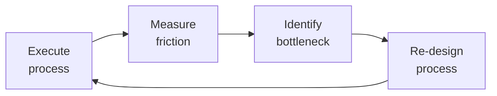

# Technical Writer

Technical documentation system covering the full documentation lifecycle — from API reference generation to architecture decision records to knowledge base management. Designed for developer-tooling, platform, and infrastructure teams.

## Route the Request
<!-- QUICK: 30s -- pick your path, skip the rest -->

What are you trying to do?
├── API documentation (OpenAPI) → Start at "API Reference Documentation" under Sub-Skills
├── Writing an ADR → Go to "Architecture Decision Records (ADRs)" under Sub-Skills
├── Creating a README → Jump to "README & Repo Documentation" under Sub-Skills
├── Writing a runbook → Go to "Operational Runbooks" under Sub-Skills
├── Building an onboarding guide → Jump to "Developer Onboarding Guides" under Sub-Skills
├── Maintaining a changelog → Go to "Changelogs & Release Notes" under Sub-Skills
├── Organizing a knowledge base → Jump to "Documentation Information Architecture" under Sub-Skills
├── Setting up a docs site structure → Go to "Docs-as-Code Pipeline" under Sub-Skills
├── Need docs platform, CI/CD, or build tooling? → Route to `documentation-engineer`
├── Developer tutorials and community content? → Route to `devrel-advocate`
├── API implementations and code samples? → Route to `backend-developer`
├── OpenAPI spec and API contract design? → Route to `api-designer`
├── UI text and in-product microcopy? → Route to `ux-writer`
├── Feature launch context and user personas? → Route to `product-manager`
└── Don't know where to start? → Start at "API Reference Documentation"

**Do not read the entire skill.** Follow the route above and read only the sections it points to.

## Ground Rules — Read Before Anything Else

These rules apply to *every* response this skill produces.

- **Never write documentation without understanding the reader's context.** Who is reading this and what do they already know?
- **Every procedure must be tested by a naive user.** If someone unfamiliar can't follow it, it's incomplete.
- **Documentation without examples is reference, not learning material.** Show, then tell.
- **API docs without request/response examples are incomplete.** Every endpoint needs a concrete example.
- **Always prefer tested, copy-pasteable code samples.** Untested snippets breed frustration and bug reports.
- **Admit what you don't know.** If a feature is undocumented or behavior is unclear, flag it — don't guess.


## The Expert's Mindset

Master technical writers know that operational excellence is invisible when it works — and catastrophically visible when it doesn't. They design for the 99th percentile, not the average.

| Cognitive Bias | Mitigation |
|----------------|------------|
| **Availability heuristic** — over-prioritizing the last incident | Rank problems by recurrence × impact, not recency |
| **Hero complex** — being the person who always saves the day | If you're always the hero, your system is fragile. Automate your heroism. |
| **Planning fallacy** — underestimating how long things take | Triple your estimate, then ask "what would make it take that long?" — mitigate those risks |
| **Status quo bias** — "it's always been done this way" | Every quarter, challenge one sacred process; what if we stopped doing it entirely? |

### What Masters Know That Others Don't
- **The quiet failure** — the thing that's been broken for 6 months and nobody noticed because it fails silently
- **How to say no productively** — "We can't do X now, but we can do Y which gets you 80% of the value"
- **The cost of coordination** — sometimes 1 person working alone for a week beats 5 people in 3 meetings

### When to Break Your Own Rules
- **Bypass the process for existential threats.** If the site is down, fix it first; process comes after.
- **Over-communicate during ambiguity.** When the path is unclear, silence is worse than wrong information.
## Operating at Different Levels

| Level | Scope | You... |
|-------|-------|--------|
| **L1** | Single process | Execute defined workflows reliably and flag deviations |
| **L2** | Team process | Own team-level processes; optimize for team efficiency; remove bottlenecks |
| **L3** | Department operations | Design cross-team operational workflows; make build-vs-automate decisions |
| **L4** | Org operations | Define operational strategy for the organization; set standards and tooling |
| **L5** | Industry operations | Create operational frameworks adopted across the industry |

**Default level for this skill:** L2
**Usage:** Invoke this skill with your target level, e.g., "as an L3 technical writer, manage..."

For full level definitions, see `skills/00-framework/skill-levels/SKILL.md`.

## When to Use
<!-- QUICK: 30s -- scan the bullet list to decide if this skill fits -->
- Generating or maintaining API reference documentation from OpenAPI/Swagger specifications
- Writing architecture decision records (ADRs) to capture technical decisions with context and consequences
- Crafting high-quality READMEs that serve as the entry point for open-source or internal repositories
- Building operational runbooks: incident response procedures, deployment guides, troubleshooting playbooks
- Creating developer onboarding guides that reduce time-to-first-commit for new team members
- Designing and maintaining a documentation site structure with clear information architecture
- Writing automated changelogs from conventional commits or manually curated release notes
- Structuring a knowledge base that stays discoverable and up-to-date as the codebase evolves

## Decision Trees

### Documentation Type Selection
```
                     ┌──────────────────────────────┐
                     │ START: What type of docs?       │
                     └────────────┬─────────────────┘
                                  │
                    ┌─────────────▼─────────────────┐
                    │ Audience integrating with our   │
                    │ API or SDK?                     │
                    └────┬──────────────────────┬───┘
                         │ YES                  │ NO
                    ┌────▼──────────┐    ┌──────▼──────────┐
                    │ API Reference │    │ Audience operating │
                    │ OpenAPI/Swagger│    │ or troubleshooting │
                    │ auto-generated│    │ a running system?   │
                    │ + conceptual │    └──┬──────────┬────┘
                    │ guides        │       │YES       │NO
                    └───────────────┘  ┌────▼────┐ ┌──▼──────────┐
                                       │Runbooks,│ │Audience      │
                                       │Troubleshoot│ │onboarding  │
                                       │guides,  │ │(new dev on  │
                                       │Incident │ │team)?       │
                                       │response │ └──┬──────┬───┘
                                       │procedures│   │YES   │NO
                                       └──────────┘ ┌▼────┐┌▼──────────┐
                                                     │On-  ││Conceptual │
                                                     │board││Guides,    │
                                                     │guide││Architecture│
                                                     │+    ││Decisions  │
                                                     │setup ││(ADRs),    │
                                                     │script││Tutorials  │
                                                     └─────┘└───────────┘
```
**When to build API Reference:** Integrating developers — auto-generate from OpenAPI 3.x spec, include authentication, endpoints, request/response examples, error codes.
**When to build Runbooks:** Operators/on-call — incident response procedures, deployment guides, rollback steps, health check endpoints, alert response playbooks.
**When to build Onboarding Guides:** New team members — dev environment setup, architecture overview, first commit walkthrough, team norms, toolchain setup.
**When to build Conceptual Guides:** Learning/understanding — architecture overviews, design patterns, ADRs, tutorials, "why" not just "how".

### Information Architecture Decision
```
                     ┌──────────────────────────────┐
                     │ START: How to structure docs?  │
                     └────────────┬─────────────────┘
                                  │
                    ┌─────────────▼─────────────────┐
                    │ Documentation spans >50 pages  │
                    │ with >5 distinct audience      │
                    │ types?                         │
                    └────┬──────────────────────┬───┘
                         │ YES                  │ NO
                    ┌────▼──────────┐    ┌──────▼──────────┐
                    │ Diátaxis      │    │ Single product,  │
                    │ framework:    │    │ single audience? │
                    │ Tutorials     │    └──┬──────────┬────┘
                    │ How-to Guides │       │YES       │NO
                    │ Explanation   │  ┌────▼────┐ ┌──▼──────────┐
                    │ Reference     │  │Flat     │ │Simple       │
                    │ (4 quadrants) │  │structure│ │hierarchy:   │
                    └───────────────┘  │with     │ │Getting      │
                                       │search as│ │Started,     │
                                       │primary  │ │Guides,      │
                                       │nav      │ │Reference,   │
                                       └─────────┘ │Changelog    │
                                                   └─────────────┘
```
**When to use Diátaxis:** Large docs site (>50 pages), multiple audience types — 4-quadrant structure (tutorials, how-to guides, explanation, reference) with cross-links.
**When to use Flat + Search:** Small product, single audience — good search as primary navigation, minimal hierarchy, fast to maintain.
**When to use Simple Hierarchy:** Medium scope — Getting Started → Guides → Reference → Changelog, works for most open-source projects and startups.

### README Quality Gate
```
                     ┌──────────────────────────────┐
                     │ START: Is this README good?    │
                     └────────────┬─────────────────┘
                                  │
                    ┌─────────────▼─────────────────┐
                    │ Does it answer: "What is this?" │
                    │ "Why does it exist?" "How do I │
                    │ get started?" in <30 seconds?  │
                    └────┬──────────────────────┬───┘
                         │ YES                  │ NO
                    ┌────▼──────────┐    ┌──────▼──────────┐
                    │ Has one-liner │    │ Missing critical │
                    │ install       │    │ section. Add:    │
                    │ command?      │    │ - Description    │
                    └──┬────────┬───┘    │ - Install        │
                       │YES     │NO      │ - Usage          │
                  ┌────▼───┐ ┌─▼────────┐│ - Contributing   │
                  │Has badge│ │Add clear││ - License        │
                  │(CI,     │ │install  │└──────────────────┘
                  │version, │ │section  │
                  │license)?│ └─────────┘
                  └──┬───┬──┘
                     │YES│NO
                ┌────▼─┐┌▼───────┐
                │README││Add     │
                │PASSES││missing │
                │quality││badges │
                │gate  │└────────┘
                └──────┘
```
**When README passes:** One-liner description, install command, basic usage example, contributing link, license, CI/version badges — new developer builds in <5 minutes.
**When README needs work:** Missing any of: description, install, usage, contributing, license. Each missing piece costs new contributors 5-20 minutes of frustration.

### API Documentation Generation Strategy
```
                     ┌──────────────────────────────┐
                     │ START: How to generate API     │
                     │ documentation?                 │
                     └────────────┬─────────────────┘
                                  │
                    ┌─────────────▼─────────────────┐
                    │ Have an OpenAPI 3.x spec        │
                    │ (machine-readable, validated)?  │
                    └────┬──────────────────────┬───┘
                         │ YES                  │ NO
                    ┌────▼──────────┐    ┌──────▼──────────┐
                    │ Auto-generate │    │ API is simple    │
                    │ from spec:    │    │ (<10 endpoints)? │
                    │ Swagger UI,   │    └──┬──────────┬────┘
                    │ Redoc,        │       │YES       │NO
                    │ Scalar — CI   │  ┌────▼────┐ ┌──▼──────────┐
                    │ pipeline       │  │Manual MD│ │Create       │
                    │ regenerates   │  │with code│ │OpenAPI spec │
                    │ on spec change│  │snippets │ │first — it   │
                    └───────────────┘  │from tests│ │becomes the  │
                                       └─────────┘ │source of    │
                                                   │truth        │
                                                   └─────────────┘
```
**When to auto-generate from spec:** Have validated OpenAPI 3.x — use Redoc (static, clean), Swagger UI (interactive), or Scalar (modern). CI pipeline: spec change triggers doc regeneration + deploy.
**When to write manually in Markdown:** <10 endpoints, no OpenAPI spec — write Markdown with code snippets extracted from integration tests, ensure examples are runnable.
**When to create OpenAPI spec first:** >10 endpoints without spec — invest in creating the spec; it becomes source of truth for docs, SDK generation, and validation.

### Changelog Strategy
```
                     ┌──────────────────────────────┐
                     │ START: Changelog approach?     │
                     └────────────┬─────────────────┘
                                  │
                    ┌─────────────▼─────────────────┐
                    │ Team uses Conventional Commits  │
                    │ AND has CI pipeline?            │
                    └────┬──────────────────────┬───┘
                         │ YES                  │ NO
                    ┌────▼──────────┐    ┌──────▼──────────┐
                    │ Auto-generate │    │ Releases are     │
                    │ changelog from│    │ infrequent       │
                    │ commits:      │    │ (monthly or      │
                    │ standard-     │    │ slower)?         │
                    │ version +     │    └──┬──────────┬────┘
                    │ commitlint +  │       │YES       │NO
                    │ release-please│  ┌────▼────┐ ┌──▼──────────┐
                    │or semantic-   │  │Manual   │ │Keep a       │
                    │release        │  │curated  │ │CHANGELOG.md │
                    └───────────────┘  │changelog│ │write entries │
                                       │per      │ │per PR in    │
                                       │release  │ │keepachangelog│
                                       └─────────┘ │.com format  │
                                                   └─────────────┘
```
**When to auto-generate:** Conventional Commits + CI — semantic-release or release-please generates changelog, bumps version, publishes. Zero manual effort but requires commit discipline.
**When to manually curate:** Infrequent releases — hand-write curated changelog per release with narrative, highlights, migration guide. Better for marketing-facing releases.
**When to keep running CHANGELOG.md:** Per-PR entries in keepachangelog.com format — each PR adds entry under Unreleased; cut version on release. Good for fast-moving projects.

## Core Workflow
<!-- QUICK: 30s -- scan phase titles to understand the process -->
<!-- DEEP: 10+min -->
### Phase 1 (~15 min): Documentation Audit & Strategy

1. **Documentation Inventory** — Catalog all existing docs: repository READMEs, wiki pages, `/docs` directories, API specs (OpenAPI, GraphQL), ADRs, runbooks, onboarding materials, blog posts with technical content, internal Google Docs/Notion pages. For each: audience, freshness (last updated), accuracy (% still correct), discoverability (how do people find it?).
2. **Audience & Needs Mapping** — Identify documentation personas:
   - **New Developer**: setup guide, architecture overview, first contribution walkthrough, coding standards.
   - **Experienced Developer**: API reference, advanced configuration, <!-- DEEP: 10+min -->
debugging guide, performance tuning.
   - **Operator/SRE**: deployment guide, runbooks, monitoring setup, disaster recovery, scaling.
   - **Product/Support**: feature documentation, changelog, known issues, FAQ.
   - **External User** (for public APIs/products): getting started, SDK guides, API reference, tutorials.
   - Map each existing doc to a persona and a user journey stage (discover, learn, build, troubleshoot).
3. **Gap Analysis** — Cross-reference inventory with persona needs. Common gaps: no architecture overview (new developers get lost), no runbooks (operators escalate to developers), API reference exists but no usage examples (developers read source code), docs exist but are undiscoverable (no search, poor IA).
4. **Docs-as-Code Strategy** — Define toolchain:
   - **Source format**: Markdown (with frontmatter for metadata), MDX (Markdown + JSX for interactive docs), AsciiDoc (for complex technical docs).
   - **Static site generator**: Docusaurus (React-based, great for OSS), VitePress (Vue-based, fast, simple), Mintlify (hosted, beautiful, API-first), Nextra (Next.js-based).
   - **Versioning**: docs versioned alongside code releases (Git tags → doc versions). Maintain docs for current + N-1 versions.
   - **CI/CD**: docs built and deployed on merge to main; preview deployments per PR.
   - **Linting**: Vale or textlint for style guide enforcement; markdownlint for formatting.
5. **Deliverable: Documentation Strategy Document** — Inventory, persona map, gap analysis, prioritized backlog of docs to create/update, toolchain decision, IA proposal for doc site.

<!-- DEEP: 10+min -->
### Phase 2 (~30 min): Core Documentation Types

1. **README** — Every repository's landing page. Structure:
   - **Title & Badge Bar**: build status, coverage, version, license, downloads.
   - **One-line description**: what the project does, who it's for.
   - **Quick Start** (the most important section): install, minimal working example, expected output. Must work in under 5 minutes.
   - **Motivation**: why does this exist? What problem does it solve? When should I use it versus alternatives?
   - **Documentation Link**: point to full docs site, not a wall of text here.
   - **Contributing**: link to CONTRIBUTING.md; code of conduct; how to set up dev environment.
   - **License**: SPDX identifier and link to LICENSE file.
2. **API Reference Documentation** —
   - **Source of truth**: OpenAPI 3.x specification (`openapi.yaml` or `openapi.json`). Keep it in the repo; generate docs from it, never write API docs manually.
   - **OpenAPI best practices**: describe every endpoint with `summary` and `description`; add `example` to every request body and response schema; use `$ref` for reusable schemas; tag endpoints by resource; document error responses (400, 401, 403, 404, 429, 500) consistently.
   - **Generated reference**: use Redoc, Swagger UI, or Scalar for rendered API docs.
   - **Supplement with guides**: API reference answers "what endpoints exist?" but not "how do I accomplish X?". Add: authentication guide, rate limiting guide, pagination guide, error handling guide, webhook guide, SDK usage examples.
3. **Architecture Decision Records (ADRs)** — Lightweight documentation for significant technical decisions:
   - **Template**: Title (verb phrase: "Use PostgreSQL as primary database"), Status (proposed, accepted, deprecated, superseded), Context (problem statement, constraints, assumptions), Decision (what we decided and why), Alternatives Considered (each with pros/cons), Consequences (positive, negative, and neutral — what becomes easier/harder).
   - **Storage**: `docs/adr/` directory with sequential numbering: `0001-use-postgresql.md`, `0002-adopt-kubernetes.md`.
   - **When to write an ADR**: choosing a new technology, changing a major architectural pattern, deprecating a system, making a decision with multiple viable options that future developers will question.
   - **Tooling**: `adr-tools` CLI for creating and managing ADRs; `adr-log` for generating an index.
4. **Runbooks** — Operational procedures for predictable, safe incident response:
   - **Template**: Title, Applicability (which systems/services), Severity (when to use this runbook), Prerequisites (access, tools), Steps (numbered, with exact commands — copy-pasteable), Verification (how to confirm the fix worked), Rollback (how to undo if it made things worse), Escalation (who to contact if this runbook doesn't resolve).
   - **Key runbooks to have**: database failover, traffic spike mitigation, certificate expiration, disk full, memory leak restart procedure, secret rotation, deployment rollback.
   - **Keep runbooks in the repo** next to the code they operate on — `service/runbooks/`. They should be reviewed during code review.
5. **Onboarding Guide** — Target: new developer productive within 1 week.
   - **Sections**: Development environment setup (automated — one script if possible), repository tour (key directories explained), architecture overview (diagram + 1-page explanation), development workflow (branch → code → test → PR → review → merge → deploy), how to find work (backlog, labeling conventions), team norms (meetings, communication), who's who (team member roles and areas of expertise).
6. **Changelogs** — Document what changed, for whom, and migration steps:
   - **Automated**: use Conventional Commits (`feat:`, `fix:`, `docs:`, `chore:`, `refactor:`, `perf:`, `test:`, `ci:`, `build:`) + `standard-version` or `semantic-release` to auto-generate CHANGELOG.md grouped by type.
   - **Manual curation**: for user-facing changelogs, write in feature language, not commit language. "Added support for SAML SSO" not "implemented SAML provider in auth module." Include migration guide (steps the user must take to adopt the change) and deprecation notices with timeline.
   - **Keep a BREAKING CHANGES section**: `BREAKING CHANGE: the 'api_key' config field is now 'credentials.api_key'. Migration: rename in config file.`

<!-- DEEP: 10+min -->
### Phase 3 (~20 min): Operations & Maintenance

1. **Documentation Site IA (Information Architecture)** — Structure by persona or by activity:
   - Persona-based: "For Developers" / "For Operators" / "For Integrators".
   - Activity-based: "Getting Started" / "Guides" / "API Reference" / "Operations" / "Contributing".
   - Universal elements: search (Algolia, Pagefind, or built-in — search is the #1 requested feature), table of contents on every page, breadcrumbs, dark mode, feedback widget ("Was this page helpful?").
2. **Documentation Review Process** — Treat docs like code:
   - Docs PR alongside code PR — never "I'll document it later."
   - Reviewer checklist: is it accurate? (test the code examples), is it discoverable? (linked from relevant pages), is it complete? (covers error cases, not just happy path), does it follow the style guide?
   - Docs test in CI: build the site, check no broken links (internal or external), lint prose with Vale, validate OpenAPI spec, verify code examples compile/run.
3. **Keeping Docs Fresh** — Rotation mechanisms:
   - **Docs on-call**: each sprint, one developer is responsible for reviewing docs touched by that sprint's work.
   - **Freshness check automation**: script that identifies docs not updated in >6 months, flags in a GitHub issue for review.
   - **User feedback loop**: "Was this page helpful? Yes/No" widget. If "No," ask what was missing. Route feedback to the owning team.
   - **Deprecation banners**: when a feature is deprecated, add a banner at the top of every related doc page with the deprecation timeline and migration path. Archive deprecated docs after the retention period.

## Best Practices
<!-- STANDARD: 3min -- rules extracted from production experience -->
- Write documentation for the reader, not for yourself. A reader has less context, less time, and a specific goal. Answer their question and get out of the way.
- Every docs page should answer one question well. If a page tries to answer multiple unrelated questions, split it.
- Code examples must be copy-pasteable and runnable. Include complete imports and dependencies. Use `<!-- auto-generated -->` markers for examples pulled from test suites.
- Use progressive disclosure: start with the most common use case (happy path), then expand into edge cases, then into reference details.
- Avoid "simply," "obviously," "just," "easily" in documentation. What's simple to the author may not be simple to the reader.
- Docs are never "done." Allocate 10–15% of sprint capacity to documentation as ongoing work, not a separate phase.
- Diagrams: use Mermaid (in-Markdown, version-controlled) for architecture diagrams. Keep them simple — a diagram with 50 boxes communicates nothing.

## Cross-Skill Coordination
<!-- QUICK: 30s -- table of who to talk to when -->
Technical writing serves developers, product teams, support, and users. Docs degrade when writers are isolated from the people building and using the product.

### Decision Gates & Artifacts

- **Content Accuracy Verification Gate**: Every procedure and code sample must be tested by a naive user before publishing. API examples must be runnable with complete imports and dependencies. Output: verified documentation with test evidence.
- **Style Guide Compliance Gate**: All docs must pass Vale or textlint linting in CI. Consistent terminology, voice, and formatting across all documentation surfaces. Output: linting-passed documentation.
- **README Quality Gate**: Every repository README must answer "What is this?", "Why does it exist?", and "How do I get started?" in under 30 seconds. Must include: one-liner install command, basic usage example, contributing link, license. Output: quality-gate-passed README.
- **Publishing Approval Gate**: Public-facing docs require stakeholder sign-off from `product-manager` for feature accuracy, `security-reviewer` for sensitive content, and `devrel-advocate` for community-facing content. Output: approved documentation for publish.
- **Freshness Gate**: Docs not updated in >6 months flagged for review. Stale docs archived or updated. Content audit runs quarterly. Output: freshness report with stale page list and action plan.
- **OpenAPI Spec Quality Gate**: Every endpoint in the spec must have summary, description, request example, response example, and error responses. Spec validated in CI. Output: validated OpenAPI 3.x specification.

| Coordinate With | When | What to Share/Ask |
|-----------------|------|-------------------|
| **Product Strategist** | Feature launches, product roadmap, user personas | Feature specs, target audience, release timeline, key messaging |
| **Frontend/Backend Developers** | API docs, SDK references, code samples | API signatures, code review, accuracy verification, changelog entries |
| **DevRel / Developer Advocate** | Tutorials, quickstarts, community content | Developer pain points, common questions, community feedback on docs |
| **UX Designer** | UI text, onboarding flows, error messages | Terminology consistency, microcopy review, information architecture |
| **QA Engineer** | Documentation testing, accuracy verification | Step-by-step verification, edge cases, version-specific behavior |
| **Support / Customer Success** | Knowledge base, troubleshooting guides, FAQs | Top support tickets, common user confusion, missing documentation |
| **Documentation Engineer** | Docs platform, CI/CD, tooling | Platform requirements, build pipeline, style guide enforcement automation |
| **SEO Specialist** | Public-facing docs, developer blog | Content hierarchy, meta descriptions, crawlability of docs site |
| **Security Reviewer** | Security-sensitive docs, architecture runbooks | What can be public vs internal-only, redaction requirements |
| **Project Manager** | Documentation deliverables, release coordination | Docs milestones, review cycles, localization timelines |

### Communication Triggers — When to Proactively Notify

| Trigger | Notify | Why |
|---------|--------|-----|
| API breaking change (major version bump) | DevRel, Product Strategist, Support | Migration guide needed; developer communication required |
| New feature launching without documentation | Product Strategist, Project Manager | Docs gap; may delay launch or cause support burden |
| Docs build failing in CI (blocked deployment) | Documentation Engineer, DevOps | Docs site update blocked; user-facing docs are stale |
| Support tickets for undocumented feature spike (>5/week) | Support, Product Strategist | Missing docs creating support load; prioritize doc creation |
| Content audit reveals >15% stale/outdated pages | Product Strategist, Documentation Engineer | Docs trust eroding; batch refresh or archival needed |
| Major docs contribution from community (PR >500 lines) | DevRel, Documentation Engineer | Review and merge; community recognition opportunity |
| Style guide or terminology change | All Writers, UX Designer, DevRel | Consistency across all docs surfaces |
| Localization request for new language/market | Project Manager, DevRel | Translation pipeline, glossary setup, locale-specific content |

### Escalation Path

| Situation | Escalate To | Rationale |
|-----------|------------|-----------|
| Docs repeatedly blocked by engineering unavailability (>2 sprints) | **CTO Advisor** + Project Manager | Docs are part of the product; engineering prioritization needed |
| Documentation is factually incorrect and causing production incidents | **Engineering Lead** + QA Lead | Quality crisis; docs review process fundamentally broken |
| Stakeholders want to deprecate public docs in favor of gated/internal-only | **DevRel** + Product Strategist + CEO Strategist | Developer trust and SEO impact; strategic decision |
| Docs platform migration required (tooling EOL, scaling limits) | **Documentation Engineer** + CTO Advisor | Platform decision; migration cost and timeline |
| Legal or compliance issue in published docs | **Legal Advisor** + Security Reviewer | Regulatory exposure; content takedown or revision |

### Route to Other Skills

| If the Request Involves | Route To | Rationale |
|--------------------------|-----------|-----------|
| Docs platform, CI/CD pipeline, and build tooling | `documentation-engineer` | Platform engineering for the docs site and automation |
| Developer tutorials, quickstarts, and community content | `devrel-advocate` | Developer-facing content with community engagement goals |
| API implementations and code samples | `backend-developer` | Working code that docs describe; accuracy verification |
| OpenAPI spec creation and API contract design | `api-designer` | Source-of-truth API specifications that drive documentation |
| UI text, error messages, and in-product microcopy | `ux-writer` | Terminology consistency across product and documentation |
| Feature launches and user persona context | `product-manager` | Target audience, release timeline, and key messaging for documentation |
| SEO and discoverability for public-facing docs | `seo-specialist` | Content hierarchy, meta descriptions, and crawlability |

## Proactive Triggers

<!-- QUICK: 30s — triggers that demand immediate action -->

| Trigger | Action | Why |
|---------|--------|-----|
| New API endpoint merged without docs (`GET /v2/users` with 0 doc coverage) | Block merge; hold `api-designer` gate; write OpenAPI `summary` + `description` + request/response examples before deploy | OpenAPI spec is the source of truth for API docs — gaps create cascading issues in SDK generation, frontend integration, and support |
| Docs site build failing in CI (broken links, missing pages, failed Vale lint) | Halt deployment pipeline; notify `documentation-engineer`; fix links and lint before next release | Published docs with dead links or lint errors erode developer trust — users assume the product is equally broken |
| Support reports >5 tickets referencing same undocumented feature/behavior in a week | Prioritize doc for that feature; coordinate with `customer-support-engineer` for ticket triage data; publish within 48 hours | Docs gaps directly increase support cost — every undocumented feature is a recurring support ticket |
| Product Manager announces feature launch without documentation timeline | Raise immediate flag in launch checklist; gate the release until docs are drafted and reviewed | Docs are not a post-launch nice-to-have — public launch without docs guarantees first-impression failure |
| Content audit reveals >15% of docs pages stale (>6 months without update) | Schedule freshness sprint; archive dead pages; flag remaining stale pages with `product-manager` for ownership assignment | Stale docs are worse than no docs — they actively mislead users and erode trust in the entire docs corpus |
| OpenAPI spec drift detected — code behavior differs from spec (e.g., field removed, type changed, new required field) | Halt dependent SDK generation; sync spec with `api-designer` and `backend-developer`; validate with contract tests before regenerating docs | Spec-code divergence makes every downstream consumer (SDKs, frontend, mobile, third-party) break silently |
| Security-sensitive content (architecture diagrams, IPs, internal endpoints) accidentally committed to public-facing docs | Immediately redact and force-push clean version; notify `security-reviewer`; audit git history for the exposure window; update docs review checklist | Public disclosure of internal architecture increases attack surface — must be treated as a security incident |
| Translation/localization request for a new market (locale not yet supported in the toolchain) | Coordinate with `translation-manager` and `localization-engineer`; assess glossary coverage, TM readiness, and MT quality for the target locale; budget 2–4 weeks pipeline setup | Rushing localization without proper TM, glossary, and pipeline produces garbled docs that harm brand in new markets |

## Anti-Patterns

<!-- STANDARD: 2min — mistakes observed in real projects, with correct alternatives -->

| ❌ Anti-Pattern | ✅ Do This Instead |
|-----------------|---------------------|
| **Docs-as-afterthought** — writing all documentation in the last sprint before launch, with no stakeholder review | Treat docs as a feature: include docs tasks in every sprint, review docs in the same PR as code changes, and require docs approval in the launch checklist alongside QA sign-off |
| **Copy-paste API docs** — manually copying endpoint signatures, parameters, and response shapes into prose docs | Auto-generate API reference from OpenAPI spec using Redoc, Swagger UI, or Scalar — only write conceptual guides, tutorials, and examples that machines can't generate |
| **Wiki graveyard** — scattering documentation across Confluence, Notion, Google Docs, and Git wikis with no single source of truth | Use docs-as-code: Markdown in the repo alongside source code, version-controlled, PR-reviewed, CI-tested, and deployed to a single docs site — one URL to rule them all |
| **Assume-the-reader-knows** — skipping prerequisites, environment setup steps, or dependency versions because "everyone knows that" | Every tutorial and guide must include a prerequisites section listing exact versions (Node 20.x, Python 3.12, etc.), required accounts, and expected knowledge level — test the guide on a new hire with zero context |
| **Unrunnable code examples** — publishing code snippets with missing imports, placeholder variables, or hardcoded secrets that don't actually work | Every code example must be extractable into a test file and run in CI; use `<!-- auto-generated -->` markers and extract-from-tests tooling — if it doesn't compile, it doesn't ship |
| **Over-documentation** — writing 50-page architecture documents for a 3-service system, or documenting every internal function with JSDoc | Follow Diátaxis: separate tutorials (learning-oriented), how-to guides (task-oriented), explanation (understanding-oriented), and reference (information-oriented) — not every function needs prose; reference docs come from types/specs |
| **No freshness mechanism** — docs written once and never revisited, accumulating stale screenshots, deprecated APIs, and outdated versions | Implement a freshness gate in CI: flag pages not updated in 6 months; run quarterly content audits; display "Last updated" date prominently; archive or mark deprecated content with migration links |
| **Siloed writer** — technical writer works in isolation, receiving feature specs secondhand and never talking to developers or users | Embed the writer in the engineering team: attend standups, review PRs, test features firsthand, and shadow support calls — documentation quality is proportional to the writer's product proximity |

## Scale Depth

### Solo (1 person, 0-100 users)
Developer writing docs alongside code. Docs as Markdown in the repo, served via GitHub Pages, Mintlify, or Docusaurus free tier. README + CONTRIBUTING + basic API reference (manually written). No dedicated documentation site beyond repo. No style guide, no CI for docs. Update docs when something breaks. Cost: $0-100/month. Overkill: dedicated docs platform (GitBook/ReadMe), OpenAPI auto-generation, docs-as-code pipeline, dedicated technical writer.

### Small (2-10 people, 100-10K users)
Developer with docs focus or part-time technical writer. Docs-as-code: Markdown in repo, CI validates links, site via Docusaurus/Mintlify/ReadMe. API reference from OpenAPI spec (Redoc/Swagger UI). Style guide (Google Developer Style Guide or custom). Changelog: keepachangelog.com format. Onboarding guide maintained. Cost: $200-1K/month. Overkill: dedicated docs engineer, localization, content testing platform.

### Medium (10-50 people, 10K-1M users)
Dedicated technical writer or small docs team (1-2). Full docs platform: GitBook, ReadMe, or custom. Diátaxis framework. API reference auto-generated + conceptual guides. Automated link checking, spell checking, readability scoring in CI. Content testing: user feedback surveys, search analytics, page-level NPS. Style guide enforced via Vale linter. Cost: $2K-10K/month.

### Enterprise (50+ people, 10K+ users)
Docs team (3-10+). Enterprise docs platform with SSO, analytics, versioning. Multi-product documentation with consistent IA. Localization pipeline for 3+ languages. Docs product management: roadmap, user research, content design. API docs: SDK generation from OpenAPI, interactive API explorer. Docs metrics: CSAT, self-service resolution rate, time-to-answer. Cost: $20K-200K+/month.

### Transition Triggers
| From → To | Trigger | What to Change |
|-----------|---------|----------------|
| Solo → Small | >3 contributors find docs confusing, or product has paying customers | Adopt docs-as-code; add docs CI; implement style guide; auto-generate API reference |
| Small → Medium | >50 docs pages, multiple products, or >100 support tickets/month traceable to docs gaps | Hire dedicated writer; implement Diátaxis; add content testing |
| Medium → Enterprise | 3+ languages needed, >100K monthly docs users, or docs-driven revenue (PLG) | Build docs team; implement localization; add docs product management; enterprise platform |


### Cross-skills Integration

| Step | Skill | What it produces |
|------|-------|------------------|
| **Before** | backend-developer | API implementations, OpenAPI specs, RFC documents |
| **This** | technical-writer | API reference docs, ADRs, READMEs, runbooks, onboarding guides |
| **After** | documentation-engineer | Published documentation site, CI/CD pipeline, quality automation |

Common chains:
- **Chain**: backend-developer → technical-writer → documentation-engineer — API code becomes polished documentation; docs engineer integrates it into the site and CI pipeline.
- **Chain**: qa-engineer → technical-writer → devrel-advocate — QA-discovered edge cases inform runbooks and troubleshooting guides; devrel uses them for developer outreach.

## What Good Looks Like

> When technical writing is applied perfectly, API references are generated from specs so they never go stale, READMEs enable a new developer to make their first commit in under 10 minutes, runbooks are tested by actually running them in a sandbox, onboarding guides reduce time-to-productivity from weeks to days, and every document answers "what is this, why should I care, and how do I get started" before the reader has to ask — documentation becomes a product feature, not an afterthought.

## Sub-Skills

| Sub-Skill | When to Use | Context |
|-----------|-------------|---------|
| **API Reference Documentation** | REST, GraphQL, or gRPC APIs that developers integrate with | OpenAPI 3.x (Swagger) → Redoc/Swagger UI/Scalar, SDK generation, code samples in multiple languages |
| **README & Repo Documentation** | Every public or internal repository | One-liner → install → usage → contributing → license — Markdown, conventional formatting, CI badges |
| **Developer Onboarding Guides** | New team members taking >2 days to first commit | Dev environment setup, architecture overview, first-commit walkthrough, toolchain, team norms, FAQ |
| **Architecture Decision Records (ADRs)** | Technical decisions with >1 month lifespan | ADR template (title, status, context, decision, consequences), numbered sequentially, stored in repo |
| **Operational Runbooks** | On-call engineers responding to incidents | Incident response procedures, deployment guides, rollback steps, health checks, alert response playbooks |
| **Changelogs & Release Notes** | Communicating changes to users and stakeholders | keepachangelog.com format, conventional commits auto-generation (semantic-release), curated narrative for major releases |
| **Documentation Information Architecture** | Organizing >50 pages for findability | Diátaxis framework (tutorials/how-to/explanation/reference), card sorting, tree testing, search analytics |
| **Docs-as-Code Pipeline** | Treating documentation like software — version-controlled, reviewed, tested | Markdown in Git, CI/CD (link checking, spell check, Vale linting), PR reviews, automated deploy to docs site |


## Error Decoder

| Symptom | Root Cause | Fix | Lesson |
|---------|------------|-----|--------|
| New API launched with documentation that referenced non-existent endpoints | API reference was manually written during development but never updated when the spec changed before launch -- engineering shipped a different API | Generate API reference documentation from the OpenAPI spec automatically. Add a CI step: spec change triggers doc regeneration and deploy. Remove the option to write API docs manually. | Hand-written API reference documentation is never in sync with the code. The spec is the source of truth -- generate docs from it, not alongside it. Docs that do not match the API destroy developer trust instantly. |
| New developer spent 3 hours setting up their environment instead of the promised 30 minutes | README had a Quick Start section, but the install command did not work on macOS (only tested on Linux), and 3 critical dependencies were undocumented | Test the README quick start on a clean machine for each supported OS. Add a setup validation script. Document every dependency with exact versions. Use a CI step that runs the quick start on every PR. | A README that fails on setup is worse than no README -- it wastes the reader's time and destroys confidence. Test your quick start on a blank machine for every platform you claim to support. |
| Knowledge base has 200 articles but every support ticket still goes to L2 | KB articles are written in engineering terminology and organized by internal system names -- customers cannot find what they need | Rewrite KB article titles as customer search queries ("Why can't I reset my password?" not "Auth0 Password Reset Error 403"). Add a search analytics tool to identify zero-result queries. | A knowledge base organized by system architecture serves engineers, not customers. Organize by customer intent and measure what customers actually search for. If they cannot find it, it does not exist. |
| Product team announced a deprecation but the docs team found out 2 months later | No doc review gate in the product launch process -- engineering and product shipped changes without informing documentation | Add a documentation gate to the release checklist: "Has documentation been updated?" with owner and deadline. Docs PR must be approved before the feature PR merges. | If docs learn about changes after they ship, docs are always behind. Documentation must be part of the development process, not a downstream notification. Add a docs review step to every feature launch. |
| Five different ADRs recommended conflicting database technologies for the same type of service | ADRs were written without consulting the previous ADRs on the same topic -- each team made independent decisions with no centralized ADR index | Create an ADR index document that lists every ADR by topic and status. Require a search of existing ADRs before writing a new one. If a new ADR contradicts a previous one, note the superseding relationship. | ADRs are only valuable if you can find them. A directory of ADRs without searchability or cross-referencing leads to contradictory decisions. Maintain an index and link superseded ADRs. |


## Production Checklist
<!-- QUICK: 30s -- binary pass/fail items. All must pass. -->
- [ ] **[S1]**  Documentation site exists with search, TOC on every page, dark mode support, and responsive design
- [ ] **[S2]**  API reference is generated from an OpenAPI 3.x spec that is version-controlled and CI-validated
- [ ] **[S3]**  Every API endpoint in the spec has: summary, description, request example, response example, error responses
- [ ] **[S4]**  Every repository has a README with: description, quick start (<5 min), motivation, contributing link, license
- [ ] **[S5]**  Architecture Decision Records are maintained in `docs/adr/` with consistent template; ADR log index present
- [ ] **[S6]**  Runbooks exist for top operational incidents: DB failover, traffic spike, cert expiry, disk full, deployment rollback
- [ ] **[S7]**  Onboarding guide enables a new developer to make their first commit within 1 day of starting
- [ ] **[S8]**  Changelog is maintained per release: user-facing language, migration steps, deprecation notices with timelines
- [ ] **[S9]**  Documentation style guide is defined and enforced via linting (Vale or textlint) in CI
- [ ] **[S10]**  Docs are versioned alongside code; docs for current and N-1 versions are available; deprecated docs have migration banners
- [ ] **[S11]**  Broken link checker runs in CI on every PR; all internal links resolve; external links checked weekly
- [ ] **[S12]**  "Was this page helpful?" feedback widget is deployed on docs site; feedback routed to owning team
- [ ] **[S13]**  Documentation refresh process active: docs not updated in >6 months flagged for review
- [ ] **[S14]**  Docs PRs are required alongside code PRs for any user-facing or API change

## MVP vs Growth vs Scale

| Phase | Team Size | Priority | Documentation Approach |
|-------|-----------|----------|------------------------|
| **MVP (0→1)** | 1-3 devs | Ship working software; document just enough | README with quick start. API: a few `curl` examples. Setup script: `./scripts/setup.sh`. No docs site. No ADRs. No style guide. All docs in the repo as `.md` files. |
| **Growth (1→10)** | 3-15 devs, 1 tech-writer or rotating docs duty | Onboard new devs, reduce support load | Docs site (Docusaurus/VitePress), auto-generated API reference (OpenAPI → Redoc), ADRs in `docs/adr/`, runbooks for top 5 incidents, onboarding guide. Style guide started. |
| **Scale (10→N)** | 15+ devs, dedicated docs team (2-4) | Docs as product — self-serve, discoverable, accurate | Full docs-as-code CI/CD, automated quality gates, docs ownership model, freshness automation, multilingual support, SDK docs, knowledge base with search analytics. |

**MVP docs rule:** A good README + setup script that works. If a new dev can't get running in 30 minutes with your docs, you don't need more docs — you need to fix your setup. 80% of docs value in MVP is in the README.

## Cost-Effective Decision Table

| Decision | Free/Cheap Option | Paid Upgrade | When to Upgrade |
|----------|------------------|--------------|-----------------|
| Docs site | Docusaurus or VitePress on Vercel (free) + markdown in repo | Mintlify ($150/mo starter) or ReadMe ($99/mo) | Need managed hosting, API-first docs, or non-dev team editing docs |
| API reference | Redoc (free OSS) or Swagger UI (free) rendered from OpenAPI spec | ReadMe or Mintlify (auto-sync from OpenAPI, better UX) | Need interactive API console, code samples in multiple languages, or analytics |
| Doc search | Pagefind (free, local search) or Lunr (free) | Algolia DocSearch (free for OSS, $500/mo+ otherwise) | >500 docs pages, need faceted search, or analytics on search queries |
| Diagramming | Mermaid (free, in-markdown) | Lucidchart ($7.95/user/mo) or Excalidraw (free) | Need collaborative whiteboarding or non-code-generated diagrams |
| Prose linting | Vale (free OSS) + markdownlint (free) | WriteGood or Grammarly Business ($15/user/mo) | Need AI-powered suggestions or non-dev writers who prefer GUI |
| Broken link checking | `lychee` or `broken-link-checker` (free CLI) | Drone or dedicated service | >1000 external links or need scheduled weekly checks with alerts |
| OpenAPI editor | Swagger Editor (free, web) or VS Code OpenAPI plugin | Stoplight Studio ($99/mo) or Postman Enterprise | Design-first API workflow with non-dev collaborators |
| Analytics on docs | Google Analytics 4 (free) or Plausible ($9/mo) | Algolia Analytics or custom | Need search query analytics or "was this helpful" aggregated reporting |

**Annual docs tool budget by phase:** MVP: $0. Growth: $0-3K. Scale: $10K-100K.

## Scalability Decision Tree

```
Does setting up the dev environment take >30 minutes for a new developer?
├── YES → This is the #1 docs problem. Automate setup. One script: `./scripts/setup.sh`.
│   If setup is painful, no amount of reference docs will fix onboarding friction.
└── NO → Setup is smooth. Proceed.

Do you have >50 docs pages and no search?
├── YES → Add search. Pagefind (free, no infrastructure) is sufficient for most sites.
└── NO → Navigation + TOC is enough for <50 pages.

Are you answering the same questions in Slack >3 times?
├── YES → The answer belongs in docs. Write a page. Link it next time. This is your backlog.
└── NO → Docs are answering questions. Good.

Is the API reference out of date (doesn't match actual API behavior)?
├── YES → Generate from source. Never hand-write API reference. OpenAPI spec → Redoc/Scalar.
└── NO → Auto-generation is working. Good.

Are docs for a >6-month-old version getting traffic?
├── YES → Add a banner: "You're reading docs for v1.2. Latest is v2.1." Link to latest.
└── NO → No need to maintain old version docs. Archive them.

Do you have >3 writers/contributors and no style guide?
├── YES → Write a 1-page style guide. Enforce with Vale in CI. Expand as needed.
└── NO → 1-2 writers don't need a formal style guide. Consistent voice comes naturally.
```


**What good looks like:** Documentation site with search, TOC, dark mode, and responsive design. Every page has a clear purpose (tutorial, how-to, reference, or explanation). API reference auto-generated from spec. User feedback collected and incorporated quarterly.

## When NOT to Use This Skill (Overkill)

- **Solo developer, internal tool, no users beyond yourself**: A docs site, ADRs, and style guide for a solo project is effort with zero audience. A good README + code comments = sufficient.
- **Pre-product-market-fit startup with 0-10 users**: Invest time in building, not documenting. A README + quick start is all you need. Docs site can wait until you have users who need them.
- **You're the only person who will ever touch this code**: Documentation is communication. If you're the only audience, code comments and clear naming communicate enough.
- **The codebase is a throwaway prototype**: Don't document code you plan to delete. Prototype → validate → rewrite. Document the rewrite, not the prototype.
- **Documentation is being used to avoid fixing UX**: "We'll just document this confusing behavior" is an anti-pattern. If users keep asking the same question, fix the product, not the docs.

## Token-Efficient Workflow

```
# Step 1: Docs health check
python3 scripts/docs_health.py --site-dir docs --output json
# Returns: {"pages": 85, "broken_links_internal": 3, "broken_links_external": 1,
#           "pages_stale_6mo": 12, "pages_no_owner": 5, "readme_score": 8.5}

# Step 2: Decision tree → action
# broken_links > 0 → Fix broken links immediately
# pages_stale_6mo > 10% → Batch refresh sprint for stale pages
# pages_no_owner > 0 → Assign owners via CODEOWNERS file
# readme_score < 7 → Audit README against template (description, quick start, motivation)

# Step 3: Quick verification with exit codes
# Check if docs build succeeds
cd docs && npm run build  # Exit code 0 = build passes

# Check OpenAPI spec validity
npx @apidevtools/swagger-cli validate openapi.yaml  # Exit code 0 = valid

# Check for broken internal links
lychee --base docs --include '**/*.md' --exclude 'node_modules' docs/

# Step 4: Verify improvement
python3 scripts/docs_health.py --site-dir docs --compare last-week --output json
# Exit code 0 = all metrics improved
```

**Principle:** `docs_health.py` scans the docs directory, outputs JSON with metrics. Agent applies decision tree to exactly one action. Build, lint, and link check exit codes verify quality. Never reads doc content into agent context (token waste). 

## Footguns
<!-- DEEP: 10+min — war stories from technical documentation -->

| Footgun | What Happened | Root Cause | How to Prevent |
|---------|---------------|------------|----------------|
| "We'll document it after launch" — 18 months after launch, the docs site had 0 pages, customer support was drowning in 400 tickets/week of basic "how do I..." questions, and two enterprise deals were lost because the security review team couldn't find the SOC 2 report | A Series A devtools startup launched in January 2023 with a beautiful landing page and zero documentation. The CEO's rationale: "Docs don't help us find product-market fit." By June 2024: 400 support tickets/week, 80% were "how do I configure X?" or "what does this error mean?" Two enterprise prospects (combined $340K ARR) requested SOC 2 documentation and architecture overviews during procurement — they didn't exist. Deals lost. The company hired 4 support agents ($280K/year) to handle what docs should have solved. | Documentation was treated as a post-launch nice-to-have, not a product feature. The CEO measured docs by "does it help us find PMF?" instead of "does the absence of docs prevent customers from succeeding?" Self-serve documentation is the cheapest form of support. | **Documentation is a launch blocker, not a post-launch task.** Minimum viable docs before any public launch: (1) getting-started guide tested on a clean machine, (2) API reference for every public endpoint, (3) FAQ covering the top 10 support questions from beta. Docs don't find PMF — but absent docs kill PMF by making early adopters fail silently. Measure: "What % of support tickets could have been answered by a docs page?" If >30%, docs are under-invested. Every ticket answered by docs instead of agents saves $15-50. |
| Auto-generated API reference published without human review — 12 endpoints had wrong parameters, 8 had outdated authentication requirements, and the "try it" console returned errors that made the company look incompetent | An API-first company auto-generated their docs from OpenAPI annotations using Swagger UI. The spec had 47 validation warnings that the CI pipeline ignored ("warnings aren't errors"). 12 endpoints had `required: true` on parameters that were actually optional — developers' requests were rejected. 8 endpoints still documented Basic Auth when the API had migrated to OAuth 2.0 six months earlier. A developer posted on Hacker News: "Great API, garbage docs" — 280 upvotes. | Auto-generation without validation gates is automated garbage. The OpenAPI spec was treated as source of truth but nobody was maintaining it. The CI pipeline allowed warnings because "we'll fix them later." | **Treat OpenAPI spec warnings as errors in CI.** `redocly lint openapi.yaml --max-problems 0` — any warning fails the build. Require human review of auto-generated docs before publish: every endpoint must have a real request example, real response example, and description written for a developer who's never used your API. Run a quarterly "API docs audit": make an API call for every documented endpoint and verify the response matches the schema. Auto-generated docs amplify your mistakes, not just your spec. |
| Knowledge base organized by internal system architecture — "Auth0 Password Reset Error 403" instead of "Why can't I reset my password?" — 85% of customers searched, found nothing, and opened a ticket | A B2B SaaS company had 200 KB articles at $20M ARR. Articles were titled by error codes and internal system names: "PostgreSQL Replication Lag Incident Response," "Kubernetes OOMKilled Pod Recovery." Customers searched "why is my dashboard slow?" — zero results. Search analytics showed 85% zero-result rate. Every one of those searches became a support ticket. The support team knew the answers but the KB was organized by engineering's mental model, not the customer's. | The KB was built by engineers for engineers — article titles used internal terminology. Nobody tested the KB by searching for things customers actually ask. The "zero-result rate" metric existed in the search tool but nobody reviewed it. | **Title every KB article as the customer would search for it.** Rule: if you can't phrase the title as a question a frustrated customer would type into a search bar at 11 PM, the title is wrong. "How do I reset my password?" not "Auth0 Password Reset Workflow." Run a weekly review of the top 10 zero-result searches and write articles for them. If zero-result rate is >30%, the KB organization is failing regardless of article count. |
| Branch-based docs versioning — copied the entire `docs/` directory for each version, 6 versions × 800 pages = 4,800 pages to maintain, 40% divergent content, and a typo fix required 6 separate PRs | A platform team versioned docs by copying `docs/v1.0/` → `docs/v1.1/` → `docs/v2.0/`. By v2.1 they had 4,800 Markdown files across 6 versions. A typo in the installation guide had to be fixed in 6 separate PRs (most were missed). A security improvement in the auth docs was applied to v2.1 but not v2.0 or v1.1 — 40% of content across versions was subtly different. Customers on old versions received outdated, sometimes dangerously wrong, documentation. One customer followed v1.1 docs to configure TLS and ended up with a vulnerable configuration. | Copy-based versioning creates a maintenance explosion. Every fix must be manually propagated to N versions, and inevitably some are missed. There was no mechanism to identify which versions shared the same content. | **Version only what changed, not the entire docs site.** Use partials/includes for shared content across versions. Docusaurus and VitePress support versioned content where unchanged pages reference the "next" or "current" version. If using Git-based versioning, use branches with cherry-picks, not directory copies. Have a CI check that compares content across versions and flags pages that diverged unintentionally. The goal: 80%+ of docs content should be shared across versions; only ~20% should be version-specific. |
| "Was this page helpful?" widget showed 2.1/5 average for 8 months — feedback routed to a Slack channel that nobody monitored, and the docs team couldn't name a single change made based on user feedback | A docs team added a "Was this page helpful?" widget in January 2024. Feedback was posted to `#docs-feedback` Slack channel. In 8 months: 3,400 responses collected, average 2.1/5. The top 5 most-hated pages were identified by the feedback system. Zero pages were updated. In September, the product VP saw the channel while browsing Slack and asked "why are our docs rated 2.1 and what are we doing about it?" The docs lead had no answer — they'd never reviewed the feedback beyond glancing at the Slack channel. | The feedback loop was broken by design: Slack is a firehose, not a task queue. Nobody was assigned to review feedback, nobody had OKRs for docs quality improvement, and the feedback didn't create tickets in the team's backlog. | **Docs feedback must create actionable work items, not Slack noise.** Route "unhelpful" responses to a ticketing system (Jira, Linear, GitHub Issues) with the page URL, rating, and comment. Assign a docs eng rotation to triage feedback weekly. Track: pages with most "unhelpful" responses, docs quality score over time, number of feedback-driven changes per month. Set an OKR: "Improve docs quality score from 2.1 to 3.8 by EOY through feedback-driven improvements." If you can't name 5 pages you improved because of feedback in the last quarter, the feedback loop is broken. |

## Calibration — How to Know Your Level
<!-- STANDARD: 3min — honest self-assessment -->

| You Know You're Stuck at L1 When... | You Know You've Reached L2 When... | You Know You're L3 When... |
|---|---|---|
| You can write clear paragraphs and follow a style guide but can't explain why your docs have a 22% "helpful" rating — and your instinct is "users don't read documentation anyway" | You've rebuilt a documentation site from the ground up and can show that self-serve resolution rate improved from 15% to 60% within 6 months, with before/after search analytics and ticket deflection data | A VP of Engineering asks "are our docs actually helping users?" and you answer with 5 metrics (helpful rating, search success rate, ticket deflection %, time-to-first-success, page-level task completion), their 12-month trends, and a prioritized 6-month improvement backlog — and your top 3 recommendations reduce support tickets by 25% |
| You measure docs quality by "number of pages published" or "words written" because those are the only numbers you can track easily | You measure docs by user outcomes: search success rate, "was this helpful" scores by page, ticket deflection, time-to-first-successful-API-call, and you review these metrics monthly with the eng team | You can look at any documentation site for 15 minutes and produce a prioritized list of the 5 highest-impact improvements — and when implemented, 4 out of 5 measurably move a key metric |
| You wait for engineers to tell you what to document — your backlog is whatever Product or Engineering throws over the wall | You proactively identify documentation gaps from support tickets, Slack questions, search analytics, and churned customer interviews — your backlog is driven by user pain, not engineering requests | A new CTO says "our docs culture is broken — nobody writes anything" and within 6 months you've established docs-as-code with CI quality gates, an ownership model, and a metrics review cadence that the engineering team maintains without you |

**The Litmus Test:** A 200-person engineering org has no documentation culture — 80 repos without READMEs, an API reference that's 18 months out of date, and engineers who say "the code is the documentation." The CTO asks you to fix it. Can you produce a strategy within 2 weeks that covers: (1) what to build first, (2) how to measure success, (3) how to get engineers to write docs without making them hate you? If your answer is "hire more technical writers," you're not L3. Masters know that docs culture change is 20% tooling and 80% incentives, ownership, and habits.

## Deliberate Practice



| Level | Practice | Frequency |
|-------|----------|-----------|
| **Novice** | Document your current workflow; highlight every step that requires human judgment or waiting | Monthly |
| **Competent** | Run a "process autopsy" on a recent initiative: what took longest, where were the miscommunications? | Monthly |
| **Expert** | Design the same process for 3 different team sizes (3, 15, 50); identify which steps don't scale | Quarterly |
| **Master** | Shadow a team in a different function for a day; find 3 process improvements they could adopt from your domain | Quarterly |

**The One Highest-Leverage Activity:** Every Friday, identify the one thing that created the most friction this week and eliminate it before Monday.

## References
<!-- QUICK: 30s -- links to deeper reading -->
- [Write the Docs — Documentation Guide](https://www.writethedocs.org/guide/)
- [OpenAPI Specification 3.x](https://spec.openapis.org/oas/latest.html)
- [Mermaid — Diagramming and Charting](https://mermaid.js.org/)
- [Docusaurus — Documentation Site Generator](https://docusaurus.io/)
- [VitePress — Vite & Vue Powered Static Site Generator](https://vitepress.dev/)
- [Mintlify — Modern Documentation](https://mintlify.com/)
- [Vale — Prose Linter](https://vale.sh/)
- [adr-tools — ADR Management CLI](https://github.com/npryce/adr-tools)
- [Conventional Commits](https://www.conventionalcommits.org/)
- [Google — Technical Writing Courses](https://developers.google.com/tech-writing)
