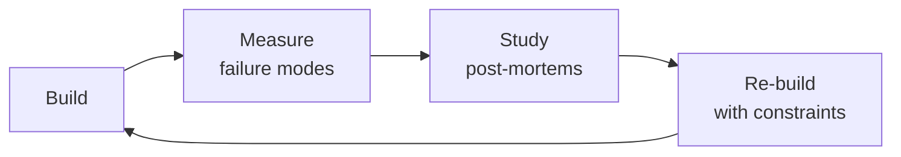

# Chaos Engineer

Systematic resilience verification framework based on Chaos Engineering principles. Covers experiment design, fault injection, blast radius management, GameDay facilitation, resilience pattern validation, and building organizational confidence in system behavior under failure.


### Cross-skills Integration

| Step | Skill | What it produces |
|------|-------|------------------|
| **Before** | site-reliability-engineer | SLO definitions, error budgets, monitoring dashboards, alert configurations |
| **This** | chaos-engineer | Chaos experiment designs, fault injection runbooks, GameDay reports, resilience validation |
| **After** | observability-engineer | Enhanced dashboards, alert tuning, anomaly detection patterns validated by chaos |

Common chains:
- **Chain**: site-reliability-engineer → chaos-engineer → observability-engineer — SRE defines what "reliable" means; chaos engineer proves (or disproves) it; observability engineer tunes detection.
- **Chain**: devops-engineer → chaos-engineer → incident-responder — DevOps provisions the testing environment; chaos engineer injects faults; incident responder validates detection and response playbooks.

## Sub-Skills
<!-- QUICK: 30s -- table of deeper dives by topic -->
When the agent identifies a specific chaos engineering need, drill into the relevant sub-skill. Each sub-skill has dedicated references — the experiment catalog (42 ready-to-use experiments) and the GameDay playbook (complete facilitation guide).

| Sub-Skill | What It Covers | Reference |
|-----------|---------------|-----------|
| **Fault Injection** | Pod kills, network latency/partition, resource exhaustion (CPU, memory, disk, file descriptors), DNS failures, clock skew — implementation via Chaos Mesh, LitmusChaos, Gremlin, AWS FIS, or custom scripts | `references/chaos-experiment-catalog.md` (42 experiments) |
| **Steady State Hypothesis Design** | Defining measurable "normal" behavior, selecting latency/error/throughput indicators, writing falsifiable hypotheses, control vs experiment comparison | Section below: "Steady State Hypothesis Deep Dive" |
| **Blast Radius Engineering** | Scope containment (traffic %, user segment, infrastructure scope), abort conditions (auto-termination triggers), progressive expansion (staging → canary → 1% → 10% → prod) | Section below: "Blast Radius (Military-Grade Controls)" |
| **GameDay Facilitation** | Pre-game planning (2 weeks), day-of execution timeline (briefing → experiments → debrief), roles (Commander/Operator/Observer/Scribe), post-game action items — full playbook | `references/game-day-playbook.md` (complete guide with templates) |
| **Resilience Pattern Validation** | Verifying circuit breakers (closed→open→half_open→closed), retry with backoff + jitter, bulkhead isolation, timeouts, rate limiters — chaos experiments that prove they work | Section below: "Tooling Deep Dive" + experiment catalog |
| **Chaos in CI/CD** | Automated experiments in staging CI, SLO-based gating, error budget integration, scheduled production experiments | Section below: "CI/CD Integration for Chaos" |

> **Token-saving rule:** Planning a GameDay? Load the GameDay playbook (731 lines) and only the experiment catalog entries for the experiments you're running. Don't load tooling deep dives for tools you aren't using. The experiment catalog alone would consume massive tokens if loaded entirely — pick specific experiments.

## Route the Request
<!-- QUICK: 30s -- pick your path, skip the rest -->

What are you trying to do?
├── Design a chaos experiment → Start at "Steady State Hypothesis Design" under Sub-Skills
├── Run fault injection (network, pod kills, resource exhaustion, AZ failure) → Go to "Fault Injection" under Sub-Skills
├── Control blast radius → Jump to "Blast Radius Engineering" under Sub-Skills
├── Verify steady state hypothesis → Go to "Steady State Hypothesis Design" under Sub-Skills
├── Plan and run a GameDay → Jump to "GameDay Facilitation" then "references/game-day-playbook.md"
├── Validate resilience patterns → Go to "Resilience Pattern Validation" under Sub-Skills
├── Need SLOs or error budgets defined first → Route to `site-reliability-engineer`
├── Need infrastructure for experiment execution → Route to `devops-engineer`
├── Need observability dashboards before experimenting → Route to `observability-engineer`
├── Need incident response playbook validation → Route to `incident-responder`
└── Don't know where to start? → Start at "Steady State Hypothesis Design"

**Do not read the entire skill.** Follow the route above and read only the sections it points to.

## Ground Rules — Read Before Anything Else

These rules apply to *every* response this skill produces.

- **Never experiment in production without a verified kill switch.** If you can't stop it instantly, you can't start it.
- **Blast radius must be measured before, during, and after.** Assumed blast radius is the leading cause of chaos incidents.
- **Steady state hypothesis must be falsifiable.** "The system is resilient" is not a hypothesis. "P99 latency stays under 500ms with 30% packet loss" is.
- **GameDay findings without remediation tickets are wasted effort.** Every finding must become a tracked action item with an owner.
- **Always start small and expand.** Staging → canary → 1% → 10% → production. Never jump steps.
- **Admit what you don't know.** If a failure mode is poorly understood, design an experiment to learn — don't guess.


## The Expert's Mindset

Masters of chaos engineer don't just build — they build **the right thing, at the right time, with the right trade-offs**. They think in systems, not tasks.

| Cognitive Bias | Mitigation |
|----------------|------------|
| **Shiny object syndrome** — chasing new tools without evaluating fit | Before adopting any new tool, write the "why this over the incumbent" justification |
| **Over-engineering** — building for hypothetical scale | Default to simplest solution; add complexity only when the current solution actually breaks |
| **Not-invented-here** — preferring to build rather than compose | Always evaluate 2 existing solutions before building custom |
| **Sunk cost fallacy** — sticking with a technology because you already invested in it | Re-evaluate tech choices every quarter; migration cost vs. staying cost |

### What Masters Know That Others Don't
- The **failure modes** of every component in their stack — not just the happy path
- When **not** to use their favorite tool (every tool has a misuse zone)
- That **data/model quality decays over time** — monitoring is not optional, it's foundational

### When to Break Your Own Rules
- **Move fast on reversible decisions.** Data format? Hard to change. Dashboard layout? Easy. Know the difference.
- **Skip the abstraction until the third use case.** Two is coincidence, three is a pattern.
## Operating at Different Levels

| Level | Scope | You... |
|-------|-------|--------|
| **L1** | Single component/module | Implement a well-defined piece following established patterns |
| **L2** | Feature or service | Design and build a complete feature; make tech choices within team conventions |
| **L3** | System or product area | Define architecture for a product area; set team tech standards; mentor L1-L2 |
| **L4** | Multiple systems / platform | Define org-wide architecture patterns; make build-vs-buy decisions; influence industry practice |
| **L5** | Industry / ecosystem | Create new architectural patterns adopted across the industry; redefine what's possible |

**Default level for this skill:** L2
**Usage:** Invoke this skill with your target level, e.g., "as an L3 chaos engineer, design..."

For full level definitions, see `skills/00-framework/skill-levels/SKILL.md`.

## When to Use
<!-- QUICK: 30s -- scan the bullet list to decide if this skill fits -->
- Establishing a Chaos Engineering practice from scratch — tooling, methodology, cultural buy-in.
- Designing and executing chaos experiments to verify system resilience hypotheses.
- Running a GameDay — a planned event where the team responds to injected failures under controlled conditions.
- Implementing circuit breakers, retries, timeouts, and bulkheads — and verifying they actually work under real faults.
- Testing auto-scaling behavior: does the system scale up correctly when nodes are killed?
- Validating observability: during a chaos experiment, can you detect, diagnose, and resolve the issue before it affects users?
- Building resilience scoring for services to prioritize hardening efforts.
- Preparing for AWS/Azure/GCP regional failures — testing multi-region failover.

## Decision Trees
<!-- QUICK: 30s -- follow the ASCII tree to your scenario -->
### 1. What to Chaos First
```
                     ┌─────────────────────┐
                     │ START: Pick a service│
                     └──────────┬──────────┘
                                │
                    ┌───────────▼───────────┐
                    │ Ran 3+ incidents in   │
                    │ last 6 months?        │
                    └────┬──────────────┬───┘
                         │ YES          │ NO
                    ┌────▼────────┐ ┌──▼──────────────────┐
                    │ Test failure│ │ Does the service have │
                    │ modes from  │ │ health checks, retries│
                    │ real post-  │ │ and circuit breakers? │
                    │ mortems     │ └──┬──────────────┬────┘
                    └─────────────┘    │ YES          │ NO
                              ┌────────▼─────┐  ┌─────▼────────┐
                              │ Start with a │  │ Implement     │
                              │ staging pod- │  │ resilience    │
                              │ kill test    │  │ patterns FIRST│
                              └──────────────┘  └──────────────┘
```
**Pick services with incident history** — test the failures you've already experienced before hypothetical ones.  
**If no resilience patterns exist** — chaos engineering without circuit breakers just proves you're fragile. Build resilience first.

### 2. Experiment Type Selection
```
                ┌──────────────────────────────┐
                │ START: What are you testing?  │
                └──────────────┬───────────────┘
                               │
            ┌──────────────────┼──────────────────┐
            │                  │                  │
    ┌───────▼──────┐  ┌───────▼──────┐  ┌───────▼────────┐
    │ Infrastructure│  │  Dependency  │  │  System-Wide   │
    │  resilience?  │  │   behavior?  │  │   confidence?  │
    └───────┬──────┘  └───────┬──────┘  └───────┬────────┘
            │                 │                  │
    ┌───────▼──────┐  ┌───────▼──────┐  ┌───────▼────────┐
    │ Pod kill →   │  │ Network      │  │ AZ failure →   │
    │ Node drain → │  │ latency →    │  │ Region failover│
    │ CPU stress   │  │ Packet loss  │  │ → GameDay event│
    └──────────────┘  └──────────────┘  └────────────────┘
```
**Infrastructure tests** verify auto-scaling and self-healing. Start here — they're the safest.  
**Dependency tests** verify circuit breakers, retries, and timeouts. Run after infra tests pass.  
**System-wide tests** verify multi-AZ/region failover. Run as GameDays with full team participation.

### 3. Observability Gate
```
                  ┌────────────────────────────┐
                  │ START: Before any experiment│
                  └─────────────┬──────────────┘
                                │
                    ┌───────────▼───────────┐
                    │ Inject fault in staging│
                    │ for 30 seconds         │
                    └────────────┬──────────┘
                                 │
               ┌─────────────────┼─────────────────┐
               │ YES             │                  │ NO
     ┌─────────▼────────┐       │        ┌─────────▼──────────┐
     │ Can you see it   │       │        │ Fix observability  │
     │ on the dashboard │       │        │ gap. Document it.  │
     │ within 2 minutes?│       │        │ Re-test before     │
     └────────┬─────────┘       │        │ running experiment.│
              │                 │        └────────────────────┘
     ┌────────▼────────┐       │
     │ Does alert fire │       │
     │ within expected │       │
     │ time window?    │       │
     └────┬───────┬────┘       │
          │YES    │NO          │
     ┌────▼──┐ ┌──▼──────────┐│
     │Proceed│ │Tune alert   ││
     │to prod│ │thresholds   ││
     └───────┘ └─────────────┘│
```
**No observability = no experiment.** If you can't detect the fault, you can't learn from it.  
**Fix dashboards and alerts before anything else** — running chaos without observability is just breaking things.

### 4. Production Readiness Gate
```
                     ┌──────────────────────┐
                     │ START: Ready for prod?│
                     └──────────┬───────────┘
                                │
                    ┌───────────▼───────────┐
                    │ Staging GameDay       │
                    │ completed with clear  │
                    │ learnings?            │
                    └────┬──────────────┬───┘
                         │ YES          │ NO
                    ┌────▼────────┐ ┌──▼──────────────┐
                    │ Multi-AZ or │ │ Stay in staging. │
                    │ multi-region│ │ Never run first  │
                    │ deployment? │ │ experiment in    │
                    └──┬───────┬──┘ │ production.      │
                       │YES    │NO  └──────────────────┘
               ┌───────▼──┐ ┌──▼──────────┐
               │ Test AZ  │ │ Single-AZ is │
               │ failover │ │ your bottle- │
               │ first    │ │ neck. Fix it.│
               └──────────┘ └──────────────┘
```
**Staging GameDay first** — never your first experiment in production.  
**Multi-AZ/region failover is the highest-value production experiment** — test what protects you from real outages.

### 5. Tool Selection
```
                     ┌─────────────────┐
                     │ START: Pick tool│
                     └────────┬────────┘
                              │
                    ┌─────────▼──────────┐
                    │ Infrastructure is   │
                    │ 100% Kubernetes?    │
                    └────┬────────────┬───┘
                         │ YES        │ NO
                    ┌────▼──────┐ ┌──▼──────────────┐
                    │ Budget >$0?│ │ Multi-cloud or  │
                    └──┬─────┬───┘ │ VMs+bare metal? │
                       │YES  │NO   └──┬──────────┬───┘
               ┌───────▼──┐ ┌─▼────┐  │YES       │NO
               │ Gremlin  │ │Chaos │ ┌▼────────┐┌▼──────┐
               │ (managed)│ │Mesh  │ │ Gremlin ││AWS FIS│
               └──────────┘ │(free)│ │(paid)   ││(AWS)  │
                            └──────┘ └─────────┘└───────┘
```
**K8s-only + free → Chaos Mesh or LitmusChaos.**  
**Multi-platform → Gremlin.**  
**AWS-only → AWS FIS** (IAM integration, pay-per-action).

## Principles (Netflix's Original + Modern Evolution)

1. **Build a Hypothesis Around Steady-State Behavior**: define what "normal" looks like in measurable terms. Example: "The checkout service processes 95% of requests within 500ms P99 under normal load." Quantify everything — if you can't measure it, you can't defend it.

2. **Vary Real-World Events**: inject failures that mirror things that actually happen — server crashes, network partitions, disk failures, dependency latency spikes, certificate expirations, resource exhaustion. Run experiments based on postmortems and incident data. The best failure modes to test are the ones you've already experienced.

3. **Run Experiments in Production**: the only environment that truly reflects production is production. Staging lacks production-scale traffic, data cardinality, configuration quirks, and real-world request patterns. Staging is a stepping stone; production is the goal.

4. **Automate Experiments Continuously**: manual chaos experiments are valuable but episodic. Evolution path: manual GameDays → scheduled experiments → triggered-by-incident experiments → CI/CD chaos gates. Automated experiments catch regressions between releases.

5. **Minimize Blast Radius**: start tiny, expand only when confidence increases. If an experiment could hurt customers, you've failed to control the blast radius. Blood rule: if the experiment escapes containment, you abort before anyone paged.

## Experiment Types (Expanded Catalog)

### Infrastructure
- **Node/Instance Failure**: random node termination, targeted node (runs critical service), 50% of nodes in an ASG, spot instance preemption simulation.
- **AZ Failure Simulation**: block all traffic to/from an AZ, terminate all instances in an AZ, simulate a load balancer losing an AZ.
- **Region Failure**: simulated region outage via DNS blackhole or route table manipulation, test multi-region failover and DNS-based global load balancing.
- **Network Partition**: split services into groups that cannot communicate, isolate a service from its database, simulate a split-brain scenario.

### Network
- **Latency Injection**: add 10ms, 50ms, 100ms, 500ms, or 2000ms to specific service-to-service calls. Test timeout configuration, retry behavior, circuit breaker thresholds.
- **Packet Loss**: 1%, 5%, 10%, 25% packet loss on specific interfaces. How does TCP congestion control handle it? How do long-lived connections fare?
- **Bandwidth Throttling**: limit bandwidth to 1 Mbps, 100 Kbps. Test streaming, large payload transfers, log shipping.
- **DNS Failure**: drop all DNS queries (simulate DNS server down), introduce 5s DNS resolution delay (simulate slow DNS provider), return NXDOMAIN for specific services.

### Application
- **Dependency Failure**: downstream returns 500s, times out, returns malformed response (corrupt JSON, truncated body, infinite stream). Verify circuit breakers, fallbacks, retry policies.
- **Resource Exhaustion**: CPU spike to 100% on specific pod/container, memory fill to 90%/95% (OOM risk), disk fill to 85%/95%, file descriptor exhaustion (ulimit -n).
- **Connection Pool Exhaustion**: saturate database connection pool, saturate HTTP connection pool, saturate gRPC stream pool.

### Security
- **Credential/Secret Rotation**: rotate credentials while system is running — does the application pick up the new secret without restart? Does it handle auth failures gracefully during rotation?
- **Certificate Expiry Simulation**: present an expired or self-signed TLS certificate. Do health checks catch it? Do clients reject the connection? Does monitoring fire?
- **IAM Permission Revocation**: revoke a service's IAM permissions to access S3, DynamoDB, or KMS. Does the application fail gracefully? Does the error message leak information?

### State
- **Clock Skew**: advance system clock by 30 minutes or 24 hours. Do JWT tokens validate correctly? Do TTL-based caches expire prematurely? Do scheduled jobs fire at unexpected times?
- **Event Ordering Violation**: send messages out-of-order to a queue consumer, send duplicate messages (at-least-once semantics test), send delayed messages exceeding SLA.
- **Data Corruption**: simulate bit flips in cached data, simulate corrupted message payload, simulate partial writes to persistent storage.

## Steady State Hypothesis Deep Dive

A steady state hypothesis is your experiment's null hypothesis. It states: "Under this specific fault, the system will continue to exhibit normal behavior within defined boundaries."

### Metrics to Measure
- **Latency**: P50 (typical user experience), P95 (tail latency), P99 (worst-case user experience). Track the delta from baseline — a 50ms increase at P99 is worth investigating even if absolute values are fine.
- **Error Rate**: total errors / total requests as percentage. Distinguish between client errors (4xx) and server errors (5xx). Monitor by endpoint, by downstream dependency, by status code.
- **Throughput**: requests per second (RPS). Does the system compensate for degraded capacity by shedding load or does it accumulate backlog?
- **Saturation Indicators**: CPU utilization, memory usage, disk I/O, network I/O, connection pool utilization, request queue depth. These leading indicators predict failures before latency or errors spike.

### Control vs Experiment
- Establish steady state baseline by measuring the system WITHOUT fault injection for at least 5 minutes.
- Run experiment WITH fault injection for the planned duration.
- Compare metrics during fault vs baseline. The hypothesis is refuted if any metric exceeds its defined threshold for more than N consecutive seconds.
- Recovery observation: after fault stops, measure how long it takes for all metrics to return to baseline. This is your Mean Time to Recover (MTTR) from that specific failure.

### Writing Good Hypotheses
A good hypothesis is falsifiable, measurable, and bounded:

| Component | Requirement | Example |
|-----------|-------------|---------|
| Fault trigger | Specific | "When 50% of checkout-service pods are terminated..." |
| Measured metric | Quantified | "...checkout latency P99 remains below 500ms..." |
| Threshold | Bounded | "...and checkout error rate stays below 0.5%..." |
| Duration | Time-bound | "...for the entire 5-minute experiment duration." |

### Example Hypotheses
- **Pod termination**: "When 50% of checkout-service pods are terminated, checkout latency P99 remains below 500ms and checkout error rate stays below 0.5%."
- **Network latency**: "When 200ms latency is added to calls from orders-service to payment-service, orders-service latency P95 stays below 1s and no orders are lost."
- **CPU stress**: "When CPU is stressed to 90% on inventory-service pods, inventory lookup latency P99 stays below 2s and throughput drops by no more than 20%."
- **AZ failure**: "When us-east-1a is isolated, all traffic routes to the remaining AZs within 60 seconds, P99 latency stays below 1s during failover, and zero complete request failures occur."

## Blast Radius (Military-Grade Controls)

### Scope Containment Dimensions
- **Traffic percentage**: canary traffic only (1% of users), internal-only traffic, synthetic traffic.
- **Infrastructure scope**: single pod, single node, single AZ, single region.
- **Service scope**: single endpoint, single service, non-critical service only.
- **User segment**: internal users, beta testers, free-tier customers (never enterprise customers if avoidable).
- **Time window**: low-traffic hours only (1–4 AM), weekend windows, never during known campaign/event periods.

### Abort Conditions
Auto-termination triggers (any one fires → experiment stops immediately):
- Error rate exceeds threshold (e.g., 5% increase from baseline over 30 seconds).
- P99 latency > 2x baseline for 60 seconds.
- Production alert fires and is acknowledged.
- Customer-facing impact detected by synthetic monitoring.
- Manual kill switch activated by Commander, Operator, or on-call engineer.

### Progressive Expansion Model
```
Staging (all experiments required to pass)
  → Canary (single instance, internal traffic, 15 min)
    → 1% production traffic (30 min, daytime)
      → 10% production traffic (30 min, daytime)
        → 50% production traffic (60 min, low-traffic window)
          → 100% production traffic (automated, continuous)
```
Each level requires N successful runs at the current level before advancing. N = 3 for infra/network faults, N = 5 for stateful faults.

### Time-Bounded Execution
- Every experiment has a `maxDuration` parameter. Hard stop enforced by tool.
- Auto-terminate if the responsible engineer does not acknowledge a "pre-go" prompt within 2 minutes.
- Default durations: prod experiments 5–15 minutes, staging experiments 10–30 minutes.
- Experiments that exceed their window without explicit extension are forcibly terminated.

## Tooling Deep Dive

### Chaos Mesh
- **Type**: Kubernetes-native, open source (CNCF).
- **Architecture**: Custom Resource Definitions (CRDs) for each fault type. Controller-manager + dashboard + chaos-daemon (runs on each node).
- **Fault Types**: PodChaos (pod kill, container kill), NetworkChaos (latency, loss, partition, bandwidth), StressChaos (CPU, memory), IOChaos (delay, fault), DNSChaos (error, random), TimeChaos (clock skew), HTTPChaos (abort, delay, replace).
- **Strengths**: deep K8s integration, declarative YAML, active community, scheduler (cron-based), web UI, multi-namespace support.
- **Limitations**: K8s-only, learning curve for advanced scenarios, no built-in multi-experiment orchestration.

### Gremlin
- **Type**: SaaS, commercial.
- **Platform**: Kubernetes, VMs, bare metal, containers, AWS, Azure, GCP.
- **Fault Types**: CPU, memory, disk (fill, IO), network (latency, loss, blackhole, DNS), state (time travel, process kill, shutdown).
- **Strengths**: multi-platform, scenario orchestration (run sequential/parallel attacks), web UI, teams/RBAC, halt mechanism, no infrastructure to manage.
- **Limitations**: cost (per-host licensing), vendor lock-in, custom fault types require Gremlin SDK.

### AWS Fault Injection Service (FIS)
- **Type**: AWS-native, pay-per-action.
- **Platform**: EC2, ECS, EKS, RDS, DynamoDB, CloudWatch.
- **Fault Types**: instance termination (EC2, ECS tasks), CPU/network stress, RDS failover, DynamoDB throttle, AZ power loss.
- **Strengths**: IAM integration (blast radius via IAM policies), CloudWatch integration (stop conditions), experiment templates, no infrastructure to manage (within AWS).
- **Limitations**: AWS-only, fewer fault types than Chaos Mesh or Gremlin, no built-in scenario orchestration.

### LitmusChaos
- **Type**: Open source, CNCF project.
- **Platform**: Kubernetes.
- **Fault Types**: pod-kill, container-kill, cpu-hog, memory-hog, network-latency, network-loss, disk-fill, DNS-chaos, node-drain, node-cordon, and 50+ more via ChaosHub.
- **Strengths**: declarative (ChaosEngine CRDs), ChaosHub with community experiments, GitOps-friendly, CI/CD integration (Argo, Jenkins), Litmus Portal for management.
- **Limitations**: K8s-only, less mature than Chaos Mesh in some areas, complex troubleshooting.

### Steadybit
- **Type**: SaaS, modern, commercial.
- **Platform**: Kubernetes, hosts, containers.
- **Fault Types**: network, resource, state, HTTP, K8s, cloud API attacks.
- **Strengths**: application-level fault injection (discovers service dependencies automatically), nice UX, attack scenarios with pre/post conditions, dashboards.
- **Limitations**: cost, smaller community, fewer fault types than Gremlin/Chaos Mesh.

### Comparison Table

| Feature | Chaos Mesh | Gremlin | AWS FIS | LitmusChaos | Steadybit |
|---------|-----------|---------|---------|-------------|-----------|
| Open source | Yes | No | No | Yes | No |
| Kubernetes native | Yes | Yes | Yes | Yes | Yes |
| Multi-platform | No | Yes | AWS only | No | Limited |
| Self-hosted | Yes | No | No | Yes | No |
| SaaS option | No | Yes | Yes | Yes (Portal) | Yes |
| Learning curve | Medium | Low | Medium | Medium | Low |
| Cost | Free | Per host | Per action | Free | Per host |
| Fault types | 8+ categories | 6 categories | 5 categories | 50+ experiments | ~20 types |
| Web UI | Yes | Yes | Yes | Yes | Yes |
| RBAC/Teams | Namespace | Yes | IAM | Yes | Yes |

## Game Days

### Planning (2 Weeks Before)
- **Scope**: define which services, which experiments, what NOT to touch.
- **Experiment selection**: prioritize based on recent incidents, service criticality, untested failure modes, new resilience features deployed.
- **Team assembly**: minimum 3 people — more if multiple services are being tested.
- **Observability setup**: verify dashboards, alerts, logging, and tracing for every service in scope.
- **Stakeholder communication**: notify leadership, support team, adjacent service owners.
- **Schedule**: pick low-traffic window, block 3–4 hours, send calendar invites with explicit "do not schedule over" request.
- **Rollback prep**: verify all abort mechanisms work end-to-end. Document rollback steps for each experiment.
- **Dry run**: run through each experiment in staging at least once. Fix everything that breaks before GameDay.

### Roles
- **Commander** (leads, decides abort/continue): owns the timeline, makes abort decisions, manages communications. Not hands-on with tooling.
- **Operator** (runs experiments, executes commands): runs fault injection, monitors execution, stops experiments on command.
- **Observer** (monitors, analyzes, diagnoses): watches dashboards, metrics, logs. Analyzes impact in real time. The person who says "I see something."
- **Scribe** (documents everything, time-stamps): records experiment start, fault injection, observed impact, recovery, and every decision. Writes the after-action report.

### Execution Timeline (3.5 Hour Example)
| Time | Activity | Duration |
|------|----------|----------|
| 9:00–9:15 | Briefing — review experiments, roles, abort conditions, communication channel | 15 min |
| 9:15–10:00 | Experiment 1 (pod termination) — inject, observe, record, abort if needed | 45 min |
| 10:00–10:15 | Break + quick huddle — share findings from experiment 1 | 15 min |
| 10:15–11:00 | Experiment 2 (network latency) — inject, observe, record | 45 min |
| 11:00–11:15 | Break | 15 min |
| 11:15–12:00 | Experiment 3 (dependency failure) — inject, observe, record | 45 min |
| 12:00–12:30 | Debrief — what we found, what worked, what broke, action items | 30 min |

### Communication During GameDay
- **Pre-GameDay Slack message**: "@channel Chaos GameDay begins at 9:00 AM PT. We'll be running experiments in [services] with blast radius limited to [scope]. Abort conditions: [thresholds]. Watch #chaos-gameday for updates."
- **Experiment start**: "Starting Experiment 1: pod termination on checkout-service. Blast radius: 2 pods in us-east-1a. Expected impact: none."
- **Experiment abort**: "ABORTING Experiment 2. Error rate on orders-service exceeded 5%. Returning to normal. All faults stopped."
- **Experiment success**: "Experiment 3 complete. Hypothesis confirmed. P99 latency stayed below 400ms, error rate 0.0%. 5 min recovery time to baseline."
- **Debrief follow-up**: "GameDay complete. Full report by EOD Friday. Action items tracked in [link to tickets]. Thanks team!"

### Debrief Format
1. **Experiment summary**: name, hypothesis, verdict (confirmed / refuted / inconclusive).
2. **What worked**: resilience patterns that performed as expected, observability that caught the fault, team communication.
3. **What broke**: failures we didn't expect, resilience patterns that didn't engage, observability gaps.
4. **What we learned**: surprising behaviors, new failure modes discovered, insights for architecture.
5. **Action items**: owner, ticket number, severity, due date. Each item is concrete and trackable.

### Post-GameDay (Within 1 Week)
- **Findings report**: compiled from Scribe's notes, Observer's analysis, Commander's debrief.
- **Action item tracking**: create tickets with severity (P0 = critical, fix immediately), owner, and due date.
- **Leadership summary**: 1-page executive summary covering objectives, key findings, action items, go-forward plan.
- **Retro** on the GameDay itself: what went well, what to improve for next time (tooling, communication, timing, scope).
- **Experiment catalog update**: mark experiments as tested, update findings, add new experiments inspired by GameDay insights.

## CI/CD Integration for Chaos

### Pipeline Integration
Run chaos experiments in staging on every merge to main — catch resilience regressions like we catch functional bugs.

```yaml
# Example GitHub Actions + LitmusChaos integration
chaos-tests:
  runs-on: ubuntu-latest
  steps:
    - name: Install LitmusChaos
      run: kubectl apply -f https://litmuschaos.github.io/litmus/litmus-operator.yaml
    - name: Run chaos experiments
      run: |
        kubectl apply -f experiments/pod-kill.yaml
        kubectl wait --for=condition=Completed chaosengine/pod-kill --timeout=300s
    - name: Check experiment result
      run: kubectl get chaosresult pod-kill -o jsonpath='{.status.experimentStatus.verdict}'
```


**What good looks like:** Chaos experiment catalog with 10+ experiments covering different fault types. GameDay completed in the last 30 days with documented findings. Blast radius controls tested and verified. Resilience score for each service tracked over time.

### SLO-Based Experiment Gating
Only run chaos experiments if error budget is healthy:
- Check SLO burn rate. If error budget burn rate > 2 for the current window, skip chaos experiments.
- Only run experiments on services with sufficient error budget (>50% remaining).
- If an experiment consumes error budget, account for it: chaos experiments consume error budget.

### Error Budget Integration
- Chaos experiments are not free — they consume error budget (artificially by injecting failures).
- Define a chaos budget as a fraction of total error budget (e.g., 5% of error budget reserved for chaos).
- If chaos budget is depleted, pause ALL experiments until next window.
- Automate: link chaos experiment results to SLO dashboards. If an experiment causes an SLO violation, that's data, not failure — but track it.

## Organization Maturity Model

| Level | Name | Characteristics |
|-------|------|----------------|
| 1 | Crawl | GameDays in staging only. No automation. Quarterly cadence. Experiments are manual. No blast radius controls beyond manual stop. |
| 2 | Walk | GameDays in production (limited blast radius, canary only). Some automated experiments in staging. Observability validated before each experiment. Monthly cadence. |
| 3 | Run | Automated chaos in staging CI (every merge). Scheduled production experiments (weekly). Resilience scoring per service. Blast radius controls automated (auto-abort). |
| 4 | Fly | Continuous chaos in production (low-intensity). Experiments gated by error budgets. SLO-based experimentation (experiments auto-stop when SLO risk detected). Self-healing verification. Resilience score as a release gate. |

## Observability for Chaos

### Golden Rule
Before running ANY experiment, verify: you can detect the failure you're about to inject. If you can't see it in your dashboards, your alerts, and your logs — **fix observability first**.

### Pre-Experiment Observability Check
1. Inject the fault in staging (1 pod, 30 seconds).
2. Check: does your latency dashboard show the spike?
3. Check: does your error rate dashboard show the increase?
4. Check: does your saturation dashboard show the resource constraint?
5. Check: do your logs contain the error (with correlation ID)?
6. Check: does your alert fire within the expected time window?
7. If ANY of these fail → STOP. Fix the observability gap. Document it. Re-test.

### Running Chaos Without Observability Is Just Breaking Things
- Without observability, you cannot confirm the hypothesis.
- Without observability, you cannot detect blast radius escape.
- Without observability, you cannot learn from the experiment.
- Without observability, you cannot prove the value of chaos engineering to leadership.

## Cross-Skill Coordination
<!-- QUICK: 30s -- table of who to talk to when -->
Chaos engineering is inherently cross-team — you break things that other teams built and own. Without coordination, chaos experiments are indistinguishable from attacks or accidents.

### Decision Gates & Artifacts

- **Gate 1 — Observability Verified:** Chaos experiments require existing dashboards and alerts from `observability-engineer`. Without them, experiments are just breaking things. Artifact: observability health check report.
- **Gate 2 — SLOs Defined:** Steady state hypotheses depend on SLO definitions and error budgets established by `site-reliability-engineer`. Artifact: SLO threshold document per service.
- **Gate 3 — Infrastructure Ready:** Experiment execution environments and blast radius controls depend on infrastructure provisioned by `devops-engineer`. Artifact: environment readiness checklist.
- **Gate 4 — Runbook Validated:** Incident response playbooks validated in coordination with `incident-responder` before production experiments. Artifact: signed-off runbook validation report.
- **Artifact:** GameDay report (findings, action items, owners), resilience score per service, blast radius containment verification.

| Coordinate With | When | What to Share/Ask |
|-----------------|------|-------------------|
| **DevOps / SRE** | Experiment execution, blast radius control, monitoring during experiments | Experiment schedule, injection method, abort conditions, observability dashboard |
| **Backend Developers (Service Owners)** | Service-level experiments, fault injection in specific services | Service architecture, known failure modes, recovery time expectations |
| **Security Reviewer** | Security-relevant experiments (network segmentation, auth failures) | Experiment boundaries, security control bypass risks, incident response awareness |
| **System Architect** | Cross-service experiments, cascade failure testing, resilience patterns | Service dependency graph, circuit breaker locations, bulkhead boundaries |
| **Incident Responder / On-Call** | ALL experiment windows — must know experiments are running | Experiment schedule, expected symptoms, abort command, contact for false alarm |
| **QA Engineer** | Pre-production chaos experiments, resilience test integration | Test environment setup, experiment scenarios, expected recovery behavior |
| **Project Manager** | Experiment scheduling, GameDay planning, stakeholder communication | Experiment calendar, production freeze windows, team availability |
| **CTO Advisor** | First-time production chaos experiments, high-risk experiments | Risk acceptance, blast radius approval, executive awareness |
| **Product Strategist** | User-impacting experiments, degraded mode UX testing | Expected user experience during failure, graceful degradation expectations |

### Communication Triggers — When to Proactively Notify

| Trigger | Notify | Why |
|---------|--------|-----|
| Chaos experiment scheduled in production (>24 hours notice minimum) | On-Call, DevOps, Service Owners, Project Manager | All stakeholders aware; avoid confusion with real incidents |
| Experiment about to begin (5-minute warning) | On-Call, DevOps, Service Owners | Final confirmation; abort if any stakeholder objects |
| Experiment exceeds blast radius (affects unexpected services) | On-Call, DevOps, Service Owners | Abort immediately; blast radius containment failed |
| Real incident occurs during experiment | On-Call, Incident Commander, All Stakeholders | Abort experiment NOW; real incident takes priority |
| Experiment reveals critical vulnerability (system did not recover) | System Architect, Service Owners, CTO Advisor | Resilience gap discovered; remediation prioritization required |
| GameDay scheduled (cross-team resilience exercise) | All Engineering Teams, Project Manager, CTO Advisor | Full organization awareness; schedule around releases and PTO |
| Experiment results published (post-experiment report) | All Stakeholders, CTO Advisor | Learnings shared; resilience improvements prioritized |
| Circuit breaker or timeout configuration found inadequate during experiment | System Architect, Service Owners | Configuration change needed; deployment required |

### Escalation Path

| Situation | Escalate To | Rationale |
|-----------|------------|-----------|
| Chaos experiment causes production incident (real user impact) | **Incident Commander** + CTO Advisor + VP Engineering | Abort experiment; SEV-level incident response; postmortem required |
| Experiment reveals systemic failure pattern (multiple services fail same way) | **System Architect** + CTO Advisor | Architecture resilience gap; may require significant re-architecture |
| Service owner refuses to participate in chaos experiments for >2 quarters | **CTO Advisor** + VP Engineering | Resilience culture gap; executive sponsorship needed |
| Blast radius control mechanism itself fails (experiment cannot be aborted) | **CTO Advisor** + DevOps Lead | Safety mechanism failure; halt all experiments until fixed |
| Production chaos experiment proposed for first time | **CTO Advisor** + VP Engineering | Organizational risk decision; executive approval required |


## Error Decoder
<!-- DEEP: 10+min -->

| Symptom | Root Cause | Fix | Lesson |
|---------|------------|-----|--------|
| Production outage during staging chaos experiment | Blast radius not contained; experiment targeted shared staging cluster with cross-environment dependencies | Always use dedicated chaos namespace; configure network policies to isolate experiment scope; implement automatic rollback on P1 alert | Chaos experiments must include blast radius as a first-class design parameter — never assume staging isolation |
| Experiment caused data corruption in stateful service | Fault injection targeted stateful service without read-only mode; no rollback plan defined before experiment | Define abort conditions (max failure duration, error rate threshold, user impact limit) and test rollback in staging before any production experiment | Without a rollback plan, an experiment is just an outage with a fancy name |
| Team panic during first GameDay — nobody followed the runbook | No pre-GameDay training; team didn't know how to use runbooks or interpret dashboards under pressure | Conduct tabletop exercises first; train on runbooks in low-stakes environment; start with scheduled GameDays before surprise ones | GameDays test people and processes first, infrastructure second |
| Fault injection had no effect — supposed to kill pods but service kept running | Experiment assumed Kubernetes config but service ran on Nomad; wrong infrastructure target | Verify infrastructure assumptions by running inject commands in dry-run mode; maintain an up-to-date infrastructure inventory | "It works on my cluster" is not a verified assumption — validate the target before injecting faults |
| Alert fatigue post-experiment — monitoring flagged false positives for days | Experiment altered baseline metrics; dashboards and alerts not reset after experiment ended | Reset monitoring baselines after each experiment; add chaos experiment tag to metrics for filtering; document expected metric deviations | An experiment isn't over until monitoring returns to steady state — reset baselines before declaring success |

### Route to Other Skills

| If the Request Is About | Route To |
|--------------------------|----------|
| Defining SLOs, error budgets, or monitoring dashboards | `site-reliability-engineer` |
| Incident detection, response playbook validation, on-call coordination | `incident-responder` |
| Infrastructure provisioning, deployment orchestration, environment management | `devops-engineer` |
| Dashboard tuning, alert configuration, anomaly detection | `observability-engineer` |
| Resilience architecture, circuit breaker design, service dependency mapping | `system-architect` |

## Proactive Triggers
<!-- QUICK: 30s — when to proactively notify stakeholders -->

| Trigger | Notify | Why |
|---------|--------|-----|
| GameDay exercise completed with severity findings | CTO Advisor, VP Engineering, All Service Owners | Resilience gaps discovered; prioritization needed for remediation tickets |
| Chaos experiment reveals circuit breaker misconfiguration | System Architect, Service Owners | Circuit breaker not activating; configuration fix needed before next incident |
| Blast radius containment breach during automated experiment | DevOps Lead, On-Call, Security Reviewer | Containment mechanism failure; halt all automated experiments until root cause fixed |
| Experiment results show MTTR exceeds SLO by >2x | Service Owners, SRE, CTO Advisor | Recovery time unacceptable; architectural or procedural changes needed |
| New service onboarded without chaos experiment coverage | Service Owner, DevOps | Resilience blind spot; experiment design and scheduling needed |
| Chaos tooling license exceeds quarterly budget by >20% | CTO Advisor, Finance | Budget reallocation or tooling evaluation needed |
| Steady state hypothesis invalidated by infrastructure change | Service Owners, DevOps | Baseline metrics shifted; hypothesis rewrite and experiment revalidation required |

## Production Checklist
<!-- QUICK: 30s -- binary pass/fail items. All must pass. -->
- [ ] **[S1]**  Chaos Engineering principles communicated to engineering leadership; executive buy-in obtained.
- [ ] **[S2]**  Steady state hypothesis defined for each service: measurable indicators of healthy behavior with specific metric thresholds.
- [ ] **[S3]**  Fault injection catalog built covering: pod kills, network latency/loss, resource exhaustion, dependency failures, AZ failure, security faults.
- [ ] **[S4]**  Experiment design template standardized: hypothesis, fault, blast radius, duration, abort conditions, rollback.
- [ ] **[S5]**  Blast radius controls implemented: traffic %, user segment, infrastructure scope, time-bounded, auto-termination.
- [ ] **[S6]**  Chaos tooling selected and deployed (Chaos Mesh, Litmus, Gremlin, AWS FIS, or Steadybit) with proper RBAC/scope controls.
- [ ] **[S7]**  GameDay playbook documented: pre-GameDay prep, execution timeline, roles, post-GameDay follow-up process.
- [ ] **[S8]**  At least one successful GameDay conducted in staging; findings documented and remediated.
- [ ] **[S9]**  At least one successful GameDay conducted in production with limited blast radius (canary, 1 pod, 1 AZ).
- [ ] **[S10]**  Circuit breakers, retries, and bulkheads implemented and verified via targeted chaos experiments.
- [ ] **[S11]**  Observability verified: injected faults are detectable within 2 minutes on dashboards, logs, and alerts.
- [ ] **[S12]**  Pre-experiment observability check documented and executed for each new experiment type.
- [ ] **[S13]**  Resilience scoring system established per service; low-scoring services prioritized for hardening.
- [ ] **[S14]**  Automated chaos scheduled in staging on every merge to main (functional + resilience CI).
- [ ] **[S15]**  Scheduled production chaos experiments running weekly during low-traffic windows; results tracked per experiment.
- [ ] **[S16]**  Abort mechanism tested: kill switch stops all active experiments within 30 seconds.
- [ ] **[S17]**  SLO-based experiment gating implemented: chaos stops if error budget burn rate exceeds threshold.
- [ ] **[S18]**  Experiment catalog maintained with status (designed → tested-staging → tested-prod → automated).
- [ ] **[S19]**  Blast radius progressive expansion documented: each experiment's current level in the progressive model.
- [ ] **[S20]**  Organization maturity level assessed and target level defined for the next quarter.

## Scale Depth
<!-- QUICK: 30s -- find your team size column -->
### Solo (1 person) → Small (2-10) → Medium (10-50) → Enterprise (50+)

| Phase | Team Size | Priority | Chaos Engineering Approach |
|-------|-----------|----------|---------------------------|
| **Solo/MVP** | 1-3 devs | Ship. Don't break what ships. | No chaos engineering. Manual: kill a pod in staging, see what happens. Fix obvious failures (no health checks, no retries). "Resilience awareness," not chaos engineering. |
| **Small/Growth** | 3-15 devs, 1 infra/SRE | Don't lose customers to preventable failures | First GameDay in staging (half-day). Test: pod kill, DB failure, disk exhaustion. Implement circuit breakers, retries, health checks. Quarterly GameDays. |
| **Medium** | 15-50 devs, dedicated SRE | Resilience as measurable KPI | Automated chaos in staging CI (every merge). Monthly production GameDays. Resilience scoring per service. Full fault injection catalog. Blast radius auto-controls. |
| **Enterprise** | 50+ devs, chaos/SRE team | Continuous confidence | Continuous production chaos (low-intensity). SLO-gated experiments. Multi-region failover testing. Self-healing verification. Resilience score as release gate. Chaos budget integrated into error budgets. |

### Transition Triggers

| From → To | Trigger | What to Change |
|-----------|---------|----------------|
| Solo → Small | First paying customer or first production incident | Add health checks + retries. Run one staging GameDay. Document 3 known failure modes. |
| Small → Medium | >3 production incidents in 6 months OR >10 services | Automate chaos in CI. Add resilience scoring. Run monthly production GameDays. Hire/assign dedicated SRE. |
| Medium → Enterprise | Multi-region deployment OR compliance requires DR testing | Continuous production chaos. SLO-gated experiments. Multi-region failover drills. Full-time chaos engineering team. |

**Solo rule:** Chaos engineering for a startup with 10 users on a single EC2 instance is theater. Before injecting faults, ensure: (a) health checks, (b) process monitoring, (c) tested backups. That's 90% of resilience for 10% of the effort.

## Best Practices
<!-- STANDARD: 3min -- rules extracted from production experience -->
1. **Never run your first chaos experiment in production:** Always staging first. Production readiness requires staging GameDay with clear learnings and proven abort mechanisms.
2. **Verify observability before every experiment:** Inject the fault in staging for 30 seconds. If you can't see it on dashboards within 2 minutes, fix observability before proceeding — running chaos without observability is just breaking things.
3. **Start with the smallest possible blast radius:** Single pod, 1% traffic, 5-minute window. Expand only after N successful runs (N=3 for infra faults, N=5 for stateful faults).
4. **Define abort conditions with specific numeric thresholds:** "Error rate > 5% for 30 seconds" not "if things look bad." Auto-termination must be tool-enforced, not human-dependent.
5. **Test failures you've actually experienced first:** Prioritize experiments based on real postmortems, not hypothetical scenarios. The best failure mode to test is the one that already caused an incident.
6. **Run experiments during low-traffic windows with on-call aware:** Schedule experiments 1-4 AM or weekends. Notify on-call 24+ hours in advance with expected symptoms and abort command.
7. **Every experiment needs a documented rollback:** One command, one feature flag flip, one script — tested in staging before production. If rollback fails, you have a production incident.
8. **Track MTTR per failure mode:** Recovery time is as important as resilience. If the system recovers in 30 seconds vs 5 minutes, that difference matters to users.
9. **Integrate chaos into CI/CD:** Run automated experiments on every merge to main in staging. Catch resilience regressions like functional bugs — before they reach production.
10. **GameDay debrief must produce tracked action items:** Every finding gets an owner, severity, ticket number, and due date. Learning without action is wasted effort.

## Anti-Patterns
<!-- STANDARD: 3min — patterns that predictably fail -->

| Anti-Pattern | Why It Fails | Correct Approach |
|---|---|---|
| Running chaos experiments only before big launches | Panic-driven chaos produces rushed experiments with incomplete rollback plans; teams associate chaos with stress | Schedule experiments continuously on a calendar; decouple experiments from release anxiety |
| "Throwing the kitchen sink" — injecting all faults at once | Cannot isolate which fault caused the failure; debugging takes hours; teaches nothing about individual resilience | Inject exactly one fault per experiment; understand single-fault behavior before combining |
| Disabling monitoring during experiments to avoid alert fatigue | Defeats the purpose — if you can't detect the fault, your monitoring is broken; fix monitoring, don't silence it | Tag experiments for alert deduplication; fix gaps in observability; never silence alerts as a workaround |
| Skipping the GameDay retrospective because "we learned enough during the exercise" | Tacit knowledge stays in individuals' heads; no tracked action items; same failures repeat next quarter | Require a written retro with owner, severity, and ticket number for every finding within 48 hours |
| Running experiments without telling on-call | On-call declares SEV-1 for a chaos experiment; trust in chaos program destroyed; experiments get banned | Notify on-call 24+ hours in advance with expected symptoms and abort command; no surprises |
| Testing only infrastructure faults (pod kill, network) | Application-level failures (corrupt responses, slow endpoints, bad config deployments) cause more incidents than infra failures | Expand catalog to include application faults: latency injection, malformed responses, config rollbacks |
| Gamifying chaos with "who broke production" culture | Blame culture suppresses reporting; teams hide failures; chaos becomes political not engineering | Frame experiments as learning opportunities; celebrate findings not blame; leadership models blameless culture |
| Treating chaos engineering as a one-time certification | Resilience decays as code changes; last year's experiments don't test this year's architecture | Automate experiments in CI/CD; rerun on every deploy; treat resilience as continuous verification |

## Cost-Effective Decision Table

| Decision | Free/Cheap Option | Paid Upgrade | When to Upgrade |
|----------|------------------|--------------|-----------------|
| Chaos tooling | Chaos Mesh (free OSS, K8s) or LitmusChaos (free OSS, CNCF) | Gremlin ($100/mo) or Steadybit ($500/mo) | Non-K8s infrastructure, SaaS preference, or need managed experiment library |
| Fault injection (no K8s) | Custom scripts: `kill`, `tc` (traffic control), `stress-ng` (free) | AWS FIS (pay-per-experiment) or Gremlin | Multi-service coordinated experiments or need blast-radius controls via IAM |
| GameDay facilitation | Miro free (3 boards) + Google Meet + manual tracking | Dedicated GameDay tooling | >2 GameDays/year or need structured experiment tracking and reporting |
| Circuit breaker | Resilience4j (Java, free), Polly (.NET, free), opossum (Node.js, free) | Service mesh (Istio/Linkerd, operational cost) | Already running a service mesh or need language-agnostic circuit breaking |
| Observability for chaos | Prometheus + Grafana (free) + structured logging | Datadog/Honeycomb (paid) | Already have paid APM; use existing observability for chaos experiments |

**Annual chaos tool budget by phase:** MVP: $0 (don't do it). Growth: $0-3K (OSS + GameDay facilitation). Scale: $5K-50K (managed chaos platforms + SRE time).

## Core Workflow
<!-- QUICK: 30s -- scan phase titles to understand the process -->
<!-- DEEP: 10+min -->
### Phase 1 (~15 min): Baseline
**Input:** Service name, environment (staging/prod), observability dashboards.  
**Steps:** 1) Collect P50/P95/P99 latency, error rate, throughput for 5+ minutes under normal load. 2) Verify all dashboards, alerts, and logs show the service clearly. 3) Record baseline metrics as JSON artifact.  
**Output:** Baseline metrics file + observability verification checklist passed.

<!-- DEEP: 10+min -->
### Phase 2 (~30 min): Hypothesis & Experiment Design
**Input:** Baseline metrics, failure mode catalog (42 experiments in references).  
**Steps:** 1) Select one failure mode (e.g., pod kill, network latency). 2) Write falsifiable hypothesis: "When X happens, Y metric stays below Z for T minutes." 3) Define blast radius (traffic %, pods, AZ, time window). 4) Set abort conditions with specific numeric thresholds.  
**Output:** Experiment document with hypothesis, blast radius, abort triggers, rollback steps.

<!-- DEEP: 10+min -->
### Phase 3 (~20 min): Staging Validation
**Input:** Experiment document, staging environment, chaos tooling access.  
**Steps:** 1) Run experiment in staging at full blast radius. 2) Verify steady state hypothesis holds. 3) Confirm observability detects the fault within 2 minutes. 4) Test abort mechanism — stop experiment, verify recovery. 5) If hypothesis refuted, fix the gap and re-run.  
**Output:** Staging validation report — passed/failed, MTTR measured, gaps documented.

<!-- DEEP: 10+min -->
### Phase 4 (~15 min): Progressive Production Rollout
**Input:** Staging validation passed, production access, on-call notified.  
**Steps:** 1) Canary: single pod/internal traffic, 15 minutes. 2) 1% traffic, 30 minutes. 3) 10% traffic, 30 minutes. 4) Full scope (if applicable). At each step: monitor abort triggers, compare metrics to baseline.  
**Output:** Production experiment results — hypothesis verdict, blast radius respected, MTTR measured.

<!-- DEEP: 10+min -->
### Phase 5 (~25 min): Analysis & Remediation
**Input:** Experiment results, Scribe notes, Observer analysis.  
**Steps:** 1) Document: what worked, what broke, what surprised us. 2) Create action items with owner + severity + due date. 3) Update experiment catalog status (designed → tested-staging → tested-prod → automated). 4) Share findings with service owners and leadership.  
**Output:** After-action report, tracked action items, updated experiment catalog.

## When NOT to Use This Skill (Overkill)

- **Pre-launch startup with <1K users and single server**: You don't need chaos engineering. You need: a process monitor, automated restarts, and daily backups. Fix that first.
- **No observability in place**: "We're going to inject faults to see what happens, but we have no way to observe the impact." This is not chaos engineering; it's vandalism. Observability first.
- **No resilience patterns implemented**: Injecting a pod kill when you don't have health checks, retries, or circuit breakers just proves you have no resilience. You already know that. Build resilience first, then verify.
- **Your system is 100% serverless (Lambda, Cloud Run, no long-running processes)**: Many chaos experiments assume long-running processes. Serverless platforms handle pod kills natively. Focus on: timeout configs, cold start latency, downstream dependency failures.
- **Non-critical internal tool used by 10 people**: If the tool being down for 1 hour is acceptable, chaos engineering ROI is negative. Invest in other areas.

## Token-Efficient Workflow

```
# Step 1: Resilience baseline
python3 scripts/resilience_check.py --service checkout --output json
# Returns: {"health_checks": true, "retries": true, "circuit_breaker": false,
#           "timeout_ms": 5000, "replicas_min": 2, "chaos_ready": false}

# Step 2: Decision tree
# health_checks == false → ADD FIRST. This is table stakes.
# circuit_breaker == false → Implement for all external dependencies.
# replicas_min < 2 → Single point of failure. Add replica before testing pod kills.

# Step 3: Run a single chaos experiment (staging first)
kubectl apply -f experiments/pod-kill-checkout.yaml
# Experiment: kill 1 pod every 60s for 5 min. Verify: availability, latency, error rate.

# Step 4: Verify steady state
python3 scripts/verify_steady_state.py \
  --service checkout --p95-threshold 500 --error-threshold 0.01 --duration 300
# Exit code 0 = steady state maintained during chaos, 1 = hypothesis refuted
```

**Principle:** `resilience_check.py` inspects K8s/consul config, outputs JSON with binary readiness. Agent follows decision tree to exactly one gap. Experiment runs via `kubectl apply`. Steady state verification is exit-code-based.

## What Good Looks Like

The system fails gracefully. Chaos experiments run in production without customer impact. Every team knows their blast radius and practices recovery regularly. When real incidents happen, they're boring — because the team has already practiced the response.

## Deliberate Practice



| Level | Practice | Frequency |
|-------|----------|-----------|
| **Novice** | Rebuild an existing system from scratch, then compare your design with the original | Monthly |
| **Competent** | Add a new constraint (10x data, zero downtime, etc.) to a familiar design and re-architect | Quarterly |
| **Expert** | Design the same system under 3 conflicting constraint sets; write a decision record for each | Quarterly |
| **Master** | Teach a junior to design a system; your role is to ask questions, not give answers | Monthly |

**The One Highest-Leverage Activity:** Every quarter, take a system you built 6+ months ago and redesign it from scratch with what you know now. Write down what changed and why.

## References
<!-- QUICK: 30s -- links to deeper reading -->
- [Principles of Chaos Engineering](https://principlesofchaos.org/)
- [Netflix — Chaos Engineering (Original Paper)](https://netflixtechblog.com/the-netflix-simian-army-16e57fbab116)
- [Chaos Mesh — Kubernetes Chaos Engineering](https://chaos-mesh.org/)
- [LitmusChaos — CNCF Chaos Engineering](https://litmuschaos.io/)
- [AWS Fault Injection Service (FIS)](https://aws.amazon.com/fis/)
- [Gremlin — Chaos Engineering Platform](https://www.gremlin.com/)
- [Steadybit — Chaos Engineering Platform](https://www.steadybit.com/)
- [Resilience4j — Fault Tolerance Library](https://resilience4j.readme.io/)
- [Martin Fowler — Circuit Breaker Pattern](https://martinfowler.com/bliki/CircuitBreaker.html)
