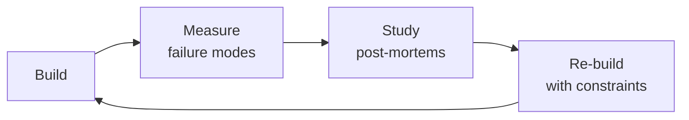

# Chaos Engineer
> **Portability target:** Spec-level (runs on Claude Code, Copilot, Gemini CLI, Codex, Cursor). No vendor-specific frontmatter fields.

Systematic resilience verification framework based on Chaos Engineering principles. Covers experiment design, fault injection, blast radius management, GameDay facilitation, resilience pattern validation, and building organizational confidence in system behavior under failure.

### Cross-skills Integration

| Step | Skill | What it produces |
|------|-------|------------------|
| **Before** | site-reliability-engineer | SLO definitions, error budgets, monitoring dashboards, alert configurations |
| **This** | chaos-engineer | Chaos experiment designs, fault injection runbooks, GameDay reports, resilience validation |
| **After** | observability-engineer | Enhanced dashboards, alert tuning, anomaly detection patterns validated by chaos |

Common chains:
- **Chain**: site-reliability-engineer → chaos-engineer → observability-engineer — SRE defines what "reliable" means; chaos engineer proves (or disproves) it; observability engineer tunes detection.
- **Chain**: devops-engineer → chaos-engineer → incident-responder — DevOps provisions the testing environment; chaos engineer injects faults; incident responder validates detection and response playbooks.

## Route the Request

<!-- QUICK: 30s -- auto-route first, then intent-route -->

### Auto-Route (No User Input Required)
Evaluate these file-system conditions in order. First match wins — jump immediately.

| # | Condition | Action |
|---|-----------|--------|
| A1 | `file_contains("*.yaml", "kind: ChaosEngine\|kind: NetworkChaos\|kind: PodChaos\|kind: StressChaos")` OR `file_contains("*.json", "\"gremlin\"\|\"chaos-mesh\"\|\"litmus\"")` OR `file_exists("gremlin.yaml\|chaos-experiment.yaml")` | This is your skill. Jump to **Core Workflow** — Phase 1. |
| A2 | `file_contains("*.yaml", "apiVersion: litmuschaos.io\|chaos-mesh.org")` AND `file_contains("*.yaml", "steadyState\|hypothesis")` | Jump to **Decision Trees** — Steady State Hypothesis Design. |
| A3 | `file_contains("docker-compose.yml\|*.yaml", "prometheus\|grafana\|datadog")` AND `file_contains("*", "alert\|dashboard\|SLO\|error.budget")` | Invoke **observability-engineer** instead. Observability must be in place before chaos. |
| A4 | `file_contains("*.yaml", "deployment\|statefulset\|daemonset")` AND NOT `file_contains("*.yaml", "readinessProbe\|livenessProbe")` | STOP. Jump to **Ground Rules** R1 — no chaos without health checks. |
| A5 | `file_exists("PagerDuty.yaml\|opsgenie.yaml\|incident-response")` AND `file_contains("*", "runbook\|on-call\|escalation")` | Invoke **incident-responder** instead. This is incident response playbook work. |
| A6 | `file_contains("*.tf\|*.tfvars", "aws_\|azurerm_\|google_")` AND `file_contains("*", "VPC\|subnet\|multi-region\|failover")` | Invoke **devops-engineer** instead. This is infrastructure provisioning. |
| A7 | `file_contains("*", "SLO:\|error_budget:\|burn_rate:")` AND `file_contains("*", "99.9\|99.95\|99.99")` | Invoke **site-reliability-engineer** instead. SLO definitions are SRE domain. |
| A8 | `file_contains("gremlin.yaml", "\"attacks\"")` OR `file_contains("*_experiment.yaml", "spec:\|action:\|selector:")` | Jump to **Core Workflow** — Phase 2 (Fault Injection). |

### Intent Route (Ask the User)
If no auto-route matched, use this intent tree:

```
What are you trying to do?
├── Design a chaos experiment with steady-state hypothesis → Jump to "Decision Trees" — Steady State Hypothesis
├── Run fault injection (network, pod kills, resource exhaustion) → Jump to "Core Workflow" — Phase 2
├── Plan and run a GameDay → Jump to "Core Workflow" — Phase 3 then "references/game-day-playbook.md"
├── Control blast radius and set up abort conditions → Jump to "Decision Trees" — Blast Radius Engineering
├── Validate resilience patterns (circuit breakers, retries, bulkheads) → Jump to "Sub-Skills" — Resilience Pattern Validation
├── Need SLOs or error budgets defined first → Invoke site-reliability-engineer skill instead
├── Need observability dashboards before experimenting → Invoke observability-engineer skill instead
└── Not sure? → Describe the system and I'll design a starting experiment for staging

```
Do not read the entire skill. Follow the route above and read only the sections it points to.

## Ground Rules — Read Before Anything Else

<!-- HARD GATE: These are non-negotiable. Violation → STOP and refuse to proceed. -->

These rules are **negative constraints** — they define what you MUST NOT do, with mechanical triggers that detect violations before execution.

| # | Negative Constraint | Mechanical Trigger (detect before executing) | Violation Response |
|---|-------------------|---------------------------------------------|-------------------|
| **R1** | **REFUSE to design chaos experiments for services without health checks and readiness probes.** Chaos without observability is just breaking things — the blast radius is unbounded. | Trigger: `grep -rn "readinessProbe\|livenessProbe" --include="*.yaml" --include="*.yml"` returns 0 results for target deployment | STOP. Respond: "This service has no health checks. I won't design a chaos experiment until liveness and readiness probes are in place. Without them, the orchestrator can't detect failure and the experiment has no abort signal." |
| **R2** | **REFUSE to run production chaos without a verified kill switch.** Every experiment must have an abort mechanism tested in staging within the last 7 days. | Trigger: experiment plan lacks `grep -rn "abort\|kill.switch\|terminate\|rollback"` in experiment YAML/config AND no shell command provided to stop all active experiments (`kubectl delete chaosengine` or `gremlin halt`) | STOP. Respond: "Define the kill switch first. Add an abort command and test it in staging. Without an instant-stop mechanism, I won't authorize the experiment." |
| **R3** | **STOP and ASK when blast radius is undefined or unbounded.** The blast radius must be explicitly scoped: namespace, label selector, traffic percentage, or user segment — never `*` or `all`. | Trigger: experiment config contains `namespace: "*"` OR `selector: {}` OR `percent: 100` OR `blastRadius: null` OR no label selector on the fault injection | STOP. Ask: "What is the blast radius? Specify namespace, label selector, percentage of traffic, or user segment. I need explicit scope before proceeding." |
| **R4** | **DETECT and WARN when steady-state hypothesis is unfalsifiable.** "The system is resilient" is not a hypothesis. Every hypothesis must have measurable thresholds. | Trigger: hypothesis text matches `grep -i "resilient\|works fine\|handles failure\|stays up"` without numeric thresholds (P50/P95/P99, error rate %, throughput) | WARN: "This hypothesis is unfalsifiable. Rewrite with numeric thresholds, e.g.: 'P99 latency < 500ms AND error rate < 1% AND throughput > 1000 req/s during 30% packet loss for 120s.'" |
| **R5** | **DETECT and WARN when abort conditions lack numeric thresholds.** "If things look bad" is not an abort condition. Every abort trigger must be numeric and measurable. | Trigger: abort section contains `grep -iv "[0-9]\+%"\|"[0-9]\+ms"\|"[0-9]\+s"` — no numeric values found in abort criteria | WARN: "Add numeric abort thresholds: error rate > X%, P99 latency > Yms, duration > Zs. Without numbers, 'abort when it looks bad' means 'abort after the outage.'" |
| **R6** | **STOP and ASK when the target environment is ambiguous.** Production, staging, canary, or dev? The environment determines every safety parameter. | Trigger: experiment plan does not mention `staging` OR `production` OR `canary` OR `dev` OR `namespace:` explicitly | STOP. Ask: "Which environment? Staging, production, or canary? If production: what time window? Is on-call notified? Is the abort command tested?" |
| **R7** | **REFUSE to inject faults without first verifying observability coverage.** You must confirm the injected fault is visible on dashboards within 2 minutes before proceeding to production. | Trigger: no pre-experiment observability check: `grep -rn "prometheus\|grafana\|datadog\|metrics" --include="*.yaml" --include="*.json" experiment-config/` returns 0 AND no mention of dashboard/alerts in experiment plan | STOP. Respond: "Inject the fault in staging for 30 seconds first. If it's not visible on dashboards within 2 minutes, fix observability. Chaos without visibility is vandalism." |

## The Expert's Mindset

Masters of chaos engineer don't just build — they build **the right thing, at the right time, with the right trade-offs**. They think in systems, not tasks.

| Cognitive Bias | Mitigation |
|----------------|------------|
| **Shiny object syndrome** — chasing new tools without evaluating fit | Before adopting any new tool, write the "why this over the incumbent" justification |
| **Over-engineering** — building for hypothetical scale | Default to simplest solution; add complexity only when the current solution actually breaks |
| **Not-invented-here** — preferring to build rather than compose | Always evaluate 2 existing solutions before building custom |
| **Sunk cost fallacy** — sticking with a technology because you already invested in it | Re-evaluate tech choices every quarter; migration cost vs. staying cost |

### What Masters Know That Others Don't
- The **failure modes** of every component in their stack — not just the happy path
- When **not** to use their favorite tool (every tool has a misuse zone)
- That **data/model quality decays over time** — monitoring is not optional, it's foundational

### When to Break Your Own Rules
- **Move fast on reversible decisions.** Data format? Hard to change. Dashboard layout? Easy. Know the difference.
- **Skip the abstraction until the third use case.** Two is coincidence, three is a pattern.

## Operating at Different Levels

| Level | Scope | You... |
|-------|-------|--------|
| **L1** | Single component/module | Implement a well-defined piece following established patterns |
| **L2** | Feature or service | Design and build a complete feature; make tech choices within team conventions |
| **L3** | System or product area | Define architecture for a product area; set team tech standards; mentor L1-L2 |
| **L4** | Multiple systems / platform | Define org-wide architecture patterns; make build-vs-buy decisions; influence industry practice |
| **L5** | Industry / ecosystem | Create new architectural patterns adopted across the industry; redefine what's possible |

**Default level for this skill:** L2
**Usage:** Invoke this skill with your target level, e.g., "as an L3 chaos engineer, design..."

For full level definitions, see `skills/00-framework/skill-levels/SKILL.md`.

## When to Use

<!-- QUICK: 30s -- scan the bullet list to decide if this skill fits -->
- Establishing a Chaos Engineering practice from scratch — tooling, methodology, cultural buy-in.
- Designing and executing chaos experiments to verify system resilience hypotheses.
- Running a GameDay — a planned event where the team responds to injected failures under controlled conditions.
- Implementing circuit breakers, retries, timeouts, and bulkheads — and verifying they actually work under real faults.
- Testing auto-scaling behavior: does the system scale up correctly when nodes are killed?
- Validating observability: during a chaos experiment, can you detect, diagnose, and resolve the issue before it affects users?
- Building resilience scoring for services to prioritize hardening efforts.
- Preparing for AWS/Azure/GCP regional failures — testing multi-region failover.

## Decision Trees

<!-- QUICK: 30s -- follow the ASCII tree to your scenario -->
### 1. What to Chaos First

```
                     ┌─────────────────────┐
                     │ START: Pick a service│
                     └──────────┬──────────┘
                                │
                    ┌───────────▼───────────┐
                    │ Ran 3+ incidents in   │
                    │ last 6 months?        │
                    └────┬──────────────┬───┘
                         │ YES          │ NO
                    ┌────▼────────┐ ┌──▼──────────────────┐
                    │ Test failure│ │ Does the service have │
                    │ modes from  │ │ health checks, retries│
                    │ real post-  │ │ and circuit breakers? │
                    │ mortems     │ └──┬──────────────┬────┘
                    └─────────────┘    │ YES          │ NO
                              ┌────────▼─────┐  ┌─────▼────────┐
                              │ Start with a │  │ Implement     │
                              │ staging pod- │  │ resilience    │
                              │ kill test    │  │ patterns FIRST│
                              └──────────────┘  └──────────────┘
```
**Pick services with incident history** — test the failures you've already experienced before hypothetical ones.  
**If no resilience patterns exist** — chaos engineering without circuit breakers just proves you're fragile. Build resilience first.

### 2. Experiment Type Selection

```
                ┌──────────────────────────────┐
                │ START: What are you testing?  │
                └──────────────┬───────────────┘
                               │
            ┌──────────────────┼──────────────────┐
            │                  │                  │
    ┌───────▼──────┐  ┌───────▼──────┐  ┌───────▼────────┐
    │ Infrastructure│  │  Dependency  │  │  System-Wide   │
    │  resilience?  │  │   behavior?  │  │   confidence?  │
    └───────┬──────┘  └───────┬──────┘  └───────┬────────┘
            │                 │                  │
    ┌───────▼──────┐  ┌───────▼──────┐  ┌───────▼────────┐
    │ Pod kill →   │  │ Network      │  │ AZ failure →   │
    │ Node drain → │  │ latency →    │  │ Region failover│
    │ CPU stress   │  │ Packet loss  │  │ → GameDay event│
    └──────────────┘  └──────────────┘  └────────────────┘
```
**Infrastructure tests** verify auto-scaling and self-healing. Start here — they're the safest.  
**Dependency tests** verify circuit breakers, retries, and timeouts. Run after infra tests pass.  
**System-wide tests** verify multi-AZ/region failover. Run as GameDays with full team participation.

### 3. Observability Gate

```
                  ┌────────────────────────────┐
                  │ START: Before any experiment│
                  └─────────────┬──────────────┘
                                │
                    ┌───────────▼───────────┐
                    │ Inject fault in staging│
                    │ for 30 seconds         │
                    └────────────┬──────────┘
                                 │
               ┌─────────────────┼─────────────────┐
               │ YES             │                  │ NO
     ┌─────────▼────────┐       │        ┌─────────▼──────────┐
     │ Can you see it   │       │        │ Fix observability  │
     │ on the dashboard │       │        │ gap. Document it.  │
     │ within 2 minutes?│       │        │ Re-test before     │
     └────────┬─────────┘       │        │ running experiment.│
              │                 │        └────────────────────┘
     ┌────────▼────────┐       │
     │ Does alert fire │       │
     │ within expected │       │
     │ time window?    │       │
     └────┬───────┬────┘       │
          │YES    │NO          │
     ┌────▼──┐ ┌──▼──────────┐│
     │Proceed│ │Tune alert   ││
     │to prod│ │thresholds   ││
     └───────┘ └─────────────┘│
```
**No observability = no experiment.** If you can't detect the fault, you can't learn from it.  
**Fix dashboards and alerts before anything else** — running chaos without observability is just breaking things.

### 4. Production Readiness Gate

```
                     ┌──────────────────────┐
                     │ START: Ready for prod?│
                     └──────────┬───────────┘
                                │
                    ┌───────────▼───────────┐
                    │ Staging GameDay       │
                    │ completed with clear  │
                    │ learnings?            │
                    └────┬──────────────┬───┘
                         │ YES          │ NO
                    ┌────▼────────┐ ┌──▼──────────────┐
                    │ Multi-AZ or │ │ Stay in staging. │
                    │ multi-region│ │ Never run first  │
                    │ deployment? │ │ experiment in    │
                    └──┬───────┬──┘ │ production.      │
                       │YES    │NO  └──────────────────┘
               ┌───────▼──┐ ┌──▼──────────┐
               │ Test AZ  │ │ Single-AZ is │
               │ failover │ │ your bottle- │
               │ first    │ │ neck. Fix it.│
               └──────────┘ └──────────────┘
```
**Staging GameDay first** — never your first experiment in production.  
**Multi-AZ/region failover is the highest-value production experiment** — test what protects you from real outages.

### 5. Tool Selection

```
                     ┌─────────────────┐
                     │ START: Pick tool│
                     └────────┬────────┘
                              │
                    ┌─────────▼──────────┐
                    │ Infrastructure is   │
                    │ 100% Kubernetes?    │
                    └────┬────────────┬───┘
                         │ YES        │ NO
                    ┌────▼──────┐ ┌──▼──────────────┐
                    │ Budget >$0?│ │ Multi-cloud or  │
                    └──┬─────┬───┘ │ VMs+bare metal? │
                       │YES  │NO   └──┬──────────┬───┘
               ┌───────▼──┐ ┌─▼────┐  │YES       │NO
               │ Gremlin  │ │Chaos │ ┌▼────────┐┌▼──────┐
               │ (managed)│ │Mesh  │ │ Gremlin ││AWS FIS│
               └──────────┘ │(free)│ │(paid)   ││(AWS)  │
                            └──────┘ └─────────┘└───────┘
```
**K8s-only + free → Chaos Mesh or LitmusChaos.**  
**Multi-platform → Gremlin.**  
**AWS-only → AWS FIS** (IAM integration, pay-per-action).

## Cross-Skill Coordination

<!-- QUICK: 30s -- table of who to talk to when -->
Chaos engineering is inherently cross-team — you break things that other teams built and own. Without coordination, chaos experiments are indistinguishable from attacks or accidents.

### Decision Gates & Artifacts

- **Gate 1 — Observability Verified:** Chaos experiments require existing dashboards and alerts from `observability-engineer`. Without them, experiments are just breaking things. Artifact: observability health check report.
- **Gate 2 — SLOs Defined:** Steady state hypotheses depend on SLO definitions and error budgets established by `site-reliability-engineer`. Artifact: SLO threshold document per service.
- **Gate 3 — Infrastructure Ready:** Experiment execution environments and blast radius controls depend on infrastructure provisioned by `devops-engineer`. Artifact: environment readiness checklist.
- **Gate 4 — Runbook Validated:** Incident response playbooks validated in coordination with `incident-responder` before production experiments. Artifact: signed-off runbook validation report.
- **Artifact:** GameDay report (findings, action items, owners), resilience score per service, blast radius containment verification.

| Coordinate With | When | What to Share/Ask |
|-----------------|------|-------------------|
| **DevOps / SRE** | Experiment execution, blast radius control, monitoring during experiments | Experiment schedule, injection method, abort conditions, observability dashboard |
| **Backend Developers (Service Owners)** | Service-level experiments, fault injection in specific services | Service architecture, known failure modes, recovery time expectations |
| **Security Reviewer** | Security-relevant experiments (network segmentation, auth failures) | Experiment boundaries, security control bypass risks, incident response awareness |
| **System Architect** | Cross-service experiments, cascade failure testing, resilience patterns | Service dependency graph, circuit breaker locations, bulkhead boundaries |
| **Incident Responder / On-Call** | ALL experiment windows — must know experiments are running | Experiment schedule, expected symptoms, abort command, contact for false alarm |
| **QA Engineer** | Pre-production chaos experiments, resilience test integration | Test environment setup, experiment scenarios, expected recovery behavior |
| **Project Manager** | Experiment scheduling, GameDay planning, stakeholder communication | Experiment calendar, production freeze windows, team availability |
| **CTO Advisor** | First-time production chaos experiments, high-risk experiments | Risk acceptance, blast radius approval, executive awareness |
| **Product Strategist** | User-impacting experiments, degraded mode UX testing | Expected user experience during failure, graceful degradation expectations |

### Communication Triggers — When to Proactively Notify

| Trigger | Notify | Why |
|---------|--------|-----|
| Chaos experiment scheduled in production (>24 hours notice minimum) | On-Call, DevOps, Service Owners, Project Manager | All stakeholders aware; avoid confusion with real incidents |
| Experiment about to begin (5-minute warning) | On-Call, DevOps, Service Owners | Final confirmation; abort if any stakeholder objects |
| Experiment exceeds blast radius (affects unexpected services) | On-Call, DevOps, Service Owners | Abort immediately; blast radius containment failed |
| Real incident occurs during experiment | On-Call, Incident Commander, All Stakeholders | Abort experiment NOW; real incident takes priority |
| Experiment reveals critical vulnerability (system did not recover) | System Architect, Service Owners, CTO Advisor | Resilience gap discovered; remediation prioritization required |
| GameDay scheduled (cross-team resilience exercise) | All Engineering Teams, Project Manager, CTO Advisor | Full organization awareness; schedule around releases and PTO |
| Experiment results published (post-experiment report) | All Stakeholders, CTO Advisor | Learnings shared; resilience improvements prioritized |
| Circuit breaker or timeout configuration found inadequate during experiment | System Architect, Service Owners | Configuration change needed; deployment required |

### Escalation Path

| Situation | Escalate To | Rationale |
|-----------|------------|-----------|
| Chaos experiment causes production incident (real user impact) | **Incident Commander** + CTO Advisor + VP Engineering | Abort experiment; SEV-level incident response; postmortem required |
| Experiment reveals systemic failure pattern (multiple services fail same way) | **System Architect** + CTO Advisor | Architecture resilience gap; may require significant re-architecture |
| Service owner refuses to participate in chaos experiments for >2 quarters | **CTO Advisor** + VP Engineering | Resilience culture gap; executive sponsorship needed |
| Blast radius control mechanism itself fails (experiment cannot be aborted) | **CTO Advisor** + DevOps Lead | Safety mechanism failure; halt all experiments until fixed |
| Production chaos experiment proposed for first time | **CTO Advisor** + VP Engineering | Organizational risk decision; executive approval required |

## Proactive Triggers

<!-- QUICK: 30s — when to proactively notify stakeholders -->

| Trigger | Notify | Why |
|---------|--------|-----|
| GameDay exercise completed with severity findings | CTO Advisor, VP Engineering, All Service Owners | Resilience gaps discovered; prioritization needed for remediation tickets |
| Chaos experiment reveals circuit breaker misconfiguration | System Architect, Service Owners | Circuit breaker not activating; configuration fix needed before next incident |
| Blast radius containment breach during automated experiment | DevOps Lead, On-Call, Security Reviewer | Containment mechanism failure; halt all automated experiments until root cause fixed |
| Experiment results show MTTR exceeds SLO by >2x | Service Owners, SRE, CTO Advisor | Recovery time unacceptable; architectural or procedural changes needed |
| New service onboarded without chaos experiment coverage | Service Owner, DevOps | Resilience blind spot; experiment design and scheduling needed |
| Chaos tooling license exceeds quarterly budget by >20% | CTO Advisor, Finance | Budget reallocation or tooling evaluation needed |
| Steady state hypothesis invalidated by infrastructure change | Service Owners, DevOps | Baseline metrics shifted; hypothesis rewrite and experiment revalidation required |

## Core Workflow

<!-- QUICK: 30s -- scan phase titles to understand the process -->
<!-- DEEP: 10+min -->
### Phase 1 (~15 min): Baseline
**Input:** Service name, environment (staging/prod), observability dashboards.  
**Steps:** 1) Collect P50/P95/P99 latency, error rate, throughput for 5+ minutes under normal load. 2) Verify all dashboards, alerts, and logs show the service clearly. 3) Record baseline metrics as JSON artifact.  
**Output:** Baseline metrics file + observability verification checklist passed.

<!-- DEEP: 10+min -->
### Phase 2 (~30 min): Hypothesis & Experiment Design
**Input:** Baseline metrics, failure mode catalog (42 experiments in references).  
**Steps:** 1) Select one failure mode (e.g., pod kill, network latency). 2) Write falsifiable hypothesis: "When X happens, Y metric stays below Z for T minutes." 3) Define blast radius (traffic %, pods, AZ, time window). 4) Set abort conditions with specific numeric thresholds.  
**Output:** Experiment document with hypothesis, blast radius, abort triggers, rollback steps.

<!-- DEEP: 10+min -->
### Phase 3 (~20 min): Staging Validation
**Input:** Experiment document, staging environment, chaos tooling access.  
**Steps:** 1) Run experiment in staging at full blast radius. 2) Verify steady state hypothesis holds. 3) Confirm observability detects the fault within 2 minutes. 4) Test abort mechanism — stop experiment, verify recovery. 5) If hypothesis refuted, fix the gap and re-run.  
**Output:** Staging validation report — passed/failed, MTTR measured, gaps documented.

<!-- DEEP: 10+min -->
### Phase 4 (~15 min): Progressive Production Rollout
**Input:** Staging validation passed, production access, on-call notified.  
**Steps:** 1) Canary: single pod/internal traffic, 15 minutes. 2) 1% traffic, 30 minutes. 3) 10% traffic, 30 minutes. 4) Full scope (if applicable). At each step: monitor abort triggers, compare metrics to baseline.  
**Output:** Production experiment results — hypothesis verdict, blast radius respected, MTTR measured.

<!-- DEEP: 10+min -->
### Phase 5 (~25 min): Analysis & Remediation
**Input:** Experiment results, Scribe notes, Observer analysis.  
**Steps:** 1) Document: what worked, what broke, what surprised us. 2) Create action items with owner + severity + due date. 3) Update experiment catalog status (designed → tested-staging → tested-prod → automated). 4) Share findings with service owners and leadership.  
**Output:** After-action report, tracked action items, updated experiment catalog.

## What Good Looks Like

The system fails gracefully. Chaos experiments run in production without customer impact. Every team knows their blast radius and practices recovery regularly. When real incidents happen, they're boring — because the team has already practiced the response.

## Deliberate Practice



| Level | Practice | Frequency |
|-------|----------|-----------|
| **Novice** | Rebuild an existing system from scratch, then compare your design with the original | Monthly |
| **Competent** | Add a new constraint (10x data, zero downtime, etc.) to a familiar design and re-architect | Quarterly |
| **Expert** | Design the same system under 3 conflicting constraint sets; write a decision record for each | Quarterly |
| **Master** | Teach a junior to design a system; your role is to ask questions, not give answers | Monthly |

**The One Highest-Leverage Activity:** Every quarter, take a system you built 6+ months ago and redesign it from scratch with what you know now. Write down what changed and why.

## Gotchas

- **Chaos experiment "blast radius"** measured by instance count misses the real blast radius. Terminating 1 of 100 instances sounds safe (1%), but if that instance holds the sole partition leader for a critical Kafka topic, the impact is 100% outage for all producers/consumers of that topic.
- **`Chaos Mesh` network partition experiment** — cutting network between pods A and B doesn't mean the app handles it gracefully. The kubelet still reports pod A as "Running" and `Ready` probes may still pass if they don't test that specific network path. Your monitoring says "all healthy" while the app is degraded.
- **Game days where the team knows** the exact chaos experiment in advance produce artificially smooth responses. The team pre-writes runbooks, has dashboards ready, and mentally prepares. The real incident doesn't announce itself. Use blind game days where only the chaos engineer knows what's being injected.
- **Pod deletion in Kubernetes** sends SIGTERM, waits `terminationGracePeriodSeconds` (default 30s), then SIGKILL. A chaos experiment that deletes a pod with default grace period may not trigger graceful shutdown bugs — apps with 60s cleanup may work fine in chaos but fail in real deployments. Test with `gracePeriodSeconds: 0` to find shutdown bugs.

## Verification

- [ ] Chaos experiment manifest validates: `chaos-mesh validate experiment.yaml` or equivalent — no syntax errors
- [ ] Blast radius: experiment targets ≤ 10% of instances (or documented justification for higher %)
- [ ] Steady-state hypothesis: baseline metrics collected for 5 minutes BEFORE injection — metrics stable during baseline
- [ ] Rollback: experiment has `duration` set (not infinite) — experiment auto-terminates after duration
- [ ] Monitoring during experiment: grafana dashboard shows the injection impact — no "unknown unknown" failures
- [ ] Game day report: findings documented, severity assessed, remediation tickets filed within 24 hours

## References
- **Blast Radius (Military-Grade Controls)**: See [blast-radius-military-grade-controls.md](references/blast-radius-military-grade-controls.md)
- **CI/CD Integration for Chaos**: See [ci-cd-integration-for-chaos.md](references/ci-cd-integration-for-chaos.md)
- **Experiment Types (Expanded Catalog)**: See [experiment-types-expanded-catalog.md](references/experiment-types-expanded-catalog.md)
- **Game Days**: See [game-days.md](references/game-days.md)
- **Observability for Chaos**: See [observability-for-chaos.md](references/observability-for-chaos.md)
- **Organization Maturity Model**: See [organization-maturity-model.md](references/organization-maturity-model.md)
- **Principles (Netflix's Original + Modern Evolution)**: See [principles-netflixs-original-+-modern-evolution.md](references/principles-netflixs-original-+-modern-evolution.md)
- **Steady State Hypothesis Deep Dive**: See [steady-state-hypothesis-deep-dive.md](references/steady-state-hypothesis-deep-dive.md)
- **Tooling Deep Dive**: See [tooling-deep-dive.md](references/tooling-deep-dive.md)
