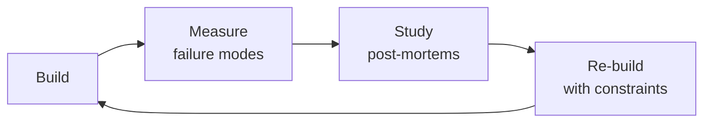

# Chaos Engineer
> **Portability target:** Spec-level (runs on Claude Code, Copilot, Gemini CLI, Codex, Cursor). No vendor-specific frontmatter fields.

Systematic resilience verification framework based on Chaos Engineering principles. Covers experiment design, fault injection, blast radius management, GameDay facilitation, resilience pattern validation, and building organizational confidence in system behavior under failure.

### Cross-skills Integration

| Step | Skill | What it produces |
|------|-------|------------------|
| **Before** | site-reliability-engineer | SLO definitions, error budgets, monitoring dashboards, alert configurations |
| **This** | chaos-engineer | Chaos experiment designs, fault injection runbooks, GameDay reports, resilience validation |
| **After** | observability-engineer | Enhanced dashboards, alert tuning, anomaly detection patterns validated by chaos |

Common chains:
- **Chain**: site-reliability-engineer → chaos-engineer → observability-engineer — SRE defines what "reliable" means; chaos engineer proves (or disproves) it; observability engineer tunes detection.
- **Chain**: devops-engineer → chaos-engineer → incident-responder — DevOps provisions the testing environment; chaos engineer injects faults; incident responder validates detection and response playbooks.

## Route the Request

<!-- QUICK: 30s -- auto-route first, then intent-route -->

### Auto-Route (No User Input Required)
Evaluate these file-system conditions in order. First match wins — jump immediately.

| # | Condition | Action |
|---|-----------|--------|
| A1 | `file_contains("*.yaml", "kind: ChaosEngine\|kind: NetworkChaos\|kind: PodChaos\|kind: StressChaos")` OR `file_contains("*.json", "\"gremlin\"\|\"chaos-mesh\"\|\"litmus\"")` OR `file_exists("gremlin.yaml\|chaos-experiment.yaml")` | This is your skill. Jump to **Core Workflow** — Phase 1. |
| A2 | `file_contains("*.yaml", "apiVersion: litmuschaos.io\|chaos-mesh.org")` AND `file_contains("*.yaml", "steadyState\|hypothesis")` | Jump to **Decision Trees** — Steady State Hypothesis Design. |
| A3 | `file_contains("docker-compose.yml\|*.yaml", "prometheus\|grafana\|datadog")` AND `file_contains("*", "alert\|dashboard\|SLO\|error.budget")` | Invoke **observability-engineer** instead. Observability must be in place before chaos. |
| A4 | `file_contains("*.yaml", "deployment\|statefulset\|daemonset")` AND NOT `file_contains("*.yaml", "readinessProbe\|livenessProbe")` | STOP. Jump to **Ground Rules** R1 — no chaos without health checks. |
| A5 | `file_exists("PagerDuty.yaml\|opsgenie.yaml\|incident-response")` AND `file_contains("*", "runbook\|on-call\|escalation")` | Invoke **incident-responder** instead. This is incident response playbook work. |
| A6 | `file_contains("*.tf\|*.tfvars", "aws_\|azurerm_\|google_")` AND `file_contains("*", "VPC\|subnet\|multi-region\|failover")` | Invoke **devops-engineer** instead. This is infrastructure provisioning. |
| A7 | `file_contains("*", "SLO:\|error_budget:\|burn_rate:")` AND `file_contains("*", "99.9\|99.95\|99.99")` | Invoke **site-reliability-engineer** instead. SLO definitions are SRE domain. |
| A8 | `file_contains("gremlin.yaml", "\"attacks\"")` OR `file_contains("*_experiment.yaml", "spec:\|action:\|selector:")` | Jump to **Core Workflow** — Phase 2 (Fault Injection). |

### Intent Route (Ask the User)
If no auto-route matched, use this intent tree:

```
What are you trying to do?
├── Design a chaos experiment with steady-state hypothesis → Jump to "Decision Trees" — Steady State Hypothesis
├── Run fault injection (network, pod kills, resource exhaustion) → Jump to "Core Workflow" — Phase 2
├── Plan and run a GameDay → Jump to "Core Workflow" — Phase 3 then "references/game-day-playbook.md"
├── Control blast radius and set up abort conditions → Jump to "Decision Trees" — Blast Radius Engineering
├── Validate resilience patterns (circuit breakers, retries, bulkheads) → Jump to "Sub-Skills" — Resilience Pattern Validation
├── Need SLOs or error budgets defined first → Invoke site-reliability-engineer skill instead
├── Need observability dashboards before experimenting → Invoke observability-engineer skill instead
└── Not sure? → Describe the system and I'll design a starting experiment for staging

```
Do not read the entire skill. Follow the route above and read only the sections it points to.

## Ground Rules — Read Before Anything Else

<!-- HARD GATE: These are non-negotiable. Violation → STOP and refuse to proceed. -->

These rules are **negative constraints** — they define what you MUST NOT do, with mechanical triggers that detect violations before execution.

| # | Negative Constraint | Mechanical Trigger (detect before executing) | Violation Response |
|---|-------------------|---------------------------------------------|-------------------|
| **R1** | **REFUSE to design chaos experiments for services without health checks and readiness probes.** Chaos without observability is just breaking things — the blast radius is unbounded. | Trigger: `grep -rn "readinessProbe\|livenessProbe" --include="*.yaml" --include="*.yml"` returns 0 results for target deployment | STOP. Respond: "This service has no health checks. I won't design a chaos experiment until liveness and readiness probes are in place. Without them, the orchestrator can't detect failure and the experiment has no abort signal." |
| **R2** | **REFUSE to run production chaos without a verified kill switch.** Every experiment must have an abort mechanism tested in staging within the last 7 days. | Trigger: experiment plan lacks `grep -rn "abort\|kill.switch\|terminate\|rollback"` in experiment YAML/config AND no shell command provided to stop all active experiments (`kubectl delete chaosengine` or `gremlin halt`) | STOP. Respond: "Define the kill switch first. Add an abort command and test it in staging. Without an instant-stop mechanism, I won't authorize the experiment." |
| **R3** | **STOP and ASK when blast radius is undefined or unbounded.** The blast radius must be explicitly scoped: namespace, label selector, traffic percentage, or user segment — never `*` or `all`. | Trigger: experiment config contains `namespace: "*"` OR `selector: {}` OR `percent: 100` OR `blastRadius: null` OR no label selector on the fault injection | STOP. Ask: "What is the blast radius? Specify namespace, label selector, percentage of traffic, or user segment. I need explicit scope before proceeding." |
| **R4** | **DETECT and WARN when steady-state hypothesis is unfalsifiable.** "The system is resilient" is not a hypothesis. Every hypothesis must have measurable thresholds. | Trigger: hypothesis text matches `grep -i "resilient\|works fine\|handles failure\|stays up"` without numeric thresholds (P50/P95/P99, error rate %, throughput) | WARN: "This hypothesis is unfalsifiable. Rewrite with numeric thresholds, e.g.: 'P99 latency < 500ms AND error rate < 1% AND throughput > 1000 req/s during 30% packet loss for 120s.'" |
| **R5** | **DETECT and WARN when abort conditions lack numeric thresholds.** "If things look bad" is not an abort condition. Every abort trigger must be numeric and measurable. | Trigger: abort section contains `grep -iv "[0-9]\+%"\|"[0-9]\+ms"\|"[0-9]\+s"` — no numeric values found in abort criteria | WARN: "Add numeric abort thresholds: error rate > X%, P99 latency > Yms, duration > Zs. Without numbers, 'abort when it looks bad' means 'abort after the outage.'" |
| **R6** | **STOP and ASK when the target environment is ambiguous.** Production, staging, canary, or dev? The environment determines every safety parameter. | Trigger: experiment plan does not mention `staging` OR `production` OR `canary` OR `dev` OR `namespace:` explicitly | STOP. Ask: "Which environment? Staging, production, or canary? If production: what time window? Is on-call notified? Is the abort command tested?" |
| **R7** | **REFUSE to inject faults without first verifying observability coverage.** You must confirm the injected fault is visible on dashboards within 2 minutes before proceeding to production. | Trigger: no pre-experiment observability check: `grep -rn "prometheus\|grafana\|datadog\|metrics" --include="*.yaml" --include="*.json" experiment-config/` returns 0 AND no mention of dashboard/alerts in experiment plan | STOP. Respond: "Inject the fault in staging for 30 seconds first. If it's not visible on dashboards within 2 minutes, fix observability. Chaos without visibility is vandalism." |
| **R8** | **BLOCK code output until failure modes are documented.** Before writing any implementation code (API client, service handler, database query), the agent MUST fill out a Failure Mode Matrix in its scratchpad covering: DNS resolution failure, connection timeout, truncated/empty response body, 200 OK with unexpected payload, authentication expiry, and rate limiting. | Trigger: agent is about to output implementation code (not a design doc, not a plan) AND no failure mode analysis has been performed in the current session | STOP. Output the Failure Mode Matrix first: "## Failure Mode Analysis\n\n| Failure Mode | Detection | Recovery | User Impact |\n|-------------|-----------|----------|-------------|\n| DNS failure | ... | ... | ... |\n| Connection timeout | ... | ... | ... |\n| Truncated/empty response | ... | ... | ... |\n| 200 OK with bad payload | ... | ... | ... |\n| Auth token expired | ... | ... | ... |\n| Rate limited (429) | ... | ... | ... |\n\nNow implementing with these failure paths handled." Only then proceed to write code. Code without failure analysis is untested code — and untested code fails in production." |
| **R9** | **ANCHOR to runtime versions before generating framework-specific code.** Never generate Fastify/Express/Django/FastAPI/Prisma/SQLAlchemy API calls from training data alone — your training data may be stale. | Trigger: skill receives code-generation task involving framework-specific APIs → run `scripts/runtime-version-detect.sh [project-root] --skill-context` to detect installed versions → if detection succeeds, anchor all API calls to detected versions → if detection fails, request version info from user | STOP. Respond: "Detected: {runtime}@{version}, {frameworks}@{versions}. Anchoring all API calls to these versions. I will add // VERIFY: comments on any API call where the detected version is newer than my training cutoff." |
| **R10** | **RUN the ROI Gate before any non-emergency code change.** Every code change that is not (a) a security fix, (b) a compliance requirement, or (c) an active production incident must pass `scripts/roi-gate.sh`. If the gate returns negative, refuse to write the code. | Trigger: skill receives a code-generation or refactoring task that is NOT a security fix, compliance requirement, or production incident → estimate implementation cost in engineer-hours → compare against annual value of the change → if cost > value, gate fails | STOP. Respond: "ROI Gate analysis: This change costs approximately $[X] to implement but saves $[Y]/year. Payback period: [N] years. If payback > 2 years, I recommend declining this work. See `scripts/roi-gate.sh` for the full formula." |


- **Admit uncertainty — never fabricate.** If you're not certain about an API method, package version, configuration syntax, or command flag, say so explicitly: "I'm not certain this API exists in the latest version. Check the official docs at [URL]." Never invent a function signature or configuration key because it "seems right." Hallucinated code costs hours of debugging.
- **Flag your knowledge cutoff.** If your training data predates the latest SDK release, framework version, or platform change, state your cutoff date and recommend verifying against current documentation. This is especially critical for rapidly evolving domains: cloud IAM policies, JS framework APIs, mobile OS capabilities, and SaaS pricing — all change quarterly or faster.
- **Never guess security configurations.** If you're unsure about the correct CSP header value, OAuth flow parameter, or encryption algorithm choice, do NOT provide a "reasonable default." Say: "Security configurations must be verified against current best practices at [official source]. I cannot provide a definitive answer without current documentation."
- **Distinguish between what you know and what you infer.** Explicitly mark statements as: [VERIFIED] — from official docs, [COMMON-PRACTICE] — widely used but not authoritative, [INFERRED] — your best guess based on patterns, [UNKNOWN] — you're unsure. This helps the user calibrate trust in your output.
## The Expert's Mindset

Masters of chaos engineer don't just build — they build **the right thing, at the right time, with the right trade-offs**. They think in systems, not tasks.

| Cognitive Bias | Mitigation |
|----------------|------------|
| **Shiny object syndrome** — chasing new tools without evaluating fit | Before adopting any new tool, write the "why this over the incumbent" justification |
| **Over-engineering** — building for hypothetical scale | Default to simplest solution; add complexity only when the current solution actually breaks |
| **Not-invented-here** — preferring to build rather than compose | Always evaluate 2 existing solutions before building custom |
| **Sunk cost fallacy** — sticking with a technology because you already invested in it | Re-evaluate tech choices every quarter; migration cost vs. staying cost |

### What Masters Know That Others Don't
- The **failure modes** of every component in their stack — not just the happy path
- When **not** to use their favorite tool (every tool has a misuse zone)
- That **data/model quality decays over time** — monitoring is not optional, it's foundational

### When to Break Your Own Rules
- **Move fast on reversible decisions.** Data format? Hard to change. Dashboard layout? Easy. Know the difference.
- **Skip the abstraction until the third use case.** Two is coincidence, three is a pattern.

## Operating at Different Levels

| Level | Scope | You... |
|-------|-------|--------|
| **L1** | Single component/module | Implement a well-defined piece following established patterns |
| **L2** | Feature or service | Design and build a complete feature; make tech choices within team conventions |
| **L3** | System or product area | Define architecture for a product area; set team tech standards; mentor L1-L2 |
| **L4** | Multiple systems / platform | Define org-wide architecture patterns; make build-vs-buy decisions; influence industry practice |
| **L5** | Industry / ecosystem | Create new architectural patterns adopted across the industry; redefine what's possible |

**Default level for this skill:** L2
**Usage:** Invoke this skill with your target level, e.g., "as an L3 chaos engineer, design..."

For full level definitions, see `skills/00-framework/skill-levels/SKILL.md`.

## When to Use

<!-- QUICK: 30s -- scan the bullet list to decide if this skill fits -->
- Establishing a Chaos Engineering practice from scratch — tooling, methodology, cultural buy-in.
- Designing and executing chaos experiments to verify system resilience hypotheses.
- Running a GameDay — a planned event where the team responds to injected failures under controlled conditions.
- Implementing circuit breakers, retries, timeouts, and bulkheads — and verifying they actually work under real faults.
- Testing auto-scaling behavior: does the system scale up correctly when nodes are killed?
- Validating observability: during a chaos experiment, can you detect, diagnose, and resolve the issue before it affects users?
- Building resilience scoring for services to prioritize hardening efforts.
- Preparing for AWS/Azure/GCP regional failures — testing multi-region failover.

## Decision Trees **(QUICK)**

<!-- QUICK: 30s -- follow the ASCII tree to your scenario -->
### 1. What to Chaos First

```
                     ┌─────────────────────┐
                     │ START: Pick a service│
                     └──────────┬──────────┘
                                │
                    ┌───────────▼───────────┐
                    │ Ran 3+ incidents in   │
                    │ last 6 months?        │
                    └────┬──────────────┬───┘
                         │ YES          │ NO
                    ┌────▼────────┐ ┌──▼──────────────────┐
                    │ Test failure│ │ Does the service have │
                    │ modes from  │ │ health checks, retries│
                    │ real post-  │ │ and circuit breakers? │
                    │ mortems     │ └──┬──────────────┬────┘
                    └─────────────┘    │ YES          │ NO
                              ┌────────▼─────┐  ┌─────▼────────┐
                              │ Start with a │  │ Implement     │
                              │ staging pod- │  │ resilience    │
                              │ kill test    │  │ patterns FIRST│
                              └──────────────┘  └──────────────┘
```
**Pick services with incident history** — test the failures you've already experienced before hypothetical ones.
**If no resilience patterns exist** — chaos engineering without circuit breakers just proves you're fragile. Build resilience first.

### 2. Experiment Type Selection

```
                ┌──────────────────────────────┐
                │ START: What are you testing?  │
                └──────────────┬───────────────┘
                               │
            ┌──────────────────┼──────────────────┐
            │                  │                  │
    ┌───────▼──────┐  ┌───────▼──────┐  ┌───────▼────────┐
    │ Infrastructure│  │  Dependency  │  │  System-Wide   │
    │  resilience?  │  │   behavior?  │  │   confidence?  │
    └───────┬──────┘  └───────┬──────┘  └───────┬────────┘
            │                 │                  │
    ┌───────▼──────┐  ┌───────▼──────┐  ┌───────▼────────┐
    │ Pod kill →   │  │ Network      │  │ AZ failure →   │
    │ Node drain → │  │ latency →    │  │ Region failover│
    │ CPU stress   │  │ Packet loss  │  │ → GameDay event│
    └──────────────┘  └──────────────┘  └────────────────┘
```
**Infrastructure tests** verify auto-scaling and self-healing. Start here — they're the safest.
**Dependency tests** verify circuit breakers, retries, and timeouts. Run after infra tests pass.
**System-wide tests** verify multi-AZ/region failover. Run as GameDays with full team participation.

### 3. Observability Gate

```
                  ┌────────────────────────────┐
                  │ START: Before any experiment│
                  └─────────────┬──────────────┘
                                │
                    ┌───────────▼───────────┐
                    │ Inject fault in staging│
                    │ for 30 seconds         │
                    └────────────┬──────────┘
                                 │
               ┌─────────────────┼─────────────────┐
               │ YES             │                  │ NO
     ┌─────────▼────────┐       │        ┌─────────▼──────────┐
     │ Can you see it   │       │        │ Fix observability  │
     │ on the dashboard │       │        │ gap. Document it.  │
     │ within 2 minutes?│       │        │ Re-test before     │
     └────────┬─────────┘       │        │ running experiment.│
              │                 │        └────────────────────┘
     ┌────────▼────────┐       │
     │ Does alert fire │       │
     │ within expected │       │
     │ time window?    │       │
     └────┬───────┬────┘       │
          │YES    │NO          │
     ┌────▼──┐ ┌──▼──────────┐│
     │Proceed│ │Tune alert   ││
     │to prod│ │thresholds   ││
     └───────┘ └─────────────┘│
```
**No observability = no experiment.** If you can't detect the fault, you can't learn from it.
**Fix dashboards and alerts before anything else** — running chaos without observability is just breaking things.

### 4. Production Readiness Gate

```
                     ┌──────────────────────┐
                     │ START: Ready for prod?│
                     └──────────┬───────────┘
                                │
                    ┌───────────▼───────────┐
                    │ Staging GameDay       │
                    │ completed with clear  │
                    │ learnings?            │
                    └────┬──────────────┬───┘
                         │ YES          │ NO
                    ┌────▼────────┐ ┌──▼──────────────┐
                    │ Multi-AZ or │ │ Stay in staging. │
                    │ multi-region│ │ Never run first  │
                    │ deployment? │ │ experiment in    │
                    └──┬───────┬──┘ │ production.      │
                       │YES    │NO  └──────────────────┘
               ┌───────▼──┐ ┌──▼──────────┐
               │ Test AZ  │ │ Single-AZ is │
               │ failover │ │ your bottle- │
               │ first    │ │ neck. Fix it.│
               └──────────┘ └──────────────┘
```
**Staging GameDay first** — never your first experiment in production.
**Multi-AZ/region failover is the highest-value production experiment** — test what protects you from real outages.

### 5. Tool Selection

```
                     ┌─────────────────┐
                     │ START: Pick tool│
                     └────────┬────────┘
                              │
                    ┌─────────▼──────────┐
                    │ Infrastructure is   │
                    │ 100% Kubernetes?    │
                    └────┬────────────┬───┘
                         │ YES        │ NO
                    ┌────▼──────┐ ┌──▼──────────────┐
                    │ Budget >$0?│ │ Multi-cloud or  │
                    └──┬─────┬───┘ │ VMs+bare metal? │
                       │YES  │NO   └──┬──────────┬───┘
               ┌───────▼──┐ ┌─▼────┐  │YES       │NO
               │ Gremlin  │ │Chaos │ ┌▼────────┐┌▼──────┐
               │ (managed)│ │Mesh  │ │ Gremlin ││AWS FIS│
               └──────────┘ │(free)│ │(paid)   ││(AWS)  │
                            └──────┘ └─────────┘└───────┘
```
**K8s-only + free → Chaos Mesh or LitmusChaos.**
**Multi-platform → Gremlin.**
**AWS-only → AWS FIS** (IAM integration, pay-per-action).


## Error Decoder — War Stories from the Trenches

**(STANDARD)**

When this domain goes wrong, it goes wrong in predictable ways. Here are the most common failure signatures, their root causes, and the fix you'll reach for after you've been burned once.

| Symptom | Root Cause | Fix | Lesson |
|---------|-----------|-----|--------|
| Chaos experiment terminates a pod — the deployment controller replaces it in 3 seconds, metrics show a 0.01% blip, and everyone declares "system is resilient." Three weeks later, a real AZ failure takes down 14 services. | The experiment only tested single-pod termination with instant replacement. It didn't test what happens when the replacement pod can't start because the node it lands on has exhausted EBS volumes, or what happens when multiple pods across different services fail simultaneously. | Design experiments with compounding failures: terminate 50% of pods AND introduce 5s network latency AND fail the next API call to the auth service. The metric isn't "did the pod come back" — it's "did the user experience degrade, and if so, by how much." | Resilience to single-point failure is table stakes. Every Kubernetes deployment controller handles that by default. The experiments that matter are the ones where multiple things fail at the same time — because that's what real outages look like. |
| GameDay starts at 10 AM — by 10:15 AM, the incident response channel has 6 people arguing about whether the latency spike is from the experiment or a real incident. The experiment is aborted. | The observability dashboards don't distinguish between chaos-injected latency and real latency. The experiment injected 500ms of artificial delay, but a real CDN degradation was also causing 200ms of additional delay. Nobody could tell which was which. | Tag all chaos-injected traffic with a unique header (`X-Chaos-Experiment: gameday-2026-q3`) and add a dashboard panel that splits metrics by this header. The rule is: "If the latency spike has the chaos header, it's the experiment. If it doesn't, abort the experiment and investigate." | An experiment without observability isolation is indistinguishable from an outage. If your monitoring can't tell the difference between "we broke it on purpose" and "it broke itself," you can't run experiments safely. |
| Chaos Mesh experiment configured to kill 1 pod every 60 seconds — the pod takes 45 seconds to restart, so there's always at least 1 pod down. After 20 minutes, the cumulative effect degrades the service to the point where health checks fail and the load balancer removes ALL pods. | The experiment's `duration` parameter said "run for 30 minutes" but the `scheduler` didn't account for pod recovery time. The steady state was 1 pod always down, but the control plane interpreted the cascading health check failures as "all pods unhealthy" and drained the entire target group. | Set `maxUnavailable` as a percentage, not a count. For a 3-pod service: `maxUnavailable: 33%` means never more than 1 pod down. Add a `minAvailable` guard that pauses the experiment if pod count drops below threshold: `kubectl get pods -l app=target | grep Running | wc -l < 2 && chaos-mesh pause`. | Chaos engineering is control theory — you need feedback loops. An open-loop experiment that doesn't monitor the system's response is just breaking things randomly. The experiment must have an abort condition that triggers before the blast radius exceeds what you declared. |
| First GameDay scheduled with 14 engineers, 2 hours blocked on calendars — the facilitator spends 90 minutes explaining Chaos Mesh YAML syntax and only 30 minutes actually running experiments. Engineers leave feeling like they attended a training, not a GameDay. | The GameDay was structured as "learn the tool, then run experiments." By the time everyone understood the tool, there was no time for the experiments that actually build confidence in the system. | Pre-stage the experiments: create, validate, and dry-run all experiment manifests the day before. During the GameDay, the facilitator says "injecting experiment #3 now — watch the latency dashboard" and everyone observes. The goal is observation and hypothesis-testing, not YAML debugging. | GameDay is a team sport, not a training session. The value is in the shared experience of watching the system degrade and recover together. If you're teaching tooling during the GameDay, you've already lost the value. |
| Chaos experiment on staging shows the circuit breaker trips correctly — production deployment with the same circuit breaker config doesn't trip, and a cascading failure takes down 7 services | Staging has 2 replicas of each service, production has 50. The circuit breaker threshold was `maxFailures: 5` — on staging, 2 pods fail → circuit opens. On production, 5 out of 50 pods fail → circuit stays closed because the failure rate is 10%, below the default 50% threshold. | Circuit breaker thresholds must be proportional, not absolute. Use `errorPercentThreshold: 30` (percentage-based), not `maxFailures: 5` (count-based). Validate that your staging environment reproduces production scale — or at minimum, that your thresholds are expressed as percentages, not absolute counts. | Staging validates correctness. Production validates scale. A circuit breaker that works at 2 replicas but not at 50 replicas is a staging test passing and a production incident waiting to happen. |

## Error Recovery **(DEEP)**

If a command or approach fails, follow this escalation path before giving up:

| Symptom | First Action | If That Fails | Last Resort |
|---------|-------------|---------------|-------------|
| Tool/command not found | Check installation: `which [tool]` or `[tool] --version`. Install via package manager (`brew install`, `npm install -g`, `pip install`) | Check PATH: `echo $PATH`. Verify the tool binary is in a PATH directory. Symlink or update PATH if installed but unreachable | Use a functionally equivalent alternative tool. If `rg` is unavailable, use `grep -r`. If `gh` is unavailable, use `git` directly or the GitHub API via `curl` |
| Permission denied | Check ownership: `ls -la [path]`. Fix with `chmod` or `sudo` if appropriate. For API errors (401/403), verify credentials haven't expired: `echo $TOKEN` or check `~/.netrc` | Refresh credentials: re-authenticate with the service. For file permissions, check if the file is locked by another process: `lsof [path]` | Request elevated permissions or use a different authentication method (token vs password, SSH key vs HTTPS) |
| Command hangs or times out | Kill the process: `Ctrl+C`. Re-run with a timeout: `timeout 30 [command]` or `gtimeout` on macOS. Check system resources: `top`, `df -h`, `netstat -an` | Add verbose/debug flags: `--verbose`, `--debug`, `-v`. Check logs: `tail -f [logfile]`. Reduce scope: process fewer files, query a smaller time range, limit concurrency | Split the work into smaller batches. Implement a retry loop with exponential backoff (1s, 2s, 4s, 8s). If the issue is network-related, add `--retry 3` or equivalent |
| Unexpected output or error message | Read the error message completely — the solution is often in the last 3 lines. Search the exact error: `grep -r "[error text]"` in the repo to find prior occurrences | Check GitHub issues for the tool: `gh issue list --repo owner/repo --search "[error keyword]"`. Check Stack Overflow | Simplify the approach. If the complex one-liner fails, break it into 3 sequential commands. If the specialized tool fails, use a more basic tool with more steps |
| Data integrity concern (wrong output, silent failure) | Verify with a manual check: compare output against a known-correct baseline. Add assertions: `[command] | grep -q "[expected]" && echo "OK" || echo "FAIL"` | Run the operation on a smaller subset first. Compare checksums: `shasum`, `md5`. Check for silent truncation: `wc -l` before and after | Abort and flag for human review. Do not proceed past data integrity failures — the cost of propagating bad data exceeds the cost of delay |

**Hard failure boundary:** If 3 different approaches all fail, STOP. Do not iterate infinitely. Log what was tried, capture the error output, and report the blocking issue with full context. Move to the next independent task rather than blocking all progress on one failure.

## Cross-Skill Coordination

<!-- QUICK: 30s -- table of who to talk to when -->
Chaos engineering is inherently cross-team — you break things that other teams built and own. Without coordination, chaos experiments are indistinguishable from attacks or accidents.

### Decision Gates & Artifacts

- **Gate 1 — Observability Verified:** Chaos experiments require existing dashboards and alerts from `observability-engineer`. Without them, experiments are just breaking things. Artifact: observability health check report.
- **Gate 2 — SLOs Defined:** Steady state hypotheses depend on SLO definitions and error budgets established by `site-reliability-engineer`. Artifact: SLO threshold document per service.
- **Gate 3 — Infrastructure Ready:** Experiment execution environments and blast radius controls depend on infrastructure provisioned by `devops-engineer`. Artifact: environment readiness checklist.
- **Gate 4 — Runbook Validated:** Incident response playbooks validated in coordination with `incident-responder` before production experiments. Artifact: signed-off runbook validation report.
- **Artifact:** GameDay report (findings, action items, owners), resilience score per service, blast radius containment verification.

| Coordinate With | When | What to Share/Ask |
|-----------------|------|-------------------|
| **DevOps / SRE** | Experiment execution, blast radius control, monitoring during experiments | Experiment schedule, injection method, abort conditions, observability dashboard |
| **Backend Developers (Service Owners)** | Service-level experiments, fault injection in specific services | Service architecture, known failure modes, recovery time expectations |
| **Security Reviewer** | Security-relevant experiments (network segmentation, auth failures) | Experiment boundaries, security control bypass risks, incident response awareness |
| **System Architect** | Cross-service experiments, cascade failure testing, resilience patterns | Service dependency graph, circuit breaker locations, bulkhead boundaries |
| **Incident Responder / On-Call** | ALL experiment windows — must know experiments are running | Experiment schedule, expected symptoms, abort command, contact for false alarm |
| **QA Engineer** | Pre-production chaos experiments, resilience test integration | Test environment setup, experiment scenarios, expected recovery behavior |
| **Project Manager** | Experiment scheduling, GameDay planning, stakeholder communication | Experiment calendar, production freeze windows, team availability |
| **CTO Advisor** | First-time production chaos experiments, high-risk experiments | Risk acceptance, blast radius approval, executive awareness |
| **Product Strategist** | User-impacting experiments, degraded mode UX testing | Expected user experience during failure, graceful degradation expectations |

### Communication Triggers — When to Proactively Notify

| Trigger | Notify | Why |
|---------|--------|-----|
| Chaos experiment scheduled in production (>24 hours notice minimum) | On-Call, DevOps, Service Owners, Project Manager | All stakeholders aware; avoid confusion with real incidents |
| Experiment about to begin (5-minute warning) | On-Call, DevOps, Service Owners | Final confirmation; abort if any stakeholder objects |
| Experiment exceeds blast radius (affects unexpected services) | On-Call, DevOps, Service Owners | Abort immediately; blast radius containment failed |
| Real incident occurs during experiment | On-Call, Incident Commander, All Stakeholders | Abort experiment NOW; real incident takes priority |
| Experiment reveals critical vulnerability (system did not recover) | System Architect, Service Owners, CTO Advisor | Resilience gap discovered; remediation prioritization required |
| GameDay scheduled (cross-team resilience exercise) | All Engineering Teams, Project Manager, CTO Advisor | Full organization awareness; schedule around releases and PTO |
| Experiment results published (post-experiment report) | All Stakeholders, CTO Advisor | Learnings shared; resilience improvements prioritized |
| Circuit breaker or timeout configuration found inadequate during experiment | System Architect, Service Owners | Configuration change needed; deployment required |

### Escalation Path

| Situation | Escalate To | Rationale |
|-----------|------------|-----------|
| Chaos experiment causes production incident (real user impact) | **Incident Commander** + CTO Advisor + VP Engineering | Abort experiment; SEV-level incident response; postmortem required |
| Experiment reveals systemic failure pattern (multiple services fail same way) | **System Architect** + CTO Advisor | Architecture resilience gap; may require significant re-architecture |
| Service owner refuses to participate in chaos experiments for >2 quarters | **CTO Advisor** + VP Engineering | Resilience culture gap; executive sponsorship needed |
| Blast radius control mechanism itself fails (experiment cannot be aborted) | **CTO Advisor** + DevOps Lead | Safety mechanism failure; halt all experiments until fixed |
| Production chaos experiment proposed for first time | **CTO Advisor** + VP Engineering | Organizational risk decision; executive approval required |


| Upstream Skill | What You Receive | When to Involve |
|---|---|---|
| `system-architect` | System context, integration points, architectural constraints | Before specialized implementation — understand the system it fits into |


## Proactive Triggers

<!-- QUICK: 30s — when to proactively notify stakeholders -->

| Trigger | Notify | Why |
|---------|--------|-----|
| GameDay exercise completed with severity findings | CTO Advisor, VP Engineering, All Service Owners | Resilience gaps discovered; prioritization needed for remediation tickets |
| Chaos experiment reveals circuit breaker misconfiguration | System Architect, Service Owners | Circuit breaker not activating; configuration fix needed before next incident |
| Blast radius containment breach during automated experiment | DevOps Lead, On-Call, Security Reviewer | Containment mechanism failure; halt all automated experiments until root cause fixed |
| Experiment results show MTTR exceeds SLO by >2x | Service Owners, SRE, CTO Advisor | Recovery time unacceptable; architectural or procedural changes needed |
| New service onboarded without chaos experiment coverage | Service Owner, DevOps | Resilience blind spot; experiment design and scheduling needed |
| Chaos tooling license exceeds quarterly budget by >20% | CTO Advisor, Finance | Budget reallocation or tooling evaluation needed |
| Steady state hypothesis invalidated by infrastructure change | Service Owners, DevOps | Baseline metrics shifted; hypothesis rewrite and experiment revalidation required |

## Core Workflow **(STANDARD)**

<!-- QUICK: 30s -- scan phase titles to understand the process -->
<!-- DEEP: 10+min -->
### Phase 1 (~15 min): Baseline
**Input:** Service name, environment (staging/prod), observability dashboards.
**Steps:** 1) Collect P50/P95/P99 latency, error rate, throughput for 5+ minutes under normal load. 2) Verify all dashboards, alerts, and logs show the service clearly. 3) Record baseline metrics as JSON artifact.
**Output:** Baseline metrics file + observability verification checklist passed.
  Complete when: P50/P95/P99 latency, error rate, and throughput baselines collected for 5+ minutes under normal load, all dashboards and alerts verified operational, and baseline metrics saved as JSON artifact.

<!-- DEEP: 10+min -->
### Phase 2 (~30 min): Hypothesis & Experiment Design
**Input:** Baseline metrics, failure mode catalog (42 experiments in references).
**Steps:** 1) Select one failure mode (e.g., pod kill, network latency). 2) Write falsifiable hypothesis: "When X happens, Y metric stays below Z for T minutes." 3) Define blast radius (traffic %, pods, AZ, time window). 4) Set abort conditions with specific numeric thresholds.
**Output:** Experiment document with hypothesis, blast radius, abort triggers, rollback steps.
  Complete when: Experiment document finalized with falsifiable hypothesis, defined blast radius (traffic%/pods/AZ/time window), specific numeric abort thresholds, and rollback steps documented.

<!-- DEEP: 10+min -->
### Phase 3 (~20 min): Staging Validation
**Input:** Experiment document, staging environment, chaos tooling access.
**Steps:** 1) Run experiment in staging at full blast radius. 2) Verify steady state hypothesis holds. 3) Confirm observability detects the fault within 2 minutes. 4) Test abort mechanism — stop experiment, verify recovery. 5) If hypothesis refuted, fix the gap and re-run.
**Output:** Staging validation report — passed/failed, MTTR measured, gaps documented.
  Complete when: Experiment passes in staging at full blast radius, observability detects fault within 2 minutes, abort mechanism verified, and hypothesis validated or gap documented for remediation.

<!-- DEEP: 10+min -->
### Phase 4 (~15 min): Progressive Production Rollout
**Input:** Staging validation passed, production access, on-call notified.
**Steps:** 1) Canary: single pod/internal traffic, 15 minutes. 2) 1% traffic, 30 minutes. 3) 10% traffic, 30 minutes. 4) Full scope (if applicable). At each step: monitor abort triggers, compare metrics to baseline.
**Output:** Production experiment results — hypothesis verdict, blast radius respected, MTTR measured.
  Complete when: Progressive rollout complete through all gates (canary→1%→10%→full), no abort triggers fired, and production experiment results documented with MTTR measured.

<!-- DEEP: 10+min -->
### Phase 5 (~25 min): Analysis & Remediation
**Input:** Experiment results, Scribe notes, Observer analysis.
**Steps:** 1) Document: what worked, what broke, what surprised us. 2) Create action items with owner + severity + due date. 3) Update experiment catalog status (designed → tested-staging → tested-prod → automated). 4) Share findings with service owners and leadership.
**Output:** After-action report, tracked action items, updated experiment catalog.
  Complete when: After-action report published, all action items assigned with owner/severity/due date, experiment catalog updated to production-tested status, and findings shared with service owners and leadership.


## Best Practices

1. **Start in staging, graduate to production.** Never run a first-time chaos experiment in production. Validate in staging at full blast radius first, then pre-production, then production at 1% blast radius with a human abort switch. Skipping environments turns a resilience test into the outage you're trying to prevent. Cost: $50K-$500K per unprepared production experiment.
2. **Blast radius is defined by the dependency graph, not instance count.** Terminating 1 of 100 instances sounds safe (1%), but if that instance holds the sole Kafka partition leader, the impact is 100% outage for all producers and consumers. Map downstream dependencies before injecting failure into any service. Run dependency-discovery game days before production experiments.
3. **Steady-state hypothesis must be measurable and falsifiable.** "The system will handle pod failures gracefully" is not a hypothesis. "When 50% of payment-service pods are terminated, p99 latency remains below 500ms and error rate stays below 0.1% for the 5-minute duration" is a hypothesis. Collect 5+ minutes of baseline metrics before injection. If the baseline isn't healthy, abort.
4. **Every experiment needs numeric abort conditions.** Define specific thresholds that trigger immediate experiment termination: error rate > 1%, p99 latency > 3x baseline, or any customer-impacting alert firing. Never rely on "we'll know it when we see it." The abort mechanism must be tested in staging before production use.
5. **Automated rollback must be faster than human reaction.** Chaos Mesh `duration` and Gremlin `halt` commands should auto-terminate experiments. But also verify that termination actually works — pods stuck in Terminating state awaiting an unreachable leader election mean the rollback itself has failed. Test rollback under degraded conditions.
6. **Game Days are the highest-ROI chaos activity.** A structured 2-4 hour exercise with Scribe, Commander, and Observer roles uncovers more resilience gaps than a month of automated experiments. Run quarterly. Start with tabletop walkthroughs, graduate to live production experiments. Blind game days (where only the chaos engineer knows the injection) produce realistic responses.
7. **Observability must be verified before any experiment.** If you can't see the impact of your injection in dashboards and alerts, you're not running an experiment — you're guessing. Verify that latency, error rate, and throughput dashboards show the affected service clearly. If observability doesn't detect the fault within 2 minutes, fix monitoring before running chaos.
8. **Progressive blast radius: canary → 1% → 10% → full scope.** At each step, monitor for at least 15-30 minutes and compare metrics against baseline. If any gate fails, abort and investigate. Never jump from canary to 10% without validating the intermediate state. The progression builds confidence incrementally.
9. **Stateful chaos is required, not optional.** Running pod-kill on stateless services while ignoring PostgreSQL primaries, Kafka clusters, and Redis caches creates a false sense of security. Design experiments for database primary failover, Kafka partition rebalancing, Redis sentinel promotion, and queue backpressure. Stateful infrastructure is where real incidents occur.
10. **Every experiment result creates an action item with owner and deadline.** A chaos experiment that finds a resilience gap but generates no remediation ticket is wasted effort. File tickets with severity, assign an owner, and set a due date within 24 hours of the experiment. Track remediation completion rate as a team metric.

## State Log

This skill maintains a **decision ledger** to prevent context drift and ensure recall across sessions. Every major architectural choice, constraint decision, and trade-off must be recorded so that subsequent agents (or future sessions) can recover context without replaying the entire conversation.
## What Good Looks Like

The system fails gracefully. Chaos experiments run in production without customer impact. Every team knows their blast radius and practices recovery regularly. When real incidents happen, they're boring — because the team has already practiced the response.

## Deliberate Practice


```mermaid
graph LR
    A[Build] --> B[Measure<br/>failure modes] --> C[Study<br/>post-mortems] --> D[Re-build<br/>with constraints] --> A

```

| Level | Practice | Frequency |
|-------|----------|-----------|
| **Novice** | Rebuild an existing system from scratch, then compare your design with the original | Monthly |
| **Competent** | Add a new constraint (10x data, zero downtime, etc.) to a familiar design and re-architect | Quarterly |
| **Expert** | Design the same system under 3 conflicting constraint sets; write a decision record for each | Quarterly |
| **Master** | Teach a junior to design a system; your role is to ask questions, not give answers | Monthly |

**The One Highest-Leverage Activity:** Every quarter, take a system you built 6+ months ago and redesign it from scratch with what you know now. Write down what changed and why.

## Anti-Patterns

- **Your first chaos experiment should never run in production.** Running `chaos-mesh pod-kill` against production without prior staging verification is how a $50K/month SaaS product becomes a $0/month product for 4-8 hours. A DNS timeout injection that's intended to test 2% of traffic accidentally affects 100% because of an incorrect label selector — congrats, you just caused the outage you were trying to prevent. **Total cost: $50K-$500K per unprepared production experiment.** Start in staging → then pre-production → then production with 1% blast radius and a human abort switch. Never skip environments.
- **A chaos experiment without blast radius containment is a cascading failure generator.** Killing pods in service A without understanding its downstream dependencies can trigger a chain reaction: A fails → B's circuit breaker trips → C's queue overflows → entire platform degrades. What starts as a controlled experiment becomes a $100K-$1M incident. **Total cost: $100K-$1M in cascading infrastructure failure.** Define blast radius by dependency graph, not instance count — and run dependency-discovery game days before injecting failure into any service with downstream consumers.
- **A game day without a tested rollback plan turns a 30-minute exercise into a multi-hour outage.** Chaos experiments automatically terminate after `duration`, but real-world failures cascade beyond the experiment window. If the rollback procedure ("restart all pods in namespace X") doesn't work because pods are stuck in Terminating state awaiting a now-unreachable leader election, you're in an extended outage. **Total cost: $25K-$250K in extended outage duration.** Every game day must include a rollback runbook that's been tested at least once, and a communication plan for escalating if automatic remediation fails within 5 minutes.
- **Not measuring steady state before injection gives false confidence.** When you inject latency into a service and "everything looks fine," but you didn't measure p99 latency or error rates before the experiment, you have no idea if the system was already degraded. Teams that skip baseline measurement walk away believing their system is resilient when it was already failing. **Total cost: $10K-$50K in false confidence before a real failure exposes the cracks — potentially 10x that in incident cost.** Collect 5+ minutes of steady-state metrics for every SLO before injection. If the baseline isn't healthy, abort the experiment — you can't test resilience on a degraded system.
- **Chaos experiment "blast radius"** measured by instance count misses the real blast radius. Terminating 1 of 100 instances sounds safe (1%), but if that instance holds the sole partition leader for a critical Kafka topic, the impact is 100% outage for all producers/consumers of that topic.
- **`Chaos Mesh` network partition experiment** — cutting network between pods A and B doesn't mean the app handles it gracefully. The kubelet still reports pod A as "Running" and `Ready` probes may still pass if they don't test that specific network path. Your monitoring says "all healthy" while the app is degraded.
- **Game days where the team knows** the exact chaos experiment in advance produce artificially smooth responses. The team pre-writes runbooks, has dashboards ready, and mentally prepares. The real incident doesn't announce itself. Use blind game days where only the chaos engineer knows what's being injected.
- **Pod deletion in Kubernetes** sends SIGTERM, waits `terminationGracePeriodSeconds` (default 30s), then SIGKILL. A chaos experiment that deletes a pod with default grace period may not trigger graceful shutdown bugs — apps with 60s cleanup may work fine in chaos but fail in real deployments. Test with `gracePeriodSeconds: 0` to find shutdown bugs.
- **Chaos experiments that only target stateless services while ignoring databases, message queues, and caches.** A team runs pod-kill and network-latency experiments on their 12 microservices every sprint and achieves 99.9% resilience scores — but never touches the PostgreSQL primary, the Kafka cluster, or the Redis cache. When a real production incident causes a Kafka partition leader election storm during peak traffic, the event-driven architecture crumbles: message backlogs spike to 2M undelivered events, consumer lag exceeds 30 minutes, and order-processing pipelines grind to a halt. The chaos dashboard is green while the business is on fire. **Total cost: $75K-$500K in business-impacting data-plane failures that chaos experiments never anticipated.** Design chaos experiments explicitly for stateful infrastructure: database primary failover, Kafka partition rebalancing, Redis sentinel promotion, and queue-backpressure scenarios. Stateful chaos requires stateful readiness — test connection-pool draining, leader-election timeouts, and write-quorum degradation separately from stateless pod cycling.

## Gotchas

| Gotcha | Cost | Fix |
|--------|------|-----|
| Chaos experiment in production without prior staging validation — a DNS timeout injection targeting 2% of traffic accidentally affects 100% due to an incorrect label selector. The experiment designed to test resilience becomes the outage itself. | $50K-$500K per unprepared production experiment in lost revenue and customer trust. A $50K/month SaaS product becomes a $0/month product for 4-8 hours. | Never run a first-time experiment in production. Validate in staging at full blast radius → pre-production → production at 1% with human abort switch. Test label selectors and blast radius containment in staging before touching production traffic. |
| Blast radius defined by instance count instead of dependency graph — terminating 1 of 100 instances (1%) sounds safe, but that instance holds the sole Kafka partition leader. Impact is 100% outage for all producers and consumers of that topic. | $100K-$1M in cascading infrastructure failure when a "1%" experiment takes down the entire data plane. | Map downstream dependencies before injecting failure. Run dependency-discovery game days before production experiments. Blast radius = impact on dependency graph, not percentage of instances. |
| Game day without a tested rollback plan — chaos experiment auto-terminates after duration, but pods are stuck in Terminating state awaiting an unreachable leader election. The 30-minute exercise becomes a multi-hour outage. | $25K-$250K in extended outage duration when automatic remediation fails and manual intervention requires debugging under pressure. | Every game day must include a rollback runbook tested at least once. Test rollback under degraded conditions (pods stuck in Terminating, leader election failures). Communication plan for escalating if automatic remediation fails within 5 minutes. |
| Not measuring steady state before injection — p99 latency and error rates are not baselined. Team walks away believing the system is resilient when it was already degraded before the experiment began. | $10K-$50K in false confidence before a real failure exposes cracks — potentially 10x that in incident cost when the "proven resilient" system collapses under real load. | Collect 5+ minutes of steady-state metrics for every SLO before injection. If baseline isn't healthy, abort — you can't test resilience on a degraded system. |

## Anti-Rationalization — No Excuses

| Rationalization | Reality |
|---|---|
| "Chaos engineering is for Netflix, not us — we have 200 users" | 90% of outages at small companies are caused by config changes, not scale. Chaos testing a config rollback would catch the exact failure mode that takes down small teams every week. |
| "We test in staging, that's enough" | Staging doesn't replicate production DNS resolution, CDN edge behavior, load balancer health-check thresholds, DB read-replica lag, or third-party API rate limits. Staging tests your code; chaos tests your system. |
| "Our uptime is 99.9%, we don't need chaos testing" | Uptime measures past performance. Chaos testing measures future resilience. The worst outage hasn't happened yet — and historical uptime says nothing about whether your team can recover from it. |
| "We do load testing — same thing" | Load testing answers "can we handle traffic?". Chaos testing answers "what breaks and how do we recover?". They test orthogonal dimensions. A system that survives 10K RPS can still be taken down by a single DNS misconfiguration. |
| "Chaos experiments are too dangerous for production" | Not running chaos experiments is more dangerous. You're practicing incident response for the first time during a real outage at 3 AM with no runbook, no muscle memory, and executive stakeholders on the bridge. |

## Verification

- [ ] Chaos experiment manifest validates: `chaos-mesh validate experiment.yaml` or equivalent — no syntax errors
- [ ] Blast radius: experiment targets ≤ 10% of instances (or documented justification for higher %)
- [ ] Steady-state hypothesis: baseline metrics collected for 5 minutes BEFORE injection — metrics stable during baseline
- [ ] Rollback: experiment has `duration` set (not infinite) — experiment auto-terminates after duration
- [ ] Monitoring during experiment: grafana dashboard shows the injection impact — no "unknown unknown" failures
- [ ] Game day report: findings documented, severity assessed, remediation tickets filed within 24 hours

## Verification Guardrails

Before delivering work, verify: self-check against What Good Looks Like, no broken references, continuity with State Log, no fabricated APIs/versions/capabilities, Error Recovery paths exercised, cross-skill dependencies satisfied. If any fail, revise before delivering.

## Production Checklist **(DEEP)**

- [ ] **[S1]** Observability verified before experiment: latency, error rate, and throughput dashboards show the target service clearly. Alerts configured and tested. Fault detection within 2 minutes confirmed.
- [ ] **[S2]** Steady-state hypothesis defined with numeric thresholds: specific metric targets (e.g., p99 < 500ms, error rate < 0.1%) for the experiment duration. Baseline collected for 5+ minutes and confirmed healthy.
- [ ] **[S3]** Blast radius defined by dependency graph: all downstream consumers mapped. Experiment targets ≤10% of instances or documented justification. Dependency-discovery game day completed for services with downstream consumers.
- [ ] **[S4]** Abort conditions defined with specific numeric thresholds: error rate > 1%, p99 > 3x baseline, any customer-impacting alert. Abort mechanism tested in staging within 7 days.
- [ ] **[S5]** Experiment validated in staging at full blast radius before production. Hypothesis holds in staging. Rollback tested under degraded conditions (pods in Terminating state, unreachable leader).
- [ ] **[S6]** Progressive production rollout planned: canary (single pod, 15 min) → 1% traffic (30 min) → 10% traffic (30 min) → full scope. Monitoring gates with abort triggers at each step.
- [ ] **[S7]** On-call and incident responder notified > 24 hours before experiment. 5-minute warning before injection begins. Abort command documented and accessible to all stakeholders.
- [ ] **[S8]** Experiment manifest validated: `chaos-mesh validate` or equivalent passes. Duration set (not infinite). Auto-termination confirmed to work — experiment stops itself, doesn't rely on manual intervention.
- [ ] **[S9]** Stateful infrastructure included in experiment catalog: database primary failover, Kafka partition rebalancing, Redis sentinel promotion, queue backpressure scenarios designed and scheduled.
- [ ] **[S10]** Game Day scheduled quarterly: Commander, Scribe, and Observer roles assigned. Tabletop walkthrough completed before live production exercise. Blind experiments in the rotation.
- [ ] **[S11]** After-action report completed within 24 hours: findings documented with severity, action items filed with owner and due date. Remediation tickets tracked to completion.
- [ ] **[S12]** Experiment catalog maintained: each experiment tracked through lifecycle (designed → tested-staging → tested-prod → automated). Resilience score per service updated after each experiment.

## References
- **Blast Radius (Military-Grade Controls)**: See [blast-radius-military-grade-controls.md](references/blast-radius-military-grade-controls.md)
- **CI/CD Integration for Chaos**: See [ci-cd-integration-for-chaos.md](references/ci-cd-integration-for-chaos.md)
- **Experiment Types (Expanded Catalog)**: See [experiment-types-expanded-catalog.md](references/experiment-types-expanded-catalog.md)
- **Game Days**: See [game-days.md](references/game-days.md)
- **Observability for Chaos**: See [observability-for-chaos.md](references/observability-for-chaos.md)
- **Organization Maturity Model**: See [organization-maturity-model.md](references/organization-maturity-model.md)
- **Principles (Netflix's Original + Modern Evolution)**: See [principles-netflixs-original-+-modern-evolution.md](references/principles-netflixs-original-+-modern-evolution.md)
- **Steady State Hypothesis Deep Dive**: See [steady-state-hypothesis-deep-dive.md](references/steady-state-hypothesis-deep-dive.md)
- **Tooling Deep Dive**: See [tooling-deep-dive.md](references/tooling-deep-dive.md)
