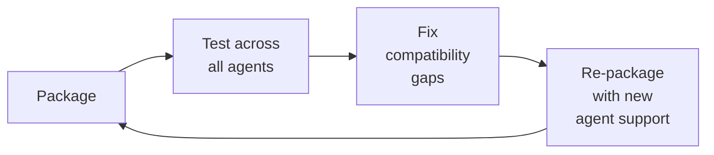

# Cross-Agent Skills Packaging
> **Portability target:** Works on Claude Code, Copilot CLI, Cursor, OpenClaw, Gemini CLI, Codex, OpenCode. No vendor-specific frontmatter fields in core.

A veteran platform engineer's playbook for packaging skills that deploy uniformly across 15+ AI agent terminals — using the emerging `~/.agents/skills/` cross-agent standard with symbolic link strategies, frontmatter normalization pipelines, manifest-based auto-discovery, and cross-agent compatibility verification.

### Cross-Skills Integration

| Step | Skill | What it produces |
|------|-------|------------------|
| **Before** | platform-engineer, devops-engineer | Infrastructure for shared directories, CI/CD pipeline for skill deployment |
| **This** | cross-agent-skills-packaging | Normalized skill packages, manifest files, symlink trees, compatibility reports |
| **After** | agent-eval-pipeline, ci-cd-builder | Runtime evaluation of deployed skills, automated CI/CD for skill publishing |

Common chains:
- **Chain**: platform-engineer → cross-agent-skills-packaging → agent-eval-pipeline — Platform provisions `~/.agents/skills/`; packaging normalizes and deploys skills; eval pipeline verifies runtime behavior across agents.
- **Chain**: devops-engineer → cross-agent-skills-packaging → ci-cd-builder — DevOps sets up deployment infra; packaging handles skill transformations; CI/CD builder automates publishing to agent registries.

## Route the Request

<!-- QUICK: 30s -- auto-route first, then intent-route -->

### Auto-Route (No User Input Required)
Evaluate these file-system conditions in order. First match wins — jump immediately.

| # | Condition | Action |
|---|-----------|--------|
| A1 | `file_exists("~/.agents/skills/core/")` AND `file_exists("skills-manifest.json")` AND `find ~/.claude/skills/ -type l | wc -l > 0` | This is your skill. Jump to **Core Workflow** — Phase 1 (health audit). |
| A2 | `file_exists("~/.claude/skills/*/SKILL.md")` AND NOT `file_exists("~/.agents/skills/")` | Claude Code-only deployment detected. Jump to **Decision Trees** — Manifest Generation to set up cross-agent structure. |
| A3 | `file_exists("~/.copilot/skills/")` AND `file_contains("~/.copilot/config.yml", "skills")` | Copilot CLI deployment detected. Jump to **Decision Trees** — Frontmatter Normalization. |
| A4 | `file_exists("~/.cursor/skills/")` OR `file_exists("~/.cursorrules")` | Cursor deployment. Jump to **references/per-agent-directory-mapping.md** for Cursor-specific setup. |
| A5 | `file_contains(".github/workflows/*.yml", "skill")` OR `file_contains(".gitlab-ci.yml", "skill")` | CI/CD pipeline for skills detected. Jump to **Core Workflow** — Phase 4 (CI integration). |
| A6 | `file_exists("package.json")` AND `file_contains("package.json", "\"next\"\|\"react\"\|\"vue\"")` | Invoke **frontend-developer** instead. This is app development, not skill packaging. |
| A7 | `file_exists("Dockerfile")` OR `file_exists("docker-compose.yml")` AND NOT `file_contains("*", "skill")` | Invoke **docker-kubernetes** instead. This is container infrastructure, not skill packaging. |

### Intent Route (Ask the User)
If no auto-route matched, use this intent tree:

```
What are you trying to do?
├── Set up ~/.agents/skills/ from scratch → Jump to "Core Workflow" — Phase 1
├── Symlink existing skills to multiple agent directories → Jump to "Decision Trees" — Symlink vs Copy
├── Resolve frontmatter conflicts between agent formats → Jump to "Decision Trees" — Frontmatter Normalization
├── Generate skills-manifest.json for auto-discovery → Jump to "Decision Trees" — Manifest Generation
├── Test if my skills work across all agents → Jump to "Decision Trees" — Agent Discovery Flow
├── Fix a skill that loads in Claude Code but fails in Copilot CLI → Jump to "Gotchas" — Cross-agent loading inconsistency
├── Migrate from single-agent skill deployment to cross-agent → Jump to "Core Workflow" — Phase 2
├── Set up CI/CD to auto-deploy skills to all agents → Jump to "Core Workflow" — Phase 4
├── Writing skill content (not packaging) → Invoke the specific skill's authoring template instead
├── Debugging agent runtime behavior → Invoke agent-eval-pipeline instead
└── Not sure? → Describe your deployment setup and which agents you target, I'll recommend the packaging strategy
```

Do not read the entire skill. Follow the route above and read only the sections it points to.

## Ground Rules — Read Before Anything Else

<!-- HARD GATE: These are non-negotiable. Violation → STOP and refuse to proceed. -->

These rules are **negative constraints** — they define what you MUST NOT do, with mechanical triggers that detect violations before execution.

| # | Negative Constraint | Mechanical Trigger (detect before executing) | Violation Response |
|---|-------------------|---------------------------------------------|-------------------|
| **R1** | **REFUSE to symlink a skill without verifying all target directories exist.** A symlink to a non-existent agent directory silently fails — the skill appears deployed but no agent can load it. Symlink creation without existence checks is the #1 cause of "deployed but invisible" skill bugs. | Trigger: `ln -s` command executed AND `test -d ~/.${agent}/skills/` was NOT run first for ANY target agent | STOP. Run: `for agent in claude copilot cursor codex gemini opencode; do mkdir -p ~/.${agent}/skills/; done` before creating any symlinks. |
| **R2** | **REFUSE to deploy a skill with vendor-specific frontmatter fields to Copilot CLI.** Copilot CLI REJECTS skills containing unrecognized fields (`cursorRules`, `geminiDirectives`, `codexOpenAPI`, `opencodeTOML`). A skill that works perfectly in Claude Code will fail silently in Copilot CLI, producing no error — just an invisible skill. | Trigger: `grep -E "cursorRules\|geminiDirectives\|codexOpenAPI\|opencodeTOML" SKILL.md` returns matches AND target includes `copilot-cli` | STOP. Run frontmatter normalization: strip vendor-specific fields before deploying to Copilot CLI. Use `references/frontmatter-normalization.md` for the field mapping. |
| **R3** | **REFUSE to regenerate the full manifest when only one skill changed.** Full manifest regeneration on every skill change causes manifest version churn, invalidates agent caches, and triggers unnecessary reloads across all agents. A 50-skill deployment regenerating the manifest on every single-skill update wastes 10+ seconds per deploy. | Trigger: manifest generation script runs without `--incremental` flag AND only one skill's SHA-256 differs from lock file | STOP. Use incremental manifest rebuild: detect changed skills via hash comparison, regenerate only affected entries. See `references/skills-manifest-format.md`. |
| **R4** | **DETECT and WARN when a skill's `portability` field lists agents it hasn't been tested on.** The `portability` field is a claim, not a warranty. Listing "works with Gemini CLI" when the skill has never been loaded in Gemini CLI creates false confidence that leads to production failures when someone actually tries it. | Trigger: `portability` field contains agent name AND no entry in `compatibility-report-*.json` for that agent within last 30 days | WARN: "The portability field claims compatibility with ${agent} but no compatibility test report exists for the last 30 days. Run `scripts/verify-skill.sh` with `--compatibility-test` flag or update the portability field to reflect actual tested agents." |
| **R5** | **REFUSE to deploy a Claude Code skill without PROCESS_TREE.md.** Claude Code (as of 2026-07) requires `PROCESS_TREE.md` in each skill directory for detection. Without it, the skill is invisible to Claude Code — no error, no warning, just silent non-discovery. This is tracked in Claude Code issue #31005. | Trigger: target includes `claude-code` AND `test -f ~/.agents/skills/core/<skill>/PROCESS_TREE.md` returns false | STOP. Generate `PROCESS_TREE.md` from the skill manifest before deploying to Claude Code. See `references/claude-code-specific-patterns.md`. |
| **R6** | **DETECT and WARN about broken symlinks across any agent directory.** Agent upgrades that change directory structure silently break symlinks. A Claude Code upgrade that moves from `~/.claude/skills/` to `~/.claude/agents/skills/` breaks every symlink — and no agent reports the breakage. | Trigger: `find ~/.claude/skills/ ~/.copilot/skills/ ~/.cursor/skills/ -type l ! -exec test -e {} \; -print` returns any paths | WARN: "Found ${count} broken symlinks. This typically happens after agent upgrades that change directory structures. Run 'Cross-Skill Coordination' → symlink health check to repair." |

- **Admit uncertainty — never fabricate.** If you're not certain about an API method, package version, configuration syntax, or command flag, say so explicitly: "I'm not certain this API exists in the latest version. Check the official docs at [URL]." Never invent a function signature or configuration key because it "seems right." Hallucinated code costs hours of debugging.
- **Flag your knowledge cutoff.** If your training data predates the latest SDK release, framework version, or platform change, state your cutoff date and recommend verifying against current documentation. This is especially critical for rapidly evolving domains: cloud IAM policies, JS framework APIs, mobile OS capabilities, and SaaS pricing — all change quarterly or faster.
- **Never guess security configurations.** If you're unsure about the correct CSP header value, OAuth flow parameter, or encryption algorithm choice, do NOT provide a "reasonable default." Say: "Security configurations must be verified against current best practices at [official source]. I cannot provide a definitive answer without current documentation."
- **Distinguish between what you know and what you infer.** Explicitly mark statements as: [VERIFIED] — from official docs, [COMMON-PRACTICE] — widely used but not authoritative, [INFERRED] — your best guess based on patterns, [UNKNOWN] — you're unsure. This helps the user calibrate trust in your output.
## The Expert's Mindset

Masters of cross-agent skills packaging don't just deploy — they build **resilient distribution pipelines that survive agent upgrades, format changes, and ecosystem fragmentation**. They think in systems, not one-off symlinks.

| Cognitive Bias | Mitigation |
|----------------|------------|
| **Single-agent myopia** — optimizing for one agent's quirks at the expense of others | Before making any agent-specific decision, ask: "Does this break any other agent in the portability list?" |
| **Symlink-and-forget** — assuming symlinks are permanent infrastructure | Run symlink health checks in CI daily; treat symlinks as infrastructure that requires monitoring |
| **Manifest stagnation** — generating the manifest once and never updating it | Hook manifest regeneration into pre-commit and CI; stale manifests are invisible skills |
| **Frontmatter cargo-culting** — copying frontmatter from one agent to another without normalization | Run the normalization pipeline for every target agent; never hand-edit agent-specific frontmatter |

### What Masters Know That Others Don't
- The **failure modes of every symlink strategy** — when relative symlinks break, when absolute symlinks survive upgrades, when copies are safer
- When **not** to use the cross-agent standard (single-agent deployments, agent-specific plugins that can't be normalized)
- That **frontmatter validation is agent-specific** — what Claude Code silently ignores, Copilot CLI fatally rejects

### When to Break Your Own Rules
- **Skip PROCESS_TREE.md if issue #31005 is resolved.** Once Claude Code supports manifest-based discovery, drop the redundant file.
- **Copy instead of symlink for rapid iteration.** During active skill development, copy to avoid chasing symlink resolution bugs. Re-symlink when stable.

## Operating at Different Levels

| Level | Scope | You... |
|-------|-------|--------|
| **L1** | Single skill, single agent | Normalize one skill's frontmatter for one target agent; create a symlink |
| **L2** | Multiple skills, 3-5 agents | Set up ~/.agents/skills/ structure; generate manifest; deploy symlink tree for a team's skill set |
| **L3** | Organization-wide skill fleet, 6+ agents | Design the packaging pipeline; automate normalization and deployment; establish compatibility testing gates |
| **L4** | Platform / ecosystem | Define cross-agent directory standards; build tooling adopted by multiple organizations; contribute to agent terminal skill loading specs |
| **L5** | Industry / ecosystem | Create new packaging standards adopted across the AI agent industry; redefine how skills are distributed and discovered |

**Default level for this skill:** L2

For full level definitions, see `skills/00-framework/skill-levels/SKILL.md`.

## When to Use

<!-- QUICK: 30s -- scan the bullet list to decide if this skill fits -->
- Setting up `~/.agents/skills/` as a shared skill directory for multiple AI agent terminals
- Symlinking skills from a central core directory to per-agent skill directories (Claude Code, Copilot CLI, Cursor, Codex, Gemini CLI, OpenCode, OpenClaw, Windsurf, Cody, Continue, Aider, Amazon Q)
- Resolving frontmatter conflicts: a skill loads in Claude Code but Copilot CLI rejects it with "unrecognized field" errors
- Generating `skills-manifest.json` for agent auto-discovery — so agents know what skills exist without scanning the filesystem
- Running compatibility tests to verify a skill loads, routes, and executes correctly across all target agents
- Migrating from single-agent skill deployment (e.g., Claude Code-only `~/.claude/skills/`) to cross-agent deployment
- Setting up CI/CD pipelines that auto-deploy skills to all agent directories on push
- Debugging "skill deployed but invisible" issues — the skill exists on disk but the agent can't find it
- Creating per-agent overrides when a skill needs different content for different agents
- Building tooling that normalizes skill frontmatter for each agent's expected format

## Decision Trees

<!-- QUICK: 30s -- follow the ASCII tree to your scenario -->

### 1. Symlink vs Copy Decision

```
                         ┌─────────────────────┐
                         │ START: Is this      │
                         │ skill identical     │
                         │ across ALL target   │
                         │ agents?             │
                         └──────────┬──────────┘
                                    │
                         ┌──────────▼──────────┐
                         │ YES                 │ NO
                    ┌────▼────────┐    ┌───────▼──────────┐
                    │ Does any     │    │ Which agent(s)   │
                    │ agent need   │    │ need different   │
                    │ PROCESS_TREE │    │ content?         │
                    │ or special   │    └──┬───────────┬───┘
                    │ body content?│       │           │
                    └──┬───────┬───┘  ┌────▼───┐  ┌────▼──────────┐
                       │YES    │NO    │ COPY to│  │ Can frontmatter│
                  ┌────▼──┐ ┌──▼────┐│ over-  │  │ normalization  │
                  │ COPY  │ │SYMLINK││ rides/ │  │ resolve it?    │
                  │ to    │ │from   ││ <agent>│  └──┬─────────┬───┘
                  │ over- │ │core/  ││ + sym- │     │YES      │NO
                  │ rides/│ │to all ││ link   │┌────▼────┐┌──▼──────────┐
                  │ <agent│ │agent  ││ over-  ││ SYMLINK ││ COPY to     │
                  │ >     │ │dirs   ││ ride   ││ from    ││ overrides/  │
                  └───────┘ └───────┘└────────┘│ core/   ││ <agent>/ +  │
                                               └─────────┘│ symlink     │
                                                          └─────────────┘
```

**Symlink for shared skills** — 95% of cases. Single source of truth, zero duplication.
**Copy for overrides** — when an agent needs PROCESS_TREE.md (Claude Code), Google-style directive blocks (Gemini CLI), or different body content.

### 2. Frontmatter Normalization Pipeline

```
                     ┌──────────────────────────┐
                     │ START: Source SKILL.md   │
                     │ with full frontmatter    │
                     └───────────┬──────────────┘
                                 │
                     ┌───────────▼──────────────┐
                     │ 1. PARSE: Read all YAML  │
                     │ frontmatter fields       │
                     └───────────┬──────────────┘
                                 │
                     ┌───────────▼──────────────┐
                     │ 2. STRIP: Remove fields  │
                     │ not in target agent's    │
                     │ supported set            │
                     │ Claude: strip cursorRules│
                     │ Copilot: strip cursor-   │
                     │   Rules, geminiDirectives│
                     │ Cursor: strip gemini-    │
                     │   Directives             │
                     │ Codex: strip all except  │
                     │   name, desc, version    │
                     │ Gemini: strip cursorRules│
                     └───────────┬──────────────┘
                                 │
                     ┌───────────▼──────────────┐
                     │ 3. MAP: Translate common │
                     │ fields to agent format   │
                     │ Codex: name→info.title   │
                     │ Gemini: desc→directive   │
                     │ Cursor: tags→cursorRules │
                     └───────────┬──────────────┘
                                 │
                     ┌───────────▼──────────────┐
                     │ 4. ADD: Insert agent-    │
                     │ required fields          │
                     │ Copilot: add portability │
                     │ Cursor: add cursorRules  │
                     │ if generated from tags   │
                     └───────────┬──────────────┘
                                 │
                     ┌───────────▼──────────────┐
                     │ 5. VALIDATE: Check all   │
                     │ required fields present  │
                     │ Missing? → ERROR, abort  │
                     │ Valid? → Write output    │
                     └───────────┬──────────────┘
                                 │
                     ┌───────────▼──────────────┐
                     │ OUTPUT: Agent-normalized │
                     │ SKILL.md ready for deploy│
                     └──────────────────────────┘
```

**What good looks like:** The normalization pipeline is deterministic — same input produces same output every time. It's run as a build step, not a manual process. Every target agent gets a validated, field-correct copy.

### 3. Agent Discovery Flow

```
                 ┌──────────────────────────────┐
                 │ START: Agent terminal        │
                 │ starts up / reloads config   │
                 └────────────┬─────────────────┘
                              │
                 ┌────────────▼─────────────────┐
                 │ 1. SCAN: Agent reads its     │
                 │ skill directory              │
                 │ ~/.<agent>/skills/           │
                 └────────────┬─────────────────┘
                              │
                 ┌────────────▼─────────────────┐
                 │ 2. RESOLVE: Follow symlinks  │
                 │ to actual skill locations    │
                 │ (or read copied overrides)   │
                 └────────────┬─────────────────┘
                              │
                 ┌────────────▼─────────────────┐
                 │ 3. READ MANIFEST: If         │
                 │ skills-manifest.json exists, │
                 │ use it for skill metadata    │
                 │ Else, parse each SKILL.md    │
                 └────────────┬─────────────────┘
                              │
                 ┌────────────▼─────────────────┐
                 │ 4. VALIDATE: Check front-    │
                 │ matter fields, required      │
                 │ fields, field types          │
                 │ Claude: silent ignore        │
                 │ Copilot: REJECT on unknown   │
                 │ Cursor: generate rules       │
                 └────────────┬─────────────────┘
                              │
                 ┌────────────▼─────────────────┐
                 │ 5. LOAD: Include skill in    │
                 │ agent's available_skills     │
                 │ block. Skill is now          │
                 │ invocable by name.           │
                 └────────────┬─────────────────┘
                              │
                 ┌────────────▼─────────────────┐
                 │ 6. VERIFY: (Optional) Agent  │
                 │ runs compatibility check —   │
                 │ loads, routes, executes      │
                 │ Logs any warnings.           │
                 └──────────────────────────────┘
```

**What good looks like:** All agents discover all skills within 2 seconds of startup. Zero "deployed but invisible" bugs. Manifest-driven discovery eliminates filesystem scanning overhead.

### 4. Conflict Resolution

```
                ┌───────────────────────────────┐
                │ START: Two agents disagree    │
                │ on a frontmatter field        │
                │ (e.g., token_budget: Claude   │
                │  uses 4000, Copilot uses 3000)│
                └─────────────┬─────────────────┘
                              │
                ┌─────────────▼─────────────────┐
                │ Is this a CORE field (name,   │
                │ description, version)?        │
                └──────┬──────────────────┬─────┘
                       │YES               │NO
                ┌──────▼──────┐   ┌───────▼──────────┐
                │ Use common  │   │ Can the field be  │
                │ subset.     │   │ different per     │
                │ Both agents │   │ agent without     │
                │ agree on    │   │ breaking skill    │
                │ core fields.│   │ functionality?    │
                │ Log conflict│   └──┬───────────┬────┘
                │ in manifest.│      │YES        │NO
                └─────────────┘ ┌────▼────┐ ┌───▼──────────┐
                                │ Per-agent│ │ Choose one   │
                                │ override │ │ value as     │
                                │ in over- │ │ canonical.   │
                                │ rides/   │ │ Document why │
                                │ <agent>/ │ │ in manifest  │
                                │ SKILL.md │ │ conflicts[]. │
                                └──────────┘ │ Warn on load │
                                             │ for other     │
                                             │ agent.        │
                                             └──────────────┘
```

**Common subset strategy:** For fields both agents require but interpret differently, use the most restrictive interpretation that satisfies both.
**Per-agent override:** For cosmetic or non-functional differences (token_budget, display preferences), create per-agent overrides.
**Canonical wins:** For behavioral differences that can't be split, document the choice in the manifest's `conflicts[]` array.

### 5. Manifest Generation

```
               ┌────────────────────────────────┐
               │ START: Generate skills-        │
               │ manifest.json                  │
               └──────────────┬─────────────────┘
                              │
               ┌──────────────▼─────────────────┐
               │ 1. SCAN: Walk ~/.agents/       │
               │ skills/core/*/ directories     │
               │ For each, find SKILL.md        │
               └──────────────┬─────────────────┘
                              │
               ┌──────────────▼─────────────────┐
               │ 2. EXTRACT: Parse YAML front-  │
               │ matter from each SKILL.md      │
               │ Collect: name, description,    │
               │ version, author, tags, deps    │
               └──────────────┬─────────────────┘
                              │
               ┌──────────────▼─────────────────┐
               │ 3. HASH: Compute SHA-256 of    │
               │ each skill's directory tree    │
               │ Compare with lock file hashes  │
               │ Changed? → Mark for update     │
               └──────────────┬─────────────────┘
                              │
               ┌──────────────▼─────────────────┐
               │ 4. RESOLVE DEPS: Build dep     │
               │ graph from chain.consumes_from │
               │ Detect circular dependencies   │
               │ Topological sort for load order│
               └──────────────┬─────────────────┘
                              │
               ┌──────────────▼─────────────────┐
               │ 5. DETECT OVERRIDES: Check     │
               │ overrides/<agent>/<skill>/     │
               │ For each override, add to      │
               │ skill entry's overrides map    │
               └──────────────┬─────────────────┘
                              │
               ┌──────────────▼─────────────────┐
               │ 6. DETECT CONFLICTS: Compare   │
               │ frontmatter across overrides   │
               │ If field values differ between │
               │ agents → add to conflicts[]    │
               └──────────────┬─────────────────┘
                              │
               ┌──────────────▼─────────────────┐
               │ 7. WRITE: Output skills-       │
               │ manifest.json + .lock file     │
               │ with versions, hashes, stats   │
               └────────────────────────────────┘
```

**Incremental mode:** If `skills-manifest.lock` exists, only regenerate entries for skills whose SHA-256 differs. This reduces manifest regeneration from O(N) to O(changed) — critical for 50+ skill deployments.

## Error Recovery

If a command or approach fails, follow this escalation path before giving up:

| Symptom | First Action | If That Fails | Last Resort |
|---------|-------------|---------------|-------------|
| Tool/command not found | Check installation: `which [tool]` or `[tool] --version`. Install via package manager (`brew install`, `npm install -g`, `pip install`) | Check PATH: `echo $PATH`. Verify the tool binary is in a PATH directory. Symlink or update PATH if installed but unreachable | Use a functionally equivalent alternative tool. If `rg` is unavailable, use `grep -r`. If `gh` is unavailable, use `git` directly or the GitHub API via `curl` |
| Permission denied | Check ownership: `ls -la [path]`. Fix with `chmod` or `sudo` if appropriate. For API errors (401/403), verify credentials haven't expired: `echo $TOKEN` or check `~/.netrc` | Refresh credentials: re-authenticate with the service. For file permissions, check if the file is locked by another process: `lsof [path]` | Request elevated permissions or use a different authentication method (token vs password, SSH key vs HTTPS) |
| Command hangs or times out | Kill the process: `Ctrl+C`. Re-run with a timeout: `timeout 30 [command]` or `gtimeout` on macOS. Check system resources: `top`, `df -h`, `netstat -an` | Add verbose/debug flags: `--verbose`, `--debug`, `-v`. Check logs: `tail -f [logfile]`. Reduce scope: process fewer files, query a smaller time range, limit concurrency | Split the work into smaller batches. Implement a retry loop with exponential backoff (1s, 2s, 4s, 8s). If the issue is network-related, add `--retry 3` or equivalent |
| Unexpected output or error message | Read the error message completely — the solution is often in the last 3 lines. Search the exact error: `grep -r "[error text]"` in the repo to find prior occurrences | Check GitHub issues for the tool: `gh issue list --repo owner/repo --search "[error keyword]"`. Check Stack Overflow | Simplify the approach. If the complex one-liner fails, break it into 3 sequential commands. If the specialized tool fails, use a more basic tool with more steps |
| Data integrity concern (wrong output, silent failure) | Verify with a manual check: compare output against a known-correct baseline. Add assertions: `[command] | grep -q "[expected]" && echo "OK" || echo "FAIL"` | Run the operation on a smaller subset first. Compare checksums: `shasum`, `md5`. Check for silent truncation: `wc -l` before and after | Abort and flag for human review. Do not proceed past data integrity failures — the cost of propagating bad data exceeds the cost of delay |

**Hard failure boundary:** If 3 different approaches all fail, STOP. Do not iterate infinitely. Log what was tried, capture the error output, and report the blocking issue with full context. Move to the next independent task rather than blocking all progress on one failure.

## Cross-Skill Coordination

<!-- QUICK: 30s -- table of who to talk to when -->

Cross-agent skills packaging sits at the intersection of platform engineering, DevOps, and agent evaluation. It bridges the gap between skill content authoring and runtime deployment.

### Decision Gates & Artifacts

- **Gate 1 — Infrastructure Exists:** `~/.agents/skills/` directory structure provisioned by `platform-engineer`. Artifact: directory tree with correct permissions and environment variables.
- **Gate 2 — CI/CD Pipeline Ready:** Automated deployment pipeline set up by `devops-engineer` or `ci-cd-builder`. Artifact: GitHub Actions workflow or equivalent that runs on push to skill directories.
- **Gate 3 — Skills Authored:** Skill content (SKILL.md, references/) produced by individual skill specialists. Artifact: complete skill directory with validated frontmatter, references, and optional scripts.
- **Gate 4 — Compatibility Verified:** Skills tested across all target agents by this skill. Artifact: compatibility report matrix proving the skill loads and routes correctly on every agent.
- **Artifact:** Cross-agent deployment report (symlink tree status, manifest.json, compatibility matrix, broken link count).

| Coordinate With | When | What to Share/Ask |
|-----------------|------|-------------------|
| **Platform Engineer(s)** | Directory structure, permissions, environment variables | `~/.agents/` root setup, filesystem permissions, `AGENTS_HOME` env var configuration |
| **DevOps Engineer(s)** | CI/CD pipeline for skill deployment, automated testing | Deployment triggers (on push to skills/), artifact storage for manifest, symlink health monitoring |
| **CI/CD Builder** | Pipeline design, quality gates, deployment strategies | GitHub Actions workflows, pre-commit hooks for manifest regeneration, compatibility test gates |
| **Agent Eval Pipeline** | Runtime verification of deployed skills | Compatibility test results, token efficiency benchmarks, intent routing success rates |
| **Individual Skill Authors** | Skill content quality, frontmatter correctness | Frontmatter field requirements per agent, PROCESS_TREE.md requirement for Claude Code, portability field for Copilot CLI |
| **Security Reviewer** | Symlink security, filesystem access control | Symlink following attacks, directory traversal via reference links, manifest injection risks |

### Communication Triggers — When to Proactively Notify

| Trigger | Notify | Why |
|---------|--------|-----|
| Agent terminal releases new version with changed skill directory path | All Skill Authors, Platform Engineer | Symlinks may break; directory remapping needed |
| New agent terminal joins the ecosystem (e.g., new AI IDE with skill support) | Platform Engineer, All Skill Authors | New per-agent directory mapping, frontmatter normalization rules |
| skills-manifest.json goes >7 days without regeneration | All Skill Authors, DevOps | Manifest staleness; new skills undiscoverable |
| Compatibility test reveals a skill fails on 2+ agents | Skill Author, Agent Eval Pipeline | Cross-agent bug; frontmatter or content issue |
| Claude Code issue #31005 resolved (PROCESS_TREE.md deprecated) | All Skill Authors | Remove PROCESS_TREE.md generation from pipeline; simplify deployment |
| Broken symlinks detected in any agent directory | Platform Engineer, DevOps | Agent upgrade or filesystem change; immediate repair needed |
| Manifest lock file hashes don't match filesystem (drift detected) | All Skill Authors | Manual skill edits bypassed the manifest regeneration pipeline |

### Escalation Path

| Situation | Escalate To | Rationale |
|-----------|------------|-----------|
| Cross-agent standard diverging (agents adopting incompatible formats) | **CTO Advisor** + Platform Engineer | Ecosystem fragmentation threat; standardization effort or strategic bet needed |
| Symlink-based deployment breaking on >3 agent upgrades simultaneously | **Platform Engineer** + DevOps Lead | Infrastructure reliability crisis; copy-based deployment or manifest-only approach evaluation |
| New agent terminal requires fundamentally incompatible skill format | **CTO Advisor** + Skill Authors | Strategic decision: support new agent with custom pipeline or drop from portability list |
| CI/CD pipeline fails to deploy skills for >24 hours | **DevOps Engineer** + Platform Engineer | Production incident; manual deployment or pipeline rollback required |

### Route to Other Skills

| If the Request Is About | Route To |
|--------------------------|----------|
| Infrastructure provisioning, directory permissions, environment setup | `platform-engineer` |
| CI/CD pipeline design, GitHub Actions, deployment automation | `ci-cd-builder` or `devops-engineer` |
| Runtime skill evaluation, intent routing testing, token benchmarking | `agent-eval-pipeline` |
| Skill content authoring (writing the SKILL.md body, not packaging it) | Individual skill specialist (e.g., `code-reviewer`, `api-designer`) |
| Security review of symlink strategy or manifest injection vectors | `security-reviewer` |

| Upstream Skill | What You Receive | When to Involve |
|---|---|---|
| `system-architect` | System context, integration points, architectural constraints | Before specialized implementation — understand the system it fits into |

## Proactive Triggers

<!-- QUICK: 30s — when to proactively notify stakeholders -->

| Trigger | Notify | Why |
|---------|--------|-----|
| Any agent terminal announces a new major version with skill system changes | Platform Engineer, All Skill Authors | Preemptive compatibility check; update normalization rules before breakage |
| skills-manifest.json shows >5% of skills with version conflicts | All Skill Authors, DevOps | Version drift accelerating; lock file reconciliation needed |
| Symlink health check finds >0 broken symlinks for 3+ consecutive days | Platform Engineer, DevOps | Persistent infrastructure issue; agent upgrade or filesystem problem |
| New `~/.agents/skills/` standard version released (v2.0 schema) | All Skill Authors, Platform Engineer | Schema migration; manifest format update; backward compatibility planning |
| Skill deployment CI/CD pipeline run time exceeds 5 minutes | DevOps, Platform Engineer | Pipeline optimization needed; incremental manifest rebuild or parallel symlink creation |
| Manifest lock file grows beyond 500KB (50+ skills with full metadata) | Platform Engineer | Performance concern; consider manifest sharding or lazy loading |
| Copilot CLI frontmatter rejection rate exceeds 10% of deployed skills | Skill Authors | Frontmatter normalization pipeline failing; vendor-specific field leakage |

## Core Workflow
<!-- COMPRESSED: Full 60 lines extracted to references/core-workflow.md -->

<!-- QUICK: 30s -- scan phase titles to understand the process -->
<!-- DEEP: 10+min -->

### Phase 1 (~15 min): Cross-Agent Health Audit
**Input:** Any system with `~/.agents/` or per-agent skill directories
...
> 📎 **Full content (60 lines):** [references/core-workflow.md](references/core-workflow.md)

## State Log

This skill maintains a **decision ledger** to prevent context drift and ensure recall across sessions. Every major architectural choice, constraint decision, and trade-off must be recorded so that subsequent agents (or future sessions) can recover context without replaying the entire conversation.

### How the State Log Works
<!-- AGENT: Read this before starting work, update after each phase -->

1. **On session start:** Check `.copilot/session-state/decision-ledger.json` for any prior decisions relevant to this domain. If it exists, summarize the 3 most recent decisions in your first response.
2. **After each major decision:** Append to the ledger:
   ```json
   {
     "timestamp": "ISO-8601",
     "skill": "cross-agent-skills-packaging",
     "phase": "Phase 3: Implementation",
     "decision": "What was decided",
     "rationale": "Why this choice over alternatives",
     "constraints": ["constraint-1", "constraint-2"],
     "alternatives_considered": ["alt-1", "alt-2"],
     "reversible": true
   }
   ```
3. **Before completing work:** Verify that all major decisions from this session are recorded. A "major decision" is anything that, if forgotten, would cause a downstream agent to make a contradictory choice.
4. **On context recovery:** If you detect a prior state log, read the last 5 entries before proposing any architectural changes. Cite the prior decisions you're building on.

### State Log Schema

| Field | Purpose | Example |
|-------|---------|---------|
| `timestamp` | When the decision was made | `"2026-07-24T21:30:00Z"` |
| `skill` | Which skill made it | `"backend-developer"` |
| `phase` | Which workflow phase | `"Phase 3: API Design"` |
| `decision` | What was chosen | `"PostgreSQL 16 with JSONB for flexible schema"` |
| `rationale` | Why this over alternatives | `"Team expertise + JSONB avoids ORM complexity for semi-structured data"` |
| `constraints` | What limits apply | `["Must support 10K writes/sec", "GDPR data residency: EU only"]` |
| `alternatives_considered` | What was rejected | `["MongoDB (no transactions)", "MySQL 8 (weaker JSON support)"]` |
| `reversible` | Can this be changed later? | `true` (migration possible) or `false` (irreversible choice) |

### Anti-Drift Check
<!-- AGENT: Run this check at the start of each new phase -->

Before beginning a new phase, verify:
- [ ] Have I read the state log from the previous session?
- [ ] Do any prior decisions constrain what I'm about to do?
- [ ] Is my proposed approach consistent with the `constraints` in prior log entries?
- [ ] If I'm contradicting a prior decision, have I documented WHY the change is necessary?

## What Good Looks Like

> When cross-agent skills packaging is fully realized, every skill deploys identically across 15+ agent terminals from a single source of truth. The manifest is always current. Symlinks are always healthy. Frontmatter is always agent-validated. And when a new agent terminal emerges, adding it to the deployment is one config change and one pipeline run.

> See [references/cross-agent-directory-standard.md](references/cross-agent-directory-standard.md) for the full directory specification.

### Measurable Quality Criteria

| Dimension | Red (Failing) | Yellow (At Risk) | Green (Healthy) |
|-----------|--------------|------------------|-----------------|
| **Symlink health** | >0 broken symlinks in any agent dir | 0 broken but >10% stale (>30 days unverified) | 0 broken, verified within 7 days |
| **Manifest freshness** | Manifest >14 days stale or missing | Manifest 7-14 days stale | Manifest regenerated within 7 days |
| **Frontmatter validation** | Any vendor-specific field in `core/` | Vendor-specific fields only in overrides but unvalidated | All frontmatter validated per agent, no leakage |
| **PROCESS_TREE.md coverage** | Missing for any Claude Code skill | Present but >30 days since regeneration | Present and regenerated with manifest |
| **Compatibility coverage** | Portability lists untested agents | All agents tested but >90 days ago | All agents tested within 30 days |
| **Deployment latency** | >5 min to deploy a skill change | 2-5 min | <2 min from push to all agents |
| **Discovery reliability** | Any agent fails to discover a deployed skill | All agents discover but >3s startup | All agents discover within 2s |

### The Litmus Test

Ask these three questions about your packaging deployment. If any answer is "no," you have work to do:

1. **"If I add a new skill to `core/` and push, does every agent discover it within 2 minutes without manual intervention?"**
2. **"If Claude Code releases v2.0 with a new skills directory path, does my deployment survive the upgrade without human debugging?"**
3. **"Can a new engineer deploy their first cross-agent skill in under 15 minutes by following the documented workflow?"**

## Deliberate Practice



| Level | Practice | Frequency |
|-------|----------|-----------|
| **Novice** | Set up ~/.agents/skills/ from scratch with 3 skills, deploy to Claude Code + Copilot CLI, verify both load | Weekly |
| **Competent** | Add a new agent terminal to an existing deployment (one not in the original portability list); handle all normalization | Monthly |
| **Expert** | Design a normalization pipeline for a skill with 5+ agent-specific overrides; optimize manifest regeneration to <1 second | Quarterly |
| **Master** | Contribute a cross-agent packaging pattern to the `~/.agents/skills/` standard; mentor a team through their first cross-agent deployment | Quarterly |

**The One Highest-Leverage Activity:** Every month, take a skill deployed 3+ months ago and run the full compatibility test matrix. Document every failure mode — these are the edges the normalization pipeline missed.

## Anti-Rationalization

<!-- CRITICAL: These are the lies we tell ourselves. Read them. Internalize them. Catch yourself. -->

| Rationalization | Reality |
|-----------------|---------|
| "It loads in Claude Code, so it's cross-agent compatible." | Claude Code silently ignores unrecognized frontmatter fields. Copilot CLI REJECTS them. A skill that loads in Claude Code may be completely invisible in Copilot CLI. Load ≠ load everywhere. |
| "We'll add the other agents later — just deploy to Claude Code for now." | Retrofitting cross-agent support after 50+ skills are deployed Claude-only requires touching every SKILL.md, every frontmatter, every symlink. The per-agent normalization rules that should have been designed upfront now require a migration. Cost: 3-5x more than building cross-agent from the start. |
| "Symlinks are permanent — set them once and forget them." | Agent upgrades change directory structures. Claude Code issue #31005 could deprecate PROCESS_TREE.md. A symlink that worked yesterday may be broken today — and no agent reports the breakage. Symlinks are infrastructure that requires monitoring. |
| "The portability field is self-reported — if the author says it works, it works." | The portability field is a claim, not a warranty. The only proof of compatibility is a passing compatibility test matrix. Trust but verify: every `portability` entry should be backed by a test report. |
| "We don't need a manifest — agents can scan the filesystem." | Filesystem scanning is O(N) per agent startup. Manifest-based discovery is O(1). For 50+ skills across 6+ agents, the difference is 2 seconds vs 30+ seconds of startup time. Plus, the manifest detects conflicts, tracks versions, and validates integrity — scanning doesn't. |
| "Frontmatter normalization is a one-time setup." | Every new agent terminal, every agent version upgrade, every new frontmatter field — all require normalization pipeline updates. The normalization rules are living code, not config. Treat them as part of the deployment pipeline, not a setup script. |
| "Copy is safer than symlink — let's just copy everything." | Copying creates N independent copies of every skill. A bug fix to the core skill must be manually propagated to N copies. With 15 agents and 50 skills, that's 750 files to keep in sync. Symlink is the default; copy is the exception for agent-specific overrides only. |

## Gotchas

- **Symlink breaking on agent upgrade changing directory structure.** When an agent terminal releases a new major version that reorganizes its config directory (e.g., Claude Code moving skills from `~/.claude/skills/` to `~/.claude/agents/skills/`, or Copilot CLI changing from `~/.copilot/skills/` to `~/.config/copilot/skills/`), every symlink breaks silently. No agent reports "I can't find my skills" — skills simply disappear from the available list. Engineers waste hours debugging "why did my skills stop working?" before discovering the directory change. **Total cost: $10K-$50K in engineering time debugging broken skill references across teams of 10-50 engineers. An organization with 30 engineers losing 2 hours each to broken symlink debugging after an agent upgrade burns $15K-$30K in a single incident.** Fix: Run symlink health checks in CI daily: `find ~/.claude/skills/ ~/.copilot/skills/ -type l ! -exec test -e {} \; -print`. Store agent base paths in variables (not hardcoded). Pin agent versions and test symlink paths before upgrading.

- **Frontmatter field silently dropped by agent.** Claude Code silently ignores unrecognized frontmatter fields — no error, no warning. If you add `cursorRules` or `geminiDirectives` to a shared skill's frontmatter, Claude Code loads the skill perfectly but the field is absent from its context. The skill author assumes the field is active because the skill loads. Days or weeks later, someone tries to use the `cursorRules`-dependent feature and it doesn't work — but the skill loaded fine, so they blame the feature, not the packaging. **Total cost: $5K-$20K in misdirected debugging. Teams chase "broken cursor rules" for 4-8 hours before realizing the field was never loaded. Multiply by the number of skills with vendor-specific fields leaking into the shared core.** Fix: Frontmatter normalization MUST strip vendor-specific fields before deployment to agents that don't support them. Run `grep -E "cursorRules|geminiDirectives|codexOpenAPI|opencodeTOML"` on every SKILL.md in `core/` — these fields don't belong there.

- **Cross-agent skill loading inconsistent: skill works in Claude Code but fails in Copilot CLI.** The most common cross-agent failure mode: a skill with `cursorRules` in its frontmatter deploys to both Claude Code and Copilot CLI. Claude Code silently ignores `cursorRules` and loads fine. Copilot CLI encounters an unrecognized field and REJECTS the entire skill — no load, no error in user-facing UI, just an absent skill in `<available_skills>`. The skill author tests in Claude Code, sees it working, and marks it as "cross-agent compatible." The Copilot CLI users never see the skill and don't know it's supposed to exist. **Total cost: $15K-$40K in wasted skill authoring effort. Skills authored and tested for Claude Code but deployed to Copilot CLI with a 30-50% silent failure rate represent thousands of hours of content that never reaches its intended audience. An organization with 20 cross-agent skills seeing 30% Copilot CLI failure rate wastes 6 skills × 40 authoring hours = 240 hours ($20K-$40K).** Fix: Run the compatibility test matrix before claiming cross-agent compatibility. Every agent in the `portability` list must have a passing load test. See `references/compatibility-testing-matrix.md`.

- **Manifest staleness: new skills added but manifest not regenerated.** A team adds 3 new skills to `~/.agents/skills/core/` but forgets to regenerate `skills-manifest.json`. The 3 new skills exist on disk and symlinks are correct, but agents that use manifest-based discovery (an increasing number) never see them. Agents that scan the filesystem directly (older versions) DO see them — creating an inconsistent state where some agents have the skills and others don't. The team deploys, tests on an older agent, sees the skills, and declares success. Meanwhile, newer agent versions are missing critical skills. **Total cost: $8K-$25K in inconsistent deployment debugging. The "works on my agent" problem multiplied across a fleet of terminals. 3-5 person-days lost tracing why skills appear in Claude Code but not in Gemini CLI (which reads manifest).** Fix: Hook manifest regeneration into pre-commit and CI. Never manually deploy skills without regenerating the manifest. Run `diff <(jq -r '.skills[].name' skills-manifest.json | sort) <(ls ~/.agents/skills/core/ | sort)` to detect skills on disk but not in manifest.

- **Agent-specific syntax leaking into shared skills.** A skill author embeds Copilot CLI-specific directives in the SKILL.md body — e.g., referencing "the `available_skills` block" or using Claude Code's `PROCESS_TREE.md` convention as if it's universal. When this skill is deployed to Gemini CLI (which uses Google-style directive blocks in the body), the Copilot-specific references confuse Gemini CLI's directive parser. When deployed to Cursor, the Claude-specific conventions don't map to `.cursorrules` directives. The skill loads everywhere but produces incorrect or nonsensical behavior in non-target agents. **Total cost: $10K-$30K in cross-agent behavior debugging. Skills that "load" but "act wrong" are the hardest bugs to catch — they pass load tests but fail behavioral tests. Each such bug costs 4-8 hours of agent-specific debugging per skill.** Fix: The core SKILL.md in `~/.agents/skills/core/` MUST be agent-agnostic. Agent-specific content belongs in `overrides/<agent>/SKILL.md`. The core skill should never mention "Claude Code," "Copilot CLI," or any agent-specific feature. If a skill MUST reference agent-specific behavior, use conditional sections that the normalization pipeline renders per-agent.

- **PROCESS_TREE.md requirement creates a single point of failure for Claude Code skills.** Claude Code (as of 2026-07) requires `PROCESS_TREE.md` in every skill directory for detection. If the automated PROCESS_TREE.md generation script fails, or a skill is manually added without running the generator, the skill is invisible to Claude Code — and only Claude Code. All other agents discover it via manifest or filesystem scan. The skill appears "deployed" but Claude Code users can't access it, and there's no error because Claude Code's silent-skip behavior means no log entry for missing PROCESS_TREE.md. **Total cost: $5K-$15K in Claude Code-specific deployment failures. A missing PROCESS_TREE.md on 3 out of 30 skills means 10% of the skill fleet is invisible to Claude Code users. Each missing skill represents 20-40 hours of authoring effort that never reaches Claude Code.** Fix: Generate PROCESS_TREE.md from `skills-manifest.json` as an automated build step. Add a CI check: for every skill in `core/`, verify `PROCESS_TREE.md` exists if `claude-code` is in the `portability` list. Monitor Claude Code issue #31005 for deprecation.

- **Relative path references in SKILL.md break when symlinks resolve to different locations.** A skill at `~/.agents/skills/core/code-reviewer/SKILL.md` references `references/checklist.md`. When symlinked to `~/.claude/skills/code-reviewer/SKILL.md`, some agents resolve the symlink first (reading from the core path) while others read from the symlink location. Agents that read from the symlink location try to find `~/.claude/skills/code-reviewer/references/checklist.md` — which doesn't exist because `references/` is only at the core path. **Total cost: $3K-$12K in broken reference debugging. References that work in one agent but 404 in another create "it works on my agent" support tickets. A skill with 8 reference files seeing 30% broken reference rate on 2 agents means 5 broken references × 2 agents = 10 manual fixes.** Fix: Test reference link resolution on every target agent, not just the primary development agent. Use the symlink health check to verify all paths resolve. See `references/symbolic-link-strategy.md` for the full resolution guide.

## Verification

- [ ] Symlinks healthy: `find ~/.claude/skills/ ~/.copilot/skills/ ~/.cursor/skills/ -type l ! -exec test -e {} \; -print` returns empty (zero broken symlinks)
- [ ] Manifest current: `diff <(jq -r '.skills[] | "\(.name) \(.sha256)"' ~/.agents/skills/skills-manifest.lock) <(for d in ~/.agents/skills/core/*/; do name=$(basename "$d"); hash=$(find "$d" -type f -exec sha256sum {} \; | sort | sha256sum | cut -d' ' -f1); echo "$name $hash"; done)` returns empty (no drift)
- [ ] No vendor-specific leakage: `grep -rE "cursorRules|geminiDirectives|codexOpenAPI|opencodeTOML" ~/.agents/skills/core/` returns empty
- [ ] PROCESS_TREE.md present (if Claude Code in portability): `for skill in ~/.agents/skills/core/*/; do test -f "$skill/PROCESS_TREE.md" || echo "MISSING: $skill"; done` returns empty
- [ ] All reference links resolve: `scripts/verify-skill.sh` passes reference link check
- [ ] Compatibility test passes on all portability agents: `compatibility-report-*.json` shows `overall: "COMPATIBLE"` for every target agent
- [ ] Frontmatter valid per agent: run normalization pipeline with `--validate-only` flag on each target agent

## References

- **Cross-Agent Directory Standard**: See [cross-agent-directory-standard.md](references/cross-agent-directory-standard.md)
- **Per-Agent Directory Mapping**: See [per-agent-directory-mapping.md](references/per-agent-directory-mapping.md)
- **Symbolic Link Strategy**: See [symbolic-link-strategy.md](references/symbolic-link-strategy.md)
- **Frontmatter Normalization**: See [frontmatter-normalization.md](references/frontmatter-normalization.md)
- **Skills Manifest Format**: See [skills-manifest-format.md](references/skills-manifest-format.md)
- **Claude Code Specific Patterns**: See [claude-code-specific-patterns.md](references/claude-code-specific-patterns.md)
- **Copilot CLI Specific Patterns**: See [copilot-cli-specific-patterns.md](references/copilot-cli-specific-patterns.md)
- **Compatibility Testing Matrix**: See [compatibility-testing-matrix.md](references/compatibility-testing-matrix.md)
