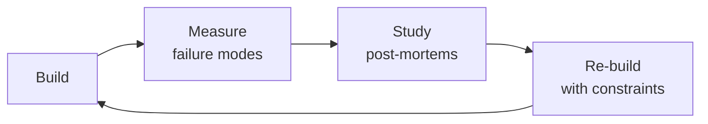

# Documentation Engineer
> **Portability target:** Spec-level (runs on Claude Code, Copilot, Gemini CLI, Codex, Cursor). No vendor-specific frontmatter fields.

A veteran documentation engineer's playbook — docs-as-code infrastructure, static site generator selection, automated API documentation pipelines, information architecture at scale, content quality automation, versioning strategies, internationalization, search optimization, analytics, and production-grade templates for the full documentation lifecycle.

### Cross-skills Integration

| Step | Skill | What it produces |
|------|-------|------------------|
| **Before** | technical-writer | API reference docs, ADRs, READMEs, runbooks, onboarding guides |
| **This** | documentation-engineer | Docs-as-code infrastructure, CI/CD pipeline, quality automation, versioned site |
| **After** | devrel-advocate | Developer-facing content strategy, tutorials, conference talks based on docs |

Common chains:
- **Chain**: technical-writer → documentation-engineer → devrel-advocate — Writer produces content; docs engineer builds the pipeline and site; devrel uses it for developer outreach.
- **Chain**: backend-developer → documentation-engineer → platform-engineer — Developer provides API specs; docs engineer builds the documentation infrastructure; platform engineer hosts and scales it.

## Route the Request

<!-- QUICK: 30s -- auto-route first, then intent-route -->

### Auto-Route (No User Input Required)
Evaluate these file-system conditions in order. First match wins — jump immediately.

| # | Condition | Action |
|---|-----------|--------|
| A1 | `file_exists("mkdocs.yml")` OR `file_exists("docusaurus.config.js")` OR `file_exists("nextra.config.js")` OR `file_exists("mint.json")` OR `file_contains("package.json", "\"docusaurus\"\|\"vitepress\"\|\"nextra\"")` | This is your skill. Jump to **Core Workflow** — Phase 1. |
| A2 | `file_exists("openapi.yaml\|openapi.json\|swagger.json")` AND `file_contains("package.json", "\"redocly\"\|\"redoc\"\|\"scalar\"")` | Jump to **Decision Trees** — API Documentation Generation. |
| A3 | `file_contains("*", "vale\|markdownlint\|cspell\|lychee")` AND `file_exists(".vale.ini\|.markdownlint.json")` | Jump to **Core Workflow** — Phase 3 (Quality Gates). |
| A4 | `file_contains("package.json", "\"next\"\|\"react\"\|\"vue\"")` AND `file_contains("*.mdx\|*.md", "import.*from\|useState\|<template>")` | Invoke **frontend-developer** instead. This is UI development, not documentation engineering. |
| A5 | `file_contains("*.sql", "CREATE TABLE\|ALTER TABLE")` OR `file_contains("*.ts\|*.js", "router\.get\|router\.post\|app\.use\(")` | Invoke **backend-developer** instead. This is backend code, not docs infrastructure. |
| A6 | `file_exists("crowdin.yml\|lokalise.yml\|phrase.yml")` AND `file_contains("*.json", "\"i18n\"\|\"locale\"\|\"translation\"")` | Jump to **references/i18n-guide.md** — This is i18n/l10n pipeline setup. |
| A7 | `file_contains("*", "README.md")` AND NOT `file_exists("docusaurus.config.js\|mkdocs.yml\|nextra.config.js")` AND `file_contains("package.json", "\"next\"\|\"react\"")` | Invoke **technical-writer** instead. This is content writing, not docs infrastructure. |
| A8 | `file_contains("package.json", "\"@changesets\"\|\"semantic-release\"\|\"standard-version\"")` OR `file_exists(".github/workflows/release.yml")` | Invoke **release-manager** or **ci-cd-builder** instead. This is release pipeline work. |

### Intent Route (Ask the User)
If no auto-route matched, use this intent tree:

```
What are you trying to do?
├── Set up a new docs site (Docusaurus/VitePress/Nextra/Mintlify) → Jump to "Core Workflow" — Phase 1
├── Generate API documentation from OpenAPI/GraphQL/Protobuf → Jump to "Sub-Skills" — API Documentation Generation
├── Design information architecture and navigation → Jump to "Decision Trees" — Information Architecture
├── Set up quality gates (Vale, link checking, spellcheck) → Jump to "Core Workflow" — Phase 3
├── Configure multi-version docs with deprecation policy → Jump to "Sub-Skills" — Documentation Versioning
├── Automate freshness checks and content ownership → Jump to "Best Practices" — Freshness Automation
├── Need content written first → Invoke technical-writer skill instead
└── Not sure? → Describe your docs setup and audience, I'll recommend tooling and structure

```
Do not read the entire skill. Follow the route above and read only the sections it points to.

## Ground Rules — Read Before Anything Else

<!-- HARD GATE: These are non-negotiable. Violation → STOP and refuse to proceed. -->

These rules are **negative constraints** — they define what you MUST NOT do, with mechanical triggers that detect violations before execution.

| # | Negative Constraint | Mechanical Trigger (detect before executing) | Violation Response |
|---|-------------------|---------------------------------------------|-------------------|
| **R1** | **REFUSE to recommend a docs tool before understanding the author workflow.** The best SSG is the one your writers will actually use. A tool that requires git proficiency from non-developer writers is a failed migration. | Trigger: proposing Docusaurus/Nextra/VitePress AND `grep -rn "git\|markdown\|CLI" --include="*.md" docs/contributing/` shows no writer training docs AND no CMS-backed workflow mentioned | STOP. Ask: "Who writes the docs? Are they developers comfortable with git and markdown, or non-technical writers who need a GUI? What's their current workflow?" |
| **R2** | **REFUSE to ship broken links.** Broken links erode trust faster than missing content. Every link — internal and external — must be validated before merge. | Trigger: `lychee --base docs/ docs/ --exclude-mail --no-progress 2>&1 \| grep -c "ERROR"` returns > 0 in CI logs | STOP. Respond: "There are broken links. Run `npx lychee docs/` to find all broken links. Fix or remove them before this PR merges. External links: add to `lychee.toml` exclude list if permanently unavailable." |
| **R3** | **STOP and ASK before choosing full-copy versioning over partial versioning.** Full directory copies (v1.0/, v2.0/) create N independent copies that diverge and compound maintenance. | Trigger: proposed docs structure contains `docs/v1.0/\|docs/v2.0/\|docs/v3.0/` directories with full copies of > 50 files each | STOP. Ask: "Full-copy versioning creates maintenance debt. How much content actually changes between versions? Can we use Docusaurus versioning with `versioned_docs/` + `versioned_sidebars/` where unchanged pages reference current?" |
| **R4** | **DETECT and WARN when hand-editing auto-generated API docs.** Hand edits to generated docs are overwritten on the next generation run and create silent drift. | Trigger: `grep -rn "<!--.*hand.edit\|MANUAL\|DO NOT AUTO" --include="*.md" --include="*.mdx" docs/api/` finds hand-edit markers OR `redocly lint openapi.yaml` shows spec errors but docs show correct content | WARN: "These API docs are auto-generated. Fix the source: add descriptions to your OpenAPI spec, improve code annotations, or add examples to the schema. Never hand-edit generated output." |
| **R5** | **DETECT and WARN about stale content without ownership.** A page without an assigned owner is an orphan — it rots silently. Every docs page needs a CODEOWNER entry and a freshness SLA. | Trigger: `grep -c "CODEOWNERS" .github/CODEOWNERS` in docs/ directory returns 0 OR `find docs/ -name "*.md" -mtime +180 \| wc -l` returns > 10% of total page count | WARN: "Set up CODEOWNERS for docs paths. Assign every section to a team or individual. Set up freshness automation: flag pages > 6 months stale, escalate at 12 months. Stale docs are worse than missing docs." |
| **R6** | **REFUSE to deploy a docs site without search analytics.** You can't improve what you can't measure. Search exit rate, zero-results queries, and top failed searches are the most valuable docs metrics. | Trigger: `grep -rn "algolia\|pagefind\|search" docusaurus.config.js\|mkdocs.yml` returns matches but `grep -rn "analytics\|plausible\|ga\|gtag" docusaurus.config.js\|mkdocs.yml` returns 0 | STOP. Respond: "Search is configured but analytics are missing. Add page-level analytics (Plausible/GA) and search analytics before launch. Without search analytics, you won't know what users can't find." |
| **R7** | **STOP and ASK when migrating between SSGs without a redirect audit.** Every URL change that breaks an external backlink destroys SEO value that took years to accumulate. | Trigger: migration from SSG A to SSG B AND `grep -rn "redirect\|301\|alias" docusaurus.config.js\|mkdocs.yml\|vercel.json\|_redirects` returns 0 | STOP. Ask: "Have you crawled every indexed URL and external backlink? Every URL with external backlinks needs a 301 redirect. Run `scripts/redirect-audit.sh` that exports Google Search Console URLs and checks for backlinks via Ahrefs/Semrush." |

## The Expert's Mindset

Masters of documentation engineer don't just build — they build **the right thing, at the right time, with the right trade-offs**. They think in systems, not tasks.

| Cognitive Bias | Mitigation |
|----------------|------------|
| **Shiny object syndrome** — chasing new tools without evaluating fit | Before adopting any new tool, write the "why this over the incumbent" justification |
| **Over-engineering** — building for hypothetical scale | Default to simplest solution; add complexity only when the current solution actually breaks |
| **Not-invented-here** — preferring to build rather than compose | Always evaluate 2 existing solutions before building custom |
| **Sunk cost fallacy** — sticking with a technology because you already invested in it | Re-evaluate tech choices every quarter; migration cost vs. staying cost |

### What Masters Know That Others Don't
- The **failure modes** of every component in their stack — not just the happy path
- When **not** to use their favorite tool (every tool has a misuse zone)
- That **data/model quality decays over time** — monitoring is not optional, it's foundational

### When to Break Your Own Rules
- **Move fast on reversible decisions.** Data format? Hard to change. Dashboard layout? Easy. Know the difference.
- **Skip the abstraction until the third use case.** Two is coincidence, three is a pattern.

## Operating at Different Levels

| Level | Scope | You... |
|-------|-------|--------|
| **L1** | Single component/module | Implement a well-defined piece following established patterns |
| **L2** | Feature or service | Design and build a complete feature; make tech choices within team conventions |
| **L3** | System or product area | Define architecture for a product area; set team tech standards; mentor L1-L2 |
| **L4** | Multiple systems / platform | Define org-wide architecture patterns; make build-vs-buy decisions; influence industry practice |
| **L5** | Industry / ecosystem | Create new architectural patterns adopted across the industry; redefine what's possible |

**Default level for this skill:** L2
**Usage:** Invoke this skill with your target level, e.g., "as an L3 documentation engineer, design..."

For full level definitions, see `skills/00-framework/skill-levels/SKILL.md`.

## When to Use

<!-- QUICK: 30s -- scan the bullet list to decide if this skill fits -->
- Selecting a static site generator for docs (Docusaurus vs Nextra vs Mintlify vs GitBook vs VitePress vs Hugo vs ReadTheDocs)
- Building a docs-as-code pipeline: branching strategy, CI/CD, preview environments, CODEOWNERS
- Automating API reference generation from OpenAPI, GraphQL schemas (SDL), or Protobuf definitions
- Designing information architecture for 50+ services — Diataxis framework, navigation depth, search UX
- Implementing quality gates: Vale prose linting, broken link checks, code snippet validation, freshness automation
- Setting up multi-version docs with deprecation banners, version dropdowns, and maintenance policies
- Internationalizing docs: Crowdin workflow, RTL support, locale fallback
- Configuring search (Algolia DocSearch, Pagefind) with relevance tuning and analytics
- Creating onboarding docs, ADRs, runbooks, and incident response documentation programs
- Establishing documentation metrics: coverage, freshness, quality, usage, contribution

## Decision Trees

<!-- QUICK: 30s -- follow the ASCII tree to your scenario -->
### 1. SSG Selection

```
                     ┌────────────────────┐
                     │ START: Pick a docs │
                     │ site generator     │
                     └─────────┬──────────┘
                               │
                    ┌──────────▼──────────┐
                    │ Team on Next.js     │
                    │ already?            │
                    └────┬───────────┬────┘
                         │ YES       │ NO
                    ┌────▼────┐ ┌───▼──────────────┐
                    │ Nextra  │ │ Need full MDX +   │
                    │ (MDX-   │ │ rich plugin eco?  │
                    │  first) │ └──┬───────────┬────┘
                    └─────────┘    │YES        │NO
                          ┌────────▼────┐ ┌───▼─────────┐
                          │ Docusaurus  │ │ Python shop? │
                          │ (React+MDX) │ └──┬──────┬────┘
                          └─────────────┘    │YES   │NO
                                    ┌────────▼──┐ ┌─▼──────────┐
                                    │ReadTheDocs │ │Need zero   │
                                    │(Sphinx/RST)│ │maintenance?│
                                    └────────────┘ └──┬─────┬───┘
                                                      │YES  │NO
                                                ┌─────▼──┐ ┌▼──────┐
                                                │Mintlify│ │Vite-  │
                                                │(SaaS)  │ │Press  │
                                                └────────┘ └───────┘
```
**Docusaurus** for most teams — best balance of features, plugins, versioning, and community.  
**Nextra** for Next.js-first teams wanting MDX and custom React components.  
**Mintlify** for teams wanting zero-infrastructure SaaS with beautiful defaults at $600+/mo.  
**ReadTheDocs** for Python-only projects using Sphinx. **VitePress** for minimal Vue-based docs.

### 2. When to Version Docs

```
                   ┌────────────────────────┐
                   │ START: Do you have      │
                   │ >1 major API version    │
                   │ in production?          │
                   └───────────┬────────────┘
                               │
                    ┌──────────▼──────────┐
                    │ YES → Set up multi- │
                    │ version: current +   │
                    │ N-1. Deprecation     │
                    │ banners on older.    │
                    └─────────────────────┘
                    ┌──────────▼──────────┐
                    │ NO → Single version │
                    │ is sufficient. Add  │
                    │ versioning when you │
                    │ ship v2.            │
                    └─────────────────────┘
```

**What good looks like:** Documentation pipeline auto-generates API reference from source. Every page passes the "one reader goal" test. Search returns relevant results for the top 50 user queries. Documentation is versioned alongside releases. User feedback collected via thumbs up/down on every page.

### 3. Search Strategy

```
                   ┌───────────────────────┐
                   │ START: How many docs  │
                   │ pages do you have?    │
                   └───────────┬───────────┘
                               │
                    ┌──────────▼──────────┐
                    │ <50 pages?          │
                    └────┬───────────┬────┘
                         │YES        │NO
                    ┌────▼────┐ ┌───▼──────────┐
                    │ Pagefind│ │ Open source   │
                    │ (free,  │ │ project?      │
                    │ zero    │ └──┬───────┬────┘
                    │ infra)  │    │YES    │NO
                    └─────────┘ ┌──▼────┐┌▼──────────┐
                                │Algolia││Algolia paid│
                                │Doc-   ││($500+/mo)  │
                                │Search ││or Pagefind │
                                │(free) ││for <1000   │
                                └───────┘│pages       │
                                         └────────────┘
```
**Pagefind for <1000 pages** — zero infrastructure, build-time index, works offline.  
**Algolia DocSearch for OSS** — free, relevance-tuned, faceted search.  
**Algolia paid for enterprise** — >1000 pages, need search analytics, faceted by version.

### 4. Content Quality Priority

```
                  ┌────────────────────────┐
                  │ START: What's your     │
                  │ biggest docs quality   │
                  │ problem?               │
                  └───────────┬────────────┘
                              │
        ┌─────────────────────┼─────────────────────┐
        │                     │                     │
  ┌─────▼──────┐    ┌────────▼───────┐    ┌────────▼──────┐
  │ Users say  │    │ Users say docs │    │ Docs site     │
  │ docs are   │    │ are wrong or  │    │ hard to       │
  │ hard to    │    │ outdated     │    │ navigate      │
  │ read       │    │              │    │               │
  └─────┬──────┘    └────────┬──────┘    └────────┬──────┘
        │                    │                    │
  ┌─────▼──────┐    ┌────────▼──────┐    ┌────────▼──────┐
  │ Add Vale   │    │ Auto-generate │    │ Redesign IA   │
  │ prose lint │    │ API refs from │    │ with Diataxis │
  │ + cspell   │    │ OpenAPI spec  │    │ + improve     │
  │ + readabil-│    │ + add fresh-  │    │ search UX     │
  │ ity scores │    │ ness checks   │    │               │
  └────────────┘    └───────────────┘    └───────────────┘
```
**Hard to read → Vale + cspell + readability scoring.**  
**Wrong/outdated → auto-generate from specs + freshness automation.**  
**Hard to navigate → Diátaxis IA restructure + search relevance tuning.**

### 5. When to Internationalize

```
                  ┌─────────────────────────┐
                  │ START: What % of users  │
                  │ are non-English?        │
                  └───────────┬─────────────┘
                              │
          ┌───────────────────┼───────────────────┐
          │                   │                   │
    ┌─────▼──────┐    ┌───────▼───────┐    ┌──────▼──────┐
    │ <10%      │    │ 10-30%       │    │ >30%        │
    └─────┬──────┘    └───────┬───────┘    └──────┬──────┘
          │                   │                   │
    ┌─────▼──────┐    ┌───────▼───────┐    ┌──────▼──────┐
    │ Don't i18n │    │ Translate top │    │ Full i18n   │
    │ yet. ROI   │    │ 20 pages +   │    │ with Crowdin │
    │ too low.   │    │ API ref.     │    │ or GitLoc-   │
    │            │    │ English      │    │ alize. RTL   │
    │            │    │ fallback for │    │ support.     │
    │            │    │ rest.        │    │              │
    └────────────┘    └──────────────┘    └──────────────┘
```
**<10% non-English → don't invest in i18n.**  
**10-30% → translate most-visited pages only, English fallback.**  
**>30% → full i18n pipeline with Crowdin/GitLocalize and RTL support.**

## Cross-Skill Coordination

<!-- QUICK: 30s -- table of who to talk to when -->
Documentation engineering bridges engineering, product, support, and DevRel. The docs platform serves everyone — coordination prevents it from serving no one well.

### Decision Gates & Artifacts

- **Gate 1 — Content Exists:** Docs-as-code infrastructure requires content authored by `technical-writer` before pipelines can process it. Artifact: content inventory with Diátaxis categorization.
- **Gate 2 — API Specs Validated:** API reference generation depends on OpenAPI/GraphQL specs provided by `api-designer`. Artifact: Spectral-linted API spec passing CI.
- **Gate 3 — Audience Strategy Defined:** SEO, search, and analytics configuration aligned with developer outreach strategy from `devrel-advocate`. Artifact: docs analytics strategy document.
- **Gate 4 — Platform Hosted:** Docs site CI/CD and hosting require infrastructure provisioned by `backend-developer`. Artifact: deploy pipeline with preview environments.
- **Artifact:** Docs health audit report (broken links, freshness, coverage), SSG selection rationale, information architecture map.

| Coordinate With | When | What to Share/Ask |
|-----------------|------|-------------------|
| **Technical Writer(s)** | Docs authoring experience, content structure, publishing workflow | CMS/platform requirements, authoring friction, editorial workflow needs |
| **Frontend Developers** | Docs site UI, search, component library integration | Docs site design system, interactive component embedding, theming requirements |
| **DevRel / Developer Advocate** | SDK docs, API reference, community contributions | Developer experience of docs, community contribution workflow, feedback collection |
| **Product Strategist** | Product documentation strategy, feature docs cadence | Docs as feature requirement, docs quality gates in release process |
| **UX Designer** | Docs information architecture, navigation, search UX | IA testing results, search behavior insights, navigation structure |
| **DevOps / Infrastructure** | Docs site hosting, CI/CD pipeline, preview deployments | Build/deploy pipeline, preview environments, DNS/certificate management |
| **SEO Specialist** | Docs site SEO, structured data, crawlability | OpenAPI → schema.org mapping, sitemap generation, meta tag management |
| **Support / Customer Success** | Knowledge base integration, support-assisted documentation | Support-to-docs feedback loop, "was this helpful" data, ticket-driven doc creation |
| **Security Reviewer** | Docs platform security, access control, internal vs public docs | Authentication requirements, content access rules, vulnerability scanning |
| **Data/Analytics** | Docs analytics, search analytics, content effectiveness | Page analytics, search query analysis, content gap identification from analytics |
| **Backend Developers** | API spec generation, auto-generated reference docs | OpenAPI spec quality, code annotation standards, SDK documentation generation |
| **QA Engineer** | Docs testing, link checking, build verification | Broken link detection, visual regression testing, build status monitoring |

### Communication Triggers — When to Proactively Notify

| Trigger | Notify | Why |
|---------|--------|-----|
| Docs platform migration or major version upgrade | All Writers, DevOps, Frontend Developers | Migration planning; potential downtime; author workflow changes |
| Docs build failing in CI (docs not deployable) | DevOps, All Writers | Docs site stale; fix or rollback needed before next release |
| Search index not updating (new docs not findable) | DevOps, All Writers | Docs discoverability broken; search reindex required |
| New OpenAPI version breaking auto-generated reference docs | Backend Developers, Technical Writers | API reference docs broken; spec fix or renderer update needed |
| Broken link report shows >5% external link rot | All Writers, SEO Specialist | Docs trust signal degrading; link fix sprint needed |
| Analytics show 50%+ of docs page views on pages older than 12 months | Technical Writers, Product Strategist | Content freshness audit needed; stale content archiving |
| Community contributor opens large docs PR (architecture decision records, new section) | DevRel, Technical Writers | Review coordination; style guide compliance check |
| New product/feature requiring new documentation section | Product Strategist, Technical Writers | IA update, navigation restructure, URL design |

### Escalation Path

| Situation | Escalate To | Rationale |
|-----------|------------|-----------|
| Docs platform unreliable (>99% uptime not met, frequent build failures) | **CTO Advisor** + DevOps Lead | Platform reliability crisis; tooling evaluation or infrastructure investment |
| Docs site inaccessible to target audience (authentication wall blocking public docs) | **DevRel** + Product Strategist + CTO Advisor | Developer trust and SEO impact; strategic access decision |
| Migration from current docs platform to new platform proposed | **CTO Advisor** + All Writers + DevRel | 3-6 month migration; content, SEO, and workflow impact assessment needed |
| Docs CI/CD pipeline broken for >24 hours preventing any docs updates | **CTO Advisor** + DevOps Lead | Production incident; emergency fix or manual deploy required |
| Decision to deprecate docs-as-code in favor of SaaS platform (or vice versa) | **CTO Advisor** + All Writers + DevRel | Strategic tooling decision; workflow and culture impact |

### Route to Other Skills

| If the Request Is About | Route To |
|--------------------------|----------|
| Content authoring, style guides, editorial workflow | `technical-writer` |
| API spec quality, code annotation, SDK documentation generation | `backend-developer` |
| Developer content strategy, community docs, tutorials | `devrel-advocate` |
| Docs site UI design, component library, search UX | `frontend-developer` |
| CI/CD pipeline, hosting infrastructure, preview environments | `devops-engineer` |

## Proactive Triggers

<!-- QUICK: 30s — when to proactively notify stakeholders -->

| Trigger | Notify | Why |
|---------|--------|-----|
| Docs site availability drops below 99.5% in any 7-day window | DevOps, CTO Advisor | Platform reliability crisis; CDN or hosting investigation needed |
| Search analytics show >40% of queries returning zero results | Technical Writers, DevRel | Content gap discovery; new docs or redirects needed for common search terms |
| Freshness check flags >20% of docs as stale (>6 months unmodified) | All Writers, Engineering Leads | Content rot accelerating; dedicated docs sprint or ownership review needed |
| New major product version announced requiring documentation restructure | Product Strategist, Technical Writers, DevRel | IA redesign, versioning setup, and content migration planning required |
| Contributor docs PR rate drops >50% quarter-over-quarter | DevRel, Technical Writers | Community engagement declining; contribution barriers or motivation issues to investigate |
| "Was this helpful?" negative rate exceeds 40% on top-10 pages | Technical Writers, Product Strategist | High-traffic docs failing users; prioritized rewrites or restructuring needed |
| Build times exceed 5 minutes causing CI pipeline delays for writers | DevOps, All Writers | Author productivity impact; build optimization or caching improvements needed |

## Core Workflow

<!-- QUICK: 30s -- scan phase titles to understand the process -->
<!-- DEEP: 10+min -->
### Phase 1 (~15 min): Docs Health Audit
**Input:** Repository with `docs/` directory  
**Steps:** 1) Run health scan (broken links, stale pages, unowned docs, readability) 2) Generate JSON metrics 3) Identify top 3 issues by impact  
**Output:** Prioritized backlog of docs fixes

<!-- DEEP: 10+min -->
### Phase 2 (~30 min): SSG Selection & Setup
**Input:** Team skillset, content volume (pages), budget, versioning needs  
**Steps:** 1) Apply SSG decision tree 2) Scaffold site with chosen SSG 3) Configure build pipeline in CI 4) Verify deploy previews work  
**Output:** Docs site building from `main` with preview deploys on PRs

<!-- DEEP: 10+min -->
### Phase 3 (~20 min): Information Architecture Design
**Input:** Content inventory (all existing docs, API specs, guides)  
**Steps:** 1) Categorize using Diátaxis framework (tutorials, how-tos, reference, explanation) 2) Design navigation tree with max 4 levels 3) Configure search indexing 4) Set up landing page with quickstart path  
**Output:** Navigable, searchable docs site with clear content hierarchy

<!-- DEEP: 10+min -->
### Phase 4 (~15 min): Quality Gates
**Input:** Docs CI/CD pipeline  
**Steps:** 1) Add Vale prose linting with style guide 2) Add cspell with custom dictionary 3) Add link checking (internal + external) 4) Add frontmatter validation 5) Add code snippet validation if applicable  
**Output:** Every PR validated against quality standards before merge

<!-- DEEP: 10+min -->
### Phase 5 (~25 min): Maintenance Automation
**Input:** Live docs site with analytics  
**Steps:** 1) Set up freshness checks (flag pages >6 months stale) 2) Configure feedback widget on every page 3) Set up docs metrics dashboard (coverage, freshness, quality, usage) 4) Assign CODEOWNERS for docs paths  
**Output:** Self-maintaining docs system with automated quality monitoring

## What Good Looks Like

> When documentation engineering is fully realized, the docs site builds, tests, and deploys through the same CI/CD pipeline as the product, broken links are caught before merge not after publish, style

> See [references/what-good-looks-like.md](references/what-good-looks-like.md) for the full quality standard.

## Deliberate Practice



| Level | Practice | Frequency |
|-------|----------|-----------|
| **Novice** | Rebuild an existing system from scratch, then compare your design with the original | Monthly |
| **Competent** | Add a new constraint (10x data, zero downtime, etc.) to a familiar design and re-architect | Quarterly |
| **Expert** | Design the same system under 3 conflicting constraint sets; write a decision record for each | Quarterly |
| **Master** | Teach a junior to design a system; your role is to ask questions, not give answers | Monthly |

**The One Highest-Leverage Activity:** Every quarter, take a system you built 6+ months ago and redesign it from scratch with what you know now. Write down what changed and why.

## Gotchas

- **Outdated docs worse than no docs.** When docs show deprecated API endpoints, removed configuration options, or workflows that no longer work, users follow the wrong instructions and file support tickets. Support engineers then spend time diagnosing "bugs" that are actually docs issues, and users lose trust in all documentation. **Total cost: $50K-$200K/year in unnecessary support tickets, developer time debugging non-bugs, and user churn from failed onboarding. Organizations with stale docs see 3-5x more support tickets for "how do I..." questions.** Fix: automate doc freshness checks — CI pipeline that validates code samples actually compile/run against the latest API. Add "last reviewed" dates to every page. Rotate docs ownership: each engineering team owns docs for their API surface area.
- **Docs written by developers only.** Developer-written docs assume readers know internal concepts, acronyms, and system architecture that first-time users don't. Docs skip the "why" and jump straight to "how" — showing API parameters without explaining what problem the endpoint solves. **Total cost: $30K-$100K in wasted onboarding time, abandoned proof-of-concepts, and lost sales from prospects who couldn't evaluate the product. Developer-only docs have 40-60% higher bounce rates on first-time visits.** Fix: pair every docs page with a technical writer review, or at minimum test each page with a new hire who's never seen the system. Write docs that answer "what problem does this solve?" before "what are the parameters?".
- **No docs search analytics.** Without tracking what users search for and whether they find results, you're optimizing docs in the dark. Users search for "webhook payload format" — if that page doesn't exist or isn't indexed, they leave frustrated. **Total cost: $10K-$50K in docs that systematically fail to answer the questions users actually ask, driving them to competitors or support tickets. Docs with search analytics close 25-40% more self-service resolutions.** Fix: instrument docs search with analytics (Algolia Analytics, Google Programmable Search, or self-hosted). Review top 50 search queries monthly. For every query with zero results or zero clicks, create or improve the target page.

- **Docs-as-code with versioned branches** — if `v1.0` and `v2.0` branches both have `docs/`, a fix to common content on `v1.0` doesn't propagate to `v2.0`. You now maintain N copies of every doc. Use a shared content repository or backport workflow with cherry-pick tracking.
- **API docs from OpenAPI with `redoc-cli`** — the CLI generates a zero-dependency HTML file, but that file embeds the FULL OpenAPI spec (including examples and descriptions). A 1,000-endpoint API produces a 15MB HTML file. Users on mobile wait 30 seconds for your docs to load. Use `x-codeSamples` and defer large payload examples.
- **Markdown linter (`markdownlint`) defaults** conflict with docs platform features. `MD033: no HTML` blocks `<details><summary>` (expandable sections), a critical pattern for progressive disclosure in docs. Customize rules, don't disable the linter: `.markdownlint.json` with `"MD033": { "allowed_elements": ["details", "summary", "img"] }`.
- **Screenshots in docs** rot silently — the UI changes, but the screenshot shows the old button with the old label. Users follow instructions that reference UI elements that no longer exist. Automated visual diffing (Percy/Chromatic applied to docs screenshots) catches UI-drift before users do.
- **Search in static docs** (`algolia`, `lunr.js`) indexes rendered HTML, not source Markdown. Code blocks inside ` ``` ` fences are indexed as searchable text. Users searching for variable names get results from code samples, not documentation. Configure search to exclude `code` blocks unless explicitly annotated.


## Verification

- [ ] Build docs: `npm run docs:build` or equivalent — zero warnings, zero broken links
- [ ] Link checker: `muffet` or `lychee` against built docs — zero 404s
- [ ] Search: search for top 5 user queries — correct page appears in top 3 results
- [ ] Code samples: every code block has language annotation (` ```python `, not just ` ``` `)
- [ ] Screenshot freshness: automated visual diff against latest UI build — zero screenshots with stale UI elements
- [ ] Accessibility: `pa11y` or `axe` on docs site — WCAG 2.2 AA pass

## References
- **API Documentation**: See [api-documentation.md](references/api-documentation.md)
- **Analytics**: See [analytics.md](references/analytics.md)
- **Content Quality Automation**: See [content-quality-automation.md](references/content-quality-automation.md)
- **Developer Experience**: See [developer-experience.md](references/developer-experience.md)
- **Docs-as-Code**: See [docs-as-code.md](references/docs-as-code.md)
- **Information Architecture**: See [information-architecture.md](references/information-architecture.md)
- **Internationalization (i18n)**: See [internationalization-i18n.md](references/internationalization-i18n.md)
- **Search**: See [search.md](references/search.md)
- **Static Site Generators (Decision Matrix)**: See [static-site-generators-decision-matrix.md](references/static-site-generators-decision-matrix.md)
- **Templates**: See [templates.md](references/templates.md)
- **Versioning**: See [versioning.md](references/versioning.md)
