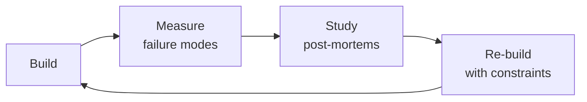

# Documentation Engineer

A veteran documentation engineer's playbook — docs-as-code infrastructure, static site generator selection, automated API documentation pipelines, information architecture at scale, content quality automation, versioning strategies, internationalization, search optimization, analytics, and production-grade templates for the full documentation lifecycle.


### Cross-skills Integration

| Step | Skill | What it produces |
|------|-------|------------------|
| **Before** | technical-writer | API reference docs, ADRs, READMEs, runbooks, onboarding guides |
| **This** | documentation-engineer | Docs-as-code infrastructure, CI/CD pipeline, quality automation, versioned site |
| **After** | devrel-advocate | Developer-facing content strategy, tutorials, conference talks based on docs |

Common chains:
- **Chain**: technical-writer → documentation-engineer → devrel-advocate — Writer produces content; docs engineer builds the pipeline and site; devrel uses it for developer outreach.
- **Chain**: backend-developer → documentation-engineer → platform-engineer — Developer provides API specs; docs engineer builds the documentation infrastructure; platform engineer hosts and scales it.

## Sub-Skills
<!-- QUICK: 30s -- table of deeper dives by topic -->
When the agent identifies a specific docs engineering need, drill into the relevant sub-skill. Each sub-skill has dedicated references, templates, and CI configurations.

| Sub-Skill | What It Covers | Key Reference |
|-----------|---------------|----------------|
| **Docs-as-Code Infrastructure** | Repository structure, CI/CD pipeline (GitHub Actions for Docusaurus/VitePress), preview environments, SSG selection (7 generators compared), diagram pipeline (Mermaid/PlantUML/Structurizr) | `references/docs-as-code-guide.md` (complete implementation) |
| **API Documentation Generation** | OpenAPI → Redoc/Scalar/Swagger, GraphQL SDL → GraphDoc/SpectaQL, Protobuf → protoc-gen-doc, SDK docs (TypeDoc/Javadoc/Sphinx), CI validation (Spectral linting) | Section below: "API Documentation" |
| **Information Architecture** | Diátaxis framework (tutorials, how-to, reference, explanation), navigation depth limits, breadcrumbs, search UX (Algolia/Pagefind), landing page design | Section below: "Information Architecture" |
| **Content Quality Automation** | Vale prose linting, markdownlint, broken link checking (lychee), spell checking (cspell), code snippet type-checking, frontmatter validation, freshness (stale flagging) | Section below: "Content Quality Automation" |
| **Documentation Versioning** | Multi-version strategy (current + N-1), deprecation banners, version dropdown UX, maintenance policies, archiving old versions | Section below: "Versioning" |
| **Templates & Content Design** | API reference template, how-to guide template, tutorial template, troubleshooting guide template, concept page template — production-grade templates in `assets/` | `assets/api-reference-template.md`, `assets/how-to-guide-template.md`, `assets/tutorial-template.md` |
| **Documentation Analytics** | Page analytics (views, bounce rate), search analytics (top queries, no-result queries), "Was this helpful?" feedback widgets, funnel analysis | Section below: "Analytics" |

> **Token-saving rule:** Setting up a docs site? Load "Docs-as-Code Infrastructure" + the SSG decision matrix. Writing an API reference page? Load the API template from `assets/api-reference-template.md` (364 lines) — it's self-contained. Don't load i18n when you're just fixing a broken link.

## Route the Request
<!-- QUICK: 30s -- auto-route first, then intent-route -->

### Auto-Route (No User Input Required)
Evaluate these file-system conditions in order. First match wins — jump immediately.

| # | Condition | Action |
|---|-----------|--------|
| A1 | `file_exists("mkdocs.yml")` OR `file_exists("docusaurus.config.js")` OR `file_exists("nextra.config.js")` OR `file_exists("mint.json")` OR `file_contains("package.json", "\"docusaurus\"\|\"vitepress\"\|\"nextra\"")` | This is your skill. Jump to **Core Workflow** — Phase 1. |
| A2 | `file_exists("openapi.yaml\|openapi.json\|swagger.json")` AND `file_contains("package.json", "\"redocly\"\|\"redoc\"\|\"scalar\"")` | Jump to **Decision Trees** — API Documentation Generation. |
| A3 | `file_contains("*", "vale\|markdownlint\|cspell\|lychee")` AND `file_exists(".vale.ini\|.markdownlint.json")` | Jump to **Core Workflow** — Phase 3 (Quality Gates). |
| A4 | `file_contains("package.json", "\"next\"\|\"react\"\|\"vue\"")` AND `file_contains("*.mdx\|*.md", "import.*from\|useState\|<template>")` | Invoke **frontend-developer** instead. This is UI development, not documentation engineering. |
| A5 | `file_contains("*.sql", "CREATE TABLE\|ALTER TABLE")` OR `file_contains("*.ts\|*.js", "router\.get\|router\.post\|app\.use\(")` | Invoke **backend-developer** instead. This is backend code, not docs infrastructure. |
| A6 | `file_exists("crowdin.yml\|lokalise.yml\|phrase.yml")` AND `file_contains("*.json", "\"i18n\"\|\"locale\"\|\"translation\"")` | Jump to **references/i18n-guide.md** — This is i18n/l10n pipeline setup. |
| A7 | `file_contains("*", "README.md")` AND NOT `file_exists("docusaurus.config.js\|mkdocs.yml\|nextra.config.js")` AND `file_contains("package.json", "\"next\"\|\"react\"")` | Invoke **technical-writer** instead. This is content writing, not docs infrastructure. |
| A8 | `file_contains("package.json", "\"@changesets\"\|\"semantic-release\"\|\"standard-version\"")` OR `file_exists(".github/workflows/release.yml")` | Invoke **release-manager** or **ci-cd-builder** instead. This is release pipeline work. |

### Intent Route (Ask the User)
If no auto-route matched, use this intent tree:

```
What are you trying to do?
├── Set up a new docs site (Docusaurus/VitePress/Nextra/Mintlify) → Jump to "Core Workflow" — Phase 1
├── Generate API documentation from OpenAPI/GraphQL/Protobuf → Jump to "Sub-Skills" — API Documentation Generation
├── Design information architecture and navigation → Jump to "Decision Trees" — Information Architecture
├── Set up quality gates (Vale, link checking, spellcheck) → Jump to "Core Workflow" — Phase 3
├── Configure multi-version docs with deprecation policy → Jump to "Sub-Skills" — Documentation Versioning
├── Automate freshness checks and content ownership → Jump to "Best Practices" — Freshness Automation
├── Need content written first → Invoke technical-writer skill instead
└── Not sure? → Describe your docs setup and audience, I'll recommend tooling and structure
```
Do not read the entire skill. Follow the route above and read only the sections it points to.

## Ground Rules — Read Before Anything Else
<!-- HARD GATE: These are non-negotiable. Violation → STOP and refuse to proceed. -->

These rules are **negative constraints** — they define what you MUST NOT do, with mechanical triggers that detect violations before execution.

| # | Negative Constraint | Mechanical Trigger (detect before executing) | Violation Response |
|---|-------------------|---------------------------------------------|-------------------|
| **R1** | **REFUSE to recommend a docs tool before understanding the author workflow.** The best SSG is the one your writers will actually use. A tool that requires git proficiency from non-developer writers is a failed migration. | Trigger: proposing Docusaurus/Nextra/VitePress AND `grep -rn "git\|markdown\|CLI" --include="*.md" docs/contributing/` shows no writer training docs AND no CMS-backed workflow mentioned | STOP. Ask: "Who writes the docs? Are they developers comfortable with git and markdown, or non-technical writers who need a GUI? What's their current workflow?" |
| **R2** | **REFUSE to ship broken links.** Broken links erode trust faster than missing content. Every link — internal and external — must be validated before merge. | Trigger: `lychee --base docs/ docs/ --exclude-mail --no-progress 2>&1 \| grep -c "ERROR"` returns > 0 in CI logs | STOP. Respond: "There are broken links. Run `npx lychee docs/` to find all broken links. Fix or remove them before this PR merges. External links: add to `lychee.toml` exclude list if permanently unavailable." |
| **R3** | **STOP and ASK before choosing full-copy versioning over partial versioning.** Full directory copies (v1.0/, v2.0/) create N independent copies that diverge and compound maintenance. | Trigger: proposed docs structure contains `docs/v1.0/\|docs/v2.0/\|docs/v3.0/` directories with full copies of > 50 files each | STOP. Ask: "Full-copy versioning creates maintenance debt. How much content actually changes between versions? Can we use Docusaurus versioning with `versioned_docs/` + `versioned_sidebars/` where unchanged pages reference current?" |
| **R4** | **DETECT and WARN when hand-editing auto-generated API docs.** Hand edits to generated docs are overwritten on the next generation run and create silent drift. | Trigger: `grep -rn "<!--.*hand.edit\|MANUAL\|DO NOT AUTO" --include="*.md" --include="*.mdx" docs/api/` finds hand-edit markers OR `redocly lint openapi.yaml` shows spec errors but docs show correct content | WARN: "These API docs are auto-generated. Fix the source: add descriptions to your OpenAPI spec, improve code annotations, or add examples to the schema. Never hand-edit generated output." |
| **R5** | **DETECT and WARN about stale content without ownership.** A page without an assigned owner is an orphan — it rots silently. Every docs page needs a CODEOWNER entry and a freshness SLA. | Trigger: `grep -c "CODEOWNERS" .github/CODEOWNERS` in docs/ directory returns 0 OR `find docs/ -name "*.md" -mtime +180 \| wc -l` returns > 10% of total page count | WARN: "Set up CODEOWNERS for docs paths. Assign every section to a team or individual. Set up freshness automation: flag pages > 6 months stale, escalate at 12 months. Stale docs are worse than missing docs." |
| **R6** | **REFUSE to deploy a docs site without search analytics.** You can't improve what you can't measure. Search exit rate, zero-results queries, and top failed searches are the most valuable docs metrics. | Trigger: `grep -rn "algolia\|pagefind\|search" docusaurus.config.js\|mkdocs.yml` returns matches but `grep -rn "analytics\|plausible\|ga\|gtag" docusaurus.config.js\|mkdocs.yml` returns 0 | STOP. Respond: "Search is configured but analytics are missing. Add page-level analytics (Plausible/GA) and search analytics before launch. Without search analytics, you won't know what users can't find." |
| **R7** | **STOP and ASK when migrating between SSGs without a redirect audit.** Every URL change that breaks an external backlink destroys SEO value that took years to accumulate. | Trigger: migration from SSG A to SSG B AND `grep -rn "redirect\|301\|alias" docusaurus.config.js\|mkdocs.yml\|vercel.json\|_redirects` returns 0 | STOP. Ask: "Have you crawled every indexed URL and external backlink? Every URL with external backlinks needs a 301 redirect. Run `scripts/redirect-audit.sh` that exports Google Search Console URLs and checks for backlinks via Ahrefs/Semrush." |
## The Expert's Mindset

Masters of documentation engineer don't just build — they build **the right thing, at the right time, with the right trade-offs**. They think in systems, not tasks.

| Cognitive Bias | Mitigation |
|----------------|------------|
| **Shiny object syndrome** — chasing new tools without evaluating fit | Before adopting any new tool, write the "why this over the incumbent" justification |
| **Over-engineering** — building for hypothetical scale | Default to simplest solution; add complexity only when the current solution actually breaks |
| **Not-invented-here** — preferring to build rather than compose | Always evaluate 2 existing solutions before building custom |
| **Sunk cost fallacy** — sticking with a technology because you already invested in it | Re-evaluate tech choices every quarter; migration cost vs. staying cost |

### What Masters Know That Others Don't
- The **failure modes** of every component in their stack — not just the happy path
- When **not** to use their favorite tool (every tool has a misuse zone)
- That **data/model quality decays over time** — monitoring is not optional, it's foundational

### When to Break Your Own Rules
- **Move fast on reversible decisions.** Data format? Hard to change. Dashboard layout? Easy. Know the difference.
- **Skip the abstraction until the third use case.** Two is coincidence, three is a pattern.
## Operating at Different Levels

| Level | Scope | You... |
|-------|-------|--------|
| **L1** | Single component/module | Implement a well-defined piece following established patterns |
| **L2** | Feature or service | Design and build a complete feature; make tech choices within team conventions |
| **L3** | System or product area | Define architecture for a product area; set team tech standards; mentor L1-L2 |
| **L4** | Multiple systems / platform | Define org-wide architecture patterns; make build-vs-buy decisions; influence industry practice |
| **L5** | Industry / ecosystem | Create new architectural patterns adopted across the industry; redefine what's possible |

**Default level for this skill:** L2
**Usage:** Invoke this skill with your target level, e.g., "as an L3 documentation engineer, design..."

For full level definitions, see `skills/00-framework/skill-levels/SKILL.md`.

## When to Use
<!-- QUICK: 30s -- scan the bullet list to decide if this skill fits -->
- Selecting a static site generator for docs (Docusaurus vs Nextra vs Mintlify vs GitBook vs VitePress vs Hugo vs ReadTheDocs)
- Building a docs-as-code pipeline: branching strategy, CI/CD, preview environments, CODEOWNERS
- Automating API reference generation from OpenAPI, GraphQL schemas (SDL), or Protobuf definitions
- Designing information architecture for 50+ services — Diataxis framework, navigation depth, search UX
- Implementing quality gates: Vale prose linting, broken link checks, code snippet validation, freshness automation
- Setting up multi-version docs with deprecation banners, version dropdowns, and maintenance policies
- Internationalizing docs: Crowdin workflow, RTL support, locale fallback
- Configuring search (Algolia DocSearch, Pagefind) with relevance tuning and analytics
- Creating onboarding docs, ADRs, runbooks, and incident response documentation programs
- Establishing documentation metrics: coverage, freshness, quality, usage, contribution

## Decision Trees
<!-- QUICK: 30s -- follow the ASCII tree to your scenario -->
### 1. SSG Selection
```
                     ┌────────────────────┐
                     │ START: Pick a docs │
                     │ site generator     │
                     └─────────┬──────────┘
                               │
                    ┌──────────▼──────────┐
                    │ Team on Next.js     │
                    │ already?            │
                    └────┬───────────┬────┘
                         │ YES       │ NO
                    ┌────▼────┐ ┌───▼──────────────┐
                    │ Nextra  │ │ Need full MDX +   │
                    │ (MDX-   │ │ rich plugin eco?  │
                    │  first) │ └──┬───────────┬────┘
                    └─────────┘    │YES        │NO
                          ┌────────▼────┐ ┌───▼─────────┐
                          │ Docusaurus  │ │ Python shop? │
                          │ (React+MDX) │ └──┬──────┬────┘
                          └─────────────┘    │YES   │NO
                                    ┌────────▼──┐ ┌─▼──────────┐
                                    │ReadTheDocs │ │Need zero   │
                                    │(Sphinx/RST)│ │maintenance?│
                                    └────────────┘ └──┬─────┬───┘
                                                      │YES  │NO
                                                ┌─────▼──┐ ┌▼──────┐
                                                │Mintlify│ │Vite-  │
                                                │(SaaS)  │ │Press  │
                                                └────────┘ └───────┘
```
**Docusaurus** for most teams — best balance of features, plugins, versioning, and community.  
**Nextra** for Next.js-first teams wanting MDX and custom React components.  
**Mintlify** for teams wanting zero-infrastructure SaaS with beautiful defaults at $600+/mo.  
**ReadTheDocs** for Python-only projects using Sphinx. **VitePress** for minimal Vue-based docs.

### 2. When to Version Docs
```
                   ┌────────────────────────┐
                   │ START: Do you have      │
                   │ >1 major API version    │
                   │ in production?          │
                   └───────────┬────────────┘
                               │
                    ┌──────────▼──────────┐
                    │ YES → Set up multi- │
                    │ version: current +   │
                    │ N-1. Deprecation     │
                    │ banners on older.    │
                    └─────────────────────┘
                    ┌──────────▼──────────┐
                    │ NO → Single version │
                    │ is sufficient. Add  │
                    │ versioning when you │
                    │ ship v2.            │
                    └─────────────────────┘
```


**What good looks like:** Documentation pipeline auto-generates API reference from source. Every page passes the "one reader goal" test. Search returns relevant results for the top 50 user queries. Documentation is versioned alongside releases. User feedback collected via thumbs up/down on every page.

### 3. Search Strategy
```
                   ┌───────────────────────┐
                   │ START: How many docs  │
                   │ pages do you have?    │
                   └───────────┬───────────┘
                               │
                    ┌──────────▼──────────┐
                    │ <50 pages?          │
                    └────┬───────────┬────┘
                         │YES        │NO
                    ┌────▼────┐ ┌───▼──────────┐
                    │ Pagefind│ │ Open source   │
                    │ (free,  │ │ project?      │
                    │ zero    │ └──┬───────┬────┘
                    │ infra)  │    │YES    │NO
                    └─────────┘ ┌──▼────┐┌▼──────────┐
                                │Algolia││Algolia paid│
                                │Doc-   ││($500+/mo)  │
                                │Search ││or Pagefind │
                                │(free) ││for <1000   │
                                └───────┘│pages       │
                                         └────────────┘
```
**Pagefind for <1000 pages** — zero infrastructure, build-time index, works offline.  
**Algolia DocSearch for OSS** — free, relevance-tuned, faceted search.  
**Algolia paid for enterprise** — >1000 pages, need search analytics, faceted by version.

### 4. Content Quality Priority
```
                  ┌────────────────────────┐
                  │ START: What's your     │
                  │ biggest docs quality   │
                  │ problem?               │
                  └───────────┬────────────┘
                              │
        ┌─────────────────────┼─────────────────────┐
        │                     │                     │
  ┌─────▼──────┐    ┌────────▼───────┐    ┌────────▼──────┐
  │ Users say  │    │ Users say docs │    │ Docs site     │
  │ docs are   │    │ are wrong or  │    │ hard to       │
  │ hard to    │    │ outdated     │    │ navigate      │
  │ read       │    │              │    │               │
  └─────┬──────┘    └────────┬──────┘    └────────┬──────┘
        │                    │                    │
  ┌─────▼──────┐    ┌────────▼──────┐    ┌────────▼──────┐
  │ Add Vale   │    │ Auto-generate │    │ Redesign IA   │
  │ prose lint │    │ API refs from │    │ with Diataxis │
  │ + cspell   │    │ OpenAPI spec  │    │ + improve     │
  │ + readabil-│    │ + add fresh-  │    │ search UX     │
  │ ity scores │    │ ness checks   │    │               │
  └────────────┘    └───────────────┘    └───────────────┘
```
**Hard to read → Vale + cspell + readability scoring.**  
**Wrong/outdated → auto-generate from specs + freshness automation.**  
**Hard to navigate → Diátaxis IA restructure + search relevance tuning.**

### 5. When to Internationalize
```
                  ┌─────────────────────────┐
                  │ START: What % of users  │
                  │ are non-English?        │
                  └───────────┬─────────────┘
                              │
          ┌───────────────────┼───────────────────┐
          │                   │                   │
    ┌─────▼──────┐    ┌───────▼───────┐    ┌──────▼──────┐
    │ <10%      │    │ 10-30%       │    │ >30%        │
    └─────┬──────┘    └───────┬───────┘    └──────┬──────┘
          │                   │                   │
    ┌─────▼──────┐    ┌───────▼───────┐    ┌──────▼──────┐
    │ Don't i18n │    │ Translate top │    │ Full i18n   │
    │ yet. ROI   │    │ 20 pages +   │    │ with Crowdin │
    │ too low.   │    │ API ref.     │    │ or GitLoc-   │
    │            │    │ English      │    │ alize. RTL   │
    │            │    │ fallback for │    │ support.     │
    │            │    │ rest.        │    │              │
    └────────────┘    └──────────────┘    └──────────────┘
```
**<10% non-English → don't invest in i18n.**  
**10-30% → translate most-visited pages only, English fallback.**  
**>30% → full i18n pipeline with Crowdin/GitLocalize and RTL support.**

## Docs-as-Code

### Git-Based Workflow

- **Branching Strategy**: Use a `docs/` prefix for doc-only branches, or include docs changes in feature branches (preferred for monorepos). Merge to `main` triggers a production build. Use release tags (`v2.0.0`) for versioned doc snapshots.
- **PR Review Process**: Every docs PR requires:
  - Vale prose lint passing (fail on error, warn on suggestion)
  - At least one technical review from code owners
  - At least one editorial review (optional for hotfixes)
  - Preview deployment link verified as functional
- **CODEOWNERS for Docs**:
  ```
  # .github/CODEOWNERS
  docs/api/        @org/platform-team
  docs/guides/     @org/devrel-team
  docs/runbooks/   @org/sre-team
  docs/            @org/docs-owners
  ```

### Markdown/MDX Authoring

- **Plain Markdown** for: reference docs, how-to guides, conceptual overviews, ADRs, runbooks. Keeps contributions low-friction since every engineer knows Markdown.
- **MDX** for: interactive API explorers, live code editors, embedded dashboards, custom callout components, tab-based code samples (multi-language). MDX lets you import React components directly:
  ```mdx
  import Tabs from '@theme/Tabs';
  import TabItem from '@theme/TabItem';
  import CodeBlock from '@theme/CodeBlock';

  <Tabs>
    <TabItem value="py" label="Python">
      ```python
      client.create_user(email="user@example.com")
      ```
    </TabItem>
    <TabItem value="js" label="JavaScript">
      ```javascript
      client.createUser({ email: 'user@example.com' });
      ```
    </TabItem>
  </Tabs>
  ```

### CI/CD for Docs

Complete GitHub Actions pipeline for Docusaurus:

```yaml
name: Docs CI/CD
on:
  pull_request:
    paths: ['docs/**', 'sidebars.js', 'docusaurus.config.js']
  push:
    branches: [main]
    paths: ['docs/**', 'sidebars.js', 'docusaurus.config.js']
  schedule:
    - cron: '0 6 * * 0'  # Weekly external link check

jobs:
  lint:
    runs-on: ubuntu-latest
    steps:
      - uses: actions/checkout@v4
      - uses: actions/setup-node@v4
      - run: npm ci
      - name: Vale Lint
        uses: errata-ai/vale-action@v2
        with:
          files: docs/
        env:
          GITHUB_TOKEN: ${{ secrets.GITHUB_TOKEN }}
      - name: Markdown Lint
        run: npx markdownlint-cli2 "docs/**/*.md" "docs/**/*.mdx"
      - name: Check Internal Links
        run: npx docusaurus build
      - name: Spell Check
        run: npx cspell "docs/**/*.md" "docs/**/*.mdx"
      - name: Check Frontmatter
        run: node scripts/check-frontmatter.mjs

  build-and-deploy:
    needs: lint
    if: github.ref == 'refs/heads/main'
    runs-on: ubuntu-latest
    steps:
      - uses: actions/checkout@v4
      - run: npm ci
      - run: npm run build
      - name: Deploy to Netlify
        uses: nwtgck/actions-netlify@v2
        with:
          publish-dir: ./build
          production-branch: main
          production-deploy: true
          github-token: ${{ secrets.GITHUB_TOKEN }}
      - name: Trigger Algolia Crawl
        run: |
          curl -X POST "https://crawler.algolia.com/api/1/crawlers/${{ secrets.ALGOLIA_CRAWLER_ID }}/reindex"
```

### Preview Environments

- **Per-PR preview**: Netlify deploy previews, Vercel preview deployments, or GitHub Pages from `gh-pages` branch.
- **Preview comment**: GitHub Action posts preview URL as a PR comment on every docs change.
- **Branch-based preview names**: `https://pr-42--docs-preview.netlify.app`

## Static Site Generators (Decision Matrix)

| Dimension | Docusaurus | Nextra | Mintlify | GitBook | ReadTheDocs | VitePress | Hugo |
|---|---|---|---|---|---|---|---|
| Framework | React | Next.js (React) | SaaS (hosted) | SaaS (hosted) | Sphinx (Python) | Vue | Go (no JS needed) |
| Plugin Ecosystem | Rich (50+) | Next.js ecosystem | Built-in only | Limited | Sphinx extensions | Growing (10+) | Large (300+) |
| Search Built-in | Algolia/Pagefind | FlexSearch | Built-in | Built-in | Built-in | Pagefind | Lunr.js |
| Versioning | First-class | Manual (branches) | Built-in | Built-in | Built-in (tags) | Manual (branches) | Manual (branches) |
| API Doc Rendering | docusaurus-plugin-openapi-docs, Redoc | OpenAPI spec viewer | First-class | Limited | sphinxcontrib-openapi | Manual integration | Custom shortcodes |
| MDX Support | Full MDX 3 | MDX-first | No | No | No (MyST, RST) | Full MDX | No |
| i18n | Built-in (Crowdin) | next-intl | Built-in | Built-in | sphinx-intl | Built-in | i18n module |
| Cost | Free | Free | $600+/mo (pro) | $960+/yr (pro) | Free (OSS) | Free | Free |
| Learning Curve | Moderate | Moderate (Next.js) | Low | Low | Moderate (RST) | Low | Moderate |

### Docusaurus Deep Dive

- **Essential Plugins**:
  - `docusaurus-plugin-openapi-docs` — generate API docs from OpenAPI specs
  - `docusaurus-theme-search-typesense` — alternative search
  - `docusaurus-plugin-remote-content` — pull docs from external repos
  - `docusaurus-plugin-pwa` — offline support
  - `@cmfcmf/docusaurus-search-local` — local search (no Algolia)
- **Versioning Configuration**:
  ```json
  // docusaurus.config.js
  module.exports = {
    presets: [
      [
        'classic',
        {
          docs: {
            lastVersion: 'current',
            versions: {
              current: { label: '2.x (latest)', path: 'latest' },
              '2.0.0': { label: '2.0.0', path: '2.0.0' },
              '1.5.0': { label: '1.5.x (maintained)', path: '1.5.x' },
            },
          },
        },
      ],
    ],
  };
  ```
- **Theme Customization**: Override components via `src/theme/` (Swizzling). Common overrides: `DocItem/Layout` (add feedback widget), `Navbar` (add version selector), `Footer` (add doc status).
- **Algolia Integration**:
  ```js
  module.exports = {
    themeConfig: {
      algolia: {
        appId: 'YOUR_APP_ID',
        apiKey: 'YOUR_SEARCH_API_KEY',
        indexName: 'docs',
        contextualSearch: true,
        searchParameters: {
          facetFilters: ['version:latest'],
        },
      },
    },
  };
  ```

### Nextra

- **Next.js-based**: File-based routing in `pages/` directory. Each `.mdx` file is a route.
- **MDX-first**: Every page is MDX by default. Import any React component directly.
- **Custom React Components**: Build interactive demos, playgrounds, or dashboards as React components embedded in docs.
- **Theme**: Built-in docs theme with sidebar, TOC, search (FlexSearch).
- **Ideal for**: Teams already on Next.js who want full control and custom interactivity.

### Mintlify

- **SaaS**: Zero infrastructure. Push markdown to a Git repo, Mintlify handles hosting, CDN, search, analytics.
- **Beautiful by Default**: Typography, layout, dark mode are production-quality out of the box.
- **API Reference First-Class**: OpenAPI spec -> rendered reference. Interactive try-it-out with auth configuration.
- **Managed Search**: Built-in Algolia search, no configuration needed. Search analytics included.
- **Cost**: Free tier (1 editor, community), Pro ($600+/mo). Non-trivial for large teams but near-zero maintenance.

### GitBook

- **Collaborative Editing**: WYSIWYG editor, good for non-technical contributors. Syncs with GitHub.
- **Good for Internal Docs**: Quick to set up for engineering wikis, onboarding, runbooks.
- **Limited Customizability**: Can't deeply customize layout, theme, or add custom components.
- **Search and Analytics**: Built-in but less powerful than Algolia.

### ReadTheDocs

- **Sphinx-based**: Uses reStructuredText (RST) or MyST Markdown. Python ecosystem.
- **Great for Python Projects**: Auto-generates API docs from Python docstrings (sphinx.ext.autodoc).
- **Free for Open Source**: Hosted. Build triggers on Git push. Versioned docs.
- **Limited Frontend**: Theme-based customization, can't add custom JS/React easily.

### VitePress

- **Vue-based**: Lightning fast builds (Vite under the hood). Minimal configuration.
- **Markdown + MDX**: Write in Markdown, extend with Vue components.
- **Search**: Pagefind or built-in mini search.
- **Ideal for**: Small projects, Vue ecosystem docs, minimal doc sites.
- **Limitations**: Smaller plugin ecosystem, no built-in versioning or API doc rendering.

### Hugo

- **Go-based**: Fastest build times (milliseconds for thousands of pages). No JS runtime needed.
- **Template System**: Go templates. Steeper learning curve but extremely flexible.
- **Large Theme Ecosystem**: 300+ themes. Docsy theme for tech docs.
- **Ideal for**: Large static content sites, performance-critical docs, teams comfortable with Go templates.
- **Limitations**: No MDX, no interactive components without JS, no built-in versioning.

## Information Architecture

### Navigation Design

- **Max 3 levels deep**: Any page should be reachable in (calculating from the homepage). Deep nesting hides content.
- **Breadcrumbs**: Every page includes breadcrumb navigation indicating position in hierarchy.
- **Related Pages**: "Next Steps" or "See Also" section at page bottom linking to logically connected pages.
- **Sidebar Behavior**: Show only the current section's subtree (not the full site tree). Keeps navigation scannable.
- **Search Bar Position**: Prominent in the navbar, immediately visible on page load.

### Search Experience

- **Algolia DocSearch**: Free for open source projects. Configuration via `docusaurus.config.js`. Crawler runs on schedule or CI trigger.
- **Pagefind**: Static search index, no server needed. Works offline. Good for small-to-medium doc sites.
- **Search Relevance Tuning**: Boost page titles over body text, boost short pages, demote "glossary" type pages.
- **Search Analytics**: Track top queries, "no results" queries (identify documentation gaps), click-through rate from search results.

### Landing Page Design

- **Hero Section**: Product name, tagline, "Get Started" CTA button.
- **Quickstart Link**: Most visible link after hero -- "Get started in 5 minutes."
- **Popular Guides**: 3-4 most-visited pages with brief descriptions.
- **Search Bar**: Prominently displayed, with placeholder text encouraging search ("Search docs...").

### Content Hierarchy (Diataxis Framework)

| Category | Purpose | Audience | Example |
|---|---|---|---|
| **Tutorial** | Learning-oriented | New users | "Build your first app" |
| **How-To Guide** | Task-oriented | Experienced users | "Deploy to production" |
| **Reference** | Information-oriented | All users | "API endpoint reference" |
| **Explanation** | Understanding-oriented | Advanced users | "Architecture overview" |

### Progressive Disclosure

- **Summary -> Details -> Deep Dive**: Each page starts with a one-paragraph summary. Expand with progressively more detail. Reserve the deepest technical content for optional expandable sections or linked deep-dive pages.
- **Collapsible sections**: Use `<details>` / `<summary>` for optional deep-dives that 80% of readers don't need.

## API Documentation

### OpenAPI/Swagger

- **Spec as Source of Truth**: `openapi.yaml` lives in the repo. All changes to the API start with changes to the spec.
- **CI Validation**:
  ```yaml
  - name: Validate OpenAPI Spec
    run: npx @stoplight/spectral-cli lint openapi.yaml
  - name: Check Breaking Changes
    run: npx @apideck/openapi-diff openapi-v1.yaml openapi-v2.yaml
  ```
- **Reference Generation**: `docusaurus-plugin-openapi-docs` renders OpenAPI specs as Docusaurus doc pages. Alternative: Redoc standalone HTML, Scalar API reference.
- **Supplemental Hand-Written Guides**: Authentication, pagination, error handling, webhooks, rate limiting -- these are better explained in prose than auto-generated.

### GraphQL

- **Schema SDL as Source of Truth**: GraphQL schema files in the repo. Annotate with triple-quote description comments.
- **Auto-Generated Docs**: GraphDoc, SpectaQL, or Magidoc read the schema SDL and generate a full reference site.
- **Interactive Explorer**: GraphiQL or Apollo Studio Sandbox embedded for query experimentation.

### gRPC / Protobuf

- **`.proto` as Source of Truth**: Proto definitions in the repo.
- **Auto-Generated Docs**: `protoc-gen-doc` generates Markdown or HTML from `.proto` files.
  ```bash
  protoc --doc_out=./docs/api --doc_opt=markdown,api.md proto/*.proto
  ```
- **Service Documentation**: Each RPC method, message type, and field defined in the proto becomes documented.

### Interactive API Explorer

- **Try-It-Out Functionality**: Swagger UI, Scalar, or Mintlify's embedded API playground -- let users send real requests from the docs.
- **Auth Configuration**: Support API key, Bearer token, OAuth2. Store example tokens securely.
- **Example Requests**: Pre-populated curl, Python, JavaScript, Go examples for each endpoint.

### SDK Documentation

- **TypeDoc (TypeScript)**: `npx typedoc --out docs/api src/index.ts`
- **Javadoc (Java)**: `mvn javadoc:javadoc` outputs to `target/site/apidocs/`
- **Sphinx (Python)**: `sphinx-apidoc -o docs/api src/` followed by `make html`
- **CI Integration**: SDK docs are auto-generated on merge and published to the docs site.

## Versioning

### Strategies

- **Per Major Version** (recommended): `docs/v1/`, `docs/v2/`, `docs/latest/`. Each major version has its own doc snapshot. Docusaurus supports this natively.
- **Per Minor Version**: Useful for SaaS products with frequent releases and backward-compatible changes. Use when minor versions introduce meaningful doc changes.
- **"Latest" Alias**: `/latest/` always points to the most recent stable version. `/v2/` is locked.

### Deprecation Banners

```mdx
:::caution You're reading outdated docs
This documentation is for version 1.x, which is no longer actively maintained.
View the [latest version](/latest) of this page.
:::
```

Configured globally in Docusaurus:
```js
// docusaurus.config.js
module.exports = {
  presets: [
    [
      'classic',
      {
        docs: {
          banner: 'unmaintained',
        },
      },
    ],
  ],
};
```

### Version Selector UX

- **Dropdown in Navbar**: Docusaurus adds this automatically with `lastVersion` and `versions` config.
- **URL-Based Versions**: `/docs/latest/getting-started`, `/docs/v2.0.0/getting-started`
- **Redirect**: `/docs/` -> `/docs/latest/` automates routing to current version.

### Maintenance Policy

- **Current + N-1 Maintained**: Latest version receives full updates. The previous major version receives critical bug fixes and security updates. Older versions are frozen (no updates) with deprecation banners.
- **Automation**: GitHub Action runs weekly to check doc version ages and add banners when a version falls out of maintenance.

## Content Quality Automation

### Broken Link Checking

- **Internal Links**: Docusaurus build fails on broken internal links by default (`onBrokenLinks: 'error'` in config).
- **External Links**: Use `lychee` or `broken-link-checker` in a scheduled workflow:
  ```yaml
  - name: Check External Links
    run: |
      npx lychee docs/ --config .lychee.toml --format markdown >> link-report.md
  ```

### Prose Linting (Vale)

- **`.vale.ini` Configuration**:
  ```ini
  StylesPath = .vale/styles
  MinAlertLevel = error
  [*.md]
  BasedOnStyles = Docs, Google, write-good
  Docs.Terminology = YES
  Google.Headings = YES
  Google.Parens = YES
  write-good.Epsilon = NO
  ```
- **Custom Style Rules** (`styles/Docs/Terminology.yml`):
  ```yaml
  extends: substitution
  message: "Use '%s' instead of '%s'"
  level: error
  swap:
    Github: GitHub
    "log in": login
    "sign in": login
    javascript: JavaScript
    typescript: TypeScript
    "e\.g\."
    "i\.e\."
  ```
- **CI Integration**: Vale runs per-PR as a required check. Fail on error, warn on suggestion.

### Spell Checking (cspell)

- **`cspell.json` with Custom Dictionary**:
  ```json
  {
    "version": "0.2",
    "language": "en",
    "words": ["Docusaurus", "Mintlify", "VitePress", "Nextra", "Pagefind"],
    "ignorePaths": ["node_modules", "build", ".vale"]
  }
  ```

### Readability Scoring

- **Flesch-Kincaid Grade Level**: Target grade level <= 10 (high school level). Automated flagging of pages with score > 12.
- **CI Check**: Custom script extracting readability stats and flagging complex pages in PR comments.

### Code Snippet Validation

- **Embedded Source Snippets**: Docusaurus `import CodeBlock` from actual source files ensures snippets are always up-to-date and compilable.
- **Extract and Type-Check**: CI script extracts code blocks, writes to temp files, runs `tsc --noEmit` (TypeScript), `python -m py_compile` (Python), `go build` (Go).
- **Verify Imports**: Script checks that all import paths in code blocks resolve to actual packages/modules.

### Frontmatter Validation

Custom script to validate:
```js
// scripts/check-frontmatter.mjs
import matter from 'gray-matter';
import { glob } from 'glob';

const files = await glob('docs/**/*.{md,mdx}');
let errors = 0;
for (const file of files) {
  const { data } = matter.read(file);
  if (!data.title) { console.error(`${file}: missing title`); errors++; }
  if (!data.description) { console.error(`${file}: missing description`); errors++; }
  if (typeof data.sidebar_position !== 'number') { console.error(`${file}: sidebar_position must be a number`); errors++; }
  if (data.tags && !Array.isArray(data.tags)) { console.error(`${file}: tags must be an array`); errors++; }
}
process.exit(errors > 0 ? 1 : 0);
```

## Developer Experience

### Quickstart Quality

- **Time-to-First-Success < 5 Minutes**: The quickstart guide should produce a working result (API response, "Hello World" app) within 5 minutes of starting.
- **One-Command Setup**: `curl -fsSL https://install.example.com | bash` or `npx create-my-app my-project`.
- **No Assumptions**: Don't assume the reader has Node.js, Python, or anything pre-installed. Include system dependency verification.

### Code Sample Testing

- **Doctest Pattern**: Embed tests in docs code blocks, then extract and run them in CI.
- **TypeScript Type Checking**: Extract `.ts` snippets, run `tsc --noEmit` in CI.
- **Rust Doc Tests**: `cargo test` verifies all code examples in Rust doc comments pass.

### Copy-Paste Button

- Every code block has a visible copy button (Docusaurus includes this by default).
- Shell command blocks have a "copy command" button (excludes output lines).
- Multi-line code blocks show line numbers for reference.

### Dark Mode

- **Automatic**: Respects `prefers-color-scheme` CSS media query on first visit.
- **Manual Toggle**: Sun/moon icon in the navbar. Choice is persisted in `localStorage`.
- **Asset Readiness**: All diagrams, screenshots, and logos have dark-mode variants.

### Mobile Responsiveness

- **Readable on Phones**: Docs must be fully readable on a 375px-wide screen (on-call engineers checking their phone).
- **Table Scroll**: Wide tables get horizontal scroll, not overflow.
- **Code Block Scroll**: Code blocks are horizontally scrollable on mobile (not wrapped -- wrapping breaks copy-paste).

## Search

### Algolia DocSearch

- **Free for Open Source**: Apply at docsearch.algolia.com. Requires a public GitHub repo.
- **Configuration**: Crawler config in DocSearch config dashboard or `crawler-config.json`.
- **Relevance Tuning**: Boost titles (weight: 10), headings (weight: 5), body text (weight: 1). Demote very long pages.
- **Facet Filtering**: Filter by version, content type, product area.

### Pagefind

- **Static Search**: Generates a search index at build time. No server, no API key, no external service.
- **Works Offline**: The search index ships with the static site. Useful for internal tools or air-gapped environments.
- **Good for**: Small to medium doc sites (< 1000 pages).

### Search Analytics

- **Top Queries**: What are people looking for most? Surfaced in a weekly report.
- **"No Results" Queries**: These are documentation gaps. Create issues for each unique no-result query.
- **Click-Through Rate**: % of users who click a search result after searching. Low CTR signals poor relevance.

### Search UX

- **Instant Results**: Results appear as the user types (debounced at 200ms).
- **Keyboard Shortcut**: `Cmd+K` (Mac) / `Ctrl+K` (Windows/Linux) opens search. Press again or `Esc` to close.
- **Result Preview**: Each result shows the page title, a snippet of matching text (with highlighted match), and the section heading.

## Internationalization (i18n)

### Translation Workflow

- **Docusaurus i18n Setup**:
  ```bash
  # Initialize i18n
  npx docusaurus write-translations --locale fr
  npx docusaurus write-translations --locale zh-CN
  ```
- **Crowdin Integration**: Docusaurus has a Crowdin plugin. Automated sync: extract English strings -> push to Crowdin -> translated content pulled back -> deploy with all locales.
- **GitLocalize**: Lighter alternative. Open source projects use GitLocalize for community translations.
- **Manual Translation**: For small teams, translators work directly on translated `.md` files in the `i18n/` directory.

### Locale-Specific Content

- **Language Switcher**: Dropdown in the navbar listing available locales.
- **Fallback to English**: If a page hasn't been translated, show the English version with a banner: "This page isn't available in [language] yet."
- **Partial Translation**: It's fine to have some pages translated and others not. Better to ship incomplete translations than none.

### URL Strategy

- `example.com/docs/` -- English (default)
- `example.com/fr/docs/` -- French
- `example.com/zh-CN/docs/` -- Simplified Chinese

### RTL Support

- **Docusaurus RTL**: Built-in RTL support for Arabic, Hebrew, Persian, Urdu. Automatically swaps layout direction.
- **CSS Mirroring**: Docusaurus automatically mirrors the UI. Custom CSS must be RTL-aware.

## Analytics

### Page Analytics

- **Page Views**: Track per-page view counts. Identify most- and least-visited pages.
- **Bounce Rate**: High bounce rate on a page means readers aren't finding what they expected.
- **Time on Page**: Very low time suggests content too shallow. Very high time suggests content too confusing or too long.
- **Popular Pages**: The top 10 most-visited pages should be the most polished.

### Search Analytics

- **Top Queries**: What users search for most. Publish as a docs team metric.
- **No-Result Queries**: File issues for each unique query with zero results. These are unambiguous doc gaps.
- **Click-Through Rate**: % of searches resulting in a click. Low CTR indicates search quality or result relevance needs work.

### Feedback Mechanism

- **"Was This Helpful?" Widget**: At the bottom of every page. Thumbs up / thumbs down with optional text box.
- **Data Collection**: Stored per-page with timestamp. Track Yes/No ratio over time.
- **Low-Rating Alerts**: Pages with >50% "No" ratings trigger a notification to the owning team.

### Funnel Analysis

- **Landing -> Quickstart -> First API Call**: Track the drop-off at each stage of this critical funnel.
- **Measure**: % of visitors who reach the quickstart page; % of quickstart visitors who reach an API reference page.
- **Action**: High drop-off between landing and quickstart means CTA isn't visible enough. High drop-off between quickstart and API ref means quickstart doesn't successfully onboard the reader.

## Templates

Full templates are available in the `assets/` directory:

- **[API Reference Template](./assets/api-reference-template.md)**: Endpoint, method, parameters, request/response examples, error codes, rate limiting, see also.
- **[How-To Guide Template](./assets/how-to-guide-template.md)**: Goal, prerequisites, numbered steps, verification, troubleshooting, next steps.
- **[Tutorial Template](./assets/tutorial-template.md)**: What you'll build, prerequisites, time estimate, step-by-step, complete code, what you learned.
- **Troubleshooting Guide Template**: Symptom, cause, solution, prevention. Each symptom gets its own section.
- **Concept Page Template**: Summary, in-depth explanation with diagrams, related concepts. No steps -- understanding, not doing.

## Cross-Skill Coordination
<!-- QUICK: 30s -- table of who to talk to when -->
Documentation engineering bridges engineering, product, support, and DevRel. The docs platform serves everyone — coordination prevents it from serving no one well.

### Decision Gates & Artifacts

- **Gate 1 — Content Exists:** Docs-as-code infrastructure requires content authored by `technical-writer` before pipelines can process it. Artifact: content inventory with Diátaxis categorization.
- **Gate 2 — API Specs Validated:** API reference generation depends on OpenAPI/GraphQL specs provided by `api-designer`. Artifact: Spectral-linted API spec passing CI.
- **Gate 3 — Audience Strategy Defined:** SEO, search, and analytics configuration aligned with developer outreach strategy from `devrel-advocate`. Artifact: docs analytics strategy document.
- **Gate 4 — Platform Hosted:** Docs site CI/CD and hosting require infrastructure provisioned by `backend-developer`. Artifact: deploy pipeline with preview environments.
- **Artifact:** Docs health audit report (broken links, freshness, coverage), SSG selection rationale, information architecture map.

| Coordinate With | When | What to Share/Ask |
|-----------------|------|-------------------|
| **Technical Writer(s)** | Docs authoring experience, content structure, publishing workflow | CMS/platform requirements, authoring friction, editorial workflow needs |
| **Frontend Developers** | Docs site UI, search, component library integration | Docs site design system, interactive component embedding, theming requirements |
| **DevRel / Developer Advocate** | SDK docs, API reference, community contributions | Developer experience of docs, community contribution workflow, feedback collection |
| **Product Strategist** | Product documentation strategy, feature docs cadence | Docs as feature requirement, docs quality gates in release process |
| **UX Designer** | Docs information architecture, navigation, search UX | IA testing results, search behavior insights, navigation structure |
| **DevOps / Infrastructure** | Docs site hosting, CI/CD pipeline, preview deployments | Build/deploy pipeline, preview environments, DNS/certificate management |
| **SEO Specialist** | Docs site SEO, structured data, crawlability | OpenAPI → schema.org mapping, sitemap generation, meta tag management |
| **Support / Customer Success** | Knowledge base integration, support-assisted documentation | Support-to-docs feedback loop, "was this helpful" data, ticket-driven doc creation |
| **Security Reviewer** | Docs platform security, access control, internal vs public docs | Authentication requirements, content access rules, vulnerability scanning |
| **Data/Analytics** | Docs analytics, search analytics, content effectiveness | Page analytics, search query analysis, content gap identification from analytics |
| **Backend Developers** | API spec generation, auto-generated reference docs | OpenAPI spec quality, code annotation standards, SDK documentation generation |
| **QA Engineer** | Docs testing, link checking, build verification | Broken link detection, visual regression testing, build status monitoring |

### Communication Triggers — When to Proactively Notify

| Trigger | Notify | Why |
|---------|--------|-----|
| Docs platform migration or major version upgrade | All Writers, DevOps, Frontend Developers | Migration planning; potential downtime; author workflow changes |
| Docs build failing in CI (docs not deployable) | DevOps, All Writers | Docs site stale; fix or rollback needed before next release |
| Search index not updating (new docs not findable) | DevOps, All Writers | Docs discoverability broken; search reindex required |
| New OpenAPI version breaking auto-generated reference docs | Backend Developers, Technical Writers | API reference docs broken; spec fix or renderer update needed |
| Broken link report shows >5% external link rot | All Writers, SEO Specialist | Docs trust signal degrading; link fix sprint needed |
| Analytics show 50%+ of docs page views on pages older than 12 months | Technical Writers, Product Strategist | Content freshness audit needed; stale content archiving |
| Community contributor opens large docs PR (architecture decision records, new section) | DevRel, Technical Writers | Review coordination; style guide compliance check |
| New product/feature requiring new documentation section | Product Strategist, Technical Writers | IA update, navigation restructure, URL design |

### Escalation Path

| Situation | Escalate To | Rationale |
|-----------|------------|-----------|
| Docs platform unreliable (>99% uptime not met, frequent build failures) | **CTO Advisor** + DevOps Lead | Platform reliability crisis; tooling evaluation or infrastructure investment |
| Docs site inaccessible to target audience (authentication wall blocking public docs) | **DevRel** + Product Strategist + CTO Advisor | Developer trust and SEO impact; strategic access decision |
| Migration from current docs platform to new platform proposed | **CTO Advisor** + All Writers + DevRel | 3-6 month migration; content, SEO, and workflow impact assessment needed |
| Docs CI/CD pipeline broken for >24 hours preventing any docs updates | **CTO Advisor** + DevOps Lead | Production incident; emergency fix or manual deploy required |
| Decision to deprecate docs-as-code in favor of SaaS platform (or vice versa) | **CTO Advisor** + All Writers + DevRel | Strategic tooling decision; workflow and culture impact |

### Route to Other Skills

| If the Request Is About | Route To |
|--------------------------|----------|
| Content authoring, style guides, editorial workflow | `technical-writer` |
| API spec quality, code annotation, SDK documentation generation | `backend-developer` |
| Developer content strategy, community docs, tutorials | `devrel-advocate` |
| Docs site UI design, component library, search UX | `frontend-developer` |
| CI/CD pipeline, hosting infrastructure, preview environments | `devops-engineer` |

## Proactive Triggers
<!-- QUICK: 30s — when to proactively notify stakeholders -->

| Trigger | Notify | Why |
|---------|--------|-----|
| Docs site availability drops below 99.5% in any 7-day window | DevOps, CTO Advisor | Platform reliability crisis; CDN or hosting investigation needed |
| Search analytics show >40% of queries returning zero results | Technical Writers, DevRel | Content gap discovery; new docs or redirects needed for common search terms |
| Freshness check flags >20% of docs as stale (>6 months unmodified) | All Writers, Engineering Leads | Content rot accelerating; dedicated docs sprint or ownership review needed |
| New major product version announced requiring documentation restructure | Product Strategist, Technical Writers, DevRel | IA redesign, versioning setup, and content migration planning required |
| Contributor docs PR rate drops >50% quarter-over-quarter | DevRel, Technical Writers | Community engagement declining; contribution barriers or motivation issues to investigate |
| "Was this helpful?" negative rate exceeds 40% on top-10 pages | Technical Writers, Product Strategist | High-traffic docs failing users; prioritized rewrites or restructuring needed |
| Build times exceed 5 minutes causing CI pipeline delays for writers | DevOps, All Writers | Author productivity impact; build optimization or caching improvements needed |

## Core Workflow
<!-- QUICK: 30s -- scan phase titles to understand the process -->
<!-- DEEP: 10+min -->
### Phase 1 (~15 min): Docs Health Audit
**Input:** Repository with `docs/` directory  
**Steps:** 1) Run health scan (broken links, stale pages, unowned docs, readability) 2) Generate JSON metrics 3) Identify top 3 issues by impact  
**Output:** Prioritized backlog of docs fixes

<!-- DEEP: 10+min -->
### Phase 2 (~30 min): SSG Selection & Setup
**Input:** Team skillset, content volume (pages), budget, versioning needs  
**Steps:** 1) Apply SSG decision tree 2) Scaffold site with chosen SSG 3) Configure build pipeline in CI 4) Verify deploy previews work  
**Output:** Docs site building from `main` with preview deploys on PRs

<!-- DEEP: 10+min -->
### Phase 3 (~20 min): Information Architecture Design
**Input:** Content inventory (all existing docs, API specs, guides)  
**Steps:** 1) Categorize using Diátaxis framework (tutorials, how-tos, reference, explanation) 2) Design navigation tree with max 4 levels 3) Configure search indexing 4) Set up landing page with quickstart path  
**Output:** Navigable, searchable docs site with clear content hierarchy

<!-- DEEP: 10+min -->
### Phase 4 (~15 min): Quality Gates
**Input:** Docs CI/CD pipeline  
**Steps:** 1) Add Vale prose linting with style guide 2) Add cspell with custom dictionary 3) Add link checking (internal + external) 4) Add frontmatter validation 5) Add code snippet validation if applicable  
**Output:** Every PR validated against quality standards before merge

<!-- DEEP: 10+min -->
### Phase 5 (~25 min): Maintenance Automation
**Input:** Live docs site with analytics  
**Steps:** 1) Set up freshness checks (flag pages >6 months stale) 2) Configure feedback widget on every page 3) Set up docs metrics dashboard (coverage, freshness, quality, usage) 4) Assign CODEOWNERS for docs paths  
**Output:** Self-maintaining docs system with automated quality monitoring


## Error Decoder
<!-- DEEP: 5min -- each entry includes a console-string matcher for automatic recovery loops -->

| 🖥️ Console Match (grep pattern) | Symptom | Root Cause | Fix | 🔄 Auto-Recovery Loop |
|---|---|---|---|---|
| `Error: Unable to build website\|Docusaurus build failed` + `lychee docs/ --no-progress 2>&1 \| grep "ERROR"` shows broken internal links | Docs site fails to build in CI — Docusaurus exits with non-zero on broken internal links | Internal link to a page that was moved/renamed without adding a redirect. Docusaurus validates all `[link](./page)` references at build time | Fix broken links: `npx lychee docs/ --no-progress`. For moved pages: add redirect in `docusaurus.config.js` → `@docusaurus/plugin-client-redirects`. For deleted pages: update all references | 1. Get all broken links: `RUST_LOG=info npx lychee --base docs/ docs/ 2>&1 \| grep "ERROR.*404"` 2. For each broken link, check if target exists elsewhere: `find docs/ -name "<target-slug>*"` 3. If moved: add to `docusaurus.config.js` → `redirects: [{from: "/docs/old-path", to: "/docs/new-path"}]` 4. If deleted: update source with `sed -i 's/old-path/new-path/g'` across all .md/.mdx files 5. Rebuild: `npm run build` → must exit 0 |
| `Error: Vale exited with code 1\|vale.*error\|prose linting failed` + `vale --output=line docs/ 2>&1 \| head -20` shows style violations | CI fails on Vale prose linting — writers blocked from merging content changes | Vale style rules too strict or not customized for the project's tone. Default Microsoft/Google style guides flag legitimate technical writing patterns | Customize `.vale.ini`: select appropriate style packages, add project-specific terms to `styles/config/vocabularies/`. Set severity levels: `suggestion` for style preferences, `warning` for actual issues, `error` for blocking | 1. Run Vale locally: `vale docs/ --output=line` 2. Check which rules trigger most: `vale docs/ --output=line \| awk -F: '{print $2}' \| sort \| uniq -c \| sort -rn \| head -10` 3. Adjust `.vale.ini`: change top-offender rules from `error` to `warning` or `suggestion` 4. Add custom accept.txt vocabulary: `echo "Kubernetes\nAPI\nCLI\nCI/CD" >> styles/config/vocabularies/Base/accept.txt` 5. Re-lint: `vale docs/` → must exit 0 |
| `Error: OpenAPI spec validation failed\|redocly lint returned 1` + `redocly lint openapi.yaml --format=stylish 2>&1 \| grep -c "warning\|error"` shows > 0 | Auto-generated API docs are wrong — missing fields, wrong types, incorrect auth methods | OpenAPI spec has accumulated warnings over time because no one owned spec quality. Auto-generation amplifies bad source quality — garbage in, garbage out | Enforce `redocly lint openapi.yaml --max-problems 0` in CI. Assign spec ownership. Add at least one response example per endpoint. Run quarterly audit: make actual API calls and verify response matches spec | 1. Audit spec quality: `redocly lint openapi.yaml --format=json \| jq '.[].severity' \| sort \| uniq -c` 2. Fix errors first: `redocly lint openapi.yaml --format=stylish \| grep "error"` 3. Fix top 5 warnings: address missing descriptions, missing examples, untyped schemas 4. Add CI gate: `redocly lint openapi.yaml --max-problems 0` in `.github/workflows/docs.yml` 5. Set ownership: `CODEOWNERS` entry for `openapi.yaml` → `@api-team` |
| `Error: cspell found spelling errors\|Unknown word` + `npx cspell "docs/**/*.md" 2>&1 \| grep "Unknown" \| head -20` shows false positives on technical terms | Spellcheck CI gate blocks PRs for legitimate technical terms, API names, and product names | cspell dictionary not customized for the project domain. Default dictionary flags: Kubernetes, TypeScript, PostgreSQL, API endpoint names, and company-specific product names | Add project dictionary: `cspell.json` → `"words": ["Kubernetes", "TypeScript", "PostgreSQL", ...]`. Use `npx cspell --words-only "docs/**/*.md" \| sort -u` to find all flagged words, add valid ones to dictionary | 1. Extract all flagged words: `npx cspell "docs/**/*.md" --words-only 2>&1 \| grep -v "^$" \| sort -u` 2. Review each word: is it a valid technical term or product name? 3. Add valid terms to `cspell.json` → `"words"` array 4. For remaining flagged terms: use `<!-- cspell:disable-next-line -->` sparingly in source 5. CI check: `npx cspell "docs/**/*.md" --no-progress` → must exit 0 |
| `Error: Pagefind index empty\|search returns no results` + `find build/ -name "pagefind*" \| wc -l` returns 0 | Search bar on docs site shows "No results" for every query — Pagefind index not generated during build | Pagefind post-processing step not added to build pipeline. The SSG builds HTML, but Pagefind needs to run as a post-build step to index the static output | Add post-build script: `"build": "docusaurus build && npx pagefind --site build"`. Verify index: `ls build/pagefind/` must contain `pagefind.js` and index files. For Algolia: verify `ALGOLIA_API_KEY` and `ALGOLIA_APP_ID` env vars | 1. Check build output: `npm run build && ls build/pagefind/` 2. If empty, add to `package.json`: `"postbuild": "npx pagefind --site build"` 3. Rebuild: `npm run build` 4. Test search: open `build/index.html` and search for known content 5. For Algolia: verify API key via `curl -H "X-Algolia-API-Key: $ALGOLIA_API_KEY" "https://$ALGOLIA_APP_ID-dsn.algolia.net/1/indexes/*/settings"` |
| `Error: Freshness check failed\|stale pages detected\|pages without update for [0-9]+ days` + `find docs/ -name "*.md" -mtime +180 -not -path "*/versioned_docs/*" \| wc -l` returns > 0 | 30% of docs pages haven't been updated in 6+ months — content is stale and potentially misleading | No freshness automation. Content was published, then abandoned. No CODEOWNERS assigned, so no one is responsible for keeping pages current | Set up freshness check in CI: `scripts/check-freshness.sh` — flags pages > 180 days stale, fails CI if > 10% of pages are stale. Assign CODEOWNERS. Add "Last updated" to footer | 1. Identify stale pages: `find docs/ -name "*.md" -mtime +180 \| sort` 2. Categorize: `scripts/classify-stale.sh` → "evergreen" (still accurate), "needs-review", "deprecated" 3. For evergreen: update `git log --follow --format=%ad --date=short <file> \| head -1` (modify time only, not content) 4. For needs-review: create ticket per page with CODEOWNER assignment 5. CI check: `scripts/check-freshness.sh --max-stale-pct 10` → exit 1 if > 10% stale |

## Production Checklist
<!-- QUICK: 30s -- binary pass/fail items. Each has a mechanical validation command. -->

| ID | Checklist Item | Validation Command | Auto-Fix |
|----|---------------|-------------------|----------|
| **[S1]** | Docs site builds from `main` with zero warnings | `npm run build 2>&1 \| grep -c "warn\|error"` → must return 0 | CI: `.github/workflows/docs.yml` with `npm ci && npm run build` on every PR to docs paths |
| **[S2]** | No broken internal links — all cross-references resolve to valid pages | `npx lychee --base docs/ docs/ --no-progress 2>&1 \| grep -c "ERROR"` → must return 0 | CI lint step: `npx lychee --base docs/ docs/ --exclude-mail --no-progress --max-retries 1` |
| **[S3]** | Vale prose linting passes — no errors, warnings only for intentional style choices | `vale docs/ --minAlertLevel=error 2>&1 \| grep -c "error"` → must return 0 | `.vale.ini` + CI: `vale docs/ --no-exit --output=line \|\| true` for warnings; PR review gate |
| **[S4]** | cspell passes with project-specific dictionary — no false-positive spelling errors flagged | `npx cspell "docs/**/*.md" --no-progress 2>&1 \| grep -c "Unknown"` → must return 0 | `cspell.json` with `"words"` array project terms; CI: `npx cspell "docs/**/*.md" --no-progress` |
| **[S5]** | Search configured and functional — Pagefind index exists or Algolia API key valid | `test -f build/pagefind/pagefind.js && echo "OK" \|\| test -n "$ALGOLIA_API_KEY" && echo "OK"` → must return "OK" | Post-build: `npm run build && npx pagefind --site build` in `package.json` `postbuild` script |
| **[S6]** | All pages have required frontmatter: title, description, sidebar_position | `scripts/validate-frontmatter.sh docs/` → exit code 0 (all pages have title + description) | Pre-commit hook: `scripts/validate-frontmatter.sh` — fails if any .md/.mdx file missing `title:` or `description:` |
| **[S7]** | External links checked weekly — scheduled CI catches link rot before users do | `npx lychee docs/ --exclude-mail --no-progress --accept 200,301,302 2>&1 \| grep -c "ERROR.*http"` → must be ≤ 5 (≤ 5 new external breaks per week) | GitHub Actions schedule: `.github/workflows/link-check.yml` with `schedule: [{cron: "0 6 * * 1"}]` (Monday 6 AM) |
| **[S8]** | Version selector visible — users can switch between docs versions, unmaintained versions have deprecation banners | `curl -s https://docs.example.com \| grep -c "version\|Version"` → must be ≥ 1 | Docusaurus: `presets.classic.docs.versions` config + `@docusaurus/plugin-client-redirects` |
| **[S9]** | Quickstart verified — time-to-first-success < 5 minutes on fresh machine | `bash scripts/verify-quickstart.sh` → exit code 0 AND elapsed time < 300s | CI: spin up fresh container, run quickstart steps, assert exit 0 in < 300s. Monthly schedule. |
| **[S10]** | CODEOWNERS assigned for all docs directories — every page has a human responsible | `grep -c "docs/" .github/CODEOWNERS` → must be ≥ 3 (at least 3 doc dir entries with owners) | Script: `scripts/assign-docs-owners.sh` — scans `docs/` subdirs, suggests CODEOWNERS entries based on git blame |
| **[S11]** | Freshness automation active — pages flagged at 6 months, escalated at 12 months | `find docs/ -name "*.md" -mtime +180 -not -path "*/versioned_docs/*" -not -path "*/archive/*" \| wc -l` → must be < 10% of total pages | CI: `scripts/check-freshness.sh --max-stale-pct 10` — fails if > 10% pages stale; auto-creates issues |
| **[S12]** | Analytics configured — page views, search analytics, and "was this helpful?" feedback widget active | `grep -rn "plausible\|gtag\|analytics\|feedback" docusaurus.config.js\|mkdocs.yml` → must match at least 2 analytics providers | Template: add Plausible script to `docusaurus.config.js` `scripts` array + `@docusaurus/plugin-google-gtag` |

## Scale Depth
<!-- QUICK: 30s -- find your team size column -->
### Solo (1 person) → Small (2-10) → Medium (10-50) → Enterprise (50+)

| Dimension | Solo | Small | Medium | Enterprise |
|-----------|------|-------|--------|------------|
| **Docs Infrastructure** | README.md in repo | Docusaurus on Vercel (free) | Docs-as-code CI/CD with previews | Multi-site, multi-repo, SSO-gated docs |
| **API Reference** | curl examples in README | Auto-generated from OpenAPI | Interactive API explorer (Scalar/Stoplight) | SDK docs + multi-language samples |
| **Search** | Ctrl+F | Pagefind (free) | Algolia DocSearch | Algolia paid with search analytics |
| **Quality** | Manual review | Vale + markdownlint in CI | Full quality gates + readability scores | Automated freshness, ownership, contribution tracking |
| **Versioning** | None needed | Git tags for releases | Multi-version with deprecation banners | Version maintenance policy + SLA |
| **i18n** | English only | English only | Top pages translated | Full i18n pipeline with Crowdin |
| **Metrics** | None | Page views | Feedback widget + analytics | Docs-as-product dashboard |
| **Team** | Developer writes docs | Rotating docs duty | 1 dedicated writer | Docs team (2-4) with specialization |

### Transition Triggers

| From → To | Trigger | What to Change |
|-----------|---------|----------------|
| Solo → Small | >3 regular contributors | Set up Docusaurus/VitePress, add search, start style guide |
| Small → Medium | >50 docs pages, users asking for versioned docs | Add CI/CD quality gates, multi-version setup, auto-generated API refs |
| Medium → Enterprise | >500 docs pages, non-English user base >10% | Dedicated docs team, i18n pipeline, docs-as-product KPIs, ownership model |

## What Good Looks Like

> When documentation engineering is fully realized, the docs site builds, tests, and deploys through the same CI/CD pipeline as the product, broken links are caught before merge not after publish, style guide violations are enforced automatically so writers focus on content not formatting, search relevance is measured and tuned, freshness automation flags stale pages before users encounter them, and time-to-first-success for new users is under 5 minutes — docs are treated as a product with the same rigor as the software they describe.

## Cost-Effective Decision Table

| Decision | Free/Cheap Option | Paid Upgrade | When to Upgrade |
|----------|------------------|--------------|-----------------|
| Docs site hosting | Vercel + Docusaurus (free) or GitHub Pages (free) | Mintlify ($150/mo) or ReadMe ($99/mo) | Need managed hosting, API-first docs, or non-dev editors |
| API reference | Redoc or Scalar (free OSS) rendering OpenAPI spec | ReadMe or Mintlify (auto-sync, interactive console) | Need interactive API console, multi-language code samples, or analytics |
| Site search | Pagefind (free, local, no infra) or Lunr (free) | Algolia DocSearch (free for OSS, $500/mo+) | >500 pages, need faceted search, or want search query analytics |
| Diagram tooling | Mermaid (in-markdown, free, version-controlled) | Lucidchart ($7.95/user/mo) | Need collaborative whiteboarding or drag-and-drop editing |
| Prose linting | Vale (free OSS) + markdownlint (free) | Grammarly Business ($15/user/mo) | Need AI suggestions or non-dev writers who prefer GUI |
| Broken link checking | `lychee` (free CLI) run weekly in CI | Dedicated monitoring service | >1000 external links or need SLA on link checking |
| Docs analytics | Plausible ($9/mo) or Google Analytics 4 (free) | Algolia Analytics or custom | Need "was this helpful" aggregated reporting or search query insights |
| OpenAPI editor | VS Code + Redocly/Stoplight plugin (free) | Stoplight Studio ($99/mo) | Design-first workflow with non-dev collaborators |

**Annual docs tool budget by phase:** MVP: $0. Growth: $0-3K. Scale: $5K-50K.

## When NOT to Use This Skill (Overkill)

- **Solo developer, internal tool, no other users**: A docs site, ADR system, style guide, and freshness automation for a solo project is effort with zero audience. README + code comments = sufficient.
- **Pre-product-market-fit with 0 users**: Invest time building, not documenting. Users will tell you what needs explanation. Don't guess.
- **The codebase is a throwaway prototype**: Don't document code you plan to delete. If you're prototyping to validate, document the learnings, not the prototype.
- **Documentation is being used to avoid fixing UX**: "We'll document this confusing behavior" is an anti-pattern. If users keep asking the same question, fix the product.
- **Your entire product is a single function/API**: A 2-page doc site for 1 API endpoint is overkill. Put everything in the README.

## Token-Efficient Workflow

```
# Step 1: Docs health check
python3 scripts/docs_health.py --docs-dir docs --output json
# Returns: {"pages": 85, "broken_links_internal": 3, "broken_links_external": 1,
#           "pages_stale_6mo": 12, "pages_no_owner": 5, "readme_score": 8.5}

# Step 2: Decision tree → single action
# broken_links > 0 → Fix immediately
# pages_stale_6mo > 10% → Batch refresh sprint
# pages_no_owner > 0 → Assign via CODEOWNERS
# readme_score < 7 → Audit README against template

# Step 3: Quick verifications with exit codes
cd docs && npm run build                 # Exit code 0 = builds
lychee --base docs docs/                 # Exit code 0 = no broken links
vale docs/                               # Exit code 0 = no prose issues
npx @redocly/cli lint openapi.yaml       # Exit code 0 = spec valid

# Step 4: Verify improvement
python3 scripts/docs_health.py --docs-dir docs --compare last-week --output json
# Exit code 0 = all metrics improved, 1 = regressed
```

**Principle:** `docs_health.py` scans the docs directory, outputs JSON with metrics. Agent applies decision tree to exactly one action. Build, lint, and link checking all use exit codes. Never reads doc content into agent context (massive token waste).

## Best Practices
<!-- STANDARD: 3min -- rules extracted from production experience -->
1. **Automate setup, not docs:** If dev setup takes >30 min, fix the setup script — beautiful docs don't help if code won't run. One `./scripts/setup.sh` beats 50 pages of onboarding docs.
2. **Slack questions are your docs backlog:** Every repeated Slack answer belongs in docs. Search Slack for your top 10 answered questions — write those pages first.
3. **Generate API refs, never hand-write:** OpenAPI/SDL spec is the source of truth. Hand-written API docs go stale on the next deploy. Use Redoc or Scalar for rendering.
4. **Search before structure:** Users search, they don't browse. Tune Pagefind/Algolia relevance before reorganizing information architecture. Measure "search exit rate" (searches with no click-through).
5. **Vale in CI from day 1:** Style guide consistency is free if enforced automatically. One `.vale.ini` + custom terminology rules prevent bikeshedding over tone.
6. **Version only when you must:** Multi-version docs add maintenance burden. Until you have a v2 in production with users, don't version. When you do, keep current + N-1 only.
7. **Freshness automation is a feature:** A stale doc is worse than no doc. Flag pages >6 months without update. Escalate at 12 months. Set CODEOWNERS so every page has a human responsible.
8. **Quickstart is the most important page:** If a new user can't succeed in <5 minutes, they leave. Time-to-first-success is your #1 docs KPI. Test it on a fresh machine monthly.
9. **"Was this helpful?" on every page:** Binary feedback with optional text. Alert on pages with >50% "no" rate in last 30 days. This is your real-time quality signal.
10. **Eat your own dogfood:** Docs engineers must follow the same workflow they prescribe. If your team won't use the docs-as-code pipeline, no one else will.

## Anti-Patterns
<!-- DEEP: 5min -- each anti-pattern includes machine-detectable patterns -->

| ❌ Anti-Pattern | ✅ Do This Instead | 🔍 Detect (grep / lint) | 🛡️ Auto-Prevent |
|-----------------|---------------------|--------------------------|-------------------|
| Writing documentation as a separate phase after feature launch — docs perpetually late, knowledge gaps form immediately | Include documentation in the definition of done. Docs PR must be part of the feature PR. Ship docs and code together. | `grep -rn "TODO.*docs\|TODO.*document\|FIXME.*doc" --include="*.ts" --include="*.js" --include="*.py" src/ \| wc -l` → if > 0, docs deferred in code | PR checklist template: `pull_request_template.md` → `- [ ] Documentation updated in docs/ (if applicable)` — CI blocks merge if checkbox unchecked |
| Hand-editing auto-generated API reference docs — edits overwritten on next generation, drift accelerates | Never hand-edit generated docs. Fix the source: OpenAPI annotations, code comments, or spec quality. Use `redocly lint` to validate spec before generation. | `grep -rn "<!--.*hand.edit\|MANUAL\|DO NOT EDIT" --include="*.md" --include="*.mdx" docs/api/` → must return 0 matches | CI: `scripts/check-generated-docs.sh` — runs `redocly lint openapi.yaml`, regenerates docs, diffs against committed version, fails if hand-edits detected |
| Copying-pasting documentation between versions — divergence occurs, fixes don't propagate, maintenance multiplies | Version only content that changed. Use Docusaurus `versioned_docs/` + `versioned_sidebars/` where unchanged pages reference current. Use partials/includes for shared content. | `find versioned_docs/ -name "*.md" -exec md5sum {} \; \| sort \| uniq -d -w32 \| wc -l` → if > 5, identical copies across versions detected | Pre-commit hook: `scripts/check-versioned-duplicates.sh` — detects files with identical content across version directories, suggests using `@docusaurus/plugin-client-redirects` |
| Building the docs site before understanding search behavior — beautiful IA that nobody navigates | Analyze search logs before designing IA. Users search-first, browse-second. Validate navigation with card sorting. Measure task completion rate, not page count. | `grep -rn "algolia\|pagefind\|search" docusaurus.config.js\|mkdocs.yml` returns 0 (search not configured) AND `wc -l docs/sidebars.js` shows > 50 entries (large IA) | Before IA redesign: deploy Pagefind (free, local), collect 2 weeks of search queries, export top zero-result and low-CTR queries → redesign IA around actual user needs |
| Requiring writers to learn git, markdown, YAML, and CI simultaneously — writers fight tooling instead of writing | Provide pre-configured VS Code workspaces with live preview, markdown linting, and one-click git operations. Train on 5 git commands max. Measure writer velocity before/after migration. | `grep -rn "git\|merge.conflict\|rebase" --include="*.md" docs/ --after-context=0 \| wc -l` → if > 20, writers are spending time on git, not content | `.vscode/docs.code-workspace` with recommended extensions (Markdown Preview Enhanced, Vale, GitLens with simplified UI), `scripts/new-doc.sh` generating scaffolded MDX with frontmatter |
| Deploying docs site without analytics — can't measure what's broken, improvements based on intuition | Add page-level analytics, search analytics, and "was this helpful?" feedback before launch. Set baseline metrics immediately: bounce rate, search exit rate, top failed searches. | `grep -rn "plausible\|gtag\|analytics\|statistics" docusaurus.config.js\|mkdocs.yml` → must return ≥ 1 match | Template: `templates/docs-analytics.md` — Plausible script + `@docusaurus/plugin-google-gtag` + custom "was this helpful?" component with `fetch` to analytics endpoint |
| Treating docs as a dumping ground for all internal knowledge — signal-to-noise ratio plummets | Separate internal knowledge base (Notion/Confluence/Wiki) from public docs. Curate what ships. Maintain a quality bar: every page must answer a specific user question. | `find docs/ -name "*.md" -not -path "*/api/*" -not -path "*/tutorials/*" \| while read f; do grep -c "^# " "$f"; done \| sort -n \| uniq -c` → pages with no H1 (no clear purpose) or > 5 H1s (too many topics) | CI lint: `scripts/validate-page-purpose.sh` — fails if any page lacks a `<title>` + `<meta description>` OR has > 3 H2 sections without a unifying H1 |
| Migrating between SSGs without a redirect audit — URLs change, backlinks break, SEO collapses | Before any URL structure change: crawl every indexed URL (Google Search Console API) and every external backlink (Ahrefs/Semrush). Every single one gets a 301. Redirect coverage must be 100%. | `grep -c "redirect\|301\|alias" docusaurus.config.js\|mkdocs.yml\|vercel.json\|_redirects` → must be > 0 if migration happened in last 180 days | Migration gate: `scripts/redirect-audit.sh` — exports GSC URL list, checks each against live site, fails if any URL with external backlinks returns 404 |

## Footguns
<!-- DEEP: 10+min — war stories from documentation engineering and platform building -->

| Footgun | What Happened | Root Cause | How to Prevent |
|---------|---------------|------------|----------------|
| Built a docs-as-code pipeline with Git-based workflows, pull requests, and CI validation — writers spent 60% of their time fighting Git merge conflicts instead of writing, documentation velocity dropped 70% in 3 months | A docs team of 4 writers migrated from a collaborative CMS to a docs-as-code pipeline (Markdown in Git, Docusaurus, GitHub Actions) in Q1 2024. The engineering team was thrilled — docs were finally in the same workflow as code. Within 3 months: writers were spending 60% of their time on Git operations (merge conflicts from concurrent edits, rebase confusion, lost work from force pushes). Two writers asked to transfer to marketing. Velocity dropped from 12 pages/week to 4. The docs eng lead was fired. | The pipeline was designed for engineers, not writers. Writers weren't trained on Git beyond a 1-hour workshop. No editor tooling (VS Code workspaces, live preview, templates) was provided. Concurrent editing — which the CMS handled natively — became a merge conflict nightmare in Git. | **Docs-as-code works when you invest in writer tooling, not just the pipeline.** Before migrating: (1) provide pre-configured VS Code workspaces with live preview, markdown linting, and one-click Git operations, (2) train writers on exactly 5 Git commands (pull, branch, commit, push, create PR) — nothing else, (3) use a CMS-backed Git workflow (Contentful + GitHub, TinaCMS) if writers need a GUI, (4) measure writer velocity before and after migration — if it drops >20%, you've over-engineered. Docs-as-code is a means to an end, not a religion. |
| Migrated docs site from one SSG to another and broke every permalink — 15,000 external links from blogs, Stack Overflow, and partner sites returned 404, organic search traffic dropped 52% in 30 days | A devtools company migrated from Gatsby to Docusaurus in March 2024. The migration changed URL structure: `/docs/api/authentication` became `/docs/api/auth`. The team added redirects for the top 50 pages by traffic but didn't audit the long tail. 15,000 external links broke. Google de-indexed 800 pages over 30 days. Organic search traffic fell from 120K to 58K monthly visits. Recovery took 6 months of aggressive redirect mapping. | The team estimated redirect needs by intuition ("the top 50 pages") instead of audit ("every indexed URL"). No crawl of existing backlinks was performed. Redirect coverage wasn't measured as a migration success criterion. | **Before any URL structure change: crawl every indexed URL and backlink.** Use Google Search Console API + Ahrefs/Semrush to export every URL with external backlinks. Every single one gets a 301 redirect. Set "redirect coverage = 100% of URLs with external backlinks" as a migration gate. Monitor 404 rate in the first 48 hours post-migration — if >0.5% of requests return 404, halt and fix before the SEO damage compounds. One broken link from a popular Stack Overflow answer costs more traffic than 100 well-written docs pages. |
| Automated API doc generation from OpenAPI spec without validating the spec first — the spec had 200+ warnings, generated docs were riddled with wrong types, missing examples, and authentication methods that hadn't existed for 9 months | An API platform team turned on auto-generated docs from their OpenAPI spec in November 2023. The spec had accumulated 200+ warnings over 18 months — nobody was responsible for spec maintenance. The generated docs showed: 12 endpoints with `string` instead of `integer` for numeric IDs, 8 endpoints documenting Basic Auth when the API required OAuth 2.0, and 0 endpoints with real response examples (all showed `{}`). Developers trying to integrate spent an average of 4 hours debugging issues that were documentation errors, not code errors. Integration time for new customers increased from 2 days to 5 days. | Auto-generation amplifies the quality of your source. A bad spec produces bad docs faster. No one owned spec quality because it wasn't part of any team's OKRs. CI allowed warnings because "they're just warnings." | **The OpenAPI spec is a product — assign an owner.** Enforce `redocly lint openapi.yaml --max-problems 0` in CI — warnings fail the build. Require at least one real request/response example per endpoint before marking it as "documented." Run a quarterly audit: make an actual API call for every endpoint and verify the response matches the schema. The spec is not documentation — it's the source code of documentation, and source code without tests rots. |
| Implemented docs versioning with full directory copies — 6 versions × 800 pages = 4,800 pages, 40% of content diverged unintentionally, and a security fix was applied to v2.1 but not v2.0 or v1.1 | A platform team versioned docs by copying the entire directory tree for each release: `/docs/v1.0/`, `/docs/v1.1/`, `/docs/v2.0/`, etc. By v2.1 (October 2024), they had 4,800 markdown files across 6 versions. A security fix in the TLS configuration guide was applied to v2.1 but missed in v1.0, v1.1, and v2.0. A customer following v1.1 docs configured TLS without the fix and had a vulnerable deployment — discovered during a penetration test. The security team mandated an audit of all versioned docs. It took 3 weeks and found 47 instances of unpatched security guidance. | Copy-based versioning creates N independent copies that must be maintained in parallel. No mechanism existed to identify which versions needed which fixes. The assumption "nobody uses old versions" was wrong — 35% of traffic was on v1.x docs. | **Version only what changes between releases.** Use Docusaurus/VitePress versioning where unchanged pages reference the "current" version. Use partials/includes for shared content. If using directory-based versions, have a CI check that detects pages with identical content across versions and flags them for deduplication. For security fixes: maintain a `SECURITY.md` with version applicability matrix — every security doc fix must list which versions it applies to and be verified applied to all. |
| Built an elaborate CI pipeline with spellcheck, link checking, prose linting, accessibility audits, and 12 quality gates — average time from PR to merge: 6 hours for a typo fix, writers reverted to editing directly in production because CI was too slow | A docs eng team built a comprehensive CI pipeline in February 2024: 12 quality gates including Vale prose linting, lychee link checking, a11y audits, readability scoring, and screenshot diff testing. Each PR took 18 minutes of CI time plus 2-6 hours of review cycles as gates failed for minor issues. A writer fixing a typo ("teh" → "the") waited 4 hours because a broken external link (unrelated to their change) blocked the pipeline. Writers started a shadow process: edit directly on production via the CMS bypass. The docs eng team spent Q2 2024 simplifying the pipeline. | The CI was optimized for correctness, not velocity. Every gate was mandatory for every change — no distinction between a typo fix and a new 5-page tutorial. Pipeline failures for unrelated issues (broken external links) blocked all progress. The team valued process over outcomes. | **Tier your CI gates by change type.** Typo fixes: lint, build, spellcheck only (2 minutes). Content changes: + prose linting, internal link check (5 minutes). Structural changes: + full link check, a11y audit (15 minutes). Allow merge of unrelated gate failures with override: "I acknowledge that external link check failed for pages not modified in this PR." The CI pipeline exists to serve writers, not to gatekeep them. If writers are bypassing CI, the pipeline is the problem, not the writers. |

## Calibration — How to Know Your Level
<!-- STANDARD: 3min — honest self-assessment -->

| You Know You're Stuck at L1 When... | You Know You've Reached L2 When... | You Know You're L3 When... |
|---|---|---|
| You can set up Docusaurus or VitePress but can't explain why rebuilds take 8 minutes on a 200-page site — your solution is "add more CI runners" | You've built a docs pipeline where content freshness is automated, broken links are caught in CI, and build times are under 2 minutes for 500+ pages — and you can explain every optimization you made | A CTO says "our docs are a mess, fix them" — you deliver a complete docs platform strategy (tooling, pipeline, ownership, metrics) within 2 weeks, execute it over 6 months, and developer NPS for docs improves from 22 to 68 |
| You treat docs tooling as a one-time setup — you installed the SSG and walked away, and 12 months later it's on version 1.0 while the current is 3.2 with breaking changes ahead | You have a docs platform roadmap that you review quarterly — you track dependency freshness, plan migrations 2 versions ahead, and have never had a docs outage caused by an unplanned upgrade | You design the docs platform that 5+ internal teams adopt — they don't think about SSGs, CI pipelines, or broken link checking; they write Markdown and everything else just works |
| You measure docs success by "the site is up" and "pages render" because you don't have analytics or search metrics | You measure docs by user outcomes: search success rate, page helpfulness scores, task completion rate, time-to-first-successful-API-call — and you review these metrics monthly | A VP asks "what's the ROI of our docs investment?" and you answer with ticket deflection savings ($X/year), developer onboarding time reduction (Y days → Z days), and API integration time improvement (A days → B days) — all backed by data |

**The Litmus Test:** A 200-person engineering org has docs spread across 5 different tools (GitHub Wikis, Notion, Confluence, a 3-year-old Docusaurus site, and a Google Drive folder). The CTO says "unify this." Can you produce a migration plan within 2 weeks that covers: (1) canonical source of truth for each content type, (2) redirect strategy with zero broken links, (3) migration order by business impact, (4) timeline with confidence intervals? If your answer involves "just pick Docusaurus and move everything," you're L1. Masters know that docs platform unification is 20% tooling, 40% redirects and SEO preservation, and 40% change management.

## Deliberate Practice



| Level | Practice | Frequency |
|-------|----------|-----------|
| **Novice** | Rebuild an existing system from scratch, then compare your design with the original | Monthly |
| **Competent** | Add a new constraint (10x data, zero downtime, etc.) to a familiar design and re-architect | Quarterly |
| **Expert** | Design the same system under 3 conflicting constraint sets; write a decision record for each | Quarterly |
| **Master** | Teach a junior to design a system; your role is to ask questions, not give answers | Monthly |

**The One Highest-Leverage Activity:** Every quarter, take a system you built 6+ months ago and redesign it from scratch with what you know now. Write down what changed and why.

## References
<!-- QUICK: 30s -- links to deeper reading -->
- [Write the Docs -- Documentation Guide](https://www.writethedocs.org/guide/)
- [Docusaurus -- Documentation Site Generator](https://docusaurus.io/)
- [VitePress -- Static Site Generator](https://vitepress.dev/)
- [Mintlify -- Modern Documentation](https://mintlify.com/)
- [Nextra -- Next.js Documentation](https://nextra.site/)
- [GitBook -- Documentation Platform](https://www.gitbook.com/)
- [ReadTheDocs -- Documentation Hosting](https://readthedocs.org/)
- [Hugo -- Static Site Generator](https://gohugo.io/)
- [Diataxis -- Systematic Documentation Framework](https://diataxis.fr/)
- [Mermaid -- Diagramming and Charting](https://mermaid.js.org/)
- [Structurizr -- C4 Model Diagrams as Code](https://structurizr.com/)
- [Vale -- Prose Linter](https://vale.sh/)
- [cspell -- Spell Checker](https://cspell.org/)
- [Algolia DocSearch](https://docsearch.algolia.com/)
- [Pagefind -- Static Search](https://pagefind.app/)
- [OpenAPI Specification](https://spec.openapis.org/oas/latest.html)
- [Spectral -- OpenAPI Linter](https://stoplight.io/open-source/spectral)
- [Scalar -- API Reference](https://scalar.com/)
- [Crowdin -- Translation Management](https://crowdin.com/)
- [adr-tools -- ADR Management](https://github.com/npryce/adr-tools)
- [Google -- Technical Writing Courses](https://developers.google.com/tech-writing)
