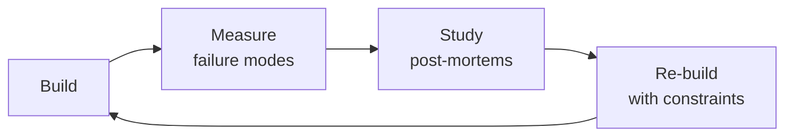

# Documentation Engineer
> **Portability target:** Spec-level (runs on Claude Code, Copilot, Gemini CLI, Codex, Cursor). No vendor-specific frontmatter fields.

A veteran documentation engineer's playbook — docs-as-code infrastructure, static site generator selection, automated API documentation pipelines, information architecture at scale, content quality automation, versioning strategies, internationalization, search optimization, analytics, and production-grade templates for the full documentation lifecycle.

### Cross-skills Integration

| Step | Skill | What it produces |
|------|-------|------------------|
| **Before** | technical-writer | API reference docs, ADRs, READMEs, runbooks, onboarding guides |
| **This** | documentation-engineer | Docs-as-code infrastructure, CI/CD pipeline, quality automation, versioned site |
| **After** | devrel-advocate | Developer-facing content strategy, tutorials, conference talks based on docs |

Common chains:
- **Chain**: technical-writer → documentation-engineer → devrel-advocate — Writer produces content; docs engineer builds the pipeline and site; devrel uses it for developer outreach.
- **Chain**: backend-developer → documentation-engineer → platform-engineer — Developer provides API specs; docs engineer builds the documentation infrastructure; platform engineer hosts and scales it.

## Route the Request
<!-- STANDARD: 3min -->

<!-- QUICK: 30s -- auto-route first, then intent-route -->

### Auto-Route (No User Input Required)
Evaluate these file-system conditions in order. First match wins — jump immediately.

| # | Condition | Action |
|---|-----------|--------|
| A1 | `file_exists("mkdocs.yml")` OR `file_exists("docusaurus.config.js")` OR `file_exists("nextra.config.js")` OR `file_exists("mint.json")` OR `file_contains("package.json", "\"docusaurus\"\|\"vitepress\"\|\"nextra\"")` | This is your skill. Jump to **Core Workflow** — Phase 1. |
| A2 | `file_exists("openapi.yaml\|openapi.json\|swagger.json")` AND `file_contains("package.json", "\"redocly\"\|\"redoc\"\|\"scalar\"")` | Jump to **Decision Trees** — API Documentation Generation. |
| A3 | `file_contains("*", "vale\|markdownlint\|cspell\|lychee")` AND `file_exists(".vale.ini\|.markdownlint.json")` | Jump to **Core Workflow** — Phase 3 (Quality Gates). |
| A4 | `file_contains("package.json", "\"next\"\|\"react\"\|\"vue\"")` AND `file_contains("*.mdx\|*.md", "import.*from\|useState\|<template>")` | Invoke **frontend-developer** instead. This is UI development, not documentation engineering. |
| A5 | `file_contains("*.sql", "CREATE TABLE\|ALTER TABLE")` OR `file_contains("*.ts\|*.js", "router\.get\|router\.post\|app\.use\(")` | Invoke **backend-developer** instead. This is backend code, not docs infrastructure. |
| A6 | `file_exists("crowdin.yml\|lokalise.yml\|phrase.yml")` AND `file_contains("*.json", "\"i18n\"\|\"locale\"\|\"translation\"")` | Jump to **references/i18n-guide.md** — This is i18n/l10n pipeline setup. |
| A7 | `file_contains("*", "README.md")` AND NOT `file_exists("docusaurus.config.js\|mkdocs.yml\|nextra.config.js")` AND `file_contains("package.json", "\"next\"\|\"react\"")` | Invoke **technical-writer** instead. This is content writing, not docs infrastructure. |
| A8 | `file_contains("package.json", "\"@changesets\"\|\"semantic-release\"\|\"standard-version\"")` OR `file_exists(".github/workflows/release.yml")` | Invoke **release-manager** or **ci-cd-builder** instead. This is release pipeline work. |

### Intent Route (Ask the User)
If no auto-route matched, use this intent tree:

```
What are you trying to do?
├── Set up a new docs site (Docusaurus/VitePress/Nextra/Mintlify) → Jump to "Core Workflow" — Phase 1
├── Generate API documentation from OpenAPI/GraphQL/Protobuf → Jump to "Sub-Skills" — API Documentation Generation
├── Design information architecture and navigation → Jump to "Decision Trees" — Information Architecture
├── Set up quality gates (Vale, link checking, spellcheck) → Jump to "Core Workflow" — Phase 3
├── Configure multi-version docs with deprecation policy → Jump to "Sub-Skills" — Documentation Versioning
├── Automate freshness checks and content ownership → Jump to "Best Practices" — Freshness Automation
├── Need content written first → Invoke technical-writer skill instead
└── Not sure? → Describe your docs setup and audience, I'll recommend tooling and structure

```

Do not read the entire skill. Follow the route above and read only the sections it points to.

## Ground Rules — Read Before Anything Else
<!-- STANDARD: 3min -->

<!-- HARD GATE: These are non-negotiable. Violation → STOP and refuse to proceed. -->

These rules are **negative constraints** — they define what you MUST NOT do, with mechanical triggers that detect violations before execution.

| # | Negative Constraint | Mechanical Trigger (detect before executing) | Violation Response |
|---|-------------------|---------------------------------------------|-------------------|
| **R1** | **REFUSE to recommend a docs tool before understanding the author workflow.** The best SSG is the one your writers will actually use. A tool that requires git proficiency from non-developer writers is a failed migration. | Trigger: proposing Docusaurus/Nextra/VitePress AND `grep -rn "git\|markdown\|CLI" --include="*.md" docs/contributing/` shows no writer training docs AND no CMS-backed workflow mentioned | STOP. Ask: "Who writes the docs? Are they developers comfortable with git and markdown, or non-technical writers who need a GUI? What's their current workflow?" |
| **R2** | **REFUSE to ship broken links.** Broken links erode trust faster than missing content. Every link — internal and external — must be validated before merge. | Trigger: `lychee --base docs/ docs/ --exclude-mail --no-progress 2>&1 \| grep -c "ERROR"` returns > 0 in CI logs | STOP. Respond: "There are broken links. Run `npx lychee docs/` to find all broken links. Fix or remove them before this PR merges. External links: add to `lychee.toml` exclude list if permanently unavailable." |
| **R3** | **STOP and ASK before choosing full-copy versioning over partial versioning.** Full directory copies (v1.0/, v2.0/) create N independent copies that diverge and compound maintenance. | Trigger: proposed docs structure contains `docs/v1.0/\|docs/v2.0/\|docs/v3.0/` directories with full copies of > 50 files each | STOP. Ask: "Full-copy versioning creates maintenance debt. How much content actually changes between versions? Can we use Docusaurus versioning with `versioned_docs/` + `versioned_sidebars/` where unchanged pages reference current?" |
| **R4** | **DETECT and WARN when hand-editing auto-generated API docs.** Hand edits to generated docs are overwritten on the next generation run and create silent drift. | Trigger: `grep -rn "<!--.*hand.edit\|MANUAL\|DO NOT AUTO" --include="*.md" --include="*.mdx" docs/api/` finds hand-edit markers OR `redocly lint openapi.yaml` shows spec errors but docs show correct content | WARN: "These API docs are auto-generated. Fix the source: add descriptions to your OpenAPI spec, improve code annotations, or add examples to the schema. Never hand-edit generated output." |
| **R5** | **DETECT and WARN about stale content without ownership.** A page without an assigned owner is an orphan — it rots silently. Every docs page needs a CODEOWNER entry and a freshness SLA. | Trigger: `grep -c "CODEOWNERS" .github/CODEOWNERS` in docs/ directory returns 0 OR `find docs/ -name "*.md" -mtime +180 \| wc -l` returns > 10% of total page count | WARN: "Set up CODEOWNERS for docs paths. Assign every section to a team or individual. Set up freshness automation: flag pages > 6 months stale, escalate at 12 months. Stale docs are worse than missing docs." |
| **R6** | **REFUSE to deploy a docs site without search analytics.** You can't improve what you can't measure. Search exit rate, zero-results queries, and top failed searches are the most valuable docs metrics. | Trigger: `grep -rn "algolia\|pagefind\|search" docusaurus.config.js\|mkdocs.yml` returns matches but `grep -rn "analytics\|plausible\|ga\|gtag" docusaurus.config.js\|mkdocs.yml` returns 0 | STOP. Respond: "Search is configured but analytics are missing. Add page-level analytics (Plausible/GA) and search analytics before launch. Without search analytics, you won't know what users can't find." |
| **R7** | **STOP and ASK when migrating between SSGs without a redirect audit.** Every URL change that breaks an external backlink destroys SEO value that took years to accumulate. | Trigger: migration from SSG A to SSG B AND `grep -rn "redirect\|301\|alias" docusaurus.config.js\|mkdocs.yml\|vercel.json\|_redirects` returns 0 | STOP. Ask: "Have you crawled every indexed URL and external backlink? Every URL with external backlinks needs a 301 redirect. Run `scripts/redirect-audit.sh` that exports Google Search Console URLs and checks for backlinks via Ahrefs/Semrush." |
| **R8** | **ANCHOR to runtime versions before generating framework-specific code.** Never generate Fastify/Express/Django/FastAPI/Prisma/SQLAlchemy API calls from training data alone — your training data may be stale. | Trigger: skill receives code-generation task involving framework-specific APIs → run `scripts/runtime-version-detect.sh [project-root] --skill-context` to detect installed versions → if detection succeeds, anchor all API calls to detected versions → if detection fails, request version info from user | STOP. Respond: "Detected: {runtime}@{version}, {frameworks}@{versions}. Anchoring all API calls to these versions. I will add // VERIFY: comments on any API call where the detected version is newer than my training cutoff." |
| **R9** | **RUN the ROI Gate before any non-emergency code change.** Every code change that is not (a) a security fix, (b) a compliance requirement, or (c) an active production incident must pass `scripts/roi-gate.sh`. If the gate returns negative, refuse to write the code. | Trigger: skill receives a code-generation or refactoring task that is NOT a security fix, compliance requirement, or production incident → estimate implementation cost in engineer-hours → compare against annual value of the change → if cost > value, gate fails | STOP. Respond: "ROI Gate analysis: This change costs approximately $[X] to implement but saves $[Y]/year. Payback period: [N] years. If payback > 2 years, I recommend declining this work. See `scripts/roi-gate.sh` for the full formula." |

- **Admit uncertainty — never fabricate.** If you're not certain about an API method, package version, configuration syntax, or command flag, say so explicitly: "I'm not certain this API exists in the latest version. Check the official docs at [URL]." Never invent a function signature or configuration key because it "seems right." Hallucinated code costs hours of debugging.
- **Flag your knowledge cutoff.** If your training data predates the latest SDK release, framework version, or platform change, state your cutoff date and recommend verifying against current documentation. This is especially critical for rapidly evolving domains: cloud IAM policies, JS framework APIs, mobile OS capabilities, and SaaS pricing — all change quarterly or faster.
- **Never guess security configurations.** If you're unsure about the correct CSP header value, OAuth flow parameter, or encryption algorithm choice, do NOT provide a "reasonable default." Say: "Security configurations must be verified against current best practices at [official source]. I cannot provide a definitive answer without current documentation."
- **Distinguish between what you know and what you infer.** Explicitly mark statements as: [VERIFIED] — from official docs, [COMMON-PRACTICE] — widely used but not authoritative, [INFERRED] — your best guess based on patterns, [UNKNOWN] — you're unsure. This helps the user calibrate trust in your output.
## The Expert's Mindset
<!-- STANDARD: 3min -->

Masters of documentation engineer don't just build — they build **the right thing, at the right time, with the right trade-offs**. They think in systems, not tasks.

| Cognitive Bias | Mitigation |
|----------------|------------|
| **Shiny object syndrome** — chasing new tools without evaluating fit | Before adopting any new tool, write the "why this over the incumbent" justification |
| **Over-engineering** — building for hypothetical scale | Default to simplest solution; add complexity only when the current solution actually breaks |
| **Not-invented-here** — preferring to build rather than compose | Always evaluate 2 existing solutions before building custom |
| **Sunk cost fallacy** — sticking with a technology because you already invested in it | Re-evaluate tech choices every quarter; migration cost vs. staying cost |

### What Masters Know That Others Don't
- The **failure modes** of every component in their stack — not just the happy path
- When **not** to use their favorite tool (every tool has a misuse zone)
- That **data/model quality decays over time** — monitoring is not optional, it's foundational

### When to Break Your Own Rules
- **Move fast on reversible decisions.** Data format? Hard to change. Dashboard layout? Easy. Know the difference.
- **Skip the abstraction until the third use case.** Two is coincidence, three is a pattern.

## Operating at Different Levels
<!-- STANDARD: 3min -->

| Level | Scope | You... |
|-------|-------|--------|
| **L1** | Single component/module | Implement a well-defined piece following established patterns |
| **L2** | Feature or service | Design and build a complete feature; make tech choices within team conventions |
| **L3** | System or product area | Define architecture for a product area; set team tech standards; mentor L1-L2 |
| **L4** | Multiple systems / platform | Define org-wide architecture patterns; make build-vs-buy decisions; influence industry practice |
| **L5** | Industry / ecosystem | Create new architectural patterns adopted across the industry; redefine what's possible |

**Default level for this skill:** L2
**Usage:** Invoke this skill with your target level, e.g., "as an L3 documentation engineer, design..."

For full level definitions, see `skills/00-framework/skill-levels/SKILL.md`.

## When to Use
<!-- STANDARD: 3min -->

<!-- QUICK: 30s -- scan the bullet list to decide if this skill fits -->
- Selecting a static site generator for docs (Docusaurus vs Nextra vs Mintlify vs GitBook vs VitePress vs Hugo vs ReadTheDocs)
- Building a docs-as-code pipeline: branching strategy, CI/CD, preview environments, CODEOWNERS
- Automating API reference generation from OpenAPI, GraphQL schemas (SDL), or Protobuf definitions
- Designing information architecture for 50+ services — Diataxis framework, navigation depth, search UX
- Implementing quality gates: Vale prose linting, broken link checks, code snippet validation, freshness automation
- Setting up multi-version docs with deprecation banners, version dropdowns, and maintenance policies
- Internationalizing docs: Crowdin workflow, RTL support, locale fallback
- Configuring search (Algolia DocSearch, Pagefind) with relevance tuning and analytics
- Creating onboarding docs, ADRs, runbooks, and incident response documentation programs
- Establishing documentation metrics: coverage, freshness, quality, usage, contribution

## Decision Trees
<!-- STANDARD: 3min -->

**(QUICK)**

<!-- QUICK: 30s -- follow the ASCII tree to your scenario -->
### 1. SSG Selection

```
                     ┌────────────────────┐
                     │ START: Pick a docs │
                     │ site generator     │
                     └─────────┬──────────┘
                               │
                    ┌──────────▼──────────┐
                    │ Team on Next.js     │
                    │ already?            │
                    └────┬───────────┬────┘
                         │ YES       │ NO
                    ┌────▼────┐ ┌───▼──────────────┐
                    │ Nextra  │ │ Need full MDX +   │
                    │ (MDX-   │ │ rich plugin eco?  │
                    │  first) │ └──┬───────────┬────┘
                    └─────────┘    │YES        │NO
                          ┌────────▼────┐ ┌───▼─────────┐
                          │ Docusaurus  │ │ Python shop? │
                          │ (React+MDX) │ └──┬──────┬────┘
                          └─────────────┘    │YES   │NO
                                    ┌────────▼──┐ ┌─▼──────────┐
                                    │ReadTheDocs │ │Need zero   │
                                    │(Sphinx/RST)│ │maintenance?│
                                    └────────────┘ └──┬─────┬───┘
                                                      │YES  │NO
                                                ┌─────▼──┐ ┌▼──────┐
                                                │Mintlify│ │Vite-  │
                                                │(SaaS)  │ │Press  │
                                                └────────┘ └───────┘
```

**Docusaurus** for most teams — best balance of features, plugins, versioning, and community.
**Nextra** for Next.js-first teams wanting MDX and custom React components.
**Mintlify** for teams wanting zero-infrastructure SaaS with beautiful defaults at $600+/mo.
**ReadTheDocs** for Python-only projects using Sphinx. **VitePress** for minimal Vue-based docs.

### 2. When to Version Docs

```
                   ┌────────────────────────┐
                   │ START: Do you have      │
                   │ >1 major API version    │
                   │ in production?          │
                   └───────────┬────────────┘
                               │
                    ┌──────────▼──────────┐
                    │ YES → Set up multi- │
                    │ version: current +   │
                    │ N-1. Deprecation     │
                    │ banners on older.    │
                    └─────────────────────┘
                    ┌──────────▼──────────┐
                    │ NO → Single version │
                    │ is sufficient. Add  │
                    │ versioning when you │
                    │ ship v2.            │
                    └─────────────────────┘
```

**What good looks like:** Documentation pipeline auto-generates API reference from source. Every page passes the "one reader goal" test. Search returns relevant results for the top 50 user queries. Documentation is versioned alongside releases. User feedback collected via thumbs up/down on every page.

### 3. Search Strategy

```
                   ┌───────────────────────┐
                   │ START: How many docs  │
                   │ pages do you have?    │
                   └───────────┬───────────┘
                               │
                    ┌──────────▼──────────┐
                    │ <50 pages?          │
                    └────┬───────────┬────┘
                         │YES        │NO
                    ┌────▼────┐ ┌───▼──────────┐
                    │ Pagefind│ │ Open source   │
                    │ (free,  │ │ project?      │
                    │ zero    │ └──┬───────┬────┘
                    │ infra)  │    │YES    │NO
                    └─────────┘ ┌──▼────┐┌▼──────────┐
                                │Algolia││Algolia paid│
                                │Doc-   ││($500+/mo)  │
                                │Search ││or Pagefind │
                                │(free) ││for <1000   │
                                └───────┘│pages       │
                                         └────────────┘
```

**Pagefind for <1000 pages** — zero infrastructure, build-time index, works offline.
**Algolia DocSearch for OSS** — free, relevance-tuned, faceted search.
**Algolia paid for enterprise** — >1000 pages, need search analytics, faceted by version.

### 4. Content Quality Priority

```
                  ┌────────────────────────┐
                  │ START: What's your     │
                  │ biggest docs quality   │
                  │ problem?               │
                  └───────────┬────────────┘
                              │
        ┌─────────────────────┼─────────────────────┐
        │                     │                     │
  ┌─────▼──────┐    ┌────────▼───────┐    ┌────────▼──────┐
  │ Users say  │    │ Users say docs │    │ Docs site     │
  │ docs are   │    │ are wrong or  │    │ hard to       │
  │ hard to    │    │ outdated     │    │ navigate      │
  │ read       │    │              │    │               │
  └─────┬──────┘    └────────┬──────┘    └────────┬──────┘
        │                    │                    │
  ┌─────▼──────┐    ┌────────▼──────┐    ┌────────▼──────┐
  │ Add Vale   │    │ Auto-generate │    │ Redesign IA   │
  │ prose lint │    │ API refs from │    │ with Diataxis │
  │ + cspell   │    │ OpenAPI spec  │    │ + improve     │
  │ + readabil-│    │ + add fresh-  │    │ search UX     │
  │ ity scores │    │ ness checks   │    │               │
  └────────────┘    └───────────────┘    └───────────────┘
```

**Hard to read → Vale + cspell + readability scoring.**
**Wrong/outdated → auto-generate from specs + freshness automation.**
**Hard to navigate → Diátaxis IA restructure + search relevance tuning.**

### 5. When to Internationalize

```
                  ┌─────────────────────────┐
                  │ START: What % of users  │
                  │ are non-English?        │
                  └───────────┬─────────────┘
                              │
          ┌───────────────────┼───────────────────┐
          │                   │                   │
    ┌─────▼──────┐    ┌───────▼───────┐    ┌──────▼──────┐
    │ <10%      │    │ 10-30%       │    │ >30%        │
    └─────┬──────┘    └───────┬───────┘    └──────┬──────┘
          │                   │                   │
    ┌─────▼──────┐    ┌───────▼───────┐    ┌──────▼──────┐
    │ Don't i18n │    │ Translate top │    │ Full i18n   │
    │ yet. ROI   │    │ 20 pages +   │    │ with Crowdin │
    │ too low.   │    │ API ref.     │    │ or GitLoc-   │
    │            │    │ English      │    │ alize. RTL   │
    │            │    │ fallback for │    │ support.     │
    │            │    │ rest.        │    │              │
    └────────────┘    └──────────────┘    └──────────────┘
```

**<10% non-English → don't invest in i18n.**
**10-30% → translate most-visited pages only, English fallback.**
**>30% → full i18n pipeline with Crowdin/GitLocalize and RTL support.**

## Error Recovery
<!-- STANDARD: 3min -->

**(STANDARD)**, follow this escalation path before giving up:

| Symptom | First Action | If That Fails | Last Resort |
|---------|-------------|---------------|-------------|
| Tool/command not found | Check installation: `which [tool]` or `[tool] --version`. Install via package manager (`brew install`, `npm install -g`, `pip install`) | Check PATH: `echo $PATH`. Verify the tool binary is in a PATH directory. Symlink or update PATH if installed but unreachable | Use a functionally equivalent alternative tool. If `rg` is unavailable, use `grep -r`. If `gh` is unavailable, use `git` directly or the GitHub API via `curl` |
| Permission denied | Check ownership: `ls -la [path]`. Fix with `chmod` or `sudo` if appropriate. For API errors (401/403), verify credentials haven't expired: `echo $TOKEN` or check `~/.netrc` | Refresh credentials: re-authenticate with the service. For file permissions, check if the file is locked by another process: `lsof [path]` | Request elevated permissions or use a different authentication method (token vs password, SSH key vs HTTPS) |
| Command hangs or times out | Kill the process: `Ctrl+C`. Re-run with a timeout: `timeout 30 [command]` or `gtimeout` on macOS. Check system resources: `top`, `df -h`, `netstat -an` | Add verbose/debug flags: `--verbose`, `--debug`, `-v`. Check logs: `tail -f [logfile]`. Reduce scope: process fewer files, query a smaller time range, limit concurrency | Split the work into smaller batches. Implement a retry loop with exponential backoff (1s, 2s, 4s, 8s). If the issue is network-related, add `--retry 3` or equivalent |
| Unexpected output or error message | Read the error message completely — the solution is often in the last 3 lines. Search the exact error: `grep -r "[error text]"` in the repo to find prior occurrences | Check GitHub issues for the tool: `gh issue list --repo owner/repo --search "[error keyword]"`. Check Stack Overflow | Simplify the approach. If the complex one-liner fails, break it into 3 sequential commands. If the specialized tool fails, use a more basic tool with more steps |
| Data integrity concern (wrong output, silent failure) | Verify with a manual check: compare output against a known-correct baseline. Add assertions: `[command] | grep -q "[expected]" && echo "OK" || echo "FAIL"` | Run the operation on a smaller subset first. Compare checksums: `shasum`, `md5`. Check for silent truncation: `wc -l` before and after | Abort and flag for human review. Do not proceed past data integrity failures — the cost of propagating bad data exceeds the cost of delay |

**Hard failure boundary:** If 3 different approaches all fail, STOP. Do not iterate infinitely. Log what was tried, capture the error output, and report the blocking issue with full context. Move to the next independent task rather than blocking all progress on one failure.

## Cross-Skill Coordination
<!-- STANDARD: 3min -->

<!-- QUICK: 30s -- table of who to talk to when -->
Documentation engineering bridges engineering, product, support, and DevRel. The docs platform serves everyone — coordination prevents it from serving no one well.

### Decision Gates & Artifacts

- **Gate 1 — Content Exists:** Docs-as-code infrastructure requires content authored by `technical-writer` before pipelines can process it. Artifact: content inventory with Diátaxis categorization.
- **Gate 2 — API Specs Validated:** API reference generation depends on OpenAPI/GraphQL specs provided by `api-designer`. Artifact: Spectral-linted API spec passing CI.
- **Gate 3 — Audience Strategy Defined:** SEO, search, and analytics configuration aligned with developer outreach strategy from `devrel-advocate`. Artifact: docs analytics strategy document.
- **Gate 4 — Platform Hosted:** Docs site CI/CD and hosting require infrastructure provisioned by `backend-developer`. Artifact: deploy pipeline with preview environments.
- **Artifact:** Docs health audit report (broken links, freshness, coverage), SSG selection rationale, information architecture map.

| Coordinate With | When | What to Share/Ask |
|-----------------|------|-------------------|
| **Technical Writer(s)** | Docs authoring experience, content structure, publishing workflow | CMS/platform requirements, authoring friction, editorial workflow needs |
| **Frontend Developers** | Docs site UI, search, component library integration | Docs site design system, interactive component embedding, theming requirements |
| **DevRel / Developer Advocate** | SDK docs, API reference, community contributions | Developer experience of docs, community contribution workflow, feedback collection |
| **Product Strategist** | Product documentation strategy, feature docs cadence | Docs as feature requirement, docs quality gates in release process |
| **UX Designer** | Docs information architecture, navigation, search UX | IA testing results, search behavior insights, navigation structure |
| **DevOps / Infrastructure** | Docs site hosting, CI/CD pipeline, preview deployments | Build/deploy pipeline, preview environments, DNS/certificate management |
| **SEO Specialist** | Docs site SEO, structured data, crawlability | OpenAPI → schema.org mapping, sitemap generation, meta tag management |
| **Support / Customer Success** | Knowledge base integration, support-assisted documentation | Support-to-docs feedback loop, "was this helpful" data, ticket-driven doc creation |
| **Security Reviewer** | Docs platform security, access control, internal vs public docs | Authentication requirements, content access rules, vulnerability scanning |
| **Data/Analytics** | Docs analytics, search analytics, content effectiveness | Page analytics, search query analysis, content gap identification from analytics |
| **Backend Developers** | API spec generation, auto-generated reference docs | OpenAPI spec quality, code annotation standards, SDK documentation generation |
| **QA Engineer** | Docs testing, link checking, build verification | Broken link detection, visual regression testing, build status monitoring |

### Communication Triggers — When to Proactively Notify

| Trigger | Notify | Why |
|---------|--------|-----|
| Docs platform migration or major version upgrade | All Writers, DevOps, Frontend Developers | Migration planning; potential downtime; author workflow changes |
| Docs build failing in CI (docs not deployable) | DevOps, All Writers | Docs site stale; fix or rollback needed before next release |
| Search index not updating (new docs not findable) | DevOps, All Writers | Docs discoverability broken; search reindex required |
| New OpenAPI version breaking auto-generated reference docs | Backend Developers, Technical Writers | API reference docs broken; spec fix or renderer update needed |
| Broken link report shows >5% external link rot | All Writers, SEO Specialist | Docs trust signal degrading; link fix sprint needed |
| Analytics show 50%+ of docs page views on pages older than 12 months | Technical Writers, Product Strategist | Content freshness audit needed; stale content archiving |
| Community contributor opens large docs PR (architecture decision records, new section) | DevRel, Technical Writers | Review coordination; style guide compliance check |
| New product/feature requiring new documentation section | Product Strategist, Technical Writers | IA update, navigation restructure, URL design |

### Escalation Path

| Situation | Escalate To | Rationale |
|-----------|------------|-----------|
| Docs platform unreliable (>99% uptime not met, frequent build failures) | **CTO Advisor** + DevOps Lead | Platform reliability crisis; tooling evaluation or infrastructure investment |
| Docs site inaccessible to target audience (authentication wall blocking public docs) | **DevRel** + Product Strategist + CTO Advisor | Developer trust and SEO impact; strategic access decision |
| Migration from current docs platform to new platform proposed | **CTO Advisor** + All Writers + DevRel | 3-6 month migration; content, SEO, and workflow impact assessment needed |
| Docs CI/CD pipeline broken for >24 hours preventing any docs updates | **CTO Advisor** + DevOps Lead | Production incident; emergency fix or manual deploy required |
| Decision to deprecate docs-as-code in favor of SaaS platform (or vice versa) | **CTO Advisor** + All Writers + DevRel | Strategic tooling decision; workflow and culture impact |

### Route to Other Skills

| If the Request Is About | Route To |
|--------------------------|----------|
| Content authoring, style guides, editorial workflow | `technical-writer` |
| API spec quality, code annotation, SDK documentation generation | `backend-developer` |
| Developer content strategy, community docs, tutorials | `devrel-advocate` |
| Docs site UI design, component library, search UX | `frontend-developer` |
| CI/CD pipeline, hosting infrastructure, preview environments | `devops-engineer` |

| Upstream Skill | What You Receive | When to Involve |
|---|---|---|
| `system-architect` | System context, integration points, architectural constraints | Before specialized implementation — understand the system it fits into |

## Proactive Triggers
<!-- STANDARD: 3min -->

<!-- QUICK: 30s — when to proactively notify stakeholders -->

| Trigger | Notify | Why |
|---------|--------|-----|
| Docs site availability drops below 99.5% in any 7-day window | DevOps, CTO Advisor | Platform reliability crisis; CDN or hosting investigation needed |
| Search analytics show >40% of queries returning zero results | Technical Writers, DevRel | Content gap discovery; new docs or redirects needed for common search terms |
| Freshness check flags >20% of docs as stale (>6 months unmodified) | All Writers, Engineering Leads | Content rot accelerating; dedicated docs sprint or ownership review needed |
| New major product version announced requiring documentation restructure | Product Strategist, Technical Writers, DevRel | IA redesign, versioning setup, and content migration planning required |
| Contributor docs PR rate drops >50% quarter-over-quarter | DevRel, Technical Writers | Community engagement declining; contribution barriers or motivation issues to investigate |
| "Was this helpful?" negative rate exceeds 40% on top-10 pages | Technical Writers, Product Strategist | High-traffic docs failing users; prioritized rewrites or restructuring needed |
| Build times exceed 5 minutes causing CI pipeline delays for writers | DevOps, All Writers | Author productivity impact; build optimization or caching improvements needed |

## Core Workflow
<!-- STANDARD: 3min -->

**(STANDARD)**

<!-- QUICK: 30s -- scan phase titles to understand the process -->
<!-- DEEP: 10+min -->
### Phase 1 (~15 min): Docs Health Audit
**Input:** Repository with `docs/` directory
**Steps:** 1) Run health scan (broken links, stale pages, unowned docs, readability) 2) Generate JSON metrics 3) Identify top 3 issues by impact
**Output:** Prioritized backlog of docs fixes
  Complete when: Health scan complete with JSON metrics, top 3 issues identified by impact, and prioritized backlog of docs fixes ready.

<!-- DEEP: 10+min -->
### Phase 2 (~30 min): SSG Selection & Setup
**Input:** Team skillset, content volume (pages), budget, versioning needs
**Steps:** 1) Apply SSG decision tree 2) Scaffold site with chosen SSG 3) Configure build pipeline in CI 4) Verify deploy previews work
**Output:** Docs site building from `main` with preview deploys on PRs
  Complete when: SSG selected and scaffolded, CI build pipeline configured and passing, and deploy previews working on PRs.

<!-- DEEP: 10+min -->
### Phase 3 (~20 min): Information Architecture Design
**Input:** Content inventory (all existing docs, API specs, guides)
**Steps:** 1) Categorize using Diátaxis framework (tutorials, how-tos, reference, explanation) 2) Design navigation tree with max 4 levels 3) Configure search indexing 4) Set up landing page with quickstart path
**Output:** Navigable, searchable docs site with clear content hierarchy
  Complete when: All content categorized by Diátaxis framework (tutorials/how-tos/reference/explanation), navigation tree at ≤4 levels deep, search indexing configured, and landing page with quickstart path live.

<!-- DEEP: 10+min -->
### Phase 4 (~15 min): Quality Gates
**Input:** Docs CI/CD pipeline
**Steps:** 1) Add Vale prose linting with style guide 2) Add cspell with custom dictionary 3) Add link checking (internal + external) 4) Add frontmatter validation 5) Add code snippet validation if applicable
**Output:** Every PR validated against quality standards before merge
  Complete when: Vale prose linting, cspell, link checking (internal+external), frontmatter validation, and code snippet validation all passing in CI on every PR.

<!-- DEEP: 10+min -->
### Phase 5 (~25 min): Maintenance Automation
**Input:** Live docs site with analytics
**Steps:** 1) Set up freshness checks (flag pages >6 months stale) 2) Configure feedback widget on every page 3) Set up docs metrics dashboard (coverage, freshness, quality, usage) 4) Assign CODEOWNERS for docs paths
**Output:** Self-maintaining docs system with automated quality monitoring
  Complete when: Freshness checks flagging pages >6 months stale, feedback widget on every page, docs metrics dashboard operational (coverage/freshness/quality/usage), and CODEOWNERS assigned for all docs paths.
  Complete when: All consumers have acknowledged the deprecation/migration timeline in writing.
  Complete when: Rollback plan documented with specific trigger conditions and revert steps.
  Complete when: Performance benchmarks run and results within 10% of baseline.

## Error Decoder — War Stories from the Trenches
<!-- STANDARD: 3min -->

**(STANDARD)**

When this domain goes wrong, it goes wrong in predictable ways. Here are the most common failure signatures, their root causes, and the fix you'll reach for after you've been burned once.

| Symptom | Root Cause | Fix | Lesson |
|---------|-----------|-----|--------|
| Docs site builds successfully in CI but the production deployment shows a blank white page — 0 errors in build logs | The static site generator (Docusaurus) failed silently on a broken symlink in the `docs/` directory. The Markdown file was symlinked to a file in a gitignored directory that existed locally but not in CI. CI cloned the repo without the gitignored directory, the symlink target was missing, and Docusaurus emitted an empty HTML page with no error | Add `--strict` flag to Docusaurus build (`docusaurus build --strict` — fails on broken links and missing assets). Add a post-build check: `find build/ -name '*.html' -size 0` — any zero-byte HTML file is a build failure. Run `lychee --no-progress build/` to check for broken internal links. Deploy previews on every PR | Static site generators silently degrade. A missing file becomes a blank page, not a build error. The build succeeded — the content failed. Always run link checks and content-size checks post-build. A deployed blank page is worse than a failed deploy. |
| OpenAPI spec generates API reference docs with 200 endpoints — but 40 of them show "No description provided" because the spec has `description: ""` for those endpoints | The OpenAPI spec was generated from code annotations. 40 endpoints were added by a developer who didn't add JSDoc comments. The code-generation tool emits `description: ""` (valid OpenAPI) instead of omitting the field. The docs generator renders an empty description block, which is worse than no docs — it looks like an error | Add a pre-build CI step: `spectral lint api-spec.yaml --ruleset .spectral.yaml` with a custom rule: `description-min-length: { min: 10 }`. Fail the build if any endpoint or parameter has a description shorter than 10 characters. Add a `description-required` lint rule that blocks merge if any new endpoint lacks a description | Auto-generated specs produce auto-generated emptiness. An endpoint with `description: ""` renders as a blank description — the worst UX outcome. Lint the spec before publishing it. An endpoint without a description is an endpoint without documentation. |
| Versioned docs: `v1.0`, `v2.0`, `v3.0` — navigating from `v2.0/search` to `v3.0/search` loads the `v2.0` page because the version dropdown doesn't preserve the current page path | Docusaurus `docsVersionDropdown` navigates to the ROOT of the selected version, not the equivalent page. A user reading `docs/v2.0/api/search` switches to v3.0 in the dropdown, and Docusaurus loads `docs/v3.0/` (the version landing page). The user lost their place and must re-navigate to the search docs manually | Configure `versions: { current: { label: 'v3.0 (latest)', path: 'v3.0' } }` and map equivalent pages across versions with a `_versionMapping.json`: `{ "api/search": { "v2.0": "api/search", "v3.0": "api/search-v2" } }`. If a page doesn't exist in the target version, show a "this page was added in v3.0" banner instead of a 404 | Version dropdowns that navigate to the root break the user's context. The user was reading the search docs — they want the search docs in the new version. A dead-end 404 on a version switch is a documentation failure, not a navigation failure. Always map equivalent pages; always handle missing pages gracefully. |
| Docs search returns 0 results for every query — the Algolia crawler hasn't run in 3 weeks because the API key was rotated and nobody updated the CI secret | The Algolia DocSearch crawler was configured via a GitHub Actions workflow with an `ALGOLIA_API_KEY` secret. The API key was rotated as part of a quarterly security audit. The CI workflow continued running but the crawler step failed silently (exit code 0) because the API returned a 403 and the script swallowed the error. Search has been broken for 21 days | Add `--fail-on-error` to the Algolia crawler command. Add a post-deploy smoke test: `curl -s "https://search.algolia.com/1/indexes/docs/search?query=getting+started" | jq '.nbHits'` — if 0, alert. Set the API key in CI with an expiry alert: 14 days before rotation, notify the docs team. Add search coverage as a dashboard metric: `% of pages indexed > 95%` | Search is the most-used docs feature after navigation. When search breaks silently, 60% of users can't find what they need. API key rotation is a SECURITY process that must coordinate with the DOCS team. Every external service dependency needs an active health check post-deploy. |
| i18n pipeline: Spanish docs build fails because `es/docs/api/authentication.md` references an image at `../../static/img/auth-flow.png` — the relative path breaks when the file is in the `es/` subdirectory | The English doc referenced the image with a relative path that worked from `docs/api/`. The Spanish translation preserved the same relative path, but the file is at `i18n/es/docusaurus-plugin-content-docs/current/api/` — two more directory levels deep. The relative path `../../static/img/` now points to `i18n/es/static/img/` which doesn't exist | Use absolute paths from the docs root for all internal links: `/img/auth-flow.png` references `static/img/auth-flow.png` regardless of the file's location in the directory tree. Add a CI check: `find i18n/ -name '*.md' -exec grep -H '\.\./' {} \;` — relative paths in translated files must be flagged. Use Docusaurus `useBaseUrl` utility for dynamic base path resolution | Relative paths don't survive directory restructuring. An i18n pipeline that copies files into a nested directory structure breaks every relative link. Use root-relative paths (`/img/...`) or static-site-generator helpers (`useBaseUrl`) that resolve correctly regardless of the file's location. |
| Documentation site load time goes from 1.2s to 8.7s after "adding more examples" — each example includes a 2MB GIF that nobody optimized | A developer added 15 animated GIFs showing UI workflows. Each GIF was 2MB-5MB, recorded at full resolution (1920×1080, 60fps). The docs page now loads 45MB of GIFs before becoming interactive. Lighthouse performance score dropped from 92 to 23. Mobile users on 3G wait 45+ seconds | Convert GIFs to MP4/WebM with `ffmpeg -i demo.gif -vf "fps=15,scale=1280:-1" -c:v libx264 -crf 28 demo.mp4` — 95% size reduction. Use `<video autoPlay loop muted playsInline>` instead of ``. Add a CI check: `find static/ -name '*.gif' -size +500k` — any GIF over 500KB fails the build. Add `loading="lazy"` to all images below the fold | GIFs are the worst format for documentation demos. A 60fps full-resolution GIF is 50× larger than the equivalent MP4. Documentation is consumed on mobile during incidents — a 45MB page is inaccessible when you need it most. Convert to video, compress aggressively, and enforce size limits in CI. |

## Best Practices
<!-- STANDARD: 3min -->

1. **Design information architecture before writing a single page.** Use the Diátaxis framework: tutorials (learning-oriented), how-to guides (task-oriented), reference (information-oriented), explanation (understanding-oriented). Without IA, docs become a junk drawer — 200 pages with no navigational logic. Navigation tree should max out at 4 levels deep; beyond that, no one finds anything. Validate IA with card sorting: give 10 users 30 content items and see how they group them. **Tool:** Docusaurus sidebar configuration, VitePress sidebar, or Notion databases for content inventory with IA tagging.

2. **Docs-as-code: treat documentation like software — versioned, tested, reviewed, and deployed through CI/CD.** Every PR that changes an API must update the corresponding docs page in the same PR. Pre-merge validation: Vale prose linting, broken link checks (internal + external), code snippet validation against current API, frontmatter integrity. Deploy previews on every PR so reviewers see rendered output, not raw Markdown. A docs site that builds from a separate repo diverges within 6 months. **Tool:** GitHub Actions with Vale, lychee/ muffet for link checking, Netlify/Vercel deploy previews.

3. **Auto-generated API reference is a supplement, not the strategy.** JSDoc/Javadoc/Sphinx/pdoc output produces 200 classes in alphabetical order with zero context. New developers land on a method-index page and close the tab within 30 seconds. The docs strategy needs: tutorials (5-minute quickstart), concept docs (what problem does this solve?), how-to guides (accomplish X task), THEN reference (API params). Reference-only docs see 50-70% lower adoption rates and 2-3x more support tickets. **Tool:** OpenAPI/Swagger UI or Redocly for reference, Docusaurus/VitePress for curated content, Mintlify for SDK-style docs.

4. **Write for the reader who knows nothing, not for the engineer who built it.** Developer-written docs skip the "why" and reference internal acronyms that first-time users don't know. Test every page with a new hire who's never seen the system. Docs must answer "what problem does this solve?" before "what are the parameters?" Every acronym on first use gets expanded. Every concept introduced gets a 1-sentence definition. Developer-only docs have 40-60% higher bounce rates. **Tool:** Pair developer with technical writer, run "new hire test" on top 20 pages, Vale readability rules (target grade 8-10).

5. **Version docs with the product, and deprecate aggressively.** When v2.0 ships, v1.0 docs get a deprecation banner with migration guide and sunset date. Version selector in the top nav lets users switch. Maintenance policy: support current + 1 previous major version. Older versions get "unmaintained" banner. Without versioning, users follow deprecated instructions and file bugs that aren't bugs. **Tool:** Docusaurus versioning (built-in), VitePress with versioned sidebar, Mintlify version dropdown — all with search scoped per version.

6. **Automate freshness: stale docs are worse than no docs.** A page last updated 18 months ago showing deprecated API endpoints creates support tickets for "bugs" that were intentionally removed. CI pipeline that: flags pages >6 months without review, validates code samples compile against latest API, checks for broken internal and external links. Add "last reviewed" date to every page. Rotate ownership: each engineering team owns docs for their API surface. Stale docs cause 3-5x more support tickets. **Tool:** GitHub Actions scheduled workflow with lychee, Vale freshness rules, CODEOWNERS for docs paths.

7. **Instrument docs search with analytics — optimize for what users actually search for.** Without tracking search queries and click-through rates, you optimize docs in the dark. Review top 50 queries monthly. For every query with zero results or zero clicks: create the page or improve the existing one. This single practice closes 25-40% more self-service resolutions. Report "most searched, not found" queries in monthly docs health review. **Tool:** Algolia Analytics, Pagefind with custom analytics, Google Programmable Search.

8. **Use controlled language in source docs to reduce i18n costs by 40-60%.** Short sentences, no idioms ("ballpark figure" = "estimate"), defined glossary of 50-100 key terms, consistent terminology (always "delete," never mix "remove"/"erase"/"purge"). Controlled English makes machine translation 2-3x more accurate and reduces professional human translation costs from $0.25/word to $0.12/word through translation memory reuse. When >5% of visitors prefer a given language, translate top 20 pages first (covering ~80% of traffic). **Tool:** Crowdin, GitLocalize,/acrolinx for controlled language checking, Vale rules for terminology consistency.

9. **Publish a public docs roadmap and measure contribution health.** Open-source projects with visible docs roadmaps get 2-3x more community contributions. Metrics to track: docs coverage (% of API endpoints documented), docs freshness (% pages reviewed in last 6 months), docs quality (Vale score, broken link count), docs usage (page views, search satisfaction), docs contribution (external PRs/month). Publish these publicly. A transparent docs program builds trust and attracts contributors. **Tool:** GitHub Projects for docs roadmap, docs metrics dashboard (custom or DocSearch analytics), community contribution tracking in GitHub.

10. **Establish a content review workflow with the same rigor as code review.** Every docs PR gets: (1) technical accuracy review by subject matter expert, (2) editorial review for clarity/grammar/style guide compliance, (3) IA review for correct placement in navigation. CODEOWNERS map docs paths to owning teams. No docs PR merges without at least one approval. This sounds heavy but prevents the "docs junk drawer" — 200 pages that nobody owns and nobody trusts. **Tool:** GitHub CODEOWNERS, Vale in CI, PR template with docs checklist, staging deploy preview per PR.

## Error Decoder
<!-- STANDARD: 3min -->

| Error Message / Situation | Root Cause | Fix | Lesson |
|--------------------------|------------|-----|--------|
| User follows deprecated API endpoint docs, files bug — "your API is broken" | Version selector not visible or missing. User is on v2.0 site reading v1.0 docs. No deprecation banner. | Add prominent version selector to top nav. Add deprecation banner to all v1 pages: "This version is deprecated. Migration guide →." Scope search to current version. | Version confusion creates false bug reports. Versioning UI must be unmissable. |
| Broken link check passes but users report 404 on docs pages | Internal link checker validates Markdown source, not rendered HTML. SSG generates URLs differently (trailing slash, `.html` extension). | Test rendered site, not source. Run link checker against deploy preview URL. Validate both `/page` and `/page/` resolve. Include external link check with 30-day scheduled run. | Source validation ≠ rendered validation. Always test what users see. |
| OpenAPI reference docs are 15MB HTML — mobile users wait 30+ seconds | `redoc-cli` embeds full OpenAPI spec including all examples. 1,000-endpoint API = massive bundled file. | Split OpenAPI spec by tag into separate pages. Use `x-codeSamples` for examples instead of embedding. Enable server-side pagination for reference. Lazy-load examples. | Generated docs need performance budgets. Test on 3G mobile connection. |
| Docs site search returns code variable names, not documentation | Search engine indexes rendered HTML including code blocks. Users search for "User" and get results from 50 code snippets, not the User API concept page. | Configure search to exclude `<code>` blocks by default. Boost title and H1/H2 headings. Add explicit search metadata (frontmatter `search.keywords`). | Search without content-type discrimination is noise. Code and prose must be indexed differently. |
| Screenshot shows old UI — users follow instructions that reference buttons that no longer exist | Static screenshots rot silently. UI team ships redesign, nobody updates docs screenshots. No automated detection. | Automated visual diffing on docs screenshots (Percy/Chromatic). Add "screenshot last updated" metadata. Prefer text descriptions over screenshots for stable UI. | Screenshots are technical debt. Either automate their validation or minimize their use. |
| "Docs-as-code with versioned branches" — fix to v1 docs doesn't propagate to v2 | Each major version is a branch. Common content duplicated N times. Fix applied to one branch, others diverge. | Shared content repository for cross-version docs. Backport workflow with cherry-pick tracking in commit messages. Version-specific content only in versioned directories. | Branch-per-version creates maintenance hell. Shared content with version overlays scales better. |

## State Log
<!-- STANDARD: 3min -->

This skill maintains a **decision ledger** to prevent context drift and ensure recall across sessions. Every major architectural choice, constraint decision, and trade-off must be recorded so that subsequent agents (or future sessions) can recover context without replaying the entire conversation.
## Production Checklist
<!-- STANDARD: 3min -->

**(STANDARD)**

- [ ] **[DE1]** Information architecture designed using Diátaxis framework — content categorized as tutorials, how-tos, reference, explanation — navigation tree max 4 levels deep
- [ ] **[DE2]** Docs-as-code pipeline: docs in same repo as product, PRs include docs updates, pre-merge CI validates prose linting, broken links, code snippets, frontmatter
- [ ] **[DE3]** SSG selected and configured with deploy previews: Docusaurus/VitePress/Mintlify/GitBook — preview on every PR before merge
- [ ] **[DE4]** Search configured and instrumented with analytics: Algolia/Pagefind — top 50 queries reviewed monthly — "zero results" queries addressed
- [ ] **[DE5]** Version selector implemented: current + 1 previous major version supported — older versions get deprecation banner with migration guide and sunset date
- [ ] **[DE6]** Quality gates in CI: Vale prose linting (grade 8-10 target), broken link check (lychee/muffet), cspell with custom dictionary, frontmatter validation, code snippet validation
- [ ] **[DE7]** Freshness automation: pages >6 months stale flagged — code samples validated against latest API — "last reviewed" metadata on every page
- [ ] **[DE8]** CODEOWNERS configured: every docs path assigned to owning engineering team — no orphaned docs pages
- [ ] **[DE9]** Content review workflow: technical accuracy review (SME), editorial review (clarity/grammar/style), IA review (correct navigation placement) — no docs PR merges without approval
- [ ] **[DE10]** Auto-generated API reference supplemented with curated content: tutorials, quickstart guide (<5 min to first API call), concept docs, how-to guides — NOT reference-only
- [ ] **[DE11]** Controlled language guidelines: short sentences, no idioms, defined glossary (50-100 key terms), consistent terminology — ready for i18n when needed
- [ ] **[DE12]** Docs metrics dashboard: coverage (% endpoints documented), freshness (% pages reviewed in 6 months), quality (Vale score, broken links), usage (page views, search satisfaction), contribution (external PRs)
- [ ] **[DE13]** Feedback widget on every docs page — "Was this helpful? Yes/No" with optional "what was missing?" — feedback reviewed weekly
- [ ] **[DE14]** Screenshot management: visual diffing (Percy/Chromatic) OR minimize screenshots in favor of text descriptions — "screenshot last updated" metadata where used

## What Good Looks Like
<!-- STANDARD: 3min -->

> When documentation engineering is fully realized, the docs site builds, tests, and deploys through the same CI/CD pipeline as the product, broken links are caught before merge not after publish, style

> See [references/what-good-looks-like.md](references/what-good-looks-like.md) for the full quality standard.

## Deliberate Practice
<!-- STANDARD: 3min -->


```mermaid
graph LR
    A[Build] --> B[Measure<br/>failure modes] --> C[Study<br/>post-mortems] --> D[Re-build<br/>with constraints] --> A

```

| Level | Practice | Frequency |
|-------|----------|-----------|
| **Novice** | Rebuild an existing system from scratch, then compare your design with the original | Monthly |
| **Competent** | Add a new constraint (10x data, zero downtime, etc.) to a familiar design and re-architect | Quarterly |
| **Expert** | Design the same system under 3 conflicting constraint sets; write a decision record for each | Quarterly |
| **Master** | Teach a junior to design a system; your role is to ask questions, not give answers | Monthly |

**The One Highest-Leverage Activity:** Every quarter, take a system you built 6+ months ago and redesign it from scratch with what you know now. Write down what changed and why.

## Anti-Patterns
<!-- STANDARD: 3min -->

- **Outdated docs worse than no docs.** When docs show deprecated API endpoints, removed configuration options, or workflows that no longer work, users follow the wrong instructions and file support tickets. Support engineers then spend time diagnosing "bugs" that are actually docs issues, and users lose trust in all documentation. **Total cost: $50K-$200K/year in unnecessary support tickets, developer time debugging non-bugs, and user churn from failed onboarding. Organizations with stale docs see 3-5x more support tickets for "how do I..." questions.** Fix: automate doc freshness checks — CI pipeline that validates code samples actually compile/run against the latest API. Add "last reviewed" dates to every page. Rotate docs ownership: each engineering team owns docs for their API surface area.
- **Docs written by developers only.** Developer-written docs assume readers know internal concepts, acronyms, and system architecture that first-time users don't. Docs skip the "why" and jump straight to "how" — showing API parameters without explaining what problem the endpoint solves. **Total cost: $30K-$100K in wasted onboarding time, abandoned proof-of-concepts, and lost sales from prospects who couldn't evaluate the product. Developer-only docs have 40-60% higher bounce rates on first-time visits.** Fix: pair every docs page with a technical writer review, or at minimum test each page with a new hire who's never seen the system. Write docs that answer "what problem does this solve?" before "what are the parameters?".
- **No docs search analytics.** Without tracking what users search for and whether they find results, you're optimizing docs in the dark. Users search for "webhook payload format" — if that page doesn't exist or isn't indexed, they leave frustrated. **Total cost: $10K-$50K in docs that systematically fail to answer the questions users actually ask, driving them to competitors or support tickets. Docs with search analytics close 25-40% more self-service resolutions.** Fix: instrument docs search with analytics (Algolia Analytics, Google Programmable Search, or self-hosted). Review top 50 search queries monthly. For every query with zero results or zero clicks, create or improve the target page.

- **Publishing auto-generated API reference as the only documentation.** Teams run JSDoc/Javadoc/Sphinx/pdoc on the codebase and publish the output as "the docs" — producing a reference listing 200 classes and methods in alphabetical order with no tutorials, no architecture overviews, no quickstart guide, and no explanation of which API to call first for any given use case. New developers land on a method-index page and close the tab within 30 seconds. **Total cost: $50K-$150K/year in failed developer onboarding. API products with reference-only docs see 50-70% lower adoption rates, 2-3x higher support ticket volumes, and 40% more abandoned proof-of-concepts than those with curated getting-started guides and use-case documentation.** Fix: auto-generated reference docs are a supplement, not the strategy. Write tutorials, quickstart guides (under 5 minutes to first API call), and concept docs that answer "what can I build with this?" before documenting "what parameters does this function accept?" Organize documentation around user goals, not code structure.

- **Ignoring multilingual documentation until international revenue passes a threshold.** Companies defer translation of developer docs until non-English customers represent 15-20% of revenue — but by then, translators must catch up on 3-5 years of accumulated content, much of it referencing deprecated features and stale architecture. Machine translation without human review of technical docs produces dangerously wrong instructions: translating API parameter `string` as the French word for "cord" or rendering code snippets through a translation engine that "localizes" function names. **Total cost: $30K-$150K in rush translation projects ($0.15-$0.35/word at volume) plus $50K-$200K/year in lost international sales from prospects who couldn't evaluate the product in their language during the evaluation window.** Fix: write source docs in English using controlled language (short sentences, no idioms, defined glossary). Instrument docs with language-preference detection. When > 5% of visitors prefer a given language, commission professional human translation of the top 20 pages first (which typically cover 80% of traffic). Build a translation memory to reduce per-word costs on subsequent content.

- **Docs-as-code with versioned branches** — if `v1.0` and `v2.0` branches both have `docs/`, a fix to common content on `v1.0` doesn't propagate to `v2.0`. You now maintain N copies of every doc. Use a shared content repository or backport workflow with cherry-pick tracking.
- **API docs from OpenAPI with `redoc-cli`** — the CLI generates a zero-dependency HTML file, but that file embeds the FULL OpenAPI spec (including examples and descriptions). A 1,000-endpoint API produces a 15MB HTML file. Users on mobile wait 30 seconds for your docs to load. Use `x-codeSamples` and defer large payload examples.
- **Markdown linter (`markdownlint`) defaults** conflict with docs platform features. `MD033: no HTML` blocks `<details><summary>` (expandable sections), a critical pattern for progressive disclosure in docs. Customize rules, don't disable the linter: `.markdownlint.json` with `"MD033": { "allowed_elements": ["details", "summary", "img"] }`.
- **Screenshots in docs** rot silently — the UI changes, but the screenshot shows the old button with the old label. Users follow instructions that reference UI elements that no longer exist. Automated visual diffing (Percy/Chromatic applied to docs screenshots) catches UI-drift before users do.
- **Search in static docs** (`algolia`, `lunr.js`) indexes rendered HTML, not source Markdown. Code blocks inside ` ``` ` fences are indexed as searchable text. Users searching for variable names get results from code samples, not documentation. Configure search to exclude `code` blocks unless explicitly annotated.

## Anti-Hallucination
<!-- STANDARD: 3min -->

| Rationalization | Reality |
|----------------|---------|
| "Good code is self-documenting" | Code shows what and how, never why; without docs, every architectural decision becomes tribal knowledge that walks out the door with the engineer who made it |
| "We'll write docs after the release" | Docs written post-release are docs that never get written; the 48-hour window after implementation is when the mental model is fresh — after that, accuracy degrades 30% per week |
| "API reference is enough, developers will figure out the rest" | API references without tutorials, guides, and conceptual overviews have 70% higher support ticket volume; developers abandon undocumented APIs within 15 minutes of frustration |
| "Docs don't need maintenance, the product doesn't change that much" | Docs rot at ~5% per month; after 18 months of zero maintenance, half the documentation is misleading — and misleading docs are worse than no docs |
| "We'll add examples when someone asks for them" | Reactive documentation means every missing example was already a frustrated user who didn't ask — they just left; for every support ticket filed, 10-100 users silently churned |

## Gotchas
<!-- STANDARD: 3min -->

| Gotcha | Cost | Fix |
|--------|------|-----|
| Documentation generated from source code comments without human review — 400 pages of auto-generated API docs that list every parameter but explain nothing. Developers spend 30 minutes per task hunting for the one paragraph that matters. | $30K-$100K/year in developer productivity loss from documentation that's comprehensive but unusable. Auto-generated docs create the illusion of documentation while actually being reference material without context. | Auto-generate as a starting layer, not the final product. Layer human-written guides, tutorials, and conceptual overviews on top. Every auto-generated page must have a human-written "Overview" section explaining when and why — not just the what and how. |
| Documentation structure mirrors the codebase structure, not the user's mental model — `/api/v2/users/{id}/profile/password/reset` is perfectly organized by route hierarchy but impossible for a new developer to navigate. | $20K-$60K in onboarding friction when every new hire spends 3 extra days finding information. Over 2 years with 20 engineers, that's 120 lost workdays. | Organize docs by user task ("Reset a User's Password"), not by code location. Cross-reference: every task page links to the relevant API reference and vice versa. Validate with new-hire testing: can a new engineer find the answer in under 2 minutes? |
| Documentation build failure treated as non-blocking — CI skips the doc build step on a transient error. Broken links and missing pages accumulate for weeks before anyone notices. External users submit "docs are broken" issues. | $15K-$40K in support overhead and reputation damage when broken docs erode trust. Developers who encounter broken docs are 3x less likely to read docs before asking questions next time. | Doc build must be a blocking CI step. Add `--fail-on-warnings` to the build. Run `muffet` or `lychee` link checker in CI. Set up a dead-link dashboard and alert on any regression. Broken docs are production incidents — treat them with the same severity. |
| Changelog and migration guides written after the release ships — the release goes out, breaking changes aren't documented, and consumers discover them at upgrade time. Support tickets spike for 2 weeks after every release. | $25K-$75K per release cycle in support costs from preventable upgrade issues, plus $50K-$200K in delayed adoption from consumers who fear upgrading after seeing the chaos. | Changelog and migration guide are part of the release checklist — they must be complete BEFORE the release tag is cut. Write migration guide sections as you implement breaking changes, not after. Run `cliff` or `changesets` to auto-generate changelogs from conventional commits. |

## Verification
<!-- STANDARD: 3min -->

- [ ] Build docs: `npm run docs:build` or equivalent — zero warnings, zero broken links
- [ ] Link checker: `muffet` or `lychee` against built docs — zero 404s
- [ ] Search: search for top 5 user queries — correct page appears in top 3 results
- [ ] Code samples: every code block has language annotation (` ```python `, not just ` ``` `)
- [ ] Screenshot freshness: automated visual diff against latest UI build — zero screenshots with stale UI elements
- [ ] Accessibility: `pa11y` or `axe` on docs site — WCAG 2.2 AA pass

## Verification Guardrails
<!-- STANDARD: 3min -->

Before delivering work, verify: self-check against What Good Looks Like, no broken references, continuity with State Log, no fabricated APIs/versions/capabilities, Error Recovery paths exercised, cross-skill dependencies satisfied. If any fail, revise before delivering.

## References
<!-- STANDARD: 3min -->
- **API Documentation**: See [api-documentation.md](references/api-documentation.md)
- **Analytics**: See [analytics.md](references/analytics.md)
- **Content Quality Automation**: See [content-quality-automation.md](references/content-quality-automation.md)
- **Developer Experience**: See [developer-experience.md](references/developer-experience.md)
- **Docs-as-Code**: See [docs-as-code.md](references/docs-as-code.md)
- **Information Architecture**: See [information-architecture.md](references/information-architecture.md)
- **Internationalization (i18n)**: See [internationalization-i18n.md](references/internationalization-i18n.md)
- **Search**: See [search.md](references/search.md)
- **Static Site Generators (Decision Matrix)**: See [static-site-generators-decision-matrix.md](references/static-site-generators-decision-matrix.md)
- **Templates**: See [templates.md](references/templates.md)
- **Versioning**: See [versioning.md](references/versioning.md)
