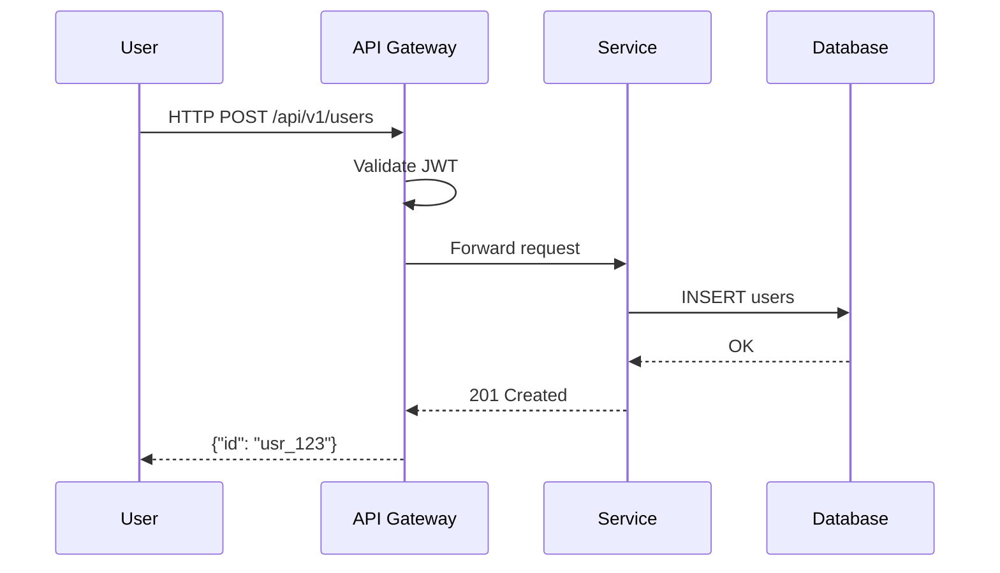

# Docs-as-Code Implementation Guide

A veteran's playbook for implementing a docs-as-code pipeline: repository structure, CI/CD automation, prose linting, diagram generation, code snippet management, versioning, and internationalization.

---

## Repository Setup

### Directory Structure

```
my-project/
├── docs/                        # Documentation root
│   ├── guides/                  # How-to guides and tutorials
│   │   ├── getting-started.md
│   │   ├── authentication.md
│   │   ├── deployment.md
│   │   └── monitoring.md
│   ├── api/                     # Auto-generated API reference
│   │   ├── openapi.yaml         # OpenAPI spec (source of truth)
│   │   └── reference/           # Generated from CI
│   ├── architecture/            # ADRs, data models, C4 diagrams
│   │   ├── adr-001-use-postgres.md
│   │   ├── adr-002-message-queue.md
│   │   └── system-context.puml
│   ├── runbooks/                # Operational docs per service
│   │   ├── deployment.md
│   │   ├── rollback.md
│   │   └── incident-response.md
│   ├── contributing.md          # For docs contributors
│   ├── style-guide.md           # Writing style enforced by Vale
│   └── overview.md              # Landing page
├── .github/
│   ├── workflows/
│   │   └── docs.yml             # CI/CD pipeline for docs
│   └── CODEOWNERS               # Docs ownership
├── .vale.ini                    # Vale prose linter config
├── .vale/                       # Custom Vale styles
├── cspell.json                  # Spell checker config
├── sidebars.js                  # Docusaurus sidebar config
└── docusaurus.config.js         # Docusaurus config
```

### Frontmatter Convention

Every documentation page must include this frontmatter:

```yaml
---
title: Deploy to Production
description: How to deploy your application to the production environment using GitHub Actions.
sidebar_position: 3
tags: [deployment, production, ci-cd]
last_reviewed: 2026-06-15
---

# Deploy to Production
```

- **title** (required): Page title, used in `<title>`, search results, sidebar.
- **description** (required): 1-2 sentences. Used for SEO meta description and search snippets.
- **sidebar_position** (required): Integer. Controls order in sidebar navigation.
- **tags** (optional): Array of strings. Used for filtering and related content.
- **last_reviewed** (recommended): ISO date. Used for freshness automation.

### .gitignore for Docs

Add to `.gitignore` to exclude build artifacts:

```gitignore
# Docs build output
/build
/.docusaurus
/node_modules

# Auto-generated API docs (regenerated in CI)
docs/api/reference/

# Translation artifacts
/i18n/*/docusaurus-plugin-content-docs/
```

---

## CI/CD Pipeline

### Complete GitHub Actions Workflow for Docusaurus

```yaml
# .github/workflows/docs.yml
name: Docs CI/CD

on:
  pull_request:
    paths:
      - 'docs/**'
      - 'sidebars.js'
      - 'docusaurus.config.js'
      - '.vale.ini'
      - '.vale/**'
      - 'cspell.json'
  push:
    branches: [main]
    paths:
      - 'docs/**'
      - 'sidebars.js'
      - 'docusaurus.config.js'
  schedule:
    - cron: '0 6 * * 0'  # Weekly: Sunday 6am UTC

env:
  NODE_VERSION: 20

concurrency:
  group: docs-${{ github.ref }}
  cancel-in-progress: true

jobs:
  quality:
    name: Lint & Validate
    runs-on: ubuntu-latest
    steps:
      - uses: actions/checkout@v4

      - name: Setup Node.js
        uses: actions/setup-node@v4
        with:
          node-version: ${{ env.NODE_VERSION }}
          cache: npm

      - name: Install dependencies
        run: npm ci

      - name: Prose linting (Vale)
        uses: errata-ai/vale-action@v2
        with:
          files: docs/
          config: .vale.ini
        env:
          GITHUB_TOKEN: ${{ secrets.GITHUB_TOKEN }}

      - name: Markdown formatting
        run: npx markdownlint-cli2 "docs/**/*.md" "docs/**/*.mdx" --config .markdownlint.json

      - name: Spell check
        run: npx cspell "docs/**/*.md" "docs/**/*.mdx" --no-progress

      - name: Frontmatter validation
        run: node scripts/check-frontmatter.mjs

      - name: Internal link check (build)
        run: npx docusaurus build
        env:
          NODE_OPTIONS: --max-old-space-size=4096

      - name: Validate code snippets
        run: node scripts/validate-snippets.mjs

  preview:
    name: Deploy Preview
    needs: quality
    if: github.event_name == 'pull_request'
    runs-on: ubuntu-latest
    steps:
      - uses: actions/checkout@v4

      - name: Setup Node.js
        uses: actions/setup-node@v4
        with:
          node-version: ${{ env.NODE_VERSION }}
          cache: npm

      - run: npm ci

      - name: Build site
        run: npm run build
        env:
          NODE_OPTIONS: --max-old-space-size=4096

      - name: Deploy to Netlify preview
        uses: nwtgck/actions-netlify@v2
        with:
          publish-dir: ./build
          deploy-message: "Preview: ${{ github.event.pull_request.title }}"
          github-token: ${{ secrets.GITHUB_TOKEN }}
          enable-commit-comment: false
          github-deployment-comment: true
          alias: pr-${{ github.event.number }}

  production:
    name: Build & Deploy
    needs: quality
    if: github.ref == 'refs/heads/main'
    runs-on: ubuntu-latest
    steps:
      - uses: actions/checkout@v4

      - name: Setup Node.js
        uses: actions/setup-node@v4
        with:
          node-version: ${{ env.NODE_VERSION }}
          cache: npm

      - run: npm ci

      - name: Build production site
        run: npm run build
        env:
          NODE_OPTIONS: --max-old-space-size=4096

      - name: Deploy to production
        uses: nwtgck/actions-netlify@v2
        with:
          publish-dir: ./build
          production-deploy: true
          production-branch: main
          github-token: ${{ secrets.GITHUB_TOKEN }}

      - name: Trigger Algolia reindex
        run: |
          curl -X POST \
            -H "Authorization: Bearer ${{ secrets.ALGOLIA_API_KEY }}" \
            "https://crawler.algolia.com/api/1/crawlers/${{ secrets.ALGOLIA_CRAWLER_ID }}/reindex"

  external-links:
    name: Check External Links
    if: github.event_name == 'schedule'
    runs-on: ubuntu-latest
    steps:
      - uses: actions/checkout@v4

      - name: Check external links
        uses: lycheeverse/lychee-action@v1
        with:
          args: >
            --config .lychee.toml
            --format markdown
            --output link-check-report.md
            docs/
        env:
          GITHUB_TOKEN: ${{ secrets.GITHUB_TOKEN }}

      - name: Create issue if broken links found
        if: failure()
        uses: actions/github-script@v7
        with:
          script: |
            const fs = require('fs');
            const report = fs.readFileSync('link-check-report.md', 'utf8');
            await github.rest.issues.create({
              owner: context.repo.owner,
              repo: context.repo.repo,
              title: 'Broken external links found in docs',
              body: report,
              labels: ['docs', 'bug']
            });
```

### Pipeline Stages

1. **Lint & Validate** (on PR + push to main): Vale prose, markdownlint, cspell, frontmatter validation, internal link check (via `docusaurus build`), code snippet validation.
2. **Deploy Preview** (on PR): Build site, deploy to Netlify preview, comment preview URL on PR.
3. **Build & Deploy** (on push to main): Build production site, deploy to Netlify/Vercel/GitHub Pages, trigger Algolia reindex.
4. **Check External Links** (weekly schedule): Slow external HEAD requests run weekly. Creates an issue if broken links found.

### Preview Deployment

- **Netlify**: `nwtgck/actions-netlify` action creates per-PR deploy previews. URL pattern: `https://pr-42--docs-preview.netlify.app`.
- **Vercel**: Automatically creates preview deployments when connected to the GitHub repo.
- **GitHub Pages**: Deploy to `gh-pages` branch. Use `actions/deploy-pages` for previews.

### Broken Link Checking

- **Internal (build-time)**: Set `onBrokenLinks: 'error'` in `docusaurus.config.js`. The build fails if any internal link is broken.
- **External (scheduled)**: `lychee` checks external links weekly. Configured via `.lychee.toml`:
  ```toml
  # .lychee.toml
  maxConcurrency = 8
  timeout = 10
  retryWaitMin = 1
  retryWaitMax = 5
  accept = ["200", "301", "302"]
  exclude = ["http://localhost:3000", "https://github.com/myorg/myrepo/issues/*"]
  ```

---

## Vale Configuration

### .vale.ini

```ini
# .vale.ini
StylesPath = .vale/styles
MinAlertLevel = warning

[*.md]
BasedOnStyles = Vale, Google, write-good, Docs

# Disable rules that don't fit
Vale.Repetition = NO
write-good.E-Prime = NO
write-good.So = NO
write-good.ThereIs = NO
write-good.TooWordy = NO
write-good.Weasel = NO

[*.mdx]
BasedOnStyles = Vale, Google, write-good, Docs
# MDX has JSX syntax which triggers false positives
Vale.Spelling = NO
write-good.Passive = NO
```

### Custom Style: Terminology

```yaml
# .vale/styles/Docs/Terminology.yml
extends: substitution
message: "Use '%s' instead of '%s'"
level: error
scope: text
swap:
  Github: GitHub
  Gitlab: GitLab
  "log in": login
  "sign in": login
  javascript: JavaScript
  typescript: TypeScript
  nodejs: Node.js
  reactjs: React
  "e\\.g\\.": for example
  "i\\.e\\.": that is
```

### Custom Style: Tone (Avoid Weak Language)

```yaml
# .vale/styles/Docs/Strong.yml
extends: existence
message: "Avoid '%s'. Use direct, confident language."
level: warning
scope: text
ignorecase: true
tokens:
  - simply
  - just
  - easy
  - obviously
  - clearly
  - basically
  - actually
  - of course
  - it's that simple
  - as everyone knows
```

### CI Integration with Vale

Vale runs as a required GitHub Actions check. PRs with Vale errors are blocked from merging. Warnings are advisory:

```yaml
- name: Vale Lint
  uses: errata-ai/vale-action@v2
  with:
    files: docs/
    config: .vale.ini
  env:
    GITHUB_TOKEN: ${{ secrets.GITHUB_TOKEN }}
```

For local development, add a pre-commit hook:

```yaml
# .pre-commit-config.yaml
repos:
  - repo: https://github.com/errata-ai/vale
    rev: v3.0.0
    hooks:
      - id: vale
        args: ['--config=.vale.ini', 'docs/']
```

---

## Diagram Pipeline

### Mermaid

Mermaid renders natively in Docusaurus, VitePress, and GitHub. No build step needed.



**CI Validation**: Use `mermaid-syntax-check` or `@mermaid-js/mermaid-cli` for syntax validation:

```bash
npx @mermaid-js/mermaid-cli docs/diagrams/sequence.mmd -o /dev/null
```

### PlantUML

PlantUML requires a renderer. Use a Docker-based CI step:

```yaml
- name: Render PlantUML
  run: |
    docker run --rm -v $PWD:/docs ghcr.io/plantuml/plantuml \
      -tsvg /docs/docs/diagrams/*.puml
    mv docs/diagrams/*.svg docs/static/img/diagrams/
```

### Structurizr DSL (C4 Model)

```c4
workspace {
  model {
    user = person "Developer" "Writes code and deploys"
    system = softwareSystem "MyApp" "The application"
    user -> system "Deploys using CI/CD"
  }
  views {
    systemContext system "SystemContext" {
      include *
      autoLayout
    }
  }
}
```

Render using `structurizr-cli`:
```bash
docker run --rm -v $PWD:/repo structurizr/cli \
  structurizr-cli export -w /repo/docs/diagrams/workspace.dsl -f mermaid -o /repo/docs/diagrams/
```

---

## Code Snippet Management

### Embedding from Source Files (Docusaurus)

Reference code blocks from actual source files to ensure they compile:

```mdx
import CodeBlock from '@theme/CodeBlock';
import CreateUserExample from '!!raw-loader!@site/examples/create-user.ts';

<CodeBlock language="typescript" title="examples/create-user.ts">
  {CreateUserExample}
</CodeBlock>
```

This guarantees the snippet is always up-to-date and compiles with the codebase.

### CI Validation: Extract and Type-Check

```js
// scripts/validate-snippets.mjs
import { glob } from 'glob';
import { execSync } from 'child_process';
import fs from 'fs';
import path from 'path';

const files = await glob('docs/**/*.{md,mdx}');
const tempDir = '/tmp/doc-snippets';
fs.mkdirSync(tempDir, { recursive: true });

for (const file of files) {
  const content = fs.readFileSync(file, 'utf8');
  const codeBlocks = content.match(/```(\w+)\n([\s\S]*?)```/g) || [];

  for (const block of codeBlocks) {
    const lang = block.match(/```(\w+)/)?.[1];
    const code = block.replace(/```\w+\n/, '').replace(/```$/, '').trim();
    if (!code || code.includes('$ ') || code.includes('// ...')) continue;

    const filename = path.join(tempDir, `snippet-${Date.now()}`);
    switch (lang) {
      case 'ts':
      case 'typescript':
        fs.writeFileSync(`${filename}.ts`, code);
        try { execSync(`npx tsc --noEmit --lib ES2020,DOM --strict ${filename}.ts`, { stdio: 'pipe' }); }
        catch (e) { console.error(`TypeScript error in ${file}:`, e.stderr.toString()); process.exitCode = 1; }
        break;
      case 'py':
      case 'python':
        fs.writeFileSync(`${filename}.py`, code);
        try { execSync(`python3 -m py_compile ${filename}.py`, { stdio: 'pipe' }); }
        catch (e) { console.error(`Python error in ${file}:`, e.stderr.toString()); process.exitCode = 1; }
        break;
    }
  }
}
```

### Doctest Approach

For Python docs, use pytest to discover and run doctests embedded in documentation:

```bash
# In CI
pytest --doctest-glob='docs/**/*.md' --doctest-modules
```

For TypeScript, use `tsdoc` with embedded test assertions that run in CI.

---

## Versioning Setup

### Docusaurus Versioning

```bash
# Create a versioned snapshot
npx docusaurus docs:version v2.0.0
npx docusaurus docs:version v1.5.0
```

This creates `versioned_docs/version-v2.0.0/` and `versioned_docs/version-v1.5.0/`.

### Version Configuration

```js
// docusaurus.config.js
module.exports = {
  presets: [
    [
      'classic',
      {
        docs: {
          lastVersion: 'current',
          versions: {
            current: {
              label: '2.x (latest)',
              path: 'latest',
            },
            'v2.0.0': {
              label: '2.0.0',
              path: 'v2.0.0',
            },
            'v1.5.0': {
              label: '1.5.x (maintained)',
              path: 'v1.5.0',
            },
          },
        },
      },
    ],
  ],
  themeConfig: {
    navbar: {
      items: [
        {
          type: 'docsVersionDropdown',
          position: 'right',
          dropdownItemsAfter: [
            {
              type: 'html',
              value: '<hr class="dropdown-separator">',
            },
            {
              href: '/docs/next/intro',
              label: 'Next (unreleased)',
            },
          ],
        },
      ],
    },
  },
};
```

### Version Dropdown in Navbar

The `docsVersionDropdown` type renders a dropdown in the navbar. Each version shows:
- Version label (e.g., "2.x (latest)")
- Version path (e.g., "/docs/latest/")
- A separator and link to "Next (unreleased)" for the main branch

### Maintenance Policy Automation

```yaml
# .github/workflows/archive-old-versions.yml
name: Archive Old Doc Versions
on:
  schedule:
    - cron: '0 0 1 * *'  # Monthly

jobs:
  check-versions:
    runs-on: ubuntu-latest
    steps:
      - uses: actions/checkout@v4
      - name: Check version ages and add banners
        run: |
          node scripts/check-version-ages.mjs
      - name: Create PR if changes
        uses: peter-evans/create-pull-request@v5
        with:
          title: 'docs: archive outdated doc versions'
          body: 'Automated version archiving. Older versions now have deprecation banners.'
```

```js
// scripts/check-version-ages.mjs
// Reads version metadata, checks age against policy,
// adds deprecation banners to versions outside maintenance window.
```

---

## Internationalization

### Docusaurus i18n Setup

```bash
# Initialize a locale
npx docusaurus write-translations --locale fr
npx docusaurus write-translations --locale zh-CN
npx docusaurus write-translations --locale ar  # Arabic (RTL)
```

This extracts translatable strings to `i18n/fr/`, `i18n/zh-CN/`, `i18n/ar/`.

### docusaurus.config.js i18n Configuration

```js
// docusaurus.config.js
module.exports = {
  i18n: {
    defaultLocale: 'en',
    locales: ['en', 'fr', 'zh-CN', 'ar'],
    localeConfigs: {
      en: { label: 'English', direction: 'ltr' },
      fr: { label: 'Francais', direction: 'ltr' },
      'zh-CN': { label: '中文', direction: 'ltr' },
      ar: { label: 'العربية', direction: 'rtl' },
    },
  },
};
```

### Translation Workflow

1. **Extract**: Run `docusaurus write-translations --locale <locale>` to generate translation JSON files.
2. **Translate**: Send translation JSON and markdown files to Crowdin, GitLocalize, or translators.
3. **Review**: Translators review within the translation platform.
4. **Merge**: Pull translated content back into the repo under `i18n/<locale>/`.
5. **Deploy**: CI builds and deploys all locales. Each locale is a separate sub-site.

### Crowdin Integration

```yaml
# .github/workflows/crowdin.yml
name: Crowdin Sync
on:
  push:
    branches: [main]
    paths: ['i18n/**', 'docs/**']

jobs:
  sync:
    runs-on: ubuntu-latest
    steps:
      - uses: actions/checkout@v4
      - name: Crowdin Sync
        uses: crowdin/github-action@v1
        with:
          upload_sources: true
          download_translations: true
          push_translations: true
          create_pull_request: true
        env:
          GITHUB_TOKEN: ${{ secrets.GITHUB_TOKEN }}
          CROWDIN_PROJECT_ID: ${{ secrets.CROWDIN_PROJECT_ID }}
          CROWDIN_PERSONAL_TOKEN: ${{ secrets.CROWDIN_PERSONAL_TOKEN }}
```

### RTL Support

For Arabic, Hebrew, Persian, Urdu, set `direction: 'rtl'` in the locale config. Docusaurus automatically:
- Mirrors the layout (sidebar on right, etc.)
- Flips icons and arrows
- Adjusts text alignment

Custom CSS must be RTL-aware using logical properties:

```css
/* Use logical properties instead of physical */
.diagram-wrapper {
  margin-inline-start: 0;
  padding-inline-end: 1rem;
}
```

### Locale-Specific Content

```yaml
# docs/guides/deployment.md
---
title: Deploy to Production
description: How to deploy your application to production.
---
```

```markdown
<!-- i18n/fr/docs/guides/deployment.md -->
---
title: Déploiement en production
description: Comment déployer votre application en production.
---

# Déploiement en production
```

Untranslated pages automatically fall back to English with a banner:

> "This page is not yet available in Francais."

---

## Additional Resources

- [Docusaurus Documentation](https://docusaurus.io/docs)
- [Vale Documentation](https://vale.sh/docs/)
- [Crowdin Docusaurus Integration](https://docusaurus.io/docs/i18n/crowdin)
- [Netlify Deploy Previews](https://docs.netlify.com/site-deploys/deploy-previews/)
- [Lychee Link Checker](https://lychee.cli.rs/)
