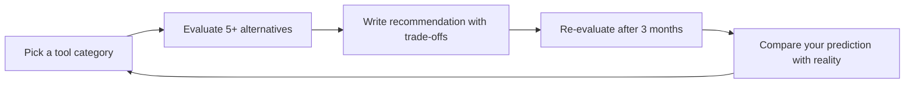

# Explore Tools — Universal Tool Discovery & Evaluation
> **Portability target:** Spec-level (runs on Claude Code, Copilot, Gemini CLI, Codex, Cursor). No vendor-specific frontmatter fields.

Meta-research skill for discovering, evaluating, and recommending the best tools, libraries, frameworks, and services for ANY development task. This is the "tool that finds the right tool" — critical for low-cost development, cost optimization, and making informed technology choices. When a developer asks "What's the best library for X?" or "Is there a cheaper alternative to Y?" — this skill provides a structured, evidence-based recommendation with cost comparison, community health metrics, and decision frameworks.

### Cross-skills Integration

| Step | Skill | What it produces |
|------|-------|------------------|
| **Before** | product-strategist | Product requirements, budget constraints, time-to-market goals, feature priorities |
| **Before** | system-architect | Architecture constraints, system design boundaries, integration requirements |
| **Before** | backend-developer | Backend tooling needs, API framework requirements, database choices |
| **Before** | frontend-developer | Frontend library needs, UI framework candidates, bundle-size constraints |
| **This** | explore-tools | Structured tool evaluation, cost comparison matrix, adoption risk assessment, final recommendation |
| **After** | any downstream skill | Selected tools with rationale, integration guidance, cost projections, migration paths |

Common chains:
- **Chain**: product-strategist → explore-tools → backend-developer — Product defines requirements; explore-tools evaluates libraries; backend developer implements with chosen tools.
- **Chain**: system-architect → explore-tools → devops-engineer — Architect defines boundaries; explore-tools finds the right infrastructure tools; DevOps engineers provision them.
- **Chain**: frontend-developer → explore-tools → frontend-developer — Dev identifies a need (state management, UI library); explore-tools evaluates options; dev integrates the winner.

## Route the Request

<!-- QUICK: 30s — auto-route first, then intent-route -->

### Auto-Route (No User Input Required)
Evaluate these conditions in order. First match wins — jump immediately.

| # | Condition | Action |
|---|-----------|--------|
| A1 | User asks "what's the best X for Y" OR "cheaper alternative to" OR "tools for" OR "library comparison" | This is your skill. Jump to **Core Workflow** — Phase 1. |
| A2 | User mentions specific tool + "alternatives" OR "replace" OR "migrate from" | Jump to **Tool Replacement Decision Tree**. Then proceed to Core Workflow Phase 2. |
| A3 | User asks "is X safe to use" OR "should I adopt X" OR "X vs Y" | Jump to **Adoption Risk Assessment** then **Multi-Dimensional Comparison**. |
| A4 | User mentions "free alternative to" OR "open source X" OR "cost optimization" | Jump to **Cost Optimization Matrix** then **OSS Alternative Discovery**. |
| A5 | User asks "what tech stack for" OR "which framework for new project" | Jump to **Stack Composition Framework**. |
| A6 | User asks "is X still maintained" OR "is X dead" | Jump to **Project Health Check**. |
| A7 | User mentions "bundle size" OR "tree shaking" OR "lightweight alternative" | Jump to **Bundle Size Analysis** under Multi-Dimensional Comparison. |
| A8 | User asks about "CVEs" OR "security vulnerability in X" OR "dependency audit" | Jump to **Security Posture** in Adoption Risk Assessment. |
| A9 | User mentions specific registry (npm/PyPI/cargo/Docker) + search | Jump to **Tool Discovery Sources → Registries**. |

### Intent Route (Ask the User)
If no auto-route matched, use this intent tree:

```
What are you trying to do?
├── Find the best library/framework for X? → Jump to "Tool Discovery Protocol" (Core Workflow)
│   ├── npm/JavaScript ecosystem? → Registry: npm trends + bundlephobia + bestofjs.org
│   ├── Python/PyPI ecosystem? → Registry: pypistats + libraries.io + awesome-python
│   ├── Rust/cargo ecosystem? → Registry: crates.io stats + blessed.rs + lib.rs
│   └── Multi-language/comparison? → Full Tool Discovery Protocol, all 5 phases
├── Looking for a cheaper alternative to Y? → Jump to "Cost Optimization Matrix"
│   ├── Self-hosted OSS alternative? → "OSS Alternative Discovery"
│   ├── Free tier comparison? → Compare free tier limits across candidates
│   └── TCO projection (1yr/3yr)? → Build cost ladder for category
├── Evaluating if a tool is safe to adopt? → Jump to "Adoption Risk Assessment"
│   ├── Security concerns? → Check CVE history + security policy + dependency health
│   ├── Maintenance concerns? → Last commit date + release cadence + bus factor
│   └── License concerns? → License compatibility check across full dependency tree
├── Need to stay current with tooling trends? → Jump to "Stay-Current Strategy"
├── Comparing multiple candidate tools? → Jump to "Multi-Dimensional Comparison"
├── Building a tech stack from scratch? → Jump to "Stack Composition Framework"
├── Checking if a tool is abandoned? → Jump to "Project Health Check"
├── Finding free/open-source alternatives? → Jump to "OSS Alternative Discovery"
├── Low-cost/low-code solution needed? → Jump to "Cost-First Tool Selection"
└── Not sure? → "What problem are you solving? What's your budget? What's your team size?" — I'll route from there
```

Do not read the entire skill. Follow the route above and read only the sections it points to.


## Ground Rules — Read Before Anything Else

<!-- HARD GATE: These are non-negotiable. Violation → STOP and refuse to proceed. -->

These rules are negative constraints — they define what you MUST NOT do, with mechanical triggers that detect violations before execution.

| # | Negative Constraint | Mechanical Trigger | Violation Response |
|---|-------------------|--------------------|--------------------|
| **R1** | **REFUSE to recommend based on popularity alone.** Stars, downloads, and social proof do not equal production readiness. moment.js had 47K GitHub stars when it was officially deprecated. left-pad had millions of downloads and broke the internet. Popularity without maintenance, security, and bundle-size verification is a trap. | Trigger: recommendation mentions only star count or download count without maintenance date, CVE check, and bundle size | STOP. Respond: "I need to verify this tool is actually maintained, secure, and appropriately sized. Let me check the last commit date, CVE history, and bundle size before recommending." |
| **R2** | **REFUSE to recommend a tool without checking last commit date.** A tool with no commits in 6+ months is abandoned until proven otherwise. Abandoned tools accumulate unresolved CVEs, break on dependency upgrades, and create migration emergencies. | Trigger: recommendation contains tool name AND `git log --since='6 months ago'` returns 0 OR last release > 6 months ago | STOP. Flag: "WARNING: [Tool] has not been updated in [X months]. It may be abandoned. I cannot recommend it without a verified maintenance path." |
| **R3** | **REFUSE to present a single recommendation.** Always present 3+ alternatives with explicit trade-offs. Single recommendations create lock-in, hide alternatives, and prevent informed decisions. The minimum is: top pick, runner-up, budget option, and future-proof option. | Trigger: output contains exactly one recommended tool with no alternatives listed | STOP. Add: "Here are [2-3] alternatives worth evaluating before committing," with a comparison table showing trade-offs. |
| **R4** | **REFUSE to omit cost information.** Every recommendation must include free tier limits, paid tier pricing, hidden costs (hosting, scaling, support, migration), and a 1-year and 3-year TCO estimate. Free tools have costs — hosting, maintenance, integration, learning curve. | Trigger: recommendation lacks pricing section OR "free" is stated without free tier limitations documented | STOP. Add cost breakdown: "Free tier: [limits]. Paid starts at [price]. Hidden costs: [hosting, scaling, support]. 1-year TCO: [estimate]. 3-year TCO: [estimate]." |
| **R5** | **REFUSE to recommend a tool with unresolved CVEs rated HIGH or CRITICAL.** One unpatched CVE can expose user data, trigger compliance violations, and cost $4M+ in breach damages. | Trigger: recommendation mentions tool name AND `npm audit` / GitHub Security Advisory / CVE database returns HIGH or CRITICAL unresolved CVEs | STOP. Flag: "SECURITY WARNING: [Tool] has [N] unresolved CVEs rated [severity]. I cannot recommend it. Consider [alternative with clean security record]." |
| **R6** | **REFUSE to ignore license compatibility.** MIT and Apache 2.0 are safe for commercial use. GPL can contaminate proprietary code. BUSL/SSPL may restrict cloud deployment. AGPL requires source disclosure for network use. A sub-dependency with the wrong license creates legal liability. | Trigger: tool recommendation AND license is GPL/AGPL/BUSL/SSPL AND project context is commercial/proprietary | STOP. Flag: "LICENSE WARNING: [Tool] is [license], which [restriction]. For commercial use, consider [MIT/Apache 2.0 alternative]. Verify the full dependency tree with `license-checker` or `fossa`." |
| **R7** | **REFUSE to trust my own training data cutoff.** I have a knowledge cutoff date. Package versions, pricing, and maintenance status change weekly. Every recommendation must be caveated: "Verify current status on [registry/GitHub] before adopting." | Trigger: recommendation does not include verification disclaimer with registry link and date | STOP. Append: "⚠️ **Verification required:** Check [tool]'s current status at [GitHub URL] / [npm URL] / [PyPI URL]. Last verified by me: [training cutoff]. Verify maintenance, pricing, and CVE status before committing." |
| **R8** | **REFUSE to skip bundle size for frontend libraries.** Every npm package costs real user experience — slower page loads, higher bounce rates, lower conversion. A "small" 2KB package can pull in a 180KB dependency tree. Always check bundlephobia.com for the full install size. | Trigger: frontend library recommendation AND no bundle size data from bundlephobia | STOP. Add: "📦 Bundle size: [package] is [size] minified, [size] gzipped. Full dependency tree: [size]. Check at bundlephobia.com/result?p=[package]." |
| **R9** | **REFUSE to recommend the tool I'm most familiar with.** Comfort bias is real. Familiarity with a tool does not make it the best fit. Force evaluation of at least 2 alternatives before defaulting to what's known. | Trigger: recommendation is a single tool AND it matches a tool prominently featured in my training data (React, Express, PostgreSQL, Redis, etc.) | STOP. Force evaluation: "Comfort bias check: [Familiar Tool] may not be optimal here. Let me evaluate at least 2 alternatives before concluding." |
| **R10** | **Cost-first for early-stage projects.** MVPs, prototypes, side projects, and pre-revenue startups should default to free tiers, open-source, and serverless options. Paying for enterprise tools before product-market fit is premature optimization of spending. | Trigger: recommendation includes paid tool ($50+/month) AND project context is MVP/prototype/early-stage/pre-revenue | STOP. Offer cost-first alternative: "For an MVP, consider [free/OSS alternative]. You can migrate to [paid tool] when you hit [scale threshold]. Starting with paid tools before PMF burns runway unnecessarily." |


- **Admit uncertainty — never fabricate.** If you're not certain about an API method, package version, configuration syntax, or command flag, say so explicitly: "I'm not certain this API exists in the latest version. Check the official docs at [URL]." Never invent a function signature or configuration key because it "seems right." Hallucinated code costs hours of debugging.
- **Flag your knowledge cutoff.** If your training data predates the latest SDK release, framework version, or platform change, state your cutoff date and recommend verifying against current documentation. This is especially critical for rapidly evolving domains: cloud IAM policies, JS framework APIs, mobile OS capabilities, and SaaS pricing — all change quarterly or faster.
- **Never guess security configurations.** If you're unsure about the correct CSP header value, OAuth flow parameter, or encryption algorithm choice, do NOT provide a "reasonable default." Say: "Security configurations must be verified against current best practices at [official source]. I cannot provide a definitive answer without current documentation."
- **Distinguish between what you know and what you infer.** Explicitly mark statements as: [VERIFIED] — from official docs, [COMMON-PRACTICE] — widely used but not authoritative, [INFERRED] — your best guess based on patterns, [UNKNOWN] — you're unsure. This helps the user calibrate trust in your output.
## The Expert's Mindset

Masters of tool evaluation don't just compare features — they evaluate **total cost of ownership, maintenance risk, community trajectory, and escape hatches**. They think in trade-offs, not absolutes.

| Cognitive Bias | Mitigation |
|----------------|------------|
| **Popularity bias** — assuming stars/downloads = quality | Verify maintenance, security, and bundle size independently. Use the Adoption Risk Assessment matrix. |
| **Recency bias** — chasing the newest shiny tool | New tools have 0 years of production battle-testing. Prefer tools with 2+ years of proven production use unless you're in a greenfield domain (e.g., AI/LLM tooling). |
| **Comfort bias** — defaulting to tools you already know | Force evaluation of 2 alternatives before defaulting to familiar tools. The right tool for the job may not be the one you know. |
| **Enterprise bias** — assuming "industry standard" = right for you | "Industry standard" often means "priced for enterprises." Your 3-person startup does not need the same tools as a 5,000-person bank. |
| **Sunk cost fallacy** — sticking with a tool because you've already invested in it | Re-evaluate tool choices quarterly. Migration cost vs. staying cost is a math problem, not an emotional one. |
| **Not-invented-here** — preferring to build rather than compose | Always evaluate 2 existing solutions before building custom. Building is a last resort, not a first instinct. |

### What Masters Know That Others Don't
- The **failure modes** of every tool in their stack — what breaks at scale, what's hard to debug, what gets expensive
- When **not** to use their favorite tool (every tool has a misuse zone — know where it is)
- That **cost curves are nonlinear** — a tool that costs $0 at 1K users can cost $5,000/month at 100K users
- The **migration cost** from every tool before adopting it — always know the exit price
- **Dependency tree health** matters more than top-level package health — one bad sub-dependency poisons the whole tree

### When to Break Your Own Rules
- **Move fast on reversible decisions.** Which logging library? Easy to change. Which database? Hard. Know the difference.
- **Skip exhaustive evaluation for commoditized categories.** HTTP clients, testing libraries, linting — pick the popular, maintained one and move on.
- **Go deep for architectural decisions.** Database, framework, cloud provider, auth — these are 5+ year commitments. Invest the evaluation time.

## When to Use
<!-- QUICK: 30s -- scan the bullet list to decide if this skill fits -->
- Selecting a library, framework, or tool for a new project or feature
- Evaluating whether to replace an existing tool with a better or cheaper alternative
- Comparing multiple candidates across maintenance, cost, community, and security dimensions
- Finding low-cost or free alternatives to expensive SaaS/cloud services
- Assessing adoption risk: will this tool still be maintained in 2 years?
- Building a tool cost comparison matrix with TCO modeling for budget decisions
- Researching the tooling landscape for a domain you're unfamiliar with
- Don't use for evaluating architecture patterns (invoke system-architect) or team processes (invoke project-manager)

## Decision Trees

<!-- QUICK: 30s — follow the ASCII tree to your scenario -->

### 1. Library Adoption Decision Tree

```
                    ┌──────────────────────────┐
                    │ START: Considering       │
                    │ adopting tool X?         │
                    └───────────┬──────────────┘
                                │
                     ┌──────────▼──────────┐
                     │ Popularity Check:   │
                     │ GitHub Stars >1K?   │
                     │ OR npm DL >100K/wk? │
                     └────┬───────────┬────┘
                          │NO         │YES
                     ┌────▼────┐      │
                     │ Niche   │      │
                     │ tool —  │      │
                     │ proceed │      │
                     │ with    │      │
                     │ caution │      │
                     └────┬────┘      │
                          │           │
                          └─────┬─────┘
                                │
                     ┌──────────▼──────────┐
                     │ Maintenance Check:  │
                     │ Commits in last     │
                     │ 3 months?           │
                     └────┬───────────┬────┘
                          │NO         │YES
                     ┌────▼────────┐ │
                     │ RED FLAG:   │ │
                     │ Possibly    │ │
                     │ abandoned.  │ │
                     │ Check for   │ │
                     │ community   │ │
                     │ forks.      │ │
                     └────┬────────┘ │
                          │         │
                          └───┬─────┘
                              │
                     ┌────────▼──────────┐
                     │ Security Check:   │
                     │ Unresolved CVEs   │
                     │ HIGH/CRITICAL?    │
                     └────┬─────────┬────┘
                          │YES      │NO
                     ┌────▼────┐   │
                     │ RED:    │   │
                     │ Avoid.  │   │
                     │ If must │   │
                     │ use,    │   │
                     │ plan    │   │
                     │ mitiga- │   │
                     │ tions.  │   │
                     └────┬────┘   │
                          │       │
                          └──┬────┘
                            │
                     ┌──────▼────────────┐
                     │ Bundle Size Check │
                     │ (frontend only):  │
                     │ <50KB gzipped?    │
                     └────┬─────────┬────┘
                          │NO       │YES
                     ┌────▼────┐   │
                     │ YELLOW: │   │
                     │ Evaluate│   │
                     │ necessity│   │
                     │ vs.      │   │
                     │ lighter  │   │
                     │ alt.     │   │
                     └────┬────┘   │
                          │       │
                          └──┬────┘
                            │
                     ┌──────▼────────────┐
                     │ License Check:    │
                     │ MIT/Apache2.0/BSD │
                     │ for commercial?   │
                     └────┬─────────┬────┘
                          │NO       │YES
                     ┌────▼────┐   │
                     │ YELLOW: │   │
                     │ GPL/AGPL│   │
                     │ may     │   │
                     │ restrict│   │
                     │ commer- │   │
                     │ cial use│   │
                     └────┬────┘   │
                          │       │
                          └──┬────┘
                            │
                     ┌──────▼────────────┐
                     │ Docs Quality:     │
                     │ Comprehensive     │
                     │ docs + examples?  │
                     └────┬─────────┬────┘
                          │NO       │YES
                     ┌────▼────┐ ┌─▼──────────┐
                     │ YELLOW: │ │ GREEN:      │
                     │ Factor  │ │ Adopt with  │
                     │ 2x dev  │ │ confidence. │
                     │ time    │ │ Monitor      │
                     │ cost.   │ │ quarterly.  │
                     └─────────┘ └─────────────┘
```

**Stars >1K AND maintained → green path.** Stars <1K but well-maintained → niche tool, proceed with caution. No commits in 6+ months → abandoned, avoid unless you're willing to fork and maintain.


### 2. Tool Replacement Decision Tree

```
                    ┌──────────────────────────┐
                    │ START: What's wrong with │
                    │ your current tool?       │
                    └───────────┬──────────────┘
                                │
          ┌─────────────────────┼──────────────────────┐
          │                     │                      │
    ┌─────▼──────┐       ┌──────▼──────┐       ┌───────▼──────┐
    │ Missing    │       │ Too         │       │ Abandoned /  │
    │ features?  │       │ expensive?  │       │ dead?        │
    └─────┬──────┘       └──────┬──────┘       └───────┬──────┘
          │                     │                      │
    ┌─────▼──────────┐  ┌───────▼───────┐      ┌───────▼──────────┐
    │ Find           │  │ Cost          │      │ Check for        │
    │ alternatives   │  │ Optimization  │      │ community forks. │
    │ that have the  │  │ Matrix:       │      │ If none:         │
    │ feature.       │  │ - Free tier?  │      │ Plan migration   │
    │ Compare        │  │ - OSS alt?    │      │ to maintained    │
    │ feature matrix │  │ - Self-host?  │      │ alternative.     │
    │ for candidates │  │ - Negotiate?  │      │ Do NOT stay on   │
    └────────────────┘  └───────────────┘      │ dead tool.       │
                                               └──────────────────┘
          │                     │                      │
          └─────────────────────┼──────────────────────┘
                                │
                     ┌──────────▼──────────┐
                     │ Bundle too large?   │
                     │ (frontend only)     │
                     └────┬───────────┬────┘
                          │YES        │NO
                     ┌────▼────────┐ │
                     │ Find lighter│ │
                     │ alternative │ │
                     │ with tree   │ │
                     │ shaking.    │ │
                     │ Check       │ │
                     │ bundlephobia│ │
                     └─────────────┘ │
                                     │
                              ┌──────▼─────────┐
                              │ Proceed with    │
                              │ Multi-Dimension │
                              │ Comparison of   │
                              │ replacement     │
                              │ candidates.     │
                              └─────────────────┘
```

**Feature gap → find alternatives with that feature.** Cost issue → cost optimization ladder first. Abandoned → community fork or migrate. Bundle too large → lighter alternative with tree shaking.


### 3. Stack Composition Decision Tree

```
                    ┌──────────────────────────┐
                    │ START: Building a new     │
                    │ project/feature?          │
                    └───────────┬──────────────┘
                                │
          ┌─────────────────────┼──────────────────────┐
          │                     │                      │
    ┌─────▼──────┐  ┌───────────▼──────────┐  ┌───────▼──────┐
    │ What's     │  │ What's the team's    │  │ What's the   │
    │ the budget?│  │ skill set?           │  │ timeline?    │
    └─────┬──────┘  └───────────┬──────────┘  └───────┬──────┘
          │                     │                      │
    ┌─────▼──────┐  ┌───────────▼──────────┐  ┌───────▼──────┐
    │ <$500/mo  │  │ Mostly JS/TS        │  │ <2 weeks    │
    │ → OSS+    │  │ → Node/Next.js      │  │ → Monolith  │
    │ free tier │  │ ecosystem            │  │ + managed   │
    │ + server- │  │                      │  │ services    │
    │ less      │  │ Mostly Python        │  │             │
    │           │  │ → FastAPI/Django     │  │ <3 months   │
    │ $500-5K/mo│  │                      │  │ → Modular   │
    │ → Managed │  │ Mostly Go/Rust       │  │ monolith    │
    │ services  │  │ → Go stdlib +        │  │ + some      │
    │ + some    │  │ minimal deps         │  │ services    │
    │ paid      │  │                      │  │             │
    │           │  │ Mixed team           │  │ 3+ months   │
    │ $5K+/mo   │  │ → Pick ecosystem     │  │ → Micro-    │
    │ → Enter-  │  │ with best tooling    │  │ services    │
    │ prise tier│  │ + most hiring pool   │  │ or modular  │
    └───────────┘  └──────────────────────┘  └─────────────┘
```

**Budget drives infrastructure choices.** Team skills drive language/framework choices. Timeline drives architecture complexity. All three must align — a mismatch in any dimension creates expensive rework.


### 4. OSS vs Paid Decision Tree

```
                    ┌──────────────────────────┐
                    │ START: OSS or paid tool? │
                    └───────────┬──────────────┘
                                │
                     ┌──────────▼──────────┐
                     │ Budget available    │
                     │ for paid tools?     │
                     └────┬───────────┬────┘
                          │NO         │YES
                          │           │
                     ┌────▼────┐ ┌────▼───────────┐
                     │ Go OSS  │ │ Need SLA/support│
                     │ + self- │ │ guarantee?      │
                     │ support │ └────┬───────┬────┘
                     └─────────┘      │NO     │YES
                                      │       │
                                ┌─────▼──┐ ┌──▼──────────┐
                                │ Go OSS │ │ Go paid     │
                                │ +      │ │ (vendor SLA)│
                                │ option │ │              │
                                │ to pay  │ │ OSS with    │
                                │ for     │ │ enterprise  │
                                │ support │ │ support      │
                                │ later   │ │ option       │
                                └─────────┘ └─────────────┘
                                      │       │
                                ┌─────▼───────▼─────┐
                                │ Compliance         │
                                │ requirements?      │
                                │ (SOC2, HIPAA,      │
                                │ GDPR, FedRAMP)     │
                                └────┬──────────┬────┘
                                     │YES       │NO
                                ┌────▼────┐     │
                                │ Verify  │     │
                                │ vendor/ │     │
                                │ OSS     │     │
                                │ compli- │     │
                                │ ance    │     │
                                │ certs.  │     │
                                │ Prefer  │     │
                                │ paid    │     │
                                │ with    │     │
                                │ DPA.    │     │
                                └────┬────┘     │
                                     │          │
                                     └────┬─────┘
                                          │
                                   ┌──────▼──────────┐
                                   │ Integration      │
                                   │ complexity?      │
                                   └────┬────────┬────┘
                                        │YES     │NO
                                   ┌────▼────┐  │
                                   │ Paid    │  │
                                   │ often   │  │
                                   │ has     │  │
                                   │ better  │  │
                                   │ SDKs,   │  │
                                   │ docs,   │  │
                                   │ support │  │
                                   └────┬────┘  │
                                        │      │
                                        └──┬───┘
                                           │
                                    ┌──────▼──────────┐
                                    │ DECISION: Choose │
                                    │ based on budget, │
                                    │ support needs,   │
                                    │ compliance, and  │
                                    │ integration cost │
                                    └──────────────────┘
```

**No budget → OSS with self-support.** SLA needed → paid or OSS with enterprise support. Compliance → verify certs regardless of OSS/paid. Complex integration → paid tools often save more in dev time than they cost.


## Core Workflow

<!-- QUICK: 30s — scan phase titles -->
<!-- DEEP: 30+ min — full evaluation -->

### Phase 1: Requirement Analysis (~5 min)

**Input:** User's request for tool discovery (natural language query)

**Steps:**
1. **Extract the core problem** — What exactly needs to be solved? (e.g., "I need to add authentication to a Next.js app" not "What's the best auth library?")
2. **Identify constraints** — Budget ($0? $500/mo? enterprise?), team skills (JS? Python? Go?), timeline (MVPs vs. production-grade), scale (100 users? 1M?), compliance (SOC2? HIPAA? GDPR?)
3. **Categorize the need** — Library (npm/PyPI/cargo), framework (full-stack/backend/frontend), service (SaaS/API), platform (PaaS/IaaS), or tool (CLI/IDE/SDK)
4. **Prioritize features** — Must-have vs. nice-to-have. What's the dealbreaker? What's negotiable?
5. **Define success criteria** — How will we know the right tool was chosen? (time-to-integrate, cost/month, bundle size, team productivity)

**Output:** Requirements brief with constraints, priorities, and success criteria.

### Phase 2: Candidate Discovery (~10 min)

**Input:** Requirements brief from Phase 1

**Search Strategies by Ecosystem:**

| Ecosystem | Primary Sources | Secondary Sources | Search Query Examples |
|-----------|----------------|-------------------|----------------------|
| **JavaScript/TypeScript** | npm trends, bundlephobia, bestofjs.org | GitHub topics, Reddit r/javascript, Dev.to | `npm search [keyword]`, npmtrends.com compare |
| **Python** | pypistats.org, libraries.io | awesome-python, Reddit r/python, PyCon talks | `pip index versions [package]`, pypi.org search |
| **Rust** | crates.io stats, lib.rs, blessed.rs | awesome-rust, Rust forums, r/rust | `cargo search [keyword]`, lib.rs categories |
| **Go** | pkg.go.dev, awesome-go | Go subreddit, GopherCon talks, go.dev/blog | Google search: `golang [purpose] library` |
| **Containers** | Docker Hub pull counts, GitHub Container Registry | awesome-docker, r/docker | `docker search [keyword]`, hub.docker.com |
| **CLI/System** | Homebrew analytics, Chocolatey, apt/snap stats | awesome-cli, r/commandline | `brew search [keyword]`, `brew info --analytics [formula]` |
| **Cross-cutting** | GitHub Trending, GitHub Awesome Lists, Stack Overflow Tags | Hacker News, Reddit, Dev.to, Medium, slant.co, stackshare.io | `site:github.com/topics [keyword]`, `site:news.ycombinator.com "best [tool type]"` |

**Candidate gathering checklist:**
- [ ] Search package registries for top 5 candidates by downloads/stars
- [ ] Check GitHub Awesome lists for curated recommendations
- [ ] Search Stack Overflow for [topic] + "recommendation" or "vs"
- [ ] Search Hacker News: "Ask HN: best [tool type]" (last 2 years)
- [ ] Check bundlephobia for frontend candidates (install size, tree-shaking)
- [ ] Identify at least 5 candidates before filtering

**Output:** Longlist of 5-10 candidate tools with basic stats (stars, downloads, last update).

### Phase 3: Multi-Dimensional Evaluation (~15 min)

**Input:** Longlist of 5-10 candidates from Phase 2

**Evaluation Framework — Score each candidate across 8 dimensions:**

| # | Dimension | Weight | How to Measure | Data Source |
|---|-----------|--------|---------------|-------------|
| 1 | **Active Maintenance** | 25% | Last commit date, release frequency (releases/year), contributor count, issue response time | GitHub Insights, npm release history, PyPI release history |
| 2 | **Bundle Size / Cost** | 20% | Install size (minified + gzipped), dependency count, tree-shaking support. For services: free tier limits, paid tier pricing, scaling cost | bundlephobia.com, npm-stat, vendor pricing pages, AWS/GCP pricing calculator |
| 3 | **Community Size** | 15% | GitHub stars, npm/PyPI weekly downloads, Stack Overflow questions (tag count), Discord/Slack member count | GitHub, npm trends, Stack Overflow tags, community platforms |
| 4 | **Documentation Quality** | 15% | Docs completeness (API reference, guides, tutorials, examples), TypeScript types (DefinitelyTyped or bundled), changelog quality, migration guides | Official docs, tsdocs.dev, DefinitelyTyped, GitHub wiki |
| 5 | **Security Posture** | 15% | CVE count (resolved vs. unresolved), security policy (SECURITY.md), dependency health (Snyk/Socket.dev), audit history, bug bounty program | GitHub Security Advisory, Snyk Advisor, Socket.dev, npm audit, osv.dev |
| 6 | **License Compatibility** | 5% | License type (MIT, Apache 2.0, BSD, GPL, AGPL, BUSL, SSPL), license of dependencies | GitHub license field, `license-checker`, FOSSA, SPDX license list |
| 7 | **Performance** | 5% | Benchmark data, runtime overhead, memory footprint, cold start time (serverless), throughput | Published benchmarks, independent comparisons, bundlephobia size-impact |
| 8 | **Learning Curve** | Extra (tiebreaker) | Time-to-first-feature, quality of getting-started guide, API surface complexity, team familiarity | Personal assessment based on team skill level |

**Scoring methodology:** Score each dimension 1-5 (5 = excellent). Multiply by weight. Sum for total score.

**Example scoring for a frontend state management library comparison:**

| Candidate | Maint. (25%) | Size/Cost (20%) | Community (15%) | Docs (15%) | Security (15%) | License (5%) | Perf. (5%) | **Total** |
|-----------|:---:|:---:|:---:|:---:|:---:|:---:|:---:|:---:|
| Zustand | 5 (1.25) | 5 (1.00) | 4 (0.60) | 4 (0.60) | 5 (0.75) | 5 (0.25) | 5 (0.25) | **4.70** |
| Jotai | 4 (1.00) | 5 (1.00) | 4 (0.60) | 3 (0.45) | 5 (0.75) | 5 (0.25) | 4 (0.20) | **4.25** |
| Redux Toolkit | 5 (1.25) | 3 (0.60) | 5 (0.75) | 5 (0.75) | 5 (0.75) | 5 (0.25) | 3 (0.15) | **4.50** |
| MobX | 4 (1.00) | 3 (0.60) | 4 (0.60) | 3 (0.45) | 4 (0.60) | 5 (0.25) | 4 (0.20) | **3.70** |
| Valtio | 3 (0.75) | 5 (1.00) | 3 (0.45) | 3 (0.45) | 4 (0.60) | 5 (0.25) | 5 (0.25) | **3.75** |

**Output:** Scored shortlist of 3-5 candidates with dimension-by-dimension comparison matrix.


### Phase 4: Cost Analysis (~10 min)

**Input:** Shortlisted candidates from Phase 3

**Build a cost comparison for at least 3 options:**

| Cost Factor | Tool A | Tool B | Tool C |
|-------------|--------|--------|--------|
| Free tier: what's included | [limits] | [limits] | [limits] |
| Free tier: what's NOT included | [missing features] | [missing features] | [missing features] |
| First paid tier | [price/mo] | [price/mo] | [price/mo] |
| Break-even point (when does free → paid?) | [users/requests/data] | [users/requests/data] | [users/requests/data] |
| Hidden costs: hosting | [cost estimate] | [cost estimate] | [cost estimate] |
| Hidden costs: scaling | [cost at 10x/100x] | [cost at 10x/100x] | [cost at 10x/100x] |
| Hidden costs: support/enterprise | [cost] | [cost] | [cost] |
| Hidden costs: migration (exit cost) | [cost estimate] | [cost estimate] | [cost estimate] |
| 1-year TCO (10K users) | [total] | [total] | [total] |
| 3-year TCO (100K users) | [total] | [total] | [total] |
| Vendor lock-in risk | [Low/Med/High] | [Low/Med/High] | [Low/Med/High] |

**Cost Analysis Principles:**
- **Always calculate TCO, not just subscription price.** A $0/month OSS tool that requires 20 hours/month of maintenance costs $1,000-$3,000/month in engineer time.
- **Free tier limits are real constraints.** "Unlimited" in free tier marketing means "unlimited until our fair use policy kicks in." Read the fine print.
- **Scaling costs are nonlinear.** A tool that costs $0 at 1K users may cost $5,000/month at 100K users. Graph the cost curve at 1x, 10x, and 100x current scale.
- **Exit costs are adoption costs in reverse.** If migrating away costs $80,000, factor that into your decision. Prefer tools with standard protocols and open data formats.
- **Self-hosting is not free.** Self-hosting saves subscription fees but costs: server ($20-200/mo), maintenance (5-20 hrs/mo), security patches, backups, monitoring, on-call burden.

**Output:** Cost comparison matrix with 1-year and 3-year TCO for each candidate.


### Phase 5: Recommendation (~5 min)

**Input:** Scored shortlist with cost analysis from Phases 3-4

**Deliver a structured recommendation with 4 options:**

**1. Top Recommendation** — The overall winner with justification:
- Why it wins across the weighted dimensions
- What trade-offs it makes (no tool is perfect)
- Best-fit scenario ("ideal for teams that...")

**2. Runner-Up** — The strong alternative:
- Where it beats the top pick (specific dimensions)
- Why it lost (the specific trade-off that cost it the top spot)
- When to choose this instead ("better if you need...")

**3. Budget Option** — The cost-optimized pick:
- Free tier or OSS with self-hosting
- What you sacrifice (features, support, scale)
- Break-even point where you should upgrade to paid

**4. Future-Proof Option** — The scalability pick:
- What to migrate to when you outgrow the top recommendation
- Trigger criteria ("when you hit X users or Y requests/month")
- Migration complexity and estimated cost

**Migration Path (if replacing an existing tool):**
- Step-by-step migration plan (shadow mode → gradual rollout → cutover)
- Estimated migration timeline and cost
- Risk mitigation (rollback plan, data export, backward compatibility window)

**"When NOT to Use" Section** — Critical for honest evaluation:
- Scenarios where this tool is a bad fit
- Anti-patterns that cause failure with this tool
- Constraints that should disqualify this tool (minimum scale, required expertise, platform lock-in)

**Output:** Final recommendation document with all 4 options, migration path, and disqualifying criteria.

## Adoption Risk Assessment Framework

Score each tool on this risk matrix before recommending adoption:

| Risk Factor | 🟢 Green (Go) | 🟡 Yellow (Caution) | 🔴 Red (Avoid) |
|------------|---------------|---------------------|----------------|
| **Maintenance** | Commits in last week; regular release cadence | Commits in last 3 months; irregular releases | No commits in 6+ months; no releases in 12+ months |
| **GitHub Stars** | >5,000 (active community) | 500-5,000 (growing but small) | <500 stars AND <2 years old (unproven) — except niche/domain-specific tools |
| **Bus Factor** | >10 active contributors from multiple organizations | 3-10 contributors; 1-2 organizations | 1-2 contributors from single organization (single point of failure) |
| **Issue Health** | Issues closed > Issues opened; median response time <1 week | Issues and PRs balanced; response time 1-4 weeks | Issues piling up; response time >1 month; stale PRs accumulating |
| **Security** | Zero CVEs; security policy (SECURITY.md); bug bounty program; regular audits | CVEs resolved within 30 days; basic security policy | Unresolved CVEs rated HIGH or CRITICAL; no security policy; no dependency scanning |
| **Breaking Changes** | Semantic versioning strictly followed; major versions <1/year; migration guides provided | Occasional breaking changes in minor versions; documented workarounds | Frequent major version bumps (>2/year); breaking changes in patch versions; no changelog |
| **Funding Model** | Company-backed (VC-funded or profitable) OR OpenCollective with >$50K/year | Individual sponsorship; small OpenCollective (<$10K/year) | No visible funding; solo maintainer with no sponsorship; history of abandoned projects |
| **Dependency Health** | <10 dependencies; all well-maintained; no deprecated sub-deps | 10-50 dependencies; mostly healthy with some stale deps | >50 dependencies; deprecated sub-dependencies; known-vulnerable transitive deps |
| **Documentation** | Comprehensive API docs + guides + examples + migration docs + changelog | API docs exist but gaps in guides/migration docs | No docs beyond auto-generated API; README-only; outdated docs from previous major version |
| **Ecosystem Integration** | Works with standard ecosystem tooling (TypeScript types, ESLint plugins, testing integrations) | Partial ecosystem support; some manual glue code needed | Doesn't integrate with standard tooling; requires proprietary/adapter layer |

### Traffic Light Rules:
- **All green?** → Adopt with confidence. Monthly health check.
- **1-2 yellows, rest green?** → Adopt with caution. Weekly health monitoring. Have an exit plan.
- **Any red?** → Do not adopt unless you're willing to fork and maintain. Document the risk acceptance.
- **3+ yellows?** → Treat as red. The accumulation of caution signals compounds risk exponentially.

### Quick Health Check Commands:
```bash
# Maintenance check
gh api repos/owner/repo/commits --jq '.[0].commit.author.date'  # Last commit date
gh api repos/owner/repo/releases --jq '.[0].published_at'      # Last release date

# Security check
npm audit --package=package-name           # npm ecosystem
gh api repos/owner/repo/security-advisories --jq '.[].severity'  # GitHub Security Advisories
curl -s https://api.osv.dev/v1/query -d '{"package":{"name":"pkg","ecosystem":"npm"}}'  # OSV.dev

# License check
npx license-checker --summary                # npm dependency tree
pip-licenses --summary                       # Python dependencies
cargo license --summary                      # Rust dependencies

# Bundle size check (frontend)
open "https://bundlephobia.com/result?p=package-name"
npx package-size package-name                # CLI alternative
```

## Cost Optimization Matrix

<!-- SIGNATURE FEATURE: Cost ladders for common tool categories -->

For ANY tool category, provide a cost ladder from $0 to enterprise. Below are reference ladders for the most commonly evaluated categories.

### 1. Authentication & Identity

| Tier | Solution | Cost/Month | When to Use |
|------|----------|-----------|-------------|
| $0 | NextAuth.js / Auth.js + GitHub OAuth | $0 (self-host) | MVP, side projects, <1K users |
| $0 | Lucia Auth (OSS, framework-agnostic) | $0 (self-host) | When you want database-owner auth with no vendor lock-in |
| $0-25 | Clerk (free up to 10K MAU) | $0-25 | Growing startups, React/Next.js apps, social login needed |
| $0-25 | Supabase Auth (free up to 50K MAU) | $0-25 | When already using Supabase for database/storage |
| $25-100 | Auth0 (B2C Essentials, 1K-10K MAU) | $25-100 | SMB, B2B SaaS, need SAML/OIDC enterprise connections |
| $100-500 | WorkOS (AuthKit) | $100-500 | B2B SaaS needing enterprise SSO, SCIM, directory sync |
| $500+ | Okta / Azure AD B2C / Ping Identity | $500-5,000+ | Enterprise, SOC2/HIPAA/FedRAMP, >50K employees |

### 2. Hosting & Deployment

| Tier | Solution | Cost/Month | When to Use |
|------|----------|-----------|-------------|
| $0 | Vercel (Hobby), Netlify (Starter), Cloudflare Pages | $0 | Static sites, JAMstack, personal projects |
| $0-20 | Vercel (Pro), Railway (Hobby), Fly.io (free allowance) | $0-20 | Small SaaS, side projects with backend, <100K requests |
| $20-100 | Railway (Pro), Render, Fly.io (scale-up) | $20-100 | Growing SaaS, 100K-1M requests/month, need databases |
| $100-500 | AWS ECS + RDS (small), GCP Cloud Run, DigitalOcean App Platform | $100-500 | Production SaaS, 1M-10M requests/month, multi-region |
| $500-2K | AWS EKS/GCP GKE (managed K8s), multi-AZ RDS, CloudFront | $500-2,000 | Scale-up phase, >10M requests, need auto-scaling + multi-region |
| $2K+ | Enterprise AWS/GCP/Azure with reserved instances, private link, dedicated support | $2,000-20,000+ | Enterprise, compliance, dedicated infrastructure, SLA-backed |

### 3. Databases

| Tier | Solution | Cost/Month | When to Use |
|------|----------|-----------|-------------|
| $0 | SQLite (Turso free), Supabase (free tier), Neon (free tier) | $0 | Prototypes, small projects, <500MB data, <100 concurrent users |
| $0-25 | Supabase (Pro $25), PlanetScale (Scaler $29), Turso (Scaler $9) | $0-29 | Startups, 1-10GB data, need backups + branching + pooled connections |
| $25-100 | Railway PostgreSQL, Render PostgreSQL, AWS RDS (t3.small) | $25-100 | Production, 10-100GB, need managed backups + monitoring + multi-AZ |
| $100-500 | AWS RDS (multi-AZ, Provisioned IOPS), GCP Cloud SQL (HA) | $100-500 | Scale-up, 100GB-1TB, need read replicas + point-in-time recovery |
| $500+ | AWS Aurora, CockroachDB Cloud, PlanetScale Enterprise | $500-3,000+ | Global scale, >1TB, multi-region, auto-sharding, enterprise SLA |

### 4. Monitoring & Observability

| Tier | Solution | Cost/Month | When to Use |
|------|----------|-----------|-------------|
| $0 | Grafana + Prometheus + Loki (self-hosted), Sentry (free tier) | $0 (self-host) | Small projects, can manage own infra, <1M metrics series |
| $0-30 | Grafana Cloud (free 10K series), SigNoz (OSS self-host), Better Stack (free) | $0-30 | Startups, need managed metrics + logs, <50M events |
| $30-150 | Datadog (Infrastructure $15/host), New Relic (Standard), Grafana Cloud Pro | $30-150 | Growing SaaS, 10-100 hosts, need APM + distributed tracing + dashboards |
| $150-500 | Datadog (APM $40/host + logs), Honeycomb (Pro $150/seat) | $150-500 | Scale-up, >100 hosts, need high-cardinality analytics + SLO tracking |
| $500+ | Datadog Enterprise, Splunk, New Relic Enterprise | $500-10,000+ | Enterprise, compliance retention, dedicated support, SSO, audit logging |

### 5. Email Delivery

| Tier | Solution | Cost/Month | When to Use |
|------|----------|-----------|-------------|
| $0 | Resend (100 emails/day), SendGrid (100 emails/day free), Mailgun (flex free) | $0 | MVPs, low-volume transactional, password resets only |
| $0-35 | Resend (50K emails $20), Postmark (10K emails $15), SES ($0.10/1K emails) | $0-35 | Startups, transactional + marketing, <100K emails/month |
| $35-100 | Postmark (50K emails $55), SendGrid (50K emails $35), Mailgun Foundation $35 | $35-100 | Growing SaaS, need dedicated IP + suppression management + analytics |
| $100-500 | Postmark (300K emails), SendGrid Pro, Mailgun Scale | $100-500 | Scale-up, >500K emails/month, need sub-accounts + team management |
| $500+ | Postmark Enterprise, SendGrid Enterprise, dedicated sending infrastructure | $500-5,000+ | Enterprise, >5M emails/month, dedicated IP pools, deliverability consulting |

### 6. Payment Processing

| Tier | Solution | Cost/Month | When to Use |
|------|----------|-----------|-------------|
| $0 | Stripe (2.9% + 30¢/transaction), LemonSqueezy (5% + 50¢) | $0/mo + per-transaction | All stages — pay-as-you-go, no monthly fee |
| $0-50 | Paddle ($0 monthly, 5% + 50¢), Gumroad (10% flat) | $0-50 effective | Need merchant-of-record (handles global tax/VAT), digital products |
| $50-200 | Stripe + Stripe Billing, Chargebee (Starter $0 then scales), Recurly (Core $199) | $50-200 | SaaS with subscription management, dunning, invoicing, revenue recognition |
| $200-1K | Chargebee (Performance $599), Recurly (Elite), Stripe Enterprise | $200-1,000 | Scale-up, complex subscription logic, multi-currency, advanced analytics |
| $1K+ | Adyen, Braintree Enterprise, custom merchant accounts | $1,000-10,000+ | Enterprise, >$10M annual volume, need interchange+ pricing, multi-country acquiring |

### Cost Optimization Principles:
- **Start at $0 for every category.** Even if you have budget, evaluate the free tier first. You can always upgrade. Upgrading is easy; downgrading is painful.
- **The jump from $0 to $25 is the most important.** This is where you go from "works for demos" to "works for production." Know exactly what that $25 buys.
- **Self-hosting saves subscription fees but costs engineering time.** At $150/hr fully loaded engineering cost, 10 hours/month of maintenance = $1,500/month. Is the SaaS tool cheaper?
- **Enterprise pricing is negotiable.** Never pay list price for enterprise tiers. Expect 20-40% discount with annual commitment and 40-60% with multi-year.
- **Bundle where it makes sense.** Supabase = database + auth + storage + realtime. Vercel = hosting + analytics + edge functions. Bundles reduce integration cost and vendor count.

## Tool Discovery Sources

<!-- Comprehensive registry and community source catalog -->

### Registries (Package-Specific)

| Registry | Best For | Key Data Points | Query Tools |
|----------|----------|----------------|-------------|
| **npm** (npmjs.com) | JavaScript/TypeScript libraries | Weekly downloads, version history, dependency count, bundle size | npm search, npm view, npm trends, bundlephobia.com, npm-stat.com, socket.dev |
| **PyPI** (pypi.org) | Python packages | Monthly downloads, version history, Python version support, wheel availability | pip search (deprecated), pypistats.org, libraries.io, snyk.io/advisor/python |
| **crates.io** | Rust crates | Total downloads, recent downloads, version history, dependency count | cargo search, crates.io/api, lib.rs (curated rankings), blessed.rs |
| **Docker Hub** | Container images | Pull count, stars, last updated, supported architectures | docker search, hub.docker.com, docker scout (vulnerability scanning) |
| **Homebrew** (brew.sh) | macOS CLI tools and libraries | Install count (30/90/365 day), formula analytics, dependencies | brew search, brew info --analytics, brew info --json |
| **Go Module Index** (pkg.go.dev) | Go packages | Imported-by count, version history, license, documentation quality | go search, pkg.go.dev, awesome-go.com |
| **Maven Central** (search.maven.org) | Java/Kotlin libraries | Usage count, version history, vulnerability data | mvnrepository.com, mvn dependency:tree, snyk.io/advisor/maven |
| **NuGet** (nuget.org) | .NET packages | Download count, version history, .NET version support | nuget.org, dotnet list package --vulnerable |
| **GitHub Packages** | Multi-language, private packages | Download count, version history, visibility | gh api, GitHub UI |

### Community & Social Sources

| Source | What to Search | Signal Strength |
|--------|---------------|----------------|
| **GitHub Trending** | github.com/trending/[language]?since=weekly | High: real developer interest |
| **GitHub Awesome Lists** | github.com/topics/awesome, awesome-[topic] repos | Medium: curated but may be outdated |
| **Stack Overflow Tags** | stackoverflow.com/tags, tag trends over time | High for adoption velocity |
| **Stack Overflow Questions** | [topic] vs [topic] questions, answer scores | Medium: opinion-based but real experience |
| **Hacker News** | hn.algolia.com: Ask HN: best [tool type] | High: practitioner discussions with rationale |
| **Reddit** | r/programming, r/webdev, r/javascript, r/python, r/rust, r/devops, r/ExperiencedDevs | Medium: mixed quality, filter by upvotes + comments |
| **Dev.to** | dev.to/search: [tool] vs [tool] comparison posts | Low-Medium: often promotional, verify claims |
| **Medium** | medium.com/search: best [tool type] [year] | Low: heavy affiliate/sponsor bias, verify independently |
| **YouTube** | Conference talks (PyCon, RustConf, JSConf, KubeCon) about tool comparisons | Medium: good for architecture decisions, verify recency |
| **Twitter/X** | Search [tool] alternative or migrating from [tool] | Medium: real-time sentiment, verify with other sources |

### Comparison & Analysis Tools

| Tool | Purpose | URL |
|------|---------|-----|
| **bundlephobia** | npm package size + dependency tree cost | bundlephobia.com |
| **npm trends** | Compare npm package popularity over time | npmtrends.com |
| **libraries.io** | Dependency health across 30+ package managers | libraries.io |
| **bestofjs.org** | Curated JS projects by category with trends | bestofjs.org |
| **slant.co** | Community-ranked tool recommendations with pros/cons | slant.co |
| **stackshare.io** | Tech stack comparisons, company stack profiles | stackshare.io |
| **Snyk Advisor** | Package health: security, popularity, maintenance | snyk.io/advisor |
| **Socket.dev** | Supply chain security + package health + typo-squatting detection | socket.dev |
| **OpenBase** | Curated library comparisons with developer reviews | openbase.com |
| **Moiva.io** | Universal package comparison (npm, PyPI, crates) | moiva.io |
| **LibHunt** | Trending open-source projects by language | libhunt.com |
| **OSS Insight** | GitHub analytics: stars, forks, contributors, trends | ossinsight.io |
| **Star History** | Star growth comparison charts for GitHub repos | star-history.com |
| **ReposCompare** | Side-by-side GitHub repo comparison | reposcompare.com |

### Search Query Templates

```bash
# GitHub: find popular projects in a domain
# Search: "topic:react" stars:>1000 pushed:>2024-01-01 language:typescript
# Search: "awesome OR curated" [topic] stars:>500

# GitHub: find alternatives to a specific tool
# Search: "[tool-name] alternative OR replace OR migrate"
# Search: "[tool-name] vs" stars:>100

# Stack Overflow: find community consensus
# Site: stackoverflow.com "[tool] vs [tool]" OR "[tool] recommendation"

# Hacker News: find practitioner discussions
# Site: news.ycombinator.com "best [tool type]" OR "recommend [tool type]"

# Reddit: find real-world experiences
# Site: reddit.com "[tool] experience" OR "[tool] in production" OR "[tool] review"
```

## Gotchas — Dollar-Quantified Footguns

<!-- Each gotcha MUST include a concrete dollar figure based on real costs -->

| # | Gotcha | Footgun Detail | Dollar Impact | Prevention |
|---|--------|---------------|---------------|------------|
| **G1** | "This library has 50K stars, must be good" | moment.js had 47K stars when officially deprecated. Stars accumulate over time and don't decay when projects die. Stars reflect past interest, not current health. | **3 months of wasted development (~$30,000-$45,000)** using an abandoned repo before discovering it's unmaintained, then 2-4 weeks of migration. | Check last commit date, last release date, and open/closed issue ratio. Stars are a lagging indicator; always verify maintenance status independently. |
| **G2** | "The free tier is unlimited" | Every "unlimited" free tier has unpublished limits. A startup using a "free unlimited" API gets throttled at 10K requests without warning during a product launch, causing downtime and lost customers. | **$1,200 surprise bill** when "unlimited" means "unlimited with fair use limits we don't publish," plus $5,000-$50,000 in lost revenue from degraded service during a launch event. | Read the pricing page before adopting. Set billing alerts at $5. Test the actual rate limits with load testing. Search "[tool] free tier limit" on Hacker News/Reddit for real-world experiences. |
| **G3** | "It's just 2KB gzipped" | A 2KB gzipped package that depends on `lodash` and `moment` actually installs 180KB of code. npm package size is what you write; install size is what your users download. | **180KB actual cost** when the dependency tree installs 47 sub-dependencies, adding 0.5-1.5 seconds to page load time. At scale (100K+ MAU), this costs **$10,000-$50,000/year in lost conversions** (1s slower = 7% conversion drop). | Always check bundlephobia.com for full install size. Use `npm install --dry-run` or `pnpm why [package]` to see the dependency tree before adding. Prefer zero-dependency libraries for small utilities. |
| **G4** | "It's MIT licensed" | The top-level package is MIT, but a sub-dependency 3 levels deep is GPL-3.0. GPL in your dependency tree can contaminate your entire codebase, requiring you to open-source proprietary code. | **$15,000-$50,000 in legal fees** to audit, remediate, or replace GPL-contaminated dependencies. Potential **$50,000-$500,000 in damages** if GPL violation is discovered during acquisition due diligence and kills the deal. | Run `npx license-checker --production --summary` or `fossa analyze` on every CI build. Set up a license policy: allow MIT/Apache 2.0/BSD/ISC; flag GPL/AGPL/BUSL/SSPL for legal review. Check the license of the ENTIRE dependency tree, not just the top-level package. |
| **G5** | "We'll migrate later" | A startup picks Firebase for rapid prototyping. At 10K users, Firestore costs $3,000/month because of read-heavy access patterns. Migrating to Postgres costs $80,000 in engineering time and 3 months of dual-writes. | **$80,000-$150,000 migration cost** when the "quick and easy" tool doesn't scale past 10K users. Plus **$10,000-$30,000/month in inflated infrastructure costs** during the migration period. | Migrate when you have the least data and users, not when it's a crisis. Factor exit cost into initial adoption decision. Prefer tools with standard protocols (SQL, REST, GraphQL) over proprietary SDKs. Plan migration path before adopting. |
| **G6** | "It works on my machine" | A CLI tool built with native Node.js addons works on the developer's macOS with Node 22 but fails on CI (Ubuntu 20.04, glibc 2.31 vs. 2.35 required by the native module). | **4-8 hours of debugging** per developer ($400-$1,200 per incident) across a 10-person team = **$4,000-$12,000 per tool adoption failure**. Repeated across 5 failed tool adoptions/year = **$20,000-$60,000/year**. | Containerize the dev environment (Dev Containers, GitHub Codespaces). Test tool installation in CI before committing. Verify OS + architecture support matrix (amd64, arm64, macOS, Linux, Windows). Prefer WASM/pure-JS alternatives for cross-platform compatibility. |
| **G7** | "It's industry standard" | A 3-developer startup adopts Kubernetes because "everyone uses it." They spend 30% of engineering time on cluster management instead of building product. AWS ECS or Railway would have met their needs at 1/10th the operational cost. | **$3,200/month overpaying** for a tool designed for enterprises ($200-500/month in cloud costs + 20-40 hours/month in operational overhead at $150/hr = $3,000-$6,000/month). | Match tool complexity to team size. 3 developers → managed services. 30 developers → maybe K8s. "Industry standard" often means "priced and designed for enterprises." Look for startup-friendly alternatives. |
| **G8** | "The docs are bad but the tool is powerful" | A team adopts a powerful ORM with terrible documentation. Each developer spends 2-3 hours/week reading source code instead of docs to understand behavior. Across a 5-person team over 6 months, that's 240-360 hours of lost productivity. | **2x development time cost** — $36,000-$54,000 in wasted engineering time (240-360 hours × $150/hr) for a 5-person team over 6 months. The tool's "power" is negated by its unusability. | Documentation quality IS a feature. Evaluate docs during Phase 3: can you build a working prototype using only the docs? If you spend more time reading source than docs, the tool costs 2x in developer time. Reject tools with bad docs regardless of capability. |
| **G9** | "I'll just fork it if it gets abandoned" | A solo developer forks an abandoned but critical library. The initial fork takes 2 hours. Then come: 3 security patches (4 hours each), 2 breaking dependency updates (8 hours each), 5 bug fixes from production issues (6 hours each), 1 major refactor for the next framework version (20 hours). | **40+ hours/month maintaining a fork** that only you use — **$6,000+/month in opportunity cost** ($150/hr × 40 hrs). Over a year: **$72,000+** maintaining code that isn't your product. Plus the risk of introducing new bugs with every change. | Forking is a LAST RESORT. Before forking: (1) check for existing community forks, (2) offer to become a maintainer of the original project, (3) fund the original maintainer, (4) find a maintained alternative. Only fork if the cost of migration exceeds the cost of maintenance AND you're committed to maintaining the fork indefinitely. |
| **G10** | "GDPR compliance? The vendor handles it" | A SaaS startup uses a US-based analytics tool that claims "GDPR compliant." The tool processes EU user data on US servers without Standard Contractual Clauses. An EU DPA investigation finds the data transfer unlawful, resulting in a fine. | **Up to €20 million or 4% of global annual turnover** (GDPR maximum fine). Even a small violation: **€10,000-€50,000** in legal fees to respond to the investigation, plus mandatory tool replacement cost. | Verify independently: (1) Is there a DPA (Data Processing Addendum)? (2) Where is data stored/processed? (3) Is the vendor on the EU-US Data Privacy Framework list? (4) Who are the sub-processors? (5) Is data encrypted at rest and in transit? "We're compliant" from a vendor is marketing, not legal protection. |

## Anti-Rationalization — No Excuses

<!-- Every rationalization here has destroyed real projects. These are not hypothetical. -->

| The Temptation | Why It Feels Right | The Devastating Reality | Prevention |
|---------------|-------------------|------------------------|------------|
| **"Popular = good"** | Social proof feels safe. Lots of tutorials, blog posts, and Stack Overflow answers. Everyone else uses it, so it can't be wrong. | Download count is NOT production readiness. left-pad had millions of downloads and broke the internet when unpublished. Popularity masks abandonment (moment.js: 47K stars when deprecated), security issues (event-stream: 2M weekly downloads when compromised), and bloat (lodash: 70KB for utility functions most projects use 5% of). | Run the Adoption Risk Assessment on EVERY candidate regardless of popularity. Popularity is a data point, not a verdict. Check maintenance date, CVE history, and bundle size. |
| **"Free = free"** | No credit card required, no upfront cost, no approval needed. Feels like zero risk because there's no financial commitment. | Free tiers have limits that bite at scale. Vercel Hobby: no commercial use allowed (legal liability). MongoDB Atlas free: 512MB storage (runs out fast). Auth0 free: 7,000 MAU (hits limit during a launch). The "free" tool costs engineering time to replace when limits are hit — often at the worst possible moment (launch day, viral traffic spike). | Read the pricing page BEFORE adopting. Know the exact limit numbers. Set billing alerts at 50% of free tier. Have a paid tier upgrade path planned and budgeted. Test what happens when you hit limits (throttling? hard cutoff? auto-upgrade?). |
| **"We'll optimize later"** | Ship-first mentality. Premature optimization is the root of all evil, right? Focus on product, not infrastructure. | The tool you choose defines your ceiling. Build on Firebase → no SQL queries, limited to Firestore's query model. Build on React → no SSR without Next.js/Remix migration. Build on a monolithic CMS → no microservices without full rewrite. "Optimize later" often means "rewrite later" — and rewrites cost 3-10x more than choosing right the first time. | Choose tools that grow with you. Prefer composable over monolithic. Prefer standard protocols over proprietary APIs. Ask: "What does this tool prevent me from doing at 10x scale?" before adopting. |
| **"The vendor handles security"** | Security is hard. Outsourcing it to a specialized vendor with a security team and SOC2 certification feels responsible. Trust the brand name. | SolarWinds (2020): 18,000 organizations compromised via supply chain attack. Log4j (2021): CVE-2021-44228 affected millions of applications using a "trusted" library. Codecov (2021): bash uploader compromised, exposing CI environments for months. Okta (2022): Lapsus$ group accessed customer data via compromised support engineer laptop. The biggest names have had the biggest breaches. | Verify security posture independently. Check CVE history and resolution time. Check for security audits (SOC2, ISO 27001, third-party pen test reports). Prefer OSS with public audits over closed-source with claims. Implement defense-in-depth: assume every vendor WILL be compromised eventually. |
| **"It's the standard, everyone uses it"** | Less risk of being wrong when you follow the herd. Easier to hire for. More community resources and learning materials. Hiring managers and investors recognize it. | "Standard" tools may not fit YOUR constraints. Kubernetes for a 3-person startup = 30% of engineering time on infrastructure. MongoDB for relational data = eventual consistency bugs and missing transactions. React for a mostly-static marketing site = 45KB JS for content that could be 5KB of HTML. "Standard" is defined by the median use case — your use case may be far from the median. | Evaluate against YOUR requirements, not industry defaults. Ask: "What problem does my project actually have? Does this tool solve that specific problem?" A niche tool that perfectly fits your constraints beats a standard tool that doesn't. |
| **"I know this tool already"** | Faster to get started. No learning curve. Already familiar with the API, patterns, and gotchas. Productive from day one. | Comfort bias is the #1 cause of suboptimal tool selection. React dev picks React for everything — including projects where Svelte/Vue/Solid would be 50% smaller and faster. Express.js dev picks Express — even for WebSocket-heavy apps where Fastify or Hono would be 3x faster. The tool you know may not be the right tool for THIS problem. | Force yourself to evaluate 2 alternatives before defaulting to familiar tools. Consider: "If I didn't know [familiar tool], would I choose it for this project based on requirements?" Comfort is a valid factor, but weigh it honestly against other criteria. |
| **"The community will fix it"** | Open source has thousands of contributors. If there's a problem, someone will fix it. Bystander effect: "someone else will handle it." | The bystander effect is real in OSS. Critical issues can sit unaddressed for months while everyone assumes "someone else will fix it." Node.js `http` module had a known request smuggling vulnerability for 3 years before being fixed. Popular packages accumulate stale issues because maintainers are overwhelmed. | Before adopting, check the issue resolution rate: are high-severity issues fixed within 30 days? Does the project have active, funded maintainers? Contribute if you depend on it — don't just consume. Budget time for upstream contributions on critical dependencies. |
| **"The benchmarks look great"** | Objective data feels trustworthy. Numbers don't lie. The benchmark shows 10x faster performance than alternatives. | Benchmarks are crafted to make the benchmarked tool look good. They test the happy path on the author's machine with ideal conditions. Production is nothing like a benchmark: cold starts, GC pauses, network latency, concurrent load, cache misses. Fastify's benchmark shows it's 2x faster than Express — but in production, 95% of request time is database + network, so the framework speed difference is <5% of total latency. | Read benchmarks critically: (1) Was the benchmark run by the tool's author? (bias) (2) Does it test realistic production workloads? (query + serialize + network, not just hello world) (3) Is the difference meaningful in YOUR context? A 10x improvement on a 1ms operation saves 0.9ms — less than the variance from GC. Focus on the bottleneck, not the microbenchmark. |

## Error Recovery

<!-- Explicit recovery procedures for when tool discovery goes wrong -->

### E1: npm install fails with native module errors
**Symptom:** `node-gyp rebuild` errors, missing Python/make/gcc, `nan` deprecation warnings
**Diagnosis:** The package wraps a C/C++ library that requires native compilation. Your Node.js version, OS, or build toolchain doesn't match.
**Recovery steps:**
1. Check Node.js version compatibility: `nvm ls && node -v`. The package may require Node 18 but you're on Node 22 (or vice versa). Switch versions: `nvm use 18`.
2. Install build tools: macOS: `xcode-select --install`; Ubuntu: `sudo apt install build-essential python3`; Windows: `npm install --global windows-build-tools`
3. Try the prebuilt binary first: many native packages ship prebuilt binaries for common platforms. Check if the error is from a fallback compilation.
4. Docker-based approach: run inside a container with matching build environment: `docker run -it -v $(pwd):/app node:18-alpine sh`
5. WASM alternative: search for `[package-name]-wasm` or `[package-name]-pure-js` — many native packages now ship WASM fallbacks (e.g., `argon2-browser` vs `argon2`)
6. If all fails: find a pure-JavaScript alternative. Native modules add deployment complexity and platform fragility. Prefer JS/WASM implementations.

### E2: Tool doesn't support your platform
**Symptom:** Package is Linux-only (uses `epoll`, `io_uring`, `libsystemd`), macOS-only (uses CoreFoundation, Metal), or Windows-only (uses Win32 API)
**Diagnosis:** The tool depends on platform-specific APIs. Check the package.json `os` field, README platform support section, or CI build matrix.
**Recovery steps:**
1. Check GitHub issues for "[platform] support" — there may be a branch or community fork
2. Search for platform patches: `gh search issues --repo owner/repo "macos" OR "windows" OR "arm64" label:enhancement`
3. Containerization: if Linux-only, run on macOS/Windows via Docker: `docker run -v $(pwd):/app -it alpine`
4. Evaluate WASM/JS alternatives: cross-platform by design, no native dependencies
5. If a critical dependency is platform-locked and no alternatives exist, reconsider the dependency. Platform lock-in is a form of vendor lock-in that limits deployment options and team flexibility.

### E3: Cost estimate was wrong by 10x
**Symptom:** The tool was supposed to cost $50/month but the first bill is $530. Unexpected charges for data transfer, API calls, storage, or "active users" counted differently than expected.
**Diagnosis:** Pricing models are complex and intentionally confusing. "Free tier" definitions vary: requests vs. compute time vs. data transfer vs. active users vs. stored items.
**Recovery steps:**
1. Verify actual usage in billing dashboard: which line items are driving the cost?
2. Check for unexpected API calls (data transfer = largest hidden cost in serverless)
3. Check for polling/retry loops that inflate usage (10x expected API calls)
4. Contact vendor for credit: most will refund unexpected first-month charges as goodwill
5. Implement usage monitoring: set billing alerts at $5, $25, $100, $500. Add usage dashboards.
6. Implement usage limits in code: `maxRequestsPerDay`, `maxStoragePerUser`, circuit breakers
7. If cost is structural (not a bug), switch to a cheaper alternative or negotiate enterprise pricing

### E4: Recommended tool has a CVE disclosed after adoption
**Symptom:** `npm audit` or Dependabot flags a HIGH/CRITICAL CVE in a tool you adopted based on a previous recommendation.
**Diagnosis:** New CVEs are discovered constantly. A clean security record at adoption time doesn't guarantee future safety. Check if the CVE affects YOUR usage pattern — many CVEs are in code paths you don't use.
**Recovery steps:**
1. Assess severity: read the CVE details. Is it remotely exploitable? Does it require user interaction? What's the attack vector?
2. Check if your usage is affected: are you using the vulnerable function/code path? Many CVEs are in edge-case features.
3. Update to patched version: `npm update [package]` or `npm install [package]@latest`
4. If no patch exists: (a) implement a workaround (input validation, WAF rule, disabled feature), (b) use `npm overrides` or `resolutions` to force a patched transitive dependency, (c) fork and patch the vulnerable code
5. If the vulnerability is unfixable and critical to your usage: switch tools. Document the CVE-triggered migration as a case study for future evaluations.
6. Update your tool evaluation criteria: add "CVE response time" to the Adoption Risk Assessment. Prefer tools with <7 day CVE resolution.

### E5: Tool is deprecated after adoption
**Symptom:** The maintainer archives the repo, adds a deprecation notice, or stops publishing updates. Your project now depends on dead code.
**Diagnosis:** Check: (a) is the tool truly dead (archived repo + deprecation notice) or just slow? (b) Is there a community fork continuing development? (c) Is there a recommended migration path from the maintainer?
**Recovery steps:**
1. Check for community forks: `gh api search/repositories?q=[package-name]+fork:true` sorted by stars
2. Check the deprecation notice for a recommended successor — many maintainers recommend specific alternatives
3. Assess migration cost vs. maintenance cost. Quick heuristic:
   - <100 lines of integration code → migrate within 2 weeks
   - 100-1000 lines → migrate within 1-2 months, budget 20-40 engineering hours
   - >1000 lines or core architectural component → plan migration in stages over 3-6 months
4. Do NOT stay on a deprecated tool long-term. Every week you delay, the cost increases: (a) security vulnerabilities accumulate, (b) dependency conflicts multiply, (c) team knowledge of the migration context fades, (d) new hires must learn a dead tool.
5. Post-mortem: what signals did you miss? (declining commit frequency, maintainer burnout tweets, issue backlogs growing). Add these to your Adoption Risk Assessment checklist.

### E6: Recommended tool doesn't integrate with your existing stack
**Symptom:** Tool works in isolation but doesn't play well with your framework (Next.js App Router, FastAPI middleware, Go's context propagation). Integration requires hundreds of lines of adapter code.
**Diagnosis:** Some tools are designed for specific ecosystems. A state management library might work with React but not Next.js SSR. A logging library might work with Express but not Fastify.
**Recovery steps:**
1. Search GitHub issues for "[tool] [framework] integration" or "[tool] [framework] not working"
2. Check if there's a framework-specific wrapper or plugin: `[tool]-[framework]` or `[framework]-[tool]`
3. Build a minimal integration test BEFORE committing: a single-file proof-of-concept that exercises the tool in your framework context
4. If integration is fragile and no wrapper exists: switch to a framework-native alternative. A tool that doesn't integrate with your framework costs 2-5x in adapter code and debugging time.

### E7: The candidate tool list is empty or all candidates are bad
**Symptom:** After searching registries, GitHub, and community sources, you found 0-2 candidates and they all score poorly on the evaluation matrix.
**Diagnosis:** You may be: (a) in a truly novel domain with no existing tools, (b) searching with too-narrow constraints, (c) using the wrong keywords or ecosystem, or (d) the problem doesn't require a dedicated tool.
**Recovery steps:**
1. Broaden the search: search adjacent ecosystems (npm for a Python problem? Rust crate callable from Python via PyO3?)
2. Relax constraints: is the "must-have" feature really must-have? Can you compose 2 simpler tools to achieve the result?
3. Consider building: if the problem is genuinely novel or simple enough, a custom solution may be appropriate. But document WHY no existing tool works — revisit in 6 months as the ecosystem may have caught up.
4. Re-examine the problem: maybe the problem itself is the wrong framing. Are you trying to solve the right problem with the wrong tool category?

## Verification Guardrails

<!-- Run before delivering ANY tool recommendation -->

| # | Guardrail | Check |
|---|-----------|-------|
| V1 | At least 3 alternatives evaluated | Count distinct tools in evaluation matrix. If <3, go back to Phase 2. |
| V2 | GitHub last commit date verified (within 3 months for "active" status) | `gh api repos/owner/repo/commits --jq '.[0].commit.author.date'`. If >3 months, flag as yellow. |
| V3 | License verified as compatible with project requirements | Run `npx license-checker --production` or `pip-licenses`. Flag GPL/AGPL/BUSL/SSPL. |
| V4 | Bundle size/cost verified (not guessed from memory) | Open bundlephobia.com for each npm candidate. Check vendor pricing page for services. Do not estimate from memory. |
| V5 | Security advisories checked | `npm audit --package=[name]`, GitHub Security Advisory tab, osv.dev query. Document all HIGH/CRITICAL CVEs. |
| V6 | Cost breakdown includes hidden costs | Hosting + scaling + support + migration costs documented. If any are "N/A" or blank, fill them in. |
| V7 | Free tier limitations explicitly stated | List the exact free tier limits (requests/month, storage, users, features unavailable). |
| V8 | Migration path from current tool documented | If replacing an existing tool, provide: shadow mode setup → gradual rollout → cutover plan with estimated timeline. |
| V9 | Recommendation includes "when NOT to use" guidance | Every recommendation must specify at least 2 scenarios where the tool is a bad fit. |
| V10 | All pricing tagged with verification date | Add "Pricing verified: [date]" to every cost figure. Prices change. |
| V11 | Alternatives sorted by budget tier | Group recommendations into tiers: $0 (OSS/free), $0-50 (startup), $50-500 (growth), $500+ (enterprise). |
| V12 | Adoption Risk Assessment completed for top 3 candidates | Run the full risk matrix (maintenance, stars, bus factor, issues, security, breaking changes, funding, deps, docs, ecosystem). |
| V13 | Confirmation that tools are NOT deprecated/archived | Check if the GitHub repo is archived: `gh api repos/owner/repo --jq '.archived'`. If `true`, flag as RED. |
| V14 | Dependency tree checked for known-vulnerable sub-dependencies | Run `npm audit` or `snyk test` or `socket.dev` scan. Check beyond the top-level package. |
| V15 | Recommendation caveated with training data cutoff | Add: "⚠️ Verified against my training data (cutoff: [date]). Verify current status on [registry URL] before adopting." |

### Pre-Delivery Checklist
Run through this before finalizing any tool recommendation:

```
[ ] Phase 1 complete: Requirements extracted (problem, budget, constraints, team, timeline)
[ ] Phase 2 complete: 5-10 candidates identified from registries + community sources
[ ] Phase 3 complete: Top 3-5 candidates scored across 8 dimensions with weighted matrix
[ ] Phase 4 complete: Cost analysis with 1-year and 3-year TCO for top 3 candidates
[ ] Phase 5 complete: 4-option recommendation (top, runner-up, budget, future-proof)
[ ] Adoption Risk Assessment: All 10 dimensions checked for top 3 candidates
[ ] License compatibility: Full dependency tree scanned for GPL/AGPL/BUSL contamination
[ ] Security: CVE database checked, unresolved HIGH/CRITICAL CVEs documented
[ ] Bundle size: bundlephobia.com verified for all frontend candidates
[ ] Pricing: All figures tagged with verification date, free tier limits documented
[ ] Migration path: Documented from current tool (if replacing) or from "nothing" (if new)
[ ] Anti-recommendations: 2+ scenarios where each tool is a bad fit
[ ] Training data disclaimer: Verification date + registry URL provided
```

## Stay-Current Strategy

<!-- Actionable weekly/monthly routines for maintaining tool knowledge -->

### Daily (Passive)
- **GitHub Stars:** Check your starred repos for new releases. GitHub's "releases" tab in your stars feed surfaces updates from tools you're watching.
- **Dependabot/Renovate PRs:** Open and merge dependency update PRs within 24 hours. Each merged PR is a signal that the tool is maintained and you're current.

### Weekly (~30 min)
- **GitHub Trending:** Review trending repositories in your primary languages (github.com/trending/javascript?since=weekly). This surfaces newly popular tools before they appear in curated lists.
- **npm/PyPI release watch:** Run `npm outdated` or `pip list --outdated` on active projects. Any package >2 major versions behind? Investigate whether the upgrade path offers meaningful improvements.
- **Hacker News scan:** Visit hn.algolia.com and search for "[your stack] alternative" or "Ask HN: best [tool type]" from the past week. The practitioner discussions on HN are more valuable than curated lists.
- **Reddit pulse check:** Skim r/programming and your language-specific subreddit (r/javascript, r/python, r/rust). Filter by "top this week" for the most signal.

### Monthly (~2 hours)
- **Tool audit checklist:**
  1. List every third-party dependency in production (run `npx license-checker --production` or `pip freeze`)
  2. For each dependency, check: (a) last commit date → <3 months? (b) new releases since last audit? (c) new CVEs? (d) community sentiment (any "migrating away from X" posts?)
  3. Flag any dependency that scores RED on the Adoption Risk Assessment for replacement evaluation
  4. Update the cost analysis for paid tools: any pricing changes? New free tier limits? New competitors?
- **libraries.io sweep:** Upload your dependency manifest to libraries.io to check for outdated and vulnerable packages across all ecosystems.
- **Socket.dev health check:** Run `socket diff` (if using Socket CLI) to see if any newly published versions introduce security risks.
- **Best of JS / LibHunt review:** Scan bestofjs.org or libhunt.com for your language to discover rising tools that haven't hit GitHub Trending yet.

### Quarterly (~4 hours)
- **Stack Composition Review:**
  1. Document your current tech stack (every tool, service, and library)
  2. For each: is it still the best choice? What's changed in the ecosystem?
  3. Run a mini Tool Discovery Protocol on 2-3 categories (e.g., "Are we still using the best CI/CD tool?")
  4. Update your "future-proof option" list: which tools would you adopt if starting today?
- **Cost Review:** Pull the last 3 months of bills for all SaaS tools and cloud services. Look for: (a) cost growth >20% quarter-over-quarter (investigate why), (b) tools you're paying for but barely using (cancel), (c) OSS alternatives to paid tools that have matured.
- **Security Posture Refresh:** Run a full dependency security audit: `npm audit --audit-level=high`, `pip-audit`, `cargo audit`, `trivy fs .`. Document and track remediation of any findings.
- **Conference Talk Review:** Watch 2-3 recent conference talks (PyCon, RustConf, JSConf, KubeCon, re:Invent) about tool comparisons or ecosystem trends. Conference talks often preview tools 6-12 months before mainstream adoption.

### Annually (~1 day)
- **Full Stack Retrospective:**
  1. Run the complete Tool Discovery Protocol on your ENTIRE tech stack — as if you were building from scratch today.
  2. Compare the "build today" stack with your current stack. The gap IS your technical debt in tooling choices.
  3. Prioritize migrations: which gaps cause the most pain (cost, velocity, reliability)? Which are cheapest to close?
  4. Create a "Next 12 Months Tooling Roadmap" with estimated migration costs and timelines.
- **Vendor Negotiation:** For any paid tool where you're approaching renewal, research competitors and get competing quotes. Use this leverage to negotiate 20-40% discount on annual commitments.

## Operating at Different Levels

How tool selection criteria evolve as your organization and system grow.

| Dimension | Solo Developer | Small Team (2-10) | Medium (10-100) | Enterprise (100+) |
|-----------|---------------|-------------------|-----------------|-------------------|
| **Budget** | <$100/month total tools | $100-$1,000/month | $1,000-$10,000/month | $10,000-$100,000+/month |
| **Primary Concern** | Time-to-first-feature, learning curve | Team productivity, onboarding speed | Scalability, reliability, cost predictability | Compliance, SLA, security, vendor management |
| **Tool Complexity** | Simple, batteries-included, minimal config | Balance of power and simplicity | Specialized tools per domain, managed services | Enterprise-grade, SSO, audit logging, RBAC |
| **Hosting** | Vercel/Railway/Render free tiers | Managed PaaS (Railway, Fly.io, Render) | AWS/GCP managed services | Multi-cloud, private cloud, dedicated infrastructure |
| **Database** | SQLite, Supabase free, Neon free | Supabase, PlanetScale, Railway Postgres | AWS RDS Multi-AZ, Aurora | CockroachDB, Spanner, Oracle, enterprise contracts |
| **Auth** | NextAuth.js, Lucia Auth | Clerk free/startup, Supabase Auth | Auth0, WorkOS | Okta, Azure AD, Ping Identity, custom IdP |
| **Monitoring** | Console.log, Sentry free | Sentry, Grafana Cloud free | Datadog, New Relic, Grafana Cloud | Splunk, Datadog Enterprise, AppDynamics |
| **CI/CD** | GitHub Actions free tier | GitHub Actions, Vercel/GitHub integration | GitHub Actions + self-hosted runners, Buildkite | Jenkins, GitLab CI Enterprise, Harness, CircleCI Enterprise |
| **Support Need** | Self-support (docs, issues) | Community support (Discord, forums) | Vendor support (email/Slack) | Dedicated support, TAM, SLA-backed 24/7 |
| **Migration Cost** | Low (days) | Medium (weeks) | High (months) | Extreme (quarters to years) |
| **Decision Process** | Individual, instant | Team discussion, days | Cross-team review, weeks | RFP, legal review, security review, months |
| **Lock-in Tolerance** | High — easy to change | Medium — manageable with planning | Low — changes affect many teams | Very low — multi-year contracts, deep integration |

### Key Insight: The Tool-Cost Inversion Point

At small scale, free/OSS tools are cheap and engineering time is abundant. At enterprise scale, engineering time is expensive ($150-300/hr fully loaded) and tool costs are a rounding error. The inflection point is around 20-50 engineers.

**Solo/Small Team Rule:** Default to free/OSS. Engineering time is "free" (you're building anyway). A $50/month tool that saves 2 hours = $25/hour — likely worth it.
**Medium Team Rule:** Evaluate cost per engineer. A $500/month tool across a 50-person team = $10/person/month. If it saves 30 min/person/month, it pays for itself at $150/hr rates.
**Enterprise Rule:** Compliance, security, and reliability dominate. The cost of a breach ($4M+ average) or compliance failure ($20M GDPR fine) dwarfs any tool cost. Pay for enterprise-grade tools with SLAs, audits, and dedicated support.

## Cross-Skill Coordination

<!-- This skill can be invoked by ANY other skill when tool selection is needed -->

### Decision Gates & Artifacts

- **Gate 1 — Requirements Defined:** Tool discovery requires clear problem definition, budget constraints, and success criteria from `product-strategist`. Artifact: product requirements brief with budget and timeline.
- **Gate 2 — Architecture Boundaries Set:** Tool selection must respect architecture constraints (language, platform, protocols) from `system-architect`. Artifact: architecture decision records with integration boundaries.
- **Gate 3 — Domain Expertise Available:** Domain-specific evaluation needs input from specialized skills. Artifact: domain-specific requirements and constraints.
- **Artifact:** Structured tool recommendation with evaluation matrix, cost analysis, risk assessment, and migration path.

### Coordinate With — When Tool Selection Is Needed

| Coordinate With | When | What to Share/Ask |
|-----------------|------|-------------------|
| **Product Strategist** | Defining budget constraints, time-to-market pressure, make-vs-buy decisions | Budget range, timeline urgency, strategic importance (core vs. commodity), vendor risk tolerance |
| **System Architect** | Architecture-level tool decisions (database, framework, cloud provider, message queue) | Architecture constraints, integration requirements, non-functional requirements (latency, throughput, consistency), existing stack compatibility |
| **Backend Developer** | Backend library/framework/ORM/caching/messaging tool selection | Performance requirements, language ecosystem, existing codebase patterns, team familiarity |
| **Frontend Developer** | Frontend library/UI framework/state management/bundling tool selection | Bundle size constraints, browser support matrix, framework compatibility (React/Vue/Svelte/etc.), accessibility requirements |
| **DevOps Engineer** | CI/CD, infrastructure, monitoring, logging, deployment tool selection | Cloud provider, containerization strategy, scale requirements, budget for infrastructure tooling, existing IaC patterns |
| **Security Reviewer** | Security tool evaluation, dependency scanning, CVE assessment | Security requirements, compliance framework (SOC2, HIPAA, GDPR, PCI-DSS), risk tolerance, incident response capabilities |
| **QA Engineer** | Testing framework, test runner, E2E tool, performance testing tool selection | Test strategy (unit/integration/e2e split), CI integration requirements, flakiness tolerance, reporting needs |
| **Database Designer** | Database selection (SQL vs NoSQL, hosted vs self-managed), ORM selection | Data model complexity, query patterns, consistency requirements, scale projections, team SQL expertise |
| **Mobile Developer** | Mobile framework, navigation, state management, push notification, analytics tool selection | Target platforms (iOS/Android/both), performance constraints, offline requirements, app store compliance |
| **Data Engineer** | Data pipeline, ETL/ELT, data warehouse, orchestration tool selection | Data volume/velocity/variety, latency requirements, existing data infrastructure, team data engineering expertise |
| **ML/AI Engineer** | ML framework, model serving, vector database, LLM tooling selection | Model type and size, inference latency requirements, GPU availability, MLOps maturity, budget for API-based vs self-hosted |

### Communication Triggers — When to Proactively Notify

| Trigger | Notify | Why |
|---------|--------|-----|
| Tool evaluation reveals the current tool costs 10x more than alternatives | Product Strategist, CTO Advisor, DevOps Engineer | Significant cost savings opportunity; budget reallocation potential |
| Critical dependency flagged as abandoned (no commits in 6+ months) | System Architect, all consuming teams, Project Manager | Migration emergency on the horizon; risk of security vulnerabilities and breaking dependency conflicts |
| Recommended tool has a CVE disclosed (HIGH/CRITICAL) | Security Reviewer, all consuming teams, Project Manager | Immediate security risk; may require hotfix, workaround, or tool replacement |
| New tool emerges that is objectively better than current choice across all dimensions | System Architect, Tech Lead, Product Strategist | Migration opportunity; evaluate cost/benefit of switching |
| Cost analysis shows free tier will be exceeded within 3 months at current growth rate | Product Strategist, Finance, DevOps Engineer | Budget planning needed; either upgrade to paid tier or implement cost controls |
| Dependency tree audit finds GPL/AGPL license contamination | Legal/Compliance, System Architect, CTO Advisor | Legal risk to proprietary code; immediate remediation required before next release |

### Escalation Path

| Situation | Escalate To | Rationale |
|-----------|------------|-----------|
| Tool evaluation blocked by unclear requirements or conflicting constraints | Product Strategist, CTO Advisor | Need executive alignment on priorities (cost vs. speed vs. quality) |
| All evaluated tools score RED on risk assessment — no safe options exist | System Architect, CTO Advisor | Build-vs-buy decision needed; may need to build custom solution or accept managed risk |
| Tool migration cost exceeds annual tool budget by >3x | CTO Advisor, VP Engineering, Finance | Funding decision; migration may need dedicated budget allocation |
| Security audit of recommended tool reveals compliance-blocking issue | CTO Advisor, Legal/Compliance, Security Reviewer | Compliance risk; may block adoption regardless of technical merit |
| Vendor lock-in risk identified that could block future architecture evolution | System Architect, CTO Advisor | Strategic risk; decision needs explicit risk acceptance at executive level |
## Proactive Triggers

| Trigger | Action | Rationale |
|---------|--------|-----------|
| User asks "is there a tool for..." | Run Discovery Protocol (Phase 1) | Tool discovery is the primary use case |
| User mentions budget constraints | Run Cost Optimization Matrix | Cost-aware decisions prevent lock-in |
| User is evaluating 3+ tools | Produce 4-option recommendation grid | Structured comparison prevents analysis paralysis |
| Tool EOL or deprecation announced | Trigger replacement search + migration plan | Proactive migration avoids last-minute scrambles |
| New ecosystem version released | Check tool compatibility + update scoring | Version-aware recommendations stay current |
| User expresses "this feels expensive" | Re-run TCO model with 3-year projection | Cost is the #1 reason tools are abandoned post-adoption |

## Sub-Skills Table

| Sub-Skill | When to Use | Input | Output |
|-----------|-------------|-------|--------|
| **frontend-tool-discovery** | Finding React/Vue/Svelte libraries, UI component libraries, state management, form handling, animation, CSS frameworks | UI requirements, framework (React/Vue/etc.), bundle size budget | Scored comparison of frontend libraries with bundle size analysis |
| **backend-tool-discovery** | Finding API frameworks, ORMs, caching solutions, message queues, background job processors, authentication libraries | API requirements, language, database type, performance constraints | Scored comparison of backend frameworks/libraries with performance benchmarks |
| **devops-tool-discovery** | Finding CI/CD platforms, monitoring/logging/APM tools, infrastructure-as-code tools, container orchestration, secret management | Infrastructure requirements, cloud provider, team size, budget, compliance needs | Scored comparison of DevOps tools with pricing tiers and operational overhead estimates |
| **cost-optimization** | Specifically finding cheaper/free alternatives to existing paid tools | Current tool name, current cost, must-have features, scale requirements | Cost ladder from $0 to enterprise with migration cost estimates |
| **database-comparison** | Evaluating SQL vs NoSQL, hosted vs self-managed, OLTP vs OLAP, pricing tiers across providers | Data model, query patterns, consistency requirements, scale projections, budget | Database comparison matrix with TCO projections at 1x/10x/100x scale |
| **security-tool-evaluation** | Evaluating SAST/DAST, dependency scanners, secret detection, WAF, API security, container scanning tools | Security requirements, compliance framework, integration points, budget | Security tool comparison with CVE coverage analysis and false positive rates |
| **cloud-service-comparison** | Comparing AWS vs GCP vs Azure services, managed vs self-managed, multi-cloud strategies | Workload type, scale, budget, team expertise, compliance region requirements | Cloud service comparison with 1-year and 3-year TCO including data transfer costs |
| **OSS-alternative-discovery** | Finding open-source replacements for proprietary/paid tools in any category | Proprietary tool to replace, must-have features, self-hosting capability | OSS alternatives ranked by feature parity, community health, and self-hosting cost |
| **framework-comparison** | Choosing full-stack frameworks (Next.js vs Remix vs SvelteKit vs Nuxt, or Django vs FastAPI vs Rails vs Phoenix) | Project requirements, team skills, performance needs, ecosystem maturity | Framework comparison with ecosystem health, hiring market, and long-term viability |
| **bundle-size-analysis** | Analyzing npm package sizes, dependency trees, tree-shaking effectiveness, and lighter alternatives | Package name(s), current bundle size, budget | Bundle size comparison with visualization of dependency trees and size-saving alternatives |
| **project-health-check** | Checking if a specific tool is maintained, secure, and safe to adopt long-term | Tool name + repository URL | Health report: maintenance status (green/yellow/red), CVE history, bus factor, community trajectory |
| **license-audit** | Auditing entire dependency tree for license compliance and commercial-use compatibility | Project path, commercial use context | License report: top-level and transitive dependencies with flags for GPL/AGPL/BUSL/SSPL risk |

## Best Practices

1. **Evidence over popularity.** Never recommend a tool because "everyone uses it." Base every recommendation on: maintenance status, security posture, bundle size, license, documentation quality, and cost. Popularity is a lagging indicator that persists long after a project dies.

2. **Always present trade-offs, never a single answer.** The minimum recommendation format: (a) top pick with justification, (b) runner-up with where it beats the top pick, (c) budget option with what you sacrifice, (d) future-proof option for when you scale. Single recommendations create lock-in and hide alternatives.

3. **Cost transparency is mandatory.** Every tool recommendation must include: free tier limits, paid tier pricing, hidden costs (hosting, scaling, support, migration), 1-year and 3-year TCO. "Free" tools still cost engineering time — quantify it.

4. **Verify before recommending.** Your training data has a cutoff. Package versions, pricing, and maintenance status change weekly. Always include the verification caveat: "⚠️ Verified against training data (cutoff: [date]). Check [registry URL] for current status."

5. **Plan the exit before the entrance.** Before recommending a tool, document the migration path OUT of it. What would it cost to switch? How long would it take? What's the data format — is it portable? Tools with high exit costs should require stronger justification.

6. **Prefer composable over monolithic.** A tool that does one thing well and composes with others beats a monolithic tool that does everything mediocrely. The Unix philosophy applies to tool selection: small, focused tools that work together.

7. **Match tool complexity to team size.** 3 developers: managed services and batteries-included frameworks. 30 developers: specialized tools with configuration. 300 developers: enterprise platforms with RBAC, SSO, and audit logging. Complexity must scale with organizational capacity to manage it.

8. **Re-evaluate quarterly.** The tool ecosystem evolves fast. A choice that was optimal 6 months ago may not be today. Run a mini Tool Discovery Protocol on 1-2 categories every quarter. Set calendar reminders.

9. **Don't optimize prematurely for scale.** Choosing a tool designed for 1M users when you have 100 users adds complexity without value. Choose tools that work at current scale and have a clear upgrade path. The jump from 100 to 10K users may take years — optimize for today.

10. **Document why you chose what you chose.** Create an Architecture Decision Record (ADR) for every significant tool choice. Include: what alternatives were evaluated, why they were rejected, what trade-offs were accepted, and under what conditions you'd revisit the decision. This prevents future teams from repeating the same evaluation without context.

## Production Checklist

<!-- Pre-production validation before committing to a tool -->

| # | Checklist Item | Verification Method |
|---|---------------|---------------------|
| P1 | Tool is actively maintained (commits within last 3 months) | `gh api repos/owner/repo/commits --jq '.[0].commit.author.date'` |
| P2 | Latest release is within 6 months | `gh api repos/owner/repo/releases/latest --jq '.published_at'` |
| P3 | Repository is NOT archived | `gh api repos/owner/repo --jq '.archived'` → must be `false` |
| P4 | Zero unresolved CVEs rated HIGH or CRITICAL | `gh api repos/owner/repo/security-advisories --jq '.[].severity'` or npm audit / osv.dev |
| P5 | License is compatible with project (MIT/Apache 2.0/BSD/ISC preferred) | `npx license-checker --production --summary` or `pip-licenses` |
| P6 | Full dependency tree audited for license and security (not just top-level) | `npx license-checker --production` or `fossa analyze` or `snyk test --all-projects` |
| P7 | Bundle size measured and documented (frontend libraries) | bundlephobia.com or `npx package-size [package]` |
| P8 | Free tier limits documented and understood | Vendor pricing page — screenshot for records. Set billing alerts at 50% of limits. |
| P9 | Cost projections calculated: 1-year TCO at current scale and 3-year TCO at 10x scale | Spreadsheet with: subscription + hosting + scaling + support + migration costs |
| P10 | Integration test passed: tool works in your CI environment (not just localhost) | GitHub Actions test job that installs and runs the tool |
| P11 | Team skill assessment: the team can be productive with this tool within 1 week | POC built using only docs. Time-to-first-working-feature measured. |
| P12 | Exit strategy documented: migration path to at least one alternative | ADR-style document: "How to migrate from [tool] to [alternative]" with estimated cost and timeline |
| P13 | Vendor lock-in assessed: data is portable (standard formats, export APIs) | Export test: can you export ALL your data in a standard format (JSON, CSV, SQL dump) without vendor assistance? |
| P14 | SLA/SLOs reviewed (for paid services): uptime guarantee, support response time, incident notification | Vendor SLA page — documented in internal wiki. Test support responsiveness with a pre-sales question. |
| P15 | Community health verified: active discussions, responsive maintainers, healthy issue resolution | Check GitHub issues: open vs. closed ratio, median response time, stale PR count |

## What Good Looks Like

> When tool evaluation is embedded in the development lifecycle, every significant dependency choice is backed by evidence, cost analysis, and an exit strategy. Developers don't default to familiar tools — they evaluate alternatives and choose deliberately. Quarterly audits catch abandoned dependencies before they become emergencies. Cost ladders make budget conversations data-driven instead of vendor-pitch-driven.

### Signs of Excellence

- **Every ADR cites at least 3 evaluated alternatives** with specific trade-offs, not just "we chose X because everyone uses it."
- **Dependency manifests pass automated health checks** on every CI run: `npm audit` returns zero HIGH/CRITICAL, `license-checker` returns only approved licenses, Socket.dev scan passes.
- **Billing alerts fire BEFORE free tier limits are hit**, not after. The team knows when they'll need to upgrade and has budget approved in advance.
- **Migration paths are documented for every critical dependency.** When a tool is deprecated, the team executes the existing migration plan rather than scrambling.
- **Quarterly tool audits are a recurring calendar event**, not an afterthought. 15 minutes per week scanning trends catches shifts before they're emergencies.
- **The team can articulate WHY each tool was chosen**, not just WHAT was chosen. Junior developers learn the evaluation framework by watching senior developers apply it.
- **Vendor negotiations start with competing quotes.** The team knows the alternatives and uses them as leverage. "We're considering switching to X" is backed by a completed evaluation matrix.
- **"When NOT to use" is documented for every tool.** Developers know which tools are right for which problems and — critically — which tools are WRONG for which problems.

### Signs of Dysfunction

- Tool choices are made by "what I know" or "what's popular" without evaluation. | **Fix:** Force evaluation of 2 alternatives before any adoption decision.
- Dependency versions are 2+ major releases behind without a documented reason. | **Fix:** Run `npm outdated` or `pip list --outdated` and triage each outdated package.
- The team discovers a tool is abandoned only when it breaks in production. | **Fix:** Monthly dependency health check. Set up Dependabot/Renovate and GHAS (GitHub Advanced Security) alerts.
- Cloud bills are 3x what was projected and nobody knows why. | **Fix:** Implement per-service cost tracking. Set billing alerts at $5 increments. Review bills weekly.
- The same evaluation is repeated by different teams for the same tool category. | **Fix:** Centralize tool evaluations in an ADR repository. New teams start from existing evaluations, not from scratch.
- "We can't migrate because we're too deeply integrated." | **Fix:** This is the exit cost you failed to plan for. For all future tool choices, document the migration path BEFORE adopting.

## Deliberate Practice



| Level | Practice | Frequency |
|-------|----------|-----------|
| **Novice** | Pick a tool your project already uses. Run the full Tool Discovery Protocol on it — as if you were choosing today. How does your current choice compare? | Monthly |
| **Competent** | Evaluate tools for a category you don't know (e.g., a frontend dev evaluating backend frameworks). Force yourself beyond comfort zone. Write a comparison blog post. | Quarterly |
| **Expert** | Predict which tools will rise in the next 12 months. Write down your predictions with reasoning. Review after 12 months — what signals did you miss? What did you correctly identify? | Quarterly |
| **Master** | Mentor a junior through a tool evaluation. Your role: ask questions, don't give answers. Can they arrive at the right conclusion independently? What biases did they show? | Monthly |

**The One Highest-Leverage Activity:** Once per quarter, take a tool your team adopted more than 12 months ago and run a "re-adoption" evaluation. Would you choose it today? If not, what changed? This catches "zombie tools" — tools that were right at adoption time but are now outclassed by newer alternatives.

## State Log

| # | Decision | Rationale | Alternatives Considered | Timestamp |
|---|----------|-----------|------------------------|-----------|
| 1 | *[no decisions logged yet]* | — | — | — |

**Rules:**
- Append a new row for each irreversible or hard-to-reverse decision
- Never modify past rows — only append
- If revisiting a decision, add a NEW row (do not edit the old one)

## References

### Core Methodology

### Ecosystem-Specific Guides

### Tool Category Deep Dives

### External Resources
- **npm trends**: npmtrends.com — compare npm package popularity over time
- **bundlephobia**: bundlephobia.com — find the cost of adding an npm package to your bundle
- **libraries.io**: libraries.io — dependency health across 30+ package managers
- **Snyk Advisor**: snyk.io/advisor — package health scoring (security, popularity, maintenance)
- **Socket.dev**: socket.dev — supply chain security and package health analysis
- **bestofjs.org**: bestofjs.org — curated JavaScript projects by category with trends
- **OSS Insight**: ossinsight.io — GitHub analytics with time-series comparisons
- **Star History**: star-history.com — compare GitHub star growth between repositories
- **Moiva.io**: moiva.io — universal package comparison across npm, PyPI, and crates.io
- **stackshare.io**: stackshare.io — tech stack comparisons and company stack profiles
- **slant.co**: slant.co — community-ranked tool recommendations with pros/cons
- **osv.dev**: osv.dev — open source vulnerability database (distributed, API-accessible)
- **SPDX License List**: spdx.org/licenses — canonical license identifiers and compatibility matrix

---

*Skill version 1.0.0. This is a living document — the tool ecosystem evolves weekly. Run the Stay-Current Strategy quarterly to keep your evaluation frameworks sharp. If you find a tool evaluation source or methodology missing, contribute it back.*
