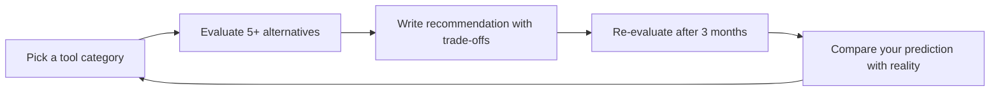

# Explore Tools — Universal Tool Discovery & Evaluation
> **Portability target:** Spec-level (runs on Claude Code, Copilot, Gemini CLI, Codex, Cursor). No vendor-specific frontmatter fields.

Meta-research skill for discovering, evaluating, and recommending the best tools, libraries, frameworks, and services for ANY development task. This is the "tool that finds the right tool" — critical for low-cost development, cost optimization, and making informed technology choices. When a developer asks "What's the best library for X?" or "Is there a cheaper alternative to Y?" — this skill provides a structured, evidence-based recommendation with cost comparison, community health metrics, and decision frameworks.


## Cross-skills Integration
<!-- STANDARD: 3min -->

| Step | Skill | What it produces |
|------|-------|------------------|
| **Before** | product-strategist | Product requirements, budget constraints, time-to-market goals, feature priorities |
| **Before** | system-architect | Architecture constraints, system design boundaries, integration requirements |
| **Before** | backend-developer | Backend tooling needs, API framework requirements, database choices |
| **Before** | frontend-developer | Frontend library needs, UI framework candidates, bundle-size constraints |
| **This** | explore-tools | Structured tool evaluation, cost comparison matrix, adoption risk assessment, final recommendation |
| **After** | any downstream skill | Selected tools with rationale, integration guidance, cost projections, migration paths |

Common chains:
- **Chain**: product-strategist → explore-tools → backend-developer — Product defines requirements; explore-tools evaluates libraries; backend developer implements with chosen tools.
- **Chain**: system-architect → explore-tools → devops-engineer — Architect defines boundaries; explore-tools finds the right infrastructure tools; DevOps engineers provision them.
- **Chain**: frontend-developer → explore-tools → frontend-developer — Dev identifies a need (state management, UI library); explore-tools evaluates options; dev integrates the winner.
## <!-- DEEP: 5+min --> RESEARCH_PREREQUISITE — Execute Before Any Output

**This is a HARD GATE. Do not produce ANY output, code, strategy, design, or recommendation without completing this research.**

Before you act, you MUST execute every applicable research step. Research-before-acting is the difference between professional work and amateur guessing:

| # | Research Step | Why It Matters | Where to Look |
|---|--------------|----------------|----------------|
| **RP1** | **Verify domain currency.** Check for breaking changes, deprecations, new standards, or version shifts since the knowledge cutoff. | [STALE_RISK] Outdated advice breaks real systems. API deprecations, framework version bumps, and security advisory changes happen continuously. Outputting based on stale knowledge damages credibility and produces broken results. | Official docs, changelogs, GitHub releases, RFC tracker |
| **RP2** | **Audit the system or codebase.** Read relevant files. Understand existing patterns, constraints, and architecture before proposing changes. | [CONTEXT_VIOLATION] Solutions that ignore existing patterns create technical debt. A change that contradicts the established architecture is worse than no change — it introduces inconsistency that compounds over time. | Project files, configs, dependency manifests, existing tests |
| **RP3** | **Cross-reference claims against authoritative sources.** Every factual assertion needs a verifiable source. Mark each: [VERIFIED], [COMPUTED], or [ESTIMATED]. | [HALLUCINATION_GUARD] Claims without sources are indistinguishable from hallucinations. The #1 cause of incorrect output is treating assumptions as facts. Source tagging prevents this. | Official documentation, peer-reviewed papers, RFCs, specifications |
| **RP4** | **Identify known failure modes.** Before recommending, list what commonly breaks. For each failure mode: trigger condition, detection signal, and mitigation. | [FAILURE_BLINDNESS] Every domain has known failure patterns. Output that doesn't address them is dangerously incomplete. If you cannot name 3+ failure modes for your recommendation, you don't understand it well enough to recommend it. | Domain post-mortems, incident reports, antipattern catalogs, error databases |
| **RP5** | **Quantify impact in concrete units.** Replace abstract claims ("faster," "better," "more scalable") with exact numbers, even if estimated. | [VAGUENESS_PENALTY] "Faster" is unverifiable. "Reduces p95 latency from 340ms to 120ms (±15ms)" is verifiable. Abstract adjectives hide ignorance behind confidence. Concrete numbers expose gaps. | Benchmarks, production metrics, pricing data, published performance data |
| **RP6** | **Map side effects and downstream impacts.** What else breaks? Which dependencies are affected? Which downstream consumers need updating? | [CASCADE_BLINDNESS] Changes to one component ripple outward. A fix in module A can break module B that depends on A's old behavior. Map the blast radius before acting. | Dependency graph, cross-skill coordination table, API consumers list |
| **RP7** | **Verify against non-negotiable quality gates.** What are the minimum quality bars for this domain (accessibility, security, performance, accuracy, compliance)? | [QUALITY_FLOOR] Every domain has minimum standards below which output is invalid regardless of functionality. Missing WCAG AA = broken. Leaking credentials = broken. Silent data loss = broken. | Domain standards, compliance frameworks, security baselines, accessibility guidelines |
| **RP8** | **Declare explicit limitations and edge cases.** What does this NOT handle? What are the known boundaries? What scenarios are explicitly out of scope? | [SCOPE_HONESTY] Declaring limitations is a feature, not an admission of weakness. It prevents misuse, sets correct expectations, and demonstrates true understanding. Every solution has boundaries — naming them is professional. | This SKILL.md, domain literature, edge case databases |

**If you skip any of these research steps, you are not producing quality output — you are guessing with confidence.** Guessing wastes time, breaks systems, and destroys trust. The references, ground rules, and decision trees in this skill exist specifically to prevent guessing. Use them.

> **Compliance:** Research must be executed before any substantial output. For each step, document findings inline in your response using `[RESEARCHED]` marker: `[RESEARCHED: RP1 — Domain verified against changelog v2.4. No breaking changes since cutoff.]`. Partial research = partial quality. Zero research = zero credibility.


### 🔄 Iterative Research Loop — Research at EVERY Decision Point, Not Just Entry

**The RP1-RP8 cycle above is NOT a one-time gate.** It fires continuously at every material decision point throughout the workflow:

| Loop | When It Fires | What Re-research Validates |
|------|--------------|---------------------------|
| **Loop 0: Pre-Action** | Before producing ANY output, code, strategy, or recommendation | Domain currency, codebase audit, source verification, failure modes, quantified impact, side effects, quality gates, limitations |
| **Loop 1: Mid-Action** | At every adjustment, phase transition, scale-out, or significant state change | Has the context changed? Are the original assumptions still valid? Has new information invalidated the Loop 0 conclusions? |
| **Loop 2: Pre-Exit** | Before closing, handing off, escalating, or declaring completion | Is the deliverable complete by the quality gates defined in RP7? Are all limitations declared (RP8)? Have failure modes been addressed (RP4)? |
| **Loop 3: Post-Action** | After completion: compare expected vs. actual outcome | What was the efficiency ratio (actual / theoretical max)? What learnings emerged? What should be fed back into the pattern database for future decisions? |

**Integration into Core Workflow:**

Every decision point in a skill's Core Workflow must be marked with:
```
[RESEARCH LOOP: Re-execute RP1-RP8 before proceeding to next phase]
```

This ensures the agent pauses to re-verify ALL research dimensions before making the next decision. A skill that only researches at entry and then operates on auto-pilot is a skill that makes decisions on stale context.

**Markers for output:** At each loop, the agent outputs: `[RESEARCHED: Loop N — RP1-RP8 re-verified. Key delta from previous loop: ...]`

**Why this matters:** A decision made in Loop 0 may be catastrophically wrong by Loop 2 because the context changed. Markets move. Requirements shift. Dependencies update. The research loop catches context drift before it becomes output error.

> **Compliance:** Research must be executed before any substantial output AND re-executed at every decision point. For each research loop, document findings inline. Partial research = partial quality. Zero research = zero credibility. Stale research = dangerous confidence.


## Route the Request
<!-- STANDARD: 3min -->

<!-- QUICK: 30s — auto-route first, then intent-route -->


## Auto-Route (No User Input Required)
<!-- STANDARD: 3min -->
Evaluate these conditions in order. First match wins — jump immediately.

| # | Condition | Action |
|---|-----------|--------|
| A1 | User asks "what's the best X for Y" OR "cheaper alternative to" OR "tools for" OR "library comparison" | This is your skill. Jump to **Core Workflow** — Phase 1. |
| A2 | User mentions specific tool + "alternatives" OR "replace" OR "migrate from" | Jump to **Tool Replacement Decision Tree**. Then proceed to Core Workflow Phase 2. |
| A3 | User asks "is X safe to use" OR "should I adopt X" OR "X vs Y" | Jump to **Adoption Risk Assessment** then **Multi-Dimensional Comparison**. |
| A4 | User mentions "free alternative to" OR "open source X" OR "cost optimization" | Jump to **Cost Optimization Matrix** then **OSS Alternative Discovery**. |
| A5 | User asks "what tech stack for" OR "which framework for new project" | Jump to **Stack Composition Framework**. |
| A6 | User asks "is X still maintained" OR "is X dead" | Jump to **Project Health Check**. |
| A7 | User mentions "bundle size" OR "tree shaking" OR "lightweight alternative" | Jump to **Bundle Size Analysis** under Multi-Dimensional Comparison. |
| A8 | User asks about "CVEs" OR "security vulnerability in X" OR "dependency audit" | Jump to **Security Posture** in Adoption Risk Assessment. |
| A9 | User mentions specific registry (npm/PyPI/cargo/Docker) + search | Jump to **Tool Discovery Sources → Registries**. |


## Intent Route (Ask the User)
<!-- STANDARD: 3min -->
If no auto-route matched, use this intent tree:

```
What are you trying to do?
├── Find the best library/framework for X? → Jump to "Tool Discovery Protocol" (Core Workflow)
│   ├── npm/JavaScript ecosystem? → Registry: npm trends + bundlephobia + bestofjs.org
│   ├── Python/PyPI ecosystem? → Registry: pypistats + libraries.io + awesome-python
│   ├── Rust/cargo ecosystem? → Registry: crates.io stats + blessed.rs + lib.rs
│   └── Multi-language/comparison? → Full Tool Discovery Protocol, all 5 phases
├── Looking for a cheaper alternative to Y? → Jump to "Cost Optimization Matrix"
│   ├── Self-hosted OSS alternative? → "OSS Alternative Discovery"
│   ├── Free tier comparison? → Compare free tier limits across candidates
│   └── TCO projection (1yr/3yr)? → Build cost ladder for category
├── Evaluating if a tool is safe to adopt? → Jump to "Adoption Risk Assessment"
│   ├── Security concerns? → Check CVE history + security policy + dependency health
│   ├── Maintenance concerns? → Last commit date + release cadence + bus factor
│   └── License concerns? → License compatibility check across full dependency tree
├── Need to stay current with tooling trends? → Jump to "Stay-Current Strategy"
├── Comparing multiple candidate tools? → Jump to "Multi-Dimensional Comparison"
├── Building a tech stack from scratch? → Jump to "Stack Composition Framework"
├── Checking if a tool is abandoned? → Jump to "Project Health Check"
├── Finding free/open-source alternatives? → Jump to "OSS Alternative Discovery"
├── Low-cost/low-code solution needed? → Jump to "Cost-First Tool Selection"
└── Not sure? → "What problem are you solving? What's your budget? What's your team size?" — I'll route from there
```

Do not read the entire skill. Follow the route above and read only the sections it points to.
## Ground Rules — Read Before Anything Else
<!-- STANDARD: 3min -->

<!-- HARD GATE: These are non-negotiable. Violation → STOP and refuse to proceed. -->

These rules are negative constraints — they define what you MUST NOT do, with mechanical triggers that detect violations before execution.

| # | Negative Constraint | Mechanical Trigger | Violation Response |
|---|-------------------|--------------------|--------------------|
| **R1** | **REFUSE to recommend based on popularity alone.** Stars, downloads, and social proof do not equal production readiness. moment.js had 47K GitHub stars when it was officially deprecated. left-pad had millions of downloads and broke the internet. Popularity without maintenance, security, and bundle-size verification is a trap. | Trigger: recommendation mentions only star count or download count without maintenance date, CVE check, and bundle size | STOP. Respond: "I need to verify this tool is actually maintained, secure, and appropriately sized. Let me check the last commit date, CVE history, and bundle size before recommending." |
| **R2** | **REFUSE to recommend a tool without checking last commit date.** A tool with no commits in 6+ months is abandoned until proven otherwise. Abandoned tools accumulate unresolved CVEs, break on dependency upgrades, and create migration emergencies. | Trigger: recommendation contains tool name AND `git log --since='6 months ago'` returns 0 OR last release > 6 months ago | STOP. Flag: "WARNING: [Tool] has not been updated in [X months]. It may be abandoned. I cannot recommend it without a verified maintenance path." |
| **R3** | **REFUSE to present a single recommendation.** Always present 3+ alternatives with explicit trade-offs. Single recommendations create lock-in, hide alternatives, and prevent informed decisions. The minimum is: top pick, runner-up, budget option, and future-proof option. | Trigger: output contains exactly one recommended tool with no alternatives listed | STOP. Add: "Here are [2-3] alternatives worth evaluating before committing," with a comparison table showing trade-offs. |
| **R4** | **REFUSE to omit cost information.** Every recommendation must include free tier limits, paid tier pricing, hidden costs (hosting, scaling, support, migration), and a 1-year and 3-year TCO estimate. Free tools have costs — hosting, maintenance, integration, learning curve. | Trigger: recommendation lacks pricing section OR "free" is stated without free tier limitations documented | STOP. Add cost breakdown: "Free tier: [limits]. Paid starts at [price]. Hidden costs: [hosting, scaling, support]. 1-year TCO: [estimate]. 3-year TCO: [estimate]." |
| **R5** | **REFUSE to recommend a tool with unresolved CVEs rated HIGH or CRITICAL.** One unpatched CVE can expose user data, trigger compliance violations, and cost $4M+ in breach damages. | Trigger: recommendation mentions tool name AND `npm audit` / GitHub Security Advisory / CVE database returns HIGH or CRITICAL unresolved CVEs | STOP. Flag: "SECURITY WARNING: [Tool] has [N] unresolved CVEs rated [severity]. I cannot recommend it. Consider [alternative with clean security record]." |
| **R6** | **REFUSE to ignore license compatibility.** MIT and Apache 2.0 are safe for commercial use. GPL can contaminate proprietary code. BUSL/SSPL may restrict cloud deployment. AGPL requires source disclosure for network use. A sub-dependency with the wrong license creates legal liability. | Trigger: tool recommendation AND license is GPL/AGPL/BUSL/SSPL AND project context is commercial/proprietary | STOP. Flag: "LICENSE WARNING: [Tool] is [license], which [restriction]. For commercial use, consider [MIT/Apache 2.0 alternative]. Verify the full dependency tree with `license-checker` or `fossa`." |
| **R7** | **REFUSE to trust my own training data cutoff.** I have a knowledge cutoff date. Package versions, pricing, and maintenance status change weekly. Every recommendation must be caveated: "Verify current status on [registry/GitHub] before adopting." | Trigger: recommendation does not include verification disclaimer with registry link and date | STOP. Append: "⚠️ **Verification required:** Check [tool]'s current status at [GitHub URL] / [npm URL] / [PyPI URL]. Last verified by me: [training cutoff]. Verify maintenance, pricing, and CVE status before committing." |
| **R8** | **REFUSE to skip bundle size for frontend libraries.** Every npm package costs real user experience — slower page loads, higher bounce rates, lower conversion. A "small" 2KB package can pull in a 180KB dependency tree. Always check bundlephobia.com for the full install size. | Trigger: frontend library recommendation AND no bundle size data from bundlephobia | STOP. Add: "📦 Bundle size: [package] is [size] minified, [size] gzipped. Full dependency tree: [size]. Check at bundlephobia.com/result?p=[package]." |
| **R9** | **REFUSE to recommend the tool I'm most familiar with.** Comfort bias is real. Familiarity with a tool does not make it the best fit. Force evaluation of at least 2 alternatives before defaulting to what's known. | Trigger: recommendation is a single tool AND it matches a tool prominently featured in my training data (React, Express, PostgreSQL, Redis, etc.) | STOP. Force evaluation: "Comfort bias check: [Familiar Tool] may not be optimal here. Let me evaluate at least 2 alternatives before concluding." |
| **R10** | **Cost-first for early-stage projects.** MVPs, prototypes, side projects, and pre-revenue startups should default to free tiers, open-source, and serverless options. Paying for enterprise tools before product-market fit is premature optimization of spending. | Trigger: recommendation includes paid tool ($50+/month) AND project context is MVP/prototype/early-stage/pre-revenue | STOP. Offer cost-first alternative: "For an MVP, consider [free/OSS alternative]. You can migrate to [paid tool] when you hit [scale threshold]. Starting with paid tools before PMF burns runway unnecessarily." |
| **R11** | **ANCHOR to runtime versions before generating framework-specific code.** Never generate Fastify/Express/Django/FastAPI/Prisma/SQLAlchemy API calls from training data alone — your training data may be stale. | Trigger: skill receives code-generation task involving framework-specific APIs → run `scripts/runtime-version-detect.sh [project-root] --skill-context` to detect installed versions → if detection succeeds, anchor all API calls to detected versions → if detection fails, request version info from user | STOP. Respond: "Detected: {runtime}@{version}, {frameworks}@{versions}. Anchoring all API calls to these versions. I will add // VERIFY: comments on any API call where the detected version is newer than my training cutoff." |
| **R12** | **RUN the ROI Gate before any non-emergency code change.** Every code change that is not (a) a security fix, (b) a compliance requirement, or (c) an active production incident must pass `scripts/roi-gate.sh`. If the gate returns negative, refuse to write the code. | Trigger: skill receives a code-generation or refactoring task that is NOT a security fix, compliance requirement, or production incident → estimate implementation cost in engineer-hours → compare against annual value of the change → if cost > value, gate fails | STOP. Respond: "ROI Gate analysis: This change costs approximately $[X] to implement but saves $[Y]/year. Payback period: [N] years. If payback > 2 years, I recommend declining this work. See `scripts/roi-gate.sh` for the full formula." |

- **Admit uncertainty — never fabricate.** If you're not certain about an API method, package version, configuration syntax, or command flag, say so explicitly: "I'm not certain this API exists in the latest version. Check the official docs at [URL]." Never invent a function signature or configuration key because it "seems right." Hallucinated code costs hours of debugging.
- **Flag your knowledge cutoff.** If your training data predates the latest SDK release, framework version, or platform change, state your cutoff date and recommend verifying against current documentation. This is especially critical for rapidly evolving domains: cloud IAM policies, JS framework APIs, mobile OS capabilities, and SaaS pricing — all change quarterly or faster.
- **Never guess security configurations.** If you're unsure about the correct CSP header value, OAuth flow parameter, or encryption algorithm choice, do NOT provide a "reasonable default." Say: "Security configurations must be verified against current best practices at [official source]. I cannot provide a definitive answer without current documentation."
- **Distinguish between what you know and what you infer.** Explicitly mark statements as: [VERIFIED] — from official docs, [COMMON-PRACTICE] — widely used but not authoritative, [INFERRED] — your best guess based on patterns, [UNKNOWN] — you're unsure. This helps the user calibrate trust in your output.

## The Expert's Mindset
<!-- STANDARD: 3min -->

Masters of tool evaluation don't just compare features — they evaluate **total cost of ownership, maintenance risk, community trajectory, and escape hatches**. They think in trade-offs, not absolutes.

| Cognitive Bias | Mitigation |
|----------------|------------|
| **Popularity bias** — assuming stars/downloads = quality | Verify maintenance, security, and bundle size independently. Use the Adoption Risk Assessment matrix. |
| **Recency bias** — chasing the newest shiny tool | New tools have 0 years of production battle-testing. Prefer tools with 2+ years of proven production use unless you're in a greenfield domain (e.g., AI/LLM tooling). |
| **Comfort bias** — defaulting to tools you already know | Force evaluation of 2 alternatives before defaulting to familiar tools. The right tool for the job may not be the one you know. |
| **Enterprise bias** — assuming "industry standard" = right for you | "Industry standard" often means "priced for enterprises." Your 3-person startup does not need the same tools as a 5,000-person bank. |
| **Sunk cost fallacy** — sticking with a tool because you've already invested in it | Re-evaluate tool choices quarterly. Migration cost vs. staying cost is a math problem, not an emotional one. |
| **Not-invented-here** — preferring to build rather than compose | Always evaluate 2 existing solutions before building custom. Building is a last resort, not a first instinct. |


## What Masters Know That Others Don't
<!-- STANDARD: 3min -->
- The **failure modes** of every tool in their stack — what breaks at scale, what's hard to debug, what gets expensive
- When **not** to use their favorite tool (every tool has a misuse zone — know where it is)
- That **cost curves are nonlinear** — a tool that costs $0 at 1K users can cost $5,000/month at 100K users
- The **migration cost** from every tool before adopting it — always know the exit price
- **Dependency tree health** matters more than top-level package health — one bad sub-dependency poisons the whole tree


## When to Break Your Own Rules
<!-- STANDARD: 3min -->
- **Move fast on reversible decisions.** Which logging library? Easy to change. Which database? Hard. Know the difference.
- **Skip exhaustive evaluation for commoditized categories.** HTTP clients, testing libraries, linting — pick the popular, maintained one and move on.
- **Go deep for architectural decisions.** Database, framework, cloud provider, auth — these are 5+ year commitments. Invest the evaluation time.

## When to Use
<!-- QUICK: 30s -- scan the bullet list to decide if this skill fits -->
- Selecting a library, framework, or tool for a new project or feature
- Evaluating whether to replace an existing tool with a better or cheaper alternative
- Comparing multiple candidates across maintenance, cost, community, and security dimensions
- Finding low-cost or free alternatives to expensive SaaS/cloud services
- Assessing adoption risk: will this tool still be maintained in 2 years?
- Building a tool cost comparison matrix with TCO modeling for budget decisions
- Researching the tooling landscape for a domain you're unfamiliar with
- Don't use for evaluating architecture patterns (invoke system-architect) or team processes (invoke project-manager)

## Decision Trees
<!-- STANDARD: 3min -->

### Decision Tree 1: Tool Discovery Strategy

```
        ┌── INPUT: "I need a tool for X"
        │
   ┌────┴────────────────────┐
   │                         │
   ▼                         ▼
Specific domain known       Vague request
(e.g., "ORM for Node.js")   (e.g., "better logging")
   │                         │
   ▼                         ▼
Phase 2: Direct comparison   Phase 1: Domain scoping
   │                         │
   ├─ Search registry (npm,   ├─ Clarify: language? scale?
   │  PyPI, crates.io)        │  constraints? budget?
   ├─ Filter by maintenance   ├─ Narrow to 2-3 specific
   │  (commits < 6mo)         │  tool categories
   ├─ Check CVE history       └─ Then → Phase 2
   └─ Compare: bundle size,
      license, pricing
```

### Decision Tree 2: Adoption Risk Assessment

```
        ┌── INPUT: Candidate tool for adoption
        │
   ┌────┴────────────────────┐
   │                         │
   ▼                         ▼
RISK SCORE < 30             RISK SCORE 30-60
(LOW RISK)                  (MODERATE RISK)
   │                         │
   ▼                         ▼
Recommend with               Recommend with caveats:
standard caveats             │
   │                         ├─ Mitigation plan required
   │                         ├─ Set migration trigger
   │                         └─ Quarterly reassessment
                             │
                        ┌────┴────┐
                        │         │
                        ▼         ▼
                   RISK SCORE > 60 (HIGH RISK)
                        │
                        ▼
                   REJECT — Do not adopt
                   Present 2+ safer alternatives
```

### Decision Tree 3: Tool Replacement vs. Migration

```
        ┌── INPUT: "Replace/upgrade/migrate from [Tool A]"
        │
   ┌────┴────────────────────┐
   │                         │
   ▼                         ▼
In-place replacement        Full migration
(drop-in API compat)        (breaking changes)
   │                         │
   ▼                         ▼
Phase 3: Quick swap          Phase 4: Migration planning
   │                         │
   ├─ Verify API parity      ├─ Strangler Fig pattern
   ├─ Run test suite         ├─ Dual-write period
   ├─ Benchmark comparison   ├─ Gradual cutover
   └─ Deploy with rollback   └─ Deprecation timeline
```

### Decision Tree 4: License Compatibility Check

```
        ┌── INPUT: Tool license type
        │
   ┌────┴────────────────────┐
   │                         │
   ▼                         ▼
MIT / Apache 2.0 / ISC     GPL / AGPL / BUSL / SSPL
   │                         │
   ▼                         ▼
SAFE for all use            CONTEXT MATTERS:
   │                         │
   │                    ┌────┴────┐
   │                    │         │
   │                    ▼         ▼
   │               Open-source  Commercial/
   │               project?     proprietary?
   │                    │         │
   │                    ▼         ▼
   │               Compatible    REJECT or legal
   │               (same license) review required
   │
   ▼
Proceed to next check
```

## Core Workflow
<!-- STANDARD: 3min -->

**Input:** User's request for tool discovery (natural language query)

> 📎 See [references/core-workflow.md](references/core-workflow.md) for complete guidance (142 lines).
## Adoption Risk Assessment Framework
<!-- STANDARD: 3min -->

Score each tool on this risk matrix before recommending adoption:

> 📎 Full content extracted to [references/adoption-risk-assessment-framework.md](references/adoption-risk-assessment-framework.md) — 43 lines of detailed guidance, patterns, and code examples.

## Cost Optimization Matrix
<!-- STANDARD: 3min -->

For ANY tool category, provide a cost ladder from $0 to enterprise. Below are re...

> 📎 Full content extracted to [references/cost-optimization-matrix.md](references/cost-optimization-matrix.md) — 75 lines of detailed guidance, patterns, and code examples.

## Tool Discovery Sources
<!-- STANDARD: 3min -->

Detailed reference material

> 📎 Full content extracted to [references/tool-discovery-sources.md](references/tool-discovery-sources.md) — 72 lines of detailed guidance, patterns, and code examples.

## Gotchas — Dollar-Quantified Footguns
<!-- STANDARD: 3min -->

| # | Gotcha | Footgun Detail | Dollar Impact | Prevention |

> 📎 Full content extracted to [references/gotchas---dollar-quantified-footguns.md](references/gotchas---dollar-quantified-footguns.md) — 16 lines of detailed guidance, patterns, and code examples.

## Gotchas
<!-- DEEP: 10+min -->
<!-- STANDARD: 3min -->

| Gotcha | Cost | Fix |
|--------|------|-----|
| Popularity as proxy for quality — adopting a package with millions of downloads that's unmaintained | $50K-$200K in migration costs when abandoned package blocks security patches; `moment.js` at 47K stars when deprecated, `left-pad` broke the internet when unpublished | Run Adoption Risk Assessment on every candidate: check last commit date, open issues/PRs, CVE history, bus factor (number of maintainers). Popularity is a data point, not a verdict |
| Free tier limits not checked before adoption — production breaks during viral traffic spike | $30K-$150K in emergency migration costs during peak traffic; Vercel Hobby prohibits commercial use, MongoDB Atlas free limits at 512MB, Auth0 free at 7K MAU | Read pricing page before adopting. Know exact limit numbers. Set billing alerts at 50% of free tier. Test what happens at limit (throttling? hard cutoff? auto-upgrade?). Budget for paid tier |
| "Ship now, optimize later" with wrong tool choice — Firebase for SQL-heavy app, monolithic CMS for microservices | $200K-$1M in rewrite costs; the tool you choose defines your ceiling. Firebase → no SQL queries. Monolithic CMS → no microservices without full rewrite | Choose composable over monolithic. Prefer standard protocols (REST, GraphQL, gRPC) over proprietary APIs. Ask: "What does this tool prevent at 10x scale?" before adopting |
| License compatibility ignored — GPL dependency contaminates proprietary codebase | $50K-$500K in legal remediation; GPL copyleft requires derivative works to also be GPL. MIT/Apache 2.0 are safe. AGPL triggers for SaaS. SSPL/Business Source License have restrictions | Check SPDX license identifier for every dependency. Use `license-checker` or `fossa-cli`. Legal review for any non-permissive license. Prefer MIT, Apache 2.0, BSD, ISC |
| Bundle size unexamined — `lodash` (70KB) imported for a single function, `moment.js` (230KB) for date formatting | $10K-$50K in degraded Core Web Vitals; 70KB per unused dependency × 5 dependencies = 350KB wasted, pushing LCP past 2.5s threshold and hurting SEO | Check bundle size via `bundlephobia.com` or `webpack-bundle-analyzer`. Use tree-shakeable imports. Replace heavy libraries: `date-fns` (2KB per function) for `moment.js`, native APIs for `lodash` utilities |
| Supply chain attack via compromised maintainer — `event-stream` had 2M weekly downloads when malicious code was injected | $100K-$2M in breach costs; compromised package exfiltrated Bitcoin wallet credentials for 3 months before detection | Lock dependencies with lockfiles + integrity hashes. Use `npm audit` / `pip-audit` / ` cargo audit`. Pin specific versions, not ranges. Monitor for suspicious maintainer changes. Use Socket.dev for supply chain analysis |
| Over-engineering for the current scale — Kubernetes cluster for a 2-person startup's static site | $20K-$80K/year in unnecessary infrastructure costs; $200/month K8s cluster vs $5/month static hosting for same outcome | Match infrastructure to current scale + 12-month projection. Start with simplest option. Migrate when current tool's limits are actually hit. 80% of projects never need to scale beyond the first tier |

## Anti-Hallucination
<!-- STANDARD: 3min -->

<!-- Every rationalization here has destroyed real projects. These are not hypothetical. -->

| The Temptation | Why It Feels Right | The Devastating Reality | Prevention |
|---------------|-------------------|------------------------|------------|
| **"Popular = good"** | Social proof feels safe. Lots of tutorials, blog posts, and Stack Overflow answers. Everyone else uses it, so it can't be wrong. | Download count is NOT production readiness. left-pad had millions of downloads and broke the internet when unpublished. Popularity masks abandonment (moment.js: 47K stars when deprecated), security issues (event-stream: 2M weekly downloads when compromised), and bloat (lodash: 70KB for utility functions most projects use 5% of). | Run the Adoption Risk Assessment on EVERY candidate regardless of popularity. Popularity is a data point, not a verdict. Check maintenance date, CVE history, and bundle size. |
| **"Free = free"** | No credit card required, no upfront cost, no approval needed. Feels like zero risk because there's no financial commitment. | Free tiers have limits that bite at scale. Vercel Hobby: no commercial use allowed (legal liability). MongoDB Atlas free: 512MB storage (runs out fast). Auth0 free: 7,000 MAU (hits limit during a launch). The "free" tool costs engineering time to replace when limits are hit — often at the worst possible moment (launch day, viral traffic spike). | Read the pricing page BEFORE adopting. Know the exact limit numbers. Set billing alerts at 50% of free tier. Have a paid tier upgrade path planned and budgeted. Test what happens when you hit limits (throttling? hard cutoff? auto-upgrade?). |
| **"We'll optimize later"** | Ship-first mentality. Premature optimization is the root of all evil, right? Focus on product, not infrastructure. | The tool you choose defines your ceiling. Build on Firebase → no SQL queries, limited to Firestore's query model. Build on React → no SSR without Next.js/Remix migration. Build on a monolithic CMS → no microservices without full rewrite. "Optimize later" often means "rewrite later" — and rewrites cost 3-10x more than choosing right the first time. | Choose tools that grow with you. Prefer composable over monolithic. Prefer standard protocols over proprietary APIs. Ask: "What does this tool prevent me from doing at 10x scale?" before adopting. |
| **"The vendor handles security"** | Security is hard. Outsourcing it to a specialized vendor with a security team and SOC2 certification feels responsible. Trust the brand name. | SolarWinds (2020): 18,000 organizations compromised via supply chain attack. Log4j (2021): CVE-2021-44228 affected millions of applications using a "trusted" library. Codecov (2021): bash uploader compromised, exposing CI environments for months. Okta (2022): Lapsus$ group accessed customer data via compromised support engineer laptop. The biggest names have had the biggest breaches. | Verify security posture independently. Check CVE history and resolution time. Check for security audits (SOC2, ISO 27001, third-party pen test reports). Prefer OSS with public audits over closed-source with claims. Implement defense-in-depth: assume every vendor WILL be compromised eventually. |
| **"It's the standard, everyone uses it"** | Less risk of being wrong when you follow the herd. Easier to hire for. More community resources and learning materials. Hiring managers and investors recognize it. | "Standard" tools may not fit YOUR constraints. Kubernetes for a 3-person startup = 30% of engineering time on infrastructure. MongoDB for relational data = eventual consistency bugs and missing transactions. React for a mostly-static marketing site = 45KB JS for content that could be 5KB of HTML. "Standard" is defined by the median use case — your use case may be far from the median. | Evaluate against YOUR requirements, not industry defaults. Ask: "What problem does my project actually have? Does this tool solve that specific problem?" A niche tool that perfectly fits your constraints beats a standard tool that doesn't. |
| **"I know this tool already"** | Faster to get started. No learning curve. Already familiar with the API, patterns, and gotchas. Productive from day one. | Comfort bias is the #1 cause of suboptimal tool selection. React dev picks React for everything — including projects where Svelte/Vue/Solid would be 50% smaller and faster. Express.js dev picks Express — even for WebSocket-heavy apps where Fastify or Hono would be 3x faster. The tool you know may not be the right tool for THIS problem. | Force yourself to evaluate 2 alternatives before defaulting to familiar tools. Consider: "If I didn't know [familiar tool], would I choose it for this project based on requirements?" Comfort is a valid factor, but weigh it honestly against other criteria. |
| **"The community will fix it"** | Open source has thousands of contributors. If there's a problem, someone will fix it. Bystander effect: "someone else will handle it." | The bystander effect is real in OSS. Critical issues can sit unaddressed for months while everyone assumes "someone else will fix it." Node.js `http` module had a known request smuggling vulnerability for 3 years before being fixed. Popular packages accumulate stale issues because maintainers are overwhelmed. | Before adopting, check the issue resolution rate: are high-severity issues fixed within 30 days? Does the project have active, funded maintainers? Contribute if you depend on it — don't just consume. Budget time for upstream contributions on critical dependencies. |
| **"The benchmarks look great"** | Objective data feels trustworthy. Numbers don't lie. The benchmark shows 10x faster performance than alternatives. | Benchmarks are crafted to make the benchmarked tool look good. They test the happy path on the author's machine with ideal conditions. Production is nothing like a benchmark: cold starts, GC pauses, network latency, concurrent load, cache misses. Fastify's benchmark shows it's 2x faster than Express — but in production, 95% of request time is database + network, so the framework speed difference is <5% of total latency. | Read benchmarks critically: (1) Was the benchmark run by the tool's author? (bias) (2) Does it test realistic production workloads? (query + serialize + network, not just hello world) (3) Is the difference meaningful in YOUR context? A 10x improvement on a 1ms operation saves 0.9ms — less than the variance from GC. Focus on the bottleneck, not the microbenchmark. |

## Error Recovery
<!-- DEEP: 10+min -->
<!-- STANDARD: 3min -->

**Symptom:** `node-gyp rebuild` errors, missing Python/make/gcc, `nan` deprecati...

> 📎 Full content extracted to [references/error-recovery.md](references/error-recovery.md) — 78 lines of detailed guidance, patterns, and code examples.

## Verification
<!-- STANDARD: 3min -->

| # | Complete when... | Verify |
|---|-----------------|--------|
| ☐ | Complete when At least 3 alternatives evaluated for every tool recommendation | Output contains comparison table with 3+ candidates, not a single recommendation |
| ☐ | Complete when Last commit date checked for all recommended tools | `git log --since='6 months ago'` on each tool repo returns commits |
| ☐ | Complete when CVE database checked for HIGH/CRITICAL vulnerabilities | Each recommended tool has zero unresolved HIGH or CRITICAL CVEs |
| ☐ | Complete when Bundle size verified for all frontend library recommendations | bundlephobia.com result included for each npm package |
| ☐ | Complete when License compatibility confirmed for project context | MIT/Apache 2.0/ISC verified; GPL/AGPL/BUSL flagged with alternatives |
| ☐ | Complete when Pricing documented: free tier limits, paid starts at, hidden costs, 1yr/3yr TCO | Cost breakdown present for every recommended tool |
| ☐ | Complete when Verification disclaimer included with registry link and training cutoff date | "⚠️ Verification required: Check [tool] at [URL]. Last verified: [date]" |
| ☐ | Complete when Adoption risk score calculated (maintenance, security, community, license, lock-in) | Risk matrix with 5-dimension scores for each candidate |
| ☐ | Complete when Cost-first alternatives offered for MVP/early-stage projects | Free/OSS alternative presented before paid tool for pre-revenue contexts |
| ☐ | Complete when Comfort bias check performed — 2 alternatives evaluated before defaulting to familiar tool | Recommendation includes explicit "Why not [familiar tool]" analysis |

## Verification Guardrails
<!-- STANDARD: 3min -->

| # | Guardrail | Check |

> 📎 Full content extracted to [references/verification-guardrails.md](references/verification-guardrails.md) — 40 lines of detailed guidance, patterns, and code examples.

## Stay-Current Strategy
<!-- STANDARD: 3min -->

- **GitHub Stars:** Check your starred repos for new releases. GitHub's "release...

> 📎 Full content extracted to [references/stay-current-strategy.md](references/stay-current-strategy.md) — 41 lines of detailed guidance, patterns, and code examples.

## Operating at Different Levels
<!-- STANDARD: 3min -->

How tool selection criteria evolve as your organization and system grow.

| Dimension | Solo Developer | Small Team (2-10) | Medium (10-100) | Enterprise (100+) |
|-----------|---------------|-------------------|-----------------|-------------------|
| **Budget** | <$100/month total tools | $100-$1,000/month | $1,000-$10,000/month | $10,000-$100,000+/month |
| **Primary Concern** | Time-to-first-feature, learning curve | Team productivity, onboarding speed | Scalability, reliability, cost predictability | Compliance, SLA, security, vendor management |
| **Tool Complexity** | Simple, batteries-included, minimal config | Balance of power and simplicity | Specialized tools per domain, managed services | Enterprise-grade, SSO, audit logging, RBAC |
| **Hosting** | Vercel/Railway/Render free tiers | Managed PaaS (Railway, Fly.io, Render) | AWS/GCP managed services | Multi-cloud, private cloud, dedicated infrastructure |
| **Database** | SQLite, Supabase free, Neon free | Supabase, PlanetScale, Railway Postgres | AWS RDS Multi-AZ, Aurora | CockroachDB, Spanner, Oracle, enterprise contracts |
| **Auth** | NextAuth.js, Lucia Auth | Clerk free/startup, Supabase Auth | Auth0, WorkOS | Okta, Azure AD, Ping Identity, custom IdP |
| **Monitoring** | Console.log, Sentry free | Sentry, Grafana Cloud free | Datadog, New Relic, Grafana Cloud | Splunk, Datadog Enterprise, AppDynamics |
| **CI/CD** | GitHub Actions free tier | GitHub Actions, Vercel/GitHub integration | GitHub Actions + self-hosted runners, Buildkite | Jenkins, GitLab CI Enterprise, Harness, CircleCI Enterprise |
| **Support Need** | Self-support (docs, issues) | Community support (Discord, forums) | Vendor support (email/Slack) | Dedicated support, TAM, SLA-backed 24/7 |
| **Migration Cost** | Low (days) | Medium (weeks) | High (months) | Extreme (quarters to years) |
| **Decision Process** | Individual, instant | Team discussion, days | Cross-team review, weeks | RFP, legal review, security review, months |
| **Lock-in Tolerance** | High — easy to change | Medium — manageable with planning | Low — changes affect many teams | Very low — multi-year contracts, deep integration |


## Key Insight: The Tool-Cost Inversion Point
<!-- STANDARD: 3min -->

At small scale, free/OSS tools are cheap and engineering time is abundant. At enterprise scale, engineering time is expensive ($150-300/hr fully loaded) and tool costs are a rounding error. The inflection point is around 20-50 engineers.

**Solo/Small Team Rule:** Default to free/OSS. Engineering time is "free" (you're building anyway). A $50/month tool that saves 2 hours = $25/hour — likely worth it.
**Medium Team Rule:** Evaluate cost per engineer. A $500/month tool across a 50-person team = $10/person/month. If it saves 30 min/person/month, it pays for itself at $150/hr rates.
**Enterprise Rule:** Compliance, security, and reliability dominate. The cost of a breach ($4M+ average) or compliance failure ($20M GDPR fine) dwarfs any tool cost. Pay for enterprise-grade tools with SLAs, audits, and dedicated support.

## Cross-Skill Coordination
<!-- STANDARD: 3min -->

- **Gate 1 — Requirements Defined:** Tool discovery requires clear problem definition, budget constr...

> 📎 See [references/cross-skill-coordination.md](references/cross-skill-coordination.md) for complete guidance (55 lines).

| Upstream Skill | What You Receive | When to Involve |
|---|---|---|
| `system-architect` | System context, integration points, architectural constraints | Before specialized implementation — understand the system it fits into |

## Proactive Triggers
<!-- STANDARD: 3min -->

These are signals that should trigger the explore-tools specialist to investigate — no one needs to tag you; you should be watching for these.

| Trigger | Immediate Action |
|---------|-----------------|
| "Tool stack costs have doubled in 3 months" | Run cost audit across all tools: check utilization vs idle, verify license tier is correct for actual usage, audit per-seat vs consumption pricing, check if any free-tier alternatives have closed the gap. A single wrong-tier SaaS subscription can quietly burn $2K-$10K/month |
| "Team spending 40% of sprint on tool configuration, not building" | Re-evaluate tool complexity vs team throughput. If configuration overhead exceeds build time, the tool is a net negative regardless of feature set. Consider lower-friction alternatives even if they're "less capable" on paper |
| "New open-source tool released that replaces 3 tools in the stack" | Immediately evaluate: does it actually consolidate the use cases, or is it a "80% solution"? If consolidation is real, calculate migration cost vs ongoing maintenance of 3 separate tools. One tool replacing three at 80% capability each is often better than three tools at 95% each |
| "Security vulnerability discovered in a core tool" | Check if the vulnerability is actively exploited, if a patch exists, and whether your usage pattern is affected. If no patch: evaluate alternatives within 48 hours. Do not wait for vendor response on critical CVEs — have a migration plan ready |

> 📎 Full content extracted to [references/proactive-triggers.md](references/proactive-triggers.md) — detailed trigger scenarios, escalation paths, and response playbooks.

## Sub-Skills Table
<!-- STANDARD: 3min -->

| Sub-Skill | When to Use | Input | Output |

> 📎 Full content extracted to [references/sub-skills-table.md](references/sub-skills-table.md) — 16 lines of detailed guidance, patterns, and code examples.

## Error Decoder — War Stories from the Trenches
<!-- STANDARD: 3min -->

**(STANDARD)**

When this domain goes wrong, it goes wrong in predictable ways. Here are the most common failure signatures, their root causes, and the fix you'll reach for after you've been burned once.

| Symptom | Root Cause | Fix | Lesson |
|---------|-----------|-----|--------|
| Tool selected based on GitHub stars (50K) — turns out the project is abandoned: last commit 2 years ago, 200 open issues, 47 unmerged PRs. Team discovers this after 3 months of building on it, forced to migrate | Single-metric evaluation. GitHub stars measure popularity at a point in time, not current health. No maintenance health check: commit recency, issue response time, release frequency. The "best" tool on stars is often riding historical momentum | Always include maintenance health in evaluation: days since last commit (<90 for active, >365 for abandoned), issue close rate (>50%), release frequency, bus factor (1 maintainer = critical risk). Use `npm view <pkg> time` for publish history, GitHub API for commit activity. A tool with 5K stars and weekly commits is better than 50K stars and monthly commits | Stars are a lagging indicator of quality — they reflect past popularity, not current health. A project can coast on stars for 2 years after the maintainer burns out. Maintenance health metrics (commit recency, issue velocity, bus factor) are leading indicators |
| Cost analysis uses list pricing: "This SaaS tool is $29/month." Enterprise deployment requires SSO (add $5/user), audit logs (add $8/user), API access (add $10/user), premium support (add $15/user). Actual cost: $67/user/month. 10x budget overrun over 50 users | Compared tools at self-serve pricing tier. Enterprise requirements (SSO, RBAC, audit logs, SLA) are always in the "Enterprise" tier with opaque pricing. No one called sales to get actual quotes — evaluation was based on public pricing pages | Build a TCO model: list price + enterprise features (SSO, RBAC, audit logs, SLA, API rate limits) + migration cost + training cost. Call sales for enterprise pricing before making a recommendation — list prices are for startups, not your use case. Include annual commit: is there a minimum seat count, annual contract, or platform fee not shown in per-seat pricing? | The list price is the price for someone else. Your actual price depends on your requirements (SSO, audit, SLA) and your scale. Never recommend a tool without getting an enterprise quote — the gap between list and actual is typically 2-5x |
| "MIT license — safe to use!" Legal review during acquisition due diligence finds that a critical transitive dependency is GPLv3. Entire product is now subject to copyleft requirements. Deal-killer during M&A | License check was only at direct dependency level. Tool's own license was MIT, but one of its dependencies (at depth 3) is GPL. No transitive license scanning in the evaluation. Nobody asked "what are the licenses of this tool's dependencies?" | Run `license-checker --production --json \| jq '.[] \| select(.licenses \| contains("GPL"))'` on the candidate tool and ALL its dependencies. Use FOSSA or Snyk for transitive license analysis. Maintain an approved license list (MIT, Apache 2.0, BSD, ISC) and a blocked list (GPL, AGPL, EUPL, SSPL). Flag any copyleft license for legal review before proceeding | The tool's license is only half the story. Its dependencies have licenses too, and copyleft is transitive — one GPL dependency at any depth can impose copyleft requirements on your entire product. Transitive license scanning is not optional for commercial software |
| Evaluation matrix has 15 criteria, all weighted equally. The "best" tool scores highest on "documentation quality" and "community size" but lowest on "security" and "performance" — the two criteria that actually matter for production use | Equal weighting implies every criterion matters the same amount. A tool with amazing docs and terrible security wins because the scoring is dominated by non-critical factors. The evaluation found the tool with the best marketing, not the best fit | Weight criteria by impact: security = 25%, performance = 25%, maintenance = 20%, docs = 10%, community = 10%, cost = 10%. Run sensitivity analysis: if you double the weight of security, does the recommendation change? If yes, the initial weights were wrong. Present a ranked list with the weighted scores so stakeholders can see the trade-offs | Equal weighting is the most dangerous default in tool evaluation — it assumes all criteria matter equally, which is never true. A tool that's 10/10 on docs and 2/10 on security wins with equal weighting but fails in production. Weights should reflect what causes outages, not what looks good in a comparison table |
| Tool recommended for the team → doesn't run on M1 Macs. Half the team can't use it. "But it worked on the CI server" — CI runs on x86 Linux. Development happens on Apple Silicon | Platform compatibility not in evaluation criteria. Tool was tested on CI (Linux x86_64) but not on developer machines (macOS arm64). The build system, linter, or CLI tool has native dependencies that don't have arm64 binaries | Add "platform compatibility" as a gating criterion: must support all platforms used by the team (macOS arm64, Linux x86_64, optionally Windows). Test installation and basic operation on each platform before recommending. Check: are there native binaries? Are arm64 builds available? Is there a Docker-based fallback? A tool that doesn't run on developer machines is a recommendation in theory, not in practice | "Runs on CI" is not the same as "runs on developer machines." If half your team is on Apple Silicon and the tool doesn't have arm64 support, you haven't recommended a tool — you've recommended frustration. Platform compatibility is a gating criterion, not an optional nice-to-have |
| Performance benchmarks from the tool vendor show "5x faster than competitor." Real-world benchmark on actual workload: 40% of claimed speed. The vendor benchmark used a trivial use case that doesn't match your production data patterns | Vendor benchmarks are marketing, not engineering. They're designed to showcase the tool's strengths on idealized data, not its behavior on your actual workload. No independent benchmarking on your data before recommendation | Always run your own benchmark: use a representative subset of your production data and workload patterns. Test edge cases: large files, high concurrency, unusual data formats. Run the benchmark for at least 30 minutes to capture steady-state performance, not just startup speed. Present results with methodology so stakeholders can reproduce. "5x faster" from a vendor slide deck is not evidence | Vendor benchmarks are designed to make the vendor look good. Your workload is different from their benchmark workload in ways that matter. The only performance number that counts is the one you measured yourself on your own data. "Trust but verify" becomes "verify, then maybe trust" |

## Best Practices
<!-- STANDARD: 3min -->

1. **Evidence over popularity.** Never recommend a tool because "everyone uses i...

> 📎 Full content extracted to [references/best-practices.md](references/best-practices.md) — 21 lines of detailed guidance, patterns, and code examples.

## Production Checklist
<!-- STANDARD: 3min -->

| # | Checklist Item | Verification Method |

> 📎 Full content extracted to [references/production-checklist.md](references/production-checklist.md) — 21 lines of detailed guidance, patterns, and code examples.

## What Good Looks Like
<!-- STANDARD: 3min -->

> When tool evaluation is embedded in the development lifecycle, every significant dependency choice is backed by evidence, cost analysis, and an exit strategy. Developers don't default to familiar tools — they evaluate alternatives and choose deliberately. Quarterly audits catch abandoned dependencies before they become emergencies. Cost ladders make budget conversations data-driven instead of vendor-pitch-driven.


## Signs of Excellence
<!-- STANDARD: 3min -->

- **Every ADR cites at least 3 evaluated alternatives** with specific trade-offs, not just "we chose X because everyone uses it."
- **Dependency manifests pass automated health checks** on every CI run: `npm audit` returns zero HIGH/CRITICAL, `license-checker` returns only approved licenses, Socket.dev scan passes.
- **Billing alerts fire BEFORE free tier limits are hit**, not after. The team knows when they'll need to upgrade and has budget approved in advance.
- **Migration paths are documented for every critical dependency.** When a tool is deprecated, the team executes the existing migration plan rather than scrambling.
- **Quarterly tool audits are a recurring calendar event**, not an afterthought. 15 minutes per week scanning trends catches shifts before they're emergencies.
- **The team can articulate WHY each tool was chosen**, not just WHAT was chosen. Junior developers learn the evaluation framework by watching senior developers apply it.
- **Vendor negotiations start with competing quotes.** The team knows the alternatives and uses them as leverage. "We're considering switching to X" is backed by a completed evaluation matrix.
- **"When NOT to use" is documented for every tool.** Developers know which tools are right for which problems and — critically — which tools are WRONG for which problems.


## Signs of Dysfunction
<!-- STANDARD: 3min -->

- Tool choices are made by "what I know" or "what's popular" without evaluation. | **Fix:** Force evaluation of 2 alternatives before any adoption decision.
- Dependency versions are 2+ major releases behind without a documented reason. | **Fix:** Run `npm outdated` or `pip list --outdated` and triage each outdated package.
- The team discovers a tool is abandoned only when it breaks in production. | **Fix:** Monthly dependency health check. Set up Dependabot/Renovate and GHAS (GitHub Advanced Security) alerts.
- Cloud bills are 3x what was projected and nobody knows why. | **Fix:** Implement per-service cost tracking. Set billing alerts at $5 increments. Review bills weekly.
- The same evaluation is repeated by different teams for the same tool category. | **Fix:** Centralize tool evaluations in an ADR repository. New teams start from existing evaluations, not from scratch.
- "We can't migrate because we're too deeply integrated." | **Fix:** This is the exit cost you failed to plan for. For all future tool choices, document the migration path BEFORE adopting.

## Deliberate Practice
<!-- STANDARD: 3min -->



| Level | Practice | Frequency |
|-------|----------|-----------|
| **Novice** | Pick a tool your project already uses. Run the full Tool Discovery Protocol on it — as if you were choosing today. How does your current choice compare? | Monthly |
| **Competent** | Evaluate tools for a category you don't know (e.g., a frontend dev evaluating backend frameworks). Force yourself beyond comfort zone. Write a comparison blog post. | Quarterly |
| **Expert** | Predict which tools will rise in the next 12 months. Write down your predictions with reasoning. Review after 12 months — what signals did you miss? What did you correctly identify? | Quarterly |
| **Master** | Mentor a junior through a tool evaluation. Your role: ask questions, don't give answers. Can they arrive at the right conclusion independently? What biases did they show? | Monthly |

**The One Highest-Leverage Activity:** Once per quarter, take a tool your team adopted more than 12 months ago and run a "re-adoption" evaluation. Would you choose it today? If not, what changed? This catches "zombie tools" — tools that were right at adoption time but are now outclassed by newer alternatives.

## State Log
<!-- DEEP: 10+min -->
<!-- STANDARD: 3min -->

| # | Decision | Rationale | Alternatives Considered | Timestamp |
|---|----------|-----------|------------------------|-----------|
| 1 | *[no decisions logged yet]* | — | — | — |

**Rules:**
- Append a new row for each irreversible or hard-to-reverse decision
- Never modify past rows — only append
- If revisiting a decision, add a NEW row (do not edit the old one)

## References
<!-- STANDARD: 3min -->

Detailed reference material loaded on demand:

- **Anti-Rationalization**: See [anti-rationalization.md](references/anti-rationalization.md)
- **Best Practices**: See [best-practices.md](references/best-practices.md)
- **Production Checklist**: See [checklist.md](references/checklist.md)
- **Deliberate Practice**: See [deliberate-practice.md](references/deliberate-practice.md)
- **Error Recovery**: See [error-recovery.md](references/error-recovery.md)
- **Gotchas**: See [gotchas.md](references/gotchas.md)
- **State Log**: See [state-log.md](references/state-log.md)
- **Sub-Skills**: See [sub-skills.md](references/sub-skills.md)
- **Verification Guardrails**: See [verification-guardrails.md](references/verification-guardrails.md)
- **What Good Looks Like**: See [what-good-looks-like.md](references/what-good-looks-like.md)


## Core Methodology
<!-- STANDARD: 3min -->


## Ecosystem-Specific Guides
<!-- STANDARD: 3min -->


## Tool Category Deep Dives
<!-- STANDARD: 3min -->


## External Resources
<!-- STANDARD: 3min -->
- **npm trends**: npmtrends.com — compare npm package popularity over time
- **bundlephobia**: bundlephobia.com — find the cost of adding an npm package to your bundle
- **libraries.io**: libraries.io — dependency health across 30+ package managers
- **Snyk Advisor**: snyk.io/advisor — package health scoring (security, popularity, maintenance)
- **Socket.dev**: socket.dev — supply chain security and package health analysis
- **bestofjs.org**: bestofjs.org — curated JavaScript projects by category with trends
- **OSS Insight**: ossinsight.io — GitHub analytics with time-series comparisons
- **Star History**: star-history.com — compare GitHub star growth between repositories
- **Moiva.io**: moiva.io — universal package comparison across npm, PyPI, and crates.io
- **stackshare.io**: stackshare.io — tech stack comparisons and company stack profiles
- **slant.co**: slant.co — community-ranked tool recommendations with pros/cons
- **osv.dev**: osv.dev — open source vulnerability database (distributed, API-accessible)
- **SPDX License List**: spdx.org/licenses — canonical license identifiers and compatibility matrix

---

*Skill version 1.0.0. This is a living document — the tool ecosystem evolves weekly. Run the Stay-Current Strategy quarterly to keep your evaluation frameworks sharp. If you find a tool evaluation source or methodology missing, contribute it back.*
