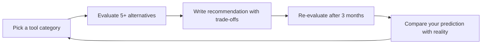

## Deliberate Practice

| Level | Practice | Frequency |
|-------|----------|-----------|
| **Novice** | Pick a tool your project already uses. Run the full Tool Discovery Protocol on it — as if you were choosing today. How does your current choice compare? | Monthly |
| **Competent** | Evaluate tools for a category you don't know (e.g., a frontend dev evaluating backend frameworks). Force yourself beyond comfort zone. Write a comparison blog post. | Quarterly |
| **Expert** | Predict which tools will rise in the next 12 months. Write down your predictions with reasoning. Review after 12 months — what signals did you miss? What did you correctly identify? | Quarterly |
| **Master** | Mentor a junior through a tool evaluation. Your role: ask questions, don't give answers. Can they arrive at the right conclusion independently? What biases did they show? | Monthly |

**The One Highest-Leverage Activity:** Once per quarter, take a tool your team adopted more than 12 months ago and run a "re-adoption" evaluation. Would you choose it today? If not, what changed? This catches "zombie tools" — tools that were right at adoption time but are now outclassed by newer alternatives.
