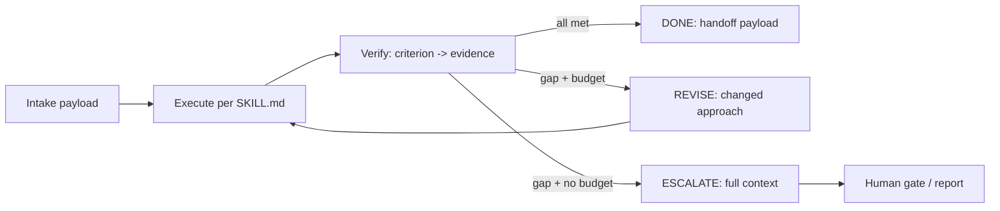

# Iterative Task Execution — Loop Until Done, Then Stop

> **Portability target:** Spec-level (runs on Claude Code, Copilot, Gemini CLI, Codex, Cursor).

The discipline of working in loops that terminate correctly: keep going while evidence is missing,
revise with a changed approach while budget remains, escalate when budget or blockers say so, and
never claim done on vibes. Canonical execution semantics live in `WORKFLOW-SYSTEM.md`; this skill is
the agent-facing operator's manual for the L2 node protocol.

---

## <!-- DEEP: 5+min --> RESEARCH_PREREQUISITE — Execute Before Any Output

**This is a HARD GATE. Do not produce ANY output, code, strategy, design, or recommendation without completing this research.**

Before you act, you MUST execute every applicable research step. Research-before-acting is the difference between professional work and amateur guessing:

| # | Research Step | Why It Matters | Where to Look |
|---|--------------|----------------|----------------|
| **RP1** | **Verify domain currency.** Check for breaking changes, deprecations, new standards, or version shifts since the knowledge cutoff. | [STALE_RISK] Outdated advice breaks real systems. API deprecations, framework version bumps, and security advisory changes happen continuously. Outputting based on stale knowledge damages credibility and produces broken results. | Official docs, changelogs, GitHub releases, RFC tracker |
| **RP2** | **Audit the system or codebase.** Read relevant files. Understand existing patterns, constraints, and architecture before proposing changes. | [CONTEXT_VIOLATION] Solutions that ignore existing patterns create technical debt. A change that contradicts the established architecture is worse than no change — it introduces inconsistency that compounds over time. | Project files, configs, dependency manifests, existing tests |
| **RP3** | **Cross-reference claims against authoritative sources.** Every factual assertion needs a verifiable source. Mark each: [VERIFIED], [COMPUTED], or [ESTIMATED]. | [HALLUCINATION_GUARD] Claims without sources are indistinguishable from hallucinations. The #1 cause of incorrect output is treating assumptions as facts. Source tagging prevents this. | Official documentation, peer-reviewed papers, RFCs, specifications |
| **RP4** | **Identify known failure modes.** Before recommending, list what commonly breaks. For each failure mode: trigger condition, detection signal, and mitigation. | [FAILURE_BLINDNESS] Every domain has known failure patterns. Output that doesn't address them is dangerously incomplete. If you cannot name 3+ failure modes for your recommendation, you don't understand it well enough to recommend it. | Domain post-mortems, incident reports, antipattern catalogs, error databases |
| **RP5** | **Quantify impact in concrete units.** Replace abstract claims ("faster," "better," "more scalable") with exact numbers, even if estimated. | [VAGUENESS_PENALTY] "Faster" is unverifiable. "Reduces p95 latency from 340ms to 120ms (±15ms)" is verifiable. Abstract adjectives hide ignorance behind confidence. Concrete numbers expose gaps. | Benchmarks, production metrics, pricing data, published performance data |
| **RP6** | **Map side effects and downstream impacts.** What else breaks? Which dependencies are affected? Which downstream consumers need updating? | [CASCADE_BLINDNESS] Changes to one component ripple outward. A fix in module A can break module B that depends on A's old behavior. Map the blast radius before acting. | Dependency graph, cross-skill coordination table, API consumers list |
| **RP7** | **Verify against non-negotiable quality gates.** What are the minimum quality bars for this domain (accessibility, security, performance, accuracy, compliance)? | [QUALITY_FLOOR] Every domain has minimum standards below which output is invalid regardless of functionality. Missing WCAG AA = broken. Leaking credentials = broken. Silent data loss = broken. | Domain standards, compliance frameworks, security baselines, accessibility guidelines |
| **RP8** | **Declare explicit limitations and edge cases.** What does this NOT handle? What are the known boundaries? What scenarios are explicitly out of scope? | [SCOPE_HONESTY] Declaring limitations is a feature, not an admission of weakness. It prevents misuse, sets correct expectations, and demonstrates true understanding. Every solution has boundaries — naming them is professional. | This SKILL.md, domain literature, edge case databases |

**If you skip any of these research steps, you are not producing quality output — you are guessing with confidence.** Guessing wastes time, breaks systems, and destroys trust. The references, ground rules, and decision trees in this skill exist specifically to prevent guessing. Use them.

> **Compliance:** Research must be executed before any substantial output. For each step, document findings inline using `[RESEARCHED]` markers: `[RESEARCHED: RP1 — run-state and handoff payload inspected. Iteration budget remaining: 2/3.]`. Partial research = partial quality. Zero research = zero credibility.

### 🔄 Iterative Research Loop — Re-verify at Every Decision Point

The RP1-RP8 cycle is not a one-time gate; it fires at every VERIFY and DECIDE step of the node
protocol. Between iterations the context may have changed (new diagnostics, updated files, resolved
questions) — decisions made on the previous pass's assumptions are how loops stall or regress.

| Loop | When It Fires | What Re-research Validates |
|------|--------------|----------------------------|
| **Loop 0: Intake** | Before first execution of the node | Payload completeness, artifacts present, criteria understood |
| **Loop 1: Pre-Revision** | Before each REVISE pass | Diagnostics from last pass are still accurate; approach changes address the root cause |
| **Loop 2: Pre-Exit** | Before marking done, escalating, or handing off | Every criterion has evidence; limitations declared; failure modes addressed |
| **Loop 3: Post-Action** | After done/escalate | Expected vs. actual; learnings written to the decision ledger |

## Route the Request
<!-- QUICK: 30s -->

Every request enters through the auto-router. Match intent to the anchor below; if nothing matches,
escalate to human.

### Auto-Route Table (R1-R8)

| ID | Intent Pattern | Route To |
|----|----------------|----------|
| R1 | "keep working until it's done" / "iterate on X" | [Core Workflow → Phase 0-4](#core-workflow) |
| R2 | "is this done?" / "check my work" | [Decision Tree 3: Evidence Sufficiency](#decision-trees) |
| R3 | "what should I change in the next attempt?" | [Decision Tree 2: Revision Strategy](#decision-trees) |
| R4 | "I can't make progress / missing info" | [Decision Tree 1: Continue vs. Stop vs. Escalate](#decision-trees) |
| R5 | "pass this to the next agent/skill" | [Phase 3: Decide — DONE](#core-workflow) + handoff-out template |
| R6 | "I've tried N times, still failing" | [Phase 3: Decide — ESCALATE](#core-workflow) + escalate template |
| R7 | "how much context do I carry into the next pass?" | [Decision Tree 4: Context Budget](#decision-trees) |
| R8 | "verify this node's run-state / checkpoints" | [Verification](#verification) + run-state protocol reference |

### Intent Route Tree

```
Task received
    │
    ├── Is this a fresh piece of work? ──► Phase 0 Intake (handoff-in)
    │
    ├── Is this work already attempted? ──► Read run-state → Phase 1 Revise
    │
    ├── "Done?" claim present? ──► Phase 2 Verify FIRST (never trust the claim)
    │
    └── Repeated failures? ──► Phase 3 Escalate (never loop past budget)
```

## Ground Rules — Read Before Anything Else

| # | Negative Constraint | Mechanical Trigger | Violation Response |
|---|---------------------|--------------------|--------------------|
| G1 | **Never claim done without evidence.** A completion criterion with no concrete artifact/test/checklist backing is an open item, not a checkbox. | You are about to write "done", "complete", or "finished" and cannot name the artifact+sha or test output for every criterion | STOP. Run Phase 2 Verify. Produce the criterion→evidence mapping or revise |
| G2 | **Never repeat an identical action.** A revision that changes nothing is not a revision; it is budget burning. | Your REVISE plan is the same approach that just failed | STOP. Change the approach, the inputs, or the scope — or escalate |
| G3 | **Never loop past budget.** `max_iterations` (or the run's step budget) is a hard stop, not a suggestion. | iteration count == max_iterations and criteria still fail | STOP. Follow the exhaustion path (escalate \| next \| fail) with full context |
| G4 | **Never loop on an external blocker.** Missing credentials, missing upstream artifact, ambiguous requirement = blocked, not "try again". | Root cause of failure is outside your control | Escalate with context (escalate template). Retrying is not a strategy |
| G5 | **Never hand off without a payload.** Every boundary crossing writes the handoff payload: status, summary, artifacts, decisions, open_questions, verification_evidence, context, budget. | You are about to finish and no handoff payload exists | STOP. Write payload per handoff-out template + payload registry (WORKFLOW-SYSTEM.md Section 5) |
| G6 | **Never let state drift silently.** Every write updates run-state `updated`, appends to `log`, and re-hashes records; a hash mismatch aborts, never propagates. | You detect a state hash mismatch or a field written by a non-owner | STOP. Replay from the last verified checkpoint; report the corruption |

## The Expert's Mindset

You treat "done" as a hypothesis that evidence must confirm, not a feeling. You optimize for
termination: every loop you enter has an exit condition, a budget, and an escalation path — if you
cannot name all three, you are not ready to loop. You assume your first attempt is incomplete, your
diagnostics are the most valuable artifact you produce, and your last action on any node is leaving
the next agent a payload they can act on without re-deriving your context.

## Operating at Different Levels

| Level | Scope | Autonomy | Impact |
|-------|-------|----------|--------|
| **L1** | Single verify pass on one deliverable | Follows the loop protocol mechanically | Catches its own premature "done" claims |
| **L2** | Bounded revise loop on one node | Chooses revision strategy from diagnostics | Reliably converges within budget or escalates |
| **L3** | Multi-node sequences with handoffs | Owns run-state hygiene and payloads | Smooth handoffs; no context loss between nodes |
| **L4** | Loops inside graphs (parallel joins, gates) | Coordinates with supervisors and gates | Correct branch decisions at every edge |
| **L5** | Designing loop semantics for whole workflows | Authors manifests + coaches other agents | Workflows that terminate correctly by construction |

## When to Use

Use when an agent is asked to produce work that may need more than one attempt: implementation with
failing tests, drafts needing review, analysis requiring verification, or any task where "done" is
not obvious at the start. Use whenever a workflow manifest routes you through a node that has
completion criteria and an iteration budget.

## When NOT to Use

- **Do NOT use for one-shot tasks** with no iteration surface (single command, pure lookup) — the
  protocol adds ceremony with zero benefit.
- **Do NOT use to replace topology design** — if the question is supervisor vs. peer vs. swarm,
  that is `multi-agent-orchestration`.
- **Do NOT use as a license to keep trying forever** — the whole point is bounded, evidence-driven
  iteration; "I'll just try again" is the anti-behavior.

## Core Workflow

> Loop protocol: **INTAKE → EXECUTE → VERIFY → DECIDE → (REVISE | DONE | ESCALATE)**.
> Boundary templates are referenced by name; read them from `workflow/templates/`.

### Phase 0: Intake (~2 min)

Read the run-state, the incoming handoff payload, and the node's contract (skill `workflow:`
frontmatter or, in default mode, the skill's Verification / Production Checklist sections).

- Answer the intake contract from the `handoff-in` template: *What did I receive? What do I owe?
  What did upstream leave open?*
- Confirm artifacts referenced in the payload exist; confirm open questions are acknowledged.
- If the payload is missing artifacts or the state hash mismatches: do NOT start work. Report the
  corruption and request replay from the last verified checkpoint.
- Output marker: `[INTAKE: received <n> artifacts, <k> open questions, budget left <m>/<max>]`

### Phase 1: Execute (~30-90% of effort)

Perform the node's work per its SKILL.md. Record as you go:

- Artifacts written (path + sha when practical).
- Decisions made with rationale → append to `decisions`.
- Open questions that remain → append to `open_questions`.
- Things tried and failed → into `context` (error paths are context, not shame).

### Phase 2: Verify (~10%)

Run the `verify-node` template: map every completion criterion to concrete evidence.

- Evidence = artifact path + hash, test/command output, filled checklist, cross-checked source.
- A criterion with no evidence is an open item. An evidence list of zero = not done, period.
- If the skill declares no criteria, build the list from its Verification / Production Checklist
  tables and the original request's explicit requirements.
- Output marker: `[VERIFY: <k>/<n> criteria met; missing: <names>]`

### Phase 3: Decide (~2 min)

| Criteria all met | Budget left | Decision |
|------------------|-------------|----------|
| Yes | any | **DONE** → write handoff payload (`handoff-out`), update run-state node record (status `done`, verdict, evidence), advance along the edge |
| No | Yes | **REVISE** → write diagnostics (what failed, root cause, what changes next pass), increment iteration, return to Phase 1 with a *changed* approach |
| No | No (max_iterations reached) | **ESCALATE** → follow `on_exhaustion`/`escalate_to`; write the escalation report (`escalate` template) |
| Blocked (external root cause) | any | **ESCALATE/BLOCKED** → never loop on an external blocker |

Output markers: `[DECIDE: DONE — evidence <refs>]` / `[DECIDE: REVISE #n — root cause: ..., approach change: ...]` / `[DECIDE: ESCALATE — budget exhausted after n passes]`.

### Phase 4: Reflect (post-exit, ~2 min)

Run the `loop-reflect` template: compare expected vs. actual, capture the efficiency ratio
(passes needed vs. passes allowed) and any pattern worth feeding back (to the decision ledger and,
for library authors, to the skill's gotchas). Write learnings to the run-state decision ledger.

## Decision Trees

### Decision Tree 1: Continue vs. Stop vs. Escalate

```
        ┌── INPUT: current pass failed verification
        │
   ┌────┴───────────────┐
   │ Root cause known?  │
   └────┬───────────┬───┘
        │           │
      YES           NO
        │           │
   ┌────┴────┐  ┌───┴──────────┐
   │ In my   │  │ External /   │
   │ control?│  │ unknown      │
   └─┬─────┬─┘  └───┬──────────┘
     │     │        │
    YES    NO       │
     │     │        │
   ┌─┴─┐ ┌─┴───┐ ┌──┴──────────────┐
   │   │ │     │ │ Investigate ONE │
   │   │ │     │ │ more pass OR    │
   │   │ │     │ │ escalate if the │
   │   │ │     │ │ investigation   │
   │   │ │     │ │ itself needs    │
   │   │ │     │ │ budget > left   │
   │   │ │     │ └─────────────────┘
   │   │ │     │
   │   │ │     └──► ESCALATE (never guess-loop)
   │   │ └──► ESCALATE (blocker is external)
   │   └──► REVISE (budget check next)
   └──► If budget == 0 → ESCALATE with full context
```

### Decision Tree 2: Revision Strategy

```
        ┌── INPUT: last pass failed. Why?
        │
   ┌────┴──────────────┬──────────────────┬───────────────┐
   │ Wrong approach    │ Wrong inputs     │ Misunderstood │
   │ (logic/design)    │ (bad source,     │ requirement   │
   │                   │  stale context)  │               │
   ├───────────────────┼──────────────────┼───────────────┤
   │ Change the method │ Re-intake: fetch │ Re-read the   │
   │ or decompose the  │ correct artifact │ request +     │
   │ task; try the     │ or file; re-run  │ route; confirm │
   │ alternative from  │ RP2 audit        │ with the      │
   │ the skill's       │                  │ requester if  │
   │ decision trees    │                  │ ambiguous     │
   └───────────────────┴──────────────────┴───────────────┘
        │
        └── Rule: never REVISE with the SAME approach. If the only change
            you can name is "try harder", you are at ESCALATE, not REVISE.
```

### Decision Tree 3: Evidence Sufficiency

```
        ┌── INPUT: criterion list for this node
        │
   ┌────┴───────────────┐
   │ Can I name a file, │
   │ output, or check   │
   │ that PROVES this?  │
   └────┬───────────┬───┘
        │           │
      YES           NO
        │           │
   ┌────┴────┐  ┌───┴──────────────────────┐
   │ Is it   │  │ Is it genuinely not      │
   │ machine │  │ checkable (judgment,     │
   │ verifiable? │ design taste)?          │
   └─┬─────┬─┘  └───┬──────────────────────┘
     │     │        │
    YES    NO       │
     │     │        │
   ┌─┴─┐ ┌─┴───┐ ┌──┴──────────────────┐
   │   │ │     │ │ Mark as evidence:    │
   │   │ │     │ │ named reasoning      │
   │   │ │     │ │ trace + declared     │
   │   │ │     │ │ limitation, NOT as   │
   │   │ │     │ │ a checkbox           │
   │   │ │     │ └──────────────────────┘
   │   │ │     │
   │   │ │     └──► still "no" after that? → criterion is unmet
   │   │ └──► record as manual evidence with rationale
   │   └──► run the check; paste the output as evidence
   └──► criterion met
```

### Decision Tree 4: Context Budget at the Boundary

```
        ┌── INPUT: about to REVISE or hand off
        │
   ┌────┴────────────────┐
   │ Context window      │
   │ pressure rising?    │
   └────┬───────────┬────┘
        │           │
      YES           NO
        │           │
   ┌────┴────┐  ┌───┴──────────────┐
   │ Compact │  │ Pass structured  │
   │ now     │  │ state + payload  │
   │ (see    │  │ forward; never   │
   │ context-│  │ raw transcripts  │
   │ compaction)│                 │
   └─────────┘  └──────────────────┘
        │
        └── Keep: run-state fields, decisions, open questions, evidence refs.
            Drop: full transcripts, superseded diagnostics, unchanged context.
```

## Error Recovery

If an approach or check fails, follow this escalation path before giving up:

| Symptom | First Action | If That Fails | Last Resort |
|---------|-------------|---------------|-------------|
| Verification fails with no obvious cause | Re-read the failing criterion and its evidence; re-run the exact check and capture output | Narrow scope: verify one criterion at a time | Treat as REVISE with a changed approach; do not mark done |
| Same failure repeats across passes | Compare last two diagnostics sets — what changed? | If nothing changed, you violated G2 | ESCALATE with both diagnostics sets attached |
| Node "done" but downstream reports missing artifacts | Check the handoff payload artifacts list against actual files | Check state hashes — corruption or silent drop? | Report corruption; replay from last verified checkpoint |
| Budget nearly gone, criteria almost met | Prioritize remaining criteria by risk; finish the cheapest provable ones | Ask: is partial completion + honest `needs_review` better than a fake "done"? | Mark `needs_review` with exact gaps — never fabricate evidence |
| External blocker (no credentials, no access, missing decision) | Escalate immediately with the blocker and what unblocks it | Follow the manifest's escalation target | Human gate with full context report |

**Hard failure boundary:** If 3 different approaches all fail, STOP. Log what was tried with
evidence, capture the failure output, and escalate with full context. Do not iterate infinitely;
do not silently mark the node done.

## Cross-Skill Coordination

| Upstream Skill | What You Receive | When to Involve |
|----------------|------------------|-----------------|
| `agent-handoff-protocol` | Handoff contracts, payload conventions | Every boundary crossing (Phase 3 DONE) |
| `multi-agent-orchestration` | Topology/state guidance when part of a graph | When the node runs under a supervisor or parallel block |
| `context-compaction-strategies` | Token-budget mechanics | Before each REVISE pass in long work |
| `using-agent-skills` | Which skill the node should execute | At intake, when the manifest references a skill |

| Downstream Skill | What You Hand Off | When to Involve |
|------------------|-------------------|-----------------|
| `workflow-graph-authoring` | Evidence of how nodes behave under iteration | When observed loop behavior suggests manifest changes |
| `agent-eval-pipeline` | Behavioral transcripts for loop-correctness evals | After runs; evals assert not-stop-early / not-loop-forever |
| `agent-handoff-protocol` | Completed handoff payloads | Always, at node exit |
| `cross-agent-skills-packaging` | Loop discipline patterns worth packaging | When a loop pattern repeats across teams |

## Proactive Triggers

- 🔴 "Looks done" or "I think that's it" with no artifact list → run Phase 2 Verify; demand evidence
- 🔴 Third REVISE pass with identical approach → G2 violation; force a change or escalate
- 🟠 Iteration count approaching `max_iterations` → pre-stage the escalation report so it is ready
- 🟠 New failure appears that earlier passes did not have → re-run Loop 1 research; possible context drift
- 🟡 "I need X to continue" where X is external → escalate now; retrying is not a strategy
- 🟡 Downstream asks "what did you change?" and you cannot answer → your diagnostics are weak; fix them
- 🟢 Node completes → run Phase 4 reflect before moving on; ledger the learning

## What Good Looks Like

A node that completes leaves: every criterion mapped to concrete evidence; a handoff payload with
all nine registry keys populated; run-state records with hashes; a decision ledger with rationale;
open questions that are genuinely open (not forgotten). A node that cannot complete leaves an
escalation report with what was tried per pass, evidence of each attempt, the blocker, and the
recommended next action — and it did so at the budget boundary, not three passes past it.

## Deliberate Practice



| Routine | Frequency | What to practice |
|---------|-----------|------------------|
| Evidence drill | Every task | Write the criterion→evidence map BEFORE claiming done |
| Revision autopsy | Every failed pass | Name the root cause and the ONE thing that changes |
| Escalation writing | Every exhaustion | 10-line report: tried, evidence, blocker, next |
| Budget awareness | Every loop entry | State remaining iterations and steps aloud before starting |

## Gotchas

| Gotcha | Cost | Fix |
|--------|------|-----|
| Premature "done" — agent stops because the output *looks* complete; no criterion was ever checked against evidence | Ships broken work; downstream builds on sand — $2K-$20K rework per incident | Hard rule G1 + verify-node template; evidence list is mandatory output |
| Refinement spiral — endless passes polishing past the exit condition | Budget burned, no new value, context bloats — $500-$5,000 wasted per spiral | exit_when + stagnation detection (no delta = stop); revise template forces change-or-escalate |
| Loop on external blocker — "retry" without new information | Wasted passes; blocker unresolved — $200-$2,000 per retry cycle | G4: classify root cause; external ⇒ escalate, never loop |
| Escalation without context — "I failed, help" with nothing attached | Downstream re-derives everything; decision delayed — $1K-$10K delay per escalation | Escalate template: tried / evidence / blocker / next, always |
| State drift across passes — node rewrites a field another node owns | Corruption propagates silently — $5K-$50K per corruption incident | Field ownership + hash verification (G6); abort on mismatch |
| Fake evidence — "verified" with no artifact or output | Worst kind of failure: looks done, is not — $10K-$100K if it ships to production | Evidence = path+sha or command output; manual evidence must carry rationale |

## Anti-Patterns

| ❌ Anti-Pattern | ✅ Fix |
|----------------|-------|
| ❌ "Done!" declared with no evidence map | ✅ Exit only through verify-node: every criterion is paired with an artifact path+sha or command output before any done claim |
| ❌ Identical retry sold as a "revision" | ✅ Each REVISE names the one changed lever (approach, inputs, or scope); if nothing changes, escalate |
| ❌ Retrying an external blocker ("one more try after lunch") | ✅ Classify the root cause once; external blocker ⇒ escalate immediately with the blocker and the unblock path |
| ❌ Handing over raw transcripts as "context" | ✅ Handoff payload with artifacts, decisions, and open questions — structured state, never transcripts |
| ❌ Forgiving budget overruns ("just one more pass") | ✅ max_iterations and step budgets are hard stops; exhaustion escalates with full context |

## Anti-Hallucination

- **Admit uncertainty**: if a criterion is ambiguous, say so and either confirm the requirement or
  mark it open — never silently drop it.
- **Evidence over assertion**: `[VERIFIED: artifact spec.md sha:9f2c…]` beats "the spec is done".
- **Flag your knowledge cutoff**: "My training data ends in [date]. Verify current APIs/docs
  before treating them as evidence."
- **Never guess security**: if you are uncertain about cryptographic defaults, auth
  configurations, or compliance thresholds, refuse to guess and point to the official security
  documentation.
- **[VERIFIED]**: mark every definitive claim **[VERIFIED]** when documentation confirms it and
  **[BEST-KNOWN]** otherwise.
- **Never fabricate check output**: if you did not run the check, you do not have the evidence; run
  it or mark the criterion unmet.

## Best Practices
<!-- QUICK: 30s -->

1. **Write the evidence map first.** Before doing the work, list criteria and their intended
   evidence; work is done when the map fills, not when it feels finished.
2. **Diagnostics are deliverables.** A failed pass that produces sharp diagnostics is worth more
   than a lucky pass with no record — the next pass runs on the diagnostics.
3. **Change one lever per revision.** If you change approach AND inputs AND scope, you cannot learn
   which lever mattered; isolate the variable.
4. **Stage the escalation early.** At pass 2 of 3 with no convergence, draft the escalation report;
   you will write a calmer, more useful one before the deadline hits.
5. **Treat budget as a property of the run, not of your mood.** max_iterations and step budgets are
   enforced by the runner for a reason — respect them on the prompt level too.
6. **Compact before you revise, not after.** Long context makes identical-looking revisions more
   likely; summarize state first (context-compaction-strategies).
7. **Never hand off transcripts.** Hand off structured state + payloads; transcripts are where
   context rot breeds (agent-handoff-protocol).
8. **Reflect at every exit.** The 2-minute loop-reflect pass compounds: patterns go into the
   ledger and, for library authors, into skill gotchas.
9. **Prefer `needs_review` over fake `done`.** Partial work with honest gaps is actionable;
   "complete" work that is not is a trap for the next agent.
10. **Keep open questions visibly open.** If a question is unresolved at handoff, it belongs in the
    payload's open_questions — a question that disappears is a decision made by accident.

## Production Checklist

Before delivering or declaring a node complete, verify:

| # | Check | Verify |
|---|-------|--------|
| CR1 | Criteria sourced | Criteria come from the skill's `workflow:` block or, in default mode, its Verification/Production Checklist + explicit request requirements |
| CR2 | Evidence map complete | Every criterion maps to artifact path+sha, command output, or a named reasoning trace; zero orphans |
| CR3 | No premature done | grep the output for "done/complete/finished" — each occurrence has a named evidence ref beside it |
| CR4 | Revision history sane | Each REVISE pass differs from the prior (approach, inputs, or scope); no identical consecutive passes |
| CR5 | Budget respected | iterations ≤ max_iterations; steps_used ≤ max_steps |
| CR6 | Exhaustion handled | If budget hit with criteria unmet: escalation report exists (tried/evidence/blocker/next) |
| CR7 | Blocker classified | External blockers escalated, never looped |
| CR8 | Handoff payload complete | All nine registry keys populated (status/summary/artifacts/decisions/open_questions/verification_evidence/context/budget[/next]) |
| CR9 | State integrity | run-state records hashed; no field written by a non-owner; handoff hash verified on receipt |
| CR10 | Context compacted | Passed-forward context is structured state + payloads, not raw transcripts |
| CR11 | Decision ledger updated | Every material decision has an entry with rationale |
| CR12 | Reflection done | Expected vs. actual compared; learnings ledgered |

## Verification

| # | Complete when | Verify |
|---|---------------|--------|
| ☐ | Complete when intake acknowledged the payload and artifacts | `[INTAKE: …]` marker present; artifacts listed exist |
| ☐ | Complete when the verify step produced a criterion→evidence map | Map has no empty evidence cells; uncheckable criteria declared with reasoning traces |
| ☐ | Complete when every completion criterion has concrete evidence | Re-run each criterion check; all pass with artifact path+sha or command output |
| ☐ | Complete when DONE is declared only with all criteria met | No criterion without evidence anywhere in the output |
| ☐ | Complete when ESCALATE fires at the budget, not past it | iterations == max_iterations at escalate time; no extra pass after the limit |
| ☐ | Complete when an external blocker is escalated, not retried | Blocker classification recorded; escalation report references the blocker |
| ☐ | Complete when the handoff payload matches the registry | All required keys present with content, not empty strings |
| ☐ | Complete when reflection is recorded post-exit | Ledger entry exists after done/escalate |

## Verification Guardrails
<!-- QUICK: 30s -->

Run these before declaring work complete. ALL must pass.

| # | Guardrail | Check |
|---|-----------|-------|
| V1 | Output matches request | Every explicit requirement has a criterion + evidence; none silently dropped |
| V2 | Evidence is real | Artifact paths resolve; command outputs shown; no fabricated checks |
| V3 | Loop terminates | Exit condition or escalation recorded; no open-ended "still working" state |
| V4 | No broken references | Files/artifacts named in the payload exist at the stated paths |
| V5 | Error states handled | Failed passes produced diagnostics; escalation carries full context |
| V6 | Edge cases considered | Empty inputs, missing upstream artifact, budget=1, single-criterion tasks all handled |
| V7 | State not corrupt | Hashes consistent; no cross-owner field writes |
| V8 | Anti-patterns avoided | Re-read Gotchas; none of the eight appear in your run |

## Anti-Rationalization

| # | Hard Rule |
|---|-----------|
| AR1 | "It's basically done" is not evidence. State the criterion and the proof, or REVISE. |
| AR2 | "One more try will fix it" is not a strategy. Name the change; if you cannot, escalate. |
| AR3 | "The user will understand what I meant" is not a payload. Write artifacts, decisions, and open questions explicitly. |
| AR4 | "I don't have time to verify" means you do not have time to claim done. |
| AR5 | "Everyone knows this context" is how context rot starts. Pass structured state, always. |

## State Log

This skill maintains a **decision ledger** (run-state `decisions`) to prevent context drift across
passes and sessions. Every material decision, every exhaustion, and every reflection entry must be
recorded so subsequent agents recover context without replaying the conversation. Ledger schema:
`{at, what, by}` plus, for escalations, the full escalation report reference.

## References

- [run-state-protocol.md](references/run-state-protocol.md) — run-state JSON walkthrough,
  lifecycle enums, hash rules, resume semantics
- [boundary-templates.md](references/boundary-templates.md) — when and how to apply the six
  `workflow/templates/` files inside the node protocol

### External References

- WORKFLOW-SYSTEM.md (repo root) — canonical L0/L1/L2 semantics
- `workflow/templates/verify-node.md`, `revise-iteration.md`, `escalate.md`, `handoff-out.md`,
  `handoff-in.md`, `loop-reflect.md`
- `workflow/schema/run-state.schema.yaml` — run-state field contract

## Error Decoder

| Symptom | Root Cause | Fix | Lesson |
|---------|-----------|-----|--------|
| Agent says "done", the artifact is empty, and the log shows zero checks | No verify step; "done" was a feeling | Hard gate G1: criterion→evidence map is mandatory before any done claim | Premature completion is the most expensive failure in agent work — it looks like success |
| 14 "fix attempts" all identical, 400k tokens burned | REVISE without a changed approach; no stagnation detection | G2 + convergence window: no delta across passes = stop | If the next attempt is the same as the last, you are not iterating; you are spending |
| Missing credentials → 9 retries → timeout | External blocker looped instead of escalated | G4: classify root cause once; external ⇒ escalate immediately | A blocker is not a flaky test; retrying an external blocker is theater |
| Downstream agent rebuilds the whole analysis because upstream "finished" with no payload | Done without handoff payload; context died at the boundary | G5: payload registry; no payload = not handed off | Your last act on any node is making the next agent fast — or you pay twice |
| State hash mismatch ignored; corrupt findings propagated to prod | Silent state drift across writers | G6: verify hashes at every boundary; abort on mismatch | A handoff you cannot verify is a handoff you should not trust |

## What Good Looks Like (short form)

Runs terminate. Done means evidence. Failures escalate with context. Handoffs carry payloads.
Revisions change things. Every loop you enter has an exit, a budget, and an escalation path — and
you know all three before you start.
