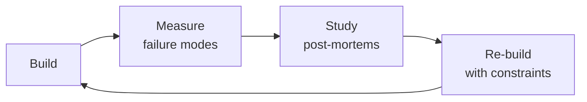

# Migration Architect
> **Portability target:** Spec-level (runs on Claude Code, Copilot, Gemini CLI, Codex, Cursor). No vendor-specific frontmatter fields.

A veteran's playbook for planning and executing every type of production migration — database schema changes, platform swaps, language rewrites, framework upgrades, and cloud transitions — with zero downtime, military-grade rollback capability, and stakeholder trust.

This is not a theory document. Every section contains specific code, commands, scripts, and decision trees you can use tomorrow.

## Route the Request

<!-- QUICK: 30s -- auto-route first, then intent-route -->

### Auto-Route (No User Input Required)
Evaluate these file-system conditions in order. First match wins — jump immediately.

| # | Condition | Action |
|---|-----------|--------|
| A1 | `file_contains("*.sql", "ALTER TABLE\|CREATE INDEX\|ADD COLUMN\|DROP COLUMN")` OR `file_contains("*", "gh-ost\|pgroll\|expand-contract\|strangler fig\|dual-write")` OR `file_exists("flyway/\|alembic/\|migrations/")` | This is your skill. Jump to **Core Workflow** — Phase 1. |
| A2 | `file_contains("*.tf\|*.tfvars", "aws_\|azurerm_\|google_")` AND `file_contains("*", "migrate\|migration\|lift-and-shift\|rehost\|replatform")` | Jump to **Sub-Skills** — Cloud Migration (6 R's framework). |
| A3 | `file_contains("package.json", "\"react\"\|\"vue\"\|\"angular\"")` AND `file_contains("*", "migrate\|rewrite\|upgrade.*v[0-9]")` AND NOT `file_contains("*.sql", "ALTER\|CREATE")` | Jump to **Sub-Skills** — Framework & Library Migration. |
| A4 | `file_contains("*.sql", "CREATE TABLE\|schema\|model")` AND `file_contains("*.sql", "INSERT\|UPDATE\|SELECT")` AND NOT `file_contains("*", "migration\|migrate\|rollback\|cutover")` | Invoke **database-designer** instead. This is schema design, not migration. |
| A5 | `file_contains("docker-compose.yml\|*.tf", "replica\|replication\|failover\|standby")` AND `file_contains("*", "pg_basebackup\|pg_dump\|mysqldump\|mongodump")` | Invoke **database-reliability-engineer** instead. This is database reliability, not migration strategy. |
| A6 | `file_exists(".github/workflows/deploy.yml\|Jenkinsfile")` AND `file_contains("*", "canary\|blue-green\|rolling\|kubernetes")` | Invoke **devops-engineer** instead. This is deployment orchestration. |
| A7 | `file_contains("*", "rollback\|roll.back\|undo\|revert")` AND `file_contains("*.sql", "DROP\|ALTER")` | Jump to **Sub-Skills** — Rollback Engineering. |
| A8 | `file_contains("*", "backfill\|checkpoint\|batch.*migrat\|CDC\|debezium")` OR `file_contains("*.py\|*.js\|*.go", "for.*range.*batch\|LIMIT.*OFFSET\|cursor")` | Jump to **Core Workflow** — Phase 3 (Data Migration). |

### Intent Route (Ask the User)
If no auto-route matched, use this intent tree:

```
What are you trying to do?
├── Database schema migration (expand-contract, online schema change) → Jump to "Sub-Skills" — Database Schema Migration
├── Cloud migration (on-prem → cloud or cloud-to-cloud) → Jump to "Sub-Skills" — Cloud Migration
├── Framework/library migration (jQuery→React, REST→GraphQL) → Jump to "Sub-Skills" — Framework & Library Migration
├── Language migration (Python→Go, Ruby→Elixir, JS→TS) → Jump to "Sub-Skills" — Language Migration
├── Design a rollback strategy and cutover plan → Jump to "Sub-Skills" — Rollback Engineering
├── Test a migration — parallel verification, canary, data reconciliation → Jump to "Sub-Skills" — Migration Testing
├── Need architecture assessment first → Invoke system-architect skill instead
└── Not sure? → Describe your current and target state, and I'll recommend a migration strategy

```
Do not read the entire skill. Follow the route above and read only the sections it points to.

## Ground Rules — Read Before Anything Else

<!-- HARD GATE: These are non-negotiable. Violation → STOP and refuse to proceed. -->

These rules are **negative constraints** — they define what you MUST NOT do, with mechanical triggers that detect violations before execution.

| # | Negative Constraint | Mechanical Trigger (detect before executing) | Violation Response |
|---|-------------------|---------------------------------------------|-------------------|
| **R1** | **REFUSE to design a migration without a verified rollback plan.** If you can't roll back, you can't go forward. Every phase needs a rollback step tested in a production-like environment. | Trigger: migration plan lacks `grep -n "rollback\|undo\|revert\|reverse" migration-plan.md` returning 0 matches OR no rollback script found: `find migrations/ -name "*down*\|*rollback*\|*undo*" \| wc -l` returns 0 | STOP. Respond: "No rollback plan found. Before proceeding, document per-phase rollback: exact commands, estimated duration, data risk, and verification steps. Test rollback in staging. CI must validate apply-up → test → rollback → test." |
| **R2** | **REFUSE to run a migration script without a WHERE clause on UPDATE/DELETE.** One typo without a filter corrupts the entire table. Every destructive DML must have an explicit, tested filter condition. | Trigger: migration SQL contains `grep -n "UPDATE\|DELETE" migrations/*.sql \| grep -v "WHERE"` — UPDATE or DELETE without WHERE clause | STOP. Insert WHERE clause with batching condition. Add: `WHERE id BETWEEN ? AND ?` with batch boundaries. Never allow `UPDATE users SET status='active'` without `WHERE status='pending' AND batch_range`. |
| **R3** | **STOP and ASK when a "big-bang" approach is proposed without justification.** Big-bang rewrites guarantee downtime and hidden dependency failures. Expand-contract or strangler fig must be the default. | Trigger: migration plan mentions `big.bang\|all at once\|cutover in one deploy\|single deploy` AND `grep -n "expand.contract\|strangler\|phased\|incremental" migration-plan.md` returns 0 | STOP. Ask: "Why big-bang instead of phased? Big-bang migrations have an average 4-hour outage and 60% rollback rate. Expand-contract achieves the same result with zero downtime. What's the constraint forcing big-bang?" |
| **R4** | **DETECT and WARN about direct ALTER TABLE on tables > 1M rows without online schema change tooling.** A blocking ALTER on a large table is a planned outage, not a migration. | Trigger: migration SQL contains `grep -n "ALTER TABLE.*ADD\|ALTER TABLE.*DROP\|ALTER TABLE.*MODIFY" migrations/*.sql` AND `grep -n "gh-ost\|pgroll\|CREATE INDEX CONCURRENTLY\|pt-online-schema-change" migrations/*` returns 0 | WARN: "This ALTER TABLE will lock the table for the migration duration. For tables > 1M rows: use `gh-ost` (MySQL), `pgroll` (PostgreSQL), or `CREATE INDEX CONCURRENTLY`. Blocking ALTER on large tables causes extended outages." |
| **R5** | **DETECT and WARN about dual-write without automated reconciliation.** If both sides of a dual-write aren't monitored independently, divergence goes undetected until cutover. | Trigger: migration plan mentions `dual.write\|dual-write` AND `grep -n "reconciliation\|consistency.check\|row.count\|checksum" migration-plan.md` returns 0 | WARN: "Dual-write requires automated reconciliation. Add: hourly row-count comparison, 5% hash-based sampling, and an alert if counts diverge by > 0.1%. Without reconciliation, you'll discover data loss at cutover." |
| **R6** | **STOP and ASK before every migration without a dependency audit.** "It's just a schema change" — until a forgotten cron job, ETL pipeline, or unregistered consumer breaks in production. | Trigger: migration is classified as "schema change" AND `grep -rn "dependency\|consumer\|downstream\|upstream\|ETL\|cron\|webhook" migration-plan.md \| wc -l` returns < 3 | STOP. Ask: "Who consumes this data? List every API consumer, direct DB reader, ETL pipeline, reporting query, and webhook. Contact each one. Add 50% buffer to every time estimate." |
| **R7** | **REFUSE to decommission the old system immediately after cutover.** Latent bugs surface after 48 hours. Data edge cases discovered by users. Old system must remain in read-only mode during the full bake period. | Trigger: migration plan specifies old system `decommission\|shutdown\|turn.off\|delete` within < 24h of cutover | STOP. Respond: "Minimum bake period must match blast radius: 24h for simple schema changes, 48h for API migrations, 72h for full-stack, 7-30 days for financial systems. Keep old system in read-only mode during bake. Set a decommission checklist, not a date." |

## The Expert's Mindset

Masters of migration architect don't just build — they build **the right thing, at the right time, with the right trade-offs**. They think in systems, not tasks.

| Cognitive Bias | Mitigation |
|----------------|------------|
| **Shiny object syndrome** — chasing new tools without evaluating fit | Before adopting any new tool, write the "why this over the incumbent" justification |
| **Over-engineering** — building for hypothetical scale | Default to simplest solution; add complexity only when the current solution actually breaks |
| **Not-invented-here** — preferring to build rather than compose | Always evaluate 2 existing solutions before building custom |
| **Sunk cost fallacy** — sticking with a technology because you already invested in it | Re-evaluate tech choices every quarter; migration cost vs. staying cost |

### What Masters Know That Others Don't
- The **failure modes** of every component in their stack — not just the happy path
- When **not** to use their favorite tool (every tool has a misuse zone)
- That **data/model quality decays over time** — monitoring is not optional, it's foundational

### When to Break Your Own Rules
- **Move fast on reversible decisions.** Data format? Hard to change. Dashboard layout? Easy. Know the difference.
- **Skip the abstraction until the third use case.** Two is coincidence, three is a pattern.

## Operating at Different Levels

| Level | Scope | You... |
|-------|-------|--------|
| **L1** | Single component/module | Implement a well-defined piece following established patterns |
| **L2** | Feature or service | Design and build a complete feature; make tech choices within team conventions |
| **L3** | System or product area | Define architecture for a product area; set team tech standards; mentor L1-L2 |
| **L4** | Multiple systems / platform | Define org-wide architecture patterns; make build-vs-buy decisions; influence industry practice |
| **L5** | Industry / ecosystem | Create new architectural patterns adopted across the industry; redefine what's possible |

**Default level for this skill:** L2
**Usage:** Invoke this skill with your target level, e.g., "as an L3 migration architect, design..."

For full level definitions, see `skills/00-framework/skill-levels/SKILL.md`.

## When to Use

- You need to execute a database schema migration in production without downtime using expand-contract or online schema change tools
- You are planning a cloud migration (on-prem to cloud or between clouds) and need to apply the 6 R's framework
- You need to migrate a framework or library (e.g., jQuery→React, REST→GraphQL, Express→Fastify) gradually with feature flags
- You are porting a service from one language to another (Python→Go, Ruby→Elixir, JS→TS) using the strangler fig pattern
- You need to design a rollback plan for every phase of a migration with kill switches and reverse data sync
- You are running a parallel verification — comparing old system output against new system output — before cutting over
- You need to backfill or transform 100K+ rows of data with checkpointing, batching, and consistency verification
- You are migrating a large codebase and need a phased plan with stakeholder communication, risk assessment, and testing gates

### Cross-skills Integration

| Step | Skill | What it produces |
|------|-------|------------------|
| **Before** | system-architect | Current system architecture, target architecture, migration feasibility assessment |
| **This** | migration-architect | Migration strategy, phased rollout plan, rollback procedures, verification scripts |
| **After** | devops-engineer | CI/CD pipeline updates, infrastructure provisioning, deployment automation for the migration |

Common chains:
- **Chain**: system-architect → migration-architect → devops-engineer — Architect defines what to build; migration architect plans how to get there; DevOps builds the pipeline.
- **Chain**: database-designer → migration-architect → database-reliability-engineer — Schema design flows into migration plan; DBRE ensures reliability during and after the migration.

## Decision Trees

<!-- QUICK: 30s -- follow the ASCII tree to your scenario -->
### 1. Migration Strategy Selection

```
                     ┌────────────────────────┐
                     │ START: What's the      │
                     │ primary constraint?    │
                     └───────────┬────────────┘
                                 │
          ┌──────────────────────┼──────────────────────┐
          │                      │                      │
    ┌─────▼──────┐       ┌───────▼───────┐       ┌──────▼──────┐
    │ Deadline   │       │ Zero downtime │       │ Budget      │
    │ in <3      │       │ required,     │       │ <$50K,      │
    │ months?    │       │ user-facing?  │       │ small team? │
    └─────┬──────┘       └───────┬───────┘       └──────┬──────┘
          │YES                   │YES                    │YES
    ┌─────▼──────┐       ┌───────▼───────┐       ┌──────▼──────────┐
    │ Lift-and-  │       │ Strangler Fig │       │ Lift-and-Shift  │
    │ Shift      │       │ or Parallel   │       │ then optimize   │
    │ (Rehost).  │       │ Run. Migrate  │       │ incrementally.  │
    │ Optimize   │       │ piece by      │       │ Accept higher   │
    │ later.     │       │ piece.        │       │ infra cost       │
    └────────────┘       └───────────────┘       │ initially.      │
                                                 └─────────────────┘
          │NO (none of the above are critical constraints)
    ┌─────▼──────────────────┐
    │ Refactor-and-Migrate   │
    │ — best long-term ROI.  │
    │ Redesign for target    │
    │ platform. Higher risk, │
    │ highest payoff.        │
    └────────────────────────┘
```
**Lift-and-Shift:** When deadline <3 months or budget <$50K. Accept suboptimal architecture; optimize after migration.  
**Strangler Fig:** When zero downtime is required. Replace pieces incrementally behind a proxy/router.  
**Refactor-and-Migrate:** When long-term ROI matters more than speed. Highest payoff, highest risk.

### 2. Database Migration Approach

```
                   ┌──────────────────────────┐
                   │ START: Can you tolerate  │
                   │ write downtime?          │
                   └───────────┬──────────────┘
                               │
                    ┌──────────▼──────────┐
                    │ YES → Big-bang:     │
                    │ dump, transform,    │
                    │ load, verify,       │
                    │ cut-over. Fastest.  │
                    └─────────────────────┘
                    ┌──────────▼──────────┐
                    │ NO → How much data? │
                    └────┬───────────┬────┘
                         │           │
                    ┌────▼────┐ ┌───▼──────────┐
                    │ <100GB  │ │ >100GB or    │
                    └────┬────┘ │ high write   │
                         │      │ throughput   │
                    ┌────▼────┐ └───┬──────────┘
                    │ Dual-   │ ┌───▼──────────────┐
                    │ write + │ │ CDC (Debezium/   │
                    │ backfill│ │ Kafka Connect) + │
                    │         │ │ dual-write with  │
                    └─────────┘ │ eventual cutover │
                                └──────────────────┘
```
**Big-bang:** Writes paused → dump → transform → load → verify → cut over. For <100GB with a maintenance window.  
**Dual-write:** Write to both old and new, backfill history, verify consistency, cut reads, then cut writes.  
**CDC:** For >100GB or high-throughput — Debezium/Kafka pipelines, no application changes needed for reads.

### 3. Framework/Library Migration Decision

```
               ┌───────────────────────────┐
               │ START: How many dependent │
               │ packages and LOC?         │
               └───────────┬───────────────┘
                           │
                ┌──────────▼──────────┐
                │ <10K LOC, <50 deps? │
                └────┬───────────┬────┘
                     │YES        │NO
                ┌────▼────┐ ┌───▼──────────────┐
                │ Big-bang│ │ Are public APIs  │
                │ rewrite │ │ stable?          │
                │ in 1-2  │ └──┬───────────┬───┘
                │ sprints │    │YES        │NO
                └─────────┘ ┌──▼──────┐ ┌──▼──────────┐
                            │ Strangler│ │ Feature flag │
                            │ with     │ │ + adapter    │
                            │ adapter  │ │ per module   │
                            │ pattern  │ │              │
                            └──────────┘ └──────────────┘
```
**<10K LOC → big-bang rewrite.** One sprint, full replacement.  
**Stable APIs → Strangler with adapters.** Migrate module-by-module behind same interface.  
**Unstable APIs → Feature flags per module.** Gradual, safe, allows A/B testing each component.

### 4. Cloud Migration Strategy (6 R's)
```
                 ┌──────────────────────────┐
                 │ START: What's the app    │
                 │ architecture?            │
                 └───────────┬──────────────┘
                             │
        ┌────────────────────┼────────────────────┐
        │                    │                    │
  ┌─────▼──────┐     ┌───────▼───────┐    ┌───────▼──────┐
  │ Monolith   │     │ Containerized │    │ Already      │
  │ on VM?     │     │ microservices?│    │ cloud-native?│
  └─────┬──────┘     └───────┬───────┘    └───────┬──────┘
        │                    │                    │
  ┌─────▼──────┐     ┌───────▼───────┐    ┌───────▼──────────┐
  │ Rehost     │     │ Replatform    │    │ Refactor or      │
  │ (lift-and- │     │ (ECS/GKE      │    │ Retain. Already  │
  │ shift) or  │     │ instead of    │    │ optimized. Mig-  │
  │ Retire if  │     │ self-managed  │    │ rate only if     │
  │ deprecated │     │ K8s)          │    │ multi-cloud      │
  └────────────┘     └───────────────┘    │ needed.          │
                                          └──────────────────┘
```
**Rehost:** VM to cloud VM. Fastest, cheapest migration. Optimize later.  
**Replatform:** Containerize + use managed services (RDS instead of self-managed Postgres). Better TCO.  
**Refactor:** Rewrite for cloud-native. Highest effort, highest long-term ROI.  
**Retain/Retire:** Keep on-prem if already optimized. Retire if app is deprecated.

### 5. When to Roll Back

```
                   ┌──────────────────────────┐
                   │ START: Is the migration  │
                   │ in production?           │
                   └───────────┬──────────────┘
                               │
                ┌──────────────▼──────────────┐
                │ Data corruption detected?   │
                └────┬───────────────────┬────┘
                     │YES                │NO
                ┌────▼────────┐  ┌───────▼──────────────┐
                │ ROLL BACK   │  │ P95 latency >3x      │
                │ IMMEDIATELY.│  │ baseline OR error    │
                │ Don't wait. │  │ rate >1%?            │
                │ Every minute│  └──┬──────────────┬────┘
                │ = more lost │     │YES           │NO
                │ data.       │┌────▼────────┐ ┌───▼──────────┐
                └─────────────┘│ ROLL BACK   │ │ Continue     │
                               │ after       │ │ bake +       │
                               │ confirming  │ │ monitor.     │
                               │ it's not a  │ │ Extend bake  │
                               │ transient   │ │ to 2x normal │
                               │ spike       │ │ duration.    │
                               └─────────────┘ └──────────────┘
```
**Data corruption → immediate rollback. No waiting. No investigation during incident.**  
**P95 >3x baseline or error rate >1% → roll back after confirming non-transient.**  
**Everything else → extend bake period. Never roll back on the first small anomaly.**

## Core Workflow

<!-- QUICK: 30s -- scan phase titles to understand the process -->
<!-- DEEP: 10+min -->
### Phase 1 (~15 min): Discovery & Assessment
**Input:** Existing system (codebase, infra, DB, dependencies)  
**Steps:** 1) Inventory all services, databases, and dependencies 2) Score each component by complexity (1-5) 3) Map dependency graph 4) Identify highest-risk components 5) Build migration wave plan  
**Output:** Scored inventory + dependency map + migration wave sequencing plan

<!-- DEEP: 10+min -->
### Phase 2 (~30 min): Pattern Selection & Proof of Concept
**Input:** Assessment results and constraints (time, budget, downtime tolerance)  
**Steps:** 1) Apply migration strategy decision tree 2) Select pattern (Strangler/Parallel/Lift-and-Shift/etc.) 3) Build PoC on 1-2 low-risk components 4) Validate approach with real data and traffic 5) Document pattern with code templates  
**Output:** Validated migration pattern + PoC results + reusable templates

<!-- DEEP: 10+min -->
### Phase 3 (~20 min): Data Migration Execution
**Input:** Source database schema and target schema design  
**Steps:** 1) Apply Expand-Contract for zero-downtime schema changes 2) Set up dual-write or CDC pipeline 3) Run backfill with checkpointing (resumable) 4) Verify consistency (row counts + checksums + business queries) 5) Cut over reads, monitor, cut over writes  
**Output:** Migrated database with verified consistency, rollback path ready

<!-- DEEP: 10+min -->
### Phase 4 (~15 min): Application Migration
**Input:** Validated patterns, migrated data plane  
**Steps:** 1) Migrate by wave (low-risk first) 2) Route percentage of traffic via feature flags/canary 3) Compare old vs new responses (diffing system) 4) Increase traffic 10% → 25% → 50% → 100% with monitoring gates 5) Keep old system in read-only mode for bake period  
**Output:** Application running on target platform with rollback capability

<!-- DEEP: 10+min -->
### Phase 5 (~25 min): Verification & Decommission
**Input:** Fully migrated system in production  
**Steps:** 1) Complete bake period (24-72h depending on component) 2) Run final data integrity reconciliation 3) Verify all monitoring/alerting operational on new system 4) Decommission old system (after confirmed no rollback needed) 5) Conduct retrospective, document lessons learned  
**Output:** Old system decommissioned, migration complete, retrospective document

## Cross-Skill Coordination

<!-- QUICK: 30s -- table of who to talk to when -->
Migration architecture is inherently cross-functional — it spans databases, application code, infrastructure, and QA. A migration without coordination is a production incident waiting to happen.

### Decision Gates & Artifacts

- **Gate 1 — Architecture Assessed:** Migration requires system architecture assessment and dependency mapping from `system-architect`. Artifact: architecture dependency graph.
- **Gate 2 — Schema Designed:** Database migrations require schema design, index strategy, and DDL review from `database-designer`. Artifact: DDL-reviewed migration scripts with Up/Down.
- **Gate 3 — Deployment Orchestrated:** Zero-downtime deployment requires blue-green orchestration and backup verification from `devops-engineer`. Artifact: deployment runbook with rollback commands.
- **Gate 4 — Reliability Ensured:** Replication, failover, and backup integrity validated by `database-reliability-engineer` before cutover. Artifact: replication lag and failover test report.
- **Artifact:** Migration runbook with per-phase rollback plan, data integrity reconciliation report, migration retrospective document.

| Coordinate With | When | What to Share/Ask |
|-----------------|------|-------------------|
| **Backend Developers** | Schema changes, data access layer changes, API versioning | Migration sequence, dual-write requirements, backward compatibility rules |
| **DBA / Database Team** | Schema migration, index changes, query performance | DDL review, lock duration estimates, replication lag impact, rollback plan |
| **DevOps / Infrastructure** | Deployment orchestration, environment management, backup/restore | Migration deployment order, blue-green coordination, backup verification |
| **System Architect** | Architecture changes, service boundaries, data ownership | Data ownership shifts, service decomposition impact, eventual consistency model |
| **QA Engineer** | Migration testing, data integrity verification, regression testing | Test environments, data comparison scripts, rollback test scenarios |
| **Security Reviewer** | Data migration security, sensitive data handling, encryption | Data at rest/in transit during migration, access control for migration tools |
| **Project Manager** | Migration timeline, stakeholder communication, resource coordination | Migration milestones, risk register, rollback decision authority |
| **Performance Engineer** | Migration impact on production performance, load during backfill | Backfill throttling, read/write load analysis, connection pool impact |
| **CTO Advisor** | Build vs buy migration tooling, architecture decisions | Tooling investment, migration strategy approval, risk acceptance |
| **Product Strategist** | User-facing migration impact, downtime communication, feature flags | User impact assessment, maintenance window communication, feature flag coordination |

### Communication Triggers — When to Proactively Notify

| Trigger | Notify | Why |
|---------|--------|-----|
| Migration script ready for production execution | Project Manager, DevOps, Backend Developers, DBA | Execution window scheduling; all stakeholders on standby |
| Data integrity check fails (row count mismatch, checksum mismatch) | DBA, Backend Developers, QA | Stop migration; root cause analysis; potentially pause backfill |
| Migration causes production latency increase >20% | Performance Engineer, DevOps, Project Manager | Throttle or pause; production impact unacceptable |
| Rollback plan activated for any reason | Project Manager, All Coordinated Teams | Incident declared; all teams execute rollback checklist |
| Schema change requires application downtime (cannot be done online) | Product Strategist, Project Manager, DevOps | Schedule maintenance window; user communication required |
| Backfill estimated completion shifts by >50% | Project Manager, Backend Developers | Replan cutover date; stakeholder expectation reset |
| Cross-team dependency for migration not met (e.g., API not ready, service not deployed) | Project Manager, Affected Team Lead | Blocking dependency; escalation for prioritization |
| Migration complete — verification passing, dual-write retired | All Coordinated Teams, Product Strategist, CTO Advisor | Migration closure; celebration; post-migration monitoring period begins |

### Escalation Path

| Situation | Escalate To | Rationale |
|-----------|------------|-----------|
| Data corruption detected post-migration (>10 rows or any customer-impacting) | **CTO Advisor** + VP Engineering + Incident Commander | Production incident; may require restore from backup |
| Migration blocked by external vendor/API limitation indefinitely | **CTO Advisor** + Product Strategist + Project Manager | Strategy pivot; may require architectural workaround or vendor change |
| Rollback fails during attempted execution | **CTO Advisor** + DevOps Lead + DBA | Critical incident; restore from backup may be only option |
| Migration cost/time exceeds original estimate by >100% | **CTO Advisor** + Project Manager + Stakeholders | Re-baseline; build vs buy vs maintain re-evaluation |
| Compliance/regulatory issue discovered in migrated data | **Legal Advisor** + Security Reviewer + Regulatory Specialist | Regulatory exposure; may require data remediation or disclosure |

### Route to Other Skills

| If the Request Is About | Route To |
|--------------------------|----------|
| Architecture assessment, service boundaries, dependency mapping | `system-architect` |
| Schema design, index strategy, DDL review, query migration | `database-designer` |
| Deployment orchestration, blue-green coordination, backup verification | `devops-engineer` |
| Database replication, failover testing, backup integrity | `database-reliability-engineer` |
| Data access layer changes, API versioning, dual-write implementation | `backend-developer` |

## Proactive Triggers

<!-- QUICK: 30s — when to proactively notify stakeholders -->

| Trigger | Notify | Why |
|---------|--------|-----|
| Migration backfill progress falls >20% behind schedule | Project Manager, Backend Developers | Cutover date at risk; throughput investigation or resource reallocation needed |
| Replication lag exceeds 2 seconds sustained for >5 minutes | DBA, DevOps, Backend Developers | Old system falling behind; throttling or pause required to protect rollback capability |
| Data reconciliation check fails (row count or checksum mismatch) | DBA, Backend Developers, QA | Data integrity at risk; halt migration until root cause identified and fixed |
| Dual-write error rate exceeds 0.1% for either target | Backend Developers, DBA | Silent data loss possible; write verification failing; investigate write path immediately |
| Production performance degradation >15% during backfill window | Performance Engineer, DevOps, Project Manager | User impact; throttle backfill or reschedule to lower-traffic window |
| Migration window timing conflicts with release freeze or holiday moratorium | Project Manager, Product Strategist | Reschedule migration; never run migrations during change freezes |
| Third-party dependency for migration fails (CDC connector, cloud service, API) | System Architect, DevOps, Project Manager | Migration blocked; contingency plan or workaround activation needed |

## What Good Looks Like

> When migration architecture is executed flawlessly, every migration has a phased plan with rollback checkpoints at each phase, data integrity is verified with row counts, checksums, and business-level

> See [references/what-good-looks-like.md](references/what-good-looks-like.md) for the full quality standard.

## Deliberate Practice



| Level | Practice | Frequency |
|-------|----------|-----------|
| **Novice** | Rebuild an existing system from scratch, then compare your design with the original | Monthly |
| **Competent** | Add a new constraint (10x data, zero downtime, etc.) to a familiar design and re-architect | Quarterly |
| **Expert** | Design the same system under 3 conflicting constraint sets; write a decision record for each | Quarterly |
| **Master** | Teach a junior to design a system; your role is to ask questions, not give answers | Monthly |

**The One Highest-Leverage Activity:** Every quarter, take a system you built 6+ months ago and redesign it from scratch with what you know now. Write down what changed and why.

## Migration Patterns

Detailed migration patterns, assessment frameworks, and database migration deep dives are in **[references/migration-patterns.md](references/migration-patterns.md)**:

| Section | What's Covered |
|---------|---------------|
| **Assessment & Scoping** | Inventory gathering, complexity scoring (1-5 scale), dependency mapping, build-vs-buy decision framework |
| **Migration Patterns** | Lift-and-Shift, Refactor-and-Migrate, Strangler Fig, Parallel Run, Blue-Green Cutover — with decision matrix |
| **Database Migration** | Expand-Contract pattern with full code, schema evolution rules, batch/streaming/dual-write data migration, CDC (Debezium), migration frameworks comparison, online schema change tools (gh-ost, pt-online-schema-change), consistency verification |

**Quick Reference:**
- **Fastest path:** Lift-and-Shift → optimize incrementally post-migration
- **Zero-downtime DB:** Expand-Contract (add new column → dual-write → backfill → remove old)
- **Data sync verification:** Row counts + checksums + business-level reconciliation queries

## Migration Workflows

Detailed workflow steps for framework, language, cloud, and stakeholder management are in **[references/migration-workflows.md](references/migration-workflows.md)**:

| Section | What's Covered |
|---------|---------------|
| **Framework/Library Migration** | Dependency analysis, adapter pattern with code examples, gradual replacement via feature flags, real-world examples (Express→Fastify, React class→hooks, AngularJS→React) |
| **Language Migration** | When it makes sense, interop patterns (FFI/gRPC/sidecar), Strangler at module boundary, real-world approaches (Python→Go, Ruby→Elixir, Java→Kotlin) |
| **Cloud Migration** | The 6 R's framework, Well-Architected assessment, wave sequencing, AWS-specific tools (MGN, DMS, DRS), TCO calculation with comparison |
| **Testing During Migration** | Parallel run verification with diffing system, canary comparison, data integrity reconciliation, performance regression testing |
| **Rollback Strategy** | Per-phase rollback plans, feature flags for quick disable, data sync reversal, bake periods, decision triggers |
| **Stakeholder Management** | Timeline communication templates, business continuity assurance, success metrics (KPIs), communication cadence |

**Quick Reference:**
- **Framework migration <10K LOC:** Big-bang rewrite. >10K: Strangler with adapter.
- **Language migration:** Only if team hiring for target language is easier than hiring for current
- **Bake period minimums:** DB migration 24h → API migration 48h → Full stack 72h
- **Rollback trigger #1:** Data corruption anywhere = immediate rollback

## Gotchas

- **Big bang migration without rollback.** Planning to cut over an entire system in one maintenance window — database, application, DNS, everything — with no tested path back to the old system. When the new database schema has a subtle incompatibility or the load balancer config is missing a rule, the system is down with no way back except restoring from backup. **Total cost: $500K-$5M in extended downtime. A 4-hour planned maintenance window that becomes a 48-hour outage costs $10K-$100K/hour in lost revenue for mid-market SaaS, plus regulatory fines in finance/healthcare, plus permanent customer churn.** Fix: every migration step must have a documented, tested rollback procedure. Practice the rollback in staging. Implement feature flags that can instantly revert traffic to the old system. The rollback runbook must be executable by the on-call engineer — not the migration architect who wrote it.
- **Data migration without integrity validation.** Migrating millions of records without checksum verification or row-count reconciliation means data corruption is discovered weeks later — when customer reports surface mysterious data inconsistencies. A single character encoding issue during ETL can corrupt every non-ASCII name in the database, and by the time it's noticed, the old system has been decommissioned. **Total cost: $100K-$1M in corrupted data discovered post-migration. Fixing corrupted production data after the old system is gone requires forensic data reconstruction, manual customer outreach, and in regulated industries, mandatory breach notification.** Fix: run checksum validation on every table after migration: `CHECKSUM TABLE` / `MD5(CONCAT_WS(...))` on 100% of rows. Compare row counts, null ratios, and value distributions between source and target. Run application-level validation — a sample of customers should see identical data on both systems before cutover.

- **Lift-and-shift migrations** that replicate on-prem hardware specs in the cloud — your on-prem server has 64 vCPUs because you bought it 5 years ago and it's oversized. Replicating that as a `c5.18xlarge` ($3/hour) wastes $26K/year. Right-size FIRST (based on actual utilization), then migrate.
- **Database migration with `mysqldump`** on a 500GB database takes ~4 hours to export and ~8 hours to import. During those 12 hours, the source database is either locked (inconsistent if not locked) or the target is 12 hours behind. Use DMS, `pg_dump -j` (parallel), or logical replication for zero-downtime.
- **DNS cutover during migration** — TTL doesn't guarantee clients respect it. Some ISPs cache DNS for 48 hours regardless of TTL. When you cut over DNS, expect 5-10% of traffic to hit the old endpoint for up to 48 hours. Run dual-write or proxy traffic during this window.
- **Storage migration with `rsync`** on a live filesystem — files change during the sync. `rsync` copies file A, file A changes, then `rsync` is already past file A. The target has a version of file A that never existed on the source at any single point in time. Use filesystem snapshots or database-native replication.
- **"Strangler Fig" migration** where the new system calls the old system via API — if the new system's availability depends on the old system, you've added a dependency without removing one. The combined system is LESS reliable than either alone. Cut the dependency before declaring migration complete.

## Verification

- [ ] Source/target parity: row counts match ± 0.01% for every migrated table
- [ ] Checksum validation: `SELECT MD5(CONCAT_WS('|', *))` on 100 random rows — source and target match
- [ ] Application smoke test: application switched to target — core flows (login, create, read, update, delete) all work
- [ ] Performance comparison: p95 latency on target ≤ 110% of source (or documented improvement)
- [ ] Rollback plan tested: switch back to source — application returns to source within documented rollback window
- [ ] Cutover runbook: step-by-step with timing estimates and rollback triggers for each step

## References

Detailed reference material loaded on demand:

- **Anti-Patterns**: See [anti-patterns.md](references/anti-patterns.md)
- **Best Practices**: See [best-practices.md](references/best-practices.md)
- **Calibration — How to Know Your Level**: See [calibration.md](references/calibration.md)
- **Production Checklist**: See [checklist.md](references/checklist.md)
- **Cost-Effective Decision Table**: See [cost-decisions.md](references/cost-decisions.md)
- **Error Decoder**: See [error-decoder.md](references/error-decoder.md)
- **Footguns**: See [footguns.md](references/footguns.md)
- **Scale Depth**: See [scale-depth.md](references/scale-depth.md)
- **Sub-Skills**: See [sub-skills.md](references/sub-skills.md)
- **Token-Efficient Workflow**: See [token-workflow.md](references/token-workflow.md)
- **When NOT to Use This Skill (Overkill)**: See [when-not-to-use.md](references/when-not-to-use.md)

