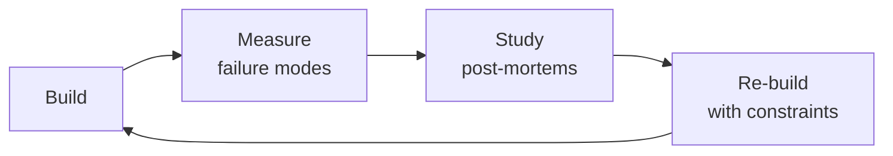

# Migration Architect

A veteran's playbook for planning and executing every type of production migration — database schema changes, platform swaps, language rewrites, framework upgrades, and cloud transitions — with zero downtime, military-grade rollback capability, and stakeholder trust.

This is not a theory document. Every section contains specific code, commands, scripts, and decision trees you can use tomorrow.

## Route the Request
<!-- QUICK: 30s -- auto-route first, then intent-route -->

### Auto-Route (No User Input Required)
Evaluate these file-system conditions in order. First match wins — jump immediately.

| # | Condition | Action |
|---|-----------|--------|
| A1 | `file_contains("*.sql", "ALTER TABLE\|CREATE INDEX\|ADD COLUMN\|DROP COLUMN")` OR `file_contains("*", "gh-ost\|pgroll\|expand-contract\|strangler fig\|dual-write")` OR `file_exists("flyway/\|alembic/\|migrations/")` | This is your skill. Jump to **Core Workflow** — Phase 1. |
| A2 | `file_contains("*.tf\|*.tfvars", "aws_\|azurerm_\|google_")` AND `file_contains("*", "migrate\|migration\|lift-and-shift\|rehost\|replatform")` | Jump to **Sub-Skills** — Cloud Migration (6 R's framework). |
| A3 | `file_contains("package.json", "\"react\"\|\"vue\"\|\"angular\"")` AND `file_contains("*", "migrate\|rewrite\|upgrade.*v[0-9]")` AND NOT `file_contains("*.sql", "ALTER\|CREATE")` | Jump to **Sub-Skills** — Framework & Library Migration. |
| A4 | `file_contains("*.sql", "CREATE TABLE\|schema\|model")` AND `file_contains("*.sql", "INSERT\|UPDATE\|SELECT")` AND NOT `file_contains("*", "migration\|migrate\|rollback\|cutover")` | Invoke **database-designer** instead. This is schema design, not migration. |
| A5 | `file_contains("docker-compose.yml\|*.tf", "replica\|replication\|failover\|standby")` AND `file_contains("*", "pg_basebackup\|pg_dump\|mysqldump\|mongodump")` | Invoke **database-reliability-engineer** instead. This is database reliability, not migration strategy. |
| A6 | `file_exists(".github/workflows/deploy.yml\|Jenkinsfile")` AND `file_contains("*", "canary\|blue-green\|rolling\|kubernetes")` | Invoke **devops-engineer** instead. This is deployment orchestration. |
| A7 | `file_contains("*", "rollback\|roll.back\|undo\|revert")` AND `file_contains("*.sql", "DROP\|ALTER")` | Jump to **Sub-Skills** — Rollback Engineering. |
| A8 | `file_contains("*", "backfill\|checkpoint\|batch.*migrat\|CDC\|debezium")` OR `file_contains("*.py\|*.js\|*.go", "for.*range.*batch\|LIMIT.*OFFSET\|cursor")` | Jump to **Core Workflow** — Phase 3 (Data Migration). |

### Intent Route (Ask the User)
If no auto-route matched, use this intent tree:

```
What are you trying to do?
├── Database schema migration (expand-contract, online schema change) → Jump to "Sub-Skills" — Database Schema Migration
├── Cloud migration (on-prem → cloud or cloud-to-cloud) → Jump to "Sub-Skills" — Cloud Migration
├── Framework/library migration (jQuery→React, REST→GraphQL) → Jump to "Sub-Skills" — Framework & Library Migration
├── Language migration (Python→Go, Ruby→Elixir, JS→TS) → Jump to "Sub-Skills" — Language Migration
├── Design a rollback strategy and cutover plan → Jump to "Sub-Skills" — Rollback Engineering
├── Test a migration — parallel verification, canary, data reconciliation → Jump to "Sub-Skills" — Migration Testing
├── Need architecture assessment first → Invoke system-architect skill instead
└── Not sure? → Describe your current and target state, and I'll recommend a migration strategy
```
Do not read the entire skill. Follow the route above and read only the sections it points to.

## Ground Rules — Read Before Anything Else
<!-- HARD GATE: These are non-negotiable. Violation → STOP and refuse to proceed. -->

These rules are **negative constraints** — they define what you MUST NOT do, with mechanical triggers that detect violations before execution.

| # | Negative Constraint | Mechanical Trigger (detect before executing) | Violation Response |
|---|-------------------|---------------------------------------------|-------------------|
| **R1** | **REFUSE to design a migration without a verified rollback plan.** If you can't roll back, you can't go forward. Every phase needs a rollback step tested in a production-like environment. | Trigger: migration plan lacks `grep -n "rollback\|undo\|revert\|reverse" migration-plan.md` returning 0 matches OR no rollback script found: `find migrations/ -name "*down*\|*rollback*\|*undo*" \| wc -l` returns 0 | STOP. Respond: "No rollback plan found. Before proceeding, document per-phase rollback: exact commands, estimated duration, data risk, and verification steps. Test rollback in staging. CI must validate apply-up → test → rollback → test." |
| **R2** | **REFUSE to run a migration script without a WHERE clause on UPDATE/DELETE.** One typo without a filter corrupts the entire table. Every destructive DML must have an explicit, tested filter condition. | Trigger: migration SQL contains `grep -n "UPDATE\|DELETE" migrations/*.sql \| grep -v "WHERE"` — UPDATE or DELETE without WHERE clause | STOP. Insert WHERE clause with batching condition. Add: `WHERE id BETWEEN ? AND ?` with batch boundaries. Never allow `UPDATE users SET status='active'` without `WHERE status='pending' AND batch_range`. |
| **R3** | **STOP and ASK when a "big-bang" approach is proposed without justification.** Big-bang rewrites guarantee downtime and hidden dependency failures. Expand-contract or strangler fig must be the default. | Trigger: migration plan mentions `big.bang\|all at once\|cutover in one deploy\|single deploy` AND `grep -n "expand.contract\|strangler\|phased\|incremental" migration-plan.md` returns 0 | STOP. Ask: "Why big-bang instead of phased? Big-bang migrations have an average 4-hour outage and 60% rollback rate. Expand-contract achieves the same result with zero downtime. What's the constraint forcing big-bang?" |
| **R4** | **DETECT and WARN about direct ALTER TABLE on tables > 1M rows without online schema change tooling.** A blocking ALTER on a large table is a planned outage, not a migration. | Trigger: migration SQL contains `grep -n "ALTER TABLE.*ADD\|ALTER TABLE.*DROP\|ALTER TABLE.*MODIFY" migrations/*.sql` AND `grep -n "gh-ost\|pgroll\|CREATE INDEX CONCURRENTLY\|pt-online-schema-change" migrations/*` returns 0 | WARN: "This ALTER TABLE will lock the table for the migration duration. For tables > 1M rows: use `gh-ost` (MySQL), `pgroll` (PostgreSQL), or `CREATE INDEX CONCURRENTLY`. Blocking ALTER on large tables causes extended outages." |
| **R5** | **DETECT and WARN about dual-write without automated reconciliation.** If both sides of a dual-write aren't monitored independently, divergence goes undetected until cutover. | Trigger: migration plan mentions `dual.write\|dual-write` AND `grep -n "reconciliation\|consistency.check\|row.count\|checksum" migration-plan.md` returns 0 | WARN: "Dual-write requires automated reconciliation. Add: hourly row-count comparison, 5% hash-based sampling, and an alert if counts diverge by > 0.1%. Without reconciliation, you'll discover data loss at cutover." |
| **R6** | **STOP and ASK before every migration without a dependency audit.** "It's just a schema change" — until a forgotten cron job, ETL pipeline, or unregistered consumer breaks in production. | Trigger: migration is classified as "schema change" AND `grep -rn "dependency\|consumer\|downstream\|upstream\|ETL\|cron\|webhook" migration-plan.md \| wc -l` returns < 3 | STOP. Ask: "Who consumes this data? List every API consumer, direct DB reader, ETL pipeline, reporting query, and webhook. Contact each one. Add 50% buffer to every time estimate." |
| **R7** | **REFUSE to decommission the old system immediately after cutover.** Latent bugs surface after 48 hours. Data edge cases discovered by users. Old system must remain in read-only mode during the full bake period. | Trigger: migration plan specifies old system `decommission\|shutdown\|turn.off\|delete` within < 24h of cutover | STOP. Respond: "Minimum bake period must match blast radius: 24h for simple schema changes, 48h for API migrations, 72h for full-stack, 7-30 days for financial systems. Keep old system in read-only mode during bake. Set a decommission checklist, not a date." |
## The Expert's Mindset

Masters of migration architect don't just build — they build **the right thing, at the right time, with the right trade-offs**. They think in systems, not tasks.

| Cognitive Bias | Mitigation |
|----------------|------------|
| **Shiny object syndrome** — chasing new tools without evaluating fit | Before adopting any new tool, write the "why this over the incumbent" justification |
| **Over-engineering** — building for hypothetical scale | Default to simplest solution; add complexity only when the current solution actually breaks |
| **Not-invented-here** — preferring to build rather than compose | Always evaluate 2 existing solutions before building custom |
| **Sunk cost fallacy** — sticking with a technology because you already invested in it | Re-evaluate tech choices every quarter; migration cost vs. staying cost |

### What Masters Know That Others Don't
- The **failure modes** of every component in their stack — not just the happy path
- When **not** to use their favorite tool (every tool has a misuse zone)
- That **data/model quality decays over time** — monitoring is not optional, it's foundational

### When to Break Your Own Rules
- **Move fast on reversible decisions.** Data format? Hard to change. Dashboard layout? Easy. Know the difference.
- **Skip the abstraction until the third use case.** Two is coincidence, three is a pattern.
## Operating at Different Levels

| Level | Scope | You... |
|-------|-------|--------|
| **L1** | Single component/module | Implement a well-defined piece following established patterns |
| **L2** | Feature or service | Design and build a complete feature; make tech choices within team conventions |
| **L3** | System or product area | Define architecture for a product area; set team tech standards; mentor L1-L2 |
| **L4** | Multiple systems / platform | Define org-wide architecture patterns; make build-vs-buy decisions; influence industry practice |
| **L5** | Industry / ecosystem | Create new architectural patterns adopted across the industry; redefine what's possible |

**Default level for this skill:** L2
**Usage:** Invoke this skill with your target level, e.g., "as an L3 migration architect, design..."

For full level definitions, see `skills/00-framework/skill-levels/SKILL.md`.

## When to Use

- You need to execute a database schema migration in production without downtime using expand-contract or online schema change tools
- You are planning a cloud migration (on-prem to cloud or between clouds) and need to apply the 6 R's framework
- You need to migrate a framework or library (e.g., jQuery→React, REST→GraphQL, Express→Fastify) gradually with feature flags
- You are porting a service from one language to another (Python→Go, Ruby→Elixir, JS→TS) using the strangler fig pattern
- You need to design a rollback plan for every phase of a migration with kill switches and reverse data sync
- You are running a parallel verification — comparing old system output against new system output — before cutting over
- You need to backfill or transform 100K+ rows of data with checkpointing, batching, and consistency verification
- You are migrating a large codebase and need a phased plan with stakeholder communication, risk assessment, and testing gates


### Cross-skills Integration

| Step | Skill | What it produces |
|------|-------|------------------|
| **Before** | system-architect | Current system architecture, target architecture, migration feasibility assessment |
| **This** | migration-architect | Migration strategy, phased rollout plan, rollback procedures, verification scripts |
| **After** | devops-engineer | CI/CD pipeline updates, infrastructure provisioning, deployment automation for the migration |

Common chains:
- **Chain**: system-architect → migration-architect → devops-engineer — Architect defines what to build; migration architect plans how to get there; DevOps builds the pipeline.
- **Chain**: database-designer → migration-architect → database-reliability-engineer — Schema design flows into migration plan; DBRE ensures reliability during and after the migration.

## Sub-Skills
<!-- QUICK: 30s -- table of deeper dives by topic -->
When the agent encounters a specific migration type, drill into the relevant sub-skill rather than reading the full 1600+ line SKILL.md. Each sub-skill has dedicated patterns, scripts, and rollback plans.

| Sub-Skill | What It Covers | When to Load |
|-----------|---------------|--------------|
| **Database Schema Migration** | Expand-contract phases, online schema change tools (gh-ost, pgroll), `CREATE INDEX CONCURRENTLY`, backward-compatible schema evolution rules | Changing table structure in production |
| **Data Migration** | Batch processing with checkpointing, CDC (Debezium/Kafka), dual-write consistency verification, streaming data pipelines | Backfilling or transforming >100K rows |
| **Cloud Migration** | 6 R's framework (Rehost/Replatform/Repurchase/Refactor/Retire/Retain), wave planning, TCO analysis, AWS DMS/Application Migration Service | Moving infrastructure between providers or on-prem → cloud |
| **Framework & Library Migration** | Dependency graph analysis, adapter/wrapper pattern, gradual replacement with feature flags, real-world migration recipes (jQuery→React, REST→GraphQL, Express→Fastify) | Upgrading or swapping a major dependency |
| **Language Migration** | Strangler fig at module boundary, interop patterns (sidecar, gRPC, shared queue), when it makes business sense vs rewrite | Porting Python→Go, Ruby→Elixir, JS→TS, Java→Kotlin |
| **Rollback Engineering** | Per-phase rollback plans, feature flag kill switches, reverse data sync (new→old), bake period design, automated rollback triggers | Any migration where rollback risk is non-trivial |
| **Migration Testing** | Parallel run verification (old vs new output diff), canary deployment with metric comparison, data integrity reconciliation, load test before/after comparison | Validating correctness before cutting over |

> **Token-saving rule:** A migration of a 5GB Postgres database doesn't need the cloud migration or language migration sub-skills. Load only what's relevant. Each section is self-contained with its own scripts, patterns, and checklists.

---
## Decision Trees
<!-- QUICK: 30s -- follow the ASCII tree to your scenario -->
### 1. Migration Strategy Selection
```
                     ┌────────────────────────┐
                     │ START: What's the      │
                     │ primary constraint?    │
                     └───────────┬────────────┘
                                 │
          ┌──────────────────────┼──────────────────────┐
          │                      │                      │
    ┌─────▼──────┐       ┌───────▼───────┐       ┌──────▼──────┐
    │ Deadline   │       │ Zero downtime │       │ Budget      │
    │ in <3      │       │ required,     │       │ <$50K,      │
    │ months?    │       │ user-facing?  │       │ small team? │
    └─────┬──────┘       └───────┬───────┘       └──────┬──────┘
          │YES                   │YES                    │YES
    ┌─────▼──────┐       ┌───────▼───────┐       ┌──────▼──────────┐
    │ Lift-and-  │       │ Strangler Fig │       │ Lift-and-Shift  │
    │ Shift      │       │ or Parallel   │       │ then optimize   │
    │ (Rehost).  │       │ Run. Migrate  │       │ incrementally.  │
    │ Optimize   │       │ piece by      │       │ Accept higher   │
    │ later.     │       │ piece.        │       │ infra cost       │
    └────────────┘       └───────────────┘       │ initially.      │
                                                 └─────────────────┘
          │NO (none of the above are critical constraints)
    ┌─────▼──────────────────┐
    │ Refactor-and-Migrate   │
    │ — best long-term ROI.  │
    │ Redesign for target    │
    │ platform. Higher risk, │
    │ highest payoff.        │
    └────────────────────────┘
```
**Lift-and-Shift:** When deadline <3 months or budget <$50K. Accept suboptimal architecture; optimize after migration.  
**Strangler Fig:** When zero downtime is required. Replace pieces incrementally behind a proxy/router.  
**Refactor-and-Migrate:** When long-term ROI matters more than speed. Highest payoff, highest risk.

### 2. Database Migration Approach
```
                   ┌──────────────────────────┐
                   │ START: Can you tolerate  │
                   │ write downtime?          │
                   └───────────┬──────────────┘
                               │
                    ┌──────────▼──────────┐
                    │ YES → Big-bang:     │
                    │ dump, transform,    │
                    │ load, verify,       │
                    │ cut-over. Fastest.  │
                    └─────────────────────┘
                    ┌──────────▼──────────┐
                    │ NO → How much data? │
                    └────┬───────────┬────┘
                         │           │
                    ┌────▼────┐ ┌───▼──────────┐
                    │ <100GB  │ │ >100GB or    │
                    └────┬────┘ │ high write   │
                         │      │ throughput   │
                    ┌────▼────┐ └───┬──────────┘
                    │ Dual-   │ ┌───▼──────────────┐
                    │ write + │ │ CDC (Debezium/   │
                    │ backfill│ │ Kafka Connect) + │
                    │         │ │ dual-write with  │
                    └─────────┘ │ eventual cutover │
                                └──────────────────┘
```
**Big-bang:** Writes paused → dump → transform → load → verify → cut over. For <100GB with a maintenance window.  
**Dual-write:** Write to both old and new, backfill history, verify consistency, cut reads, then cut writes.  
**CDC:** For >100GB or high-throughput — Debezium/Kafka pipelines, no application changes needed for reads.

### 3. Framework/Library Migration Decision
```
               ┌───────────────────────────┐
               │ START: How many dependent │
               │ packages and LOC?         │
               └───────────┬───────────────┘
                           │
                ┌──────────▼──────────┐
                │ <10K LOC, <50 deps? │
                └────┬───────────┬────┘
                     │YES        │NO
                ┌────▼────┐ ┌───▼──────────────┐
                │ Big-bang│ │ Are public APIs  │
                │ rewrite │ │ stable?          │
                │ in 1-2  │ └──┬───────────┬───┘
                │ sprints │    │YES        │NO
                └─────────┘ ┌──▼──────┐ ┌──▼──────────┐
                            │ Strangler│ │ Feature flag │
                            │ with     │ │ + adapter    │
                            │ adapter  │ │ per module   │
                            │ pattern  │ │              │
                            └──────────┘ └──────────────┘
```
**<10K LOC → big-bang rewrite.** One sprint, full replacement.  
**Stable APIs → Strangler with adapters.** Migrate module-by-module behind same interface.  
**Unstable APIs → Feature flags per module.** Gradual, safe, allows A/B testing each component.

### 4. Cloud Migration Strategy (6 R's)
```
                 ┌──────────────────────────┐
                 │ START: What's the app    │
                 │ architecture?            │
                 └───────────┬──────────────┘
                             │
        ┌────────────────────┼────────────────────┐
        │                    │                    │
  ┌─────▼──────┐     ┌───────▼───────┐    ┌───────▼──────┐
  │ Monolith   │     │ Containerized │    │ Already      │
  │ on VM?     │     │ microservices?│    │ cloud-native?│
  └─────┬──────┘     └───────┬───────┘    └───────┬──────┘
        │                    │                    │
  ┌─────▼──────┐     ┌───────▼───────┐    ┌───────▼──────────┐
  │ Rehost     │     │ Replatform    │    │ Refactor or      │
  │ (lift-and- │     │ (ECS/GKE      │    │ Retain. Already  │
  │ shift) or  │     │ instead of    │    │ optimized. Mig-  │
  │ Retire if  │     │ self-managed  │    │ rate only if     │
  │ deprecated │     │ K8s)          │    │ multi-cloud      │
  └────────────┘     └───────────────┘    │ needed.          │
                                          └──────────────────┘
```
**Rehost:** VM to cloud VM. Fastest, cheapest migration. Optimize later.  
**Replatform:** Containerize + use managed services (RDS instead of self-managed Postgres). Better TCO.  
**Refactor:** Rewrite for cloud-native. Highest effort, highest long-term ROI.  
**Retain/Retire:** Keep on-prem if already optimized. Retire if app is deprecated.

### 5. When to Roll Back
```
                   ┌──────────────────────────┐
                   │ START: Is the migration  │
                   │ in production?           │
                   └───────────┬──────────────┘
                               │
                ┌──────────────▼──────────────┐
                │ Data corruption detected?   │
                └────┬───────────────────┬────┘
                     │YES                │NO
                ┌────▼────────┐  ┌───────▼──────────────┐
                │ ROLL BACK   │  │ P95 latency >3x      │
                │ IMMEDIATELY.│  │ baseline OR error    │
                │ Don't wait. │  │ rate >1%?            │
                │ Every minute│  └──┬──────────────┬────┘
                │ = more lost │     │YES           │NO
                │ data.       │┌────▼────────┐ ┌───▼──────────┐
                └─────────────┘│ ROLL BACK   │ │ Continue     │
                               │ after       │ │ bake +       │
                               │ confirming  │ │ monitor.     │
                               │ it's not a  │ │ Extend bake  │
                               │ transient   │ │ to 2x normal │
                               │ spike       │ │ duration.    │
                               └─────────────┘ └──────────────┘
```
**Data corruption → immediate rollback. No waiting. No investigation during incident.**  
**P95 >3x baseline or error rate >1% → roll back after confirming non-transient.**  
**Everything else → extend bake period. Never roll back on the first small anomaly.**

## Migration Patterns

Detailed migration patterns, assessment frameworks, and database migration deep dives are in **[references/migration-patterns.md](references/migration-patterns.md)**:

| Section | What's Covered |
|---------|---------------|
| **Assessment & Scoping** | Inventory gathering, complexity scoring (1-5 scale), dependency mapping, build-vs-buy decision framework |
| **Migration Patterns** | Lift-and-Shift, Refactor-and-Migrate, Strangler Fig, Parallel Run, Blue-Green Cutover — with decision matrix |
| **Database Migration** | Expand-Contract pattern with full code, schema evolution rules, batch/streaming/dual-write data migration, CDC (Debezium), migration frameworks comparison, online schema change tools (gh-ost, pt-online-schema-change), consistency verification |

**Quick Reference:**
- **Fastest path:** Lift-and-Shift → optimize incrementally post-migration
- **Zero-downtime DB:** Expand-Contract (add new column → dual-write → backfill → remove old)
- **Data sync verification:** Row counts + checksums + business-level reconciliation queries

## Migration Workflows

Detailed workflow steps for framework, language, cloud, and stakeholder management are in **[references/migration-workflows.md](references/migration-workflows.md)**:

| Section | What's Covered |
|---------|---------------|
| **Framework/Library Migration** | Dependency analysis, adapter pattern with code examples, gradual replacement via feature flags, real-world examples (Express→Fastify, React class→hooks, AngularJS→React) |
| **Language Migration** | When it makes sense, interop patterns (FFI/gRPC/sidecar), Strangler at module boundary, real-world approaches (Python→Go, Ruby→Elixir, Java→Kotlin) |
| **Cloud Migration** | The 6 R's framework, Well-Architected assessment, wave sequencing, AWS-specific tools (MGN, DMS, DRS), TCO calculation with comparison |
| **Testing During Migration** | Parallel run verification with diffing system, canary comparison, data integrity reconciliation, performance regression testing |
| **Rollback Strategy** | Per-phase rollback plans, feature flags for quick disable, data sync reversal, bake periods, decision triggers |
| **Stakeholder Management** | Timeline communication templates, business continuity assurance, success metrics (KPIs), communication cadence |

**Quick Reference:**
- **Framework migration <10K LOC:** Big-bang rewrite. >10K: Strangler with adapter.
- **Language migration:** Only if team hiring for target language is easier than hiring for current
- **Bake period minimums:** DB migration 24h → API migration 48h → Full stack 72h
- **Rollback trigger #1:** Data corruption anywhere = immediate rollback

## Core Workflow
<!-- QUICK: 30s -- scan phase titles to understand the process -->
<!-- DEEP: 10+min -->
### Phase 1 (~15 min): Discovery & Assessment
**Input:** Existing system (codebase, infra, DB, dependencies)  
**Steps:** 1) Inventory all services, databases, and dependencies 2) Score each component by complexity (1-5) 3) Map dependency graph 4) Identify highest-risk components 5) Build migration wave plan  
**Output:** Scored inventory + dependency map + migration wave sequencing plan

<!-- DEEP: 10+min -->
### Phase 2 (~30 min): Pattern Selection & Proof of Concept
**Input:** Assessment results and constraints (time, budget, downtime tolerance)  
**Steps:** 1) Apply migration strategy decision tree 2) Select pattern (Strangler/Parallel/Lift-and-Shift/etc.) 3) Build PoC on 1-2 low-risk components 4) Validate approach with real data and traffic 5) Document pattern with code templates  
**Output:** Validated migration pattern + PoC results + reusable templates

<!-- DEEP: 10+min -->
### Phase 3 (~20 min): Data Migration Execution
**Input:** Source database schema and target schema design  
**Steps:** 1) Apply Expand-Contract for zero-downtime schema changes 2) Set up dual-write or CDC pipeline 3) Run backfill with checkpointing (resumable) 4) Verify consistency (row counts + checksums + business queries) 5) Cut over reads, monitor, cut over writes  
**Output:** Migrated database with verified consistency, rollback path ready

<!-- DEEP: 10+min -->
### Phase 4 (~15 min): Application Migration
**Input:** Validated patterns, migrated data plane  
**Steps:** 1) Migrate by wave (low-risk first) 2) Route percentage of traffic via feature flags/canary 3) Compare old vs new responses (diffing system) 4) Increase traffic 10% → 25% → 50% → 100% with monitoring gates 5) Keep old system in read-only mode for bake period  
**Output:** Application running on target platform with rollback capability

<!-- DEEP: 10+min -->
### Phase 5 (~25 min): Verification & Decommission
**Input:** Fully migrated system in production  
**Steps:** 1) Complete bake period (24-72h depending on component) 2) Run final data integrity reconciliation 3) Verify all monitoring/alerting operational on new system 4) Decommission old system (after confirmed no rollback needed) 5) Conduct retrospective, document lessons learned  
**Output:** Old system decommissioned, migration complete, retrospective document
## Cross-Skill Coordination
<!-- QUICK: 30s -- table of who to talk to when -->
Migration architecture is inherently cross-functional — it spans databases, application code, infrastructure, and QA. A migration without coordination is a production incident waiting to happen.

### Decision Gates & Artifacts

- **Gate 1 — Architecture Assessed:** Migration requires system architecture assessment and dependency mapping from `system-architect`. Artifact: architecture dependency graph.
- **Gate 2 — Schema Designed:** Database migrations require schema design, index strategy, and DDL review from `database-designer`. Artifact: DDL-reviewed migration scripts with Up/Down.
- **Gate 3 — Deployment Orchestrated:** Zero-downtime deployment requires blue-green orchestration and backup verification from `devops-engineer`. Artifact: deployment runbook with rollback commands.
- **Gate 4 — Reliability Ensured:** Replication, failover, and backup integrity validated by `database-reliability-engineer` before cutover. Artifact: replication lag and failover test report.
- **Artifact:** Migration runbook with per-phase rollback plan, data integrity reconciliation report, migration retrospective document.

| Coordinate With | When | What to Share/Ask |
|-----------------|------|-------------------|
| **Backend Developers** | Schema changes, data access layer changes, API versioning | Migration sequence, dual-write requirements, backward compatibility rules |
| **DBA / Database Team** | Schema migration, index changes, query performance | DDL review, lock duration estimates, replication lag impact, rollback plan |
| **DevOps / Infrastructure** | Deployment orchestration, environment management, backup/restore | Migration deployment order, blue-green coordination, backup verification |
| **System Architect** | Architecture changes, service boundaries, data ownership | Data ownership shifts, service decomposition impact, eventual consistency model |
| **QA Engineer** | Migration testing, data integrity verification, regression testing | Test environments, data comparison scripts, rollback test scenarios |
| **Security Reviewer** | Data migration security, sensitive data handling, encryption | Data at rest/in transit during migration, access control for migration tools |
| **Project Manager** | Migration timeline, stakeholder communication, resource coordination | Migration milestones, risk register, rollback decision authority |
| **Performance Engineer** | Migration impact on production performance, load during backfill | Backfill throttling, read/write load analysis, connection pool impact |
| **CTO Advisor** | Build vs buy migration tooling, architecture decisions | Tooling investment, migration strategy approval, risk acceptance |
| **Product Strategist** | User-facing migration impact, downtime communication, feature flags | User impact assessment, maintenance window communication, feature flag coordination |

### Communication Triggers — When to Proactively Notify

| Trigger | Notify | Why |
|---------|--------|-----|
| Migration script ready for production execution | Project Manager, DevOps, Backend Developers, DBA | Execution window scheduling; all stakeholders on standby |
| Data integrity check fails (row count mismatch, checksum mismatch) | DBA, Backend Developers, QA | Stop migration; root cause analysis; potentially pause backfill |
| Migration causes production latency increase >20% | Performance Engineer, DevOps, Project Manager | Throttle or pause; production impact unacceptable |
| Rollback plan activated for any reason | Project Manager, All Coordinated Teams | Incident declared; all teams execute rollback checklist |
| Schema change requires application downtime (cannot be done online) | Product Strategist, Project Manager, DevOps | Schedule maintenance window; user communication required |
| Backfill estimated completion shifts by >50% | Project Manager, Backend Developers | Replan cutover date; stakeholder expectation reset |
| Cross-team dependency for migration not met (e.g., API not ready, service not deployed) | Project Manager, Affected Team Lead | Blocking dependency; escalation for prioritization |
| Migration complete — verification passing, dual-write retired | All Coordinated Teams, Product Strategist, CTO Advisor | Migration closure; celebration; post-migration monitoring period begins |

### Escalation Path

| Situation | Escalate To | Rationale |
|-----------|------------|-----------|
| Data corruption detected post-migration (>10 rows or any customer-impacting) | **CTO Advisor** + VP Engineering + Incident Commander | Production incident; may require restore from backup |
| Migration blocked by external vendor/API limitation indefinitely | **CTO Advisor** + Product Strategist + Project Manager | Strategy pivot; may require architectural workaround or vendor change |
| Rollback fails during attempted execution | **CTO Advisor** + DevOps Lead + DBA | Critical incident; restore from backup may be only option |
| Migration cost/time exceeds original estimate by >100% | **CTO Advisor** + Project Manager + Stakeholders | Re-baseline; build vs buy vs maintain re-evaluation |
| Compliance/regulatory issue discovered in migrated data | **Legal Advisor** + Security Reviewer + Regulatory Specialist | Regulatory exposure; may require data remediation or disclosure |

### Route to Other Skills

| If the Request Is About | Route To |
|--------------------------|----------|
| Architecture assessment, service boundaries, dependency mapping | `system-architect` |
| Schema design, index strategy, DDL review, query migration | `database-designer` |
| Deployment orchestration, blue-green coordination, backup verification | `devops-engineer` |
| Database replication, failover testing, backup integrity | `database-reliability-engineer` |
| Data access layer changes, API versioning, dual-write implementation | `backend-developer` |

## Proactive Triggers
<!-- QUICK: 30s — when to proactively notify stakeholders -->

| Trigger | Notify | Why |
|---------|--------|-----|
| Migration backfill progress falls >20% behind schedule | Project Manager, Backend Developers | Cutover date at risk; throughput investigation or resource reallocation needed |
| Replication lag exceeds 2 seconds sustained for >5 minutes | DBA, DevOps, Backend Developers | Old system falling behind; throttling or pause required to protect rollback capability |
| Data reconciliation check fails (row count or checksum mismatch) | DBA, Backend Developers, QA | Data integrity at risk; halt migration until root cause identified and fixed |
| Dual-write error rate exceeds 0.1% for either target | Backend Developers, DBA | Silent data loss possible; write verification failing; investigate write path immediately |
| Production performance degradation >15% during backfill window | Performance Engineer, DevOps, Project Manager | User impact; throttle backfill or reschedule to lower-traffic window |
| Migration window timing conflicts with release freeze or holiday moratorium | Project Manager, Product Strategist | Reschedule migration; never run migrations during change freezes |
| Third-party dependency for migration fails (CDC connector, cloud service, API) | System Architect, DevOps, Project Manager | Migration blocked; contingency plan or workaround activation needed |

## Production Checklist
<!-- QUICK: 30s -- binary pass/fail items. Each has a mechanical validation command. -->

| ID | Checklist Item | Validation Command | Auto-Fix |
|----|---------------|-------------------|----------|
| **[S1]** | Migration framework configured with versioned, checksummed, reviewable migrations | `flyway info` OR `alembic current` OR `npx prisma migrate status` → must show all applied, no pending drift | CI: `flyway migrate -dryRun` or `alembic upgrade head --sql` in dry-run mode per PR |
| **[S2]** | Dependency audit complete — every API consumer, DB reader, ETL job, cron, and webhook documented | `scripts/audit-consumers.sh --db-url $DATABASE_URL --output json \| jq '.consumers \| length'` → must be ≥ 0 with explicit list | Check out `templates/dependency-audit.sh` — queries `pg_stat_activity`, parses `pg_stat_statements` for table access patterns |
| **[S3]** | Every schema change is backward-compatible at every intermediate phase — no breaking changes without expand-contract | `grep -rn "DROP COLUMN\|DROP TABLE\|RENAME COLUMN" migrations/*.sql` → returns 0 OR each has a corresponding `ADD` in a different file | Pre-commit hook: `scripts/check-migration-safety.sh` — fails if `DROP COLUMN` or `DROP TABLE` found without matching expand-contract plan |
| **[S4]** | Up and Down scripts exist for every schema change; Down scripts tested in staging within last 7 days | `find migrations/ -name "*up*\|*forward*" \| sed 's/up/down/g' \| xargs -I{} test -f {} && echo PASS \|\| echo FAIL` → must return PASS | CI: migration test job — `apply up → run tests → apply down → run tests` — fails if any step fails |
| **[S5]** | Online schema change tool selected for tables > 1M rows — gh-ost (MySQL) or pgroll (PostgreSQL) configured | `psql -c "SELECT relname, n_live_tup FROM pg_stat_user_tables WHERE n_live_tup > 1000000" \| wc -l` → if > 0, must have `gh-ost` or `pgroll` in CI config | Install: `pgroll init --postgres-url $DATABASE_URL` and add `pgroll start` to migration workflow |
| **[S6]** | Data migration scripts use batch processing with checkpoint-based resumability and configurable throttling | `python3 scripts/run-migration.py --dry-run 2>&1 \| grep -c "checkpoint\|batch\|sleep"` → must be ≥ 2 (at least 2 of {checkpoint, batch, throttle}) | Template: `templates/batch-migration.py` with `last_id` checkpoint table, `BATCH_SIZE=5000`, `SLEEP_BETWEEN=0.1` |
| **[S7]** | Consistency verification scripts ready — row counts, checksums, and business-level reconciliation for every migrated table | `scripts/reconcile.sh --source old_db --target new_db --tables all 2>&1 \| grep -c "MISMATCH"` → must return 0 before cutover | Run `scripts/reconcile.sh` before every cutover gate — fails CI if any table has row count mismatch > 0 |
| **[S8]** | Rollback plan documented per phase with exact commands, estimated duration, data risk, and verification steps | `grep -c "rollback\|undo\|revert" migration-plan.md` → must be ≥ number of phases in the migration | Template: `templates/rollback-per-phase.md` with per-phase rollback command, estimated duration, verification query |
| **[S9]** | Rollback tested in staging — full apply-up → test → rollback → test cycle passes for every phase | `scripts/test-rollback.sh <phase>` → exit code 0 for every phase | CI: matrix job running all phases through apply → validate → rollback → validate cycle |
| **[S10]** | Feature flags implemented for every new code path — rollback = disable flag (seconds), not redeploy (minutes) | `grep -rn "feature.flag\|FEATURE_\|featureFlag\|toggle" src/ --include="*.ts" --include="*.js" --include="*.py" \| wc -l` → must be ≥ 1 per migration path | Use LaunchDarkly SDK or simple env-var flags: `process.env.MIGRATION_USE_NEW_DB` with default `false` |
| **[S11]** | Pre-migration backup completed, verified as restorable, and stored separately from the source database | `pg_dump --format=custom --file=pre_migration_$(date +%Y%m%d).dump $DATABASE_URL && pg_restore --list pre_migration_*.dump \| wc -l` → must be > 0 | CI pre-migration step: `scripts/backup-and-verify.sh` — dumps, restores to temp DB, runs integrity checks, stores dump in S3 |
| **[S12]** | Monitoring dashboards configured: replication lag, lock contention, error rates, migration progress, latency percentiles (P50/P95/P99), connection count | `curl -s http://prometheus:9090/api/v1/query?query=pg_stat_replication_lag \| jq '.data.result \| length'` → must be > 0 | Grafana dashboard JSON: `templates/migration-monitoring-dashboard.json` imported to Grafana with Prometheus data source |

---
## Scale Depth
<!-- QUICK: 30s -- find your team size column -->
### Solo (1 person) → Small (2-10) → Medium (10-50) → Enterprise (50+)

| Dimension | Solo | Small | Medium | Enterprise |
|-----------|------|-------|--------|------------|
| **Migration Scope** | 1 database, <10 tables, <1GB | 1 codebase, 1 DB, <50 tables | 5-20 services, multiple DBs | 50+ services, multi-region, multi-DB |
| **Tooling** | ORM auto-migrate, raw SQL | Framework-based (Flyway/Alembic/Prisma) | Online schema change (gh-ost/pgroll) + CDC | Blue-green DB deploys + automated drift detection |
| **Testing** | Manual apply, verify, roll back | CI: apply up → test → roll back → test | Prod-scale clone testing + perf regression | Automated migration testing with synthetic traffic |
| **Risk Management** | Maintenance window acceptable | Expand-Contract for zero-downtime | Feature flags + canary per migration phase | Multi-region gradual rollout + auto-rollback on anomaly |
| **Rollback** | Manual script per migration | Documented rollback per phase | Automated rollback tested in CI | Instant feature-flag disable + data sync reversal |
| **Coordination** | Developer owns migration end-to-end | 1 backend specialist reviews | Migration architect + DB team | Dedicated migration team with runbook and stakeholder comms |

### Transition Triggers

| From → To | Trigger | What to Change |
|-----------|---------|----------------|
| Solo → Small | Paying users who would notice >1s downtime | Add versioned migrations, Expand-Contract for schema changes, CI validation |
| Small → Medium | Database >50GB or >5 services | Online schema change tools, CDC for data migration, automated rollback testing |
| Medium → Enterprise | Multi-region, >50 services, regulatory compliance | Blue-green deployments, automated drift detection, migration runbook with stakeholder comms |

## What Good Looks Like

> When migration architecture is executed flawlessly, every migration has a phased plan with rollback checkpoints at each phase, data integrity is verified with row counts, checksums, and business-level reconciliation before cutover, feature flags gate every new code path so rollback takes seconds not hours, replication lag is monitored and never exceeds thresholds, the pre-mortem's top three failure modes have automated triggers, and the cutover window is measured in minutes — the business continues operating without detecting the migration happened.

## Cost-Effective Decision Table

| Decision | Free/Cheap Option | Paid Upgrade | When to Upgrade |
|----------|------------------|--------------|-----------------|
| Migration framework | ORM built-in (ActiveRecord, Prisma, SQLAlchemy auto-migrate) | Flyway Teams ($3K/yr) or Liquibase Pro | Need dry-run validation, undo scripts, or enterprise DB support (Oracle, DB2) |
| Online schema changes | PostgreSQL: `CREATE INDEX CONCURRENTLY` (built-in). MySQL: `gh-ost` (free OSS) | — | Free OSS tools cover 95% of needs |
| Data migration (backfill) | Custom Python/Node script with batching + checkpointing (1-2 days to write) | Data pipeline tool (Airbyte, Fivetran) | Backfill spans 10+ tables with complex transformations or needs scheduling |
| Schema drift detection | `pg_dump --schema-only` diff or manual comparison | Skeema ($250/mo) or Atlas ($295/mo) | >50 tables or multiple environments that drift frequently |
| Migration testing | CI job: apply migration to prod clone, verify | Database Lab Engine (Postgres, OSS) or Snaplet | Need instant (<1s) database clones for fast CI feedback |
| Rollback planning | Manual: write down script per phase | Atlas (declarative schema, auto-generates rollback) | >20 migrations/month or team >5 people |

**Annual migration tool budget by phase:** MVP: $0 (ORM built-in). Growth: $0-1K (OSS tools). Scale: $0-10K (OSS tools + CI infra).

## When NOT to Use This Skill (Overkill)

- **Pre-launch with 0 users**: You can dump, modify, and restore your database in minutes. Zero-downtime migration patterns are solving a problem you don't have.
- **Database is <1GB and migrations take <5 seconds**: `ALTER TABLE` during a maintenance window is fine. Don't build an online schema change pipeline.
- **Solo developer**: Expand-contract requires dual-write code paths, feature flags, and multi-phase deploys. That's operational overhead for a team of 1. Simple migrations work.
- **Read-only or append-only database**: If you never alter existing tables (only create new ones and append data), migration patterns for schema changes aren't needed.
- **Prototype/throwaway project**: Don't version migrations for a project you'll delete in 2 weeks. Raw SQL is fine.

## Token-Efficient Workflow

```
# Step 1: Migration readiness check
python3 scripts/migration_check.py --db-url $DATABASE_URL --output json
# Returns: {"size_gb": 2.5, "table_count": 42, "largest_table_rows": 1500000,
#           "has_replicas": true, "replication_lag_ms": 50, "active_connections": 80}

# Step 2: Decision tree → choose migration pattern
# largest_table_rows > 1M → Online schema change (gh-ost/pgroll). Don't ALTER directly.
# size_gb > 50 → Test on prod-scale clone first. Expect migration to take hours.
# has_replicas + lag > 1000ms → Throttle migration to reduce lag. Monitor closely.

# Step 3: Validation with exit codes
# Verify migration applies cleanly
npm run migrate:up -- --dry-run  # Exit code 0 = clean apply

# Verify migration rolls back
npm run migrate:down -- --dry-run  # Exit code 0 = clean rollback

# Verify no schema drift
python3 scripts/check_schema_drift.py --source migrations/ --target $DATABASE_URL
# Exit code 0 = no drift, 1 = drift detected

# Step 4: During migration — monitor replication lag
python3 scripts/monitor_replication.py --threshold-ms 2000 --output json
# Exit code 0 = lag below threshold, 1 = threshold exceeded (pause migration)
```


**What good looks like:** Migration plan with phases, rollback steps at each phase, and success criteria. Data integrity verified with pre/post migration checks. Cutover window < 2 hours. Rollback tested and timed. Stakeholder communication plan distributed.

**Principle:** `migration_check.py` analyzes database metadata, outputs JSON. Agent applies decision tree to select pattern. Validation uses exit codes (dry-run, drift check). Monitoring script checks replication lag programmatically during execution.

## Best Practices
<!-- STANDARD: 3min -- rules extracted from production experience -->
1. **Expand-Contract for every schema change:** Add → dual-write → backfill → switch reads → remove old. Never drop a column in the same deploy that adds its replacement.
2. **Test rollbacks before you need them:** Every migration must pass CI: apply up → run tests → roll back → run tests. If rollback can't be tested, it doesn't exist.
3. **Start with low-risk components first:** Migrate your least critical, least coupled service first. Learn from it. Don't start with the payment system.
4. **Batch data migration with checkpointing:** Process 1K-10K rows per batch with a sleep interval. Save checkpoint after each batch. A failed 100M-row migration must resume, not restart.
5. **Feature flags for every migration path:** Every new code path gets a flag. If something breaks, you disable the flag — not roll back a deploy. Flags toggle in seconds; deploys take minutes.
6. **Bake period scales with blast radius:** DB-only change → 24h bake. API migration → 48h. Full-stack → 72h minimum. Never decommission old system before bake completes.
7. **Monitor replication lag during migration:** Lag >2s → throttle or pause migration. The old system is your rollback — don't let it fall behind.
8. **Consistency verification is non-negotiable:** Row counts match. Checksums match. Business-level reconciliation queries pass. All three must pass before cutover.
9. **Never migrate and refactor simultaneously:** Either lift-and-shift (same logic, new platform) OR refactor-and-migrate (new logic). Doing both at once makes <!-- DEEP: 10+min -->
debugging impossible.
10. **Conduct a pre-mortem before every migration:** "The migration failed. What went wrong?" Write down the top 3 causes. Those are your rollback triggers and monitoring priorities.

## Error Decoder
<!-- DEEP: 5min -- each entry includes a console-string matcher for automatic recovery loops -->

| 🖥️ Console Match (grep pattern) | Symptom | Root Cause | Fix | 🔄 Auto-Recovery Loop |
|---|---|---|---|---|
| `Error: relation.*already exists\|ERROR: column.*already exists\|Duplicate column` + `grep -rn "IF NOT EXISTS" migrations/*.sql \| wc -l` returns 0 | Migration fails mid-way during apply — schema partially migrated, half the columns created, half missing | Migration script ran without idempotency guards. A previous partial run left some objects in place, and the script assumes a clean starting state | Wrap every DDL with `IF NOT EXISTS` / `IF EXISTS` guards. Use framework-based migrations (Flyway, Alembic, Prisma) that track which migrations have been applied. Never run raw SQL migrations without version tracking | 1. Check migration state: `flyway info` or `alembic current` or `prisma migrate status` 2. If partially applied, identify last successful step: `SELECT * FROM schema_migrations ORDER BY version DESC LIMIT 1` 3. Mark incomplete migration as resolved: `INSERT INTO schema_migrations (version) VALUES ('V001')` (flyway repair) 4. Re-run: the framework skips already-applied steps 5. For future: always use `IF NOT EXISTS` for DDL and check `schema_migrations` table before any raw SQL |
| `Error: lock timeout\|canceling statement due to lock timeout\|could not obtain lock` + `grep -rn "ALTER TABLE\|CREATE INDEX" migrations/*.sql -A1 \| grep -v "CONCURRENTLY"` finds blocking DDL | Migration blocked for 10+ minutes — all other queries on the table queued behind the migration's exclusive lock | Migration used `ALTER TABLE` or `CREATE INDEX` without `CONCURRENTLY` on a production table with active traffic. PostgreSQL's DDL acquires `ACCESS EXCLUSIVE` lock — blocks all reads and writes | Use `CREATE INDEX CONCURRENTLY` instead of `CREATE INDEX`. For ALTER TABLE: split into multiple steps with short lock windows. Use `pgroll` or `gh-ost` for zero-downtime schema changes. Set `lock_timeout = '5s'` before every migration | 1. Check for blocking queries: `SELECT pid, now() - pg_stat_activity.query_start AS duration, query FROM pg_stat_activity WHERE state != 'idle' AND wait_event_type = 'Lock'` 2. Kill migration if stuck: `SELECT pg_cancel_backend(<pid>)` 3. For future: add `SET lock_timeout = '5s'` at the top of every migration script 4. Use online tools: `gh-ost --alter "ADD COLUMN ..." --database=mydb --table=mytable` 5. Test: run migration on production-scale clone with `pgbench` traffic simulating real load |
| `Error: replication lag exceeded\|replica behind master by [0-9]+ seconds` + `grep -rn "INSERT\|UPDATE\|DELETE" migrations/*.sql -A 5 \| grep -c "FROM\|INTO"` shows large data mutations | Migration caused replication lag > 30s — read replicas serving stale data, application consistency broken | Data migration (backfill, transform) ran as a single large transaction or at full speed without throttling. Read replicas couldn't keep up with the WAL volume | Batch the migration: process 1K-10K rows per batch with `SLEEP 0.1` or `pg_sleep(0.1)` between batches. Monitor replication lag: `SELECT pg_wal_lsn_diff(pg_current_wal_lsn(), replay_lsn) FROM pg_stat_replication`. Pause migration if lag > 2s | 1. Monitor lag: `SELECT client_addr, state, pg_wal_lsn_diff(sent_lsn, replay_lsn) AS lag_bytes FROM pg_stat_replication` 2. If lag > 100MB, pause migration: `UPDATE migration_control SET paused = true WHERE id = 'backfill_users'` 3. Wait for lag to drop: `watch -n 5 'psql -c "SELECT pg_wal_lsn_diff(pg_current_wal_lsn(), replay_lsn) FROM pg_stat_replication LIMIT 1"'` 4. Resume with smaller batch size: `UPDATE migration_control SET batch_size = 1000, paused = false` 5. CI check: pipeline polls `pg_stat_replication` and auto-pauses if lag exceeds threshold |
| `Error: cannot drop column.*still referenced\|dependent objects still exist\|cannot drop table.*depends on` + `grep -c "DROP\|REMOVE\|DELETE" migrations/*.sql` shows premature cleanup | Cannot drop old column/table — other objects (views, functions, triggers, FK constraints) still reference it | Migration tried to drop the old column/table in the same deploy that added its replacement. Other database objects (views, materialized views, stored procedures) still depend on the old column | Expand-Contract: (1) add new column, (2) dual-write to both, (3) backfill new column, (4) switch reads to new column, (5) update dependent objects, (6) drop old column in a SEPARATE deploy. Never drop in the same deploy | 1. Find dependencies: `SELECT DISTINCT dependent_ns.nspname, dependent_view.relname FROM pg_depend JOIN pg_rewrite ON pg_depend.objid = pg_rewrite.oid JOIN pg_class AS dependent_view ON pg_rewrite.ev_class = dependent_view.oid JOIN pg_namespace dependent_ns ON dependent_ns.oid = dependent_view.relnamespace WHERE refobjid = '<table_oid>'` 2. Update each dependent object to reference new column 3. Verify: `SELECT COUNT(*) FROM pg_depend WHERE refobjid = '<table_oid>' AND objid IN (SELECT oid FROM pg_rewrite)` → must return 0 4. Only then: `DROP COLUMN old_column` in a separate migration 5. CI validation: `scripts/check-drop-safety.sh` — prevents dropping columns with active dependencies |
| `Error: dual-write divergence detected\|consistency check failed\|row counts don't match` + `grep -rn "dual.write" migration-plan.md -A 10 \| grep -c "reconcil\|verify\|compare"` returns 0 | Dual-write to old and new databases — old DB has 1,245,000 rows, new DB has 1,208,000 rows (37,000 missing records after 4 weeks) | New system's validation logic silently rejected records the old system accepted. No automated reconciliation detected the divergence. Discovered by customers after cutover, not by monitoring | Before dual-write: compare validation rules between old and new systems. Run full dataset through new system's validation and measure rejection rate. Add automated hourly reconciliation: row count comparison, hash-based sampling, and alert if divergence > 0.1% | 1. Hourly reconciliation: `scripts/reconcile-dual-write.sh` — runs `SELECT count(*) FROM old.table` vs `SELECT count(*) FROM new.table` 2. If counts differ: run `scripts/sample-compare.sh --pct 5` — compares 5% random sample via `md5(row_to_json(t.*)::text)` 3. Find divergent rows: `SELECT old.id FROM old.table LEFT JOIN new.table ON old.id = new.id WHERE new.id IS NULL LIMIT 100` 4. Root-cause each divergent row — fix validation, re-process missing rows 5. CI: hourly cron in GitHub Actions that fails if divergence > 0.1% |
| `Error: migration checkpoint lost\|checkpoint file not found\|restarting from beginning` + `grep -rn "checkpoint\|resume\|savepoint" migration-script.py\|migration-script.js \| wc -l` returns 0 | Data migration for 100M rows failed at row 73,421,503 — must restart from row 0 because no checkpointing was implemented | Migration script processed rows with `SELECT * FROM large_table LIMIT 10000 OFFSET ?` — offset-based pagination with no checkpoint file. On failure, the script restarts from row 0. A 3-day migration becomes a 6-day migration | Implement checkpoint-based resumability: save `last_processed_id` to a checkpoint table/file after every batch. Use `WHERE id > ? ORDER BY id LIMIT 10000` (keyset pagination) instead of `OFFSET`. On restart, read `last_processed_id` and resume | 1. Add checkpoint table: `CREATE TABLE migration_checkpoint (task TEXT PRIMARY KEY, last_id BIGINT, processed BIGINT, updated_at TIMESTAMPTZ DEFAULT NOW())` 2. In migration script: after each batch `UPDATE migration_checkpoint SET last_id = ?, processed = processed + ?, updated_at = NOW()` 3. On start: `SELECT last_id FROM migration_checkpoint WHERE task = 'backfill_users'` — start from that ID 4. Resumability test: kill script mid-migration, restart, verify it resumes from checkpoint 5. CI: `scripts/test-migration-resilience.sh` — starts migration, kills after 10s, restarts, asserts eventual completion |

## Anti-Patterns
<!-- DEEP: 5min -- each anti-pattern includes machine-detectable patterns -->

| ❌ Anti-Pattern | ✅ Do This Instead | 🔍 Detect (grep / lint) | 🛡️ Auto-Prevent |
|-----------------|---------------------|--------------------------|-------------------|
| Dropping old column in the same deploy that adds its replacement — rollback impossible, zero-downtime lost | Expand-Contract: (1) add new column, (2) dual-write, (3) backfill, (4) switch reads, (5) drop old in a SEPARATE deploy | `grep -rn "DROP COLUMN" migrations/*.sql -B 20 \| grep "ADD COLUMN"` → finds DROP next to ADD in same file (within 20 lines) | Pre-commit hook: `scripts/check-same-deploy-drop.sh` — fails if `DROP COLUMN` and `ADD COLUMN` exist in the same migration file |
| Running UPDATE/DELETE without WHERE clause in migration — one typo corrupts entire table | Always include WHERE clause with batching condition. Precede every UPDATE/DELETE with a SELECT count of affected rows. Run on sample (LIMIT 100) first. | `grep -rn "UPDATE\|DELETE" migrations/*.sql \| grep -v "WHERE" \| grep -v "JOIN"` → finds UPDATE/DELETE without WHERE clause | SQL lint: `sqlfluff lint migrations/ --rules L036` (requires WHERE on UPDATE/DELETE). CI: pipe migration SQL through `sqlfluff lint` |
| Assuming "it's just a schema change" without dependency audit — hidden consumers break silently | Run full dependency audit: count all API consumers, direct DB readers, ETL jobs, and webhooks. Contact each one. Add 50% buffer to estimates. | `grep -rn "dependency\|consumer\|downstream\|upstream" migration-plan.md \| wc -l` → if < 3, dependency audit not done | Script: `scripts/find-consumers.sh --table <table>` queries `pg_stat_statements` for all queries accessing the table in last 30 days, outputs consumer list |
| Manual migration execution in production terminal — no audit trail, fat-finger risk, cannot resume if SSH drops | All migrations run through CI/CD pipeline. Idempotent scripts. Logged output with timestamps. No human-in-terminal execution. | `grep -rn "ssh\|psql\|mysql.*production\|exec.*kubectl" --include="*.md" runbooks/ \| wc -l` → if > 0, manual execution documented | CI: migration jobs must run through `gh workflow run migrate --field phase=<phase>`. Production terminal access restricted to read-only roles |
| Delaying rollback test until migration day — untested rollback takes 10x estimated time, outage extends | Test rollback in staging for every migration phase. CI pipeline validates: apply-up → test → rollback → test cycle for every single migration. | `find migrations/ -name "*down*\|*rollback*\|*undo*" -mtime +7 \| wc -l` → if count > 0, rollback scripts exist but haven't been tested in > 7 days | CI: `scripts/test-rollback-recent.sh` — checks file modification times on rollback scripts, fails if any untested in 7 days. Scheduled CI: `migration-rollback-test` matrix job |
| Using big-bang approach because "expand-contract takes too long" — 12-hour outage when hidden dependency breaks | Expand-contract costs calendar time but zero downtime. Big-bang saves calendar time but guarantees downtime window. Pre-mortem: "What breaks?" | `grep -rn "big.bang\|all.at.once\|single.deploy\|cutover.*immediate" migration-plan.md \| wc -l` → if > 0, big-bang proposed without justification | Decision gate: `scripts/validate-migration-strategy.sh` — if `big-bang` detected, requires explicit sign-off file: `migration-plan.md.big-bang-justification` with CTO approval |
| No feature flag gating new code paths — rollback requires redeploy (minutes) instead of flag toggle (seconds) | Feature-flag every new migration path. Rollback = disable flag. Feature flags toggle in seconds; redeploys take minutes. | `grep -rn "if.*MIGRATION\|if.*FEATURE\|featureFlag\|useNewDB\|useNewAPI" src/ --include="*.ts" --include="*.js" --include="*.py" \| wc -l` → must be ≥ 1 per new code path | Template: wrap new code in `if (featureFlags.isEnabled('migration-use-new-db')) { ... }`. CI lint: fail if new code adds routes/endpoints/DB queries without a feature flag check |
| Decommissioning old system the day after cutover — latent bugs surface after 48 hours, no fallback available | Minimum bake: 24h simple, 48h API, 72h full-stack, 7-30 days financial. Keep old system in read-only mode. Set decommission checklist, not a date. | `grep -rn "decommission\|shutdown\|turn.off\|delete.*old" migration-plan.md -A5 \| grep -E "[0-9]+\s*(hour\|day)"` → if time < minimum bake per blast radius, decommission too aggressive | Script: `scripts/validate-bake-period.sh` — given migration type, checks if decommission window meets minimum bake period, fails if too short |

## Footguns
<!-- DEEP: 10+min — war stories from system migrations -->

| Footgun | What Happened | Root Cause | How to Prevent |
|---------|---------------|------------|----------------|
| "Strangler Fig" migration planned for 8 weeks has been running for 18 months — the old system is still processing 40% of traffic, the new system has been in "almost done" status for 14 months, and the team can't name the completion criteria | A healthtech company started a Strangler Fig migration from a monolith to microservices in January 2023. Planned duration: 8 weeks. By July 2024 (18 months later): 60% of endpoints migrated, remaining 40% were the "hard ones" (complex business logic, no tests, original authors had left). The team had been saying "2 more sprints" since sprint 8. Two senior engineers quit out of frustration. The migration consumed 6,000 engineering hours. | The Strangler Fig had no hard cutover date — the "strangle until complete" pattern became "strangle until we get bored." No completion criteria were defined: "when all endpoints are migrated" is not a criterion, it's a tautology. The remaining endpoints were the hardest ones, but estimates were based on the easy ones. | **Every migration needs an exit gate with a deadline.** Define: "Migration is complete when X% of traffic/endpoints are moved AND the remaining Y are explicitly deprioritized with a business case for staying." Set a hard cutover date: "On [date], the old system enters read-only mode. Remaining unmigrated endpoints will be rebuilt on the new system from scratch." The Strangler Fig without a deadline is a zombie migration — it consumes resources forever without ever completing. Duration of migration should be measured and tracked as a KPI. |
| Dual-wrote to old and new databases for 4 weeks during migration — data diverged within 48 hours because the new system's validation logic rejected 3% of writes that the old system accepted silently | A logistics company ran dual-write to old (PostgreSQL) and new (DynamoDB) databases during a 4-week migration in September 2024. Within 48 hours, data divergence was detected: the new system validated phone numbers and rejected non-E.164 format numbers (3% of records). The old system accepted them as-is. By day 3, 12,000 records existed in the old database but not the new one. When the team cut over to the new system, customers with "invalid" phone numbers couldn't receive delivery notifications. The migration was rolled back. Data reconciliation took 2 weeks. | Dual-write assumes both systems apply identical business logic. They didn't. No comparison checkpoint was automated — the team manually sampled 100 records daily, which wasn't enough to catch the 3% divergence rate. The inconsistency was discovered by customers, not monitoring. | **Dual-write requires automated reconciliation, not manual sampling.** Run a full-row-count comparison every hour: `SELECT count(*) FROM old_db.users` vs `SELECT count(*) FROM new_db.users`. If counts diverge by >0.1%, halt migration. Run a hash-based comparison on a 5% sample every hour: `SELECT md5(row_to_json(t.*)::text) FROM ...`. Any mismatch triggers investigation BEFORE cutover. Better yet: avoid dual-write if possible — prefer read-only shadowing first, then cut over writes atomically. |
| Migration tested on a production-sized staging database (50M rows, 4 hours) — in production with real traffic, row locks and replication lag extended runtime to 14 hours and locked critical tables for the last 3 hours | A fintech company tested their database migration on a 50M-row staging clone in August 2024. The test took 4 hours — within their 6-hour maintenance window. In production: real traffic caused row-level locks that the migration's `ALTER TABLE` waited on, replication lag on the read replica hit 45 minutes (vs. 2 minutes in staging), and an unplanned ANALYZE kicked off mid-migration. Total runtime: 14 hours. Critical tables were locked for the last 3 hours when the migration had to wait for a long-running reporting query. 6-hour maintenance window overrun by 8 hours. Customer impact: degraded service for 14 hours. | Staging testing didn't simulate concurrent traffic — the database was idle during the test migration. Production had 2,000 QPS of read traffic causing row locks, replication, and autovacuum interference. The maintenance window didn't account for "what if it takes 2x the estimate?" | **Test migration timing on a database with simulated production traffic.** Before migration: (1) run the exact migration steps on staging with `pgbench` or similar generating realistic QPS, (2) check `pg_stat_activity` for lock waits during migration, (3) check replication lag every 60 seconds — if it exceeds 5x baseline, the migration has a serialization bottleneck. Maintenance window = 3x the worst-case test time with traffic. Never schedule migrations in a window that can't accommodate a 3x overrun. |
| Decommissioned the old API 24 hours after cutover — a nightly batch job that ran at 2 AM against the old API had no equivalent on the new system and failed silently for 3 days before anyone noticed | A retail platform migrated their order management API in March 2024. Cutover: Friday 10 PM. Old API decommissioned: Saturday 10 PM (24-hour bake). Monday morning: warehouse team reported that weekend orders weren't being fulfilled. Investigation: a nightly batch job that ran at 2 AM Sunday against the old API (`GET /orders?since=...`) was hardcoded with the old API URL. The batch job had been written by a contractor 3 years earlier — no documentation, no monitoring, no team knew it existed. 3 days of orders (14,000 orders, $890K revenue) were delayed. | The 24-hour bake period was too short to discover all system dependencies. Nightly batch jobs and cron jobs often run on 24-hour cycles — a 24-hour bake guarantees missing at least one run. No dependency audit had identified this batch job because it wasn't in any service catalog. | **Minimum bake periods by criticality: 24h simple, 72h API, 7 days data pipeline, 30 days financial.** During bake: run the old system in read-only mode, capture all requests to it, and audit for unknown consumers. Alert on any request to the old API during bake — each one is an undocumented dependency. Before cutover: run a dependency audit that includes not just registered API consumers, but also batch jobs, cron expressions, ETL pipelines, and hardcoded URLs in config files. |
| Feature-flagged the new code path for 10% of traffic — flag evaluation happened on every request including the 90% going to the old path, adding 35ms latency per request, P99 API latency went from 180ms to 320ms, customers noticed | A SaaS company feature-flagged their new billing calculation engine in October 2024. The flag was evaluated on 100% of requests (not just the 10% going to the new path) because the flag check was in middleware before the routing decision. The flag evaluation required a Redis call (15ms) plus JSON parsing of a complex targeting rule (20ms). P99 latency increased by 78% across all traffic. Customer complaints about "slow checkout" started within 2 hours. The team initially blamed the new engine's performance — but the 90% of traffic on the old path was also slower because of the flag evaluation overhead. | Feature flag evaluation cost was not profiled before deployment. The flag was placed in the hot path (every request) instead of at the routing layer (only requests going to the new path). No latency regression testing included the flag evaluation overhead. | **Profile feature flag evaluation separately from the code path it gates.** Before deploying: (1) measure flag evaluation latency in isolation (P50, P95, P99), (2) if flag evaluation adds >1ms at P95, it needs to be at the routing layer, not the middleware layer, (3) always test latency with the flag ON and OFF at both 0% and 100% rollout — the 90/10 split is the most dangerous configuration because overhead affects everyone but only 10% get the new behavior. Flag evaluation should be a local, in-memory operation — if it requires a network call, you're doing it wrong. |

## Calibration — How to Know Your Level
<!-- STANDARD: 3min — honest self-assessment -->

| You Know You're Stuck at L1 When... | You Know You've Reached L2 When... | You Know You're L3 When... |
|---|---|---|
| You can write a migration script but every migration you've run required at least one rollback — and you don't have a postmortem for any of them | You've led a migration that completed on schedule with <1 hour of user-visible impact, and you have the post-migration report with actual vs. planned downtime, data integrity validation, and lessons learned | An engineering director says "we need to migrate our payment processing system with zero downtime and zero data loss — 99.999% availability, $2M/hour cost of failure" — you deliver a plan, execute it, and the business never notices |
| You think migrations are technical problems solved by better scripts and bigger maintenance windows | You think migrations are coordination problems — your migration plans include dependency audits, stakeholder communication timelines, rollback decision trees, and bake period criteria, not just technical steps | You can look at a proposed migration plan and within 30 minutes identify the 3 highest-risk assumptions — and when those exact risks materialize, your contingencies are already in place |
| Your migration rollback plan is "restore from backup and hope" — it's never been tested | Your rollback plan is tested in staging for every migration phase, and your CI pipeline validates apply-up → verify → rollback → verify before any production run | You've designed a migration strategy that saved a company from a multi-day outage — the rollback took 90 seconds instead of 8 hours because you architected for reverseability from day one |

**The Litmus Test:** A company needs to migrate their core database (8TB, 500M rows, 10,000 QPS peak) from self-hosted PostgreSQL to managed PostgreSQL with <5 minutes of write downtime. Their last attempt (by a different team) caused a 14-hour outage. Can you design a migration strategy that the CTO will bet their job on? If your strategy involves a big-bang cutover with a maintenance window, you're L1. Masters design for reversibility at every step and have survived at least one migration that would have been catastrophic without their rollback plan.

## Deliberate Practice



| Level | Practice | Frequency |
|-------|----------|-----------|
| **Novice** | Rebuild an existing system from scratch, then compare your design with the original | Monthly |
| **Competent** | Add a new constraint (10x data, zero downtime, etc.) to a familiar design and re-architect | Quarterly |
| **Expert** | Design the same system under 3 conflicting constraint sets; write a decision record for each | Quarterly |
| **Master** | Teach a junior to design a system; your role is to ask questions, not give answers | Monthly |

**The One Highest-Leverage Activity:** Every quarter, take a system you built 6+ months ago and redesign it from scratch with what you know now. Write down what changed and why.

## References
<!-- QUICK: 30s -- links to deeper reading -->
### Patterns & Theory
- [Parallel Change / Expand-Contract (Martin Fowler)](https://martinfowler.com/bliki/ParallelChange.html)
- [Blue-Green Deployment (Martin Fowler)](https://martinfowler.com/bliki/BlueGreenDeployment.html)
- [Strangler Fig Pattern (Martin Fowler)](https://martinfowler.com/bliki/StranglerFigApplication.html)
- [The 6 R's of Cloud Migration (Gartner/AWS)](https://aws.amazon.com/blogs/enterprise-strategy/6-strategies-for-migrating-applications-to-the-cloud/)

### Database Migration Tools
- [gh-ost — GitHub's Online Schema Migration for MySQL](https://github.com/github/gh-ost)
- [pt-online-schema-change — Percona Toolkit](https://docs.percona.com/percona-toolkit/pt-online-schema-change.html)
- [pgroll — Zero-Downtime Schema Changes for PostgreSQL](https://github.com/xataio/pgroll)
- [pg_repack — Online Table Rebuild for PostgreSQL](https://github.com/reorg/pg_repack)
- [Flyway — Database Migrations](https://flywaydb.org/)
- [Liquibase — Database Schema Change Management](https://www.liquibase.com/)
- [Alembic — Database Migration Tool for SQLAlchemy](https://alembic.sqlalchemy.org/)
- [Prisma Migrate — Declarative Database Migrations](https://www.prisma.io/docs/orm/prisma-migrate)
- [golang-migrate — Database Migrations in Go](https://github.com/golang-migrate/migrate)
- [atlas — Declarative Schema Management](https://atlasgo.io/)
- [goose — Database Migrations in Go](https://github.com/pressly/goose)

### Cloud Migration
- [AWS Application Migration Service (MGN)](https://aws.amazon.com/application-migration-service/)
- [AWS Database Migration Service (DMS)](https://aws.amazon.com/dms/)
- [AWS Well-Architected Framework](https://aws.amazon.com/architecture/well-architected/)
- [AWS VM Import/Export](https://aws.amazon.com/ec2/vm-import/)
- [Google Cloud Migration Services](https://cloud.google.com/migration)
- [Azure Migrate](https://azure.microsoft.com/en-us/products/azure-migrate/)

### Data Streaming & CDC
- [Debezium — Change Data Capture Platform](https://debezium.io/)
- [Apache Kafka — Event Streaming Platform](https://kafka.apache.org/)
- [Kafka Connect — Scalable Streaming Integrations](https://kafka.apache.org/documentation/#connect)

### Feature Flags & Rollback
- [LaunchDarkly — Feature Management](https://launchdarkly.com/)
- [Feature Flags (Martin Fowler)](https://martinfowler.com/articles/feature-toggles.html)

### Testing & Verification
- [Locust — Load Testing Framework](https://locust.io/)
- [k6 — Modern Load Testing](https://k6.io/)
- [Apache JMeter — Performance Testing](https://jmeter.apache.org/)
