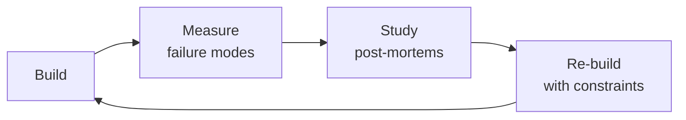

# Monorepo Manager
> **Portability target:** Spec-level (runs on Claude Code, Copilot, Gemini CLI, Codex, Cursor). No vendor-specific frontmatter fields.

Veteran's playbook for designing, configuring, and optimizing monorepo architectures at scale. Covers every major tool in the JS/TS ecosystem — Turborepo, Nx, pnpm workspaces, Bazel, Lerna, and Rush — plus repository structure, build orchestration, dependency governance, CI/CD, versioning, and polyrepo migration.

## Route the Request

<!-- QUICK: 30s -- auto-route first, then intent-route -->

### Auto-Route (No User Input Required)
Evaluate these file-system conditions in order. First match wins — jump immediately.

| # | Condition | Action |
|---|-----------|--------|
| A1 | `file_exists("pnpm-workspace.yaml")` OR `file_exists("lerna.json")` OR `file_exists("nx.json")` OR `file_exists("turbo.json")` OR `file_exists("rush.json")` OR `file_contains("package.json", "\"workspaces\"")` | This is your skill. Jump to **Core Workflow** — Phase 1. |
| A2 | `file_exists("turbo.json")` AND `file_contains("turbo.json", "\"dependsOn\"\|\"outputs\"\|\"inputs\"")` | Jump to **Sub-Skills** — Build Orchestration (pipeline config). |
| A3 | `file_exists("pnpm-workspace.yaml")` AND `file_contains("pnpm-workspace.yaml", "packages:")` AND NOT `file_exists("turbo.json\|nx.json")` | Jump to **Decision Trees** — Tool Selection (need build orchestrator). |
| A4 | `file_contains(".github/workflows/*.yml", "affected\|--filter=\|nx affected")` | Jump to **Sub-Skills** — CI/CD for Monorepos. |
| A5 | `file_exists(".changeset/config.json")` OR `file_contains("package.json", "\"@changesets/cli\"")` | Jump to **Sub-Skills** — Versioning & Release. |
| A6 | `file_contains("package.json", "\"syncpack\"\|\"manypkg\"\|\"check-dependency-version-consistency\"")` OR `file_contains(".eslintrc*", "import/no-restricted-paths\|\"@nx/enforce-module-boundaries\"")` | Jump to **Sub-Skills** — Dependency Governance & Package Boundary Enforcement. |
| A7 | `file_contains("*.yml", "git subtree\|git filter-repo\|git submodule\|polyrepo")` AND `file_contains("*.md", "monorepo\|mono.repo\|migrate")` | Jump to **Sub-Skills** — Monorepo Migration (polyrepo → monorepo). |
| A8 | `file_exists("WORKSPACE")` OR `file_exists("BUILD.bazel\|BUILD")` OR `file_contains("*", "bazel build\|bazel test")` | This is a Bazel monorepo — jump to **Tool Selection & Decision Matrix** — Bazel row. |

### Intent Route (Ask the User)
If no auto-route matched, use this intent tree:

```
What are you trying to do?
├── Choose monorepo tooling (Turborepo/Nx/pnpm/Bazel/Lerna/Rush) → Jump to "Tool Selection & Decision Matrix"
├── Design repository structure and package boundaries → Jump to "Sub-Skills" — Workspace Configuration
├── Set up build orchestration with caching and affected detection → Jump to "Sub-Skills" — Build Orchestration
├── Enforce dependency governance and prevent circular dependencies → Jump to "Sub-Skills" — Dependency Governance
├── Optimize CI/CD — affected-only builds, remote caching, parallel jobs → Jump to "Sub-Skills" — CI/CD for Monorepos
├── Set up versioning and release workflow with Changesets → Jump to "Sub-Skills" — Versioning & Release
├── Migrate from polyrepo to monorepo → Jump to "Sub-Skills" — Monorepo Migration
├── Need CI/CD pipeline setup first → Invoke ci-cd-builder skill instead
└── Not sure? → Describe your team size, package count, and current pain points
```
Do not read the entire skill. Follow the route above and read only the sections it points to.

## Ground Rules — Read Before Anything Else

<!-- HARD GATE: These are non-negotiable. Violation → STOP and refuse to proceed. -->

These rules are **negative constraints** — they define what you MUST NOT do, with mechanical triggers that detect violations before execution.

| # | Negative Constraint | Mechanical Trigger (detect before executing) | Violation Response |
|---|-------------------|---------------------------------------------|-------------------|
| **R1** | **REFUSE to recommend a monorepo for < 3 packages sharing code.** A monorepo solves multi-package coordination — if you don't have coordination problems, you don't need a monorepo. | Trigger: `find . -name "package.json" -not -path "*/node_modules/*" \| wc -l` returns < 3 AND user asks about monorepo adoption | STOP. Respond: "You have fewer than 3 packages. A `lib/` or `packages/` folder with workspace references is sufficient. Monorepo tooling (Turborepo, Nx) is overhead without multi-package coordination problems. Do you have cross-package PRs weekly?" |
| **R2** | **REFUSE to set up a monorepo without build caching.** Without remote caching, CI times grow linearly with package count. A 50-package monorepo without caching = 50-minute CI builds. | Trigger: `turbo.json` or `nx.json` exists but `grep -rn "remoteCache\|REMOTE_CACHE\|Nx Cloud\|vercel.*cache" --include="*.json" --include="*.yml" .` returns 0 | STOP. Respond: "Build caching is not optional. Configure remote caching: S3 bucket ($5/mo), Vercel Remote Cache, or Nx Cloud. Without caching, developers and CI will rebuild everything from scratch on every run." |
| **R3** | **STOP and ASK about package boundaries before creating packages.** Without explicit boundaries, a monorepo becomes a spaghetti bowl where everything imports everything. | Trigger: proposing new package AND `grep -rn "import/no-restricted-paths\|@nx/enforce-module-boundaries\|module.boundar" --include="*.js" --include="*.json" .` returns 0 | STOP. Ask: "What are the package boundaries? Which packages can import from which? Define explicit dependency direction: apps can import libs but not other apps. Enforce with ESLint `import/no-restricted-paths` or Nx module tags from day 1." |
| **R4** | **DETECT and WARN about circular dependencies.** Circular deps break tree-shaking, cause runtime errors, and make dependency graphs impossible to reason about. Zero tolerance. | Trigger: `npx dpdm --circular --tree=false "packages/**/*.ts" 2>&1 \| grep -c "circle"` returns > 0 OR `npx madge --circular --extensions ts,tsx packages/` finds cycles | WARN: "Circular dependencies detected. Run `npx madge --circular --extensions ts,tsx packages/` to see them. Break cycles by extracting shared code to a lower-level package or inverting the dependency. Never merge circular deps." |
| **R5** | **DETECT and WARN about version mismatches for shared dependencies.** Two packages depending on conflicting React/TypeScript versions cause runtime errors that are nearly impossible to debug. | Trigger: `npx syncpack list-mismatches 2>&1 \| grep -c "✘"` returns > 0 OR `grep -rn "\"react\":\|\"typescript\":" packages/*/package.json \| awk -F: '{print $NF}' \| sort -u \| wc -l` returns > 1 for any shared dep | WARN: "Version mismatches found for shared dependencies. Run `npx syncpack fix-mismatches` to align versions. Add `npx syncpack list-mismatches` to CI lint step. Mismatched React versions cause 'works on my machine' bugs." |
| **R6** | **STOP and ASK before using wildcard workspace globs.** `packages/*` includes everything — test fixtures, build outputs, abandoned experiments. Every package in the workspace pays the install cost. | Trigger: `grep -rn "packages/\*\|\"packages/\*\"" pnpm-workspace.yaml\|package.json` returns a match with no `!packages/` exclusions | STOP. Ask: "Your workspace glob matches every directory. Are there test fixtures, build outputs, or abandoned packages included? Add exclusions: `!packages/e2e` and list packages explicitly if < 10." |
| **R7** | **REFUSE to migrate to a monorepo without benchmarking CI time before and after.** If migration makes CI slower for any team, the migration is NOT complete. Monorepo must make development faster, not just more centralized. | Trigger: monorepo migration proposed AND no CI benchmark data: `grep -rn "benchmark\|CI.time\|build.*before\|build.*after" migration-plan.md \| wc -l` returns 0 | STOP. Respond: "Benchmark before migration: `git clone`, install, build, test for each repo. Set targets for the monorepo: clone < 90s, install < 60s, affected build < 3min. Migration isn't done until CI is FASTER than before." |

## The Expert's Mindset

Masters of monorepo manager don't just build — they build **the right thing, at the right time, with the right trade-offs**. They think in systems, not tasks.

| Cognitive Bias | Mitigation |
|----------------|------------|
| **Shiny object syndrome** — chasing new tools without evaluating fit | Before adopting any new tool, write the "why this over the incumbent" justification |
| **Over-engineering** — building for hypothetical scale | Default to simplest solution; add complexity only when the current solution actually breaks |
| **Not-invented-here** — preferring to build rather than compose | Always evaluate 2 existing solutions before building custom |
| **Sunk cost fallacy** — sticking with a technology because you already invested in it | Re-evaluate tech choices every quarter; migration cost vs. staying cost |

### What Masters Know That Others Don't
- The **failure modes** of every component in their stack — not just the happy path
- When **not** to use their favorite tool (every tool has a misuse zone)
- That **data/model quality decays over time** — monitoring is not optional, it's foundational

### When to Break Your Own Rules
- **Move fast on reversible decisions.** Data format? Hard to change. Dashboard layout? Easy. Know the difference.
- **Skip the abstraction until the third use case.** Two is coincidence, three is a pattern.

## Operating at Different Levels

| Level | Scope | You... |
|-------|-------|--------|
| **L1** | Single component/module | Implement a well-defined piece following established patterns |
| **L2** | Feature or service | Design and build a complete feature; make tech choices within team conventions |
| **L3** | System or product area | Define architecture for a product area; set team tech standards; mentor L1-L2 |
| **L4** | Multiple systems / platform | Define org-wide architecture patterns; make build-vs-buy decisions; influence industry practice |
| **L5** | Industry / ecosystem | Create new architectural patterns adopted across the industry; redefine what's possible |

**Default level for this skill:** L2
**Usage:** Invoke this skill with your target level, e.g., "as an L3 monorepo manager, design..."

For full level definitions, see `skills/00-framework/skill-levels/SKILL.md`.

## When to Use

- You are choosing a monorepo tool (Turborepo vs. Nx vs. Bazel vs. pnpm workspaces) and need a comparison matrix
- You need to configure build orchestration — task pipelines, caching, parallel execution, and affected detection
- Your monorepo CI is slow and you need to set up remote caching, incremental builds, and matrix-based pipelines
- You are enforcing dependency governance — version consistency, hoisting rules, and peer dependency resolution
- You need to detect and prevent circular dependencies or enforce package boundary rules between modules
- You are setting up versioning and release workflows with Changesets, independent versioning, and changelog generation
- You are migrating from polyrepo to monorepo and need a strategy for history preservation and gradual adoption
- Your monorepo has grown to 50+ packages and you need to refactor the structure, tooling, or dependency graph


### Cross-skills Integration

| Step | Skill | What it produces |
|------|-------|------------------|
| **Before** | system-architect | Software architecture, module boundaries, dependency graph, technology stack decisions |
| **This** | monorepo-manager | Repository structure, build orchestration config, dependency governance rules, CI/CD pipeline |
| **After** | ci-cd-builder | Optimized CI pipelines with caching, affected detection, and parallel builds |

Common chains:
- **Chain**: system-architect → monorepo-manager → ci-cd-builder — Architect defines module boundaries; monorepo manager implements them in tooling; CI/CD builder optimizes the pipeline.
- **Chain**: devops-engineer → monorepo-manager → frontend-developer — DevOps provisions infrastructure; monorepo manager configures the workspace; frontend dev benefits from shared tooling and fast builds.

## Decision Trees

<!-- QUICK: 30s -- follow the ASCII tree to your scenario -->
### 1. Monorepo Tool Selection
```
                     ┌────────────────────────┐
                     │ START: What's your     │
                     │ primary stack?         │
                     └───────────┬────────────┘
                                 │
          ┌──────────────────────┼──────────────────────┐
          │                      │                      │
    ┌─────▼──────┐       ┌───────▼───────┐       ┌──────▼──────────┐
    │ JavaScript │       │ Polyglot      │       │ Mobile + Web    │
    │ / Type-    │       │ (JS + Python  │       │ (React Native   │
    │ Script     │       │ + Go + etc.)  │       │ + Web)          │
    └─────┬──────┘       └───────┬───────┘       └──────┬──────────┘
          │                      │                      │
    ┌─────▼──────────┐   ┌───────▼───────┐       ┌──────▼──────────┐
    │ <15 packages?  │   │ Bazel or      │       │ Nx with         │
    └──┬─────────┬───┘   │ Pantsbuild.   │       │ @nx/react-native│
       │YES      │NO     │ Best for      │       │ + @nx/web.      │
  ┌────▼────┐ ┌──▼─────┐ │ multi-lang    │       │ Excellent       │
  │ pnpm    │ │ Turbore│ │ + monorepo.   │       │ React Native    │
  │ works-  │ │ po or  │ └───────────────┘       │ monorepo        │
  │ paces   │ │ Nx     │                         │ support.        │
  └─────────┘ └────────┘                         └─────────────────┘
```
**pnpm workspaces alone:** <15 packages, simple dependency graph, no build orchestration needed.  
**Turborepo:** JS/TS, need parallel task execution + caching. Lighter than Nx.  
**Nx:** JS/TS, need generators, plugin ecosystem, advanced affected detection, or mobile+web.  
**Bazel/Pants:** Polyglot (JS + Python + Go + Rust), large org, need reproducible builds.

### 2. Package Boundary Decision
```
                  ┌──────────────────────────┐
                  │ START: Will this package │
                  │ be consumed externally?  │
                  └───────────┬──────────────┘
                              │
                   ┌──────────▼──────────┐
                   │ YES → Publishable   │
                   │ package. Strict API │
                   │ via `exports` field.│
                   │ Semantic versioning │
                   │ with Changesets.    │
                   └─────────────────────┘
                   ┌──────────▼──────────┐
                   │ NO → Internal-only? │
                   └────┬───────────┬────┘
                        │YES        │NO
                   ┌────▼────┐ ┌───▼──────────┐
                   │ `"private│ │ Extract to   │
                   │ ": true` │ │ separate repo│
                   │ in       │ │ with its own │
                   │ package. │ │ CI/CD +      │
                   │ json.    │ │ release cycle│
                   │ No semver│ └──────────────┘
                   │ needed.  │
                   └──────────┘
```
**Published externally → strict `exports` field, semver, Changesets.**  
**Internal shared code → `"private": true`, no versioning overhead.**  
**Truly independent → separate repo. Don't force into monorepo if it ships independently.**

### 3. Versioning Strategy
```
                   ┌──────────────────────────┐
                   │ START: Are packages      │
                   │ coupled (always release  │
                   │ together)?               │
                   └───────────┬──────────────┘
                               │
                    ┌──────────▼──────────┐
                    │ YES → Fixed/Locked  │
                    │ versioning. Single  │
                    │ version bump for    │
                    │ all packages.        │
                    └─────────────────────┘
                    ┌──────────▼──────────┐
                    │ NO → Independent    │
                    │ versioning with     │
                    │ Changesets. Each    │
                    │ package versioned   │
                    │ by its own changes. │
                    └─────────────────────┘
```
**Fixed/Locked:** All packages share one version. Use when packages are tightly coupled (e.g., React + ReactDOM).  
**Independent with Changesets:** Each package versioned independently. Use when packages have different release cadences.

### 4. Migration Path: Polyrepo → Monorepo
```
                  ┌──────────────────────────┐
                  │ START: How many repos    │
                  │ are you merging?         │
                  └───────────┬──────────────┘
                              │
                   ┌──────────▼──────────┐
                   │ <5 repos, <500K     │
                   │ LOC total?          │
                   └────┬───────────┬────┘
                        │YES        │NO
                   ┌────▼────┐ ┌───▼──────────┐
                   │ Big-bang│ │ Gradual      │
                   │ merge   │ │ adoption:    │
                   │ over a  │ │ start with   │
                   │ weekend.│ │ shared config │
                   │ Use     │ │ + utilities. │
                   │ git-    │ │ Add packages │
                   │ subtree │ │ incrementally│
                   │ merge.  │ │ over weeks.  │
                   └─────────┘ └──────────────┘
```
**<5 repos → big-bang over a weekend.** Use subtree merge strategy to preserve history.  
**>5 repos or >500K LOC → gradual adoption.** Start with shared configs and utilities; add one repo at a time.

### 5. CI/CD Affected Detection
```
                   ┌──────────────────────────┐
                   │ START: PR changes files  │
                   │ in which packages?       │
                   └───────────┬──────────────┘
                               │
                    ┌──────────▼──────────┐
                    │ Run affected graph  │
                    │ detection (Nx       │
                    │ affected / Turborepo│
                    │ --filter)           │
                    └────┬───────────┬────┘
                         │           │
                    ┌────▼────┐ ┌───▼──────────┐
                    │ Root    │ │ Only changed │
                    │ config  │ │ packages +   │
                    │ changed?│ │ their         │
                    └──┬───┬──┘ │ dependents    │
                       │YES│NO  │ are built/    │
                  ┌────▼─┐┌▼────┐│ tested.      │
                  │ Build││Build│└──────────────┘
                  │ all  ││ only│
                  │pack- ││aff- │
                  │ ages ││ected│
                  └──────┘└─────┘
```
**Root config change (tsconfig/eslint/CI) → build ALL packages.**  
**Package-level change → build only changed + dependents. Dramatically reduces CI time.**

## Core Workflow

<!-- QUICK: 30s -- scan phase titles to understand the process -->
<!-- DEEP: 10+min -->
### Phase 1 (~15 min): Repository Setup and Tool Selection
1. Assess current state: number of packages, team size, build times, CI bottlenecks, polyglot requirements.
2. Choose toolchain using the Decision Matrix above: Turborepo (fastest setup) vs Nx (most features) vs Bazel (polyglot/hermetic).
3. Initialize workspace: `pnpm-workspace.yaml` with package globs, root `package.json` with dev tooling only.
4. Configure shared tooling: TypeScript base config, ESLint, Prettier, Jest/Vitest — all as shared packages.
5. Set up the repository structure: `apps/` for deployables, `packages/` for libraries, `tools/` for generators/scripts.

<!-- DEEP: 10+min -->
### Phase 2 (~20 min): Dependency Governance
1. Install dependencies at the correct level: framework/runtime deps in each package, dev tooling in root.
2. Configure `pnpm.overrides` or `resolutions` to force single versions of critical dependencies (React, TypeScript, etc.).
3. Run `syncpack` or `manypkg` to detect version mismatches across packages. Set up CI check.
4. Enable `strict-peer-dependencies` in `.npmrc` to catch peer dependency violations at install time.
5. Detect circular dependencies with `dpdm` or `madge`. Break cycles before they become entrenched.

<!-- DEEP: 10+min -->
### Phase 3 (~25 min): Build Orchestration and Caching
1. Design the task pipeline: `turbo.json` or `nx.json` with `dependsOn` topology (e.g., `build` depends on `^build`).
2. Configure remote caching: Vercel (Turborepo), Nx Cloud, or S3-backed custom cache. This is the #1 CI speedup.
3. Set up local caching: enable filesystem cache in CI with restore/save pattern. Use `--cache-dir` for CI isolation.
4. Define `outputs` per task: `.next/**`, `dist/**`, `coverage/**`. Without outputs defined, caching doesn't work.
5. Measure: `turbo run build --dry-run=json` or `nx graph` to verify task topology before committing.

<!-- DEEP: 10+min -->
### Phase 4 (~20 min): CI/CD Pipeline
1. Implement affected detection: `--filter=[base...HEAD]` in CI to only build/test changed packages.
2. Configure GitHub Actions matrix builds: spawn one job per affected package, converge for integration tests.
3. Set up cache warming: build `main` branch on push to warm the remote cache for all PRs.
4. Add dependency boundary checks: `@nx/enforce-module-boundaries` or ESLint `import/no-restricted-paths`.
5. Implement merge queue: require green CI on all affected packages before merge. No "skip CI" on monorepo PRs.

<!-- DEEP: 10+min -->
### Phase 5 (~15 min): Versioning and Release
1. Choose versioning strategy: independent (each package versions separately) vs fixed (all packages share one version).
2. Set up Changesets: `@changesets/cli` for changelog generation, version bumping, and publishing.
3. Configure release workflow: GitHub Action that runs `changeset version` on merge to main, creates Release PR.
4. Publish to registry: `changeset publish` with `--no-private` to skip non-publishable packages.
5. Automate changelog: link to PRs, categorize changes (feat/fix/breaking), notify affected teams.

## Cross-Skill Coordination

<!-- QUICK: 30s -- table of who to talk to when -->
Monorepo management touches every development team. A monorepo tooling change affects everyone's daily workflow — coordination isn't optional.

### Decision Gates & Artifacts

- **Gate 1 — Infrastructure Ready:** Monorepo tooling requires CI/CD infrastructure and caching layers provisioned by `devops-engineer`. Artifact: infrastructure readiness checklist.
- **Gate 2 — CI/CD Pipeline Defined:** Build orchestration depends on pipeline configuration from `ci-cd-builder`. Artifact: turbo.json or nx.json with task pipelines.
- **Gate 3 — Project Structures Defined:** Workspace configuration requires backend and frontend project structures from `backend-developer` and `frontend-developer`. Artifact: workspace boundary map.
- **Gate 4 — Dependency Governance Enforced:** Package boundaries and dependency rules validated across all consumer teams. Artifact: dependency graph audit with zero circular deps.
- **Artifact:** Monorepo tooling selection rationale, workspace configuration (pnpm-workspace.yaml, turbo.json), dependency graph visualization.

| Coordinate With | When | What to Share/Ask |
|-----------------|------|-------------------|
| **All Frontend Teams** | Shared package updates, workspace changes, build config | Package version bumps, breaking changes in shared libs, workspace dependency rules |
| **All Backend Teams** | Shared service libraries, protobuf/gRPC schemas, database migrations | Shared library API changes, schema evolution, cross-service contract tests |
| **DevOps / Platform Team** | CI/CD pipeline, build caching, deployment orchestration | Build graph changes, cache invalidation rules, affected projects detection |
| **System Architect** | Repository boundaries, module extraction, dependency direction | Module ownership, dependency rules (e.g., no circular deps), extraction candidates |
| **CTO Advisor** | Monorepo vs polyrepo strategy, tooling investment | Tooling ROI, developer experience metrics, migration feasibility |
| **Security Reviewer** | Dependency scanning, vulnerability management, access control | CODEOWNERS rules, dependency audit strategy, secret detection scope |
| **QA Engineer** | Test orchestration, affected test detection, integration testing | Test dependency graph, affected test selection, cross-service integration test scope |
| **Developer Experience (DX)** | Local development setup, IDE integration, onboarding | Workspace setup time, hot reload experience, IDE project configuration |
| **Project Manager** | Migration timelines, team impact, rollout coordination | Sprint impact assessment, migration milestones, team communication plan |

### Communication Triggers — When to Proactively Notify

| Trigger | Notify | Why |
|---------|--------|-----|
| Shared package major version bump (breaking change) | All Teams, System Architect | All consumers must update; migration guide needed |
| Build cache invalidation (full rebuild required for all projects) | DevOps, All Teams | CI times spike 5-10x; communicate expected duration |
| New workspace or project added to monorepo | DevOps, QA, DX | CI pipeline update, CODEOWNERS, test suite registration |
| Dependency vulnerability in shared package (Critical/High) | Security Reviewer, All Consumer Teams | Patch + propagation timeline; all consumers affected |
| Monorepo tool migration (e.g., Lerna → Nx, Yarn → pnpm) | All Teams, DevOps, DX, CTO Advisor | Breaking workflow change; requires training and migration window |
| Circular dependency detected between workspaces | System Architect, Affected Teams | Architecture violation; refactor or dependency rule change needed |
| Build times increase by >50% for any pipeline | DevOps, DX, Engineering Leads | Developer productivity impact; build optimization investigation |
| Flaky test rate exceeds 5% in shared packages | QA, All Consumer Teams | CI trust eroding; test quarantine or fix required |

### Escalation Path

| Situation | Escalate To | Rationale |
|-----------|------------|-----------|
| Monorepo tooling causing >1 hour/day developer productivity loss | **CTO Advisor** + VP Engineering | Developer experience crisis; tooling investment or polyrepo evaluation |
| Tight coupling creating "distributed monolith" across packages | **System Architect** + CTO Advisor | Architecture degradation; bounded context enforcement needed |
| Build/deploy times exceeding business SLAs (e.g., >30 min to production) | **DevOps Lead** + CTO Advisor | CI/CD bottleneck; infrastructure or architecture investment needed |
| Proposal to split monorepo into polyrepo | **CTO Advisor** + System Architect + All Team Leads | Strategic architecture decision; 3-6 month migration impact |
| License compliance issue in shared dependency | **Legal Advisor** + Security Reviewer | Legal risk; may require dependency removal or legal review |

## Proactive Triggers

<!-- QUICK: 30s — when to proactively notify stakeholders -->

| Trigger | Notify | Why |
|---------|--------|-----|
| Circular dependency detected by CI lint step | System Architect, Affected Package Owners | Build-breaking architecture violation; immediate refactor required |
| Build times increase >30% in any pipeline week-over-week | DevOps, DX, Engineering Leads | Developer productivity degradation; cache or pipeline investigation needed |
| Shared package release with breaking change (major version bump) | All Consumer Teams, System Architect | Migration guide needed; all consumers must update imports/APIs |
| Dependency version conflict between two workspaces (different React/TypeScript versions) | Affected Teams, DX | Runtime errors possible; syncpack override or version alignment required |
| Flaky test rate exceeds 5% in shared package test suite | QA, Package Owners | CI trust eroding; test quarantine, fix, or removal decision needed |
| Orphan package detected (zero consumers, zero imports) | Package Owner, System Architect | Unmaintained code in repo; removal or documentation of purpose required |
| Monorepo tool migration proposed (Lerna→Nx, Yarn→pnpm) | All Teams, DevOps, DX, CTO Advisor | 2-4 week migration window; training, CI reconfiguration, and workflow changes needed |

## What Good Looks Like

> When monorepo management is optimized, CI only builds and tests packages affected by each change, remote caching delivers sub-5-minute CI for most PRs, circular dependencies are caught at lint time with zero tolerance, package boundaries are enforced so teams own their domains without friction, dependency versions are kept consistent across all packages, and new developers scaffold a working dev environment in under 10 minutes — the monorepo is a force multiplier, not a bottleneck.

## Deliberate Practice



| Level | Practice | Frequency |
|-------|----------|-----------|
| **Novice** | Rebuild an existing system from scratch, then compare your design with the original | Monthly |
| **Competent** | Add a new constraint (10x data, zero downtime, etc.) to a familiar design and re-architect | Quarterly |
| **Expert** | Design the same system under 3 conflicting constraint sets; write a decision record for each | Quarterly |
| **Master** | Teach a junior to design a system; your role is to ask questions, not give answers | Monthly |

**The One Highest-Leverage Activity:** Every quarter, take a system you built 6+ months ago and redesign it from scratch with what you know now. Write down what changed and why.

## References
- **Build System & CI/CD**: See [build-system-&-ci-cd.md](references/build-system-&-ci-cd.md)
- **Dependency Management & Package Architecture**: See [dependency-management-&-package-architecture.md](references/dependency-management-&-package-architecture.md)
- **Repository Structure**: See [repository-structure.md](references/repository-structure.md)
- **Tool Selection & Decision Matrix**: See [tool-selection-&-decision-matrix.md](references/tool-selection-&-decision-matrix.md)
